# Opinion Poll by Megafon for Politiken and TV 2, 29 April–2 May 2019

<a href="#voting-intentions">Voting Intentions</a> | <a href="#seats">Seats</a> | <a href="#coalitions">Coalitions</a> | <a href="#technical-information">Technical Information</a>

## Voting Intentions

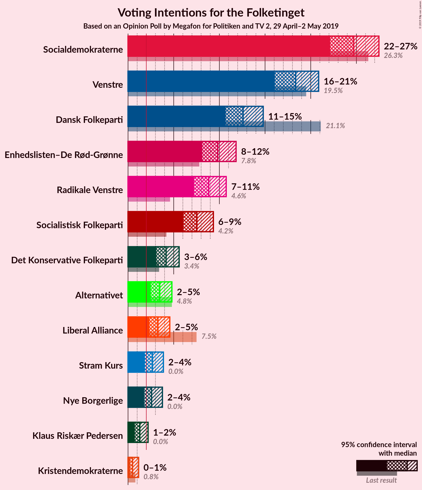

### Confidence Intervals

| Party | Last Result | Poll Result | 80% Confidence Interval | 90% Confidence Interval | 95% Confidence Interval | 99% Confidence Interval |
|:-----:|:-----------:|:-----------:|:-----------------------:|:-----------------------:|:-----------------------:|:-----------------------:|
| Socialdemokraterne | 26.3% | 24.7% | 23.0–26.5% |22.5–27.0% |22.1–27.5% |21.4–28.3% |
| Venstre | 19.5% | 18.4% | 16.9–20.0% |16.4–20.5% |16.1–20.9% |15.4–21.7% |
| Dansk Folkeparti | 21.1% | 12.6% | 11.3–14.0% |11.0–14.4% |10.7–14.8% |10.1–15.5% |
| Enhedslisten–De Rød-Grønne | 7.8% | 9.8% | 8.7–11.1% |8.4–11.5% |8.1–11.8% |7.6–12.5% |
| Radikale Venstre | 4.6% | 8.8% | 7.8–10.1% |7.5–10.4% |7.2–10.7% |6.8–11.4% |
| Socialistisk Folkeparti | 4.2% | 7.5% | 6.6–8.7% |6.3–9.1% |6.1–9.3% |5.6–9.9% |
| Det Konservative Folkeparti | 3.4% | 4.2% | 3.5–5.1% |3.3–5.4% |3.1–5.6% |2.8–6.1% |
| Alternativet | 4.8% | 3.5% | 2.8–4.3% |2.7–4.6% |2.5–4.8% |2.2–5.2% |
| Liberal Alliance | 7.5% | 3.3% | 2.7–4.1% |2.5–4.4% |2.3–4.6% |2.1–5.0% |
| Stram Kurs | 0.0% | 2.7% | 2.1–3.5% |2.0–3.7% |1.8–3.9% |1.6–4.3% |
| Nye Borgerlige | 0.0% | 2.6% | 2.0–3.4% |1.9–3.6% |1.8–3.8% |1.5–4.2% |
| Klaus Riskær Pedersen | 0.0% | 1.3% | 0.9–1.9% |0.8–2.0% |0.7–2.2% |0.6–2.5% |
| Kristendemokraterne | 0.8% | 0.5% | 0.3–0.9% |0.3–1.1% |0.2–1.2% |0.2–1.4% |

*Note:* The poll result column reflects the actual value used in the calculations. Published results may vary slightly, and in addition be rounded to fewer digits.

## Seats

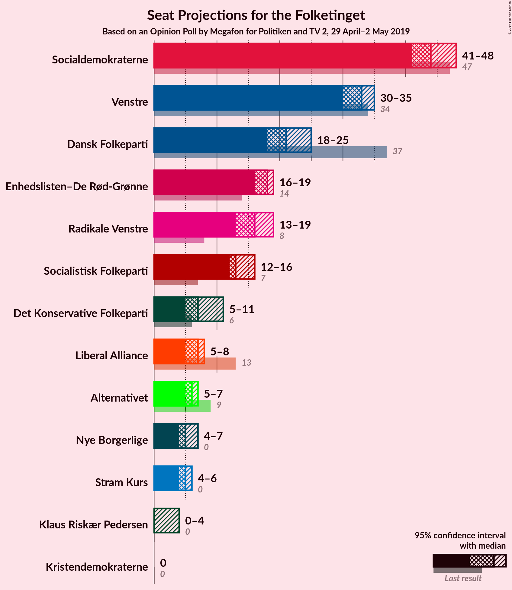

### Confidence Intervals

| Party | Last Result | Median | 80% Confidence Interval | 90% Confidence Interval | 95% Confidence Interval | 99% Confidence Interval |
|:-----:|:-----------:|:------:|:-----------------------:|:-----------------------:|:-----------------------:|:-----------------------:|
| <a href="#socialdemokraterne">Socialdemokraterne</a> | 47 | 44 | 41–44 |41–46 |41–48 |38–48 |
| <a href="#venstre">Venstre</a> | 34 | 33 | 31–33 |31–34 |30–35 |29–37 |
| <a href="#dansk-folkeparti">Dansk Folkeparti</a> | 37 | 21 | 21–24 |19–24 |18–25 |18–26 |
| <a href="#enhedslisten–de-rød-grønne">Enhedslisten–De Rød-Grønne</a> | 14 | 18 | 17–18 |16–19 |16–19 |15–22 |
| <a href="#radikale-venstre">Radikale Venstre</a> | 8 | 16 | 15–19 |14–19 |13–19 |12–19 |
| <a href="#socialistisk-folkeparti">Socialistisk Folkeparti</a> | 7 | 13 | 13–14 |12–14 |12–16 |11–17 |
| <a href="#det-konservative-folkeparti">Det Konservative Folkeparti</a> | 6 | 7 | 6–11 |5–11 |5–11 |5–11 |
| <a href="#alternativet">Alternativet</a> | 9 | 6 | 6–7 |5–7 |5–7 |4–9 |
| <a href="#liberal-alliance">Liberal Alliance</a> | 13 | 7 | 6–7 |5–7 |5–8 |4–9 |
| <a href="#stram-kurs">Stram Kurs</a> | 0 | 5 | 4–5 |4–6 |4–6 |0–7 |
| <a href="#nye-borgerlige">Nye Borgerlige</a> | 0 | 5 | 4–6 |4–6 |4–7 |0–7 |
| <a href="#klaus-riskær-pedersen">Klaus Riskær Pedersen</a> | 0 | 0 | 0 |0 |0–4 |0–4 |
| <a href="#kristendemokraterne">Kristendemokraterne</a> | 0 | 0 | 0 |0 |0 |0 |

### Socialdemokraterne

*For a full overview of the results for this party, see the [Socialdemokraterne](party-socialdemokraterne.html) page.*

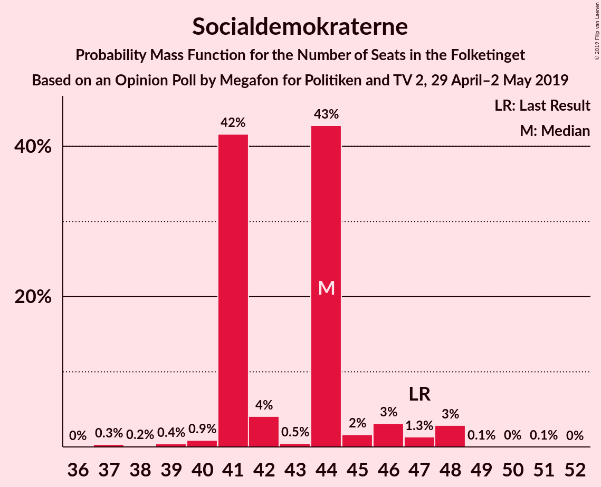

| Number of Seats | Probability | Accumulated | Special Marks |
|:---------------:|:-----------:|:-----------:|:-------------:|
| 37 | 0.3% | 100% |  |
| 38 | 0.2% | 99.6% |  |
| 39 | 0.4% | 99.5% |  |
| 40 | 0.9% | 99.1% |  |
| 41 | 42% | 98% |  |
| 42 | 4% | 57% |  |
| 43 | 0.5% | 52% |  |
| 44 | 43% | 52% | Median |
| 45 | 2% | 9% |  |
| 46 | 3% | 8% |  |
| 47 | 1.3% | 4% | Last Result |
| 48 | 3% | 3% |  |
| 49 | 0.1% | 0.2% |  |
| 50 | 0% | 0.1% |  |
| 51 | 0.1% | 0.1% |  |
| 52 | 0% | 0% |  |

### Venstre

*For a full overview of the results for this party, see the [Venstre](party-venstre.html) page.*

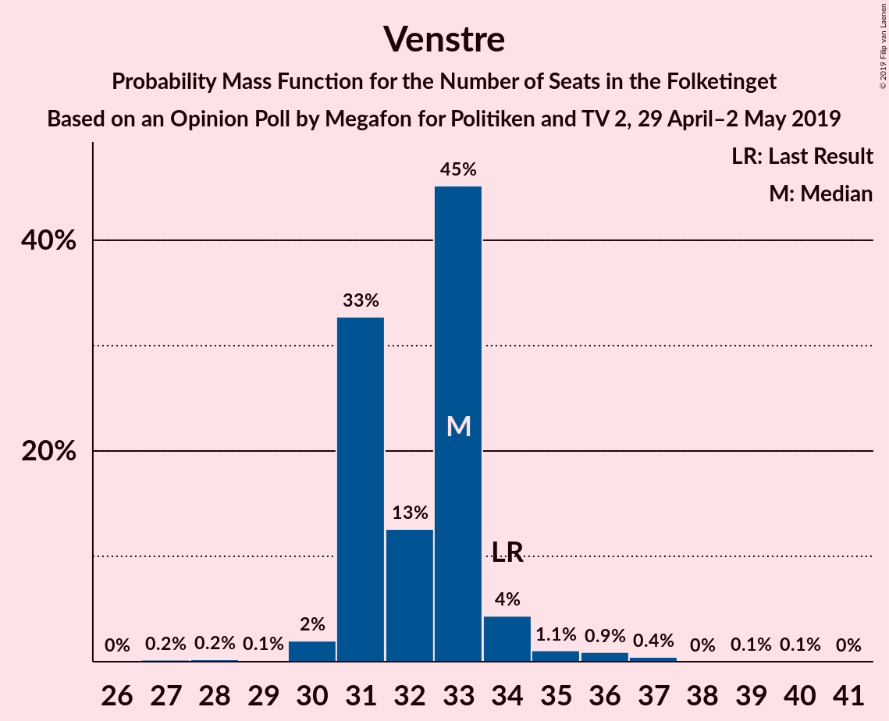

| Number of Seats | Probability | Accumulated | Special Marks |
|:---------------:|:-----------:|:-----------:|:-------------:|
| 27 | 0.2% | 100% |  |
| 28 | 0.2% | 99.8% |  |
| 29 | 0.1% | 99.6% |  |
| 30 | 2% | 99.4% |  |
| 31 | 33% | 97% |  |
| 32 | 13% | 65% |  |
| 33 | 45% | 52% | Median |
| 34 | 4% | 7% | Last Result |
| 35 | 1.1% | 3% |  |
| 36 | 0.9% | 2% |  |
| 37 | 0.4% | 0.6% |  |
| 38 | 0% | 0.2% |  |
| 39 | 0.1% | 0.2% |  |
| 40 | 0.1% | 0.1% |  |
| 41 | 0% | 0% |  |

### Dansk Folkeparti

*For a full overview of the results for this party, see the [Dansk Folkeparti](party-danskfolkeparti.html) page.*

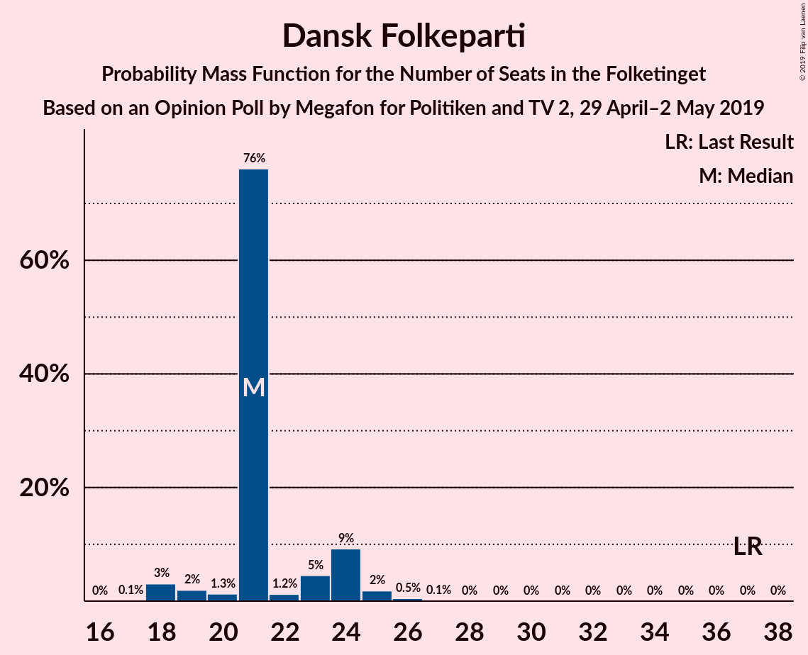

| Number of Seats | Probability | Accumulated | Special Marks |
|:---------------:|:-----------:|:-----------:|:-------------:|
| 17 | 0.1% | 100% |  |
| 18 | 3% | 99.9% |  |
| 19 | 2% | 97% |  |
| 20 | 1.3% | 95% |  |
| 21 | 76% | 94% | Median |
| 22 | 1.2% | 18% |  |
| 23 | 5% | 16% |  |
| 24 | 9% | 12% |  |
| 25 | 2% | 3% |  |
| 26 | 0.5% | 0.7% |  |
| 27 | 0.1% | 0.2% |  |
| 28 | 0% | 0% |  |
| 29 | 0% | 0% |  |
| 30 | 0% | 0% |  |
| 31 | 0% | 0% |  |
| 32 | 0% | 0% |  |
| 33 | 0% | 0% |  |
| 34 | 0% | 0% |  |
| 35 | 0% | 0% |  |
| 36 | 0% | 0% |  |
| 37 | 0% | 0% | Last Result |

### Enhedslisten–De Rød-Grønne

*For a full overview of the results for this party, see the [Enhedslisten–De Rød-Grønne](party-enhedslisten–derød-grønne.html) page.*

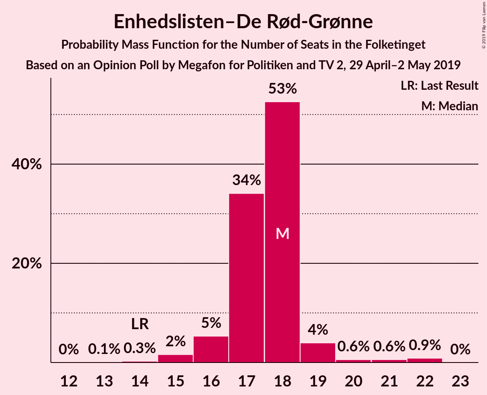

| Number of Seats | Probability | Accumulated | Special Marks |
|:---------------:|:-----------:|:-----------:|:-------------:|
| 13 | 0.1% | 100% |  |
| 14 | 0.3% | 99.9% | Last Result |
| 15 | 2% | 99.6% |  |
| 16 | 5% | 98% |  |
| 17 | 34% | 93% |  |
| 18 | 53% | 59% | Median |
| 19 | 4% | 6% |  |
| 20 | 0.6% | 2% |  |
| 21 | 0.6% | 1.5% |  |
| 22 | 0.9% | 0.9% |  |
| 23 | 0% | 0% |  |

### Radikale Venstre

*For a full overview of the results for this party, see the [Radikale Venstre](party-radikalevenstre.html) page.*

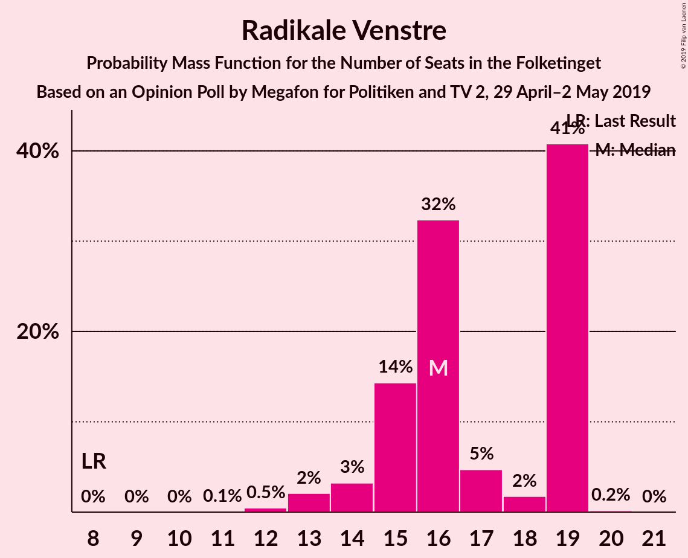

| Number of Seats | Probability | Accumulated | Special Marks |
|:---------------:|:-----------:|:-----------:|:-------------:|
| 8 | 0% | 100% | Last Result |
| 9 | 0% | 100% |  |
| 10 | 0% | 100% |  |
| 11 | 0.1% | 100% |  |
| 12 | 0.5% | 99.9% |  |
| 13 | 2% | 99.5% |  |
| 14 | 3% | 97% |  |
| 15 | 14% | 94% |  |
| 16 | 32% | 80% | Median |
| 17 | 5% | 47% |  |
| 18 | 2% | 43% |  |
| 19 | 41% | 41% |  |
| 20 | 0.2% | 0.2% |  |
| 21 | 0% | 0% |  |

### Socialistisk Folkeparti

*For a full overview of the results for this party, see the [Socialistisk Folkeparti](party-socialistiskfolkeparti.html) page.*

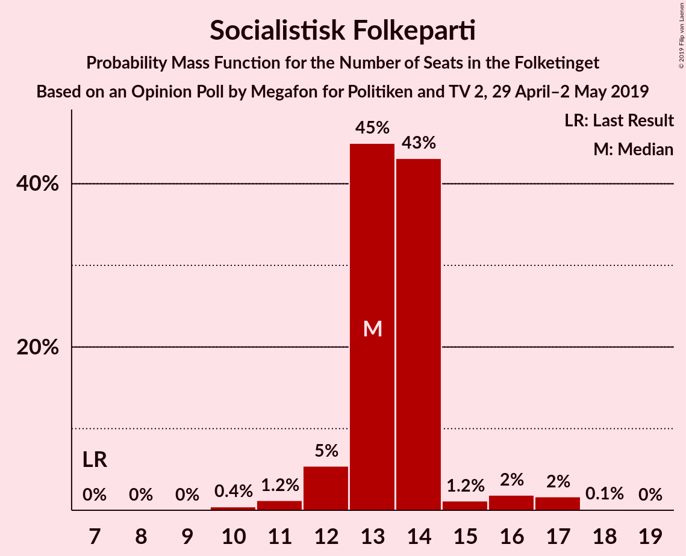

| Number of Seats | Probability | Accumulated | Special Marks |
|:---------------:|:-----------:|:-----------:|:-------------:|
| 7 | 0% | 100% | Last Result |
| 8 | 0% | 100% |  |
| 9 | 0% | 100% |  |
| 10 | 0.4% | 100% |  |
| 11 | 1.2% | 99.6% |  |
| 12 | 5% | 98% |  |
| 13 | 45% | 93% | Median |
| 14 | 43% | 48% |  |
| 15 | 1.2% | 5% |  |
| 16 | 2% | 4% |  |
| 17 | 2% | 2% |  |
| 18 | 0.1% | 0.2% |  |
| 19 | 0% | 0% |  |

### Det Konservative Folkeparti

*For a full overview of the results for this party, see the [Det Konservative Folkeparti](party-detkonservativefolkeparti.html) page.*

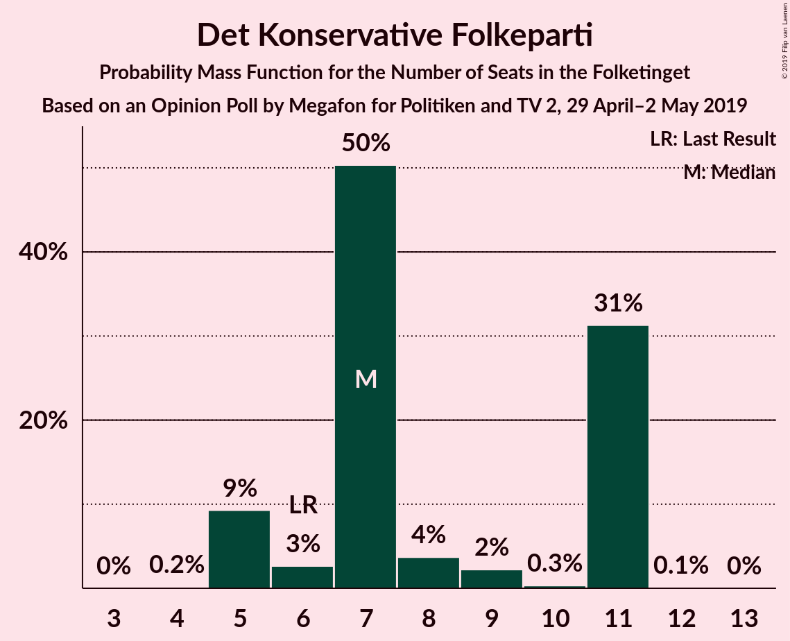

| Number of Seats | Probability | Accumulated | Special Marks |
|:---------------:|:-----------:|:-----------:|:-------------:|
| 4 | 0.2% | 100% |  |
| 5 | 9% | 99.8% |  |
| 6 | 3% | 91% | Last Result |
| 7 | 50% | 88% | Median |
| 8 | 4% | 38% |  |
| 9 | 2% | 34% |  |
| 10 | 0.3% | 32% |  |
| 11 | 31% | 31% |  |
| 12 | 0.1% | 0.1% |  |
| 13 | 0% | 0% |  |

### Alternativet

*For a full overview of the results for this party, see the [Alternativet](party-alternativet.html) page.*

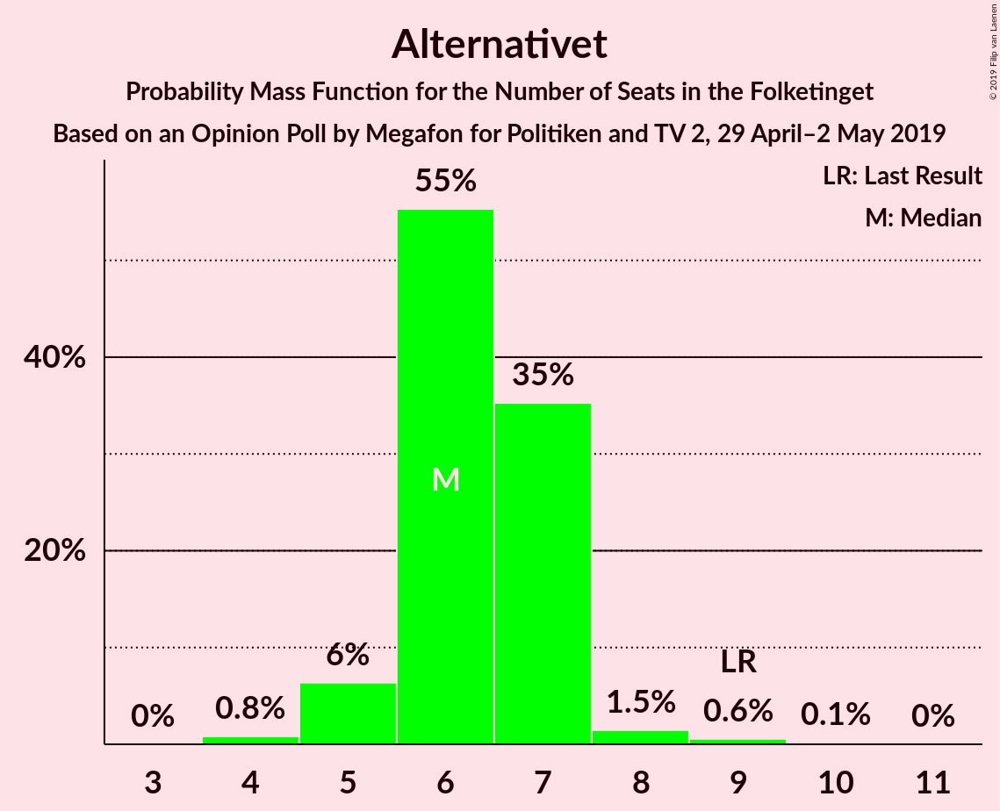

| Number of Seats | Probability | Accumulated | Special Marks |
|:---------------:|:-----------:|:-----------:|:-------------:|
| 4 | 0.8% | 100% |  |
| 5 | 6% | 99.2% |  |
| 6 | 55% | 93% | Median |
| 7 | 35% | 37% |  |
| 8 | 1.5% | 2% |  |
| 9 | 0.6% | 0.7% | Last Result |
| 10 | 0.1% | 0.2% |  |
| 11 | 0% | 0% |  |

### Liberal Alliance

*For a full overview of the results for this party, see the [Liberal Alliance](party-liberalalliance.html) page.*

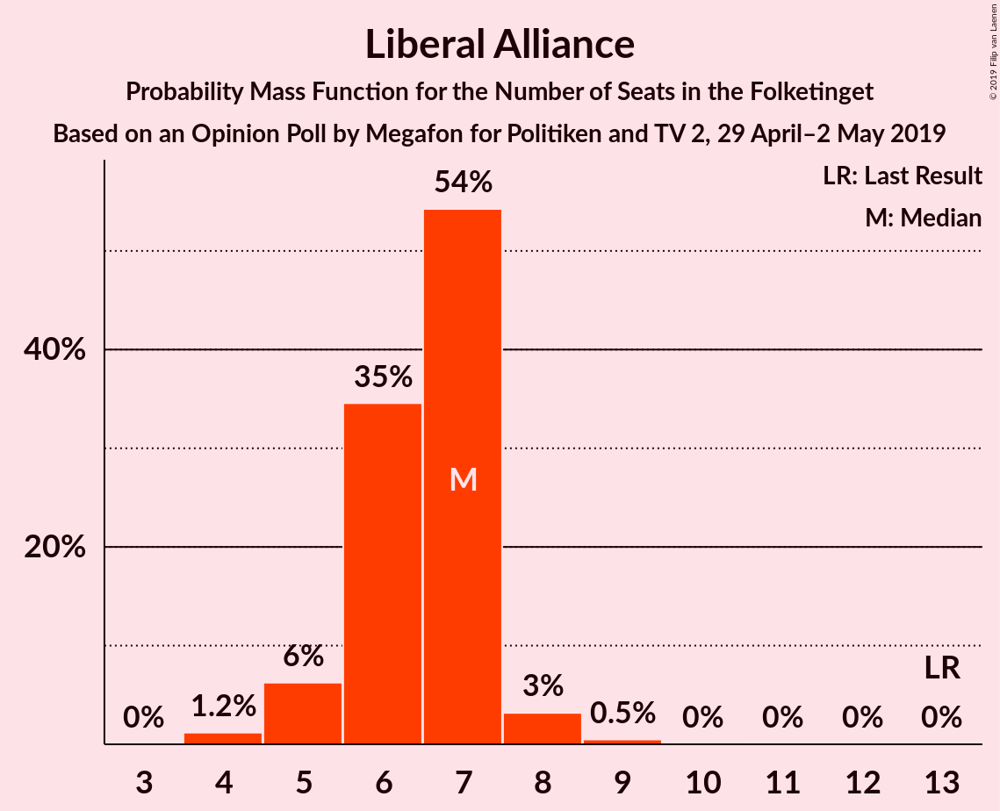

| Number of Seats | Probability | Accumulated | Special Marks |
|:---------------:|:-----------:|:-----------:|:-------------:|
| 4 | 1.2% | 100% |  |
| 5 | 6% | 98.8% |  |
| 6 | 35% | 93% |  |
| 7 | 54% | 58% | Median |
| 8 | 3% | 4% |  |
| 9 | 0.5% | 0.5% |  |
| 10 | 0% | 0% |  |
| 11 | 0% | 0% |  |
| 12 | 0% | 0% |  |
| 13 | 0% | 0% | Last Result |

### Stram Kurs

*For a full overview of the results for this party, see the [Stram Kurs](party-stramkurs.html) page.*

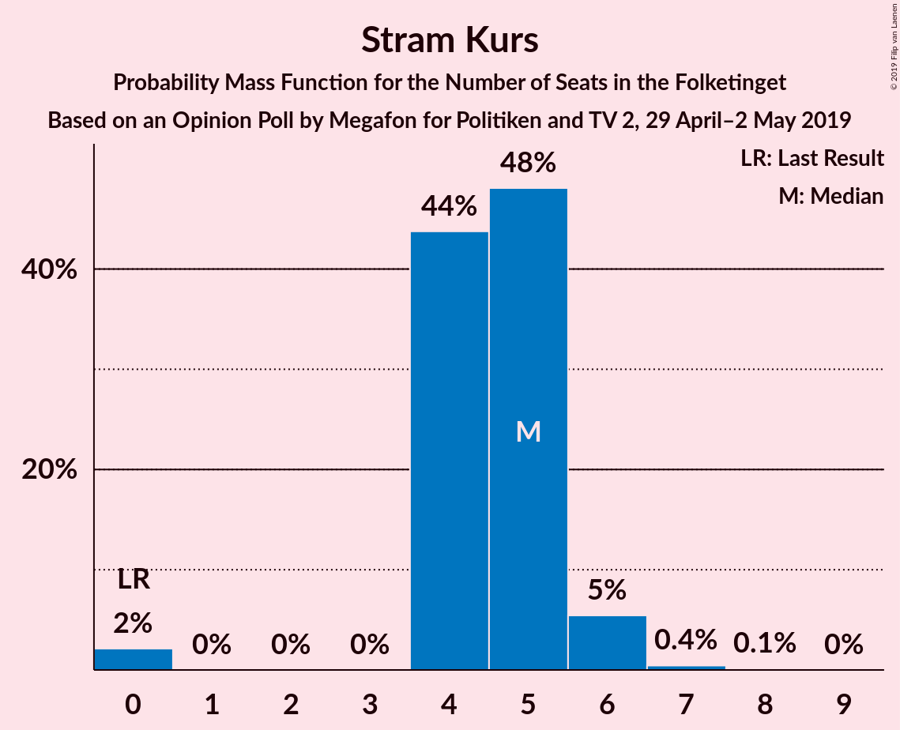

| Number of Seats | Probability | Accumulated | Special Marks |
|:---------------:|:-----------:|:-----------:|:-------------:|
| 0 | 2% | 100% | Last Result |
| 1 | 0% | 98% |  |
| 2 | 0% | 98% |  |
| 3 | 0% | 98% |  |
| 4 | 44% | 98% |  |
| 5 | 48% | 54% | Median |
| 6 | 5% | 6% |  |
| 7 | 0.4% | 0.6% |  |
| 8 | 0.1% | 0.1% |  |
| 9 | 0% | 0% |  |

### Nye Borgerlige

*For a full overview of the results for this party, see the [Nye Borgerlige](party-nyeborgerlige.html) page.*

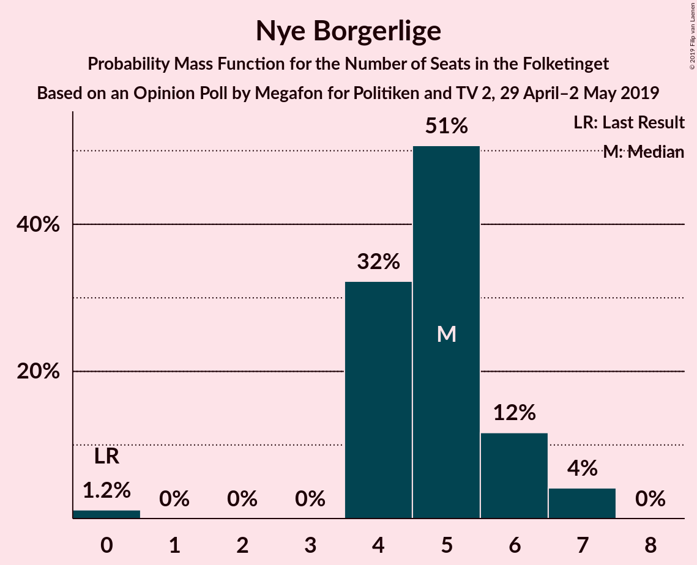

| Number of Seats | Probability | Accumulated | Special Marks |
|:---------------:|:-----------:|:-----------:|:-------------:|
| 0 | 1.2% | 100% | Last Result |
| 1 | 0% | 98.8% |  |
| 2 | 0% | 98.8% |  |
| 3 | 0% | 98.8% |  |
| 4 | 32% | 98.8% |  |
| 5 | 51% | 67% | Median |
| 6 | 12% | 16% |  |
| 7 | 4% | 4% |  |
| 8 | 0% | 0% |  |

### Klaus Riskær Pedersen

*For a full overview of the results for this party, see the [Klaus Riskær Pedersen](party-klausriskærpedersen.html) page.*

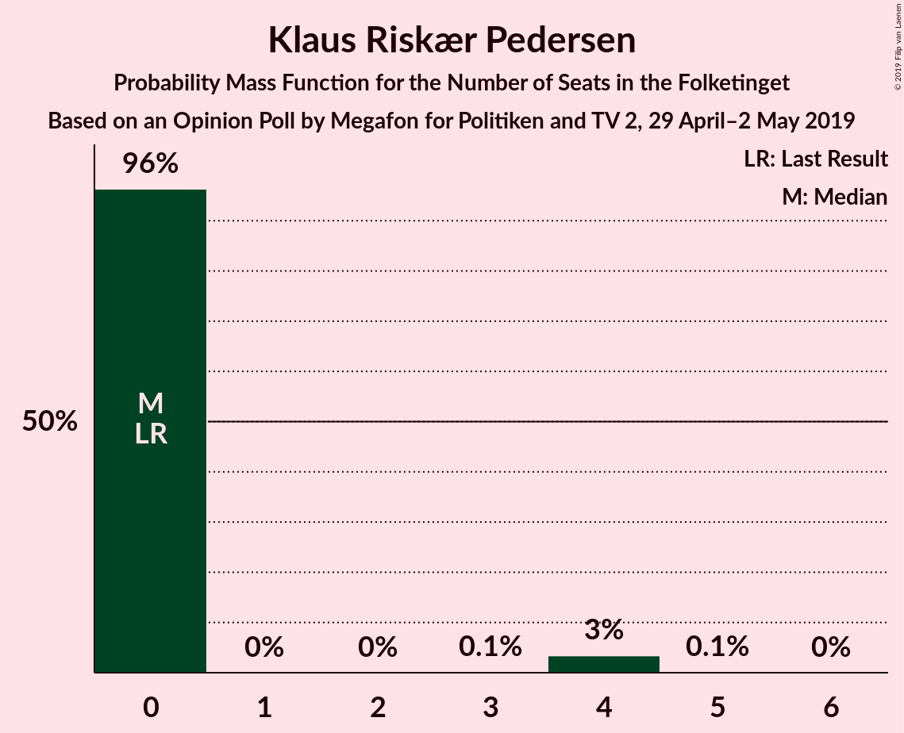

| Number of Seats | Probability | Accumulated | Special Marks |
|:---------------:|:-----------:|:-----------:|:-------------:|
| 0 | 96% | 100% | Last Result, Median |
| 1 | 0% | 4% |  |
| 2 | 0% | 4% |  |
| 3 | 0.1% | 4% |  |
| 4 | 3% | 4% |  |
| 5 | 0.1% | 0.1% |  |
| 6 | 0% | 0% |  |

### Kristendemokraterne

*For a full overview of the results for this party, see the [Kristendemokraterne](party-kristendemokraterne.html) page.*

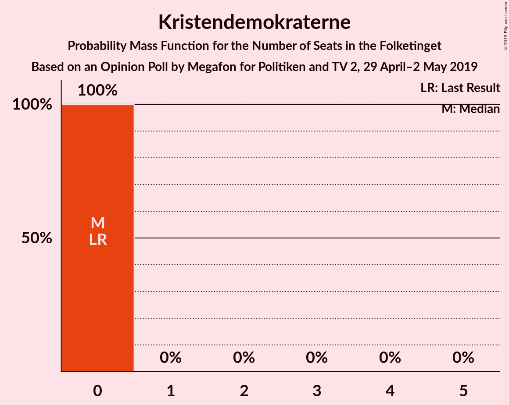

| Number of Seats | Probability | Accumulated | Special Marks |
|:---------------:|:-----------:|:-----------:|:-------------:|
| 0 | 100% | 100% | Last Result, Median |

## Coalitions

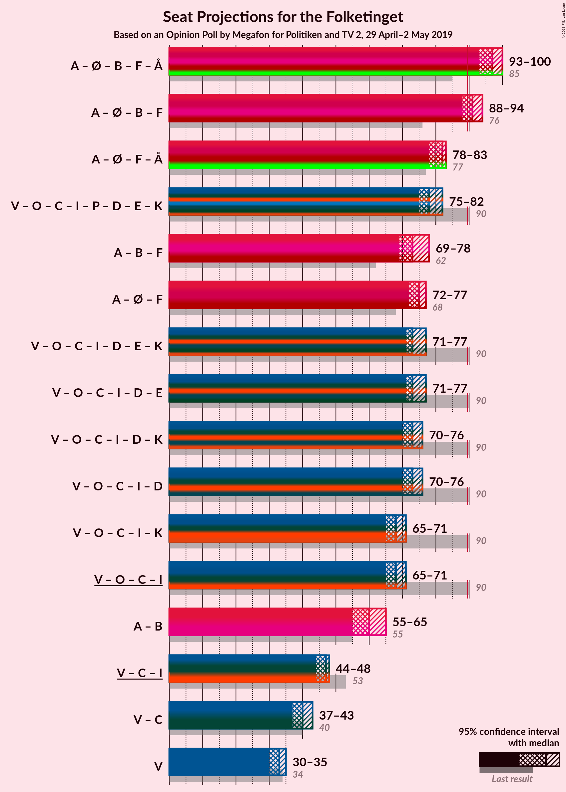

### Confidence Intervals

| Coalition | Last Result | Median | Majority? | 80% Confidence Interval | 90% Confidence Interval | 95% Confidence Interval | 99% Confidence Interval |
|:---------:|:-----------:|:------:|:---------:|:-----------------------:|:-----------------------:|:-----------------------:|:-----------------------:|
| Socialdemokraterne – Enhedslisten–De Rød-Grønne – Radikale Venstre – Socialistisk Folkeparti – Alternativet | 85 | 97 | 100% | 96–98 | 95–99 | 93–100 | 91–102 |
| Socialdemokraterne – Enhedslisten–De Rød-Grønne – Radikale Venstre – Socialistisk Folkeparti | 76 | 91 | 93% | 90–91 | 89–93 | 88–94 | 85–95 |
| Socialdemokraterne – Enhedslisten–De Rød-Grønne – Socialistisk Folkeparti – Alternativet | 77 | 82 | 0% | 78–82 | 78–83 | 78–83 | 76–86 |
| Venstre – Dansk Folkeparti – Det Konservative Folkeparti – Liberal Alliance – Stram Kurs – Nye Borgerlige – Klaus Riskær Pedersen – Kristendemokraterne | 90 | 78 | 0% | 77–79 | 76–80 | 75–82 | 73–84 |
| Socialdemokraterne – Radikale Venstre – Socialistisk Folkeparti | 62 | 73 | 0% | 73–74 | 71–75 | 69–78 | 67–78 |
| Socialdemokraterne – Enhedslisten–De Rød-Grønne – Socialistisk Folkeparti | 68 | 75 | 0% | 72–76 | 72–77 | 72–77 | 69–79 |
| Venstre – Dansk Folkeparti – Det Konservative Folkeparti – Liberal Alliance – Nye Borgerlige – Klaus Riskær Pedersen – Kristendemokraterne | 90 | 73 | 0% | 73–74 | 72–75 | 71–77 | 69–79 |
| Venstre – Dansk Folkeparti – Det Konservative Folkeparti – Liberal Alliance – Nye Borgerlige – Klaus Riskær Pedersen | 90 | 73 | 0% | 73–74 | 72–75 | 71–77 | 69–79 |
| Venstre – Dansk Folkeparti – Det Konservative Folkeparti – Liberal Alliance – Nye Borgerlige – Kristendemokraterne | 90 | 73 | 0% | 73–74 | 71–75 | 70–76 | 68–79 |
| Venstre – Dansk Folkeparti – Det Konservative Folkeparti – Liberal Alliance – Nye Borgerlige | 90 | 73 | 0% | 73–74 | 71–75 | 70–76 | 68–79 |
| Venstre – Dansk Folkeparti – Det Konservative Folkeparti – Liberal Alliance – Kristendemokraterne | 90 | 68 | 0% | 67–69 | 66–69 | 65–71 | 64–76 |
| Venstre – Dansk Folkeparti – Det Konservative Folkeparti – Liberal Alliance | 90 | 68 | 0% | 67–69 | 66–69 | 65–71 | 64–76 |
| Socialdemokraterne – Radikale Venstre | 55 | 60 | 0% | 59–60 | 57–61 | 55–65 | 54–65 |
| Venstre – Det Konservative Folkeparti – Liberal Alliance | 53 | 47 | 0% | 44–48 | 44–48 | 44–48 | 42–51 |
| Venstre – Det Konservative Folkeparti | 40 | 40 | 0% | 38–42 | 37–42 | 37–43 | 36–45 |
| Venstre | 34 | 33 | 0% | 31–33 | 31–34 | 30–35 | 29–37 |

### Socialdemokraterne – Enhedslisten–De Rød-Grønne – Radikale Venstre – Socialistisk Folkeparti – Alternativet

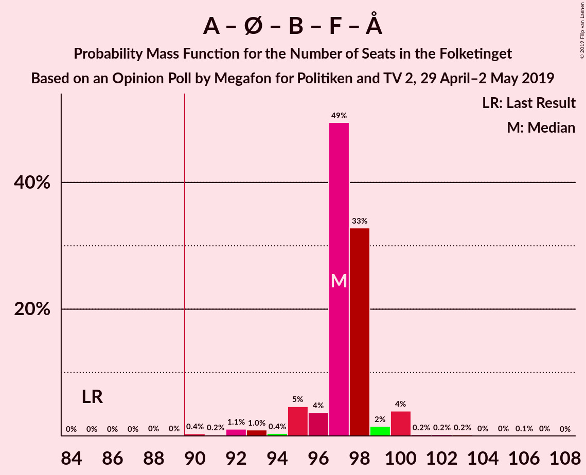

| Number of Seats | Probability | Accumulated | Special Marks |
|:---------------:|:-----------:|:-----------:|:-------------:|
| 85 | 0% | 100% | Last Result |
| 86 | 0% | 100% |  |
| 87 | 0% | 100% |  |
| 88 | 0% | 100% |  |
| 89 | 0% | 100% |  |
| 90 | 0.4% | 100% | Majority |
| 91 | 0.2% | 99.6% |  |
| 92 | 1.1% | 99.4% |  |
| 93 | 1.0% | 98% |  |
| 94 | 0.4% | 97% |  |
| 95 | 5% | 97% |  |
| 96 | 4% | 92% |  |
| 97 | 49% | 89% | Median |
| 98 | 33% | 39% |  |
| 99 | 2% | 6% |  |
| 100 | 4% | 5% |  |
| 101 | 0.2% | 0.9% |  |
| 102 | 0.2% | 0.6% |  |
| 103 | 0.2% | 0.4% |  |
| 104 | 0% | 0.2% |  |
| 105 | 0% | 0.2% |  |
| 106 | 0.1% | 0.1% |  |
| 107 | 0% | 0% |  |

### Socialdemokraterne – Enhedslisten–De Rød-Grønne – Radikale Venstre – Socialistisk Folkeparti

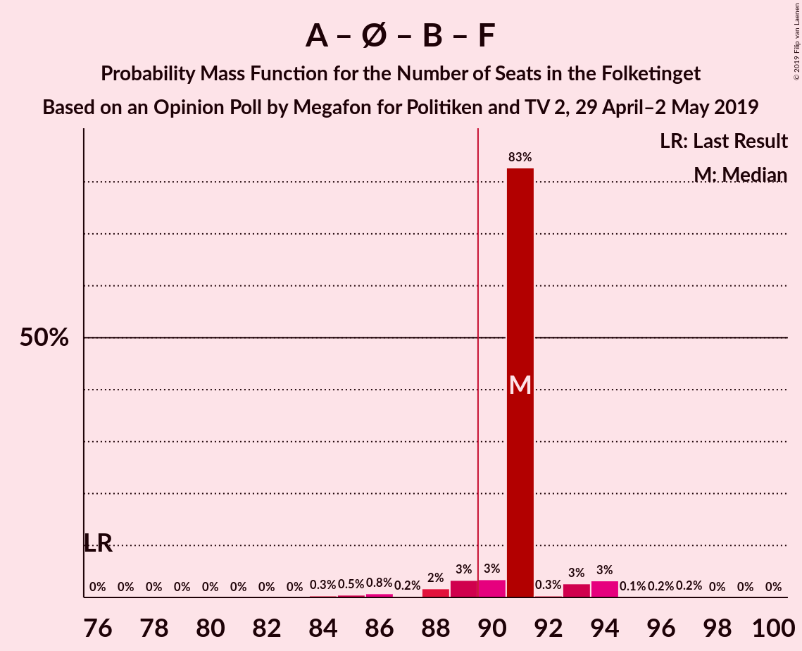

| Number of Seats | Probability | Accumulated | Special Marks |
|:---------------:|:-----------:|:-----------:|:-------------:|
| 76 | 0% | 100% | Last Result |
| 77 | 0% | 100% |  |
| 78 | 0% | 100% |  |
| 79 | 0% | 100% |  |
| 80 | 0% | 100% |  |
| 81 | 0% | 100% |  |
| 82 | 0% | 100% |  |
| 83 | 0% | 100% |  |
| 84 | 0.3% | 100% |  |
| 85 | 0.5% | 99.6% |  |
| 86 | 0.8% | 99.1% |  |
| 87 | 0.2% | 98% |  |
| 88 | 2% | 98% |  |
| 89 | 3% | 96% |  |
| 90 | 3% | 93% | Majority |
| 91 | 83% | 90% | Median |
| 92 | 0.3% | 7% |  |
| 93 | 3% | 7% |  |
| 94 | 3% | 4% |  |
| 95 | 0.1% | 0.6% |  |
| 96 | 0.2% | 0.5% |  |
| 97 | 0.2% | 0.3% |  |
| 98 | 0% | 0.1% |  |
| 99 | 0% | 0.1% |  |
| 100 | 0% | 0% |  |

### Socialdemokraterne – Enhedslisten–De Rød-Grønne – Socialistisk Folkeparti – Alternativet

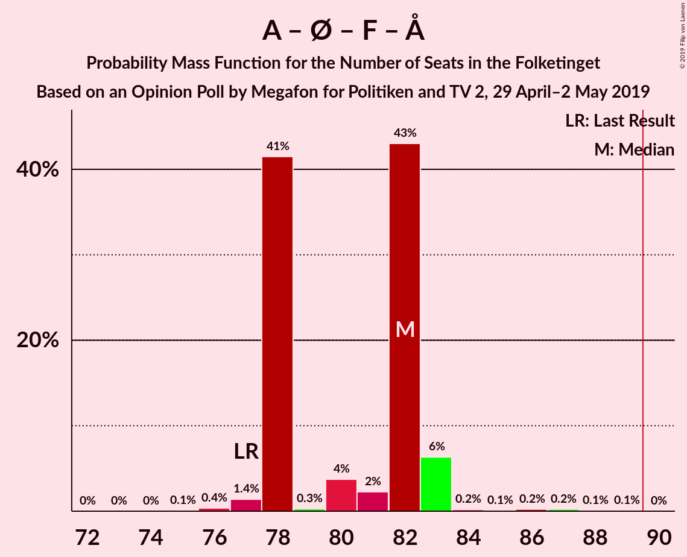

| Number of Seats | Probability | Accumulated | Special Marks |
|:---------------:|:-----------:|:-----------:|:-------------:|
| 73 | 0% | 100% |  |
| 74 | 0% | 99.9% |  |
| 75 | 0.1% | 99.9% |  |
| 76 | 0.4% | 99.8% |  |
| 77 | 1.4% | 99.4% | Last Result |
| 78 | 41% | 98% |  |
| 79 | 0.3% | 57% |  |
| 80 | 4% | 56% |  |
| 81 | 2% | 53% | Median |
| 82 | 43% | 50% |  |
| 83 | 6% | 7% |  |
| 84 | 0.2% | 0.9% |  |
| 85 | 0.1% | 0.7% |  |
| 86 | 0.2% | 0.7% |  |
| 87 | 0.2% | 0.5% |  |
| 88 | 0.1% | 0.2% |  |
| 89 | 0.1% | 0.2% |  |
| 90 | 0% | 0% | Majority |

### Venstre – Dansk Folkeparti – Det Konservative Folkeparti – Liberal Alliance – Stram Kurs – Nye Borgerlige – Klaus Riskær Pedersen – Kristendemokraterne

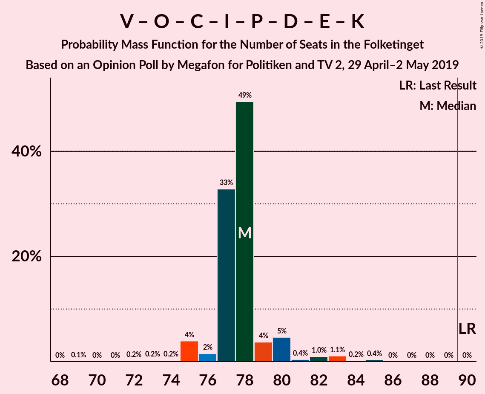

| Number of Seats | Probability | Accumulated | Special Marks |
|:---------------:|:-----------:|:-----------:|:-------------:|
| 69 | 0.1% | 100% |  |
| 70 | 0% | 99.9% |  |
| 71 | 0% | 99.8% |  |
| 72 | 0.2% | 99.8% |  |
| 73 | 0.2% | 99.6% |  |
| 74 | 0.2% | 99.4% |  |
| 75 | 4% | 99.1% |  |
| 76 | 2% | 95% |  |
| 77 | 33% | 94% |  |
| 78 | 49% | 61% | Median |
| 79 | 4% | 11% |  |
| 80 | 5% | 8% |  |
| 81 | 0.4% | 3% |  |
| 82 | 1.0% | 3% |  |
| 83 | 1.1% | 2% |  |
| 84 | 0.2% | 0.6% |  |
| 85 | 0.4% | 0.4% |  |
| 86 | 0% | 0% |  |
| 87 | 0% | 0% |  |
| 88 | 0% | 0% |  |
| 89 | 0% | 0% |  |
| 90 | 0% | 0% | Last Result, Majority |

### Socialdemokraterne – Radikale Venstre – Socialistisk Folkeparti

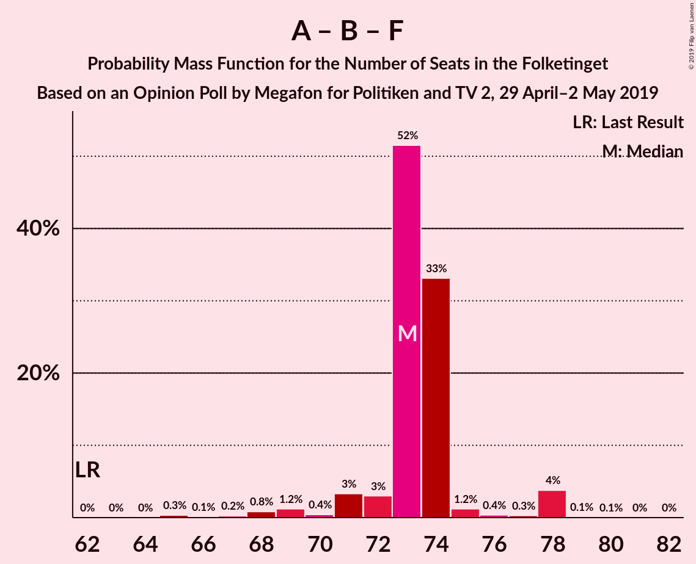

| Number of Seats | Probability | Accumulated | Special Marks |
|:---------------:|:-----------:|:-----------:|:-------------:|
| 62 | 0% | 100% | Last Result |
| 63 | 0% | 100% |  |
| 64 | 0% | 100% |  |
| 65 | 0.3% | 100% |  |
| 66 | 0.1% | 99.6% |  |
| 67 | 0.2% | 99.6% |  |
| 68 | 0.8% | 99.3% |  |
| 69 | 1.2% | 98% |  |
| 70 | 0.4% | 97% |  |
| 71 | 3% | 97% |  |
| 72 | 3% | 94% |  |
| 73 | 52% | 91% | Median |
| 74 | 33% | 39% |  |
| 75 | 1.2% | 6% |  |
| 76 | 0.4% | 5% |  |
| 77 | 0.3% | 4% |  |
| 78 | 4% | 4% |  |
| 79 | 0.1% | 0.2% |  |
| 80 | 0.1% | 0.1% |  |
| 81 | 0% | 0.1% |  |
| 82 | 0% | 0% |  |

### Socialdemokraterne – Enhedslisten–De Rød-Grønne – Socialistisk Folkeparti

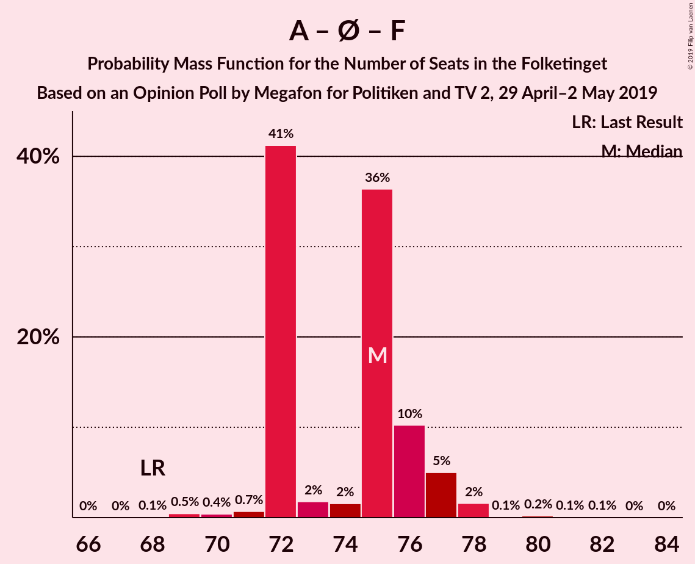

| Number of Seats | Probability | Accumulated | Special Marks |
|:---------------:|:-----------:|:-----------:|:-------------:|
| 67 | 0% | 100% |  |
| 68 | 0.1% | 99.9% | Last Result |
| 69 | 0.5% | 99.9% |  |
| 70 | 0.4% | 99.4% |  |
| 71 | 0.7% | 99.0% |  |
| 72 | 41% | 98% |  |
| 73 | 2% | 57% |  |
| 74 | 2% | 55% |  |
| 75 | 36% | 54% | Median |
| 76 | 10% | 17% |  |
| 77 | 5% | 7% |  |
| 78 | 2% | 2% |  |
| 79 | 0.1% | 0.5% |  |
| 80 | 0.2% | 0.4% |  |
| 81 | 0.1% | 0.2% |  |
| 82 | 0.1% | 0.2% |  |
| 83 | 0% | 0.1% |  |
| 84 | 0% | 0% |  |

### Venstre – Dansk Folkeparti – Det Konservative Folkeparti – Liberal Alliance – Nye Borgerlige – Klaus Riskær Pedersen – Kristendemokraterne

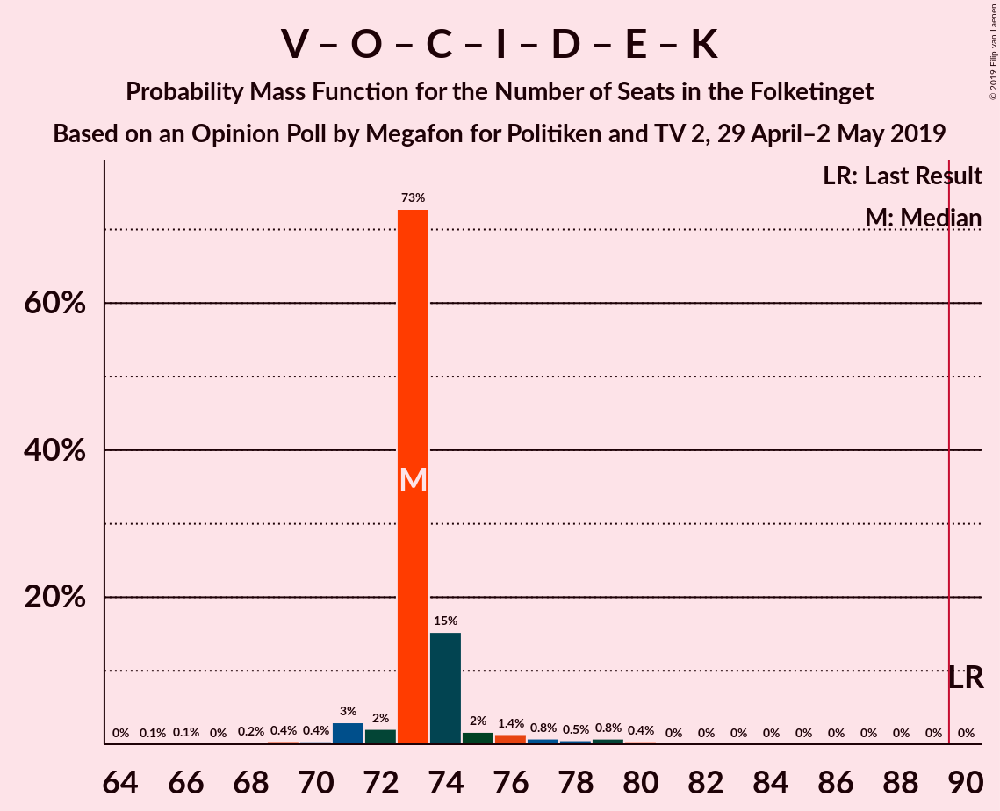

| Number of Seats | Probability | Accumulated | Special Marks |
|:---------------:|:-----------:|:-----------:|:-------------:|
| 65 | 0.1% | 100% |  |
| 66 | 0.1% | 99.9% |  |
| 67 | 0% | 99.8% |  |
| 68 | 0.2% | 99.7% |  |
| 69 | 0.4% | 99.5% |  |
| 70 | 0.4% | 99.1% |  |
| 71 | 3% | 98.7% |  |
| 72 | 2% | 96% |  |
| 73 | 73% | 94% | Median |
| 74 | 15% | 21% |  |
| 75 | 2% | 6% |  |
| 76 | 1.4% | 4% |  |
| 77 | 0.8% | 3% |  |
| 78 | 0.5% | 2% |  |
| 79 | 0.8% | 1.2% |  |
| 80 | 0.4% | 0.5% |  |
| 81 | 0% | 0.1% |  |
| 82 | 0% | 0% |  |
| 83 | 0% | 0% |  |
| 84 | 0% | 0% |  |
| 85 | 0% | 0% |  |
| 86 | 0% | 0% |  |
| 87 | 0% | 0% |  |
| 88 | 0% | 0% |  |
| 89 | 0% | 0% |  |
| 90 | 0% | 0% | Last Result, Majority |

### Venstre – Dansk Folkeparti – Det Konservative Folkeparti – Liberal Alliance – Nye Borgerlige – Klaus Riskær Pedersen

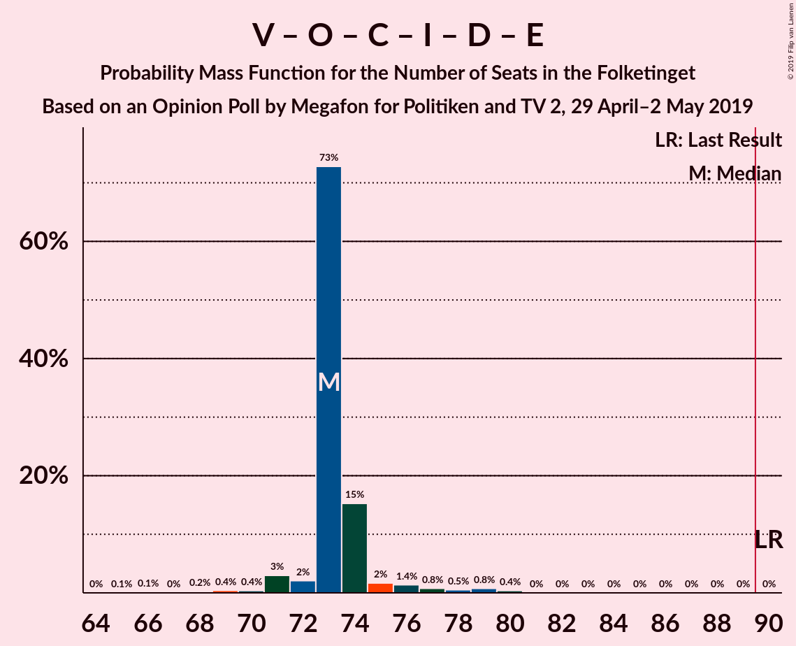

| Number of Seats | Probability | Accumulated | Special Marks |
|:---------------:|:-----------:|:-----------:|:-------------:|
| 65 | 0.1% | 100% |  |
| 66 | 0.1% | 99.9% |  |
| 67 | 0% | 99.8% |  |
| 68 | 0.2% | 99.7% |  |
| 69 | 0.4% | 99.5% |  |
| 70 | 0.4% | 99.1% |  |
| 71 | 3% | 98.7% |  |
| 72 | 2% | 96% |  |
| 73 | 73% | 94% | Median |
| 74 | 15% | 21% |  |
| 75 | 2% | 6% |  |
| 76 | 1.4% | 4% |  |
| 77 | 0.8% | 3% |  |
| 78 | 0.5% | 2% |  |
| 79 | 0.8% | 1.2% |  |
| 80 | 0.4% | 0.5% |  |
| 81 | 0% | 0.1% |  |
| 82 | 0% | 0% |  |
| 83 | 0% | 0% |  |
| 84 | 0% | 0% |  |
| 85 | 0% | 0% |  |
| 86 | 0% | 0% |  |
| 87 | 0% | 0% |  |
| 88 | 0% | 0% |  |
| 89 | 0% | 0% |  |
| 90 | 0% | 0% | Last Result, Majority |

### Venstre – Dansk Folkeparti – Det Konservative Folkeparti – Liberal Alliance – Nye Borgerlige – Kristendemokraterne

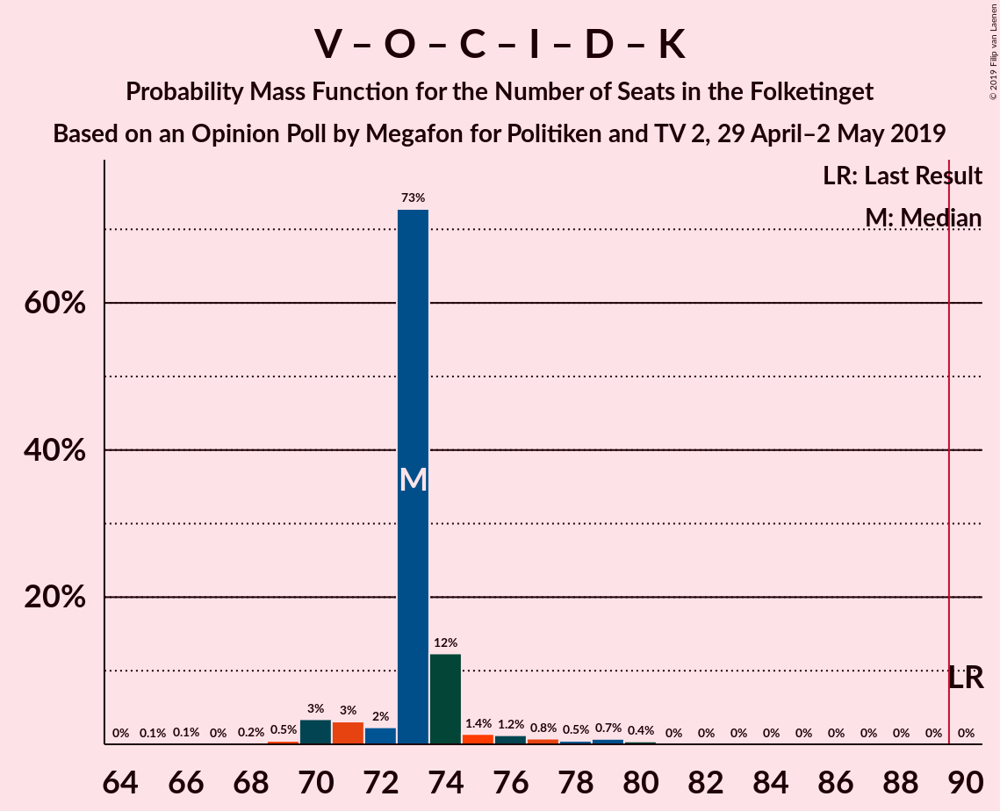

| Number of Seats | Probability | Accumulated | Special Marks |
|:---------------:|:-----------:|:-----------:|:-------------:|
| 64 | 0% | 100% |  |
| 65 | 0.1% | 99.9% |  |
| 66 | 0.1% | 99.8% |  |
| 67 | 0% | 99.7% |  |
| 68 | 0.2% | 99.7% |  |
| 69 | 0.5% | 99.5% |  |
| 70 | 3% | 99.0% |  |
| 71 | 3% | 96% |  |
| 72 | 2% | 93% |  |
| 73 | 73% | 90% | Median |
| 74 | 12% | 17% |  |
| 75 | 1.4% | 5% |  |
| 76 | 1.2% | 4% |  |
| 77 | 0.8% | 2% |  |
| 78 | 0.5% | 2% |  |
| 79 | 0.7% | 1.2% |  |
| 80 | 0.4% | 0.4% |  |
| 81 | 0% | 0% |  |
| 82 | 0% | 0% |  |
| 83 | 0% | 0% |  |
| 84 | 0% | 0% |  |
| 85 | 0% | 0% |  |
| 86 | 0% | 0% |  |
| 87 | 0% | 0% |  |
| 88 | 0% | 0% |  |
| 89 | 0% | 0% |  |
| 90 | 0% | 0% | Last Result, Majority |

### Venstre – Dansk Folkeparti – Det Konservative Folkeparti – Liberal Alliance – Nye Borgerlige

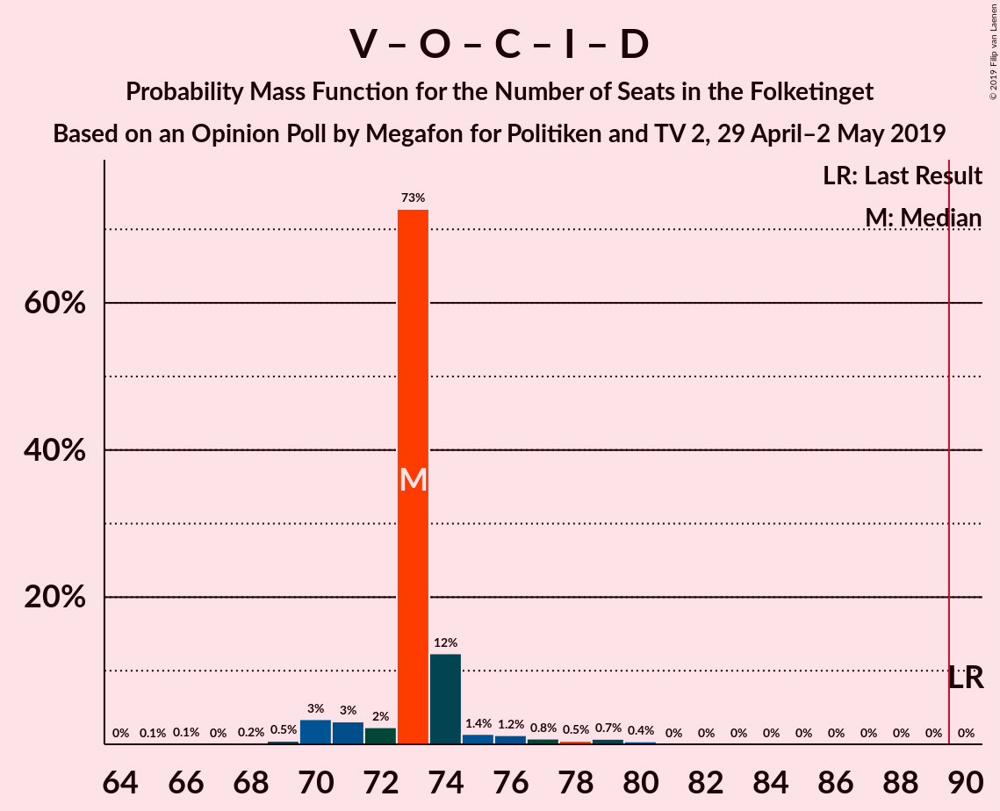

| Number of Seats | Probability | Accumulated | Special Marks |
|:---------------:|:-----------:|:-----------:|:-------------:|
| 64 | 0% | 100% |  |
| 65 | 0.1% | 99.9% |  |
| 66 | 0.1% | 99.8% |  |
| 67 | 0% | 99.7% |  |
| 68 | 0.2% | 99.7% |  |
| 69 | 0.5% | 99.5% |  |
| 70 | 3% | 99.0% |  |
| 71 | 3% | 96% |  |
| 72 | 2% | 93% |  |
| 73 | 73% | 90% | Median |
| 74 | 12% | 17% |  |
| 75 | 1.4% | 5% |  |
| 76 | 1.2% | 4% |  |
| 77 | 0.8% | 2% |  |
| 78 | 0.5% | 2% |  |
| 79 | 0.7% | 1.2% |  |
| 80 | 0.4% | 0.4% |  |
| 81 | 0% | 0% |  |
| 82 | 0% | 0% |  |
| 83 | 0% | 0% |  |
| 84 | 0% | 0% |  |
| 85 | 0% | 0% |  |
| 86 | 0% | 0% |  |
| 87 | 0% | 0% |  |
| 88 | 0% | 0% |  |
| 89 | 0% | 0% |  |
| 90 | 0% | 0% | Last Result, Majority |

### Venstre – Dansk Folkeparti – Det Konservative Folkeparti – Liberal Alliance – Kristendemokraterne

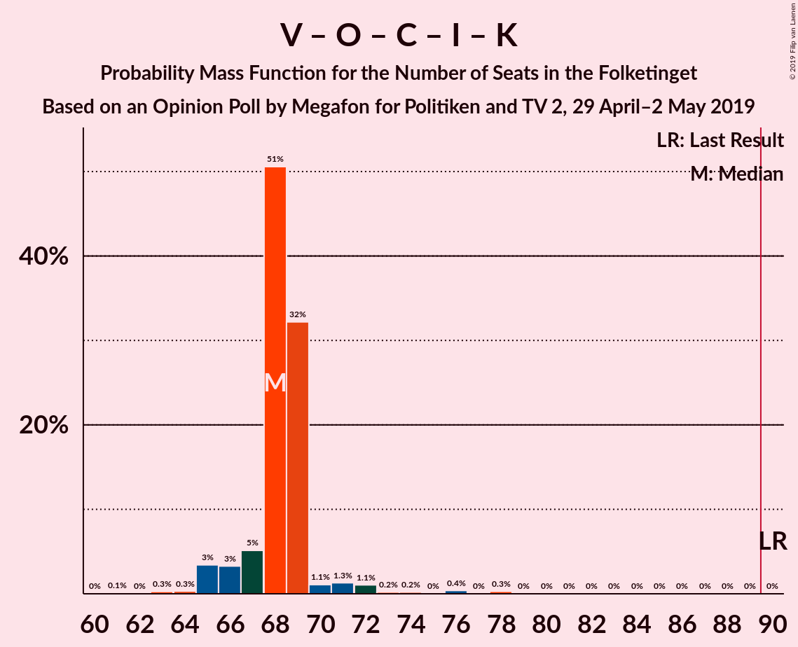

| Number of Seats | Probability | Accumulated | Special Marks |
|:---------------:|:-----------:|:-----------:|:-------------:|
| 61 | 0.1% | 100% |  |
| 62 | 0% | 99.8% |  |
| 63 | 0.3% | 99.8% |  |
| 64 | 0.3% | 99.6% |  |
| 65 | 3% | 99.2% |  |
| 66 | 3% | 96% |  |
| 67 | 5% | 93% |  |
| 68 | 51% | 87% | Median |
| 69 | 32% | 37% |  |
| 70 | 1.1% | 5% |  |
| 71 | 1.3% | 4% |  |
| 72 | 1.1% | 2% |  |
| 73 | 0.2% | 1.2% |  |
| 74 | 0.2% | 1.0% |  |
| 75 | 0% | 0.8% |  |
| 76 | 0.4% | 0.7% |  |
| 77 | 0% | 0.4% |  |
| 78 | 0.3% | 0.3% |  |
| 79 | 0% | 0% |  |
| 80 | 0% | 0% |  |
| 81 | 0% | 0% |  |
| 82 | 0% | 0% |  |
| 83 | 0% | 0% |  |
| 84 | 0% | 0% |  |
| 85 | 0% | 0% |  |
| 86 | 0% | 0% |  |
| 87 | 0% | 0% |  |
| 88 | 0% | 0% |  |
| 89 | 0% | 0% |  |
| 90 | 0% | 0% | Last Result, Majority |

### Venstre – Dansk Folkeparti – Det Konservative Folkeparti – Liberal Alliance

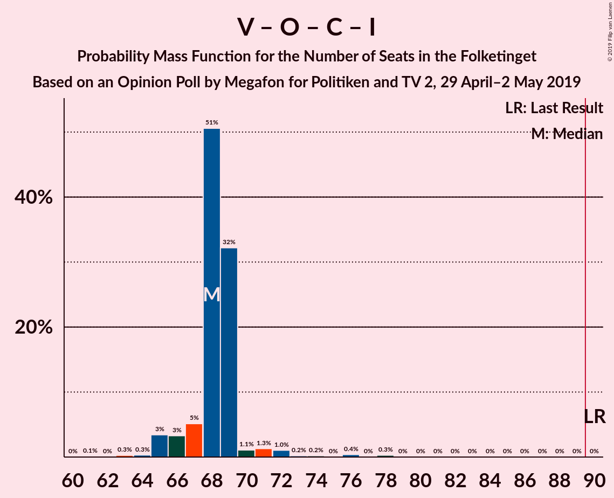

| Number of Seats | Probability | Accumulated | Special Marks |
|:---------------:|:-----------:|:-----------:|:-------------:|
| 61 | 0.1% | 100% |  |
| 62 | 0% | 99.8% |  |
| 63 | 0.3% | 99.8% |  |
| 64 | 0.3% | 99.6% |  |
| 65 | 3% | 99.2% |  |
| 66 | 3% | 96% |  |
| 67 | 5% | 93% |  |
| 68 | 51% | 87% | Median |
| 69 | 32% | 37% |  |
| 70 | 1.1% | 5% |  |
| 71 | 1.3% | 4% |  |
| 72 | 1.0% | 2% |  |
| 73 | 0.2% | 1.2% |  |
| 74 | 0.2% | 1.0% |  |
| 75 | 0% | 0.8% |  |
| 76 | 0.4% | 0.7% |  |
| 77 | 0% | 0.4% |  |
| 78 | 0.3% | 0.3% |  |
| 79 | 0% | 0% |  |
| 80 | 0% | 0% |  |
| 81 | 0% | 0% |  |
| 82 | 0% | 0% |  |
| 83 | 0% | 0% |  |
| 84 | 0% | 0% |  |
| 85 | 0% | 0% |  |
| 86 | 0% | 0% |  |
| 87 | 0% | 0% |  |
| 88 | 0% | 0% |  |
| 89 | 0% | 0% |  |
| 90 | 0% | 0% | Last Result, Majority |

### Socialdemokraterne – Radikale Venstre

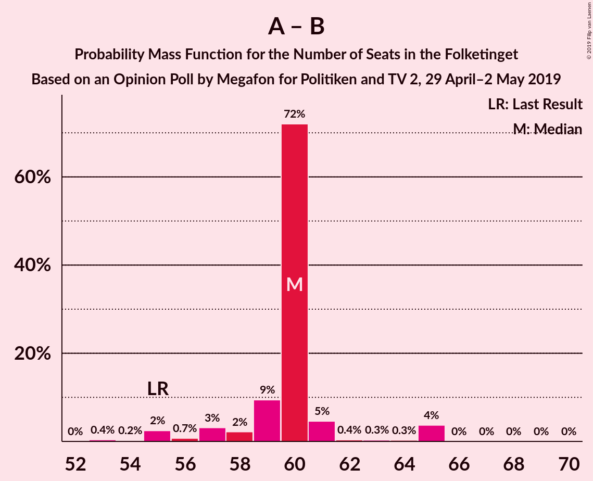

| Number of Seats | Probability | Accumulated | Special Marks |
|:---------------:|:-----------:|:-----------:|:-------------:|
| 53 | 0.4% | 100% |  |
| 54 | 0.2% | 99.6% |  |
| 55 | 2% | 99.3% | Last Result |
| 56 | 0.7% | 97% |  |
| 57 | 3% | 96% |  |
| 58 | 2% | 93% |  |
| 59 | 9% | 91% |  |
| 60 | 72% | 81% | Median |
| 61 | 5% | 9% |  |
| 62 | 0.4% | 5% |  |
| 63 | 0.3% | 4% |  |
| 64 | 0.3% | 4% |  |
| 65 | 4% | 4% |  |
| 66 | 0% | 0.1% |  |
| 67 | 0% | 0.1% |  |
| 68 | 0% | 0.1% |  |
| 69 | 0% | 0% |  |

### Venstre – Det Konservative Folkeparti – Liberal Alliance

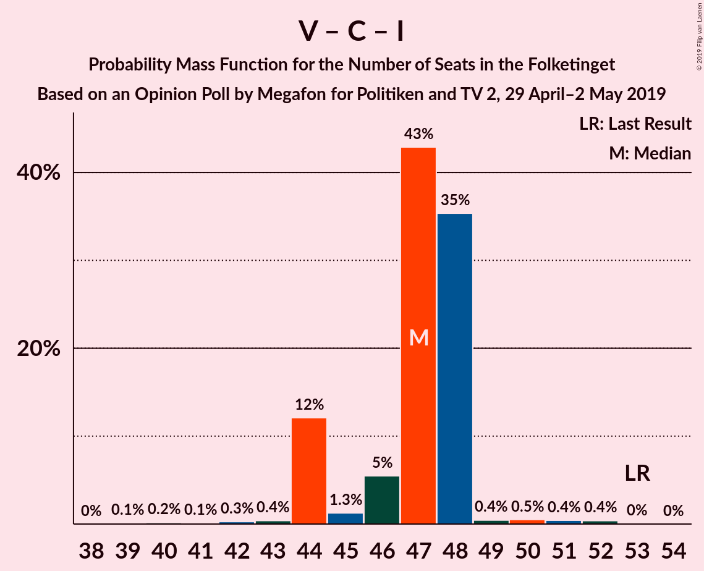

| Number of Seats | Probability | Accumulated | Special Marks |
|:---------------:|:-----------:|:-----------:|:-------------:|
| 39 | 0.1% | 100% |  |
| 40 | 0.2% | 99.9% |  |
| 41 | 0.1% | 99.7% |  |
| 42 | 0.3% | 99.6% |  |
| 43 | 0.4% | 99.3% |  |
| 44 | 12% | 98.9% |  |
| 45 | 1.3% | 87% |  |
| 46 | 5% | 86% |  |
| 47 | 43% | 80% | Median |
| 48 | 35% | 37% |  |
| 49 | 0.4% | 2% |  |
| 50 | 0.5% | 1.4% |  |
| 51 | 0.4% | 0.9% |  |
| 52 | 0.4% | 0.5% |  |
| 53 | 0% | 0.1% | Last Result |
| 54 | 0% | 0% |  |

### Venstre – Det Konservative Folkeparti

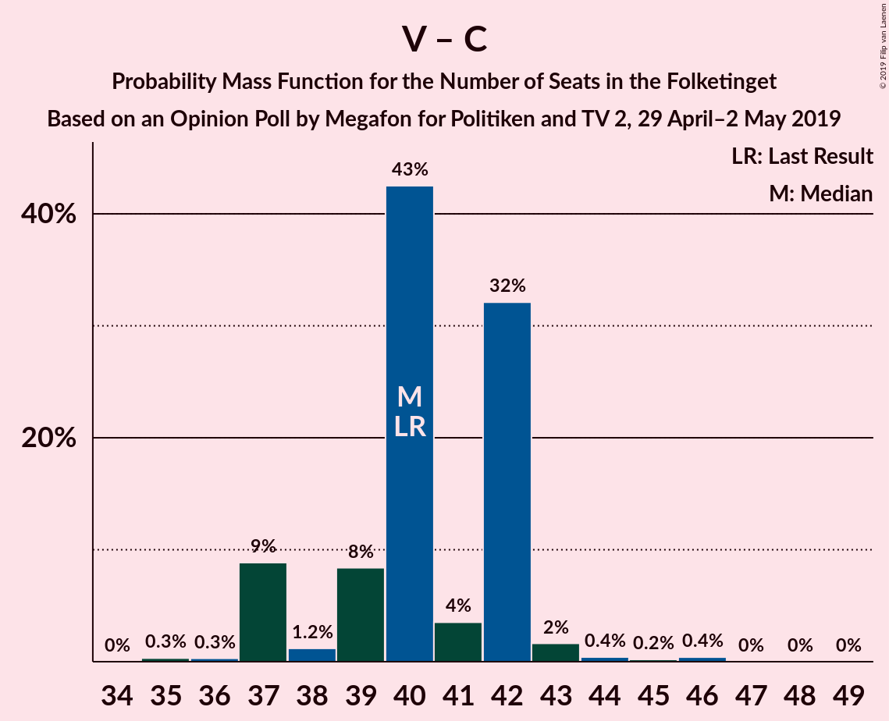

| Number of Seats | Probability | Accumulated | Special Marks |
|:---------------:|:-----------:|:-----------:|:-------------:|
| 35 | 0.3% | 100% |  |
| 36 | 0.3% | 99.6% |  |
| 37 | 9% | 99.3% |  |
| 38 | 1.2% | 90% |  |
| 39 | 8% | 89% |  |
| 40 | 43% | 81% | Last Result, Median |
| 41 | 4% | 38% |  |
| 42 | 32% | 35% |  |
| 43 | 2% | 3% |  |
| 44 | 0.4% | 1.1% |  |
| 45 | 0.2% | 0.7% |  |
| 46 | 0.4% | 0.5% |  |
| 47 | 0% | 0.1% |  |
| 48 | 0% | 0.1% |  |
| 49 | 0% | 0% |  |

### Venstre

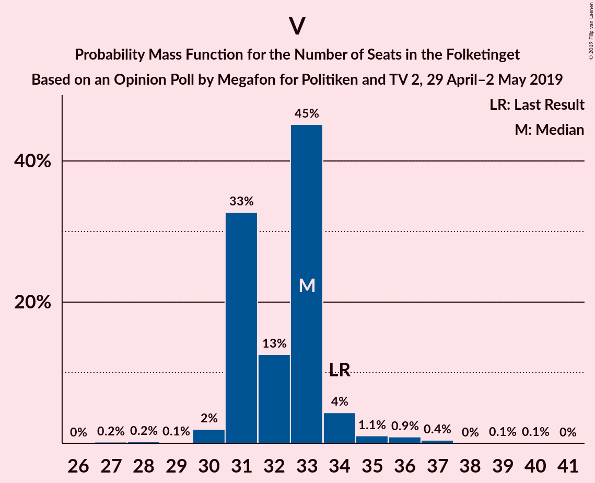

| Number of Seats | Probability | Accumulated | Special Marks |
|:---------------:|:-----------:|:-----------:|:-------------:|
| 27 | 0.2% | 100% |  |
| 28 | 0.2% | 99.8% |  |
| 29 | 0.1% | 99.6% |  |
| 30 | 2% | 99.4% |  |
| 31 | 33% | 97% |  |
| 32 | 13% | 65% |  |
| 33 | 45% | 52% | Median |
| 34 | 4% | 7% | Last Result |
| 35 | 1.1% | 3% |  |
| 36 | 0.9% | 2% |  |
| 37 | 0.4% | 0.6% |  |
| 38 | 0% | 0.2% |  |
| 39 | 0.1% | 0.2% |  |
| 40 | 0.1% | 0.1% |  |
| 41 | 0% | 0% |  |

## Technical Information

### Opinion Poll

+ **Polling firm:** Megafon
+ **Commissioner(s):** Politiken and TV 2
+ **Fieldwork period:** 29 April–2 May 2019

### Calculations

+ **Sample size:** 1008
+ **Simulations done:** 1,048,576
+ **Error estimate:** 2.33%

