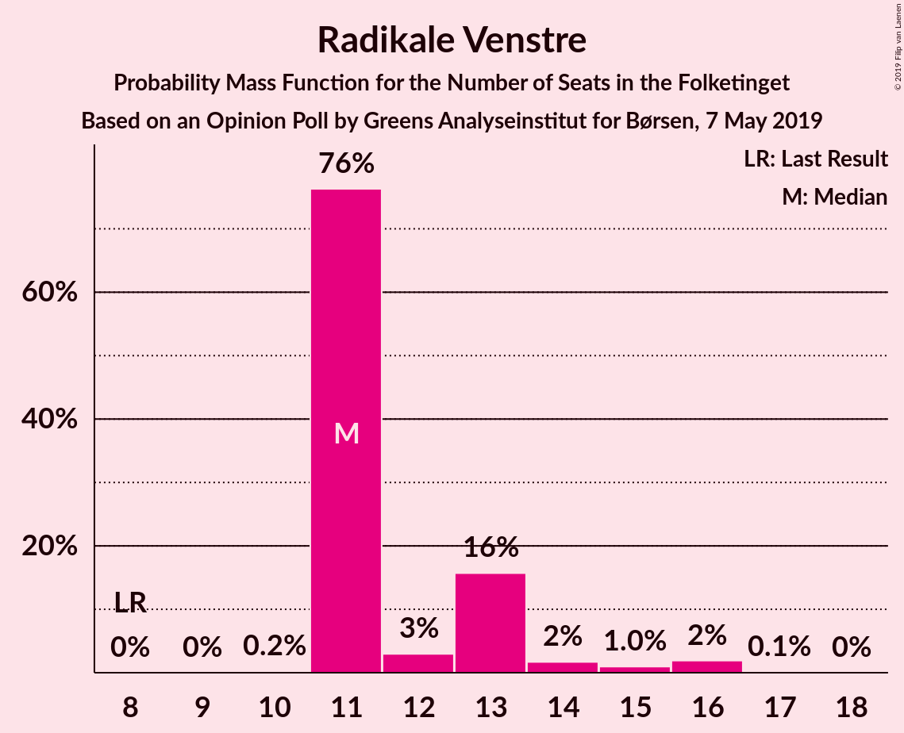

# Opinion Poll by Greens Analyseinstitut for Børsen, 7 May 2019

<a href="#voting-intentions">Voting Intentions</a> | <a href="#seats">Seats</a> | <a href="#coalitions">Coalitions</a> | <a href="#technical-information">Technical Information</a>

## Voting Intentions

### Confidence Intervals

| Party | Last Result | Poll Result | 80% Confidence Interval | 90% Confidence Interval | 95% Confidence Interval | 99% Confidence Interval |
|:-----:|:-----------:|:-----------:|:-----------------------:|:-----------------------:|:-----------------------:|:-----------------------:|
| Socialdemokraterne | 26.3% | 27.5% | 25.8–29.3% |25.3–29.8% |24.9–30.2% |24.1–31.1% |
| Venstre | 19.5% | 19.4% | 17.9–21.0% |17.5–21.5% |17.1–21.9% |16.4–22.6% |
| Dansk Folkeparti | 21.1% | 12.2% | 11.0–13.6% |10.7–14.0% |10.4–14.3% |9.9–15.0% |
| Enhedslisten–De Rød-Grønne | 7.8% | 10.5% | 9.4–11.8% |9.1–12.1% |8.8–12.5% |8.3–13.1% |
| Radikale Venstre | 4.6% | 7.1% | 6.2–8.3% |6.0–8.6% |5.7–8.8% |5.3–9.4% |
| Socialistisk Folkeparti | 4.2% | 6.7% | 5.8–7.8% |5.5–8.1% |5.3–8.3% |4.9–8.9% |
| Liberal Alliance | 7.5% | 4.8% | 4.1–5.8% |3.9–6.0% |3.7–6.3% |3.4–6.8% |
| Det Konservative Folkeparti | 3.4% | 3.5% | 2.9–4.4% |2.7–4.6% |2.6–4.8% |2.3–5.2% |
| Alternativet | 4.8% | 3.2% | 2.6–3.9% |2.4–4.2% |2.3–4.4% |2.0–4.8% |
| Stram Kurs | 0.0% | 2.4% | 1.9–3.1% |1.8–3.3% |1.6–3.5% |1.4–3.9% |
| Kristendemokraterne | 0.8% | 1.0% | 0.7–1.5% |0.6–1.7% |0.6–1.8% |0.5–2.1% |
| Nye Borgerlige | 0.0% | 0.9% | 0.6–1.4% |0.6–1.6% |0.5–1.7% |0.4–2.0% |
| Klaus Riskær Pedersen | 0.0% | 0.2% | 0.1–0.5% |0.1–0.6% |0.0–0.7% |0.0–0.9% |

*Note:* The poll result column reflects the actual value used in the calculations. Published results may vary slightly, and in addition be rounded to fewer digits.

## Seats

### Confidence Intervals

| Party | Last Result | Median | 80% Confidence Interval | 90% Confidence Interval | 95% Confidence Interval | 99% Confidence Interval |
|:-----:|:-----------:|:------:|:-----------------------:|:-----------------------:|:-----------------------:|:-----------------------:|
| <a href="#socialdemokraterne">Socialdemokraterne</a> | 47 | 51 | 47–51 |47–51 |46–52 |44–54 |
| <a href="#venstre">Venstre</a> | 34 | 36 | 36–38 |34–41 |33–41 |30–41 |
| <a href="#dansk-folkeparti">Dansk Folkeparti</a> | 37 | 20 | 20–21 |19–23 |19–23 |18–26 |
| <a href="#enhedslisten–de-rød-grønne">Enhedslisten–De Rød-Grønne</a> | 14 | 20 | 17–20 |16–20 |16–21 |15–24 |
| <a href="#radikale-venstre">Radikale Venstre</a> | 8 | 11 | 11–13 |11–13 |11–15 |11–16 |
| <a href="#socialistisk-folkeparti">Socialistisk Folkeparti</a> | 7 | 11 | 11–13 |11–13 |10–14 |9–15 |
| <a href="#liberal-alliance">Liberal Alliance</a> | 13 | 9 | 8–9 |7–9 |7–10 |7–11 |
| <a href="#det-konservative-folkeparti">Det Konservative Folkeparti</a> | 6 | 7 | 7 |6–8 |5–8 |4–9 |
| <a href="#alternativet">Alternativet</a> | 9 | 5 | 5–6 |5–6 |5–7 |4–8 |
| <a href="#stram-kurs">Stram Kurs</a> | 0 | 5 | 4–5 |4–5 |0–6 |0–6 |
| <a href="#kristendemokraterne">Kristendemokraterne</a> | 0 | 0 | 0 |0 |0 |0 |
| <a href="#nye-borgerlige">Nye Borgerlige</a> | 0 | 0 | 0 |0 |0 |0 |
| <a href="#klaus-riskær-pedersen">Klaus Riskær Pedersen</a> | 0 | 0 | 0 |0 |0 |0 |

### Socialdemokraterne

*For a full overview of the results for this party, see the [Socialdemokraterne](party-socialdemokraterne.html) page.*

| Number of Seats | Probability | Accumulated | Special Marks |
|:---------------:|:-----------:|:-----------:|:-------------:|
| 43 | 0.3% | 100% |  |
| 44 | 2% | 99.7% |  |
| 45 | 0.3% | 98% |  |
| 46 | 0.7% | 98% |  |
| 47 | 10% | 97% | Last Result |
| 48 | 1.3% | 87% |  |
| 49 | 6% | 86% |  |
| 50 | 1.3% | 80% |  |
| 51 | 74% | 79% | Median |
| 52 | 3% | 5% |  |
| 53 | 0.1% | 2% |  |
| 54 | 2% | 2% |  |
| 55 | 0% | 0.1% |  |
| 56 | 0.1% | 0.1% |  |
| 57 | 0% | 0% |  |

### Venstre

*For a full overview of the results for this party, see the [Venstre](party-venstre.html) page.*

| Number of Seats | Probability | Accumulated | Special Marks |
|:---------------:|:-----------:|:-----------:|:-------------:|
| 29 | 0.1% | 100% |  |
| 30 | 0.6% | 99.9% |  |
| 31 | 0.7% | 99.3% |  |
| 32 | 0.5% | 98.6% |  |
| 33 | 3% | 98% |  |
| 34 | 4% | 95% | Last Result |
| 35 | 1.4% | 92% |  |
| 36 | 74% | 90% | Median |
| 37 | 2% | 17% |  |
| 38 | 7% | 15% |  |
| 39 | 0.7% | 8% |  |
| 40 | 0% | 8% |  |
| 41 | 8% | 8% |  |
| 42 | 0% | 0.1% |  |
| 43 | 0.1% | 0.1% |  |
| 44 | 0% | 0% |  |

### Dansk Folkeparti

*For a full overview of the results for this party, see the [Dansk Folkeparti](party-danskfolkeparti.html) page.*

| Number of Seats | Probability | Accumulated | Special Marks |
|:---------------:|:-----------:|:-----------:|:-------------:|
| 17 | 0% | 100% |  |
| 18 | 1.0% | 99.9% |  |
| 19 | 8% | 98.9% |  |
| 20 | 76% | 90% | Median |
| 21 | 6% | 14% |  |
| 22 | 3% | 8% |  |
| 23 | 4% | 6% |  |
| 24 | 0.7% | 2% |  |
| 25 | 0.3% | 0.9% |  |
| 26 | 0.3% | 0.6% |  |
| 27 | 0.2% | 0.3% |  |
| 28 | 0% | 0.1% |  |
| 29 | 0.1% | 0.1% |  |
| 30 | 0% | 0% |  |
| 31 | 0% | 0% |  |
| 32 | 0% | 0% |  |
| 33 | 0% | 0% |  |
| 34 | 0% | 0% |  |
| 35 | 0% | 0% |  |
| 36 | 0% | 0% |  |
| 37 | 0% | 0% | Last Result |

### Enhedslisten–De Rød-Grønne

*For a full overview of the results for this party, see the [Enhedslisten–De Rød-Grønne](party-enhedslisten–derød-grønne.html) page.*

| Number of Seats | Probability | Accumulated | Special Marks |
|:---------------:|:-----------:|:-----------:|:-------------:|
| 14 | 0.1% | 100% | Last Result |
| 15 | 0.6% | 99.9% |  |
| 16 | 5% | 99.3% |  |
| 17 | 8% | 95% |  |
| 18 | 3% | 86% |  |
| 19 | 5% | 84% |  |
| 20 | 74% | 79% | Median |
| 21 | 3% | 4% |  |
| 22 | 0.7% | 1.3% |  |
| 23 | 0% | 0.6% |  |
| 24 | 0.4% | 0.6% |  |
| 25 | 0.2% | 0.2% |  |
| 26 | 0% | 0% |  |

### Radikale Venstre

*For a full overview of the results for this party, see the [Radikale Venstre](party-radikalevenstre.html) page.*

| Number of Seats | Probability | Accumulated | Special Marks |
|:---------------:|:-----------:|:-----------:|:-------------:|
| 8 | 0% | 100% | Last Result |
| 9 | 0% | 100% |  |
| 10 | 0.2% | 99.9% |  |
| 11 | 76% | 99.7% | Median |
| 12 | 3% | 23% |  |
| 13 | 16% | 20% |  |
| 14 | 2% | 5% |  |
| 15 | 1.0% | 3% |  |
| 16 | 2% | 2% |  |
| 17 | 0.1% | 0.2% |  |
| 18 | 0% | 0% |  |

### Socialistisk Folkeparti

*For a full overview of the results for this party, see the [Socialistisk Folkeparti](party-socialistiskfolkeparti.html) page.*

| Number of Seats | Probability | Accumulated | Special Marks |
|:---------------:|:-----------:|:-----------:|:-------------:|
| 7 | 0% | 100% | Last Result |
| 8 | 0% | 100% |  |
| 9 | 1.1% | 100% |  |
| 10 | 2% | 98.9% |  |
| 11 | 79% | 97% | Median |
| 12 | 6% | 18% |  |
| 13 | 9% | 12% |  |
| 14 | 1.0% | 3% |  |
| 15 | 2% | 2% |  |
| 16 | 0.1% | 0.4% |  |
| 17 | 0.2% | 0.2% |  |
| 18 | 0% | 0% |  |

### Liberal Alliance

*For a full overview of the results for this party, see the [Liberal Alliance](party-liberalalliance.html) page.*

| Number of Seats | Probability | Accumulated | Special Marks |
|:---------------:|:-----------:|:-----------:|:-------------:|
| 6 | 0.3% | 100% |  |
| 7 | 9% | 99.7% |  |
| 8 | 3% | 91% |  |
| 9 | 84% | 88% | Median |
| 10 | 3% | 4% |  |
| 11 | 1.2% | 2% |  |
| 12 | 0.3% | 0.3% |  |
| 13 | 0% | 0% | Last Result |

### Det Konservative Folkeparti

*For a full overview of the results for this party, see the [Det Konservative Folkeparti](party-detkonservativefolkeparti.html) page.*

| Number of Seats | Probability | Accumulated | Special Marks |
|:---------------:|:-----------:|:-----------:|:-------------:|
| 4 | 0.8% | 100% |  |
| 5 | 2% | 99.2% |  |
| 6 | 3% | 97% | Last Result |
| 7 | 85% | 94% | Median |
| 8 | 8% | 9% |  |
| 9 | 1.3% | 1.4% |  |
| 10 | 0.1% | 0.1% |  |
| 11 | 0% | 0% |  |

### Alternativet

*For a full overview of the results for this party, see the [Alternativet](party-alternativet.html) page.*

| Number of Seats | Probability | Accumulated | Special Marks |
|:---------------:|:-----------:|:-----------:|:-------------:|
| 0 | 0.1% | 100% |  |
| 1 | 0% | 99.9% |  |
| 2 | 0% | 99.9% |  |
| 3 | 0% | 99.9% |  |
| 4 | 1.3% | 99.9% |  |
| 5 | 82% | 98.5% | Median |
| 6 | 12% | 16% |  |
| 7 | 3% | 4% |  |
| 8 | 0.9% | 0.9% |  |
| 9 | 0% | 0.1% | Last Result |
| 10 | 0% | 0% |  |

### Stram Kurs

*For a full overview of the results for this party, see the [Stram Kurs](party-stramkurs.html) page.*

| Number of Seats | Probability | Accumulated | Special Marks |
|:---------------:|:-----------:|:-----------:|:-------------:|
| 0 | 3% | 100% | Last Result |
| 1 | 0% | 97% |  |
| 2 | 0% | 97% |  |
| 3 | 0% | 97% |  |
| 4 | 12% | 97% |  |
| 5 | 80% | 85% | Median |
| 6 | 4% | 4% |  |
| 7 | 0.2% | 0.2% |  |
| 8 | 0% | 0% |  |

### Kristendemokraterne

*For a full overview of the results for this party, see the [Kristendemokraterne](party-kristendemokraterne.html) page.*

| Number of Seats | Probability | Accumulated | Special Marks |
|:---------------:|:-----------:|:-----------:|:-------------:|
| 0 | 99.8% | 100% | Last Result, Median |
| 1 | 0% | 0.2% |  |
| 2 | 0% | 0.2% |  |
| 3 | 0% | 0.2% |  |
| 4 | 0.2% | 0.2% |  |
| 5 | 0% | 0% |  |

### Nye Borgerlige

*For a full overview of the results for this party, see the [Nye Borgerlige](party-nyeborgerlige.html) page.*

| Number of Seats | Probability | Accumulated | Special Marks |
|:---------------:|:-----------:|:-----------:|:-------------:|
| 0 | 99.6% | 100% | Last Result, Median |
| 1 | 0% | 0.4% |  |
| 2 | 0% | 0.4% |  |
| 3 | 0% | 0.4% |  |
| 4 | 0.4% | 0.4% |  |
| 5 | 0% | 0% |  |

### Klaus Riskær Pedersen

*For a full overview of the results for this party, see the [Klaus Riskær Pedersen](party-klausriskærpedersen.html) page.*

| Number of Seats | Probability | Accumulated | Special Marks |
|:---------------:|:-----------:|:-----------:|:-------------:|
| 0 | 100% | 100% | Last Result, Median |

## Coalitions

### Confidence Intervals

| Coalition | Last Result | Median | Majority? | 80% Confidence Interval | 90% Confidence Interval | 95% Confidence Interval | 99% Confidence Interval |
|:---------:|:-----------:|:------:|:---------:|:-----------------------:|:-----------------------:|:-----------------------:|:-----------------------:|
| Socialdemokraterne – Enhedslisten–De Rød-Grønne – Radikale Venstre – Socialistisk Folkeparti – Alternativet | 85 | 98 | 100% | 95–98 | 95–101 | 95–102 | 93–106 |
| Socialdemokraterne – Enhedslisten–De Rød-Grønne – Radikale Venstre – Socialistisk Folkeparti | 76 | 93 | 97% | 90–93 | 90–95 | 89–96 | 87–100 |
| Socialdemokraterne – Enhedslisten–De Rød-Grønne – Socialistisk Folkeparti – Alternativet | 77 | 87 | 2% | 82–87 | 82–88 | 82–89 | 80–94 |
| Socialdemokraterne – Enhedslisten–De Rød-Grønne – Socialistisk Folkeparti | 68 | 82 | 0% | 77–82 | 77–82 | 76–83 | 75–88 |
| Venstre – Dansk Folkeparti – Liberal Alliance – Det Konservative Folkeparti – Stram Kurs – Kristendemokraterne – Nye Borgerlige – Klaus Riskær Pedersen | 90 | 77 | 0% | 77–80 | 74–80 | 73–80 | 69–82 |
| Socialdemokraterne – Radikale Venstre – Socialistisk Folkeparti | 62 | 73 | 0% | 73–74 | 73–76 | 70–77 | 66–81 |
| Venstre – Dansk Folkeparti – Liberal Alliance – Det Konservative Folkeparti – Kristendemokraterne – Nye Borgerlige – Klaus Riskær Pedersen | 90 | 72 | 0% | 72–76 | 70–76 | 68–76 | 67–78 |
| Venstre – Dansk Folkeparti – Liberal Alliance – Det Konservative Folkeparti – Nye Borgerlige – Klaus Riskær Pedersen | 90 | 72 | 0% | 72–76 | 70–76 | 68–76 | 66–78 |
| Venstre – Dansk Folkeparti – Liberal Alliance – Det Konservative Folkeparti – Kristendemokraterne – Nye Borgerlige | 90 | 72 | 0% | 72–76 | 70–76 | 68–76 | 67–78 |
| Venstre – Dansk Folkeparti – Liberal Alliance – Det Konservative Folkeparti – Kristendemokraterne | 90 | 72 | 0% | 72–76 | 70–76 | 68–76 | 67–78 |
| Venstre – Dansk Folkeparti – Liberal Alliance – Det Konservative Folkeparti – Nye Borgerlige | 90 | 72 | 0% | 72–76 | 70–76 | 68–76 | 66–78 |
| Venstre – Dansk Folkeparti – Liberal Alliance – Det Konservative Folkeparti | 90 | 72 | 0% | 72–76 | 70–76 | 68–76 | 66–78 |
| Socialdemokraterne – Radikale Venstre | 55 | 62 | 0% | 60–62 | 60–64 | 58–66 | 55–67 |
| Venstre – Liberal Alliance – Det Konservative Folkeparti | 53 | 52 | 0% | 52–54 | 48–57 | 47–57 | 45–57 |
| Venstre – Det Konservative Folkeparti | 40 | 43 | 0% | 43–46 | 40–48 | 39–48 | 37–48 |
| Venstre | 34 | 36 | 0% | 36–38 | 34–41 | 33–41 | 30–41 |

### Socialdemokraterne – Enhedslisten–De Rød-Grønne – Radikale Venstre – Socialistisk Folkeparti – Alternativet

| Number of Seats | Probability | Accumulated | Special Marks |
|:---------------:|:-----------:|:-----------:|:-------------:|
| 85 | 0% | 100% | Last Result |
| 86 | 0% | 100% |  |
| 87 | 0% | 100% |  |
| 88 | 0% | 100% |  |
| 89 | 0% | 100% |  |
| 90 | 0% | 100% | Majority |
| 91 | 0% | 100% |  |
| 92 | 0% | 99.9% |  |
| 93 | 2% | 99.9% |  |
| 94 | 0.6% | 98% |  |
| 95 | 8% | 98% |  |
| 96 | 5% | 90% |  |
| 97 | 2% | 85% |  |
| 98 | 74% | 83% | Median |
| 99 | 2% | 10% |  |
| 100 | 1.4% | 7% |  |
| 101 | 3% | 6% |  |
| 102 | 1.2% | 3% |  |
| 103 | 0.4% | 2% |  |
| 104 | 0.5% | 2% |  |
| 105 | 0% | 1.1% |  |
| 106 | 0.9% | 1.0% |  |
| 107 | 0.1% | 0.1% |  |
| 108 | 0% | 0% |  |

### Socialdemokraterne – Enhedslisten–De Rød-Grønne – Radikale Venstre – Socialistisk Folkeparti

| Number of Seats | Probability | Accumulated | Special Marks |
|:---------------:|:-----------:|:-----------:|:-------------:|
| 76 | 0% | 100% | Last Result |
| 77 | 0% | 100% |  |
| 78 | 0% | 100% |  |
| 79 | 0% | 100% |  |
| 80 | 0% | 100% |  |
| 81 | 0% | 100% |  |
| 82 | 0% | 100% |  |
| 83 | 0% | 100% |  |
| 84 | 0% | 100% |  |
| 85 | 0% | 100% |  |
| 86 | 0% | 100% |  |
| 87 | 2% | 99.9% |  |
| 88 | 0.6% | 98% |  |
| 89 | 1.0% | 98% |  |
| 90 | 12% | 97% | Majority |
| 91 | 0.2% | 85% |  |
| 92 | 0.8% | 84% |  |
| 93 | 76% | 84% | Median |
| 94 | 2% | 7% |  |
| 95 | 3% | 6% |  |
| 96 | 0.7% | 3% |  |
| 97 | 0.2% | 2% |  |
| 98 | 0.4% | 2% |  |
| 99 | 0.4% | 1.4% |  |
| 100 | 0.8% | 1.0% |  |
| 101 | 0.2% | 0.3% |  |
| 102 | 0% | 0% |  |

### Socialdemokraterne – Enhedslisten–De Rød-Grønne – Socialistisk Folkeparti – Alternativet

| Number of Seats | Probability | Accumulated | Special Marks |
|:---------------:|:-----------:|:-----------:|:-------------:|
| 77 | 0% | 100% | Last Result |
| 78 | 0% | 100% |  |
| 79 | 0.1% | 99.9% |  |
| 80 | 0.4% | 99.8% |  |
| 81 | 0.3% | 99.4% |  |
| 82 | 9% | 99.1% |  |
| 83 | 6% | 90% |  |
| 84 | 1.4% | 84% |  |
| 85 | 1.3% | 82% |  |
| 86 | 0.4% | 81% |  |
| 87 | 74% | 81% | Median |
| 88 | 3% | 6% |  |
| 89 | 0.9% | 3% |  |
| 90 | 0.3% | 2% | Majority |
| 91 | 0.6% | 2% |  |
| 92 | 0.6% | 1.3% |  |
| 93 | 0% | 0.8% |  |
| 94 | 0.7% | 0.7% |  |
| 95 | 0.1% | 0.1% |  |
| 96 | 0% | 0% |  |

### Socialdemokraterne – Enhedslisten–De Rød-Grønne – Socialistisk Folkeparti

| Number of Seats | Probability | Accumulated | Special Marks |
|:---------------:|:-----------:|:-----------:|:-------------:|
| 68 | 0% | 100% | Last Result |
| 69 | 0% | 100% |  |
| 70 | 0% | 100% |  |
| 71 | 0% | 100% |  |
| 72 | 0% | 100% |  |
| 73 | 0.1% | 100% |  |
| 74 | 0.4% | 99.9% |  |
| 75 | 0.4% | 99.5% |  |
| 76 | 2% | 99.2% |  |
| 77 | 14% | 97% |  |
| 78 | 0.4% | 83% |  |
| 79 | 1.1% | 83% |  |
| 80 | 0.6% | 82% |  |
| 81 | 2% | 81% |  |
| 82 | 76% | 79% | Median |
| 83 | 0.9% | 3% |  |
| 84 | 0.6% | 2% |  |
| 85 | 0.4% | 2% |  |
| 86 | 0% | 1.2% |  |
| 87 | 0.4% | 1.2% |  |
| 88 | 0.6% | 0.8% |  |
| 89 | 0.1% | 0.1% |  |
| 90 | 0% | 0% | Majority |

### Venstre – Dansk Folkeparti – Liberal Alliance – Det Konservative Folkeparti – Stram Kurs – Kristendemokraterne – Nye Borgerlige – Klaus Riskær Pedersen

| Number of Seats | Probability | Accumulated | Special Marks |
|:---------------:|:-----------:|:-----------:|:-------------:|
| 68 | 0.1% | 100% |  |
| 69 | 0.9% | 99.9% |  |
| 70 | 0% | 99.0% |  |
| 71 | 0.5% | 98.9% |  |
| 72 | 0.4% | 98% |  |
| 73 | 1.2% | 98% |  |
| 74 | 3% | 97% |  |
| 75 | 1.4% | 94% |  |
| 76 | 2% | 93% |  |
| 77 | 74% | 90% | Median |
| 78 | 2% | 17% |  |
| 79 | 5% | 15% |  |
| 80 | 8% | 10% |  |
| 81 | 0.6% | 2% |  |
| 82 | 2% | 2% |  |
| 83 | 0% | 0.1% |  |
| 84 | 0% | 0.1% |  |
| 85 | 0% | 0% |  |
| 86 | 0% | 0% |  |
| 87 | 0% | 0% |  |
| 88 | 0% | 0% |  |
| 89 | 0% | 0% |  |
| 90 | 0% | 0% | Last Result, Majority |

### Socialdemokraterne – Radikale Venstre – Socialistisk Folkeparti

| Number of Seats | Probability | Accumulated | Special Marks |
|:---------------:|:-----------:|:-----------:|:-------------:|
| 62 | 0% | 100% | Last Result |
| 63 | 0% | 100% |  |
| 64 | 0% | 100% |  |
| 65 | 0% | 100% |  |
| 66 | 1.3% | 100% |  |
| 67 | 0% | 98.7% |  |
| 68 | 0.3% | 98.7% |  |
| 69 | 0.5% | 98% |  |
| 70 | 1.0% | 98% |  |
| 71 | 0.8% | 97% |  |
| 72 | 0.5% | 96% |  |
| 73 | 82% | 96% | Median |
| 74 | 6% | 13% |  |
| 75 | 1.5% | 7% |  |
| 76 | 1.4% | 6% |  |
| 77 | 2% | 4% |  |
| 78 | 0.5% | 2% |  |
| 79 | 0.4% | 2% |  |
| 80 | 0.3% | 1.1% |  |
| 81 | 0.8% | 0.8% |  |
| 82 | 0% | 0% |  |

### Venstre – Dansk Folkeparti – Liberal Alliance – Det Konservative Folkeparti – Kristendemokraterne – Nye Borgerlige – Klaus Riskær Pedersen

| Number of Seats | Probability | Accumulated | Special Marks |
|:---------------:|:-----------:|:-----------:|:-------------:|
| 64 | 0.3% | 100% |  |
| 65 | 0.1% | 99.7% |  |
| 66 | 0.1% | 99.6% |  |
| 67 | 0.7% | 99.6% |  |
| 68 | 2% | 98.8% |  |
| 69 | 1.4% | 97% |  |
| 70 | 3% | 96% |  |
| 71 | 0.7% | 93% |  |
| 72 | 74% | 92% | Median |
| 73 | 1.1% | 18% |  |
| 74 | 6% | 17% |  |
| 75 | 0.7% | 11% |  |
| 76 | 8% | 10% |  |
| 77 | 0.3% | 2% |  |
| 78 | 2% | 2% |  |
| 79 | 0% | 0.1% |  |
| 80 | 0% | 0.1% |  |
| 81 | 0% | 0% |  |
| 82 | 0% | 0% |  |
| 83 | 0% | 0% |  |
| 84 | 0% | 0% |  |
| 85 | 0% | 0% |  |
| 86 | 0% | 0% |  |
| 87 | 0% | 0% |  |
| 88 | 0% | 0% |  |
| 89 | 0% | 0% |  |
| 90 | 0% | 0% | Last Result, Majority |

### Venstre – Dansk Folkeparti – Liberal Alliance – Det Konservative Folkeparti – Nye Borgerlige – Klaus Riskær Pedersen

| Number of Seats | Probability | Accumulated | Special Marks |
|:---------------:|:-----------:|:-----------:|:-------------:|
| 64 | 0.4% | 100% |  |
| 65 | 0.1% | 99.6% |  |
| 66 | 0.1% | 99.6% |  |
| 67 | 0.7% | 99.5% |  |
| 68 | 2% | 98.7% |  |
| 69 | 1.4% | 97% |  |
| 70 | 3% | 96% |  |
| 71 | 0.7% | 93% |  |
| 72 | 74% | 92% | Median |
| 73 | 1.1% | 18% |  |
| 74 | 6% | 17% |  |
| 75 | 0.7% | 11% |  |
| 76 | 8% | 10% |  |
| 77 | 0.3% | 2% |  |
| 78 | 2% | 2% |  |
| 79 | 0% | 0.1% |  |
| 80 | 0% | 0.1% |  |
| 81 | 0% | 0% |  |
| 82 | 0% | 0% |  |
| 83 | 0% | 0% |  |
| 84 | 0% | 0% |  |
| 85 | 0% | 0% |  |
| 86 | 0% | 0% |  |
| 87 | 0% | 0% |  |
| 88 | 0% | 0% |  |
| 89 | 0% | 0% |  |
| 90 | 0% | 0% | Last Result, Majority |

### Venstre – Dansk Folkeparti – Liberal Alliance – Det Konservative Folkeparti – Kristendemokraterne – Nye Borgerlige

| Number of Seats | Probability | Accumulated | Special Marks |
|:---------------:|:-----------:|:-----------:|:-------------:|
| 64 | 0.3% | 100% |  |
| 65 | 0.1% | 99.7% |  |
| 66 | 0.1% | 99.6% |  |
| 67 | 0.7% | 99.6% |  |
| 68 | 2% | 98.8% |  |
| 69 | 1.4% | 97% |  |
| 70 | 3% | 96% |  |
| 71 | 0.7% | 93% |  |
| 72 | 74% | 92% | Median |
| 73 | 1.1% | 18% |  |
| 74 | 6% | 17% |  |
| 75 | 0.7% | 11% |  |
| 76 | 8% | 10% |  |
| 77 | 0.3% | 2% |  |
| 78 | 2% | 2% |  |
| 79 | 0% | 0.1% |  |
| 80 | 0% | 0.1% |  |
| 81 | 0% | 0% |  |
| 82 | 0% | 0% |  |
| 83 | 0% | 0% |  |
| 84 | 0% | 0% |  |
| 85 | 0% | 0% |  |
| 86 | 0% | 0% |  |
| 87 | 0% | 0% |  |
| 88 | 0% | 0% |  |
| 89 | 0% | 0% |  |
| 90 | 0% | 0% | Last Result, Majority |

### Venstre – Dansk Folkeparti – Liberal Alliance – Det Konservative Folkeparti – Kristendemokraterne

| Number of Seats | Probability | Accumulated | Special Marks |
|:---------------:|:-----------:|:-----------:|:-------------:|
| 64 | 0.3% | 100% |  |
| 65 | 0.1% | 99.7% |  |
| 66 | 0.1% | 99.6% |  |
| 67 | 0.7% | 99.6% |  |
| 68 | 2% | 98.8% |  |
| 69 | 1.5% | 97% |  |
| 70 | 3% | 96% |  |
| 71 | 0.7% | 93% |  |
| 72 | 74% | 92% | Median |
| 73 | 0.9% | 18% |  |
| 74 | 6% | 17% |  |
| 75 | 0.7% | 11% |  |
| 76 | 8% | 10% |  |
| 77 | 0.3% | 2% |  |
| 78 | 2% | 2% |  |
| 79 | 0% | 0.1% |  |
| 80 | 0% | 0.1% |  |
| 81 | 0% | 0% |  |
| 82 | 0% | 0% |  |
| 83 | 0% | 0% |  |
| 84 | 0% | 0% |  |
| 85 | 0% | 0% |  |
| 86 | 0% | 0% |  |
| 87 | 0% | 0% |  |
| 88 | 0% | 0% |  |
| 89 | 0% | 0% |  |
| 90 | 0% | 0% | Last Result, Majority |

### Venstre – Dansk Folkeparti – Liberal Alliance – Det Konservative Folkeparti – Nye Borgerlige

| Number of Seats | Probability | Accumulated | Special Marks |
|:---------------:|:-----------:|:-----------:|:-------------:|
| 64 | 0.4% | 100% |  |
| 65 | 0.1% | 99.6% |  |
| 66 | 0.1% | 99.6% |  |
| 67 | 0.7% | 99.5% |  |
| 68 | 2% | 98.7% |  |
| 69 | 1.4% | 97% |  |
| 70 | 3% | 96% |  |
| 71 | 0.7% | 93% |  |
| 72 | 74% | 92% | Median |
| 73 | 1.1% | 18% |  |
| 74 | 6% | 17% |  |
| 75 | 0.7% | 11% |  |
| 76 | 8% | 10% |  |
| 77 | 0.3% | 2% |  |
| 78 | 2% | 2% |  |
| 79 | 0% | 0.1% |  |
| 80 | 0% | 0.1% |  |
| 81 | 0% | 0% |  |
| 82 | 0% | 0% |  |
| 83 | 0% | 0% |  |
| 84 | 0% | 0% |  |
| 85 | 0% | 0% |  |
| 86 | 0% | 0% |  |
| 87 | 0% | 0% |  |
| 88 | 0% | 0% |  |
| 89 | 0% | 0% |  |
| 90 | 0% | 0% | Last Result, Majority |

### Venstre – Dansk Folkeparti – Liberal Alliance – Det Konservative Folkeparti

| Number of Seats | Probability | Accumulated | Special Marks |
|:---------------:|:-----------:|:-----------:|:-------------:|
| 64 | 0.4% | 100% |  |
| 65 | 0.1% | 99.6% |  |
| 66 | 0.1% | 99.5% |  |
| 67 | 0.7% | 99.5% |  |
| 68 | 2% | 98.7% |  |
| 69 | 1.5% | 97% |  |
| 70 | 3% | 96% |  |
| 71 | 0.7% | 93% |  |
| 72 | 74% | 92% | Median |
| 73 | 0.9% | 18% |  |
| 74 | 6% | 17% |  |
| 75 | 0.7% | 11% |  |
| 76 | 8% | 10% |  |
| 77 | 0.3% | 2% |  |
| 78 | 2% | 2% |  |
| 79 | 0% | 0.1% |  |
| 80 | 0% | 0.1% |  |
| 81 | 0% | 0% |  |
| 82 | 0% | 0% |  |
| 83 | 0% | 0% |  |
| 84 | 0% | 0% |  |
| 85 | 0% | 0% |  |
| 86 | 0% | 0% |  |
| 87 | 0% | 0% |  |
| 88 | 0% | 0% |  |
| 89 | 0% | 0% |  |
| 90 | 0% | 0% | Last Result, Majority |

### Socialdemokraterne – Radikale Venstre

| Number of Seats | Probability | Accumulated | Special Marks |
|:---------------:|:-----------:|:-----------:|:-------------:|
| 55 | 1.3% | 100% | Last Result |
| 56 | 0.2% | 98.7% |  |
| 57 | 0.7% | 98% |  |
| 58 | 0.3% | 98% |  |
| 59 | 0.6% | 97% |  |
| 60 | 10% | 97% |  |
| 61 | 0.4% | 87% |  |
| 62 | 78% | 87% | Median |
| 63 | 3% | 9% |  |
| 64 | 2% | 6% |  |
| 65 | 2% | 4% |  |
| 66 | 1.0% | 3% |  |
| 67 | 1.4% | 2% |  |
| 68 | 0.2% | 0.2% |  |
| 69 | 0% | 0.1% |  |
| 70 | 0% | 0% |  |

### Venstre – Liberal Alliance – Det Konservative Folkeparti

| Number of Seats | Probability | Accumulated | Special Marks |
|:---------------:|:-----------:|:-----------:|:-------------:|
| 44 | 0.2% | 100% |  |
| 45 | 0.4% | 99.8% |  |
| 46 | 1.2% | 99.4% |  |
| 47 | 3% | 98% |  |
| 48 | 0.8% | 95% |  |
| 49 | 3% | 94% |  |
| 50 | 0.8% | 92% |  |
| 51 | 0.9% | 91% |  |
| 52 | 74% | 90% | Median |
| 53 | 4% | 16% | Last Result |
| 54 | 2% | 12% |  |
| 55 | 0.1% | 10% |  |
| 56 | 2% | 9% |  |
| 57 | 8% | 8% |  |
| 58 | 0% | 0% |  |

### Venstre – Det Konservative Folkeparti

| Number of Seats | Probability | Accumulated | Special Marks |
|:---------------:|:-----------:|:-----------:|:-------------:|
| 35 | 0% | 100% |  |
| 36 | 0.1% | 99.9% |  |
| 37 | 0.8% | 99.8% |  |
| 38 | 1.2% | 99.0% |  |
| 39 | 0.9% | 98% |  |
| 40 | 4% | 97% | Last Result |
| 41 | 1.2% | 93% |  |
| 42 | 2% | 92% |  |
| 43 | 74% | 90% | Median |
| 44 | 1.0% | 16% |  |
| 45 | 2% | 15% |  |
| 46 | 5% | 13% |  |
| 47 | 0.5% | 8% |  |
| 48 | 8% | 8% |  |
| 49 | 0.1% | 0.1% |  |
| 50 | 0% | 0% |  |

### Venstre

| Number of Seats | Probability | Accumulated | Special Marks |
|:---------------:|:-----------:|:-----------:|:-------------:|
| 29 | 0.1% | 100% |  |
| 30 | 0.6% | 99.9% |  |
| 31 | 0.7% | 99.3% |  |
| 32 | 0.5% | 98.6% |  |
| 33 | 3% | 98% |  |
| 34 | 4% | 95% | Last Result |
| 35 | 1.4% | 92% |  |
| 36 | 74% | 90% | Median |
| 37 | 2% | 17% |  |
| 38 | 7% | 15% |  |
| 39 | 0.7% | 8% |  |
| 40 | 0% | 8% |  |
| 41 | 8% | 8% |  |
| 42 | 0% | 0.1% |  |
| 43 | 0.1% | 0.1% |  |
| 44 | 0% | 0% |  |

## Technical Information

### Opinion Poll

+ **Polling firm:** Greens Analyseinstitut
+ **Commissioner(s):** Børsen
+ **Fieldwork period:** 7 May 2019

### Calculations

+ **Sample size:** 1078
+ **Simulations done:** 1,048,576
+ **Error estimate:** 4.60%

