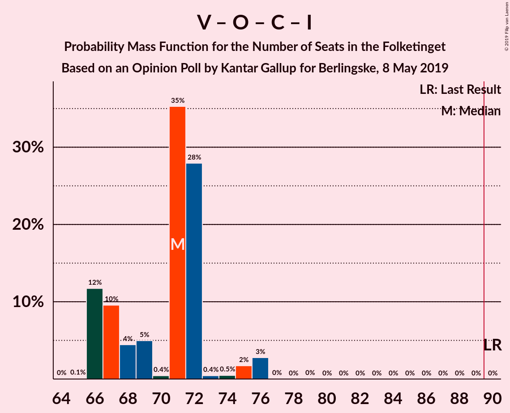

# Opinion Poll by Kantar Gallup for Berlingske, 8 May 2019

<a href="#voting-intentions">Voting Intentions</a> | <a href="#seats">Seats</a> | <a href="#coalitions">Coalitions</a> | <a href="#technical-information">Technical Information</a>

## Voting Intentions

### Confidence Intervals

| Party | Last Result | Poll Result | 80% Confidence Interval | 90% Confidence Interval | 95% Confidence Interval | 99% Confidence Interval |
|:-----:|:-----------:|:-----------:|:-----------------------:|:-----------------------:|:-----------------------:|:-----------------------:|
| Socialdemokraterne | 26.3% | 24.4% | 23.1–25.8% |22.7–26.2% |22.4–26.5% |21.8–27.2% |
| Venstre | 19.5% | 17.9% | 16.8–19.2% |16.4–19.5% |16.2–19.8% |15.6–20.5% |
| Dansk Folkeparti | 21.1% | 12.5% | 11.6–13.6% |11.3–13.9% |11.1–14.2% |10.6–14.8% |
| Enhedslisten–De Rød-Grønne | 7.8% | 9.2% | 8.4–10.2% |8.1–10.5% |7.9–10.7% |7.5–11.2% |
| Radikale Venstre | 4.6% | 8.4% | 7.6–9.3% |7.4–9.6% |7.2–9.8% |6.8–10.3% |
| Socialistisk Folkeparti | 4.2% | 7.2% | 6.5–8.1% |6.2–8.3% |6.1–8.6% |5.7–9.0% |
| Det Konservative Folkeparti | 3.4% | 4.8% | 4.2–5.5% |4.0–5.7% |3.9–5.9% |3.6–6.3% |
| Liberal Alliance | 7.5% | 4.1% | 3.5–4.8% |3.4–5.0% |3.2–5.1% |3.0–5.5% |
| Stram Kurs | 0.0% | 3.3% | 2.8–3.9% |2.7–4.1% |2.6–4.3% |2.3–4.6% |
| Alternativet | 4.8% | 3.1% | 2.7–3.7% |2.5–3.9% |2.4–4.1% |2.2–4.4% |
| Nye Borgerlige | 0.0% | 2.7% | 2.3–3.3% |2.1–3.5% |2.0–3.6% |1.8–3.9% |
| Kristendemokraterne | 0.8% | 1.1% | 0.9–1.5% |0.8–1.6% |0.7–1.8% |0.6–2.0% |
| Klaus Riskær Pedersen | 0.0% | 1.1% | 0.9–1.5% |0.8–1.6% |0.7–1.8% |0.6–2.0% |

*Note:* The poll result column reflects the actual value used in the calculations. Published results may vary slightly, and in addition be rounded to fewer digits.

## Seats

### Confidence Intervals

| Party | Last Result | Median | 80% Confidence Interval | 90% Confidence Interval | 95% Confidence Interval | 99% Confidence Interval |
|:-----:|:-----------:|:------:|:-----------------------:|:-----------------------:|:-----------------------:|:-----------------------:|
| <a href="#socialdemokraterne">Socialdemokraterne</a> | 47 | 43 | 42–46 |42–46 |40–46 |39–46 |
| <a href="#venstre">Venstre</a> | 34 | 31 | 30–32 |30–34 |30–35 |30–36 |
| <a href="#dansk-folkeparti">Dansk Folkeparti</a> | 37 | 23 | 20–24 |20–24 |19–25 |19–27 |
| <a href="#enhedslisten–de-rød-grønne">Enhedslisten–De Rød-Grønne</a> | 14 | 16 | 16–17 |16–18 |15–19 |14–19 |
| <a href="#radikale-venstre">Radikale Venstre</a> | 8 | 16 | 14–18 |14–18 |13–18 |13–18 |
| <a href="#socialistisk-folkeparti">Socialistisk Folkeparti</a> | 7 | 13 | 12–14 |12–14 |12–15 |11–15 |
| <a href="#det-konservative-folkeparti">Det Konservative Folkeparti</a> | 6 | 9 | 9–10 |7–11 |6–11 |6–11 |
| <a href="#liberal-alliance">Liberal Alliance</a> | 13 | 7 | 6–10 |6–10 |6–10 |6–10 |
| <a href="#stram-kurs">Stram Kurs</a> | 0 | 6 | 5–7 |5–7 |5–8 |4–8 |
| <a href="#alternativet">Alternativet</a> | 9 | 6 | 4–7 |4–7 |4–7 |4–7 |
| <a href="#nye-borgerlige">Nye Borgerlige</a> | 0 | 5 | 4–6 |4–6 |0–6 |0–7 |
| <a href="#kristendemokraterne">Kristendemokraterne</a> | 0 | 0 | 0 |0 |0 |0 |
| <a href="#klaus-riskær-pedersen">Klaus Riskær Pedersen</a> | 0 | 0 | 0 |0 |0 |0 |

### Socialdemokraterne

*For a full overview of the results for this party, see the [Socialdemokraterne](party-socialdemokraterne.html) page.*

| Number of Seats | Probability | Accumulated | Special Marks |
|:---------------:|:-----------:|:-----------:|:-------------:|
| 38 | 0.1% | 100% |  |
| 39 | 0.8% | 99.8% |  |
| 40 | 3% | 99.0% |  |
| 41 | 1.0% | 96% |  |
| 42 | 12% | 95% |  |
| 43 | 63% | 83% | Median |
| 44 | 6% | 20% |  |
| 45 | 3% | 14% |  |
| 46 | 10% | 10% |  |
| 47 | 0.1% | 0.4% | Last Result |
| 48 | 0.2% | 0.3% |  |
| 49 | 0% | 0.1% |  |
| 50 | 0% | 0% |  |

### Venstre

*For a full overview of the results for this party, see the [Venstre](party-venstre.html) page.*

| Number of Seats | Probability | Accumulated | Special Marks |
|:---------------:|:-----------:|:-----------:|:-------------:|
| 27 | 0% | 100% |  |
| 28 | 0.1% | 99.9% |  |
| 29 | 0.3% | 99.8% |  |
| 30 | 49% | 99.5% |  |
| 31 | 37% | 50% | Median |
| 32 | 5% | 13% |  |
| 33 | 2% | 8% |  |
| 34 | 2% | 6% | Last Result |
| 35 | 4% | 4% |  |
| 36 | 0.4% | 0.6% |  |
| 37 | 0% | 0.2% |  |
| 38 | 0.1% | 0.1% |  |
| 39 | 0% | 0% |  |

### Dansk Folkeparti

*For a full overview of the results for this party, see the [Dansk Folkeparti](party-danskfolkeparti.html) page.*

| Number of Seats | Probability | Accumulated | Special Marks |
|:---------------:|:-----------:|:-----------:|:-------------:|
| 18 | 0.1% | 100% |  |
| 19 | 3% | 99.9% |  |
| 20 | 14% | 97% |  |
| 21 | 11% | 83% |  |
| 22 | 1.0% | 72% |  |
| 23 | 28% | 71% | Median |
| 24 | 40% | 43% |  |
| 25 | 2% | 3% |  |
| 26 | 0% | 0.8% |  |
| 27 | 0.8% | 0.8% |  |
| 28 | 0% | 0% |  |
| 29 | 0% | 0% |  |
| 30 | 0% | 0% |  |
| 31 | 0% | 0% |  |
| 32 | 0% | 0% |  |
| 33 | 0% | 0% |  |
| 34 | 0% | 0% |  |
| 35 | 0% | 0% |  |
| 36 | 0% | 0% |  |
| 37 | 0% | 0% | Last Result |

### Enhedslisten–De Rød-Grønne

*For a full overview of the results for this party, see the [Enhedslisten–De Rød-Grønne](party-enhedslisten–derød-grønne.html) page.*

| Number of Seats | Probability | Accumulated | Special Marks |
|:---------------:|:-----------:|:-----------:|:-------------:|
| 12 | 0.1% | 100% |  |
| 13 | 0.2% | 99.9% |  |
| 14 | 0.5% | 99.7% | Last Result |
| 15 | 4% | 99.2% |  |
| 16 | 74% | 96% | Median |
| 17 | 12% | 21% |  |
| 18 | 5% | 9% |  |
| 19 | 4% | 4% |  |
| 20 | 0.1% | 0.1% |  |
| 21 | 0% | 0% |  |

### Radikale Venstre

*For a full overview of the results for this party, see the [Radikale Venstre](party-radikalevenstre.html) page.*

| Number of Seats | Probability | Accumulated | Special Marks |
|:---------------:|:-----------:|:-----------:|:-------------:|
| 8 | 0% | 100% | Last Result |
| 9 | 0% | 100% |  |
| 10 | 0% | 100% |  |
| 11 | 0% | 100% |  |
| 12 | 0.1% | 100% |  |
| 13 | 3% | 99.9% |  |
| 14 | 28% | 97% |  |
| 15 | 6% | 68% |  |
| 16 | 45% | 62% | Median |
| 17 | 4% | 17% |  |
| 18 | 12% | 13% |  |
| 19 | 0% | 0.1% |  |
| 20 | 0.1% | 0.1% |  |
| 21 | 0% | 0% |  |

### Socialistisk Folkeparti

*For a full overview of the results for this party, see the [Socialistisk Folkeparti](party-socialistiskfolkeparti.html) page.*

| Number of Seats | Probability | Accumulated | Special Marks |
|:---------------:|:-----------:|:-----------:|:-------------:|
| 7 | 0% | 100% | Last Result |
| 8 | 0% | 100% |  |
| 9 | 0% | 100% |  |
| 10 | 0.4% | 100% |  |
| 11 | 0.6% | 99.6% |  |
| 12 | 31% | 99.1% |  |
| 13 | 25% | 68% | Median |
| 14 | 39% | 43% |  |
| 15 | 3% | 4% |  |
| 16 | 0.2% | 0.4% |  |
| 17 | 0.1% | 0.1% |  |
| 18 | 0% | 0% |  |

### Det Konservative Folkeparti

*For a full overview of the results for this party, see the [Det Konservative Folkeparti](party-detkonservativefolkeparti.html) page.*

| Number of Seats | Probability | Accumulated | Special Marks |
|:---------------:|:-----------:|:-----------:|:-------------:|
| 6 | 3% | 100% | Last Result |
| 7 | 4% | 97% |  |
| 8 | 3% | 93% |  |
| 9 | 76% | 91% | Median |
| 10 | 5% | 14% |  |
| 11 | 10% | 10% |  |
| 12 | 0% | 0% |  |

### Liberal Alliance

*For a full overview of the results for this party, see the [Liberal Alliance](party-liberalalliance.html) page.*

| Number of Seats | Probability | Accumulated | Special Marks |
|:---------------:|:-----------:|:-----------:|:-------------:|
| 5 | 0.2% | 100% |  |
| 6 | 21% | 99.8% |  |
| 7 | 40% | 79% | Median |
| 8 | 10% | 38% |  |
| 9 | 1.4% | 28% |  |
| 10 | 26% | 27% |  |
| 11 | 0.2% | 0.4% |  |
| 12 | 0.2% | 0.2% |  |
| 13 | 0% | 0% | Last Result |

### Stram Kurs

*For a full overview of the results for this party, see the [Stram Kurs](party-stramkurs.html) page.*

| Number of Seats | Probability | Accumulated | Special Marks |
|:---------------:|:-----------:|:-----------:|:-------------:|
| 0 | 0% | 100% | Last Result |
| 1 | 0% | 100% |  |
| 2 | 0% | 100% |  |
| 3 | 0% | 100% |  |
| 4 | 0.5% | 100% |  |
| 5 | 42% | 99.5% |  |
| 6 | 15% | 58% | Median |
| 7 | 39% | 43% |  |
| 8 | 4% | 4% |  |
| 9 | 0.1% | 0.1% |  |
| 10 | 0% | 0% |  |

### Alternativet

*For a full overview of the results for this party, see the [Alternativet](party-alternativet.html) page.*

| Number of Seats | Probability | Accumulated | Special Marks |
|:---------------:|:-----------:|:-----------:|:-------------:|
| 4 | 35% | 100% |  |
| 5 | 11% | 65% |  |
| 6 | 42% | 54% | Median |
| 7 | 12% | 12% |  |
| 8 | 0.2% | 0.2% |  |
| 9 | 0% | 0% | Last Result |

### Nye Borgerlige

*For a full overview of the results for this party, see the [Nye Borgerlige](party-nyeborgerlige.html) page.*

| Number of Seats | Probability | Accumulated | Special Marks |
|:---------------:|:-----------:|:-----------:|:-------------:|
| 0 | 3% | 100% | Last Result |
| 1 | 0% | 97% |  |
| 2 | 0% | 97% |  |
| 3 | 0% | 97% |  |
| 4 | 16% | 97% |  |
| 5 | 35% | 81% | Median |
| 6 | 46% | 46% |  |
| 7 | 0.8% | 0.8% |  |
| 8 | 0% | 0% |  |

### Kristendemokraterne

*For a full overview of the results for this party, see the [Kristendemokraterne](party-kristendemokraterne.html) page.*

| Number of Seats | Probability | Accumulated | Special Marks |
|:---------------:|:-----------:|:-----------:|:-------------:|
| 0 | 99.9% | 100% | Last Result, Median |
| 1 | 0% | 0.1% |  |
| 2 | 0% | 0.1% |  |
| 3 | 0% | 0.1% |  |
| 4 | 0.1% | 0.1% |  |
| 5 | 0% | 0% |  |

### Klaus Riskær Pedersen

*For a full overview of the results for this party, see the [Klaus Riskær Pedersen](party-klausriskærpedersen.html) page.*

| Number of Seats | Probability | Accumulated | Special Marks |
|:---------------:|:-----------:|:-----------:|:-------------:|
| 0 | 99.8% | 100% | Last Result, Median |
| 1 | 0% | 0.2% |  |
| 2 | 0% | 0.2% |  |
| 3 | 0% | 0.2% |  |
| 4 | 0.2% | 0.2% |  |
| 5 | 0% | 0% |  |

## Coalitions

### Confidence Intervals

| Coalition | Last Result | Median | Majority? | 80% Confidence Interval | 90% Confidence Interval | 95% Confidence Interval | 99% Confidence Interval |
|:---------:|:-----------:|:------:|:---------:|:-----------------------:|:-----------------------:|:-----------------------:|:-----------------------:|
| Socialdemokraterne – Enhedslisten–De Rød-Grønne – Radikale Venstre – Socialistisk Folkeparti – Alternativet | 85 | 93 | 98% | 91–97 | 91–97 | 91–97 | 88–97 |
| Socialdemokraterne – Enhedslisten–De Rød-Grønne – Radikale Venstre – Socialistisk Folkeparti | 76 | 89 | 29% | 85–91 | 85–91 | 84–91 | 82–91 |
| Venstre – Dansk Folkeparti – Det Konservative Folkeparti – Liberal Alliance – Stram Kurs – Nye Borgerlige – Klaus Riskær Pedersen – Kristendemokraterne | 90 | 82 | 0% | 78–84 | 78–84 | 78–84 | 78–87 |
| Socialdemokraterne – Enhedslisten–De Rød-Grønne – Socialistisk Folkeparti – Alternativet | 77 | 77 | 0% | 77–81 | 77–81 | 76–81 | 74–82 |
| Venstre – Dansk Folkeparti – Det Konservative Folkeparti – Liberal Alliance – Nye Borgerlige – Klaus Riskær Pedersen – Kristendemokraterne | 90 | 77 | 0% | 71–77 | 71–77 | 71–79 | 71–80 |
| Venstre – Dansk Folkeparti – Det Konservative Folkeparti – Liberal Alliance – Nye Borgerlige – Klaus Riskær Pedersen | 90 | 77 | 0% | 71–77 | 71–77 | 71–79 | 71–80 |
| Venstre – Dansk Folkeparti – Det Konservative Folkeparti – Liberal Alliance – Nye Borgerlige – Kristendemokraterne | 90 | 77 | 0% | 71–77 | 71–77 | 71–79 | 71–80 |
| Venstre – Dansk Folkeparti – Det Konservative Folkeparti – Liberal Alliance – Nye Borgerlige | 90 | 77 | 0% | 71–77 | 71–77 | 71–79 | 71–80 |
| Socialdemokraterne – Enhedslisten–De Rød-Grønne – Socialistisk Folkeparti | 68 | 73 | 0% | 71–75 | 71–75 | 70–76 | 68–77 |
| Venstre – Dansk Folkeparti – Det Konservative Folkeparti – Liberal Alliance – Kristendemokraterne | 90 | 71 | 0% | 66–72 | 66–74 | 66–76 | 66–76 |
| Venstre – Dansk Folkeparti – Det Konservative Folkeparti – Liberal Alliance | 90 | 71 | 0% | 66–72 | 66–74 | 66–76 | 66–76 |
| Socialdemokraterne – Radikale Venstre – Socialistisk Folkeparti | 62 | 73 | 0% | 69–75 | 69–75 | 69–75 | 67–76 |
| Socialdemokraterne – Radikale Venstre | 55 | 59 | 0% | 57–62 | 57–62 | 56–63 | 53–63 |
| Venstre – Det Konservative Folkeparti – Liberal Alliance | 53 | 47 | 0% | 45–49 | 45–50 | 45–52 | 44–52 |
| Venstre – Det Konservative Folkeparti | 40 | 40 | 0% | 39–41 | 39–42 | 37–45 | 36–45 |
| Venstre | 34 | 31 | 0% | 30–32 | 30–34 | 30–35 | 30–36 |

### Socialdemokraterne – Enhedslisten–De Rød-Grønne – Radikale Venstre – Socialistisk Folkeparti – Alternativet

| Number of Seats | Probability | Accumulated | Special Marks |
|:---------------:|:-----------:|:-----------:|:-------------:|
| 85 | 0% | 100% | Last Result |
| 86 | 0% | 100% |  |
| 87 | 0.1% | 100% |  |
| 88 | 0.6% | 99.9% |  |
| 89 | 1.0% | 99.3% |  |
| 90 | 0% | 98% | Majority |
| 91 | 28% | 98% |  |
| 92 | 1.3% | 70% |  |
| 93 | 35% | 69% |  |
| 94 | 5% | 34% | Median |
| 95 | 0.6% | 29% |  |
| 96 | 9% | 29% |  |
| 97 | 20% | 20% |  |
| 98 | 0.1% | 0.2% |  |
| 99 | 0% | 0.1% |  |
| 100 | 0% | 0.1% |  |
| 101 | 0% | 0.1% |  |
| 102 | 0% | 0% |  |

### Socialdemokraterne – Enhedslisten–De Rød-Grønne – Radikale Venstre – Socialistisk Folkeparti

| Number of Seats | Probability | Accumulated | Special Marks |
|:---------------:|:-----------:|:-----------:|:-------------:|
| 76 | 0% | 100% | Last Result |
| 77 | 0% | 100% |  |
| 78 | 0% | 100% |  |
| 79 | 0% | 100% |  |
| 80 | 0% | 100% |  |
| 81 | 0% | 100% |  |
| 82 | 0.6% | 100% |  |
| 83 | 0.1% | 99.3% |  |
| 84 | 2% | 99.2% |  |
| 85 | 27% | 97% |  |
| 86 | 0.2% | 70% |  |
| 87 | 1.4% | 70% |  |
| 88 | 1.1% | 69% | Median |
| 89 | 39% | 68% |  |
| 90 | 14% | 29% | Majority |
| 91 | 14% | 15% |  |
| 92 | 0.1% | 0.3% |  |
| 93 | 0.1% | 0.2% |  |
| 94 | 0% | 0.1% |  |
| 95 | 0% | 0.1% |  |
| 96 | 0.1% | 0.1% |  |
| 97 | 0% | 0% |  |

### Venstre – Dansk Folkeparti – Det Konservative Folkeparti – Liberal Alliance – Stram Kurs – Nye Borgerlige – Klaus Riskær Pedersen – Kristendemokraterne

| Number of Seats | Probability | Accumulated | Special Marks |
|:---------------:|:-----------:|:-----------:|:-------------:|
| 74 | 0% | 100% |  |
| 75 | 0% | 99.9% |  |
| 76 | 0% | 99.9% |  |
| 77 | 0.1% | 99.9% |  |
| 78 | 20% | 99.8% |  |
| 79 | 9% | 80% |  |
| 80 | 0.6% | 71% |  |
| 81 | 5% | 71% | Median |
| 82 | 35% | 66% |  |
| 83 | 1.3% | 31% |  |
| 84 | 28% | 30% |  |
| 85 | 0% | 2% |  |
| 86 | 1.0% | 2% |  |
| 87 | 0.6% | 0.7% |  |
| 88 | 0.1% | 0.1% |  |
| 89 | 0% | 0% |  |
| 90 | 0% | 0% | Last Result, Majority |

### Socialdemokraterne – Enhedslisten–De Rød-Grønne – Socialistisk Folkeparti – Alternativet

| Number of Seats | Probability | Accumulated | Special Marks |
|:---------------:|:-----------:|:-----------:|:-------------:|
| 72 | 0% | 100% |  |
| 73 | 0.4% | 99.9% |  |
| 74 | 0.6% | 99.5% |  |
| 75 | 1.1% | 98.9% |  |
| 76 | 1.2% | 98% |  |
| 77 | 64% | 97% | Last Result |
| 78 | 3% | 33% | Median |
| 79 | 12% | 30% |  |
| 80 | 0.7% | 17% |  |
| 81 | 16% | 17% |  |
| 82 | 0.6% | 0.8% |  |
| 83 | 0% | 0.2% |  |
| 84 | 0.1% | 0.2% |  |
| 85 | 0% | 0.1% |  |
| 86 | 0% | 0.1% |  |
| 87 | 0% | 0% |  |

### Venstre – Dansk Folkeparti – Det Konservative Folkeparti – Liberal Alliance – Nye Borgerlige – Klaus Riskær Pedersen – Kristendemokraterne

| Number of Seats | Probability | Accumulated | Special Marks |
|:---------------:|:-----------:|:-----------:|:-------------:|
| 68 | 0.1% | 100% |  |
| 69 | 0.1% | 99.9% |  |
| 70 | 0% | 99.9% |  |
| 71 | 11% | 99.8% |  |
| 72 | 12% | 89% |  |
| 73 | 5% | 77% |  |
| 74 | 2% | 72% |  |
| 75 | 0.5% | 70% | Median |
| 76 | 4% | 69% |  |
| 77 | 61% | 65% |  |
| 78 | 0.8% | 4% |  |
| 79 | 1.3% | 3% |  |
| 80 | 1.1% | 2% |  |
| 81 | 0.4% | 0.5% |  |
| 82 | 0% | 0.1% |  |
| 83 | 0% | 0% |  |
| 84 | 0% | 0% |  |
| 85 | 0% | 0% |  |
| 86 | 0% | 0% |  |
| 87 | 0% | 0% |  |
| 88 | 0% | 0% |  |
| 89 | 0% | 0% |  |
| 90 | 0% | 0% | Last Result, Majority |

### Venstre – Dansk Folkeparti – Det Konservative Folkeparti – Liberal Alliance – Nye Borgerlige – Klaus Riskær Pedersen

| Number of Seats | Probability | Accumulated | Special Marks |
|:---------------:|:-----------:|:-----------:|:-------------:|
| 68 | 0.1% | 100% |  |
| 69 | 0.1% | 99.9% |  |
| 70 | 0% | 99.9% |  |
| 71 | 11% | 99.8% |  |
| 72 | 12% | 89% |  |
| 73 | 5% | 77% |  |
| 74 | 2% | 72% |  |
| 75 | 0.6% | 69% | Median |
| 76 | 4% | 69% |  |
| 77 | 61% | 65% |  |
| 78 | 0.8% | 4% |  |
| 79 | 1.3% | 3% |  |
| 80 | 1.1% | 2% |  |
| 81 | 0.4% | 0.4% |  |
| 82 | 0% | 0% |  |
| 83 | 0% | 0% |  |
| 84 | 0% | 0% |  |
| 85 | 0% | 0% |  |
| 86 | 0% | 0% |  |
| 87 | 0% | 0% |  |
| 88 | 0% | 0% |  |
| 89 | 0% | 0% |  |
| 90 | 0% | 0% | Last Result, Majority |

### Venstre – Dansk Folkeparti – Det Konservative Folkeparti – Liberal Alliance – Nye Borgerlige – Kristendemokraterne

| Number of Seats | Probability | Accumulated | Special Marks |
|:---------------:|:-----------:|:-----------:|:-------------:|
| 68 | 0.1% | 100% |  |
| 69 | 0.1% | 99.9% |  |
| 70 | 0% | 99.9% |  |
| 71 | 11% | 99.8% |  |
| 72 | 12% | 89% |  |
| 73 | 5% | 77% |  |
| 74 | 2% | 72% |  |
| 75 | 0.6% | 69% | Median |
| 76 | 4% | 69% |  |
| 77 | 61% | 65% |  |
| 78 | 0.8% | 4% |  |
| 79 | 1.3% | 3% |  |
| 80 | 1.1% | 2% |  |
| 81 | 0.4% | 0.5% |  |
| 82 | 0% | 0.1% |  |
| 83 | 0% | 0% |  |
| 84 | 0% | 0% |  |
| 85 | 0% | 0% |  |
| 86 | 0% | 0% |  |
| 87 | 0% | 0% |  |
| 88 | 0% | 0% |  |
| 89 | 0% | 0% |  |
| 90 | 0% | 0% | Last Result, Majority |

### Venstre – Dansk Folkeparti – Det Konservative Folkeparti – Liberal Alliance – Nye Borgerlige

| Number of Seats | Probability | Accumulated | Special Marks |
|:---------------:|:-----------:|:-----------:|:-------------:|
| 68 | 0.1% | 100% |  |
| 69 | 0.1% | 99.9% |  |
| 70 | 0% | 99.9% |  |
| 71 | 11% | 99.8% |  |
| 72 | 12% | 89% |  |
| 73 | 5% | 77% |  |
| 74 | 2% | 72% |  |
| 75 | 0.6% | 69% | Median |
| 76 | 4% | 69% |  |
| 77 | 61% | 65% |  |
| 78 | 0.8% | 4% |  |
| 79 | 1.3% | 3% |  |
| 80 | 1.1% | 2% |  |
| 81 | 0.4% | 0.4% |  |
| 82 | 0% | 0% |  |
| 83 | 0% | 0% |  |
| 84 | 0% | 0% |  |
| 85 | 0% | 0% |  |
| 86 | 0% | 0% |  |
| 87 | 0% | 0% |  |
| 88 | 0% | 0% |  |
| 89 | 0% | 0% |  |
| 90 | 0% | 0% | Last Result, Majority |

### Socialdemokraterne – Enhedslisten–De Rød-Grønne – Socialistisk Folkeparti

| Number of Seats | Probability | Accumulated | Special Marks |
|:---------------:|:-----------:|:-----------:|:-------------:|
| 66 | 0% | 100% |  |
| 67 | 0.4% | 99.9% |  |
| 68 | 0.4% | 99.5% | Last Result |
| 69 | 1.3% | 99.1% |  |
| 70 | 1.2% | 98% |  |
| 71 | 27% | 97% |  |
| 72 | 12% | 69% | Median |
| 73 | 38% | 57% |  |
| 74 | 2% | 19% |  |
| 75 | 13% | 17% |  |
| 76 | 3% | 3% |  |
| 77 | 0.7% | 0.8% |  |
| 78 | 0% | 0.1% |  |
| 79 | 0.1% | 0.1% |  |
| 80 | 0% | 0.1% |  |
| 81 | 0% | 0% |  |

### Venstre – Dansk Folkeparti – Det Konservative Folkeparti – Liberal Alliance – Kristendemokraterne

| Number of Seats | Probability | Accumulated | Special Marks |
|:---------------:|:-----------:|:-----------:|:-------------:|
| 64 | 0% | 100% |  |
| 65 | 0.1% | 99.9% |  |
| 66 | 12% | 99.8% |  |
| 67 | 10% | 88% |  |
| 68 | 4% | 79% |  |
| 69 | 5% | 74% |  |
| 70 | 0.4% | 69% | Median |
| 71 | 35% | 69% |  |
| 72 | 28% | 33% |  |
| 73 | 0.5% | 6% |  |
| 74 | 0.5% | 5% |  |
| 75 | 2% | 5% |  |
| 76 | 3% | 3% |  |
| 77 | 0% | 0.1% |  |
| 78 | 0% | 0% |  |
| 79 | 0% | 0% |  |
| 80 | 0% | 0% |  |
| 81 | 0% | 0% |  |
| 82 | 0% | 0% |  |
| 83 | 0% | 0% |  |
| 84 | 0% | 0% |  |
| 85 | 0% | 0% |  |
| 86 | 0% | 0% |  |
| 87 | 0% | 0% |  |
| 88 | 0% | 0% |  |
| 89 | 0% | 0% |  |
| 90 | 0% | 0% | Last Result, Majority |

### Venstre – Dansk Folkeparti – Det Konservative Folkeparti – Liberal Alliance

| Number of Seats | Probability | Accumulated | Special Marks |
|:---------------:|:-----------:|:-----------:|:-------------:|
| 64 | 0% | 100% |  |
| 65 | 0.1% | 99.9% |  |
| 66 | 12% | 99.8% |  |
| 67 | 10% | 88% |  |
| 68 | 4% | 79% |  |
| 69 | 5% | 74% |  |
| 70 | 0.4% | 69% | Median |
| 71 | 35% | 69% |  |
| 72 | 28% | 33% |  |
| 73 | 0.4% | 5% |  |
| 74 | 0.5% | 5% |  |
| 75 | 2% | 5% |  |
| 76 | 3% | 3% |  |
| 77 | 0% | 0.1% |  |
| 78 | 0% | 0% |  |
| 79 | 0% | 0% |  |
| 80 | 0% | 0% |  |
| 81 | 0% | 0% |  |
| 82 | 0% | 0% |  |
| 83 | 0% | 0% |  |
| 84 | 0% | 0% |  |
| 85 | 0% | 0% |  |
| 86 | 0% | 0% |  |
| 87 | 0% | 0% |  |
| 88 | 0% | 0% |  |
| 89 | 0% | 0% |  |
| 90 | 0% | 0% | Last Result, Majority |

### Socialdemokraterne – Radikale Venstre – Socialistisk Folkeparti

| Number of Seats | Probability | Accumulated | Special Marks |
|:---------------:|:-----------:|:-----------:|:-------------:|
| 62 | 0% | 100% | Last Result |
| 63 | 0% | 100% |  |
| 64 | 0% | 100% |  |
| 65 | 0.4% | 100% |  |
| 66 | 0.1% | 99.6% |  |
| 67 | 2% | 99.5% |  |
| 68 | 0.2% | 98% |  |
| 69 | 27% | 98% |  |
| 70 | 2% | 71% |  |
| 71 | 6% | 69% |  |
| 72 | 2% | 63% | Median |
| 73 | 45% | 60% |  |
| 74 | 0.9% | 15% |  |
| 75 | 12% | 14% |  |
| 76 | 2% | 2% |  |
| 77 | 0% | 0.1% |  |
| 78 | 0% | 0.1% |  |
| 79 | 0.1% | 0.1% |  |
| 80 | 0% | 0% |  |

### Socialdemokraterne – Radikale Venstre

| Number of Seats | Probability | Accumulated | Special Marks |
|:---------------:|:-----------:|:-----------:|:-------------:|
| 52 | 0% | 100% |  |
| 53 | 1.1% | 99.9% |  |
| 54 | 0.2% | 98.9% |  |
| 55 | 0.7% | 98.6% | Last Result |
| 56 | 0.7% | 98% |  |
| 57 | 32% | 97% |  |
| 58 | 3% | 65% |  |
| 59 | 38% | 63% | Median |
| 60 | 10% | 25% |  |
| 61 | 2% | 15% |  |
| 62 | 10% | 13% |  |
| 63 | 3% | 3% |  |
| 64 | 0% | 0.1% |  |
| 65 | 0% | 0.1% |  |
| 66 | 0% | 0% |  |

### Venstre – Det Konservative Folkeparti – Liberal Alliance

| Number of Seats | Probability | Accumulated | Special Marks |
|:---------------:|:-----------:|:-----------:|:-------------:|
| 41 | 0.1% | 100% |  |
| 42 | 0% | 99.9% |  |
| 43 | 0% | 99.9% |  |
| 44 | 2% | 99.9% |  |
| 45 | 12% | 98% |  |
| 46 | 2% | 86% |  |
| 47 | 46% | 84% | Median |
| 48 | 2% | 39% |  |
| 49 | 29% | 37% |  |
| 50 | 3% | 7% |  |
| 51 | 0.6% | 4% |  |
| 52 | 3% | 4% |  |
| 53 | 0.3% | 0.4% | Last Result |
| 54 | 0% | 0.1% |  |
| 55 | 0% | 0% |  |

### Venstre – Det Konservative Folkeparti

| Number of Seats | Probability | Accumulated | Special Marks |
|:---------------:|:-----------:|:-----------:|:-------------:|
| 34 | 0.1% | 100% |  |
| 35 | 0% | 99.9% |  |
| 36 | 2% | 99.9% |  |
| 37 | 2% | 98% |  |
| 38 | 0.6% | 96% |  |
| 39 | 39% | 96% |  |
| 40 | 36% | 57% | Last Result, Median |
| 41 | 14% | 21% |  |
| 42 | 3% | 7% |  |
| 43 | 0.2% | 4% |  |
| 44 | 1.3% | 4% |  |
| 45 | 3% | 3% |  |
| 46 | 0.3% | 0.3% |  |
| 47 | 0% | 0% |  |

### Venstre

| Number of Seats | Probability | Accumulated | Special Marks |
|:---------------:|:-----------:|:-----------:|:-------------:|
| 27 | 0% | 100% |  |
| 28 | 0.1% | 99.9% |  |
| 29 | 0.3% | 99.8% |  |
| 30 | 49% | 99.5% |  |
| 31 | 37% | 50% | Median |
| 32 | 5% | 13% |  |
| 33 | 2% | 8% |  |
| 34 | 2% | 6% | Last Result |
| 35 | 4% | 4% |  |
| 36 | 0.4% | 0.6% |  |
| 37 | 0% | 0.2% |  |
| 38 | 0.1% | 0.1% |  |
| 39 | 0% | 0% |  |

## Technical Information

### Opinion Poll

+ **Polling firm:** Kantar Gallup
+ **Commissioner(s):** Berlingske
+ **Fieldwork period:** 8 May 2019

### Calculations

+ **Sample size:** 1690
+ **Simulations done:** 1,048,576
+ **Error estimate:** 1.52%

