# Opinion Poll by Norstat for Altinget and Jyllands-Posten, 2–8 May 2019

<a href="#voting-intentions">Voting Intentions</a> | <a href="#seats">Seats</a> | <a href="#coalitions">Coalitions</a> | <a href="#technical-information">Technical Information</a>

## Voting Intentions

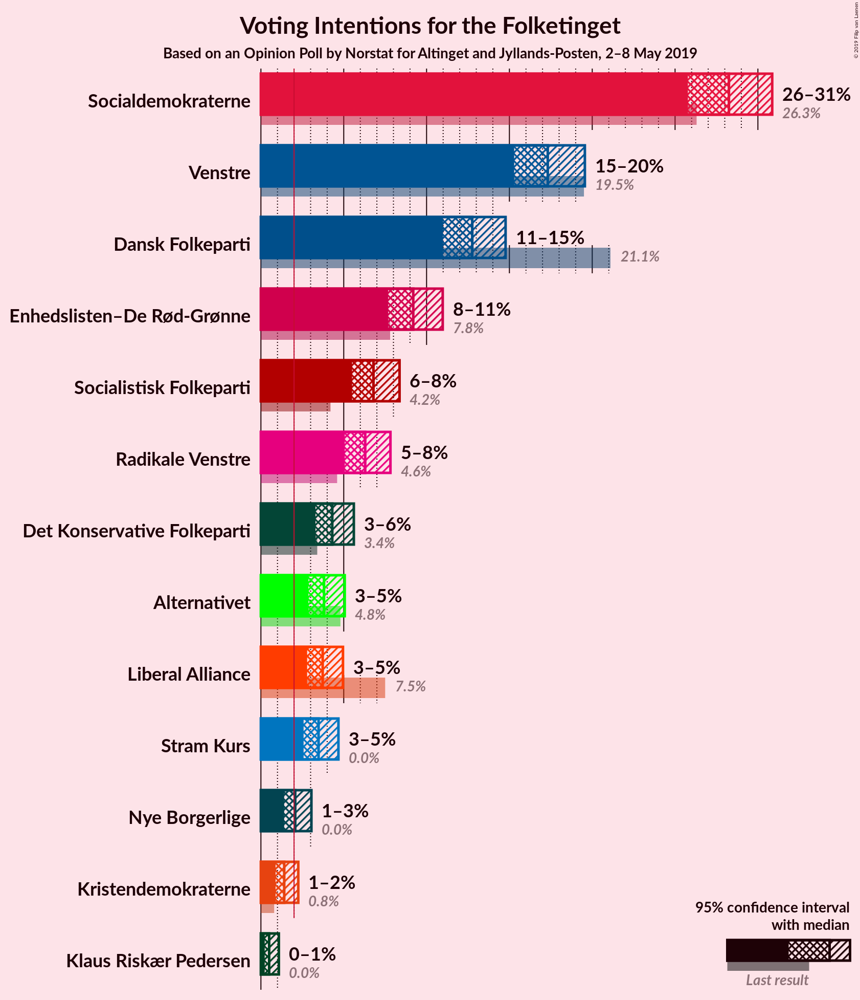

### Confidence Intervals

| Party | Last Result | Poll Result | 80% Confidence Interval | 90% Confidence Interval | 95% Confidence Interval | 99% Confidence Interval |
|:-----:|:-----------:|:-----------:|:-----------------------:|:-----------------------:|:-----------------------:|:-----------------------:|
| Socialdemokraterne | 26.3% | 28.3% | 26.6–30.0% |26.2–30.5% |25.8–30.9% |25.0–31.7% |
| Venstre | 19.5% | 17.3% | 16.0–18.8% |15.6–19.2% |15.3–19.6% |14.7–20.3% |
| Dansk Folkeparti | 21.1% | 12.8% | 11.6–14.1% |11.3–14.4% |11.0–14.8% |10.5–15.4% |
| Enhedslisten–De Rød-Grønne | 7.8% | 9.2% | 8.2–10.3% |7.9–10.7% |7.7–11.0% |7.2–11.5% |
| Socialistisk Folkeparti | 4.2% | 6.8% | 5.9–7.8% |5.7–8.1% |5.5–8.4% |5.1–8.9% |
| Radikale Venstre | 4.6% | 6.3% | 5.5–7.3% |5.2–7.6% |5.1–7.8% |4.7–8.3% |
| Det Konservative Folkeparti | 3.4% | 4.3% | 3.6–5.2% |3.5–5.4% |3.3–5.6% |3.0–6.1% |
| Alternativet | 4.8% | 3.8% | 3.2–4.6% |3.0–4.8% |2.9–5.1% |2.6–5.5% |
| Liberal Alliance | 7.5% | 3.7% | 3.1–4.5% |2.9–4.8% |2.8–5.0% |2.5–5.4% |
| Stram Kurs | 0.0% | 3.5% | 2.9–4.3% |2.7–4.5% |2.6–4.7% |2.3–5.1% |
| Nye Borgerlige | 0.0% | 2.1% | 1.6–2.7% |1.5–2.9% |1.4–3.0% |1.2–3.4% |
| Kristendemokraterne | 0.8% | 1.4% | 1.1–2.0% |1.0–2.1% |0.9–2.3% |0.7–2.5% |
| Klaus Riskær Pedersen | 0.0% | 0.5% | 0.3–0.9% |0.3–1.0% |0.2–1.1% |0.2–1.3% |

*Note:* The poll result column reflects the actual value used in the calculations. Published results may vary slightly, and in addition be rounded to fewer digits.

## Seats

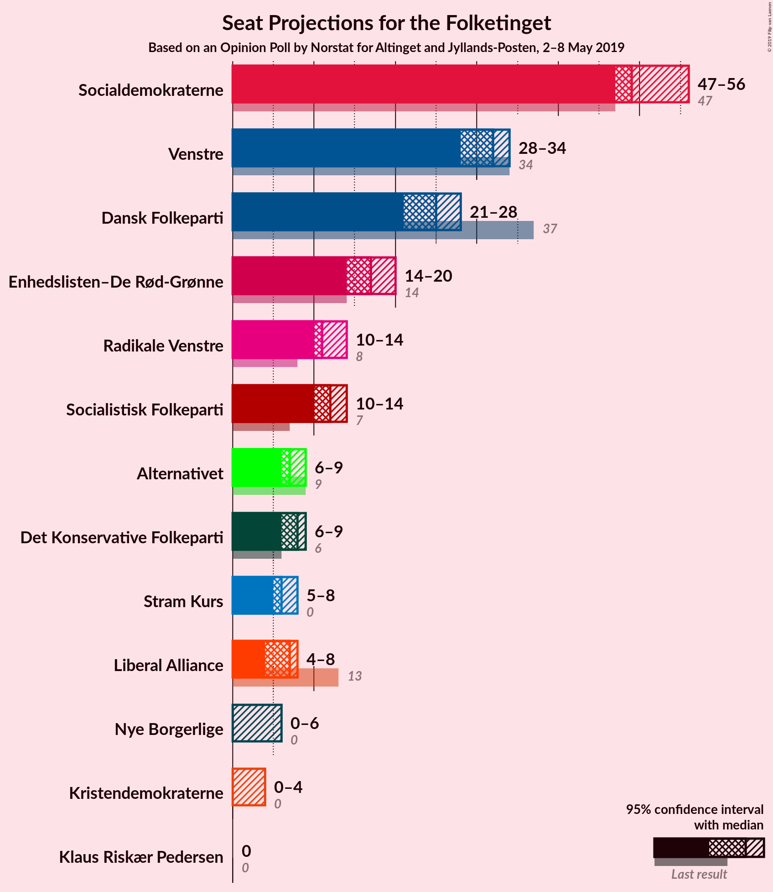

### Confidence Intervals

| Party | Last Result | Median | 80% Confidence Interval | 90% Confidence Interval | 95% Confidence Interval | 99% Confidence Interval |
|:-----:|:-----------:|:------:|:-----------------------:|:-----------------------:|:-----------------------:|:-----------------------:|
| <a href="#socialdemokraterne">Socialdemokraterne</a> | 47 | 49 | 49–53 |47–54 |47–56 |44–57 |
| <a href="#venstre">Venstre</a> | 34 | 32 | 29–32 |28–32 |28–34 |27–34 |
| <a href="#dansk-folkeparti">Dansk Folkeparti</a> | 37 | 25 | 22–26 |21–28 |21–28 |19–28 |
| <a href="#enhedslisten–de-rød-grønne">Enhedslisten–De Rød-Grønne</a> | 14 | 17 | 14–19 |14–19 |14–20 |14–20 |
| <a href="#socialistisk-folkeparti">Socialistisk Folkeparti</a> | 7 | 12 | 10–13 |10–13 |10–14 |9–15 |
| <a href="#radikale-venstre">Radikale Venstre</a> | 8 | 11 | 10–13 |10–13 |10–14 |9–14 |
| <a href="#det-konservative-folkeparti">Det Konservative Folkeparti</a> | 6 | 8 | 7–9 |7–9 |6–9 |6–10 |
| <a href="#alternativet">Alternativet</a> | 9 | 7 | 7–8 |6–8 |6–9 |4–10 |
| <a href="#liberal-alliance">Liberal Alliance</a> | 13 | 7 | 6–8 |6–8 |4–8 |4–10 |
| <a href="#stram-kurs">Stram Kurs</a> | 0 | 6 | 5–7 |5–7 |5–8 |4–8 |
| <a href="#nye-borgerlige">Nye Borgerlige</a> | 0 | 0 | 0–4 |0–5 |0–6 |0–6 |
| <a href="#kristendemokraterne">Kristendemokraterne</a> | 0 | 0 | 0 |0–4 |0–4 |0–4 |
| <a href="#klaus-riskær-pedersen">Klaus Riskær Pedersen</a> | 0 | 0 | 0 |0 |0 |0 |

### Socialdemokraterne

*For a full overview of the results for this party, see the [Socialdemokraterne](party-socialdemokraterne.html) page.*

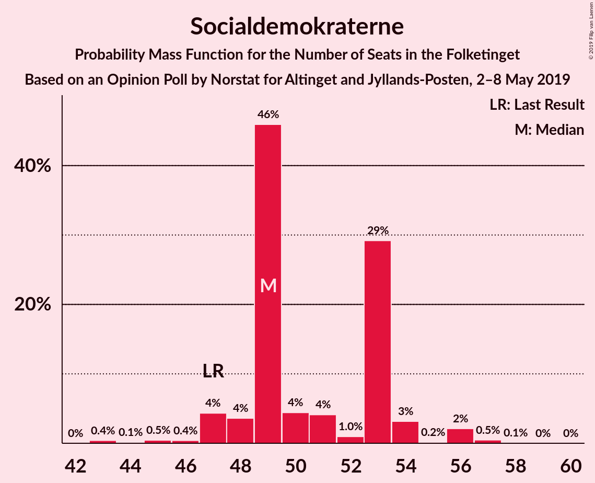

| Number of Seats | Probability | Accumulated | Special Marks |
|:---------------:|:-----------:|:-----------:|:-------------:|
| 43 | 0.4% | 100% |  |
| 44 | 0.1% | 99.6% |  |
| 45 | 0.5% | 99.4% |  |
| 46 | 0.4% | 99.0% |  |
| 47 | 4% | 98.6% | Last Result |
| 48 | 4% | 94% |  |
| 49 | 46% | 91% | Median |
| 50 | 4% | 45% |  |
| 51 | 4% | 40% |  |
| 52 | 1.0% | 36% |  |
| 53 | 29% | 35% |  |
| 54 | 3% | 6% |  |
| 55 | 0.2% | 3% |  |
| 56 | 2% | 3% |  |
| 57 | 0.5% | 0.6% |  |
| 58 | 0.1% | 0.1% |  |
| 59 | 0% | 0% |  |

### Venstre

*For a full overview of the results for this party, see the [Venstre](party-venstre.html) page.*

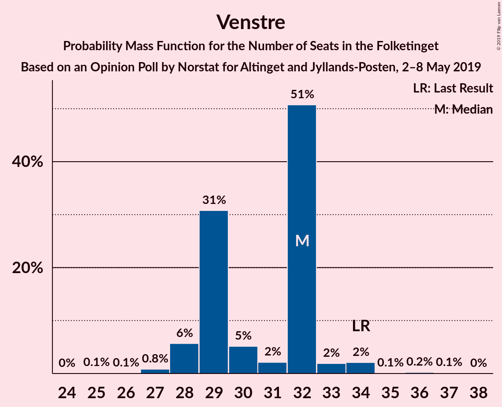

| Number of Seats | Probability | Accumulated | Special Marks |
|:---------------:|:-----------:|:-----------:|:-------------:|
| 25 | 0.1% | 100% |  |
| 26 | 0.1% | 99.8% |  |
| 27 | 0.8% | 99.7% |  |
| 28 | 6% | 98.9% |  |
| 29 | 31% | 93% |  |
| 30 | 5% | 62% |  |
| 31 | 2% | 57% |  |
| 32 | 51% | 55% | Median |
| 33 | 2% | 4% |  |
| 34 | 2% | 3% | Last Result |
| 35 | 0.1% | 0.5% |  |
| 36 | 0.2% | 0.4% |  |
| 37 | 0.1% | 0.2% |  |
| 38 | 0% | 0% |  |

### Dansk Folkeparti

*For a full overview of the results for this party, see the [Dansk Folkeparti](party-danskfolkeparti.html) page.*

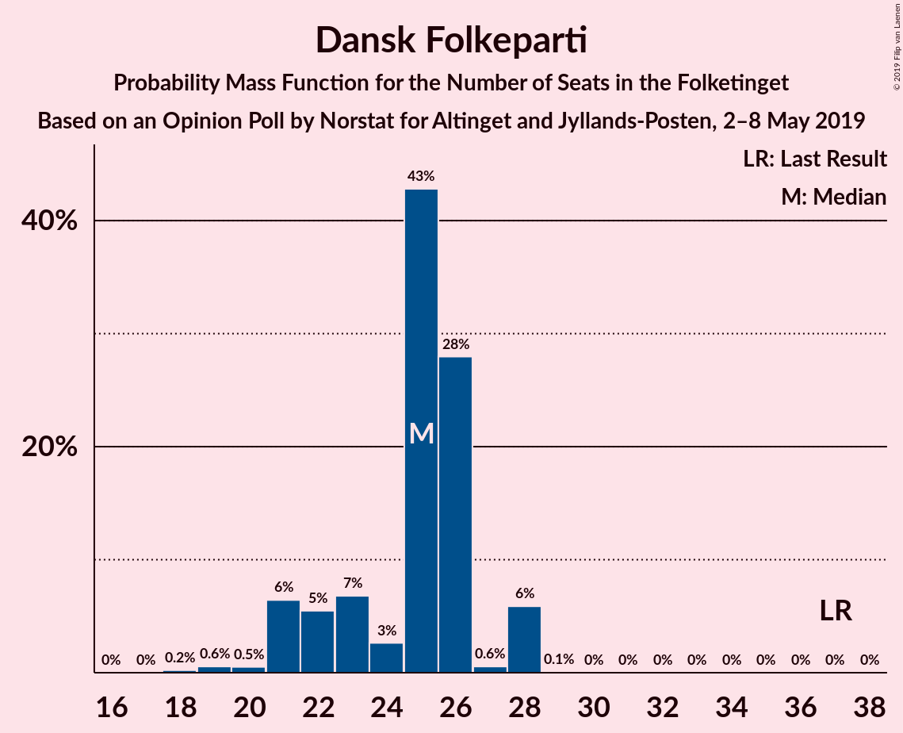

| Number of Seats | Probability | Accumulated | Special Marks |
|:---------------:|:-----------:|:-----------:|:-------------:|
| 18 | 0.2% | 100% |  |
| 19 | 0.6% | 99.8% |  |
| 20 | 0.5% | 99.2% |  |
| 21 | 6% | 98.7% |  |
| 22 | 5% | 92% |  |
| 23 | 7% | 87% |  |
| 24 | 3% | 80% |  |
| 25 | 43% | 77% | Median |
| 26 | 28% | 35% |  |
| 27 | 0.6% | 7% |  |
| 28 | 6% | 6% |  |
| 29 | 0.1% | 0.1% |  |
| 30 | 0% | 0% |  |
| 31 | 0% | 0% |  |
| 32 | 0% | 0% |  |
| 33 | 0% | 0% |  |
| 34 | 0% | 0% |  |
| 35 | 0% | 0% |  |
| 36 | 0% | 0% |  |
| 37 | 0% | 0% | Last Result |

### Enhedslisten–De Rød-Grønne

*For a full overview of the results for this party, see the [Enhedslisten–De Rød-Grønne](party-enhedslisten–derød-grønne.html) page.*

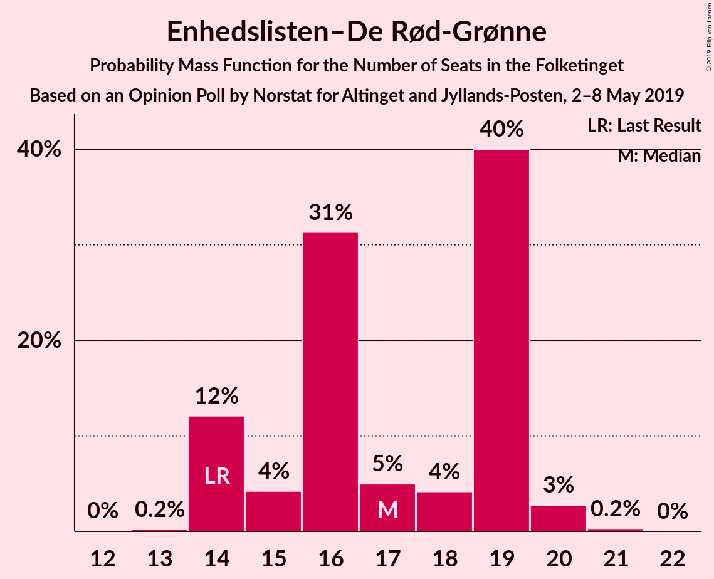

| Number of Seats | Probability | Accumulated | Special Marks |
|:---------------:|:-----------:|:-----------:|:-------------:|
| 13 | 0.2% | 100% |  |
| 14 | 12% | 99.8% | Last Result |
| 15 | 4% | 88% |  |
| 16 | 31% | 83% |  |
| 17 | 5% | 52% | Median |
| 18 | 4% | 47% |  |
| 19 | 40% | 43% |  |
| 20 | 3% | 3% |  |
| 21 | 0.2% | 0.3% |  |
| 22 | 0% | 0% |  |

### Socialistisk Folkeparti

*For a full overview of the results for this party, see the [Socialistisk Folkeparti](party-socialistiskfolkeparti.html) page.*

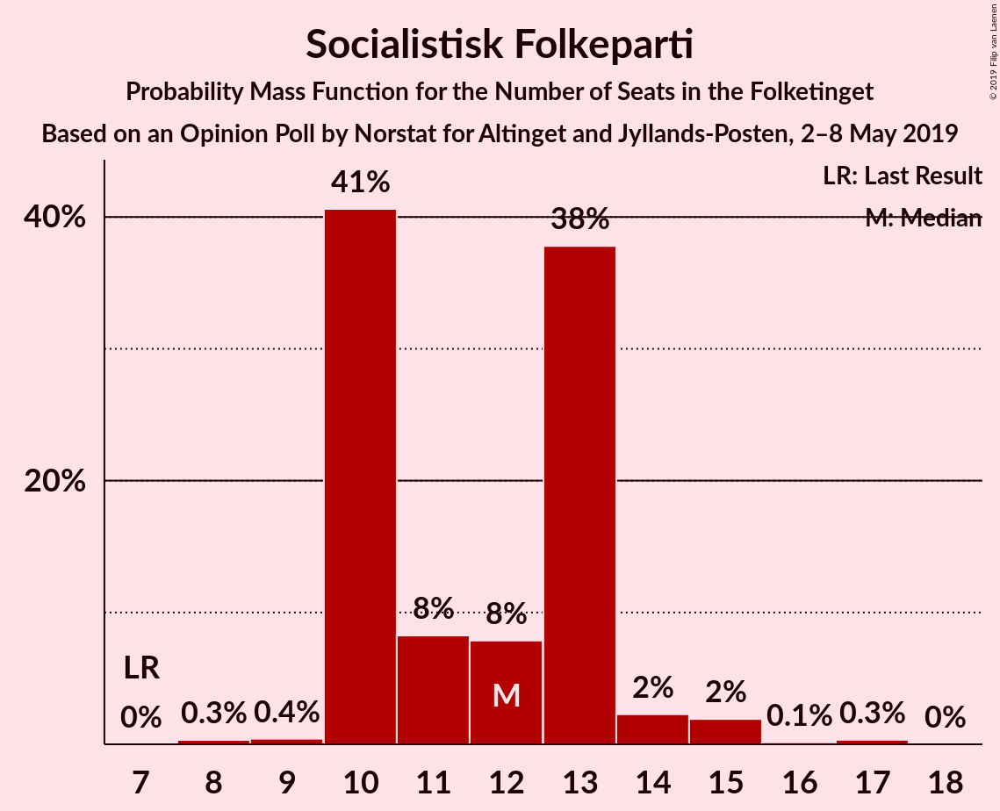

| Number of Seats | Probability | Accumulated | Special Marks |
|:---------------:|:-----------:|:-----------:|:-------------:|
| 7 | 0% | 100% | Last Result |
| 8 | 0.3% | 100% |  |
| 9 | 0.4% | 99.7% |  |
| 10 | 41% | 99.2% |  |
| 11 | 8% | 59% |  |
| 12 | 8% | 50% | Median |
| 13 | 38% | 42% |  |
| 14 | 2% | 5% |  |
| 15 | 2% | 2% |  |
| 16 | 0.1% | 0.5% |  |
| 17 | 0.3% | 0.3% |  |
| 18 | 0% | 0% |  |

### Radikale Venstre

*For a full overview of the results for this party, see the [Radikale Venstre](party-radikalevenstre.html) page.*

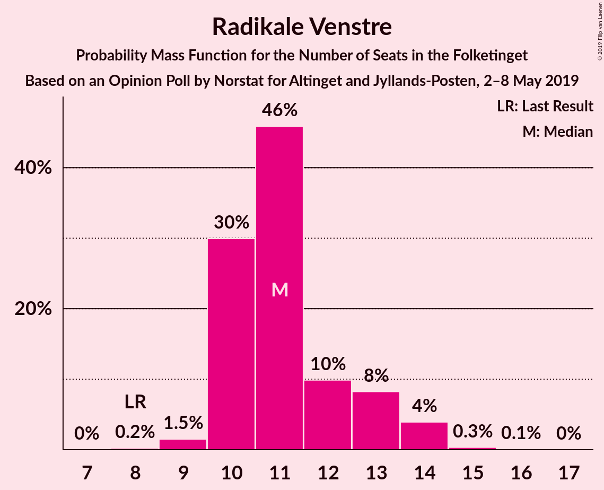

| Number of Seats | Probability | Accumulated | Special Marks |
|:---------------:|:-----------:|:-----------:|:-------------:|
| 8 | 0.2% | 100% | Last Result |
| 9 | 1.5% | 99.8% |  |
| 10 | 30% | 98% |  |
| 11 | 46% | 68% | Median |
| 12 | 10% | 22% |  |
| 13 | 8% | 13% |  |
| 14 | 4% | 4% |  |
| 15 | 0.3% | 0.4% |  |
| 16 | 0.1% | 0.1% |  |
| 17 | 0% | 0% |  |

### Det Konservative Folkeparti

*For a full overview of the results for this party, see the [Det Konservative Folkeparti](party-detkonservativefolkeparti.html) page.*

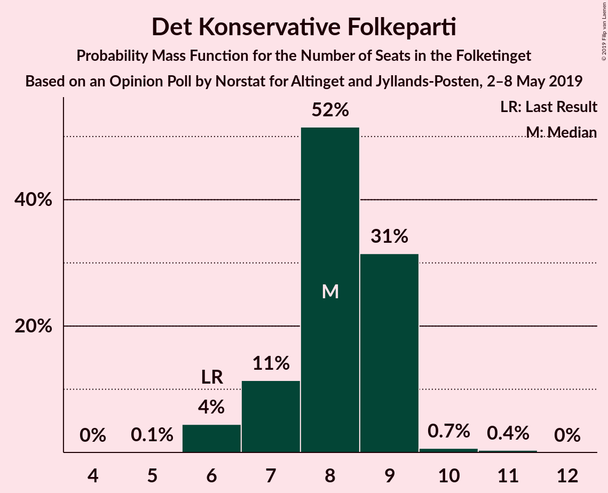

| Number of Seats | Probability | Accumulated | Special Marks |
|:---------------:|:-----------:|:-----------:|:-------------:|
| 5 | 0.1% | 100% |  |
| 6 | 4% | 99.9% | Last Result |
| 7 | 11% | 95% |  |
| 8 | 52% | 84% | Median |
| 9 | 31% | 33% |  |
| 10 | 0.7% | 1.0% |  |
| 11 | 0.4% | 0.4% |  |
| 12 | 0% | 0% |  |

### Alternativet

*For a full overview of the results for this party, see the [Alternativet](party-alternativet.html) page.*

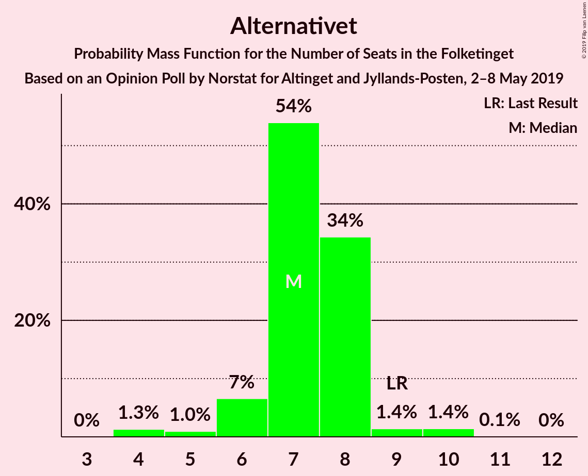

| Number of Seats | Probability | Accumulated | Special Marks |
|:---------------:|:-----------:|:-----------:|:-------------:|
| 4 | 1.3% | 100% |  |
| 5 | 1.0% | 98.7% |  |
| 6 | 7% | 98% |  |
| 7 | 54% | 91% | Median |
| 8 | 34% | 37% |  |
| 9 | 1.4% | 3% | Last Result |
| 10 | 1.4% | 1.5% |  |
| 11 | 0.1% | 0.1% |  |
| 12 | 0% | 0% |  |

### Liberal Alliance

*For a full overview of the results for this party, see the [Liberal Alliance](party-liberalalliance.html) page.*

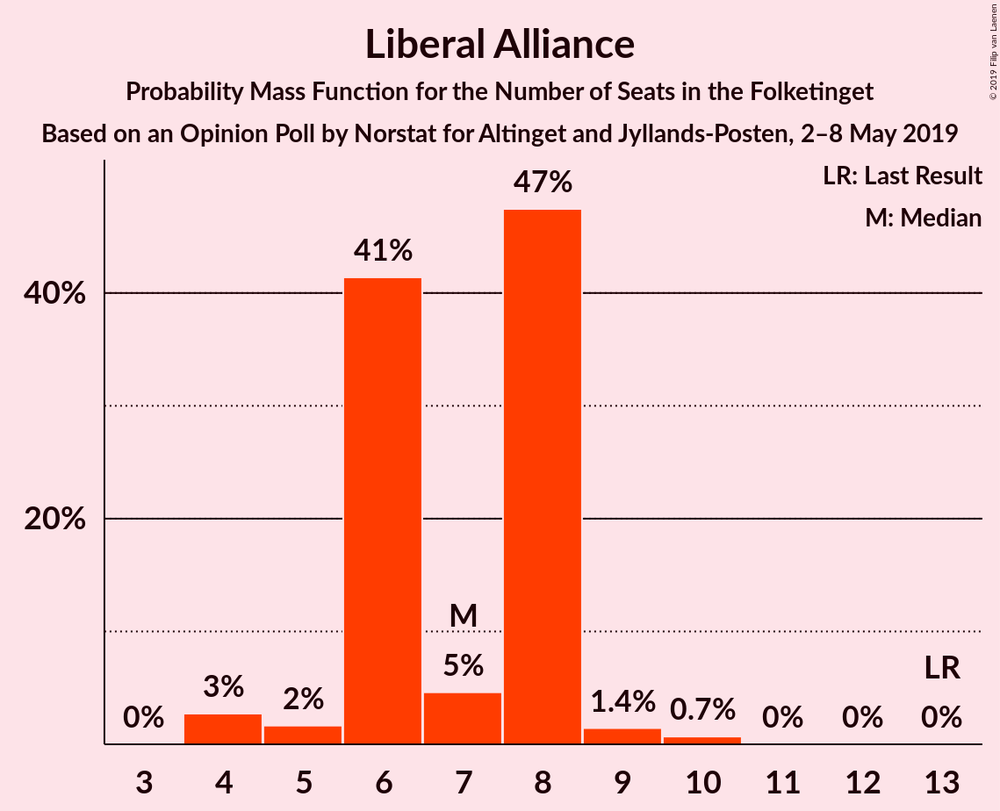

| Number of Seats | Probability | Accumulated | Special Marks |
|:---------------:|:-----------:|:-----------:|:-------------:|
| 4 | 3% | 100% |  |
| 5 | 2% | 97% |  |
| 6 | 41% | 96% |  |
| 7 | 5% | 54% | Median |
| 8 | 47% | 50% |  |
| 9 | 1.4% | 2% |  |
| 10 | 0.7% | 0.7% |  |
| 11 | 0% | 0% |  |
| 12 | 0% | 0% |  |
| 13 | 0% | 0% | Last Result |

### Stram Kurs

*For a full overview of the results for this party, see the [Stram Kurs](party-stramkurs.html) page.*

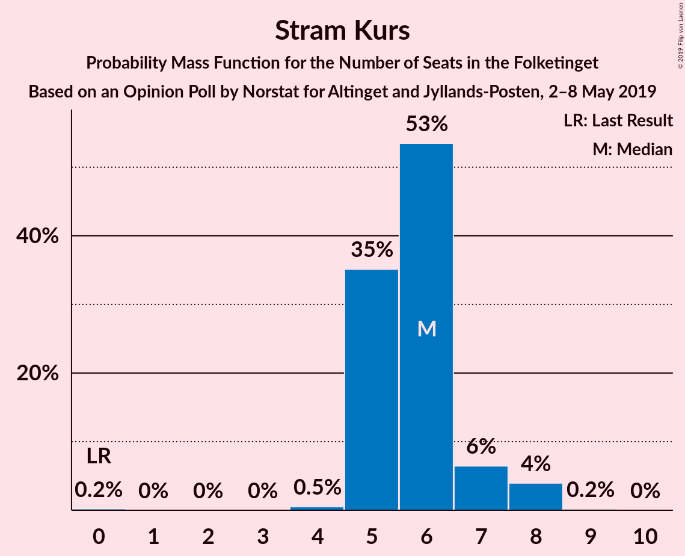

| Number of Seats | Probability | Accumulated | Special Marks |
|:---------------:|:-----------:|:-----------:|:-------------:|
| 0 | 0.2% | 100% | Last Result |
| 1 | 0% | 99.8% |  |
| 2 | 0% | 99.8% |  |
| 3 | 0% | 99.8% |  |
| 4 | 0.5% | 99.8% |  |
| 5 | 35% | 99.3% |  |
| 6 | 53% | 64% | Median |
| 7 | 6% | 11% |  |
| 8 | 4% | 4% |  |
| 9 | 0.2% | 0.2% |  |
| 10 | 0% | 0% |  |

### Nye Borgerlige

*For a full overview of the results for this party, see the [Nye Borgerlige](party-nyeborgerlige.html) page.*

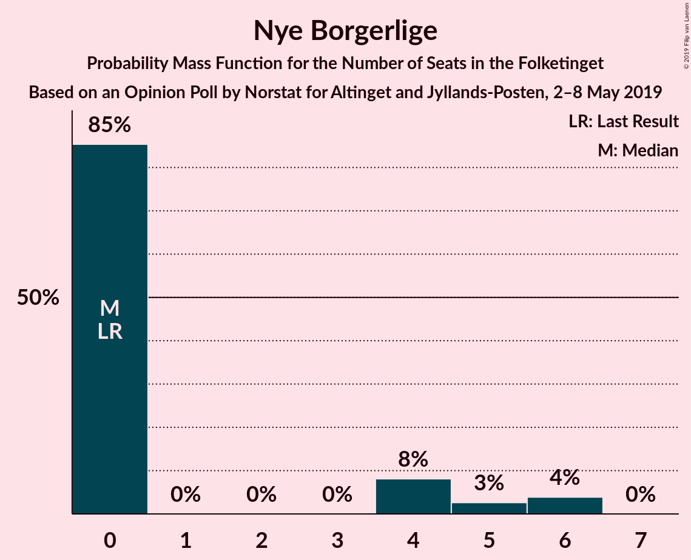

| Number of Seats | Probability | Accumulated | Special Marks |
|:---------------:|:-----------:|:-----------:|:-------------:|
| 0 | 85% | 100% | Last Result, Median |
| 1 | 0% | 15% |  |
| 2 | 0% | 15% |  |
| 3 | 0% | 15% |  |
| 4 | 8% | 15% |  |
| 5 | 3% | 7% |  |
| 6 | 4% | 4% |  |
| 7 | 0% | 0% |  |

### Kristendemokraterne

*For a full overview of the results for this party, see the [Kristendemokraterne](party-kristendemokraterne.html) page.*

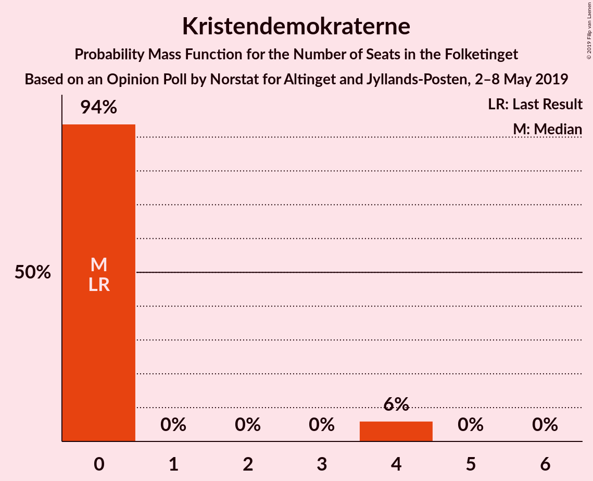

| Number of Seats | Probability | Accumulated | Special Marks |
|:---------------:|:-----------:|:-----------:|:-------------:|
| 0 | 94% | 100% | Last Result, Median |
| 1 | 0% | 6% |  |
| 2 | 0% | 6% |  |
| 3 | 0% | 6% |  |
| 4 | 6% | 6% |  |
| 5 | 0% | 0.1% |  |
| 6 | 0% | 0% |  |

### Klaus Riskær Pedersen

*For a full overview of the results for this party, see the [Klaus Riskær Pedersen](party-klausriskærpedersen.html) page.*

| Number of Seats | Probability | Accumulated | Special Marks |
|:---------------:|:-----------:|:-----------:|:-------------:|
| 0 | 100% | 100% | Last Result, Median |

## Coalitions

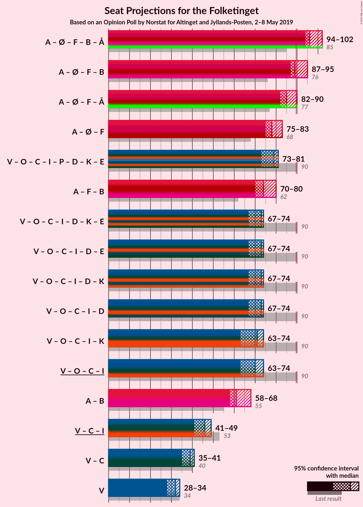

### Confidence Intervals

| Coalition | Last Result | Median | Majority? | 80% Confidence Interval | 90% Confidence Interval | 95% Confidence Interval | 99% Confidence Interval |
|:---------:|:-----------:|:------:|:---------:|:-----------------------:|:-----------------------:|:-----------------------:|:-----------------------:|
| Socialdemokraterne – Enhedslisten–De Rød-Grønne – Socialistisk Folkeparti – Radikale Venstre – Alternativet | 85 | 96 | 99.9% | 95–100 | 95–102 | 94–102 | 92–103 |
| Socialdemokraterne – Enhedslisten–De Rød-Grønne – Socialistisk Folkeparti – Radikale Venstre | 76 | 89 | 45% | 88–92 | 88–94 | 87–95 | 85–96 |
| Socialdemokraterne – Enhedslisten–De Rød-Grønne – Socialistisk Folkeparti – Alternativet | 77 | 85 | 30% | 83–90 | 83–90 | 82–90 | 80–92 |
| Socialdemokraterne – Enhedslisten–De Rød-Grønne – Socialistisk Folkeparti | 68 | 78 | 0% | 76–82 | 75–83 | 75–83 | 73–85 |
| Venstre – Dansk Folkeparti – Det Konservative Folkeparti – Liberal Alliance – Stram Kurs – Nye Borgerlige – Kristendemokraterne – Klaus Riskær Pedersen | 90 | 79 | 0% | 75–80 | 73–80 | 73–81 | 72–83 |
| Socialdemokraterne – Socialistisk Folkeparti – Radikale Venstre | 62 | 74 | 0% | 70–76 | 70–78 | 70–80 | 68–80 |
| Venstre – Dansk Folkeparti – Det Konservative Folkeparti – Liberal Alliance – Nye Borgerlige – Kristendemokraterne – Klaus Riskær Pedersen | 90 | 73 | 0% | 68–74 | 68–74 | 67–74 | 64–77 |
| Venstre – Dansk Folkeparti – Det Konservative Folkeparti – Liberal Alliance – Nye Borgerlige – Klaus Riskær Pedersen | 90 | 73 | 0% | 68–73 | 68–74 | 67–74 | 64–77 |
| Venstre – Dansk Folkeparti – Det Konservative Folkeparti – Liberal Alliance – Nye Borgerlige – Kristendemokraterne | 90 | 73 | 0% | 68–74 | 68–74 | 67–74 | 64–77 |
| Venstre – Dansk Folkeparti – Det Konservative Folkeparti – Liberal Alliance – Nye Borgerlige | 90 | 73 | 0% | 68–73 | 68–74 | 67–74 | 64–77 |
| Venstre – Dansk Folkeparti – Det Konservative Folkeparti – Liberal Alliance – Kristendemokraterne | 90 | 71 | 0% | 68–73 | 64–74 | 63–74 | 62–75 |
| Venstre – Dansk Folkeparti – Det Konservative Folkeparti – Liberal Alliance | 90 | 70 | 0% | 65–73 | 64–74 | 63–74 | 62–75 |
| Socialdemokraterne – Radikale Venstre | 55 | 61 | 0% | 60–63 | 60–67 | 58–68 | 56–68 |
| Venstre – Det Konservative Folkeparti – Liberal Alliance | 53 | 46 | 0% | 43–48 | 42–48 | 41–49 | 39–52 |
| Venstre – Det Konservative Folkeparti | 40 | 39 | 0% | 37–40 | 35–40 | 35–41 | 34–43 |
| Venstre | 34 | 32 | 0% | 29–32 | 28–32 | 28–34 | 27–34 |

### Socialdemokraterne – Enhedslisten–De Rød-Grønne – Socialistisk Folkeparti – Radikale Venstre – Alternativet

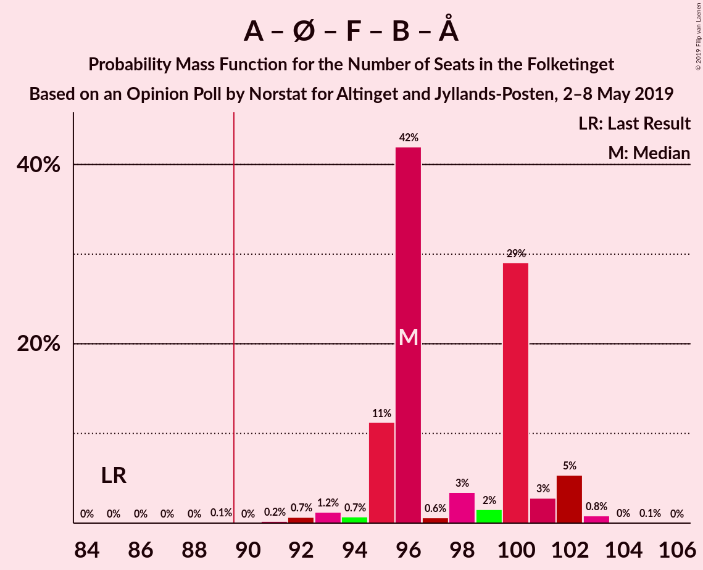

| Number of Seats | Probability | Accumulated | Special Marks |
|:---------------:|:-----------:|:-----------:|:-------------:|
| 85 | 0% | 100% | Last Result |
| 86 | 0% | 100% |  |
| 87 | 0% | 100% |  |
| 88 | 0% | 100% |  |
| 89 | 0.1% | 100% |  |
| 90 | 0% | 99.9% | Majority |
| 91 | 0.2% | 99.8% |  |
| 92 | 0.7% | 99.6% |  |
| 93 | 1.2% | 99.0% |  |
| 94 | 0.7% | 98% |  |
| 95 | 11% | 97% |  |
| 96 | 42% | 86% | Median |
| 97 | 0.6% | 44% |  |
| 98 | 3% | 43% |  |
| 99 | 2% | 40% |  |
| 100 | 29% | 38% |  |
| 101 | 3% | 9% |  |
| 102 | 5% | 6% |  |
| 103 | 0.8% | 1.0% |  |
| 104 | 0% | 0.1% |  |
| 105 | 0.1% | 0.1% |  |
| 106 | 0% | 0% |  |

### Socialdemokraterne – Enhedslisten–De Rød-Grønne – Socialistisk Folkeparti – Radikale Venstre

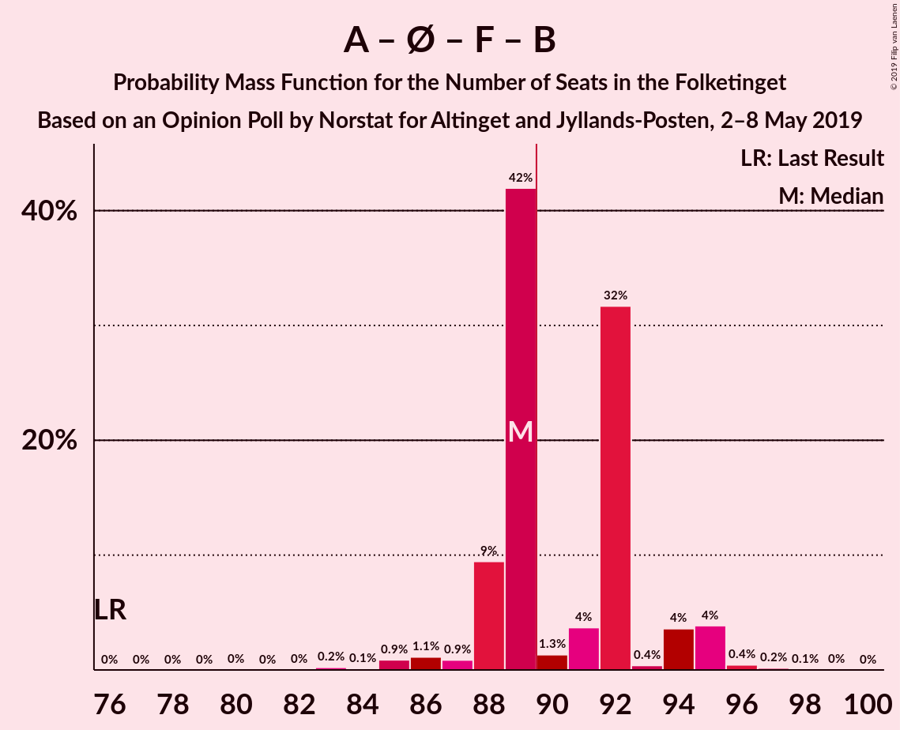

| Number of Seats | Probability | Accumulated | Special Marks |
|:---------------:|:-----------:|:-----------:|:-------------:|
| 76 | 0% | 100% | Last Result |
| 77 | 0% | 100% |  |
| 78 | 0% | 100% |  |
| 79 | 0% | 100% |  |
| 80 | 0% | 100% |  |
| 81 | 0% | 100% |  |
| 82 | 0% | 99.9% |  |
| 83 | 0.2% | 99.9% |  |
| 84 | 0.1% | 99.7% |  |
| 85 | 0.9% | 99.6% |  |
| 86 | 1.1% | 98.7% |  |
| 87 | 0.9% | 98% |  |
| 88 | 9% | 97% |  |
| 89 | 42% | 87% | Median |
| 90 | 1.3% | 45% | Majority |
| 91 | 4% | 44% |  |
| 92 | 32% | 40% |  |
| 93 | 0.4% | 9% |  |
| 94 | 4% | 8% |  |
| 95 | 4% | 5% |  |
| 96 | 0.4% | 0.7% |  |
| 97 | 0.2% | 0.3% |  |
| 98 | 0.1% | 0.1% |  |
| 99 | 0% | 0% |  |

### Socialdemokraterne – Enhedslisten–De Rød-Grønne – Socialistisk Folkeparti – Alternativet

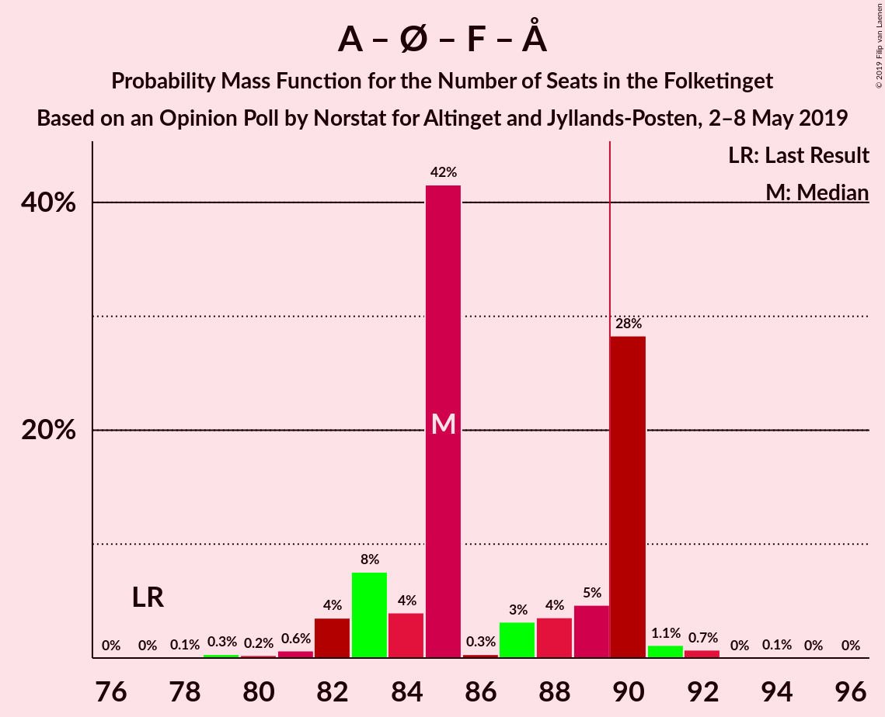

| Number of Seats | Probability | Accumulated | Special Marks |
|:---------------:|:-----------:|:-----------:|:-------------:|
| 77 | 0% | 100% | Last Result |
| 78 | 0.1% | 100% |  |
| 79 | 0.3% | 99.9% |  |
| 80 | 0.2% | 99.5% |  |
| 81 | 0.6% | 99.3% |  |
| 82 | 4% | 98.6% |  |
| 83 | 8% | 95% |  |
| 84 | 4% | 88% |  |
| 85 | 42% | 84% | Median |
| 86 | 0.3% | 42% |  |
| 87 | 3% | 42% |  |
| 88 | 4% | 38% |  |
| 89 | 5% | 35% |  |
| 90 | 28% | 30% | Majority |
| 91 | 1.1% | 2% |  |
| 92 | 0.7% | 0.8% |  |
| 93 | 0% | 0.1% |  |
| 94 | 0.1% | 0.1% |  |
| 95 | 0% | 0% |  |

### Socialdemokraterne – Enhedslisten–De Rød-Grønne – Socialistisk Folkeparti

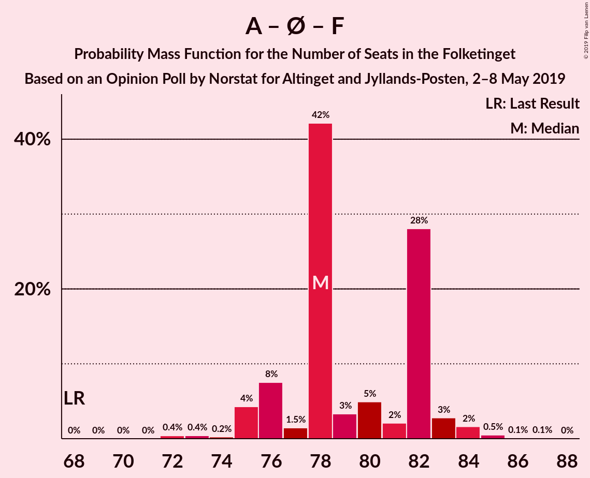

| Number of Seats | Probability | Accumulated | Special Marks |
|:---------------:|:-----------:|:-----------:|:-------------:|
| 68 | 0% | 100% | Last Result |
| 69 | 0% | 100% |  |
| 70 | 0% | 100% |  |
| 71 | 0% | 99.9% |  |
| 72 | 0.4% | 99.9% |  |
| 73 | 0.4% | 99.5% |  |
| 74 | 0.2% | 99.1% |  |
| 75 | 4% | 98.9% |  |
| 76 | 8% | 95% |  |
| 77 | 1.5% | 87% |  |
| 78 | 42% | 86% | Median |
| 79 | 3% | 43% |  |
| 80 | 5% | 40% |  |
| 81 | 2% | 35% |  |
| 82 | 28% | 33% |  |
| 83 | 3% | 5% |  |
| 84 | 2% | 2% |  |
| 85 | 0.5% | 0.6% |  |
| 86 | 0.1% | 0.1% |  |
| 87 | 0.1% | 0.1% |  |
| 88 | 0% | 0% |  |

### Venstre – Dansk Folkeparti – Det Konservative Folkeparti – Liberal Alliance – Stram Kurs – Nye Borgerlige – Kristendemokraterne – Klaus Riskær Pedersen

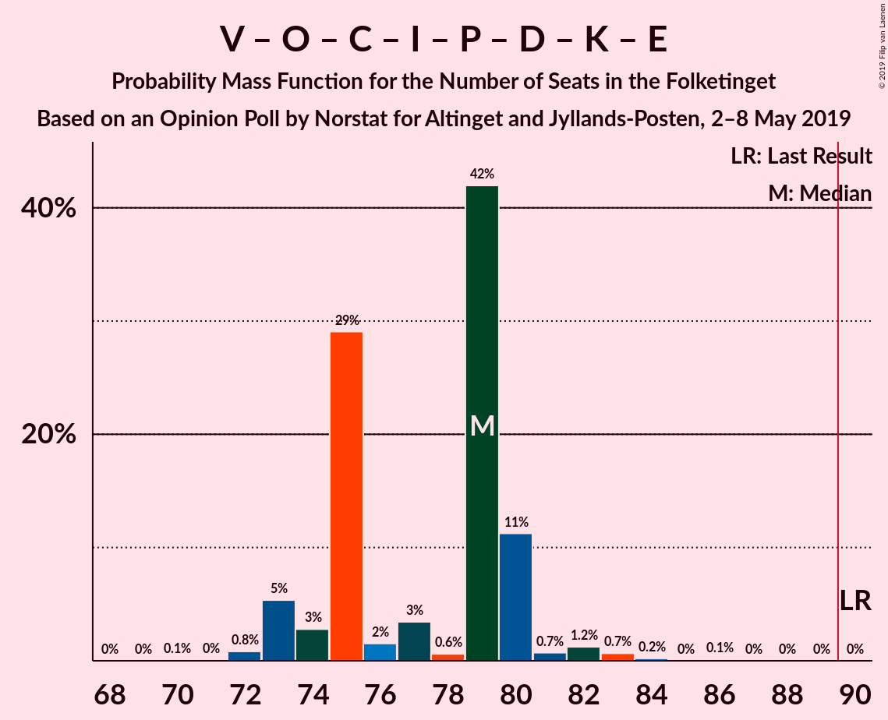

| Number of Seats | Probability | Accumulated | Special Marks |
|:---------------:|:-----------:|:-----------:|:-------------:|
| 70 | 0.1% | 100% |  |
| 71 | 0% | 99.9% |  |
| 72 | 0.8% | 99.9% |  |
| 73 | 5% | 99.0% |  |
| 74 | 3% | 94% |  |
| 75 | 29% | 91% |  |
| 76 | 2% | 62% |  |
| 77 | 3% | 60% |  |
| 78 | 0.6% | 57% | Median |
| 79 | 42% | 56% |  |
| 80 | 11% | 14% |  |
| 81 | 0.7% | 3% |  |
| 82 | 1.2% | 2% |  |
| 83 | 0.7% | 1.0% |  |
| 84 | 0.2% | 0.4% |  |
| 85 | 0% | 0.2% |  |
| 86 | 0.1% | 0.1% |  |
| 87 | 0% | 0% |  |
| 88 | 0% | 0% |  |
| 89 | 0% | 0% |  |
| 90 | 0% | 0% | Last Result, Majority |

### Socialdemokraterne – Socialistisk Folkeparti – Radikale Venstre

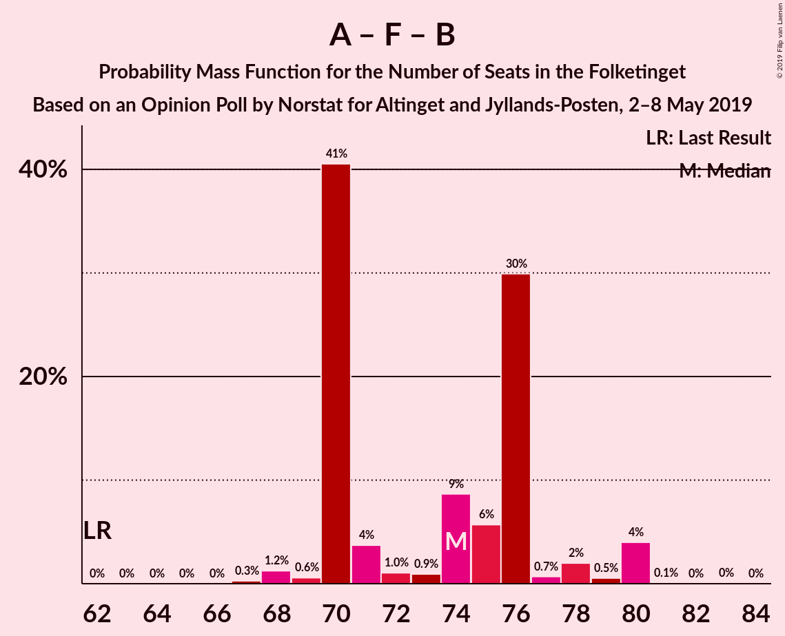

| Number of Seats | Probability | Accumulated | Special Marks |
|:---------------:|:-----------:|:-----------:|:-------------:|
| 62 | 0% | 100% | Last Result |
| 63 | 0% | 100% |  |
| 64 | 0% | 100% |  |
| 65 | 0% | 100% |  |
| 66 | 0% | 100% |  |
| 67 | 0.3% | 100% |  |
| 68 | 1.2% | 99.7% |  |
| 69 | 0.6% | 98% |  |
| 70 | 41% | 98% |  |
| 71 | 4% | 57% |  |
| 72 | 1.0% | 54% | Median |
| 73 | 0.9% | 53% |  |
| 74 | 9% | 52% |  |
| 75 | 6% | 43% |  |
| 76 | 30% | 37% |  |
| 77 | 0.7% | 7% |  |
| 78 | 2% | 7% |  |
| 79 | 0.5% | 5% |  |
| 80 | 4% | 4% |  |
| 81 | 0.1% | 0.1% |  |
| 82 | 0% | 0.1% |  |
| 83 | 0% | 0% |  |

### Venstre – Dansk Folkeparti – Det Konservative Folkeparti – Liberal Alliance – Nye Borgerlige – Kristendemokraterne – Klaus Riskær Pedersen

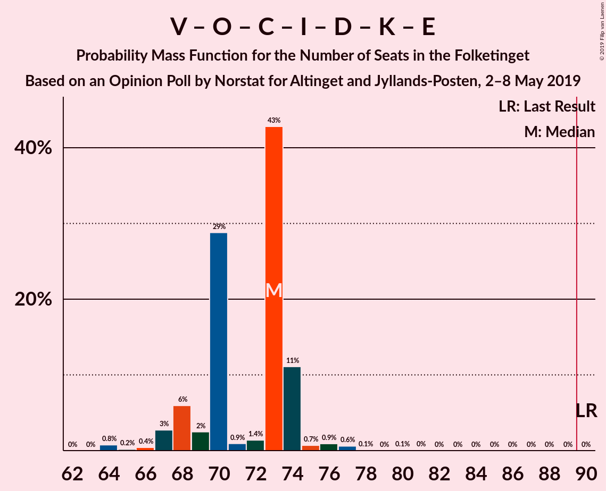

| Number of Seats | Probability | Accumulated | Special Marks |
|:---------------:|:-----------:|:-----------:|:-------------:|
| 64 | 0.8% | 100% |  |
| 65 | 0.2% | 99.2% |  |
| 66 | 0.4% | 99.0% |  |
| 67 | 3% | 98.6% |  |
| 68 | 6% | 96% |  |
| 69 | 2% | 90% |  |
| 70 | 29% | 87% |  |
| 71 | 0.9% | 59% |  |
| 72 | 1.4% | 58% | Median |
| 73 | 43% | 56% |  |
| 74 | 11% | 14% |  |
| 75 | 0.7% | 2% |  |
| 76 | 0.9% | 2% |  |
| 77 | 0.6% | 0.8% |  |
| 78 | 0.1% | 0.2% |  |
| 79 | 0% | 0.2% |  |
| 80 | 0.1% | 0.1% |  |
| 81 | 0% | 0.1% |  |
| 82 | 0% | 0% |  |
| 83 | 0% | 0% |  |
| 84 | 0% | 0% |  |
| 85 | 0% | 0% |  |
| 86 | 0% | 0% |  |
| 87 | 0% | 0% |  |
| 88 | 0% | 0% |  |
| 89 | 0% | 0% |  |
| 90 | 0% | 0% | Last Result, Majority |

### Venstre – Dansk Folkeparti – Det Konservative Folkeparti – Liberal Alliance – Nye Borgerlige – Klaus Riskær Pedersen

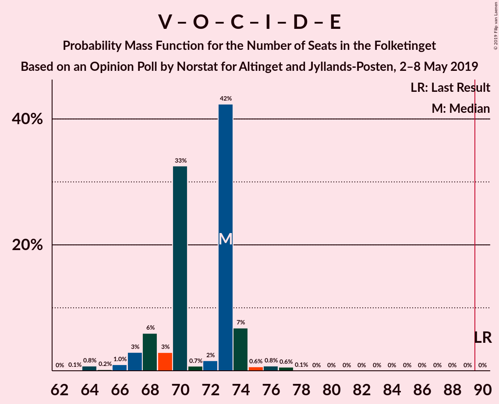

| Number of Seats | Probability | Accumulated | Special Marks |
|:---------------:|:-----------:|:-----------:|:-------------:|
| 63 | 0.1% | 100% |  |
| 64 | 0.8% | 99.9% |  |
| 65 | 0.2% | 99.1% |  |
| 66 | 1.0% | 99.0% |  |
| 67 | 3% | 98% |  |
| 68 | 6% | 95% |  |
| 69 | 3% | 89% |  |
| 70 | 33% | 86% |  |
| 71 | 0.7% | 54% |  |
| 72 | 2% | 53% | Median |
| 73 | 42% | 51% |  |
| 74 | 7% | 9% |  |
| 75 | 0.6% | 2% |  |
| 76 | 0.8% | 1.5% |  |
| 77 | 0.6% | 0.7% |  |
| 78 | 0.1% | 0.1% |  |
| 79 | 0% | 0.1% |  |
| 80 | 0% | 0.1% |  |
| 81 | 0% | 0.1% |  |
| 82 | 0% | 0% |  |
| 83 | 0% | 0% |  |
| 84 | 0% | 0% |  |
| 85 | 0% | 0% |  |
| 86 | 0% | 0% |  |
| 87 | 0% | 0% |  |
| 88 | 0% | 0% |  |
| 89 | 0% | 0% |  |
| 90 | 0% | 0% | Last Result, Majority |

### Venstre – Dansk Folkeparti – Det Konservative Folkeparti – Liberal Alliance – Nye Borgerlige – Kristendemokraterne

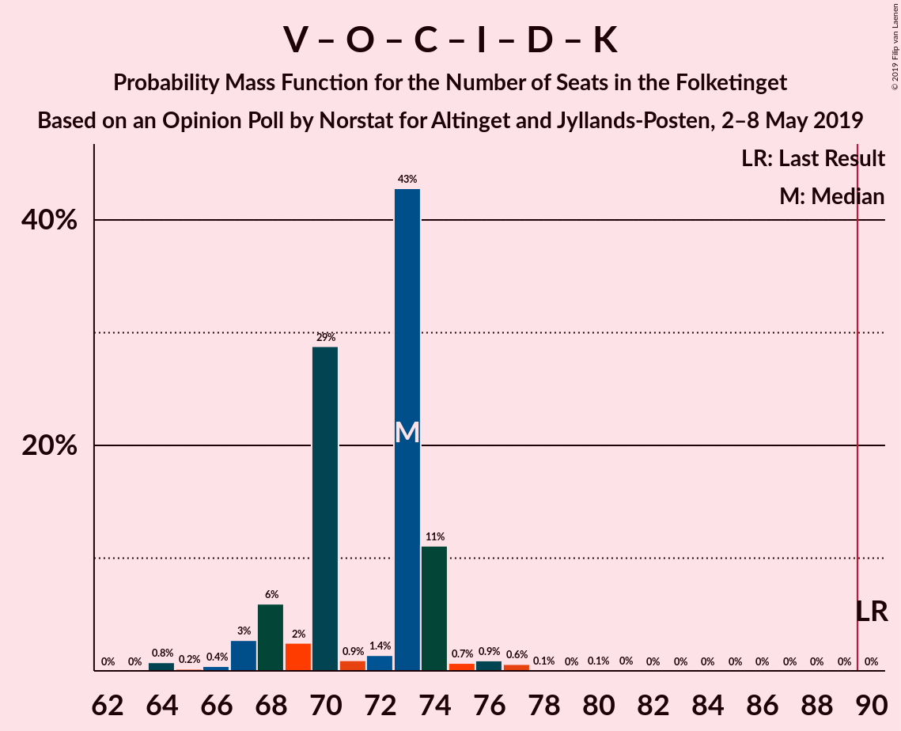

| Number of Seats | Probability | Accumulated | Special Marks |
|:---------------:|:-----------:|:-----------:|:-------------:|
| 64 | 0.8% | 100% |  |
| 65 | 0.2% | 99.2% |  |
| 66 | 0.4% | 99.0% |  |
| 67 | 3% | 98.6% |  |
| 68 | 6% | 96% |  |
| 69 | 2% | 90% |  |
| 70 | 29% | 87% |  |
| 71 | 0.9% | 59% |  |
| 72 | 1.4% | 58% | Median |
| 73 | 43% | 56% |  |
| 74 | 11% | 14% |  |
| 75 | 0.7% | 2% |  |
| 76 | 0.9% | 2% |  |
| 77 | 0.6% | 0.8% |  |
| 78 | 0.1% | 0.2% |  |
| 79 | 0% | 0.2% |  |
| 80 | 0.1% | 0.1% |  |
| 81 | 0% | 0.1% |  |
| 82 | 0% | 0% |  |
| 83 | 0% | 0% |  |
| 84 | 0% | 0% |  |
| 85 | 0% | 0% |  |
| 86 | 0% | 0% |  |
| 87 | 0% | 0% |  |
| 88 | 0% | 0% |  |
| 89 | 0% | 0% |  |
| 90 | 0% | 0% | Last Result, Majority |

### Venstre – Dansk Folkeparti – Det Konservative Folkeparti – Liberal Alliance – Nye Borgerlige

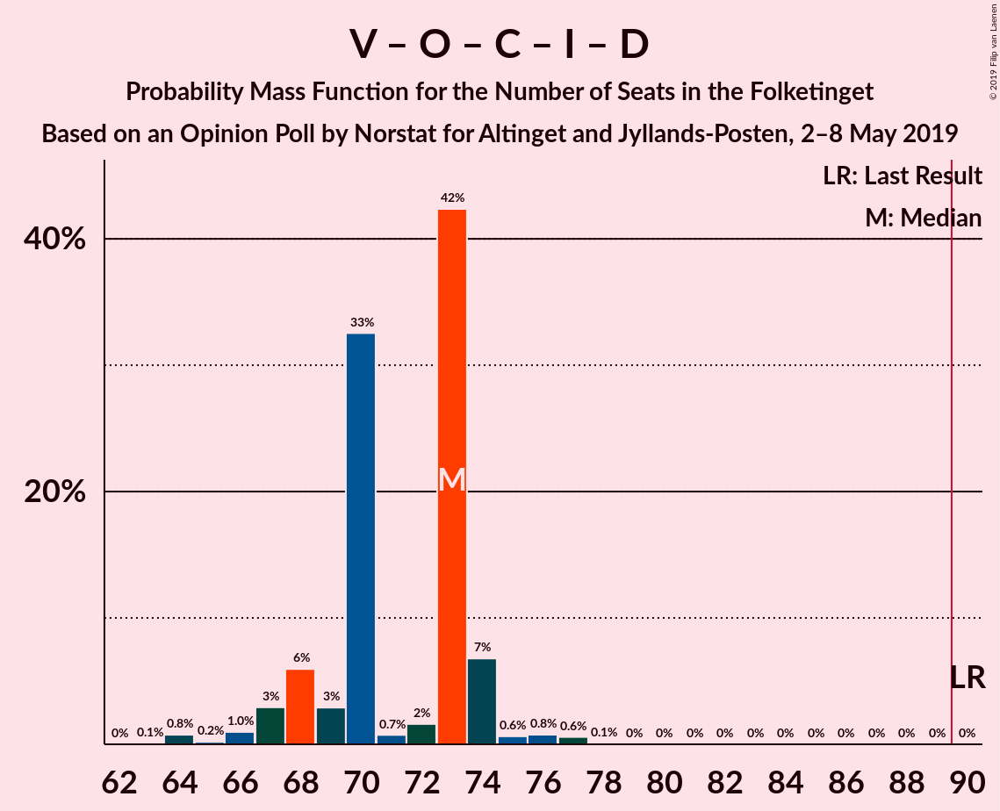

| Number of Seats | Probability | Accumulated | Special Marks |
|:---------------:|:-----------:|:-----------:|:-------------:|
| 63 | 0.1% | 100% |  |
| 64 | 0.8% | 99.9% |  |
| 65 | 0.2% | 99.1% |  |
| 66 | 1.0% | 99.0% |  |
| 67 | 3% | 98% |  |
| 68 | 6% | 95% |  |
| 69 | 3% | 89% |  |
| 70 | 33% | 86% |  |
| 71 | 0.7% | 54% |  |
| 72 | 2% | 53% | Median |
| 73 | 42% | 51% |  |
| 74 | 7% | 9% |  |
| 75 | 0.6% | 2% |  |
| 76 | 0.8% | 1.5% |  |
| 77 | 0.6% | 0.7% |  |
| 78 | 0.1% | 0.1% |  |
| 79 | 0% | 0.1% |  |
| 80 | 0% | 0.1% |  |
| 81 | 0% | 0.1% |  |
| 82 | 0% | 0% |  |
| 83 | 0% | 0% |  |
| 84 | 0% | 0% |  |
| 85 | 0% | 0% |  |
| 86 | 0% | 0% |  |
| 87 | 0% | 0% |  |
| 88 | 0% | 0% |  |
| 89 | 0% | 0% |  |
| 90 | 0% | 0% | Last Result, Majority |

### Venstre – Dansk Folkeparti – Det Konservative Folkeparti – Liberal Alliance – Kristendemokraterne

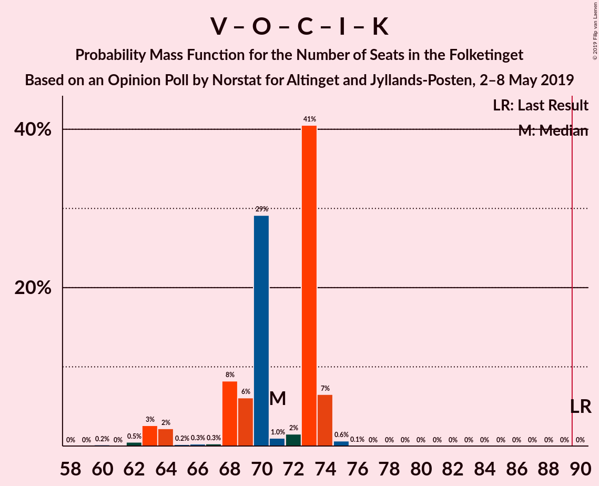

| Number of Seats | Probability | Accumulated | Special Marks |
|:---------------:|:-----------:|:-----------:|:-------------:|
| 60 | 0.2% | 100% |  |
| 61 | 0% | 99.8% |  |
| 62 | 0.5% | 99.8% |  |
| 63 | 3% | 99.3% |  |
| 64 | 2% | 97% |  |
| 65 | 0.2% | 95% |  |
| 66 | 0.3% | 94% |  |
| 67 | 0.3% | 94% |  |
| 68 | 8% | 94% |  |
| 69 | 6% | 86% |  |
| 70 | 29% | 79% |  |
| 71 | 1.0% | 50% |  |
| 72 | 2% | 49% | Median |
| 73 | 41% | 48% |  |
| 74 | 7% | 7% |  |
| 75 | 0.6% | 0.8% |  |
| 76 | 0.1% | 0.1% |  |
| 77 | 0% | 0.1% |  |
| 78 | 0% | 0% |  |
| 79 | 0% | 0% |  |
| 80 | 0% | 0% |  |
| 81 | 0% | 0% |  |
| 82 | 0% | 0% |  |
| 83 | 0% | 0% |  |
| 84 | 0% | 0% |  |
| 85 | 0% | 0% |  |
| 86 | 0% | 0% |  |
| 87 | 0% | 0% |  |
| 88 | 0% | 0% |  |
| 89 | 0% | 0% |  |
| 90 | 0% | 0% | Last Result, Majority |

### Venstre – Dansk Folkeparti – Det Konservative Folkeparti – Liberal Alliance

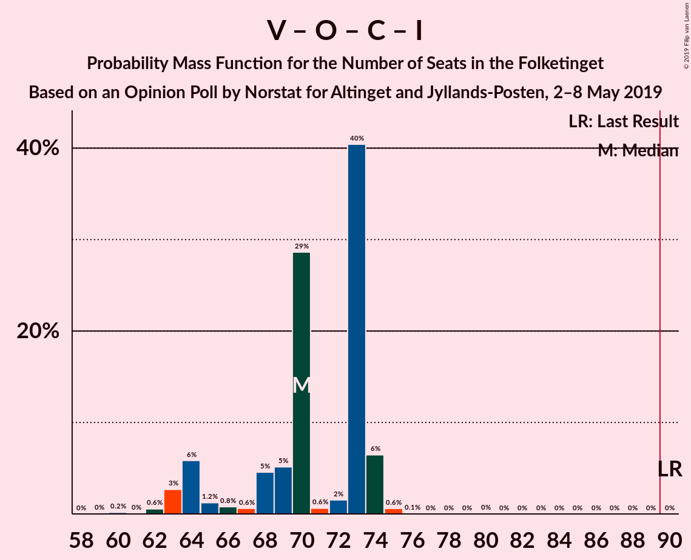

| Number of Seats | Probability | Accumulated | Special Marks |
|:---------------:|:-----------:|:-----------:|:-------------:|
| 60 | 0.2% | 100% |  |
| 61 | 0% | 99.8% |  |
| 62 | 0.6% | 99.8% |  |
| 63 | 3% | 99.2% |  |
| 64 | 6% | 97% |  |
| 65 | 1.2% | 91% |  |
| 66 | 0.8% | 89% |  |
| 67 | 0.6% | 89% |  |
| 68 | 5% | 88% |  |
| 69 | 5% | 84% |  |
| 70 | 29% | 78% |  |
| 71 | 0.6% | 50% |  |
| 72 | 2% | 49% | Median |
| 73 | 40% | 48% |  |
| 74 | 6% | 7% |  |
| 75 | 0.6% | 0.7% |  |
| 76 | 0.1% | 0.1% |  |
| 77 | 0% | 0% |  |
| 78 | 0% | 0% |  |
| 79 | 0% | 0% |  |
| 80 | 0% | 0% |  |
| 81 | 0% | 0% |  |
| 82 | 0% | 0% |  |
| 83 | 0% | 0% |  |
| 84 | 0% | 0% |  |
| 85 | 0% | 0% |  |
| 86 | 0% | 0% |  |
| 87 | 0% | 0% |  |
| 88 | 0% | 0% |  |
| 89 | 0% | 0% |  |
| 90 | 0% | 0% | Last Result, Majority |

### Socialdemokraterne – Radikale Venstre

| Number of Seats | Probability | Accumulated | Special Marks |
|:---------------:|:-----------:|:-----------:|:-------------:|
| 54 | 0.2% | 100% |  |
| 55 | 0.1% | 99.8% | Last Result |
| 56 | 0.3% | 99.7% |  |
| 57 | 1.1% | 99.4% |  |
| 58 | 0.9% | 98% |  |
| 59 | 1.0% | 97% |  |
| 60 | 44% | 96% | Median |
| 61 | 11% | 52% |  |
| 62 | 0.3% | 42% |  |
| 63 | 33% | 41% |  |
| 64 | 2% | 9% |  |
| 65 | 0.6% | 7% |  |
| 66 | 0.4% | 6% |  |
| 67 | 2% | 6% |  |
| 68 | 3% | 4% |  |
| 69 | 0.1% | 0.2% |  |
| 70 | 0% | 0% |  |

### Venstre – Det Konservative Folkeparti – Liberal Alliance

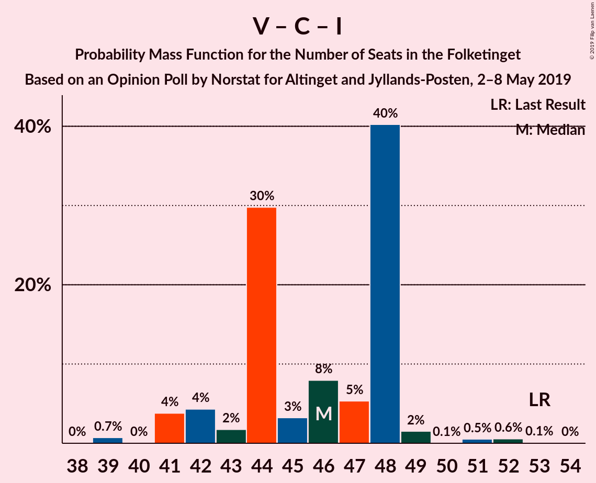

| Number of Seats | Probability | Accumulated | Special Marks |
|:---------------:|:-----------:|:-----------:|:-------------:|
| 38 | 0% | 100% |  |
| 39 | 0.7% | 99.9% |  |
| 40 | 0% | 99.2% |  |
| 41 | 4% | 99.2% |  |
| 42 | 4% | 95% |  |
| 43 | 2% | 91% |  |
| 44 | 30% | 89% |  |
| 45 | 3% | 60% |  |
| 46 | 8% | 56% |  |
| 47 | 5% | 48% | Median |
| 48 | 40% | 43% |  |
| 49 | 2% | 3% |  |
| 50 | 0.1% | 1.3% |  |
| 51 | 0.5% | 1.2% |  |
| 52 | 0.6% | 0.7% |  |
| 53 | 0.1% | 0.1% | Last Result |
| 54 | 0% | 0% |  |

### Venstre – Det Konservative Folkeparti

| Number of Seats | Probability | Accumulated | Special Marks |
|:---------------:|:-----------:|:-----------:|:-------------:|
| 32 | 0% | 100% |  |
| 33 | 0.2% | 99.9% |  |
| 34 | 0.8% | 99.8% |  |
| 35 | 5% | 99.0% |  |
| 36 | 3% | 94% |  |
| 37 | 2% | 91% |  |
| 38 | 31% | 89% |  |
| 39 | 8% | 58% |  |
| 40 | 47% | 50% | Last Result, Median |
| 41 | 1.1% | 3% |  |
| 42 | 0.3% | 2% |  |
| 43 | 2% | 2% |  |
| 44 | 0.2% | 0.4% |  |
| 45 | 0% | 0.1% |  |
| 46 | 0% | 0.1% |  |
| 47 | 0.1% | 0.1% |  |
| 48 | 0% | 0% |  |

### Venstre

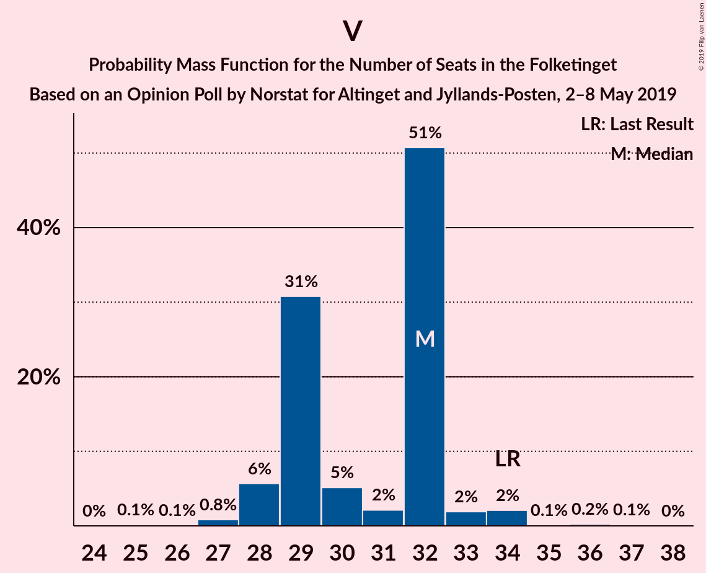

| Number of Seats | Probability | Accumulated | Special Marks |
|:---------------:|:-----------:|:-----------:|:-------------:|
| 25 | 0.1% | 100% |  |
| 26 | 0.1% | 99.8% |  |
| 27 | 0.8% | 99.7% |  |
| 28 | 6% | 98.9% |  |
| 29 | 31% | 93% |  |
| 30 | 5% | 62% |  |
| 31 | 2% | 57% |  |
| 32 | 51% | 55% | Median |
| 33 | 2% | 4% |  |
| 34 | 2% | 3% | Last Result |
| 35 | 0.1% | 0.5% |  |
| 36 | 0.2% | 0.4% |  |
| 37 | 0.1% | 0.2% |  |
| 38 | 0% | 0% |  |

## Technical Information

### Opinion Poll

+ **Polling firm:** Norstat
+ **Commissioner(s):** Altinget and Jyllands-Posten
+ **Fieldwork period:** 2–8 May 2019

### Calculations

+ **Sample size:** 1207
+ **Simulations done:** 1,048,576
+ **Error estimate:** 1.92%

