# Opinion Poll by Voxmeter for Ritzau, 8–10 May 2019

<a href="#voting-intentions">Voting Intentions</a> | <a href="#seats">Seats</a> | <a href="#coalitions">Coalitions</a> | <a href="#technical-information">Technical Information</a>

## Voting Intentions

### Confidence Intervals

| Party | Last Result | Poll Result | 80% Confidence Interval | 90% Confidence Interval | 95% Confidence Interval | 99% Confidence Interval |
|:-----:|:-----------:|:-----------:|:-----------------------:|:-----------------------:|:-----------------------:|:-----------------------:|
| Socialdemokraterne | 26.3% | 27.7% | 25.9–29.5% |25.4–30.1% |25.0–30.5% |24.2–31.4% |
| Venstre | 19.5% | 19.7% | 18.1–21.3% |17.7–21.8% |17.3–22.2% |16.6–23.1% |
| Dansk Folkeparti | 21.1% | 11.8% | 10.5–13.2% |10.2–13.5% |9.9–13.9% |9.4–14.6% |
| Enhedslisten–De Rød-Grønne | 7.8% | 9.3% | 8.2–10.6% |7.9–10.9% |7.7–11.2% |7.2–11.9% |
| Radikale Venstre | 4.6% | 7.4% | 6.4–8.6% |6.2–8.9% |5.9–9.2% |5.5–9.8% |
| Socialistisk Folkeparti | 4.2% | 6.8% | 5.9–7.9% |5.6–8.3% |5.4–8.6% |5.0–9.1% |
| Det Konservative Folkeparti | 3.4% | 4.3% | 3.6–5.3% |3.4–5.6% |3.2–5.8% |2.9–6.3% |
| Liberal Alliance | 7.5% | 3.9% | 3.2–4.8% |3.0–5.0% |2.8–5.2% |2.5–5.7% |
| Alternativet | 4.8% | 3.1% | 2.5–3.9% |2.3–4.1% |2.2–4.3% |1.9–4.8% |
| Stram Kurs | 0.0% | 2.0% | 1.5–2.7% |1.4–2.9% |1.3–3.0% |1.1–3.4% |
| Nye Borgerlige | 0.0% | 1.6% | 1.2–2.2% |1.1–2.4% |1.0–2.6% |0.8–2.9% |
| Kristendemokraterne | 0.8% | 1.5% | 1.1–2.1% |1.0–2.3% |0.9–2.4% |0.7–2.8% |
| Klaus Riskær Pedersen | 0.0% | 0.3% | 0.2–0.7% |0.1–0.8% |0.1–0.9% |0.1–1.1% |

*Note:* The poll result column reflects the actual value used in the calculations. Published results may vary slightly, and in addition be rounded to fewer digits.

## Seats

### Confidence Intervals

| Party | Last Result | Median | 80% Confidence Interval | 90% Confidence Interval | 95% Confidence Interval | 99% Confidence Interval |
|:-----:|:-----------:|:------:|:-----------------------:|:-----------------------:|:-----------------------:|:-----------------------:|
| <a href="#socialdemokraterne">Socialdemokraterne</a> | 47 | 51 | 49–53 |47–53 |46–55 |43–56 |
| <a href="#venstre">Venstre</a> | 34 | 35 | 34–36 |32–37 |32–40 |31–41 |
| <a href="#dansk-folkeparti">Dansk Folkeparti</a> | 37 | 23 | 20–24 |20–24 |18–25 |18–26 |
| <a href="#enhedslisten–de-rød-grønne">Enhedslisten–De Rød-Grønne</a> | 14 | 17 | 16–18 |15–19 |14–19 |13–21 |
| <a href="#radikale-venstre">Radikale Venstre</a> | 8 | 14 | 12–15 |12–15 |11–17 |10–17 |
| <a href="#socialistisk-folkeparti">Socialistisk Folkeparti</a> | 7 | 12 | 11–14 |11–14 |10–14 |10–16 |
| <a href="#det-konservative-folkeparti">Det Konservative Folkeparti</a> | 6 | 7 | 7–9 |7–9 |7–10 |5–10 |
| <a href="#liberal-alliance">Liberal Alliance</a> | 13 | 8 | 6–8 |6–9 |6–9 |5–10 |
| <a href="#alternativet">Alternativet</a> | 9 | 6 | 5–7 |5–7 |5–7 |0–8 |
| <a href="#stram-kurs">Stram Kurs</a> | 0 | 0 | 0–4 |0–6 |0–6 |0–6 |
| <a href="#nye-borgerlige">Nye Borgerlige</a> | 0 | 0 | 0–4 |0–4 |0–5 |0–6 |
| <a href="#kristendemokraterne">Kristendemokraterne</a> | 0 | 0 | 0 |0 |0–4 |0–4 |
| <a href="#klaus-riskær-pedersen">Klaus Riskær Pedersen</a> | 0 | 0 | 0 |0 |0 |0 |

### Socialdemokraterne

*For a full overview of the results for this party, see the [Socialdemokraterne](party-socialdemokraterne.html) page.*

| Number of Seats | Probability | Accumulated | Special Marks |
|:---------------:|:-----------:|:-----------:|:-------------:|
| 42 | 0.1% | 100% |  |
| 43 | 0.5% | 99.9% |  |
| 44 | 0.8% | 99.4% |  |
| 45 | 0.4% | 98.5% |  |
| 46 | 2% | 98% |  |
| 47 | 2% | 96% | Last Result |
| 48 | 2% | 94% |  |
| 49 | 7% | 92% |  |
| 50 | 6% | 85% |  |
| 51 | 43% | 79% | Median |
| 52 | 0.1% | 36% |  |
| 53 | 32% | 36% |  |
| 54 | 0.8% | 4% |  |
| 55 | 0.4% | 3% |  |
| 56 | 2% | 2% |  |
| 57 | 0% | 0.1% |  |
| 58 | 0.1% | 0.1% |  |
| 59 | 0% | 0% |  |

### Venstre

*For a full overview of the results for this party, see the [Venstre](party-venstre.html) page.*

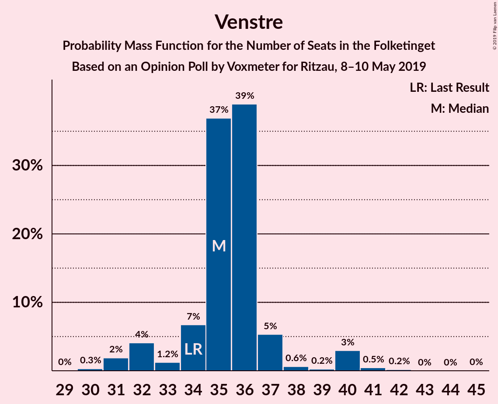

| Number of Seats | Probability | Accumulated | Special Marks |
|:---------------:|:-----------:|:-----------:|:-------------:|
| 29 | 0% | 100% |  |
| 30 | 0.3% | 99.9% |  |
| 31 | 2% | 99.6% |  |
| 32 | 4% | 98% |  |
| 33 | 1.2% | 94% |  |
| 34 | 7% | 92% | Last Result |
| 35 | 37% | 86% | Median |
| 36 | 39% | 49% |  |
| 37 | 5% | 10% |  |
| 38 | 0.6% | 5% |  |
| 39 | 0.2% | 4% |  |
| 40 | 3% | 4% |  |
| 41 | 0.5% | 0.7% |  |
| 42 | 0.2% | 0.2% |  |
| 43 | 0% | 0.1% |  |
| 44 | 0% | 0.1% |  |
| 45 | 0% | 0% |  |

### Dansk Folkeparti

*For a full overview of the results for this party, see the [Dansk Folkeparti](party-danskfolkeparti.html) page.*

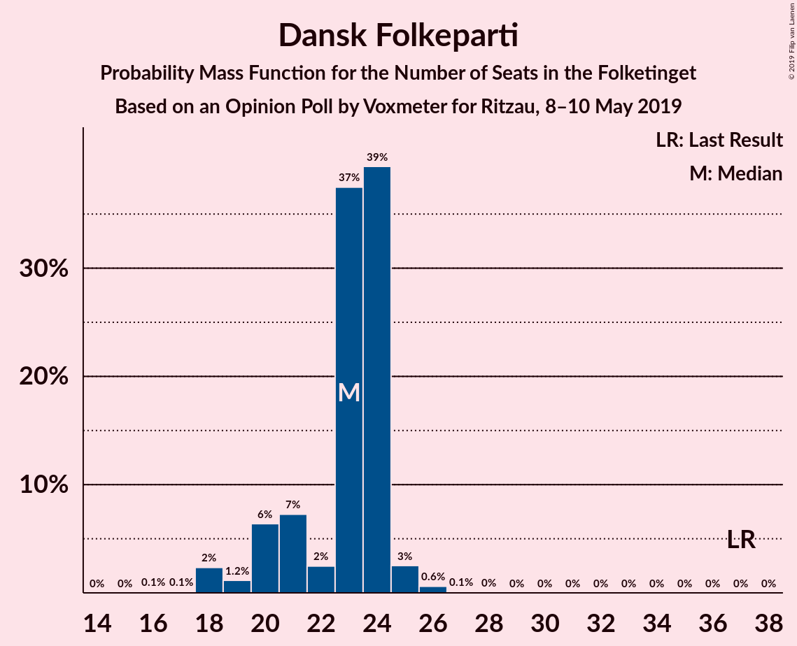

| Number of Seats | Probability | Accumulated | Special Marks |
|:---------------:|:-----------:|:-----------:|:-------------:|
| 16 | 0.1% | 100% |  |
| 17 | 0.1% | 99.9% |  |
| 18 | 2% | 99.8% |  |
| 19 | 1.2% | 97% |  |
| 20 | 6% | 96% |  |
| 21 | 7% | 90% |  |
| 22 | 2% | 83% |  |
| 23 | 37% | 80% | Median |
| 24 | 39% | 43% |  |
| 25 | 3% | 3% |  |
| 26 | 0.6% | 0.7% |  |
| 27 | 0.1% | 0.1% |  |
| 28 | 0% | 0% |  |
| 29 | 0% | 0% |  |
| 30 | 0% | 0% |  |
| 31 | 0% | 0% |  |
| 32 | 0% | 0% |  |
| 33 | 0% | 0% |  |
| 34 | 0% | 0% |  |
| 35 | 0% | 0% |  |
| 36 | 0% | 0% |  |
| 37 | 0% | 0% | Last Result |

### Enhedslisten–De Rød-Grønne

*For a full overview of the results for this party, see the [Enhedslisten–De Rød-Grønne](party-enhedslisten–derød-grønne.html) page.*

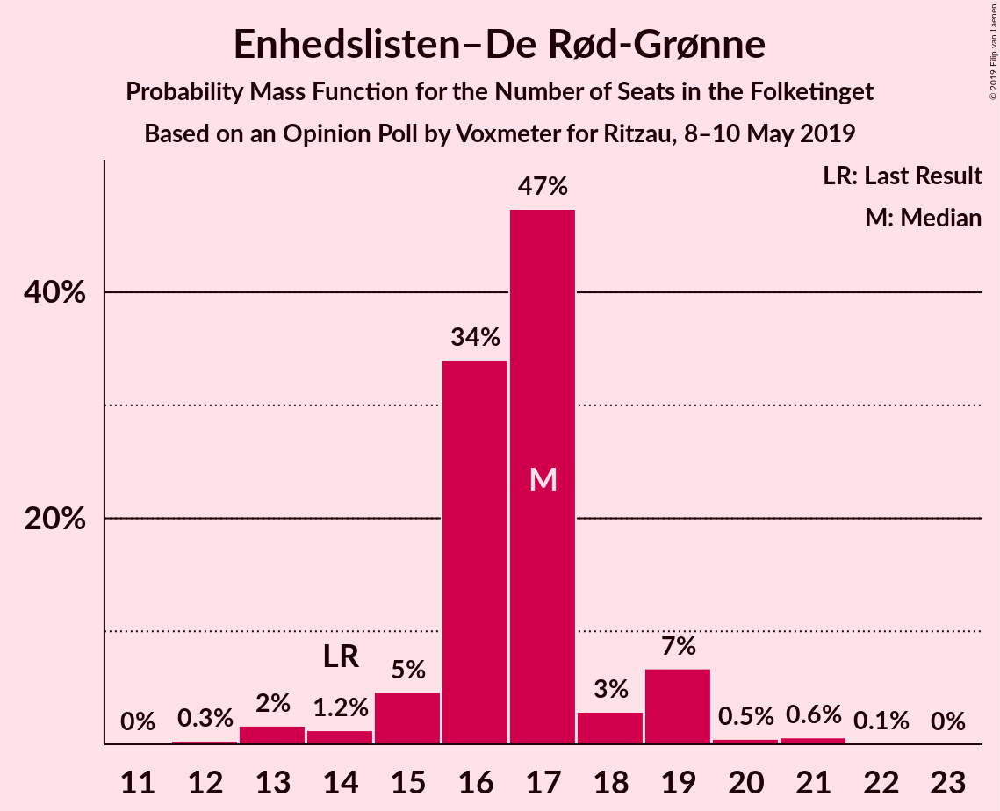

| Number of Seats | Probability | Accumulated | Special Marks |
|:---------------:|:-----------:|:-----------:|:-------------:|
| 12 | 0.3% | 100% |  |
| 13 | 2% | 99.7% |  |
| 14 | 1.2% | 98% | Last Result |
| 15 | 5% | 97% |  |
| 16 | 34% | 92% |  |
| 17 | 47% | 58% | Median |
| 18 | 3% | 11% |  |
| 19 | 7% | 8% |  |
| 20 | 0.5% | 1.2% |  |
| 21 | 0.6% | 0.7% |  |
| 22 | 0.1% | 0.1% |  |
| 23 | 0% | 0% |  |

### Radikale Venstre

*For a full overview of the results for this party, see the [Radikale Venstre](party-radikalevenstre.html) page.*

| Number of Seats | Probability | Accumulated | Special Marks |
|:---------------:|:-----------:|:-----------:|:-------------:|
| 8 | 0% | 100% | Last Result |
| 9 | 0.1% | 100% |  |
| 10 | 1.2% | 99.9% |  |
| 11 | 2% | 98.7% |  |
| 12 | 38% | 96% |  |
| 13 | 4% | 58% |  |
| 14 | 9% | 54% | Median |
| 15 | 40% | 45% |  |
| 16 | 0.6% | 5% |  |
| 17 | 4% | 4% |  |
| 18 | 0.1% | 0.1% |  |
| 19 | 0% | 0% |  |

### Socialistisk Folkeparti

*For a full overview of the results for this party, see the [Socialistisk Folkeparti](party-socialistiskfolkeparti.html) page.*

| Number of Seats | Probability | Accumulated | Special Marks |
|:---------------:|:-----------:|:-----------:|:-------------:|
| 7 | 0% | 100% | Last Result |
| 8 | 0% | 100% |  |
| 9 | 0.2% | 100% |  |
| 10 | 3% | 99.8% |  |
| 11 | 44% | 96% |  |
| 12 | 14% | 53% | Median |
| 13 | 3% | 39% |  |
| 14 | 33% | 35% |  |
| 15 | 1.2% | 2% |  |
| 16 | 0.8% | 1.2% |  |
| 17 | 0.4% | 0.4% |  |
| 18 | 0% | 0% |  |

### Det Konservative Folkeparti

*For a full overview of the results for this party, see the [Det Konservative Folkeparti](party-detkonservativefolkeparti.html) page.*

| Number of Seats | Probability | Accumulated | Special Marks |
|:---------------:|:-----------:|:-----------:|:-------------:|
| 4 | 0.4% | 100% |  |
| 5 | 0.2% | 99.6% |  |
| 6 | 2% | 99.4% | Last Result |
| 7 | 77% | 98% | Median |
| 8 | 10% | 20% |  |
| 9 | 7% | 11% |  |
| 10 | 3% | 4% |  |
| 11 | 0.3% | 0.4% |  |
| 12 | 0% | 0.1% |  |
| 13 | 0.1% | 0.1% |  |
| 14 | 0% | 0% |  |

### Liberal Alliance

*For a full overview of the results for this party, see the [Liberal Alliance](party-liberalalliance.html) page.*

| Number of Seats | Probability | Accumulated | Special Marks |
|:---------------:|:-----------:|:-----------:|:-------------:|
| 4 | 0.1% | 100% |  |
| 5 | 1.0% | 99.9% |  |
| 6 | 14% | 98.9% |  |
| 7 | 8% | 85% |  |
| 8 | 72% | 77% | Median |
| 9 | 5% | 5% |  |
| 10 | 0.4% | 0.5% |  |
| 11 | 0.1% | 0.1% |  |
| 12 | 0% | 0% |  |
| 13 | 0% | 0% | Last Result |

### Alternativet

*For a full overview of the results for this party, see the [Alternativet](party-alternativet.html) page.*

| Number of Seats | Probability | Accumulated | Special Marks |
|:---------------:|:-----------:|:-----------:|:-------------:|
| 0 | 0.7% | 100% |  |
| 1 | 0% | 99.3% |  |
| 2 | 0% | 99.3% |  |
| 3 | 0% | 99.3% |  |
| 4 | 0.6% | 99.3% |  |
| 5 | 11% | 98.7% |  |
| 6 | 51% | 88% | Median |
| 7 | 36% | 37% |  |
| 8 | 0.6% | 0.7% |  |
| 9 | 0% | 0% | Last Result |

### Stram Kurs

*For a full overview of the results for this party, see the [Stram Kurs](party-stramkurs.html) page.*

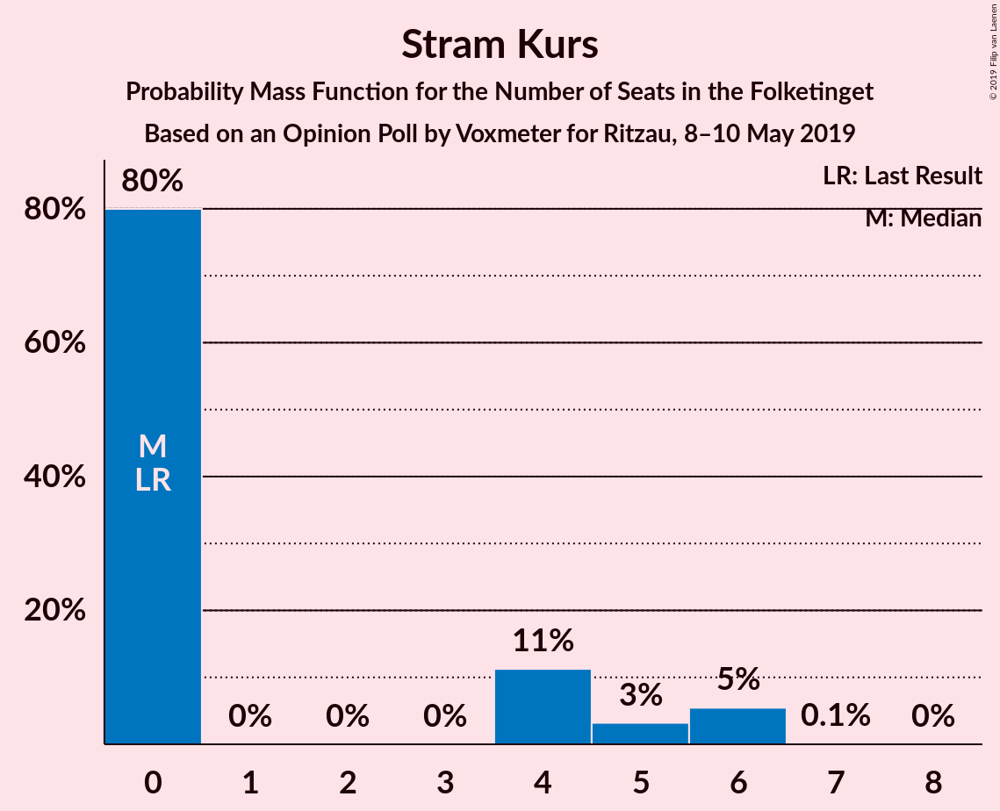

| Number of Seats | Probability | Accumulated | Special Marks |
|:---------------:|:-----------:|:-----------:|:-------------:|
| 0 | 80% | 100% | Last Result, Median |
| 1 | 0% | 20% |  |
| 2 | 0% | 20% |  |
| 3 | 0% | 20% |  |
| 4 | 11% | 20% |  |
| 5 | 3% | 9% |  |
| 6 | 5% | 6% |  |
| 7 | 0.1% | 0.1% |  |
| 8 | 0% | 0% |  |

### Nye Borgerlige

*For a full overview of the results for this party, see the [Nye Borgerlige](party-nyeborgerlige.html) page.*

| Number of Seats | Probability | Accumulated | Special Marks |
|:---------------:|:-----------:|:-----------:|:-------------:|
| 0 | 86% | 100% | Last Result, Median |
| 1 | 0% | 14% |  |
| 2 | 0% | 14% |  |
| 3 | 0% | 14% |  |
| 4 | 10% | 14% |  |
| 5 | 3% | 4% |  |
| 6 | 0.7% | 0.7% |  |
| 7 | 0% | 0% |  |

### Kristendemokraterne

*For a full overview of the results for this party, see the [Kristendemokraterne](party-kristendemokraterne.html) page.*

| Number of Seats | Probability | Accumulated | Special Marks |
|:---------------:|:-----------:|:-----------:|:-------------:|
| 0 | 96% | 100% | Last Result, Median |
| 1 | 0% | 4% |  |
| 2 | 0% | 4% |  |
| 3 | 0% | 4% |  |
| 4 | 3% | 4% |  |
| 5 | 0.3% | 0.4% |  |
| 6 | 0% | 0% |  |

### Klaus Riskær Pedersen

*For a full overview of the results for this party, see the [Klaus Riskær Pedersen](party-klausriskærpedersen.html) page.*

| Number of Seats | Probability | Accumulated | Special Marks |
|:---------------:|:-----------:|:-----------:|:-------------:|
| 0 | 100% | 100% | Last Result, Median |

## Coalitions

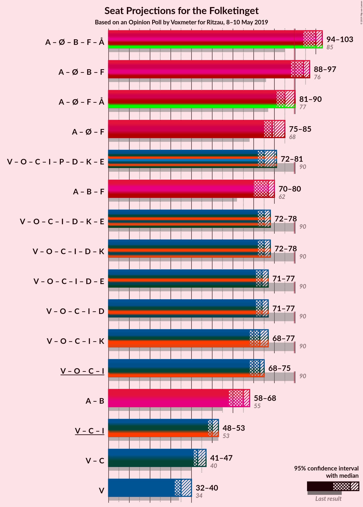

### Confidence Intervals

| Coalition | Last Result | Median | Majority? | 80% Confidence Interval | 90% Confidence Interval | 95% Confidence Interval | 99% Confidence Interval |
|:---------:|:-----------:|:------:|:---------:|:-----------------------:|:-----------------------:|:-----------------------:|:-----------------------:|
| Socialdemokraterne – Enhedslisten–De Rød-Grønne – Radikale Venstre – Socialistisk Folkeparti – Alternativet | 85 | 100 | 100% | 97–102 | 95–103 | 94–103 | 91–103 |
| Socialdemokraterne – Enhedslisten–De Rød-Grønne – Radikale Venstre – Socialistisk Folkeparti | 76 | 94 | 94% | 90–95 | 88–97 | 88–97 | 86–100 |
| Socialdemokraterne – Enhedslisten–De Rød-Grønne – Socialistisk Folkeparti – Alternativet | 77 | 85 | 34% | 83–90 | 81–90 | 81–90 | 78–91 |
| Socialdemokraterne – Enhedslisten–De Rød-Grønne – Socialistisk Folkeparti | 68 | 79 | 0% | 78–83 | 75–83 | 75–85 | 72–86 |
| Venstre – Dansk Folkeparti – Det Konservative Folkeparti – Liberal Alliance – Stram Kurs – Nye Borgerlige – Kristendemokraterne – Klaus Riskær Pedersen | 90 | 75 | 0% | 73–78 | 72–80 | 72–81 | 72–84 |
| Socialdemokraterne – Radikale Venstre – Socialistisk Folkeparti | 62 | 77 | 0% | 75–79 | 71–79 | 70–80 | 69–84 |
| Venstre – Dansk Folkeparti – Det Konservative Folkeparti – Liberal Alliance – Nye Borgerlige – Kristendemokraterne – Klaus Riskær Pedersen | 90 | 75 | 0% | 72–75 | 72–77 | 72–78 | 69–80 |
| Venstre – Dansk Folkeparti – Det Konservative Folkeparti – Liberal Alliance – Nye Borgerlige – Kristendemokraterne | 90 | 75 | 0% | 72–75 | 72–77 | 72–78 | 69–80 |
| Venstre – Dansk Folkeparti – Det Konservative Folkeparti – Liberal Alliance – Nye Borgerlige – Klaus Riskær Pedersen | 90 | 74 | 0% | 72–75 | 72–76 | 71–77 | 68–80 |
| Venstre – Dansk Folkeparti – Det Konservative Folkeparti – Liberal Alliance – Nye Borgerlige | 90 | 74 | 0% | 72–75 | 72–76 | 71–77 | 68–80 |
| Venstre – Dansk Folkeparti – Det Konservative Folkeparti – Liberal Alliance – Kristendemokraterne | 90 | 73 | 0% | 71–75 | 68–75 | 68–77 | 66–80 |
| Venstre – Dansk Folkeparti – Det Konservative Folkeparti – Liberal Alliance | 90 | 73 | 0% | 71–75 | 68–75 | 68–75 | 66–80 |
| Socialdemokraterne – Radikale Venstre | 55 | 65 | 0% | 62–66 | 59–67 | 58–68 | 57–68 |
| Venstre – Det Konservative Folkeparti – Liberal Alliance | 53 | 50 | 0% | 49–51 | 48–53 | 48–53 | 46–57 |
| Venstre – Det Konservative Folkeparti | 40 | 43 | 0% | 42–44 | 41–46 | 41–47 | 39–49 |
| Venstre | 34 | 35 | 0% | 34–36 | 32–37 | 32–40 | 31–41 |

### Socialdemokraterne – Enhedslisten–De Rød-Grønne – Radikale Venstre – Socialistisk Folkeparti – Alternativet

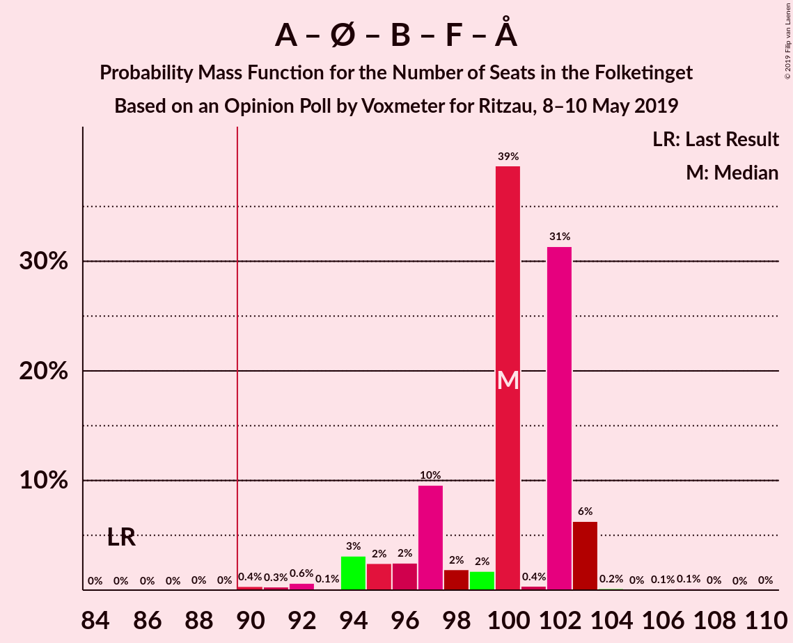

| Number of Seats | Probability | Accumulated | Special Marks |
|:---------------:|:-----------:|:-----------:|:-------------:|
| 85 | 0% | 100% | Last Result |
| 86 | 0% | 100% |  |
| 87 | 0% | 100% |  |
| 88 | 0% | 100% |  |
| 89 | 0% | 100% |  |
| 90 | 0.4% | 100% | Majority |
| 91 | 0.3% | 99.6% |  |
| 92 | 0.6% | 99.3% |  |
| 93 | 0.1% | 98.7% |  |
| 94 | 3% | 98.5% |  |
| 95 | 2% | 95% |  |
| 96 | 2% | 93% |  |
| 97 | 10% | 90% |  |
| 98 | 2% | 81% |  |
| 99 | 2% | 79% |  |
| 100 | 39% | 77% | Median |
| 101 | 0.4% | 39% |  |
| 102 | 31% | 38% |  |
| 103 | 6% | 7% |  |
| 104 | 0.2% | 0.5% |  |
| 105 | 0% | 0.3% |  |
| 106 | 0.1% | 0.3% |  |
| 107 | 0.1% | 0.2% |  |
| 108 | 0% | 0.1% |  |
| 109 | 0% | 0% |  |

### Socialdemokraterne – Enhedslisten–De Rød-Grønne – Radikale Venstre – Socialistisk Folkeparti

| Number of Seats | Probability | Accumulated | Special Marks |
|:---------------:|:-----------:|:-----------:|:-------------:|
| 76 | 0% | 100% | Last Result |
| 77 | 0% | 100% |  |
| 78 | 0% | 100% |  |
| 79 | 0% | 100% |  |
| 80 | 0% | 100% |  |
| 81 | 0% | 100% |  |
| 82 | 0% | 100% |  |
| 83 | 0% | 100% |  |
| 84 | 0.2% | 100% |  |
| 85 | 0.2% | 99.7% |  |
| 86 | 0.5% | 99.5% |  |
| 87 | 0.5% | 99.0% |  |
| 88 | 4% | 98.5% |  |
| 89 | 1.3% | 95% |  |
| 90 | 6% | 94% | Majority |
| 91 | 2% | 88% |  |
| 92 | 5% | 86% |  |
| 93 | 3% | 80% |  |
| 94 | 38% | 78% | Median |
| 95 | 32% | 40% |  |
| 96 | 0.6% | 8% |  |
| 97 | 6% | 7% |  |
| 98 | 0.6% | 1.3% |  |
| 99 | 0.2% | 0.8% |  |
| 100 | 0.5% | 0.6% |  |
| 101 | 0% | 0.1% |  |
| 102 | 0% | 0.1% |  |
| 103 | 0% | 0.1% |  |
| 104 | 0% | 0.1% |  |
| 105 | 0% | 0.1% |  |
| 106 | 0% | 0% |  |

### Socialdemokraterne – Enhedslisten–De Rød-Grønne – Socialistisk Folkeparti – Alternativet

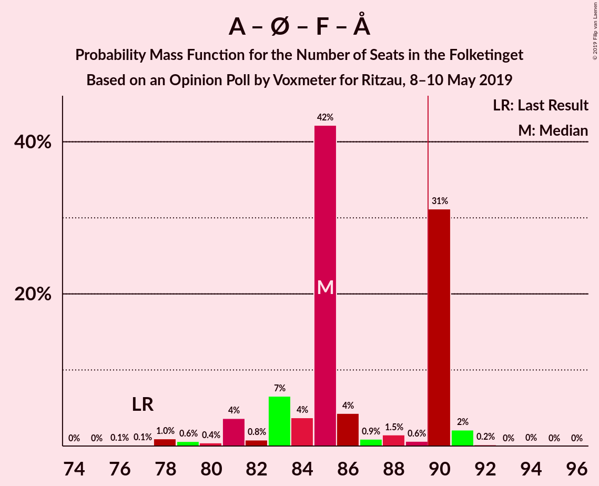

| Number of Seats | Probability | Accumulated | Special Marks |
|:---------------:|:-----------:|:-----------:|:-------------:|
| 76 | 0.1% | 100% |  |
| 77 | 0.1% | 99.9% | Last Result |
| 78 | 1.0% | 99.8% |  |
| 79 | 0.6% | 98.8% |  |
| 80 | 0.4% | 98% |  |
| 81 | 4% | 98% |  |
| 82 | 0.8% | 94% |  |
| 83 | 7% | 93% |  |
| 84 | 4% | 87% |  |
| 85 | 42% | 83% |  |
| 86 | 4% | 41% | Median |
| 87 | 0.9% | 37% |  |
| 88 | 1.5% | 36% |  |
| 89 | 0.6% | 34% |  |
| 90 | 31% | 34% | Majority |
| 91 | 2% | 2% |  |
| 92 | 0.2% | 0.3% |  |
| 93 | 0% | 0.1% |  |
| 94 | 0% | 0.1% |  |
| 95 | 0% | 0% |  |

### Socialdemokraterne – Enhedslisten–De Rød-Grønne – Socialistisk Folkeparti

| Number of Seats | Probability | Accumulated | Special Marks |
|:---------------:|:-----------:|:-----------:|:-------------:|
| 68 | 0% | 100% | Last Result |
| 69 | 0% | 100% |  |
| 70 | 0% | 100% |  |
| 71 | 0.2% | 100% |  |
| 72 | 0.4% | 99.8% |  |
| 73 | 0.8% | 99.4% |  |
| 74 | 1.0% | 98.5% |  |
| 75 | 3% | 98% |  |
| 76 | 0.2% | 94% |  |
| 77 | 0.7% | 94% |  |
| 78 | 12% | 93% |  |
| 79 | 40% | 81% |  |
| 80 | 4% | 41% | Median |
| 81 | 0.3% | 37% |  |
| 82 | 1.3% | 36% |  |
| 83 | 31% | 35% |  |
| 84 | 0.9% | 4% |  |
| 85 | 2% | 3% |  |
| 86 | 0% | 0.5% |  |
| 87 | 0% | 0.5% |  |
| 88 | 0.4% | 0.5% |  |
| 89 | 0% | 0.1% |  |
| 90 | 0% | 0% | Majority |

### Venstre – Dansk Folkeparti – Det Konservative Folkeparti – Liberal Alliance – Stram Kurs – Nye Borgerlige – Kristendemokraterne – Klaus Riskær Pedersen

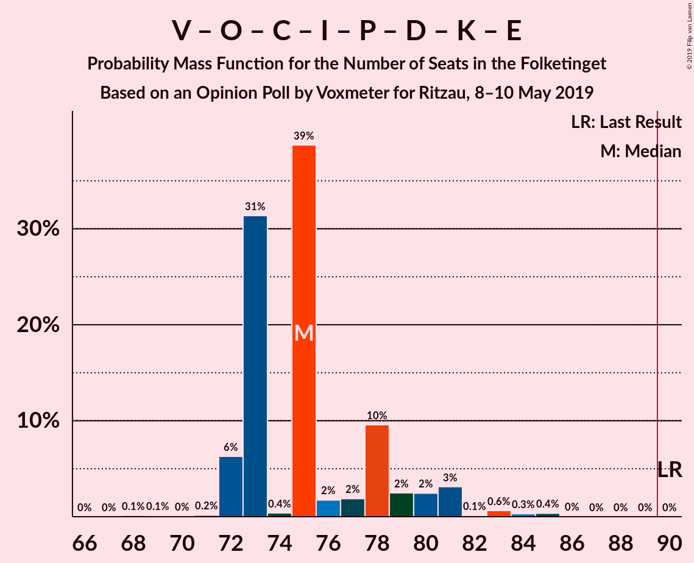

| Number of Seats | Probability | Accumulated | Special Marks |
|:---------------:|:-----------:|:-----------:|:-------------:|
| 67 | 0% | 100% |  |
| 68 | 0.1% | 99.9% |  |
| 69 | 0.1% | 99.8% |  |
| 70 | 0% | 99.7% |  |
| 71 | 0.2% | 99.7% |  |
| 72 | 6% | 99.5% |  |
| 73 | 31% | 93% | Median |
| 74 | 0.4% | 62% |  |
| 75 | 39% | 61% |  |
| 76 | 2% | 23% |  |
| 77 | 2% | 21% |  |
| 78 | 10% | 19% |  |
| 79 | 2% | 10% |  |
| 80 | 2% | 7% |  |
| 81 | 3% | 5% |  |
| 82 | 0.1% | 1.5% |  |
| 83 | 0.6% | 1.3% |  |
| 84 | 0.3% | 0.7% |  |
| 85 | 0.4% | 0.4% |  |
| 86 | 0% | 0% |  |
| 87 | 0% | 0% |  |
| 88 | 0% | 0% |  |
| 89 | 0% | 0% |  |
| 90 | 0% | 0% | Last Result, Majority |

### Socialdemokraterne – Radikale Venstre – Socialistisk Folkeparti

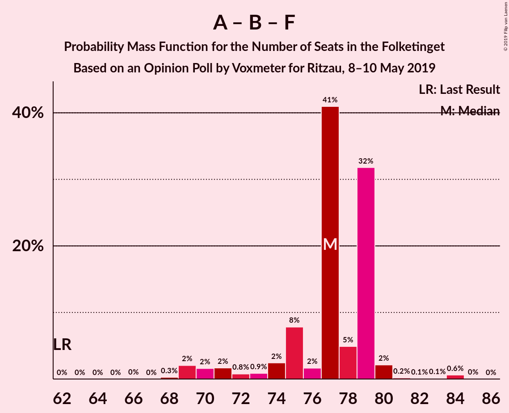

| Number of Seats | Probability | Accumulated | Special Marks |
|:---------------:|:-----------:|:-----------:|:-------------:|
| 62 | 0% | 100% | Last Result |
| 63 | 0% | 100% |  |
| 64 | 0% | 100% |  |
| 65 | 0% | 100% |  |
| 66 | 0% | 100% |  |
| 67 | 0% | 100% |  |
| 68 | 0.3% | 100% |  |
| 69 | 2% | 99.7% |  |
| 70 | 2% | 98% |  |
| 71 | 2% | 96% |  |
| 72 | 0.8% | 94% |  |
| 73 | 0.9% | 94% |  |
| 74 | 2% | 93% |  |
| 75 | 8% | 90% |  |
| 76 | 2% | 82% |  |
| 77 | 41% | 81% | Median |
| 78 | 5% | 40% |  |
| 79 | 32% | 35% |  |
| 80 | 2% | 3% |  |
| 81 | 0.2% | 1.0% |  |
| 82 | 0.1% | 0.9% |  |
| 83 | 0.1% | 0.8% |  |
| 84 | 0.6% | 0.7% |  |
| 85 | 0% | 0.1% |  |
| 86 | 0% | 0% |  |

### Venstre – Dansk Folkeparti – Det Konservative Folkeparti – Liberal Alliance – Nye Borgerlige – Kristendemokraterne – Klaus Riskær Pedersen

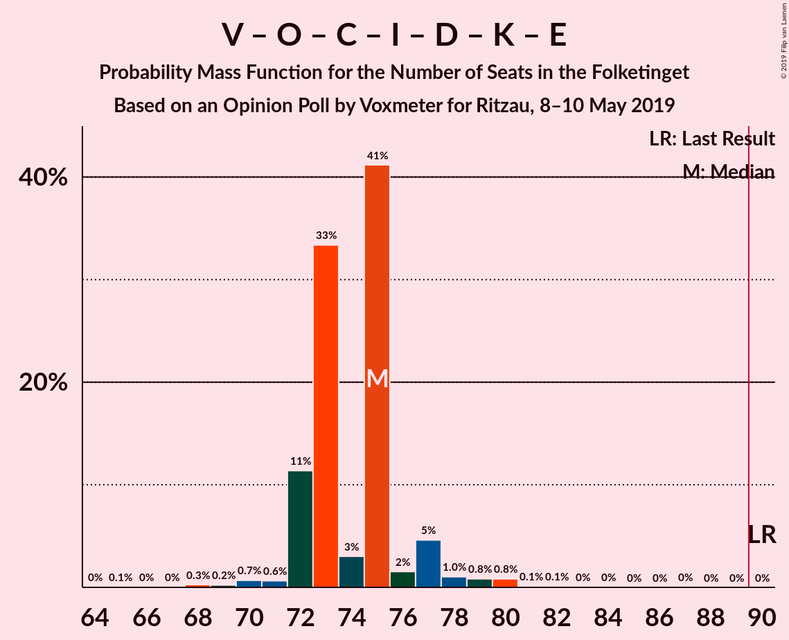

| Number of Seats | Probability | Accumulated | Special Marks |
|:---------------:|:-----------:|:-----------:|:-------------:|
| 65 | 0.1% | 100% |  |
| 66 | 0% | 99.9% |  |
| 67 | 0% | 99.9% |  |
| 68 | 0.3% | 99.9% |  |
| 69 | 0.2% | 99.6% |  |
| 70 | 0.7% | 99.4% |  |
| 71 | 0.6% | 98.7% |  |
| 72 | 11% | 98% |  |
| 73 | 33% | 87% | Median |
| 74 | 3% | 53% |  |
| 75 | 41% | 50% |  |
| 76 | 2% | 9% |  |
| 77 | 5% | 8% |  |
| 78 | 1.0% | 3% |  |
| 79 | 0.8% | 2% |  |
| 80 | 0.8% | 1.1% |  |
| 81 | 0.1% | 0.2% |  |
| 82 | 0.1% | 0.1% |  |
| 83 | 0% | 0% |  |
| 84 | 0% | 0% |  |
| 85 | 0% | 0% |  |
| 86 | 0% | 0% |  |
| 87 | 0% | 0% |  |
| 88 | 0% | 0% |  |
| 89 | 0% | 0% |  |
| 90 | 0% | 0% | Last Result, Majority |

### Venstre – Dansk Folkeparti – Det Konservative Folkeparti – Liberal Alliance – Nye Borgerlige – Kristendemokraterne

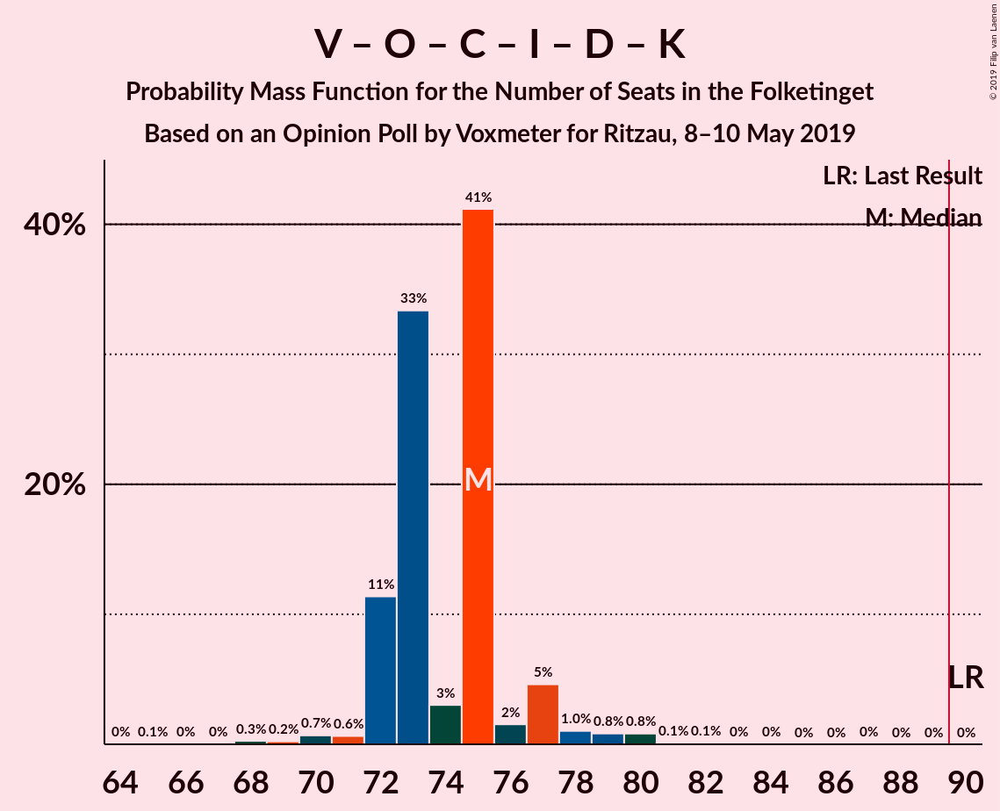

| Number of Seats | Probability | Accumulated | Special Marks |
|:---------------:|:-----------:|:-----------:|:-------------:|
| 65 | 0.1% | 100% |  |
| 66 | 0% | 99.9% |  |
| 67 | 0% | 99.9% |  |
| 68 | 0.3% | 99.9% |  |
| 69 | 0.2% | 99.6% |  |
| 70 | 0.7% | 99.4% |  |
| 71 | 0.6% | 98.7% |  |
| 72 | 11% | 98% |  |
| 73 | 33% | 87% | Median |
| 74 | 3% | 53% |  |
| 75 | 41% | 50% |  |
| 76 | 2% | 9% |  |
| 77 | 5% | 8% |  |
| 78 | 1.0% | 3% |  |
| 79 | 0.8% | 2% |  |
| 80 | 0.8% | 1.1% |  |
| 81 | 0.1% | 0.2% |  |
| 82 | 0.1% | 0.1% |  |
| 83 | 0% | 0% |  |
| 84 | 0% | 0% |  |
| 85 | 0% | 0% |  |
| 86 | 0% | 0% |  |
| 87 | 0% | 0% |  |
| 88 | 0% | 0% |  |
| 89 | 0% | 0% |  |
| 90 | 0% | 0% | Last Result, Majority |

### Venstre – Dansk Folkeparti – Det Konservative Folkeparti – Liberal Alliance – Nye Borgerlige – Klaus Riskær Pedersen

| Number of Seats | Probability | Accumulated | Special Marks |
|:---------------:|:-----------:|:-----------:|:-------------:|
| 65 | 0.1% | 100% |  |
| 66 | 0.1% | 99.9% |  |
| 67 | 0.1% | 99.8% |  |
| 68 | 0.5% | 99.8% |  |
| 69 | 0.4% | 99.3% |  |
| 70 | 0.7% | 99.0% |  |
| 71 | 1.0% | 98% |  |
| 72 | 11% | 97% |  |
| 73 | 35% | 86% | Median |
| 74 | 3% | 51% |  |
| 75 | 41% | 48% |  |
| 76 | 2% | 7% |  |
| 77 | 3% | 5% |  |
| 78 | 0.5% | 2% |  |
| 79 | 0.5% | 1.2% |  |
| 80 | 0.6% | 0.7% |  |
| 81 | 0.1% | 0.1% |  |
| 82 | 0% | 0% |  |
| 83 | 0% | 0% |  |
| 84 | 0% | 0% |  |
| 85 | 0% | 0% |  |
| 86 | 0% | 0% |  |
| 87 | 0% | 0% |  |
| 88 | 0% | 0% |  |
| 89 | 0% | 0% |  |
| 90 | 0% | 0% | Last Result, Majority |

### Venstre – Dansk Folkeparti – Det Konservative Folkeparti – Liberal Alliance – Nye Borgerlige

| Number of Seats | Probability | Accumulated | Special Marks |
|:---------------:|:-----------:|:-----------:|:-------------:|
| 65 | 0.1% | 100% |  |
| 66 | 0.1% | 99.9% |  |
| 67 | 0.1% | 99.8% |  |
| 68 | 0.5% | 99.8% |  |
| 69 | 0.4% | 99.3% |  |
| 70 | 0.7% | 99.0% |  |
| 71 | 1.0% | 98% |  |
| 72 | 11% | 97% |  |
| 73 | 35% | 86% | Median |
| 74 | 3% | 51% |  |
| 75 | 41% | 48% |  |
| 76 | 2% | 7% |  |
| 77 | 3% | 5% |  |
| 78 | 0.5% | 2% |  |
| 79 | 0.5% | 1.2% |  |
| 80 | 0.6% | 0.7% |  |
| 81 | 0.1% | 0.1% |  |
| 82 | 0% | 0% |  |
| 83 | 0% | 0% |  |
| 84 | 0% | 0% |  |
| 85 | 0% | 0% |  |
| 86 | 0% | 0% |  |
| 87 | 0% | 0% |  |
| 88 | 0% | 0% |  |
| 89 | 0% | 0% |  |
| 90 | 0% | 0% | Last Result, Majority |

### Venstre – Dansk Folkeparti – Det Konservative Folkeparti – Liberal Alliance – Kristendemokraterne

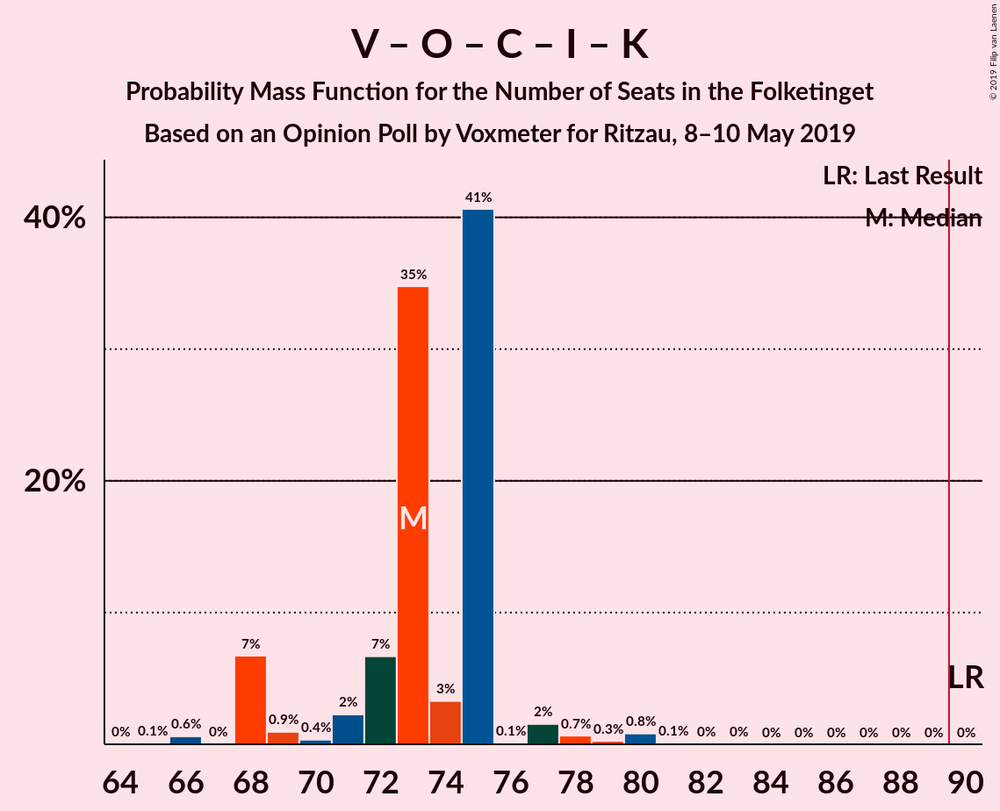

| Number of Seats | Probability | Accumulated | Special Marks |
|:---------------:|:-----------:|:-----------:|:-------------:|
| 65 | 0.1% | 100% |  |
| 66 | 0.6% | 99.9% |  |
| 67 | 0% | 99.3% |  |
| 68 | 7% | 99.3% |  |
| 69 | 0.9% | 93% |  |
| 70 | 0.4% | 92% |  |
| 71 | 2% | 91% |  |
| 72 | 7% | 89% |  |
| 73 | 35% | 82% | Median |
| 74 | 3% | 47% |  |
| 75 | 41% | 44% |  |
| 76 | 0.1% | 4% |  |
| 77 | 2% | 3% |  |
| 78 | 0.7% | 2% |  |
| 79 | 0.3% | 1.3% |  |
| 80 | 0.8% | 1.0% |  |
| 81 | 0.1% | 0.2% |  |
| 82 | 0% | 0.1% |  |
| 83 | 0% | 0% |  |
| 84 | 0% | 0% |  |
| 85 | 0% | 0% |  |
| 86 | 0% | 0% |  |
| 87 | 0% | 0% |  |
| 88 | 0% | 0% |  |
| 89 | 0% | 0% |  |
| 90 | 0% | 0% | Last Result, Majority |

### Venstre – Dansk Folkeparti – Det Konservative Folkeparti – Liberal Alliance

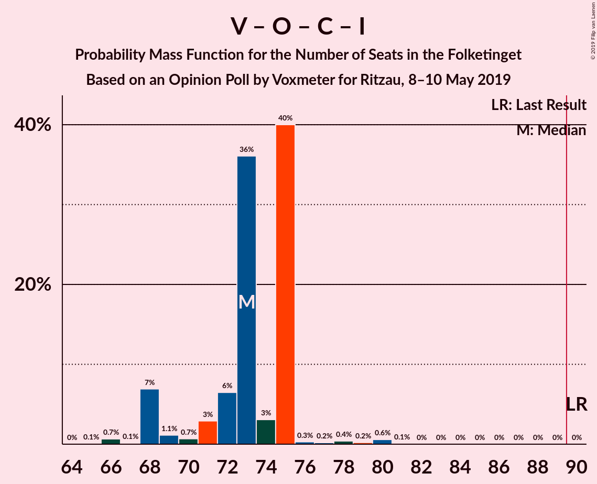

| Number of Seats | Probability | Accumulated | Special Marks |
|:---------------:|:-----------:|:-----------:|:-------------:|
| 65 | 0.1% | 100% |  |
| 66 | 0.7% | 99.9% |  |
| 67 | 0.1% | 99.2% |  |
| 68 | 7% | 99.1% |  |
| 69 | 1.1% | 92% |  |
| 70 | 0.7% | 91% |  |
| 71 | 3% | 90% |  |
| 72 | 6% | 87% |  |
| 73 | 36% | 81% | Median |
| 74 | 3% | 45% |  |
| 75 | 40% | 42% |  |
| 76 | 0.3% | 2% |  |
| 77 | 0.2% | 1.5% |  |
| 78 | 0.4% | 1.3% |  |
| 79 | 0.2% | 0.9% |  |
| 80 | 0.6% | 0.7% |  |
| 81 | 0.1% | 0.1% |  |
| 82 | 0% | 0% |  |
| 83 | 0% | 0% |  |
| 84 | 0% | 0% |  |
| 85 | 0% | 0% |  |
| 86 | 0% | 0% |  |
| 87 | 0% | 0% |  |
| 88 | 0% | 0% |  |
| 89 | 0% | 0% |  |
| 90 | 0% | 0% | Last Result, Majority |

### Socialdemokraterne – Radikale Venstre

| Number of Seats | Probability | Accumulated | Special Marks |
|:---------------:|:-----------:|:-----------:|:-------------:|
| 55 | 0.1% | 100% | Last Result |
| 56 | 0.3% | 99.9% |  |
| 57 | 2% | 99.6% |  |
| 58 | 0.8% | 98% |  |
| 59 | 3% | 97% |  |
| 60 | 0.9% | 94% |  |
| 61 | 1.2% | 93% |  |
| 62 | 2% | 92% |  |
| 63 | 8% | 90% |  |
| 64 | 2% | 81% |  |
| 65 | 32% | 79% | Median |
| 66 | 40% | 48% |  |
| 67 | 4% | 8% |  |
| 68 | 3% | 4% |  |
| 69 | 0.2% | 0.4% |  |
| 70 | 0% | 0.2% |  |
| 71 | 0.1% | 0.2% |  |
| 72 | 0.1% | 0.1% |  |
| 73 | 0% | 0% |  |

### Venstre – Det Konservative Folkeparti – Liberal Alliance

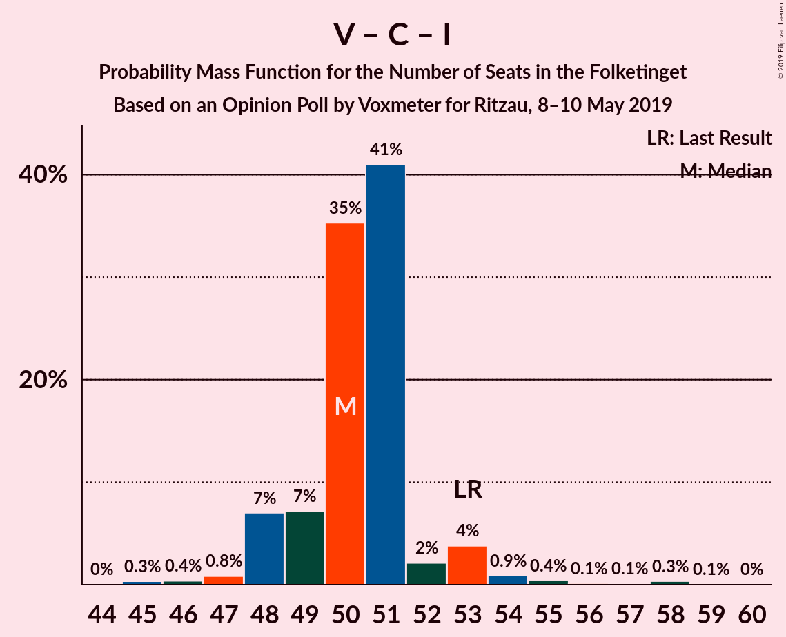

| Number of Seats | Probability | Accumulated | Special Marks |
|:---------------:|:-----------:|:-----------:|:-------------:|
| 44 | 0% | 100% |  |
| 45 | 0.3% | 99.9% |  |
| 46 | 0.4% | 99.6% |  |
| 47 | 0.8% | 99.2% |  |
| 48 | 7% | 98% |  |
| 49 | 7% | 91% |  |
| 50 | 35% | 84% | Median |
| 51 | 41% | 49% |  |
| 52 | 2% | 8% |  |
| 53 | 4% | 6% | Last Result |
| 54 | 0.9% | 2% |  |
| 55 | 0.4% | 1.1% |  |
| 56 | 0.1% | 0.7% |  |
| 57 | 0.1% | 0.5% |  |
| 58 | 0.3% | 0.4% |  |
| 59 | 0.1% | 0.1% |  |
| 60 | 0% | 0% |  |

### Venstre – Det Konservative Folkeparti

| Number of Seats | Probability | Accumulated | Special Marks |
|:---------------:|:-----------:|:-----------:|:-------------:|
| 37 | 0.2% | 100% |  |
| 38 | 0.2% | 99.8% |  |
| 39 | 0.2% | 99.6% |  |
| 40 | 2% | 99.3% | Last Result |
| 41 | 5% | 98% |  |
| 42 | 41% | 93% | Median |
| 43 | 41% | 51% |  |
| 44 | 1.2% | 11% |  |
| 45 | 4% | 9% |  |
| 46 | 0.9% | 5% |  |
| 47 | 4% | 5% |  |
| 48 | 0.1% | 1.0% |  |
| 49 | 0.5% | 0.9% |  |
| 50 | 0.3% | 0.5% |  |
| 51 | 0.1% | 0.2% |  |
| 52 | 0% | 0.1% |  |
| 53 | 0.1% | 0.1% |  |
| 54 | 0% | 0% |  |

### Venstre

| Number of Seats | Probability | Accumulated | Special Marks |
|:---------------:|:-----------:|:-----------:|:-------------:|
| 29 | 0% | 100% |  |
| 30 | 0.3% | 99.9% |  |
| 31 | 2% | 99.6% |  |
| 32 | 4% | 98% |  |
| 33 | 1.2% | 94% |  |
| 34 | 7% | 92% | Last Result |
| 35 | 37% | 86% | Median |
| 36 | 39% | 49% |  |
| 37 | 5% | 10% |  |
| 38 | 0.6% | 5% |  |
| 39 | 0.2% | 4% |  |
| 40 | 3% | 4% |  |
| 41 | 0.5% | 0.7% |  |
| 42 | 0.2% | 0.2% |  |
| 43 | 0% | 0.1% |  |
| 44 | 0% | 0.1% |  |
| 45 | 0% | 0% |  |

## Technical Information

### Opinion Poll

+ **Polling firm:** Voxmeter
+ **Commissioner(s):** Ritzau
+ **Fieldwork period:** 8–10 May 2019

### Calculations

+ **Sample size:** 1012
+ **Simulations done:** 1,048,576
+ **Error estimate:** 2.64%

