# Opinion Poll by Voxmeter for Ritzau, 9–11 May 2019

<a href="#voting-intentions">Voting Intentions</a> | <a href="#seats">Seats</a> | <a href="#coalitions">Coalitions</a> | <a href="#technical-information">Technical Information</a>

## Voting Intentions

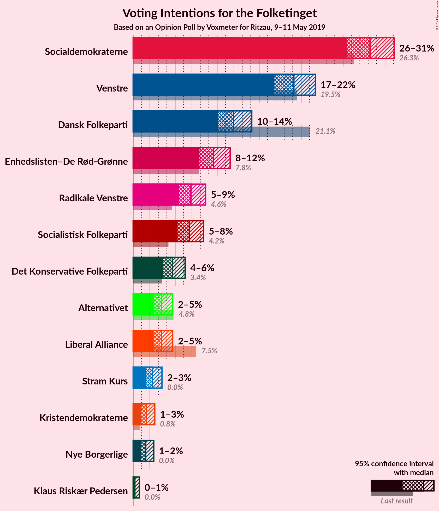

### Confidence Intervals

| Party | Last Result | Poll Result | 80% Confidence Interval | 90% Confidence Interval | 95% Confidence Interval | 99% Confidence Interval |
|:-----:|:-----------:|:-----------:|:-----------------------:|:-----------------------:|:-----------------------:|:-----------------------:|
| Socialdemokraterne | 26.3% | 28.2% | 26.4–30.1% |25.9–30.6% |25.5–31.1% |24.7–32.0% |
| Venstre | 19.5% | 19.1% | 17.6–20.8% |17.2–21.3% |16.8–21.7% |16.1–22.5% |
| Dansk Folkeparti | 21.1% | 12.0% | 10.7–13.4% |10.4–13.8% |10.1–14.1% |9.5–14.8% |
| Enhedslisten–De Rød-Grønne | 7.8% | 9.6% | 8.5–10.9% |8.2–11.2% |7.9–11.6% |7.4–12.2% |
| Radikale Venstre | 4.6% | 6.9% | 5.9–8.0% |5.7–8.3% |5.5–8.6% |5.1–9.2% |
| Socialistisk Folkeparti | 4.2% | 6.7% | 5.8–7.8% |5.5–8.1% |5.3–8.4% |4.9–9.0% |
| Det Konservative Folkeparti | 3.4% | 4.7% | 3.9–5.7% |3.7–5.9% |3.5–6.2% |3.2–6.7% |
| Liberal Alliance | 7.5% | 3.4% | 2.8–4.3% |2.6–4.5% |2.4–4.7% |2.2–5.2% |
| Alternativet | 4.8% | 3.4% | 2.8–4.3% |2.6–4.5% |2.4–4.7% |2.2–5.2% |
| Stram Kurs | 0.0% | 2.3% | 1.8–3.0% |1.6–3.2% |1.5–3.4% |1.3–3.8% |
| Kristendemokraterne | 0.8% | 1.6% | 1.2–2.2% |1.1–2.4% |1.0–2.6% |0.8–2.9% |
| Nye Borgerlige | 0.0% | 1.5% | 1.1–2.1% |1.0–2.3% |0.9–2.5% |0.7–2.8% |
| Klaus Riskær Pedersen | 0.0% | 0.2% | 0.1–0.5% |0.1–0.6% |0.1–0.7% |0.0–0.9% |

*Note:* The poll result column reflects the actual value used in the calculations. Published results may vary slightly, and in addition be rounded to fewer digits.

## Seats

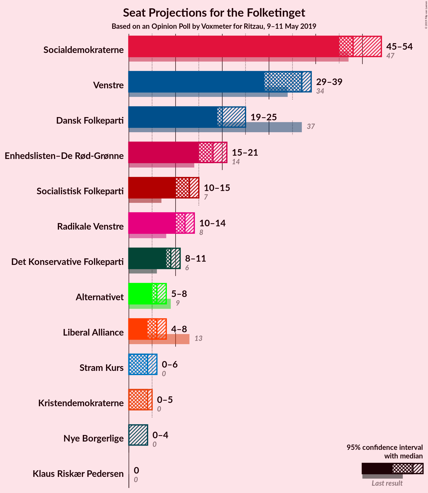

### Confidence Intervals

| Party | Last Result | Median | 80% Confidence Interval | 90% Confidence Interval | 95% Confidence Interval | 99% Confidence Interval |
|:-----:|:-----------:|:------:|:-----------------------:|:-----------------------:|:-----------------------:|:-----------------------:|
| <a href="#socialdemokraterne">Socialdemokraterne</a> | 47 | 48 | 46–52 |46–53 |45–54 |44–56 |
| <a href="#venstre">Venstre</a> | 34 | 37 | 32–39 |31–39 |29–39 |28–41 |
| <a href="#dansk-folkeparti">Dansk Folkeparti</a> | 37 | 20 | 20–23 |19–24 |19–25 |18–26 |
| <a href="#enhedslisten–de-rød-grønne">Enhedslisten–De Rød-Grønne</a> | 14 | 18 | 15–19 |15–19 |15–21 |14–21 |
| <a href="#radikale-venstre">Radikale Venstre</a> | 8 | 12 | 12–13 |11–14 |10–14 |9–17 |
| <a href="#socialistisk-folkeparti">Socialistisk Folkeparti</a> | 7 | 13 | 10–13 |10–14 |10–15 |9–16 |
| <a href="#det-konservative-folkeparti">Det Konservative Folkeparti</a> | 6 | 9 | 8–9 |8–10 |8–11 |7–11 |
| <a href="#liberal-alliance">Liberal Alliance</a> | 13 | 6 | 5–7 |5–8 |4–8 |4–8 |
| <a href="#alternativet">Alternativet</a> | 9 | 6 | 5–7 |5–7 |5–8 |4–9 |
| <a href="#stram-kurs">Stram Kurs</a> | 0 | 4 | 4–5 |3–6 |0–6 |0–7 |
| <a href="#kristendemokraterne">Kristendemokraterne</a> | 0 | 4 | 0–4 |0–5 |0–5 |0–5 |
| <a href="#nye-borgerlige">Nye Borgerlige</a> | 0 | 0 | 0 |0 |0–4 |0–5 |
| <a href="#klaus-riskær-pedersen">Klaus Riskær Pedersen</a> | 0 | 0 | 0 |0 |0 |0 |

### Socialdemokraterne

*For a full overview of the results for this party, see the [Socialdemokraterne](party-socialdemokraterne.html) page.*

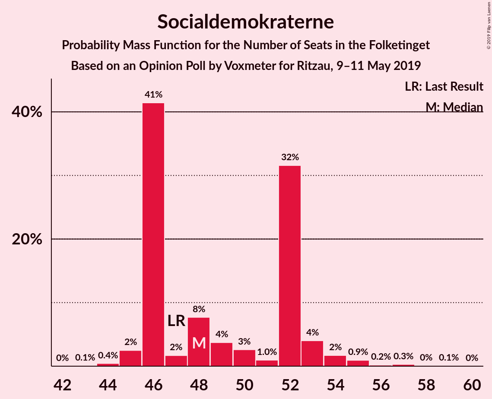

| Number of Seats | Probability | Accumulated | Special Marks |
|:---------------:|:-----------:|:-----------:|:-------------:|
| 43 | 0.1% | 100% |  |
| 44 | 0.4% | 99.9% |  |
| 45 | 2% | 99.4% |  |
| 46 | 41% | 97% |  |
| 47 | 2% | 55% | Last Result |
| 48 | 8% | 54% | Median |
| 49 | 4% | 46% |  |
| 50 | 3% | 42% |  |
| 51 | 1.0% | 40% |  |
| 52 | 32% | 39% |  |
| 53 | 4% | 7% |  |
| 54 | 2% | 3% |  |
| 55 | 0.9% | 2% |  |
| 56 | 0.2% | 0.6% |  |
| 57 | 0.3% | 0.4% |  |
| 58 | 0% | 0.1% |  |
| 59 | 0.1% | 0.1% |  |
| 60 | 0% | 0% |  |

### Venstre

*For a full overview of the results for this party, see the [Venstre](party-venstre.html) page.*

| Number of Seats | Probability | Accumulated | Special Marks |
|:---------------:|:-----------:|:-----------:|:-------------:|
| 28 | 1.3% | 100% |  |
| 29 | 3% | 98.7% |  |
| 30 | 0.3% | 96% |  |
| 31 | 5% | 96% |  |
| 32 | 2% | 90% |  |
| 33 | 2% | 88% |  |
| 34 | 8% | 85% | Last Result |
| 35 | 1.2% | 78% |  |
| 36 | 2% | 76% |  |
| 37 | 40% | 74% | Median |
| 38 | 0.9% | 34% |  |
| 39 | 32% | 33% |  |
| 40 | 0.3% | 1.0% |  |
| 41 | 0.7% | 0.8% |  |
| 42 | 0% | 0% |  |

### Dansk Folkeparti

*For a full overview of the results for this party, see the [Dansk Folkeparti](party-danskfolkeparti.html) page.*

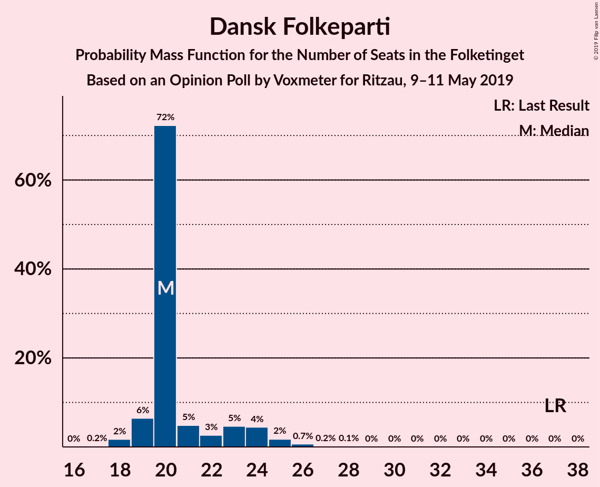

| Number of Seats | Probability | Accumulated | Special Marks |
|:---------------:|:-----------:|:-----------:|:-------------:|
| 17 | 0.2% | 100% |  |
| 18 | 2% | 99.8% |  |
| 19 | 6% | 98% |  |
| 20 | 72% | 92% | Median |
| 21 | 5% | 19% |  |
| 22 | 3% | 14% |  |
| 23 | 5% | 12% |  |
| 24 | 4% | 7% |  |
| 25 | 2% | 3% |  |
| 26 | 0.7% | 0.9% |  |
| 27 | 0.2% | 0.3% |  |
| 28 | 0.1% | 0.1% |  |
| 29 | 0% | 0% |  |
| 30 | 0% | 0% |  |
| 31 | 0% | 0% |  |
| 32 | 0% | 0% |  |
| 33 | 0% | 0% |  |
| 34 | 0% | 0% |  |
| 35 | 0% | 0% |  |
| 36 | 0% | 0% |  |
| 37 | 0% | 0% | Last Result |

### Enhedslisten–De Rød-Grønne

*For a full overview of the results for this party, see the [Enhedslisten–De Rød-Grønne](party-enhedslisten–derød-grønne.html) page.*

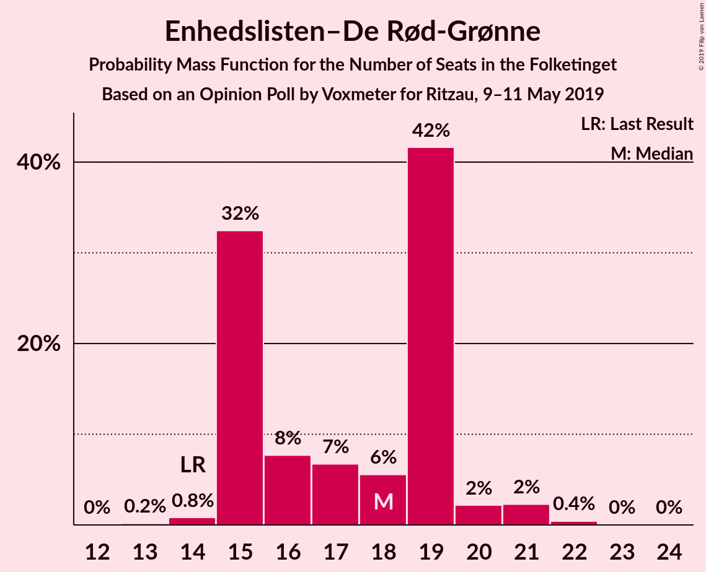

| Number of Seats | Probability | Accumulated | Special Marks |
|:---------------:|:-----------:|:-----------:|:-------------:|
| 13 | 0.2% | 100% |  |
| 14 | 0.8% | 99.8% | Last Result |
| 15 | 32% | 99.0% |  |
| 16 | 8% | 67% |  |
| 17 | 7% | 59% |  |
| 18 | 6% | 52% | Median |
| 19 | 42% | 47% |  |
| 20 | 2% | 5% |  |
| 21 | 2% | 3% |  |
| 22 | 0.4% | 0.5% |  |
| 23 | 0% | 0.1% |  |
| 24 | 0% | 0% |  |

### Radikale Venstre

*For a full overview of the results for this party, see the [Radikale Venstre](party-radikalevenstre.html) page.*

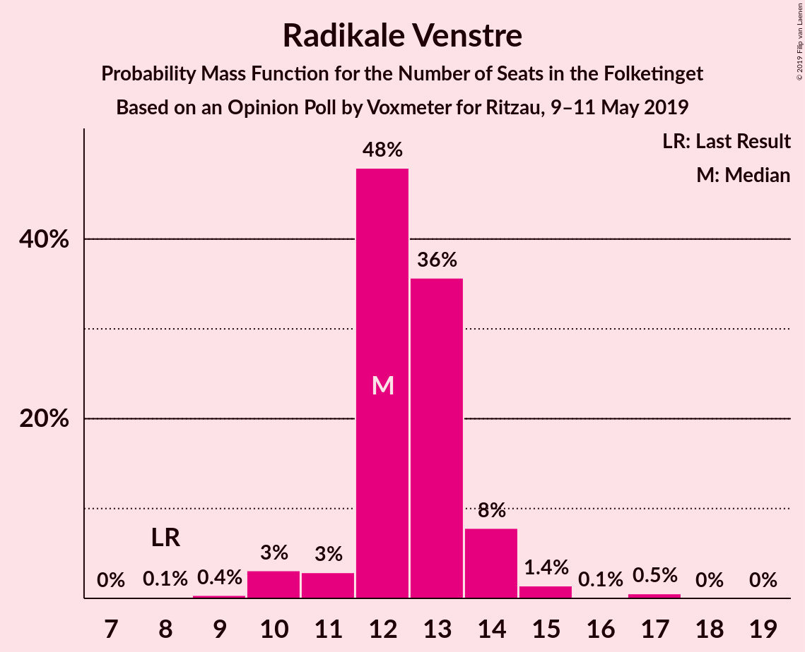

| Number of Seats | Probability | Accumulated | Special Marks |
|:---------------:|:-----------:|:-----------:|:-------------:|
| 8 | 0.1% | 100% | Last Result |
| 9 | 0.4% | 99.8% |  |
| 10 | 3% | 99.5% |  |
| 11 | 3% | 96% |  |
| 12 | 48% | 94% | Median |
| 13 | 36% | 46% |  |
| 14 | 8% | 10% |  |
| 15 | 1.4% | 2% |  |
| 16 | 0.1% | 0.7% |  |
| 17 | 0.5% | 0.6% |  |
| 18 | 0% | 0.1% |  |
| 19 | 0% | 0% |  |

### Socialistisk Folkeparti

*For a full overview of the results for this party, see the [Socialistisk Folkeparti](party-socialistiskfolkeparti.html) page.*

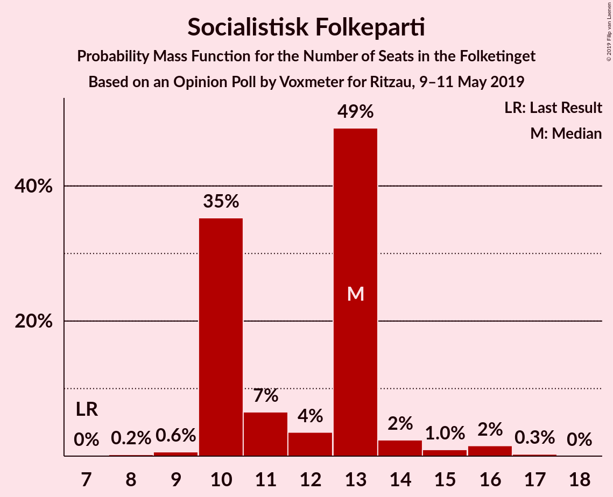

| Number of Seats | Probability | Accumulated | Special Marks |
|:---------------:|:-----------:|:-----------:|:-------------:|
| 7 | 0% | 100% | Last Result |
| 8 | 0.2% | 100% |  |
| 9 | 0.6% | 99.8% |  |
| 10 | 35% | 99.1% |  |
| 11 | 7% | 64% |  |
| 12 | 4% | 57% |  |
| 13 | 49% | 54% | Median |
| 14 | 2% | 5% |  |
| 15 | 1.0% | 3% |  |
| 16 | 2% | 2% |  |
| 17 | 0.3% | 0.3% |  |
| 18 | 0% | 0% |  |

### Det Konservative Folkeparti

*For a full overview of the results for this party, see the [Det Konservative Folkeparti](party-detkonservativefolkeparti.html) page.*

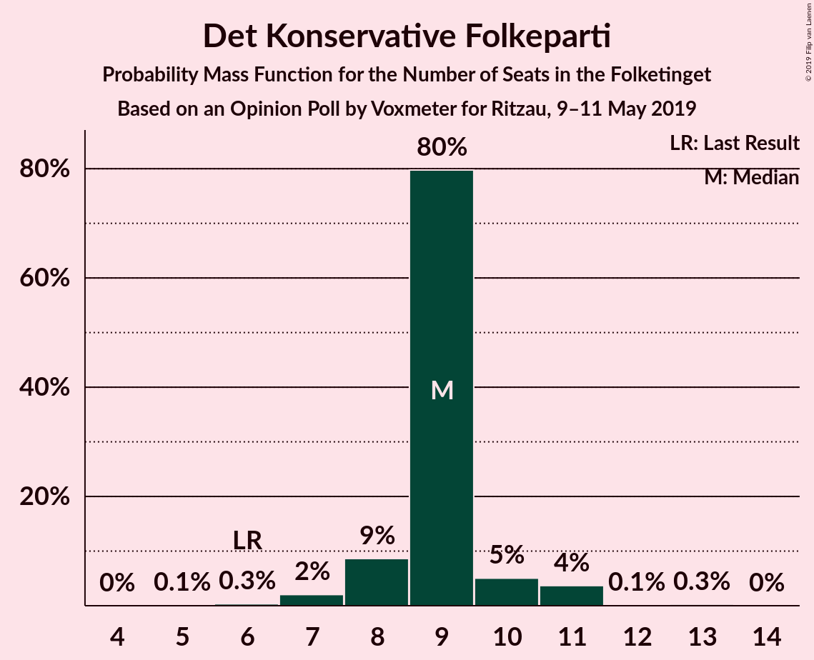

| Number of Seats | Probability | Accumulated | Special Marks |
|:---------------:|:-----------:|:-----------:|:-------------:|
| 5 | 0.1% | 100% |  |
| 6 | 0.3% | 99.9% | Last Result |
| 7 | 2% | 99.6% |  |
| 8 | 9% | 98% |  |
| 9 | 80% | 89% | Median |
| 10 | 5% | 9% |  |
| 11 | 4% | 4% |  |
| 12 | 0.1% | 0.4% |  |
| 13 | 0.3% | 0.3% |  |
| 14 | 0% | 0% |  |

### Liberal Alliance

*For a full overview of the results for this party, see the [Liberal Alliance](party-liberalalliance.html) page.*

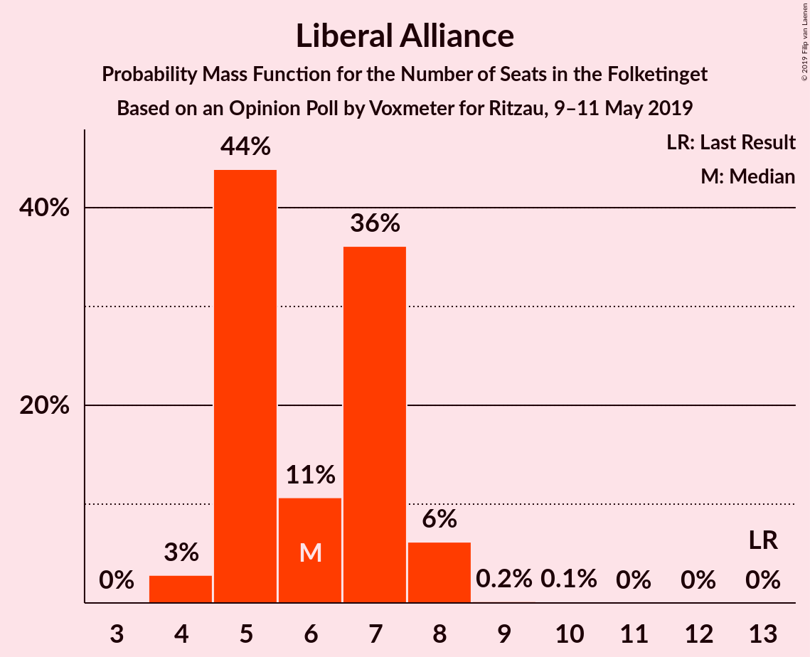

| Number of Seats | Probability | Accumulated | Special Marks |
|:---------------:|:-----------:|:-----------:|:-------------:|
| 4 | 3% | 100% |  |
| 5 | 44% | 97% |  |
| 6 | 11% | 53% | Median |
| 7 | 36% | 43% |  |
| 8 | 6% | 6% |  |
| 9 | 0.2% | 0.3% |  |
| 10 | 0.1% | 0.1% |  |
| 11 | 0% | 0% |  |
| 12 | 0% | 0% |  |
| 13 | 0% | 0% | Last Result |

### Alternativet

*For a full overview of the results for this party, see the [Alternativet](party-alternativet.html) page.*

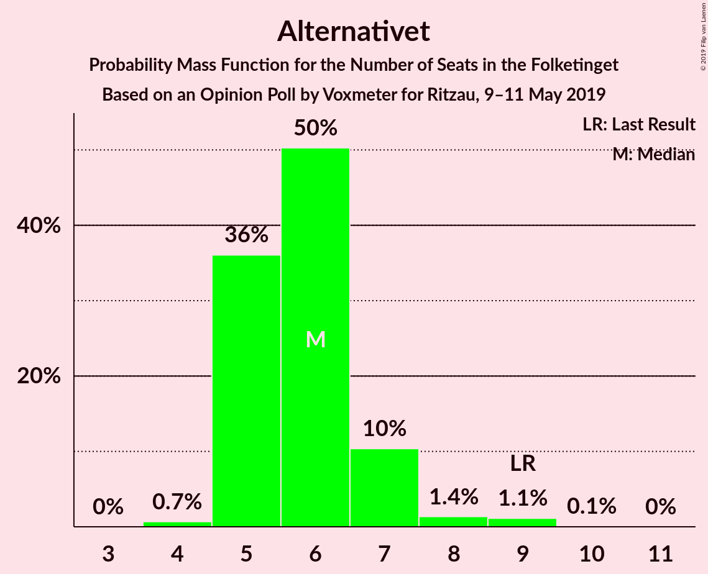

| Number of Seats | Probability | Accumulated | Special Marks |
|:---------------:|:-----------:|:-----------:|:-------------:|
| 4 | 0.7% | 100% |  |
| 5 | 36% | 99.3% |  |
| 6 | 50% | 63% | Median |
| 7 | 10% | 13% |  |
| 8 | 1.4% | 3% |  |
| 9 | 1.1% | 1.2% | Last Result |
| 10 | 0.1% | 0.1% |  |
| 11 | 0% | 0% |  |

### Stram Kurs

*For a full overview of the results for this party, see the [Stram Kurs](party-stramkurs.html) page.*

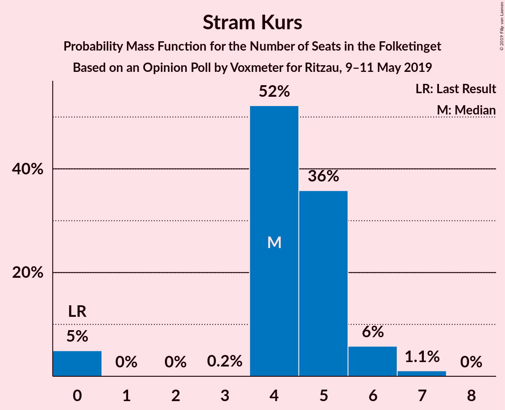

| Number of Seats | Probability | Accumulated | Special Marks |
|:---------------:|:-----------:|:-----------:|:-------------:|
| 0 | 5% | 100% | Last Result |
| 1 | 0% | 95% |  |
| 2 | 0% | 95% |  |
| 3 | 0.2% | 95% |  |
| 4 | 52% | 95% | Median |
| 5 | 36% | 43% |  |
| 6 | 6% | 7% |  |
| 7 | 1.1% | 1.1% |  |
| 8 | 0% | 0% |  |

### Kristendemokraterne

*For a full overview of the results for this party, see the [Kristendemokraterne](party-kristendemokraterne.html) page.*

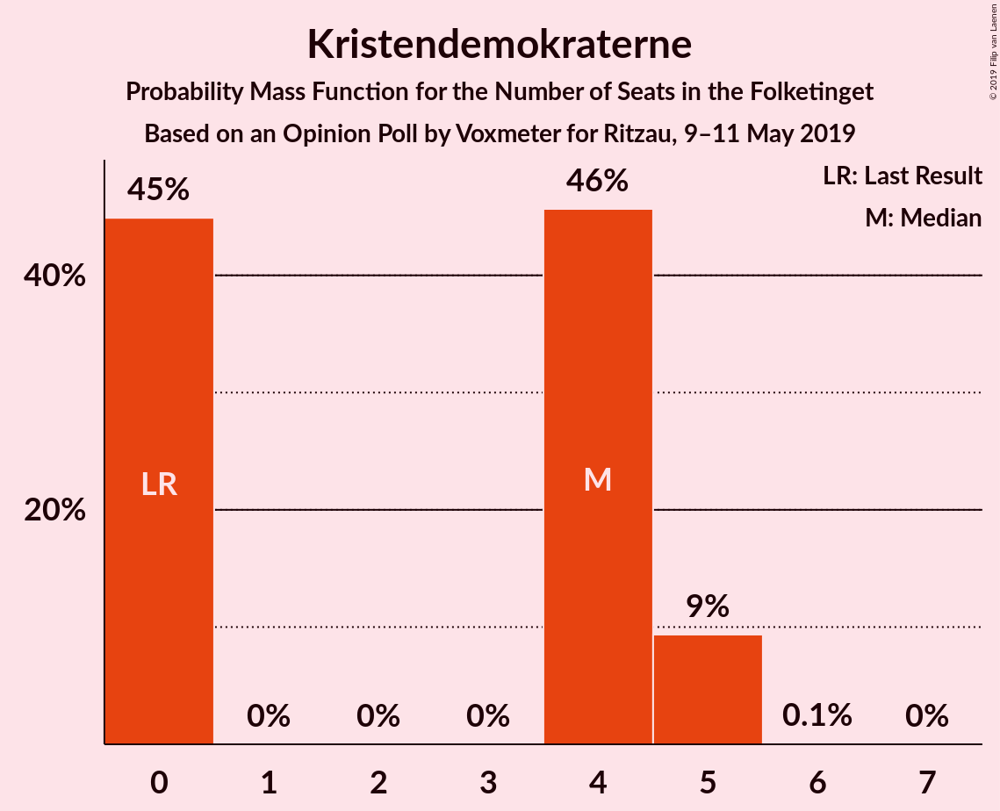

| Number of Seats | Probability | Accumulated | Special Marks |
|:---------------:|:-----------:|:-----------:|:-------------:|
| 0 | 45% | 100% | Last Result |
| 1 | 0% | 55% |  |
| 2 | 0% | 55% |  |
| 3 | 0% | 55% |  |
| 4 | 46% | 55% | Median |
| 5 | 9% | 9% |  |
| 6 | 0.1% | 0.1% |  |
| 7 | 0% | 0% |  |

### Nye Borgerlige

*For a full overview of the results for this party, see the [Nye Borgerlige](party-nyeborgerlige.html) page.*

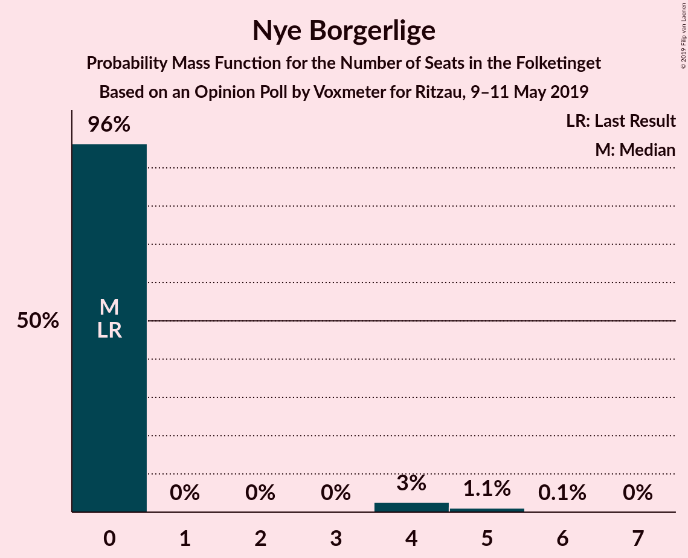

| Number of Seats | Probability | Accumulated | Special Marks |
|:---------------:|:-----------:|:-----------:|:-------------:|
| 0 | 96% | 100% | Last Result, Median |
| 1 | 0% | 4% |  |
| 2 | 0% | 4% |  |
| 3 | 0% | 4% |  |
| 4 | 3% | 4% |  |
| 5 | 1.1% | 1.1% |  |
| 6 | 0.1% | 0.1% |  |
| 7 | 0% | 0% |  |

### Klaus Riskær Pedersen

*For a full overview of the results for this party, see the [Klaus Riskær Pedersen](party-klausriskærpedersen.html) page.*

| Number of Seats | Probability | Accumulated | Special Marks |
|:---------------:|:-----------:|:-----------:|:-------------:|
| 0 | 100% | 100% | Last Result, Median |

## Coalitions

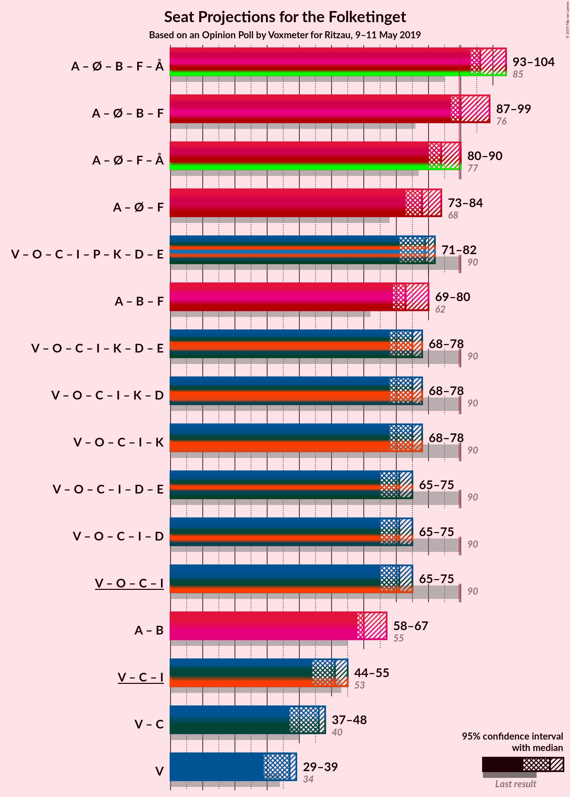

### Confidence Intervals

| Coalition | Last Result | Median | Majority? | 80% Confidence Interval | 90% Confidence Interval | 95% Confidence Interval | 99% Confidence Interval |
|:---------:|:-----------:|:------:|:---------:|:-----------------------:|:-----------------------:|:-----------------------:|:-----------------------:|
| Socialdemokraterne – Enhedslisten–De Rød-Grønne – Radikale Venstre – Socialistisk Folkeparti – Alternativet | 85 | 96 | 99.9% | 95–100 | 94–103 | 93–104 | 91–107 |
| Socialdemokraterne – Enhedslisten–De Rød-Grønne – Radikale Venstre – Socialistisk Folkeparti | 76 | 90 | 88% | 89–94 | 88–96 | 87–99 | 84–99 |
| Socialdemokraterne – Enhedslisten–De Rød-Grønne – Socialistisk Folkeparti – Alternativet | 77 | 84 | 4% | 82–86 | 82–89 | 80–90 | 79–93 |
| Socialdemokraterne – Enhedslisten–De Rød-Grønne – Socialistisk Folkeparti | 68 | 78 | 0% | 77–80 | 76–83 | 73–84 | 72–87 |
| Venstre – Dansk Folkeparti – Det Konservative Folkeparti – Liberal Alliance – Stram Kurs – Kristendemokraterne – Nye Borgerlige – Klaus Riskær Pedersen | 90 | 79 | 0% | 75–80 | 72–81 | 71–82 | 68–84 |
| Socialdemokraterne – Radikale Venstre – Socialistisk Folkeparti | 62 | 73 | 0% | 71–76 | 70–78 | 69–80 | 68–81 |
| Venstre – Dansk Folkeparti – Det Konservative Folkeparti – Liberal Alliance – Kristendemokraterne – Nye Borgerlige – Klaus Riskær Pedersen | 90 | 75 | 0% | 71–75 | 70–77 | 68–78 | 67–79 |
| Venstre – Dansk Folkeparti – Det Konservative Folkeparti – Liberal Alliance – Kristendemokraterne – Nye Borgerlige | 90 | 75 | 0% | 71–75 | 70–77 | 68–78 | 67–79 |
| Venstre – Dansk Folkeparti – Det Konservative Folkeparti – Liberal Alliance – Kristendemokraterne | 90 | 75 | 0% | 70–75 | 70–77 | 68–78 | 65–78 |
| Venstre – Dansk Folkeparti – Det Konservative Folkeparti – Liberal Alliance – Nye Borgerlige – Klaus Riskær Pedersen | 90 | 71 | 0% | 68–75 | 66–75 | 65–75 | 64–79 |
| Venstre – Dansk Folkeparti – Det Konservative Folkeparti – Liberal Alliance – Nye Borgerlige | 90 | 71 | 0% | 68–75 | 66–75 | 65–75 | 64–79 |
| Venstre – Dansk Folkeparti – Det Konservative Folkeparti – Liberal Alliance | 90 | 71 | 0% | 68–75 | 66–75 | 65–75 | 64–77 |
| Socialdemokraterne – Radikale Venstre | 55 | 60 | 0% | 58–65 | 58–67 | 58–67 | 55–68 |
| Venstre – Det Konservative Folkeparti – Liberal Alliance | 53 | 51 | 0% | 47–55 | 44–55 | 44–55 | 43–55 |
| Venstre – Det Konservative Folkeparti | 40 | 46 | 0% | 40–48 | 39–48 | 37–48 | 37–50 |
| Venstre | 34 | 37 | 0% | 32–39 | 31–39 | 29–39 | 28–41 |

### Socialdemokraterne – Enhedslisten–De Rød-Grønne – Radikale Venstre – Socialistisk Folkeparti – Alternativet

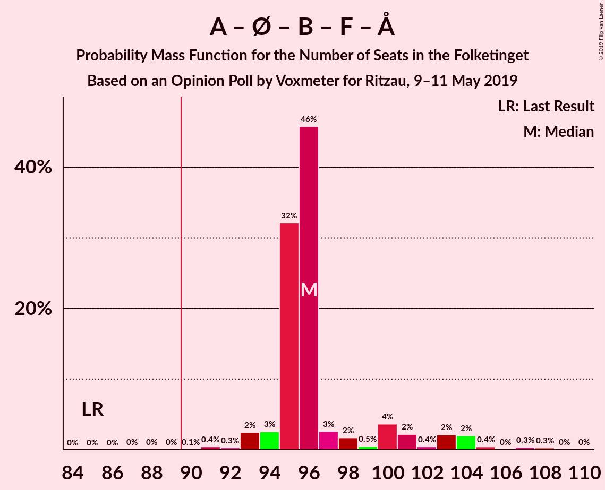

| Number of Seats | Probability | Accumulated | Special Marks |
|:---------------:|:-----------:|:-----------:|:-------------:|
| 85 | 0% | 100% | Last Result |
| 86 | 0% | 100% |  |
| 87 | 0% | 100% |  |
| 88 | 0% | 100% |  |
| 89 | 0% | 99.9% |  |
| 90 | 0.1% | 99.9% | Majority |
| 91 | 0.4% | 99.9% |  |
| 92 | 0.3% | 99.4% |  |
| 93 | 2% | 99.2% |  |
| 94 | 3% | 97% |  |
| 95 | 32% | 94% |  |
| 96 | 46% | 62% |  |
| 97 | 3% | 16% | Median |
| 98 | 2% | 14% |  |
| 99 | 0.5% | 12% |  |
| 100 | 4% | 11% |  |
| 101 | 2% | 8% |  |
| 102 | 0.4% | 6% |  |
| 103 | 2% | 5% |  |
| 104 | 2% | 3% |  |
| 105 | 0.4% | 1.0% |  |
| 106 | 0% | 0.6% |  |
| 107 | 0.3% | 0.6% |  |
| 108 | 0.3% | 0.3% |  |
| 109 | 0% | 0% |  |

### Socialdemokraterne – Enhedslisten–De Rød-Grønne – Radikale Venstre – Socialistisk Folkeparti

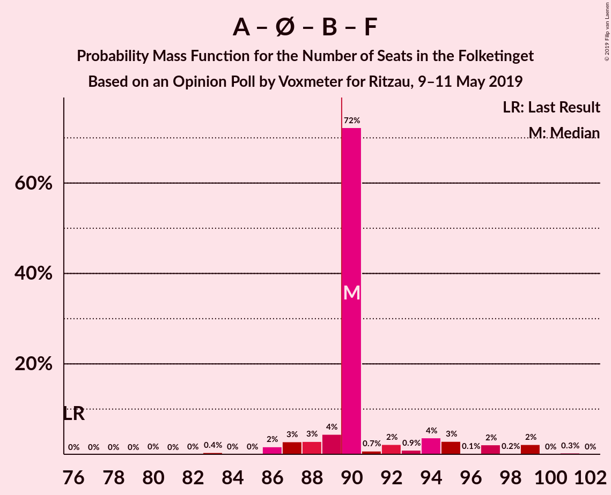

| Number of Seats | Probability | Accumulated | Special Marks |
|:---------------:|:-----------:|:-----------:|:-------------:|
| 76 | 0% | 100% | Last Result |
| 77 | 0% | 100% |  |
| 78 | 0% | 100% |  |
| 79 | 0% | 100% |  |
| 80 | 0% | 100% |  |
| 81 | 0% | 100% |  |
| 82 | 0% | 100% |  |
| 83 | 0.4% | 100% |  |
| 84 | 0% | 99.5% |  |
| 85 | 0% | 99.5% |  |
| 86 | 2% | 99.5% |  |
| 87 | 3% | 98% |  |
| 88 | 3% | 95% |  |
| 89 | 4% | 92% |  |
| 90 | 72% | 88% | Majority |
| 91 | 0.7% | 15% | Median |
| 92 | 2% | 15% |  |
| 93 | 0.9% | 12% |  |
| 94 | 4% | 12% |  |
| 95 | 3% | 8% |  |
| 96 | 0.1% | 5% |  |
| 97 | 2% | 5% |  |
| 98 | 0.2% | 3% |  |
| 99 | 2% | 3% |  |
| 100 | 0% | 0.4% |  |
| 101 | 0.3% | 0.3% |  |
| 102 | 0% | 0% |  |

### Socialdemokraterne – Enhedslisten–De Rød-Grønne – Socialistisk Folkeparti – Alternativet

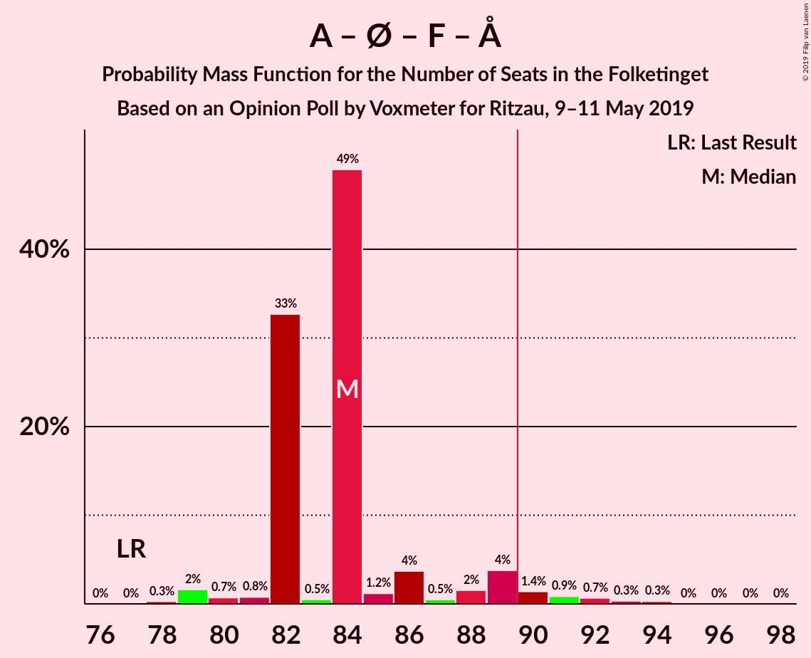

| Number of Seats | Probability | Accumulated | Special Marks |
|:---------------:|:-----------:|:-----------:|:-------------:|
| 77 | 0% | 100% | Last Result |
| 78 | 0.3% | 99.9% |  |
| 79 | 2% | 99.6% |  |
| 80 | 0.7% | 98% |  |
| 81 | 0.8% | 97% |  |
| 82 | 33% | 97% |  |
| 83 | 0.5% | 64% |  |
| 84 | 49% | 63% |  |
| 85 | 1.2% | 14% | Median |
| 86 | 4% | 13% |  |
| 87 | 0.5% | 9% |  |
| 88 | 2% | 9% |  |
| 89 | 4% | 7% |  |
| 90 | 1.4% | 4% | Majority |
| 91 | 0.9% | 2% |  |
| 92 | 0.7% | 1.4% |  |
| 93 | 0.3% | 0.7% |  |
| 94 | 0.3% | 0.4% |  |
| 95 | 0% | 0.1% |  |
| 96 | 0% | 0.1% |  |
| 97 | 0% | 0% |  |

### Socialdemokraterne – Enhedslisten–De Rød-Grønne – Socialistisk Folkeparti

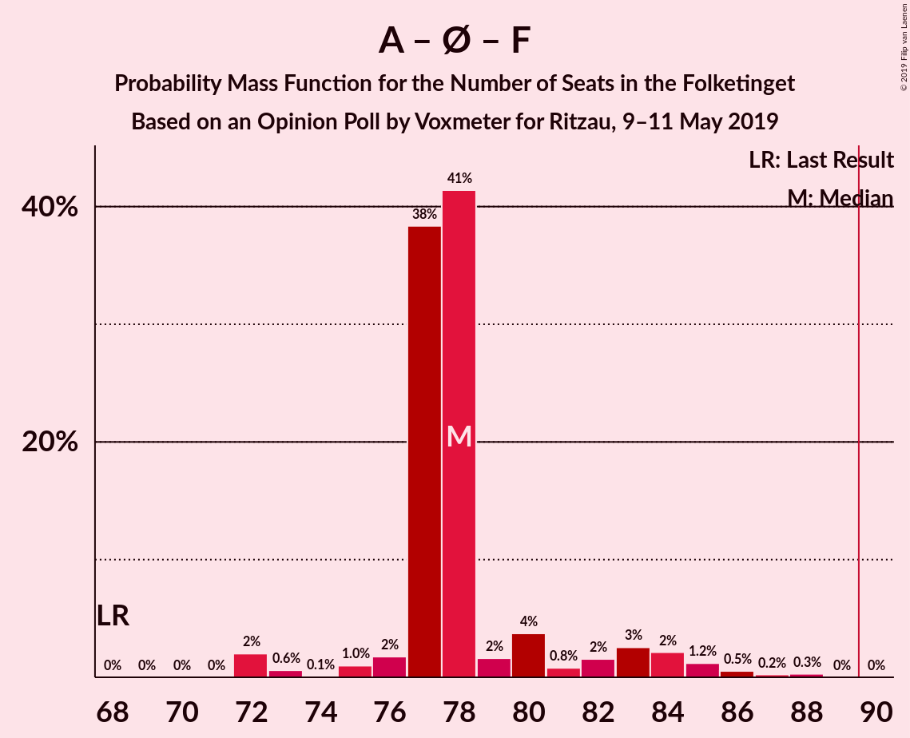

| Number of Seats | Probability | Accumulated | Special Marks |
|:---------------:|:-----------:|:-----------:|:-------------:|
| 68 | 0% | 100% | Last Result |
| 69 | 0% | 100% |  |
| 70 | 0% | 100% |  |
| 71 | 0% | 100% |  |
| 72 | 2% | 99.9% |  |
| 73 | 0.6% | 98% |  |
| 74 | 0.1% | 97% |  |
| 75 | 1.0% | 97% |  |
| 76 | 2% | 96% |  |
| 77 | 38% | 94% |  |
| 78 | 41% | 56% |  |
| 79 | 2% | 15% | Median |
| 80 | 4% | 13% |  |
| 81 | 0.8% | 9% |  |
| 82 | 2% | 9% |  |
| 83 | 3% | 7% |  |
| 84 | 2% | 4% |  |
| 85 | 1.2% | 2% |  |
| 86 | 0.5% | 1.1% |  |
| 87 | 0.2% | 0.6% |  |
| 88 | 0.3% | 0.3% |  |
| 89 | 0% | 0.1% |  |
| 90 | 0% | 0% | Majority |

### Venstre – Dansk Folkeparti – Det Konservative Folkeparti – Liberal Alliance – Stram Kurs – Kristendemokraterne – Nye Borgerlige – Klaus Riskær Pedersen

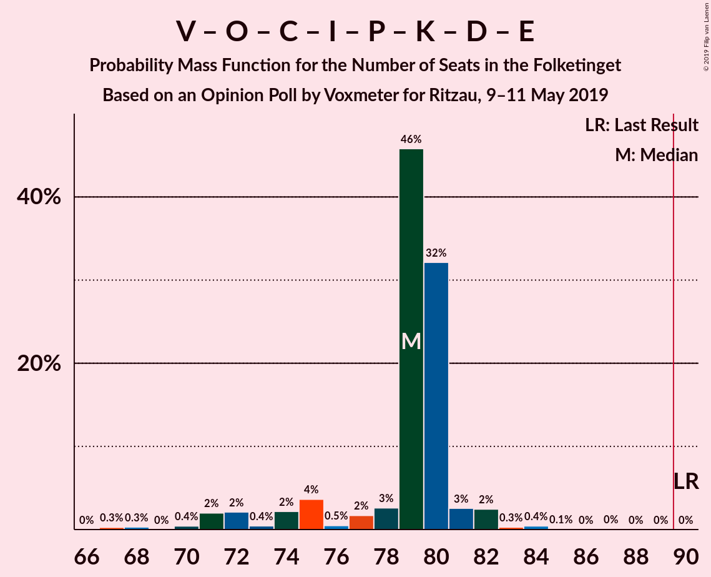

| Number of Seats | Probability | Accumulated | Special Marks |
|:---------------:|:-----------:|:-----------:|:-------------:|
| 67 | 0.3% | 100% |  |
| 68 | 0.3% | 99.7% |  |
| 69 | 0% | 99.4% |  |
| 70 | 0.4% | 99.4% |  |
| 71 | 2% | 99.0% |  |
| 72 | 2% | 97% |  |
| 73 | 0.4% | 95% |  |
| 74 | 2% | 94% |  |
| 75 | 4% | 92% |  |
| 76 | 0.5% | 89% |  |
| 77 | 2% | 88% |  |
| 78 | 3% | 86% |  |
| 79 | 46% | 84% |  |
| 80 | 32% | 38% | Median |
| 81 | 3% | 6% |  |
| 82 | 2% | 3% |  |
| 83 | 0.3% | 0.8% |  |
| 84 | 0.4% | 0.6% |  |
| 85 | 0.1% | 0.1% |  |
| 86 | 0% | 0.1% |  |
| 87 | 0% | 0.1% |  |
| 88 | 0% | 0% |  |
| 89 | 0% | 0% |  |
| 90 | 0% | 0% | Last Result, Majority |

### Socialdemokraterne – Radikale Venstre – Socialistisk Folkeparti

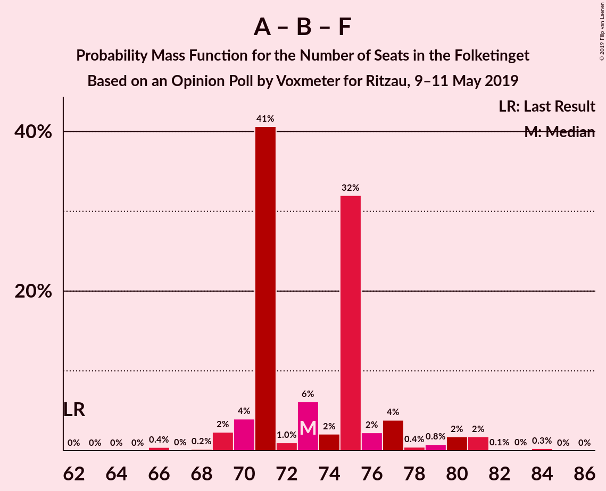

| Number of Seats | Probability | Accumulated | Special Marks |
|:---------------:|:-----------:|:-----------:|:-------------:|
| 62 | 0% | 100% | Last Result |
| 63 | 0% | 100% |  |
| 64 | 0% | 100% |  |
| 65 | 0% | 100% |  |
| 66 | 0.4% | 100% |  |
| 67 | 0% | 99.6% |  |
| 68 | 0.2% | 99.5% |  |
| 69 | 2% | 99.4% |  |
| 70 | 4% | 97% |  |
| 71 | 41% | 93% |  |
| 72 | 1.0% | 52% |  |
| 73 | 6% | 51% | Median |
| 74 | 2% | 45% |  |
| 75 | 32% | 43% |  |
| 76 | 2% | 11% |  |
| 77 | 4% | 9% |  |
| 78 | 0.4% | 5% |  |
| 79 | 0.8% | 5% |  |
| 80 | 2% | 4% |  |
| 81 | 2% | 2% |  |
| 82 | 0.1% | 0.4% |  |
| 83 | 0% | 0.3% |  |
| 84 | 0.3% | 0.3% |  |
| 85 | 0% | 0% |  |

### Venstre – Dansk Folkeparti – Det Konservative Folkeparti – Liberal Alliance – Kristendemokraterne – Nye Borgerlige – Klaus Riskær Pedersen

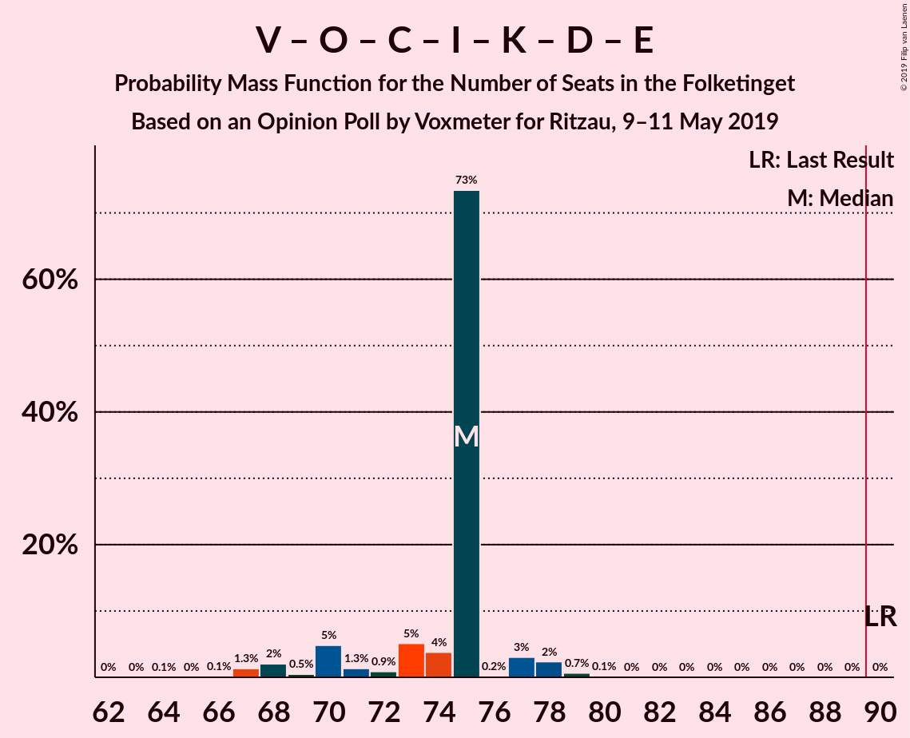

| Number of Seats | Probability | Accumulated | Special Marks |
|:---------------:|:-----------:|:-----------:|:-------------:|
| 64 | 0.1% | 100% |  |
| 65 | 0% | 99.9% |  |
| 66 | 0.1% | 99.9% |  |
| 67 | 1.3% | 99.8% |  |
| 68 | 2% | 98% |  |
| 69 | 0.5% | 96% |  |
| 70 | 5% | 96% |  |
| 71 | 1.3% | 91% |  |
| 72 | 0.9% | 90% |  |
| 73 | 5% | 89% |  |
| 74 | 4% | 84% |  |
| 75 | 73% | 80% |  |
| 76 | 0.2% | 6% | Median |
| 77 | 3% | 6% |  |
| 78 | 2% | 3% |  |
| 79 | 0.7% | 0.9% |  |
| 80 | 0.1% | 0.2% |  |
| 81 | 0% | 0.1% |  |
| 82 | 0% | 0.1% |  |
| 83 | 0% | 0% |  |
| 84 | 0% | 0% |  |
| 85 | 0% | 0% |  |
| 86 | 0% | 0% |  |
| 87 | 0% | 0% |  |
| 88 | 0% | 0% |  |
| 89 | 0% | 0% |  |
| 90 | 0% | 0% | Last Result, Majority |

### Venstre – Dansk Folkeparti – Det Konservative Folkeparti – Liberal Alliance – Kristendemokraterne – Nye Borgerlige

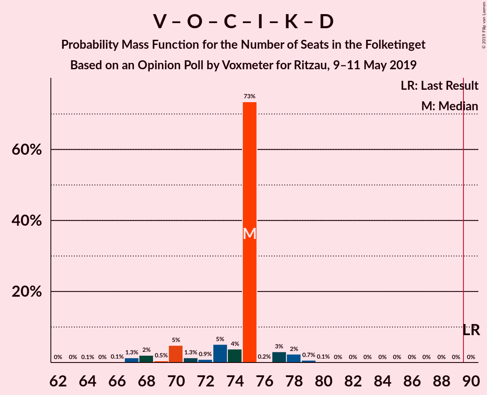

| Number of Seats | Probability | Accumulated | Special Marks |
|:---------------:|:-----------:|:-----------:|:-------------:|
| 64 | 0.1% | 100% |  |
| 65 | 0% | 99.9% |  |
| 66 | 0.1% | 99.9% |  |
| 67 | 1.3% | 99.8% |  |
| 68 | 2% | 98% |  |
| 69 | 0.5% | 96% |  |
| 70 | 5% | 96% |  |
| 71 | 1.3% | 91% |  |
| 72 | 0.9% | 90% |  |
| 73 | 5% | 89% |  |
| 74 | 4% | 84% |  |
| 75 | 73% | 80% |  |
| 76 | 0.2% | 6% | Median |
| 77 | 3% | 6% |  |
| 78 | 2% | 3% |  |
| 79 | 0.7% | 0.9% |  |
| 80 | 0.1% | 0.2% |  |
| 81 | 0% | 0.1% |  |
| 82 | 0% | 0.1% |  |
| 83 | 0% | 0% |  |
| 84 | 0% | 0% |  |
| 85 | 0% | 0% |  |
| 86 | 0% | 0% |  |
| 87 | 0% | 0% |  |
| 88 | 0% | 0% |  |
| 89 | 0% | 0% |  |
| 90 | 0% | 0% | Last Result, Majority |

### Venstre – Dansk Folkeparti – Det Konservative Folkeparti – Liberal Alliance – Kristendemokraterne

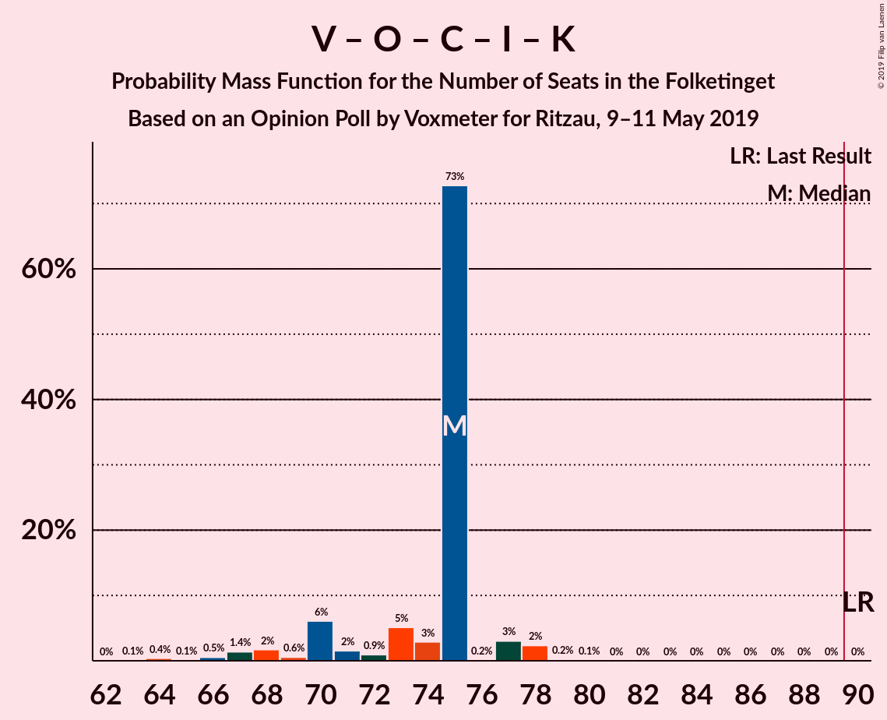

| Number of Seats | Probability | Accumulated | Special Marks |
|:---------------:|:-----------:|:-----------:|:-------------:|
| 63 | 0.1% | 100% |  |
| 64 | 0.4% | 99.9% |  |
| 65 | 0.1% | 99.5% |  |
| 66 | 0.5% | 99.4% |  |
| 67 | 1.4% | 98.9% |  |
| 68 | 2% | 98% |  |
| 69 | 0.6% | 96% |  |
| 70 | 6% | 95% |  |
| 71 | 2% | 89% |  |
| 72 | 0.9% | 88% |  |
| 73 | 5% | 87% |  |
| 74 | 3% | 82% |  |
| 75 | 73% | 79% |  |
| 76 | 0.2% | 6% | Median |
| 77 | 3% | 6% |  |
| 78 | 2% | 3% |  |
| 79 | 0.2% | 0.3% |  |
| 80 | 0.1% | 0.1% |  |
| 81 | 0% | 0.1% |  |
| 82 | 0% | 0% |  |
| 83 | 0% | 0% |  |
| 84 | 0% | 0% |  |
| 85 | 0% | 0% |  |
| 86 | 0% | 0% |  |
| 87 | 0% | 0% |  |
| 88 | 0% | 0% |  |
| 89 | 0% | 0% |  |
| 90 | 0% | 0% | Last Result, Majority |

### Venstre – Dansk Folkeparti – Det Konservative Folkeparti – Liberal Alliance – Nye Borgerlige – Klaus Riskær Pedersen

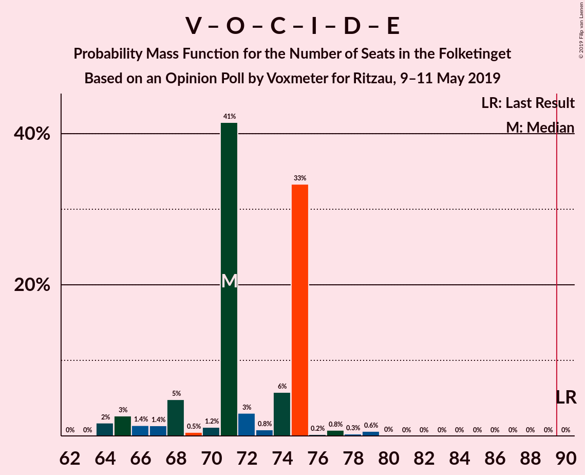

| Number of Seats | Probability | Accumulated | Special Marks |
|:---------------:|:-----------:|:-----------:|:-------------:|
| 63 | 0% | 100% |  |
| 64 | 2% | 99.9% |  |
| 65 | 3% | 98% |  |
| 66 | 1.4% | 96% |  |
| 67 | 1.4% | 94% |  |
| 68 | 5% | 93% |  |
| 69 | 0.5% | 88% |  |
| 70 | 1.2% | 88% |  |
| 71 | 41% | 86% |  |
| 72 | 3% | 45% | Median |
| 73 | 0.8% | 42% |  |
| 74 | 6% | 41% |  |
| 75 | 33% | 35% |  |
| 76 | 0.2% | 2% |  |
| 77 | 0.8% | 2% |  |
| 78 | 0.3% | 0.9% |  |
| 79 | 0.6% | 0.7% |  |
| 80 | 0% | 0.1% |  |
| 81 | 0% | 0% |  |
| 82 | 0% | 0% |  |
| 83 | 0% | 0% |  |
| 84 | 0% | 0% |  |
| 85 | 0% | 0% |  |
| 86 | 0% | 0% |  |
| 87 | 0% | 0% |  |
| 88 | 0% | 0% |  |
| 89 | 0% | 0% |  |
| 90 | 0% | 0% | Last Result, Majority |

### Venstre – Dansk Folkeparti – Det Konservative Folkeparti – Liberal Alliance – Nye Borgerlige

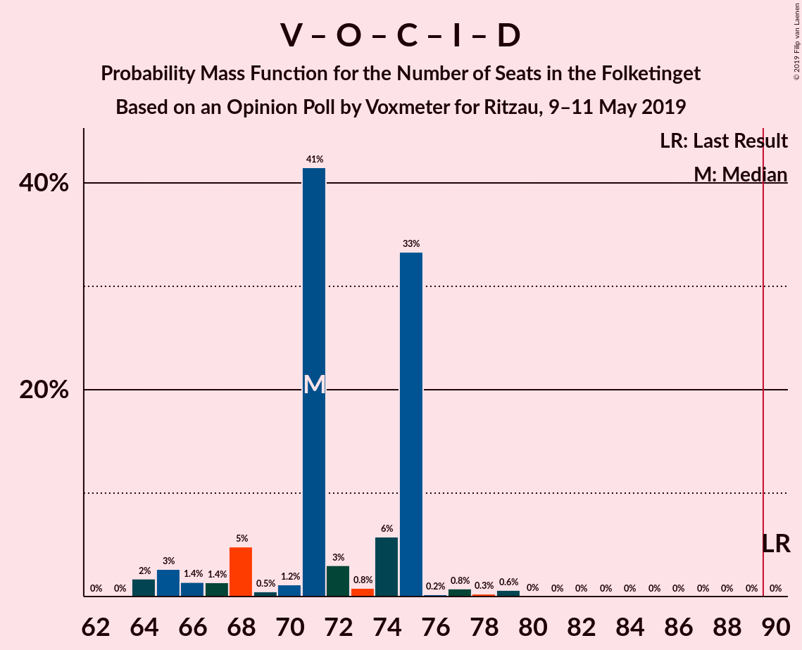

| Number of Seats | Probability | Accumulated | Special Marks |
|:---------------:|:-----------:|:-----------:|:-------------:|
| 63 | 0% | 100% |  |
| 64 | 2% | 99.9% |  |
| 65 | 3% | 98% |  |
| 66 | 1.4% | 96% |  |
| 67 | 1.4% | 94% |  |
| 68 | 5% | 93% |  |
| 69 | 0.5% | 88% |  |
| 70 | 1.2% | 88% |  |
| 71 | 41% | 86% |  |
| 72 | 3% | 45% | Median |
| 73 | 0.8% | 42% |  |
| 74 | 6% | 41% |  |
| 75 | 33% | 35% |  |
| 76 | 0.2% | 2% |  |
| 77 | 0.8% | 2% |  |
| 78 | 0.3% | 0.9% |  |
| 79 | 0.6% | 0.7% |  |
| 80 | 0% | 0.1% |  |
| 81 | 0% | 0% |  |
| 82 | 0% | 0% |  |
| 83 | 0% | 0% |  |
| 84 | 0% | 0% |  |
| 85 | 0% | 0% |  |
| 86 | 0% | 0% |  |
| 87 | 0% | 0% |  |
| 88 | 0% | 0% |  |
| 89 | 0% | 0% |  |
| 90 | 0% | 0% | Last Result, Majority |

### Venstre – Dansk Folkeparti – Det Konservative Folkeparti – Liberal Alliance

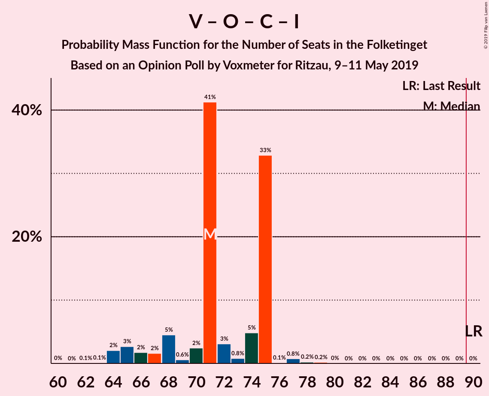

| Number of Seats | Probability | Accumulated | Special Marks |
|:---------------:|:-----------:|:-----------:|:-------------:|
| 62 | 0.1% | 100% |  |
| 63 | 0.1% | 99.9% |  |
| 64 | 2% | 99.8% |  |
| 65 | 3% | 98% |  |
| 66 | 2% | 95% |  |
| 67 | 2% | 93% |  |
| 68 | 5% | 92% |  |
| 69 | 0.6% | 87% |  |
| 70 | 2% | 87% |  |
| 71 | 41% | 84% |  |
| 72 | 3% | 43% | Median |
| 73 | 0.8% | 40% |  |
| 74 | 5% | 39% |  |
| 75 | 33% | 34% |  |
| 76 | 0.1% | 1.3% |  |
| 77 | 0.8% | 1.2% |  |
| 78 | 0.2% | 0.4% |  |
| 79 | 0.2% | 0.2% |  |
| 80 | 0% | 0% |  |
| 81 | 0% | 0% |  |
| 82 | 0% | 0% |  |
| 83 | 0% | 0% |  |
| 84 | 0% | 0% |  |
| 85 | 0% | 0% |  |
| 86 | 0% | 0% |  |
| 87 | 0% | 0% |  |
| 88 | 0% | 0% |  |
| 89 | 0% | 0% |  |
| 90 | 0% | 0% | Last Result, Majority |

### Socialdemokraterne – Radikale Venstre

| Number of Seats | Probability | Accumulated | Special Marks |
|:---------------:|:-----------:|:-----------:|:-------------:|
| 55 | 0.5% | 100% | Last Result |
| 56 | 0.1% | 99.5% |  |
| 57 | 1.3% | 99.4% |  |
| 58 | 43% | 98% |  |
| 59 | 2% | 55% |  |
| 60 | 6% | 53% | Median |
| 61 | 1.3% | 47% |  |
| 62 | 4% | 45% |  |
| 63 | 1.5% | 42% |  |
| 64 | 2% | 40% |  |
| 65 | 32% | 38% |  |
| 66 | 0.2% | 6% |  |
| 67 | 4% | 6% |  |
| 68 | 2% | 2% |  |
| 69 | 0.1% | 0.5% |  |
| 70 | 0.1% | 0.4% |  |
| 71 | 0.3% | 0.3% |  |
| 72 | 0% | 0% |  |

### Venstre – Det Konservative Folkeparti – Liberal Alliance

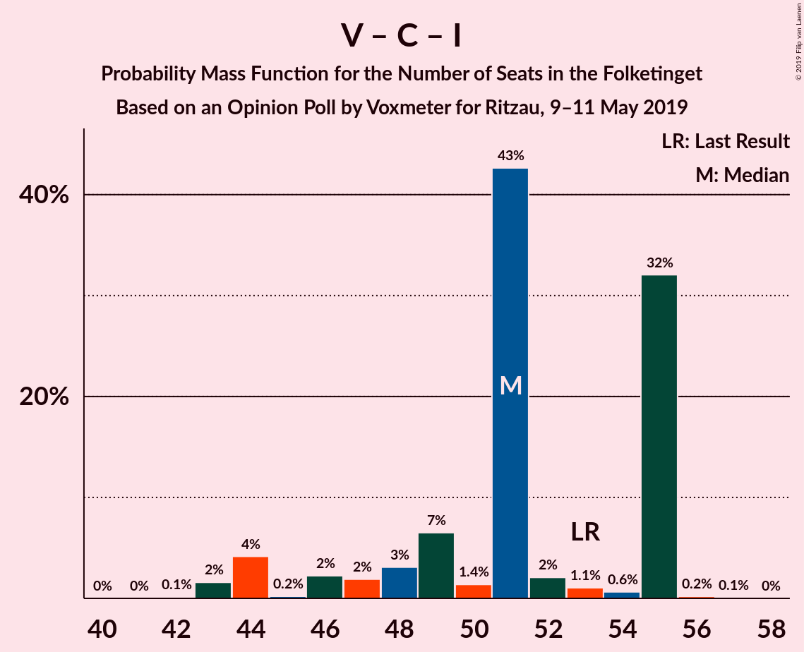

| Number of Seats | Probability | Accumulated | Special Marks |
|:---------------:|:-----------:|:-----------:|:-------------:|
| 42 | 0.1% | 100% |  |
| 43 | 2% | 99.8% |  |
| 44 | 4% | 98% |  |
| 45 | 0.2% | 94% |  |
| 46 | 2% | 94% |  |
| 47 | 2% | 92% |  |
| 48 | 3% | 90% |  |
| 49 | 7% | 87% |  |
| 50 | 1.4% | 80% |  |
| 51 | 43% | 79% |  |
| 52 | 2% | 36% | Median |
| 53 | 1.1% | 34% | Last Result |
| 54 | 0.6% | 33% |  |
| 55 | 32% | 32% |  |
| 56 | 0.2% | 0.3% |  |
| 57 | 0.1% | 0.1% |  |
| 58 | 0% | 0% |  |

### Venstre – Det Konservative Folkeparti

| Number of Seats | Probability | Accumulated | Special Marks |
|:---------------:|:-----------:|:-----------:|:-------------:|
| 36 | 0% | 100% |  |
| 37 | 3% | 99.9% |  |
| 38 | 0.5% | 97% |  |
| 39 | 2% | 96% |  |
| 40 | 5% | 94% | Last Result |
| 41 | 3% | 89% |  |
| 42 | 0.8% | 86% |  |
| 43 | 5% | 85% |  |
| 44 | 1.2% | 80% |  |
| 45 | 4% | 79% |  |
| 46 | 41% | 75% | Median |
| 47 | 0.8% | 33% |  |
| 48 | 31% | 33% |  |
| 49 | 0.6% | 1.4% |  |
| 50 | 0.7% | 0.8% |  |
| 51 | 0% | 0.1% |  |
| 52 | 0% | 0% |  |

### Venstre

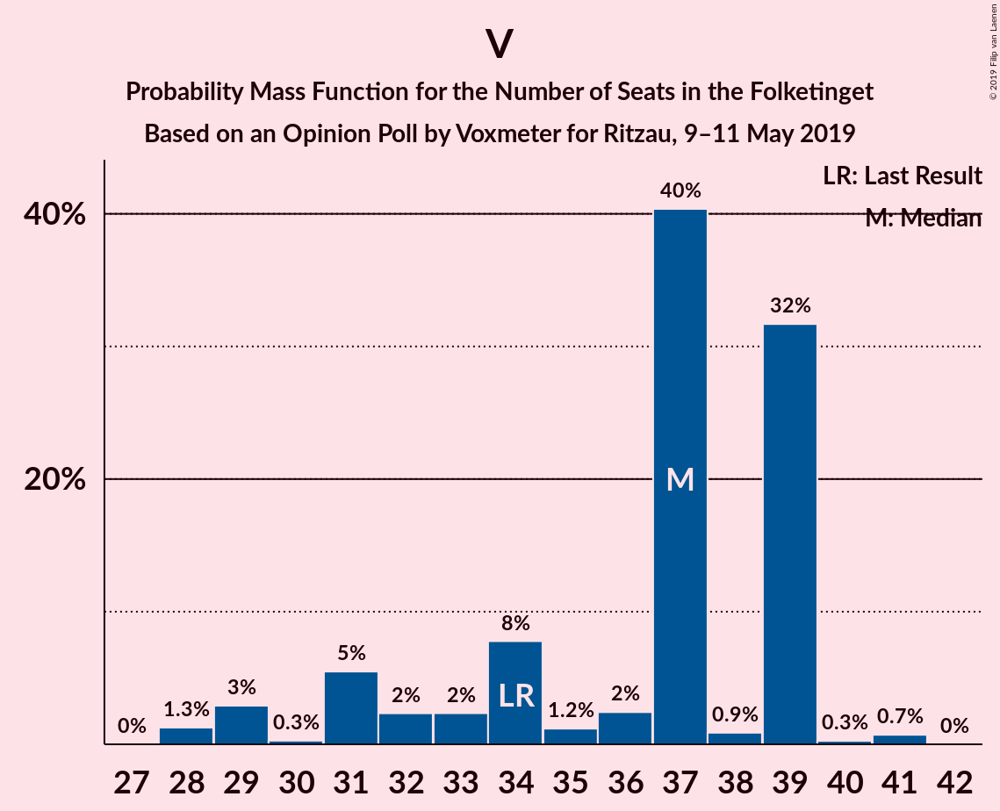

| Number of Seats | Probability | Accumulated | Special Marks |
|:---------------:|:-----------:|:-----------:|:-------------:|
| 28 | 1.3% | 100% |  |
| 29 | 3% | 98.7% |  |
| 30 | 0.3% | 96% |  |
| 31 | 5% | 96% |  |
| 32 | 2% | 90% |  |
| 33 | 2% | 88% |  |
| 34 | 8% | 85% | Last Result |
| 35 | 1.2% | 78% |  |
| 36 | 2% | 76% |  |
| 37 | 40% | 74% | Median |
| 38 | 0.9% | 34% |  |
| 39 | 32% | 33% |  |
| 40 | 0.3% | 1.0% |  |
| 41 | 0.7% | 0.8% |  |
| 42 | 0% | 0% |  |

## Technical Information

### Opinion Poll

+ **Polling firm:** Voxmeter
+ **Commissioner(s):** Ritzau
+ **Fieldwork period:** 9–11 May 2019

### Calculations

+ **Sample size:** 1003
+ **Simulations done:** 1,048,576
+ **Error estimate:** 3.15%

