# Opinion Poll by YouGov, 7–11 May 2019

<a href="#voting-intentions">Voting Intentions</a> | <a href="#seats">Seats</a> | <a href="#coalitions">Coalitions</a> | <a href="#technical-information">Technical Information</a>

## Voting Intentions

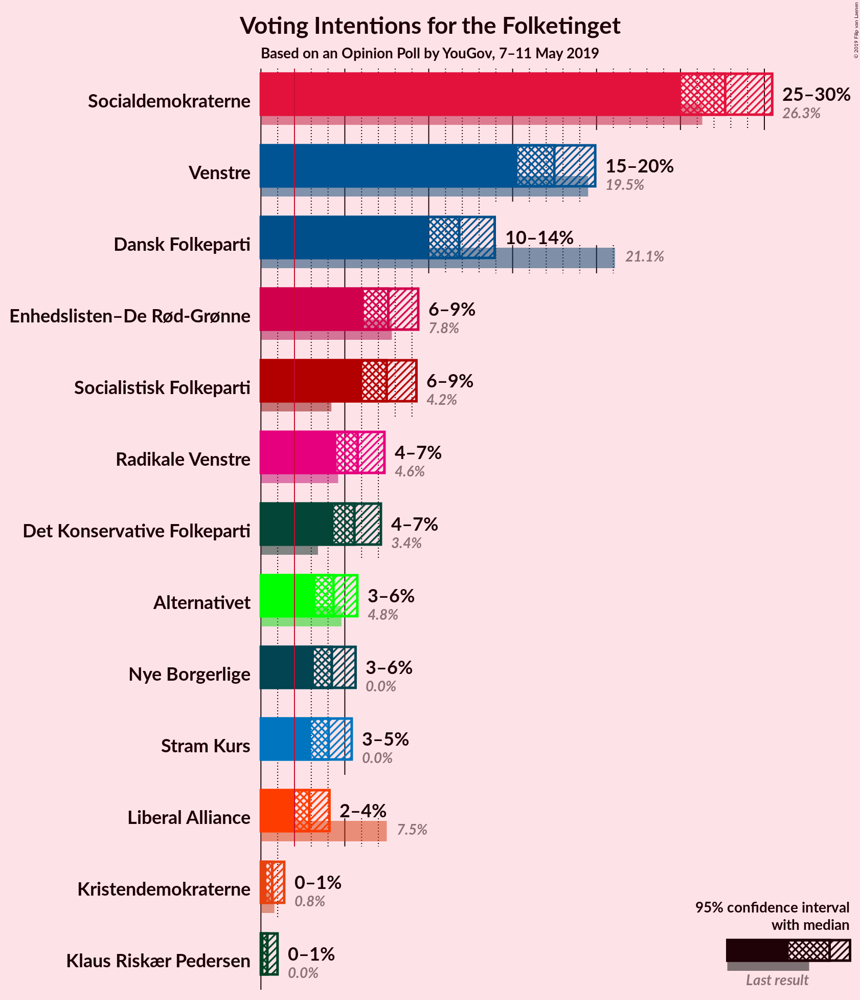

### Confidence Intervals

| Party | Last Result | Poll Result | 80% Confidence Interval | 90% Confidence Interval | 95% Confidence Interval | 99% Confidence Interval |
|:-----:|:-----------:|:-----------:|:-----------------------:|:-----------------------:|:-----------------------:|:-----------------------:|
| Socialdemokraterne | 26.3% | 27.7% | 25.9–29.5% |25.5–30.0% |25.0–30.5% |24.2–31.4% |
| Venstre | 19.5% | 17.5% | 16.0–19.1% |15.6–19.5% |15.3–19.9% |14.6–20.7% |
| Dansk Folkeparti | 21.1% | 11.8% | 10.6–13.2% |10.3–13.6% |10.0–13.9% |9.4–14.6% |
| Enhedslisten–De Rød-Grønne | 7.8% | 7.6% | 6.6–8.7% |6.4–9.1% |6.1–9.4% |5.7–10.0% |
| Socialistisk Folkeparti | 4.2% | 7.5% | 6.5–8.6% |6.3–9.0% |6.0–9.3% |5.6–9.8% |
| Radikale Venstre | 4.6% | 5.8% | 4.9–6.8% |4.7–7.1% |4.5–7.4% |4.1–7.9% |
| Det Konservative Folkeparti | 3.4% | 5.6% | 4.8–6.6% |4.5–6.9% |4.3–7.1% |4.0–7.7% |
| Alternativet | 4.8% | 4.3% | 3.6–5.2% |3.4–5.5% |3.2–5.7% |2.9–6.2% |
| Nye Borgerlige | 0.0% | 4.2% | 3.5–5.2% |3.3–5.4% |3.2–5.6% |2.9–6.1% |
| Stram Kurs | 0.0% | 4.0% | 3.4–4.9% |3.2–5.2% |3.0–5.4% |2.7–5.9% |
| Liberal Alliance | 7.5% | 2.9% | 2.3–3.7% |2.1–3.9% |2.0–4.1% |1.8–4.5% |
| Kristendemokraterne | 0.8% | 0.7% | 0.4–1.1% |0.4–1.3% |0.3–1.4% |0.2–1.6% |
| Klaus Riskær Pedersen | 0.0% | 0.4% | 0.2–0.8% |0.2–0.9% |0.2–1.0% |0.1–1.2% |

*Note:* The poll result column reflects the actual value used in the calculations. Published results may vary slightly, and in addition be rounded to fewer digits.

## Seats

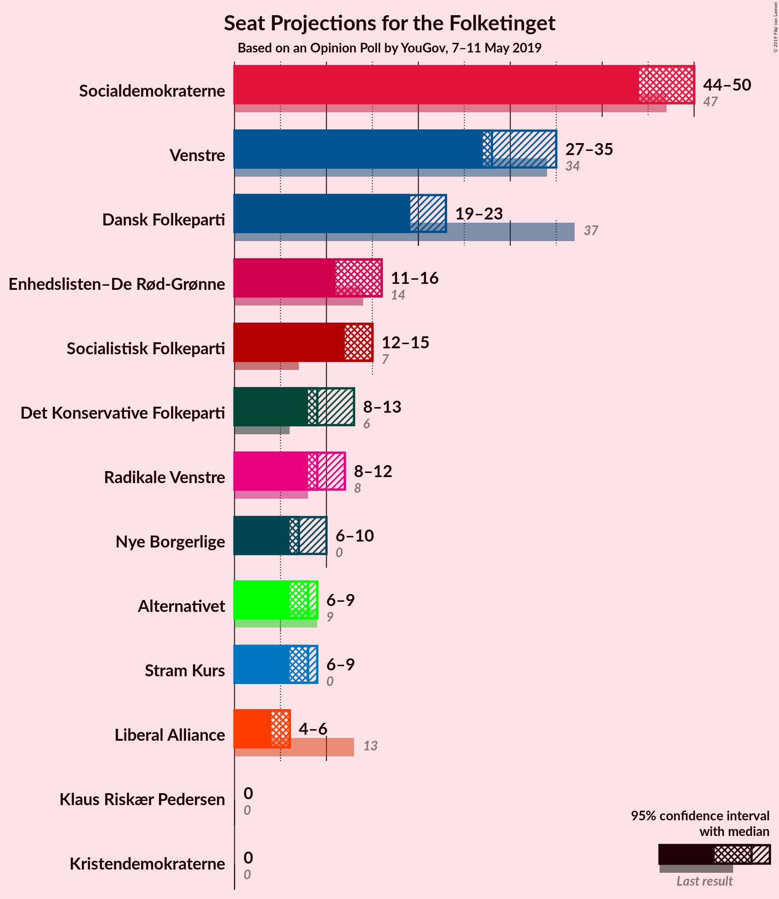

### Confidence Intervals

| Party | Last Result | Median | 80% Confidence Interval | 90% Confidence Interval | 95% Confidence Interval | 99% Confidence Interval |
|:-----:|:-----------:|:------:|:-----------------------:|:-----------------------:|:-----------------------:|:-----------------------:|
| <a href="#socialdemokraterne">Socialdemokraterne</a> | 47 | 50 | 47–50 |46–50 |44–50 |44–54 |
| <a href="#venstre">Venstre</a> | 34 | 28 | 28–33 |28–34 |27–35 |26–37 |
| <a href="#dansk-folkeparti">Dansk Folkeparti</a> | 37 | 19 | 19–21 |19–22 |19–23 |18–24 |
| <a href="#enhedslisten–de-rød-grønne">Enhedslisten–De Rød-Grønne</a> | 14 | 16 | 13–16 |11–16 |11–16 |11–16 |
| <a href="#socialistisk-folkeparti">Socialistisk Folkeparti</a> | 7 | 15 | 13–15 |12–15 |12–15 |10–17 |
| <a href="#radikale-venstre">Radikale Venstre</a> | 8 | 9 | 9–11 |8–11 |8–12 |8–13 |
| <a href="#det-konservative-folkeparti">Det Konservative Folkeparti</a> | 6 | 9 | 8–10 |8–11 |8–13 |7–13 |
| <a href="#alternativet">Alternativet</a> | 9 | 8 | 6–8 |6–9 |6–9 |6–10 |
| <a href="#nye-borgerlige">Nye Borgerlige</a> | 0 | 7 | 7–8 |6–8 |6–10 |5–11 |
| <a href="#stram-kurs">Stram Kurs</a> | 0 | 8 | 8–9 |7–9 |6–9 |6–9 |
| <a href="#liberal-alliance">Liberal Alliance</a> | 13 | 6 | 5–6 |5–6 |4–6 |4–7 |
| <a href="#kristendemokraterne">Kristendemokraterne</a> | 0 | 0 | 0 |0 |0 |0 |
| <a href="#klaus-riskær-pedersen">Klaus Riskær Pedersen</a> | 0 | 0 | 0 |0 |0 |0 |

### Socialdemokraterne

*For a full overview of the results for this party, see the [Socialdemokraterne](party-socialdemokraterne.html) page.*

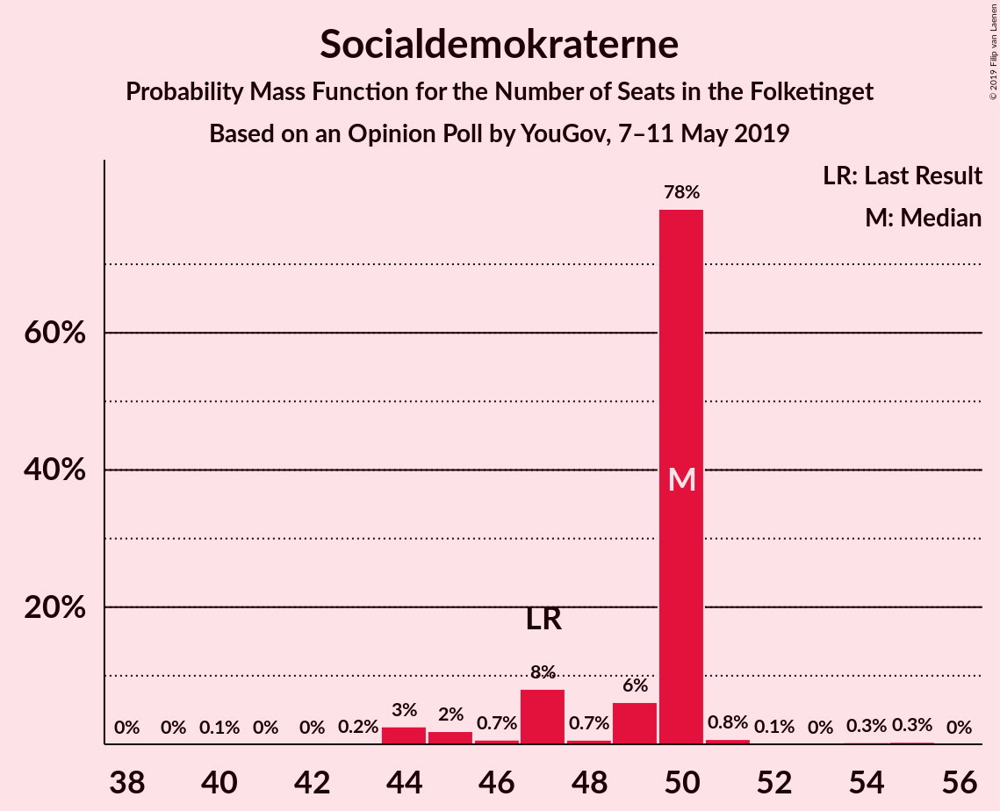

| Number of Seats | Probability | Accumulated | Special Marks |
|:---------------:|:-----------:|:-----------:|:-------------:|
| 40 | 0.1% | 100% |  |
| 41 | 0% | 99.9% |  |
| 42 | 0% | 99.9% |  |
| 43 | 0.2% | 99.9% |  |
| 44 | 3% | 99.7% |  |
| 45 | 2% | 97% |  |
| 46 | 0.7% | 95% |  |
| 47 | 8% | 95% | Last Result |
| 48 | 0.7% | 86% |  |
| 49 | 6% | 86% |  |
| 50 | 78% | 80% | Median |
| 51 | 0.8% | 2% |  |
| 52 | 0.1% | 0.8% |  |
| 53 | 0% | 0.7% |  |
| 54 | 0.3% | 0.7% |  |
| 55 | 0.3% | 0.4% |  |
| 56 | 0% | 0% |  |

### Venstre

*For a full overview of the results for this party, see the [Venstre](party-venstre.html) page.*

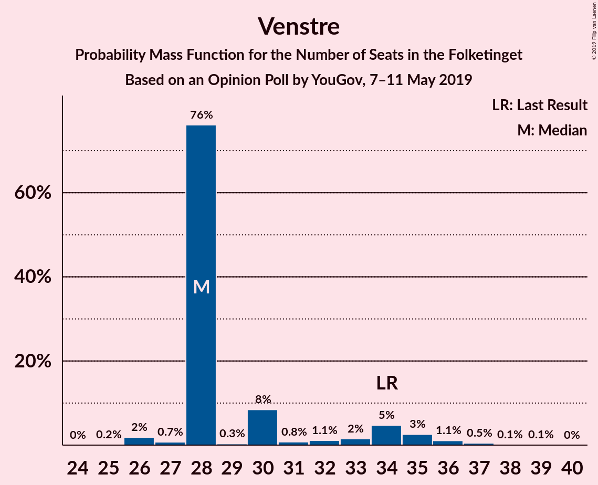

| Number of Seats | Probability | Accumulated | Special Marks |
|:---------------:|:-----------:|:-----------:|:-------------:|
| 25 | 0.2% | 100% |  |
| 26 | 2% | 99.8% |  |
| 27 | 0.7% | 98% |  |
| 28 | 76% | 97% | Median |
| 29 | 0.3% | 21% |  |
| 30 | 8% | 21% |  |
| 31 | 0.8% | 12% |  |
| 32 | 1.1% | 12% |  |
| 33 | 2% | 10% |  |
| 34 | 5% | 9% | Last Result |
| 35 | 3% | 4% |  |
| 36 | 1.1% | 2% |  |
| 37 | 0.5% | 0.6% |  |
| 38 | 0.1% | 0.2% |  |
| 39 | 0.1% | 0.1% |  |
| 40 | 0% | 0% |  |

### Dansk Folkeparti

*For a full overview of the results for this party, see the [Dansk Folkeparti](party-danskfolkeparti.html) page.*

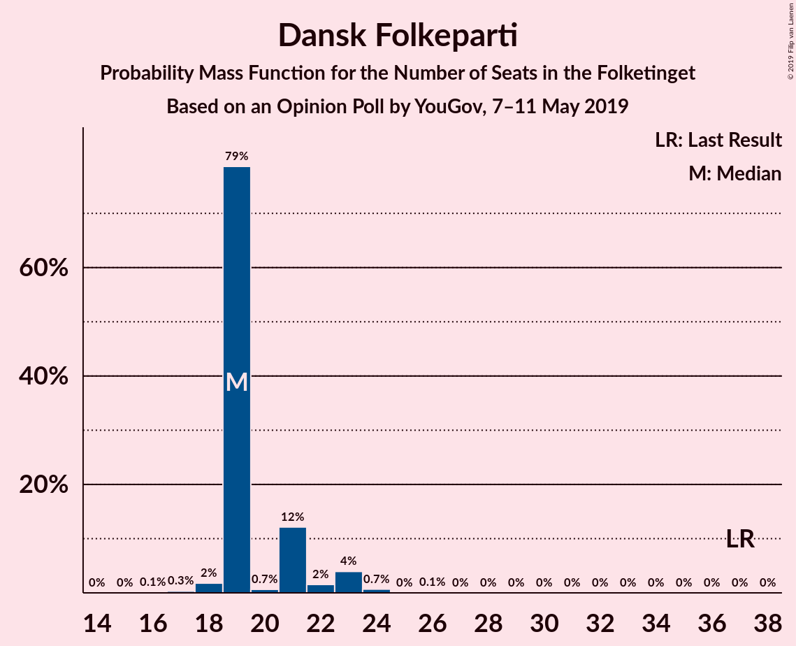

| Number of Seats | Probability | Accumulated | Special Marks |
|:---------------:|:-----------:|:-----------:|:-------------:|
| 16 | 0.1% | 100% |  |
| 17 | 0.3% | 99.9% |  |
| 18 | 2% | 99.6% |  |
| 19 | 79% | 98% | Median |
| 20 | 0.7% | 19% |  |
| 21 | 12% | 18% |  |
| 22 | 2% | 6% |  |
| 23 | 4% | 5% |  |
| 24 | 0.7% | 0.8% |  |
| 25 | 0% | 0.1% |  |
| 26 | 0.1% | 0.1% |  |
| 27 | 0% | 0% |  |
| 28 | 0% | 0% |  |
| 29 | 0% | 0% |  |
| 30 | 0% | 0% |  |
| 31 | 0% | 0% |  |
| 32 | 0% | 0% |  |
| 33 | 0% | 0% |  |
| 34 | 0% | 0% |  |
| 35 | 0% | 0% |  |
| 36 | 0% | 0% |  |
| 37 | 0% | 0% | Last Result |

### Enhedslisten–De Rød-Grønne

*For a full overview of the results for this party, see the [Enhedslisten–De Rød-Grønne](party-enhedslisten–derød-grønne.html) page.*

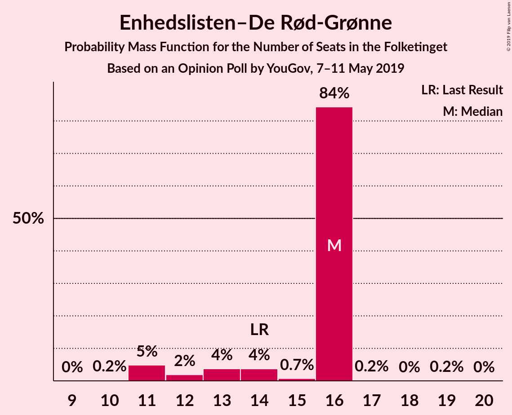

| Number of Seats | Probability | Accumulated | Special Marks |
|:---------------:|:-----------:|:-----------:|:-------------:|
| 10 | 0.2% | 100% |  |
| 11 | 5% | 99.8% |  |
| 12 | 2% | 95% |  |
| 13 | 4% | 93% |  |
| 14 | 4% | 89% | Last Result |
| 15 | 0.7% | 86% |  |
| 16 | 84% | 85% | Median |
| 17 | 0.2% | 0.5% |  |
| 18 | 0% | 0.3% |  |
| 19 | 0.2% | 0.2% |  |
| 20 | 0% | 0% |  |

### Socialistisk Folkeparti

*For a full overview of the results for this party, see the [Socialistisk Folkeparti](party-socialistiskfolkeparti.html) page.*

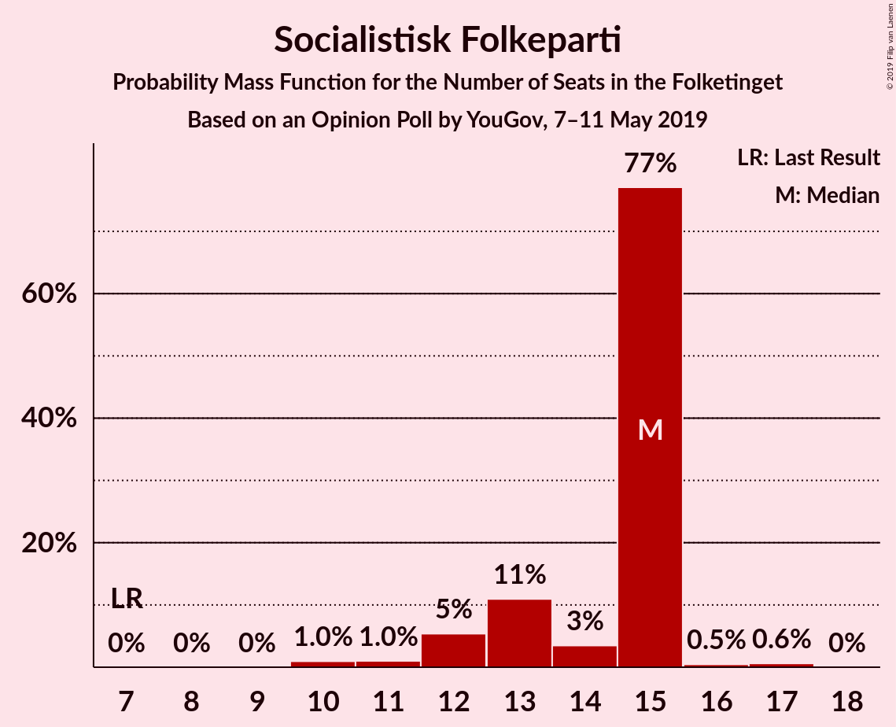

| Number of Seats | Probability | Accumulated | Special Marks |
|:---------------:|:-----------:|:-----------:|:-------------:|
| 7 | 0% | 100% | Last Result |
| 8 | 0% | 100% |  |
| 9 | 0% | 100% |  |
| 10 | 1.0% | 100% |  |
| 11 | 1.0% | 99.0% |  |
| 12 | 5% | 98% |  |
| 13 | 11% | 93% |  |
| 14 | 3% | 82% |  |
| 15 | 77% | 78% | Median |
| 16 | 0.5% | 1.1% |  |
| 17 | 0.6% | 0.6% |  |
| 18 | 0% | 0% |  |

### Radikale Venstre

*For a full overview of the results for this party, see the [Radikale Venstre](party-radikalevenstre.html) page.*

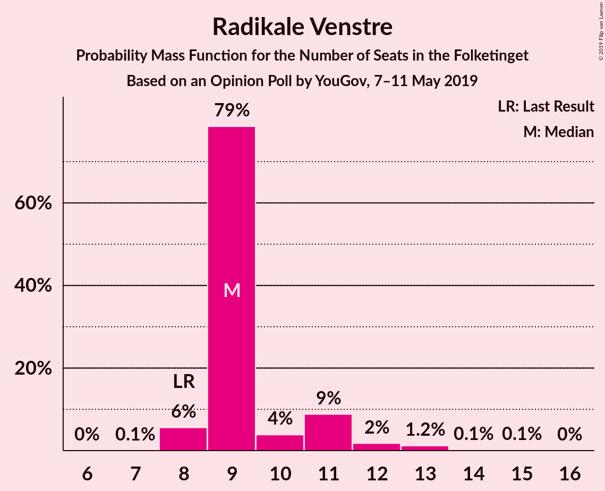

| Number of Seats | Probability | Accumulated | Special Marks |
|:---------------:|:-----------:|:-----------:|:-------------:|
| 7 | 0.1% | 100% |  |
| 8 | 6% | 99.9% | Last Result |
| 9 | 79% | 94% | Median |
| 10 | 4% | 16% |  |
| 11 | 9% | 12% |  |
| 12 | 2% | 3% |  |
| 13 | 1.2% | 1.4% |  |
| 14 | 0.1% | 0.2% |  |
| 15 | 0.1% | 0.1% |  |
| 16 | 0% | 0% |  |

### Det Konservative Folkeparti

*For a full overview of the results for this party, see the [Det Konservative Folkeparti](party-detkonservativefolkeparti.html) page.*

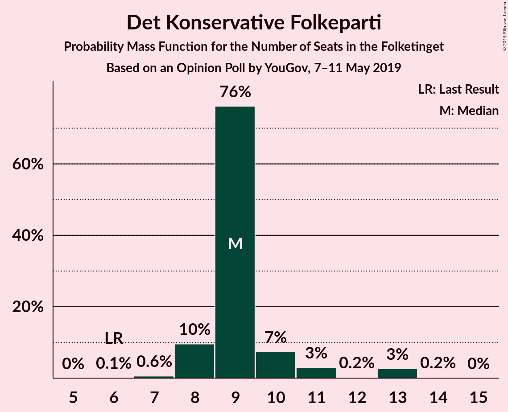

| Number of Seats | Probability | Accumulated | Special Marks |
|:---------------:|:-----------:|:-----------:|:-------------:|
| 6 | 0.1% | 100% | Last Result |
| 7 | 0.6% | 99.9% |  |
| 8 | 10% | 99.3% |  |
| 9 | 76% | 90% | Median |
| 10 | 7% | 14% |  |
| 11 | 3% | 6% |  |
| 12 | 0.2% | 3% |  |
| 13 | 3% | 3% |  |
| 14 | 0.2% | 0.2% |  |
| 15 | 0% | 0% |  |

### Alternativet

*For a full overview of the results for this party, see the [Alternativet](party-alternativet.html) page.*

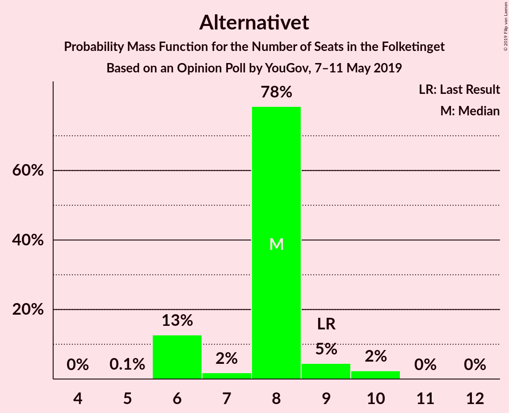

| Number of Seats | Probability | Accumulated | Special Marks |
|:---------------:|:-----------:|:-----------:|:-------------:|
| 5 | 0.1% | 100% |  |
| 6 | 13% | 99.9% |  |
| 7 | 2% | 87% |  |
| 8 | 78% | 85% | Median |
| 9 | 5% | 7% | Last Result |
| 10 | 2% | 2% |  |
| 11 | 0% | 0.1% |  |
| 12 | 0% | 0% |  |

### Nye Borgerlige

*For a full overview of the results for this party, see the [Nye Borgerlige](party-nyeborgerlige.html) page.*

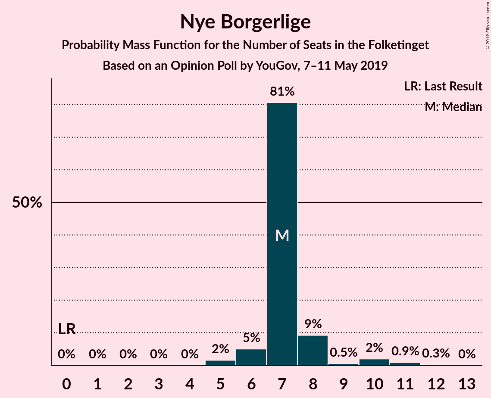

| Number of Seats | Probability | Accumulated | Special Marks |
|:---------------:|:-----------:|:-----------:|:-------------:|
| 0 | 0% | 100% | Last Result |
| 1 | 0% | 100% |  |
| 2 | 0% | 100% |  |
| 3 | 0% | 100% |  |
| 4 | 0% | 100% |  |
| 5 | 2% | 100% |  |
| 6 | 5% | 98% |  |
| 7 | 81% | 93% | Median |
| 8 | 9% | 13% |  |
| 9 | 0.5% | 4% |  |
| 10 | 2% | 3% |  |
| 11 | 0.9% | 1.1% |  |
| 12 | 0.3% | 0.3% |  |
| 13 | 0% | 0% |  |

### Stram Kurs

*For a full overview of the results for this party, see the [Stram Kurs](party-stramkurs.html) page.*

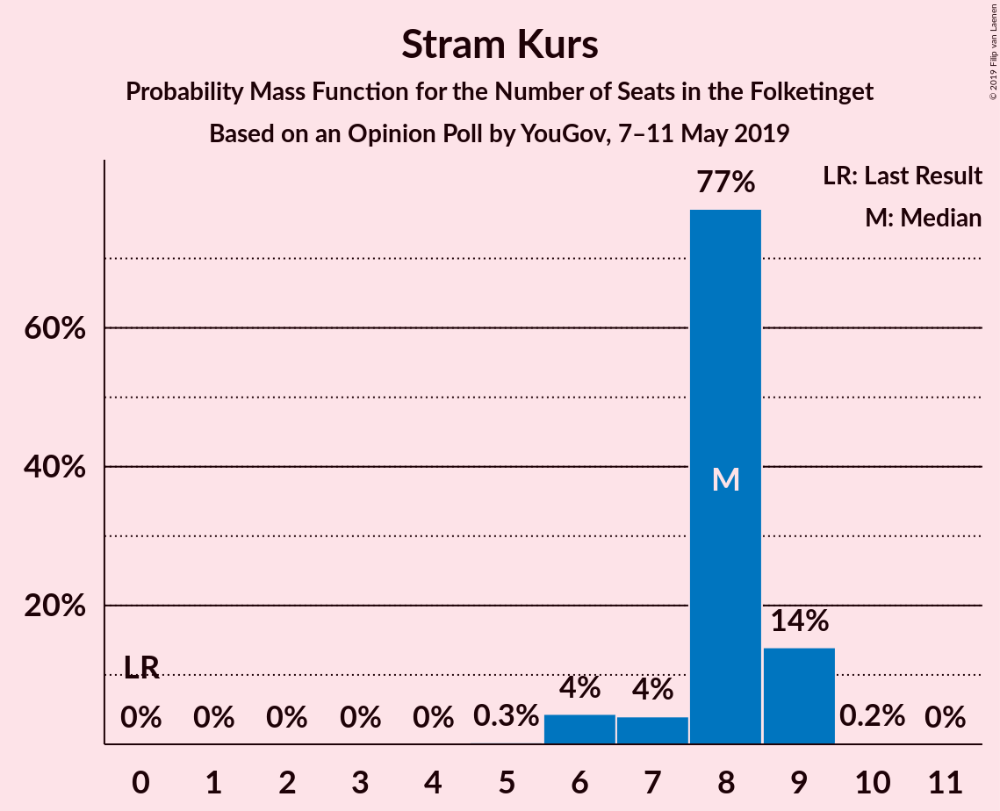

| Number of Seats | Probability | Accumulated | Special Marks |
|:---------------:|:-----------:|:-----------:|:-------------:|
| 0 | 0% | 100% | Last Result |
| 1 | 0% | 100% |  |
| 2 | 0% | 100% |  |
| 3 | 0% | 100% |  |
| 4 | 0% | 100% |  |
| 5 | 0.3% | 100% |  |
| 6 | 4% | 99.7% |  |
| 7 | 4% | 95% |  |
| 8 | 77% | 91% | Median |
| 9 | 14% | 14% |  |
| 10 | 0.2% | 0.2% |  |
| 11 | 0% | 0% |  |

### Liberal Alliance

*For a full overview of the results for this party, see the [Liberal Alliance](party-liberalalliance.html) page.*

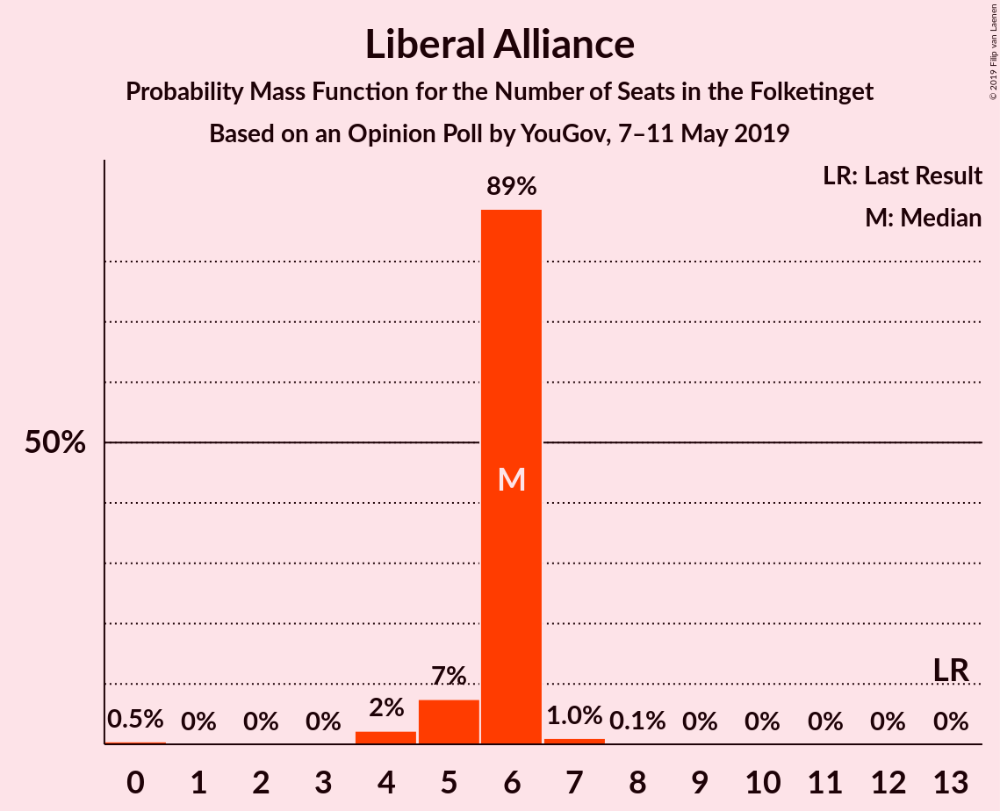

| Number of Seats | Probability | Accumulated | Special Marks |
|:---------------:|:-----------:|:-----------:|:-------------:|
| 0 | 0.5% | 100% |  |
| 1 | 0% | 99.5% |  |
| 2 | 0% | 99.5% |  |
| 3 | 0% | 99.5% |  |
| 4 | 2% | 99.5% |  |
| 5 | 7% | 97% |  |
| 6 | 89% | 90% | Median |
| 7 | 1.0% | 1.1% |  |
| 8 | 0.1% | 0.1% |  |
| 9 | 0% | 0% |  |
| 10 | 0% | 0% |  |
| 11 | 0% | 0% |  |
| 12 | 0% | 0% |  |
| 13 | 0% | 0% | Last Result |

### Kristendemokraterne

*For a full overview of the results for this party, see the [Kristendemokraterne](party-kristendemokraterne.html) page.*

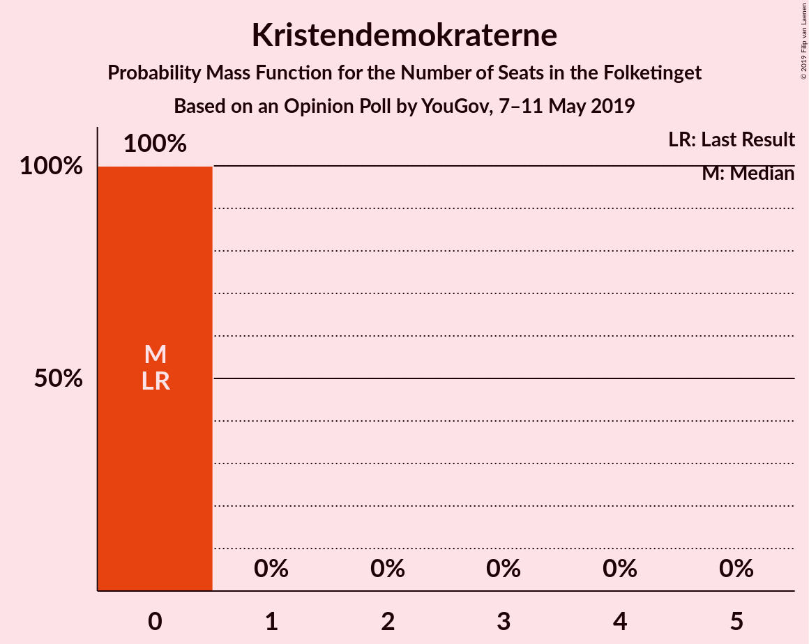

| Number of Seats | Probability | Accumulated | Special Marks |
|:---------------:|:-----------:|:-----------:|:-------------:|
| 0 | 100% | 100% | Last Result, Median |

### Klaus Riskær Pedersen

*For a full overview of the results for this party, see the [Klaus Riskær Pedersen](party-klausriskærpedersen.html) page.*

| Number of Seats | Probability | Accumulated | Special Marks |
|:---------------:|:-----------:|:-----------:|:-------------:|
| 0 | 100% | 100% | Last Result, Median |

## Coalitions

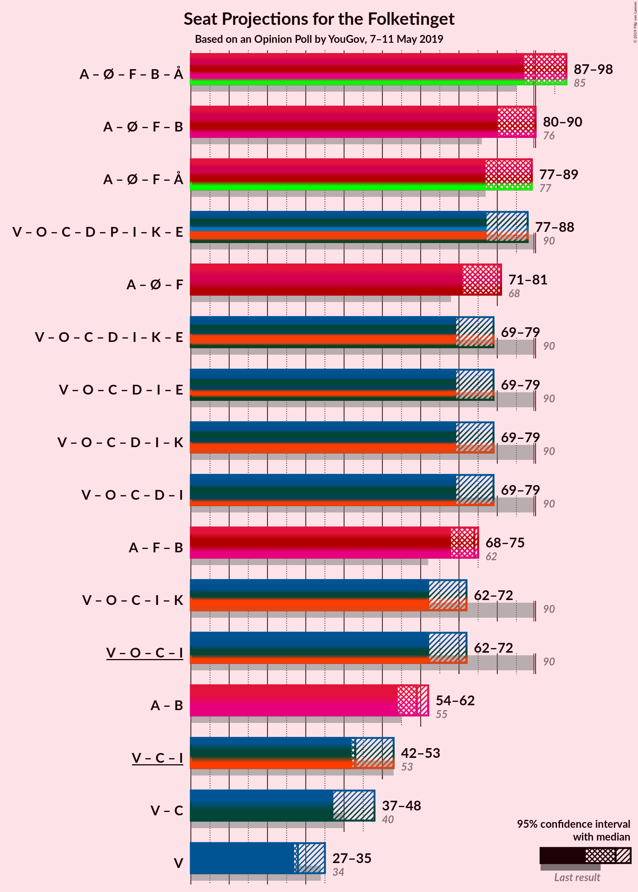

### Confidence Intervals

| Coalition | Last Result | Median | Majority? | 80% Confidence Interval | 90% Confidence Interval | 95% Confidence Interval | 99% Confidence Interval |
|:---------:|:-----------:|:------:|:---------:|:-----------------------:|:-----------------------:|:-----------------------:|:-----------------------:|
| Socialdemokraterne – Enhedslisten–De Rød-Grønne – Socialistisk Folkeparti – Radikale Venstre – Alternativet | 85 | 98 | 92% | 93–98 | 89–98 | 87–98 | 85–99 |
| Socialdemokraterne – Enhedslisten–De Rød-Grønne – Socialistisk Folkeparti – Radikale Venstre | 76 | 90 | 77% | 84–90 | 80–90 | 80–90 | 79–91 |
| Socialdemokraterne – Enhedslisten–De Rød-Grønne – Socialistisk Folkeparti – Alternativet | 77 | 89 | 0.5% | 81–89 | 80–89 | 77–89 | 76–89 |
| Venstre – Dansk Folkeparti – Det Konservative Folkeparti – Nye Borgerlige – Stram Kurs – Liberal Alliance – Kristendemokraterne – Klaus Riskær Pedersen | 90 | 77 | 0.9% | 77–82 | 77–86 | 77–88 | 76–90 |
| Socialdemokraterne – Enhedslisten–De Rød-Grønne – Socialistisk Folkeparti | 68 | 81 | 0% | 74–81 | 72–81 | 71–81 | 70–81 |
| Venstre – Dansk Folkeparti – Det Konservative Folkeparti – Nye Borgerlige – Liberal Alliance – Kristendemokraterne – Klaus Riskær Pedersen | 90 | 69 | 0% | 69–75 | 69–77 | 69–79 | 69–82 |
| Venstre – Dansk Folkeparti – Det Konservative Folkeparti – Nye Borgerlige – Liberal Alliance – Klaus Riskær Pedersen | 90 | 69 | 0% | 69–75 | 69–77 | 69–79 | 69–82 |
| Venstre – Dansk Folkeparti – Det Konservative Folkeparti – Nye Borgerlige – Liberal Alliance – Kristendemokraterne | 90 | 69 | 0% | 69–75 | 69–77 | 69–79 | 69–82 |
| Venstre – Dansk Folkeparti – Det Konservative Folkeparti – Nye Borgerlige – Liberal Alliance | 90 | 69 | 0% | 69–75 | 69–77 | 69–79 | 69–82 |
| Socialdemokraterne – Socialistisk Folkeparti – Radikale Venstre | 62 | 74 | 0% | 70–74 | 69–74 | 68–75 | 64–78 |
| Venstre – Dansk Folkeparti – Det Konservative Folkeparti – Liberal Alliance – Kristendemokraterne | 90 | 62 | 0% | 62–69 | 62–71 | 62–72 | 61–76 |
| Venstre – Dansk Folkeparti – Det Konservative Folkeparti – Liberal Alliance | 90 | 62 | 0% | 62–69 | 62–71 | 62–72 | 61–76 |
| Socialdemokraterne – Radikale Venstre | 55 | 59 | 0% | 57–59 | 56–59 | 54–62 | 54–64 |
| Venstre – Det Konservative Folkeparti – Liberal Alliance | 53 | 43 | 0% | 43–47 | 43–50 | 42–53 | 39–53 |
| Venstre – Det Konservative Folkeparti | 40 | 37 | 0% | 37–43 | 37–44 | 37–48 | 35–48 |
| Venstre | 34 | 28 | 0% | 28–33 | 28–34 | 27–35 | 26–37 |

### Socialdemokraterne – Enhedslisten–De Rød-Grønne – Socialistisk Folkeparti – Radikale Venstre – Alternativet

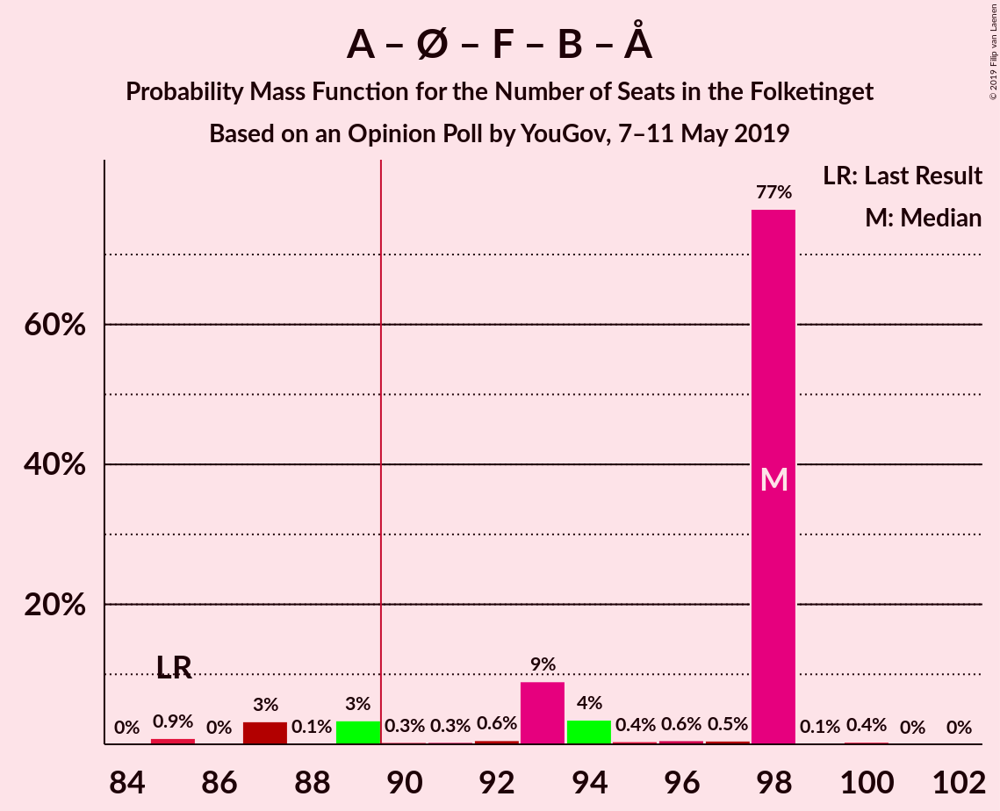

| Number of Seats | Probability | Accumulated | Special Marks |
|:---------------:|:-----------:|:-----------:|:-------------:|
| 85 | 0.9% | 100% | Last Result |
| 86 | 0% | 99.1% |  |
| 87 | 3% | 99.1% |  |
| 88 | 0.1% | 96% |  |
| 89 | 3% | 96% |  |
| 90 | 0.3% | 92% | Majority |
| 91 | 0.3% | 92% |  |
| 92 | 0.6% | 92% |  |
| 93 | 9% | 91% |  |
| 94 | 4% | 82% |  |
| 95 | 0.4% | 79% |  |
| 96 | 0.6% | 78% |  |
| 97 | 0.5% | 78% |  |
| 98 | 77% | 77% | Median |
| 99 | 0.1% | 0.5% |  |
| 100 | 0.4% | 0.4% |  |
| 101 | 0% | 0.1% |  |
| 102 | 0% | 0% |  |

### Socialdemokraterne – Enhedslisten–De Rød-Grønne – Socialistisk Folkeparti – Radikale Venstre

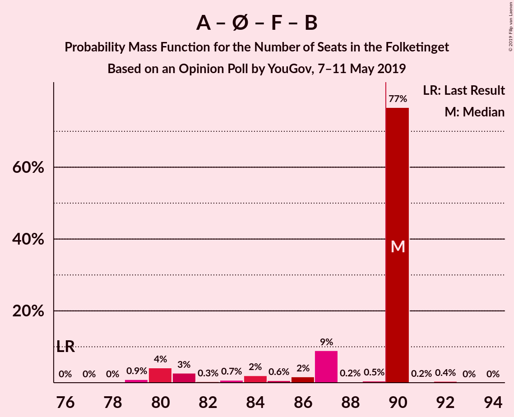

| Number of Seats | Probability | Accumulated | Special Marks |
|:---------------:|:-----------:|:-----------:|:-------------:|
| 76 | 0% | 100% | Last Result |
| 77 | 0% | 100% |  |
| 78 | 0% | 100% |  |
| 79 | 0.9% | 100% |  |
| 80 | 4% | 99.1% |  |
| 81 | 3% | 95% |  |
| 82 | 0.3% | 92% |  |
| 83 | 0.7% | 92% |  |
| 84 | 2% | 91% |  |
| 85 | 0.6% | 89% |  |
| 86 | 2% | 89% |  |
| 87 | 9% | 87% |  |
| 88 | 0.2% | 78% |  |
| 89 | 0.5% | 78% |  |
| 90 | 77% | 77% | Median, Majority |
| 91 | 0.2% | 0.7% |  |
| 92 | 0.4% | 0.5% |  |
| 93 | 0% | 0.1% |  |
| 94 | 0% | 0% |  |

### Socialdemokraterne – Enhedslisten–De Rød-Grønne – Socialistisk Folkeparti – Alternativet

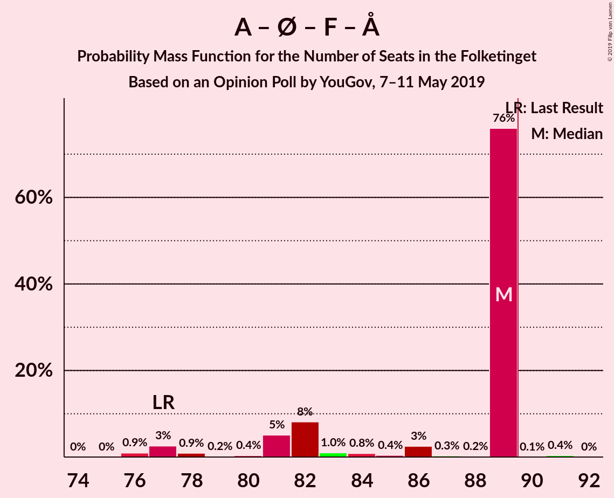

| Number of Seats | Probability | Accumulated | Special Marks |
|:---------------:|:-----------:|:-----------:|:-------------:|
| 76 | 0.9% | 100% |  |
| 77 | 3% | 99.0% | Last Result |
| 78 | 0.9% | 96% |  |
| 79 | 0.2% | 96% |  |
| 80 | 0.4% | 95% |  |
| 81 | 5% | 95% |  |
| 82 | 8% | 90% |  |
| 83 | 1.0% | 82% |  |
| 84 | 0.8% | 81% |  |
| 85 | 0.4% | 80% |  |
| 86 | 3% | 79% |  |
| 87 | 0.3% | 77% |  |
| 88 | 0.2% | 77% |  |
| 89 | 76% | 76% | Median |
| 90 | 0.1% | 0.5% | Majority |
| 91 | 0.4% | 0.4% |  |
| 92 | 0% | 0% |  |

### Venstre – Dansk Folkeparti – Det Konservative Folkeparti – Nye Borgerlige – Stram Kurs – Liberal Alliance – Kristendemokraterne – Klaus Riskær Pedersen

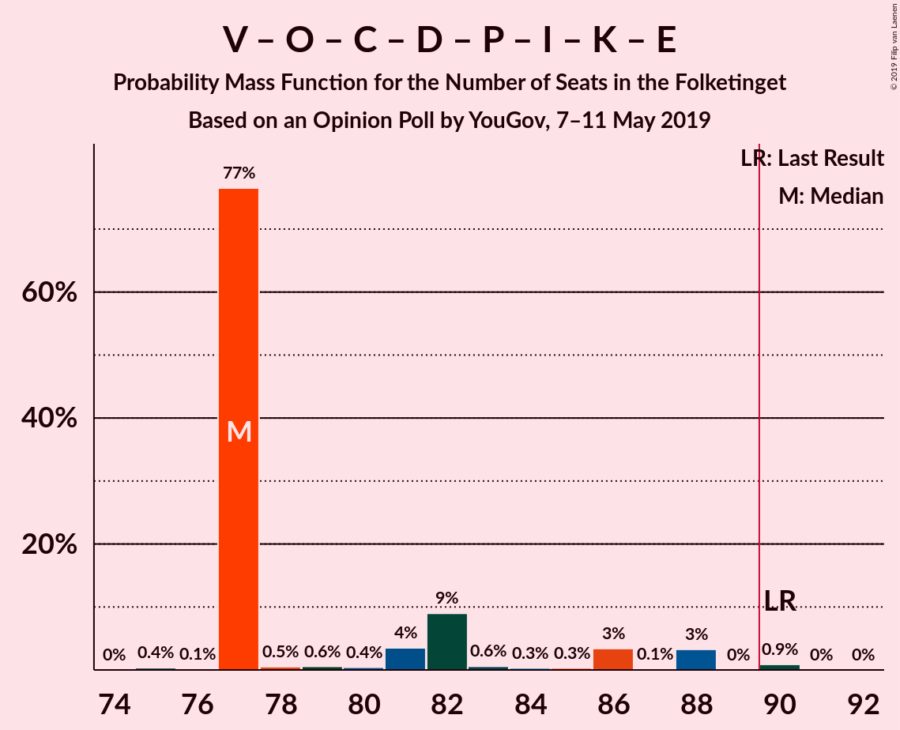

| Number of Seats | Probability | Accumulated | Special Marks |
|:---------------:|:-----------:|:-----------:|:-------------:|
| 74 | 0% | 100% |  |
| 75 | 0.4% | 99.9% |  |
| 76 | 0.1% | 99.6% |  |
| 77 | 77% | 99.5% | Median |
| 78 | 0.5% | 23% |  |
| 79 | 0.6% | 22% |  |
| 80 | 0.4% | 22% |  |
| 81 | 4% | 21% |  |
| 82 | 9% | 18% |  |
| 83 | 0.6% | 9% |  |
| 84 | 0.3% | 8% |  |
| 85 | 0.3% | 8% |  |
| 86 | 3% | 8% |  |
| 87 | 0.1% | 4% |  |
| 88 | 3% | 4% |  |
| 89 | 0% | 0.9% |  |
| 90 | 0.9% | 0.9% | Last Result, Majority |
| 91 | 0% | 0% |  |

### Socialdemokraterne – Enhedslisten–De Rød-Grønne – Socialistisk Folkeparti

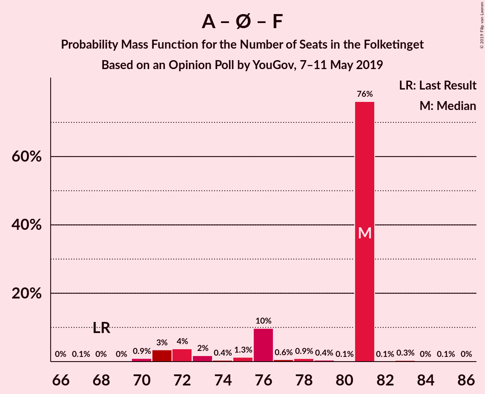

| Number of Seats | Probability | Accumulated | Special Marks |
|:---------------:|:-----------:|:-----------:|:-------------:|
| 67 | 0.1% | 100% |  |
| 68 | 0% | 99.9% | Last Result |
| 69 | 0% | 99.9% |  |
| 70 | 0.9% | 99.9% |  |
| 71 | 3% | 99.0% |  |
| 72 | 4% | 96% |  |
| 73 | 2% | 92% |  |
| 74 | 0.4% | 90% |  |
| 75 | 1.3% | 90% |  |
| 76 | 10% | 88% |  |
| 77 | 0.6% | 79% |  |
| 78 | 0.9% | 78% |  |
| 79 | 0.4% | 77% |  |
| 80 | 0.1% | 77% |  |
| 81 | 76% | 77% | Median |
| 82 | 0.1% | 0.5% |  |
| 83 | 0.3% | 0.4% |  |
| 84 | 0% | 0.1% |  |
| 85 | 0.1% | 0.1% |  |
| 86 | 0% | 0% |  |

### Venstre – Dansk Folkeparti – Det Konservative Folkeparti – Nye Borgerlige – Liberal Alliance – Kristendemokraterne – Klaus Riskær Pedersen

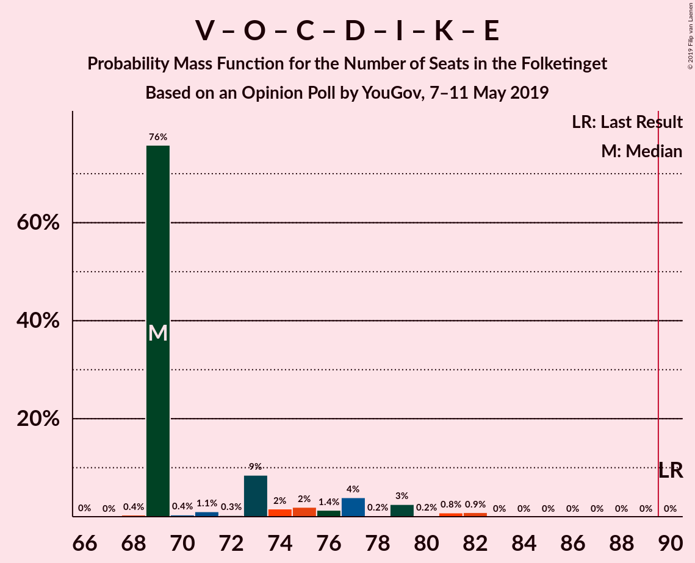

| Number of Seats | Probability | Accumulated | Special Marks |
|:---------------:|:-----------:|:-----------:|:-------------:|
| 67 | 0% | 100% |  |
| 68 | 0.4% | 99.9% |  |
| 69 | 76% | 99.6% | Median |
| 70 | 0.4% | 24% |  |
| 71 | 1.1% | 23% |  |
| 72 | 0.3% | 22% |  |
| 73 | 9% | 22% |  |
| 74 | 2% | 13% |  |
| 75 | 2% | 12% |  |
| 76 | 1.4% | 10% |  |
| 77 | 4% | 9% |  |
| 78 | 0.2% | 5% |  |
| 79 | 3% | 4% |  |
| 80 | 0.2% | 2% |  |
| 81 | 0.8% | 2% |  |
| 82 | 0.9% | 0.9% |  |
| 83 | 0% | 0% |  |
| 84 | 0% | 0% |  |
| 85 | 0% | 0% |  |
| 86 | 0% | 0% |  |
| 87 | 0% | 0% |  |
| 88 | 0% | 0% |  |
| 89 | 0% | 0% |  |
| 90 | 0% | 0% | Last Result, Majority |

### Venstre – Dansk Folkeparti – Det Konservative Folkeparti – Nye Borgerlige – Liberal Alliance – Klaus Riskær Pedersen

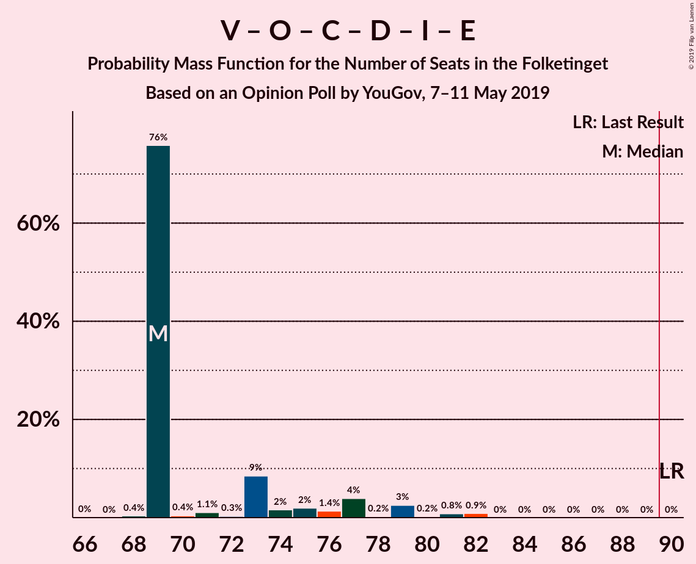

| Number of Seats | Probability | Accumulated | Special Marks |
|:---------------:|:-----------:|:-----------:|:-------------:|
| 67 | 0% | 100% |  |
| 68 | 0.4% | 99.9% |  |
| 69 | 76% | 99.6% | Median |
| 70 | 0.4% | 24% |  |
| 71 | 1.1% | 23% |  |
| 72 | 0.3% | 22% |  |
| 73 | 9% | 22% |  |
| 74 | 2% | 13% |  |
| 75 | 2% | 12% |  |
| 76 | 1.4% | 10% |  |
| 77 | 4% | 9% |  |
| 78 | 0.2% | 5% |  |
| 79 | 3% | 4% |  |
| 80 | 0.2% | 2% |  |
| 81 | 0.8% | 2% |  |
| 82 | 0.9% | 0.9% |  |
| 83 | 0% | 0% |  |
| 84 | 0% | 0% |  |
| 85 | 0% | 0% |  |
| 86 | 0% | 0% |  |
| 87 | 0% | 0% |  |
| 88 | 0% | 0% |  |
| 89 | 0% | 0% |  |
| 90 | 0% | 0% | Last Result, Majority |

### Venstre – Dansk Folkeparti – Det Konservative Folkeparti – Nye Borgerlige – Liberal Alliance – Kristendemokraterne

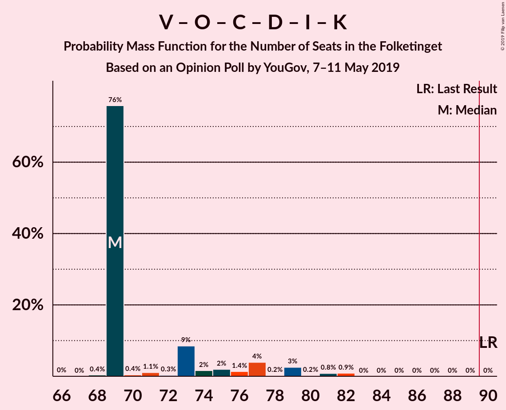

| Number of Seats | Probability | Accumulated | Special Marks |
|:---------------:|:-----------:|:-----------:|:-------------:|
| 67 | 0% | 100% |  |
| 68 | 0.4% | 99.9% |  |
| 69 | 76% | 99.6% | Median |
| 70 | 0.4% | 24% |  |
| 71 | 1.1% | 23% |  |
| 72 | 0.3% | 22% |  |
| 73 | 9% | 22% |  |
| 74 | 2% | 13% |  |
| 75 | 2% | 12% |  |
| 76 | 1.4% | 10% |  |
| 77 | 4% | 9% |  |
| 78 | 0.2% | 5% |  |
| 79 | 3% | 4% |  |
| 80 | 0.2% | 2% |  |
| 81 | 0.8% | 2% |  |
| 82 | 0.9% | 0.9% |  |
| 83 | 0% | 0% |  |
| 84 | 0% | 0% |  |
| 85 | 0% | 0% |  |
| 86 | 0% | 0% |  |
| 87 | 0% | 0% |  |
| 88 | 0% | 0% |  |
| 89 | 0% | 0% |  |
| 90 | 0% | 0% | Last Result, Majority |

### Venstre – Dansk Folkeparti – Det Konservative Folkeparti – Nye Borgerlige – Liberal Alliance

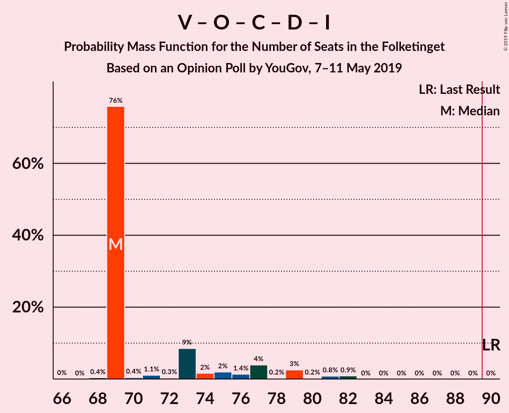

| Number of Seats | Probability | Accumulated | Special Marks |
|:---------------:|:-----------:|:-----------:|:-------------:|
| 67 | 0% | 100% |  |
| 68 | 0.4% | 99.9% |  |
| 69 | 76% | 99.6% | Median |
| 70 | 0.4% | 24% |  |
| 71 | 1.1% | 23% |  |
| 72 | 0.3% | 22% |  |
| 73 | 9% | 22% |  |
| 74 | 2% | 13% |  |
| 75 | 2% | 12% |  |
| 76 | 1.4% | 10% |  |
| 77 | 4% | 9% |  |
| 78 | 0.2% | 5% |  |
| 79 | 3% | 4% |  |
| 80 | 0.2% | 2% |  |
| 81 | 0.8% | 2% |  |
| 82 | 0.9% | 0.9% |  |
| 83 | 0% | 0% |  |
| 84 | 0% | 0% |  |
| 85 | 0% | 0% |  |
| 86 | 0% | 0% |  |
| 87 | 0% | 0% |  |
| 88 | 0% | 0% |  |
| 89 | 0% | 0% |  |
| 90 | 0% | 0% | Last Result, Majority |

### Socialdemokraterne – Socialistisk Folkeparti – Radikale Venstre

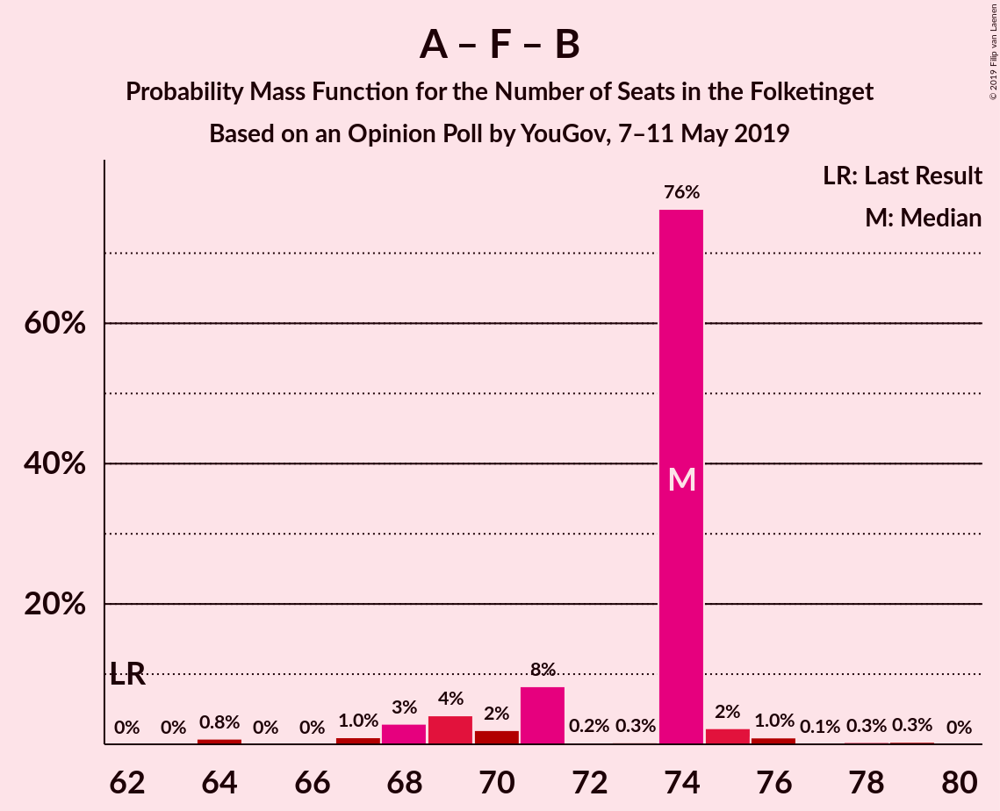

| Number of Seats | Probability | Accumulated | Special Marks |
|:---------------:|:-----------:|:-----------:|:-------------:|
| 62 | 0% | 100% | Last Result |
| 63 | 0% | 100% |  |
| 64 | 0.8% | 100% |  |
| 65 | 0% | 99.2% |  |
| 66 | 0% | 99.2% |  |
| 67 | 1.0% | 99.2% |  |
| 68 | 3% | 98% |  |
| 69 | 4% | 95% |  |
| 70 | 2% | 91% |  |
| 71 | 8% | 89% |  |
| 72 | 0.2% | 81% |  |
| 73 | 0.3% | 81% |  |
| 74 | 76% | 80% | Median |
| 75 | 2% | 4% |  |
| 76 | 1.0% | 2% |  |
| 77 | 0.1% | 0.8% |  |
| 78 | 0.3% | 0.7% |  |
| 79 | 0.3% | 0.4% |  |
| 80 | 0% | 0% |  |

### Venstre – Dansk Folkeparti – Det Konservative Folkeparti – Liberal Alliance – Kristendemokraterne

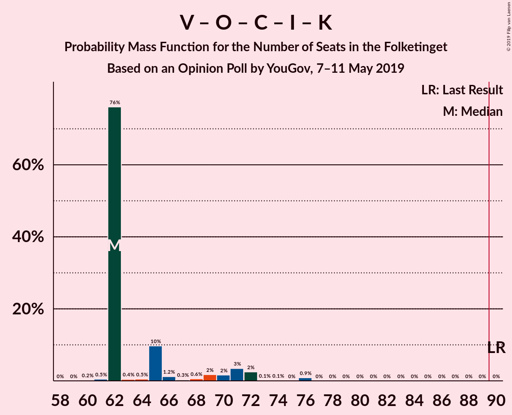

| Number of Seats | Probability | Accumulated | Special Marks |
|:---------------:|:-----------:|:-----------:|:-------------:|
| 60 | 0.2% | 100% |  |
| 61 | 0.5% | 99.7% |  |
| 62 | 76% | 99.2% | Median |
| 63 | 0.4% | 23% |  |
| 64 | 0.5% | 23% |  |
| 65 | 10% | 22% |  |
| 66 | 1.2% | 12% |  |
| 67 | 0.3% | 11% |  |
| 68 | 0.6% | 11% |  |
| 69 | 2% | 10% |  |
| 70 | 2% | 9% |  |
| 71 | 3% | 7% |  |
| 72 | 2% | 4% |  |
| 73 | 0.1% | 1.1% |  |
| 74 | 0.1% | 1.0% |  |
| 75 | 0% | 0.9% |  |
| 76 | 0.9% | 0.9% |  |
| 77 | 0% | 0% |  |
| 78 | 0% | 0% |  |
| 79 | 0% | 0% |  |
| 80 | 0% | 0% |  |
| 81 | 0% | 0% |  |
| 82 | 0% | 0% |  |
| 83 | 0% | 0% |  |
| 84 | 0% | 0% |  |
| 85 | 0% | 0% |  |
| 86 | 0% | 0% |  |
| 87 | 0% | 0% |  |
| 88 | 0% | 0% |  |
| 89 | 0% | 0% |  |
| 90 | 0% | 0% | Last Result, Majority |

### Venstre – Dansk Folkeparti – Det Konservative Folkeparti – Liberal Alliance

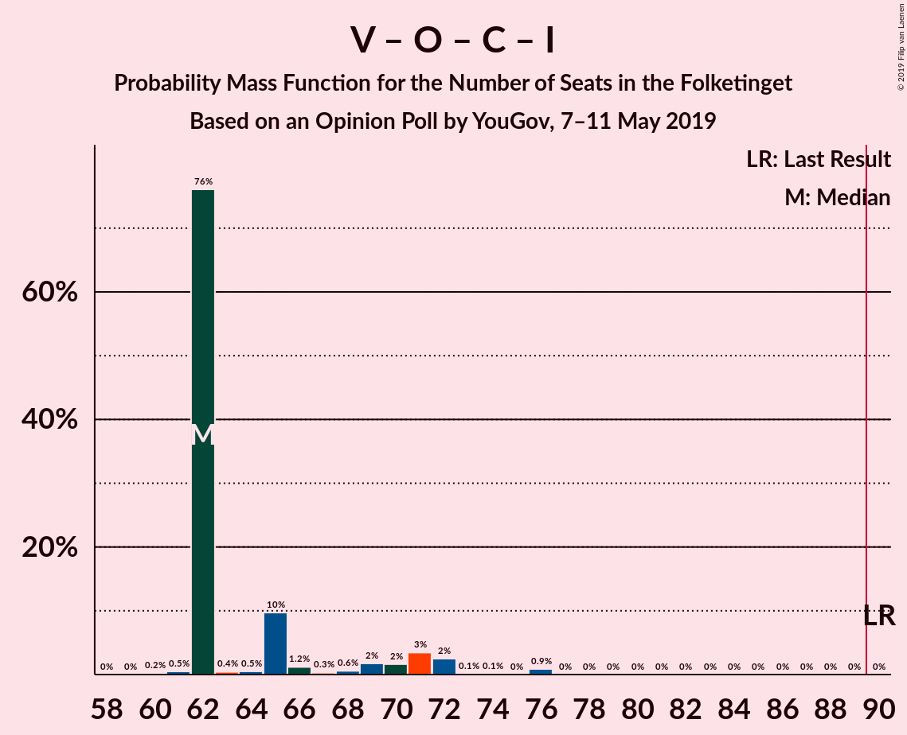

| Number of Seats | Probability | Accumulated | Special Marks |
|:---------------:|:-----------:|:-----------:|:-------------:|
| 60 | 0.2% | 100% |  |
| 61 | 0.5% | 99.7% |  |
| 62 | 76% | 99.2% | Median |
| 63 | 0.4% | 23% |  |
| 64 | 0.5% | 23% |  |
| 65 | 10% | 22% |  |
| 66 | 1.2% | 12% |  |
| 67 | 0.3% | 11% |  |
| 68 | 0.6% | 11% |  |
| 69 | 2% | 10% |  |
| 70 | 2% | 9% |  |
| 71 | 3% | 7% |  |
| 72 | 2% | 4% |  |
| 73 | 0.1% | 1.1% |  |
| 74 | 0.1% | 1.0% |  |
| 75 | 0% | 0.9% |  |
| 76 | 0.9% | 0.9% |  |
| 77 | 0% | 0% |  |
| 78 | 0% | 0% |  |
| 79 | 0% | 0% |  |
| 80 | 0% | 0% |  |
| 81 | 0% | 0% |  |
| 82 | 0% | 0% |  |
| 83 | 0% | 0% |  |
| 84 | 0% | 0% |  |
| 85 | 0% | 0% |  |
| 86 | 0% | 0% |  |
| 87 | 0% | 0% |  |
| 88 | 0% | 0% |  |
| 89 | 0% | 0% |  |
| 90 | 0% | 0% | Last Result, Majority |

### Socialdemokraterne – Radikale Venstre

| Number of Seats | Probability | Accumulated | Special Marks |
|:---------------:|:-----------:|:-----------:|:-------------:|
| 53 | 0.2% | 100% |  |
| 54 | 4% | 99.7% |  |
| 55 | 0.2% | 95% | Last Result |
| 56 | 0.3% | 95% |  |
| 57 | 5% | 95% |  |
| 58 | 9% | 89% |  |
| 59 | 76% | 81% | Median |
| 60 | 0.3% | 4% |  |
| 61 | 1.1% | 4% |  |
| 62 | 1.0% | 3% |  |
| 63 | 1.5% | 2% |  |
| 64 | 0.4% | 0.6% |  |
| 65 | 0.1% | 0.1% |  |
| 66 | 0% | 0% |  |

### Venstre – Det Konservative Folkeparti – Liberal Alliance

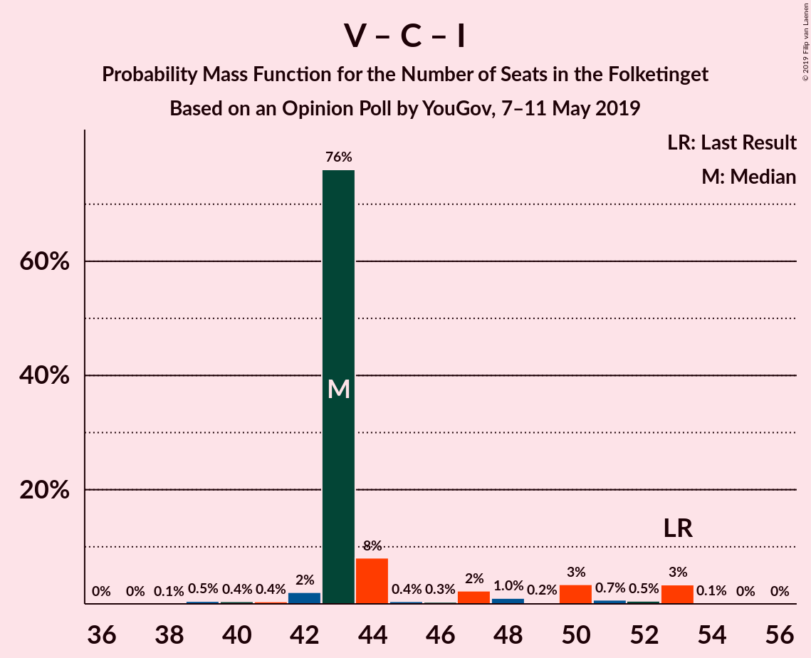

| Number of Seats | Probability | Accumulated | Special Marks |
|:---------------:|:-----------:|:-----------:|:-------------:|
| 38 | 0.1% | 100% |  |
| 39 | 0.5% | 99.9% |  |
| 40 | 0.4% | 99.5% |  |
| 41 | 0.4% | 99.0% |  |
| 42 | 2% | 98.6% |  |
| 43 | 76% | 97% | Median |
| 44 | 8% | 20% |  |
| 45 | 0.4% | 12% |  |
| 46 | 0.3% | 12% |  |
| 47 | 2% | 12% |  |
| 48 | 1.0% | 9% |  |
| 49 | 0.2% | 8% |  |
| 50 | 3% | 8% |  |
| 51 | 0.7% | 5% |  |
| 52 | 0.5% | 4% |  |
| 53 | 3% | 3% | Last Result |
| 54 | 0.1% | 0.1% |  |
| 55 | 0% | 0% |  |

### Venstre – Det Konservative Folkeparti

| Number of Seats | Probability | Accumulated | Special Marks |
|:---------------:|:-----------:|:-----------:|:-------------:|
| 34 | 0.4% | 100% |  |
| 35 | 0.4% | 99.6% |  |
| 36 | 0.3% | 99.2% |  |
| 37 | 78% | 98.9% | Median |
| 38 | 8% | 21% |  |
| 39 | 1.0% | 13% |  |
| 40 | 0.3% | 12% | Last Result |
| 41 | 0.5% | 12% |  |
| 42 | 1.1% | 11% |  |
| 43 | 1.2% | 10% |  |
| 44 | 5% | 9% |  |
| 45 | 0.2% | 4% |  |
| 46 | 0.1% | 4% |  |
| 47 | 1.4% | 4% |  |
| 48 | 2% | 3% |  |
| 49 | 0.1% | 0.1% |  |
| 50 | 0% | 0% |  |

### Venstre

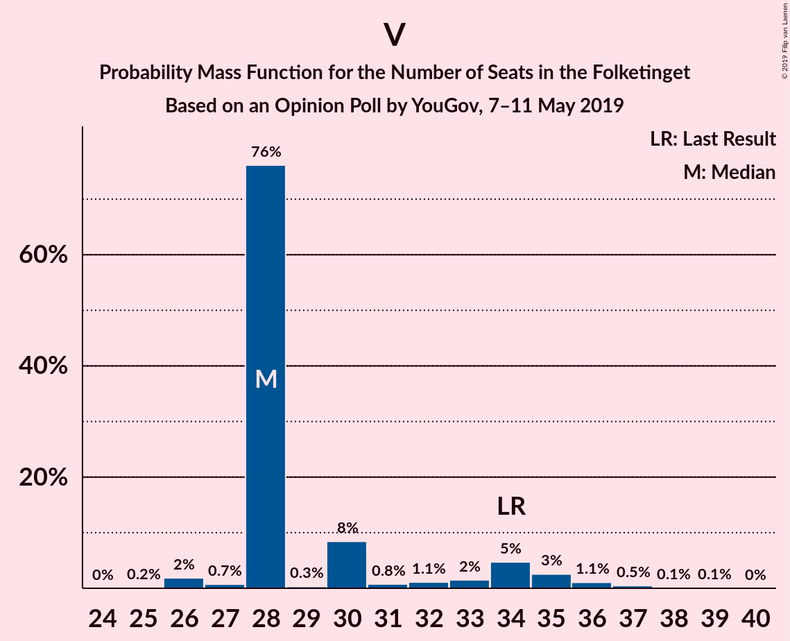

| Number of Seats | Probability | Accumulated | Special Marks |
|:---------------:|:-----------:|:-----------:|:-------------:|
| 25 | 0.2% | 100% |  |
| 26 | 2% | 99.8% |  |
| 27 | 0.7% | 98% |  |
| 28 | 76% | 97% | Median |
| 29 | 0.3% | 21% |  |
| 30 | 8% | 21% |  |
| 31 | 0.8% | 12% |  |
| 32 | 1.1% | 12% |  |
| 33 | 2% | 10% |  |
| 34 | 5% | 9% | Last Result |
| 35 | 3% | 4% |  |
| 36 | 1.1% | 2% |  |
| 37 | 0.5% | 0.6% |  |
| 38 | 0.1% | 0.2% |  |
| 39 | 0.1% | 0.1% |  |
| 40 | 0% | 0% |  |

## Technical Information

### Opinion Poll

+ **Polling firm:** YouGov
+ **Commissioner(s):** —
+ **Fieldwork period:** 7–11 May 2019

### Calculations

+ **Sample size:** 1041
+ **Simulations done:** 1,048,576
+ **Error estimate:** 1.84%

