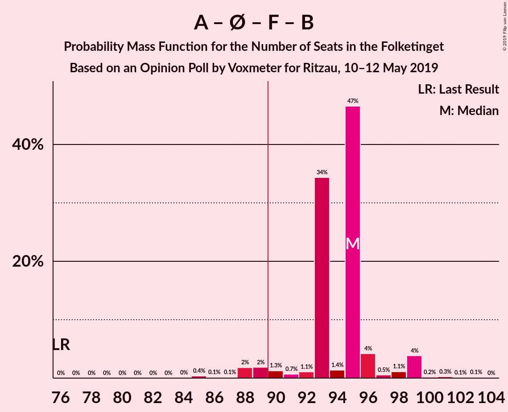

# Opinion Poll by Voxmeter for Ritzau, 10–12 May 2019

<a href="#voting-intentions">Voting Intentions</a> | <a href="#seats">Seats</a> | <a href="#coalitions">Coalitions</a> | <a href="#technical-information">Technical Information</a>

## Voting Intentions

### Confidence Intervals

| Party | Last Result | Poll Result | 80% Confidence Interval | 90% Confidence Interval | 95% Confidence Interval | 99% Confidence Interval |
|:-----:|:-----------:|:-----------:|:-----------------------:|:-----------------------:|:-----------------------:|:-----------------------:|
| Socialdemokraterne | 26.3% | 28.5% | 26.7–30.4% |26.2–30.9% |25.8–31.4% |24.9–32.3% |
| Venstre | 19.5% | 18.6% | 17.1–20.3% |16.7–20.7% |16.3–21.2% |15.6–22.0% |
| Dansk Folkeparti | 21.1% | 11.6% | 10.3–13.0% |10.0–13.3% |9.7–13.7% |9.2–14.4% |
| Enhedslisten–De Rød-Grønne | 7.8% | 9.9% | 8.7–11.2% |8.4–11.5% |8.2–11.9% |7.7–12.5% |
| Socialistisk Folkeparti | 4.2% | 7.0% | 6.0–8.1% |5.8–8.4% |5.5–8.7% |5.1–9.3% |
| Radikale Venstre | 4.6% | 6.8% | 5.9–7.9% |5.6–8.2% |5.4–8.5% |5.0–9.1% |
| Det Konservative Folkeparti | 3.4% | 5.2% | 4.4–6.2% |4.2–6.5% |4.0–6.7% |3.6–7.3% |
| Liberal Alliance | 7.5% | 3.3% | 2.7–4.1% |2.5–4.4% |2.3–4.6% |2.1–5.0% |
| Alternativet | 4.8% | 3.3% | 2.7–4.1% |2.5–4.4% |2.3–4.6% |2.1–5.0% |
| Stram Kurs | 0.0% | 2.4% | 1.9–3.1% |1.7–3.4% |1.6–3.5% |1.4–3.9% |
| Nye Borgerlige | 0.0% | 1.7% | 1.3–2.3% |1.2–2.5% |1.1–2.7% |0.9–3.0% |
| Kristendemokraterne | 0.8% | 1.3% | 0.9–1.9% |0.8–2.1% |0.8–2.2% |0.6–2.5% |
| Klaus Riskær Pedersen | 0.0% | 0.2% | 0.1–0.5% |0.1–0.6% |0.1–0.7% |0.0–0.9% |

*Note:* The poll result column reflects the actual value used in the calculations. Published results may vary slightly, and in addition be rounded to fewer digits.

## Seats

### Confidence Intervals

| Party | Last Result | Median | 80% Confidence Interval | 90% Confidence Interval | 95% Confidence Interval | 99% Confidence Interval |
|:-----:|:-----------:|:------:|:-----------------------:|:-----------------------:|:-----------------------:|:-----------------------:|
| <a href="#socialdemokraterne">Socialdemokraterne</a> | 47 | 51 | 48–52 |48–55 |47–57 |44–57 |
| <a href="#venstre">Venstre</a> | 34 | 33 | 31–35 |28–37 |28–39 |28–39 |
| <a href="#dansk-folkeparti">Dansk Folkeparti</a> | 37 | 21 | 20–22 |18–25 |17–25 |17–25 |
| <a href="#enhedslisten–de-rød-grønne">Enhedslisten–De Rød-Grønne</a> | 14 | 19 | 17–19 |16–20 |15–20 |14–22 |
| <a href="#socialistisk-folkeparti">Socialistisk Folkeparti</a> | 7 | 12 | 11–14 |11–14 |10–15 |9–16 |
| <a href="#radikale-venstre">Radikale Venstre</a> | 8 | 13 | 12–13 |11–14 |10–14 |9–17 |
| <a href="#det-konservative-folkeparti">Det Konservative Folkeparti</a> | 6 | 9 | 8–10 |8–11 |7–11 |7–12 |
| <a href="#liberal-alliance">Liberal Alliance</a> | 13 | 5 | 4–6 |4–8 |4–9 |0–9 |
| <a href="#alternativet">Alternativet</a> | 9 | 6 | 6–8 |5–8 |5–8 |4–9 |
| <a href="#stram-kurs">Stram Kurs</a> | 0 | 5 | 4–5 |0–5 |0–6 |0–7 |
| <a href="#nye-borgerlige">Nye Borgerlige</a> | 0 | 0 | 0–3 |0–4 |0–4 |0–5 |
| <a href="#kristendemokraterne">Kristendemokraterne</a> | 0 | 0 | 0 |0 |0–4 |0–4 |
| <a href="#klaus-riskær-pedersen">Klaus Riskær Pedersen</a> | 0 | 0 | 0 |0 |0 |0 |

### Socialdemokraterne

*For a full overview of the results for this party, see the [Socialdemokraterne](party-socialdemokraterne.html) page.*

| Number of Seats | Probability | Accumulated | Special Marks |
|:---------------:|:-----------:|:-----------:|:-------------:|
| 42 | 0% | 100% |  |
| 43 | 0.3% | 99.9% |  |
| 44 | 0.4% | 99.7% |  |
| 45 | 0.5% | 99.2% |  |
| 46 | 0.4% | 98.7% |  |
| 47 | 0.9% | 98% | Last Result |
| 48 | 33% | 97% |  |
| 49 | 3% | 65% |  |
| 50 | 7% | 62% |  |
| 51 | 39% | 55% | Median |
| 52 | 6% | 15% |  |
| 53 | 3% | 10% |  |
| 54 | 0.9% | 7% |  |
| 55 | 2% | 6% |  |
| 56 | 0.3% | 4% |  |
| 57 | 3% | 3% |  |
| 58 | 0% | 0.2% |  |
| 59 | 0% | 0.1% |  |
| 60 | 0.1% | 0.1% |  |
| 61 | 0% | 0% |  |

### Venstre

*For a full overview of the results for this party, see the [Venstre](party-venstre.html) page.*

| Number of Seats | Probability | Accumulated | Special Marks |
|:---------------:|:-----------:|:-----------:|:-------------:|
| 26 | 0.1% | 100% |  |
| 27 | 0.3% | 99.9% |  |
| 28 | 5% | 99.6% |  |
| 29 | 1.3% | 95% |  |
| 30 | 0.5% | 93% |  |
| 31 | 4% | 93% |  |
| 32 | 35% | 89% |  |
| 33 | 5% | 55% | Median |
| 34 | 3% | 49% | Last Result |
| 35 | 39% | 46% |  |
| 36 | 2% | 7% |  |
| 37 | 1.4% | 5% |  |
| 38 | 0.3% | 4% |  |
| 39 | 3% | 4% |  |
| 40 | 0.1% | 0.2% |  |
| 41 | 0% | 0% |  |

### Dansk Folkeparti

*For a full overview of the results for this party, see the [Dansk Folkeparti](party-danskfolkeparti.html) page.*

| Number of Seats | Probability | Accumulated | Special Marks |
|:---------------:|:-----------:|:-----------:|:-------------:|
| 15 | 0.1% | 100% |  |
| 16 | 0.2% | 99.9% |  |
| 17 | 3% | 99.7% |  |
| 18 | 2% | 97% |  |
| 19 | 5% | 95% |  |
| 20 | 3% | 90% |  |
| 21 | 77% | 87% | Median |
| 22 | 3% | 11% |  |
| 23 | 1.2% | 7% |  |
| 24 | 1.0% | 6% |  |
| 25 | 5% | 5% |  |
| 26 | 0.1% | 0.3% |  |
| 27 | 0.2% | 0.2% |  |
| 28 | 0% | 0% |  |
| 29 | 0% | 0% |  |
| 30 | 0% | 0% |  |
| 31 | 0% | 0% |  |
| 32 | 0% | 0% |  |
| 33 | 0% | 0% |  |
| 34 | 0% | 0% |  |
| 35 | 0% | 0% |  |
| 36 | 0% | 0% |  |
| 37 | 0% | 0% | Last Result |

### Enhedslisten–De Rød-Grønne

*For a full overview of the results for this party, see the [Enhedslisten–De Rød-Grønne](party-enhedslisten–derød-grønne.html) page.*

| Number of Seats | Probability | Accumulated | Special Marks |
|:---------------:|:-----------:|:-----------:|:-------------:|
| 13 | 0.1% | 100% |  |
| 14 | 0.6% | 99.9% | Last Result |
| 15 | 3% | 99.2% |  |
| 16 | 2% | 96% |  |
| 17 | 6% | 94% |  |
| 18 | 35% | 88% |  |
| 19 | 46% | 53% | Median |
| 20 | 5% | 7% |  |
| 21 | 1.1% | 2% |  |
| 22 | 0.3% | 0.7% |  |
| 23 | 0.3% | 0.4% |  |
| 24 | 0.1% | 0.1% |  |
| 25 | 0% | 0% |  |

### Socialistisk Folkeparti

*For a full overview of the results for this party, see the [Socialistisk Folkeparti](party-socialistiskfolkeparti.html) page.*

| Number of Seats | Probability | Accumulated | Special Marks |
|:---------------:|:-----------:|:-----------:|:-------------:|
| 7 | 0% | 100% | Last Result |
| 8 | 0.1% | 100% |  |
| 9 | 1.5% | 99.9% |  |
| 10 | 1.3% | 98% |  |
| 11 | 10% | 97% |  |
| 12 | 39% | 87% | Median |
| 13 | 8% | 48% |  |
| 14 | 38% | 41% |  |
| 15 | 2% | 3% |  |
| 16 | 1.1% | 1.4% |  |
| 17 | 0.2% | 0.3% |  |
| 18 | 0.2% | 0.2% |  |
| 19 | 0% | 0% |  |

### Radikale Venstre

*For a full overview of the results for this party, see the [Radikale Venstre](party-radikalevenstre.html) page.*

| Number of Seats | Probability | Accumulated | Special Marks |
|:---------------:|:-----------:|:-----------:|:-------------:|
| 8 | 0% | 100% | Last Result |
| 9 | 2% | 100% |  |
| 10 | 1.5% | 98% |  |
| 11 | 5% | 97% |  |
| 12 | 12% | 91% |  |
| 13 | 70% | 79% | Median |
| 14 | 7% | 9% |  |
| 15 | 0.9% | 2% |  |
| 16 | 0.2% | 1.3% |  |
| 17 | 1.1% | 1.1% |  |
| 18 | 0% | 0% |  |

### Det Konservative Folkeparti

*For a full overview of the results for this party, see the [Det Konservative Folkeparti](party-detkonservativefolkeparti.html) page.*

| Number of Seats | Probability | Accumulated | Special Marks |
|:---------------:|:-----------:|:-----------:|:-------------:|
| 6 | 0.3% | 100% | Last Result |
| 7 | 4% | 99.7% |  |
| 8 | 8% | 95% |  |
| 9 | 45% | 87% | Median |
| 10 | 34% | 42% |  |
| 11 | 7% | 8% |  |
| 12 | 1.1% | 1.4% |  |
| 13 | 0.2% | 0.3% |  |
| 14 | 0% | 0% |  |

### Liberal Alliance

*For a full overview of the results for this party, see the [Liberal Alliance](party-liberalalliance.html) page.*

| Number of Seats | Probability | Accumulated | Special Marks |
|:---------------:|:-----------:|:-----------:|:-------------:|
| 0 | 0.8% | 100% |  |
| 1 | 0% | 99.2% |  |
| 2 | 0% | 99.2% |  |
| 3 | 0% | 99.2% |  |
| 4 | 42% | 99.2% |  |
| 5 | 10% | 57% | Median |
| 6 | 38% | 47% |  |
| 7 | 3% | 8% |  |
| 8 | 2% | 6% |  |
| 9 | 3% | 3% |  |
| 10 | 0.1% | 0.2% |  |
| 11 | 0% | 0% |  |
| 12 | 0% | 0% |  |
| 13 | 0% | 0% | Last Result |

### Alternativet

*For a full overview of the results for this party, see the [Alternativet](party-alternativet.html) page.*

| Number of Seats | Probability | Accumulated | Special Marks |
|:---------------:|:-----------:|:-----------:|:-------------:|
| 4 | 2% | 100% |  |
| 5 | 5% | 98% |  |
| 6 | 45% | 93% | Median |
| 7 | 12% | 49% |  |
| 8 | 36% | 37% |  |
| 9 | 0.7% | 0.8% | Last Result |
| 10 | 0.2% | 0.2% |  |
| 11 | 0% | 0% |  |

### Stram Kurs

*For a full overview of the results for this party, see the [Stram Kurs](party-stramkurs.html) page.*

| Number of Seats | Probability | Accumulated | Special Marks |
|:---------------:|:-----------:|:-----------:|:-------------:|
| 0 | 7% | 100% | Last Result |
| 1 | 0% | 93% |  |
| 2 | 0% | 93% |  |
| 3 | 0% | 93% |  |
| 4 | 14% | 93% |  |
| 5 | 76% | 79% | Median |
| 6 | 2% | 3% |  |
| 7 | 1.0% | 1.0% |  |
| 8 | 0% | 0.1% |  |
| 9 | 0% | 0% |  |

### Nye Borgerlige

*For a full overview of the results for this party, see the [Nye Borgerlige](party-nyeborgerlige.html) page.*

| Number of Seats | Probability | Accumulated | Special Marks |
|:---------------:|:-----------:|:-----------:|:-------------:|
| 0 | 88% | 100% | Last Result, Median |
| 1 | 0% | 12% |  |
| 2 | 0% | 12% |  |
| 3 | 2% | 12% |  |
| 4 | 8% | 10% |  |
| 5 | 2% | 2% |  |
| 6 | 0.3% | 0.3% |  |
| 7 | 0% | 0% |  |

### Kristendemokraterne

*For a full overview of the results for this party, see the [Kristendemokraterne](party-kristendemokraterne.html) page.*

| Number of Seats | Probability | Accumulated | Special Marks |
|:---------------:|:-----------:|:-----------:|:-------------:|
| 0 | 97% | 100% | Last Result, Median |
| 1 | 0% | 3% |  |
| 2 | 0% | 3% |  |
| 3 | 0% | 3% |  |
| 4 | 2% | 3% |  |
| 5 | 0.5% | 0.5% |  |
| 6 | 0% | 0% |  |

### Klaus Riskær Pedersen

*For a full overview of the results for this party, see the [Klaus Riskær Pedersen](party-klausriskærpedersen.html) page.*

| Number of Seats | Probability | Accumulated | Special Marks |
|:---------------:|:-----------:|:-----------:|:-------------:|
| 0 | 100% | 100% | Last Result, Median |

## Coalitions

### Confidence Intervals

| Coalition | Last Result | Median | Majority? | 80% Confidence Interval | 90% Confidence Interval | 95% Confidence Interval | 99% Confidence Interval |
|:---------:|:-----------:|:------:|:---------:|:-----------------------:|:-----------------------:|:-----------------------:|:-----------------------:|
| Socialdemokraterne – Enhedslisten–De Rød-Grønne – Socialistisk Folkeparti – Radikale Venstre – Alternativet | 85 | 101 | 100% | 100–103 | 96–104 | 94–105 | 92–106 |
| Socialdemokraterne – Enhedslisten–De Rød-Grønne – Socialistisk Folkeparti – Radikale Venstre | 76 | 95 | 96% | 93–96 | 90–98 | 89–99 | 86–100 |
| Socialdemokraterne – Enhedslisten–De Rød-Grønne – Socialistisk Folkeparti – Alternativet | 77 | 88 | 16% | 88–90 | 84–92 | 83–94 | 80–94 |
| Socialdemokraterne – Enhedslisten–De Rød-Grønne – Socialistisk Folkeparti | 68 | 82 | 0.2% | 80–83 | 79–85 | 77–88 | 74–88 |
| Socialdemokraterne – Socialistisk Folkeparti – Radikale Venstre | 62 | 76 | 0% | 75–77 | 73–80 | 71–82 | 69–82 |
| Venstre – Dansk Folkeparti – Det Konservative Folkeparti – Liberal Alliance – Stram Kurs – Nye Borgerlige – Kristendemokraterne – Klaus Riskær Pedersen | 90 | 74 | 0% | 72–75 | 71–79 | 70–81 | 69–83 |
| Venstre – Dansk Folkeparti – Det Konservative Folkeparti – Liberal Alliance – Nye Borgerlige – Kristendemokraterne – Klaus Riskær Pedersen | 90 | 69 | 0% | 69–71 | 67–74 | 66–76 | 65–80 |
| Venstre – Dansk Folkeparti – Det Konservative Folkeparti – Liberal Alliance – Nye Borgerlige – Klaus Riskær Pedersen | 90 | 69 | 0% | 69–71 | 67–73 | 66–76 | 65–80 |
| Venstre – Dansk Folkeparti – Det Konservative Folkeparti – Liberal Alliance – Nye Borgerlige – Kristendemokraterne | 90 | 69 | 0% | 69–71 | 67–74 | 66–76 | 65–80 |
| Venstre – Dansk Folkeparti – Det Konservative Folkeparti – Liberal Alliance – Nye Borgerlige | 90 | 69 | 0% | 69–71 | 67–73 | 66–76 | 65–80 |
| Venstre – Dansk Folkeparti – Det Konservative Folkeparti – Liberal Alliance – Kristendemokraterne | 90 | 69 | 0% | 67–71 | 65–73 | 62–74 | 62–78 |
| Venstre – Dansk Folkeparti – Det Konservative Folkeparti – Liberal Alliance | 90 | 69 | 0% | 67–71 | 65–72 | 62–73 | 62–77 |
| Socialdemokraterne – Radikale Venstre | 55 | 64 | 0% | 61–65 | 61–66 | 59–68 | 55–69 |
| Venstre – Det Konservative Folkeparti – Liberal Alliance | 53 | 48 | 0% | 45–50 | 44–51 | 44–52 | 44–56 |
| Venstre – Det Konservative Folkeparti | 40 | 43 | 0% | 39–44 | 39–46 | 39–46 | 38–49 |
| Venstre | 34 | 33 | 0% | 31–35 | 28–37 | 28–39 | 28–39 |

### Socialdemokraterne – Enhedslisten–De Rød-Grønne – Socialistisk Folkeparti – Radikale Venstre – Alternativet

| Number of Seats | Probability | Accumulated | Special Marks |
|:---------------:|:-----------:|:-----------:|:-------------:|
| 85 | 0% | 100% | Last Result |
| 86 | 0% | 100% |  |
| 87 | 0% | 100% |  |
| 88 | 0% | 100% |  |
| 89 | 0% | 100% |  |
| 90 | 0.4% | 100% | Majority |
| 91 | 0% | 99.5% |  |
| 92 | 0.1% | 99.5% |  |
| 93 | 0.3% | 99.4% |  |
| 94 | 2% | 99.1% |  |
| 95 | 1.3% | 97% |  |
| 96 | 2% | 96% |  |
| 97 | 1.0% | 94% |  |
| 98 | 1.2% | 93% |  |
| 99 | 0.8% | 92% |  |
| 100 | 3% | 91% |  |
| 101 | 69% | 88% | Median |
| 102 | 8% | 19% |  |
| 103 | 2% | 11% |  |
| 104 | 4% | 9% |  |
| 105 | 4% | 5% |  |
| 106 | 0.1% | 0.5% |  |
| 107 | 0.2% | 0.4% |  |
| 108 | 0% | 0.2% |  |
| 109 | 0.1% | 0.2% |  |
| 110 | 0% | 0% |  |

### Socialdemokraterne – Enhedslisten–De Rød-Grønne – Socialistisk Folkeparti – Radikale Venstre

| Number of Seats | Probability | Accumulated | Special Marks |
|:---------------:|:-----------:|:-----------:|:-------------:|
| 76 | 0% | 100% | Last Result |
| 77 | 0% | 100% |  |
| 78 | 0% | 100% |  |
| 79 | 0% | 100% |  |
| 80 | 0% | 100% |  |
| 81 | 0% | 100% |  |
| 82 | 0% | 100% |  |
| 83 | 0% | 100% |  |
| 84 | 0% | 100% |  |
| 85 | 0.4% | 99.9% |  |
| 86 | 0.1% | 99.6% |  |
| 87 | 0.1% | 99.5% |  |
| 88 | 2% | 99.3% |  |
| 89 | 2% | 98% |  |
| 90 | 1.3% | 96% | Majority |
| 91 | 0.7% | 94% |  |
| 92 | 1.1% | 94% |  |
| 93 | 34% | 93% |  |
| 94 | 1.4% | 58% |  |
| 95 | 47% | 57% | Median |
| 96 | 4% | 10% |  |
| 97 | 0.5% | 6% |  |
| 98 | 1.1% | 6% |  |
| 99 | 4% | 4% |  |
| 100 | 0.2% | 0.6% |  |
| 101 | 0.3% | 0.5% |  |
| 102 | 0.1% | 0.2% |  |
| 103 | 0.1% | 0.1% |  |
| 104 | 0% | 0% |  |

### Socialdemokraterne – Enhedslisten–De Rød-Grønne – Socialistisk Folkeparti – Alternativet

| Number of Seats | Probability | Accumulated | Special Marks |
|:---------------:|:-----------:|:-----------:|:-------------:|
| 76 | 0.1% | 100% |  |
| 77 | 0% | 99.9% | Last Result |
| 78 | 0% | 99.9% |  |
| 79 | 0.4% | 99.9% |  |
| 80 | 0% | 99.5% |  |
| 81 | 1.1% | 99.5% |  |
| 82 | 0.6% | 98% |  |
| 83 | 0.5% | 98% |  |
| 84 | 2% | 97% |  |
| 85 | 2% | 95% |  |
| 86 | 0.6% | 93% |  |
| 87 | 1.2% | 92% |  |
| 88 | 73% | 91% | Median |
| 89 | 2% | 18% |  |
| 90 | 11% | 16% | Majority |
| 91 | 0.6% | 6% |  |
| 92 | 0.9% | 5% |  |
| 93 | 0.7% | 4% |  |
| 94 | 3% | 3% |  |
| 95 | 0.1% | 0.3% |  |
| 96 | 0.1% | 0.2% |  |
| 97 | 0% | 0.1% |  |
| 98 | 0% | 0% |  |

### Socialdemokraterne – Enhedslisten–De Rød-Grønne – Socialistisk Folkeparti

| Number of Seats | Probability | Accumulated | Special Marks |
|:---------------:|:-----------:|:-----------:|:-------------:|
| 68 | 0% | 100% | Last Result |
| 69 | 0% | 100% |  |
| 70 | 0% | 100% |  |
| 71 | 0.1% | 100% |  |
| 72 | 0% | 99.9% |  |
| 73 | 0.1% | 99.9% |  |
| 74 | 0.5% | 99.8% |  |
| 75 | 0.3% | 99.3% |  |
| 76 | 1.3% | 99.1% |  |
| 77 | 1.4% | 98% |  |
| 78 | 0.6% | 96% |  |
| 79 | 3% | 96% |  |
| 80 | 32% | 93% |  |
| 81 | 4% | 61% |  |
| 82 | 41% | 57% | Median |
| 83 | 10% | 15% |  |
| 84 | 0.3% | 6% |  |
| 85 | 0.8% | 5% |  |
| 86 | 0.2% | 4% |  |
| 87 | 0.9% | 4% |  |
| 88 | 3% | 3% |  |
| 89 | 0% | 0.2% |  |
| 90 | 0.1% | 0.2% | Majority |
| 91 | 0.1% | 0.1% |  |
| 92 | 0% | 0% |  |

### Socialdemokraterne – Socialistisk Folkeparti – Radikale Venstre

| Number of Seats | Probability | Accumulated | Special Marks |
|:---------------:|:-----------:|:-----------:|:-------------:|
| 62 | 0% | 100% | Last Result |
| 63 | 0% | 100% |  |
| 64 | 0% | 100% |  |
| 65 | 0% | 100% |  |
| 66 | 0% | 100% |  |
| 67 | 0.4% | 100% |  |
| 68 | 0% | 99.6% |  |
| 69 | 0.5% | 99.6% |  |
| 70 | 0.9% | 99.0% |  |
| 71 | 0.8% | 98% |  |
| 72 | 1.4% | 97% |  |
| 73 | 2% | 96% |  |
| 74 | 1.4% | 94% |  |
| 75 | 39% | 93% |  |
| 76 | 41% | 54% | Median |
| 77 | 5% | 13% |  |
| 78 | 2% | 8% |  |
| 79 | 1.0% | 7% |  |
| 80 | 1.4% | 6% |  |
| 81 | 0.6% | 5% |  |
| 82 | 4% | 4% |  |
| 83 | 0.2% | 0.4% |  |
| 84 | 0% | 0.2% |  |
| 85 | 0% | 0.2% |  |
| 86 | 0% | 0.2% |  |
| 87 | 0.2% | 0.2% |  |
| 88 | 0% | 0% |  |

### Venstre – Dansk Folkeparti – Det Konservative Folkeparti – Liberal Alliance – Stram Kurs – Nye Borgerlige – Kristendemokraterne – Klaus Riskær Pedersen

| Number of Seats | Probability | Accumulated | Special Marks |
|:---------------:|:-----------:|:-----------:|:-------------:|
| 66 | 0.1% | 100% |  |
| 67 | 0% | 99.8% |  |
| 68 | 0.2% | 99.8% |  |
| 69 | 0.1% | 99.6% |  |
| 70 | 4% | 99.5% |  |
| 71 | 4% | 95% |  |
| 72 | 2% | 91% |  |
| 73 | 8% | 89% | Median |
| 74 | 69% | 81% |  |
| 75 | 3% | 12% |  |
| 76 | 0.8% | 9% |  |
| 77 | 1.2% | 8% |  |
| 78 | 1.0% | 7% |  |
| 79 | 2% | 6% |  |
| 80 | 1.3% | 4% |  |
| 81 | 2% | 3% |  |
| 82 | 0.3% | 0.9% |  |
| 83 | 0.1% | 0.6% |  |
| 84 | 0% | 0.5% |  |
| 85 | 0.4% | 0.5% |  |
| 86 | 0% | 0% |  |
| 87 | 0% | 0% |  |
| 88 | 0% | 0% |  |
| 89 | 0% | 0% |  |
| 90 | 0% | 0% | Last Result, Majority |

### Venstre – Dansk Folkeparti – Det Konservative Folkeparti – Liberal Alliance – Nye Borgerlige – Kristendemokraterne – Klaus Riskær Pedersen

| Number of Seats | Probability | Accumulated | Special Marks |
|:---------------:|:-----------:|:-----------:|:-------------:|
| 62 | 0.2% | 100% |  |
| 63 | 0.2% | 99.8% |  |
| 64 | 0.1% | 99.7% |  |
| 65 | 0.7% | 99.6% |  |
| 66 | 4% | 99.0% |  |
| 67 | 1.3% | 95% |  |
| 68 | 3% | 94% | Median |
| 69 | 74% | 91% |  |
| 70 | 1.0% | 18% |  |
| 71 | 7% | 17% |  |
| 72 | 1.1% | 10% |  |
| 73 | 3% | 8% |  |
| 74 | 0.8% | 6% |  |
| 75 | 0.6% | 5% |  |
| 76 | 2% | 4% |  |
| 77 | 1.3% | 2% |  |
| 78 | 0.3% | 1.0% |  |
| 79 | 0.1% | 0.8% |  |
| 80 | 0.5% | 0.7% |  |
| 81 | 0% | 0.2% |  |
| 82 | 0.2% | 0.2% |  |
| 83 | 0% | 0% |  |
| 84 | 0% | 0% |  |
| 85 | 0% | 0% |  |
| 86 | 0% | 0% |  |
| 87 | 0% | 0% |  |
| 88 | 0% | 0% |  |
| 89 | 0% | 0% |  |
| 90 | 0% | 0% | Last Result, Majority |

### Venstre – Dansk Folkeparti – Det Konservative Folkeparti – Liberal Alliance – Nye Borgerlige – Klaus Riskær Pedersen

| Number of Seats | Probability | Accumulated | Special Marks |
|:---------------:|:-----------:|:-----------:|:-------------:|
| 62 | 0.2% | 100% |  |
| 63 | 0.2% | 99.8% |  |
| 64 | 0.1% | 99.6% |  |
| 65 | 0.7% | 99.5% |  |
| 66 | 4% | 98.9% |  |
| 67 | 1.4% | 95% |  |
| 68 | 3% | 94% | Median |
| 69 | 75% | 91% |  |
| 70 | 1.0% | 16% |  |
| 71 | 7% | 15% |  |
| 72 | 2% | 8% |  |
| 73 | 2% | 6% |  |
| 74 | 0.5% | 4% |  |
| 75 | 0.5% | 4% |  |
| 76 | 1.2% | 3% |  |
| 77 | 1.3% | 2% |  |
| 78 | 0.2% | 0.8% |  |
| 79 | 0.1% | 0.6% |  |
| 80 | 0.3% | 0.5% |  |
| 81 | 0% | 0.2% |  |
| 82 | 0.2% | 0.2% |  |
| 83 | 0% | 0% |  |
| 84 | 0% | 0% |  |
| 85 | 0% | 0% |  |
| 86 | 0% | 0% |  |
| 87 | 0% | 0% |  |
| 88 | 0% | 0% |  |
| 89 | 0% | 0% |  |
| 90 | 0% | 0% | Last Result, Majority |

### Venstre – Dansk Folkeparti – Det Konservative Folkeparti – Liberal Alliance – Nye Borgerlige – Kristendemokraterne

| Number of Seats | Probability | Accumulated | Special Marks |
|:---------------:|:-----------:|:-----------:|:-------------:|
| 62 | 0.2% | 100% |  |
| 63 | 0.2% | 99.8% |  |
| 64 | 0.1% | 99.7% |  |
| 65 | 0.7% | 99.6% |  |
| 66 | 4% | 99.0% |  |
| 67 | 1.3% | 95% |  |
| 68 | 3% | 94% | Median |
| 69 | 74% | 91% |  |
| 70 | 1.0% | 18% |  |
| 71 | 7% | 17% |  |
| 72 | 1.1% | 10% |  |
| 73 | 3% | 8% |  |
| 74 | 0.8% | 6% |  |
| 75 | 0.6% | 5% |  |
| 76 | 2% | 4% |  |
| 77 | 1.3% | 2% |  |
| 78 | 0.3% | 1.0% |  |
| 79 | 0.1% | 0.8% |  |
| 80 | 0.5% | 0.7% |  |
| 81 | 0% | 0.2% |  |
| 82 | 0.2% | 0.2% |  |
| 83 | 0% | 0% |  |
| 84 | 0% | 0% |  |
| 85 | 0% | 0% |  |
| 86 | 0% | 0% |  |
| 87 | 0% | 0% |  |
| 88 | 0% | 0% |  |
| 89 | 0% | 0% |  |
| 90 | 0% | 0% | Last Result, Majority |

### Venstre – Dansk Folkeparti – Det Konservative Folkeparti – Liberal Alliance – Nye Borgerlige

| Number of Seats | Probability | Accumulated | Special Marks |
|:---------------:|:-----------:|:-----------:|:-------------:|
| 62 | 0.2% | 100% |  |
| 63 | 0.2% | 99.8% |  |
| 64 | 0.1% | 99.6% |  |
| 65 | 0.7% | 99.5% |  |
| 66 | 4% | 98.9% |  |
| 67 | 1.4% | 95% |  |
| 68 | 3% | 94% | Median |
| 69 | 75% | 91% |  |
| 70 | 1.0% | 16% |  |
| 71 | 7% | 15% |  |
| 72 | 2% | 8% |  |
| 73 | 2% | 6% |  |
| 74 | 0.5% | 4% |  |
| 75 | 0.5% | 4% |  |
| 76 | 1.2% | 3% |  |
| 77 | 1.3% | 2% |  |
| 78 | 0.2% | 0.8% |  |
| 79 | 0.1% | 0.6% |  |
| 80 | 0.3% | 0.5% |  |
| 81 | 0% | 0.2% |  |
| 82 | 0.2% | 0.2% |  |
| 83 | 0% | 0% |  |
| 84 | 0% | 0% |  |
| 85 | 0% | 0% |  |
| 86 | 0% | 0% |  |
| 87 | 0% | 0% |  |
| 88 | 0% | 0% |  |
| 89 | 0% | 0% |  |
| 90 | 0% | 0% | Last Result, Majority |

### Venstre – Dansk Folkeparti – Det Konservative Folkeparti – Liberal Alliance – Kristendemokraterne

| Number of Seats | Probability | Accumulated | Special Marks |
|:---------------:|:-----------:|:-----------:|:-------------:|
| 62 | 3% | 100% |  |
| 63 | 0.3% | 97% |  |
| 64 | 0.2% | 96% |  |
| 65 | 3% | 96% |  |
| 66 | 0.7% | 93% |  |
| 67 | 3% | 92% |  |
| 68 | 1.0% | 90% | Median |
| 69 | 75% | 89% |  |
| 70 | 1.2% | 14% |  |
| 71 | 7% | 13% |  |
| 72 | 0.8% | 6% |  |
| 73 | 2% | 6% |  |
| 74 | 0.6% | 3% |  |
| 75 | 0.5% | 2% |  |
| 76 | 1.3% | 2% |  |
| 77 | 0.1% | 0.6% |  |
| 78 | 0.4% | 0.5% |  |
| 79 | 0.1% | 0.2% |  |
| 80 | 0.1% | 0.1% |  |
| 81 | 0% | 0% |  |
| 82 | 0% | 0% |  |
| 83 | 0% | 0% |  |
| 84 | 0% | 0% |  |
| 85 | 0% | 0% |  |
| 86 | 0% | 0% |  |
| 87 | 0% | 0% |  |
| 88 | 0% | 0% |  |
| 89 | 0% | 0% |  |
| 90 | 0% | 0% | Last Result, Majority |

### Venstre – Dansk Folkeparti – Det Konservative Folkeparti – Liberal Alliance

| Number of Seats | Probability | Accumulated | Special Marks |
|:---------------:|:-----------:|:-----------:|:-------------:|
| 62 | 3% | 100% |  |
| 63 | 0.3% | 97% |  |
| 64 | 0.2% | 96% |  |
| 65 | 4% | 96% |  |
| 66 | 0.7% | 92% |  |
| 67 | 3% | 92% |  |
| 68 | 1.0% | 89% | Median |
| 69 | 74% | 88% |  |
| 70 | 1.2% | 14% |  |
| 71 | 7% | 13% |  |
| 72 | 1.4% | 6% |  |
| 73 | 2% | 4% |  |
| 74 | 0.2% | 2% |  |
| 75 | 0.4% | 2% |  |
| 76 | 0.6% | 1.1% |  |
| 77 | 0.1% | 0.5% |  |
| 78 | 0.3% | 0.4% |  |
| 79 | 0% | 0.1% |  |
| 80 | 0% | 0% |  |
| 81 | 0% | 0% |  |
| 82 | 0% | 0% |  |
| 83 | 0% | 0% |  |
| 84 | 0% | 0% |  |
| 85 | 0% | 0% |  |
| 86 | 0% | 0% |  |
| 87 | 0% | 0% |  |
| 88 | 0% | 0% |  |
| 89 | 0% | 0% |  |
| 90 | 0% | 0% | Last Result, Majority |

### Socialdemokraterne – Radikale Venstre

| Number of Seats | Probability | Accumulated | Special Marks |
|:---------------:|:-----------:|:-----------:|:-------------:|
| 54 | 0.3% | 100% |  |
| 55 | 0.3% | 99.7% | Last Result |
| 56 | 0.1% | 99.4% |  |
| 57 | 0.8% | 99.3% |  |
| 58 | 0.6% | 98% |  |
| 59 | 1.3% | 98% |  |
| 60 | 0.6% | 96% |  |
| 61 | 32% | 96% |  |
| 62 | 3% | 64% |  |
| 63 | 1.3% | 60% |  |
| 64 | 48% | 59% | Median |
| 65 | 4% | 11% |  |
| 66 | 2% | 6% |  |
| 67 | 1.1% | 5% |  |
| 68 | 3% | 4% |  |
| 69 | 0.3% | 0.5% |  |
| 70 | 0% | 0.3% |  |
| 71 | 0% | 0.2% |  |
| 72 | 0% | 0.2% |  |
| 73 | 0.1% | 0.2% |  |
| 74 | 0% | 0.1% |  |
| 75 | 0.1% | 0.1% |  |
| 76 | 0% | 0% |  |

### Venstre – Det Konservative Folkeparti – Liberal Alliance

| Number of Seats | Probability | Accumulated | Special Marks |
|:---------------:|:-----------:|:-----------:|:-------------:|
| 40 | 0% | 100% |  |
| 41 | 0% | 99.9% |  |
| 42 | 0% | 99.9% |  |
| 43 | 0.3% | 99.9% |  |
| 44 | 5% | 99.6% |  |
| 45 | 5% | 94% |  |
| 46 | 4% | 89% |  |
| 47 | 2% | 85% | Median |
| 48 | 69% | 84% |  |
| 49 | 2% | 14% |  |
| 50 | 6% | 12% |  |
| 51 | 1.4% | 6% |  |
| 52 | 2% | 4% |  |
| 53 | 0.9% | 2% | Last Result |
| 54 | 0.5% | 1.3% |  |
| 55 | 0.2% | 0.8% |  |
| 56 | 0.5% | 0.6% |  |
| 57 | 0% | 0.1% |  |
| 58 | 0% | 0% |  |

### Venstre – Det Konservative Folkeparti

| Number of Seats | Probability | Accumulated | Special Marks |
|:---------------:|:-----------:|:-----------:|:-------------:|
| 35 | 0.1% | 100% |  |
| 36 | 0.1% | 99.9% |  |
| 37 | 0.2% | 99.8% |  |
| 38 | 2% | 99.7% |  |
| 39 | 9% | 98% |  |
| 40 | 0.4% | 90% | Last Result |
| 41 | 7% | 89% |  |
| 42 | 32% | 82% | Median |
| 43 | 3% | 50% |  |
| 44 | 39% | 48% |  |
| 45 | 3% | 8% |  |
| 46 | 4% | 6% |  |
| 47 | 0.8% | 2% |  |
| 48 | 0.3% | 1.1% |  |
| 49 | 0.6% | 0.8% |  |
| 50 | 0.1% | 0.2% |  |
| 51 | 0.1% | 0.1% |  |
| 52 | 0% | 0% |  |

### Venstre

| Number of Seats | Probability | Accumulated | Special Marks |
|:---------------:|:-----------:|:-----------:|:-------------:|
| 26 | 0.1% | 100% |  |
| 27 | 0.3% | 99.9% |  |
| 28 | 5% | 99.6% |  |
| 29 | 1.3% | 95% |  |
| 30 | 0.5% | 93% |  |
| 31 | 4% | 93% |  |
| 32 | 35% | 89% |  |
| 33 | 5% | 55% | Median |
| 34 | 3% | 49% | Last Result |
| 35 | 39% | 46% |  |
| 36 | 2% | 7% |  |
| 37 | 1.4% | 5% |  |
| 38 | 0.3% | 4% |  |
| 39 | 3% | 4% |  |
| 40 | 0.1% | 0.2% |  |
| 41 | 0% | 0% |  |

## Technical Information

### Opinion Poll

+ **Polling firm:** Voxmeter
+ **Commissioner(s):** Ritzau
+ **Fieldwork period:** 10–12 May 2019

### Calculations

+ **Sample size:** 1004
+ **Simulations done:** 1,048,576
+ **Error estimate:** 1.48%

