# Opinion Poll by YouGov, 8–12 May 2019

<a href="#voting-intentions">Voting Intentions</a> | <a href="#seats">Seats</a> | <a href="#coalitions">Coalitions</a> | <a href="#technical-information">Technical Information</a>

## Voting Intentions

### Confidence Intervals

| Party | Last Result | Poll Result | 80% Confidence Interval | 90% Confidence Interval | 95% Confidence Interval | 99% Confidence Interval |
|:-----:|:-----------:|:-----------:|:-----------------------:|:-----------------------:|:-----------------------:|:-----------------------:|
| Socialdemokraterne | 26.3% | 29.0% | 27.2–31.0% |26.7–31.5% |26.3–32.0% |25.4–32.9% |
| Venstre | 19.5% | 17.2% | 15.7–18.9% |15.3–19.3% |15.0–19.7% |14.3–20.5% |
| Dansk Folkeparti | 21.1% | 11.2% | 10.0–12.6% |9.6–13.0% |9.4–13.4% |8.8–14.1% |
| Enhedslisten–De Rød-Grønne | 7.8% | 7.3% | 6.3–8.4% |6.0–8.8% |5.8–9.1% |5.3–9.7% |
| Radikale Venstre | 4.6% | 6.8% | 5.9–8.0% |5.6–8.3% |5.4–8.6% |5.0–9.2% |
| Socialistisk Folkeparti | 4.2% | 6.8% | 5.9–8.0% |5.6–8.3% |5.4–8.6% |5.0–9.2% |
| Det Konservative Folkeparti | 3.4% | 5.8% | 4.9–6.9% |4.7–7.2% |4.5–7.5% |4.1–8.0% |
| Nye Borgerlige | 0.0% | 4.3% | 3.5–5.2% |3.3–5.5% |3.1–5.7% |2.8–6.2% |
| Alternativet | 4.8% | 4.0% | 3.3–5.0% |3.1–5.3% |3.0–5.5% |2.7–6.0% |
| Stram Kurs | 0.0% | 4.0% | 3.3–5.0% |3.1–5.3% |3.0–5.5% |2.7–6.0% |
| Liberal Alliance | 7.5% | 2.4% | 1.9–3.2% |1.7–3.4% |1.6–3.6% |1.4–4.0% |
| Kristendemokraterne | 0.8% | 0.6% | 0.4–1.1% |0.3–1.2% |0.3–1.4% |0.2–1.6% |
| Klaus Riskær Pedersen | 0.0% | 0.5% | 0.3–1.0% |0.3–1.1% |0.2–1.2% |0.2–1.5% |

*Note:* The poll result column reflects the actual value used in the calculations. Published results may vary slightly, and in addition be rounded to fewer digits.

## Seats

### Confidence Intervals

| Party | Last Result | Median | 80% Confidence Interval | 90% Confidence Interval | 95% Confidence Interval | 99% Confidence Interval |
|:-----:|:-----------:|:------:|:-----------------------:|:-----------------------:|:-----------------------:|:-----------------------:|
| <a href="#socialdemokraterne">Socialdemokraterne</a> | 47 | 47 | 47–53 |47–54 |47–55 |46–57 |
| <a href="#venstre">Venstre</a> | 34 | 33 | 28–33 |27–34 |27–34 |26–38 |
| <a href="#dansk-folkeparti">Dansk Folkeparti</a> | 37 | 18 | 18–23 |17–23 |16–24 |16–25 |
| <a href="#enhedslisten–de-rød-grønne">Enhedslisten–De Rød-Grønne</a> | 14 | 13 | 12–13 |11–15 |10–15 |8–16 |
| <a href="#radikale-venstre">Radikale Venstre</a> | 8 | 15 | 10–15 |9–15 |9–15 |9–16 |
| <a href="#socialistisk-folkeparti">Socialistisk Folkeparti</a> | 7 | 13 | 11–13 |11–13 |10–15 |9–15 |
| <a href="#det-konservative-folkeparti">Det Konservative Folkeparti</a> | 6 | 11 | 9–12 |9–12 |8–12 |8–14 |
| <a href="#nye-borgerlige">Nye Borgerlige</a> | 0 | 7 | 6–9 |6–9 |6–12 |5–12 |
| <a href="#alternativet">Alternativet</a> | 9 | 7 | 6–9 |6–9 |5–9 |4–10 |
| <a href="#stram-kurs">Stram Kurs</a> | 0 | 7 | 6–9 |6–10 |6–10 |5–11 |
| <a href="#liberal-alliance">Liberal Alliance</a> | 13 | 4 | 4–5 |0–5 |0–6 |0–7 |
| <a href="#kristendemokraterne">Kristendemokraterne</a> | 0 | 0 | 0 |0 |0 |0 |
| <a href="#klaus-riskær-pedersen">Klaus Riskær Pedersen</a> | 0 | 0 | 0 |0 |0 |0 |

### Socialdemokraterne

*For a full overview of the results for this party, see the [Socialdemokraterne](party-socialdemokraterne.html) page.*

| Number of Seats | Probability | Accumulated | Special Marks |
|:---------------:|:-----------:|:-----------:|:-------------:|
| 43 | 0.1% | 100% |  |
| 44 | 0% | 99.9% |  |
| 45 | 0.2% | 99.9% |  |
| 46 | 0.5% | 99.7% |  |
| 47 | 51% | 99.2% | Last Result, Median |
| 48 | 0.5% | 49% |  |
| 49 | 9% | 48% |  |
| 50 | 21% | 39% |  |
| 51 | 2% | 18% |  |
| 52 | 0.7% | 16% |  |
| 53 | 6% | 16% |  |
| 54 | 6% | 9% |  |
| 55 | 2% | 3% |  |
| 56 | 0.5% | 1.0% |  |
| 57 | 0.4% | 0.5% |  |
| 58 | 0.1% | 0.1% |  |
| 59 | 0% | 0% |  |

### Venstre

*For a full overview of the results for this party, see the [Venstre](party-venstre.html) page.*

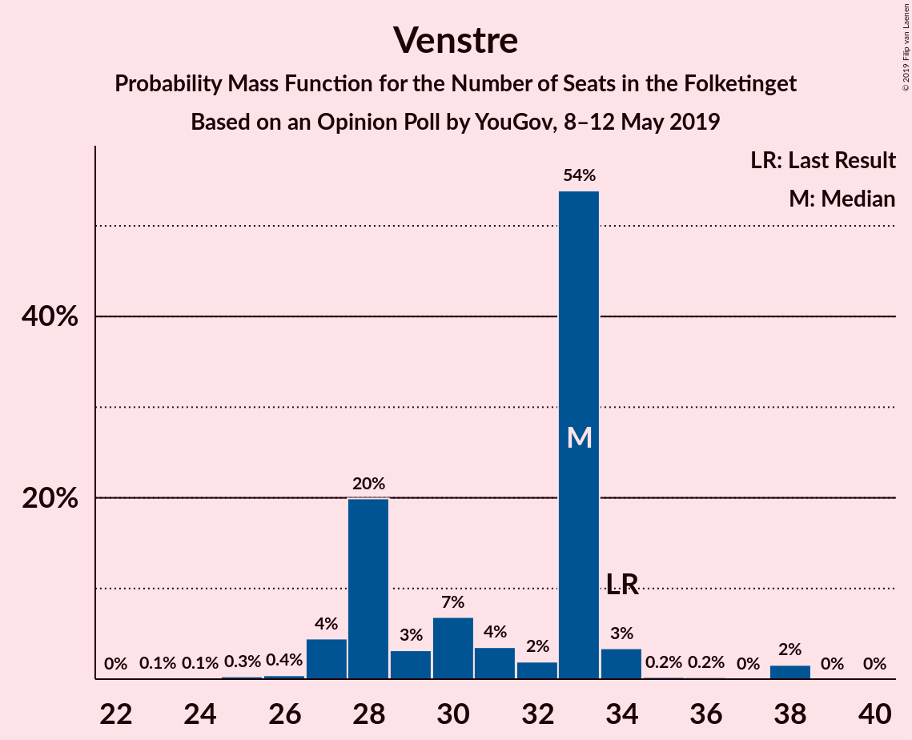

| Number of Seats | Probability | Accumulated | Special Marks |
|:---------------:|:-----------:|:-----------:|:-------------:|
| 23 | 0.1% | 100% |  |
| 24 | 0.1% | 99.9% |  |
| 25 | 0.3% | 99.9% |  |
| 26 | 0.4% | 99.6% |  |
| 27 | 4% | 99.2% |  |
| 28 | 20% | 95% |  |
| 29 | 3% | 75% |  |
| 30 | 7% | 72% |  |
| 31 | 4% | 65% |  |
| 32 | 2% | 61% |  |
| 33 | 54% | 59% | Median |
| 34 | 3% | 5% | Last Result |
| 35 | 0.2% | 2% |  |
| 36 | 0.2% | 2% |  |
| 37 | 0% | 2% |  |
| 38 | 2% | 2% |  |
| 39 | 0% | 0% |  |

### Dansk Folkeparti

*For a full overview of the results for this party, see the [Dansk Folkeparti](party-danskfolkeparti.html) page.*

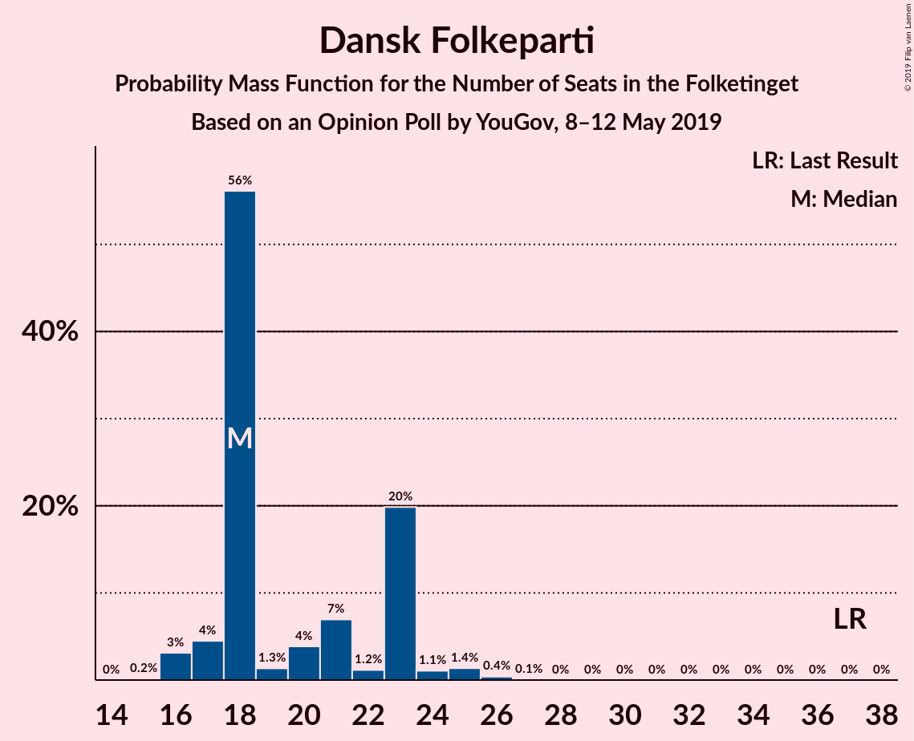

| Number of Seats | Probability | Accumulated | Special Marks |
|:---------------:|:-----------:|:-----------:|:-------------:|
| 15 | 0.2% | 100% |  |
| 16 | 3% | 99.8% |  |
| 17 | 4% | 97% |  |
| 18 | 56% | 92% | Median |
| 19 | 1.3% | 36% |  |
| 20 | 4% | 35% |  |
| 21 | 7% | 31% |  |
| 22 | 1.2% | 24% |  |
| 23 | 20% | 23% |  |
| 24 | 1.1% | 3% |  |
| 25 | 1.4% | 2% |  |
| 26 | 0.4% | 0.5% |  |
| 27 | 0.1% | 0.1% |  |
| 28 | 0% | 0% |  |
| 29 | 0% | 0% |  |
| 30 | 0% | 0% |  |
| 31 | 0% | 0% |  |
| 32 | 0% | 0% |  |
| 33 | 0% | 0% |  |
| 34 | 0% | 0% |  |
| 35 | 0% | 0% |  |
| 36 | 0% | 0% |  |
| 37 | 0% | 0% | Last Result |

### Enhedslisten–De Rød-Grønne

*For a full overview of the results for this party, see the [Enhedslisten–De Rød-Grønne](party-enhedslisten–derød-grønne.html) page.*

| Number of Seats | Probability | Accumulated | Special Marks |
|:---------------:|:-----------:|:-----------:|:-------------:|
| 8 | 0.7% | 100% |  |
| 9 | 2% | 99.3% |  |
| 10 | 2% | 98% |  |
| 11 | 4% | 96% |  |
| 12 | 12% | 92% |  |
| 13 | 72% | 80% | Median |
| 14 | 3% | 8% | Last Result |
| 15 | 3% | 5% |  |
| 16 | 2% | 2% |  |
| 17 | 0.3% | 0.4% |  |
| 18 | 0.1% | 0.1% |  |
| 19 | 0% | 0% |  |

### Radikale Venstre

*For a full overview of the results for this party, see the [Radikale Venstre](party-radikalevenstre.html) page.*

| Number of Seats | Probability | Accumulated | Special Marks |
|:---------------:|:-----------:|:-----------:|:-------------:|
| 8 | 0.3% | 100% | Last Result |
| 9 | 5% | 99.7% |  |
| 10 | 5% | 95% |  |
| 11 | 4% | 90% |  |
| 12 | 25% | 86% |  |
| 13 | 3% | 60% |  |
| 14 | 5% | 58% |  |
| 15 | 51% | 53% | Median |
| 16 | 1.1% | 1.2% |  |
| 17 | 0% | 0.1% |  |
| 18 | 0.1% | 0.1% |  |
| 19 | 0% | 0% |  |

### Socialistisk Folkeparti

*For a full overview of the results for this party, see the [Socialistisk Folkeparti](party-socialistiskfolkeparti.html) page.*

| Number of Seats | Probability | Accumulated | Special Marks |
|:---------------:|:-----------:|:-----------:|:-------------:|
| 7 | 0% | 100% | Last Result |
| 8 | 0.2% | 100% |  |
| 9 | 2% | 99.8% |  |
| 10 | 1.4% | 98% |  |
| 11 | 26% | 96% |  |
| 12 | 9% | 71% |  |
| 13 | 58% | 61% | Median |
| 14 | 1.0% | 4% |  |
| 15 | 2% | 3% |  |
| 16 | 0.1% | 0.2% |  |
| 17 | 0.1% | 0.1% |  |
| 18 | 0% | 0% |  |

### Det Konservative Folkeparti

*For a full overview of the results for this party, see the [Det Konservative Folkeparti](party-detkonservativefolkeparti.html) page.*

| Number of Seats | Probability | Accumulated | Special Marks |
|:---------------:|:-----------:|:-----------:|:-------------:|
| 6 | 0% | 100% | Last Result |
| 7 | 0.2% | 100% |  |
| 8 | 3% | 99.8% |  |
| 9 | 7% | 96% |  |
| 10 | 7% | 90% |  |
| 11 | 58% | 83% | Median |
| 12 | 23% | 25% |  |
| 13 | 0.2% | 2% |  |
| 14 | 2% | 2% |  |
| 15 | 0% | 0% |  |

### Nye Borgerlige

*For a full overview of the results for this party, see the [Nye Borgerlige](party-nyeborgerlige.html) page.*

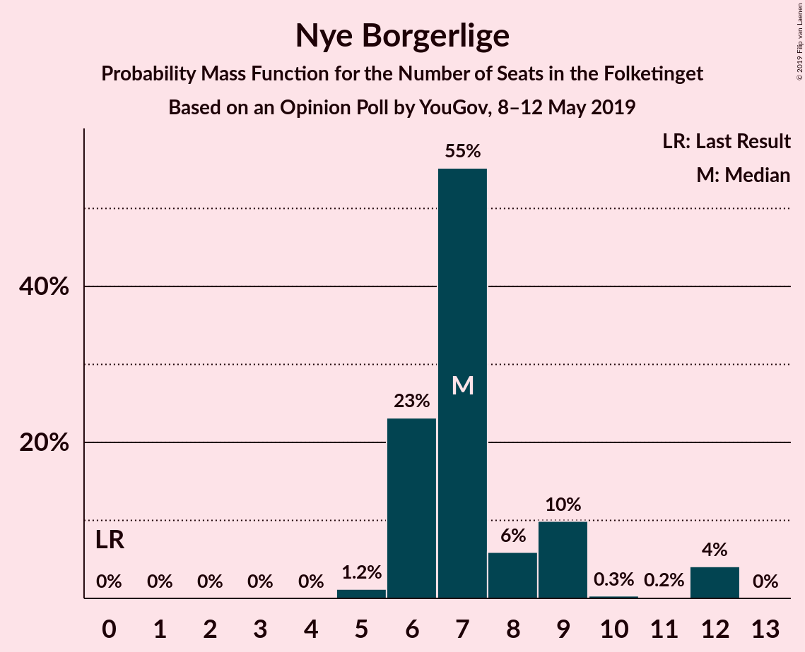

| Number of Seats | Probability | Accumulated | Special Marks |
|:---------------:|:-----------:|:-----------:|:-------------:|
| 0 | 0% | 100% | Last Result |
| 1 | 0% | 100% |  |
| 2 | 0% | 100% |  |
| 3 | 0% | 100% |  |
| 4 | 0% | 100% |  |
| 5 | 1.2% | 100% |  |
| 6 | 23% | 98.8% |  |
| 7 | 55% | 76% | Median |
| 8 | 6% | 20% |  |
| 9 | 10% | 14% |  |
| 10 | 0.3% | 5% |  |
| 11 | 0.2% | 4% |  |
| 12 | 4% | 4% |  |
| 13 | 0% | 0% |  |

### Alternativet

*For a full overview of the results for this party, see the [Alternativet](party-alternativet.html) page.*

| Number of Seats | Probability | Accumulated | Special Marks |
|:---------------:|:-----------:|:-----------:|:-------------:|
| 4 | 1.0% | 100% |  |
| 5 | 2% | 99.0% |  |
| 6 | 11% | 97% |  |
| 7 | 59% | 86% | Median |
| 8 | 7% | 27% |  |
| 9 | 19% | 20% | Last Result |
| 10 | 1.4% | 1.4% |  |
| 11 | 0.1% | 0.1% |  |
| 12 | 0% | 0% |  |

### Stram Kurs

*For a full overview of the results for this party, see the [Stram Kurs](party-stramkurs.html) page.*

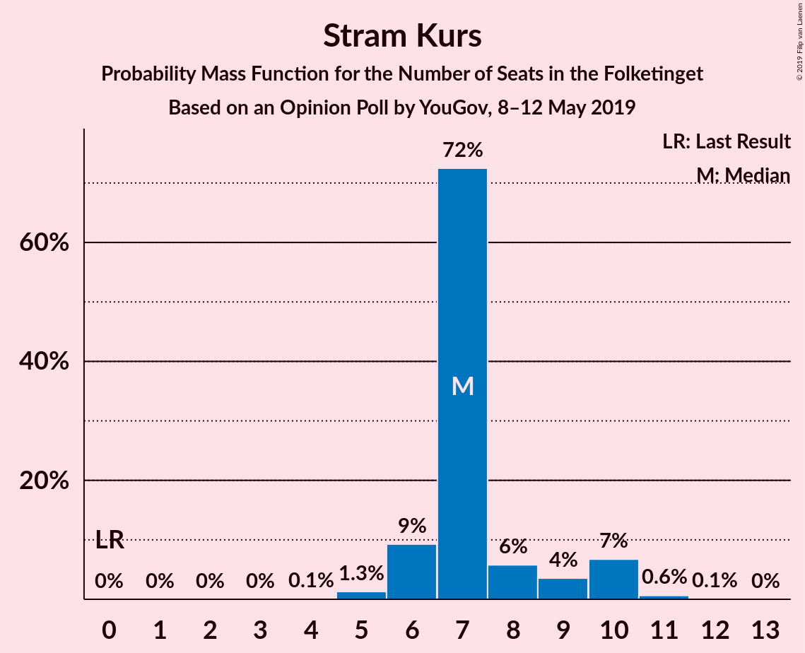

| Number of Seats | Probability | Accumulated | Special Marks |
|:---------------:|:-----------:|:-----------:|:-------------:|
| 0 | 0% | 100% | Last Result |
| 1 | 0% | 100% |  |
| 2 | 0% | 100% |  |
| 3 | 0% | 100% |  |
| 4 | 0.1% | 100% |  |
| 5 | 1.3% | 99.9% |  |
| 6 | 9% | 98.6% |  |
| 7 | 72% | 89% | Median |
| 8 | 6% | 17% |  |
| 9 | 4% | 11% |  |
| 10 | 7% | 8% |  |
| 11 | 0.6% | 0.8% |  |
| 12 | 0.1% | 0.1% |  |
| 13 | 0% | 0% |  |

### Liberal Alliance

*For a full overview of the results for this party, see the [Liberal Alliance](party-liberalalliance.html) page.*

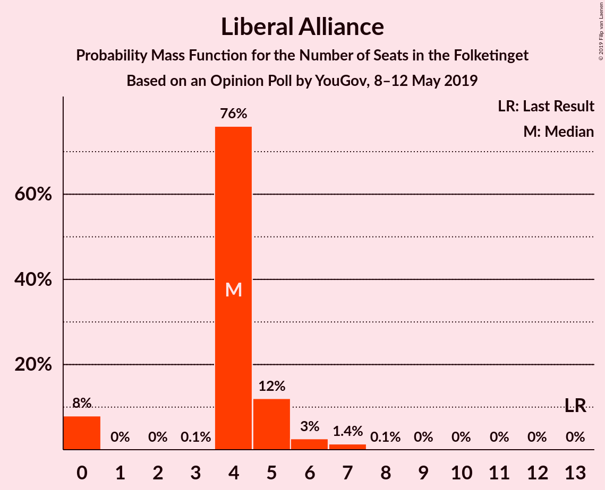

| Number of Seats | Probability | Accumulated | Special Marks |
|:---------------:|:-----------:|:-----------:|:-------------:|
| 0 | 8% | 100% |  |
| 1 | 0% | 92% |  |
| 2 | 0% | 92% |  |
| 3 | 0.1% | 92% |  |
| 4 | 76% | 92% | Median |
| 5 | 12% | 16% |  |
| 6 | 3% | 4% |  |
| 7 | 1.4% | 1.4% |  |
| 8 | 0.1% | 0.1% |  |
| 9 | 0% | 0% |  |
| 10 | 0% | 0% |  |
| 11 | 0% | 0% |  |
| 12 | 0% | 0% |  |
| 13 | 0% | 0% | Last Result |

### Kristendemokraterne

*For a full overview of the results for this party, see the [Kristendemokraterne](party-kristendemokraterne.html) page.*

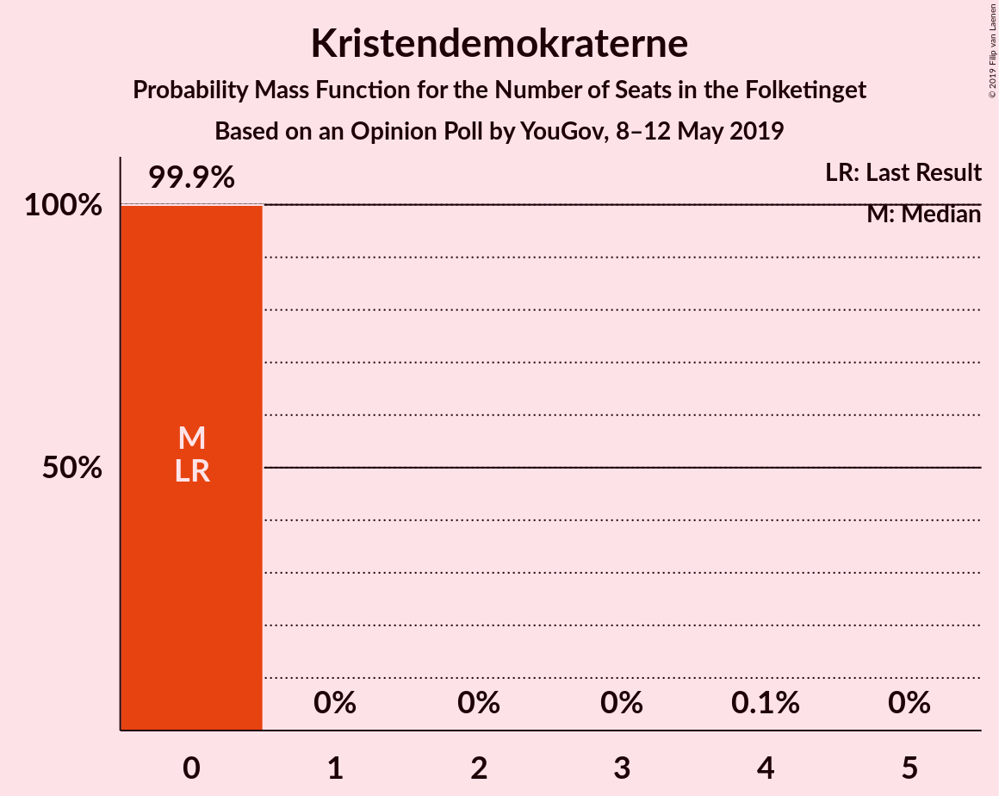

| Number of Seats | Probability | Accumulated | Special Marks |
|:---------------:|:-----------:|:-----------:|:-------------:|
| 0 | 99.9% | 100% | Last Result, Median |
| 1 | 0% | 0.1% |  |
| 2 | 0% | 0.1% |  |
| 3 | 0% | 0.1% |  |
| 4 | 0.1% | 0.1% |  |
| 5 | 0% | 0% |  |

### Klaus Riskær Pedersen

*For a full overview of the results for this party, see the [Klaus Riskær Pedersen](party-klausriskærpedersen.html) page.*

| Number of Seats | Probability | Accumulated | Special Marks |
|:---------------:|:-----------:|:-----------:|:-------------:|
| 0 | 100% | 100% | Last Result, Median |

## Coalitions

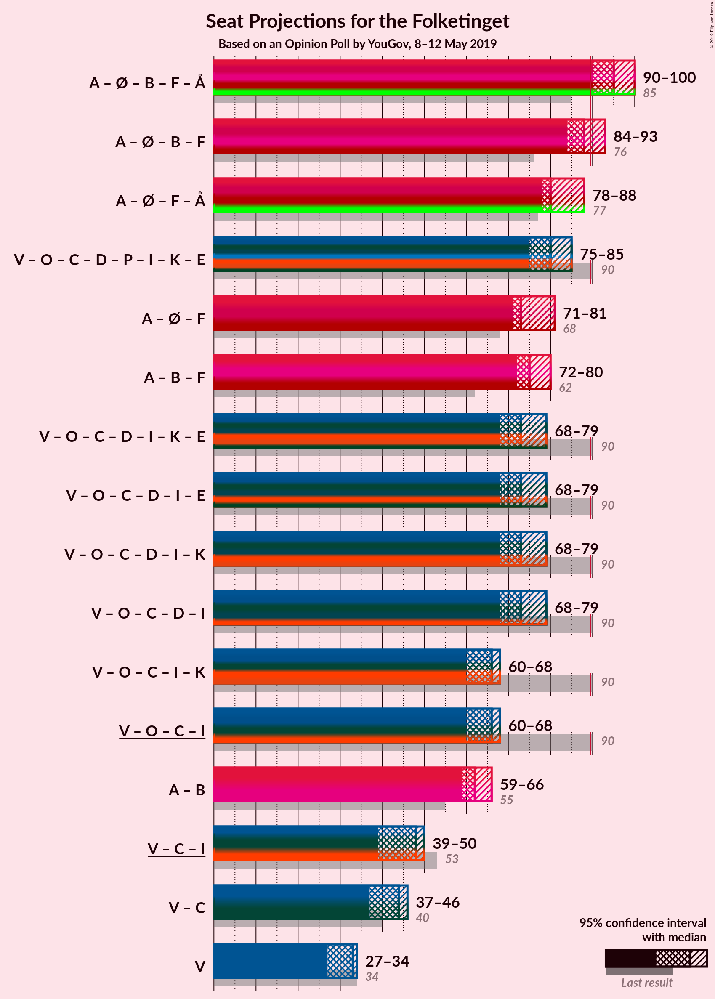

### Confidence Intervals

| Coalition | Last Result | Median | Majority? | 80% Confidence Interval | 90% Confidence Interval | 95% Confidence Interval | 99% Confidence Interval |
|:---------:|:-----------:|:------:|:---------:|:-----------------------:|:-----------------------:|:-----------------------:|:-----------------------:|
| Socialdemokraterne – Enhedslisten–De Rød-Grønne – Radikale Venstre – Socialistisk Folkeparti – Alternativet | 85 | 95 | 99.7% | 92–96 | 90–97 | 90–100 | 90–103 |
| Socialdemokraterne – Enhedslisten–De Rød-Grønne – Radikale Venstre – Socialistisk Folkeparti | 76 | 88 | 6% | 86–89 | 84–90 | 84–93 | 82–95 |
| Socialdemokraterne – Enhedslisten–De Rød-Grønne – Socialistisk Folkeparti – Alternativet | 77 | 80 | 0.3% | 80–84 | 78–87 | 78–88 | 77–89 |
| Venstre – Dansk Folkeparti – Det Konservative Folkeparti – Nye Borgerlige – Stram Kurs – Liberal Alliance – Kristendemokraterne – Klaus Riskær Pedersen | 90 | 80 | 0% | 79–83 | 78–85 | 75–85 | 72–85 |
| Socialdemokraterne – Enhedslisten–De Rød-Grønne – Socialistisk Folkeparti | 68 | 73 | 0% | 73–78 | 72–80 | 71–81 | 70–82 |
| Socialdemokraterne – Radikale Venstre – Socialistisk Folkeparti | 62 | 75 | 0% | 73–77 | 72–77 | 72–80 | 70–81 |
| Venstre – Dansk Folkeparti – Det Konservative Folkeparti – Nye Borgerlige – Liberal Alliance – Kristendemokraterne – Klaus Riskær Pedersen | 90 | 73 | 0% | 70–74 | 69–77 | 68–79 | 66–79 |
| Venstre – Dansk Folkeparti – Det Konservative Folkeparti – Nye Borgerlige – Liberal Alliance – Klaus Riskær Pedersen | 90 | 73 | 0% | 70–74 | 69–77 | 68–79 | 66–79 |
| Venstre – Dansk Folkeparti – Det Konservative Folkeparti – Nye Borgerlige – Liberal Alliance – Kristendemokraterne | 90 | 73 | 0% | 70–74 | 69–77 | 68–79 | 66–79 |
| Venstre – Dansk Folkeparti – Det Konservative Folkeparti – Nye Borgerlige – Liberal Alliance | 90 | 73 | 0% | 70–74 | 69–77 | 68–79 | 66–79 |
| Venstre – Dansk Folkeparti – Det Konservative Folkeparti – Liberal Alliance – Kristendemokraterne | 90 | 66 | 0% | 62–67 | 60–68 | 60–68 | 58–70 |
| Venstre – Dansk Folkeparti – Det Konservative Folkeparti – Liberal Alliance | 90 | 66 | 0% | 62–67 | 60–68 | 60–68 | 58–70 |
| Socialdemokraterne – Radikale Venstre | 55 | 62 | 0% | 62–65 | 60–65 | 59–66 | 57–69 |
| Venstre – Det Konservative Folkeparti – Liberal Alliance | 53 | 48 | 0% | 43–48 | 42–48 | 39–50 | 38–52 |
| Venstre – Det Konservative Folkeparti | 40 | 44 | 0% | 39–44 | 37–45 | 37–46 | 36–47 |
| Venstre | 34 | 33 | 0% | 28–33 | 27–34 | 27–34 | 26–38 |

### Socialdemokraterne – Enhedslisten–De Rød-Grønne – Radikale Venstre – Socialistisk Folkeparti – Alternativet

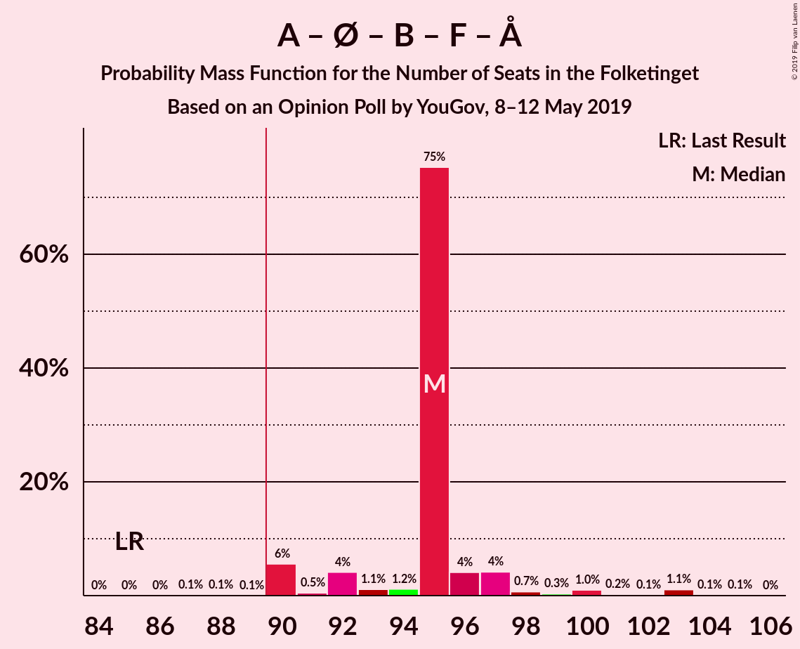

| Number of Seats | Probability | Accumulated | Special Marks |
|:---------------:|:-----------:|:-----------:|:-------------:|
| 85 | 0% | 100% | Last Result |
| 86 | 0% | 100% |  |
| 87 | 0.1% | 100% |  |
| 88 | 0.1% | 99.8% |  |
| 89 | 0.1% | 99.7% |  |
| 90 | 6% | 99.7% | Majority |
| 91 | 0.5% | 94% |  |
| 92 | 4% | 94% |  |
| 93 | 1.1% | 89% |  |
| 94 | 1.2% | 88% |  |
| 95 | 75% | 87% | Median |
| 96 | 4% | 12% |  |
| 97 | 4% | 8% |  |
| 98 | 0.7% | 4% |  |
| 99 | 0.3% | 3% |  |
| 100 | 1.0% | 3% |  |
| 101 | 0.2% | 2% |  |
| 102 | 0.1% | 1.4% |  |
| 103 | 1.1% | 1.3% |  |
| 104 | 0.1% | 0.2% |  |
| 105 | 0.1% | 0.1% |  |
| 106 | 0% | 0% |  |

### Socialdemokraterne – Enhedslisten–De Rød-Grønne – Radikale Venstre – Socialistisk Folkeparti

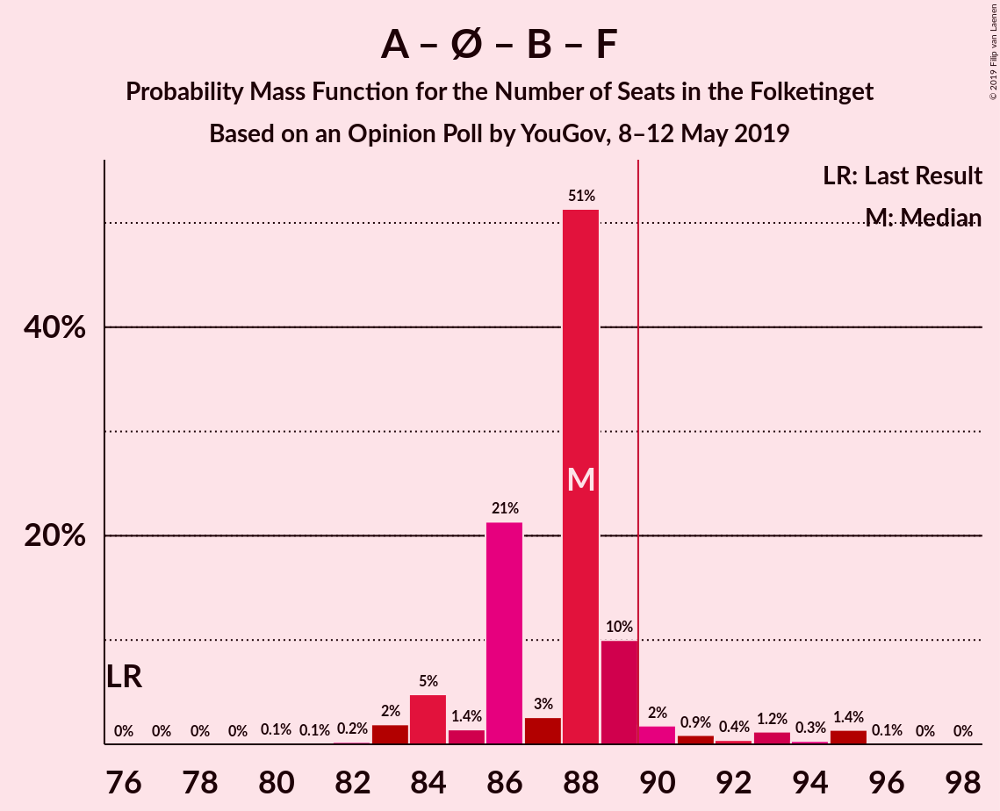

| Number of Seats | Probability | Accumulated | Special Marks |
|:---------------:|:-----------:|:-----------:|:-------------:|
| 76 | 0% | 100% | Last Result |
| 77 | 0% | 100% |  |
| 78 | 0% | 100% |  |
| 79 | 0% | 100% |  |
| 80 | 0.1% | 100% |  |
| 81 | 0.1% | 99.8% |  |
| 82 | 0.2% | 99.7% |  |
| 83 | 2% | 99.5% |  |
| 84 | 5% | 98% |  |
| 85 | 1.4% | 93% |  |
| 86 | 21% | 91% |  |
| 87 | 3% | 70% |  |
| 88 | 51% | 67% | Median |
| 89 | 10% | 16% |  |
| 90 | 2% | 6% | Majority |
| 91 | 0.9% | 4% |  |
| 92 | 0.4% | 3% |  |
| 93 | 1.2% | 3% |  |
| 94 | 0.3% | 2% |  |
| 95 | 1.4% | 1.5% |  |
| 96 | 0.1% | 0.1% |  |
| 97 | 0% | 0.1% |  |
| 98 | 0% | 0% |  |

### Socialdemokraterne – Enhedslisten–De Rød-Grønne – Socialistisk Folkeparti – Alternativet

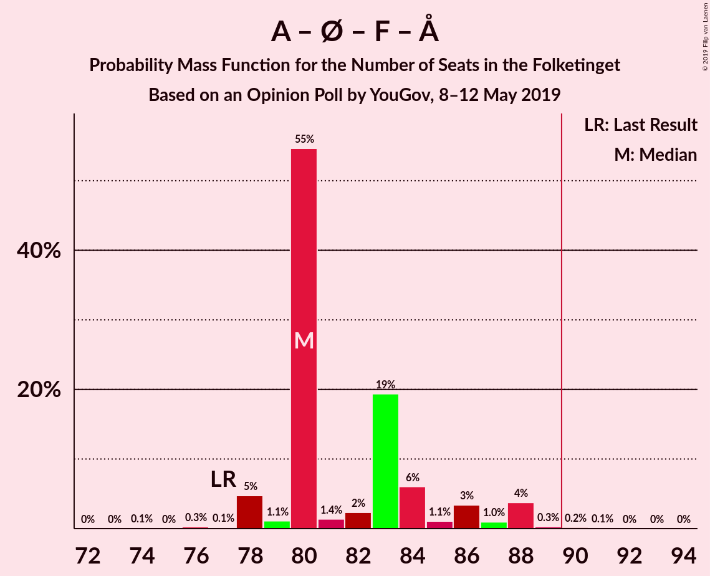

| Number of Seats | Probability | Accumulated | Special Marks |
|:---------------:|:-----------:|:-----------:|:-------------:|
| 74 | 0.1% | 100% |  |
| 75 | 0% | 99.9% |  |
| 76 | 0.3% | 99.8% |  |
| 77 | 0.1% | 99.6% | Last Result |
| 78 | 5% | 99.4% |  |
| 79 | 1.1% | 95% |  |
| 80 | 55% | 94% | Median |
| 81 | 1.4% | 39% |  |
| 82 | 2% | 38% |  |
| 83 | 19% | 35% |  |
| 84 | 6% | 16% |  |
| 85 | 1.1% | 10% |  |
| 86 | 3% | 9% |  |
| 87 | 1.0% | 5% |  |
| 88 | 4% | 4% |  |
| 89 | 0.3% | 0.6% |  |
| 90 | 0.2% | 0.3% | Majority |
| 91 | 0.1% | 0.1% |  |
| 92 | 0% | 0.1% |  |
| 93 | 0% | 0.1% |  |
| 94 | 0% | 0% |  |

### Venstre – Dansk Folkeparti – Det Konservative Folkeparti – Nye Borgerlige – Stram Kurs – Liberal Alliance – Kristendemokraterne – Klaus Riskær Pedersen

| Number of Seats | Probability | Accumulated | Special Marks |
|:---------------:|:-----------:|:-----------:|:-------------:|
| 70 | 0.1% | 100% |  |
| 71 | 0.1% | 99.9% |  |
| 72 | 1.1% | 99.8% |  |
| 73 | 0.1% | 98.7% |  |
| 74 | 0.2% | 98.6% |  |
| 75 | 1.0% | 98% |  |
| 76 | 0.3% | 97% |  |
| 77 | 0.7% | 97% |  |
| 78 | 4% | 96% |  |
| 79 | 4% | 92% |  |
| 80 | 75% | 88% | Median |
| 81 | 1.2% | 13% |  |
| 82 | 1.1% | 12% |  |
| 83 | 4% | 11% |  |
| 84 | 0.5% | 6% |  |
| 85 | 6% | 6% |  |
| 86 | 0.1% | 0.3% |  |
| 87 | 0.1% | 0.3% |  |
| 88 | 0.1% | 0.2% |  |
| 89 | 0% | 0% |  |
| 90 | 0% | 0% | Last Result, Majority |

### Socialdemokraterne – Enhedslisten–De Rød-Grønne – Socialistisk Folkeparti

| Number of Seats | Probability | Accumulated | Special Marks |
|:---------------:|:-----------:|:-----------:|:-------------:|
| 67 | 0.1% | 100% |  |
| 68 | 0% | 99.9% | Last Result |
| 69 | 0.1% | 99.8% |  |
| 70 | 0.6% | 99.8% |  |
| 71 | 2% | 99.2% |  |
| 72 | 5% | 97% |  |
| 73 | 51% | 92% | Median |
| 74 | 22% | 41% |  |
| 75 | 0.9% | 19% |  |
| 76 | 0.8% | 18% |  |
| 77 | 6% | 17% |  |
| 78 | 3% | 11% |  |
| 79 | 0.6% | 8% |  |
| 80 | 4% | 7% |  |
| 81 | 2% | 3% |  |
| 82 | 1.2% | 1.5% |  |
| 83 | 0.1% | 0.3% |  |
| 84 | 0% | 0.2% |  |
| 85 | 0.2% | 0.2% |  |
| 86 | 0% | 0% |  |

### Socialdemokraterne – Radikale Venstre – Socialistisk Folkeparti

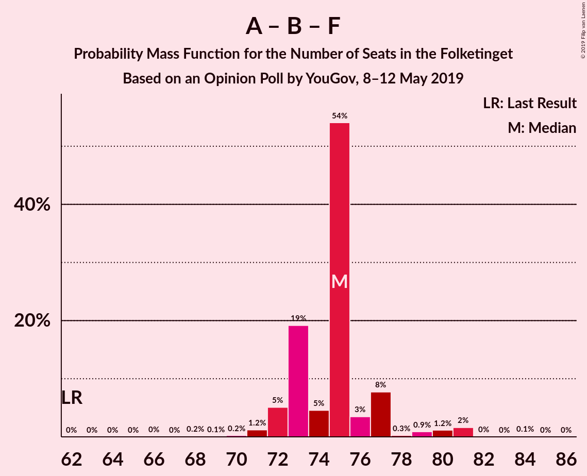

| Number of Seats | Probability | Accumulated | Special Marks |
|:---------------:|:-----------:|:-----------:|:-------------:|
| 62 | 0% | 100% | Last Result |
| 63 | 0% | 100% |  |
| 64 | 0% | 100% |  |
| 65 | 0% | 100% |  |
| 66 | 0% | 100% |  |
| 67 | 0% | 100% |  |
| 68 | 0.2% | 100% |  |
| 69 | 0.1% | 99.8% |  |
| 70 | 0.2% | 99.7% |  |
| 71 | 1.2% | 99.4% |  |
| 72 | 5% | 98% |  |
| 73 | 19% | 93% |  |
| 74 | 5% | 74% |  |
| 75 | 54% | 69% | Median |
| 76 | 3% | 15% |  |
| 77 | 8% | 12% |  |
| 78 | 0.3% | 4% |  |
| 79 | 0.9% | 4% |  |
| 80 | 1.2% | 3% |  |
| 81 | 2% | 2% |  |
| 82 | 0% | 0.2% |  |
| 83 | 0% | 0.2% |  |
| 84 | 0.1% | 0.2% |  |
| 85 | 0% | 0% |  |

### Venstre – Dansk Folkeparti – Det Konservative Folkeparti – Nye Borgerlige – Liberal Alliance – Kristendemokraterne – Klaus Riskær Pedersen

| Number of Seats | Probability | Accumulated | Special Marks |
|:---------------:|:-----------:|:-----------:|:-------------:|
| 62 | 0.1% | 100% |  |
| 63 | 0% | 99.9% |  |
| 64 | 0.1% | 99.9% |  |
| 65 | 0.2% | 99.8% |  |
| 66 | 1.3% | 99.6% |  |
| 67 | 0.3% | 98% |  |
| 68 | 0.7% | 98% |  |
| 69 | 4% | 97% |  |
| 70 | 4% | 93% |  |
| 71 | 1.4% | 89% |  |
| 72 | 1.5% | 87% |  |
| 73 | 73% | 86% | Median |
| 74 | 3% | 12% |  |
| 75 | 2% | 9% |  |
| 76 | 2% | 8% |  |
| 77 | 1.3% | 6% |  |
| 78 | 0.3% | 4% |  |
| 79 | 4% | 4% |  |
| 80 | 0.1% | 0.2% |  |
| 81 | 0% | 0% |  |
| 82 | 0% | 0% |  |
| 83 | 0% | 0% |  |
| 84 | 0% | 0% |  |
| 85 | 0% | 0% |  |
| 86 | 0% | 0% |  |
| 87 | 0% | 0% |  |
| 88 | 0% | 0% |  |
| 89 | 0% | 0% |  |
| 90 | 0% | 0% | Last Result, Majority |

### Venstre – Dansk Folkeparti – Det Konservative Folkeparti – Nye Borgerlige – Liberal Alliance – Klaus Riskær Pedersen

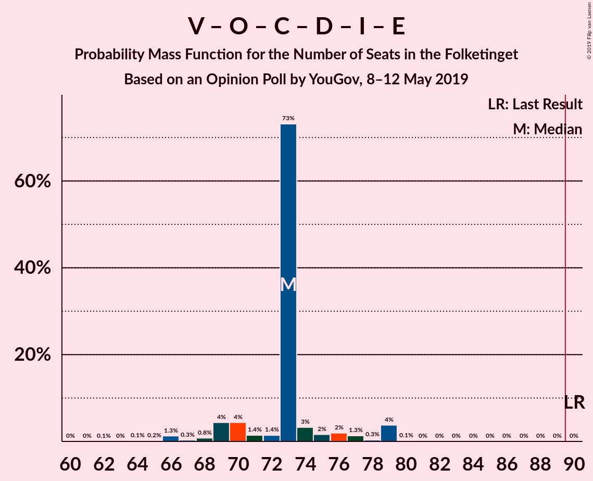

| Number of Seats | Probability | Accumulated | Special Marks |
|:---------------:|:-----------:|:-----------:|:-------------:|
| 62 | 0.1% | 100% |  |
| 63 | 0% | 99.9% |  |
| 64 | 0.1% | 99.9% |  |
| 65 | 0.2% | 99.8% |  |
| 66 | 1.3% | 99.6% |  |
| 67 | 0.3% | 98% |  |
| 68 | 0.8% | 98% |  |
| 69 | 4% | 97% |  |
| 70 | 4% | 93% |  |
| 71 | 1.4% | 88% |  |
| 72 | 1.4% | 87% |  |
| 73 | 73% | 86% | Median |
| 74 | 3% | 12% |  |
| 75 | 2% | 9% |  |
| 76 | 2% | 8% |  |
| 77 | 1.3% | 6% |  |
| 78 | 0.3% | 4% |  |
| 79 | 4% | 4% |  |
| 80 | 0.1% | 0.2% |  |
| 81 | 0% | 0% |  |
| 82 | 0% | 0% |  |
| 83 | 0% | 0% |  |
| 84 | 0% | 0% |  |
| 85 | 0% | 0% |  |
| 86 | 0% | 0% |  |
| 87 | 0% | 0% |  |
| 88 | 0% | 0% |  |
| 89 | 0% | 0% |  |
| 90 | 0% | 0% | Last Result, Majority |

### Venstre – Dansk Folkeparti – Det Konservative Folkeparti – Nye Borgerlige – Liberal Alliance – Kristendemokraterne

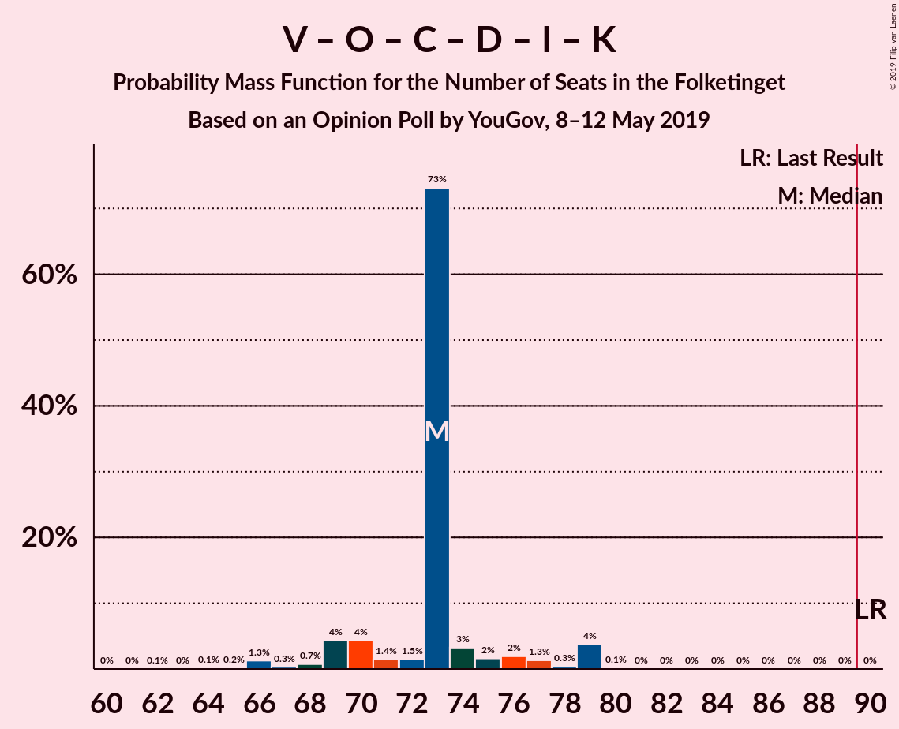

| Number of Seats | Probability | Accumulated | Special Marks |
|:---------------:|:-----------:|:-----------:|:-------------:|
| 62 | 0.1% | 100% |  |
| 63 | 0% | 99.9% |  |
| 64 | 0.1% | 99.9% |  |
| 65 | 0.2% | 99.8% |  |
| 66 | 1.3% | 99.6% |  |
| 67 | 0.3% | 98% |  |
| 68 | 0.7% | 98% |  |
| 69 | 4% | 97% |  |
| 70 | 4% | 93% |  |
| 71 | 1.4% | 88% |  |
| 72 | 1.5% | 87% |  |
| 73 | 73% | 86% | Median |
| 74 | 3% | 12% |  |
| 75 | 2% | 9% |  |
| 76 | 2% | 8% |  |
| 77 | 1.3% | 6% |  |
| 78 | 0.3% | 4% |  |
| 79 | 4% | 4% |  |
| 80 | 0.1% | 0.2% |  |
| 81 | 0% | 0% |  |
| 82 | 0% | 0% |  |
| 83 | 0% | 0% |  |
| 84 | 0% | 0% |  |
| 85 | 0% | 0% |  |
| 86 | 0% | 0% |  |
| 87 | 0% | 0% |  |
| 88 | 0% | 0% |  |
| 89 | 0% | 0% |  |
| 90 | 0% | 0% | Last Result, Majority |

### Venstre – Dansk Folkeparti – Det Konservative Folkeparti – Nye Borgerlige – Liberal Alliance

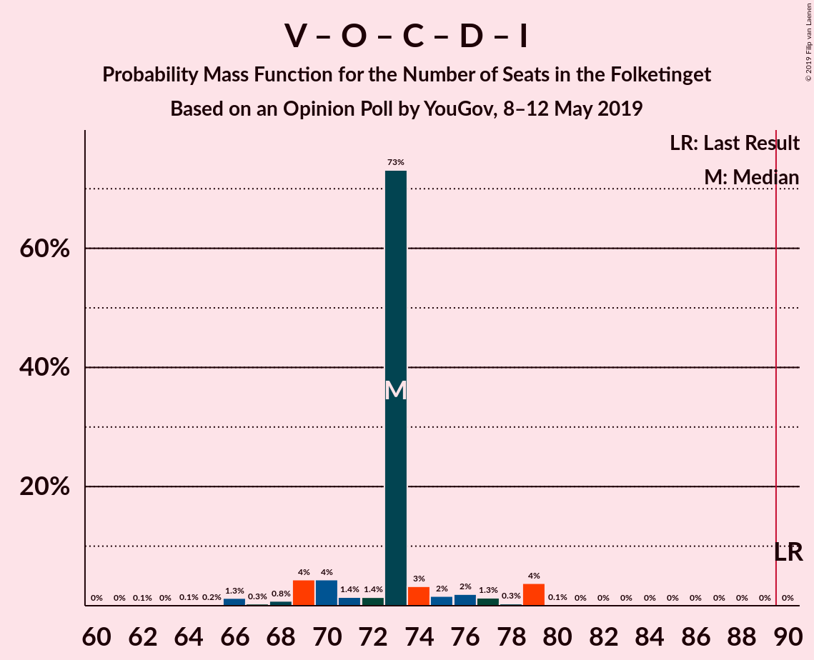

| Number of Seats | Probability | Accumulated | Special Marks |
|:---------------:|:-----------:|:-----------:|:-------------:|
| 62 | 0.1% | 100% |  |
| 63 | 0% | 99.9% |  |
| 64 | 0.1% | 99.9% |  |
| 65 | 0.2% | 99.8% |  |
| 66 | 1.3% | 99.6% |  |
| 67 | 0.3% | 98% |  |
| 68 | 0.8% | 98% |  |
| 69 | 4% | 97% |  |
| 70 | 4% | 93% |  |
| 71 | 1.4% | 88% |  |
| 72 | 1.4% | 87% |  |
| 73 | 73% | 86% | Median |
| 74 | 3% | 12% |  |
| 75 | 2% | 9% |  |
| 76 | 2% | 8% |  |
| 77 | 1.3% | 6% |  |
| 78 | 0.3% | 4% |  |
| 79 | 4% | 4% |  |
| 80 | 0.1% | 0.2% |  |
| 81 | 0% | 0% |  |
| 82 | 0% | 0% |  |
| 83 | 0% | 0% |  |
| 84 | 0% | 0% |  |
| 85 | 0% | 0% |  |
| 86 | 0% | 0% |  |
| 87 | 0% | 0% |  |
| 88 | 0% | 0% |  |
| 89 | 0% | 0% |  |
| 90 | 0% | 0% | Last Result, Majority |

### Venstre – Dansk Folkeparti – Det Konservative Folkeparti – Liberal Alliance – Kristendemokraterne

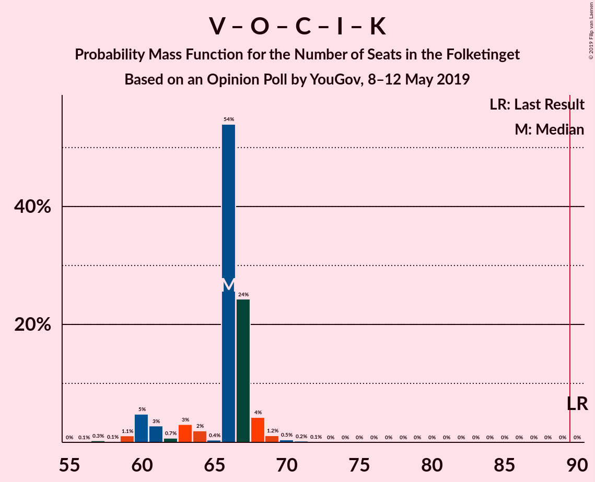

| Number of Seats | Probability | Accumulated | Special Marks |
|:---------------:|:-----------:|:-----------:|:-------------:|
| 55 | 0% | 100% |  |
| 56 | 0.1% | 99.9% |  |
| 57 | 0.3% | 99.8% |  |
| 58 | 0.1% | 99.5% |  |
| 59 | 1.1% | 99.4% |  |
| 60 | 5% | 98% |  |
| 61 | 3% | 94% |  |
| 62 | 0.7% | 91% |  |
| 63 | 3% | 90% |  |
| 64 | 2% | 87% |  |
| 65 | 0.4% | 85% |  |
| 66 | 54% | 85% | Median |
| 67 | 24% | 31% |  |
| 68 | 4% | 6% |  |
| 69 | 1.2% | 2% |  |
| 70 | 0.5% | 0.9% |  |
| 71 | 0.2% | 0.4% |  |
| 72 | 0.1% | 0.2% |  |
| 73 | 0% | 0% |  |
| 74 | 0% | 0% |  |
| 75 | 0% | 0% |  |
| 76 | 0% | 0% |  |
| 77 | 0% | 0% |  |
| 78 | 0% | 0% |  |
| 79 | 0% | 0% |  |
| 80 | 0% | 0% |  |
| 81 | 0% | 0% |  |
| 82 | 0% | 0% |  |
| 83 | 0% | 0% |  |
| 84 | 0% | 0% |  |
| 85 | 0% | 0% |  |
| 86 | 0% | 0% |  |
| 87 | 0% | 0% |  |
| 88 | 0% | 0% |  |
| 89 | 0% | 0% |  |
| 90 | 0% | 0% | Last Result, Majority |

### Venstre – Dansk Folkeparti – Det Konservative Folkeparti – Liberal Alliance

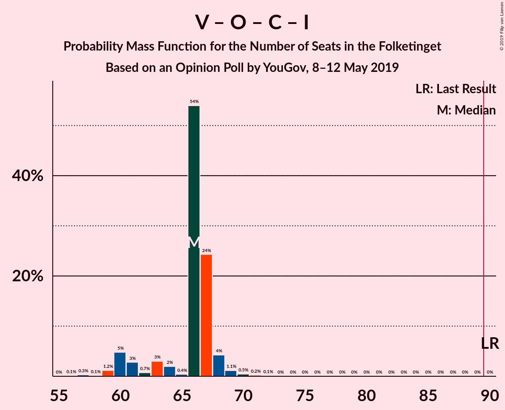

| Number of Seats | Probability | Accumulated | Special Marks |
|:---------------:|:-----------:|:-----------:|:-------------:|
| 55 | 0% | 100% |  |
| 56 | 0.1% | 99.9% |  |
| 57 | 0.3% | 99.8% |  |
| 58 | 0.1% | 99.5% |  |
| 59 | 1.2% | 99.4% |  |
| 60 | 5% | 98% |  |
| 61 | 3% | 93% |  |
| 62 | 0.7% | 91% |  |
| 63 | 3% | 90% |  |
| 64 | 2% | 87% |  |
| 65 | 0.4% | 85% |  |
| 66 | 54% | 85% | Median |
| 67 | 24% | 31% |  |
| 68 | 4% | 6% |  |
| 69 | 1.1% | 2% |  |
| 70 | 0.5% | 0.9% |  |
| 71 | 0.2% | 0.4% |  |
| 72 | 0.1% | 0.2% |  |
| 73 | 0% | 0% |  |
| 74 | 0% | 0% |  |
| 75 | 0% | 0% |  |
| 76 | 0% | 0% |  |
| 77 | 0% | 0% |  |
| 78 | 0% | 0% |  |
| 79 | 0% | 0% |  |
| 80 | 0% | 0% |  |
| 81 | 0% | 0% |  |
| 82 | 0% | 0% |  |
| 83 | 0% | 0% |  |
| 84 | 0% | 0% |  |
| 85 | 0% | 0% |  |
| 86 | 0% | 0% |  |
| 87 | 0% | 0% |  |
| 88 | 0% | 0% |  |
| 89 | 0% | 0% |  |
| 90 | 0% | 0% | Last Result, Majority |

### Socialdemokraterne – Radikale Venstre

| Number of Seats | Probability | Accumulated | Special Marks |
|:---------------:|:-----------:|:-----------:|:-------------:|
| 54 | 0% | 100% |  |
| 55 | 0% | 99.9% | Last Result |
| 56 | 0.1% | 99.9% |  |
| 57 | 0.3% | 99.8% |  |
| 58 | 0.1% | 99.5% |  |
| 59 | 4% | 99.4% |  |
| 60 | 0.3% | 95% |  |
| 61 | 2% | 95% |  |
| 62 | 70% | 93% | Median |
| 63 | 7% | 23% |  |
| 64 | 4% | 16% |  |
| 65 | 8% | 12% |  |
| 66 | 2% | 4% |  |
| 67 | 0.6% | 2% |  |
| 68 | 1.0% | 2% |  |
| 69 | 0.5% | 0.7% |  |
| 70 | 0.1% | 0.2% |  |
| 71 | 0.1% | 0.1% |  |
| 72 | 0% | 0% |  |

### Venstre – Det Konservative Folkeparti – Liberal Alliance

| Number of Seats | Probability | Accumulated | Special Marks |
|:---------------:|:-----------:|:-----------:|:-------------:|
| 36 | 0.2% | 100% |  |
| 37 | 0.1% | 99.8% |  |
| 38 | 1.2% | 99.6% |  |
| 39 | 2% | 98% |  |
| 40 | 0.3% | 97% |  |
| 41 | 0.8% | 97% |  |
| 42 | 4% | 96% |  |
| 43 | 3% | 91% |  |
| 44 | 18% | 88% |  |
| 45 | 5% | 71% |  |
| 46 | 7% | 66% |  |
| 47 | 4% | 59% |  |
| 48 | 50% | 55% | Median |
| 49 | 2% | 5% |  |
| 50 | 2% | 3% |  |
| 51 | 0.1% | 0.9% |  |
| 52 | 0.8% | 0.8% |  |
| 53 | 0% | 0% | Last Result |

### Venstre – Det Konservative Folkeparti

| Number of Seats | Probability | Accumulated | Special Marks |
|:---------------:|:-----------:|:-----------:|:-------------:|
| 33 | 0% | 100% |  |
| 34 | 0.1% | 99.9% |  |
| 35 | 0.3% | 99.8% |  |
| 36 | 0.3% | 99.6% |  |
| 37 | 5% | 99.2% |  |
| 38 | 3% | 94% |  |
| 39 | 3% | 92% |  |
| 40 | 19% | 89% | Last Result |
| 41 | 7% | 70% |  |
| 42 | 2% | 63% |  |
| 43 | 3% | 61% |  |
| 44 | 50% | 57% | Median |
| 45 | 4% | 7% |  |
| 46 | 1.0% | 3% |  |
| 47 | 2% | 2% |  |
| 48 | 0% | 0% |  |

### Venstre

| Number of Seats | Probability | Accumulated | Special Marks |
|:---------------:|:-----------:|:-----------:|:-------------:|
| 23 | 0.1% | 100% |  |
| 24 | 0.1% | 99.9% |  |
| 25 | 0.3% | 99.9% |  |
| 26 | 0.4% | 99.6% |  |
| 27 | 4% | 99.2% |  |
| 28 | 20% | 95% |  |
| 29 | 3% | 75% |  |
| 30 | 7% | 72% |  |
| 31 | 4% | 65% |  |
| 32 | 2% | 61% |  |
| 33 | 54% | 59% | Median |
| 34 | 3% | 5% | Last Result |
| 35 | 0.2% | 2% |  |
| 36 | 0.2% | 2% |  |
| 37 | 0% | 2% |  |
| 38 | 2% | 2% |  |
| 39 | 0% | 0% |  |

## Technical Information

### Opinion Poll

+ **Polling firm:** YouGov
+ **Commissioner(s):** —
+ **Fieldwork period:** 8–12 May 2019

### Calculations

+ **Sample size:** 964
+ **Simulations done:** 1,048,576
+ **Error estimate:** 2.62%

