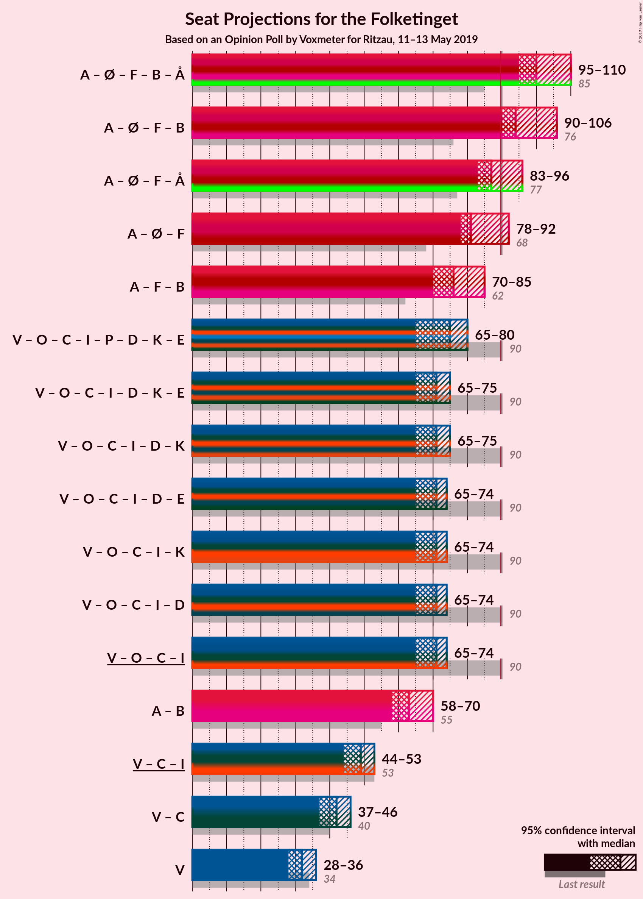
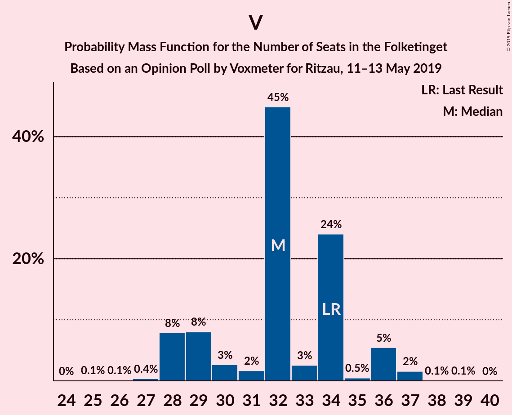

# Opinion Poll by Voxmeter for Ritzau, 11–13 May 2019

<a href="#voting-intentions">Voting Intentions</a> | <a href="#seats">Seats</a> | <a href="#coalitions">Coalitions</a> | <a href="#technical-information">Technical Information</a>

## Voting Intentions

### Confidence Intervals

| Party | Last Result | Poll Result | 80% Confidence Interval | 90% Confidence Interval | 95% Confidence Interval | 99% Confidence Interval |
|:-----:|:-----------:|:-----------:|:-----------------------:|:-----------------------:|:-----------------------:|:-----------------------:|
| Socialdemokraterne | 26.3% | 28.7% | 26.9–30.5% |26.5–31.0% |26.0–31.5% |25.2–32.4% |
| Venstre | 19.5% | 17.8% | 16.4–19.4% |16.0–19.8% |15.6–20.2% |15.0–21.0% |
| Dansk Folkeparti | 21.1% | 11.9% | 10.7–13.3% |10.4–13.7% |10.1–14.0% |9.5–14.7% |
| Enhedslisten–De Rød-Grønne | 7.8% | 10.2% | 9.1–11.5% |8.8–11.9% |8.5–12.2% |8.0–12.8% |
| Socialistisk Folkeparti | 4.2% | 7.3% | 6.4–8.4% |6.1–8.8% |5.9–9.0% |5.5–9.6% |
| Radikale Venstre | 4.6% | 7.1% | 6.2–8.2% |5.9–8.6% |5.7–8.8% |5.3–9.4% |
| Det Konservative Folkeparti | 3.4% | 5.4% | 4.6–6.4% |4.4–6.7% |4.2–7.0% |3.9–7.5% |
| Liberal Alliance | 7.5% | 3.7% | 3.0–4.5% |2.8–4.8% |2.7–5.0% |2.4–5.4% |
| Alternativet | 4.8% | 2.9% | 2.3–3.7% |2.2–3.9% |2.1–4.1% |1.8–4.5% |
| Stram Kurs | 0.0% | 2.0% | 1.5–2.6% |1.4–2.8% |1.3–3.0% |1.1–3.4% |
| Nye Borgerlige | 0.0% | 1.5% | 1.1–2.1% |1.0–2.3% |0.9–2.4% |0.8–2.7% |
| Kristendemokraterne | 0.8% | 1.3% | 1.0–1.9% |0.9–2.0% |0.8–2.2% |0.6–2.5% |
| Klaus Riskær Pedersen | 0.0% | 0.1% | 0.0–0.4% |0.0–0.5% |0.0–0.5% |0.0–0.7% |

*Note:* The poll result column reflects the actual value used in the calculations. Published results may vary slightly, and in addition be rounded to fewer digits.

## Seats

### Confidence Intervals

| Party | Last Result | Median | 80% Confidence Interval | 90% Confidence Interval | 95% Confidence Interval | 99% Confidence Interval |
|:-----:|:-----------:|:------:|:-----------------------:|:-----------------------:|:-----------------------:|:-----------------------:|
| <a href="#socialdemokraterne">Socialdemokraterne</a> | 47 | 50 | 48–54 |47–56 |47–56 |46–57 |
| <a href="#venstre">Venstre</a> | 34 | 32 | 29–34 |28–36 |28–36 |27–37 |
| <a href="#dansk-folkeparti">Dansk Folkeparti</a> | 37 | 22 | 19–22 |19–23 |19–24 |18–26 |
| <a href="#enhedslisten–de-rød-grønne">Enhedslisten–De Rød-Grønne</a> | 14 | 18 | 17–21 |17–22 |16–24 |15–24 |
| <a href="#socialistisk-folkeparti">Socialistisk Folkeparti</a> | 7 | 13 | 13–15 |12–15 |12–15 |10–17 |
| <a href="#radikale-venstre">Radikale Venstre</a> | 8 | 13 | 10–14 |10–14 |10–18 |9–18 |
| <a href="#det-konservative-folkeparti">Det Konservative Folkeparti</a> | 6 | 10 | 9–10 |9–10 |9–11 |8–14 |
| <a href="#liberal-alliance">Liberal Alliance</a> | 13 | 7 | 6–7 |6–8 |6–8 |5–10 |
| <a href="#alternativet">Alternativet</a> | 9 | 6 | 4–7 |4–7 |4–7 |0–7 |
| <a href="#stram-kurs">Stram Kurs</a> | 0 | 4 | 0–5 |0–6 |0–6 |0–6 |
| <a href="#nye-borgerlige">Nye Borgerlige</a> | 0 | 0 | 0 |0–4 |0–4 |0–5 |
| <a href="#kristendemokraterne">Kristendemokraterne</a> | 0 | 0 | 0 |0–4 |0–4 |0–5 |
| <a href="#klaus-riskær-pedersen">Klaus Riskær Pedersen</a> | 0 | 0 | 0 |0 |0 |0 |

### Socialdemokraterne

*For a full overview of the results for this party, see the [Socialdemokraterne](party-socialdemokraterne.html) page.*

| Number of Seats | Probability | Accumulated | Special Marks |
|:---------------:|:-----------:|:-----------:|:-------------:|
| 43 | 0.1% | 100% |  |
| 44 | 0% | 99.9% |  |
| 45 | 0.2% | 99.9% |  |
| 46 | 0.2% | 99.7% |  |
| 47 | 8% | 99.5% | Last Result |
| 48 | 4% | 91% |  |
| 49 | 6% | 88% |  |
| 50 | 60% | 82% | Median |
| 51 | 3% | 22% |  |
| 52 | 5% | 19% |  |
| 53 | 4% | 14% |  |
| 54 | 1.5% | 11% |  |
| 55 | 2% | 9% |  |
| 56 | 7% | 8% |  |
| 57 | 0.1% | 0.6% |  |
| 58 | 0.4% | 0.5% |  |
| 59 | 0.1% | 0.1% |  |
| 60 | 0% | 0% |  |

### Venstre

*For a full overview of the results for this party, see the [Venstre](party-venstre.html) page.*

| Number of Seats | Probability | Accumulated | Special Marks |
|:---------------:|:-----------:|:-----------:|:-------------:|
| 25 | 0.1% | 100% |  |
| 26 | 0.1% | 99.9% |  |
| 27 | 0.4% | 99.8% |  |
| 28 | 8% | 99.4% |  |
| 29 | 8% | 92% |  |
| 30 | 3% | 83% |  |
| 31 | 2% | 81% |  |
| 32 | 45% | 79% | Median |
| 33 | 3% | 34% |  |
| 34 | 24% | 32% | Last Result |
| 35 | 0.5% | 8% |  |
| 36 | 5% | 7% |  |
| 37 | 2% | 2% |  |
| 38 | 0.1% | 0.1% |  |
| 39 | 0.1% | 0.1% |  |
| 40 | 0% | 0% |  |

### Dansk Folkeparti

*For a full overview of the results for this party, see the [Dansk Folkeparti](party-danskfolkeparti.html) page.*

| Number of Seats | Probability | Accumulated | Special Marks |
|:---------------:|:-----------:|:-----------:|:-------------:|
| 16 | 0.1% | 100% |  |
| 17 | 0.2% | 99.8% |  |
| 18 | 1.1% | 99.6% |  |
| 19 | 23% | 98% |  |
| 20 | 7% | 75% |  |
| 21 | 12% | 68% |  |
| 22 | 47% | 56% | Median |
| 23 | 4% | 8% |  |
| 24 | 3% | 4% |  |
| 25 | 0.2% | 0.7% |  |
| 26 | 0.5% | 0.6% |  |
| 27 | 0% | 0.1% |  |
| 28 | 0% | 0% |  |
| 29 | 0% | 0% |  |
| 30 | 0% | 0% |  |
| 31 | 0% | 0% |  |
| 32 | 0% | 0% |  |
| 33 | 0% | 0% |  |
| 34 | 0% | 0% |  |
| 35 | 0% | 0% |  |
| 36 | 0% | 0% |  |
| 37 | 0% | 0% | Last Result |

### Enhedslisten–De Rød-Grønne

*For a full overview of the results for this party, see the [Enhedslisten–De Rød-Grønne](party-enhedslisten–derød-grønne.html) page.*

| Number of Seats | Probability | Accumulated | Special Marks |
|:---------------:|:-----------:|:-----------:|:-------------:|
| 14 | 0.2% | 100% | Last Result |
| 15 | 2% | 99.8% |  |
| 16 | 1.1% | 98% |  |
| 17 | 9% | 97% |  |
| 18 | 46% | 88% | Median |
| 19 | 25% | 42% |  |
| 20 | 0.8% | 17% |  |
| 21 | 11% | 16% |  |
| 22 | 2% | 6% |  |
| 23 | 0.2% | 4% |  |
| 24 | 3% | 3% |  |
| 25 | 0% | 0% |  |

### Socialistisk Folkeparti

*For a full overview of the results for this party, see the [Socialistisk Folkeparti](party-socialistiskfolkeparti.html) page.*

| Number of Seats | Probability | Accumulated | Special Marks |
|:---------------:|:-----------:|:-----------:|:-------------:|
| 7 | 0% | 100% | Last Result |
| 8 | 0% | 100% |  |
| 9 | 0.3% | 100% |  |
| 10 | 1.0% | 99.7% |  |
| 11 | 1.0% | 98.7% |  |
| 12 | 7% | 98% |  |
| 13 | 65% | 91% | Median |
| 14 | 13% | 26% |  |
| 15 | 11% | 13% |  |
| 16 | 2% | 2% |  |
| 17 | 0.7% | 0.9% |  |
| 18 | 0.2% | 0.2% |  |
| 19 | 0% | 0% |  |

### Radikale Venstre

*For a full overview of the results for this party, see the [Radikale Venstre](party-radikalevenstre.html) page.*

| Number of Seats | Probability | Accumulated | Special Marks |
|:---------------:|:-----------:|:-----------:|:-------------:|
| 8 | 0.3% | 100% | Last Result |
| 9 | 0.9% | 99.7% |  |
| 10 | 10% | 98.8% |  |
| 11 | 6% | 89% |  |
| 12 | 3% | 83% |  |
| 13 | 66% | 80% | Median |
| 14 | 9% | 14% |  |
| 15 | 0.7% | 5% |  |
| 16 | 1.1% | 4% |  |
| 17 | 0.1% | 3% |  |
| 18 | 3% | 3% |  |
| 19 | 0% | 0% |  |

### Det Konservative Folkeparti

*For a full overview of the results for this party, see the [Det Konservative Folkeparti](party-detkonservativefolkeparti.html) page.*

| Number of Seats | Probability | Accumulated | Special Marks |
|:---------------:|:-----------:|:-----------:|:-------------:|
| 6 | 0.2% | 100% | Last Result |
| 7 | 0.1% | 99.8% |  |
| 8 | 0.3% | 99.8% |  |
| 9 | 16% | 99.4% |  |
| 10 | 79% | 83% | Median |
| 11 | 1.3% | 4% |  |
| 12 | 0.7% | 2% |  |
| 13 | 0.7% | 2% |  |
| 14 | 0.9% | 0.9% |  |
| 15 | 0% | 0% |  |

### Liberal Alliance

*For a full overview of the results for this party, see the [Liberal Alliance](party-liberalalliance.html) page.*

| Number of Seats | Probability | Accumulated | Special Marks |
|:---------------:|:-----------:|:-----------:|:-------------:|
| 4 | 0.1% | 100% |  |
| 5 | 2% | 99.9% |  |
| 6 | 39% | 98% |  |
| 7 | 53% | 58% | Median |
| 8 | 4% | 5% |  |
| 9 | 0.3% | 1.3% |  |
| 10 | 0.8% | 1.0% |  |
| 11 | 0.2% | 0.2% |  |
| 12 | 0% | 0% |  |
| 13 | 0% | 0% | Last Result |

### Alternativet

*For a full overview of the results for this party, see the [Alternativet](party-alternativet.html) page.*

| Number of Seats | Probability | Accumulated | Special Marks |
|:---------------:|:-----------:|:-----------:|:-------------:|
| 0 | 0.6% | 100% |  |
| 1 | 0% | 99.4% |  |
| 2 | 0% | 99.4% |  |
| 3 | 0% | 99.4% |  |
| 4 | 20% | 99.4% |  |
| 5 | 11% | 79% |  |
| 6 | 43% | 68% | Median |
| 7 | 25% | 25% |  |
| 8 | 0.4% | 0.5% |  |
| 9 | 0% | 0% | Last Result |

### Stram Kurs

*For a full overview of the results for this party, see the [Stram Kurs](party-stramkurs.html) page.*

| Number of Seats | Probability | Accumulated | Special Marks |
|:---------------:|:-----------:|:-----------:|:-------------:|
| 0 | 16% | 100% | Last Result |
| 1 | 0% | 84% |  |
| 2 | 0% | 84% |  |
| 3 | 0% | 84% |  |
| 4 | 68% | 84% | Median |
| 5 | 11% | 16% |  |
| 6 | 5% | 5% |  |
| 7 | 0% | 0% |  |

### Nye Borgerlige

*For a full overview of the results for this party, see the [Nye Borgerlige](party-nyeborgerlige.html) page.*

| Number of Seats | Probability | Accumulated | Special Marks |
|:---------------:|:-----------:|:-----------:|:-------------:|
| 0 | 92% | 100% | Last Result, Median |
| 1 | 0% | 8% |  |
| 2 | 0% | 8% |  |
| 3 | 0% | 8% |  |
| 4 | 6% | 8% |  |
| 5 | 2% | 2% |  |
| 6 | 0.1% | 0.1% |  |
| 7 | 0% | 0% |  |

### Kristendemokraterne

*For a full overview of the results for this party, see the [Kristendemokraterne](party-kristendemokraterne.html) page.*

| Number of Seats | Probability | Accumulated | Special Marks |
|:---------------:|:-----------:|:-----------:|:-------------:|
| 0 | 93% | 100% | Last Result, Median |
| 1 | 0% | 7% |  |
| 2 | 0% | 7% |  |
| 3 | 0% | 7% |  |
| 4 | 7% | 7% |  |
| 5 | 0.6% | 0.6% |  |
| 6 | 0% | 0% |  |

### Klaus Riskær Pedersen

*For a full overview of the results for this party, see the [Klaus Riskær Pedersen](party-klausriskærpedersen.html) page.*

| Number of Seats | Probability | Accumulated | Special Marks |
|:---------------:|:-----------:|:-----------:|:-------------:|
| 0 | 100% | 100% | Last Result, Median |

## Coalitions

### Confidence Intervals

| Coalition | Last Result | Median | Majority? | 80% Confidence Interval | 90% Confidence Interval | 95% Confidence Interval | 99% Confidence Interval |
|:---------:|:-----------:|:------:|:---------:|:-----------------------:|:-----------------------:|:-----------------------:|:-----------------------:|
| Socialdemokraterne – Enhedslisten–De Rød-Grønne – Socialistisk Folkeparti – Radikale Venstre – Alternativet | 85 | 100 | 100% | 96–106 | 95–110 | 95–110 | 95–110 |
| Socialdemokraterne – Enhedslisten–De Rød-Grønne – Socialistisk Folkeparti – Radikale Venstre | 76 | 94 | 98% | 92–102 | 90–106 | 90–106 | 88–106 |
| Socialdemokraterne – Enhedslisten–De Rød-Grønne – Socialistisk Folkeparti – Alternativet | 77 | 87 | 13% | 85–92 | 83–96 | 83–96 | 82–96 |
| Socialdemokraterne – Enhedslisten–De Rød-Grønne – Socialistisk Folkeparti | 68 | 81 | 8% | 80–86 | 79–92 | 78–92 | 76–92 |
| Socialdemokraterne – Socialistisk Folkeparti – Radikale Venstre | 62 | 76 | 0% | 73–83 | 72–85 | 70–85 | 70–85 |
| Venstre – Dansk Folkeparti – Det Konservative Folkeparti – Liberal Alliance – Stram Kurs – Nye Borgerlige – Kristendemokraterne – Klaus Riskær Pedersen | 90 | 75 | 0% | 69–79 | 65–80 | 65–80 | 65–80 |
| Venstre – Dansk Folkeparti – Det Konservative Folkeparti – Liberal Alliance – Nye Borgerlige – Kristendemokraterne – Klaus Riskær Pedersen | 90 | 71 | 0% | 69–74 | 65–75 | 65–75 | 65–77 |
| Venstre – Dansk Folkeparti – Det Konservative Folkeparti – Liberal Alliance – Nye Borgerlige – Kristendemokraterne | 90 | 71 | 0% | 69–74 | 65–75 | 65–75 | 65–77 |
| Venstre – Dansk Folkeparti – Det Konservative Folkeparti – Liberal Alliance – Nye Borgerlige – Klaus Riskær Pedersen | 90 | 71 | 0% | 66–73 | 65–74 | 65–74 | 65–76 |
| Venstre – Dansk Folkeparti – Det Konservative Folkeparti – Liberal Alliance – Kristendemokraterne | 90 | 71 | 0% | 66–72 | 65–74 | 65–74 | 64–76 |
| Venstre – Dansk Folkeparti – Det Konservative Folkeparti – Liberal Alliance – Nye Borgerlige | 90 | 71 | 0% | 66–73 | 65–74 | 65–74 | 65–76 |
| Venstre – Dansk Folkeparti – Det Konservative Folkeparti – Liberal Alliance | 90 | 71 | 0% | 65–72 | 65–74 | 65–74 | 64–76 |
| Socialdemokraterne – Radikale Venstre | 55 | 63 | 0% | 59–70 | 58–70 | 58–70 | 57–70 |
| Venstre – Det Konservative Folkeparti – Liberal Alliance | 53 | 49 | 0% | 44–51 | 44–52 | 44–53 | 43–54 |
| Venstre – Det Konservative Folkeparti | 40 | 42 | 0% | 38–44 | 37–46 | 37–46 | 36–47 |
| Venstre | 34 | 32 | 0% | 29–34 | 28–36 | 28–36 | 27–37 |

### Socialdemokraterne – Enhedslisten–De Rød-Grønne – Socialistisk Folkeparti – Radikale Venstre – Alternativet

| Number of Seats | Probability | Accumulated | Special Marks |
|:---------------:|:-----------:|:-----------:|:-------------:|
| 85 | 0% | 100% | Last Result |
| 86 | 0% | 100% |  |
| 87 | 0% | 100% |  |
| 88 | 0% | 100% |  |
| 89 | 0% | 100% |  |
| 90 | 0% | 100% | Majority |
| 91 | 0% | 100% |  |
| 92 | 0.1% | 100% |  |
| 93 | 0% | 99.8% |  |
| 94 | 0.2% | 99.8% |  |
| 95 | 7% | 99.6% |  |
| 96 | 4% | 93% |  |
| 97 | 0.9% | 89% |  |
| 98 | 3% | 88% |  |
| 99 | 4% | 85% |  |
| 100 | 43% | 82% | Median |
| 101 | 1.3% | 39% |  |
| 102 | 22% | 38% |  |
| 103 | 1.3% | 15% |  |
| 104 | 0.2% | 14% |  |
| 105 | 2% | 14% |  |
| 106 | 4% | 11% |  |
| 107 | 0.1% | 8% |  |
| 108 | 0.2% | 8% |  |
| 109 | 0% | 7% |  |
| 110 | 7% | 7% |  |
| 111 | 0% | 0% |  |

### Socialdemokraterne – Enhedslisten–De Rød-Grønne – Socialistisk Folkeparti – Radikale Venstre

| Number of Seats | Probability | Accumulated | Special Marks |
|:---------------:|:-----------:|:-----------:|:-------------:|
| 76 | 0% | 100% | Last Result |
| 77 | 0% | 100% |  |
| 78 | 0% | 100% |  |
| 79 | 0% | 100% |  |
| 80 | 0% | 100% |  |
| 81 | 0% | 100% |  |
| 82 | 0% | 100% |  |
| 83 | 0% | 100% |  |
| 84 | 0% | 100% |  |
| 85 | 0% | 100% |  |
| 86 | 0% | 100% |  |
| 87 | 0% | 99.9% |  |
| 88 | 0.4% | 99.9% |  |
| 89 | 1.4% | 99.5% |  |
| 90 | 6% | 98% | Majority |
| 91 | 0.9% | 92% |  |
| 92 | 4% | 91% |  |
| 93 | 0.2% | 88% |  |
| 94 | 45% | 87% | Median |
| 95 | 22% | 43% |  |
| 96 | 4% | 21% |  |
| 97 | 2% | 16% |  |
| 98 | 2% | 14% |  |
| 99 | 0.6% | 13% |  |
| 100 | 0.2% | 12% |  |
| 101 | 0.9% | 12% |  |
| 102 | 3% | 11% |  |
| 103 | 0.7% | 8% |  |
| 104 | 0.1% | 7% |  |
| 105 | 0% | 7% |  |
| 106 | 7% | 7% |  |
| 107 | 0% | 0% |  |

### Socialdemokraterne – Enhedslisten–De Rød-Grønne – Socialistisk Folkeparti – Alternativet

| Number of Seats | Probability | Accumulated | Special Marks |
|:---------------:|:-----------:|:-----------:|:-------------:|
| 77 | 0% | 100% | Last Result |
| 78 | 0% | 100% |  |
| 79 | 0.1% | 100% |  |
| 80 | 0% | 99.8% |  |
| 81 | 0.1% | 99.8% |  |
| 82 | 1.1% | 99.7% |  |
| 83 | 4% | 98.7% |  |
| 84 | 0.9% | 94% |  |
| 85 | 6% | 94% |  |
| 86 | 2% | 88% |  |
| 87 | 41% | 86% | Median |
| 88 | 3% | 45% |  |
| 89 | 29% | 41% |  |
| 90 | 1.0% | 13% | Majority |
| 91 | 0.3% | 12% |  |
| 92 | 1.4% | 11% |  |
| 93 | 2% | 10% |  |
| 94 | 0.1% | 8% |  |
| 95 | 0.1% | 8% |  |
| 96 | 8% | 8% |  |
| 97 | 0.3% | 0.3% |  |
| 98 | 0% | 0% |  |

### Socialdemokraterne – Enhedslisten–De Rød-Grønne – Socialistisk Folkeparti

| Number of Seats | Probability | Accumulated | Special Marks |
|:---------------:|:-----------:|:-----------:|:-------------:|
| 68 | 0% | 100% | Last Result |
| 69 | 0% | 100% |  |
| 70 | 0% | 100% |  |
| 71 | 0% | 100% |  |
| 72 | 0% | 100% |  |
| 73 | 0% | 100% |  |
| 74 | 0% | 100% |  |
| 75 | 0.2% | 100% |  |
| 76 | 0.5% | 99.8% |  |
| 77 | 1.1% | 99.2% |  |
| 78 | 0.7% | 98% |  |
| 79 | 5% | 97% |  |
| 80 | 6% | 92% |  |
| 81 | 40% | 86% | Median |
| 82 | 21% | 47% |  |
| 83 | 3% | 26% |  |
| 84 | 8% | 23% |  |
| 85 | 4% | 16% |  |
| 86 | 1.1% | 11% |  |
| 87 | 0.4% | 10% |  |
| 88 | 1.0% | 10% |  |
| 89 | 0.8% | 9% |  |
| 90 | 0.6% | 8% | Majority |
| 91 | 0% | 7% |  |
| 92 | 7% | 7% |  |
| 93 | 0% | 0.1% |  |
| 94 | 0% | 0% |  |

### Socialdemokraterne – Socialistisk Folkeparti – Radikale Venstre

| Number of Seats | Probability | Accumulated | Special Marks |
|:---------------:|:-----------:|:-----------:|:-------------:|
| 62 | 0% | 100% | Last Result |
| 63 | 0% | 100% |  |
| 64 | 0% | 100% |  |
| 65 | 0% | 100% |  |
| 66 | 0% | 100% |  |
| 67 | 0% | 100% |  |
| 68 | 0% | 100% |  |
| 69 | 0.3% | 99.9% |  |
| 70 | 3% | 99.6% |  |
| 71 | 0.3% | 96% |  |
| 72 | 1.1% | 96% |  |
| 73 | 8% | 95% |  |
| 74 | 6% | 87% |  |
| 75 | 0.2% | 82% |  |
| 76 | 60% | 81% | Median |
| 77 | 2% | 21% |  |
| 78 | 3% | 19% |  |
| 79 | 3% | 16% |  |
| 80 | 2% | 13% |  |
| 81 | 0.8% | 12% |  |
| 82 | 0.5% | 11% |  |
| 83 | 3% | 11% |  |
| 84 | 0.2% | 7% |  |
| 85 | 7% | 7% |  |
| 86 | 0% | 0.1% |  |
| 87 | 0.1% | 0.1% |  |
| 88 | 0% | 0% |  |

### Venstre – Dansk Folkeparti – Det Konservative Folkeparti – Liberal Alliance – Stram Kurs – Nye Borgerlige – Kristendemokraterne – Klaus Riskær Pedersen

| Number of Seats | Probability | Accumulated | Special Marks |
|:---------------:|:-----------:|:-----------:|:-------------:|
| 65 | 7% | 100% |  |
| 66 | 0% | 93% |  |
| 67 | 0.2% | 93% |  |
| 68 | 0.1% | 92% |  |
| 69 | 4% | 92% |  |
| 70 | 2% | 89% |  |
| 71 | 0.2% | 86% |  |
| 72 | 1.3% | 86% |  |
| 73 | 22% | 85% |  |
| 74 | 1.3% | 62% |  |
| 75 | 43% | 61% | Median |
| 76 | 4% | 18% |  |
| 77 | 3% | 15% |  |
| 78 | 0.9% | 12% |  |
| 79 | 4% | 11% |  |
| 80 | 7% | 7% |  |
| 81 | 0.2% | 0.4% |  |
| 82 | 0% | 0.2% |  |
| 83 | 0.1% | 0.2% |  |
| 84 | 0% | 0% |  |
| 85 | 0% | 0% |  |
| 86 | 0% | 0% |  |
| 87 | 0% | 0% |  |
| 88 | 0% | 0% |  |
| 89 | 0% | 0% |  |
| 90 | 0% | 0% | Last Result, Majority |

### Venstre – Dansk Folkeparti – Det Konservative Folkeparti – Liberal Alliance – Nye Borgerlige – Kristendemokraterne – Klaus Riskær Pedersen

| Number of Seats | Probability | Accumulated | Special Marks |
|:---------------:|:-----------:|:-----------:|:-------------:|
| 63 | 0.2% | 100% |  |
| 64 | 0.1% | 99.8% |  |
| 65 | 7% | 99.7% |  |
| 66 | 0.9% | 92% |  |
| 67 | 0.2% | 91% |  |
| 68 | 0.2% | 91% |  |
| 69 | 27% | 91% |  |
| 70 | 4% | 65% |  |
| 71 | 43% | 60% | Median |
| 72 | 2% | 17% |  |
| 73 | 4% | 15% |  |
| 74 | 5% | 12% |  |
| 75 | 5% | 7% |  |
| 76 | 0.9% | 2% |  |
| 77 | 0.3% | 0.7% |  |
| 78 | 0.1% | 0.5% |  |
| 79 | 0.1% | 0.4% |  |
| 80 | 0.3% | 0.3% |  |
| 81 | 0% | 0% |  |
| 82 | 0% | 0% |  |
| 83 | 0% | 0% |  |
| 84 | 0% | 0% |  |
| 85 | 0% | 0% |  |
| 86 | 0% | 0% |  |
| 87 | 0% | 0% |  |
| 88 | 0% | 0% |  |
| 89 | 0% | 0% |  |
| 90 | 0% | 0% | Last Result, Majority |

### Venstre – Dansk Folkeparti – Det Konservative Folkeparti – Liberal Alliance – Nye Borgerlige – Kristendemokraterne

| Number of Seats | Probability | Accumulated | Special Marks |
|:---------------:|:-----------:|:-----------:|:-------------:|
| 63 | 0.2% | 100% |  |
| 64 | 0.1% | 99.8% |  |
| 65 | 7% | 99.7% |  |
| 66 | 0.9% | 92% |  |
| 67 | 0.2% | 91% |  |
| 68 | 0.2% | 91% |  |
| 69 | 27% | 91% |  |
| 70 | 4% | 65% |  |
| 71 | 43% | 60% | Median |
| 72 | 2% | 17% |  |
| 73 | 4% | 15% |  |
| 74 | 5% | 12% |  |
| 75 | 5% | 7% |  |
| 76 | 0.9% | 2% |  |
| 77 | 0.3% | 0.7% |  |
| 78 | 0.1% | 0.5% |  |
| 79 | 0.1% | 0.4% |  |
| 80 | 0.3% | 0.3% |  |
| 81 | 0% | 0% |  |
| 82 | 0% | 0% |  |
| 83 | 0% | 0% |  |
| 84 | 0% | 0% |  |
| 85 | 0% | 0% |  |
| 86 | 0% | 0% |  |
| 87 | 0% | 0% |  |
| 88 | 0% | 0% |  |
| 89 | 0% | 0% |  |
| 90 | 0% | 0% | Last Result, Majority |

### Venstre – Dansk Folkeparti – Det Konservative Folkeparti – Liberal Alliance – Nye Borgerlige – Klaus Riskær Pedersen

| Number of Seats | Probability | Accumulated | Special Marks |
|:---------------:|:-----------:|:-----------:|:-------------:|
| 63 | 0.2% | 100% |  |
| 64 | 0.2% | 99.8% |  |
| 65 | 9% | 99.6% |  |
| 66 | 2% | 91% |  |
| 67 | 0.2% | 89% |  |
| 68 | 0.3% | 89% |  |
| 69 | 26% | 89% |  |
| 70 | 4% | 63% |  |
| 71 | 47% | 60% | Median |
| 72 | 2% | 13% |  |
| 73 | 3% | 11% |  |
| 74 | 5% | 7% |  |
| 75 | 1.2% | 2% |  |
| 76 | 0.6% | 0.9% |  |
| 77 | 0.2% | 0.3% |  |
| 78 | 0% | 0.1% |  |
| 79 | 0% | 0.1% |  |
| 80 | 0.1% | 0.1% |  |
| 81 | 0% | 0% |  |
| 82 | 0% | 0% |  |
| 83 | 0% | 0% |  |
| 84 | 0% | 0% |  |
| 85 | 0% | 0% |  |
| 86 | 0% | 0% |  |
| 87 | 0% | 0% |  |
| 88 | 0% | 0% |  |
| 89 | 0% | 0% |  |
| 90 | 0% | 0% | Last Result, Majority |

### Venstre – Dansk Folkeparti – Det Konservative Folkeparti – Liberal Alliance – Kristendemokraterne

| Number of Seats | Probability | Accumulated | Special Marks |
|:---------------:|:-----------:|:-----------:|:-------------:|
| 63 | 0.2% | 100% |  |
| 64 | 0.8% | 99.8% |  |
| 65 | 8% | 99.0% |  |
| 66 | 0.9% | 91% |  |
| 67 | 0.3% | 90% |  |
| 68 | 0.6% | 89% |  |
| 69 | 27% | 89% |  |
| 70 | 4% | 62% |  |
| 71 | 47% | 59% | Median |
| 72 | 2% | 12% |  |
| 73 | 3% | 10% |  |
| 74 | 5% | 7% |  |
| 75 | 0.7% | 2% |  |
| 76 | 0.8% | 1.2% |  |
| 77 | 0.1% | 0.4% |  |
| 78 | 0% | 0.3% |  |
| 79 | 0% | 0.2% |  |
| 80 | 0.2% | 0.2% |  |
| 81 | 0% | 0% |  |
| 82 | 0% | 0% |  |
| 83 | 0% | 0% |  |
| 84 | 0% | 0% |  |
| 85 | 0% | 0% |  |
| 86 | 0% | 0% |  |
| 87 | 0% | 0% |  |
| 88 | 0% | 0% |  |
| 89 | 0% | 0% |  |
| 90 | 0% | 0% | Last Result, Majority |

### Venstre – Dansk Folkeparti – Det Konservative Folkeparti – Liberal Alliance – Nye Borgerlige

| Number of Seats | Probability | Accumulated | Special Marks |
|:---------------:|:-----------:|:-----------:|:-------------:|
| 63 | 0.2% | 100% |  |
| 64 | 0.2% | 99.8% |  |
| 65 | 9% | 99.6% |  |
| 66 | 2% | 91% |  |
| 67 | 0.2% | 89% |  |
| 68 | 0.3% | 89% |  |
| 69 | 26% | 89% |  |
| 70 | 4% | 63% |  |
| 71 | 47% | 60% | Median |
| 72 | 2% | 13% |  |
| 73 | 3% | 11% |  |
| 74 | 5% | 7% |  |
| 75 | 1.2% | 2% |  |
| 76 | 0.6% | 0.9% |  |
| 77 | 0.2% | 0.3% |  |
| 78 | 0% | 0.1% |  |
| 79 | 0% | 0.1% |  |
| 80 | 0.1% | 0.1% |  |
| 81 | 0% | 0% |  |
| 82 | 0% | 0% |  |
| 83 | 0% | 0% |  |
| 84 | 0% | 0% |  |
| 85 | 0% | 0% |  |
| 86 | 0% | 0% |  |
| 87 | 0% | 0% |  |
| 88 | 0% | 0% |  |
| 89 | 0% | 0% |  |
| 90 | 0% | 0% | Last Result, Majority |

### Venstre – Dansk Folkeparti – Det Konservative Folkeparti – Liberal Alliance

| Number of Seats | Probability | Accumulated | Special Marks |
|:---------------:|:-----------:|:-----------:|:-------------:|
| 62 | 0% | 100% |  |
| 63 | 0.2% | 99.9% |  |
| 64 | 0.9% | 99.8% |  |
| 65 | 10% | 98.8% |  |
| 66 | 2% | 89% |  |
| 67 | 4% | 87% |  |
| 68 | 0.6% | 84% |  |
| 69 | 25% | 83% |  |
| 70 | 3% | 58% |  |
| 71 | 44% | 55% | Median |
| 72 | 2% | 11% |  |
| 73 | 3% | 9% |  |
| 74 | 5% | 6% |  |
| 75 | 0.4% | 1.0% |  |
| 76 | 0.5% | 0.6% |  |
| 77 | 0% | 0.1% |  |
| 78 | 0% | 0.1% |  |
| 79 | 0% | 0.1% |  |
| 80 | 0.1% | 0.1% |  |
| 81 | 0% | 0% |  |
| 82 | 0% | 0% |  |
| 83 | 0% | 0% |  |
| 84 | 0% | 0% |  |
| 85 | 0% | 0% |  |
| 86 | 0% | 0% |  |
| 87 | 0% | 0% |  |
| 88 | 0% | 0% |  |
| 89 | 0% | 0% |  |
| 90 | 0% | 0% | Last Result, Majority |

### Socialdemokraterne – Radikale Venstre

| Number of Seats | Probability | Accumulated | Special Marks |
|:---------------:|:-----------:|:-----------:|:-------------:|
| 55 | 0.3% | 100% | Last Result |
| 56 | 0% | 99.7% |  |
| 57 | 1.3% | 99.6% |  |
| 58 | 5% | 98% |  |
| 59 | 5% | 93% |  |
| 60 | 4% | 88% |  |
| 61 | 1.3% | 84% |  |
| 62 | 3% | 82% |  |
| 63 | 59% | 79% | Median |
| 64 | 3% | 20% |  |
| 65 | 0.9% | 17% |  |
| 66 | 0.8% | 16% |  |
| 67 | 4% | 15% |  |
| 68 | 0.6% | 11% |  |
| 69 | 0.3% | 11% |  |
| 70 | 10% | 10% |  |
| 71 | 0.3% | 0.4% |  |
| 72 | 0% | 0.1% |  |
| 73 | 0% | 0.1% |  |
| 74 | 0% | 0.1% |  |
| 75 | 0.1% | 0.1% |  |
| 76 | 0% | 0% |  |

### Venstre – Det Konservative Folkeparti – Liberal Alliance

| Number of Seats | Probability | Accumulated | Special Marks |
|:---------------:|:-----------:|:-----------:|:-------------:|
| 42 | 0.2% | 100% |  |
| 43 | 0.3% | 99.7% |  |
| 44 | 12% | 99.4% |  |
| 45 | 2% | 87% |  |
| 46 | 3% | 85% |  |
| 47 | 2% | 82% |  |
| 48 | 0.7% | 80% |  |
| 49 | 44% | 79% | Median |
| 50 | 26% | 36% |  |
| 51 | 2% | 10% |  |
| 52 | 5% | 8% |  |
| 53 | 2% | 3% | Last Result |
| 54 | 0.5% | 0.7% |  |
| 55 | 0.1% | 0.2% |  |
| 56 | 0% | 0.1% |  |
| 57 | 0% | 0.1% |  |
| 58 | 0% | 0.1% |  |
| 59 | 0% | 0.1% |  |
| 60 | 0.1% | 0.1% |  |
| 61 | 0% | 0% |  |

### Venstre – Det Konservative Folkeparti

| Number of Seats | Probability | Accumulated | Special Marks |
|:---------------:|:-----------:|:-----------:|:-------------:|
| 34 | 0.1% | 100% |  |
| 35 | 0% | 99.9% |  |
| 36 | 0.3% | 99.8% |  |
| 37 | 5% | 99.5% |  |
| 38 | 10% | 94% |  |
| 39 | 1.3% | 85% |  |
| 40 | 2% | 83% | Last Result |
| 41 | 0.9% | 81% |  |
| 42 | 45% | 80% | Median |
| 43 | 3% | 35% |  |
| 44 | 25% | 33% |  |
| 45 | 0.7% | 8% |  |
| 46 | 5% | 7% |  |
| 47 | 2% | 2% |  |
| 48 | 0% | 0.2% |  |
| 49 | 0.1% | 0.1% |  |
| 50 | 0% | 0.1% |  |
| 51 | 0.1% | 0.1% |  |
| 52 | 0% | 0% |  |

### Venstre

| Number of Seats | Probability | Accumulated | Special Marks |
|:---------------:|:-----------:|:-----------:|:-------------:|
| 25 | 0.1% | 100% |  |
| 26 | 0.1% | 99.9% |  |
| 27 | 0.4% | 99.8% |  |
| 28 | 8% | 99.4% |  |
| 29 | 8% | 92% |  |
| 30 | 3% | 83% |  |
| 31 | 2% | 81% |  |
| 32 | 45% | 79% | Median |
| 33 | 3% | 34% |  |
| 34 | 24% | 32% | Last Result |
| 35 | 0.5% | 8% |  |
| 36 | 5% | 7% |  |
| 37 | 2% | 2% |  |
| 38 | 0.1% | 0.1% |  |
| 39 | 0.1% | 0.1% |  |
| 40 | 0% | 0% |  |

## Technical Information

### Opinion Poll

+ **Polling firm:** Voxmeter
+ **Commissioner(s):** Ritzau
+ **Fieldwork period:** 11–13 May 2019

### Calculations

+ **Sample size:** 1067
+ **Simulations done:** 1,048,576
+ **Error estimate:** 2.45%

