# Opinion Poll by Voxmeter for Ritzau, 12–14 May 2019

<a href="#voting-intentions">Voting Intentions</a> | <a href="#seats">Seats</a> | <a href="#coalitions">Coalitions</a> | <a href="#technical-information">Technical Information</a>

## Voting Intentions

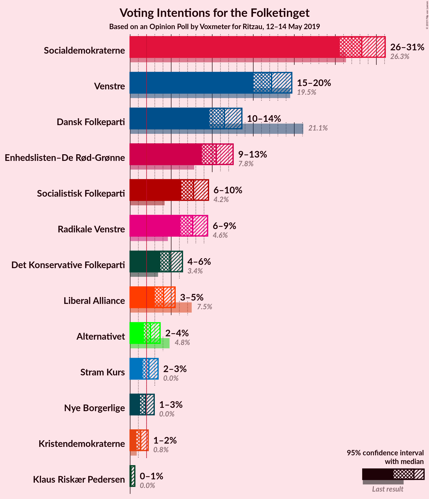

### Confidence Intervals

| Party | Last Result | Poll Result | 80% Confidence Interval | 90% Confidence Interval | 95% Confidence Interval | 99% Confidence Interval |
|:-----:|:-----------:|:-----------:|:-----------------------:|:-----------------------:|:-----------------------:|:-----------------------:|
| Socialdemokraterne | 26.3% | 28.2% | 26.4–30.1% |26.0–30.6% |25.5–31.1% |24.7–32.0% |
| Venstre | 19.5% | 17.2% | 15.8–18.8% |15.4–19.3% |15.0–19.7% |14.3–20.5% |
| Dansk Folkeparti | 21.1% | 11.5% | 10.3–12.9% |10.0–13.3% |9.7–13.6% |9.1–14.3% |
| Enhedslisten–De Rød-Grønne | 7.8% | 10.5% | 9.3–11.8% |9.0–12.2% |8.7–12.5% |8.2–13.2% |
| Socialistisk Folkeparti | 4.2% | 7.7% | 6.7–8.9% |6.5–9.3% |6.2–9.5% |5.8–10.1% |
| Radikale Venstre | 4.6% | 7.6% | 6.6–8.8% |6.4–9.1% |6.1–9.4% |5.7–10.0% |
| Det Konservative Folkeparti | 3.4% | 4.9% | 4.1–5.8% |3.9–6.1% |3.7–6.4% |3.4–6.9% |
| Liberal Alliance | 7.5% | 4.1% | 3.4–5.0% |3.2–5.2% |3.0–5.5% |2.7–5.9% |
| Alternativet | 4.8% | 2.5% | 2.0–3.2% |1.8–3.4% |1.7–3.6% |1.5–4.0% |
| Stram Kurs | 0.0% | 2.3% | 1.8–3.0% |1.6–3.2% |1.5–3.4% |1.3–3.8% |
| Nye Borgerlige | 0.0% | 1.9% | 1.4–2.6% |1.3–2.8% |1.2–2.9% |1.0–3.3% |
| Kristendemokraterne | 0.8% | 1.3% | 0.9–1.9% |0.8–2.0% |0.7–2.2% |0.6–2.5% |
| Klaus Riskær Pedersen | 0.0% | 0.1% | 0.0–0.4% |0.0–0.5% |0.0–0.6% |0.0–0.7% |

*Note:* The poll result column reflects the actual value used in the calculations. Published results may vary slightly, and in addition be rounded to fewer digits.

## Seats

### Confidence Intervals

| Party | Last Result | Median | 80% Confidence Interval | 90% Confidence Interval | 95% Confidence Interval | 99% Confidence Interval |
|:-----:|:-----------:|:------:|:-----------------------:|:-----------------------:|:-----------------------:|:-----------------------:|
| <a href="#socialdemokraterne">Socialdemokraterne</a> | 47 | 51 | 48–52 |45–52 |45–53 |43–55 |
| <a href="#venstre">Venstre</a> | 34 | 29 | 28–36 |27–36 |26–36 |25–37 |
| <a href="#dansk-folkeparti">Dansk Folkeparti</a> | 37 | 19 | 18–22 |18–23 |18–24 |17–25 |
| <a href="#enhedslisten–de-rød-grønne">Enhedslisten–De Rød-Grønne</a> | 14 | 19 | 16–22 |16–23 |16–23 |15–23 |
| <a href="#socialistisk-folkeparti">Socialistisk Folkeparti</a> | 7 | 15 | 13–16 |12–17 |11–17 |10–18 |
| <a href="#radikale-venstre">Radikale Venstre</a> | 8 | 12 | 11–17 |11–17 |11–17 |11–19 |
| <a href="#det-konservative-folkeparti">Det Konservative Folkeparti</a> | 6 | 10 | 8–10 |8–10 |7–11 |6–12 |
| <a href="#liberal-alliance">Liberal Alliance</a> | 13 | 8 | 6–8 |6–8 |6–9 |5–11 |
| <a href="#alternativet">Alternativet</a> | 9 | 6 | 4–6 |4–6 |0–6 |0–7 |
| <a href="#stram-kurs">Stram Kurs</a> | 0 | 4 | 0–5 |0–6 |0–6 |0–6 |
| <a href="#nye-borgerlige">Nye Borgerlige</a> | 0 | 4 | 0–4 |0–5 |0–5 |0–5 |
| <a href="#kristendemokraterne">Kristendemokraterne</a> | 0 | 0 | 0 |0–4 |0–4 |0–4 |
| <a href="#klaus-riskær-pedersen">Klaus Riskær Pedersen</a> | 0 | 0 | 0 |0 |0 |0 |

### Socialdemokraterne

*For a full overview of the results for this party, see the [Socialdemokraterne](party-socialdemokraterne.html) page.*

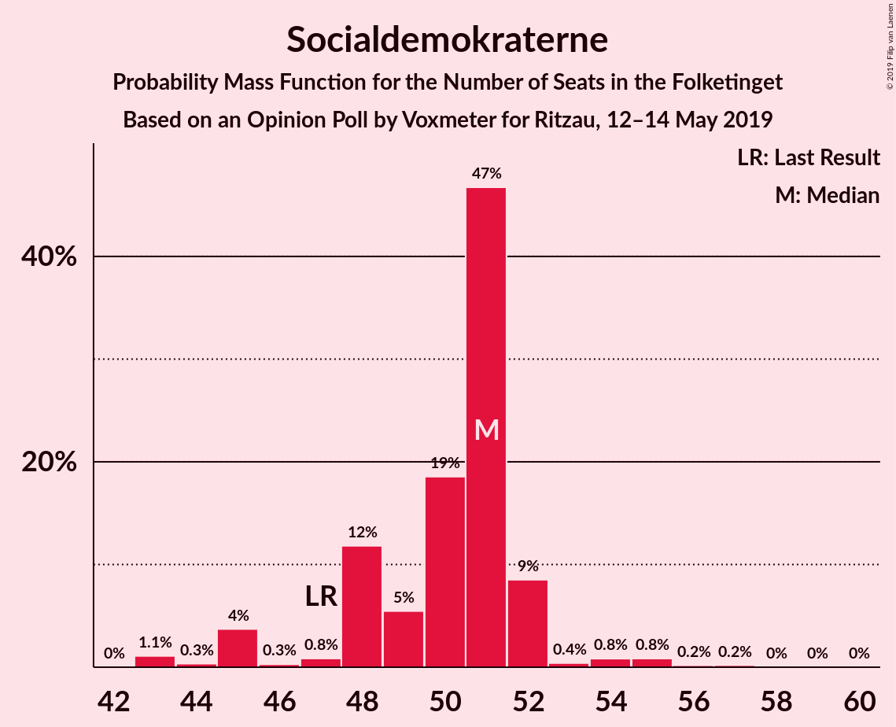

| Number of Seats | Probability | Accumulated | Special Marks |
|:---------------:|:-----------:|:-----------:|:-------------:|
| 43 | 1.1% | 100% |  |
| 44 | 0.3% | 98.9% |  |
| 45 | 4% | 98.5% |  |
| 46 | 0.3% | 95% |  |
| 47 | 0.8% | 95% | Last Result |
| 48 | 12% | 94% |  |
| 49 | 5% | 82% |  |
| 50 | 19% | 76% |  |
| 51 | 47% | 58% | Median |
| 52 | 9% | 11% |  |
| 53 | 0.4% | 3% |  |
| 54 | 0.8% | 2% |  |
| 55 | 0.8% | 1.3% |  |
| 56 | 0.2% | 0.5% |  |
| 57 | 0.2% | 0.3% |  |
| 58 | 0% | 0.1% |  |
| 59 | 0% | 0% |  |

### Venstre

*For a full overview of the results for this party, see the [Venstre](party-venstre.html) page.*

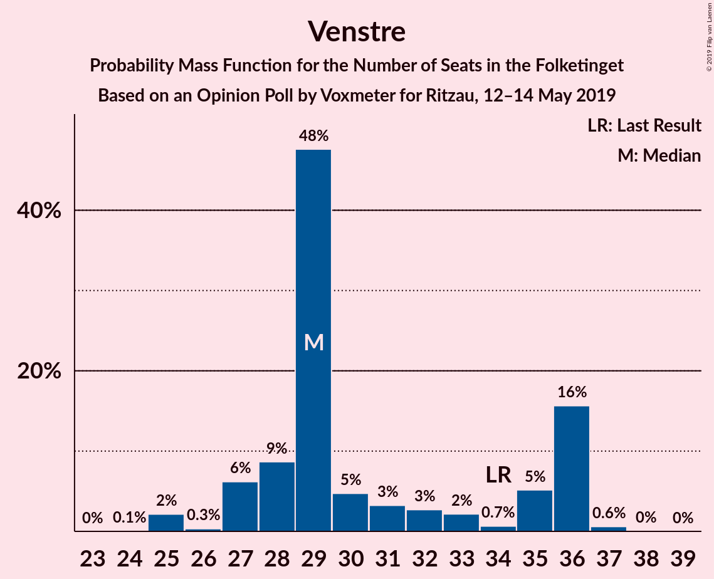

| Number of Seats | Probability | Accumulated | Special Marks |
|:---------------:|:-----------:|:-----------:|:-------------:|
| 24 | 0.1% | 100% |  |
| 25 | 2% | 99.9% |  |
| 26 | 0.3% | 98% |  |
| 27 | 6% | 97% |  |
| 28 | 9% | 91% |  |
| 29 | 48% | 83% | Median |
| 30 | 5% | 35% |  |
| 31 | 3% | 30% |  |
| 32 | 3% | 27% |  |
| 33 | 2% | 24% |  |
| 34 | 0.7% | 22% | Last Result |
| 35 | 5% | 21% |  |
| 36 | 16% | 16% |  |
| 37 | 0.6% | 0.7% |  |
| 38 | 0% | 0.1% |  |
| 39 | 0% | 0% |  |

### Dansk Folkeparti

*For a full overview of the results for this party, see the [Dansk Folkeparti](party-danskfolkeparti.html) page.*

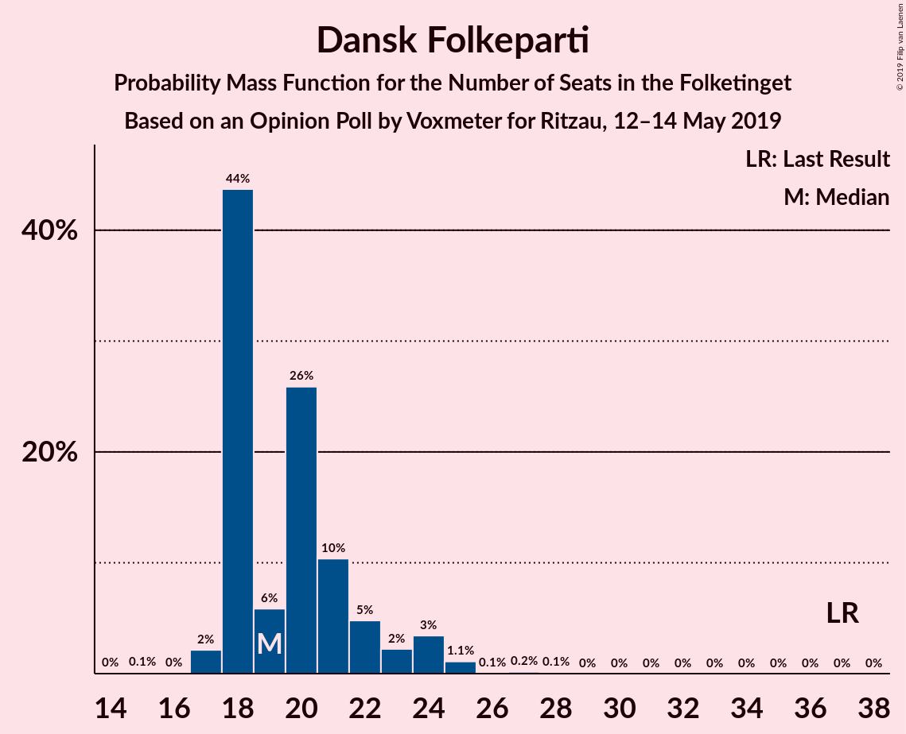

| Number of Seats | Probability | Accumulated | Special Marks |
|:---------------:|:-----------:|:-----------:|:-------------:|
| 15 | 0.1% | 100% |  |
| 16 | 0% | 99.9% |  |
| 17 | 2% | 99.9% |  |
| 18 | 44% | 98% |  |
| 19 | 6% | 54% | Median |
| 20 | 26% | 48% |  |
| 21 | 10% | 22% |  |
| 22 | 5% | 12% |  |
| 23 | 2% | 7% |  |
| 24 | 3% | 5% |  |
| 25 | 1.1% | 1.4% |  |
| 26 | 0.1% | 0.3% |  |
| 27 | 0.2% | 0.3% |  |
| 28 | 0.1% | 0.1% |  |
| 29 | 0% | 0% |  |
| 30 | 0% | 0% |  |
| 31 | 0% | 0% |  |
| 32 | 0% | 0% |  |
| 33 | 0% | 0% |  |
| 34 | 0% | 0% |  |
| 35 | 0% | 0% |  |
| 36 | 0% | 0% |  |
| 37 | 0% | 0% | Last Result |

### Enhedslisten–De Rød-Grønne

*For a full overview of the results for this party, see the [Enhedslisten–De Rød-Grønne](party-enhedslisten–derød-grønne.html) page.*

| Number of Seats | Probability | Accumulated | Special Marks |
|:---------------:|:-----------:|:-----------:|:-------------:|
| 14 | 0.2% | 100% | Last Result |
| 15 | 1.5% | 99.7% |  |
| 16 | 18% | 98% |  |
| 17 | 7% | 80% |  |
| 18 | 2% | 73% |  |
| 19 | 50% | 71% | Median |
| 20 | 2% | 21% |  |
| 21 | 7% | 19% |  |
| 22 | 3% | 12% |  |
| 23 | 9% | 10% |  |
| 24 | 0.1% | 0.3% |  |
| 25 | 0.1% | 0.2% |  |
| 26 | 0% | 0% |  |

### Socialistisk Folkeparti

*For a full overview of the results for this party, see the [Socialistisk Folkeparti](party-socialistiskfolkeparti.html) page.*

| Number of Seats | Probability | Accumulated | Special Marks |
|:---------------:|:-----------:|:-----------:|:-------------:|
| 7 | 0% | 100% | Last Result |
| 8 | 0% | 100% |  |
| 9 | 0.4% | 100% |  |
| 10 | 0.3% | 99.6% |  |
| 11 | 2% | 99.3% |  |
| 12 | 4% | 97% |  |
| 13 | 5% | 94% |  |
| 14 | 26% | 89% |  |
| 15 | 45% | 63% | Median |
| 16 | 12% | 18% |  |
| 17 | 5% | 5% |  |
| 18 | 0.2% | 0.6% |  |
| 19 | 0.4% | 0.4% |  |
| 20 | 0% | 0% |  |

### Radikale Venstre

*For a full overview of the results for this party, see the [Radikale Venstre](party-radikalevenstre.html) page.*

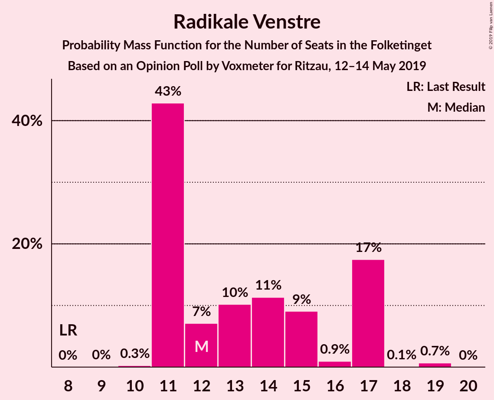

| Number of Seats | Probability | Accumulated | Special Marks |
|:---------------:|:-----------:|:-----------:|:-------------:|
| 8 | 0% | 100% | Last Result |
| 9 | 0% | 100% |  |
| 10 | 0.3% | 100% |  |
| 11 | 43% | 99.7% |  |
| 12 | 7% | 57% | Median |
| 13 | 10% | 50% |  |
| 14 | 11% | 40% |  |
| 15 | 9% | 28% |  |
| 16 | 0.9% | 19% |  |
| 17 | 17% | 18% |  |
| 18 | 0.1% | 0.8% |  |
| 19 | 0.7% | 0.7% |  |
| 20 | 0% | 0% |  |

### Det Konservative Folkeparti

*For a full overview of the results for this party, see the [Det Konservative Folkeparti](party-detkonservativefolkeparti.html) page.*

| Number of Seats | Probability | Accumulated | Special Marks |
|:---------------:|:-----------:|:-----------:|:-------------:|
| 5 | 0.1% | 100% |  |
| 6 | 0.5% | 99.9% | Last Result |
| 7 | 2% | 99.4% |  |
| 8 | 33% | 97% |  |
| 9 | 13% | 64% |  |
| 10 | 47% | 51% | Median |
| 11 | 3% | 4% |  |
| 12 | 0.7% | 0.9% |  |
| 13 | 0.2% | 0.3% |  |
| 14 | 0% | 0% |  |

### Liberal Alliance

*For a full overview of the results for this party, see the [Liberal Alliance](party-liberalalliance.html) page.*

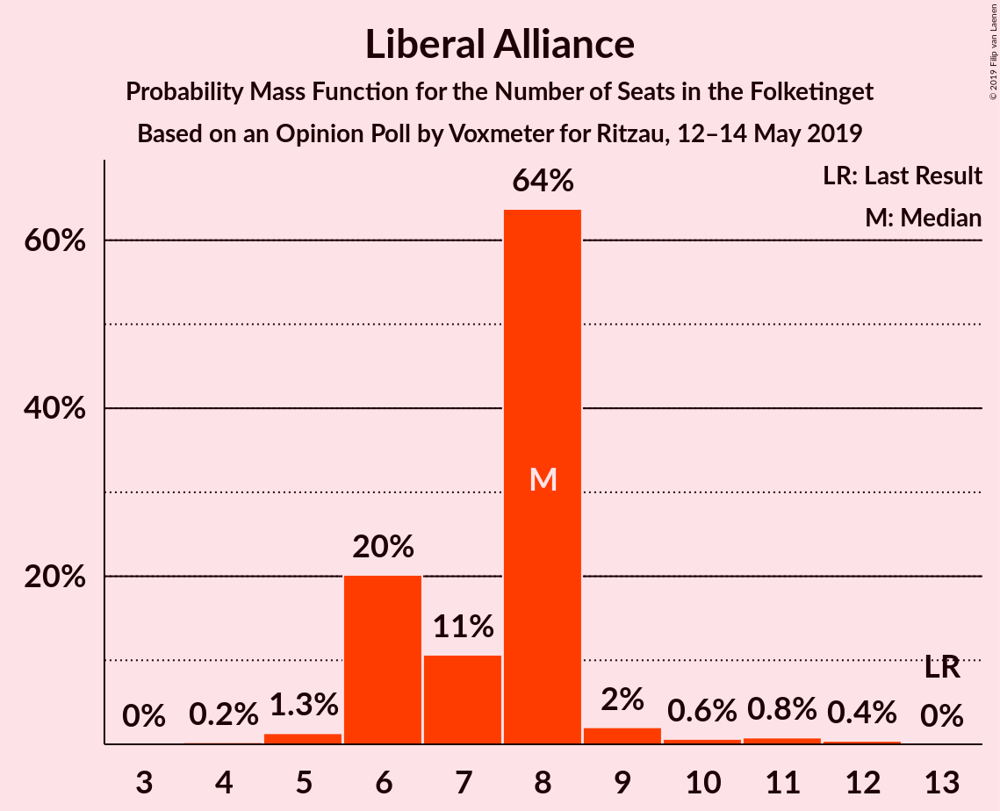

| Number of Seats | Probability | Accumulated | Special Marks |
|:---------------:|:-----------:|:-----------:|:-------------:|
| 4 | 0.2% | 100% |  |
| 5 | 1.3% | 99.8% |  |
| 6 | 20% | 98% |  |
| 7 | 11% | 78% |  |
| 8 | 64% | 68% | Median |
| 9 | 2% | 4% |  |
| 10 | 0.6% | 2% |  |
| 11 | 0.8% | 1.2% |  |
| 12 | 0.4% | 0.4% |  |
| 13 | 0% | 0% | Last Result |

### Alternativet

*For a full overview of the results for this party, see the [Alternativet](party-alternativet.html) page.*

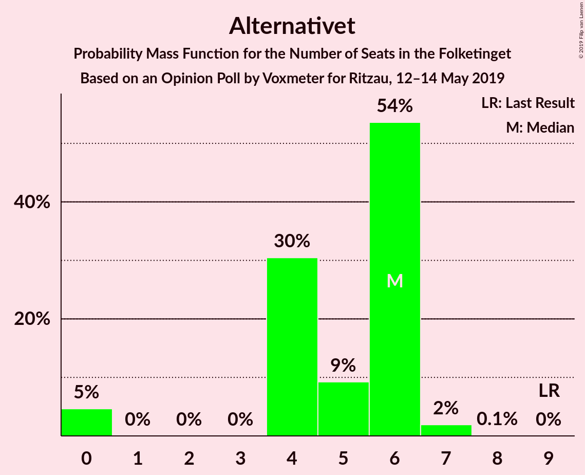

| Number of Seats | Probability | Accumulated | Special Marks |
|:---------------:|:-----------:|:-----------:|:-------------:|
| 0 | 5% | 100% |  |
| 1 | 0% | 95% |  |
| 2 | 0% | 95% |  |
| 3 | 0% | 95% |  |
| 4 | 30% | 95% |  |
| 5 | 9% | 65% |  |
| 6 | 54% | 56% | Median |
| 7 | 2% | 2% |  |
| 8 | 0.1% | 0.1% |  |
| 9 | 0% | 0% | Last Result |

### Stram Kurs

*For a full overview of the results for this party, see the [Stram Kurs](party-stramkurs.html) page.*

| Number of Seats | Probability | Accumulated | Special Marks |
|:---------------:|:-----------:|:-----------:|:-------------:|
| 0 | 11% | 100% | Last Result |
| 1 | 0% | 89% |  |
| 2 | 0% | 89% |  |
| 3 | 0.1% | 89% |  |
| 4 | 71% | 88% | Median |
| 5 | 10% | 18% |  |
| 6 | 7% | 7% |  |
| 7 | 0.3% | 0.3% |  |
| 8 | 0.1% | 0.1% |  |
| 9 | 0% | 0% |  |

### Nye Borgerlige

*For a full overview of the results for this party, see the [Nye Borgerlige](party-nyeborgerlige.html) page.*

| Number of Seats | Probability | Accumulated | Special Marks |
|:---------------:|:-----------:|:-----------:|:-------------:|
| 0 | 42% | 100% | Last Result |
| 1 | 0% | 58% |  |
| 2 | 0% | 58% |  |
| 3 | 0% | 58% |  |
| 4 | 53% | 58% | Median |
| 5 | 5% | 5% |  |
| 6 | 0.3% | 0.3% |  |
| 7 | 0.1% | 0.1% |  |
| 8 | 0% | 0% |  |

### Kristendemokraterne

*For a full overview of the results for this party, see the [Kristendemokraterne](party-kristendemokraterne.html) page.*

| Number of Seats | Probability | Accumulated | Special Marks |
|:---------------:|:-----------:|:-----------:|:-------------:|
| 0 | 91% | 100% | Last Result, Median |
| 1 | 0% | 9% |  |
| 2 | 0% | 9% |  |
| 3 | 0% | 9% |  |
| 4 | 8% | 9% |  |
| 5 | 0.4% | 0.4% |  |
| 6 | 0% | 0% |  |

### Klaus Riskær Pedersen

*For a full overview of the results for this party, see the [Klaus Riskær Pedersen](party-klausriskærpedersen.html) page.*

| Number of Seats | Probability | Accumulated | Special Marks |
|:---------------:|:-----------:|:-----------:|:-------------:|
| 0 | 100% | 100% | Last Result, Median |

## Coalitions

### Confidence Intervals

| Coalition | Last Result | Median | Majority? | 80% Confidence Interval | 90% Confidence Interval | 95% Confidence Interval | 99% Confidence Interval |
|:---------:|:-----------:|:------:|:---------:|:-----------------------:|:-----------------------:|:-----------------------:|:-----------------------:|
| Socialdemokraterne – Enhedslisten–De Rød-Grønne – Socialistisk Folkeparti – Radikale Venstre – Alternativet | 85 | 102 | 100% | 99–106 | 97–107 | 96–108 | 95–108 |
| Socialdemokraterne – Enhedslisten–De Rød-Grønne – Socialistisk Folkeparti – Radikale Venstre | 76 | 96 | 99.8% | 94–101 | 92–101 | 92–102 | 90–103 |
| Socialdemokraterne – Enhedslisten–De Rød-Grønne – Socialistisk Folkeparti – Alternativet | 77 | 91 | 58% | 84–92 | 83–92 | 82–92 | 81–94 |
| Socialdemokraterne – Enhedslisten–De Rød-Grønne – Socialistisk Folkeparti | 68 | 85 | 0.2% | 80–86 | 78–88 | 78–88 | 77–89 |
| Socialdemokraterne – Socialistisk Folkeparti – Radikale Venstre | 62 | 77 | 0% | 75–81 | 74–82 | 73–82 | 71–84 |
| Venstre – Dansk Folkeparti – Det Konservative Folkeparti – Liberal Alliance – Stram Kurs – Nye Borgerlige – Kristendemokraterne – Klaus Riskær Pedersen | 90 | 73 | 0% | 69–76 | 68–78 | 67–79 | 67–80 |
| Venstre – Dansk Folkeparti – Det Konservative Folkeparti – Liberal Alliance – Nye Borgerlige – Kristendemokraterne – Klaus Riskær Pedersen | 90 | 69 | 0% | 68–73 | 64–75 | 63–76 | 62–77 |
| Venstre – Dansk Folkeparti – Det Konservative Folkeparti – Liberal Alliance – Nye Borgerlige – Klaus Riskær Pedersen | 90 | 69 | 0% | 64–71 | 64–74 | 63–76 | 62–77 |
| Venstre – Dansk Folkeparti – Det Konservative Folkeparti – Liberal Alliance – Nye Borgerlige – Kristendemokraterne | 90 | 69 | 0% | 68–73 | 64–75 | 63–76 | 62–77 |
| Venstre – Dansk Folkeparti – Det Konservative Folkeparti – Liberal Alliance – Nye Borgerlige | 90 | 69 | 0% | 64–71 | 64–74 | 63–76 | 62–77 |
| Venstre – Dansk Folkeparti – Det Konservative Folkeparti – Liberal Alliance – Kristendemokraterne | 90 | 65 | 0% | 64–70 | 64–71 | 62–72 | 62–75 |
| Venstre – Dansk Folkeparti – Det Konservative Folkeparti – Liberal Alliance | 90 | 65 | 0% | 64–70 | 64–71 | 62–72 | 61–75 |
| Socialdemokraterne – Radikale Venstre | 55 | 62 | 0% | 60–67 | 59–67 | 59–68 | 57–70 |
| Venstre – Det Konservative Folkeparti – Liberal Alliance | 53 | 47 | 0% | 44–50 | 43–51 | 42–51 | 40–52 |
| Venstre – Det Konservative Folkeparti | 40 | 39 | 0% | 36–44 | 35–44 | 35–44 | 33–46 |
| Venstre | 34 | 29 | 0% | 28–36 | 27–36 | 26–36 | 25–37 |

### Socialdemokraterne – Enhedslisten–De Rød-Grønne – Socialistisk Folkeparti – Radikale Venstre – Alternativet

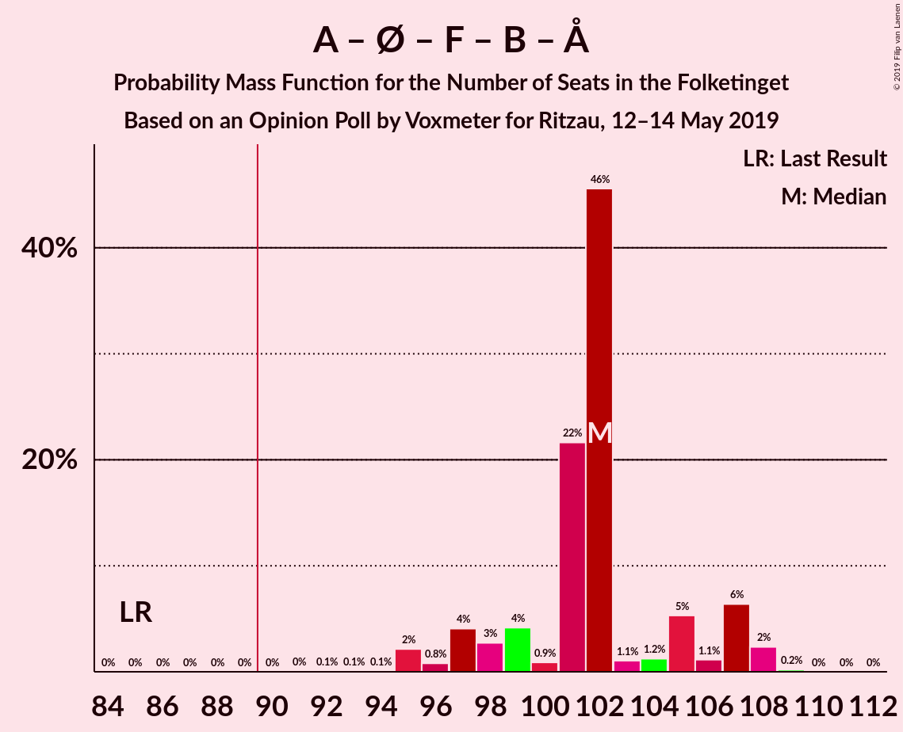

| Number of Seats | Probability | Accumulated | Special Marks |
|:---------------:|:-----------:|:-----------:|:-------------:|
| 85 | 0% | 100% | Last Result |
| 86 | 0% | 100% |  |
| 87 | 0% | 100% |  |
| 88 | 0% | 100% |  |
| 89 | 0% | 100% |  |
| 90 | 0% | 100% | Majority |
| 91 | 0% | 100% |  |
| 92 | 0.1% | 100% |  |
| 93 | 0.1% | 99.9% |  |
| 94 | 0.1% | 99.8% |  |
| 95 | 2% | 99.8% |  |
| 96 | 0.8% | 98% |  |
| 97 | 4% | 97% |  |
| 98 | 3% | 93% |  |
| 99 | 4% | 90% |  |
| 100 | 0.9% | 86% |  |
| 101 | 22% | 85% |  |
| 102 | 46% | 63% |  |
| 103 | 1.1% | 18% | Median |
| 104 | 1.2% | 17% |  |
| 105 | 5% | 15% |  |
| 106 | 1.1% | 10% |  |
| 107 | 6% | 9% |  |
| 108 | 2% | 3% |  |
| 109 | 0.2% | 0.3% |  |
| 110 | 0% | 0.1% |  |
| 111 | 0% | 0% |  |

### Socialdemokraterne – Enhedslisten–De Rød-Grønne – Socialistisk Folkeparti – Radikale Venstre

| Number of Seats | Probability | Accumulated | Special Marks |
|:---------------:|:-----------:|:-----------:|:-------------:|
| 76 | 0% | 100% | Last Result |
| 77 | 0% | 100% |  |
| 78 | 0% | 100% |  |
| 79 | 0% | 100% |  |
| 80 | 0% | 100% |  |
| 81 | 0% | 100% |  |
| 82 | 0% | 100% |  |
| 83 | 0% | 100% |  |
| 84 | 0% | 100% |  |
| 85 | 0% | 100% |  |
| 86 | 0% | 100% |  |
| 87 | 0% | 100% |  |
| 88 | 0% | 100% |  |
| 89 | 0.1% | 99.9% |  |
| 90 | 1.2% | 99.8% | Majority |
| 91 | 0.2% | 98.6% |  |
| 92 | 4% | 98% |  |
| 93 | 0.7% | 94% |  |
| 94 | 4% | 93% |  |
| 95 | 2% | 89% |  |
| 96 | 47% | 88% |  |
| 97 | 21% | 41% | Median |
| 98 | 0.4% | 20% |  |
| 99 | 3% | 20% |  |
| 100 | 2% | 17% |  |
| 101 | 12% | 15% |  |
| 102 | 0.7% | 3% |  |
| 103 | 2% | 2% |  |
| 104 | 0.1% | 0.2% |  |
| 105 | 0% | 0.1% |  |
| 106 | 0% | 0.1% |  |
| 107 | 0% | 0.1% |  |
| 108 | 0% | 0% |  |

### Socialdemokraterne – Enhedslisten–De Rød-Grønne – Socialistisk Folkeparti – Alternativet

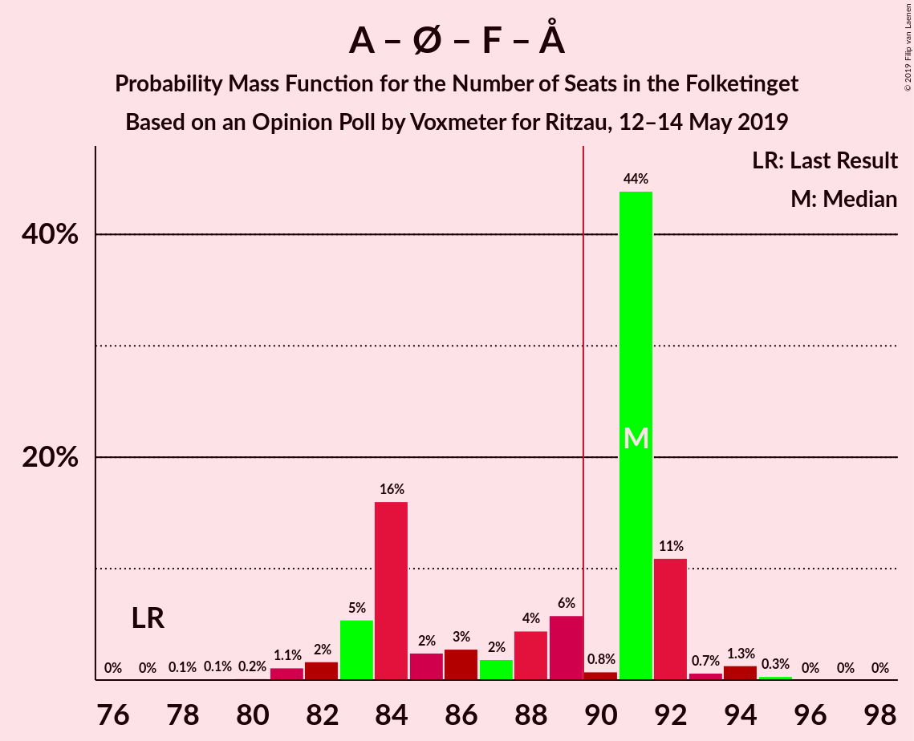

| Number of Seats | Probability | Accumulated | Special Marks |
|:---------------:|:-----------:|:-----------:|:-------------:|
| 77 | 0% | 100% | Last Result |
| 78 | 0.1% | 100% |  |
| 79 | 0.1% | 99.9% |  |
| 80 | 0.2% | 99.8% |  |
| 81 | 1.1% | 99.6% |  |
| 82 | 2% | 98.5% |  |
| 83 | 5% | 97% |  |
| 84 | 16% | 91% |  |
| 85 | 2% | 75% |  |
| 86 | 3% | 73% |  |
| 87 | 2% | 70% |  |
| 88 | 4% | 68% |  |
| 89 | 6% | 64% |  |
| 90 | 0.8% | 58% | Majority |
| 91 | 44% | 57% | Median |
| 92 | 11% | 13% |  |
| 93 | 0.7% | 2% |  |
| 94 | 1.3% | 2% |  |
| 95 | 0.3% | 0.4% |  |
| 96 | 0% | 0.1% |  |
| 97 | 0% | 0% |  |

### Socialdemokraterne – Enhedslisten–De Rød-Grønne – Socialistisk Folkeparti

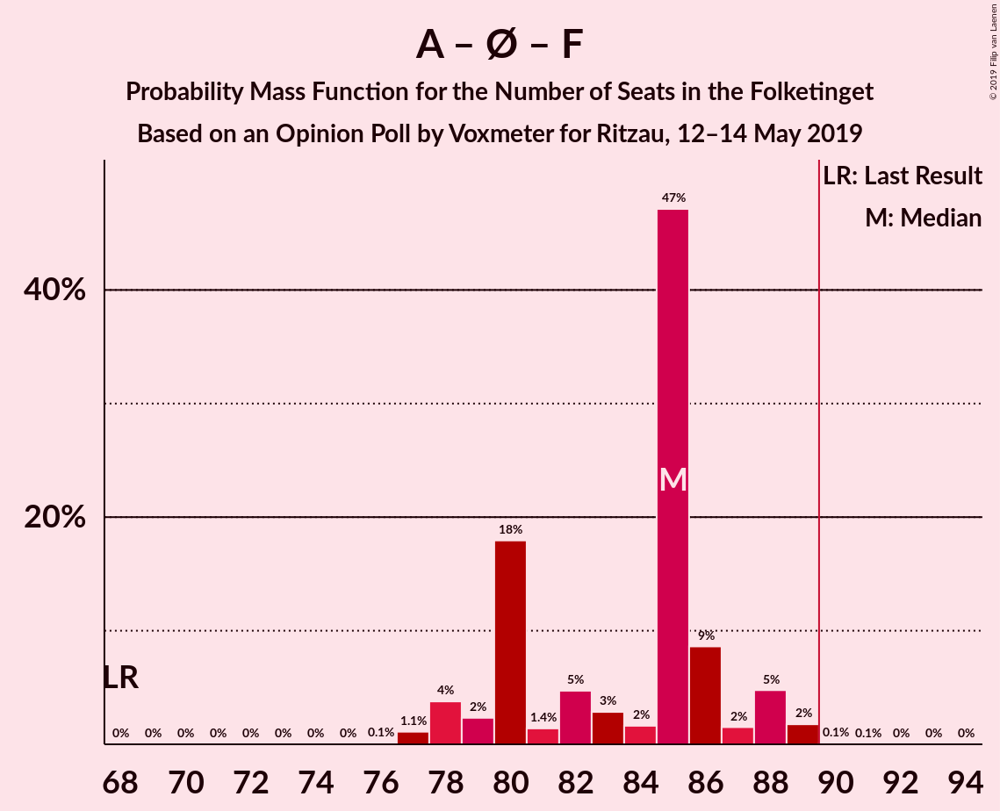

| Number of Seats | Probability | Accumulated | Special Marks |
|:---------------:|:-----------:|:-----------:|:-------------:|
| 68 | 0% | 100% | Last Result |
| 69 | 0% | 100% |  |
| 70 | 0% | 100% |  |
| 71 | 0% | 100% |  |
| 72 | 0% | 100% |  |
| 73 | 0% | 100% |  |
| 74 | 0% | 100% |  |
| 75 | 0% | 99.9% |  |
| 76 | 0.1% | 99.9% |  |
| 77 | 1.1% | 99.8% |  |
| 78 | 4% | 98.7% |  |
| 79 | 2% | 95% |  |
| 80 | 18% | 93% |  |
| 81 | 1.4% | 75% |  |
| 82 | 5% | 73% |  |
| 83 | 3% | 68% |  |
| 84 | 2% | 66% |  |
| 85 | 47% | 64% | Median |
| 86 | 9% | 17% |  |
| 87 | 2% | 8% |  |
| 88 | 5% | 7% |  |
| 89 | 2% | 2% |  |
| 90 | 0.1% | 0.2% | Majority |
| 91 | 0.1% | 0.1% |  |
| 92 | 0% | 0.1% |  |
| 93 | 0% | 0.1% |  |
| 94 | 0% | 0% |  |

### Socialdemokraterne – Socialistisk Folkeparti – Radikale Venstre

| Number of Seats | Probability | Accumulated | Special Marks |
|:---------------:|:-----------:|:-----------:|:-------------:|
| 62 | 0% | 100% | Last Result |
| 63 | 0% | 100% |  |
| 64 | 0% | 100% |  |
| 65 | 0% | 100% |  |
| 66 | 0% | 100% |  |
| 67 | 0.1% | 100% |  |
| 68 | 0.1% | 99.9% |  |
| 69 | 0.1% | 99.9% |  |
| 70 | 0.3% | 99.8% |  |
| 71 | 0.2% | 99.5% |  |
| 72 | 1.1% | 99.3% |  |
| 73 | 1.4% | 98% |  |
| 74 | 5% | 97% |  |
| 75 | 5% | 92% |  |
| 76 | 1.2% | 87% |  |
| 77 | 46% | 86% |  |
| 78 | 10% | 40% | Median |
| 79 | 4% | 30% |  |
| 80 | 2% | 27% |  |
| 81 | 16% | 24% |  |
| 82 | 6% | 8% |  |
| 83 | 0.7% | 2% |  |
| 84 | 1.2% | 2% |  |
| 85 | 0.4% | 0.5% |  |
| 86 | 0% | 0.1% |  |
| 87 | 0% | 0% |  |

### Venstre – Dansk Folkeparti – Det Konservative Folkeparti – Liberal Alliance – Stram Kurs – Nye Borgerlige – Kristendemokraterne – Klaus Riskær Pedersen

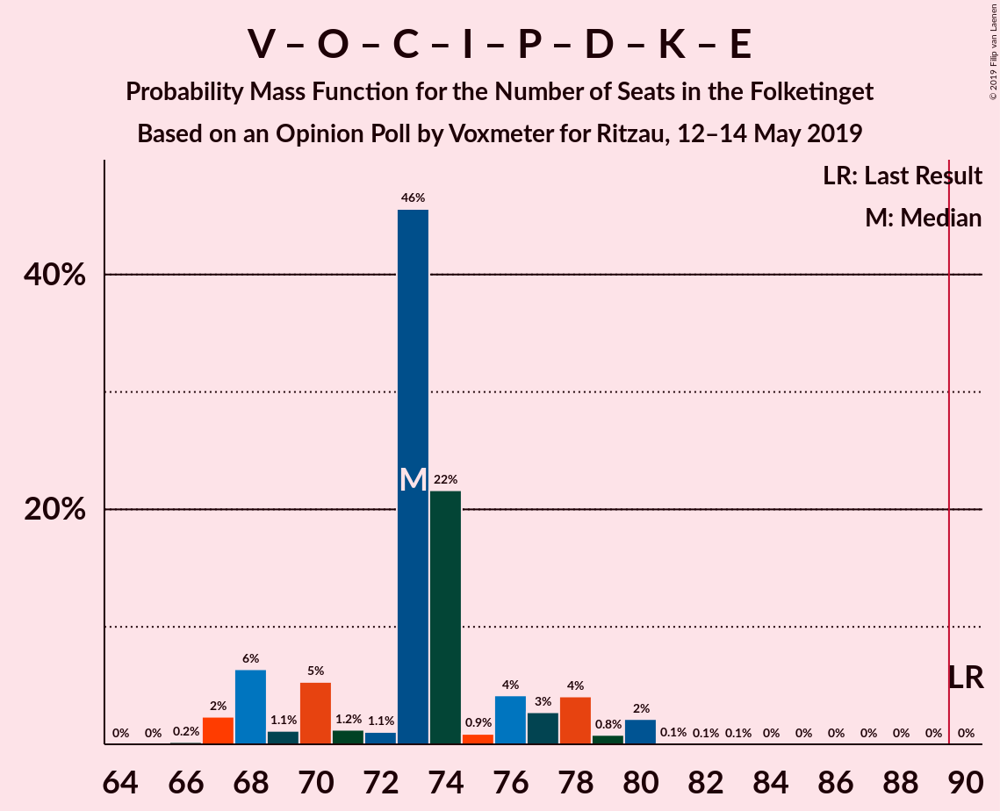

| Number of Seats | Probability | Accumulated | Special Marks |
|:---------------:|:-----------:|:-----------:|:-------------:|
| 65 | 0% | 100% |  |
| 66 | 0.2% | 99.9% |  |
| 67 | 2% | 99.7% |  |
| 68 | 6% | 97% |  |
| 69 | 1.1% | 91% |  |
| 70 | 5% | 90% |  |
| 71 | 1.2% | 85% |  |
| 72 | 1.1% | 83% |  |
| 73 | 46% | 82% |  |
| 74 | 22% | 37% | Median |
| 75 | 0.9% | 15% |  |
| 76 | 4% | 14% |  |
| 77 | 3% | 10% |  |
| 78 | 4% | 7% |  |
| 79 | 0.8% | 3% |  |
| 80 | 2% | 2% |  |
| 81 | 0.1% | 0.2% |  |
| 82 | 0.1% | 0.2% |  |
| 83 | 0.1% | 0.1% |  |
| 84 | 0% | 0% |  |
| 85 | 0% | 0% |  |
| 86 | 0% | 0% |  |
| 87 | 0% | 0% |  |
| 88 | 0% | 0% |  |
| 89 | 0% | 0% |  |
| 90 | 0% | 0% | Last Result, Majority |

### Venstre – Dansk Folkeparti – Det Konservative Folkeparti – Liberal Alliance – Nye Borgerlige – Kristendemokraterne – Klaus Riskær Pedersen

| Number of Seats | Probability | Accumulated | Special Marks |
|:---------------:|:-----------:|:-----------:|:-------------:|
| 61 | 0.1% | 100% |  |
| 62 | 2% | 99.9% |  |
| 63 | 0.7% | 98% |  |
| 64 | 4% | 97% |  |
| 65 | 0.7% | 92% |  |
| 66 | 0.8% | 92% |  |
| 67 | 0.6% | 91% |  |
| 68 | 7% | 90% |  |
| 69 | 46% | 84% |  |
| 70 | 22% | 38% | Median |
| 71 | 3% | 16% |  |
| 72 | 2% | 13% |  |
| 73 | 5% | 11% |  |
| 74 | 0.6% | 6% |  |
| 75 | 2% | 5% |  |
| 76 | 1.3% | 3% |  |
| 77 | 2% | 2% |  |
| 78 | 0.1% | 0.2% |  |
| 79 | 0% | 0.1% |  |
| 80 | 0.1% | 0.1% |  |
| 81 | 0% | 0% |  |
| 82 | 0% | 0% |  |
| 83 | 0% | 0% |  |
| 84 | 0% | 0% |  |
| 85 | 0% | 0% |  |
| 86 | 0% | 0% |  |
| 87 | 0% | 0% |  |
| 88 | 0% | 0% |  |
| 89 | 0% | 0% |  |
| 90 | 0% | 0% | Last Result, Majority |

### Venstre – Dansk Folkeparti – Det Konservative Folkeparti – Liberal Alliance – Nye Borgerlige – Klaus Riskær Pedersen

| Number of Seats | Probability | Accumulated | Special Marks |
|:---------------:|:-----------:|:-----------:|:-------------:|
| 61 | 0.1% | 100% |  |
| 62 | 2% | 99.9% |  |
| 63 | 0.7% | 98% |  |
| 64 | 9% | 97% |  |
| 65 | 0.9% | 88% |  |
| 66 | 1.1% | 87% |  |
| 67 | 0.6% | 86% |  |
| 68 | 3% | 86% |  |
| 69 | 49% | 83% |  |
| 70 | 22% | 34% | Median |
| 71 | 3% | 12% |  |
| 72 | 2% | 9% |  |
| 73 | 1.3% | 7% |  |
| 74 | 0.5% | 5% |  |
| 75 | 1.4% | 5% |  |
| 76 | 1.2% | 3% |  |
| 77 | 2% | 2% |  |
| 78 | 0% | 0.2% |  |
| 79 | 0% | 0.1% |  |
| 80 | 0.1% | 0.1% |  |
| 81 | 0% | 0% |  |
| 82 | 0% | 0% |  |
| 83 | 0% | 0% |  |
| 84 | 0% | 0% |  |
| 85 | 0% | 0% |  |
| 86 | 0% | 0% |  |
| 87 | 0% | 0% |  |
| 88 | 0% | 0% |  |
| 89 | 0% | 0% |  |
| 90 | 0% | 0% | Last Result, Majority |

### Venstre – Dansk Folkeparti – Det Konservative Folkeparti – Liberal Alliance – Nye Borgerlige – Kristendemokraterne

| Number of Seats | Probability | Accumulated | Special Marks |
|:---------------:|:-----------:|:-----------:|:-------------:|
| 61 | 0.1% | 100% |  |
| 62 | 2% | 99.9% |  |
| 63 | 0.7% | 98% |  |
| 64 | 4% | 97% |  |
| 65 | 0.7% | 92% |  |
| 66 | 0.8% | 92% |  |
| 67 | 0.6% | 91% |  |
| 68 | 7% | 90% |  |
| 69 | 46% | 84% |  |
| 70 | 22% | 38% | Median |
| 71 | 3% | 16% |  |
| 72 | 2% | 13% |  |
| 73 | 5% | 11% |  |
| 74 | 0.6% | 6% |  |
| 75 | 2% | 5% |  |
| 76 | 1.3% | 3% |  |
| 77 | 2% | 2% |  |
| 78 | 0.1% | 0.2% |  |
| 79 | 0% | 0.1% |  |
| 80 | 0.1% | 0.1% |  |
| 81 | 0% | 0% |  |
| 82 | 0% | 0% |  |
| 83 | 0% | 0% |  |
| 84 | 0% | 0% |  |
| 85 | 0% | 0% |  |
| 86 | 0% | 0% |  |
| 87 | 0% | 0% |  |
| 88 | 0% | 0% |  |
| 89 | 0% | 0% |  |
| 90 | 0% | 0% | Last Result, Majority |

### Venstre – Dansk Folkeparti – Det Konservative Folkeparti – Liberal Alliance – Nye Borgerlige

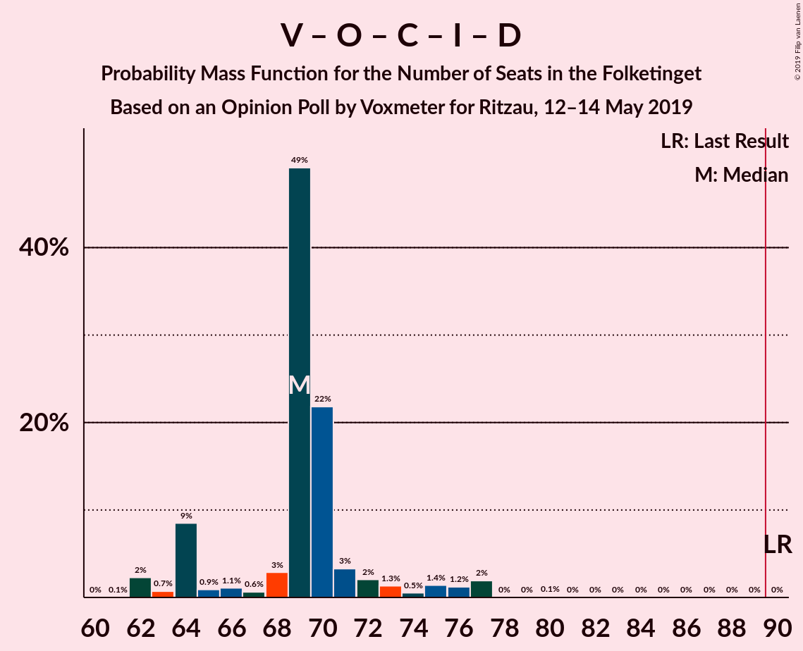

| Number of Seats | Probability | Accumulated | Special Marks |
|:---------------:|:-----------:|:-----------:|:-------------:|
| 61 | 0.1% | 100% |  |
| 62 | 2% | 99.9% |  |
| 63 | 0.7% | 98% |  |
| 64 | 9% | 97% |  |
| 65 | 0.9% | 88% |  |
| 66 | 1.1% | 87% |  |
| 67 | 0.6% | 86% |  |
| 68 | 3% | 86% |  |
| 69 | 49% | 83% |  |
| 70 | 22% | 34% | Median |
| 71 | 3% | 12% |  |
| 72 | 2% | 9% |  |
| 73 | 1.3% | 7% |  |
| 74 | 0.5% | 5% |  |
| 75 | 1.4% | 5% |  |
| 76 | 1.2% | 3% |  |
| 77 | 2% | 2% |  |
| 78 | 0% | 0.2% |  |
| 79 | 0% | 0.1% |  |
| 80 | 0.1% | 0.1% |  |
| 81 | 0% | 0% |  |
| 82 | 0% | 0% |  |
| 83 | 0% | 0% |  |
| 84 | 0% | 0% |  |
| 85 | 0% | 0% |  |
| 86 | 0% | 0% |  |
| 87 | 0% | 0% |  |
| 88 | 0% | 0% |  |
| 89 | 0% | 0% |  |
| 90 | 0% | 0% | Last Result, Majority |

### Venstre – Dansk Folkeparti – Det Konservative Folkeparti – Liberal Alliance – Kristendemokraterne

| Number of Seats | Probability | Accumulated | Special Marks |
|:---------------:|:-----------:|:-----------:|:-------------:|
| 58 | 0.1% | 100% |  |
| 59 | 0% | 99.9% |  |
| 60 | 0.1% | 99.9% |  |
| 61 | 0.2% | 99.8% |  |
| 62 | 2% | 99.6% |  |
| 63 | 1.0% | 97% |  |
| 64 | 7% | 96% |  |
| 65 | 43% | 90% |  |
| 66 | 1.2% | 47% | Median |
| 67 | 3% | 46% |  |
| 68 | 7% | 43% |  |
| 69 | 7% | 36% |  |
| 70 | 22% | 29% |  |
| 71 | 2% | 6% |  |
| 72 | 2% | 4% |  |
| 73 | 1.0% | 2% |  |
| 74 | 0.1% | 1.3% |  |
| 75 | 1.0% | 1.2% |  |
| 76 | 0% | 0.2% |  |
| 77 | 0.1% | 0.2% |  |
| 78 | 0% | 0.1% |  |
| 79 | 0% | 0.1% |  |
| 80 | 0.1% | 0.1% |  |
| 81 | 0% | 0% |  |
| 82 | 0% | 0% |  |
| 83 | 0% | 0% |  |
| 84 | 0% | 0% |  |
| 85 | 0% | 0% |  |
| 86 | 0% | 0% |  |
| 87 | 0% | 0% |  |
| 88 | 0% | 0% |  |
| 89 | 0% | 0% |  |
| 90 | 0% | 0% | Last Result, Majority |

### Venstre – Dansk Folkeparti – Det Konservative Folkeparti – Liberal Alliance

| Number of Seats | Probability | Accumulated | Special Marks |
|:---------------:|:-----------:|:-----------:|:-------------:|
| 58 | 0.1% | 100% |  |
| 59 | 0% | 99.9% |  |
| 60 | 0.3% | 99.8% |  |
| 61 | 0.2% | 99.5% |  |
| 62 | 2% | 99.3% |  |
| 63 | 1.0% | 97% |  |
| 64 | 11% | 96% |  |
| 65 | 46% | 85% |  |
| 66 | 2% | 39% | Median |
| 67 | 3% | 38% |  |
| 68 | 3% | 35% |  |
| 69 | 4% | 32% |  |
| 70 | 22% | 28% |  |
| 71 | 2% | 6% |  |
| 72 | 2% | 4% |  |
| 73 | 1.0% | 2% |  |
| 74 | 0.1% | 1.3% |  |
| 75 | 1.0% | 1.2% |  |
| 76 | 0% | 0.1% |  |
| 77 | 0% | 0.1% |  |
| 78 | 0% | 0% |  |
| 79 | 0% | 0% |  |
| 80 | 0% | 0% |  |
| 81 | 0% | 0% |  |
| 82 | 0% | 0% |  |
| 83 | 0% | 0% |  |
| 84 | 0% | 0% |  |
| 85 | 0% | 0% |  |
| 86 | 0% | 0% |  |
| 87 | 0% | 0% |  |
| 88 | 0% | 0% |  |
| 89 | 0% | 0% |  |
| 90 | 0% | 0% | Last Result, Majority |

### Socialdemokraterne – Radikale Venstre

| Number of Seats | Probability | Accumulated | Special Marks |
|:---------------:|:-----------:|:-----------:|:-------------:|
| 55 | 0.2% | 100% | Last Result |
| 56 | 0% | 99.8% |  |
| 57 | 1.2% | 99.8% |  |
| 58 | 0.4% | 98.6% |  |
| 59 | 4% | 98% |  |
| 60 | 5% | 94% |  |
| 61 | 7% | 89% |  |
| 62 | 43% | 83% |  |
| 63 | 6% | 40% | Median |
| 64 | 1.4% | 34% |  |
| 65 | 3% | 33% |  |
| 66 | 7% | 29% |  |
| 67 | 19% | 22% |  |
| 68 | 3% | 3% |  |
| 69 | 0.1% | 0.7% |  |
| 70 | 0.1% | 0.6% |  |
| 71 | 0.2% | 0.5% |  |
| 72 | 0.2% | 0.3% |  |
| 73 | 0% | 0% |  |

### Venstre – Det Konservative Folkeparti – Liberal Alliance

| Number of Seats | Probability | Accumulated | Special Marks |
|:---------------:|:-----------:|:-----------:|:-------------:|
| 39 | 0% | 100% |  |
| 40 | 2% | 99.9% |  |
| 41 | 0.1% | 98% |  |
| 42 | 1.4% | 98% |  |
| 43 | 5% | 96% |  |
| 44 | 5% | 91% |  |
| 45 | 6% | 86% |  |
| 46 | 4% | 81% |  |
| 47 | 47% | 77% | Median |
| 48 | 3% | 30% |  |
| 49 | 2% | 27% |  |
| 50 | 18% | 24% |  |
| 51 | 5% | 6% |  |
| 52 | 0.7% | 1.2% |  |
| 53 | 0.2% | 0.4% | Last Result |
| 54 | 0.1% | 0.2% |  |
| 55 | 0% | 0.1% |  |
| 56 | 0% | 0.1% |  |
| 57 | 0% | 0% |  |

### Venstre – Det Konservative Folkeparti

| Number of Seats | Probability | Accumulated | Special Marks |
|:---------------:|:-----------:|:-----------:|:-------------:|
| 33 | 2% | 100% |  |
| 34 | 0.1% | 98% |  |
| 35 | 5% | 98% |  |
| 36 | 6% | 93% |  |
| 37 | 6% | 87% |  |
| 38 | 4% | 81% |  |
| 39 | 47% | 77% | Median |
| 40 | 3% | 31% | Last Result |
| 41 | 2% | 28% |  |
| 42 | 3% | 26% |  |
| 43 | 1.1% | 23% |  |
| 44 | 21% | 21% |  |
| 45 | 0.2% | 0.9% |  |
| 46 | 0.6% | 0.7% |  |
| 47 | 0.1% | 0.1% |  |
| 48 | 0% | 0.1% |  |
| 49 | 0% | 0% |  |

### Venstre

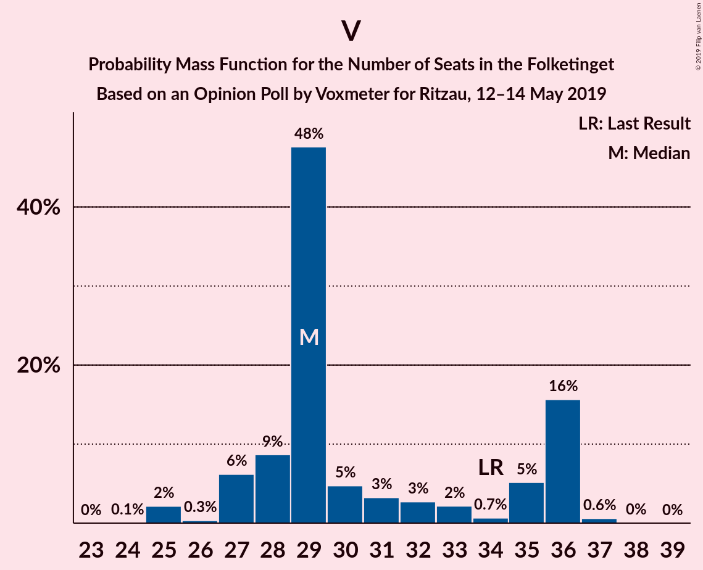

| Number of Seats | Probability | Accumulated | Special Marks |
|:---------------:|:-----------:|:-----------:|:-------------:|
| 24 | 0.1% | 100% |  |
| 25 | 2% | 99.9% |  |
| 26 | 0.3% | 98% |  |
| 27 | 6% | 97% |  |
| 28 | 9% | 91% |  |
| 29 | 48% | 83% | Median |
| 30 | 5% | 35% |  |
| 31 | 3% | 30% |  |
| 32 | 3% | 27% |  |
| 33 | 2% | 24% |  |
| 34 | 0.7% | 22% | Last Result |
| 35 | 5% | 21% |  |
| 36 | 16% | 16% |  |
| 37 | 0.6% | 0.7% |  |
| 38 | 0% | 0.1% |  |
| 39 | 0% | 0% |  |

## Technical Information

### Opinion Poll

+ **Polling firm:** Voxmeter
+ **Commissioner(s):** Ritzau
+ **Fieldwork period:** 12–14 May 2019

### Calculations

+ **Sample size:** 1010
+ **Simulations done:** 1,048,576
+ **Error estimate:** 3.48%

