# Opinion Poll by Voxmeter for Ritzau, 13–15 May 2019

<a href="#voting-intentions">Voting Intentions</a> | <a href="#seats">Seats</a> | <a href="#coalitions">Coalitions</a> | <a href="#technical-information">Technical Information</a>

## Voting Intentions

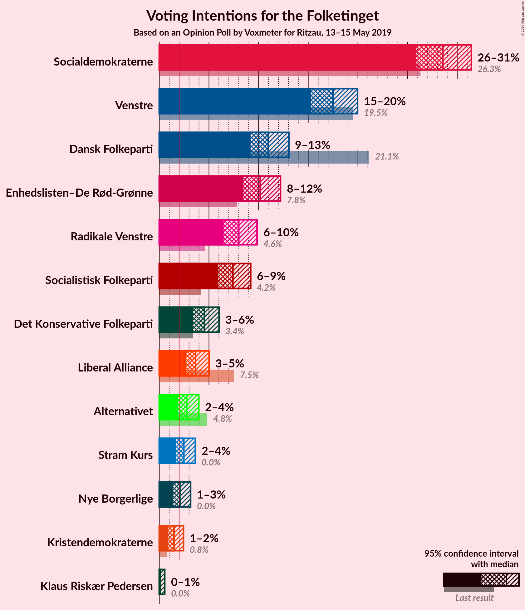

### Confidence Intervals

| Party | Last Result | Poll Result | 80% Confidence Interval | 90% Confidence Interval | 95% Confidence Interval | 99% Confidence Interval |
|:-----:|:-----------:|:-----------:|:-----------------------:|:-----------------------:|:-----------------------:|:-----------------------:|
| Socialdemokraterne | 26.3% | 28.6% | 26.8–30.4% |26.3–31.0% |25.8–31.4% |25.0–32.3% |
| Venstre | 19.5% | 17.5% | 16.0–19.1% |15.6–19.6% |15.3–20.0% |14.6–20.8% |
| Dansk Folkeparti | 21.1% | 11.0% | 9.8–12.3% |9.5–12.7% |9.2–13.0% |8.7–13.7% |
| Enhedslisten–De Rød-Grønne | 7.8% | 10.2% | 9.1–11.5% |8.7–11.9% |8.5–12.2% |7.9–12.9% |
| Radikale Venstre | 4.6% | 8.0% | 7.0–9.2% |6.7–9.5% |6.5–9.8% |6.0–10.5% |
| Socialistisk Folkeparti | 4.2% | 7.4% | 6.4–8.6% |6.2–8.9% |5.9–9.2% |5.5–9.8% |
| Det Konservative Folkeparti | 3.4% | 4.5% | 3.8–5.5% |3.6–5.8% |3.4–6.0% |3.1–6.5% |
| Liberal Alliance | 7.5% | 3.7% | 3.0–4.5% |2.8–4.8% |2.7–5.0% |2.4–5.5% |
| Alternativet | 4.8% | 2.8% | 2.2–3.6% |2.0–3.8% |1.9–4.0% |1.7–4.4% |
| Stram Kurs | 0.0% | 2.5% | 2.0–3.2% |1.8–3.4% |1.7–3.6% |1.4–4.0% |
| Nye Borgerlige | 0.0% | 2.1% | 1.6–2.8% |1.5–3.0% |1.4–3.2% |1.2–3.5% |
| Kristendemokraterne | 0.8% | 1.5% | 1.1–2.1% |1.0–2.3% |0.9–2.4% |0.7–2.8% |
| Klaus Riskær Pedersen | 0.0% | 0.1% | 0.0–0.4% |0.0–0.5% |0.0–0.5% |0.0–0.7% |

*Note:* The poll result column reflects the actual value used in the calculations. Published results may vary slightly, and in addition be rounded to fewer digits.

## Seats

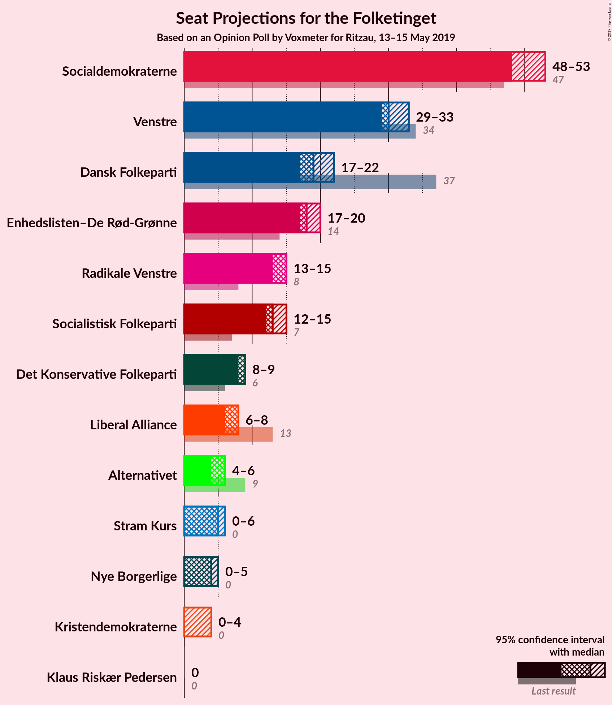

### Confidence Intervals

| Party | Last Result | Median | 80% Confidence Interval | 90% Confidence Interval | 95% Confidence Interval | 99% Confidence Interval |
|:-----:|:-----------:|:------:|:-----------------------:|:-----------------------:|:-----------------------:|:-----------------------:|
| <a href="#socialdemokraterne">Socialdemokraterne</a> | 47 | 48 | 48 |48–52 |48–53 |45–56 |
| <a href="#venstre">Venstre</a> | 34 | 30 | 30 |30–31 |29–33 |27–35 |
| <a href="#dansk-folkeparti">Dansk Folkeparti</a> | 37 | 19 | 19 |19 |17–22 |16–24 |
| <a href="#enhedslisten–de-rød-grønne">Enhedslisten–De Rød-Grønne</a> | 14 | 18 | 18 |17–19 |17–20 |15–22 |
| <a href="#radikale-venstre">Radikale Venstre</a> | 8 | 15 | 15 |14–15 |13–15 |12–16 |
| <a href="#socialistisk-folkeparti">Socialistisk Folkeparti</a> | 7 | 13 | 13 |13–14 |12–15 |11–17 |
| <a href="#det-konservative-folkeparti">Det Konservative Folkeparti</a> | 6 | 9 | 9 |8–9 |8–9 |6–12 |
| <a href="#liberal-alliance">Liberal Alliance</a> | 13 | 8 | 8 |7–8 |6–8 |5–9 |
| <a href="#alternativet">Alternativet</a> | 9 | 6 | 6 |5–6 |4–6 |0–7 |
| <a href="#stram-kurs">Stram Kurs</a> | 0 | 5 | 5 |4–5 |0–6 |0–6 |
| <a href="#nye-borgerlige">Nye Borgerlige</a> | 0 | 4 | 4 |0–4 |0–5 |0–6 |
| <a href="#kristendemokraterne">Kristendemokraterne</a> | 0 | 0 | 0 |0 |0–4 |0–5 |
| <a href="#klaus-riskær-pedersen">Klaus Riskær Pedersen</a> | 0 | 0 | 0 |0 |0 |0 |

### Socialdemokraterne

*For a full overview of the results for this party, see the [Socialdemokraterne](party-socialdemokraterne.html) page.*

| Number of Seats | Probability | Accumulated | Special Marks |
|:---------------:|:-----------:|:-----------:|:-------------:|
| 44 | 0.4% | 100% |  |
| 45 | 0.5% | 99.5% |  |
| 46 | 0.2% | 99.1% |  |
| 47 | 0.6% | 98.9% | Last Result |
| 48 | 90% | 98% | Median |
| 49 | 1.0% | 8% |  |
| 50 | 0.4% | 8% |  |
| 51 | 0.7% | 7% |  |
| 52 | 2% | 6% |  |
| 53 | 3% | 5% |  |
| 54 | 1.1% | 2% |  |
| 55 | 0.2% | 1.1% |  |
| 56 | 0.7% | 0.9% |  |
| 57 | 0.1% | 0.2% |  |
| 58 | 0% | 0% |  |

### Venstre

*For a full overview of the results for this party, see the [Venstre](party-venstre.html) page.*

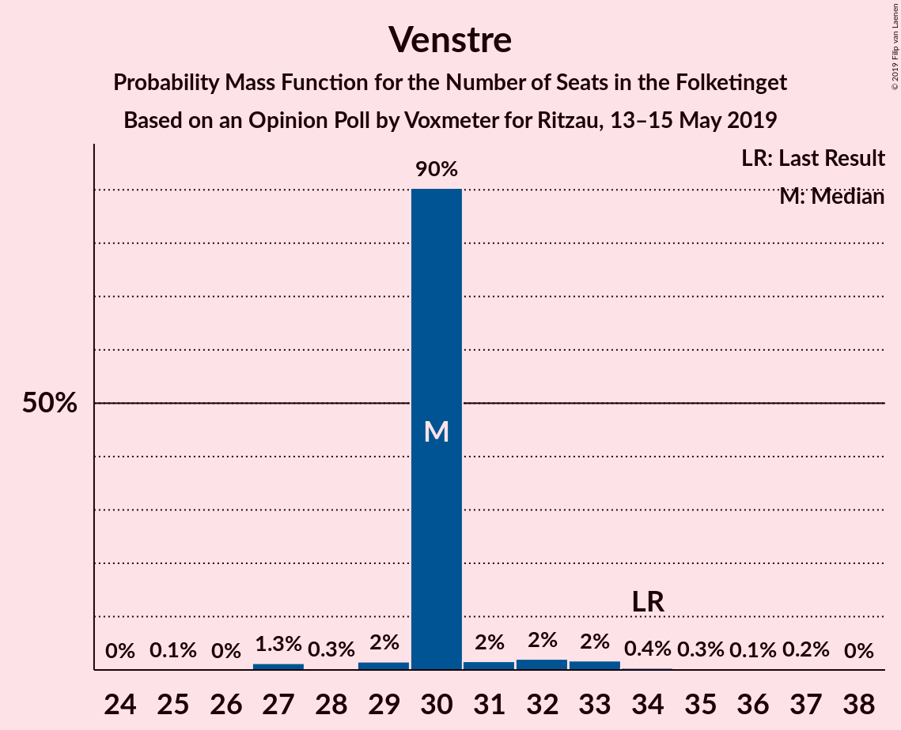

| Number of Seats | Probability | Accumulated | Special Marks |
|:---------------:|:-----------:|:-----------:|:-------------:|
| 25 | 0.1% | 100% |  |
| 26 | 0% | 99.8% |  |
| 27 | 1.3% | 99.8% |  |
| 28 | 0.3% | 98.5% |  |
| 29 | 2% | 98% |  |
| 30 | 90% | 97% | Median |
| 31 | 2% | 6% |  |
| 32 | 2% | 5% |  |
| 33 | 2% | 3% |  |
| 34 | 0.4% | 1.0% | Last Result |
| 35 | 0.3% | 0.6% |  |
| 36 | 0.1% | 0.3% |  |
| 37 | 0.2% | 0.2% |  |
| 38 | 0% | 0% |  |

### Dansk Folkeparti

*For a full overview of the results for this party, see the [Dansk Folkeparti](party-danskfolkeparti.html) page.*

| Number of Seats | Probability | Accumulated | Special Marks |
|:---------------:|:-----------:|:-----------:|:-------------:|
| 15 | 0.4% | 100% |  |
| 16 | 0.2% | 99.6% |  |
| 17 | 3% | 99.5% |  |
| 18 | 1.5% | 97% |  |
| 19 | 90% | 95% | Median |
| 20 | 1.0% | 5% |  |
| 21 | 1.2% | 4% |  |
| 22 | 2% | 3% |  |
| 23 | 0.2% | 0.9% |  |
| 24 | 0.3% | 0.7% |  |
| 25 | 0.4% | 0.4% |  |
| 26 | 0% | 0% |  |
| 27 | 0% | 0% |  |
| 28 | 0% | 0% |  |
| 29 | 0% | 0% |  |
| 30 | 0% | 0% |  |
| 31 | 0% | 0% |  |
| 32 | 0% | 0% |  |
| 33 | 0% | 0% |  |
| 34 | 0% | 0% |  |
| 35 | 0% | 0% |  |
| 36 | 0% | 0% |  |
| 37 | 0% | 0% | Last Result |

### Enhedslisten–De Rød-Grønne

*For a full overview of the results for this party, see the [Enhedslisten–De Rød-Grønne](party-enhedslisten–derød-grønne.html) page.*

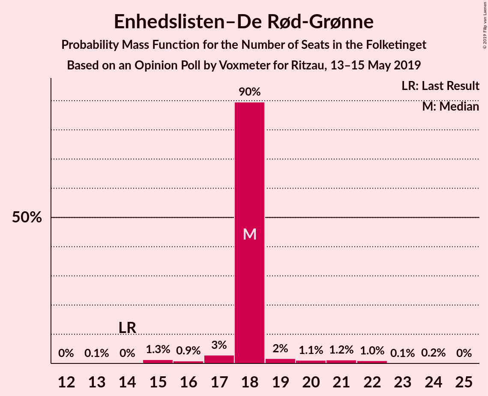

| Number of Seats | Probability | Accumulated | Special Marks |
|:---------------:|:-----------:|:-----------:|:-------------:|
| 13 | 0.1% | 100% |  |
| 14 | 0% | 99.9% | Last Result |
| 15 | 1.3% | 99.9% |  |
| 16 | 0.9% | 98.6% |  |
| 17 | 3% | 98% |  |
| 18 | 90% | 95% | Median |
| 19 | 2% | 5% |  |
| 20 | 1.1% | 4% |  |
| 21 | 1.2% | 2% |  |
| 22 | 1.0% | 1.3% |  |
| 23 | 0.1% | 0.3% |  |
| 24 | 0.2% | 0.2% |  |
| 25 | 0% | 0% |  |

### Radikale Venstre

*For a full overview of the results for this party, see the [Radikale Venstre](party-radikalevenstre.html) page.*

| Number of Seats | Probability | Accumulated | Special Marks |
|:---------------:|:-----------:|:-----------:|:-------------:|
| 8 | 0% | 100% | Last Result |
| 9 | 0% | 100% |  |
| 10 | 0% | 100% |  |
| 11 | 0.4% | 100% |  |
| 12 | 0.6% | 99.5% |  |
| 13 | 2% | 98.9% |  |
| 14 | 4% | 97% |  |
| 15 | 91% | 93% | Median |
| 16 | 2% | 2% |  |
| 17 | 0.4% | 0.5% |  |
| 18 | 0.1% | 0.1% |  |
| 19 | 0% | 0% |  |

### Socialistisk Folkeparti

*For a full overview of the results for this party, see the [Socialistisk Folkeparti](party-socialistiskfolkeparti.html) page.*

| Number of Seats | Probability | Accumulated | Special Marks |
|:---------------:|:-----------:|:-----------:|:-------------:|
| 7 | 0% | 100% | Last Result |
| 8 | 0% | 100% |  |
| 9 | 0% | 100% |  |
| 10 | 0.2% | 100% |  |
| 11 | 1.0% | 99.8% |  |
| 12 | 2% | 98.8% |  |
| 13 | 91% | 97% | Median |
| 14 | 2% | 6% |  |
| 15 | 2% | 3% |  |
| 16 | 0.6% | 1.2% |  |
| 17 | 0.6% | 0.6% |  |
| 18 | 0% | 0% |  |

### Det Konservative Folkeparti

*For a full overview of the results for this party, see the [Det Konservative Folkeparti](party-detkonservativefolkeparti.html) page.*

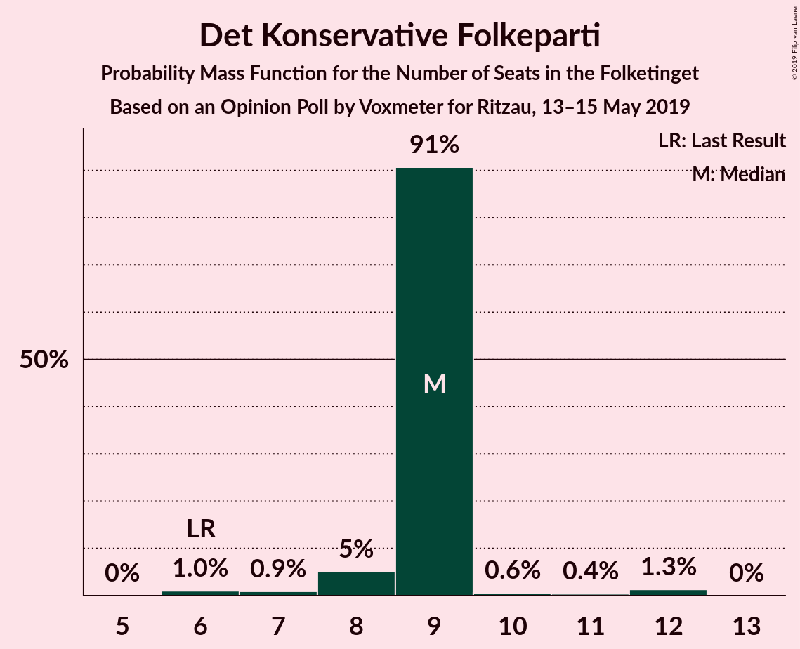

| Number of Seats | Probability | Accumulated | Special Marks |
|:---------------:|:-----------:|:-----------:|:-------------:|
| 6 | 1.0% | 100% | Last Result |
| 7 | 0.9% | 99.0% |  |
| 8 | 5% | 98% |  |
| 9 | 91% | 93% | Median |
| 10 | 0.6% | 2% |  |
| 11 | 0.4% | 2% |  |
| 12 | 1.3% | 1.3% |  |
| 13 | 0% | 0% |  |

### Liberal Alliance

*For a full overview of the results for this party, see the [Liberal Alliance](party-liberalalliance.html) page.*

| Number of Seats | Probability | Accumulated | Special Marks |
|:---------------:|:-----------:|:-----------:|:-------------:|
| 4 | 0.3% | 100% |  |
| 5 | 2% | 99.7% |  |
| 6 | 2% | 98% |  |
| 7 | 3% | 96% |  |
| 8 | 91% | 93% | Median |
| 9 | 2% | 2% |  |
| 10 | 0.2% | 0.3% |  |
| 11 | 0.1% | 0.1% |  |
| 12 | 0% | 0% |  |
| 13 | 0% | 0% | Last Result |

### Alternativet

*For a full overview of the results for this party, see the [Alternativet](party-alternativet.html) page.*

| Number of Seats | Probability | Accumulated | Special Marks |
|:---------------:|:-----------:|:-----------:|:-------------:|
| 0 | 2% | 100% |  |
| 1 | 0% | 98% |  |
| 2 | 0% | 98% |  |
| 3 | 0.1% | 98% |  |
| 4 | 0.9% | 98% |  |
| 5 | 5% | 97% |  |
| 6 | 90% | 92% | Median |
| 7 | 2% | 2% |  |
| 8 | 0.3% | 0.3% |  |
| 9 | 0% | 0% | Last Result |

### Stram Kurs

*For a full overview of the results for this party, see the [Stram Kurs](party-stramkurs.html) page.*

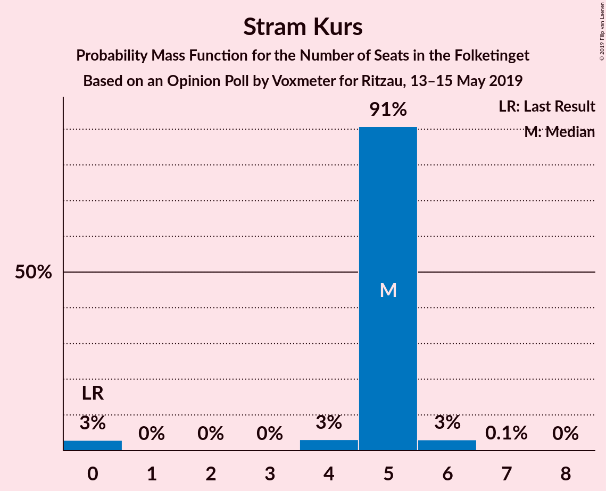

| Number of Seats | Probability | Accumulated | Special Marks |
|:---------------:|:-----------:|:-----------:|:-------------:|
| 0 | 3% | 100% | Last Result |
| 1 | 0% | 97% |  |
| 2 | 0% | 97% |  |
| 3 | 0% | 97% |  |
| 4 | 3% | 97% |  |
| 5 | 91% | 94% | Median |
| 6 | 3% | 3% |  |
| 7 | 0.1% | 0.2% |  |
| 8 | 0% | 0% |  |

### Nye Borgerlige

*For a full overview of the results for this party, see the [Nye Borgerlige](party-nyeborgerlige.html) page.*

| Number of Seats | Probability | Accumulated | Special Marks |
|:---------------:|:-----------:|:-----------:|:-------------:|
| 0 | 6% | 100% | Last Result |
| 1 | 0% | 94% |  |
| 2 | 0% | 94% |  |
| 3 | 0% | 94% |  |
| 4 | 91% | 94% | Median |
| 5 | 2% | 3% |  |
| 6 | 0.7% | 0.7% |  |
| 7 | 0.1% | 0.1% |  |
| 8 | 0% | 0% |  |

### Kristendemokraterne

*For a full overview of the results for this party, see the [Kristendemokraterne](party-kristendemokraterne.html) page.*

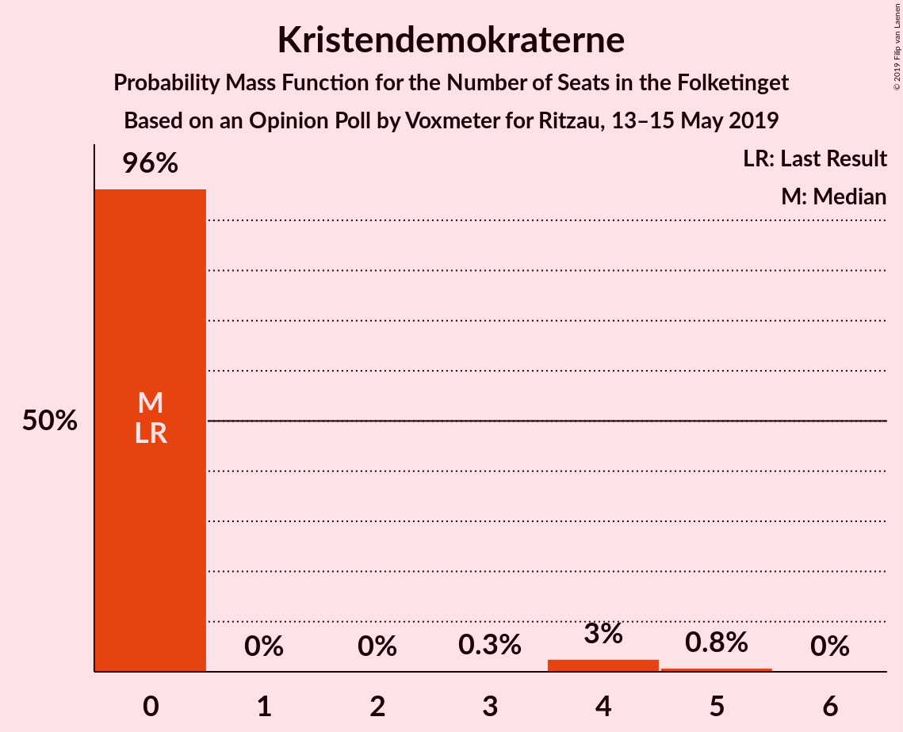

| Number of Seats | Probability | Accumulated | Special Marks |
|:---------------:|:-----------:|:-----------:|:-------------:|
| 0 | 96% | 100% | Last Result, Median |
| 1 | 0% | 4% |  |
| 2 | 0% | 4% |  |
| 3 | 0.3% | 4% |  |
| 4 | 3% | 3% |  |
| 5 | 0.8% | 0.8% |  |
| 6 | 0% | 0% |  |

### Klaus Riskær Pedersen

*For a full overview of the results for this party, see the [Klaus Riskær Pedersen](party-klausriskærpedersen.html) page.*

| Number of Seats | Probability | Accumulated | Special Marks |
|:---------------:|:-----------:|:-----------:|:-------------:|
| 0 | 100% | 100% | Last Result, Median |

## Coalitions

### Confidence Intervals

| Coalition | Last Result | Median | Majority? | 80% Confidence Interval | 90% Confidence Interval | 95% Confidence Interval | 99% Confidence Interval |
|:---------:|:-----------:|:------:|:---------:|:-----------------------:|:-----------------------:|:-----------------------:|:-----------------------:|
| Socialdemokraterne – Enhedslisten–De Rød-Grønne – Radikale Venstre – Socialistisk Folkeparti – Alternativet | 85 | 100 | 100% | 100 | 100–102 | 99–105 | 95–108 |
| Socialdemokraterne – Enhedslisten–De Rød-Grønne – Radikale Venstre – Socialistisk Folkeparti | 76 | 94 | 99.7% | 94 | 94–98 | 94–101 | 91–103 |
| Socialdemokraterne – Enhedslisten–De Rød-Grønne – Socialistisk Folkeparti – Alternativet | 77 | 85 | 3% | 85 | 85–88 | 85–91 | 81–94 |
| Socialdemokraterne – Enhedslisten–De Rød-Grønne – Socialistisk Folkeparti | 68 | 79 | 0.1% | 79 | 79–83 | 79–87 | 77–89 |
| Socialdemokraterne – Radikale Venstre – Socialistisk Folkeparti | 62 | 76 | 0% | 76 | 76–80 | 76–82 | 72–84 |
| Venstre – Dansk Folkeparti – Det Konservative Folkeparti – Liberal Alliance – Stram Kurs – Nye Borgerlige – Kristendemokraterne – Klaus Riskær Pedersen | 90 | 75 | 0% | 75 | 73–75 | 70–76 | 67–80 |
| Venstre – Dansk Folkeparti – Det Konservative Folkeparti – Liberal Alliance – Nye Borgerlige – Kristendemokraterne – Klaus Riskær Pedersen | 90 | 70 | 0% | 70 | 70–71 | 66–73 | 62–76 |
| Venstre – Dansk Folkeparti – Det Konservative Folkeparti – Liberal Alliance – Nye Borgerlige – Kristendemokraterne | 90 | 70 | 0% | 70 | 70–71 | 66–73 | 62–76 |
| Venstre – Dansk Folkeparti – Det Konservative Folkeparti – Liberal Alliance – Nye Borgerlige – Klaus Riskær Pedersen | 90 | 70 | 0% | 70 | 68–70 | 65–72 | 61–75 |
| Venstre – Dansk Folkeparti – Det Konservative Folkeparti – Liberal Alliance – Nye Borgerlige | 90 | 70 | 0% | 70 | 68–70 | 65–72 | 61–75 |
| Venstre – Dansk Folkeparti – Det Konservative Folkeparti – Liberal Alliance – Kristendemokraterne | 90 | 66 | 0% | 66 | 66–67 | 63–71 | 62–73 |
| Venstre – Dansk Folkeparti – Det Konservative Folkeparti – Liberal Alliance | 90 | 66 | 0% | 66 | 66–67 | 63–69 | 60–71 |
| Socialdemokraterne – Radikale Venstre | 55 | 63 | 0% | 63 | 63–67 | 62–68 | 59–70 |
| Venstre – Det Konservative Folkeparti – Liberal Alliance | 53 | 47 | 0% | 47 | 45–47 | 44–48 | 42–52 |
| Venstre – Det Konservative Folkeparti | 40 | 39 | 0% | 39 | 38–40 | 37–41 | 35–45 |
| Venstre | 34 | 30 | 0% | 30 | 30–31 | 29–33 | 27–35 |

### Socialdemokraterne – Enhedslisten–De Rød-Grønne – Radikale Venstre – Socialistisk Folkeparti – Alternativet

| Number of Seats | Probability | Accumulated | Special Marks |
|:---------------:|:-----------:|:-----------:|:-------------:|
| 85 | 0% | 100% | Last Result |
| 86 | 0% | 100% |  |
| 87 | 0% | 100% |  |
| 88 | 0% | 100% |  |
| 89 | 0% | 100% |  |
| 90 | 0% | 100% | Majority |
| 91 | 0% | 100% |  |
| 92 | 0% | 100% |  |
| 93 | 0.4% | 100% |  |
| 94 | 0.1% | 99.6% |  |
| 95 | 0.3% | 99.6% |  |
| 96 | 0.9% | 99.3% |  |
| 97 | 0.2% | 98% |  |
| 98 | 0.4% | 98% |  |
| 99 | 0.4% | 98% |  |
| 100 | 90% | 97% | Median |
| 101 | 1.3% | 8% |  |
| 102 | 1.5% | 6% |  |
| 103 | 1.1% | 5% |  |
| 104 | 1.1% | 4% |  |
| 105 | 0.4% | 3% |  |
| 106 | 0.8% | 2% |  |
| 107 | 1.0% | 2% |  |
| 108 | 0.3% | 0.6% |  |
| 109 | 0% | 0.3% |  |
| 110 | 0.2% | 0.2% |  |
| 111 | 0% | 0% |  |

### Socialdemokraterne – Enhedslisten–De Rød-Grønne – Radikale Venstre – Socialistisk Folkeparti

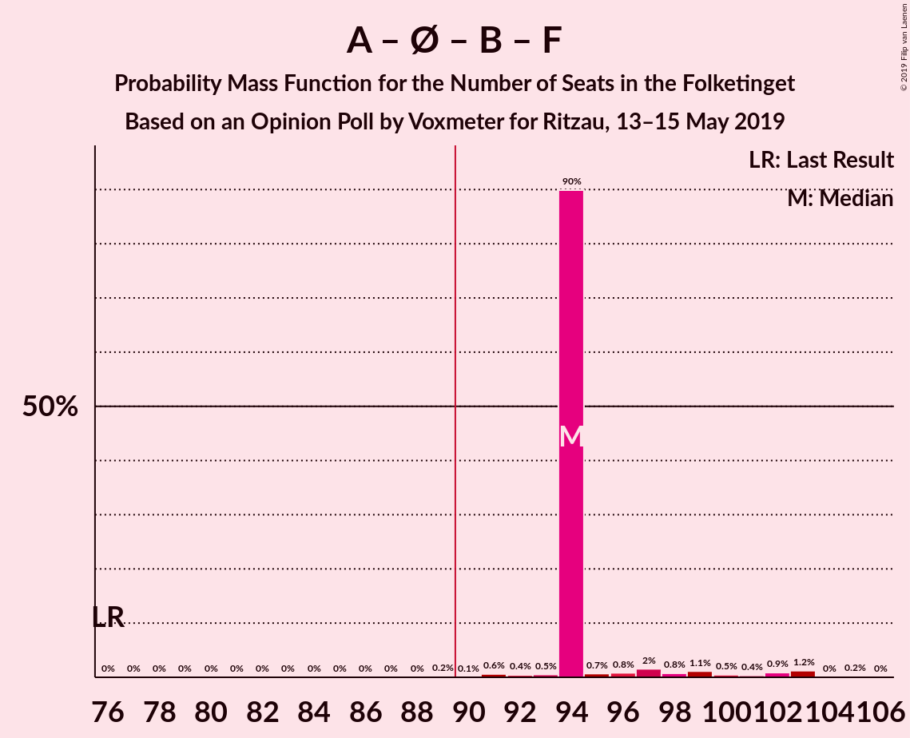

| Number of Seats | Probability | Accumulated | Special Marks |
|:---------------:|:-----------:|:-----------:|:-------------:|
| 76 | 0% | 100% | Last Result |
| 77 | 0% | 100% |  |
| 78 | 0% | 100% |  |
| 79 | 0% | 100% |  |
| 80 | 0% | 100% |  |
| 81 | 0% | 100% |  |
| 82 | 0% | 100% |  |
| 83 | 0% | 100% |  |
| 84 | 0% | 100% |  |
| 85 | 0% | 100% |  |
| 86 | 0% | 100% |  |
| 87 | 0% | 100% |  |
| 88 | 0% | 100% |  |
| 89 | 0.2% | 100% |  |
| 90 | 0.1% | 99.7% | Majority |
| 91 | 0.6% | 99.6% |  |
| 92 | 0.4% | 99.0% |  |
| 93 | 0.5% | 98.6% |  |
| 94 | 90% | 98% | Median |
| 95 | 0.7% | 8% |  |
| 96 | 0.8% | 7% |  |
| 97 | 2% | 7% |  |
| 98 | 0.8% | 5% |  |
| 99 | 1.1% | 4% |  |
| 100 | 0.5% | 3% |  |
| 101 | 0.4% | 3% |  |
| 102 | 0.9% | 2% |  |
| 103 | 1.2% | 1.5% |  |
| 104 | 0% | 0.3% |  |
| 105 | 0.2% | 0.2% |  |
| 106 | 0% | 0% |  |

### Socialdemokraterne – Enhedslisten–De Rød-Grønne – Socialistisk Folkeparti – Alternativet

| Number of Seats | Probability | Accumulated | Special Marks |
|:---------------:|:-----------:|:-----------:|:-------------:|
| 77 | 0.3% | 100% | Last Result |
| 78 | 0% | 99.7% |  |
| 79 | 0.1% | 99.7% |  |
| 80 | 0% | 99.6% |  |
| 81 | 0.6% | 99.6% |  |
| 82 | 0.5% | 99.0% |  |
| 83 | 0.2% | 98% |  |
| 84 | 0.1% | 98% |  |
| 85 | 89% | 98% | Median |
| 86 | 1.0% | 9% |  |
| 87 | 2% | 8% |  |
| 88 | 2% | 6% |  |
| 89 | 0.3% | 4% |  |
| 90 | 0.6% | 3% | Majority |
| 91 | 0.3% | 3% |  |
| 92 | 2% | 2% |  |
| 93 | 0.2% | 0.8% |  |
| 94 | 0.5% | 0.6% |  |
| 95 | 0% | 0.1% |  |
| 96 | 0% | 0% |  |

### Socialdemokraterne – Enhedslisten–De Rød-Grønne – Socialistisk Folkeparti

| Number of Seats | Probability | Accumulated | Special Marks |
|:---------------:|:-----------:|:-----------:|:-------------:|
| 68 | 0% | 100% | Last Result |
| 69 | 0% | 100% |  |
| 70 | 0% | 100% |  |
| 71 | 0% | 100% |  |
| 72 | 0% | 100% |  |
| 73 | 0% | 100% |  |
| 74 | 0.3% | 100% |  |
| 75 | 0% | 99.7% |  |
| 76 | 0% | 99.7% |  |
| 77 | 0.8% | 99.6% |  |
| 78 | 0.4% | 98.9% |  |
| 79 | 89% | 98% | Median |
| 80 | 1.0% | 9% |  |
| 81 | 0.3% | 8% |  |
| 82 | 1.3% | 8% |  |
| 83 | 2% | 7% |  |
| 84 | 0.3% | 5% |  |
| 85 | 1.3% | 4% |  |
| 86 | 0.6% | 3% |  |
| 87 | 2% | 3% |  |
| 88 | 0.2% | 0.8% |  |
| 89 | 0.5% | 0.6% |  |
| 90 | 0.1% | 0.1% | Majority |
| 91 | 0% | 0% |  |

### Socialdemokraterne – Radikale Venstre – Socialistisk Folkeparti

| Number of Seats | Probability | Accumulated | Special Marks |
|:---------------:|:-----------:|:-----------:|:-------------:|
| 62 | 0% | 100% | Last Result |
| 63 | 0% | 100% |  |
| 64 | 0% | 100% |  |
| 65 | 0% | 100% |  |
| 66 | 0% | 100% |  |
| 67 | 0% | 100% |  |
| 68 | 0% | 100% |  |
| 69 | 0% | 100% |  |
| 70 | 0% | 100% |  |
| 71 | 0.1% | 100% |  |
| 72 | 0.4% | 99.8% |  |
| 73 | 0.2% | 99.4% |  |
| 74 | 0.9% | 99.2% |  |
| 75 | 0.4% | 98% |  |
| 76 | 90% | 98% | Median |
| 77 | 0.8% | 8% |  |
| 78 | 0.8% | 8% |  |
| 79 | 1.1% | 7% |  |
| 80 | 2% | 6% |  |
| 81 | 0.4% | 3% |  |
| 82 | 1.0% | 3% |  |
| 83 | 0.5% | 2% |  |
| 84 | 1.0% | 1.4% |  |
| 85 | 0.4% | 0.4% |  |
| 86 | 0% | 0% |  |

### Venstre – Dansk Folkeparti – Det Konservative Folkeparti – Liberal Alliance – Stram Kurs – Nye Borgerlige – Kristendemokraterne – Klaus Riskær Pedersen

| Number of Seats | Probability | Accumulated | Special Marks |
|:---------------:|:-----------:|:-----------:|:-------------:|
| 65 | 0.2% | 100% |  |
| 66 | 0% | 99.8% |  |
| 67 | 0.3% | 99.7% |  |
| 68 | 1.0% | 99.4% |  |
| 69 | 0.8% | 98% |  |
| 70 | 0.4% | 98% |  |
| 71 | 1.1% | 97% |  |
| 72 | 1.1% | 96% |  |
| 73 | 1.5% | 95% |  |
| 74 | 1.3% | 94% |  |
| 75 | 90% | 92% | Median |
| 76 | 0.4% | 3% |  |
| 77 | 0.4% | 2% |  |
| 78 | 0.2% | 2% |  |
| 79 | 0.9% | 2% |  |
| 80 | 0.3% | 0.7% |  |
| 81 | 0.1% | 0.4% |  |
| 82 | 0.4% | 0.4% |  |
| 83 | 0% | 0% |  |
| 84 | 0% | 0% |  |
| 85 | 0% | 0% |  |
| 86 | 0% | 0% |  |
| 87 | 0% | 0% |  |
| 88 | 0% | 0% |  |
| 89 | 0% | 0% |  |
| 90 | 0% | 0% | Last Result, Majority |

### Venstre – Dansk Folkeparti – Det Konservative Folkeparti – Liberal Alliance – Nye Borgerlige – Kristendemokraterne – Klaus Riskær Pedersen

| Number of Seats | Probability | Accumulated | Special Marks |
|:---------------:|:-----------:|:-----------:|:-------------:|
| 60 | 0% | 100% |  |
| 61 | 0.2% | 99.9% |  |
| 62 | 1.1% | 99.7% |  |
| 63 | 0.7% | 98.7% |  |
| 64 | 0.1% | 98% |  |
| 65 | 0.4% | 98% |  |
| 66 | 0.8% | 98% |  |
| 67 | 0.1% | 97% |  |
| 68 | 0.6% | 97% |  |
| 69 | 0.4% | 96% |  |
| 70 | 90% | 96% | Median |
| 71 | 1.2% | 6% |  |
| 72 | 1.0% | 4% |  |
| 73 | 2% | 3% |  |
| 74 | 0.4% | 2% |  |
| 75 | 0.7% | 1.2% |  |
| 76 | 0.1% | 0.5% |  |
| 77 | 0.3% | 0.4% |  |
| 78 | 0.1% | 0.1% |  |
| 79 | 0% | 0% |  |
| 80 | 0% | 0% |  |
| 81 | 0% | 0% |  |
| 82 | 0% | 0% |  |
| 83 | 0% | 0% |  |
| 84 | 0% | 0% |  |
| 85 | 0% | 0% |  |
| 86 | 0% | 0% |  |
| 87 | 0% | 0% |  |
| 88 | 0% | 0% |  |
| 89 | 0% | 0% |  |
| 90 | 0% | 0% | Last Result, Majority |

### Venstre – Dansk Folkeparti – Det Konservative Folkeparti – Liberal Alliance – Nye Borgerlige – Kristendemokraterne

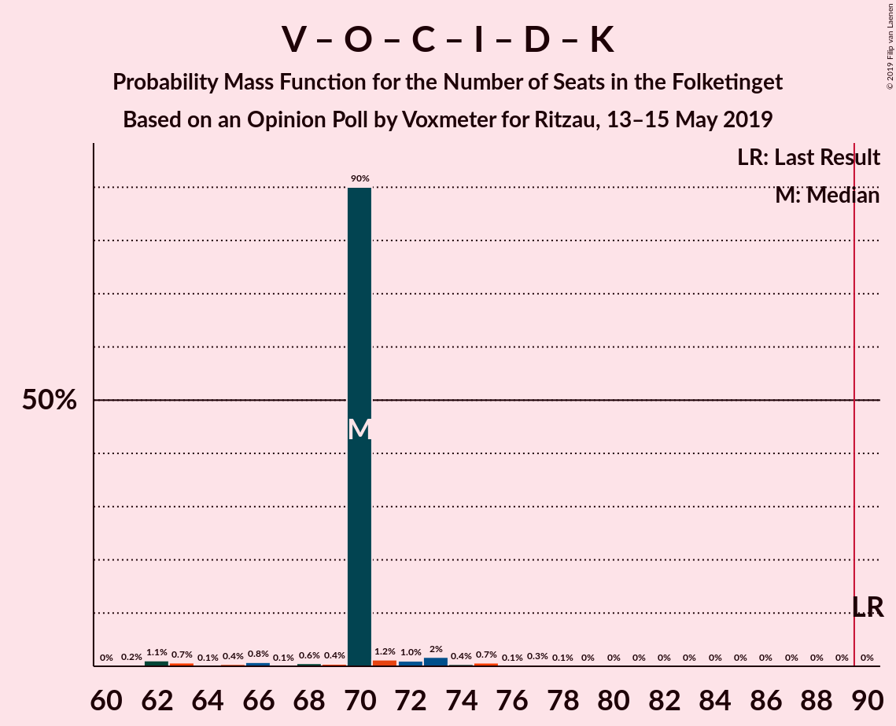

| Number of Seats | Probability | Accumulated | Special Marks |
|:---------------:|:-----------:|:-----------:|:-------------:|
| 60 | 0% | 100% |  |
| 61 | 0.2% | 99.9% |  |
| 62 | 1.1% | 99.7% |  |
| 63 | 0.7% | 98.7% |  |
| 64 | 0.1% | 98% |  |
| 65 | 0.4% | 98% |  |
| 66 | 0.8% | 98% |  |
| 67 | 0.1% | 97% |  |
| 68 | 0.6% | 97% |  |
| 69 | 0.4% | 96% |  |
| 70 | 90% | 96% | Median |
| 71 | 1.2% | 6% |  |
| 72 | 1.0% | 4% |  |
| 73 | 2% | 3% |  |
| 74 | 0.4% | 2% |  |
| 75 | 0.7% | 1.2% |  |
| 76 | 0.1% | 0.5% |  |
| 77 | 0.3% | 0.4% |  |
| 78 | 0.1% | 0.1% |  |
| 79 | 0% | 0% |  |
| 80 | 0% | 0% |  |
| 81 | 0% | 0% |  |
| 82 | 0% | 0% |  |
| 83 | 0% | 0% |  |
| 84 | 0% | 0% |  |
| 85 | 0% | 0% |  |
| 86 | 0% | 0% |  |
| 87 | 0% | 0% |  |
| 88 | 0% | 0% |  |
| 89 | 0% | 0% |  |
| 90 | 0% | 0% | Last Result, Majority |

### Venstre – Dansk Folkeparti – Det Konservative Folkeparti – Liberal Alliance – Nye Borgerlige – Klaus Riskær Pedersen

| Number of Seats | Probability | Accumulated | Special Marks |
|:---------------:|:-----------:|:-----------:|:-------------:|
| 58 | 0.3% | 100% |  |
| 59 | 0% | 99.7% |  |
| 60 | 0% | 99.7% |  |
| 61 | 0.3% | 99.7% |  |
| 62 | 0.8% | 99.4% |  |
| 63 | 0.7% | 98.5% |  |
| 64 | 0.1% | 98% |  |
| 65 | 0.6% | 98% |  |
| 66 | 2% | 97% |  |
| 67 | 0.1% | 95% |  |
| 68 | 0.6% | 95% |  |
| 69 | 2% | 95% |  |
| 70 | 89% | 93% | Median |
| 71 | 0.9% | 4% |  |
| 72 | 1.0% | 3% |  |
| 73 | 0.5% | 2% |  |
| 74 | 0.7% | 1.3% |  |
| 75 | 0.5% | 0.6% |  |
| 76 | 0% | 0.1% |  |
| 77 | 0% | 0.1% |  |
| 78 | 0.1% | 0.1% |  |
| 79 | 0% | 0% |  |
| 80 | 0% | 0% |  |
| 81 | 0% | 0% |  |
| 82 | 0% | 0% |  |
| 83 | 0% | 0% |  |
| 84 | 0% | 0% |  |
| 85 | 0% | 0% |  |
| 86 | 0% | 0% |  |
| 87 | 0% | 0% |  |
| 88 | 0% | 0% |  |
| 89 | 0% | 0% |  |
| 90 | 0% | 0% | Last Result, Majority |

### Venstre – Dansk Folkeparti – Det Konservative Folkeparti – Liberal Alliance – Nye Borgerlige

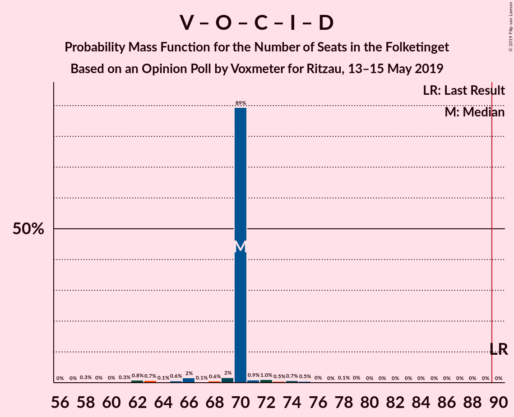

| Number of Seats | Probability | Accumulated | Special Marks |
|:---------------:|:-----------:|:-----------:|:-------------:|
| 58 | 0.3% | 100% |  |
| 59 | 0% | 99.7% |  |
| 60 | 0% | 99.7% |  |
| 61 | 0.3% | 99.7% |  |
| 62 | 0.8% | 99.4% |  |
| 63 | 0.7% | 98.5% |  |
| 64 | 0.1% | 98% |  |
| 65 | 0.6% | 98% |  |
| 66 | 2% | 97% |  |
| 67 | 0.1% | 95% |  |
| 68 | 0.6% | 95% |  |
| 69 | 2% | 95% |  |
| 70 | 89% | 93% | Median |
| 71 | 0.9% | 4% |  |
| 72 | 1.0% | 3% |  |
| 73 | 0.5% | 2% |  |
| 74 | 0.7% | 1.3% |  |
| 75 | 0.5% | 0.6% |  |
| 76 | 0% | 0.1% |  |
| 77 | 0% | 0.1% |  |
| 78 | 0.1% | 0.1% |  |
| 79 | 0% | 0% |  |
| 80 | 0% | 0% |  |
| 81 | 0% | 0% |  |
| 82 | 0% | 0% |  |
| 83 | 0% | 0% |  |
| 84 | 0% | 0% |  |
| 85 | 0% | 0% |  |
| 86 | 0% | 0% |  |
| 87 | 0% | 0% |  |
| 88 | 0% | 0% |  |
| 89 | 0% | 0% |  |
| 90 | 0% | 0% | Last Result, Majority |

### Venstre – Dansk Folkeparti – Det Konservative Folkeparti – Liberal Alliance – Kristendemokraterne

| Number of Seats | Probability | Accumulated | Special Marks |
|:---------------:|:-----------:|:-----------:|:-------------:|
| 59 | 0.1% | 100% |  |
| 60 | 0% | 99.9% |  |
| 61 | 0.2% | 99.8% |  |
| 62 | 1.5% | 99.6% |  |
| 63 | 1.0% | 98% |  |
| 64 | 0.5% | 97% |  |
| 65 | 0.4% | 97% |  |
| 66 | 90% | 96% | Median |
| 67 | 2% | 7% |  |
| 68 | 0.6% | 5% |  |
| 69 | 0.6% | 4% |  |
| 70 | 1.0% | 4% |  |
| 71 | 0.6% | 3% |  |
| 72 | 0.4% | 2% |  |
| 73 | 1.2% | 2% |  |
| 74 | 0.1% | 0.3% |  |
| 75 | 0.2% | 0.2% |  |
| 76 | 0% | 0% |  |
| 77 | 0% | 0% |  |
| 78 | 0% | 0% |  |
| 79 | 0% | 0% |  |
| 80 | 0% | 0% |  |
| 81 | 0% | 0% |  |
| 82 | 0% | 0% |  |
| 83 | 0% | 0% |  |
| 84 | 0% | 0% |  |
| 85 | 0% | 0% |  |
| 86 | 0% | 0% |  |
| 87 | 0% | 0% |  |
| 88 | 0% | 0% |  |
| 89 | 0% | 0% |  |
| 90 | 0% | 0% | Last Result, Majority |

### Venstre – Dansk Folkeparti – Det Konservative Folkeparti – Liberal Alliance

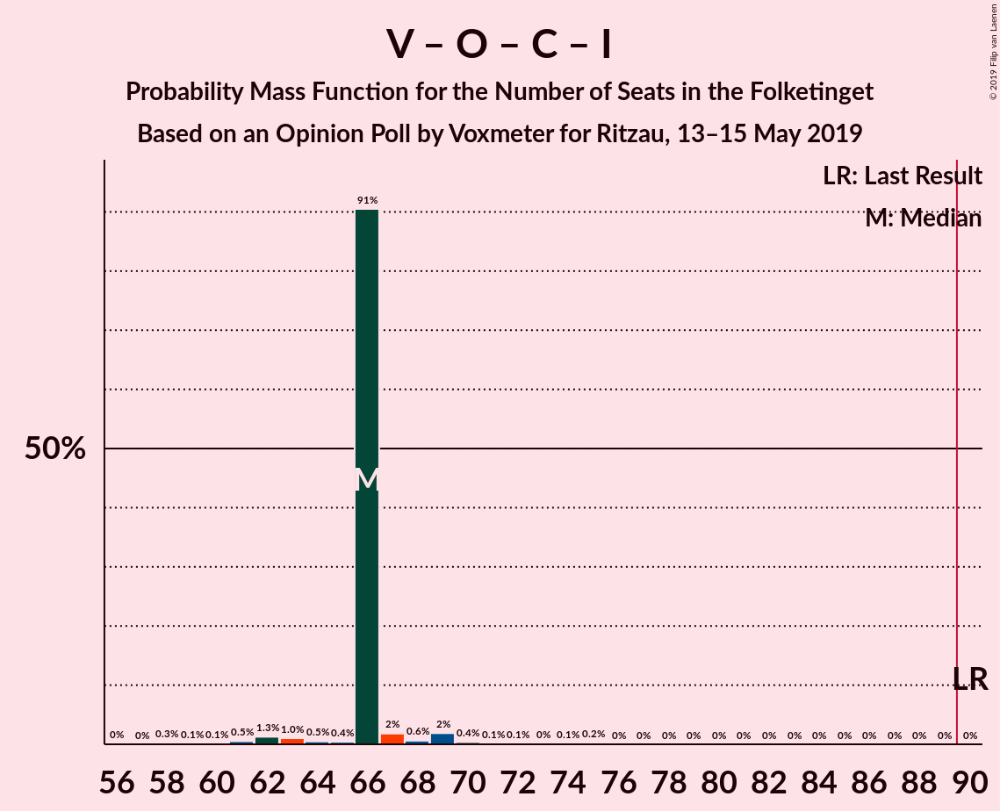

| Number of Seats | Probability | Accumulated | Special Marks |
|:---------------:|:-----------:|:-----------:|:-------------:|
| 58 | 0.3% | 100% |  |
| 59 | 0.1% | 99.7% |  |
| 60 | 0.1% | 99.6% |  |
| 61 | 0.5% | 99.5% |  |
| 62 | 1.3% | 99.0% |  |
| 63 | 1.0% | 98% |  |
| 64 | 0.5% | 97% |  |
| 65 | 0.4% | 96% |  |
| 66 | 91% | 96% | Median |
| 67 | 2% | 5% |  |
| 68 | 0.6% | 3% |  |
| 69 | 2% | 3% |  |
| 70 | 0.4% | 0.9% |  |
| 71 | 0.1% | 0.5% |  |
| 72 | 0.1% | 0.4% |  |
| 73 | 0% | 0.3% |  |
| 74 | 0.1% | 0.3% |  |
| 75 | 0.2% | 0.2% |  |
| 76 | 0% | 0% |  |
| 77 | 0% | 0% |  |
| 78 | 0% | 0% |  |
| 79 | 0% | 0% |  |
| 80 | 0% | 0% |  |
| 81 | 0% | 0% |  |
| 82 | 0% | 0% |  |
| 83 | 0% | 0% |  |
| 84 | 0% | 0% |  |
| 85 | 0% | 0% |  |
| 86 | 0% | 0% |  |
| 87 | 0% | 0% |  |
| 88 | 0% | 0% |  |
| 89 | 0% | 0% |  |
| 90 | 0% | 0% | Last Result, Majority |

### Socialdemokraterne – Radikale Venstre

| Number of Seats | Probability | Accumulated | Special Marks |
|:---------------:|:-----------:|:-----------:|:-------------:|
| 55 | 0% | 100% | Last Result |
| 56 | 0% | 100% |  |
| 57 | 0.1% | 100% |  |
| 58 | 0.1% | 99.9% |  |
| 59 | 0.4% | 99.8% |  |
| 60 | 0.6% | 99.4% |  |
| 61 | 0.4% | 98.8% |  |
| 62 | 1.3% | 98% |  |
| 63 | 90% | 97% | Median |
| 64 | 0.3% | 7% |  |
| 65 | 0.7% | 7% |  |
| 66 | 0.3% | 6% |  |
| 67 | 2% | 6% |  |
| 68 | 3% | 4% |  |
| 69 | 0.3% | 1.4% |  |
| 70 | 0.8% | 1.0% |  |
| 71 | 0.2% | 0.2% |  |
| 72 | 0% | 0.1% |  |
| 73 | 0% | 0% |  |

### Venstre – Det Konservative Folkeparti – Liberal Alliance

| Number of Seats | Probability | Accumulated | Special Marks |
|:---------------:|:-----------:|:-----------:|:-------------:|
| 39 | 0.1% | 100% |  |
| 40 | 0.1% | 99.9% |  |
| 41 | 0.2% | 99.8% |  |
| 42 | 0.4% | 99.6% |  |
| 43 | 0.7% | 99.3% |  |
| 44 | 2% | 98.6% |  |
| 45 | 2% | 97% |  |
| 46 | 1.3% | 95% |  |
| 47 | 90% | 93% | Median |
| 48 | 1.1% | 3% |  |
| 49 | 0.1% | 2% |  |
| 50 | 0.3% | 2% |  |
| 51 | 0.3% | 2% |  |
| 52 | 1.3% | 2% |  |
| 53 | 0.2% | 0.2% | Last Result |
| 54 | 0% | 0% |  |

### Venstre – Det Konservative Folkeparti

| Number of Seats | Probability | Accumulated | Special Marks |
|:---------------:|:-----------:|:-----------:|:-------------:|
| 32 | 0% | 100% |  |
| 33 | 0% | 99.9% |  |
| 34 | 0.2% | 99.9% |  |
| 35 | 1.1% | 99.7% |  |
| 36 | 0.7% | 98.6% |  |
| 37 | 1.1% | 98% |  |
| 38 | 2% | 97% |  |
| 39 | 90% | 95% | Median |
| 40 | 2% | 5% | Last Result |
| 41 | 1.0% | 3% |  |
| 42 | 0.4% | 2% |  |
| 43 | 0.1% | 2% |  |
| 44 | 0.3% | 2% |  |
| 45 | 1.4% | 2% |  |
| 46 | 0.1% | 0.2% |  |
| 47 | 0% | 0% |  |

### Venstre

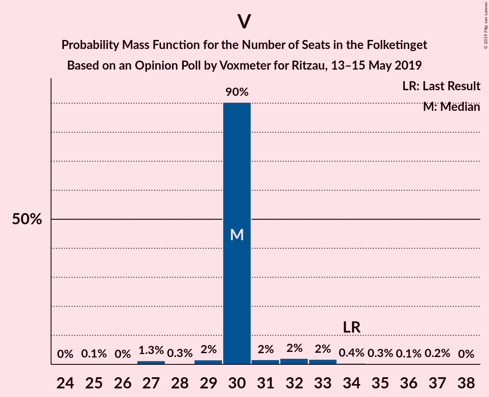

| Number of Seats | Probability | Accumulated | Special Marks |
|:---------------:|:-----------:|:-----------:|:-------------:|
| 25 | 0.1% | 100% |  |
| 26 | 0% | 99.8% |  |
| 27 | 1.3% | 99.8% |  |
| 28 | 0.3% | 98.5% |  |
| 29 | 2% | 98% |  |
| 30 | 90% | 97% | Median |
| 31 | 2% | 6% |  |
| 32 | 2% | 5% |  |
| 33 | 2% | 3% |  |
| 34 | 0.4% | 1.0% | Last Result |
| 35 | 0.3% | 0.6% |  |
| 36 | 0.1% | 0.3% |  |
| 37 | 0.2% | 0.2% |  |
| 38 | 0% | 0% |  |

## Technical Information

### Opinion Poll

+ **Polling firm:** Voxmeter
+ **Commissioner(s):** Ritzau
+ **Fieldwork period:** 13–15 May 2019

### Calculations

+ **Sample size:** 1012
+ **Simulations done:** 1,048,576
+ **Error estimate:** 2.45%

