# Opinion Poll by YouGov, 15 May 2019

<a href="#voting-intentions">Voting Intentions</a> | <a href="#seats">Seats</a> | <a href="#coalitions">Coalitions</a> | <a href="#technical-information">Technical Information</a>

## Voting Intentions

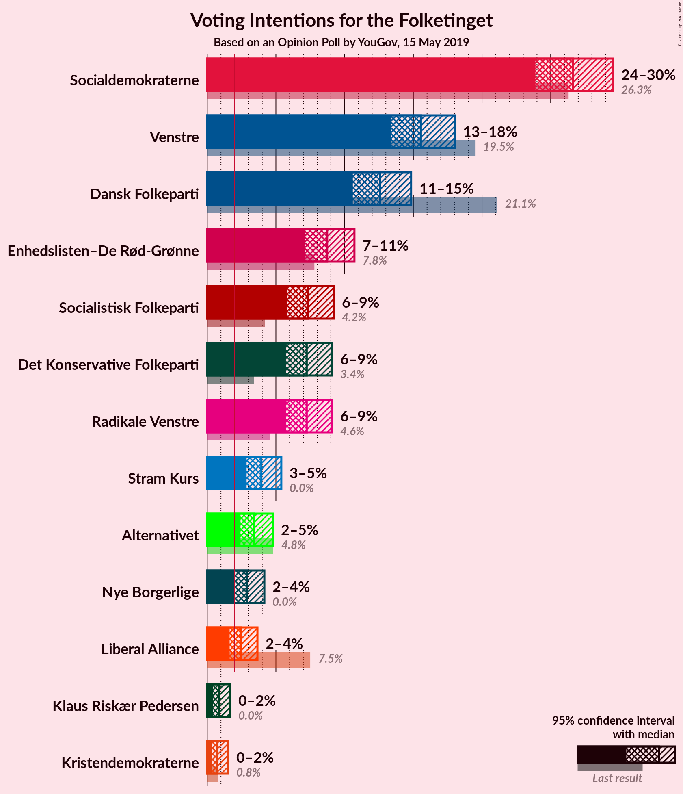

### Confidence Intervals

| Party | Last Result | Poll Result | 80% Confidence Interval | 90% Confidence Interval | 95% Confidence Interval | 99% Confidence Interval |
|:-----:|:-----------:|:-----------:|:-----------------------:|:-----------------------:|:-----------------------:|:-----------------------:|
| Socialdemokraterne | 26.3% | 26.6% | 24.8–28.5% |24.3–29.1% |23.9–29.6% |23.0–30.5% |
| Venstre | 19.5% | 15.5% | 14.1–17.2% |13.7–17.6% |13.4–18.0% |12.7–18.8% |
| Dansk Folkeparti | 21.1% | 12.6% | 11.3–14.1% |10.9–14.5% |10.6–14.8% |10.0–15.6% |
| Enhedslisten–De Rød-Grønne | 7.8% | 8.7% | 7.7–10.0% |7.3–10.4% |7.1–10.7% |6.6–11.4% |
| Socialistisk Folkeparti | 4.2% | 7.3% | 6.4–8.6% |6.1–8.9% |5.8–9.2% |5.4–9.8% |
| Radikale Venstre | 4.6% | 7.2% | 6.3–8.4% |6.0–8.8% |5.7–9.1% |5.3–9.7% |
| Det Konservative Folkeparti | 3.4% | 7.2% | 6.3–8.4% |6.0–8.8% |5.7–9.1% |5.3–9.7% |
| Stram Kurs | 0.0% | 3.9% | 3.2–4.9% |3.0–5.2% |2.9–5.4% |2.6–5.9% |
| Alternativet | 4.8% | 3.4% | 2.8–4.3% |2.6–4.6% |2.4–4.8% |2.1–5.2% |
| Nye Borgerlige | 0.0% | 2.9% | 2.3–3.7% |2.1–3.9% |2.0–4.2% |1.7–4.6% |
| Liberal Alliance | 7.5% | 2.4% | 1.9–3.2% |1.8–3.5% |1.6–3.7% |1.4–4.1% |
| Klaus Riskær Pedersen | 0.0% | 0.9% | 0.6–1.4% |0.5–1.5% |0.4–1.7% |0.3–2.0% |
| Kristendemokraterne | 0.8% | 0.7% | 0.5–1.2% |0.4–1.4% |0.4–1.5% |0.3–1.8% |

*Note:* The poll result column reflects the actual value used in the calculations. Published results may vary slightly, and in addition be rounded to fewer digits.

## Seats

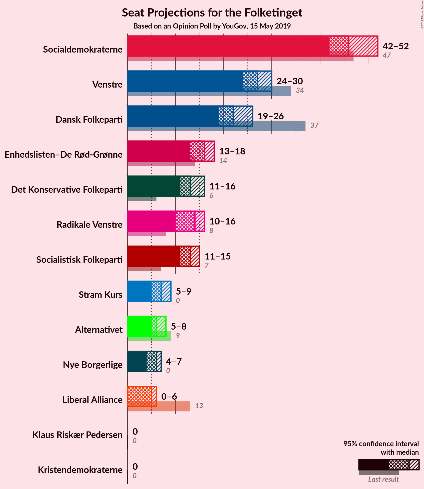

### Confidence Intervals

| Party | Last Result | Median | 80% Confidence Interval | 90% Confidence Interval | 95% Confidence Interval | 99% Confidence Interval |
|:-----:|:-----------:|:------:|:-----------------------:|:-----------------------:|:-----------------------:|:-----------------------:|
| <a href="#socialdemokraterne">Socialdemokraterne</a> | 47 | 46 | 43–49 |42–52 |42–52 |42–52 |
| <a href="#venstre">Venstre</a> | 34 | 27 | 25–28 |24–29 |24–30 |24–33 |
| <a href="#dansk-folkeparti">Dansk Folkeparti</a> | 37 | 22 | 20–24 |20–26 |19–26 |18–26 |
| <a href="#enhedslisten–de-rød-grønne">Enhedslisten–De Rød-Grønne</a> | 14 | 16 | 13–17 |13–18 |13–18 |12–19 |
| <a href="#socialistisk-folkeparti">Socialistisk Folkeparti</a> | 7 | 13 | 13–14 |12–14 |11–15 |10–17 |
| <a href="#radikale-venstre">Radikale Venstre</a> | 8 | 14 | 11–16 |11–16 |10–16 |10–17 |
| <a href="#det-konservative-folkeparti">Det Konservative Folkeparti</a> | 6 | 13 | 11–16 |11–16 |11–16 |11–17 |
| <a href="#stram-kurs">Stram Kurs</a> | 0 | 7 | 5–9 |5–9 |5–9 |5–10 |
| <a href="#alternativet">Alternativet</a> | 9 | 6 | 5–7 |5–7 |5–8 |4–9 |
| <a href="#nye-borgerlige">Nye Borgerlige</a> | 0 | 6 | 5–6 |5–7 |4–7 |0–8 |
| <a href="#liberal-alliance">Liberal Alliance</a> | 13 | 5 | 4–5 |4–6 |0–6 |0–7 |
| <a href="#klaus-riskær-pedersen">Klaus Riskær Pedersen</a> | 0 | 0 | 0 |0 |0 |0 |
| <a href="#kristendemokraterne">Kristendemokraterne</a> | 0 | 0 | 0 |0 |0 |0 |

### Socialdemokraterne

*For a full overview of the results for this party, see the [Socialdemokraterne](party-socialdemokraterne.html) page.*

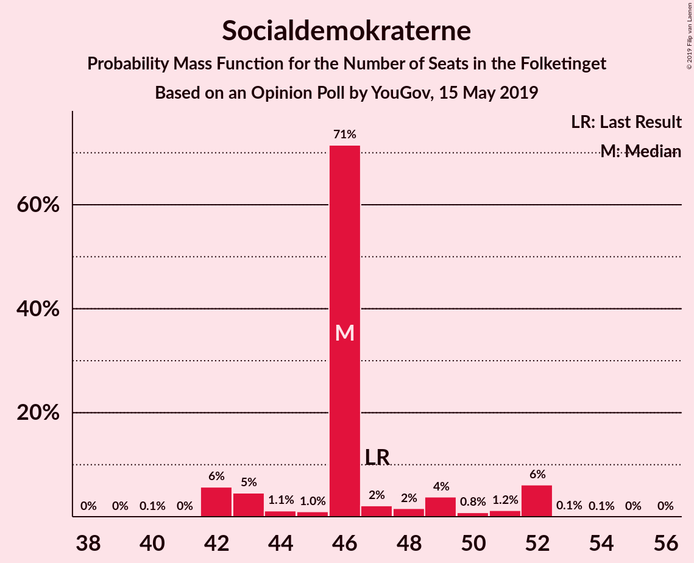

| Number of Seats | Probability | Accumulated | Special Marks |
|:---------------:|:-----------:|:-----------:|:-------------:|
| 40 | 0.1% | 100% |  |
| 41 | 0% | 99.9% |  |
| 42 | 6% | 99.9% |  |
| 43 | 5% | 94% |  |
| 44 | 1.1% | 90% |  |
| 45 | 1.0% | 88% |  |
| 46 | 71% | 87% | Median |
| 47 | 2% | 16% | Last Result |
| 48 | 2% | 14% |  |
| 49 | 4% | 12% |  |
| 50 | 0.8% | 8% |  |
| 51 | 1.2% | 8% |  |
| 52 | 6% | 6% |  |
| 53 | 0.1% | 0.3% |  |
| 54 | 0.1% | 0.2% |  |
| 55 | 0% | 0.1% |  |
| 56 | 0% | 0% |  |

### Venstre

*For a full overview of the results for this party, see the [Venstre](party-venstre.html) page.*

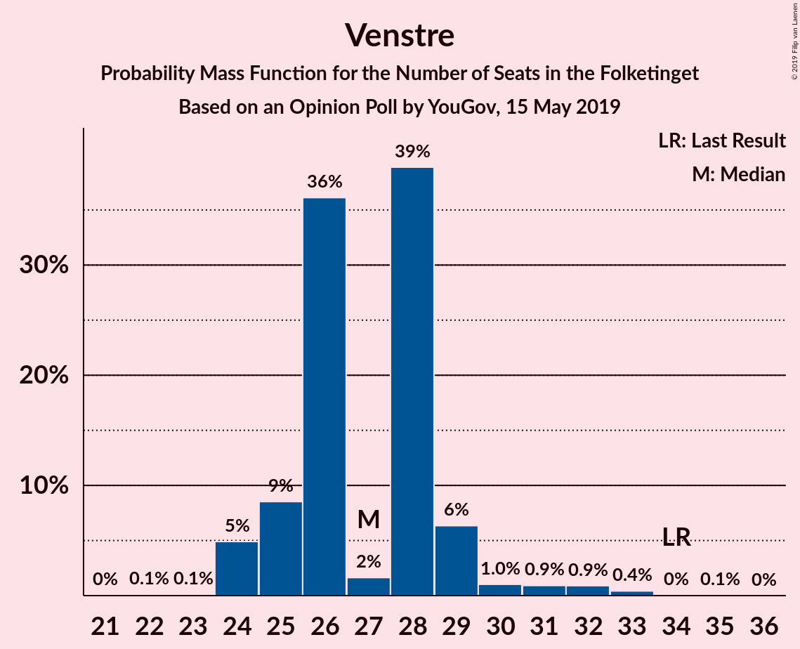

| Number of Seats | Probability | Accumulated | Special Marks |
|:---------------:|:-----------:|:-----------:|:-------------:|
| 22 | 0.1% | 100% |  |
| 23 | 0.1% | 99.9% |  |
| 24 | 5% | 99.8% |  |
| 25 | 9% | 95% |  |
| 26 | 36% | 86% |  |
| 27 | 2% | 50% | Median |
| 28 | 39% | 49% |  |
| 29 | 6% | 10% |  |
| 30 | 1.0% | 3% |  |
| 31 | 0.9% | 2% |  |
| 32 | 0.9% | 1.4% |  |
| 33 | 0.4% | 0.5% |  |
| 34 | 0% | 0.1% | Last Result |
| 35 | 0.1% | 0.1% |  |
| 36 | 0% | 0% |  |

### Dansk Folkeparti

*For a full overview of the results for this party, see the [Dansk Folkeparti](party-danskfolkeparti.html) page.*

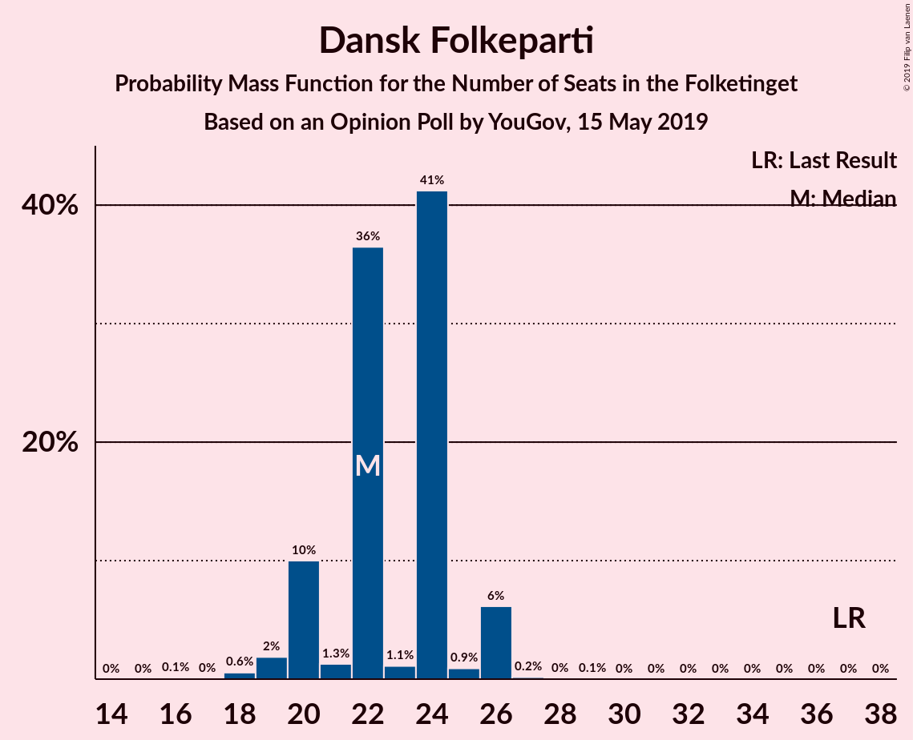

| Number of Seats | Probability | Accumulated | Special Marks |
|:---------------:|:-----------:|:-----------:|:-------------:|
| 16 | 0.1% | 100% |  |
| 17 | 0% | 99.9% |  |
| 18 | 0.6% | 99.9% |  |
| 19 | 2% | 99.3% |  |
| 20 | 10% | 97% |  |
| 21 | 1.3% | 87% |  |
| 22 | 36% | 86% | Median |
| 23 | 1.1% | 50% |  |
| 24 | 41% | 49% |  |
| 25 | 0.9% | 7% |  |
| 26 | 6% | 6% |  |
| 27 | 0.2% | 0.3% |  |
| 28 | 0% | 0.1% |  |
| 29 | 0.1% | 0.1% |  |
| 30 | 0% | 0% |  |
| 31 | 0% | 0% |  |
| 32 | 0% | 0% |  |
| 33 | 0% | 0% |  |
| 34 | 0% | 0% |  |
| 35 | 0% | 0% |  |
| 36 | 0% | 0% |  |
| 37 | 0% | 0% | Last Result |

### Enhedslisten–De Rød-Grønne

*For a full overview of the results for this party, see the [Enhedslisten–De Rød-Grønne](party-enhedslisten–derød-grønne.html) page.*

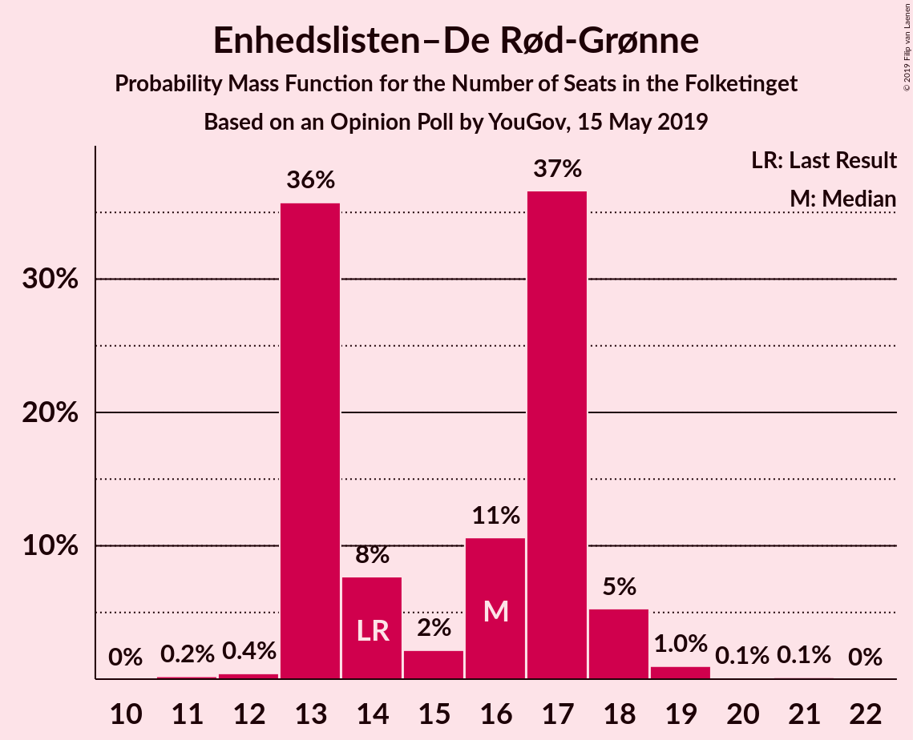

| Number of Seats | Probability | Accumulated | Special Marks |
|:---------------:|:-----------:|:-----------:|:-------------:|
| 11 | 0.2% | 100% |  |
| 12 | 0.4% | 99.8% |  |
| 13 | 36% | 99.4% |  |
| 14 | 8% | 64% | Last Result |
| 15 | 2% | 56% |  |
| 16 | 11% | 54% | Median |
| 17 | 37% | 43% |  |
| 18 | 5% | 7% |  |
| 19 | 1.0% | 1.2% |  |
| 20 | 0.1% | 0.2% |  |
| 21 | 0.1% | 0.1% |  |
| 22 | 0% | 0% |  |

### Socialistisk Folkeparti

*For a full overview of the results for this party, see the [Socialistisk Folkeparti](party-socialistiskfolkeparti.html) page.*

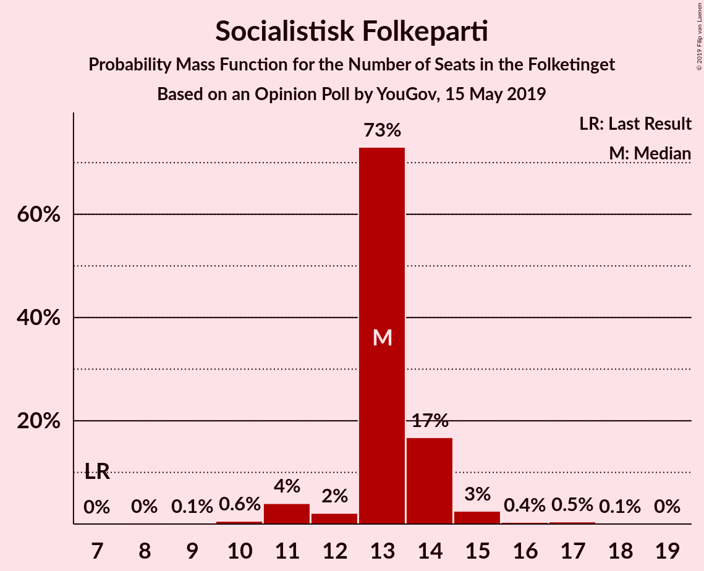

| Number of Seats | Probability | Accumulated | Special Marks |
|:---------------:|:-----------:|:-----------:|:-------------:|
| 7 | 0% | 100% | Last Result |
| 8 | 0% | 100% |  |
| 9 | 0.1% | 100% |  |
| 10 | 0.6% | 99.9% |  |
| 11 | 4% | 99.3% |  |
| 12 | 2% | 95% |  |
| 13 | 73% | 93% | Median |
| 14 | 17% | 20% |  |
| 15 | 3% | 3% |  |
| 16 | 0.4% | 0.9% |  |
| 17 | 0.5% | 0.6% |  |
| 18 | 0.1% | 0.1% |  |
| 19 | 0% | 0% |  |

### Radikale Venstre

*For a full overview of the results for this party, see the [Radikale Venstre](party-radikalevenstre.html) page.*

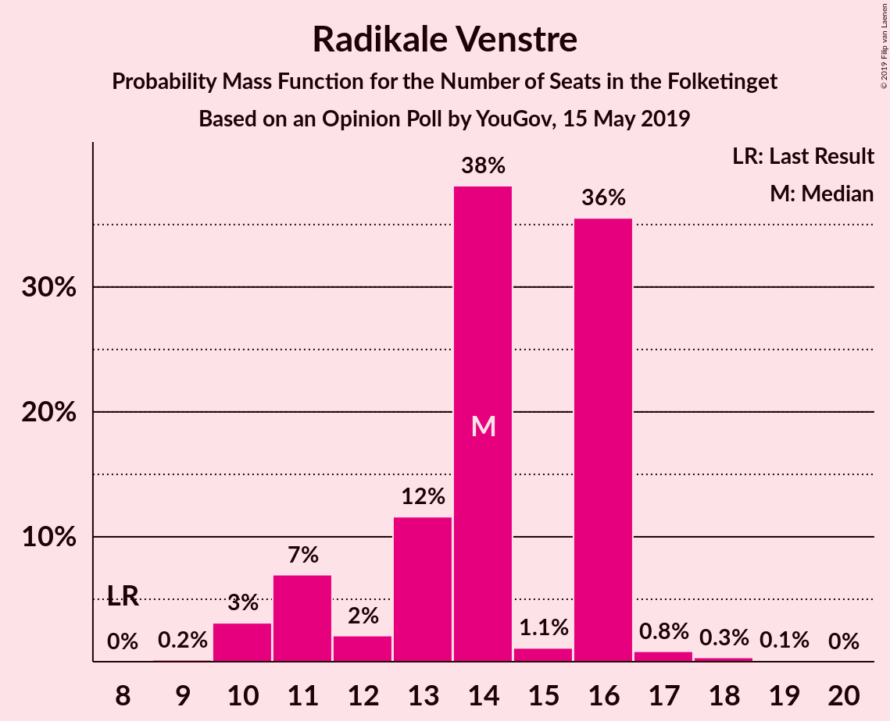

| Number of Seats | Probability | Accumulated | Special Marks |
|:---------------:|:-----------:|:-----------:|:-------------:|
| 8 | 0% | 100% | Last Result |
| 9 | 0.2% | 100% |  |
| 10 | 3% | 99.8% |  |
| 11 | 7% | 97% |  |
| 12 | 2% | 90% |  |
| 13 | 12% | 88% |  |
| 14 | 38% | 76% | Median |
| 15 | 1.1% | 38% |  |
| 16 | 36% | 37% |  |
| 17 | 0.8% | 1.3% |  |
| 18 | 0.3% | 0.5% |  |
| 19 | 0.1% | 0.1% |  |
| 20 | 0% | 0% |  |

### Det Konservative Folkeparti

*For a full overview of the results for this party, see the [Det Konservative Folkeparti](party-detkonservativefolkeparti.html) page.*

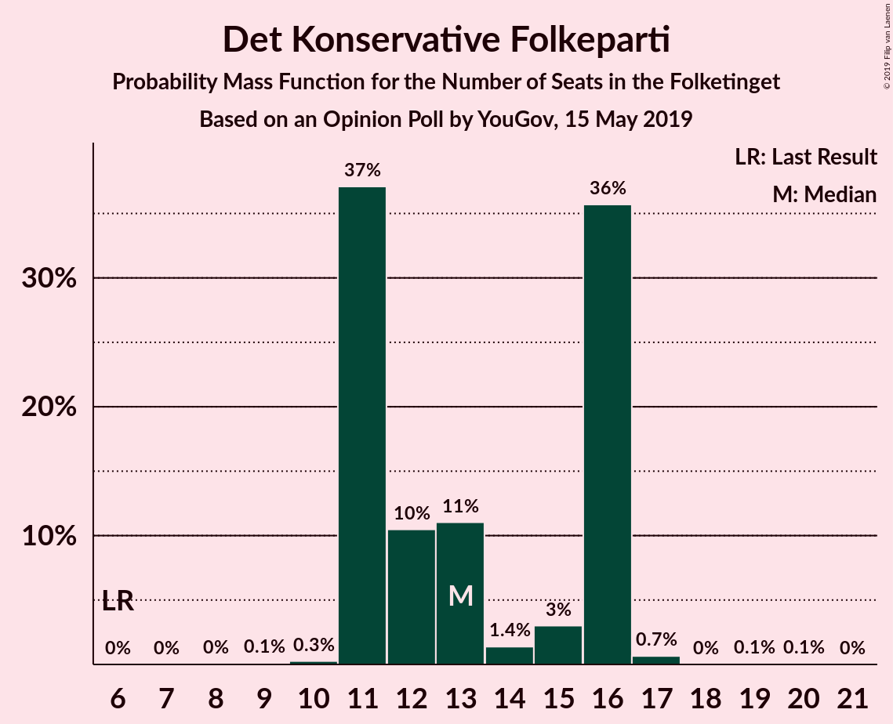

| Number of Seats | Probability | Accumulated | Special Marks |
|:---------------:|:-----------:|:-----------:|:-------------:|
| 6 | 0% | 100% | Last Result |
| 7 | 0% | 100% |  |
| 8 | 0% | 100% |  |
| 9 | 0.1% | 100% |  |
| 10 | 0.3% | 99.8% |  |
| 11 | 37% | 99.6% |  |
| 12 | 10% | 62% |  |
| 13 | 11% | 52% | Median |
| 14 | 1.4% | 41% |  |
| 15 | 3% | 40% |  |
| 16 | 36% | 37% |  |
| 17 | 0.7% | 0.9% |  |
| 18 | 0% | 0.2% |  |
| 19 | 0.1% | 0.2% |  |
| 20 | 0.1% | 0.1% |  |
| 21 | 0% | 0% |  |

### Stram Kurs

*For a full overview of the results for this party, see the [Stram Kurs](party-stramkurs.html) page.*

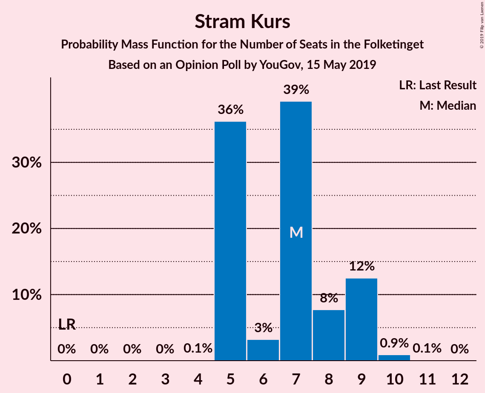

| Number of Seats | Probability | Accumulated | Special Marks |
|:---------------:|:-----------:|:-----------:|:-------------:|
| 0 | 0% | 100% | Last Result |
| 1 | 0% | 100% |  |
| 2 | 0% | 100% |  |
| 3 | 0% | 100% |  |
| 4 | 0.1% | 100% |  |
| 5 | 36% | 99.9% |  |
| 6 | 3% | 64% |  |
| 7 | 39% | 60% | Median |
| 8 | 8% | 21% |  |
| 9 | 12% | 14% |  |
| 10 | 0.9% | 1.0% |  |
| 11 | 0.1% | 0.1% |  |
| 12 | 0% | 0% |  |

### Alternativet

*For a full overview of the results for this party, see the [Alternativet](party-alternativet.html) page.*

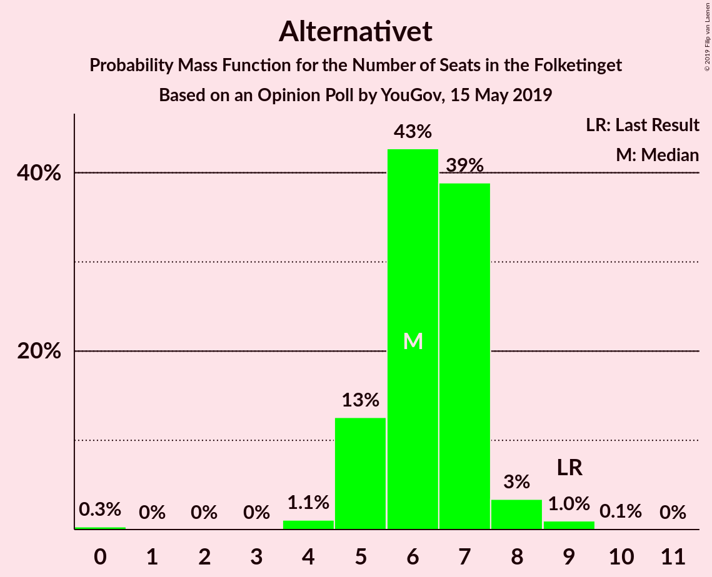

| Number of Seats | Probability | Accumulated | Special Marks |
|:---------------:|:-----------:|:-----------:|:-------------:|
| 0 | 0.3% | 100% |  |
| 1 | 0% | 99.7% |  |
| 2 | 0% | 99.7% |  |
| 3 | 0% | 99.7% |  |
| 4 | 1.1% | 99.7% |  |
| 5 | 13% | 98.6% |  |
| 6 | 43% | 86% | Median |
| 7 | 39% | 43% |  |
| 8 | 3% | 4% |  |
| 9 | 1.0% | 1.1% | Last Result |
| 10 | 0.1% | 0.1% |  |
| 11 | 0% | 0% |  |

### Nye Borgerlige

*For a full overview of the results for this party, see the [Nye Borgerlige](party-nyeborgerlige.html) page.*

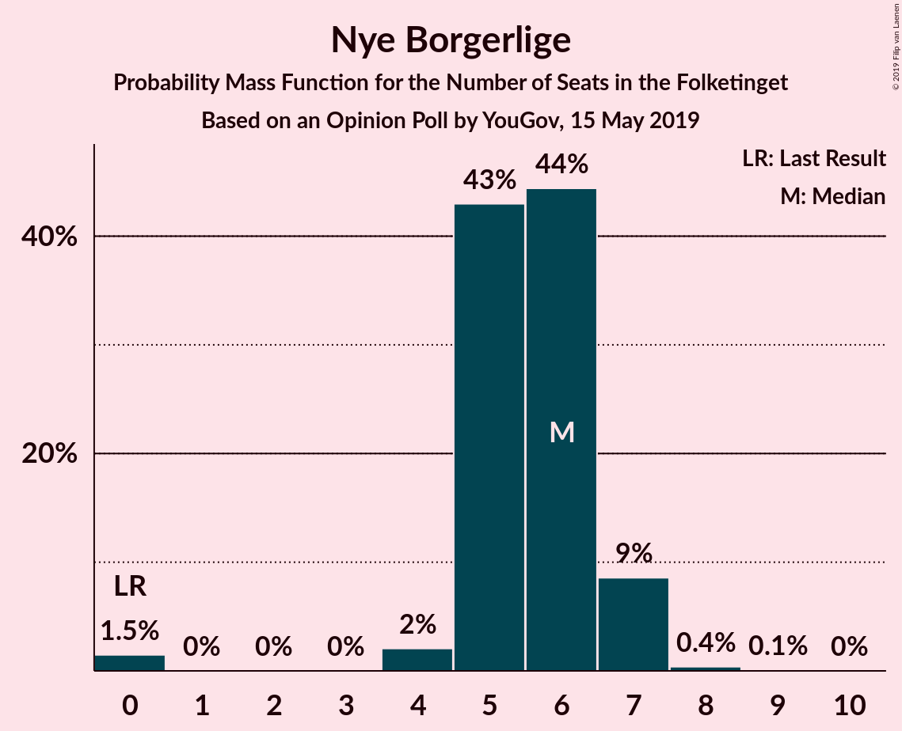

| Number of Seats | Probability | Accumulated | Special Marks |
|:---------------:|:-----------:|:-----------:|:-------------:|
| 0 | 1.5% | 100% | Last Result |
| 1 | 0% | 98.5% |  |
| 2 | 0% | 98.5% |  |
| 3 | 0% | 98.5% |  |
| 4 | 2% | 98.5% |  |
| 5 | 43% | 96% |  |
| 6 | 44% | 53% | Median |
| 7 | 9% | 9% |  |
| 8 | 0.4% | 0.5% |  |
| 9 | 0.1% | 0.1% |  |
| 10 | 0% | 0% |  |

### Liberal Alliance

*For a full overview of the results for this party, see the [Liberal Alliance](party-liberalalliance.html) page.*

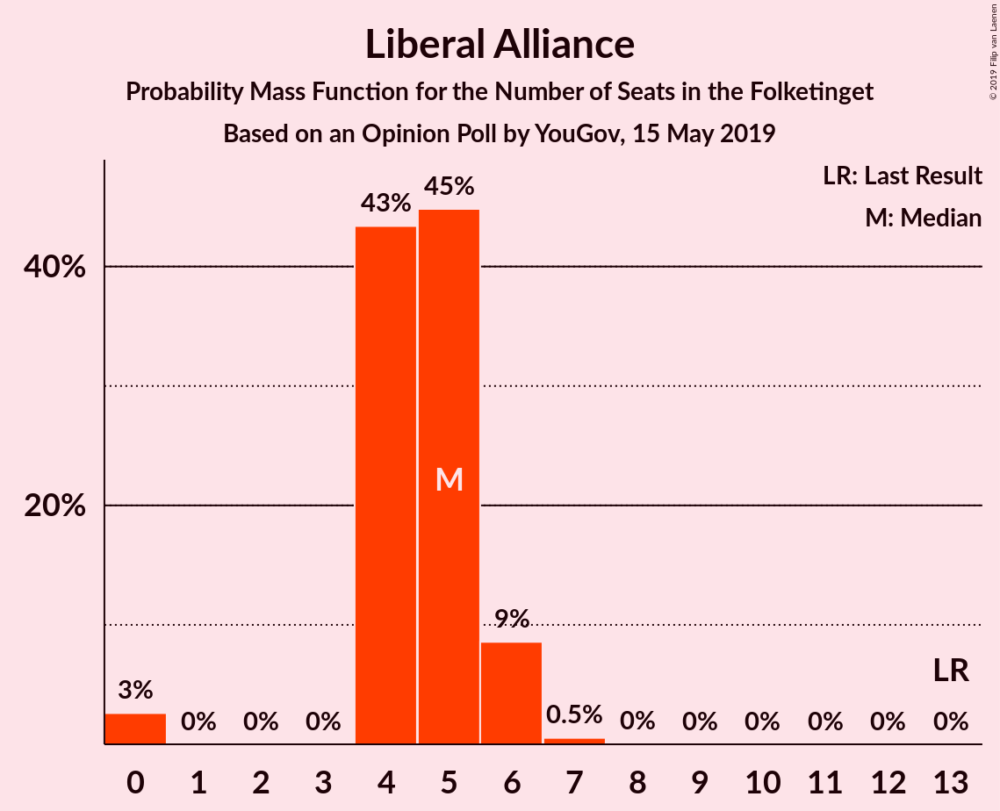

| Number of Seats | Probability | Accumulated | Special Marks |
|:---------------:|:-----------:|:-----------:|:-------------:|
| 0 | 3% | 100% |  |
| 1 | 0% | 97% |  |
| 2 | 0% | 97% |  |
| 3 | 0% | 97% |  |
| 4 | 43% | 97% |  |
| 5 | 45% | 54% | Median |
| 6 | 9% | 9% |  |
| 7 | 0.5% | 0.6% |  |
| 8 | 0% | 0% |  |
| 9 | 0% | 0% |  |
| 10 | 0% | 0% |  |
| 11 | 0% | 0% |  |
| 12 | 0% | 0% |  |
| 13 | 0% | 0% | Last Result |

### Klaus Riskær Pedersen

*For a full overview of the results for this party, see the [Klaus Riskær Pedersen](party-klausriskærpedersen.html) page.*

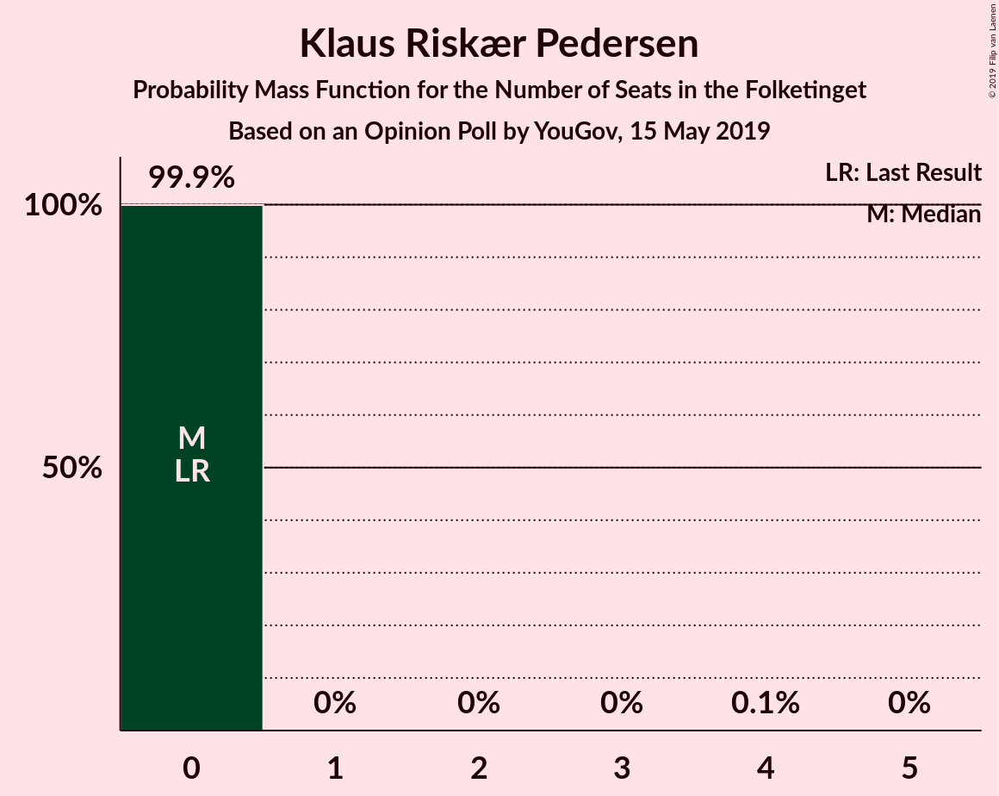

| Number of Seats | Probability | Accumulated | Special Marks |
|:---------------:|:-----------:|:-----------:|:-------------:|
| 0 | 99.9% | 100% | Last Result, Median |
| 1 | 0% | 0.1% |  |
| 2 | 0% | 0.1% |  |
| 3 | 0% | 0.1% |  |
| 4 | 0.1% | 0.1% |  |
| 5 | 0% | 0% |  |

### Kristendemokraterne

*For a full overview of the results for this party, see the [Kristendemokraterne](party-kristendemokraterne.html) page.*

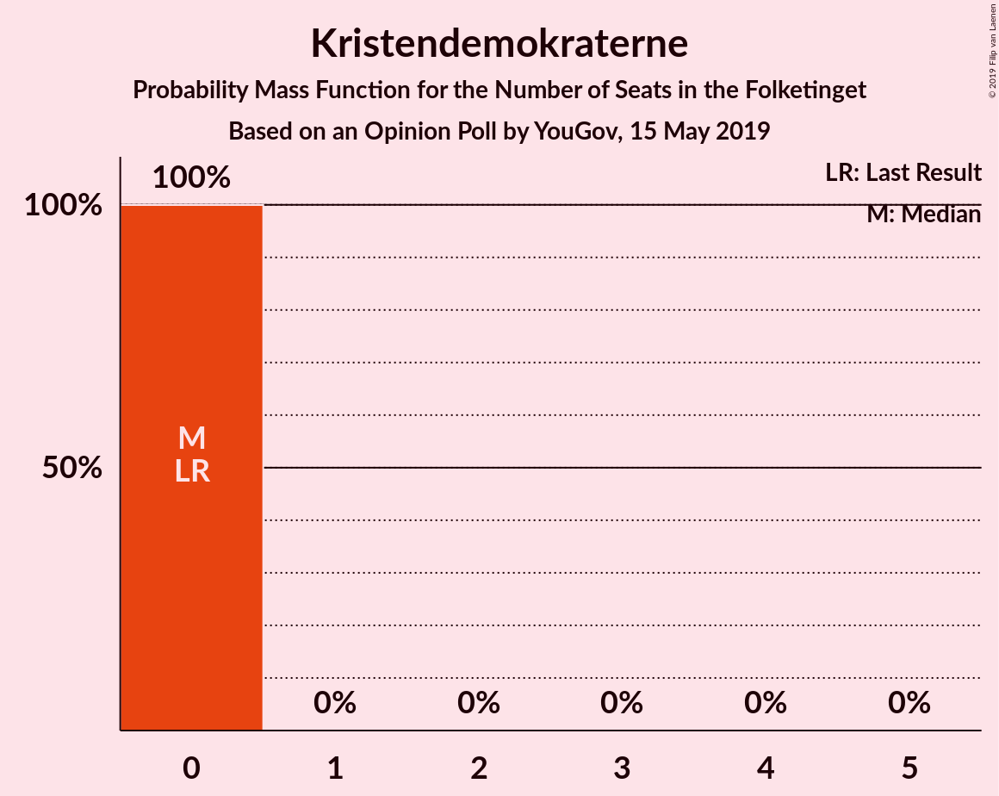

| Number of Seats | Probability | Accumulated | Special Marks |
|:---------------:|:-----------:|:-----------:|:-------------:|
| 0 | 100% | 100% | Last Result, Median |

## Coalitions

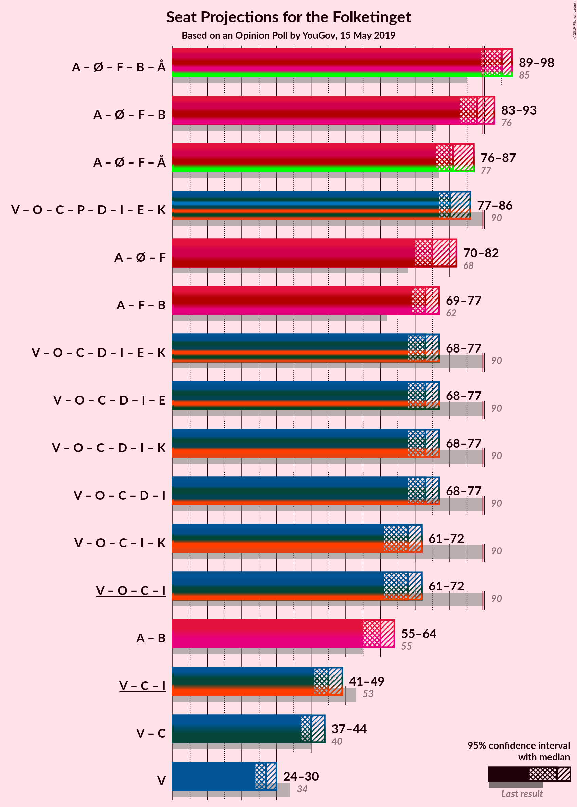

### Confidence Intervals

| Coalition | Last Result | Median | Majority? | 80% Confidence Interval | 90% Confidence Interval | 95% Confidence Interval | 99% Confidence Interval |
|:---------:|:-----------:|:------:|:---------:|:-----------------------:|:-----------------------:|:-----------------------:|:-----------------------:|
| Socialdemokraterne – Enhedslisten–De Rød-Grønne – Socialistisk Folkeparti – Radikale Venstre – Alternativet | 85 | 95 | 94% | 93–98 | 89–98 | 89–98 | 89–103 |
| Socialdemokraterne – Enhedslisten–De Rød-Grønne – Socialistisk Folkeparti – Radikale Venstre | 76 | 88 | 48% | 87–91 | 83–93 | 83–93 | 82–96 |
| Socialdemokraterne – Enhedslisten–De Rød-Grønne – Socialistisk Folkeparti – Alternativet | 77 | 81 | 0.4% | 78–84 | 76–87 | 76–87 | 76–89 |
| Venstre – Dansk Folkeparti – Det Konservative Folkeparti – Stram Kurs – Nye Borgerlige – Liberal Alliance – Klaus Riskær Pedersen – Kristendemokraterne | 90 | 80 | 0% | 77–82 | 77–86 | 77–86 | 72–86 |
| Socialdemokraterne – Enhedslisten–De Rød-Grønne – Socialistisk Folkeparti | 68 | 75 | 0% | 72–78 | 70–82 | 70–82 | 70–82 |
| Socialdemokraterne – Socialistisk Folkeparti – Radikale Venstre | 62 | 73 | 0% | 70–76 | 69–77 | 69–77 | 67–79 |
| Venstre – Dansk Folkeparti – Det Konservative Folkeparti – Nye Borgerlige – Liberal Alliance – Klaus Riskær Pedersen – Kristendemokraterne | 90 | 73 | 0% | 69–74 | 68–77 | 68–77 | 65–79 |
| Venstre – Dansk Folkeparti – Det Konservative Folkeparti – Nye Borgerlige – Liberal Alliance – Klaus Riskær Pedersen | 90 | 73 | 0% | 69–74 | 68–77 | 68–77 | 65–79 |
| Venstre – Dansk Folkeparti – Det Konservative Folkeparti – Nye Borgerlige – Liberal Alliance – Kristendemokraterne | 90 | 73 | 0% | 69–74 | 68–77 | 68–77 | 65–79 |
| Venstre – Dansk Folkeparti – Det Konservative Folkeparti – Nye Borgerlige – Liberal Alliance | 90 | 73 | 0% | 69–74 | 68–77 | 68–77 | 65–79 |
| Venstre – Dansk Folkeparti – Det Konservative Folkeparti – Liberal Alliance – Kristendemokraterne | 90 | 68 | 0% | 64–70 | 61–72 | 61–72 | 60–74 |
| Venstre – Dansk Folkeparti – Det Konservative Folkeparti – Liberal Alliance | 90 | 68 | 0% | 64–70 | 61–72 | 61–72 | 60–74 |
| Socialdemokraterne – Radikale Venstre | 55 | 60 | 0% | 56–62 | 55–63 | 55–64 | 55–66 |
| Venstre – Det Konservative Folkeparti – Liberal Alliance | 53 | 45 | 0% | 42–46 | 41–48 | 41–49 | 38–51 |
| Venstre – Det Konservative Folkeparti | 40 | 40 | 0% | 37–42 | 37–42 | 37–44 | 35–47 |
| Venstre | 34 | 27 | 0% | 25–28 | 24–29 | 24–30 | 24–33 |

### Socialdemokraterne – Enhedslisten–De Rød-Grønne – Socialistisk Folkeparti – Radikale Venstre – Alternativet

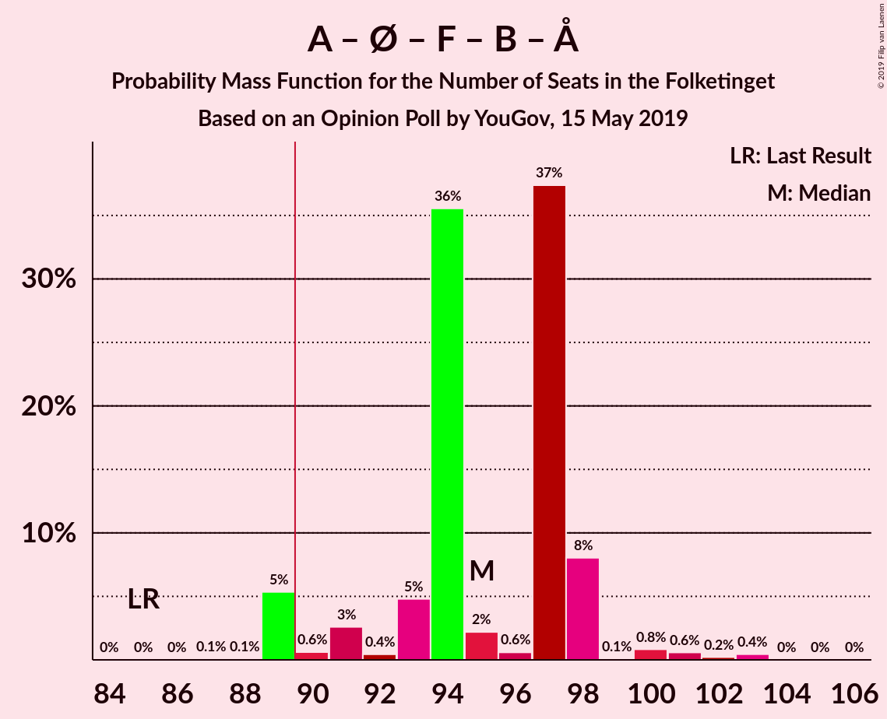

| Number of Seats | Probability | Accumulated | Special Marks |
|:---------------:|:-----------:|:-----------:|:-------------:|
| 85 | 0% | 100% | Last Result |
| 86 | 0% | 100% |  |
| 87 | 0.1% | 100% |  |
| 88 | 0.1% | 99.9% |  |
| 89 | 5% | 99.8% |  |
| 90 | 0.6% | 94% | Majority |
| 91 | 3% | 94% |  |
| 92 | 0.4% | 91% |  |
| 93 | 5% | 91% |  |
| 94 | 36% | 86% |  |
| 95 | 2% | 50% | Median |
| 96 | 0.6% | 48% |  |
| 97 | 37% | 48% |  |
| 98 | 8% | 10% |  |
| 99 | 0.1% | 2% |  |
| 100 | 0.8% | 2% |  |
| 101 | 0.6% | 1.3% |  |
| 102 | 0.2% | 0.8% |  |
| 103 | 0.4% | 0.5% |  |
| 104 | 0% | 0.1% |  |
| 105 | 0% | 0.1% |  |
| 106 | 0% | 0% |  |

### Socialdemokraterne – Enhedslisten–De Rød-Grønne – Socialistisk Folkeparti – Radikale Venstre

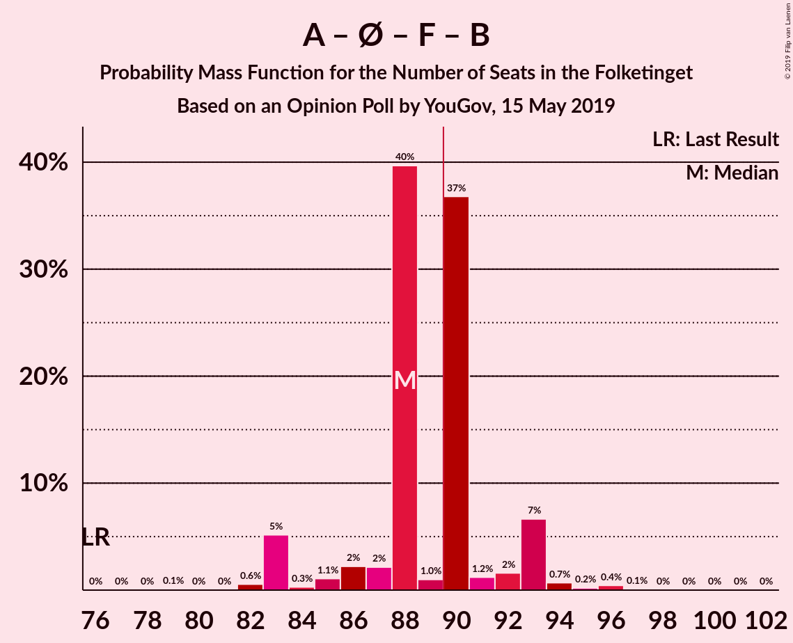

| Number of Seats | Probability | Accumulated | Special Marks |
|:---------------:|:-----------:|:-----------:|:-------------:|
| 76 | 0% | 100% | Last Result |
| 77 | 0% | 100% |  |
| 78 | 0% | 100% |  |
| 79 | 0.1% | 100% |  |
| 80 | 0% | 99.9% |  |
| 81 | 0% | 99.9% |  |
| 82 | 0.6% | 99.9% |  |
| 83 | 5% | 99.3% |  |
| 84 | 0.3% | 94% |  |
| 85 | 1.1% | 94% |  |
| 86 | 2% | 93% |  |
| 87 | 2% | 91% |  |
| 88 | 40% | 88% |  |
| 89 | 1.0% | 49% | Median |
| 90 | 37% | 48% | Majority |
| 91 | 1.2% | 11% |  |
| 92 | 2% | 10% |  |
| 93 | 7% | 8% |  |
| 94 | 0.7% | 2% |  |
| 95 | 0.2% | 0.8% |  |
| 96 | 0.4% | 0.6% |  |
| 97 | 0.1% | 0.2% |  |
| 98 | 0% | 0.1% |  |
| 99 | 0% | 0.1% |  |
| 100 | 0% | 0.1% |  |
| 101 | 0% | 0% |  |

### Socialdemokraterne – Enhedslisten–De Rød-Grønne – Socialistisk Folkeparti – Alternativet

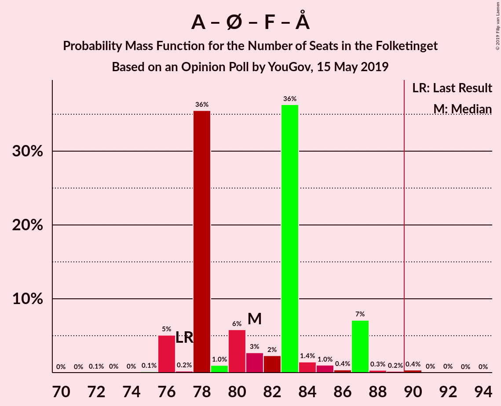

| Number of Seats | Probability | Accumulated | Special Marks |
|:---------------:|:-----------:|:-----------:|:-------------:|
| 72 | 0.1% | 100% |  |
| 73 | 0% | 99.9% |  |
| 74 | 0% | 99.9% |  |
| 75 | 0.1% | 99.9% |  |
| 76 | 5% | 99.8% |  |
| 77 | 0.2% | 95% | Last Result |
| 78 | 36% | 94% |  |
| 79 | 1.0% | 59% |  |
| 80 | 6% | 58% |  |
| 81 | 3% | 52% | Median |
| 82 | 2% | 49% |  |
| 83 | 36% | 47% |  |
| 84 | 1.4% | 11% |  |
| 85 | 1.0% | 9% |  |
| 86 | 0.4% | 8% |  |
| 87 | 7% | 8% |  |
| 88 | 0.3% | 0.9% |  |
| 89 | 0.2% | 0.6% |  |
| 90 | 0.4% | 0.4% | Majority |
| 91 | 0% | 0.1% |  |
| 92 | 0% | 0.1% |  |
| 93 | 0% | 0% |  |

### Venstre – Dansk Folkeparti – Det Konservative Folkeparti – Stram Kurs – Nye Borgerlige – Liberal Alliance – Klaus Riskær Pedersen – Kristendemokraterne

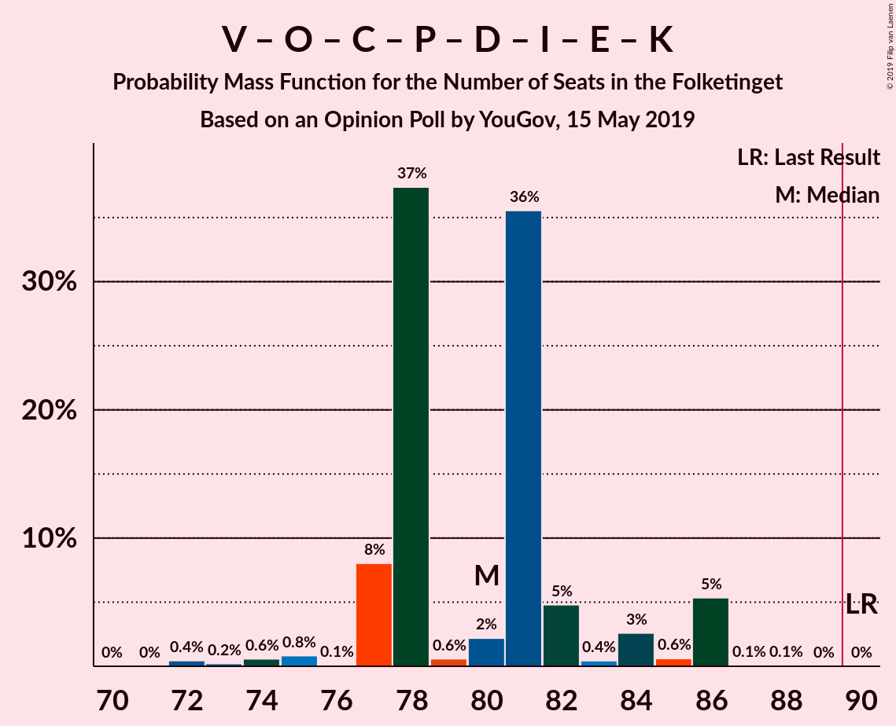

| Number of Seats | Probability | Accumulated | Special Marks |
|:---------------:|:-----------:|:-----------:|:-------------:|
| 70 | 0% | 100% |  |
| 71 | 0% | 99.9% |  |
| 72 | 0.4% | 99.9% |  |
| 73 | 0.2% | 99.5% |  |
| 74 | 0.6% | 99.2% |  |
| 75 | 0.8% | 98.7% |  |
| 76 | 0.1% | 98% |  |
| 77 | 8% | 98% |  |
| 78 | 37% | 90% |  |
| 79 | 0.6% | 52% |  |
| 80 | 2% | 52% | Median |
| 81 | 36% | 50% |  |
| 82 | 5% | 14% |  |
| 83 | 0.4% | 9% |  |
| 84 | 3% | 9% |  |
| 85 | 0.6% | 6% |  |
| 86 | 5% | 6% |  |
| 87 | 0.1% | 0.2% |  |
| 88 | 0.1% | 0.1% |  |
| 89 | 0% | 0% |  |
| 90 | 0% | 0% | Last Result, Majority |

### Socialdemokraterne – Enhedslisten–De Rød-Grønne – Socialistisk Folkeparti

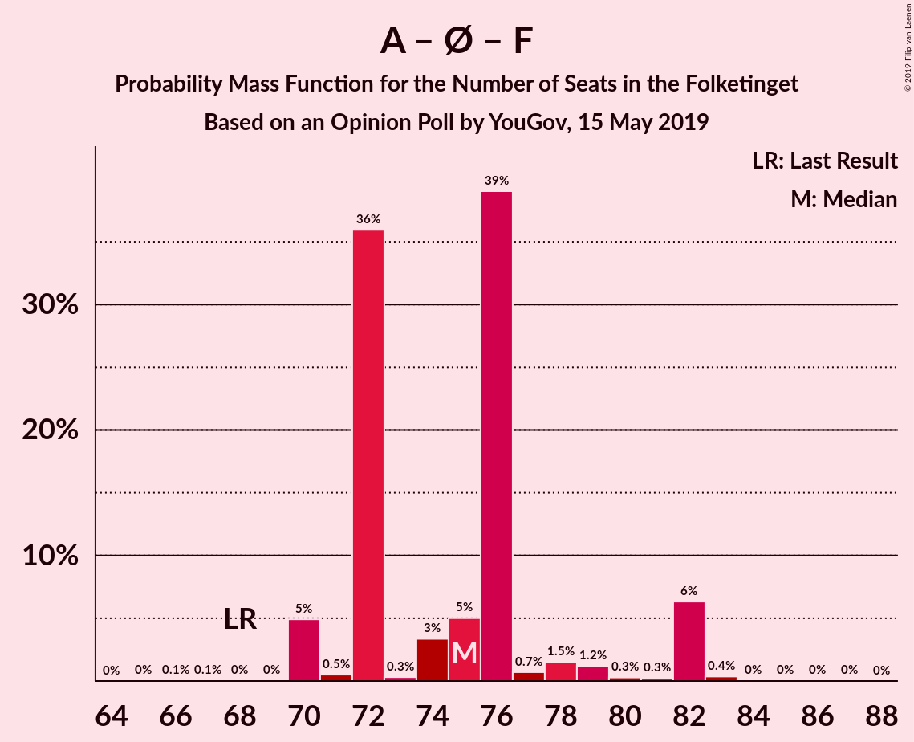

| Number of Seats | Probability | Accumulated | Special Marks |
|:---------------:|:-----------:|:-----------:|:-------------:|
| 66 | 0.1% | 100% |  |
| 67 | 0.1% | 99.9% |  |
| 68 | 0% | 99.9% | Last Result |
| 69 | 0% | 99.8% |  |
| 70 | 5% | 99.8% |  |
| 71 | 0.5% | 95% |  |
| 72 | 36% | 94% |  |
| 73 | 0.3% | 58% |  |
| 74 | 3% | 58% |  |
| 75 | 5% | 55% | Median |
| 76 | 39% | 50% |  |
| 77 | 0.7% | 11% |  |
| 78 | 1.5% | 10% |  |
| 79 | 1.2% | 9% |  |
| 80 | 0.3% | 7% |  |
| 81 | 0.3% | 7% |  |
| 82 | 6% | 7% |  |
| 83 | 0.4% | 0.5% |  |
| 84 | 0% | 0.1% |  |
| 85 | 0% | 0.1% |  |
| 86 | 0% | 0.1% |  |
| 87 | 0% | 0% |  |

### Socialdemokraterne – Socialistisk Folkeparti – Radikale Venstre

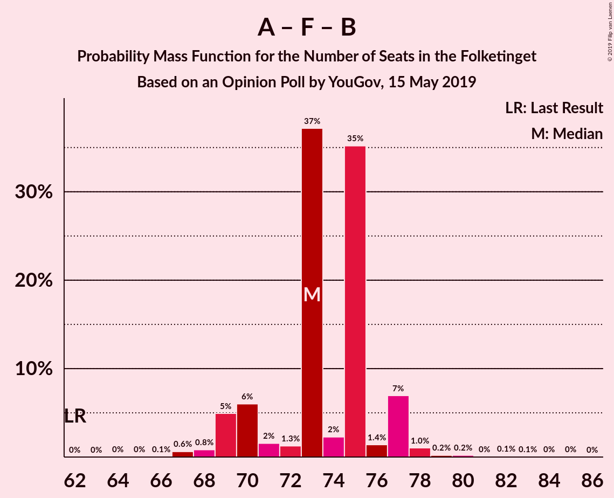

| Number of Seats | Probability | Accumulated | Special Marks |
|:---------------:|:-----------:|:-----------:|:-------------:|
| 62 | 0% | 100% | Last Result |
| 63 | 0% | 100% |  |
| 64 | 0% | 100% |  |
| 65 | 0% | 100% |  |
| 66 | 0.1% | 100% |  |
| 67 | 0.6% | 99.9% |  |
| 68 | 0.8% | 99.3% |  |
| 69 | 5% | 98% |  |
| 70 | 6% | 94% |  |
| 71 | 2% | 88% |  |
| 72 | 1.3% | 86% |  |
| 73 | 37% | 85% | Median |
| 74 | 2% | 48% |  |
| 75 | 35% | 45% |  |
| 76 | 1.4% | 10% |  |
| 77 | 7% | 9% |  |
| 78 | 1.0% | 2% |  |
| 79 | 0.2% | 0.7% |  |
| 80 | 0.2% | 0.5% |  |
| 81 | 0% | 0.3% |  |
| 82 | 0.1% | 0.2% |  |
| 83 | 0.1% | 0.1% |  |
| 84 | 0% | 0.1% |  |
| 85 | 0% | 0% |  |

### Venstre – Dansk Folkeparti – Det Konservative Folkeparti – Nye Borgerlige – Liberal Alliance – Klaus Riskær Pedersen – Kristendemokraterne

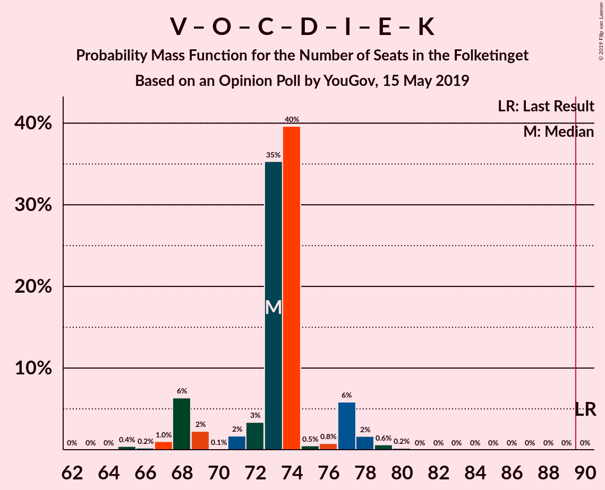

| Number of Seats | Probability | Accumulated | Special Marks |
|:---------------:|:-----------:|:-----------:|:-------------:|
| 63 | 0% | 100% |  |
| 64 | 0% | 99.9% |  |
| 65 | 0.4% | 99.9% |  |
| 66 | 0.2% | 99.5% |  |
| 67 | 1.0% | 99.2% |  |
| 68 | 6% | 98% |  |
| 69 | 2% | 92% |  |
| 70 | 0.1% | 90% |  |
| 71 | 2% | 90% |  |
| 72 | 3% | 88% |  |
| 73 | 35% | 85% | Median |
| 74 | 40% | 49% |  |
| 75 | 0.5% | 10% |  |
| 76 | 0.8% | 9% |  |
| 77 | 6% | 8% |  |
| 78 | 2% | 2% |  |
| 79 | 0.6% | 0.8% |  |
| 80 | 0.2% | 0.2% |  |
| 81 | 0% | 0% |  |
| 82 | 0% | 0% |  |
| 83 | 0% | 0% |  |
| 84 | 0% | 0% |  |
| 85 | 0% | 0% |  |
| 86 | 0% | 0% |  |
| 87 | 0% | 0% |  |
| 88 | 0% | 0% |  |
| 89 | 0% | 0% |  |
| 90 | 0% | 0% | Last Result, Majority |

### Venstre – Dansk Folkeparti – Det Konservative Folkeparti – Nye Borgerlige – Liberal Alliance – Klaus Riskær Pedersen

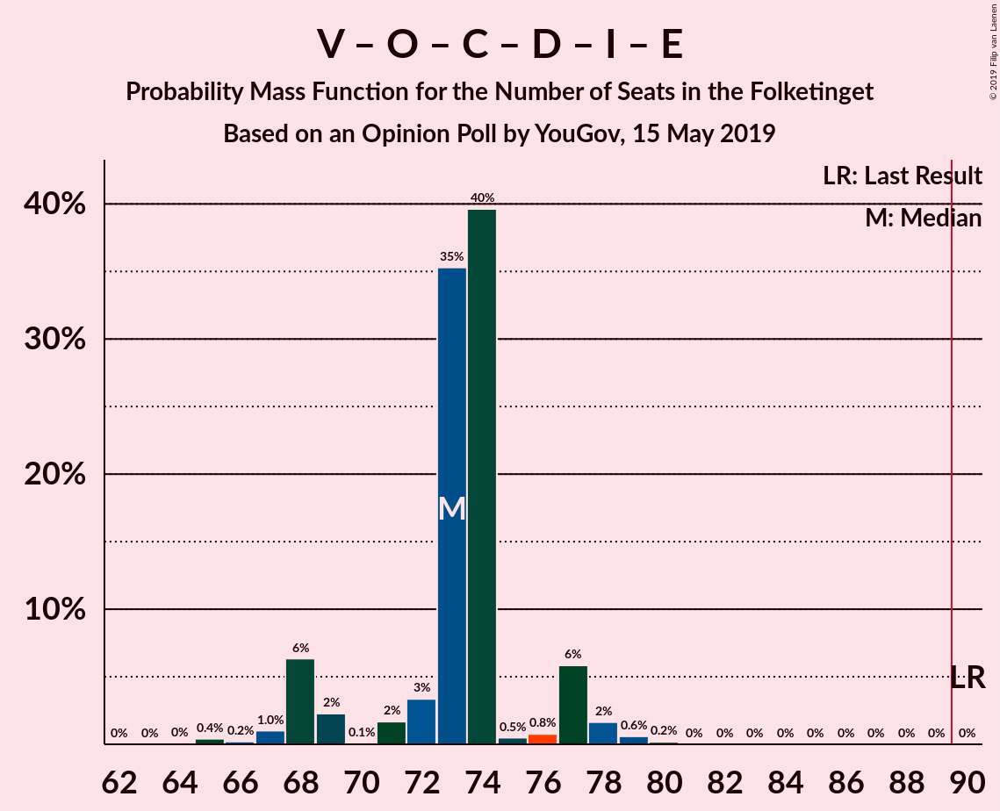

| Number of Seats | Probability | Accumulated | Special Marks |
|:---------------:|:-----------:|:-----------:|:-------------:|
| 63 | 0% | 100% |  |
| 64 | 0% | 99.9% |  |
| 65 | 0.4% | 99.9% |  |
| 66 | 0.2% | 99.5% |  |
| 67 | 1.0% | 99.2% |  |
| 68 | 6% | 98% |  |
| 69 | 2% | 92% |  |
| 70 | 0.1% | 90% |  |
| 71 | 2% | 90% |  |
| 72 | 3% | 88% |  |
| 73 | 35% | 84% | Median |
| 74 | 40% | 49% |  |
| 75 | 0.5% | 10% |  |
| 76 | 0.8% | 9% |  |
| 77 | 6% | 8% |  |
| 78 | 2% | 2% |  |
| 79 | 0.6% | 0.8% |  |
| 80 | 0.2% | 0.2% |  |
| 81 | 0% | 0% |  |
| 82 | 0% | 0% |  |
| 83 | 0% | 0% |  |
| 84 | 0% | 0% |  |
| 85 | 0% | 0% |  |
| 86 | 0% | 0% |  |
| 87 | 0% | 0% |  |
| 88 | 0% | 0% |  |
| 89 | 0% | 0% |  |
| 90 | 0% | 0% | Last Result, Majority |

### Venstre – Dansk Folkeparti – Det Konservative Folkeparti – Nye Borgerlige – Liberal Alliance – Kristendemokraterne

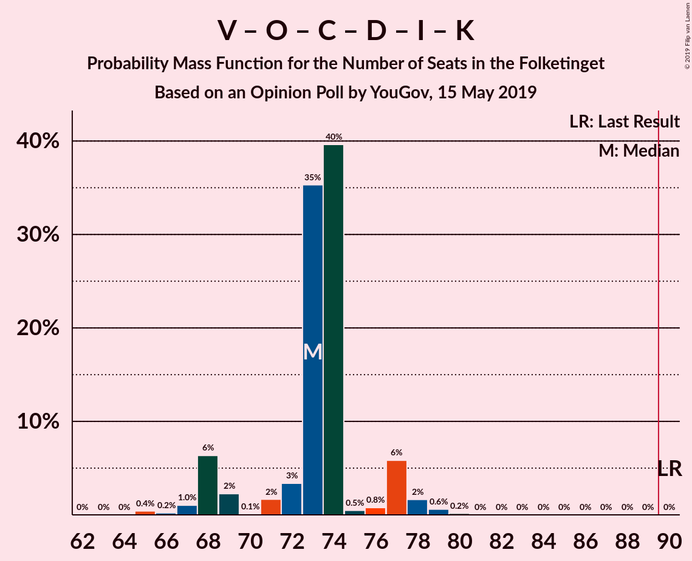

| Number of Seats | Probability | Accumulated | Special Marks |
|:---------------:|:-----------:|:-----------:|:-------------:|
| 63 | 0% | 100% |  |
| 64 | 0% | 99.9% |  |
| 65 | 0.4% | 99.9% |  |
| 66 | 0.2% | 99.5% |  |
| 67 | 1.0% | 99.2% |  |
| 68 | 6% | 98% |  |
| 69 | 2% | 92% |  |
| 70 | 0.1% | 90% |  |
| 71 | 2% | 90% |  |
| 72 | 3% | 88% |  |
| 73 | 35% | 84% | Median |
| 74 | 40% | 49% |  |
| 75 | 0.5% | 10% |  |
| 76 | 0.8% | 9% |  |
| 77 | 6% | 8% |  |
| 78 | 2% | 2% |  |
| 79 | 0.6% | 0.8% |  |
| 80 | 0.2% | 0.2% |  |
| 81 | 0% | 0% |  |
| 82 | 0% | 0% |  |
| 83 | 0% | 0% |  |
| 84 | 0% | 0% |  |
| 85 | 0% | 0% |  |
| 86 | 0% | 0% |  |
| 87 | 0% | 0% |  |
| 88 | 0% | 0% |  |
| 89 | 0% | 0% |  |
| 90 | 0% | 0% | Last Result, Majority |

### Venstre – Dansk Folkeparti – Det Konservative Folkeparti – Nye Borgerlige – Liberal Alliance

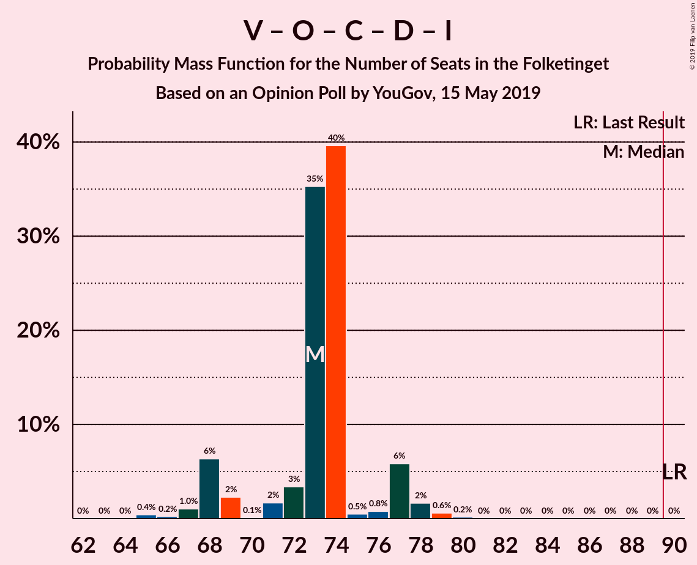

| Number of Seats | Probability | Accumulated | Special Marks |
|:---------------:|:-----------:|:-----------:|:-------------:|
| 63 | 0% | 100% |  |
| 64 | 0% | 99.9% |  |
| 65 | 0.4% | 99.9% |  |
| 66 | 0.2% | 99.5% |  |
| 67 | 1.0% | 99.2% |  |
| 68 | 6% | 98% |  |
| 69 | 2% | 92% |  |
| 70 | 0.1% | 90% |  |
| 71 | 2% | 90% |  |
| 72 | 3% | 88% |  |
| 73 | 35% | 84% | Median |
| 74 | 40% | 49% |  |
| 75 | 0.5% | 10% |  |
| 76 | 0.8% | 9% |  |
| 77 | 6% | 8% |  |
| 78 | 2% | 2% |  |
| 79 | 0.6% | 0.8% |  |
| 80 | 0.2% | 0.2% |  |
| 81 | 0% | 0% |  |
| 82 | 0% | 0% |  |
| 83 | 0% | 0% |  |
| 84 | 0% | 0% |  |
| 85 | 0% | 0% |  |
| 86 | 0% | 0% |  |
| 87 | 0% | 0% |  |
| 88 | 0% | 0% |  |
| 89 | 0% | 0% |  |
| 90 | 0% | 0% | Last Result, Majority |

### Venstre – Dansk Folkeparti – Det Konservative Folkeparti – Liberal Alliance – Kristendemokraterne

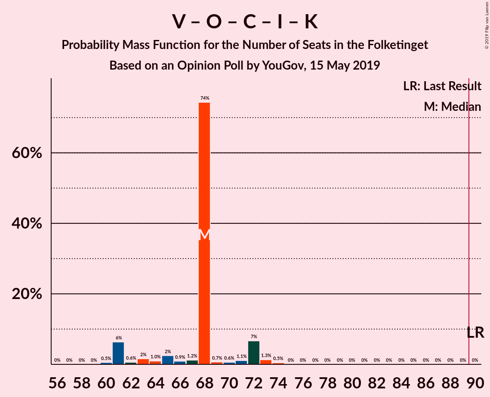

| Number of Seats | Probability | Accumulated | Special Marks |
|:---------------:|:-----------:|:-----------:|:-------------:|
| 57 | 0% | 100% |  |
| 58 | 0% | 99.9% |  |
| 59 | 0% | 99.9% |  |
| 60 | 0.5% | 99.9% |  |
| 61 | 6% | 99.4% |  |
| 62 | 0.6% | 93% |  |
| 63 | 2% | 92% |  |
| 64 | 1.0% | 91% |  |
| 65 | 2% | 90% |  |
| 66 | 0.9% | 87% |  |
| 67 | 1.2% | 86% | Median |
| 68 | 74% | 85% |  |
| 69 | 0.7% | 11% |  |
| 70 | 0.6% | 10% |  |
| 71 | 1.1% | 10% |  |
| 72 | 7% | 8% |  |
| 73 | 1.3% | 2% |  |
| 74 | 0.5% | 0.5% |  |
| 75 | 0% | 0% |  |
| 76 | 0% | 0% |  |
| 77 | 0% | 0% |  |
| 78 | 0% | 0% |  |
| 79 | 0% | 0% |  |
| 80 | 0% | 0% |  |
| 81 | 0% | 0% |  |
| 82 | 0% | 0% |  |
| 83 | 0% | 0% |  |
| 84 | 0% | 0% |  |
| 85 | 0% | 0% |  |
| 86 | 0% | 0% |  |
| 87 | 0% | 0% |  |
| 88 | 0% | 0% |  |
| 89 | 0% | 0% |  |
| 90 | 0% | 0% | Last Result, Majority |

### Venstre – Dansk Folkeparti – Det Konservative Folkeparti – Liberal Alliance

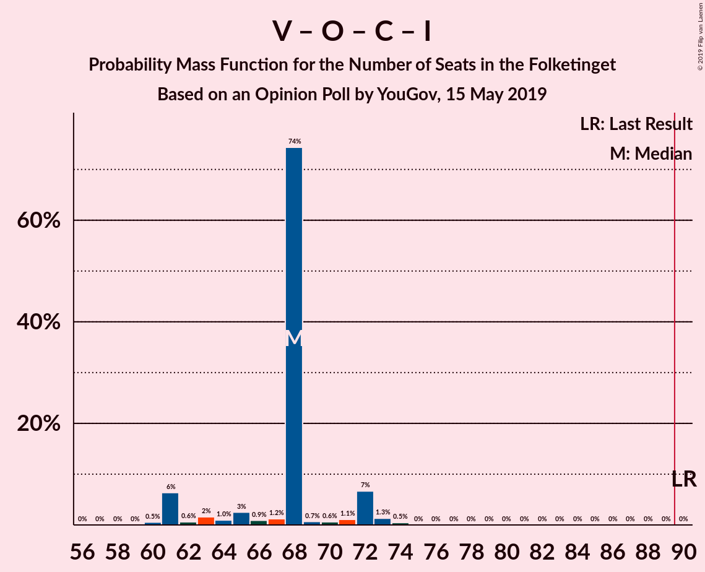

| Number of Seats | Probability | Accumulated | Special Marks |
|:---------------:|:-----------:|:-----------:|:-------------:|
| 57 | 0% | 100% |  |
| 58 | 0% | 99.9% |  |
| 59 | 0% | 99.9% |  |
| 60 | 0.5% | 99.9% |  |
| 61 | 6% | 99.4% |  |
| 62 | 0.6% | 93% |  |
| 63 | 2% | 92% |  |
| 64 | 1.0% | 91% |  |
| 65 | 3% | 90% |  |
| 66 | 0.9% | 87% |  |
| 67 | 1.2% | 86% | Median |
| 68 | 74% | 85% |  |
| 69 | 0.7% | 11% |  |
| 70 | 0.6% | 10% |  |
| 71 | 1.1% | 10% |  |
| 72 | 7% | 8% |  |
| 73 | 1.3% | 2% |  |
| 74 | 0.5% | 0.5% |  |
| 75 | 0% | 0% |  |
| 76 | 0% | 0% |  |
| 77 | 0% | 0% |  |
| 78 | 0% | 0% |  |
| 79 | 0% | 0% |  |
| 80 | 0% | 0% |  |
| 81 | 0% | 0% |  |
| 82 | 0% | 0% |  |
| 83 | 0% | 0% |  |
| 84 | 0% | 0% |  |
| 85 | 0% | 0% |  |
| 86 | 0% | 0% |  |
| 87 | 0% | 0% |  |
| 88 | 0% | 0% |  |
| 89 | 0% | 0% |  |
| 90 | 0% | 0% | Last Result, Majority |

### Socialdemokraterne – Radikale Venstre

| Number of Seats | Probability | Accumulated | Special Marks |
|:---------------:|:-----------:|:-----------:|:-------------:|
| 52 | 0.1% | 100% |  |
| 53 | 0.1% | 99.9% |  |
| 54 | 0% | 99.8% |  |
| 55 | 6% | 99.7% | Last Result |
| 56 | 5% | 93% |  |
| 57 | 2% | 89% |  |
| 58 | 0.5% | 87% |  |
| 59 | 2% | 86% |  |
| 60 | 36% | 84% | Median |
| 61 | 0.7% | 48% |  |
| 62 | 37% | 47% |  |
| 63 | 7% | 10% |  |
| 64 | 0.7% | 3% |  |
| 65 | 1.2% | 2% |  |
| 66 | 0.9% | 1.1% |  |
| 67 | 0.1% | 0.2% |  |
| 68 | 0% | 0.2% |  |
| 69 | 0.1% | 0.1% |  |
| 70 | 0.1% | 0.1% |  |
| 71 | 0% | 0% |  |

### Venstre – Det Konservative Folkeparti – Liberal Alliance

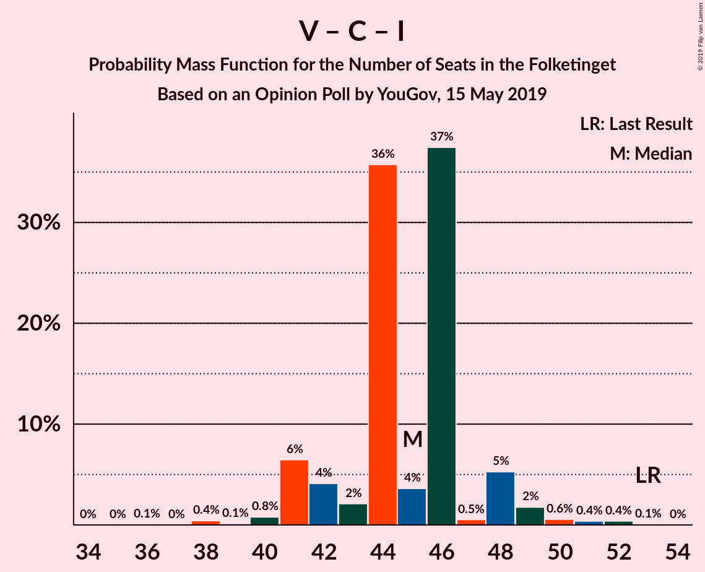

| Number of Seats | Probability | Accumulated | Special Marks |
|:---------------:|:-----------:|:-----------:|:-------------:|
| 36 | 0.1% | 100% |  |
| 37 | 0% | 99.9% |  |
| 38 | 0.4% | 99.9% |  |
| 39 | 0.1% | 99.4% |  |
| 40 | 0.8% | 99.3% |  |
| 41 | 6% | 98.5% |  |
| 42 | 4% | 92% |  |
| 43 | 2% | 88% |  |
| 44 | 36% | 86% |  |
| 45 | 4% | 50% | Median |
| 46 | 37% | 46% |  |
| 47 | 0.5% | 9% |  |
| 48 | 5% | 8% |  |
| 49 | 2% | 3% |  |
| 50 | 0.6% | 1.4% |  |
| 51 | 0.4% | 0.9% |  |
| 52 | 0.4% | 0.5% |  |
| 53 | 0.1% | 0.1% | Last Result |
| 54 | 0% | 0% |  |

### Venstre – Det Konservative Folkeparti

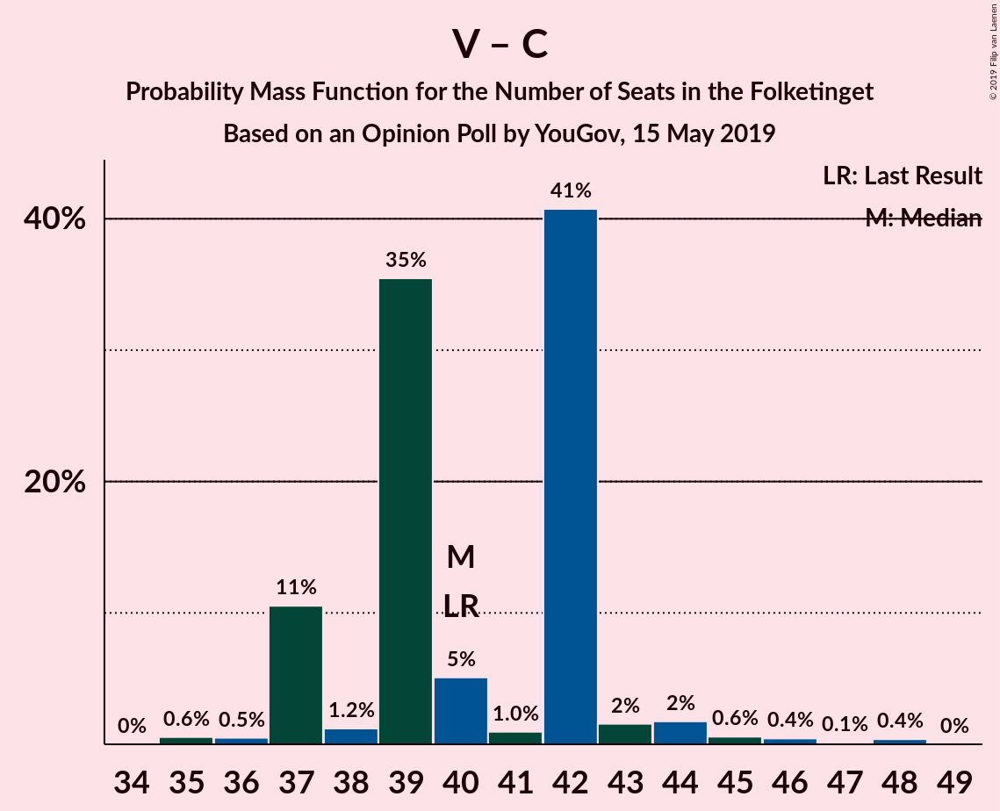

| Number of Seats | Probability | Accumulated | Special Marks |
|:---------------:|:-----------:|:-----------:|:-------------:|
| 35 | 0.6% | 100% |  |
| 36 | 0.5% | 99.4% |  |
| 37 | 11% | 98.9% |  |
| 38 | 1.2% | 88% |  |
| 39 | 35% | 87% |  |
| 40 | 5% | 52% | Last Result, Median |
| 41 | 1.0% | 47% |  |
| 42 | 41% | 46% |  |
| 43 | 2% | 5% |  |
| 44 | 2% | 3% |  |
| 45 | 0.6% | 2% |  |
| 46 | 0.4% | 1.0% |  |
| 47 | 0.1% | 0.6% |  |
| 48 | 0.4% | 0.4% |  |
| 49 | 0% | 0% |  |

### Venstre

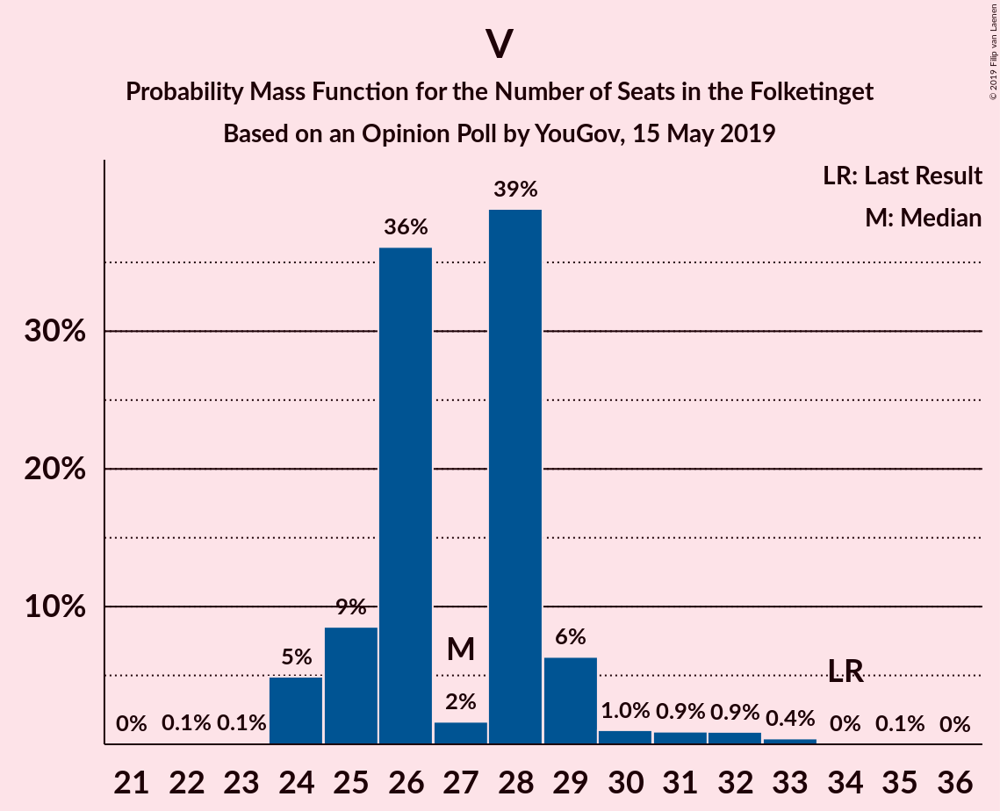

| Number of Seats | Probability | Accumulated | Special Marks |
|:---------------:|:-----------:|:-----------:|:-------------:|
| 22 | 0.1% | 100% |  |
| 23 | 0.1% | 99.9% |  |
| 24 | 5% | 99.8% |  |
| 25 | 9% | 95% |  |
| 26 | 36% | 86% |  |
| 27 | 2% | 50% | Median |
| 28 | 39% | 49% |  |
| 29 | 6% | 10% |  |
| 30 | 1.0% | 3% |  |
| 31 | 0.9% | 2% |  |
| 32 | 0.9% | 1.4% |  |
| 33 | 0.4% | 0.5% |  |
| 34 | 0% | 0.1% | Last Result |
| 35 | 0.1% | 0.1% |  |
| 36 | 0% | 0% |  |

## Technical Information

### Opinion Poll

+ **Polling firm:** YouGov
+ **Commissioner(s):** —
+ **Fieldwork period:** 15 May 2019

### Calculations

+ **Sample size:** 939
+ **Simulations done:** 1,048,576
+ **Error estimate:** 3.72%

