# Opinion Poll by Norstat, 14–17 May 2019

<a href="#voting-intentions">Voting Intentions</a> | <a href="#seats">Seats</a> | <a href="#coalitions">Coalitions</a> | <a href="#technical-information">Technical Information</a>

## Voting Intentions

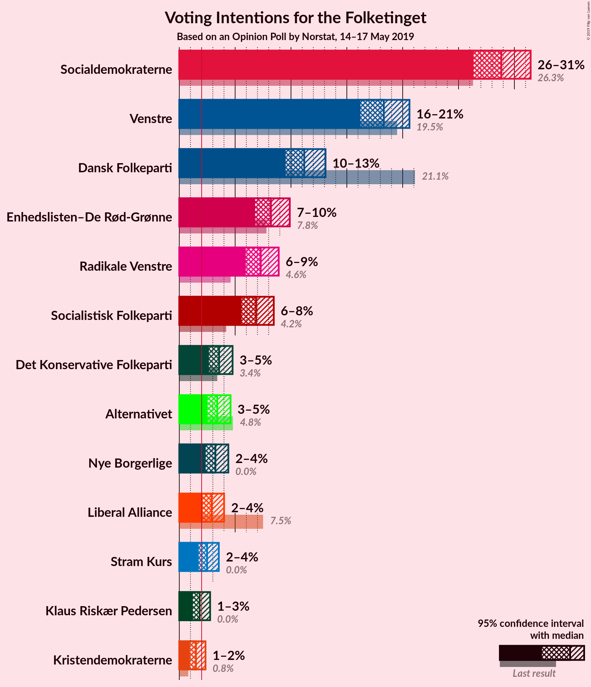

### Confidence Intervals

| Party | Last Result | Poll Result | 80% Confidence Interval | 90% Confidence Interval | 95% Confidence Interval | 99% Confidence Interval |
|:-----:|:-----------:|:-----------:|:-----------------------:|:-----------------------:|:-----------------------:|:-----------------------:|
| Socialdemokraterne | 26.3% | 28.8% | 27.2–30.5% |26.7–31.0% |26.3–31.5% |25.6–32.3% |
| Venstre | 19.5% | 18.3% | 16.9–19.8% |16.6–20.2% |16.2–20.6% |15.6–21.3% |
| Dansk Folkeparti | 21.1% | 11.2% | 10.1–12.4% |9.8–12.8% |9.5–13.1% |9.0–13.7% |
| Enhedslisten–De Rød-Grønne | 7.8% | 8.2% | 7.3–9.3% |7.0–9.6% |6.8–9.9% |6.4–10.4% |
| Radikale Venstre | 4.6% | 7.3% | 6.4–8.4% |6.2–8.6% |5.9–8.9% |5.5–9.4% |
| Socialistisk Folkeparti | 4.2% | 6.9% | 6.0–7.9% |5.8–8.2% |5.6–8.5% |5.2–9.0% |
| Det Konservative Folkeparti | 3.4% | 3.6% | 3.0–4.3% |2.8–4.6% |2.7–4.8% |2.4–5.2% |
| Alternativet | 4.8% | 3.4% | 2.8–4.2% |2.7–4.4% |2.5–4.6% |2.3–5.0% |
| Nye Borgerlige | 0.0% | 3.2% | 2.7–4.0% |2.5–4.2% |2.4–4.4% |2.1–4.8% |
| Liberal Alliance | 7.5% | 2.9% | 2.4–3.6% |2.2–3.8% |2.1–4.0% |1.9–4.4% |
| Stram Kurs | 0.0% | 2.5% | 2.0–3.2% |1.9–3.4% |1.7–3.5% |1.5–3.9% |
| Klaus Riskær Pedersen | 0.0% | 1.8% | 1.4–2.4% |1.3–2.6% |1.2–2.8% |1.0–3.1% |
| Kristendemokraterne | 0.8% | 1.5% | 1.1–2.1% |1.0–2.2% |0.9–2.3% |0.8–2.7% |

*Note:* The poll result column reflects the actual value used in the calculations. Published results may vary slightly, and in addition be rounded to fewer digits.

## Seats

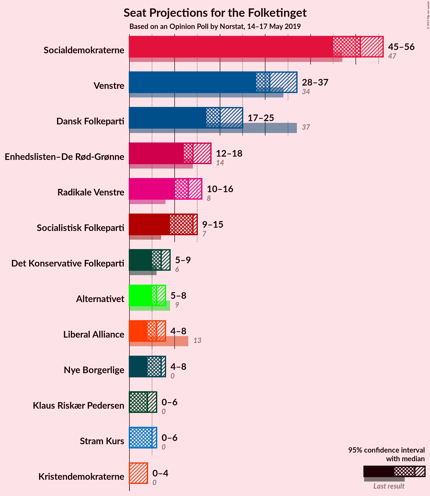

### Confidence Intervals

| Party | Last Result | Median | 80% Confidence Interval | 90% Confidence Interval | 95% Confidence Interval | 99% Confidence Interval |
|:-----:|:-----------:|:------:|:-----------------------:|:-----------------------:|:-----------------------:|:-----------------------:|
| <a href="#socialdemokraterne">Socialdemokraterne</a> | 47 | 51 | 47–53 |45–55 |45–56 |45–59 |
| <a href="#venstre">Venstre</a> | 34 | 31 | 30–35 |28–36 |28–37 |27–41 |
| <a href="#dansk-folkeparti">Dansk Folkeparti</a> | 37 | 20 | 17–22 |17–24 |17–25 |15–25 |
| <a href="#enhedslisten–de-rød-grønne">Enhedslisten–De Rød-Grønne</a> | 14 | 14 | 13–17 |13–17 |12–18 |11–18 |
| <a href="#radikale-venstre">Radikale Venstre</a> | 8 | 13 | 10–15 |10–16 |10–16 |10–19 |
| <a href="#socialistisk-folkeparti">Socialistisk Folkeparti</a> | 7 | 14 | 11–14 |11–15 |9–15 |9–16 |
| <a href="#det-konservative-folkeparti">Det Konservative Folkeparti</a> | 6 | 7 | 5–8 |5–8 |5–9 |4–9 |
| <a href="#alternativet">Alternativet</a> | 9 | 6 | 5–7 |5–8 |5–8 |4–9 |
| <a href="#nye-borgerlige">Nye Borgerlige</a> | 0 | 7 | 4–8 |4–8 |4–8 |4–8 |
| <a href="#liberal-alliance">Liberal Alliance</a> | 13 | 6 | 4–6 |4–7 |4–8 |0–8 |
| <a href="#stram-kurs">Stram Kurs</a> | 0 | 5 | 0–5 |0–6 |0–6 |0–7 |
| <a href="#klaus-riskær-pedersen">Klaus Riskær Pedersen</a> | 0 | 4 | 0–5 |0–6 |0–6 |0–6 |
| <a href="#kristendemokraterne">Kristendemokraterne</a> | 0 | 0 | 0–4 |0–4 |0–4 |0–5 |

### Socialdemokraterne

*For a full overview of the results for this party, see the [Socialdemokraterne](party-socialdemokraterne.html) page.*

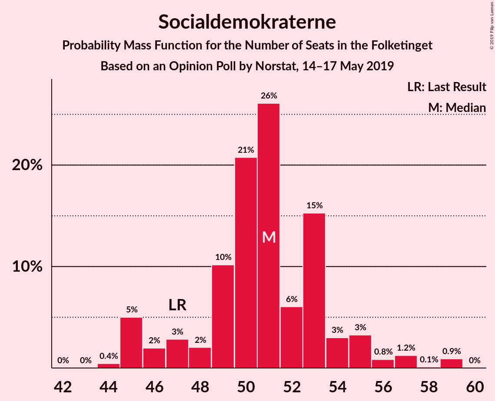

| Number of Seats | Probability | Accumulated | Special Marks |
|:---------------:|:-----------:|:-----------:|:-------------:|
| 44 | 0.4% | 100% |  |
| 45 | 5% | 99.5% |  |
| 46 | 2% | 95% |  |
| 47 | 3% | 93% | Last Result |
| 48 | 2% | 90% |  |
| 49 | 10% | 88% |  |
| 50 | 21% | 78% |  |
| 51 | 26% | 57% | Median |
| 52 | 6% | 31% |  |
| 53 | 15% | 25% |  |
| 54 | 3% | 9% |  |
| 55 | 3% | 6% |  |
| 56 | 0.8% | 3% |  |
| 57 | 1.2% | 2% |  |
| 58 | 0.1% | 1.0% |  |
| 59 | 0.9% | 0.9% |  |
| 60 | 0% | 0% |  |

### Venstre

*For a full overview of the results for this party, see the [Venstre](party-venstre.html) page.*

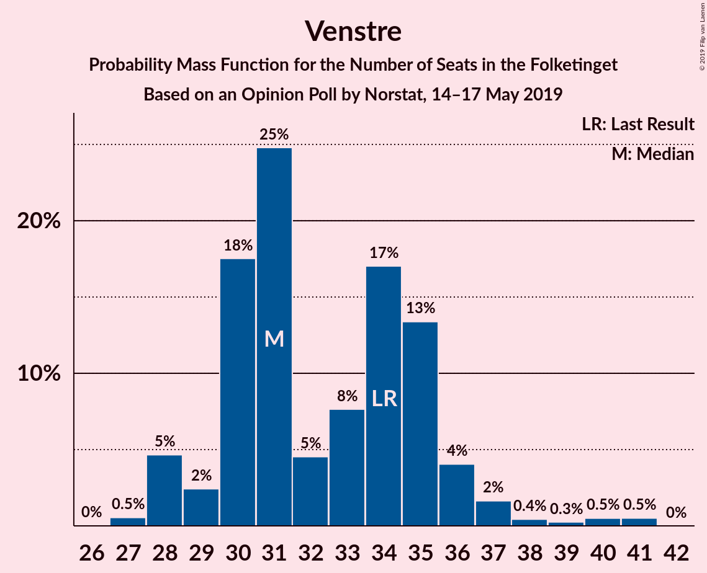

| Number of Seats | Probability | Accumulated | Special Marks |
|:---------------:|:-----------:|:-----------:|:-------------:|
| 26 | 0% | 100% |  |
| 27 | 0.5% | 99.9% |  |
| 28 | 5% | 99.4% |  |
| 29 | 2% | 95% |  |
| 30 | 18% | 92% |  |
| 31 | 25% | 75% | Median |
| 32 | 5% | 50% |  |
| 33 | 8% | 45% |  |
| 34 | 17% | 38% | Last Result |
| 35 | 13% | 21% |  |
| 36 | 4% | 7% |  |
| 37 | 2% | 3% |  |
| 38 | 0.4% | 2% |  |
| 39 | 0.3% | 1.3% |  |
| 40 | 0.5% | 1.0% |  |
| 41 | 0.5% | 0.5% |  |
| 42 | 0% | 0% |  |

### Dansk Folkeparti

*For a full overview of the results for this party, see the [Dansk Folkeparti](party-danskfolkeparti.html) page.*

| Number of Seats | Probability | Accumulated | Special Marks |
|:---------------:|:-----------:|:-----------:|:-------------:|
| 14 | 0.1% | 100% |  |
| 15 | 0.7% | 99.9% |  |
| 16 | 1.2% | 99.2% |  |
| 17 | 14% | 98% |  |
| 18 | 23% | 84% |  |
| 19 | 10% | 62% |  |
| 20 | 30% | 52% | Median |
| 21 | 6% | 22% |  |
| 22 | 6% | 16% |  |
| 23 | 4% | 9% |  |
| 24 | 2% | 5% |  |
| 25 | 3% | 3% |  |
| 26 | 0% | 0.1% |  |
| 27 | 0% | 0.1% |  |
| 28 | 0.1% | 0.1% |  |
| 29 | 0% | 0% |  |
| 30 | 0% | 0% |  |
| 31 | 0% | 0% |  |
| 32 | 0% | 0% |  |
| 33 | 0% | 0% |  |
| 34 | 0% | 0% |  |
| 35 | 0% | 0% |  |
| 36 | 0% | 0% |  |
| 37 | 0% | 0% | Last Result |

### Enhedslisten–De Rød-Grønne

*For a full overview of the results for this party, see the [Enhedslisten–De Rød-Grønne](party-enhedslisten–derød-grønne.html) page.*

| Number of Seats | Probability | Accumulated | Special Marks |
|:---------------:|:-----------:|:-----------:|:-------------:|
| 10 | 0.2% | 100% |  |
| 11 | 2% | 99.8% |  |
| 12 | 3% | 98% |  |
| 13 | 22% | 95% |  |
| 14 | 26% | 73% | Last Result, Median |
| 15 | 17% | 47% |  |
| 16 | 13% | 31% |  |
| 17 | 15% | 18% |  |
| 18 | 3% | 3% |  |
| 19 | 0.2% | 0.4% |  |
| 20 | 0.2% | 0.2% |  |
| 21 | 0% | 0% |  |

### Radikale Venstre

*For a full overview of the results for this party, see the [Radikale Venstre](party-radikalevenstre.html) page.*

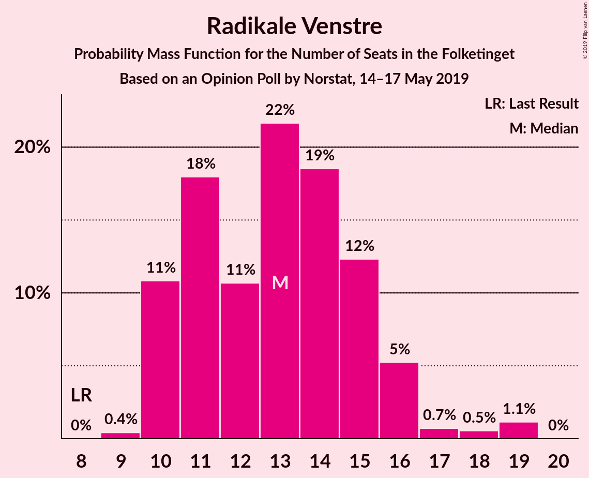

| Number of Seats | Probability | Accumulated | Special Marks |
|:---------------:|:-----------:|:-----------:|:-------------:|
| 8 | 0% | 100% | Last Result |
| 9 | 0.4% | 100% |  |
| 10 | 11% | 99.6% |  |
| 11 | 18% | 89% |  |
| 12 | 11% | 71% |  |
| 13 | 22% | 60% | Median |
| 14 | 19% | 38% |  |
| 15 | 12% | 20% |  |
| 16 | 5% | 8% |  |
| 17 | 0.7% | 2% |  |
| 18 | 0.5% | 2% |  |
| 19 | 1.1% | 1.1% |  |
| 20 | 0% | 0% |  |

### Socialistisk Folkeparti

*For a full overview of the results for this party, see the [Socialistisk Folkeparti](party-socialistiskfolkeparti.html) page.*

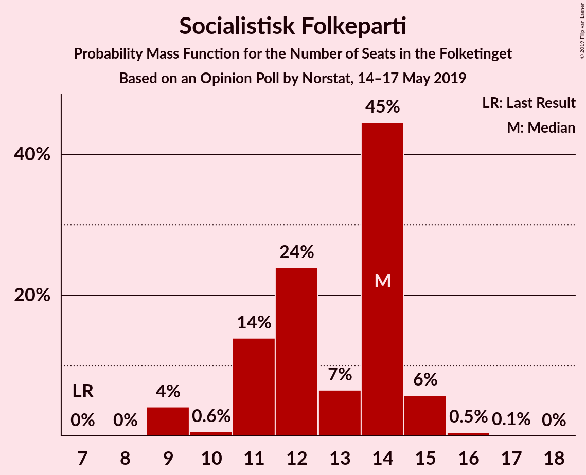

| Number of Seats | Probability | Accumulated | Special Marks |
|:---------------:|:-----------:|:-----------:|:-------------:|
| 7 | 0% | 100% | Last Result |
| 8 | 0% | 100% |  |
| 9 | 4% | 100% |  |
| 10 | 0.6% | 96% |  |
| 11 | 14% | 95% |  |
| 12 | 24% | 81% |  |
| 13 | 7% | 57% |  |
| 14 | 45% | 51% | Median |
| 15 | 6% | 6% |  |
| 16 | 0.5% | 0.7% |  |
| 17 | 0.1% | 0.2% |  |
| 18 | 0% | 0% |  |

### Det Konservative Folkeparti

*For a full overview of the results for this party, see the [Det Konservative Folkeparti](party-detkonservativefolkeparti.html) page.*

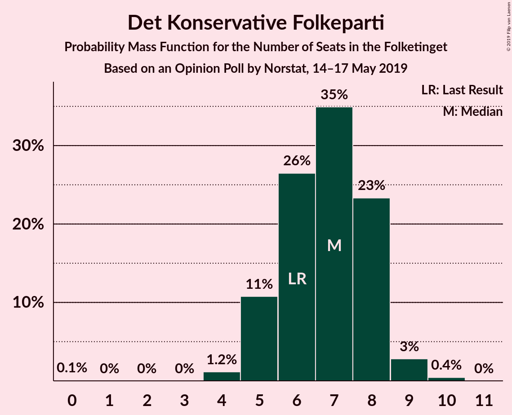

| Number of Seats | Probability | Accumulated | Special Marks |
|:---------------:|:-----------:|:-----------:|:-------------:|
| 0 | 0.1% | 100% |  |
| 1 | 0% | 99.9% |  |
| 2 | 0% | 99.9% |  |
| 3 | 0% | 99.9% |  |
| 4 | 1.2% | 99.9% |  |
| 5 | 11% | 98.8% |  |
| 6 | 26% | 88% | Last Result |
| 7 | 35% | 62% | Median |
| 8 | 23% | 27% |  |
| 9 | 3% | 3% |  |
| 10 | 0.4% | 0.4% |  |
| 11 | 0% | 0% |  |

### Alternativet

*For a full overview of the results for this party, see the [Alternativet](party-alternativet.html) page.*

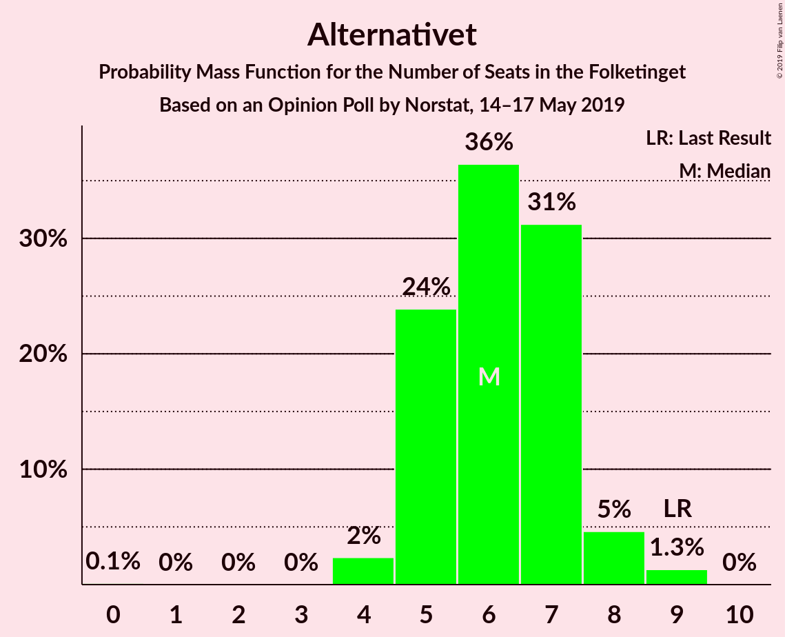

| Number of Seats | Probability | Accumulated | Special Marks |
|:---------------:|:-----------:|:-----------:|:-------------:|
| 0 | 0.1% | 100% |  |
| 1 | 0% | 99.9% |  |
| 2 | 0% | 99.9% |  |
| 3 | 0% | 99.9% |  |
| 4 | 2% | 99.9% |  |
| 5 | 24% | 98% |  |
| 6 | 36% | 74% | Median |
| 7 | 31% | 37% |  |
| 8 | 5% | 6% |  |
| 9 | 1.3% | 1.3% | Last Result |
| 10 | 0% | 0% |  |

### Nye Borgerlige

*For a full overview of the results for this party, see the [Nye Borgerlige](party-nyeborgerlige.html) page.*

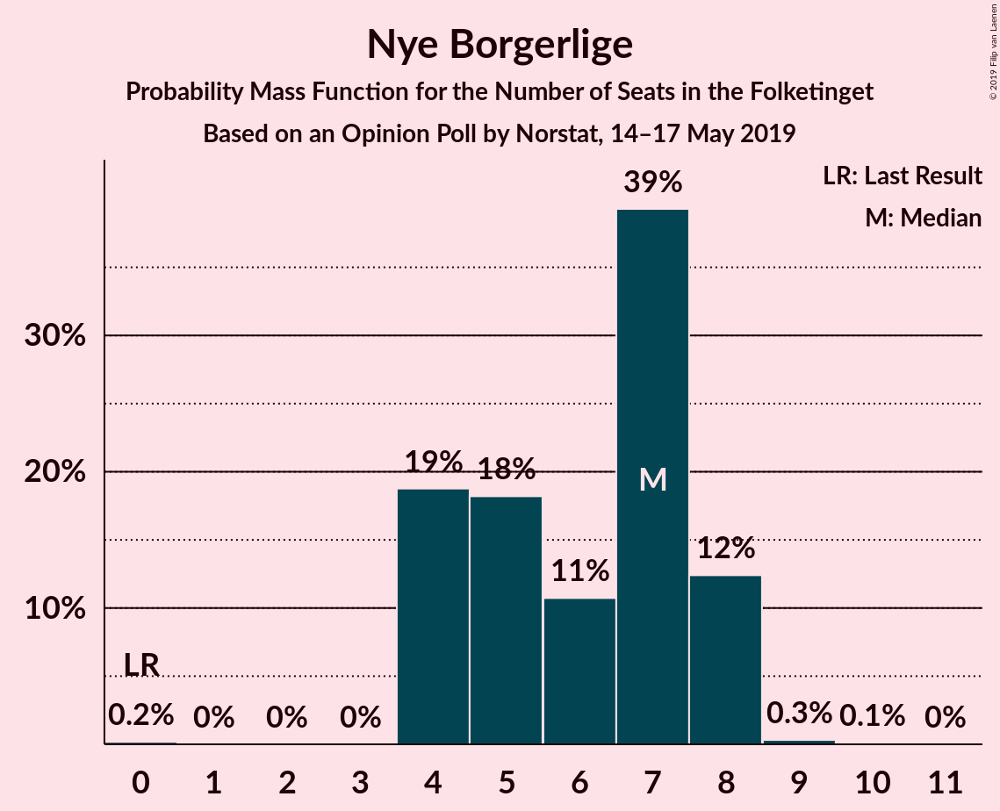

| Number of Seats | Probability | Accumulated | Special Marks |
|:---------------:|:-----------:|:-----------:|:-------------:|
| 0 | 0.2% | 100% | Last Result |
| 1 | 0% | 99.8% |  |
| 2 | 0% | 99.8% |  |
| 3 | 0% | 99.8% |  |
| 4 | 19% | 99.8% |  |
| 5 | 18% | 81% |  |
| 6 | 11% | 63% |  |
| 7 | 39% | 52% | Median |
| 8 | 12% | 13% |  |
| 9 | 0.3% | 0.4% |  |
| 10 | 0.1% | 0.1% |  |
| 11 | 0% | 0% |  |

### Liberal Alliance

*For a full overview of the results for this party, see the [Liberal Alliance](party-liberalalliance.html) page.*

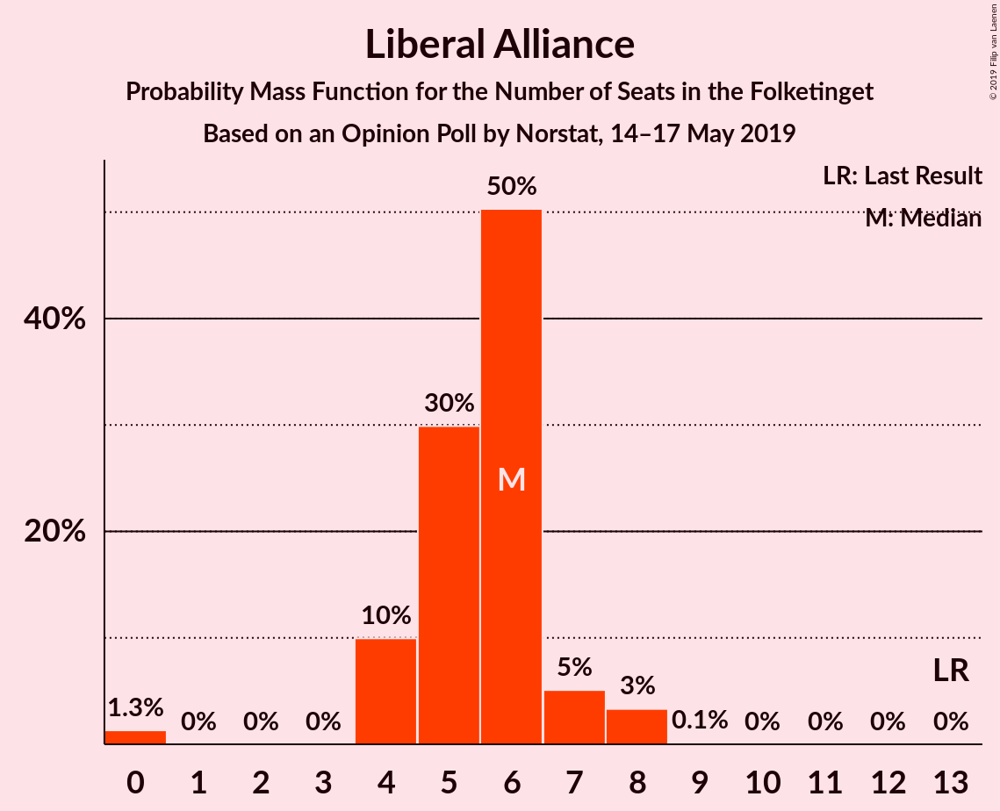

| Number of Seats | Probability | Accumulated | Special Marks |
|:---------------:|:-----------:|:-----------:|:-------------:|
| 0 | 1.3% | 100% |  |
| 1 | 0% | 98.7% |  |
| 2 | 0% | 98.7% |  |
| 3 | 0% | 98.7% |  |
| 4 | 10% | 98.7% |  |
| 5 | 30% | 89% |  |
| 6 | 50% | 59% | Median |
| 7 | 5% | 9% |  |
| 8 | 3% | 3% |  |
| 9 | 0.1% | 0.1% |  |
| 10 | 0% | 0% |  |
| 11 | 0% | 0% |  |
| 12 | 0% | 0% |  |
| 13 | 0% | 0% | Last Result |

### Stram Kurs

*For a full overview of the results for this party, see the [Stram Kurs](party-stramkurs.html) page.*

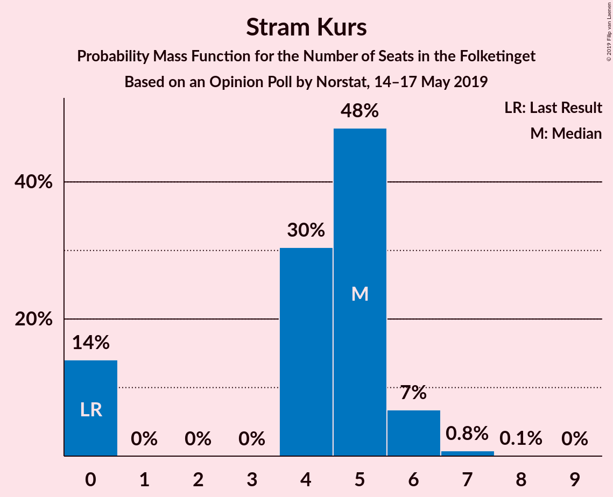

| Number of Seats | Probability | Accumulated | Special Marks |
|:---------------:|:-----------:|:-----------:|:-------------:|
| 0 | 14% | 100% | Last Result |
| 1 | 0% | 86% |  |
| 2 | 0% | 86% |  |
| 3 | 0% | 86% |  |
| 4 | 30% | 86% |  |
| 5 | 48% | 56% | Median |
| 6 | 7% | 8% |  |
| 7 | 0.8% | 0.9% |  |
| 8 | 0.1% | 0.1% |  |
| 9 | 0% | 0% |  |

### Klaus Riskær Pedersen

*For a full overview of the results for this party, see the [Klaus Riskær Pedersen](party-klausriskærpedersen.html) page.*

| Number of Seats | Probability | Accumulated | Special Marks |
|:---------------:|:-----------:|:-----------:|:-------------:|
| 0 | 34% | 100% | Last Result |
| 1 | 0% | 66% |  |
| 2 | 0% | 66% |  |
| 3 | 0% | 66% |  |
| 4 | 55% | 66% | Median |
| 5 | 4% | 11% |  |
| 6 | 7% | 7% |  |
| 7 | 0% | 0% |  |

### Kristendemokraterne

*For a full overview of the results for this party, see the [Kristendemokraterne](party-kristendemokraterne.html) page.*

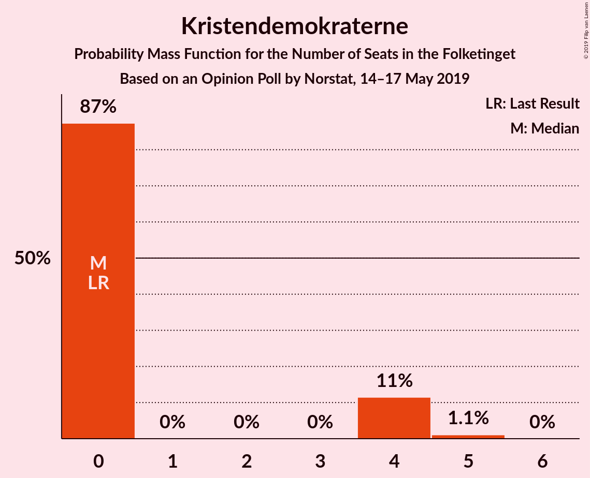

| Number of Seats | Probability | Accumulated | Special Marks |
|:---------------:|:-----------:|:-----------:|:-------------:|
| 0 | 87% | 100% | Last Result, Median |
| 1 | 0% | 13% |  |
| 2 | 0% | 13% |  |
| 3 | 0% | 13% |  |
| 4 | 11% | 13% |  |
| 5 | 1.1% | 1.1% |  |
| 6 | 0% | 0% |  |

## Coalitions

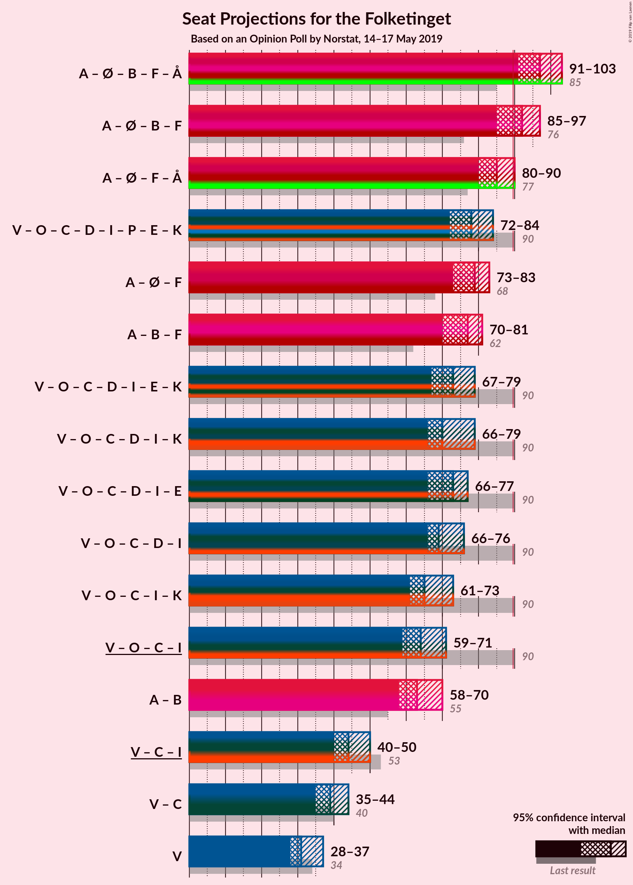

### Confidence Intervals

| Coalition | Last Result | Median | Majority? | 80% Confidence Interval | 90% Confidence Interval | 95% Confidence Interval | 99% Confidence Interval |
|:---------:|:-----------:|:------:|:---------:|:-----------------------:|:-----------------------:|:-----------------------:|:-----------------------:|
| Socialdemokraterne – Enhedslisten–De Rød-Grønne – Radikale Venstre – Socialistisk Folkeparti – Alternativet | 85 | 97 | 99.9% | 94–101 | 93–102 | 91–103 | 91–108 |
| Socialdemokraterne – Enhedslisten–De Rød-Grønne – Radikale Venstre – Socialistisk Folkeparti | 76 | 92 | 79% | 88–94 | 87–95 | 85–97 | 84–100 |
| Socialdemokraterne – Enhedslisten–De Rød-Grønne – Socialistisk Folkeparti – Alternativet | 77 | 85 | 4% | 81–88 | 80–89 | 80–90 | 77–93 |
| Venstre – Dansk Folkeparti – Det Konservative Folkeparti – Nye Borgerlige – Liberal Alliance – Stram Kurs – Klaus Riskær Pedersen – Kristendemokraterne | 90 | 78 | 0% | 74–81 | 73–82 | 72–84 | 67–84 |
| Socialdemokraterne – Enhedslisten–De Rød-Grønne – Socialistisk Folkeparti | 68 | 79 | 0.1% | 75–82 | 74–83 | 73–83 | 71–85 |
| Socialdemokraterne – Radikale Venstre – Socialistisk Folkeparti | 62 | 77 | 0% | 73–79 | 72–80 | 70–81 | 70–85 |
| Venstre – Dansk Folkeparti – Det Konservative Folkeparti – Nye Borgerlige – Liberal Alliance – Klaus Riskær Pedersen – Kristendemokraterne | 90 | 73 | 0% | 70–77 | 69–78 | 67–79 | 66–80 |
| Venstre – Dansk Folkeparti – Det Konservative Folkeparti – Nye Borgerlige – Liberal Alliance – Kristendemokraterne | 90 | 70 | 0% | 67–76 | 66–77 | 66–79 | 64–79 |
| Venstre – Dansk Folkeparti – Det Konservative Folkeparti – Nye Borgerlige – Liberal Alliance – Klaus Riskær Pedersen | 90 | 73 | 0% | 69–76 | 67–77 | 66–77 | 65–79 |
| Venstre – Dansk Folkeparti – Det Konservative Folkeparti – Nye Borgerlige – Liberal Alliance | 90 | 69 | 0% | 67–75 | 66–76 | 66–76 | 63–78 |
| Venstre – Dansk Folkeparti – Det Konservative Folkeparti – Liberal Alliance – Kristendemokraterne | 90 | 65 | 0% | 61–69 | 61–71 | 61–73 | 58–73 |
| Venstre – Dansk Folkeparti – Det Konservative Folkeparti – Liberal Alliance | 90 | 64 | 0% | 61–69 | 60–70 | 59–71 | 58–72 |
| Socialdemokraterne – Radikale Venstre | 55 | 63 | 0% | 61–67 | 58–68 | 58–70 | 58–73 |
| Venstre – Det Konservative Folkeparti – Liberal Alliance | 53 | 44 | 0% | 42–47 | 41–50 | 40–50 | 37–51 |
| Venstre – Det Konservative Folkeparti | 40 | 39 | 0% | 36–42 | 35–43 | 35–44 | 33–46 |
| Venstre | 34 | 31 | 0% | 30–35 | 28–36 | 28–37 | 27–41 |

### Socialdemokraterne – Enhedslisten–De Rød-Grønne – Radikale Venstre – Socialistisk Folkeparti – Alternativet

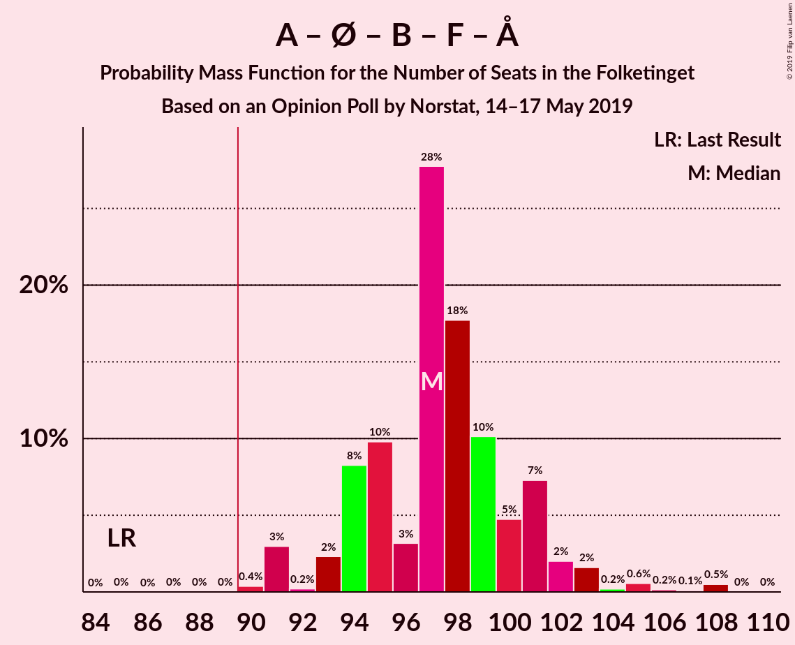

| Number of Seats | Probability | Accumulated | Special Marks |
|:---------------:|:-----------:|:-----------:|:-------------:|
| 85 | 0% | 100% | Last Result |
| 86 | 0% | 100% |  |
| 87 | 0% | 100% |  |
| 88 | 0% | 100% |  |
| 89 | 0% | 100% |  |
| 90 | 0.4% | 99.9% | Majority |
| 91 | 3% | 99.6% |  |
| 92 | 0.2% | 97% |  |
| 93 | 2% | 96% |  |
| 94 | 8% | 94% |  |
| 95 | 10% | 86% |  |
| 96 | 3% | 76% |  |
| 97 | 28% | 73% |  |
| 98 | 18% | 45% | Median |
| 99 | 10% | 27% |  |
| 100 | 5% | 17% |  |
| 101 | 7% | 12% |  |
| 102 | 2% | 5% |  |
| 103 | 2% | 3% |  |
| 104 | 0.2% | 2% |  |
| 105 | 0.6% | 1.3% |  |
| 106 | 0.2% | 0.8% |  |
| 107 | 0.1% | 0.6% |  |
| 108 | 0.5% | 0.5% |  |
| 109 | 0% | 0% |  |

### Socialdemokraterne – Enhedslisten–De Rød-Grønne – Radikale Venstre – Socialistisk Folkeparti

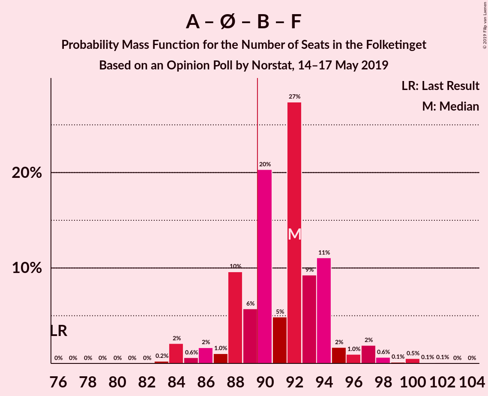

| Number of Seats | Probability | Accumulated | Special Marks |
|:---------------:|:-----------:|:-----------:|:-------------:|
| 76 | 0% | 100% | Last Result |
| 77 | 0% | 100% |  |
| 78 | 0% | 100% |  |
| 79 | 0% | 100% |  |
| 80 | 0% | 100% |  |
| 81 | 0% | 100% |  |
| 82 | 0% | 100% |  |
| 83 | 0.2% | 100% |  |
| 84 | 2% | 99.7% |  |
| 85 | 0.6% | 98% |  |
| 86 | 2% | 97% |  |
| 87 | 1.0% | 95% |  |
| 88 | 10% | 94% |  |
| 89 | 6% | 85% |  |
| 90 | 20% | 79% | Majority |
| 91 | 5% | 59% |  |
| 92 | 27% | 54% | Median |
| 93 | 9% | 26% |  |
| 94 | 11% | 17% |  |
| 95 | 2% | 6% |  |
| 96 | 1.0% | 4% |  |
| 97 | 2% | 3% |  |
| 98 | 0.6% | 2% |  |
| 99 | 0.1% | 0.9% |  |
| 100 | 0.5% | 0.7% |  |
| 101 | 0.1% | 0.2% |  |
| 102 | 0.1% | 0.1% |  |
| 103 | 0% | 0% |  |

### Socialdemokraterne – Enhedslisten–De Rød-Grønne – Socialistisk Folkeparti – Alternativet

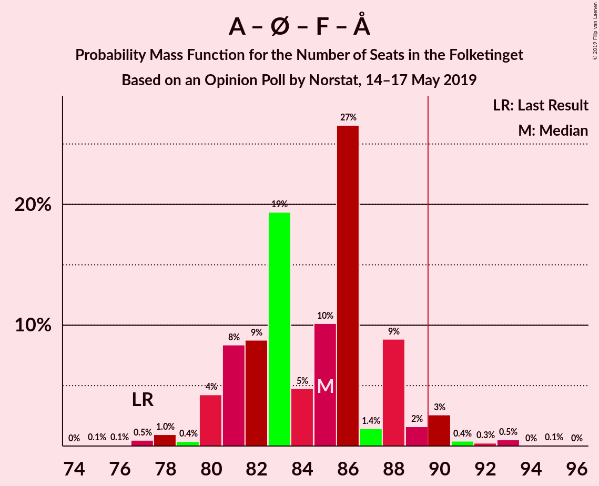

| Number of Seats | Probability | Accumulated | Special Marks |
|:---------------:|:-----------:|:-----------:|:-------------:|
| 75 | 0.1% | 100% |  |
| 76 | 0.1% | 99.9% |  |
| 77 | 0.5% | 99.8% | Last Result |
| 78 | 1.0% | 99.3% |  |
| 79 | 0.4% | 98% |  |
| 80 | 4% | 98% |  |
| 81 | 8% | 94% |  |
| 82 | 9% | 85% |  |
| 83 | 19% | 77% |  |
| 84 | 5% | 57% |  |
| 85 | 10% | 52% | Median |
| 86 | 27% | 42% |  |
| 87 | 1.4% | 16% |  |
| 88 | 9% | 14% |  |
| 89 | 2% | 5% |  |
| 90 | 3% | 4% | Majority |
| 91 | 0.4% | 1.3% |  |
| 92 | 0.3% | 0.9% |  |
| 93 | 0.5% | 0.6% |  |
| 94 | 0% | 0.1% |  |
| 95 | 0.1% | 0.1% |  |
| 96 | 0% | 0% |  |

### Venstre – Dansk Folkeparti – Det Konservative Folkeparti – Nye Borgerlige – Liberal Alliance – Stram Kurs – Klaus Riskær Pedersen – Kristendemokraterne

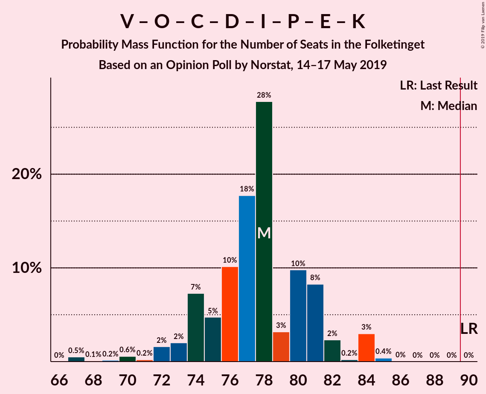

| Number of Seats | Probability | Accumulated | Special Marks |
|:---------------:|:-----------:|:-----------:|:-------------:|
| 67 | 0.5% | 100% |  |
| 68 | 0.1% | 99.5% |  |
| 69 | 0.2% | 99.4% |  |
| 70 | 0.6% | 99.2% |  |
| 71 | 0.2% | 98.7% |  |
| 72 | 2% | 98% |  |
| 73 | 2% | 97% |  |
| 74 | 7% | 95% |  |
| 75 | 5% | 88% |  |
| 76 | 10% | 83% |  |
| 77 | 18% | 73% |  |
| 78 | 28% | 55% |  |
| 79 | 3% | 27% |  |
| 80 | 10% | 24% | Median |
| 81 | 8% | 14% |  |
| 82 | 2% | 6% |  |
| 83 | 0.2% | 4% |  |
| 84 | 3% | 3% |  |
| 85 | 0.4% | 0.4% |  |
| 86 | 0% | 0.1% |  |
| 87 | 0% | 0% |  |
| 88 | 0% | 0% |  |
| 89 | 0% | 0% |  |
| 90 | 0% | 0% | Last Result, Majority |

### Socialdemokraterne – Enhedslisten–De Rød-Grønne – Socialistisk Folkeparti

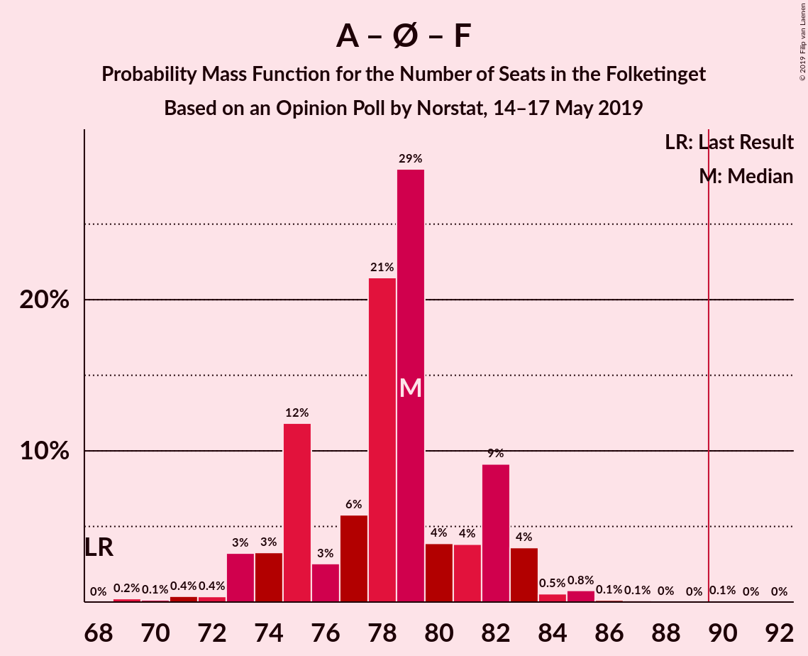

| Number of Seats | Probability | Accumulated | Special Marks |
|:---------------:|:-----------:|:-----------:|:-------------:|
| 68 | 0% | 100% | Last Result |
| 69 | 0.2% | 100% |  |
| 70 | 0.1% | 99.8% |  |
| 71 | 0.4% | 99.6% |  |
| 72 | 0.4% | 99.2% |  |
| 73 | 3% | 98.9% |  |
| 74 | 3% | 96% |  |
| 75 | 12% | 92% |  |
| 76 | 3% | 81% |  |
| 77 | 6% | 78% |  |
| 78 | 21% | 72% |  |
| 79 | 29% | 51% | Median |
| 80 | 4% | 22% |  |
| 81 | 4% | 18% |  |
| 82 | 9% | 14% |  |
| 83 | 4% | 5% |  |
| 84 | 0.5% | 2% |  |
| 85 | 0.8% | 1.1% |  |
| 86 | 0.1% | 0.4% |  |
| 87 | 0.1% | 0.2% |  |
| 88 | 0% | 0.1% |  |
| 89 | 0% | 0.1% |  |
| 90 | 0.1% | 0.1% | Majority |
| 91 | 0% | 0% |  |

### Socialdemokraterne – Radikale Venstre – Socialistisk Folkeparti

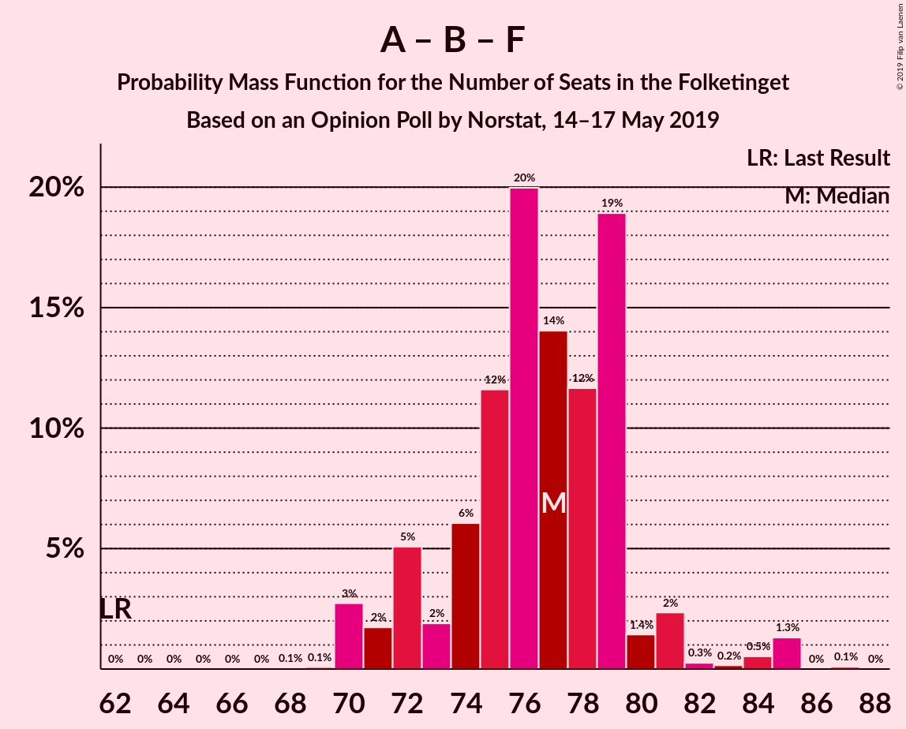

| Number of Seats | Probability | Accumulated | Special Marks |
|:---------------:|:-----------:|:-----------:|:-------------:|
| 62 | 0% | 100% | Last Result |
| 63 | 0% | 100% |  |
| 64 | 0% | 100% |  |
| 65 | 0% | 100% |  |
| 66 | 0% | 100% |  |
| 67 | 0% | 100% |  |
| 68 | 0.1% | 100% |  |
| 69 | 0.1% | 99.9% |  |
| 70 | 3% | 99.8% |  |
| 71 | 2% | 97% |  |
| 72 | 5% | 95% |  |
| 73 | 2% | 90% |  |
| 74 | 6% | 88% |  |
| 75 | 12% | 82% |  |
| 76 | 20% | 71% |  |
| 77 | 14% | 51% |  |
| 78 | 12% | 37% | Median |
| 79 | 19% | 25% |  |
| 80 | 1.4% | 6% |  |
| 81 | 2% | 5% |  |
| 82 | 0.3% | 2% |  |
| 83 | 0.2% | 2% |  |
| 84 | 0.5% | 2% |  |
| 85 | 1.3% | 1.4% |  |
| 86 | 0% | 0.1% |  |
| 87 | 0.1% | 0.1% |  |
| 88 | 0% | 0% |  |

### Venstre – Dansk Folkeparti – Det Konservative Folkeparti – Nye Borgerlige – Liberal Alliance – Klaus Riskær Pedersen – Kristendemokraterne

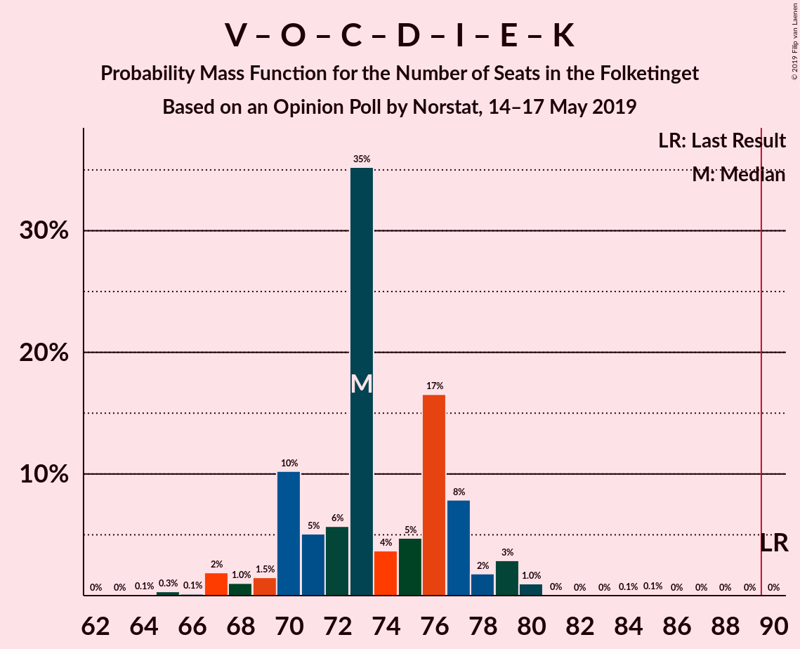

| Number of Seats | Probability | Accumulated | Special Marks |
|:---------------:|:-----------:|:-----------:|:-------------:|
| 64 | 0.1% | 100% |  |
| 65 | 0.3% | 99.9% |  |
| 66 | 0.1% | 99.5% |  |
| 67 | 2% | 99.4% |  |
| 68 | 1.0% | 97% |  |
| 69 | 1.5% | 96% |  |
| 70 | 10% | 95% |  |
| 71 | 5% | 85% |  |
| 72 | 6% | 80% |  |
| 73 | 35% | 74% |  |
| 74 | 4% | 39% |  |
| 75 | 5% | 35% | Median |
| 76 | 17% | 30% |  |
| 77 | 8% | 14% |  |
| 78 | 2% | 6% |  |
| 79 | 3% | 4% |  |
| 80 | 1.0% | 1.2% |  |
| 81 | 0% | 0.2% |  |
| 82 | 0% | 0.2% |  |
| 83 | 0% | 0.2% |  |
| 84 | 0.1% | 0.1% |  |
| 85 | 0.1% | 0.1% |  |
| 86 | 0% | 0% |  |
| 87 | 0% | 0% |  |
| 88 | 0% | 0% |  |
| 89 | 0% | 0% |  |
| 90 | 0% | 0% | Last Result, Majority |

### Venstre – Dansk Folkeparti – Det Konservative Folkeparti – Nye Borgerlige – Liberal Alliance – Kristendemokraterne

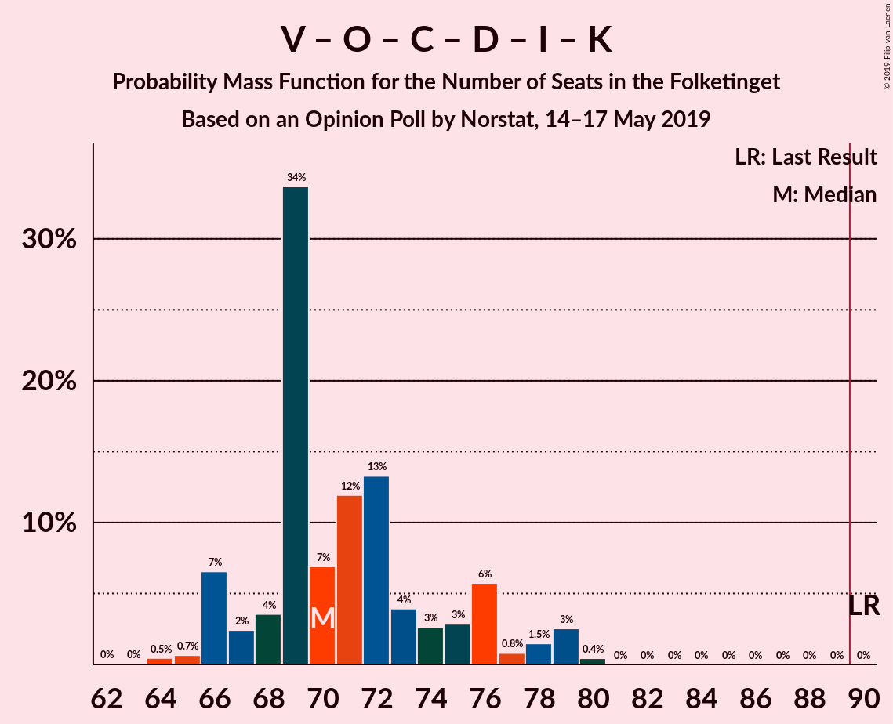

| Number of Seats | Probability | Accumulated | Special Marks |
|:---------------:|:-----------:|:-----------:|:-------------:|
| 62 | 0% | 100% |  |
| 63 | 0% | 99.9% |  |
| 64 | 0.5% | 99.9% |  |
| 65 | 0.7% | 99.5% |  |
| 66 | 7% | 98.8% |  |
| 67 | 2% | 92% |  |
| 68 | 4% | 90% |  |
| 69 | 34% | 86% |  |
| 70 | 7% | 53% |  |
| 71 | 12% | 46% | Median |
| 72 | 13% | 34% |  |
| 73 | 4% | 20% |  |
| 74 | 3% | 17% |  |
| 75 | 3% | 14% |  |
| 76 | 6% | 11% |  |
| 77 | 0.8% | 5% |  |
| 78 | 1.5% | 4% |  |
| 79 | 3% | 3% |  |
| 80 | 0.4% | 0.5% |  |
| 81 | 0% | 0% |  |
| 82 | 0% | 0% |  |
| 83 | 0% | 0% |  |
| 84 | 0% | 0% |  |
| 85 | 0% | 0% |  |
| 86 | 0% | 0% |  |
| 87 | 0% | 0% |  |
| 88 | 0% | 0% |  |
| 89 | 0% | 0% |  |
| 90 | 0% | 0% | Last Result, Majority |

### Venstre – Dansk Folkeparti – Det Konservative Folkeparti – Nye Borgerlige – Liberal Alliance – Klaus Riskær Pedersen

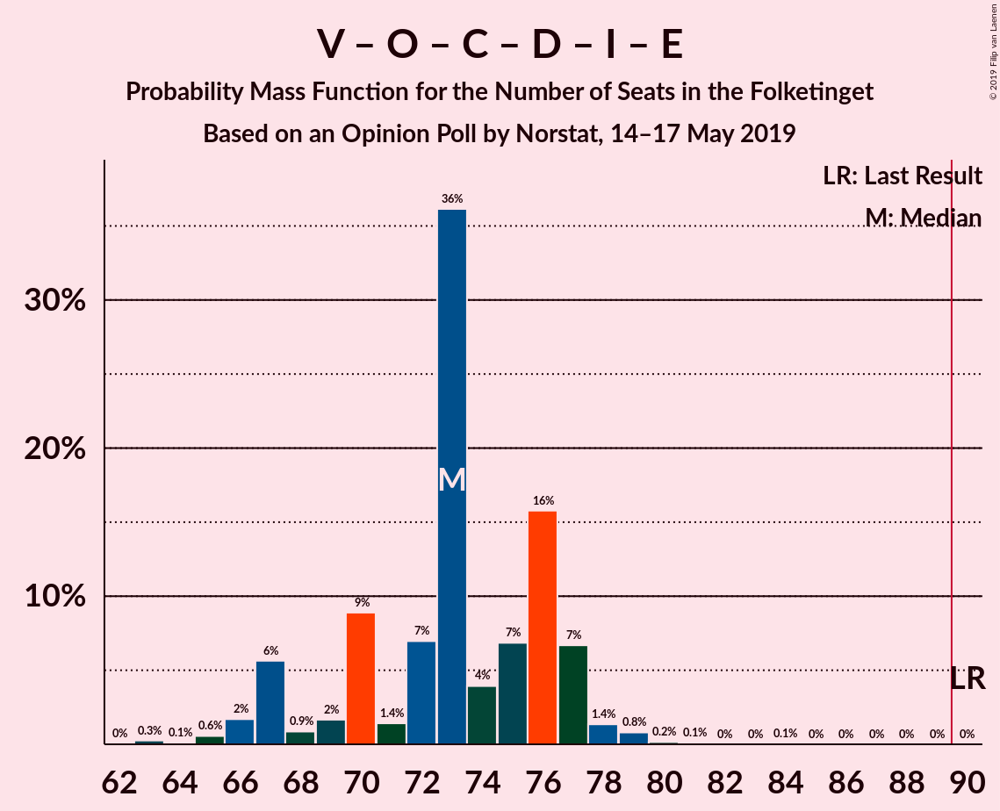

| Number of Seats | Probability | Accumulated | Special Marks |
|:---------------:|:-----------:|:-----------:|:-------------:|
| 63 | 0.3% | 100% |  |
| 64 | 0.1% | 99.7% |  |
| 65 | 0.6% | 99.6% |  |
| 66 | 2% | 99.0% |  |
| 67 | 6% | 97% |  |
| 68 | 0.9% | 92% |  |
| 69 | 2% | 91% |  |
| 70 | 9% | 89% |  |
| 71 | 1.4% | 80% |  |
| 72 | 7% | 79% |  |
| 73 | 36% | 72% |  |
| 74 | 4% | 36% |  |
| 75 | 7% | 32% | Median |
| 76 | 16% | 25% |  |
| 77 | 7% | 9% |  |
| 78 | 1.4% | 2% |  |
| 79 | 0.8% | 1.1% |  |
| 80 | 0.2% | 0.3% |  |
| 81 | 0.1% | 0.2% |  |
| 82 | 0% | 0.1% |  |
| 83 | 0% | 0.1% |  |
| 84 | 0.1% | 0.1% |  |
| 85 | 0% | 0% |  |
| 86 | 0% | 0% |  |
| 87 | 0% | 0% |  |
| 88 | 0% | 0% |  |
| 89 | 0% | 0% |  |
| 90 | 0% | 0% | Last Result, Majority |

### Venstre – Dansk Folkeparti – Det Konservative Folkeparti – Nye Borgerlige – Liberal Alliance

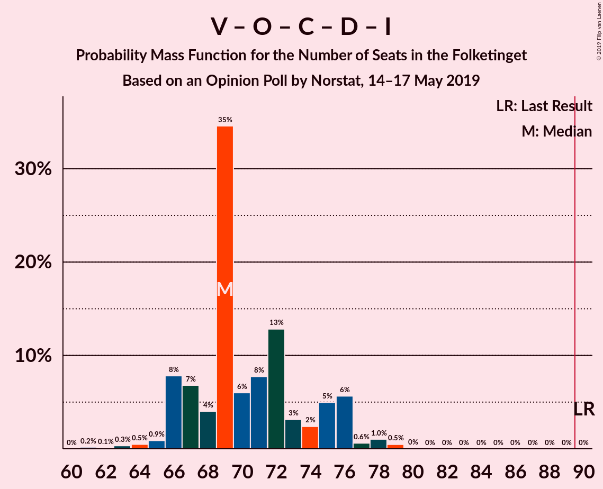

| Number of Seats | Probability | Accumulated | Special Marks |
|:---------------:|:-----------:|:-----------:|:-------------:|
| 61 | 0.2% | 100% |  |
| 62 | 0.1% | 99.8% |  |
| 63 | 0.3% | 99.7% |  |
| 64 | 0.5% | 99.4% |  |
| 65 | 0.9% | 98.9% |  |
| 66 | 8% | 98% |  |
| 67 | 7% | 90% |  |
| 68 | 4% | 83% |  |
| 69 | 35% | 79% |  |
| 70 | 6% | 45% |  |
| 71 | 8% | 39% | Median |
| 72 | 13% | 31% |  |
| 73 | 3% | 18% |  |
| 74 | 2% | 15% |  |
| 75 | 5% | 13% |  |
| 76 | 6% | 8% |  |
| 77 | 0.6% | 2% |  |
| 78 | 1.0% | 2% |  |
| 79 | 0.5% | 0.5% |  |
| 80 | 0% | 0% |  |
| 81 | 0% | 0% |  |
| 82 | 0% | 0% |  |
| 83 | 0% | 0% |  |
| 84 | 0% | 0% |  |
| 85 | 0% | 0% |  |
| 86 | 0% | 0% |  |
| 87 | 0% | 0% |  |
| 88 | 0% | 0% |  |
| 89 | 0% | 0% |  |
| 90 | 0% | 0% | Last Result, Majority |

### Venstre – Dansk Folkeparti – Det Konservative Folkeparti – Liberal Alliance – Kristendemokraterne

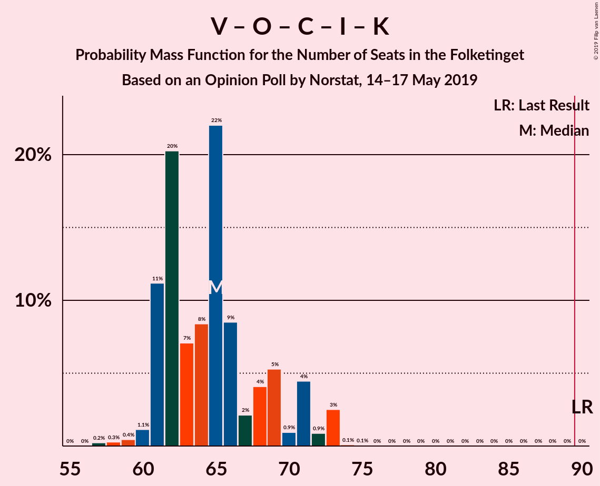

| Number of Seats | Probability | Accumulated | Special Marks |
|:---------------:|:-----------:|:-----------:|:-------------:|
| 57 | 0.2% | 100% |  |
| 58 | 0.3% | 99.8% |  |
| 59 | 0.4% | 99.5% |  |
| 60 | 1.1% | 99.0% |  |
| 61 | 11% | 98% |  |
| 62 | 20% | 87% |  |
| 63 | 7% | 66% |  |
| 64 | 8% | 59% | Median |
| 65 | 22% | 51% |  |
| 66 | 9% | 29% |  |
| 67 | 2% | 20% |  |
| 68 | 4% | 18% |  |
| 69 | 5% | 14% |  |
| 70 | 0.9% | 9% |  |
| 71 | 4% | 8% |  |
| 72 | 0.9% | 4% |  |
| 73 | 3% | 3% |  |
| 74 | 0.1% | 0.2% |  |
| 75 | 0.1% | 0.1% |  |
| 76 | 0% | 0% |  |
| 77 | 0% | 0% |  |
| 78 | 0% | 0% |  |
| 79 | 0% | 0% |  |
| 80 | 0% | 0% |  |
| 81 | 0% | 0% |  |
| 82 | 0% | 0% |  |
| 83 | 0% | 0% |  |
| 84 | 0% | 0% |  |
| 85 | 0% | 0% |  |
| 86 | 0% | 0% |  |
| 87 | 0% | 0% |  |
| 88 | 0% | 0% |  |
| 89 | 0% | 0% |  |
| 90 | 0% | 0% | Last Result, Majority |

### Venstre – Dansk Folkeparti – Det Konservative Folkeparti – Liberal Alliance

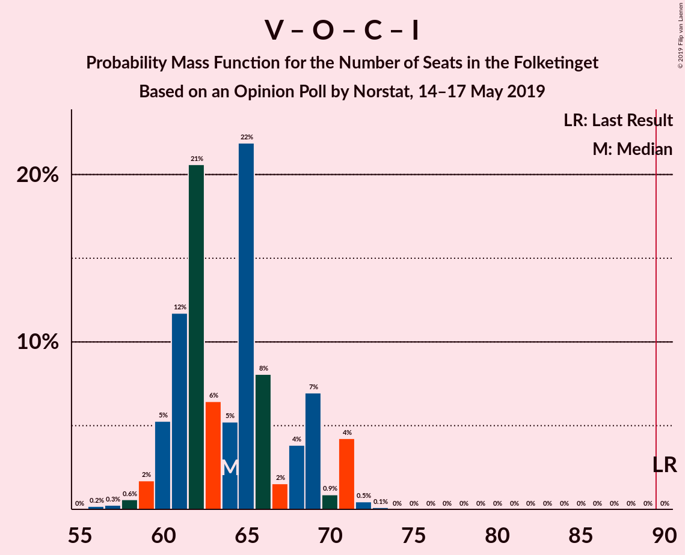

| Number of Seats | Probability | Accumulated | Special Marks |
|:---------------:|:-----------:|:-----------:|:-------------:|
| 56 | 0.2% | 100% |  |
| 57 | 0.3% | 99.8% |  |
| 58 | 0.6% | 99.5% |  |
| 59 | 2% | 99.0% |  |
| 60 | 5% | 97% |  |
| 61 | 12% | 92% |  |
| 62 | 21% | 80% |  |
| 63 | 6% | 60% |  |
| 64 | 5% | 53% | Median |
| 65 | 22% | 48% |  |
| 66 | 8% | 26% |  |
| 67 | 2% | 18% |  |
| 68 | 4% | 16% |  |
| 69 | 7% | 13% |  |
| 70 | 0.9% | 6% |  |
| 71 | 4% | 5% |  |
| 72 | 0.5% | 0.6% |  |
| 73 | 0.1% | 0.1% |  |
| 74 | 0% | 0% |  |
| 75 | 0% | 0% |  |
| 76 | 0% | 0% |  |
| 77 | 0% | 0% |  |
| 78 | 0% | 0% |  |
| 79 | 0% | 0% |  |
| 80 | 0% | 0% |  |
| 81 | 0% | 0% |  |
| 82 | 0% | 0% |  |
| 83 | 0% | 0% |  |
| 84 | 0% | 0% |  |
| 85 | 0% | 0% |  |
| 86 | 0% | 0% |  |
| 87 | 0% | 0% |  |
| 88 | 0% | 0% |  |
| 89 | 0% | 0% |  |
| 90 | 0% | 0% | Last Result, Majority |

### Socialdemokraterne – Radikale Venstre

| Number of Seats | Probability | Accumulated | Special Marks |
|:---------------:|:-----------:|:-----------:|:-------------:|
| 55 | 0% | 100% | Last Result |
| 56 | 0.1% | 100% |  |
| 57 | 0.1% | 99.9% |  |
| 58 | 7% | 99.8% |  |
| 59 | 1.0% | 93% |  |
| 60 | 1.0% | 92% |  |
| 61 | 10% | 91% |  |
| 62 | 23% | 81% |  |
| 63 | 9% | 57% |  |
| 64 | 14% | 48% | Median |
| 65 | 8% | 34% |  |
| 66 | 3% | 27% |  |
| 67 | 13% | 23% |  |
| 68 | 5% | 10% |  |
| 69 | 0.7% | 4% |  |
| 70 | 2% | 4% |  |
| 71 | 0.1% | 2% |  |
| 72 | 1.2% | 2% |  |
| 73 | 0.6% | 0.6% |  |
| 74 | 0% | 0% |  |

### Venstre – Det Konservative Folkeparti – Liberal Alliance

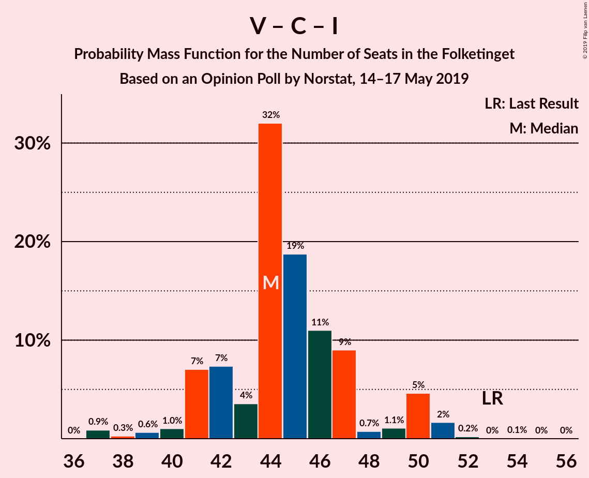

| Number of Seats | Probability | Accumulated | Special Marks |
|:---------------:|:-----------:|:-----------:|:-------------:|
| 37 | 0.9% | 100% |  |
| 38 | 0.3% | 99.1% |  |
| 39 | 0.6% | 98.8% |  |
| 40 | 1.0% | 98% |  |
| 41 | 7% | 97% |  |
| 42 | 7% | 90% |  |
| 43 | 4% | 83% |  |
| 44 | 32% | 79% | Median |
| 45 | 19% | 47% |  |
| 46 | 11% | 28% |  |
| 47 | 9% | 17% |  |
| 48 | 0.7% | 8% |  |
| 49 | 1.1% | 8% |  |
| 50 | 5% | 7% |  |
| 51 | 2% | 2% |  |
| 52 | 0.2% | 0.3% |  |
| 53 | 0% | 0.1% | Last Result |
| 54 | 0.1% | 0.1% |  |
| 55 | 0% | 0% |  |

### Venstre – Det Konservative Folkeparti

| Number of Seats | Probability | Accumulated | Special Marks |
|:---------------:|:-----------:|:-----------:|:-------------:|
| 32 | 0% | 100% |  |
| 33 | 1.1% | 99.9% |  |
| 34 | 1.2% | 98.9% |  |
| 35 | 4% | 98% |  |
| 36 | 7% | 94% |  |
| 37 | 3% | 86% |  |
| 38 | 29% | 83% | Median |
| 39 | 12% | 54% |  |
| 40 | 13% | 41% | Last Result |
| 41 | 16% | 29% |  |
| 42 | 7% | 12% |  |
| 43 | 1.2% | 6% |  |
| 44 | 2% | 4% |  |
| 45 | 1.1% | 2% |  |
| 46 | 0.7% | 0.9% |  |
| 47 | 0.1% | 0.2% |  |
| 48 | 0% | 0% |  |

### Venstre

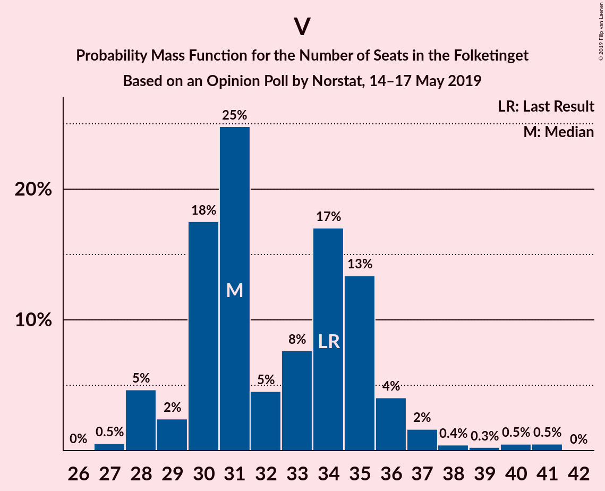

| Number of Seats | Probability | Accumulated | Special Marks |
|:---------------:|:-----------:|:-----------:|:-------------:|
| 26 | 0% | 100% |  |
| 27 | 0.5% | 99.9% |  |
| 28 | 5% | 99.4% |  |
| 29 | 2% | 95% |  |
| 30 | 18% | 92% |  |
| 31 | 25% | 75% | Median |
| 32 | 5% | 50% |  |
| 33 | 8% | 45% |  |
| 34 | 17% | 38% | Last Result |
| 35 | 13% | 21% |  |
| 36 | 4% | 7% |  |
| 37 | 2% | 3% |  |
| 38 | 0.4% | 2% |  |
| 39 | 0.3% | 1.3% |  |
| 40 | 0.5% | 1.0% |  |
| 41 | 0.5% | 0.5% |  |
| 42 | 0% | 0% |  |

## Technical Information

### Opinion Poll

+ **Polling firm:** Norstat
+ **Commissioner(s):** —
+ **Fieldwork period:** 14–17 May 2019

### Calculations

+ **Sample size:** 1207
+ **Simulations done:** 1,048,576
+ **Error estimate:** 1.30%

