# Opinion Poll by YouGov, 13–17 May 2019

<a href="#voting-intentions">Voting Intentions</a> | <a href="#seats">Seats</a> | <a href="#coalitions">Coalitions</a> | <a href="#technical-information">Technical Information</a>

## Voting Intentions

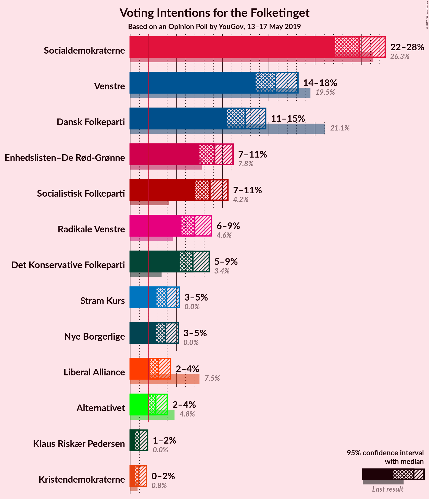

### Confidence Intervals

| Party | Last Result | Poll Result | 80% Confidence Interval | 90% Confidence Interval | 95% Confidence Interval | 99% Confidence Interval |
|:-----:|:-----------:|:-----------:|:-----------------------:|:-----------------------:|:-----------------------:|:-----------------------:|
| Socialdemokraterne | 26.3% | 24.8% | 23.0–26.6% |22.6–27.1% |22.1–27.6% |21.4–28.5% |
| Venstre | 19.5% | 15.7% | 14.3–17.3% |13.9–17.8% |13.6–18.2% |12.9–18.9% |
| Dansk Folkeparti | 21.1% | 12.4% | 11.2–13.9% |10.8–14.3% |10.5–14.7% |9.9–15.4% |
| Enhedslisten–De Rød-Grønne | 7.8% | 9.1% | 8.0–10.4% |7.7–10.8% |7.5–11.1% |7.0–11.8% |
| Socialistisk Folkeparti | 4.2% | 8.6% | 7.6–9.9% |7.3–10.3% |7.0–10.6% |6.5–11.2% |
| Radikale Venstre | 4.6% | 7.0% | 6.0–8.2% |5.8–8.5% |5.5–8.8% |5.1–9.4% |
| Det Konservative Folkeparti | 3.4% | 6.8% | 5.9–7.9% |5.6–8.3% |5.4–8.6% |5.0–9.1% |
| Stram Kurs | 0.0% | 3.9% | 3.2–4.8% |3.0–5.1% |2.9–5.3% |2.6–5.8% |
| Nye Borgerlige | 0.0% | 3.8% | 3.1–4.7% |2.9–5.0% |2.8–5.2% |2.5–5.7% |
| Liberal Alliance | 7.5% | 3.1% | 2.5–3.9% |2.3–4.2% |2.2–4.4% |1.9–4.8% |
| Alternativet | 4.8% | 2.8% | 2.2–3.6% |2.0–3.8% |1.9–4.0% |1.7–4.4% |
| Klaus Riskær Pedersen | 0.0% | 1.0% | 0.7–1.6% |0.6–1.7% |0.6–1.9% |0.4–2.2% |
| Kristendemokraterne | 0.8% | 0.9% | 0.6–1.5% |0.5–1.6% |0.5–1.8% |0.4–2.0% |

*Note:* The poll result column reflects the actual value used in the calculations. Published results may vary slightly, and in addition be rounded to fewer digits.

## Seats

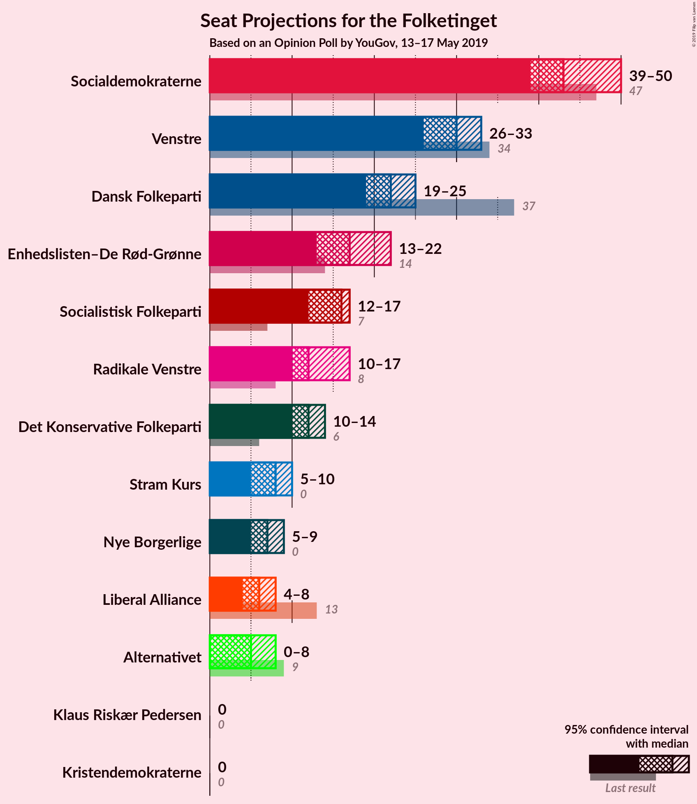

### Confidence Intervals

| Party | Last Result | Median | 80% Confidence Interval | 90% Confidence Interval | 95% Confidence Interval | 99% Confidence Interval |
|:-----:|:-----------:|:------:|:-----------------------:|:-----------------------:|:-----------------------:|:-----------------------:|
| <a href="#socialdemokraterne">Socialdemokraterne</a> | 47 | 43 | 39–47 |39–49 |39–50 |39–50 |
| <a href="#venstre">Venstre</a> | 34 | 30 | 26–31 |26–33 |26–33 |23–33 |
| <a href="#dansk-folkeparti">Dansk Folkeparti</a> | 37 | 22 | 20–24 |19–24 |19–25 |18–29 |
| <a href="#enhedslisten–de-rød-grønne">Enhedslisten–De Rød-Grønne</a> | 14 | 17 | 14–22 |14–22 |13–22 |13–22 |
| <a href="#socialistisk-folkeparti">Socialistisk Folkeparti</a> | 7 | 16 | 13–16 |12–17 |12–17 |12–19 |
| <a href="#radikale-venstre">Radikale Venstre</a> | 8 | 12 | 11–14 |10–15 |10–17 |9–17 |
| <a href="#det-konservative-folkeparti">Det Konservative Folkeparti</a> | 6 | 12 | 10–13 |10–13 |10–14 |9–16 |
| <a href="#stram-kurs">Stram Kurs</a> | 0 | 8 | 5–8 |5–10 |5–10 |4–10 |
| <a href="#nye-borgerlige">Nye Borgerlige</a> | 0 | 7 | 5–8 |5–8 |5–9 |4–10 |
| <a href="#liberal-alliance">Liberal Alliance</a> | 13 | 6 | 4–8 |4–8 |4–8 |0–8 |
| <a href="#alternativet">Alternativet</a> | 9 | 5 | 4–7 |0–7 |0–8 |0–8 |
| <a href="#klaus-riskær-pedersen">Klaus Riskær Pedersen</a> | 0 | 0 | 0 |0 |0 |0–4 |
| <a href="#kristendemokraterne">Kristendemokraterne</a> | 0 | 0 | 0 |0 |0 |0–4 |

### Socialdemokraterne

*For a full overview of the results for this party, see the [Socialdemokraterne](party-socialdemokraterne.html) page.*

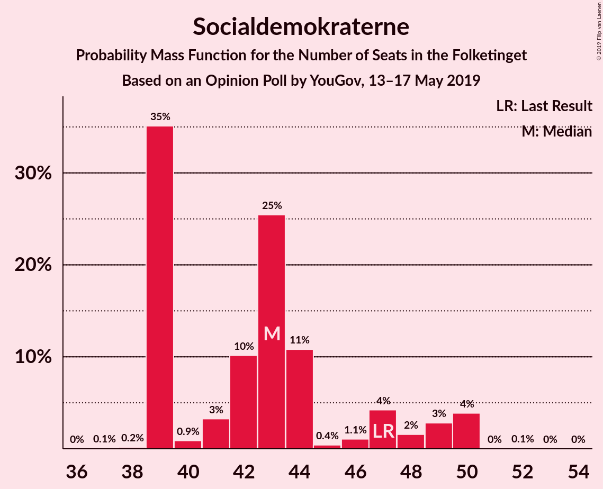

| Number of Seats | Probability | Accumulated | Special Marks |
|:---------------:|:-----------:|:-----------:|:-------------:|
| 37 | 0.1% | 100% |  |
| 38 | 0.2% | 99.9% |  |
| 39 | 35% | 99.7% |  |
| 40 | 0.9% | 65% |  |
| 41 | 3% | 64% |  |
| 42 | 10% | 60% |  |
| 43 | 25% | 50% | Median |
| 44 | 11% | 25% |  |
| 45 | 0.4% | 14% |  |
| 46 | 1.1% | 14% |  |
| 47 | 4% | 13% | Last Result |
| 48 | 2% | 8% |  |
| 49 | 3% | 7% |  |
| 50 | 4% | 4% |  |
| 51 | 0% | 0.1% |  |
| 52 | 0.1% | 0.1% |  |
| 53 | 0% | 0% |  |

### Venstre

*For a full overview of the results for this party, see the [Venstre](party-venstre.html) page.*

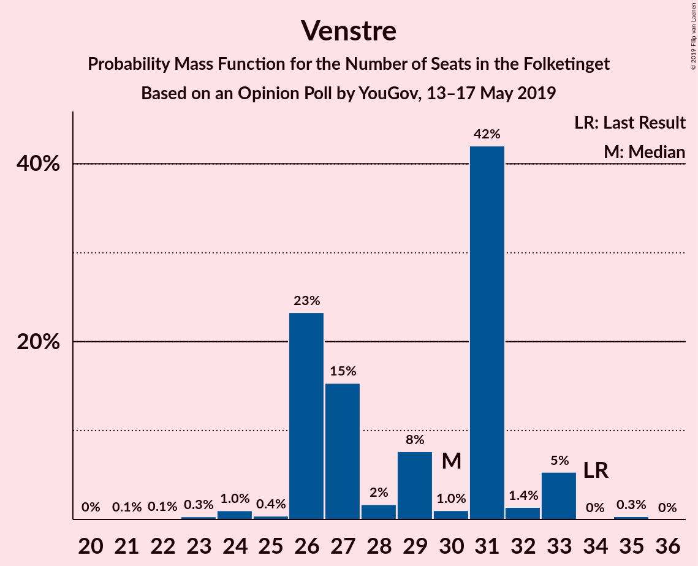

| Number of Seats | Probability | Accumulated | Special Marks |
|:---------------:|:-----------:|:-----------:|:-------------:|
| 21 | 0.1% | 100% |  |
| 22 | 0.1% | 99.9% |  |
| 23 | 0.3% | 99.8% |  |
| 24 | 1.0% | 99.5% |  |
| 25 | 0.4% | 98% |  |
| 26 | 23% | 98% |  |
| 27 | 15% | 75% |  |
| 28 | 2% | 59% |  |
| 29 | 8% | 58% |  |
| 30 | 1.0% | 50% | Median |
| 31 | 42% | 49% |  |
| 32 | 1.4% | 7% |  |
| 33 | 5% | 6% |  |
| 34 | 0% | 0.4% | Last Result |
| 35 | 0.3% | 0.4% |  |
| 36 | 0% | 0% |  |

### Dansk Folkeparti

*For a full overview of the results for this party, see the [Dansk Folkeparti](party-danskfolkeparti.html) page.*

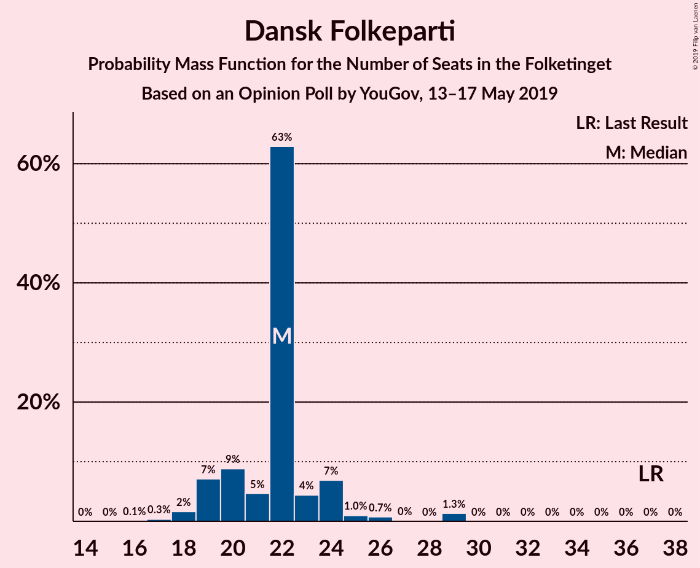

| Number of Seats | Probability | Accumulated | Special Marks |
|:---------------:|:-----------:|:-----------:|:-------------:|
| 16 | 0.1% | 100% |  |
| 17 | 0.3% | 99.9% |  |
| 18 | 2% | 99.6% |  |
| 19 | 7% | 98% |  |
| 20 | 9% | 91% |  |
| 21 | 5% | 82% |  |
| 22 | 63% | 77% | Median |
| 23 | 4% | 14% |  |
| 24 | 7% | 10% |  |
| 25 | 1.0% | 3% |  |
| 26 | 0.7% | 2% |  |
| 27 | 0% | 1.4% |  |
| 28 | 0% | 1.4% |  |
| 29 | 1.3% | 1.4% |  |
| 30 | 0% | 0% |  |
| 31 | 0% | 0% |  |
| 32 | 0% | 0% |  |
| 33 | 0% | 0% |  |
| 34 | 0% | 0% |  |
| 35 | 0% | 0% |  |
| 36 | 0% | 0% |  |
| 37 | 0% | 0% | Last Result |

### Enhedslisten–De Rød-Grønne

*For a full overview of the results for this party, see the [Enhedslisten–De Rød-Grønne](party-enhedslisten–derød-grønne.html) page.*

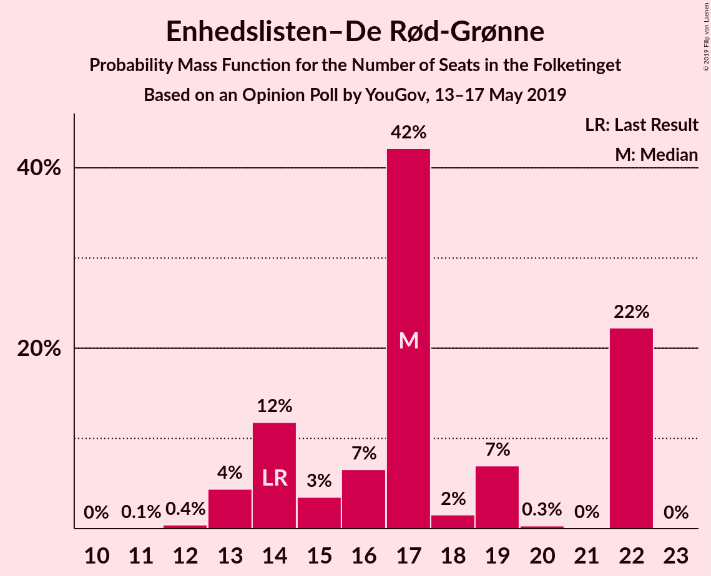

| Number of Seats | Probability | Accumulated | Special Marks |
|:---------------:|:-----------:|:-----------:|:-------------:|
| 11 | 0.1% | 100% |  |
| 12 | 0.4% | 99.9% |  |
| 13 | 4% | 99.5% |  |
| 14 | 12% | 95% | Last Result |
| 15 | 3% | 83% |  |
| 16 | 7% | 80% |  |
| 17 | 42% | 73% | Median |
| 18 | 2% | 31% |  |
| 19 | 7% | 30% |  |
| 20 | 0.3% | 23% |  |
| 21 | 0% | 22% |  |
| 22 | 22% | 22% |  |
| 23 | 0% | 0% |  |

### Socialistisk Folkeparti

*For a full overview of the results for this party, see the [Socialistisk Folkeparti](party-socialistiskfolkeparti.html) page.*

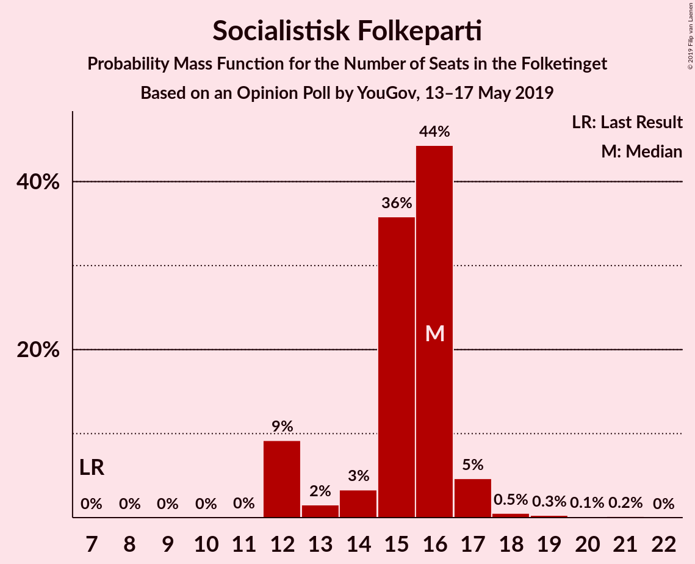

| Number of Seats | Probability | Accumulated | Special Marks |
|:---------------:|:-----------:|:-----------:|:-------------:|
| 7 | 0% | 100% | Last Result |
| 8 | 0% | 100% |  |
| 9 | 0% | 100% |  |
| 10 | 0% | 100% |  |
| 11 | 0% | 100% |  |
| 12 | 9% | 99.9% |  |
| 13 | 2% | 91% |  |
| 14 | 3% | 89% |  |
| 15 | 36% | 86% |  |
| 16 | 44% | 50% | Median |
| 17 | 5% | 6% |  |
| 18 | 0.5% | 1.1% |  |
| 19 | 0.3% | 0.6% |  |
| 20 | 0.1% | 0.3% |  |
| 21 | 0.2% | 0.2% |  |
| 22 | 0% | 0% |  |

### Radikale Venstre

*For a full overview of the results for this party, see the [Radikale Venstre](party-radikalevenstre.html) page.*

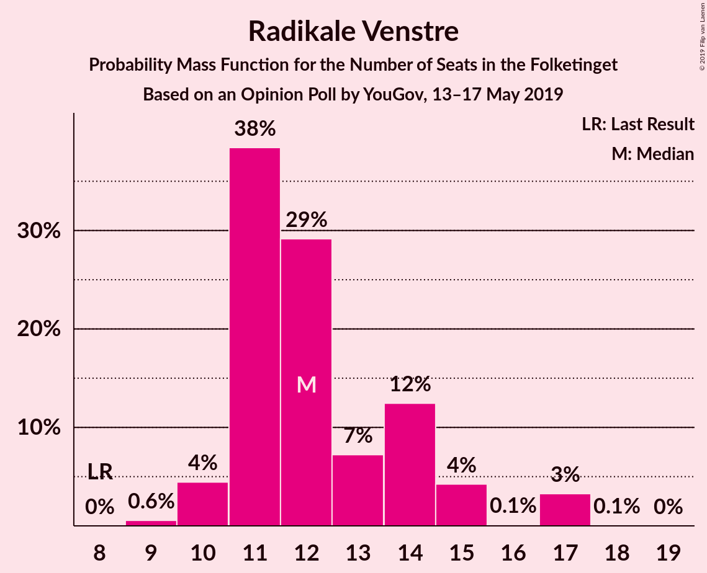

| Number of Seats | Probability | Accumulated | Special Marks |
|:---------------:|:-----------:|:-----------:|:-------------:|
| 8 | 0% | 100% | Last Result |
| 9 | 0.6% | 100% |  |
| 10 | 4% | 99.4% |  |
| 11 | 38% | 95% |  |
| 12 | 29% | 57% | Median |
| 13 | 7% | 27% |  |
| 14 | 12% | 20% |  |
| 15 | 4% | 8% |  |
| 16 | 0.1% | 3% |  |
| 17 | 3% | 3% |  |
| 18 | 0.1% | 0.1% |  |
| 19 | 0% | 0% |  |

### Det Konservative Folkeparti

*For a full overview of the results for this party, see the [Det Konservative Folkeparti](party-detkonservativefolkeparti.html) page.*

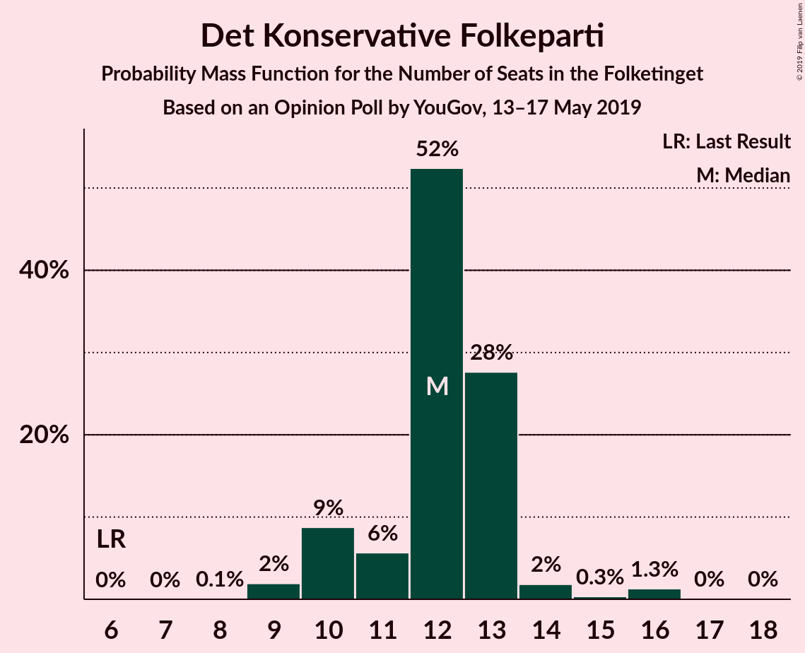

| Number of Seats | Probability | Accumulated | Special Marks |
|:---------------:|:-----------:|:-----------:|:-------------:|
| 6 | 0% | 100% | Last Result |
| 7 | 0% | 100% |  |
| 8 | 0.1% | 100% |  |
| 9 | 2% | 99.9% |  |
| 10 | 9% | 98% |  |
| 11 | 6% | 89% |  |
| 12 | 52% | 84% | Median |
| 13 | 28% | 31% |  |
| 14 | 2% | 4% |  |
| 15 | 0.3% | 2% |  |
| 16 | 1.3% | 1.4% |  |
| 17 | 0% | 0.1% |  |
| 18 | 0% | 0% |  |

### Stram Kurs

*For a full overview of the results for this party, see the [Stram Kurs](party-stramkurs.html) page.*

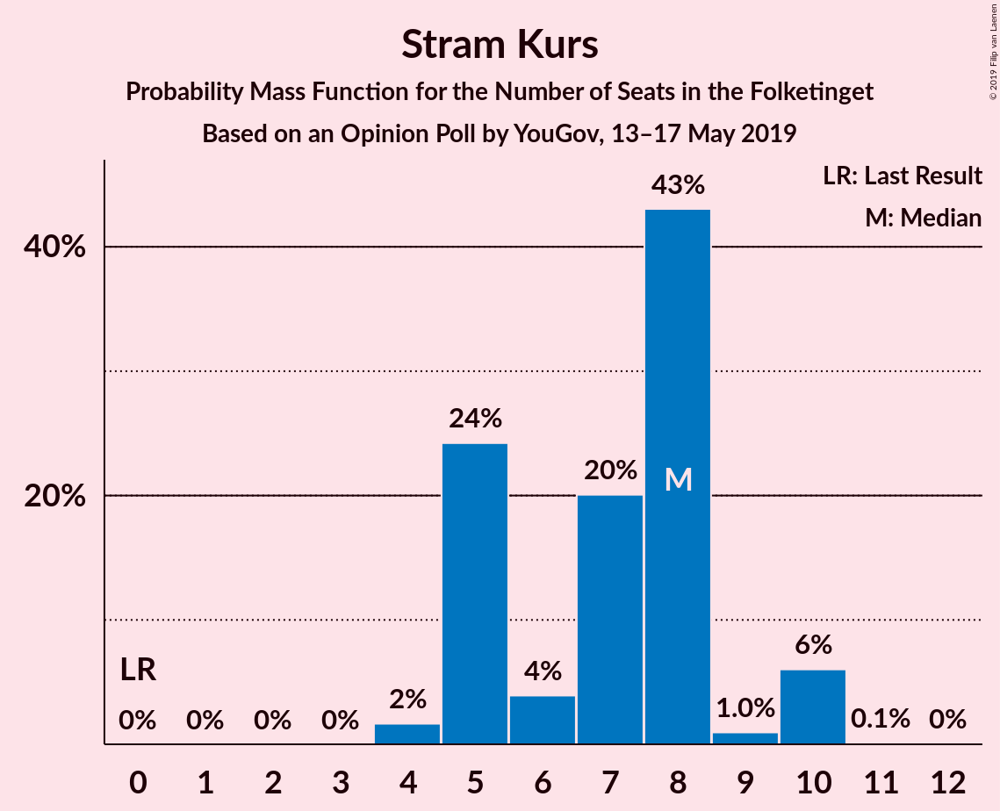

| Number of Seats | Probability | Accumulated | Special Marks |
|:---------------:|:-----------:|:-----------:|:-------------:|
| 0 | 0% | 100% | Last Result |
| 1 | 0% | 100% |  |
| 2 | 0% | 100% |  |
| 3 | 0% | 100% |  |
| 4 | 2% | 100% |  |
| 5 | 24% | 98% |  |
| 6 | 4% | 74% |  |
| 7 | 20% | 70% |  |
| 8 | 43% | 50% | Median |
| 9 | 1.0% | 7% |  |
| 10 | 6% | 6% |  |
| 11 | 0.1% | 0.1% |  |
| 12 | 0% | 0% |  |

### Nye Borgerlige

*For a full overview of the results for this party, see the [Nye Borgerlige](party-nyeborgerlige.html) page.*

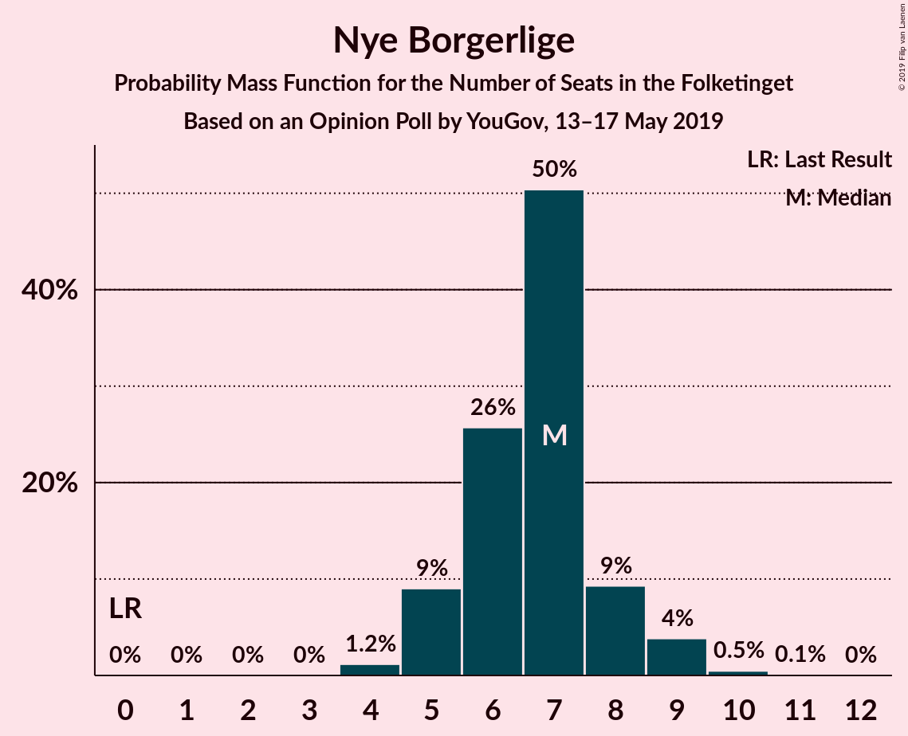

| Number of Seats | Probability | Accumulated | Special Marks |
|:---------------:|:-----------:|:-----------:|:-------------:|
| 0 | 0% | 100% | Last Result |
| 1 | 0% | 100% |  |
| 2 | 0% | 100% |  |
| 3 | 0% | 100% |  |
| 4 | 1.2% | 100% |  |
| 5 | 9% | 98.8% |  |
| 6 | 26% | 90% |  |
| 7 | 50% | 64% | Median |
| 8 | 9% | 14% |  |
| 9 | 4% | 4% |  |
| 10 | 0.5% | 0.6% |  |
| 11 | 0.1% | 0.1% |  |
| 12 | 0% | 0% |  |

### Liberal Alliance

*For a full overview of the results for this party, see the [Liberal Alliance](party-liberalalliance.html) page.*

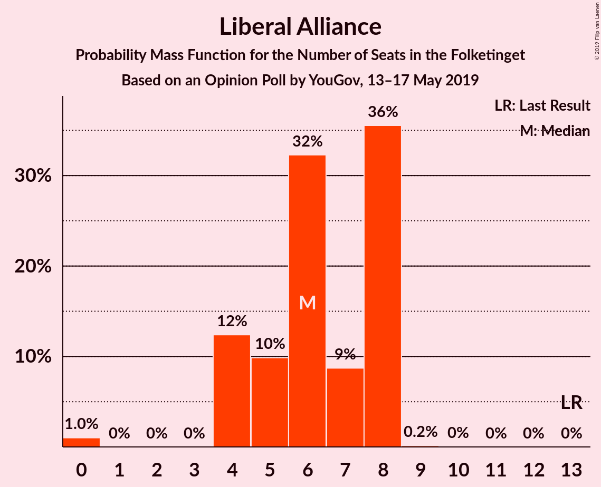

| Number of Seats | Probability | Accumulated | Special Marks |
|:---------------:|:-----------:|:-----------:|:-------------:|
| 0 | 1.0% | 100% |  |
| 1 | 0% | 99.0% |  |
| 2 | 0% | 99.0% |  |
| 3 | 0% | 99.0% |  |
| 4 | 12% | 99.0% |  |
| 5 | 10% | 87% |  |
| 6 | 32% | 77% | Median |
| 7 | 9% | 44% |  |
| 8 | 36% | 36% |  |
| 9 | 0.2% | 0.2% |  |
| 10 | 0% | 0% |  |
| 11 | 0% | 0% |  |
| 12 | 0% | 0% |  |
| 13 | 0% | 0% | Last Result |

### Alternativet

*For a full overview of the results for this party, see the [Alternativet](party-alternativet.html) page.*

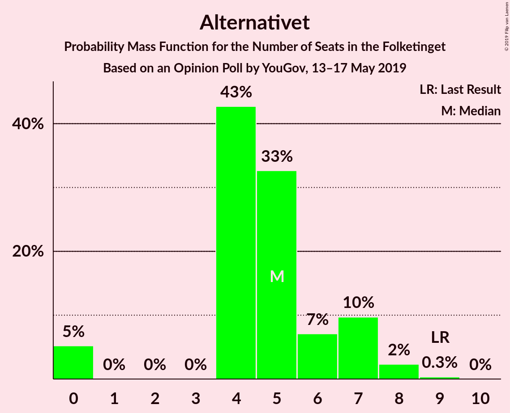

| Number of Seats | Probability | Accumulated | Special Marks |
|:---------------:|:-----------:|:-----------:|:-------------:|
| 0 | 5% | 100% |  |
| 1 | 0% | 95% |  |
| 2 | 0% | 95% |  |
| 3 | 0% | 95% |  |
| 4 | 43% | 95% |  |
| 5 | 33% | 52% | Median |
| 6 | 7% | 19% |  |
| 7 | 10% | 12% |  |
| 8 | 2% | 3% |  |
| 9 | 0.3% | 0.3% | Last Result |
| 10 | 0% | 0% |  |

### Klaus Riskær Pedersen

*For a full overview of the results for this party, see the [Klaus Riskær Pedersen](party-klausriskærpedersen.html) page.*

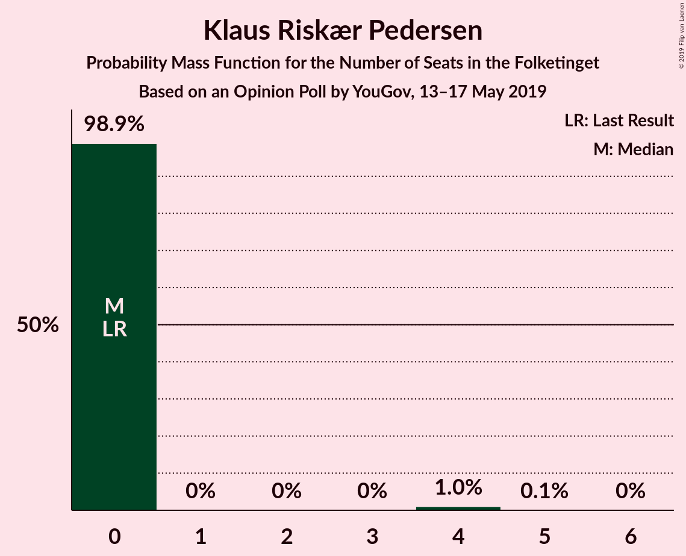

| Number of Seats | Probability | Accumulated | Special Marks |
|:---------------:|:-----------:|:-----------:|:-------------:|
| 0 | 98.9% | 100% | Last Result, Median |
| 1 | 0% | 1.1% |  |
| 2 | 0% | 1.1% |  |
| 3 | 0% | 1.1% |  |
| 4 | 1.0% | 1.1% |  |
| 5 | 0.1% | 0.1% |  |
| 6 | 0% | 0% |  |

### Kristendemokraterne

*For a full overview of the results for this party, see the [Kristendemokraterne](party-kristendemokraterne.html) page.*

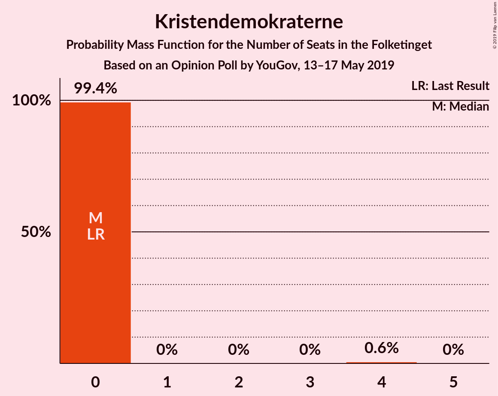

| Number of Seats | Probability | Accumulated | Special Marks |
|:---------------:|:-----------:|:-----------:|:-------------:|
| 0 | 99.4% | 100% | Last Result, Median |
| 1 | 0% | 0.6% |  |
| 2 | 0% | 0.6% |  |
| 3 | 0% | 0.6% |  |
| 4 | 0.6% | 0.6% |  |
| 5 | 0% | 0% |  |

## Coalitions

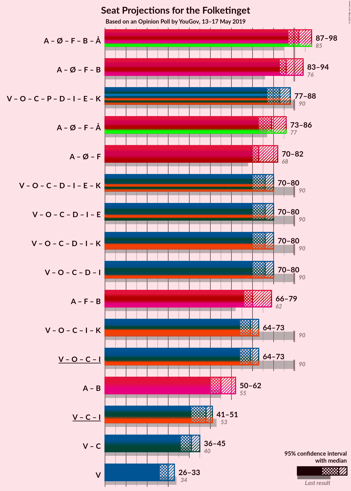

### Confidence Intervals

| Coalition | Last Result | Median | Majority? | 80% Confidence Interval | 90% Confidence Interval | 95% Confidence Interval | 99% Confidence Interval |
|:---------:|:-----------:|:------:|:---------:|:-----------------------:|:-----------------------:|:-----------------------:|:-----------------------:|
| Socialdemokraterne – Enhedslisten–De Rød-Grønne – Socialistisk Folkeparti – Radikale Venstre – Alternativet | 85 | 92 | 57% | 87–97 | 87–97 | 87–98 | 85–99 |
| Socialdemokraterne – Enhedslisten–De Rød-Grønne – Socialistisk Folkeparti – Radikale Venstre | 76 | 86 | 40% | 83–92 | 83–92 | 83–94 | 82–95 |
| Venstre – Dansk Folkeparti – Det Konservative Folkeparti – Stram Kurs – Nye Borgerlige – Liberal Alliance – Klaus Riskær Pedersen – Kristendemokraterne | 90 | 83 | 1.3% | 78–88 | 78–88 | 77–88 | 76–90 |
| Socialdemokraterne – Enhedslisten–De Rød-Grønne – Socialistisk Folkeparti – Alternativet | 77 | 79 | 0% | 75–85 | 75–85 | 73–86 | 73–87 |
| Socialdemokraterne – Enhedslisten–De Rød-Grønne – Socialistisk Folkeparti | 68 | 73 | 0% | 72–80 | 70–80 | 70–82 | 70–83 |
| Venstre – Dansk Folkeparti – Det Konservative Folkeparti – Nye Borgerlige – Liberal Alliance – Klaus Riskær Pedersen – Kristendemokraterne | 90 | 76 | 0% | 71–80 | 71–80 | 70–80 | 70–84 |
| Venstre – Dansk Folkeparti – Det Konservative Folkeparti – Nye Borgerlige – Liberal Alliance – Klaus Riskær Pedersen | 90 | 76 | 0% | 71–80 | 71–80 | 70–80 | 69–84 |
| Venstre – Dansk Folkeparti – Det Konservative Folkeparti – Nye Borgerlige – Liberal Alliance – Kristendemokraterne | 90 | 76 | 0% | 71–80 | 71–80 | 70–80 | 68–84 |
| Venstre – Dansk Folkeparti – Det Konservative Folkeparti – Nye Borgerlige – Liberal Alliance | 90 | 76 | 0% | 71–80 | 71–80 | 70–80 | 68–84 |
| Socialdemokraterne – Socialistisk Folkeparti – Radikale Venstre | 62 | 70 | 0% | 66–75 | 66–76 | 66–79 | 65–79 |
| Venstre – Dansk Folkeparti – Det Konservative Folkeparti – Liberal Alliance – Kristendemokraterne | 90 | 69 | 0% | 65–73 | 64–73 | 64–73 | 62–79 |
| Venstre – Dansk Folkeparti – Det Konservative Folkeparti – Liberal Alliance | 90 | 69 | 0% | 65–73 | 64–73 | 64–73 | 62–79 |
| Socialdemokraterne – Radikale Venstre | 55 | 55 | 0% | 50–60 | 50–62 | 50–62 | 50–62 |
| Venstre – Det Konservative Folkeparti – Liberal Alliance | 53 | 48 | 0% | 43–51 | 41–51 | 41–51 | 41–53 |
| Venstre – Det Konservative Folkeparti | 40 | 41 | 0% | 38–44 | 37–45 | 36–45 | 35–46 |
| Venstre | 34 | 30 | 0% | 26–31 | 26–33 | 26–33 | 23–33 |

### Socialdemokraterne – Enhedslisten–De Rød-Grønne – Socialistisk Folkeparti – Radikale Venstre – Alternativet

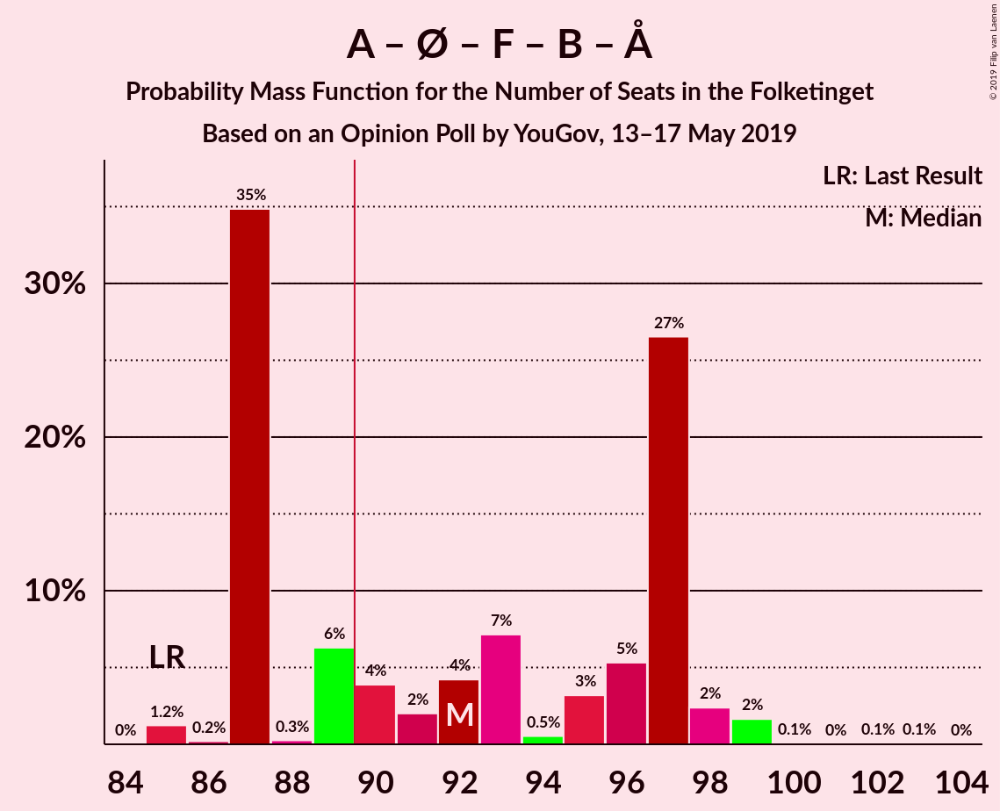

| Number of Seats | Probability | Accumulated | Special Marks |
|:---------------:|:-----------:|:-----------:|:-------------:|
| 84 | 0% | 100% |  |
| 85 | 1.2% | 99.9% | Last Result |
| 86 | 0.2% | 98.7% |  |
| 87 | 35% | 98.5% |  |
| 88 | 0.3% | 64% |  |
| 89 | 6% | 63% |  |
| 90 | 4% | 57% | Majority |
| 91 | 2% | 53% |  |
| 92 | 4% | 51% |  |
| 93 | 7% | 47% | Median |
| 94 | 0.5% | 40% |  |
| 95 | 3% | 39% |  |
| 96 | 5% | 36% |  |
| 97 | 27% | 31% |  |
| 98 | 2% | 4% |  |
| 99 | 2% | 2% |  |
| 100 | 0.1% | 0.2% |  |
| 101 | 0% | 0.2% |  |
| 102 | 0.1% | 0.1% |  |
| 103 | 0.1% | 0.1% |  |
| 104 | 0% | 0% |  |

### Socialdemokraterne – Enhedslisten–De Rød-Grønne – Socialistisk Folkeparti – Radikale Venstre

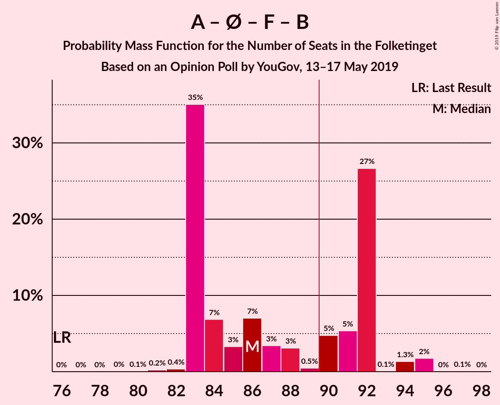

| Number of Seats | Probability | Accumulated | Special Marks |
|:---------------:|:-----------:|:-----------:|:-------------:|
| 76 | 0% | 100% | Last Result |
| 77 | 0% | 100% |  |
| 78 | 0% | 100% |  |
| 79 | 0% | 100% |  |
| 80 | 0.1% | 99.9% |  |
| 81 | 0.2% | 99.9% |  |
| 82 | 0.4% | 99.6% |  |
| 83 | 35% | 99.3% |  |
| 84 | 7% | 64% |  |
| 85 | 3% | 57% |  |
| 86 | 7% | 54% |  |
| 87 | 3% | 47% |  |
| 88 | 3% | 44% | Median |
| 89 | 0.5% | 41% |  |
| 90 | 5% | 40% | Majority |
| 91 | 5% | 35% |  |
| 92 | 27% | 30% |  |
| 93 | 0.1% | 3% |  |
| 94 | 1.3% | 3% |  |
| 95 | 2% | 2% |  |
| 96 | 0% | 0.1% |  |
| 97 | 0.1% | 0.1% |  |
| 98 | 0% | 0% |  |

### Venstre – Dansk Folkeparti – Det Konservative Folkeparti – Stram Kurs – Nye Borgerlige – Liberal Alliance – Klaus Riskær Pedersen – Kristendemokraterne

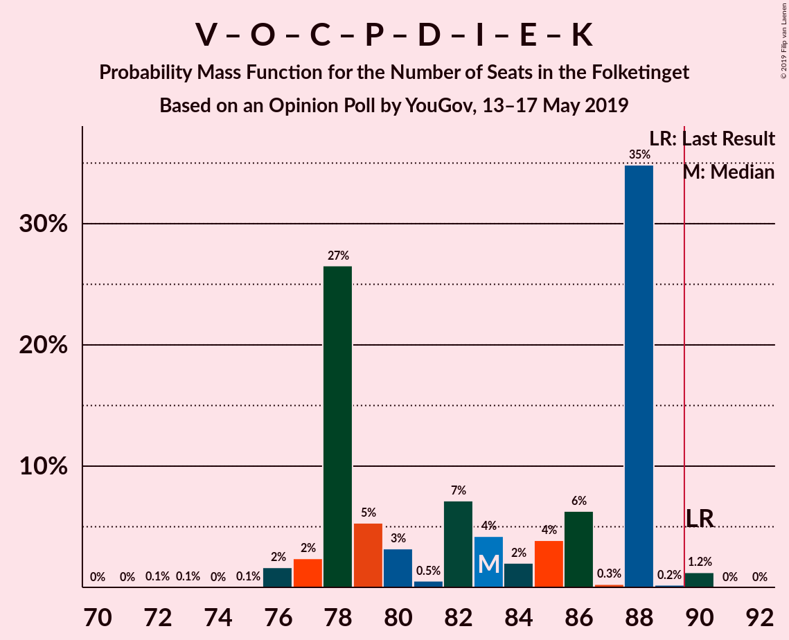

| Number of Seats | Probability | Accumulated | Special Marks |
|:---------------:|:-----------:|:-----------:|:-------------:|
| 72 | 0.1% | 100% |  |
| 73 | 0.1% | 99.9% |  |
| 74 | 0% | 99.9% |  |
| 75 | 0.1% | 99.8% |  |
| 76 | 2% | 99.8% |  |
| 77 | 2% | 98% |  |
| 78 | 27% | 96% |  |
| 79 | 5% | 69% |  |
| 80 | 3% | 64% |  |
| 81 | 0.5% | 61% |  |
| 82 | 7% | 60% |  |
| 83 | 4% | 53% |  |
| 84 | 2% | 49% |  |
| 85 | 4% | 47% | Median |
| 86 | 6% | 43% |  |
| 87 | 0.3% | 37% |  |
| 88 | 35% | 36% |  |
| 89 | 0.2% | 1.5% |  |
| 90 | 1.2% | 1.3% | Last Result, Majority |
| 91 | 0% | 0.1% |  |
| 92 | 0% | 0% |  |

### Socialdemokraterne – Enhedslisten–De Rød-Grønne – Socialistisk Folkeparti – Alternativet

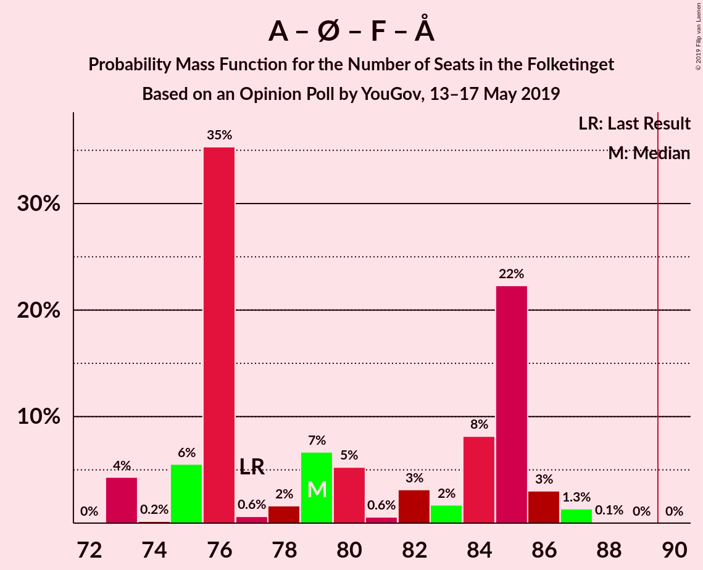

| Number of Seats | Probability | Accumulated | Special Marks |
|:---------------:|:-----------:|:-----------:|:-------------:|
| 72 | 0% | 100% |  |
| 73 | 4% | 99.9% |  |
| 74 | 0.2% | 96% |  |
| 75 | 6% | 95% |  |
| 76 | 35% | 90% |  |
| 77 | 0.6% | 55% | Last Result |
| 78 | 2% | 54% |  |
| 79 | 7% | 52% |  |
| 80 | 5% | 46% |  |
| 81 | 0.6% | 40% | Median |
| 82 | 3% | 40% |  |
| 83 | 2% | 37% |  |
| 84 | 8% | 35% |  |
| 85 | 22% | 27% |  |
| 86 | 3% | 5% |  |
| 87 | 1.3% | 1.5% |  |
| 88 | 0.1% | 0.2% |  |
| 89 | 0% | 0% |  |

### Socialdemokraterne – Enhedslisten–De Rød-Grønne – Socialistisk Folkeparti

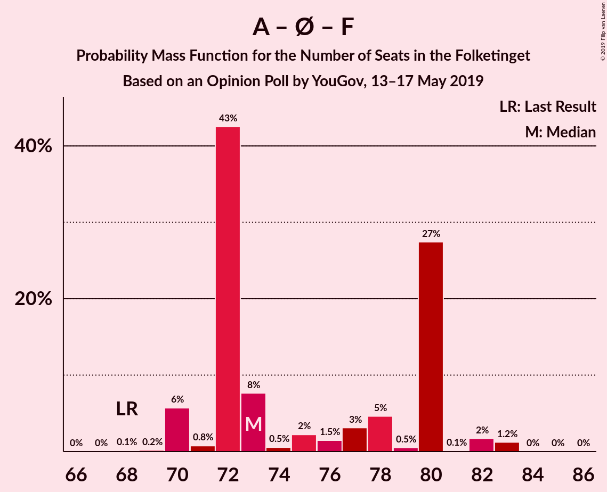

| Number of Seats | Probability | Accumulated | Special Marks |
|:---------------:|:-----------:|:-----------:|:-------------:|
| 67 | 0% | 100% |  |
| 68 | 0.1% | 99.9% | Last Result |
| 69 | 0.2% | 99.8% |  |
| 70 | 6% | 99.6% |  |
| 71 | 0.8% | 94% |  |
| 72 | 43% | 93% |  |
| 73 | 8% | 51% |  |
| 74 | 0.5% | 43% |  |
| 75 | 2% | 42% |  |
| 76 | 1.5% | 40% | Median |
| 77 | 3% | 39% |  |
| 78 | 5% | 36% |  |
| 79 | 0.5% | 31% |  |
| 80 | 27% | 31% |  |
| 81 | 0.1% | 3% |  |
| 82 | 2% | 3% |  |
| 83 | 1.2% | 1.3% |  |
| 84 | 0% | 0.1% |  |
| 85 | 0% | 0.1% |  |
| 86 | 0% | 0% |  |

### Venstre – Dansk Folkeparti – Det Konservative Folkeparti – Nye Borgerlige – Liberal Alliance – Klaus Riskær Pedersen – Kristendemokraterne

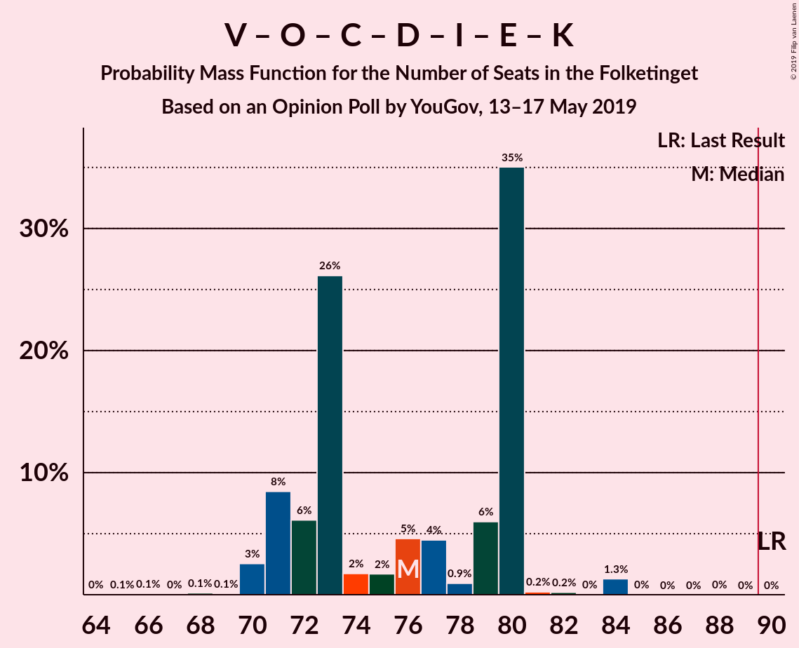

| Number of Seats | Probability | Accumulated | Special Marks |
|:---------------:|:-----------:|:-----------:|:-------------:|
| 65 | 0.1% | 100% |  |
| 66 | 0.1% | 99.9% |  |
| 67 | 0% | 99.8% |  |
| 68 | 0.1% | 99.8% |  |
| 69 | 0.1% | 99.7% |  |
| 70 | 3% | 99.6% |  |
| 71 | 8% | 97% |  |
| 72 | 6% | 89% |  |
| 73 | 26% | 82% |  |
| 74 | 2% | 56% |  |
| 75 | 2% | 55% |  |
| 76 | 5% | 53% |  |
| 77 | 4% | 48% | Median |
| 78 | 0.9% | 44% |  |
| 79 | 6% | 43% |  |
| 80 | 35% | 37% |  |
| 81 | 0.2% | 2% |  |
| 82 | 0.2% | 2% |  |
| 83 | 0% | 1.4% |  |
| 84 | 1.3% | 1.3% |  |
| 85 | 0% | 0% |  |
| 86 | 0% | 0% |  |
| 87 | 0% | 0% |  |
| 88 | 0% | 0% |  |
| 89 | 0% | 0% |  |
| 90 | 0% | 0% | Last Result, Majority |

### Venstre – Dansk Folkeparti – Det Konservative Folkeparti – Nye Borgerlige – Liberal Alliance – Klaus Riskær Pedersen

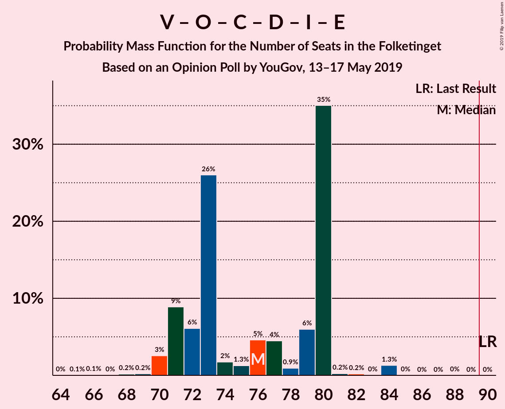

| Number of Seats | Probability | Accumulated | Special Marks |
|:---------------:|:-----------:|:-----------:|:-------------:|
| 65 | 0.1% | 100% |  |
| 66 | 0.1% | 99.9% |  |
| 67 | 0% | 99.8% |  |
| 68 | 0.2% | 99.8% |  |
| 69 | 0.2% | 99.6% |  |
| 70 | 3% | 99.4% |  |
| 71 | 9% | 97% |  |
| 72 | 6% | 88% |  |
| 73 | 26% | 82% |  |
| 74 | 2% | 56% |  |
| 75 | 1.3% | 54% |  |
| 76 | 5% | 53% |  |
| 77 | 4% | 48% | Median |
| 78 | 0.9% | 44% |  |
| 79 | 6% | 43% |  |
| 80 | 35% | 37% |  |
| 81 | 0.2% | 2% |  |
| 82 | 0.2% | 2% |  |
| 83 | 0% | 1.4% |  |
| 84 | 1.3% | 1.3% |  |
| 85 | 0% | 0% |  |
| 86 | 0% | 0% |  |
| 87 | 0% | 0% |  |
| 88 | 0% | 0% |  |
| 89 | 0% | 0% |  |
| 90 | 0% | 0% | Last Result, Majority |

### Venstre – Dansk Folkeparti – Det Konservative Folkeparti – Nye Borgerlige – Liberal Alliance – Kristendemokraterne

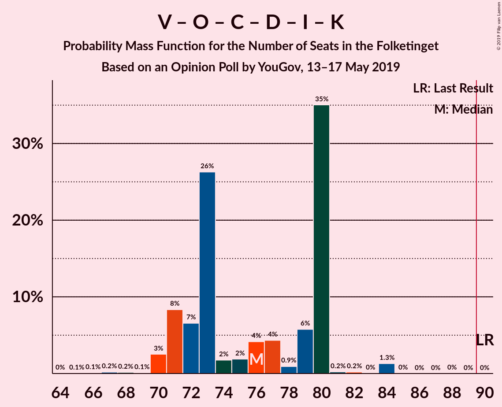

| Number of Seats | Probability | Accumulated | Special Marks |
|:---------------:|:-----------:|:-----------:|:-------------:|
| 65 | 0.1% | 100% |  |
| 66 | 0.1% | 99.9% |  |
| 67 | 0.2% | 99.8% |  |
| 68 | 0.2% | 99.6% |  |
| 69 | 0.1% | 99.5% |  |
| 70 | 3% | 99.4% |  |
| 71 | 8% | 97% |  |
| 72 | 7% | 89% |  |
| 73 | 26% | 82% |  |
| 74 | 2% | 56% |  |
| 75 | 2% | 54% |  |
| 76 | 4% | 52% |  |
| 77 | 4% | 48% | Median |
| 78 | 0.9% | 44% |  |
| 79 | 6% | 43% |  |
| 80 | 35% | 37% |  |
| 81 | 0.2% | 2% |  |
| 82 | 0.2% | 2% |  |
| 83 | 0% | 1.4% |  |
| 84 | 1.3% | 1.3% |  |
| 85 | 0% | 0% |  |
| 86 | 0% | 0% |  |
| 87 | 0% | 0% |  |
| 88 | 0% | 0% |  |
| 89 | 0% | 0% |  |
| 90 | 0% | 0% | Last Result, Majority |

### Venstre – Dansk Folkeparti – Det Konservative Folkeparti – Nye Borgerlige – Liberal Alliance

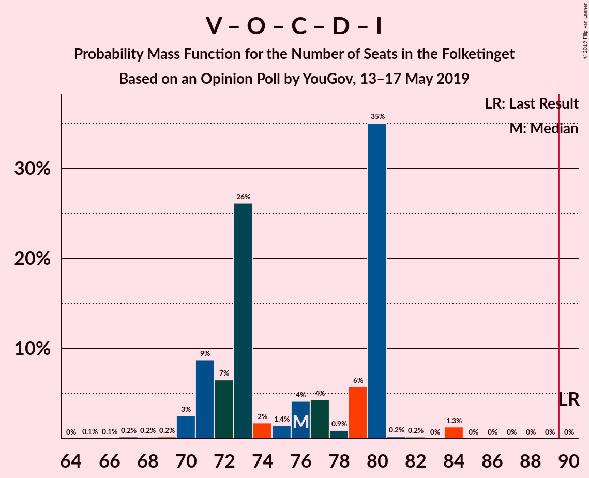

| Number of Seats | Probability | Accumulated | Special Marks |
|:---------------:|:-----------:|:-----------:|:-------------:|
| 65 | 0.1% | 100% |  |
| 66 | 0.1% | 99.9% |  |
| 67 | 0.2% | 99.8% |  |
| 68 | 0.2% | 99.6% |  |
| 69 | 0.2% | 99.4% |  |
| 70 | 3% | 99.2% |  |
| 71 | 9% | 97% |  |
| 72 | 7% | 88% |  |
| 73 | 26% | 81% |  |
| 74 | 2% | 55% |  |
| 75 | 1.4% | 53% |  |
| 76 | 4% | 52% |  |
| 77 | 4% | 48% | Median |
| 78 | 0.9% | 44% |  |
| 79 | 6% | 43% |  |
| 80 | 35% | 37% |  |
| 81 | 0.2% | 2% |  |
| 82 | 0.2% | 2% |  |
| 83 | 0% | 1.4% |  |
| 84 | 1.3% | 1.3% |  |
| 85 | 0% | 0% |  |
| 86 | 0% | 0% |  |
| 87 | 0% | 0% |  |
| 88 | 0% | 0% |  |
| 89 | 0% | 0% |  |
| 90 | 0% | 0% | Last Result, Majority |

### Socialdemokraterne – Socialistisk Folkeparti – Radikale Venstre

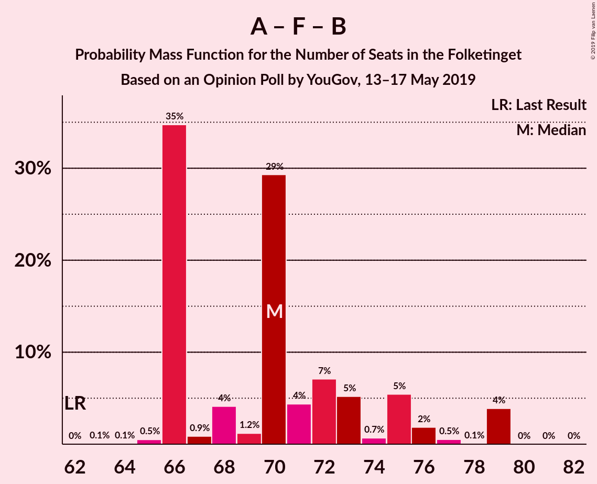

| Number of Seats | Probability | Accumulated | Special Marks |
|:---------------:|:-----------:|:-----------:|:-------------:|
| 62 | 0% | 100% | Last Result |
| 63 | 0.1% | 100% |  |
| 64 | 0.1% | 99.9% |  |
| 65 | 0.5% | 99.9% |  |
| 66 | 35% | 99.4% |  |
| 67 | 0.9% | 65% |  |
| 68 | 4% | 64% |  |
| 69 | 1.2% | 60% |  |
| 70 | 29% | 58% |  |
| 71 | 4% | 29% | Median |
| 72 | 7% | 25% |  |
| 73 | 5% | 18% |  |
| 74 | 0.7% | 12% |  |
| 75 | 5% | 12% |  |
| 76 | 2% | 6% |  |
| 77 | 0.5% | 5% |  |
| 78 | 0.1% | 4% |  |
| 79 | 4% | 4% |  |
| 80 | 0% | 0.1% |  |
| 81 | 0% | 0% |  |

### Venstre – Dansk Folkeparti – Det Konservative Folkeparti – Liberal Alliance – Kristendemokraterne

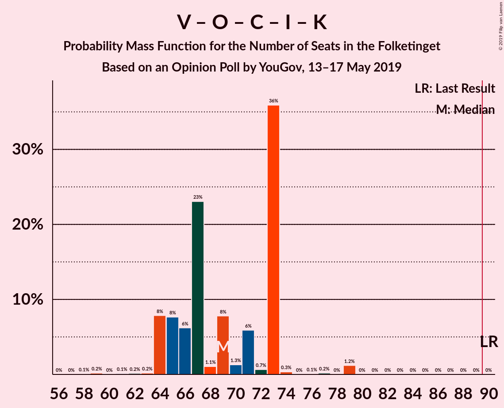

| Number of Seats | Probability | Accumulated | Special Marks |
|:---------------:|:-----------:|:-----------:|:-------------:|
| 58 | 0.1% | 100% |  |
| 59 | 0.2% | 99.9% |  |
| 60 | 0% | 99.7% |  |
| 61 | 0.1% | 99.7% |  |
| 62 | 0.2% | 99.6% |  |
| 63 | 0.2% | 99.4% |  |
| 64 | 8% | 99.2% |  |
| 65 | 8% | 91% |  |
| 66 | 6% | 84% |  |
| 67 | 23% | 78% |  |
| 68 | 1.1% | 54% |  |
| 69 | 8% | 53% |  |
| 70 | 1.3% | 46% | Median |
| 71 | 6% | 44% |  |
| 72 | 0.7% | 38% |  |
| 73 | 36% | 38% |  |
| 74 | 0.3% | 2% |  |
| 75 | 0% | 1.5% |  |
| 76 | 0.1% | 1.5% |  |
| 77 | 0.2% | 1.4% |  |
| 78 | 0% | 1.2% |  |
| 79 | 1.2% | 1.2% |  |
| 80 | 0% | 0% |  |
| 81 | 0% | 0% |  |
| 82 | 0% | 0% |  |
| 83 | 0% | 0% |  |
| 84 | 0% | 0% |  |
| 85 | 0% | 0% |  |
| 86 | 0% | 0% |  |
| 87 | 0% | 0% |  |
| 88 | 0% | 0% |  |
| 89 | 0% | 0% |  |
| 90 | 0% | 0% | Last Result, Majority |

### Venstre – Dansk Folkeparti – Det Konservative Folkeparti – Liberal Alliance

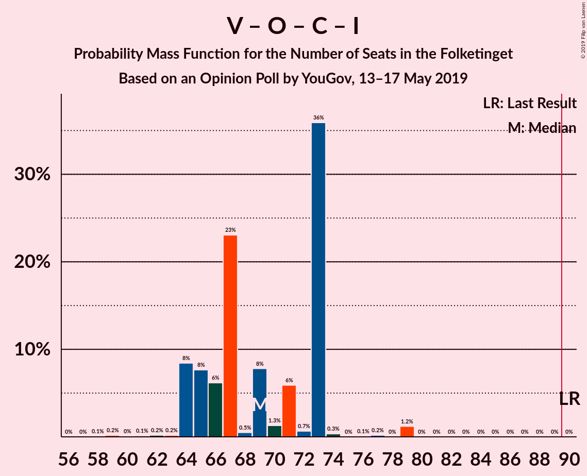

| Number of Seats | Probability | Accumulated | Special Marks |
|:---------------:|:-----------:|:-----------:|:-------------:|
| 58 | 0.1% | 100% |  |
| 59 | 0.2% | 99.9% |  |
| 60 | 0% | 99.7% |  |
| 61 | 0.1% | 99.7% |  |
| 62 | 0.2% | 99.6% |  |
| 63 | 0.2% | 99.4% |  |
| 64 | 8% | 99.2% |  |
| 65 | 8% | 91% |  |
| 66 | 6% | 83% |  |
| 67 | 23% | 77% |  |
| 68 | 0.5% | 54% |  |
| 69 | 8% | 53% |  |
| 70 | 1.3% | 46% | Median |
| 71 | 6% | 44% |  |
| 72 | 0.7% | 38% |  |
| 73 | 36% | 38% |  |
| 74 | 0.3% | 2% |  |
| 75 | 0% | 1.5% |  |
| 76 | 0.1% | 1.5% |  |
| 77 | 0.2% | 1.4% |  |
| 78 | 0% | 1.2% |  |
| 79 | 1.2% | 1.2% |  |
| 80 | 0% | 0% |  |
| 81 | 0% | 0% |  |
| 82 | 0% | 0% |  |
| 83 | 0% | 0% |  |
| 84 | 0% | 0% |  |
| 85 | 0% | 0% |  |
| 86 | 0% | 0% |  |
| 87 | 0% | 0% |  |
| 88 | 0% | 0% |  |
| 89 | 0% | 0% |  |
| 90 | 0% | 0% | Last Result, Majority |

### Socialdemokraterne – Radikale Venstre

| Number of Seats | Probability | Accumulated | Special Marks |
|:---------------:|:-----------:|:-----------:|:-------------:|
| 49 | 0% | 100% |  |
| 50 | 35% | 99.9% |  |
| 51 | 0.4% | 65% |  |
| 52 | 1.0% | 65% |  |
| 53 | 3% | 64% |  |
| 54 | 3% | 61% |  |
| 55 | 24% | 57% | Last Result, Median |
| 56 | 9% | 33% |  |
| 57 | 2% | 25% |  |
| 58 | 7% | 22% |  |
| 59 | 0.5% | 15% |  |
| 60 | 6% | 15% |  |
| 61 | 3% | 9% |  |
| 62 | 6% | 6% |  |
| 63 | 0% | 0.2% |  |
| 64 | 0.1% | 0.1% |  |
| 65 | 0% | 0% |  |

### Venstre – Det Konservative Folkeparti – Liberal Alliance

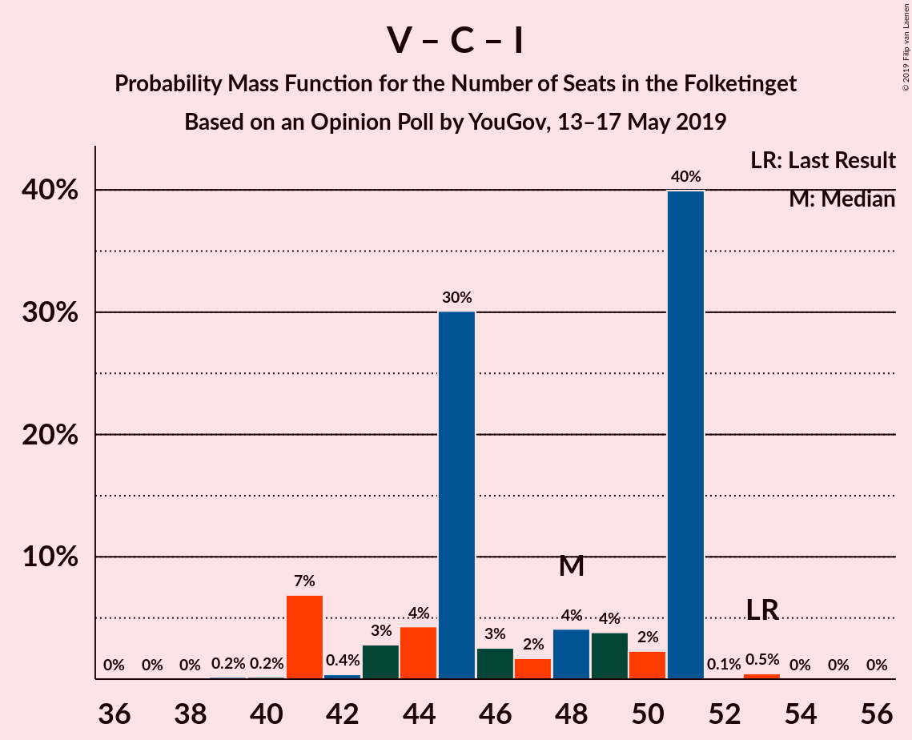

| Number of Seats | Probability | Accumulated | Special Marks |
|:---------------:|:-----------:|:-----------:|:-------------:|
| 37 | 0% | 100% |  |
| 38 | 0% | 99.9% |  |
| 39 | 0.2% | 99.9% |  |
| 40 | 0.2% | 99.7% |  |
| 41 | 7% | 99.5% |  |
| 42 | 0.4% | 93% |  |
| 43 | 3% | 92% |  |
| 44 | 4% | 89% |  |
| 45 | 30% | 85% |  |
| 46 | 3% | 55% |  |
| 47 | 2% | 53% |  |
| 48 | 4% | 51% | Median |
| 49 | 4% | 47% |  |
| 50 | 2% | 43% |  |
| 51 | 40% | 41% |  |
| 52 | 0.1% | 0.6% |  |
| 53 | 0.5% | 0.5% | Last Result |
| 54 | 0% | 0.1% |  |
| 55 | 0% | 0% |  |

### Venstre – Det Konservative Folkeparti

| Number of Seats | Probability | Accumulated | Special Marks |
|:---------------:|:-----------:|:-----------:|:-------------:|
| 31 | 0.1% | 100% |  |
| 32 | 0% | 99.9% |  |
| 33 | 0.1% | 99.9% |  |
| 34 | 0.1% | 99.8% |  |
| 35 | 0.2% | 99.7% |  |
| 36 | 2% | 99.5% |  |
| 37 | 7% | 97% |  |
| 38 | 3% | 91% |  |
| 39 | 27% | 87% |  |
| 40 | 1.3% | 61% | Last Result |
| 41 | 10% | 59% |  |
| 42 | 3% | 50% | Median |
| 43 | 35% | 47% |  |
| 44 | 5% | 11% |  |
| 45 | 5% | 6% |  |
| 46 | 0.1% | 0.5% |  |
| 47 | 0.4% | 0.4% |  |
| 48 | 0% | 0.1% |  |
| 49 | 0% | 0% |  |

### Venstre

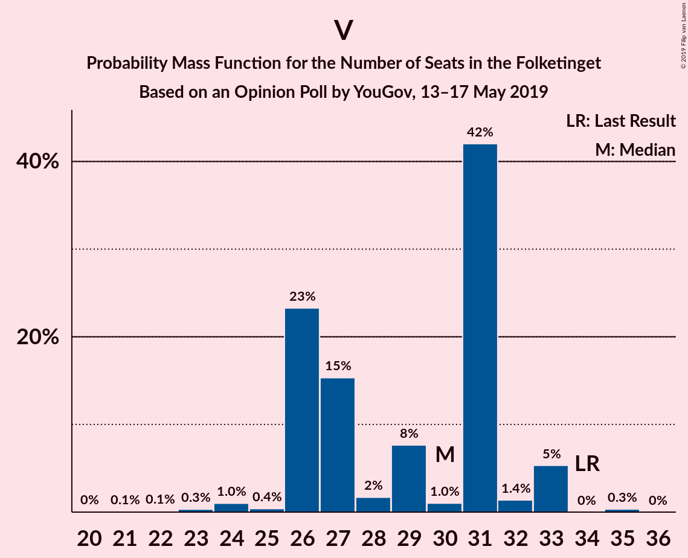

| Number of Seats | Probability | Accumulated | Special Marks |
|:---------------:|:-----------:|:-----------:|:-------------:|
| 21 | 0.1% | 100% |  |
| 22 | 0.1% | 99.9% |  |
| 23 | 0.3% | 99.8% |  |
| 24 | 1.0% | 99.5% |  |
| 25 | 0.4% | 98% |  |
| 26 | 23% | 98% |  |
| 27 | 15% | 75% |  |
| 28 | 2% | 59% |  |
| 29 | 8% | 58% |  |
| 30 | 1.0% | 50% | Median |
| 31 | 42% | 49% |  |
| 32 | 1.4% | 7% |  |
| 33 | 5% | 6% |  |
| 34 | 0% | 0.4% | Last Result |
| 35 | 0.3% | 0.4% |  |
| 36 | 0% | 0% |  |

## Technical Information

### Opinion Poll

+ **Polling firm:** YouGov
+ **Commissioner(s):** —
+ **Fieldwork period:** 13–17 May 2019

### Calculations

+ **Sample size:** 973
+ **Simulations done:** 1,048,576
+ **Error estimate:** 2.73%

