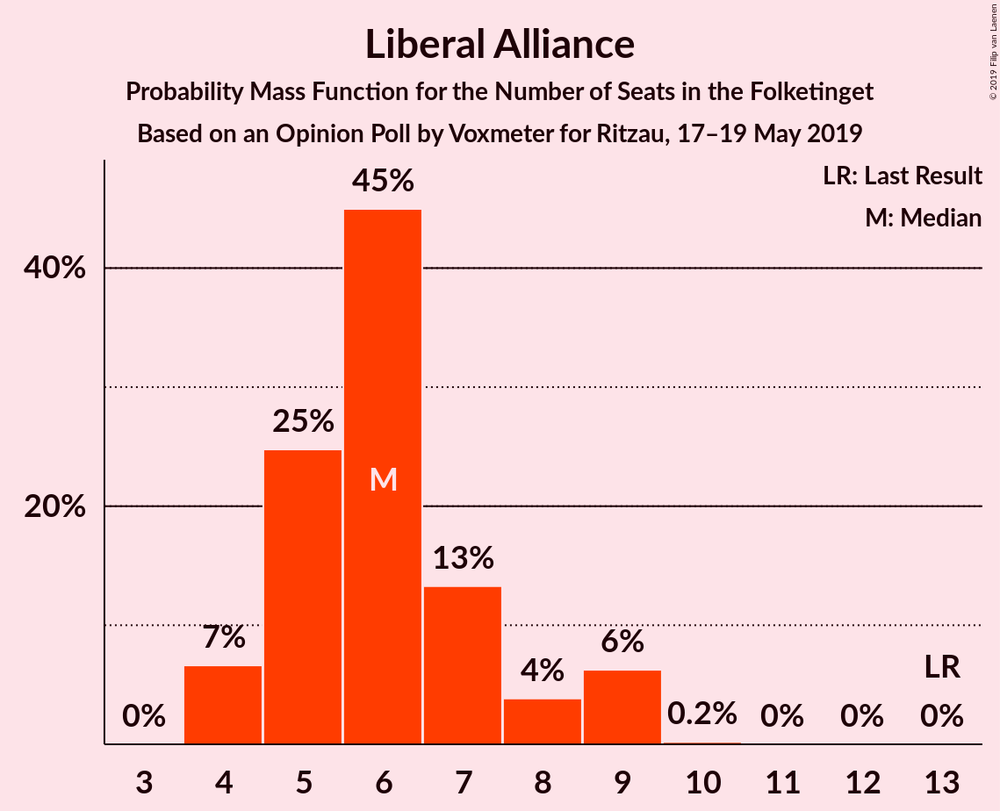

# Opinion Poll by Voxmeter for Ritzau, 17–19 May 2019

<a href="#voting-intentions">Voting Intentions</a> | <a href="#seats">Seats</a> | <a href="#coalitions">Coalitions</a> | <a href="#technical-information">Technical Information</a>

## Voting Intentions

### Confidence Intervals

| Party | Last Result | Poll Result | 80% Confidence Interval | 90% Confidence Interval | 95% Confidence Interval | 99% Confidence Interval |
|:-----:|:-----------:|:-----------:|:-----------------------:|:-----------------------:|:-----------------------:|:-----------------------:|
| Socialdemokraterne | 26.3% | 27.5% | 25.7–29.3% |25.2–29.9% |24.8–30.3% |24.0–31.2% |
| Venstre | 19.5% | 18.5% | 16.9–20.1% |16.5–20.6% |16.2–21.0% |15.5–21.8% |
| Dansk Folkeparti | 21.1% | 11.3% | 10.1–12.7% |9.8–13.1% |9.5–13.4% |8.9–14.1% |
| Enhedslisten–De Rød-Grønne | 7.8% | 8.8% | 7.8–10.1% |7.5–10.4% |7.2–10.7% |6.8–11.4% |
| Radikale Venstre | 4.6% | 7.6% | 6.7–8.8% |6.4–9.2% |6.2–9.4% |5.7–10.0% |
| Socialistisk Folkeparti | 4.2% | 7.3% | 6.4–8.5% |6.1–8.8% |5.9–9.1% |5.5–9.7% |
| Det Konservative Folkeparti | 3.4% | 4.2% | 3.5–5.1% |3.3–5.4% |3.1–5.6% |2.8–6.1% |
| Alternativet | 4.8% | 3.6% | 2.9–4.5% |2.7–4.7% |2.6–4.9% |2.3–5.4% |
| Liberal Alliance | 7.5% | 3.5% | 2.8–4.3% |2.7–4.6% |2.5–4.8% |2.2–5.2% |
| Stram Kurs | 0.0% | 2.6% | 2.0–3.4% |1.9–3.6% |1.8–3.8% |1.5–4.2% |
| Kristendemokraterne | 0.8% | 2.2% | 1.7–2.9% |1.6–3.1% |1.4–3.3% |1.2–3.7% |
| Nye Borgerlige | 0.0% | 1.8% | 1.4–2.5% |1.2–2.6% |1.1–2.8% |0.9–3.2% |
| Klaus Riskær Pedersen | 0.0% | 0.5% | 0.3–0.9% |0.3–1.1% |0.2–1.2% |0.2–1.4% |

*Note:* The poll result column reflects the actual value used in the calculations. Published results may vary slightly, and in addition be rounded to fewer digits.

## Seats

### Confidence Intervals

| Party | Last Result | Median | 80% Confidence Interval | 90% Confidence Interval | 95% Confidence Interval | 99% Confidence Interval |
|:-----:|:-----------:|:------:|:-----------------------:|:-----------------------:|:-----------------------:|:-----------------------:|
| <a href="#socialdemokraterne">Socialdemokraterne</a> | 47 | 50 | 46–51 |43–51 |43–52 |42–55 |
| <a href="#venstre">Venstre</a> | 34 | 36 | 31–38 |30–39 |30–39 |28–39 |
| <a href="#dansk-folkeparti">Dansk Folkeparti</a> | 37 | 19 | 18–22 |18–23 |17–25 |16–25 |
| <a href="#enhedslisten–de-rød-grønne">Enhedslisten–De Rød-Grønne</a> | 14 | 14 | 13–17 |13–18 |13–18 |12–20 |
| <a href="#radikale-venstre">Radikale Venstre</a> | 8 | 13 | 12–16 |12–16 |11–16 |10–18 |
| <a href="#socialistisk-folkeparti">Socialistisk Folkeparti</a> | 7 | 13 | 12–16 |11–16 |10–16 |9–17 |
| <a href="#det-konservative-folkeparti">Det Konservative Folkeparti</a> | 6 | 8 | 7–9 |6–10 |6–10 |5–10 |
| <a href="#alternativet">Alternativet</a> | 9 | 6 | 5–7 |5–8 |5–8 |4–9 |
| <a href="#liberal-alliance">Liberal Alliance</a> | 13 | 6 | 5–8 |4–9 |4–9 |4–9 |
| <a href="#stram-kurs">Stram Kurs</a> | 0 | 5 | 0–6 |0–6 |0–7 |0–8 |
| <a href="#kristendemokraterne">Kristendemokraterne</a> | 0 | 4 | 0–5 |0–5 |0–6 |0–6 |
| <a href="#nye-borgerlige">Nye Borgerlige</a> | 0 | 4 | 0–4 |0–5 |0–5 |0–5 |
| <a href="#klaus-riskær-pedersen">Klaus Riskær Pedersen</a> | 0 | 0 | 0 |0 |0 |0 |

### Socialdemokraterne

*For a full overview of the results for this party, see the [Socialdemokraterne](party-socialdemokraterne.html) page.*

| Number of Seats | Probability | Accumulated | Special Marks |
|:---------------:|:-----------:|:-----------:|:-------------:|
| 41 | 0.4% | 100% |  |
| 42 | 0.2% | 99.6% |  |
| 43 | 6% | 99.4% |  |
| 44 | 2% | 94% |  |
| 45 | 0.8% | 92% |  |
| 46 | 18% | 91% |  |
| 47 | 2% | 73% | Last Result |
| 48 | 4% | 71% |  |
| 49 | 13% | 67% |  |
| 50 | 13% | 54% | Median |
| 51 | 37% | 42% |  |
| 52 | 2% | 4% |  |
| 53 | 0.6% | 2% |  |
| 54 | 0.4% | 2% |  |
| 55 | 1.1% | 1.2% |  |
| 56 | 0% | 0.1% |  |
| 57 | 0% | 0.1% |  |
| 58 | 0% | 0% |  |

### Venstre

*For a full overview of the results for this party, see the [Venstre](party-venstre.html) page.*

| Number of Seats | Probability | Accumulated | Special Marks |
|:---------------:|:-----------:|:-----------:|:-------------:|
| 26 | 0.1% | 100% |  |
| 27 | 0% | 99.9% |  |
| 28 | 0.3% | 99.8% |  |
| 29 | 1.0% | 99.5% |  |
| 30 | 8% | 98% |  |
| 31 | 6% | 90% |  |
| 32 | 9% | 85% |  |
| 33 | 0.9% | 76% |  |
| 34 | 4% | 75% | Last Result |
| 35 | 15% | 70% |  |
| 36 | 36% | 55% | Median |
| 37 | 6% | 19% |  |
| 38 | 6% | 12% |  |
| 39 | 6% | 6% |  |
| 40 | 0.3% | 0.4% |  |
| 41 | 0.1% | 0.1% |  |
| 42 | 0% | 0% |  |

### Dansk Folkeparti

*For a full overview of the results for this party, see the [Dansk Folkeparti](party-danskfolkeparti.html) page.*

| Number of Seats | Probability | Accumulated | Special Marks |
|:---------------:|:-----------:|:-----------:|:-------------:|
| 15 | 0.2% | 100% |  |
| 16 | 1.5% | 99.8% |  |
| 17 | 1.2% | 98% |  |
| 18 | 9% | 97% |  |
| 19 | 47% | 88% | Median |
| 20 | 3% | 41% |  |
| 21 | 24% | 38% |  |
| 22 | 9% | 14% |  |
| 23 | 0.5% | 5% |  |
| 24 | 0.5% | 5% |  |
| 25 | 4% | 4% |  |
| 26 | 0.1% | 0.1% |  |
| 27 | 0% | 0% |  |
| 28 | 0% | 0% |  |
| 29 | 0% | 0% |  |
| 30 | 0% | 0% |  |
| 31 | 0% | 0% |  |
| 32 | 0% | 0% |  |
| 33 | 0% | 0% |  |
| 34 | 0% | 0% |  |
| 35 | 0% | 0% |  |
| 36 | 0% | 0% |  |
| 37 | 0% | 0% | Last Result |

### Enhedslisten–De Rød-Grønne

*For a full overview of the results for this party, see the [Enhedslisten–De Rød-Grønne](party-enhedslisten–derød-grønne.html) page.*

| Number of Seats | Probability | Accumulated | Special Marks |
|:---------------:|:-----------:|:-----------:|:-------------:|
| 11 | 0.1% | 100% |  |
| 12 | 0.7% | 99.9% |  |
| 13 | 40% | 99.3% |  |
| 14 | 10% | 59% | Last Result, Median |
| 15 | 11% | 50% |  |
| 16 | 22% | 38% |  |
| 17 | 9% | 17% |  |
| 18 | 5% | 7% |  |
| 19 | 0.8% | 2% |  |
| 20 | 1.2% | 1.3% |  |
| 21 | 0.1% | 0.1% |  |
| 22 | 0% | 0.1% |  |
| 23 | 0% | 0% |  |

### Radikale Venstre

*For a full overview of the results for this party, see the [Radikale Venstre](party-radikalevenstre.html) page.*

| Number of Seats | Probability | Accumulated | Special Marks |
|:---------------:|:-----------:|:-----------:|:-------------:|
| 8 | 0% | 100% | Last Result |
| 9 | 0% | 100% |  |
| 10 | 1.2% | 100% |  |
| 11 | 3% | 98.8% |  |
| 12 | 45% | 96% |  |
| 13 | 15% | 51% | Median |
| 14 | 5% | 37% |  |
| 15 | 9% | 31% |  |
| 16 | 21% | 22% |  |
| 17 | 0.6% | 1.4% |  |
| 18 | 0.4% | 0.8% |  |
| 19 | 0.4% | 0.4% |  |
| 20 | 0% | 0% |  |

### Socialistisk Folkeparti

*For a full overview of the results for this party, see the [Socialistisk Folkeparti](party-socialistiskfolkeparti.html) page.*

| Number of Seats | Probability | Accumulated | Special Marks |
|:---------------:|:-----------:|:-----------:|:-------------:|
| 7 | 0% | 100% | Last Result |
| 8 | 0% | 100% |  |
| 9 | 2% | 100% |  |
| 10 | 2% | 98% |  |
| 11 | 3% | 96% |  |
| 12 | 39% | 93% |  |
| 13 | 19% | 54% | Median |
| 14 | 8% | 35% |  |
| 15 | 14% | 27% |  |
| 16 | 12% | 13% |  |
| 17 | 1.3% | 1.5% |  |
| 18 | 0.1% | 0.1% |  |
| 19 | 0.1% | 0.1% |  |
| 20 | 0% | 0% |  |

### Det Konservative Folkeparti

*For a full overview of the results for this party, see the [Det Konservative Folkeparti](party-detkonservativefolkeparti.html) page.*

| Number of Seats | Probability | Accumulated | Special Marks |
|:---------------:|:-----------:|:-----------:|:-------------:|
| 4 | 0.1% | 100% |  |
| 5 | 1.1% | 99.9% |  |
| 6 | 7% | 98.8% | Last Result |
| 7 | 31% | 91% |  |
| 8 | 46% | 60% | Median |
| 9 | 5% | 14% |  |
| 10 | 8% | 8% |  |
| 11 | 0.2% | 0.3% |  |
| 12 | 0% | 0% |  |

### Alternativet

*For a full overview of the results for this party, see the [Alternativet](party-alternativet.html) page.*

| Number of Seats | Probability | Accumulated | Special Marks |
|:---------------:|:-----------:|:-----------:|:-------------:|
| 0 | 0.1% | 100% |  |
| 1 | 0% | 99.9% |  |
| 2 | 0% | 99.9% |  |
| 3 | 0% | 99.9% |  |
| 4 | 0.8% | 99.9% |  |
| 5 | 38% | 99.1% |  |
| 6 | 36% | 61% | Median |
| 7 | 18% | 25% |  |
| 8 | 5% | 7% |  |
| 9 | 1.5% | 2% | Last Result |
| 10 | 0.4% | 0.4% |  |
| 11 | 0% | 0% |  |

### Liberal Alliance

*For a full overview of the results for this party, see the [Liberal Alliance](party-liberalalliance.html) page.*

| Number of Seats | Probability | Accumulated | Special Marks |
|:---------------:|:-----------:|:-----------:|:-------------:|
| 4 | 7% | 100% |  |
| 5 | 25% | 93% |  |
| 6 | 45% | 69% | Median |
| 7 | 13% | 24% |  |
| 8 | 4% | 10% |  |
| 9 | 6% | 6% |  |
| 10 | 0.2% | 0.2% |  |
| 11 | 0% | 0% |  |
| 12 | 0% | 0% |  |
| 13 | 0% | 0% | Last Result |

### Stram Kurs

*For a full overview of the results for this party, see the [Stram Kurs](party-stramkurs.html) page.*

| Number of Seats | Probability | Accumulated | Special Marks |
|:---------------:|:-----------:|:-----------:|:-------------:|
| 0 | 12% | 100% | Last Result |
| 1 | 0% | 88% |  |
| 2 | 0% | 88% |  |
| 3 | 0% | 88% |  |
| 4 | 16% | 88% |  |
| 5 | 51% | 73% | Median |
| 6 | 19% | 21% |  |
| 7 | 2% | 3% |  |
| 8 | 0.7% | 0.7% |  |
| 9 | 0% | 0% |  |

### Kristendemokraterne

*For a full overview of the results for this party, see the [Kristendemokraterne](party-kristendemokraterne.html) page.*

| Number of Seats | Probability | Accumulated | Special Marks |
|:---------------:|:-----------:|:-----------:|:-------------:|
| 0 | 25% | 100% | Last Result |
| 1 | 0% | 75% |  |
| 2 | 0% | 75% |  |
| 3 | 0% | 75% |  |
| 4 | 60% | 75% | Median |
| 5 | 12% | 15% |  |
| 6 | 2% | 3% |  |
| 7 | 0.2% | 0.2% |  |
| 8 | 0% | 0% |  |

### Nye Borgerlige

*For a full overview of the results for this party, see the [Nye Borgerlige](party-nyeborgerlige.html) page.*

| Number of Seats | Probability | Accumulated | Special Marks |
|:---------------:|:-----------:|:-----------:|:-------------:|
| 0 | 36% | 100% | Last Result |
| 1 | 0% | 64% |  |
| 2 | 0% | 64% |  |
| 3 | 0.2% | 64% |  |
| 4 | 57% | 63% | Median |
| 5 | 7% | 7% |  |
| 6 | 0.1% | 0.1% |  |
| 7 | 0% | 0% |  |

### Klaus Riskær Pedersen

*For a full overview of the results for this party, see the [Klaus Riskær Pedersen](party-klausriskærpedersen.html) page.*

| Number of Seats | Probability | Accumulated | Special Marks |
|:---------------:|:-----------:|:-----------:|:-------------:|
| 0 | 100% | 100% | Last Result, Median |

## Coalitions

### Confidence Intervals

| Coalition | Last Result | Median | Majority? | 80% Confidence Interval | 90% Confidence Interval | 95% Confidence Interval | 99% Confidence Interval |
|:---------:|:-----------:|:------:|:---------:|:-----------------------:|:-----------------------:|:-----------------------:|:-----------------------:|
| Socialdemokraterne – Enhedslisten–De Rød-Grønne – Radikale Venstre – Socialistisk Folkeparti – Alternativet | 85 | 96 | 99.9% | 93–102 | 93–104 | 93–104 | 92–105 |
| Socialdemokraterne – Enhedslisten–De Rød-Grønne – Radikale Venstre – Socialistisk Folkeparti | 76 | 90 | 54% | 88–94 | 87–97 | 86–97 | 85–100 |
| Socialdemokraterne – Enhedslisten–De Rød-Grønne – Socialistisk Folkeparti – Alternativet | 77 | 81 | 3% | 81–88 | 81–89 | 78–90 | 78–91 |
| Socialdemokraterne – Enhedslisten–De Rød-Grønne – Socialistisk Folkeparti | 68 | 76 | 0% | 75–82 | 75–82 | 72–82 | 71–85 |
| Venstre – Dansk Folkeparti – Det Konservative Folkeparti – Liberal Alliance – Stram Kurs – Kristendemokraterne – Nye Borgerlige – Klaus Riskær Pedersen | 90 | 79 | 0% | 73–82 | 71–82 | 71–82 | 69–83 |
| Socialdemokraterne – Radikale Venstre – Socialistisk Folkeparti | 62 | 75 | 0% | 74–79 | 72–81 | 70–81 | 70–83 |
| Venstre – Dansk Folkeparti – Det Konservative Folkeparti – Liberal Alliance – Kristendemokraterne – Nye Borgerlige – Klaus Riskær Pedersen | 90 | 75 | 0% | 69–77 | 67–79 | 67–79 | 65–79 |
| Venstre – Dansk Folkeparti – Det Konservative Folkeparti – Liberal Alliance – Kristendemokraterne – Nye Borgerlige | 90 | 75 | 0% | 69–77 | 67–79 | 67–79 | 65–79 |
| Venstre – Dansk Folkeparti – Det Konservative Folkeparti – Liberal Alliance – Kristendemokraterne | 90 | 73 | 0% | 67–76 | 67–79 | 65–79 | 62–79 |
| Venstre – Dansk Folkeparti – Det Konservative Folkeparti – Liberal Alliance – Nye Borgerlige – Klaus Riskær Pedersen | 90 | 73 | 0% | 65–73 | 63–75 | 63–75 | 62–77 |
| Venstre – Dansk Folkeparti – Det Konservative Folkeparti – Liberal Alliance – Nye Borgerlige | 90 | 73 | 0% | 65–73 | 63–75 | 63–75 | 62–77 |
| Venstre – Dansk Folkeparti – Det Konservative Folkeparti – Liberal Alliance | 90 | 69 | 0% | 63–73 | 63–75 | 62–75 | 61–75 |
| Socialdemokraterne – Radikale Venstre | 55 | 63 | 0% | 59–65 | 58–65 | 57–66 | 56–68 |
| Venstre – Det Konservative Folkeparti – Liberal Alliance | 53 | 50 | 0% | 45–51 | 44–54 | 42–54 | 41–54 |
| Venstre – Det Konservative Folkeparti | 40 | 44 | 0% | 39–45 | 38–45 | 37–46 | 35–48 |
| Venstre | 34 | 36 | 0% | 31–38 | 30–39 | 30–39 | 28–39 |

### Socialdemokraterne – Enhedslisten–De Rød-Grønne – Radikale Venstre – Socialistisk Folkeparti – Alternativet

| Number of Seats | Probability | Accumulated | Special Marks |
|:---------------:|:-----------:|:-----------:|:-------------:|
| 85 | 0% | 100% | Last Result |
| 86 | 0% | 100% |  |
| 87 | 0% | 100% |  |
| 88 | 0% | 100% |  |
| 89 | 0% | 99.9% |  |
| 90 | 0% | 99.9% | Majority |
| 91 | 0.2% | 99.9% |  |
| 92 | 2% | 99.7% |  |
| 93 | 38% | 98% |  |
| 94 | 3% | 60% |  |
| 95 | 1.0% | 57% |  |
| 96 | 6% | 56% | Median |
| 97 | 27% | 50% |  |
| 98 | 4% | 22% |  |
| 99 | 2% | 18% |  |
| 100 | 3% | 16% |  |
| 101 | 2% | 13% |  |
| 102 | 1.4% | 10% |  |
| 103 | 2% | 9% |  |
| 104 | 6% | 7% |  |
| 105 | 0.6% | 1.1% |  |
| 106 | 0.1% | 0.5% |  |
| 107 | 0.3% | 0.4% |  |
| 108 | 0.1% | 0.1% |  |
| 109 | 0% | 0% |  |

### Socialdemokraterne – Enhedslisten–De Rød-Grønne – Radikale Venstre – Socialistisk Folkeparti

| Number of Seats | Probability | Accumulated | Special Marks |
|:---------------:|:-----------:|:-----------:|:-------------:|
| 76 | 0% | 100% | Last Result |
| 77 | 0% | 100% |  |
| 78 | 0% | 100% |  |
| 79 | 0% | 100% |  |
| 80 | 0% | 100% |  |
| 81 | 0% | 100% |  |
| 82 | 0% | 100% |  |
| 83 | 0.1% | 100% |  |
| 84 | 0% | 99.9% |  |
| 85 | 2% | 99.8% |  |
| 86 | 1.0% | 98% |  |
| 87 | 2% | 97% |  |
| 88 | 39% | 95% |  |
| 89 | 1.4% | 56% |  |
| 90 | 11% | 54% | Median, Majority |
| 91 | 23% | 44% |  |
| 92 | 5% | 21% |  |
| 93 | 3% | 16% |  |
| 94 | 3% | 13% |  |
| 95 | 2% | 10% |  |
| 96 | 0.4% | 8% |  |
| 97 | 7% | 8% |  |
| 98 | 0.3% | 1.1% |  |
| 99 | 0.4% | 0.9% |  |
| 100 | 0.1% | 0.5% |  |
| 101 | 0% | 0.4% |  |
| 102 | 0.3% | 0.4% |  |
| 103 | 0% | 0% |  |

### Socialdemokraterne – Enhedslisten–De Rød-Grønne – Socialistisk Folkeparti – Alternativet

| Number of Seats | Probability | Accumulated | Special Marks |
|:---------------:|:-----------:|:-----------:|:-------------:|
| 75 | 0.2% | 100% |  |
| 76 | 0% | 99.8% |  |
| 77 | 0.1% | 99.8% | Last Result |
| 78 | 2% | 99.7% |  |
| 79 | 0.9% | 97% |  |
| 80 | 0.7% | 96% |  |
| 81 | 57% | 96% |  |
| 82 | 3% | 39% |  |
| 83 | 7% | 37% | Median |
| 84 | 5% | 30% |  |
| 85 | 9% | 25% |  |
| 86 | 2% | 16% |  |
| 87 | 0.6% | 15% |  |
| 88 | 4% | 14% |  |
| 89 | 7% | 10% |  |
| 90 | 2% | 3% | Majority |
| 91 | 0.6% | 1.0% |  |
| 92 | 0.1% | 0.5% |  |
| 93 | 0.1% | 0.4% |  |
| 94 | 0.3% | 0.3% |  |
| 95 | 0% | 0% |  |

### Socialdemokraterne – Enhedslisten–De Rød-Grønne – Socialistisk Folkeparti

| Number of Seats | Probability | Accumulated | Special Marks |
|:---------------:|:-----------:|:-----------:|:-------------:|
| 68 | 0% | 100% | Last Result |
| 69 | 0% | 100% |  |
| 70 | 0.2% | 99.9% |  |
| 71 | 2% | 99.8% |  |
| 72 | 0.7% | 98% |  |
| 73 | 1.2% | 97% |  |
| 74 | 1.0% | 96% |  |
| 75 | 22% | 95% |  |
| 76 | 38% | 74% |  |
| 77 | 8% | 36% | Median |
| 78 | 10% | 28% |  |
| 79 | 2% | 18% |  |
| 80 | 3% | 15% |  |
| 81 | 2% | 12% |  |
| 82 | 8% | 10% |  |
| 83 | 0.7% | 2% |  |
| 84 | 0.4% | 2% |  |
| 85 | 0.7% | 1.2% |  |
| 86 | 0.1% | 0.4% |  |
| 87 | 0% | 0.3% |  |
| 88 | 0% | 0.3% |  |
| 89 | 0.3% | 0.3% |  |
| 90 | 0% | 0% | Majority |

### Venstre – Dansk Folkeparti – Det Konservative Folkeparti – Liberal Alliance – Stram Kurs – Kristendemokraterne – Nye Borgerlige – Klaus Riskær Pedersen

| Number of Seats | Probability | Accumulated | Special Marks |
|:---------------:|:-----------:|:-----------:|:-------------:|
| 67 | 0.1% | 100% |  |
| 68 | 0.3% | 99.9% |  |
| 69 | 0.1% | 99.6% |  |
| 70 | 0.6% | 99.5% |  |
| 71 | 6% | 98.8% |  |
| 72 | 2% | 93% |  |
| 73 | 1.3% | 91% |  |
| 74 | 2% | 90% |  |
| 75 | 3% | 87% |  |
| 76 | 2% | 84% |  |
| 77 | 4% | 82% |  |
| 78 | 27% | 78% |  |
| 79 | 6% | 50% |  |
| 80 | 1.0% | 44% |  |
| 81 | 3% | 43% |  |
| 82 | 38% | 40% | Median |
| 83 | 2% | 2% |  |
| 84 | 0.2% | 0.3% |  |
| 85 | 0% | 0.1% |  |
| 86 | 0% | 0.1% |  |
| 87 | 0% | 0.1% |  |
| 88 | 0% | 0% |  |
| 89 | 0% | 0% |  |
| 90 | 0% | 0% | Last Result, Majority |

### Socialdemokraterne – Radikale Venstre – Socialistisk Folkeparti

| Number of Seats | Probability | Accumulated | Special Marks |
|:---------------:|:-----------:|:-----------:|:-------------:|
| 62 | 0% | 100% | Last Result |
| 63 | 0% | 100% |  |
| 64 | 0% | 100% |  |
| 65 | 0% | 100% |  |
| 66 | 0% | 100% |  |
| 67 | 0.1% | 100% |  |
| 68 | 0.1% | 99.9% |  |
| 69 | 0.1% | 99.8% |  |
| 70 | 2% | 99.7% |  |
| 71 | 1.4% | 97% |  |
| 72 | 4% | 96% |  |
| 73 | 0.8% | 91% |  |
| 74 | 9% | 91% |  |
| 75 | 55% | 81% |  |
| 76 | 7% | 26% | Median |
| 77 | 3% | 19% |  |
| 78 | 3% | 15% |  |
| 79 | 3% | 12% |  |
| 80 | 0.5% | 9% |  |
| 81 | 7% | 9% |  |
| 82 | 1.3% | 2% |  |
| 83 | 0.5% | 0.7% |  |
| 84 | 0% | 0.2% |  |
| 85 | 0.1% | 0.1% |  |
| 86 | 0% | 0% |  |

### Venstre – Dansk Folkeparti – Det Konservative Folkeparti – Liberal Alliance – Kristendemokraterne – Nye Borgerlige – Klaus Riskær Pedersen

| Number of Seats | Probability | Accumulated | Special Marks |
|:---------------:|:-----------:|:-----------:|:-------------:|
| 63 | 0.3% | 100% |  |
| 64 | 0.1% | 99.7% |  |
| 65 | 0.1% | 99.6% |  |
| 66 | 0.8% | 99.5% |  |
| 67 | 7% | 98.7% |  |
| 68 | 0.4% | 92% |  |
| 69 | 3% | 91% |  |
| 70 | 1.2% | 89% |  |
| 71 | 1.2% | 87% |  |
| 72 | 15% | 86% |  |
| 73 | 13% | 71% |  |
| 74 | 6% | 58% |  |
| 75 | 3% | 52% |  |
| 76 | 4% | 49% |  |
| 77 | 38% | 44% | Median |
| 78 | 0.6% | 7% |  |
| 79 | 6% | 6% |  |
| 80 | 0.2% | 0.4% |  |
| 81 | 0.1% | 0.2% |  |
| 82 | 0% | 0.1% |  |
| 83 | 0% | 0% |  |
| 84 | 0% | 0% |  |
| 85 | 0% | 0% |  |
| 86 | 0% | 0% |  |
| 87 | 0% | 0% |  |
| 88 | 0% | 0% |  |
| 89 | 0% | 0% |  |
| 90 | 0% | 0% | Last Result, Majority |

### Venstre – Dansk Folkeparti – Det Konservative Folkeparti – Liberal Alliance – Kristendemokraterne – Nye Borgerlige

| Number of Seats | Probability | Accumulated | Special Marks |
|:---------------:|:-----------:|:-----------:|:-------------:|
| 63 | 0.3% | 100% |  |
| 64 | 0.1% | 99.7% |  |
| 65 | 0.1% | 99.6% |  |
| 66 | 0.8% | 99.5% |  |
| 67 | 7% | 98.7% |  |
| 68 | 0.4% | 92% |  |
| 69 | 3% | 91% |  |
| 70 | 1.2% | 89% |  |
| 71 | 1.2% | 87% |  |
| 72 | 15% | 86% |  |
| 73 | 13% | 71% |  |
| 74 | 6% | 58% |  |
| 75 | 3% | 52% |  |
| 76 | 4% | 49% |  |
| 77 | 38% | 44% | Median |
| 78 | 0.6% | 7% |  |
| 79 | 6% | 6% |  |
| 80 | 0.2% | 0.4% |  |
| 81 | 0.1% | 0.2% |  |
| 82 | 0% | 0.1% |  |
| 83 | 0% | 0% |  |
| 84 | 0% | 0% |  |
| 85 | 0% | 0% |  |
| 86 | 0% | 0% |  |
| 87 | 0% | 0% |  |
| 88 | 0% | 0% |  |
| 89 | 0% | 0% |  |
| 90 | 0% | 0% | Last Result, Majority |

### Venstre – Dansk Folkeparti – Det Konservative Folkeparti – Liberal Alliance – Kristendemokraterne

| Number of Seats | Probability | Accumulated | Special Marks |
|:---------------:|:-----------:|:-----------:|:-------------:|
| 61 | 0% | 100% |  |
| 62 | 0.5% | 99.9% |  |
| 63 | 0.3% | 99.5% |  |
| 64 | 0.2% | 99.1% |  |
| 65 | 2% | 99.0% |  |
| 66 | 0.9% | 97% |  |
| 67 | 7% | 96% |  |
| 68 | 15% | 89% |  |
| 69 | 5% | 74% |  |
| 70 | 4% | 69% |  |
| 71 | 1.1% | 65% |  |
| 72 | 2% | 64% |  |
| 73 | 48% | 62% | Median |
| 74 | 2% | 14% |  |
| 75 | 2% | 12% |  |
| 76 | 4% | 10% |  |
| 77 | 0.6% | 7% |  |
| 78 | 0.5% | 6% |  |
| 79 | 5% | 5% |  |
| 80 | 0% | 0% |  |
| 81 | 0% | 0% |  |
| 82 | 0% | 0% |  |
| 83 | 0% | 0% |  |
| 84 | 0% | 0% |  |
| 85 | 0% | 0% |  |
| 86 | 0% | 0% |  |
| 87 | 0% | 0% |  |
| 88 | 0% | 0% |  |
| 89 | 0% | 0% |  |
| 90 | 0% | 0% | Last Result, Majority |

### Venstre – Dansk Folkeparti – Det Konservative Folkeparti – Liberal Alliance – Nye Borgerlige – Klaus Riskær Pedersen

| Number of Seats | Probability | Accumulated | Special Marks |
|:---------------:|:-----------:|:-----------:|:-------------:|
| 60 | 0% | 100% |  |
| 61 | 0.1% | 99.9% |  |
| 62 | 1.1% | 99.8% |  |
| 63 | 6% | 98.8% |  |
| 64 | 0.3% | 92% |  |
| 65 | 2% | 92% |  |
| 66 | 1.3% | 90% |  |
| 67 | 2% | 88% |  |
| 68 | 7% | 86% |  |
| 69 | 2% | 80% |  |
| 70 | 5% | 77% |  |
| 71 | 6% | 72% |  |
| 72 | 16% | 67% |  |
| 73 | 42% | 51% | Median |
| 74 | 1.1% | 9% |  |
| 75 | 7% | 8% |  |
| 76 | 0.3% | 1.0% |  |
| 77 | 0.4% | 0.7% |  |
| 78 | 0% | 0.4% |  |
| 79 | 0.3% | 0.3% |  |
| 80 | 0% | 0% |  |
| 81 | 0% | 0% |  |
| 82 | 0% | 0% |  |
| 83 | 0% | 0% |  |
| 84 | 0% | 0% |  |
| 85 | 0% | 0% |  |
| 86 | 0% | 0% |  |
| 87 | 0% | 0% |  |
| 88 | 0% | 0% |  |
| 89 | 0% | 0% |  |
| 90 | 0% | 0% | Last Result, Majority |

### Venstre – Dansk Folkeparti – Det Konservative Folkeparti – Liberal Alliance – Nye Borgerlige

| Number of Seats | Probability | Accumulated | Special Marks |
|:---------------:|:-----------:|:-----------:|:-------------:|
| 60 | 0% | 100% |  |
| 61 | 0.1% | 99.9% |  |
| 62 | 1.1% | 99.8% |  |
| 63 | 6% | 98.8% |  |
| 64 | 0.3% | 92% |  |
| 65 | 2% | 92% |  |
| 66 | 1.3% | 90% |  |
| 67 | 2% | 88% |  |
| 68 | 7% | 86% |  |
| 69 | 2% | 80% |  |
| 70 | 5% | 77% |  |
| 71 | 6% | 72% |  |
| 72 | 16% | 66% |  |
| 73 | 42% | 51% | Median |
| 74 | 1.1% | 9% |  |
| 75 | 7% | 8% |  |
| 76 | 0.3% | 1.0% |  |
| 77 | 0.4% | 0.7% |  |
| 78 | 0% | 0.4% |  |
| 79 | 0.3% | 0.3% |  |
| 80 | 0% | 0% |  |
| 81 | 0% | 0% |  |
| 82 | 0% | 0% |  |
| 83 | 0% | 0% |  |
| 84 | 0% | 0% |  |
| 85 | 0% | 0% |  |
| 86 | 0% | 0% |  |
| 87 | 0% | 0% |  |
| 88 | 0% | 0% |  |
| 89 | 0% | 0% |  |
| 90 | 0% | 0% | Last Result, Majority |

### Venstre – Dansk Folkeparti – Det Konservative Folkeparti – Liberal Alliance

| Number of Seats | Probability | Accumulated | Special Marks |
|:---------------:|:-----------:|:-----------:|:-------------:|
| 59 | 0% | 100% |  |
| 60 | 0.2% | 99.9% |  |
| 61 | 2% | 99.8% |  |
| 62 | 2% | 98% |  |
| 63 | 8% | 97% |  |
| 64 | 1.4% | 89% |  |
| 65 | 4% | 88% |  |
| 66 | 3% | 83% |  |
| 67 | 3% | 80% |  |
| 68 | 19% | 77% |  |
| 69 | 37% | 58% | Median |
| 70 | 3% | 21% |  |
| 71 | 2% | 18% |  |
| 72 | 3% | 16% |  |
| 73 | 6% | 13% |  |
| 74 | 0.1% | 7% |  |
| 75 | 7% | 7% |  |
| 76 | 0.1% | 0.1% |  |
| 77 | 0% | 0% |  |
| 78 | 0% | 0% |  |
| 79 | 0% | 0% |  |
| 80 | 0% | 0% |  |
| 81 | 0% | 0% |  |
| 82 | 0% | 0% |  |
| 83 | 0% | 0% |  |
| 84 | 0% | 0% |  |
| 85 | 0% | 0% |  |
| 86 | 0% | 0% |  |
| 87 | 0% | 0% |  |
| 88 | 0% | 0% |  |
| 89 | 0% | 0% |  |
| 90 | 0% | 0% | Last Result, Majority |

### Socialdemokraterne – Radikale Venstre

| Number of Seats | Probability | Accumulated | Special Marks |
|:---------------:|:-----------:|:-----------:|:-------------:|
| 55 | 0.1% | 100% | Last Result |
| 56 | 2% | 99.9% |  |
| 57 | 3% | 98% |  |
| 58 | 1.3% | 96% |  |
| 59 | 6% | 94% |  |
| 60 | 3% | 88% |  |
| 61 | 3% | 86% |  |
| 62 | 30% | 83% |  |
| 63 | 39% | 53% | Median |
| 64 | 3% | 14% |  |
| 65 | 7% | 11% |  |
| 66 | 2% | 4% |  |
| 67 | 0.8% | 2% |  |
| 68 | 1.0% | 1.4% |  |
| 69 | 0.2% | 0.4% |  |
| 70 | 0.1% | 0.2% |  |
| 71 | 0% | 0.2% |  |
| 72 | 0.1% | 0.1% |  |
| 73 | 0% | 0% |  |

### Venstre – Det Konservative Folkeparti – Liberal Alliance

| Number of Seats | Probability | Accumulated | Special Marks |
|:---------------:|:-----------:|:-----------:|:-------------:|
| 39 | 0.1% | 100% |  |
| 40 | 0.1% | 99.9% |  |
| 41 | 0.6% | 99.8% |  |
| 42 | 3% | 99.2% |  |
| 43 | 1.0% | 96% |  |
| 44 | 2% | 95% |  |
| 45 | 9% | 93% |  |
| 46 | 6% | 85% |  |
| 47 | 16% | 79% |  |
| 48 | 3% | 62% |  |
| 49 | 6% | 60% |  |
| 50 | 38% | 54% | Median |
| 51 | 6% | 15% |  |
| 52 | 0.6% | 9% |  |
| 53 | 3% | 8% | Last Result |
| 54 | 5% | 6% |  |
| 55 | 0.1% | 0.1% |  |
| 56 | 0% | 0% |  |

### Venstre – Det Konservative Folkeparti

| Number of Seats | Probability | Accumulated | Special Marks |
|:---------------:|:-----------:|:-----------:|:-------------:|
| 33 | 0.1% | 100% |  |
| 34 | 0.1% | 99.9% |  |
| 35 | 0.5% | 99.8% |  |
| 36 | 0.3% | 99.2% |  |
| 37 | 3% | 98.9% |  |
| 38 | 2% | 96% |  |
| 39 | 5% | 94% |  |
| 40 | 13% | 89% | Last Result |
| 41 | 2% | 75% |  |
| 42 | 17% | 74% |  |
| 43 | 2% | 57% |  |
| 44 | 42% | 55% | Median |
| 45 | 10% | 13% |  |
| 46 | 0.8% | 3% |  |
| 47 | 0.2% | 2% |  |
| 48 | 2% | 2% |  |
| 49 | 0% | 0% |  |

### Venstre

| Number of Seats | Probability | Accumulated | Special Marks |
|:---------------:|:-----------:|:-----------:|:-------------:|
| 26 | 0.1% | 100% |  |
| 27 | 0% | 99.9% |  |
| 28 | 0.3% | 99.8% |  |
| 29 | 1.0% | 99.5% |  |
| 30 | 8% | 98% |  |
| 31 | 6% | 90% |  |
| 32 | 9% | 85% |  |
| 33 | 0.9% | 76% |  |
| 34 | 4% | 75% | Last Result |
| 35 | 15% | 70% |  |
| 36 | 36% | 55% | Median |
| 37 | 6% | 19% |  |
| 38 | 6% | 12% |  |
| 39 | 6% | 6% |  |
| 40 | 0.3% | 0.4% |  |
| 41 | 0.1% | 0.1% |  |
| 42 | 0% | 0% |  |

## Technical Information

### Opinion Poll

+ **Polling firm:** Voxmeter
+ **Commissioner(s):** Ritzau
+ **Fieldwork period:** 17–19 May 2019

### Calculations

+ **Sample size:** 1008
+ **Simulations done:** 1,048,576
+ **Error estimate:** 5.17%

