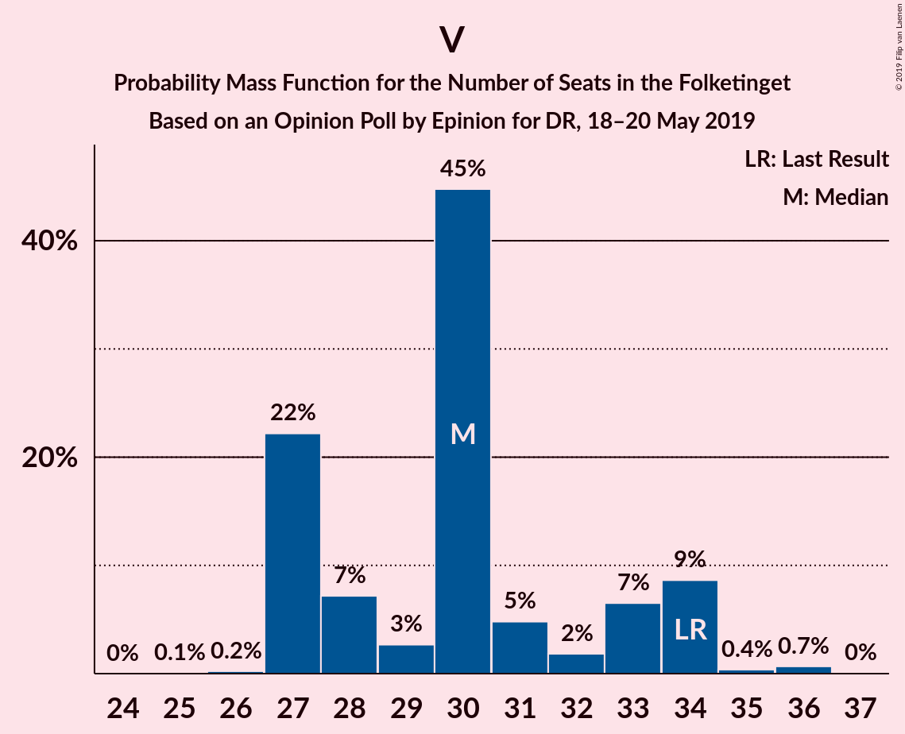

# Opinion Poll by Epinion for DR, 18–20 May 2019

<a href="#voting-intentions">Voting Intentions</a> | <a href="#seats">Seats</a> | <a href="#coalitions">Coalitions</a> | <a href="#technical-information">Technical Information</a>

## Voting Intentions

### Confidence Intervals

| Party | Last Result | Poll Result | 80% Confidence Interval | 90% Confidence Interval | 95% Confidence Interval | 99% Confidence Interval |
|:-----:|:-----------:|:-----------:|:-----------------------:|:-----------------------:|:-----------------------:|:-----------------------:|
| Socialdemokraterne | 26.3% | 29.8% | 28.3–31.3% |27.9–31.7% |27.6–32.1% |26.9–32.8% |
| Venstre | 19.5% | 17.1% | 15.9–18.3% |15.6–18.7% |15.3–19.0% |14.8–19.6% |
| Dansk Folkeparti | 21.1% | 10.6% | 9.7–11.7% |9.4–12.0% |9.2–12.2% |8.8–12.7% |
| Enhedslisten–De Rød-Grønne | 7.8% | 8.9% | 8.0–9.9% |7.8–10.2% |7.6–10.4% |7.2–10.9% |
| Radikale Venstre | 4.6% | 7.7% | 6.9–8.6% |6.7–8.9% |6.5–9.1% |6.1–9.5% |
| Socialistisk Folkeparti | 4.2% | 6.8% | 6.1–7.7% |5.9–7.9% |5.7–8.2% |5.3–8.6% |
| Det Konservative Folkeparti | 3.4% | 4.7% | 4.1–5.5% |3.9–5.7% |3.8–5.9% |3.5–6.2% |
| Liberal Alliance | 7.5% | 4.6% | 4.0–5.3% |3.8–5.6% |3.7–5.7% |3.4–6.1% |
| Alternativet | 4.8% | 3.3% | 2.8–4.0% |2.7–4.1% |2.5–4.3% |2.3–4.6% |
| Stram Kurs | 0.0% | 2.6% | 2.1–3.2% |2.0–3.3% |1.9–3.5% |1.7–3.8% |
| Nye Borgerlige | 0.0% | 2.3% | 1.9–2.8% |1.7–3.0% |1.6–3.1% |1.5–3.4% |
| Kristendemokraterne | 0.8% | 1.2% | 0.9–1.7% |0.9–1.8% |0.8–1.9% |0.7–2.1% |
| Klaus Riskær Pedersen | 0.0% | 0.4% | 0.3–0.7% |0.2–0.8% |0.2–0.9% |0.2–1.1% |

*Note:* The poll result column reflects the actual value used in the calculations. Published results may vary slightly, and in addition be rounded to fewer digits.

## Seats

### Confidence Intervals

| Party | Last Result | Median | 80% Confidence Interval | 90% Confidence Interval | 95% Confidence Interval | 99% Confidence Interval |
|:-----:|:-----------:|:------:|:-----------------------:|:-----------------------:|:-----------------------:|:-----------------------:|
| <a href="#socialdemokraterne">Socialdemokraterne</a> | 47 | 52 | 48–55 |48–55 |48–55 |48–57 |
| <a href="#venstre">Venstre</a> | 34 | 30 | 27–33 |27–34 |27–34 |27–36 |
| <a href="#dansk-folkeparti">Dansk Folkeparti</a> | 37 | 19 | 17–22 |17–23 |17–23 |15–24 |
| <a href="#enhedslisten–de-rød-grønne">Enhedslisten–De Rød-Grønne</a> | 14 | 16 | 14–16 |14–19 |14–20 |12–21 |
| <a href="#radikale-venstre">Radikale Venstre</a> | 8 | 15 | 13–15 |12–15 |12–15 |11–17 |
| <a href="#socialistisk-folkeparti">Socialistisk Folkeparti</a> | 7 | 12 | 11–15 |10–15 |10–15 |10–17 |
| <a href="#det-konservative-folkeparti">Det Konservative Folkeparti</a> | 6 | 8 | 7–11 |7–11 |7–11 |7–12 |
| <a href="#liberal-alliance">Liberal Alliance</a> | 13 | 8 | 7–11 |6–11 |6–11 |6–11 |
| <a href="#alternativet">Alternativet</a> | 9 | 6 | 5–7 |5–7 |5–8 |4–8 |
| <a href="#stram-kurs">Stram Kurs</a> | 0 | 4 | 4–5 |0–6 |0–6 |0–6 |
| <a href="#nye-borgerlige">Nye Borgerlige</a> | 0 | 4 | 0–5 |0–5 |0–5 |0–6 |
| <a href="#kristendemokraterne">Kristendemokraterne</a> | 0 | 0 | 0 |0 |0–4 |0–4 |
| <a href="#klaus-riskær-pedersen">Klaus Riskær Pedersen</a> | 0 | 0 | 0 |0 |0 |0 |

### Socialdemokraterne

*For a full overview of the results for this party, see the [Socialdemokraterne](party-socialdemokraterne.html) page.*

| Number of Seats | Probability | Accumulated | Special Marks |
|:---------------:|:-----------:|:-----------:|:-------------:|
| 47 | 0.1% | 100% | Last Result |
| 48 | 31% | 99.9% |  |
| 49 | 0.9% | 69% |  |
| 50 | 6% | 68% |  |
| 51 | 3% | 62% |  |
| 52 | 13% | 60% | Median |
| 53 | 11% | 47% |  |
| 54 | 12% | 36% |  |
| 55 | 22% | 24% |  |
| 56 | 0.9% | 2% |  |
| 57 | 1.0% | 1.4% |  |
| 58 | 0.3% | 0.4% |  |
| 59 | 0% | 0.1% |  |
| 60 | 0.1% | 0.1% |  |
| 61 | 0% | 0% |  |

### Venstre

*For a full overview of the results for this party, see the [Venstre](party-venstre.html) page.*

| Number of Seats | Probability | Accumulated | Special Marks |
|:---------------:|:-----------:|:-----------:|:-------------:|
| 25 | 0.1% | 100% |  |
| 26 | 0.2% | 99.9% |  |
| 27 | 22% | 99.7% |  |
| 28 | 7% | 78% |  |
| 29 | 3% | 70% |  |
| 30 | 45% | 68% | Median |
| 31 | 5% | 23% |  |
| 32 | 2% | 18% |  |
| 33 | 7% | 16% |  |
| 34 | 9% | 10% | Last Result |
| 35 | 0.4% | 1.1% |  |
| 36 | 0.7% | 0.7% |  |
| 37 | 0% | 0% |  |

### Dansk Folkeparti

*For a full overview of the results for this party, see the [Dansk Folkeparti](party-danskfolkeparti.html) page.*

| Number of Seats | Probability | Accumulated | Special Marks |
|:---------------:|:-----------:|:-----------:|:-------------:|
| 15 | 0.8% | 100% |  |
| 16 | 2% | 99.2% |  |
| 17 | 23% | 98% |  |
| 18 | 14% | 74% |  |
| 19 | 39% | 61% | Median |
| 20 | 3% | 22% |  |
| 21 | 5% | 19% |  |
| 22 | 7% | 14% |  |
| 23 | 4% | 6% |  |
| 24 | 2% | 2% |  |
| 25 | 0% | 0% |  |
| 26 | 0% | 0% |  |
| 27 | 0% | 0% |  |
| 28 | 0% | 0% |  |
| 29 | 0% | 0% |  |
| 30 | 0% | 0% |  |
| 31 | 0% | 0% |  |
| 32 | 0% | 0% |  |
| 33 | 0% | 0% |  |
| 34 | 0% | 0% |  |
| 35 | 0% | 0% |  |
| 36 | 0% | 0% |  |
| 37 | 0% | 0% | Last Result |

### Enhedslisten–De Rød-Grønne

*For a full overview of the results for this party, see the [Enhedslisten–De Rød-Grønne](party-enhedslisten–derød-grønne.html) page.*

| Number of Seats | Probability | Accumulated | Special Marks |
|:---------------:|:-----------:|:-----------:|:-------------:|
| 12 | 2% | 100% |  |
| 13 | 0.1% | 98% |  |
| 14 | 16% | 98% | Last Result |
| 15 | 13% | 82% |  |
| 16 | 60% | 69% | Median |
| 17 | 3% | 9% |  |
| 18 | 1.5% | 6% |  |
| 19 | 1.2% | 5% |  |
| 20 | 2% | 4% |  |
| 21 | 2% | 2% |  |
| 22 | 0% | 0% |  |

### Radikale Venstre

*For a full overview of the results for this party, see the [Radikale Venstre](party-radikalevenstre.html) page.*

| Number of Seats | Probability | Accumulated | Special Marks |
|:---------------:|:-----------:|:-----------:|:-------------:|
| 8 | 0% | 100% | Last Result |
| 9 | 0% | 100% |  |
| 10 | 0.1% | 100% |  |
| 11 | 2% | 99.9% |  |
| 12 | 5% | 98% |  |
| 13 | 16% | 93% |  |
| 14 | 12% | 77% |  |
| 15 | 63% | 65% | Median |
| 16 | 0.5% | 1.5% |  |
| 17 | 0.6% | 1.0% |  |
| 18 | 0.4% | 0.4% |  |
| 19 | 0% | 0% |  |

### Socialistisk Folkeparti

*For a full overview of the results for this party, see the [Socialistisk Folkeparti](party-socialistiskfolkeparti.html) page.*

| Number of Seats | Probability | Accumulated | Special Marks |
|:---------------:|:-----------:|:-----------:|:-------------:|
| 7 | 0% | 100% | Last Result |
| 8 | 0% | 100% |  |
| 9 | 0% | 100% |  |
| 10 | 8% | 100% |  |
| 11 | 3% | 92% |  |
| 12 | 50% | 89% | Median |
| 13 | 11% | 39% |  |
| 14 | 5% | 28% |  |
| 15 | 22% | 23% |  |
| 16 | 0% | 0.7% |  |
| 17 | 0.7% | 0.7% |  |
| 18 | 0% | 0% |  |

### Det Konservative Folkeparti

*For a full overview of the results for this party, see the [Det Konservative Folkeparti](party-detkonservativefolkeparti.html) page.*

| Number of Seats | Probability | Accumulated | Special Marks |
|:---------------:|:-----------:|:-----------:|:-------------:|
| 6 | 0.1% | 100% | Last Result |
| 7 | 11% | 99.9% |  |
| 8 | 41% | 89% | Median |
| 9 | 9% | 48% |  |
| 10 | 7% | 39% |  |
| 11 | 31% | 32% |  |
| 12 | 1.2% | 1.2% |  |
| 13 | 0% | 0% |  |

### Liberal Alliance

*For a full overview of the results for this party, see the [Liberal Alliance](party-liberalalliance.html) page.*

| Number of Seats | Probability | Accumulated | Special Marks |
|:---------------:|:-----------:|:-----------:|:-------------:|
| 6 | 6% | 100% |  |
| 7 | 8% | 94% |  |
| 8 | 61% | 86% | Median |
| 9 | 10% | 25% |  |
| 10 | 3% | 15% |  |
| 11 | 12% | 12% |  |
| 12 | 0.4% | 0.4% |  |
| 13 | 0% | 0% | Last Result |

### Alternativet

*For a full overview of the results for this party, see the [Alternativet](party-alternativet.html) page.*

| Number of Seats | Probability | Accumulated | Special Marks |
|:---------------:|:-----------:|:-----------:|:-------------:|
| 4 | 0.9% | 100% |  |
| 5 | 35% | 99.1% |  |
| 6 | 17% | 64% | Median |
| 7 | 44% | 47% |  |
| 8 | 3% | 3% |  |
| 9 | 0.1% | 0.1% | Last Result |
| 10 | 0% | 0% |  |

### Stram Kurs

*For a full overview of the results for this party, see the [Stram Kurs](party-stramkurs.html) page.*

| Number of Seats | Probability | Accumulated | Special Marks |
|:---------------:|:-----------:|:-----------:|:-------------:|
| 0 | 8% | 100% | Last Result |
| 1 | 0% | 92% |  |
| 2 | 0% | 92% |  |
| 3 | 0% | 92% |  |
| 4 | 50% | 92% | Median |
| 5 | 36% | 43% |  |
| 6 | 6% | 7% |  |
| 7 | 0.2% | 0.2% |  |
| 8 | 0% | 0% |  |

### Nye Borgerlige

*For a full overview of the results for this party, see the [Nye Borgerlige](party-nyeborgerlige.html) page.*

| Number of Seats | Probability | Accumulated | Special Marks |
|:---------------:|:-----------:|:-----------:|:-------------:|
| 0 | 14% | 100% | Last Result |
| 1 | 0% | 86% |  |
| 2 | 0% | 86% |  |
| 3 | 0% | 86% |  |
| 4 | 50% | 86% | Median |
| 5 | 35% | 37% |  |
| 6 | 2% | 2% |  |
| 7 | 0% | 0% |  |

### Kristendemokraterne

*For a full overview of the results for this party, see the [Kristendemokraterne](party-kristendemokraterne.html) page.*

| Number of Seats | Probability | Accumulated | Special Marks |
|:---------------:|:-----------:|:-----------:|:-------------:|
| 0 | 96% | 100% | Last Result, Median |
| 1 | 0% | 4% |  |
| 2 | 0% | 4% |  |
| 3 | 0% | 4% |  |
| 4 | 4% | 4% |  |
| 5 | 0% | 0% |  |

### Klaus Riskær Pedersen

*For a full overview of the results for this party, see the [Klaus Riskær Pedersen](party-klausriskærpedersen.html) page.*

| Number of Seats | Probability | Accumulated | Special Marks |
|:---------------:|:-----------:|:-----------:|:-------------:|
| 0 | 100% | 100% | Last Result, Median |

## Coalitions

### Confidence Intervals

| Coalition | Last Result | Median | Majority? | 80% Confidence Interval | 90% Confidence Interval | 95% Confidence Interval | 99% Confidence Interval |
|:---------:|:-----------:|:------:|:---------:|:-----------------------:|:-----------------------:|:-----------------------:|:-----------------------:|
| Socialdemokraterne – Enhedslisten–De Rød-Grønne – Radikale Venstre – Socialistisk Folkeparti – Alternativet | 85 | 100 | 100% | 97–106 | 97–106 | 95–106 | 95–108 |
| Socialdemokraterne – Enhedslisten–De Rød-Grønne – Radikale Venstre – Socialistisk Folkeparti | 76 | 94 | 96% | 91–101 | 91–101 | 88–101 | 88–102 |
| Socialdemokraterne – Enhedslisten–De Rød-Grønne – Socialistisk Folkeparti – Alternativet | 77 | 86 | 26% | 83–91 | 83–91 | 82–91 | 82–93 |
| Socialdemokraterne – Enhedslisten–De Rød-Grønne – Socialistisk Folkeparti | 68 | 80 | 0% | 76–86 | 76–86 | 75–86 | 75–87 |
| Socialdemokraterne – Radikale Venstre – Socialistisk Folkeparti | 62 | 78 | 0% | 75–85 | 75–85 | 73–85 | 73–85 |
| Venstre – Dansk Folkeparti – Det Konservative Folkeparti – Liberal Alliance – Stram Kurs – Nye Borgerlige – Kristendemokraterne – Klaus Riskær Pedersen | 90 | 75 | 0% | 69–78 | 69–78 | 69–80 | 67–80 |
| Venstre – Dansk Folkeparti – Det Konservative Folkeparti – Liberal Alliance – Nye Borgerlige – Kristendemokraterne – Klaus Riskær Pedersen | 90 | 71 | 0% | 64–74 | 64–75 | 64–75 | 64–75 |
| Venstre – Dansk Folkeparti – Det Konservative Folkeparti – Liberal Alliance – Nye Borgerlige – Klaus Riskær Pedersen | 90 | 71 | 0% | 64–74 | 64–74 | 64–75 | 64–75 |
| Venstre – Dansk Folkeparti – Det Konservative Folkeparti – Liberal Alliance – Nye Borgerlige – Kristendemokraterne | 90 | 71 | 0% | 64–74 | 64–75 | 64–75 | 64–75 |
| Venstre – Dansk Folkeparti – Det Konservative Folkeparti – Liberal Alliance – Nye Borgerlige | 90 | 71 | 0% | 64–74 | 64–74 | 64–75 | 64–75 |
| Venstre – Dansk Folkeparti – Det Konservative Folkeparti – Liberal Alliance – Kristendemokraterne | 90 | 68 | 0% | 60–71 | 60–71 | 60–71 | 60–74 |
| Venstre – Dansk Folkeparti – Det Konservative Folkeparti – Liberal Alliance | 90 | 68 | 0% | 60–70 | 60–71 | 60–71 | 60–74 |
| Socialdemokraterne – Radikale Venstre | 55 | 66 | 0% | 63–70 | 63–70 | 63–70 | 62–72 |
| Venstre – Det Konservative Folkeparti – Liberal Alliance | 53 | 49 | 0% | 43–51 | 42–52 | 42–52 | 42–55 |
| Venstre – Det Konservative Folkeparti | 40 | 39 | 0% | 35–41 | 35–43 | 35–43 | 35–45 |
| Venstre | 34 | 30 | 0% | 27–33 | 27–34 | 27–34 | 27–36 |

### Socialdemokraterne – Enhedslisten–De Rød-Grønne – Radikale Venstre – Socialistisk Folkeparti – Alternativet

| Number of Seats | Probability | Accumulated | Special Marks |
|:---------------:|:-----------:|:-----------:|:-------------:|
| 85 | 0% | 100% | Last Result |
| 86 | 0% | 100% |  |
| 87 | 0% | 100% |  |
| 88 | 0% | 100% |  |
| 89 | 0% | 100% |  |
| 90 | 0% | 100% | Majority |
| 91 | 0.1% | 100% |  |
| 92 | 0% | 99.9% |  |
| 93 | 0.1% | 99.9% |  |
| 94 | 0.1% | 99.8% |  |
| 95 | 4% | 99.8% |  |
| 96 | 0.7% | 96% |  |
| 97 | 9% | 96% |  |
| 98 | 31% | 87% |  |
| 99 | 3% | 55% |  |
| 100 | 7% | 52% |  |
| 101 | 13% | 45% | Median |
| 102 | 5% | 32% |  |
| 103 | 0.2% | 27% |  |
| 104 | 4% | 26% |  |
| 105 | 0.6% | 22% |  |
| 106 | 20% | 22% |  |
| 107 | 0.1% | 1.3% |  |
| 108 | 1.1% | 1.2% |  |
| 109 | 0% | 0.1% |  |
| 110 | 0% | 0% |  |

### Socialdemokraterne – Enhedslisten–De Rød-Grønne – Radikale Venstre – Socialistisk Folkeparti

| Number of Seats | Probability | Accumulated | Special Marks |
|:---------------:|:-----------:|:-----------:|:-------------:|
| 76 | 0% | 100% | Last Result |
| 77 | 0% | 100% |  |
| 78 | 0% | 100% |  |
| 79 | 0% | 100% |  |
| 80 | 0% | 100% |  |
| 81 | 0% | 100% |  |
| 82 | 0% | 100% |  |
| 83 | 0% | 100% |  |
| 84 | 0% | 100% |  |
| 85 | 0% | 100% |  |
| 86 | 0.1% | 100% |  |
| 87 | 0.1% | 99.9% |  |
| 88 | 4% | 99.8% |  |
| 89 | 0% | 96% |  |
| 90 | 0.8% | 96% | Majority |
| 91 | 31% | 95% |  |
| 92 | 9% | 64% |  |
| 93 | 1.1% | 55% |  |
| 94 | 15% | 54% |  |
| 95 | 9% | 39% | Median |
| 96 | 2% | 30% |  |
| 97 | 4% | 28% |  |
| 98 | 2% | 24% |  |
| 99 | 0.5% | 22% |  |
| 100 | 0.2% | 22% |  |
| 101 | 20% | 21% |  |
| 102 | 1.0% | 1.2% |  |
| 103 | 0.1% | 0.1% |  |
| 104 | 0% | 0% |  |

### Socialdemokraterne – Enhedslisten–De Rød-Grønne – Socialistisk Folkeparti – Alternativet

| Number of Seats | Probability | Accumulated | Special Marks |
|:---------------:|:-----------:|:-----------:|:-------------:|
| 77 | 0% | 100% | Last Result |
| 78 | 0% | 100% |  |
| 79 | 0.1% | 100% |  |
| 80 | 0.1% | 99.9% |  |
| 81 | 0.1% | 99.9% |  |
| 82 | 5% | 99.7% |  |
| 83 | 31% | 95% |  |
| 84 | 10% | 64% |  |
| 85 | 0.6% | 54% |  |
| 86 | 10% | 53% | Median |
| 87 | 9% | 43% |  |
| 88 | 2% | 33% |  |
| 89 | 6% | 32% |  |
| 90 | 3% | 26% | Majority |
| 91 | 22% | 24% |  |
| 92 | 0.1% | 1.4% |  |
| 93 | 1.1% | 1.3% |  |
| 94 | 0.1% | 0.2% |  |
| 95 | 0.1% | 0.1% |  |
| 96 | 0% | 0% |  |

### Socialdemokraterne – Enhedslisten–De Rød-Grønne – Socialistisk Folkeparti

| Number of Seats | Probability | Accumulated | Special Marks |
|:---------------:|:-----------:|:-----------:|:-------------:|
| 68 | 0% | 100% | Last Result |
| 69 | 0% | 100% |  |
| 70 | 0% | 100% |  |
| 71 | 0% | 100% |  |
| 72 | 0% | 100% |  |
| 73 | 0% | 100% |  |
| 74 | 0% | 100% |  |
| 75 | 4% | 100% |  |
| 76 | 31% | 96% |  |
| 77 | 0.9% | 65% |  |
| 78 | 0.4% | 64% |  |
| 79 | 11% | 63% |  |
| 80 | 16% | 52% | Median |
| 81 | 4% | 36% |  |
| 82 | 2% | 32% |  |
| 83 | 4% | 30% |  |
| 84 | 3% | 26% |  |
| 85 | 0.6% | 23% |  |
| 86 | 21% | 22% |  |
| 87 | 1.1% | 1.3% |  |
| 88 | 0.1% | 0.1% |  |
| 89 | 0.1% | 0.1% |  |
| 90 | 0% | 0% | Majority |

### Socialdemokraterne – Radikale Venstre – Socialistisk Folkeparti

| Number of Seats | Probability | Accumulated | Special Marks |
|:---------------:|:-----------:|:-----------:|:-------------:|
| 62 | 0% | 100% | Last Result |
| 63 | 0% | 100% |  |
| 64 | 0% | 100% |  |
| 65 | 0% | 100% |  |
| 66 | 0% | 100% |  |
| 67 | 0% | 100% |  |
| 68 | 0% | 100% |  |
| 69 | 0% | 100% |  |
| 70 | 0% | 100% |  |
| 71 | 0% | 100% |  |
| 72 | 0.1% | 100% |  |
| 73 | 4% | 99.9% |  |
| 74 | 0.1% | 96% |  |
| 75 | 34% | 96% |  |
| 76 | 3% | 63% |  |
| 77 | 2% | 60% |  |
| 78 | 13% | 57% |  |
| 79 | 0.7% | 44% | Median |
| 80 | 14% | 43% |  |
| 81 | 3% | 29% |  |
| 82 | 4% | 26% |  |
| 83 | 1.1% | 22% |  |
| 84 | 0.3% | 21% |  |
| 85 | 20% | 21% |  |
| 86 | 0% | 0.1% |  |
| 87 | 0.1% | 0.1% |  |
| 88 | 0% | 0% |  |

### Venstre – Dansk Folkeparti – Det Konservative Folkeparti – Liberal Alliance – Stram Kurs – Nye Borgerlige – Kristendemokraterne – Klaus Riskær Pedersen

| Number of Seats | Probability | Accumulated | Special Marks |
|:---------------:|:-----------:|:-----------:|:-------------:|
| 66 | 0% | 100% |  |
| 67 | 1.1% | 99.9% |  |
| 68 | 0.1% | 98.8% |  |
| 69 | 20% | 98.7% |  |
| 70 | 0.6% | 78% |  |
| 71 | 4% | 78% |  |
| 72 | 0.2% | 74% |  |
| 73 | 5% | 73% | Median |
| 74 | 13% | 68% |  |
| 75 | 7% | 55% |  |
| 76 | 3% | 48% |  |
| 77 | 31% | 45% |  |
| 78 | 9% | 13% |  |
| 79 | 0.7% | 4% |  |
| 80 | 4% | 4% |  |
| 81 | 0.1% | 0.2% |  |
| 82 | 0.1% | 0.2% |  |
| 83 | 0% | 0.1% |  |
| 84 | 0.1% | 0.1% |  |
| 85 | 0% | 0% |  |
| 86 | 0% | 0% |  |
| 87 | 0% | 0% |  |
| 88 | 0% | 0% |  |
| 89 | 0% | 0% |  |
| 90 | 0% | 0% | Last Result, Majority |

### Venstre – Dansk Folkeparti – Det Konservative Folkeparti – Liberal Alliance – Nye Borgerlige – Kristendemokraterne – Klaus Riskær Pedersen

| Number of Seats | Probability | Accumulated | Special Marks |
|:---------------:|:-----------:|:-----------:|:-------------:|
| 62 | 0.1% | 100% |  |
| 63 | 0.1% | 99.8% |  |
| 64 | 20% | 99.8% |  |
| 65 | 0.7% | 80% |  |
| 66 | 0.4% | 79% |  |
| 67 | 2% | 78% |  |
| 68 | 9% | 76% |  |
| 69 | 2% | 67% | Median |
| 70 | 9% | 65% |  |
| 71 | 7% | 56% |  |
| 72 | 1.0% | 49% |  |
| 73 | 31% | 48% |  |
| 74 | 8% | 16% |  |
| 75 | 7% | 8% |  |
| 76 | 0.1% | 0.3% |  |
| 77 | 0.1% | 0.2% |  |
| 78 | 0% | 0.1% |  |
| 79 | 0.1% | 0.1% |  |
| 80 | 0% | 0% |  |
| 81 | 0% | 0% |  |
| 82 | 0% | 0% |  |
| 83 | 0% | 0% |  |
| 84 | 0% | 0% |  |
| 85 | 0% | 0% |  |
| 86 | 0% | 0% |  |
| 87 | 0% | 0% |  |
| 88 | 0% | 0% |  |
| 89 | 0% | 0% |  |
| 90 | 0% | 0% | Last Result, Majority |

### Venstre – Dansk Folkeparti – Det Konservative Folkeparti – Liberal Alliance – Nye Borgerlige – Klaus Riskær Pedersen

| Number of Seats | Probability | Accumulated | Special Marks |
|:---------------:|:-----------:|:-----------:|:-------------:|
| 62 | 0.1% | 100% |  |
| 63 | 0.1% | 99.8% |  |
| 64 | 20% | 99.8% |  |
| 65 | 0.7% | 80% |  |
| 66 | 0.4% | 79% |  |
| 67 | 2% | 78% |  |
| 68 | 9% | 76% |  |
| 69 | 2% | 67% | Median |
| 70 | 9% | 65% |  |
| 71 | 11% | 56% |  |
| 72 | 1.0% | 45% |  |
| 73 | 32% | 44% |  |
| 74 | 8% | 12% |  |
| 75 | 4% | 4% |  |
| 76 | 0.1% | 0.3% |  |
| 77 | 0.1% | 0.2% |  |
| 78 | 0% | 0.1% |  |
| 79 | 0.1% | 0.1% |  |
| 80 | 0% | 0% |  |
| 81 | 0% | 0% |  |
| 82 | 0% | 0% |  |
| 83 | 0% | 0% |  |
| 84 | 0% | 0% |  |
| 85 | 0% | 0% |  |
| 86 | 0% | 0% |  |
| 87 | 0% | 0% |  |
| 88 | 0% | 0% |  |
| 89 | 0% | 0% |  |
| 90 | 0% | 0% | Last Result, Majority |

### Venstre – Dansk Folkeparti – Det Konservative Folkeparti – Liberal Alliance – Nye Borgerlige – Kristendemokraterne

| Number of Seats | Probability | Accumulated | Special Marks |
|:---------------:|:-----------:|:-----------:|:-------------:|
| 62 | 0.1% | 100% |  |
| 63 | 0.1% | 99.8% |  |
| 64 | 20% | 99.8% |  |
| 65 | 0.7% | 80% |  |
| 66 | 0.4% | 79% |  |
| 67 | 2% | 78% |  |
| 68 | 9% | 76% |  |
| 69 | 2% | 67% | Median |
| 70 | 9% | 65% |  |
| 71 | 7% | 56% |  |
| 72 | 1.0% | 49% |  |
| 73 | 31% | 48% |  |
| 74 | 8% | 16% |  |
| 75 | 7% | 8% |  |
| 76 | 0.1% | 0.3% |  |
| 77 | 0.1% | 0.2% |  |
| 78 | 0% | 0.1% |  |
| 79 | 0.1% | 0.1% |  |
| 80 | 0% | 0% |  |
| 81 | 0% | 0% |  |
| 82 | 0% | 0% |  |
| 83 | 0% | 0% |  |
| 84 | 0% | 0% |  |
| 85 | 0% | 0% |  |
| 86 | 0% | 0% |  |
| 87 | 0% | 0% |  |
| 88 | 0% | 0% |  |
| 89 | 0% | 0% |  |
| 90 | 0% | 0% | Last Result, Majority |

### Venstre – Dansk Folkeparti – Det Konservative Folkeparti – Liberal Alliance – Nye Borgerlige

| Number of Seats | Probability | Accumulated | Special Marks |
|:---------------:|:-----------:|:-----------:|:-------------:|
| 62 | 0.1% | 100% |  |
| 63 | 0.1% | 99.8% |  |
| 64 | 20% | 99.8% |  |
| 65 | 0.7% | 80% |  |
| 66 | 0.4% | 79% |  |
| 67 | 2% | 78% |  |
| 68 | 9% | 76% |  |
| 69 | 2% | 67% | Median |
| 70 | 9% | 65% |  |
| 71 | 11% | 56% |  |
| 72 | 1.0% | 45% |  |
| 73 | 32% | 44% |  |
| 74 | 8% | 12% |  |
| 75 | 4% | 4% |  |
| 76 | 0.1% | 0.3% |  |
| 77 | 0.1% | 0.2% |  |
| 78 | 0% | 0.1% |  |
| 79 | 0.1% | 0.1% |  |
| 80 | 0% | 0% |  |
| 81 | 0% | 0% |  |
| 82 | 0% | 0% |  |
| 83 | 0% | 0% |  |
| 84 | 0% | 0% |  |
| 85 | 0% | 0% |  |
| 86 | 0% | 0% |  |
| 87 | 0% | 0% |  |
| 88 | 0% | 0% |  |
| 89 | 0% | 0% |  |
| 90 | 0% | 0% | Last Result, Majority |

### Venstre – Dansk Folkeparti – Det Konservative Folkeparti – Liberal Alliance – Kristendemokraterne

| Number of Seats | Probability | Accumulated | Special Marks |
|:---------------:|:-----------:|:-----------:|:-------------:|
| 58 | 0% | 100% |  |
| 59 | 0.1% | 99.9% |  |
| 60 | 20% | 99.9% |  |
| 61 | 0.7% | 80% |  |
| 62 | 0.4% | 79% |  |
| 63 | 0.5% | 79% |  |
| 64 | 11% | 78% |  |
| 65 | 2% | 67% | Median |
| 66 | 4% | 66% |  |
| 67 | 6% | 62% |  |
| 68 | 31% | 56% |  |
| 69 | 0.3% | 26% |  |
| 70 | 14% | 26% |  |
| 71 | 9% | 12% |  |
| 72 | 0% | 2% |  |
| 73 | 1.2% | 2% |  |
| 74 | 1.1% | 1.1% |  |
| 75 | 0% | 0% |  |
| 76 | 0% | 0% |  |
| 77 | 0% | 0% |  |
| 78 | 0% | 0% |  |
| 79 | 0% | 0% |  |
| 80 | 0% | 0% |  |
| 81 | 0% | 0% |  |
| 82 | 0% | 0% |  |
| 83 | 0% | 0% |  |
| 84 | 0% | 0% |  |
| 85 | 0% | 0% |  |
| 86 | 0% | 0% |  |
| 87 | 0% | 0% |  |
| 88 | 0% | 0% |  |
| 89 | 0% | 0% |  |
| 90 | 0% | 0% | Last Result, Majority |

### Venstre – Dansk Folkeparti – Det Konservative Folkeparti – Liberal Alliance

| Number of Seats | Probability | Accumulated | Special Marks |
|:---------------:|:-----------:|:-----------:|:-------------:|
| 58 | 0% | 100% |  |
| 59 | 0.1% | 99.9% |  |
| 60 | 20% | 99.9% |  |
| 61 | 0.7% | 80% |  |
| 62 | 0.4% | 79% |  |
| 63 | 0.5% | 78% |  |
| 64 | 11% | 78% |  |
| 65 | 2% | 67% | Median |
| 66 | 4% | 66% |  |
| 67 | 10% | 62% |  |
| 68 | 31% | 53% |  |
| 69 | 0.3% | 22% |  |
| 70 | 14% | 22% |  |
| 71 | 6% | 8% |  |
| 72 | 0% | 2% |  |
| 73 | 1.2% | 2% |  |
| 74 | 1.1% | 1.1% |  |
| 75 | 0% | 0% |  |
| 76 | 0% | 0% |  |
| 77 | 0% | 0% |  |
| 78 | 0% | 0% |  |
| 79 | 0% | 0% |  |
| 80 | 0% | 0% |  |
| 81 | 0% | 0% |  |
| 82 | 0% | 0% |  |
| 83 | 0% | 0% |  |
| 84 | 0% | 0% |  |
| 85 | 0% | 0% |  |
| 86 | 0% | 0% |  |
| 87 | 0% | 0% |  |
| 88 | 0% | 0% |  |
| 89 | 0% | 0% |  |
| 90 | 0% | 0% | Last Result, Majority |

### Socialdemokraterne – Radikale Venstre

| Number of Seats | Probability | Accumulated | Special Marks |
|:---------------:|:-----------:|:-----------:|:-------------:|
| 55 | 0% | 100% | Last Result |
| 56 | 0% | 100% |  |
| 57 | 0% | 100% |  |
| 58 | 0% | 100% |  |
| 59 | 0% | 100% |  |
| 60 | 0.1% | 100% |  |
| 61 | 0.1% | 99.9% |  |
| 62 | 0.5% | 99.8% |  |
| 63 | 37% | 99.3% |  |
| 64 | 2% | 62% |  |
| 65 | 4% | 61% |  |
| 66 | 13% | 56% |  |
| 67 | 8% | 43% | Median |
| 68 | 9% | 35% |  |
| 69 | 5% | 27% |  |
| 70 | 21% | 21% |  |
| 71 | 0.1% | 0.7% |  |
| 72 | 0.2% | 0.5% |  |
| 73 | 0.3% | 0.4% |  |
| 74 | 0.1% | 0.1% |  |
| 75 | 0% | 0% |  |

### Venstre – Det Konservative Folkeparti – Liberal Alliance

| Number of Seats | Probability | Accumulated | Special Marks |
|:---------------:|:-----------:|:-----------:|:-------------:|
| 40 | 0.2% | 100% |  |
| 41 | 0.1% | 99.8% |  |
| 42 | 5% | 99.7% |  |
| 43 | 21% | 94% |  |
| 44 | 0.2% | 73% |  |
| 45 | 7% | 73% |  |
| 46 | 4% | 66% | Median |
| 47 | 6% | 62% |  |
| 48 | 4% | 57% |  |
| 49 | 34% | 52% |  |
| 50 | 1.4% | 19% |  |
| 51 | 8% | 17% |  |
| 52 | 8% | 10% |  |
| 53 | 0.1% | 1.0% | Last Result |
| 54 | 0.3% | 1.0% |  |
| 55 | 0.6% | 0.6% |  |
| 56 | 0% | 0% |  |

### Venstre – Det Konservative Folkeparti

| Number of Seats | Probability | Accumulated | Special Marks |
|:---------------:|:-----------:|:-----------:|:-------------:|
| 33 | 0.1% | 100% |  |
| 34 | 0.3% | 99.9% |  |
| 35 | 20% | 99.6% |  |
| 36 | 8% | 79% |  |
| 37 | 3% | 71% |  |
| 38 | 10% | 67% | Median |
| 39 | 8% | 57% |  |
| 40 | 2% | 50% | Last Result |
| 41 | 37% | 47% |  |
| 42 | 1.2% | 10% |  |
| 43 | 7% | 9% |  |
| 44 | 1.1% | 2% |  |
| 45 | 0.6% | 1.0% |  |
| 46 | 0.4% | 0.4% |  |
| 47 | 0% | 0% |  |

### Venstre

| Number of Seats | Probability | Accumulated | Special Marks |
|:---------------:|:-----------:|:-----------:|:-------------:|
| 25 | 0.1% | 100% |  |
| 26 | 0.2% | 99.9% |  |
| 27 | 22% | 99.7% |  |
| 28 | 7% | 78% |  |
| 29 | 3% | 70% |  |
| 30 | 45% | 68% | Median |
| 31 | 5% | 23% |  |
| 32 | 2% | 18% |  |
| 33 | 7% | 16% |  |
| 34 | 9% | 10% | Last Result |
| 35 | 0.4% | 1.1% |  |
| 36 | 0.7% | 0.7% |  |
| 37 | 0% | 0% |  |

## Technical Information

### Opinion Poll

+ **Polling firm:** Epinion
+ **Commissioner(s):** DR
+ **Fieldwork period:** 18–20 May 2019

### Calculations

+ **Sample size:** 1629
+ **Simulations done:** 1,048,576
+ **Error estimate:** 2.91%

