# Opinion Poll by Voxmeter for Ritzau, 18–20 May 2019

<a href="#voting-intentions">Voting Intentions</a> | <a href="#seats">Seats</a> | <a href="#coalitions">Coalitions</a> | <a href="#technical-information">Technical Information</a>

## Voting Intentions

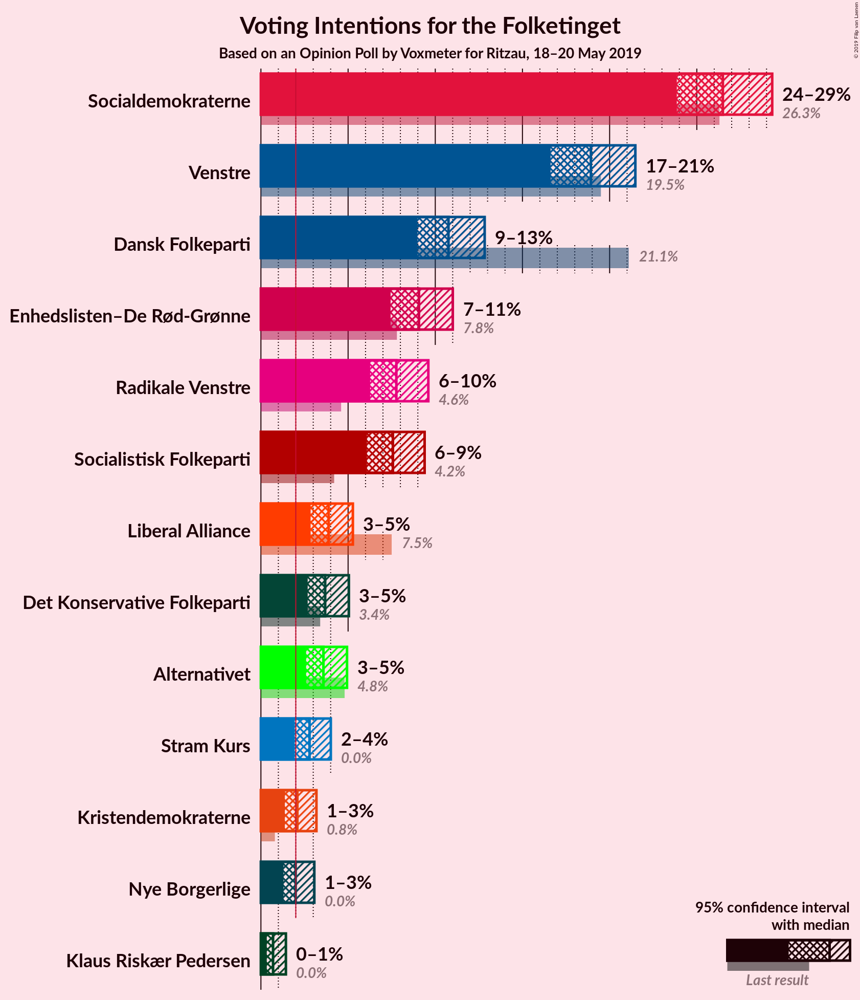

### Confidence Intervals

| Party | Last Result | Poll Result | 80% Confidence Interval | 90% Confidence Interval | 95% Confidence Interval | 99% Confidence Interval |
|:-----:|:-----------:|:-----------:|:-----------------------:|:-----------------------:|:-----------------------:|:-----------------------:|
| Socialdemokraterne | 26.3% | 26.5% | 24.8–28.3% |24.3–28.9% |23.9–29.3% |23.0–30.2% |
| Venstre | 19.5% | 18.9% | 17.4–20.6% |17.0–21.1% |16.6–21.5% |15.9–22.3% |
| Dansk Folkeparti | 21.1% | 10.8% | 9.6–12.1% |9.3–12.5% |9.0–12.8% |8.5–13.5% |
| Enhedslisten–De Rød-Grønne | 7.8% | 9.1% | 8.0–10.3% |7.7–10.7% |7.4–11.0% |7.0–11.6% |
| Radikale Venstre | 4.6% | 7.8% | 6.8–9.0% |6.5–9.3% |6.3–9.6% |5.8–10.2% |
| Socialistisk Folkeparti | 4.2% | 7.6% | 6.6–8.7% |6.3–9.1% |6.1–9.4% |5.7–10.0% |
| Liberal Alliance | 7.5% | 3.9% | 3.2–4.8% |3.0–5.0% |2.9–5.3% |2.6–5.7% |
| Det Konservative Folkeparti | 3.4% | 3.7% | 3.0–4.6% |2.8–4.8% |2.7–5.0% |2.4–5.5% |
| Alternativet | 4.8% | 3.6% | 2.9–4.5% |2.7–4.7% |2.6–4.9% |2.3–5.4% |
| Stram Kurs | 0.0% | 2.8% | 2.2–3.6% |2.1–3.8% |1.9–4.0% |1.7–4.4% |
| Kristendemokraterne | 0.8% | 2.1% | 1.6–2.8% |1.5–3.0% |1.4–3.2% |1.2–3.6% |
| Nye Borgerlige | 0.0% | 2.0% | 1.5–2.7% |1.4–2.9% |1.3–3.1% |1.1–3.4% |
| Klaus Riskær Pedersen | 0.0% | 0.7% | 0.5–1.2% |0.4–1.3% |0.3–1.4% |0.2–1.7% |

*Note:* The poll result column reflects the actual value used in the calculations. Published results may vary slightly, and in addition be rounded to fewer digits.

## Seats

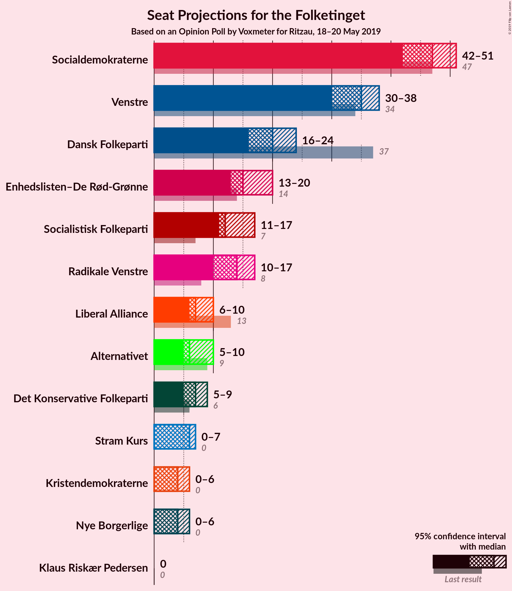

### Confidence Intervals

| Party | Last Result | Median | 80% Confidence Interval | 90% Confidence Interval | 95% Confidence Interval | 99% Confidence Interval |
|:-----:|:-----------:|:------:|:-----------------------:|:-----------------------:|:-----------------------:|:-----------------------:|
| <a href="#socialdemokraterne">Socialdemokraterne</a> | 47 | 47 | 45–49 |43–51 |42–51 |41–55 |
| <a href="#venstre">Venstre</a> | 34 | 35 | 31–37 |31–38 |30–38 |28–41 |
| <a href="#dansk-folkeparti">Dansk Folkeparti</a> | 37 | 20 | 17–22 |16–23 |16–24 |15–24 |
| <a href="#enhedslisten–de-rød-grønne">Enhedslisten–De Rød-Grønne</a> | 14 | 15 | 14–18 |14–19 |13–20 |12–22 |
| <a href="#radikale-venstre">Radikale Venstre</a> | 8 | 14 | 12–16 |11–16 |10–17 |10–18 |
| <a href="#socialistisk-folkeparti">Socialistisk Folkeparti</a> | 7 | 12 | 11–15 |11–16 |11–17 |10–17 |
| <a href="#liberal-alliance">Liberal Alliance</a> | 13 | 7 | 6–8 |6–9 |6–10 |5–11 |
| <a href="#det-konservative-folkeparti">Det Konservative Folkeparti</a> | 6 | 7 | 5–9 |5–9 |5–9 |4–10 |
| <a href="#alternativet">Alternativet</a> | 9 | 6 | 5–8 |5–10 |5–10 |4–10 |
| <a href="#stram-kurs">Stram Kurs</a> | 0 | 6 | 4–7 |4–7 |0–7 |0–7 |
| <a href="#kristendemokraterne">Kristendemokraterne</a> | 0 | 4 | 0–5 |0–6 |0–6 |0–6 |
| <a href="#nye-borgerlige">Nye Borgerlige</a> | 0 | 4 | 0–5 |0–5 |0–6 |0–6 |
| <a href="#klaus-riskær-pedersen">Klaus Riskær Pedersen</a> | 0 | 0 | 0 |0 |0 |0 |

### Socialdemokraterne

*For a full overview of the results for this party, see the [Socialdemokraterne](party-socialdemokraterne.html) page.*

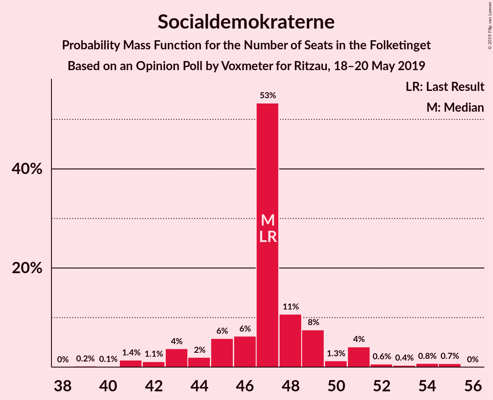

| Number of Seats | Probability | Accumulated | Special Marks |
|:---------------:|:-----------:|:-----------:|:-------------:|
| 39 | 0.2% | 100% |  |
| 40 | 0.1% | 99.7% |  |
| 41 | 1.4% | 99.6% |  |
| 42 | 1.1% | 98% |  |
| 43 | 4% | 97% |  |
| 44 | 2% | 93% |  |
| 45 | 6% | 91% |  |
| 46 | 6% | 86% |  |
| 47 | 53% | 79% | Last Result, Median |
| 48 | 11% | 26% |  |
| 49 | 8% | 15% |  |
| 50 | 1.3% | 8% |  |
| 51 | 4% | 7% |  |
| 52 | 0.6% | 2% |  |
| 53 | 0.4% | 2% |  |
| 54 | 0.8% | 2% |  |
| 55 | 0.7% | 0.7% |  |
| 56 | 0% | 0% |  |

### Venstre

*For a full overview of the results for this party, see the [Venstre](party-venstre.html) page.*

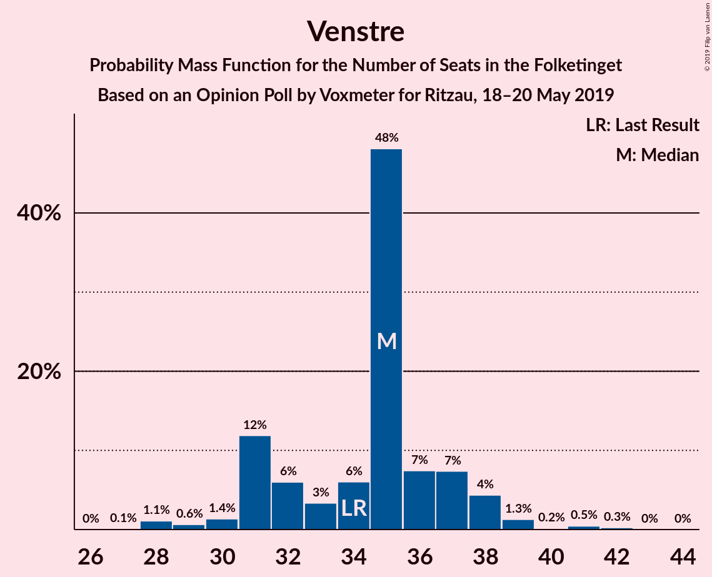

| Number of Seats | Probability | Accumulated | Special Marks |
|:---------------:|:-----------:|:-----------:|:-------------:|
| 27 | 0.1% | 100% |  |
| 28 | 1.1% | 99.9% |  |
| 29 | 0.6% | 98.8% |  |
| 30 | 1.4% | 98% |  |
| 31 | 12% | 97% |  |
| 32 | 6% | 85% |  |
| 33 | 3% | 79% |  |
| 34 | 6% | 76% | Last Result |
| 35 | 48% | 69% | Median |
| 36 | 7% | 21% |  |
| 37 | 7% | 14% |  |
| 38 | 4% | 7% |  |
| 39 | 1.3% | 2% |  |
| 40 | 0.2% | 0.9% |  |
| 41 | 0.5% | 0.7% |  |
| 42 | 0.3% | 0.3% |  |
| 43 | 0% | 0% |  |

### Dansk Folkeparti

*For a full overview of the results for this party, see the [Dansk Folkeparti](party-danskfolkeparti.html) page.*

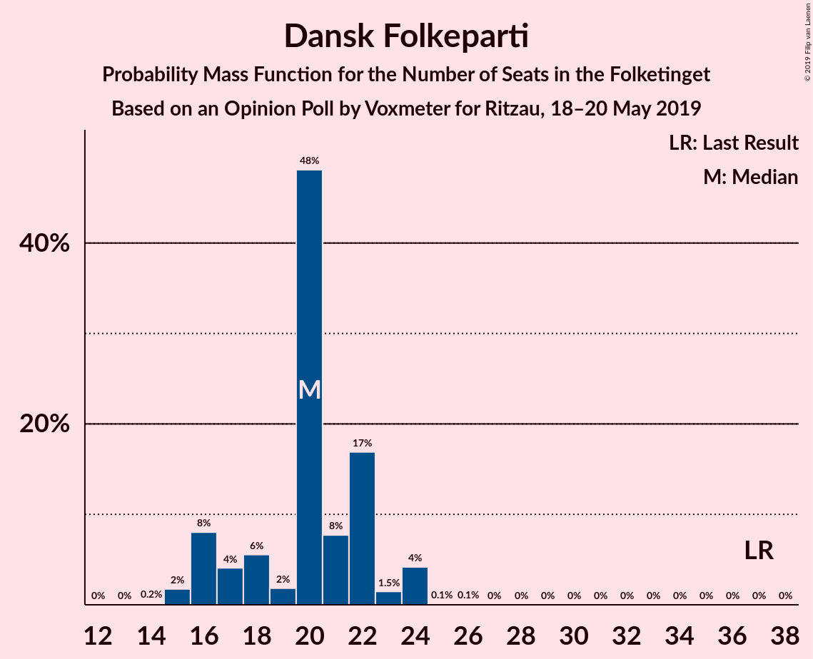

| Number of Seats | Probability | Accumulated | Special Marks |
|:---------------:|:-----------:|:-----------:|:-------------:|
| 14 | 0.2% | 100% |  |
| 15 | 2% | 99.8% |  |
| 16 | 8% | 98% |  |
| 17 | 4% | 90% |  |
| 18 | 6% | 86% |  |
| 19 | 2% | 80% |  |
| 20 | 48% | 79% | Median |
| 21 | 8% | 30% |  |
| 22 | 17% | 23% |  |
| 23 | 1.5% | 6% |  |
| 24 | 4% | 4% |  |
| 25 | 0.1% | 0.2% |  |
| 26 | 0.1% | 0.1% |  |
| 27 | 0% | 0% |  |
| 28 | 0% | 0% |  |
| 29 | 0% | 0% |  |
| 30 | 0% | 0% |  |
| 31 | 0% | 0% |  |
| 32 | 0% | 0% |  |
| 33 | 0% | 0% |  |
| 34 | 0% | 0% |  |
| 35 | 0% | 0% |  |
| 36 | 0% | 0% |  |
| 37 | 0% | 0% | Last Result |

### Enhedslisten–De Rød-Grønne

*For a full overview of the results for this party, see the [Enhedslisten–De Rød-Grønne](party-enhedslisten–derød-grønne.html) page.*

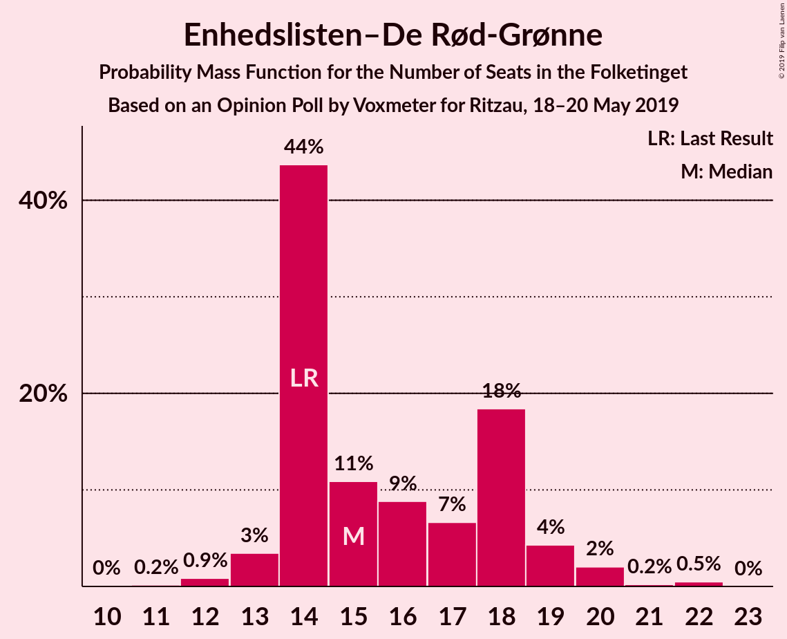

| Number of Seats | Probability | Accumulated | Special Marks |
|:---------------:|:-----------:|:-----------:|:-------------:|
| 11 | 0.2% | 100% |  |
| 12 | 0.9% | 99.8% |  |
| 13 | 3% | 99.0% |  |
| 14 | 44% | 96% | Last Result |
| 15 | 11% | 52% | Median |
| 16 | 9% | 41% |  |
| 17 | 7% | 32% |  |
| 18 | 18% | 25% |  |
| 19 | 4% | 7% |  |
| 20 | 2% | 3% |  |
| 21 | 0.2% | 0.7% |  |
| 22 | 0.5% | 0.5% |  |
| 23 | 0% | 0% |  |

### Radikale Venstre

*For a full overview of the results for this party, see the [Radikale Venstre](party-radikalevenstre.html) page.*

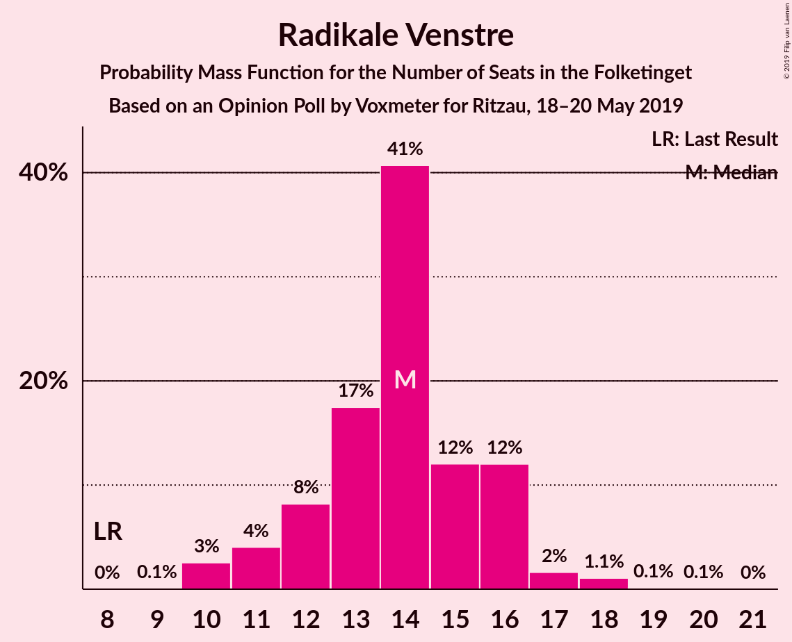

| Number of Seats | Probability | Accumulated | Special Marks |
|:---------------:|:-----------:|:-----------:|:-------------:|
| 8 | 0% | 100% | Last Result |
| 9 | 0.1% | 100% |  |
| 10 | 3% | 99.9% |  |
| 11 | 4% | 97% |  |
| 12 | 8% | 93% |  |
| 13 | 17% | 85% |  |
| 14 | 41% | 68% | Median |
| 15 | 12% | 27% |  |
| 16 | 12% | 15% |  |
| 17 | 2% | 3% |  |
| 18 | 1.1% | 1.3% |  |
| 19 | 0.1% | 0.2% |  |
| 20 | 0.1% | 0.1% |  |
| 21 | 0% | 0% |  |

### Socialistisk Folkeparti

*For a full overview of the results for this party, see the [Socialistisk Folkeparti](party-socialistiskfolkeparti.html) page.*

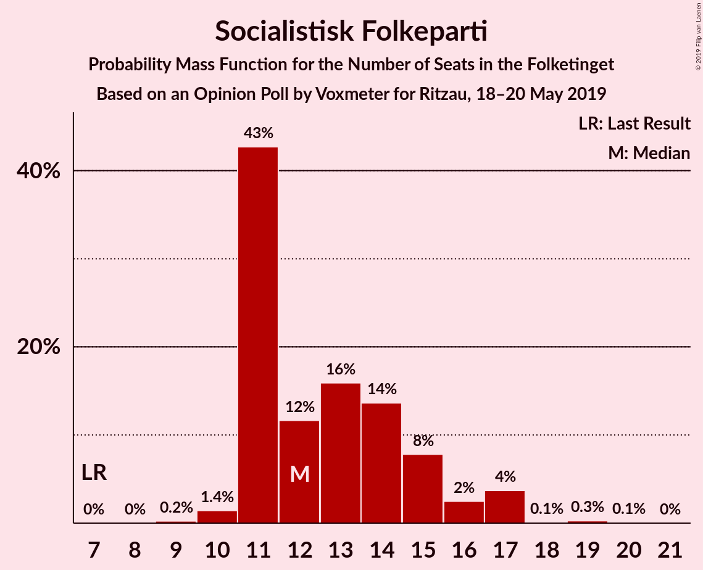

| Number of Seats | Probability | Accumulated | Special Marks |
|:---------------:|:-----------:|:-----------:|:-------------:|
| 7 | 0% | 100% | Last Result |
| 8 | 0% | 100% |  |
| 9 | 0.2% | 100% |  |
| 10 | 1.4% | 99.8% |  |
| 11 | 43% | 98% |  |
| 12 | 12% | 56% | Median |
| 13 | 16% | 44% |  |
| 14 | 14% | 28% |  |
| 15 | 8% | 14% |  |
| 16 | 2% | 7% |  |
| 17 | 4% | 4% |  |
| 18 | 0.1% | 0.4% |  |
| 19 | 0.3% | 0.3% |  |
| 20 | 0.1% | 0.1% |  |
| 21 | 0% | 0% |  |

### Liberal Alliance

*For a full overview of the results for this party, see the [Liberal Alliance](party-liberalalliance.html) page.*

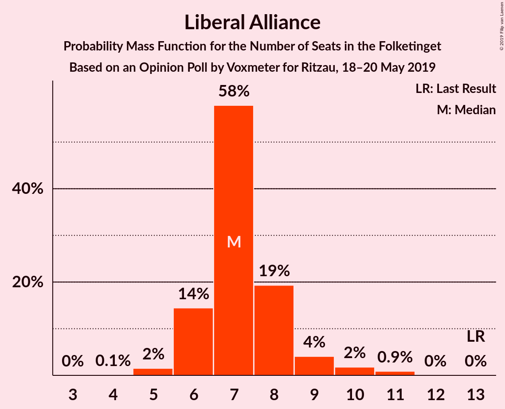

| Number of Seats | Probability | Accumulated | Special Marks |
|:---------------:|:-----------:|:-----------:|:-------------:|
| 4 | 0.1% | 100% |  |
| 5 | 2% | 99.9% |  |
| 6 | 14% | 98% |  |
| 7 | 58% | 84% | Median |
| 8 | 19% | 26% |  |
| 9 | 4% | 7% |  |
| 10 | 2% | 3% |  |
| 11 | 0.9% | 0.9% |  |
| 12 | 0% | 0% |  |
| 13 | 0% | 0% | Last Result |

### Det Konservative Folkeparti

*For a full overview of the results for this party, see the [Det Konservative Folkeparti](party-detkonservativefolkeparti.html) page.*

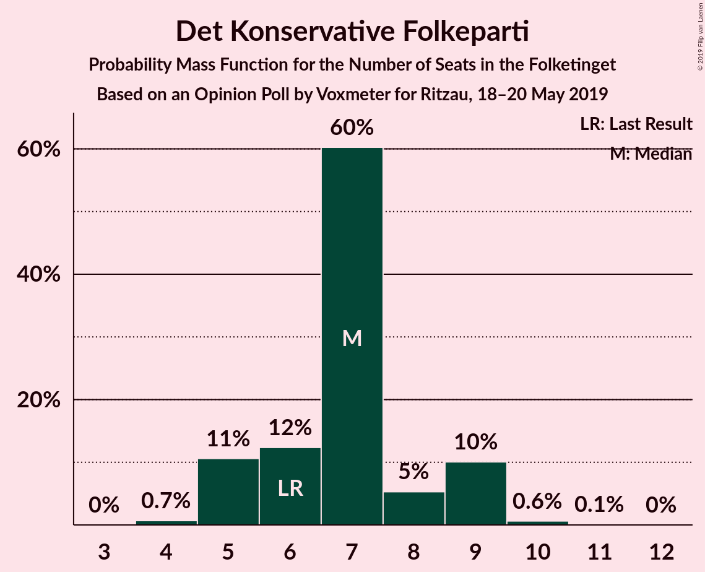

| Number of Seats | Probability | Accumulated | Special Marks |
|:---------------:|:-----------:|:-----------:|:-------------:|
| 4 | 0.7% | 100% |  |
| 5 | 11% | 99.3% |  |
| 6 | 12% | 89% | Last Result |
| 7 | 60% | 76% | Median |
| 8 | 5% | 16% |  |
| 9 | 10% | 11% |  |
| 10 | 0.6% | 0.7% |  |
| 11 | 0.1% | 0.1% |  |
| 12 | 0% | 0% |  |

### Alternativet

*For a full overview of the results for this party, see the [Alternativet](party-alternativet.html) page.*

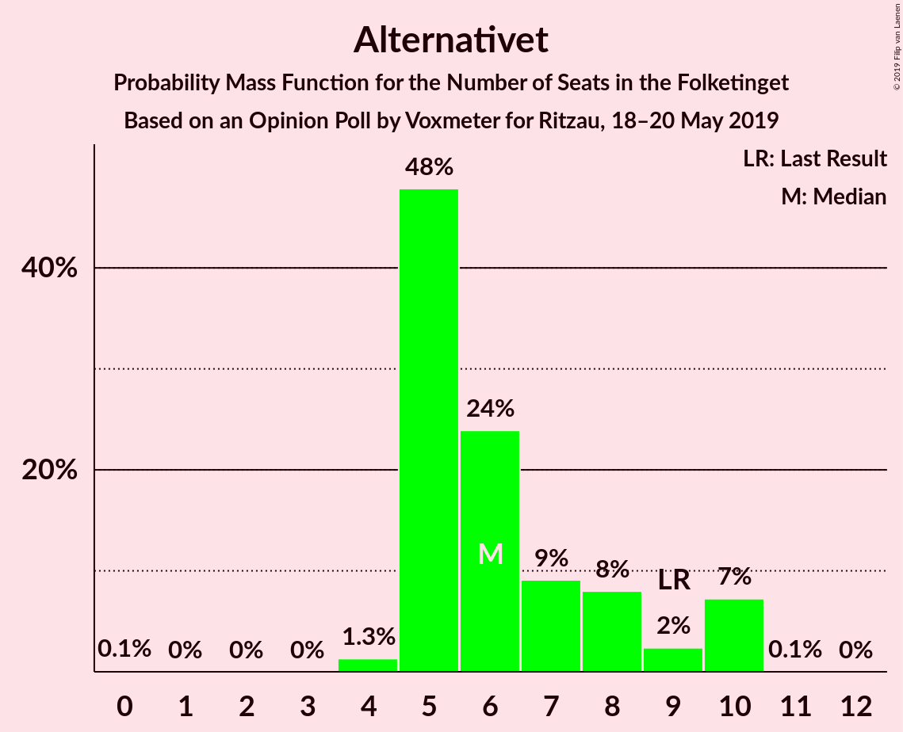

| Number of Seats | Probability | Accumulated | Special Marks |
|:---------------:|:-----------:|:-----------:|:-------------:|
| 0 | 0.1% | 100% |  |
| 1 | 0% | 99.9% |  |
| 2 | 0% | 99.9% |  |
| 3 | 0% | 99.9% |  |
| 4 | 1.3% | 99.9% |  |
| 5 | 48% | 98.6% |  |
| 6 | 24% | 51% | Median |
| 7 | 9% | 27% |  |
| 8 | 8% | 18% |  |
| 9 | 2% | 10% | Last Result |
| 10 | 7% | 7% |  |
| 11 | 0.1% | 0.1% |  |
| 12 | 0% | 0% |  |

### Stram Kurs

*For a full overview of the results for this party, see the [Stram Kurs](party-stramkurs.html) page.*

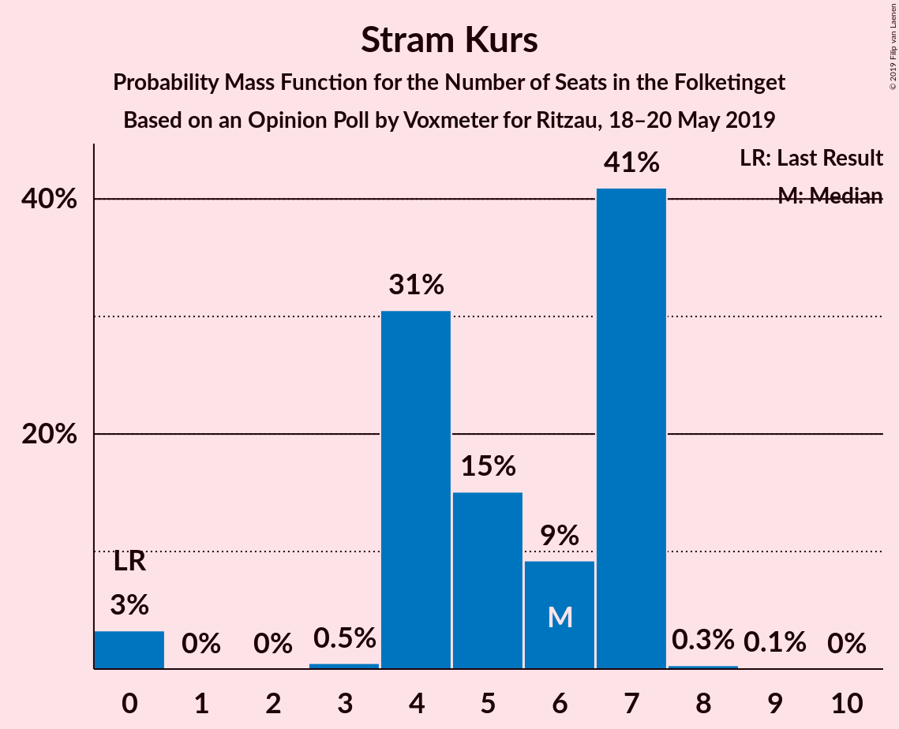

| Number of Seats | Probability | Accumulated | Special Marks |
|:---------------:|:-----------:|:-----------:|:-------------:|
| 0 | 3% | 100% | Last Result |
| 1 | 0% | 97% |  |
| 2 | 0% | 97% |  |
| 3 | 0.5% | 97% |  |
| 4 | 31% | 96% |  |
| 5 | 15% | 66% |  |
| 6 | 9% | 51% | Median |
| 7 | 41% | 41% |  |
| 8 | 0.3% | 0.4% |  |
| 9 | 0.1% | 0.1% |  |
| 10 | 0% | 0% |  |

### Kristendemokraterne

*For a full overview of the results for this party, see the [Kristendemokraterne](party-kristendemokraterne.html) page.*

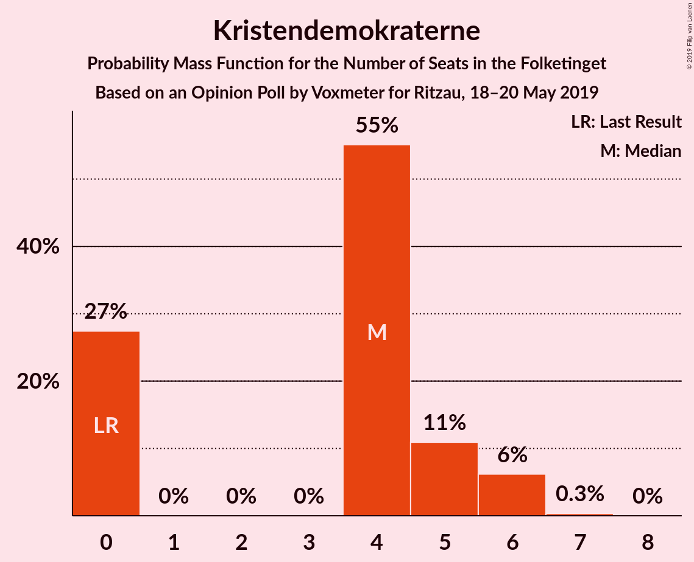

| Number of Seats | Probability | Accumulated | Special Marks |
|:---------------:|:-----------:|:-----------:|:-------------:|
| 0 | 27% | 100% | Last Result |
| 1 | 0% | 73% |  |
| 2 | 0% | 73% |  |
| 3 | 0% | 73% |  |
| 4 | 55% | 73% | Median |
| 5 | 11% | 17% |  |
| 6 | 6% | 7% |  |
| 7 | 0.3% | 0.4% |  |
| 8 | 0% | 0% |  |

### Nye Borgerlige

*For a full overview of the results for this party, see the [Nye Borgerlige](party-nyeborgerlige.html) page.*

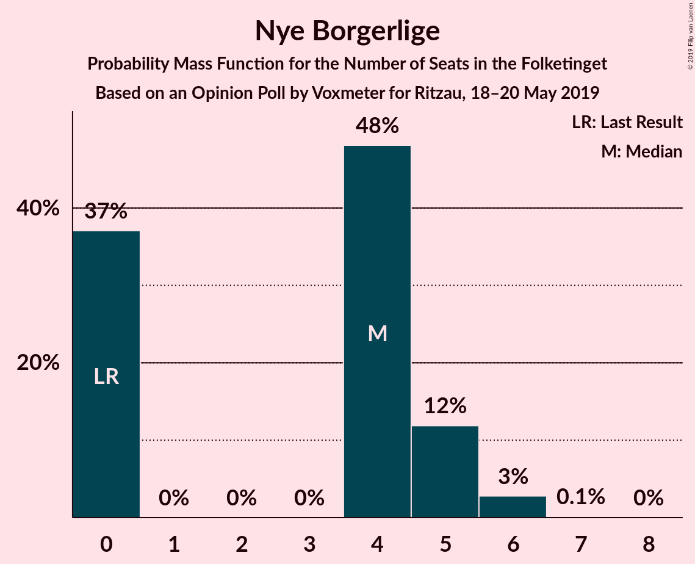

| Number of Seats | Probability | Accumulated | Special Marks |
|:---------------:|:-----------:|:-----------:|:-------------:|
| 0 | 37% | 100% | Last Result |
| 1 | 0% | 63% |  |
| 2 | 0% | 63% |  |
| 3 | 0% | 63% |  |
| 4 | 48% | 63% | Median |
| 5 | 12% | 15% |  |
| 6 | 3% | 3% |  |
| 7 | 0.1% | 0.1% |  |
| 8 | 0% | 0% |  |

### Klaus Riskær Pedersen

*For a full overview of the results for this party, see the [Klaus Riskær Pedersen](party-klausriskærpedersen.html) page.*

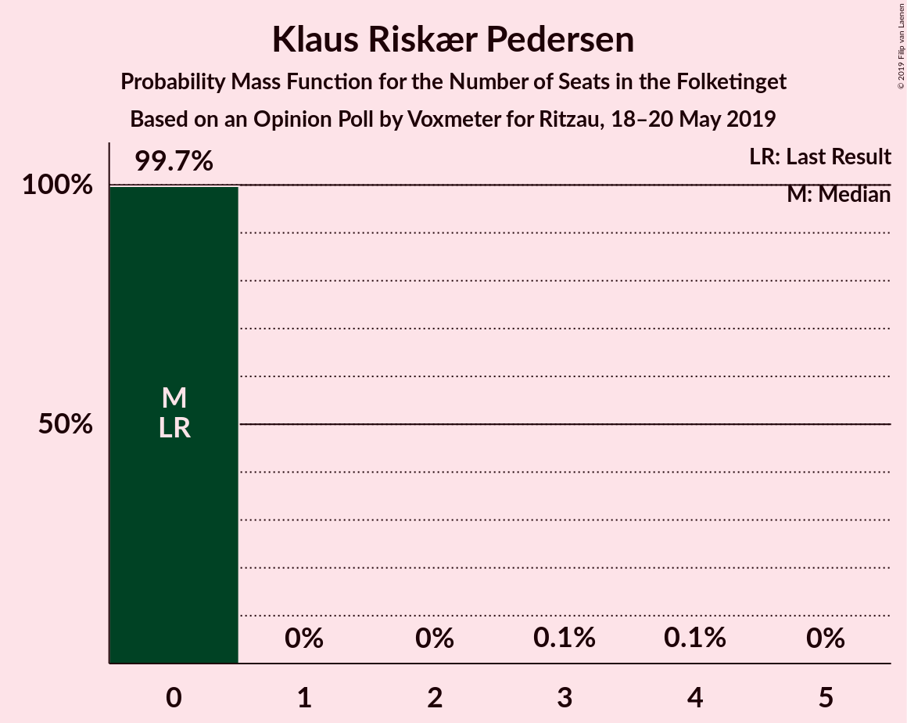

| Number of Seats | Probability | Accumulated | Special Marks |
|:---------------:|:-----------:|:-----------:|:-------------:|
| 0 | 99.7% | 100% | Last Result, Median |
| 1 | 0% | 0.3% |  |
| 2 | 0% | 0.3% |  |
| 3 | 0.1% | 0.3% |  |
| 4 | 0.1% | 0.1% |  |
| 5 | 0% | 0% |  |

## Coalitions

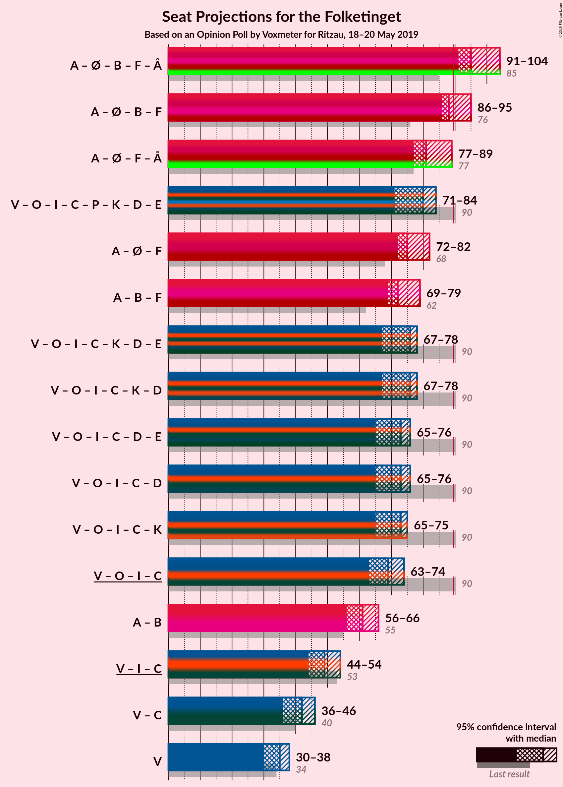

### Confidence Intervals

| Coalition | Last Result | Median | Majority? | 80% Confidence Interval | 90% Confidence Interval | 95% Confidence Interval | 99% Confidence Interval |
|:---------:|:-----------:|:------:|:---------:|:-----------------------:|:-----------------------:|:-----------------------:|:-----------------------:|
| Socialdemokraterne – Enhedslisten–De Rød-Grønne – Radikale Venstre – Socialistisk Folkeparti – Alternativet | 85 | 95 | 99.5% | 91–102 | 91–104 | 91–104 | 90–106 |
| Socialdemokraterne – Enhedslisten–De Rød-Grønne – Radikale Venstre – Socialistisk Folkeparti | 76 | 88 | 40% | 86–94 | 86–94 | 86–95 | 83–99 |
| Socialdemokraterne – Enhedslisten–De Rød-Grønne – Socialistisk Folkeparti – Alternativet | 77 | 81 | 2% | 77–88 | 77–88 | 77–89 | 75–91 |
| Venstre – Dansk Folkeparti – Liberal Alliance – Det Konservative Folkeparti – Stram Kurs – Kristendemokraterne – Nye Borgerlige – Klaus Riskær Pedersen | 90 | 80 | 0% | 73–84 | 71–84 | 71–84 | 69–85 |
| Socialdemokraterne – Enhedslisten–De Rød-Grønne – Socialistisk Folkeparti | 68 | 75 | 0% | 72–80 | 72–81 | 72–82 | 68–84 |
| Socialdemokraterne – Radikale Venstre – Socialistisk Folkeparti | 62 | 72 | 0% | 72–77 | 70–78 | 69–79 | 67–82 |
| Venstre – Dansk Folkeparti – Liberal Alliance – Det Konservative Folkeparti – Kristendemokraterne – Nye Borgerlige – Klaus Riskær Pedersen | 90 | 76 | 0% | 68–77 | 67–77 | 67–78 | 64–80 |
| Venstre – Dansk Folkeparti – Liberal Alliance – Det Konservative Folkeparti – Kristendemokraterne – Nye Borgerlige | 90 | 76 | 0% | 68–77 | 67–77 | 67–78 | 64–80 |
| Venstre – Dansk Folkeparti – Liberal Alliance – Det Konservative Folkeparti – Nye Borgerlige – Klaus Riskær Pedersen | 90 | 73 | 0% | 67–75 | 66–75 | 65–76 | 62–77 |
| Venstre – Dansk Folkeparti – Liberal Alliance – Det Konservative Folkeparti – Nye Borgerlige | 90 | 73 | 0% | 67–75 | 66–75 | 65–76 | 62–77 |
| Venstre – Dansk Folkeparti – Liberal Alliance – Det Konservative Folkeparti – Kristendemokraterne | 90 | 73 | 0% | 67–74 | 67–75 | 65–75 | 63–78 |
| Venstre – Dansk Folkeparti – Liberal Alliance – Det Konservative Folkeparti | 90 | 69 | 0% | 66–71 | 64–73 | 63–74 | 59–75 |
| Socialdemokraterne – Radikale Venstre | 55 | 61 | 0% | 58–64 | 57–65 | 56–66 | 53–69 |
| Venstre – Liberal Alliance – Det Konservative Folkeparti | 53 | 49 | 0% | 45–53 | 44–54 | 44–54 | 41–54 |
| Venstre – Det Konservative Folkeparti | 40 | 42 | 0% | 38–45 | 38–46 | 36–46 | 35–46 |
| Venstre | 34 | 35 | 0% | 31–37 | 31–38 | 30–38 | 28–41 |

### Socialdemokraterne – Enhedslisten–De Rød-Grønne – Radikale Venstre – Socialistisk Folkeparti – Alternativet

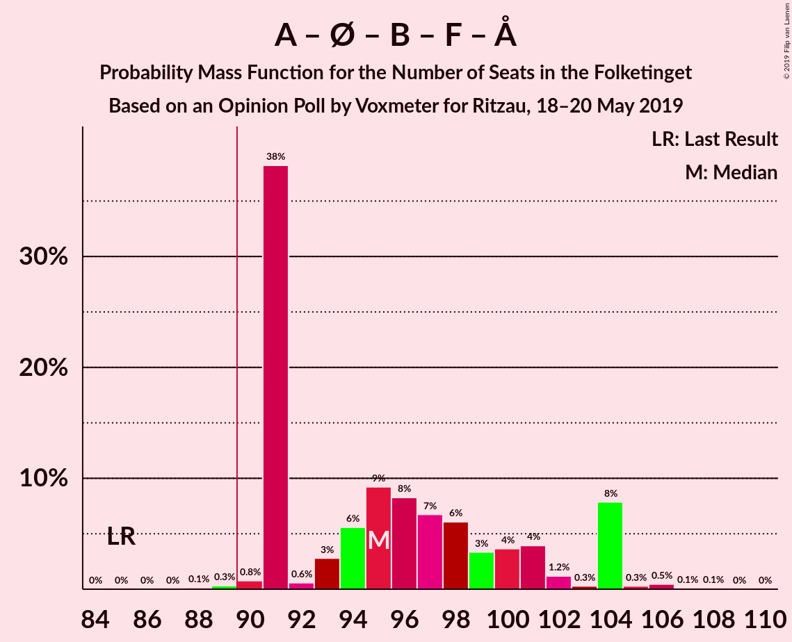

| Number of Seats | Probability | Accumulated | Special Marks |
|:---------------:|:-----------:|:-----------:|:-------------:|
| 85 | 0% | 100% | Last Result |
| 86 | 0% | 100% |  |
| 87 | 0% | 100% |  |
| 88 | 0.1% | 100% |  |
| 89 | 0.3% | 99.8% |  |
| 90 | 0.8% | 99.5% | Majority |
| 91 | 38% | 98.8% |  |
| 92 | 0.6% | 61% |  |
| 93 | 3% | 60% |  |
| 94 | 6% | 57% | Median |
| 95 | 9% | 52% |  |
| 96 | 8% | 42% |  |
| 97 | 7% | 34% |  |
| 98 | 6% | 27% |  |
| 99 | 3% | 21% |  |
| 100 | 4% | 18% |  |
| 101 | 4% | 14% |  |
| 102 | 1.2% | 10% |  |
| 103 | 0.3% | 9% |  |
| 104 | 8% | 9% |  |
| 105 | 0.3% | 1.0% |  |
| 106 | 0.5% | 0.7% |  |
| 107 | 0.1% | 0.2% |  |
| 108 | 0.1% | 0.1% |  |
| 109 | 0% | 0% |  |

### Socialdemokraterne – Enhedslisten–De Rød-Grønne – Radikale Venstre – Socialistisk Folkeparti

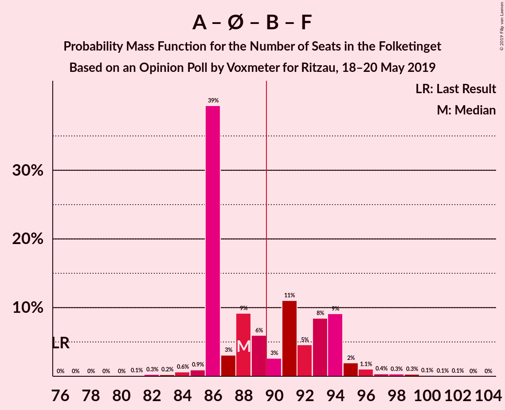

| Number of Seats | Probability | Accumulated | Special Marks |
|:---------------:|:-----------:|:-----------:|:-------------:|
| 76 | 0% | 100% | Last Result |
| 77 | 0% | 100% |  |
| 78 | 0% | 100% |  |
| 79 | 0% | 100% |  |
| 80 | 0% | 100% |  |
| 81 | 0.1% | 100% |  |
| 82 | 0.3% | 99.9% |  |
| 83 | 0.2% | 99.6% |  |
| 84 | 0.6% | 99.3% |  |
| 85 | 0.9% | 98.7% |  |
| 86 | 39% | 98% |  |
| 87 | 3% | 58% |  |
| 88 | 9% | 55% | Median |
| 89 | 6% | 46% |  |
| 90 | 3% | 40% | Majority |
| 91 | 11% | 38% |  |
| 92 | 5% | 26% |  |
| 93 | 8% | 22% |  |
| 94 | 9% | 13% |  |
| 95 | 2% | 4% |  |
| 96 | 1.1% | 2% |  |
| 97 | 0.4% | 1.3% |  |
| 98 | 0.3% | 0.9% |  |
| 99 | 0.3% | 0.6% |  |
| 100 | 0.1% | 0.3% |  |
| 101 | 0.1% | 0.2% |  |
| 102 | 0.1% | 0.1% |  |
| 103 | 0% | 0% |  |

### Socialdemokraterne – Enhedslisten–De Rød-Grønne – Socialistisk Folkeparti – Alternativet

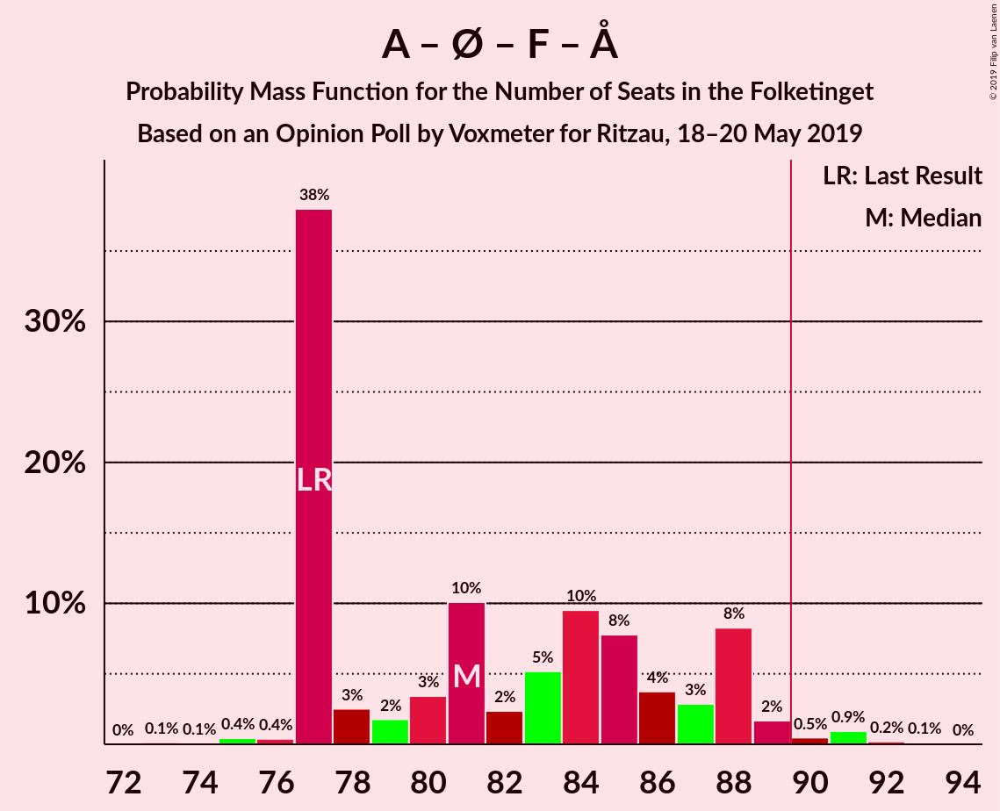

| Number of Seats | Probability | Accumulated | Special Marks |
|:---------------:|:-----------:|:-----------:|:-------------:|
| 73 | 0.1% | 100% |  |
| 74 | 0.1% | 99.9% |  |
| 75 | 0.4% | 99.8% |  |
| 76 | 0.4% | 99.3% |  |
| 77 | 38% | 99.0% | Last Result |
| 78 | 3% | 61% |  |
| 79 | 2% | 58% |  |
| 80 | 3% | 57% | Median |
| 81 | 10% | 53% |  |
| 82 | 2% | 43% |  |
| 83 | 5% | 41% |  |
| 84 | 10% | 36% |  |
| 85 | 8% | 26% |  |
| 86 | 4% | 18% |  |
| 87 | 3% | 15% |  |
| 88 | 8% | 12% |  |
| 89 | 2% | 3% |  |
| 90 | 0.5% | 2% | Majority |
| 91 | 0.9% | 1.3% |  |
| 92 | 0.2% | 0.3% |  |
| 93 | 0.1% | 0.2% |  |
| 94 | 0% | 0% |  |

### Venstre – Dansk Folkeparti – Liberal Alliance – Det Konservative Folkeparti – Stram Kurs – Kristendemokraterne – Nye Borgerlige – Klaus Riskær Pedersen

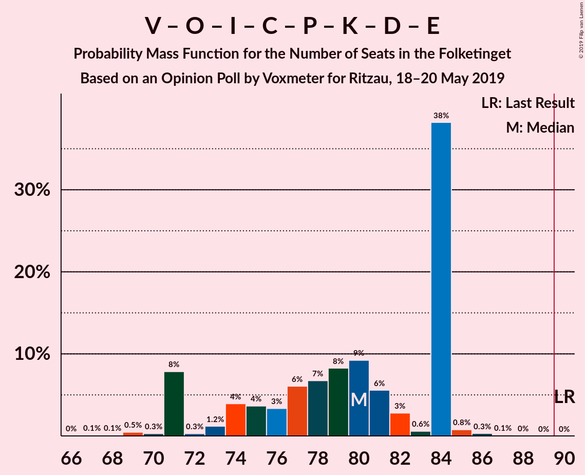

| Number of Seats | Probability | Accumulated | Special Marks |
|:---------------:|:-----------:|:-----------:|:-------------:|
| 67 | 0.1% | 100% |  |
| 68 | 0.1% | 99.9% |  |
| 69 | 0.5% | 99.8% |  |
| 70 | 0.3% | 99.3% |  |
| 71 | 8% | 99.0% |  |
| 72 | 0.3% | 91% |  |
| 73 | 1.2% | 91% |  |
| 74 | 4% | 90% |  |
| 75 | 4% | 86% |  |
| 76 | 3% | 82% |  |
| 77 | 6% | 79% |  |
| 78 | 7% | 73% |  |
| 79 | 8% | 66% |  |
| 80 | 9% | 58% |  |
| 81 | 6% | 48% |  |
| 82 | 3% | 43% |  |
| 83 | 0.6% | 40% | Median |
| 84 | 38% | 39% |  |
| 85 | 0.8% | 1.2% |  |
| 86 | 0.3% | 0.5% |  |
| 87 | 0.1% | 0.2% |  |
| 88 | 0% | 0% |  |
| 89 | 0% | 0% |  |
| 90 | 0% | 0% | Last Result, Majority |

### Socialdemokraterne – Enhedslisten–De Rød-Grønne – Socialistisk Folkeparti

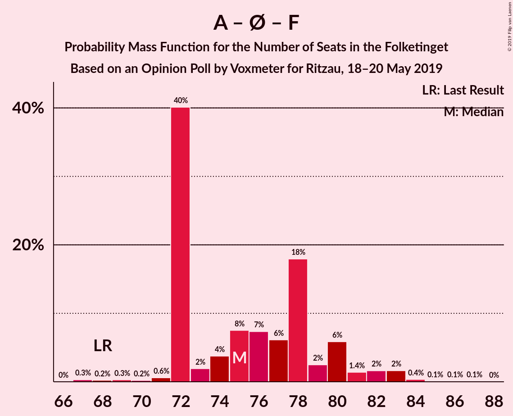

| Number of Seats | Probability | Accumulated | Special Marks |
|:---------------:|:-----------:|:-----------:|:-------------:|
| 67 | 0.3% | 100% |  |
| 68 | 0.2% | 99.7% | Last Result |
| 69 | 0.3% | 99.5% |  |
| 70 | 0.2% | 99.2% |  |
| 71 | 0.6% | 98.9% |  |
| 72 | 40% | 98% |  |
| 73 | 2% | 58% |  |
| 74 | 4% | 56% | Median |
| 75 | 8% | 53% |  |
| 76 | 7% | 45% |  |
| 77 | 6% | 38% |  |
| 78 | 18% | 32% |  |
| 79 | 2% | 14% |  |
| 80 | 6% | 11% |  |
| 81 | 1.4% | 5% |  |
| 82 | 2% | 4% |  |
| 83 | 2% | 2% |  |
| 84 | 0.4% | 0.6% |  |
| 85 | 0.1% | 0.3% |  |
| 86 | 0.1% | 0.2% |  |
| 87 | 0.1% | 0.1% |  |
| 88 | 0% | 0% |  |

### Socialdemokraterne – Radikale Venstre – Socialistisk Folkeparti

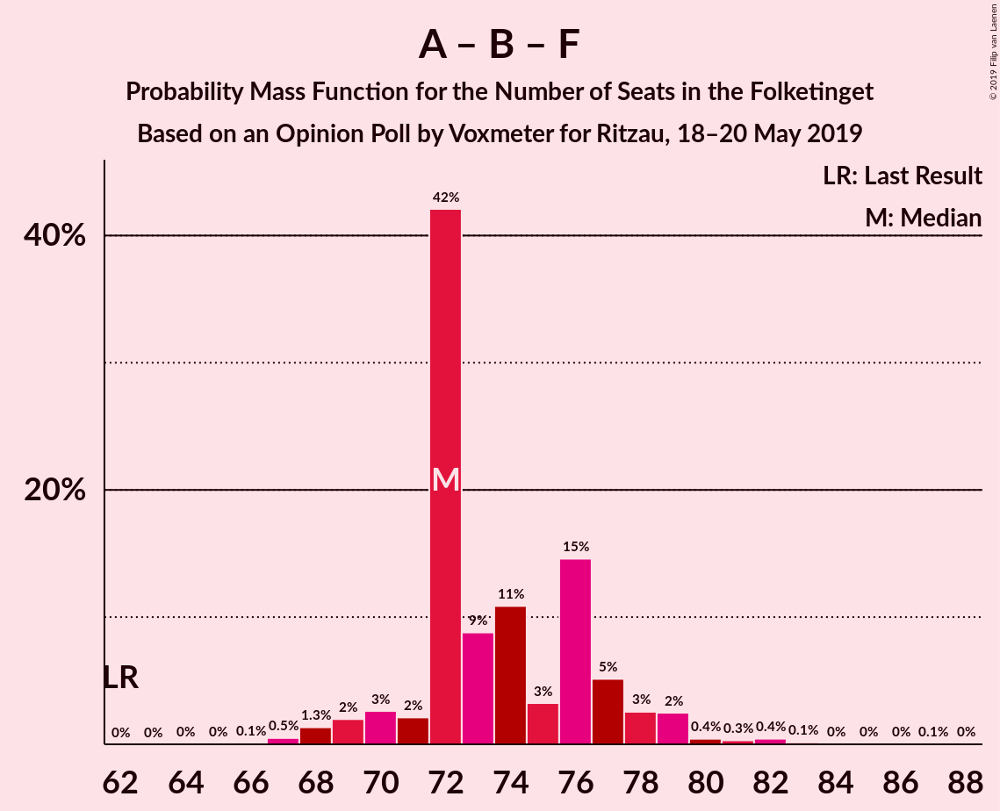

| Number of Seats | Probability | Accumulated | Special Marks |
|:---------------:|:-----------:|:-----------:|:-------------:|
| 62 | 0% | 100% | Last Result |
| 63 | 0% | 100% |  |
| 64 | 0% | 100% |  |
| 65 | 0% | 99.9% |  |
| 66 | 0.1% | 99.9% |  |
| 67 | 0.5% | 99.8% |  |
| 68 | 1.3% | 99.3% |  |
| 69 | 2% | 98% |  |
| 70 | 3% | 96% |  |
| 71 | 2% | 93% |  |
| 72 | 42% | 91% |  |
| 73 | 9% | 49% | Median |
| 74 | 11% | 40% |  |
| 75 | 3% | 29% |  |
| 76 | 15% | 26% |  |
| 77 | 5% | 12% |  |
| 78 | 3% | 7% |  |
| 79 | 2% | 4% |  |
| 80 | 0.4% | 1.5% |  |
| 81 | 0.3% | 1.0% |  |
| 82 | 0.4% | 0.7% |  |
| 83 | 0.1% | 0.3% |  |
| 84 | 0% | 0.1% |  |
| 85 | 0% | 0.1% |  |
| 86 | 0% | 0.1% |  |
| 87 | 0.1% | 0.1% |  |
| 88 | 0% | 0% |  |

### Venstre – Dansk Folkeparti – Liberal Alliance – Det Konservative Folkeparti – Kristendemokraterne – Nye Borgerlige – Klaus Riskær Pedersen

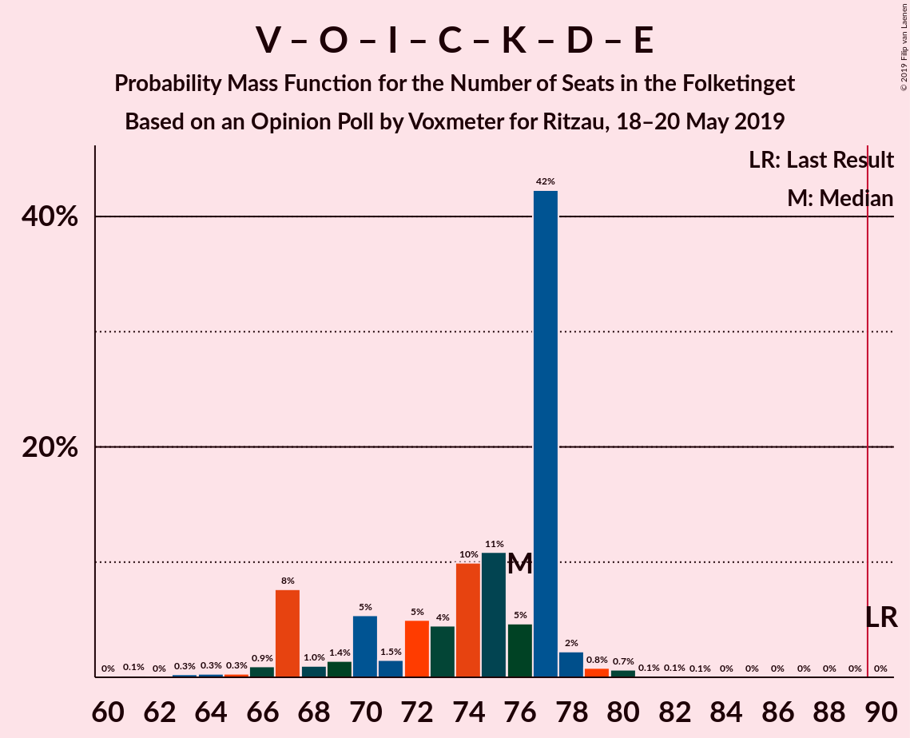

| Number of Seats | Probability | Accumulated | Special Marks |
|:---------------:|:-----------:|:-----------:|:-------------:|
| 61 | 0.1% | 100% |  |
| 62 | 0% | 99.8% |  |
| 63 | 0.3% | 99.8% |  |
| 64 | 0.3% | 99.6% |  |
| 65 | 0.3% | 99.3% |  |
| 66 | 0.9% | 99.0% |  |
| 67 | 8% | 98% |  |
| 68 | 1.0% | 90% |  |
| 69 | 1.4% | 89% |  |
| 70 | 5% | 88% |  |
| 71 | 1.5% | 83% |  |
| 72 | 5% | 81% |  |
| 73 | 4% | 76% |  |
| 74 | 10% | 72% |  |
| 75 | 11% | 62% |  |
| 76 | 5% | 51% |  |
| 77 | 42% | 46% | Median |
| 78 | 2% | 4% |  |
| 79 | 0.8% | 2% |  |
| 80 | 0.7% | 0.9% |  |
| 81 | 0.1% | 0.2% |  |
| 82 | 0.1% | 0.1% |  |
| 83 | 0.1% | 0.1% |  |
| 84 | 0% | 0% |  |
| 85 | 0% | 0% |  |
| 86 | 0% | 0% |  |
| 87 | 0% | 0% |  |
| 88 | 0% | 0% |  |
| 89 | 0% | 0% |  |
| 90 | 0% | 0% | Last Result, Majority |

### Venstre – Dansk Folkeparti – Liberal Alliance – Det Konservative Folkeparti – Kristendemokraterne – Nye Borgerlige

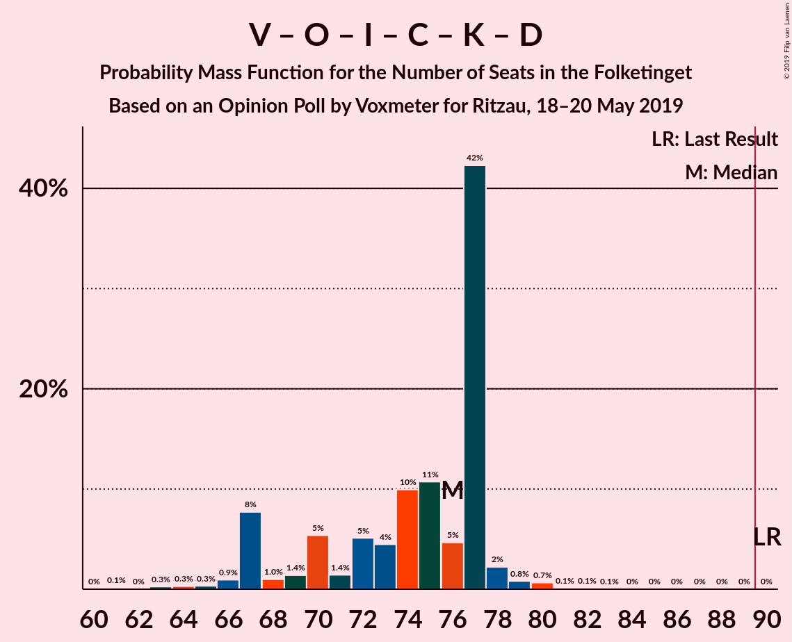

| Number of Seats | Probability | Accumulated | Special Marks |
|:---------------:|:-----------:|:-----------:|:-------------:|
| 61 | 0.1% | 100% |  |
| 62 | 0% | 99.8% |  |
| 63 | 0.3% | 99.8% |  |
| 64 | 0.3% | 99.6% |  |
| 65 | 0.3% | 99.3% |  |
| 66 | 0.9% | 98.9% |  |
| 67 | 8% | 98% |  |
| 68 | 1.0% | 90% |  |
| 69 | 1.4% | 89% |  |
| 70 | 5% | 88% |  |
| 71 | 1.4% | 83% |  |
| 72 | 5% | 81% |  |
| 73 | 4% | 76% |  |
| 74 | 10% | 72% |  |
| 75 | 11% | 62% |  |
| 76 | 5% | 51% |  |
| 77 | 42% | 46% | Median |
| 78 | 2% | 4% |  |
| 79 | 0.8% | 2% |  |
| 80 | 0.7% | 0.8% |  |
| 81 | 0.1% | 0.2% |  |
| 82 | 0.1% | 0.1% |  |
| 83 | 0.1% | 0.1% |  |
| 84 | 0% | 0% |  |
| 85 | 0% | 0% |  |
| 86 | 0% | 0% |  |
| 87 | 0% | 0% |  |
| 88 | 0% | 0% |  |
| 89 | 0% | 0% |  |
| 90 | 0% | 0% | Last Result, Majority |

### Venstre – Dansk Folkeparti – Liberal Alliance – Det Konservative Folkeparti – Nye Borgerlige – Klaus Riskær Pedersen

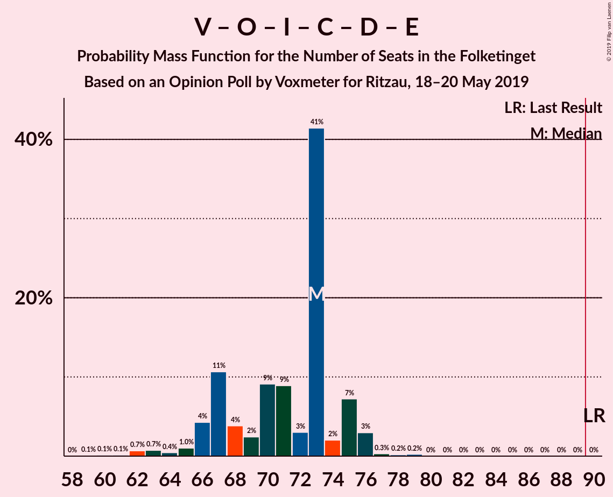

| Number of Seats | Probability | Accumulated | Special Marks |
|:---------------:|:-----------:|:-----------:|:-------------:|
| 59 | 0.1% | 100% |  |
| 60 | 0.1% | 99.9% |  |
| 61 | 0.1% | 99.7% |  |
| 62 | 0.7% | 99.6% |  |
| 63 | 0.7% | 98.9% |  |
| 64 | 0.4% | 98% |  |
| 65 | 1.0% | 98% |  |
| 66 | 4% | 97% |  |
| 67 | 11% | 92% |  |
| 68 | 4% | 82% |  |
| 69 | 2% | 78% |  |
| 70 | 9% | 75% |  |
| 71 | 9% | 66% |  |
| 72 | 3% | 57% |  |
| 73 | 41% | 54% | Median |
| 74 | 2% | 13% |  |
| 75 | 7% | 11% |  |
| 76 | 3% | 4% |  |
| 77 | 0.3% | 0.8% |  |
| 78 | 0.2% | 0.5% |  |
| 79 | 0.2% | 0.3% |  |
| 80 | 0% | 0% |  |
| 81 | 0% | 0% |  |
| 82 | 0% | 0% |  |
| 83 | 0% | 0% |  |
| 84 | 0% | 0% |  |
| 85 | 0% | 0% |  |
| 86 | 0% | 0% |  |
| 87 | 0% | 0% |  |
| 88 | 0% | 0% |  |
| 89 | 0% | 0% |  |
| 90 | 0% | 0% | Last Result, Majority |

### Venstre – Dansk Folkeparti – Liberal Alliance – Det Konservative Folkeparti – Nye Borgerlige

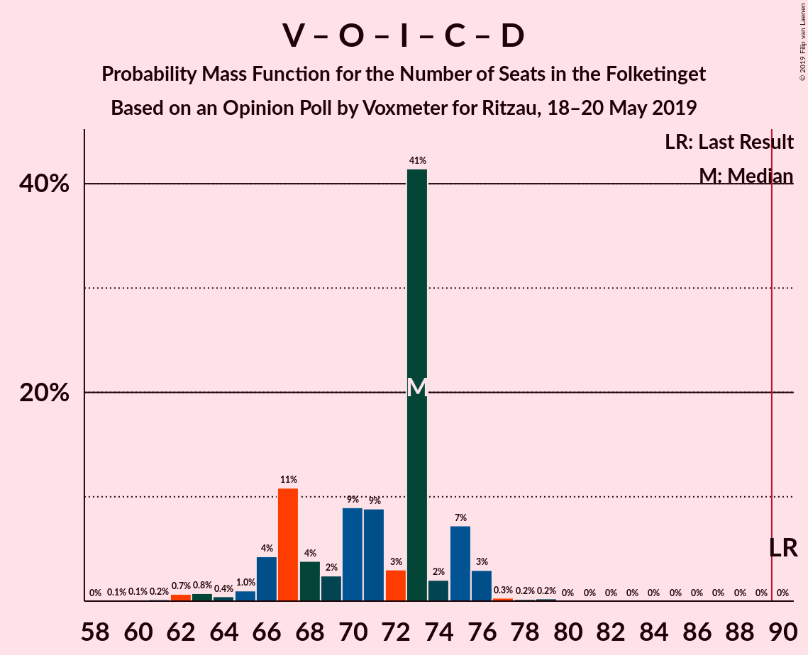

| Number of Seats | Probability | Accumulated | Special Marks |
|:---------------:|:-----------:|:-----------:|:-------------:|
| 59 | 0.1% | 100% |  |
| 60 | 0.1% | 99.9% |  |
| 61 | 0.2% | 99.7% |  |
| 62 | 0.7% | 99.6% |  |
| 63 | 0.8% | 98.9% |  |
| 64 | 0.4% | 98% |  |
| 65 | 1.0% | 98% |  |
| 66 | 4% | 97% |  |
| 67 | 11% | 92% |  |
| 68 | 4% | 82% |  |
| 69 | 2% | 78% |  |
| 70 | 9% | 75% |  |
| 71 | 9% | 66% |  |
| 72 | 3% | 57% |  |
| 73 | 41% | 54% | Median |
| 74 | 2% | 13% |  |
| 75 | 7% | 11% |  |
| 76 | 3% | 4% |  |
| 77 | 0.3% | 0.8% |  |
| 78 | 0.2% | 0.5% |  |
| 79 | 0.2% | 0.3% |  |
| 80 | 0% | 0% |  |
| 81 | 0% | 0% |  |
| 82 | 0% | 0% |  |
| 83 | 0% | 0% |  |
| 84 | 0% | 0% |  |
| 85 | 0% | 0% |  |
| 86 | 0% | 0% |  |
| 87 | 0% | 0% |  |
| 88 | 0% | 0% |  |
| 89 | 0% | 0% |  |
| 90 | 0% | 0% | Last Result, Majority |

### Venstre – Dansk Folkeparti – Liberal Alliance – Det Konservative Folkeparti – Kristendemokraterne

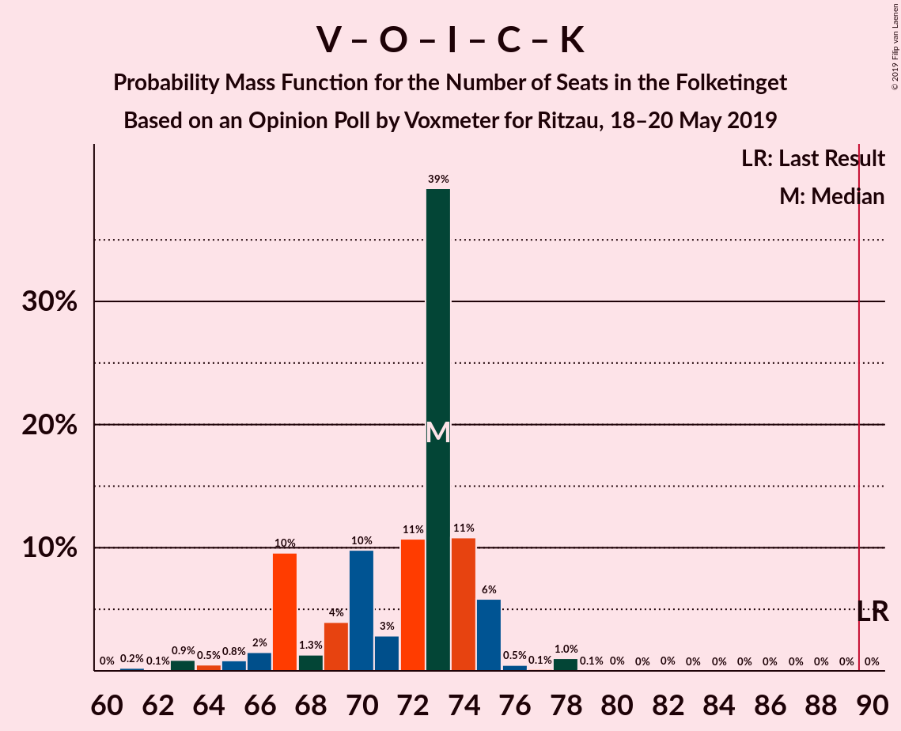

| Number of Seats | Probability | Accumulated | Special Marks |
|:---------------:|:-----------:|:-----------:|:-------------:|
| 60 | 0% | 100% |  |
| 61 | 0.2% | 99.9% |  |
| 62 | 0.1% | 99.7% |  |
| 63 | 0.9% | 99.6% |  |
| 64 | 0.5% | 98.8% |  |
| 65 | 0.8% | 98% |  |
| 66 | 2% | 97% |  |
| 67 | 10% | 96% |  |
| 68 | 1.3% | 86% |  |
| 69 | 4% | 85% |  |
| 70 | 10% | 81% |  |
| 71 | 3% | 71% |  |
| 72 | 11% | 68% |  |
| 73 | 39% | 58% | Median |
| 74 | 11% | 18% |  |
| 75 | 6% | 8% |  |
| 76 | 0.5% | 2% |  |
| 77 | 0.1% | 1.3% |  |
| 78 | 1.0% | 1.2% |  |
| 79 | 0.1% | 0.1% |  |
| 80 | 0% | 0.1% |  |
| 81 | 0% | 0% |  |
| 82 | 0% | 0% |  |
| 83 | 0% | 0% |  |
| 84 | 0% | 0% |  |
| 85 | 0% | 0% |  |
| 86 | 0% | 0% |  |
| 87 | 0% | 0% |  |
| 88 | 0% | 0% |  |
| 89 | 0% | 0% |  |
| 90 | 0% | 0% | Last Result, Majority |

### Venstre – Dansk Folkeparti – Liberal Alliance – Det Konservative Folkeparti

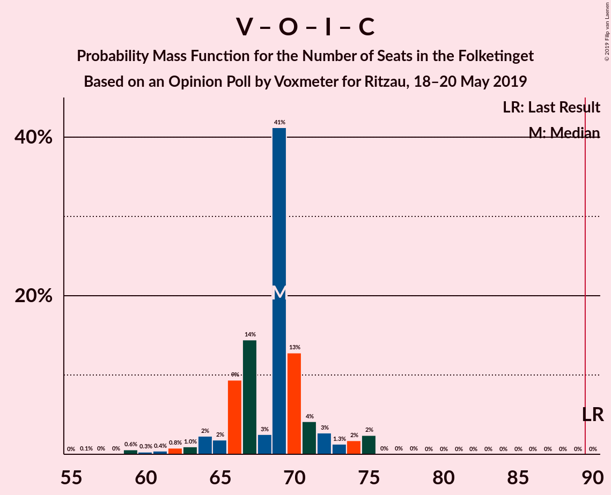

| Number of Seats | Probability | Accumulated | Special Marks |
|:---------------:|:-----------:|:-----------:|:-------------:|
| 56 | 0.1% | 100% |  |
| 57 | 0% | 99.9% |  |
| 58 | 0% | 99.9% |  |
| 59 | 0.6% | 99.8% |  |
| 60 | 0.3% | 99.3% |  |
| 61 | 0.4% | 99.0% |  |
| 62 | 0.8% | 98.6% |  |
| 63 | 1.0% | 98% |  |
| 64 | 2% | 97% |  |
| 65 | 2% | 95% |  |
| 66 | 9% | 93% |  |
| 67 | 14% | 83% |  |
| 68 | 3% | 69% |  |
| 69 | 41% | 66% | Median |
| 70 | 13% | 25% |  |
| 71 | 4% | 12% |  |
| 72 | 3% | 8% |  |
| 73 | 1.3% | 6% |  |
| 74 | 2% | 4% |  |
| 75 | 2% | 2% |  |
| 76 | 0% | 0.1% |  |
| 77 | 0% | 0.1% |  |
| 78 | 0% | 0% |  |
| 79 | 0% | 0% |  |
| 80 | 0% | 0% |  |
| 81 | 0% | 0% |  |
| 82 | 0% | 0% |  |
| 83 | 0% | 0% |  |
| 84 | 0% | 0% |  |
| 85 | 0% | 0% |  |
| 86 | 0% | 0% |  |
| 87 | 0% | 0% |  |
| 88 | 0% | 0% |  |
| 89 | 0% | 0% |  |
| 90 | 0% | 0% | Last Result, Majority |

### Socialdemokraterne – Radikale Venstre

| Number of Seats | Probability | Accumulated | Special Marks |
|:---------------:|:-----------:|:-----------:|:-------------:|
| 52 | 0.1% | 100% |  |
| 53 | 0.5% | 99.9% |  |
| 54 | 0.6% | 99.4% |  |
| 55 | 0.6% | 98.8% | Last Result |
| 56 | 2% | 98% |  |
| 57 | 6% | 96% |  |
| 58 | 2% | 90% |  |
| 59 | 3% | 88% |  |
| 60 | 12% | 85% |  |
| 61 | 48% | 74% | Median |
| 62 | 8% | 25% |  |
| 63 | 4% | 17% |  |
| 64 | 8% | 13% |  |
| 65 | 2% | 5% |  |
| 66 | 1.3% | 3% |  |
| 67 | 0.1% | 1.5% |  |
| 68 | 0.7% | 1.3% |  |
| 69 | 0.3% | 0.6% |  |
| 70 | 0.3% | 0.3% |  |
| 71 | 0% | 0.1% |  |
| 72 | 0% | 0% |  |

### Venstre – Liberal Alliance – Det Konservative Folkeparti

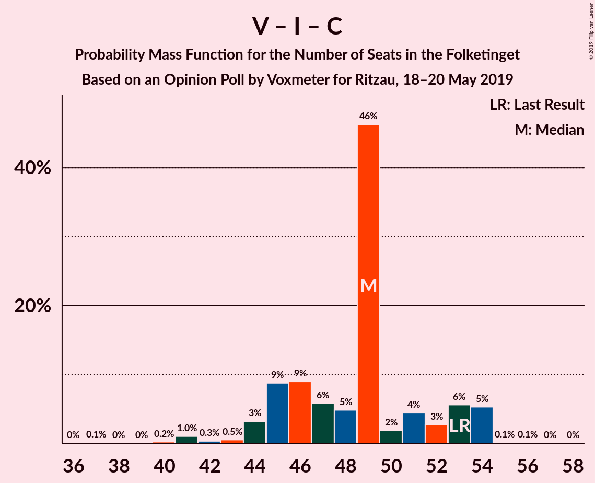

| Number of Seats | Probability | Accumulated | Special Marks |
|:---------------:|:-----------:|:-----------:|:-------------:|
| 37 | 0.1% | 100% |  |
| 38 | 0% | 99.9% |  |
| 39 | 0% | 99.9% |  |
| 40 | 0.2% | 99.9% |  |
| 41 | 1.0% | 99.7% |  |
| 42 | 0.3% | 98.7% |  |
| 43 | 0.5% | 98% |  |
| 44 | 3% | 98% |  |
| 45 | 9% | 95% |  |
| 46 | 9% | 86% |  |
| 47 | 6% | 77% |  |
| 48 | 5% | 71% |  |
| 49 | 46% | 66% | Median |
| 50 | 2% | 20% |  |
| 51 | 4% | 18% |  |
| 52 | 3% | 14% |  |
| 53 | 6% | 11% | Last Result |
| 54 | 5% | 6% |  |
| 55 | 0.1% | 0.2% |  |
| 56 | 0.1% | 0.1% |  |
| 57 | 0% | 0.1% |  |
| 58 | 0% | 0% |  |

### Venstre – Det Konservative Folkeparti

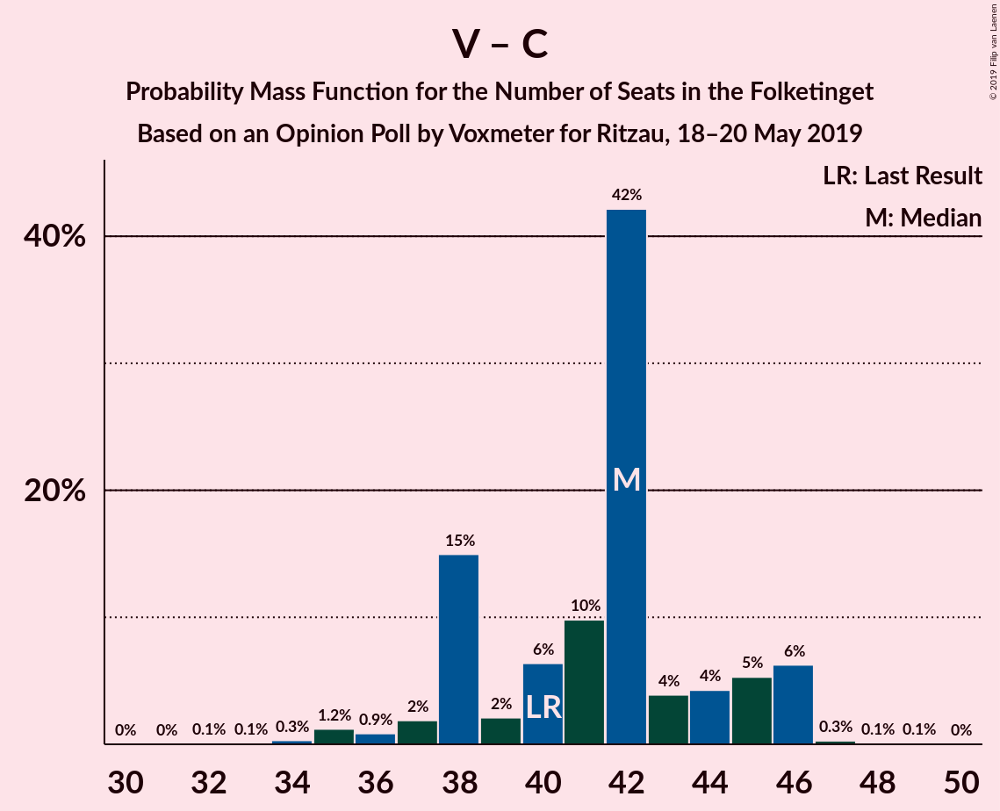

| Number of Seats | Probability | Accumulated | Special Marks |
|:---------------:|:-----------:|:-----------:|:-------------:|
| 32 | 0.1% | 100% |  |
| 33 | 0.1% | 99.9% |  |
| 34 | 0.3% | 99.8% |  |
| 35 | 1.2% | 99.5% |  |
| 36 | 0.9% | 98% |  |
| 37 | 2% | 97% |  |
| 38 | 15% | 96% |  |
| 39 | 2% | 81% |  |
| 40 | 6% | 78% | Last Result |
| 41 | 10% | 72% |  |
| 42 | 42% | 62% | Median |
| 43 | 4% | 20% |  |
| 44 | 4% | 16% |  |
| 45 | 5% | 12% |  |
| 46 | 6% | 7% |  |
| 47 | 0.3% | 0.4% |  |
| 48 | 0.1% | 0.1% |  |
| 49 | 0.1% | 0.1% |  |
| 50 | 0% | 0% |  |

### Venstre

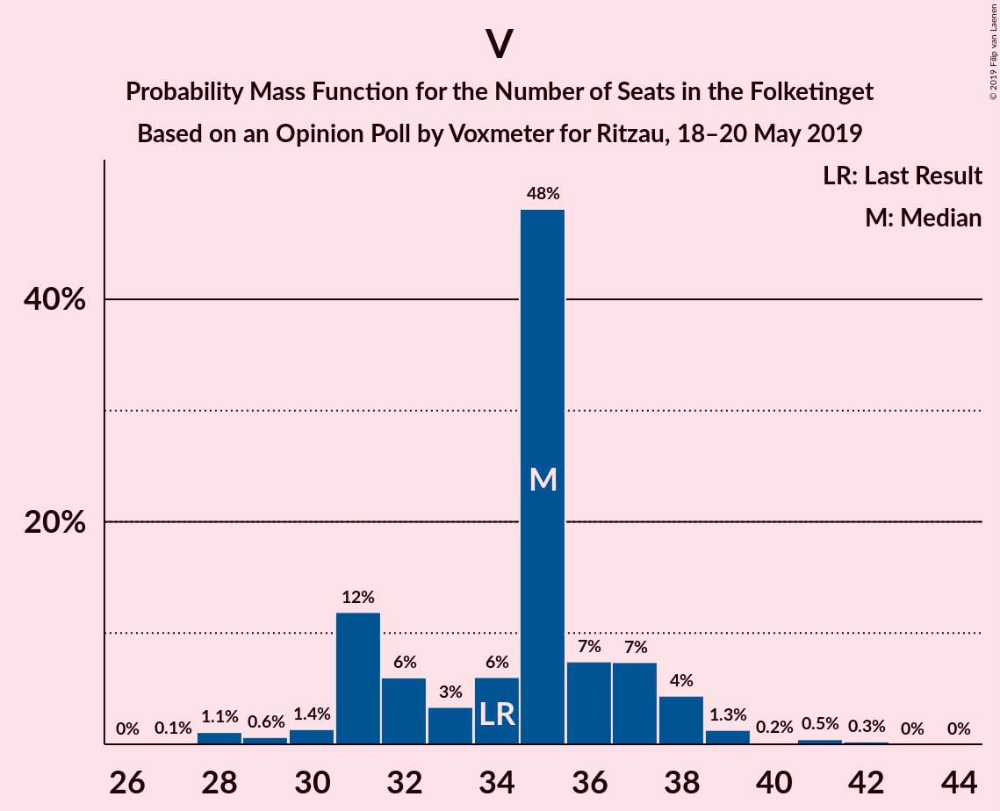

| Number of Seats | Probability | Accumulated | Special Marks |
|:---------------:|:-----------:|:-----------:|:-------------:|
| 27 | 0.1% | 100% |  |
| 28 | 1.1% | 99.9% |  |
| 29 | 0.6% | 98.8% |  |
| 30 | 1.4% | 98% |  |
| 31 | 12% | 97% |  |
| 32 | 6% | 85% |  |
| 33 | 3% | 79% |  |
| 34 | 6% | 76% | Last Result |
| 35 | 48% | 69% | Median |
| 36 | 7% | 21% |  |
| 37 | 7% | 14% |  |
| 38 | 4% | 7% |  |
| 39 | 1.3% | 2% |  |
| 40 | 0.2% | 0.9% |  |
| 41 | 0.5% | 0.7% |  |
| 42 | 0.3% | 0.3% |  |
| 43 | 0% | 0% |  |

## Technical Information

### Opinion Poll

+ **Polling firm:** Voxmeter
+ **Commissioner(s):** Ritzau
+ **Fieldwork period:** 18–20 May 2019

### Calculations

+ **Sample size:** 1004
+ **Simulations done:** 1,048,576
+ **Error estimate:** 3.03%

