# Opinion Poll by Voxmeter for Ritzau, 19–21 May 2019

<a href="#voting-intentions">Voting Intentions</a> | <a href="#seats">Seats</a> | <a href="#coalitions">Coalitions</a> | <a href="#technical-information">Technical Information</a>

## Voting Intentions

### Confidence Intervals

| Party | Last Result | Poll Result | 80% Confidence Interval | 90% Confidence Interval | 95% Confidence Interval | 99% Confidence Interval |
|:-----:|:-----------:|:-----------:|:-----------------------:|:-----------------------:|:-----------------------:|:-----------------------:|
| Socialdemokraterne | 26.3% | 26.1% | 24.4–28.0% |23.9–28.5% |23.5–29.0% |22.7–29.9% |
| Venstre | 19.5% | 18.6% | 17.1–20.2% |16.6–20.7% |16.3–21.1% |15.6–21.9% |
| Dansk Folkeparti | 21.1% | 10.6% | 9.4–11.9% |9.1–12.3% |8.8–12.7% |8.3–13.3% |
| Enhedslisten–De Rød-Grønne | 7.8% | 9.5% | 8.4–10.8% |8.1–11.1% |7.8–11.5% |7.3–12.1% |
| Radikale Venstre | 4.6% | 7.8% | 6.8–9.0% |6.5–9.3% |6.3–9.6% |5.8–10.2% |
| Socialistisk Folkeparti | 4.2% | 7.1% | 6.1–8.2% |5.9–8.6% |5.7–8.9% |5.2–9.4% |
| Liberal Alliance | 7.5% | 4.4% | 3.7–5.3% |3.5–5.6% |3.3–5.9% |3.0–6.3% |
| Alternativet | 4.8% | 4.0% | 3.3–4.9% |3.1–5.2% |2.9–5.4% |2.6–5.9% |
| Det Konservative Folkeparti | 3.4% | 3.5% | 2.9–4.4% |2.7–4.6% |2.5–4.8% |2.2–5.3% |
| Stram Kurs | 0.0% | 2.9% | 2.3–3.7% |2.1–3.9% |2.0–4.1% |1.8–4.6% |
| Kristendemokraterne | 0.8% | 2.3% | 1.8–3.0% |1.6–3.2% |1.5–3.4% |1.3–3.8% |
| Nye Borgerlige | 0.0% | 1.5% | 1.1–2.1% |1.0–2.3% |0.9–2.5% |0.7–2.8% |
| Klaus Riskær Pedersen | 0.0% | 0.9% | 0.6–1.4% |0.5–1.6% |0.5–1.7% |0.4–2.0% |

*Note:* The poll result column reflects the actual value used in the calculations. Published results may vary slightly, and in addition be rounded to fewer digits.

## Seats

### Confidence Intervals

| Party | Last Result | Median | 80% Confidence Interval | 90% Confidence Interval | 95% Confidence Interval | 99% Confidence Interval |
|:-----:|:-----------:|:------:|:-----------------------:|:-----------------------:|:-----------------------:|:-----------------------:|
| <a href="#socialdemokraterne">Socialdemokraterne</a> | 47 | 45 | 44–52 |44–52 |42–53 |40–53 |
| <a href="#venstre">Venstre</a> | 34 | 32 | 30–35 |29–36 |28–38 |28–39 |
| <a href="#dansk-folkeparti">Dansk Folkeparti</a> | 37 | 19 | 17–20 |17–21 |16–23 |15–24 |
| <a href="#enhedslisten–de-rød-grønne">Enhedslisten–De Rød-Grønne</a> | 14 | 20 | 14–20 |14–20 |14–21 |14–22 |
| <a href="#radikale-venstre">Radikale Venstre</a> | 8 | 14 | 12–16 |12–16 |12–17 |11–18 |
| <a href="#socialistisk-folkeparti">Socialistisk Folkeparti</a> | 7 | 15 | 12–15 |11–15 |10–15 |10–15 |
| <a href="#liberal-alliance">Liberal Alliance</a> | 13 | 8 | 7–9 |7–10 |6–10 |5–11 |
| <a href="#alternativet">Alternativet</a> | 9 | 8 | 6–9 |6–9 |6–10 |4–10 |
| <a href="#det-konservative-folkeparti">Det Konservative Folkeparti</a> | 6 | 5 | 5–7 |5–8 |5–9 |4–9 |
| <a href="#stram-kurs">Stram Kurs</a> | 0 | 5 | 4–7 |4–7 |0–7 |0–8 |
| <a href="#kristendemokraterne">Kristendemokraterne</a> | 0 | 4 | 4–5 |0–5 |0–6 |0–7 |
| <a href="#nye-borgerlige">Nye Borgerlige</a> | 0 | 0 | 0 |0–4 |0–4 |0–5 |
| <a href="#klaus-riskær-pedersen">Klaus Riskær Pedersen</a> | 0 | 0 | 0 |0 |0 |0 |

### Socialdemokraterne

*For a full overview of the results for this party, see the [Socialdemokraterne](party-socialdemokraterne.html) page.*

| Number of Seats | Probability | Accumulated | Special Marks |
|:---------------:|:-----------:|:-----------:|:-------------:|
| 39 | 0% | 100% |  |
| 40 | 0.5% | 99.9% |  |
| 41 | 0.3% | 99.4% |  |
| 42 | 2% | 99.1% |  |
| 43 | 1.0% | 97% |  |
| 44 | 9% | 96% |  |
| 45 | 51% | 87% | Median |
| 46 | 12% | 36% |  |
| 47 | 7% | 24% | Last Result |
| 48 | 2% | 16% |  |
| 49 | 0.7% | 14% |  |
| 50 | 3% | 14% |  |
| 51 | 0.2% | 10% |  |
| 52 | 7% | 10% |  |
| 53 | 3% | 3% |  |
| 54 | 0.1% | 0.2% |  |
| 55 | 0.1% | 0.1% |  |
| 56 | 0% | 0% |  |

### Venstre

*For a full overview of the results for this party, see the [Venstre](party-venstre.html) page.*

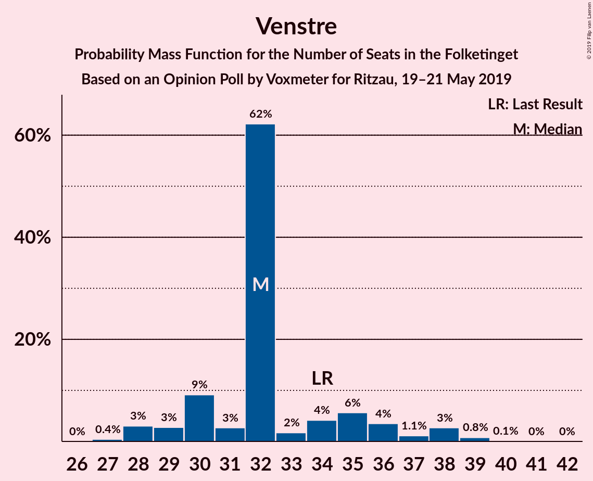

| Number of Seats | Probability | Accumulated | Special Marks |
|:---------------:|:-----------:|:-----------:|:-------------:|
| 27 | 0.4% | 100% |  |
| 28 | 3% | 99.5% |  |
| 29 | 3% | 97% |  |
| 30 | 9% | 94% |  |
| 31 | 3% | 85% |  |
| 32 | 62% | 82% | Median |
| 33 | 2% | 20% |  |
| 34 | 4% | 18% | Last Result |
| 35 | 6% | 14% |  |
| 36 | 4% | 8% |  |
| 37 | 1.1% | 5% |  |
| 38 | 3% | 4% |  |
| 39 | 0.8% | 0.9% |  |
| 40 | 0.1% | 0.2% |  |
| 41 | 0% | 0.1% |  |
| 42 | 0% | 0% |  |

### Dansk Folkeparti

*For a full overview of the results for this party, see the [Dansk Folkeparti](party-danskfolkeparti.html) page.*

| Number of Seats | Probability | Accumulated | Special Marks |
|:---------------:|:-----------:|:-----------:|:-------------:|
| 14 | 0.1% | 100% |  |
| 15 | 2% | 99.8% |  |
| 16 | 2% | 98% |  |
| 17 | 9% | 96% |  |
| 18 | 6% | 87% |  |
| 19 | 57% | 81% | Median |
| 20 | 17% | 24% |  |
| 21 | 3% | 7% |  |
| 22 | 1.3% | 4% |  |
| 23 | 2% | 3% |  |
| 24 | 0.2% | 0.6% |  |
| 25 | 0.4% | 0.4% |  |
| 26 | 0% | 0% |  |
| 27 | 0% | 0% |  |
| 28 | 0% | 0% |  |
| 29 | 0% | 0% |  |
| 30 | 0% | 0% |  |
| 31 | 0% | 0% |  |
| 32 | 0% | 0% |  |
| 33 | 0% | 0% |  |
| 34 | 0% | 0% |  |
| 35 | 0% | 0% |  |
| 36 | 0% | 0% |  |
| 37 | 0% | 0% | Last Result |

### Enhedslisten–De Rød-Grønne

*For a full overview of the results for this party, see the [Enhedslisten–De Rød-Grønne](party-enhedslisten–derød-grønne.html) page.*

| Number of Seats | Probability | Accumulated | Special Marks |
|:---------------:|:-----------:|:-----------:|:-------------:|
| 12 | 0.2% | 100% |  |
| 13 | 0.3% | 99.8% |  |
| 14 | 12% | 99.6% | Last Result |
| 15 | 2% | 87% |  |
| 16 | 5% | 85% |  |
| 17 | 14% | 80% |  |
| 18 | 4% | 66% |  |
| 19 | 5% | 63% |  |
| 20 | 54% | 57% | Median |
| 21 | 3% | 4% |  |
| 22 | 0.4% | 0.5% |  |
| 23 | 0.1% | 0.1% |  |
| 24 | 0% | 0% |  |

### Radikale Venstre

*For a full overview of the results for this party, see the [Radikale Venstre](party-radikalevenstre.html) page.*

| Number of Seats | Probability | Accumulated | Special Marks |
|:---------------:|:-----------:|:-----------:|:-------------:|
| 8 | 0% | 100% | Last Result |
| 9 | 0% | 100% |  |
| 10 | 0.1% | 100% |  |
| 11 | 2% | 99.9% |  |
| 12 | 13% | 98% |  |
| 13 | 8% | 85% |  |
| 14 | 56% | 78% | Median |
| 15 | 5% | 21% |  |
| 16 | 13% | 16% |  |
| 17 | 3% | 3% |  |
| 18 | 0.4% | 0.5% |  |
| 19 | 0.1% | 0.1% |  |
| 20 | 0% | 0% |  |

### Socialistisk Folkeparti

*For a full overview of the results for this party, see the [Socialistisk Folkeparti](party-socialistiskfolkeparti.html) page.*

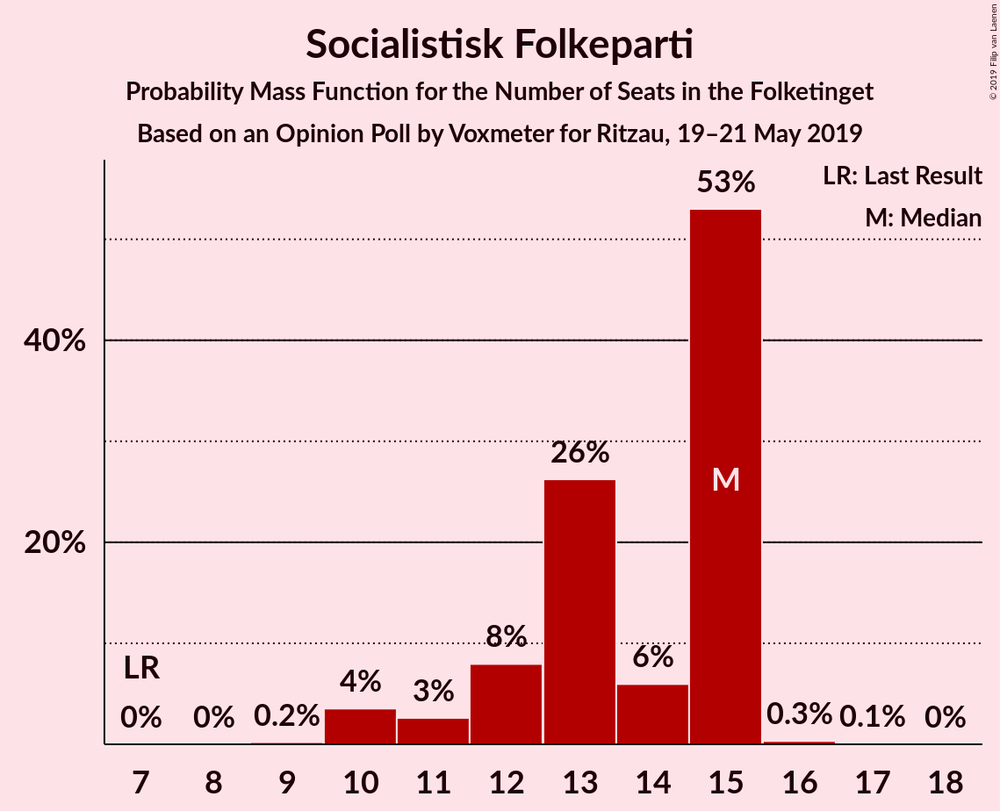

| Number of Seats | Probability | Accumulated | Special Marks |
|:---------------:|:-----------:|:-----------:|:-------------:|
| 7 | 0% | 100% | Last Result |
| 8 | 0% | 100% |  |
| 9 | 0.2% | 100% |  |
| 10 | 4% | 99.8% |  |
| 11 | 3% | 96% |  |
| 12 | 8% | 94% |  |
| 13 | 26% | 86% |  |
| 14 | 6% | 59% |  |
| 15 | 53% | 53% | Median |
| 16 | 0.3% | 0.5% |  |
| 17 | 0.1% | 0.1% |  |
| 18 | 0% | 0% |  |

### Liberal Alliance

*For a full overview of the results for this party, see the [Liberal Alliance](party-liberalalliance.html) page.*

| Number of Seats | Probability | Accumulated | Special Marks |
|:---------------:|:-----------:|:-----------:|:-------------:|
| 5 | 0.8% | 100% |  |
| 6 | 3% | 99.2% |  |
| 7 | 7% | 96% |  |
| 8 | 59% | 89% | Median |
| 9 | 25% | 30% |  |
| 10 | 4% | 5% |  |
| 11 | 1.4% | 2% |  |
| 12 | 0.1% | 0.1% |  |
| 13 | 0% | 0% | Last Result |

### Alternativet

*For a full overview of the results for this party, see the [Alternativet](party-alternativet.html) page.*

| Number of Seats | Probability | Accumulated | Special Marks |
|:---------------:|:-----------:|:-----------:|:-------------:|
| 4 | 1.0% | 100% |  |
| 5 | 1.2% | 99.0% |  |
| 6 | 9% | 98% |  |
| 7 | 6% | 89% |  |
| 8 | 67% | 83% | Median |
| 9 | 11% | 15% | Last Result |
| 10 | 4% | 4% |  |
| 11 | 0.3% | 0.3% |  |
| 12 | 0% | 0% |  |

### Det Konservative Folkeparti

*For a full overview of the results for this party, see the [Det Konservative Folkeparti](party-detkonservativefolkeparti.html) page.*

| Number of Seats | Probability | Accumulated | Special Marks |
|:---------------:|:-----------:|:-----------:|:-------------:|
| 4 | 0.8% | 100% |  |
| 5 | 56% | 99.2% | Median |
| 6 | 21% | 43% | Last Result |
| 7 | 12% | 22% |  |
| 8 | 6% | 10% |  |
| 9 | 3% | 4% |  |
| 10 | 0.4% | 0.4% |  |
| 11 | 0% | 0% |  |

### Stram Kurs

*For a full overview of the results for this party, see the [Stram Kurs](party-stramkurs.html) page.*

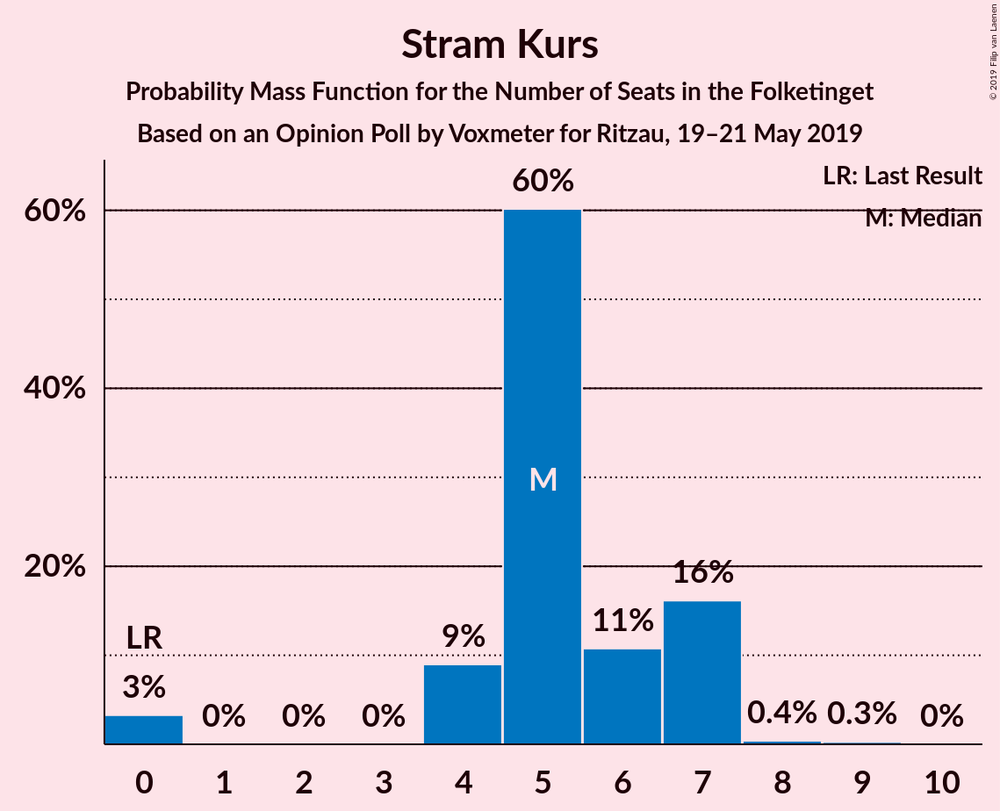

| Number of Seats | Probability | Accumulated | Special Marks |
|:---------------:|:-----------:|:-----------:|:-------------:|
| 0 | 3% | 100% | Last Result |
| 1 | 0% | 97% |  |
| 2 | 0% | 97% |  |
| 3 | 0% | 97% |  |
| 4 | 9% | 97% |  |
| 5 | 60% | 88% | Median |
| 6 | 11% | 28% |  |
| 7 | 16% | 17% |  |
| 8 | 0.4% | 0.7% |  |
| 9 | 0.3% | 0.3% |  |
| 10 | 0% | 0% |  |

### Kristendemokraterne

*For a full overview of the results for this party, see the [Kristendemokraterne](party-kristendemokraterne.html) page.*

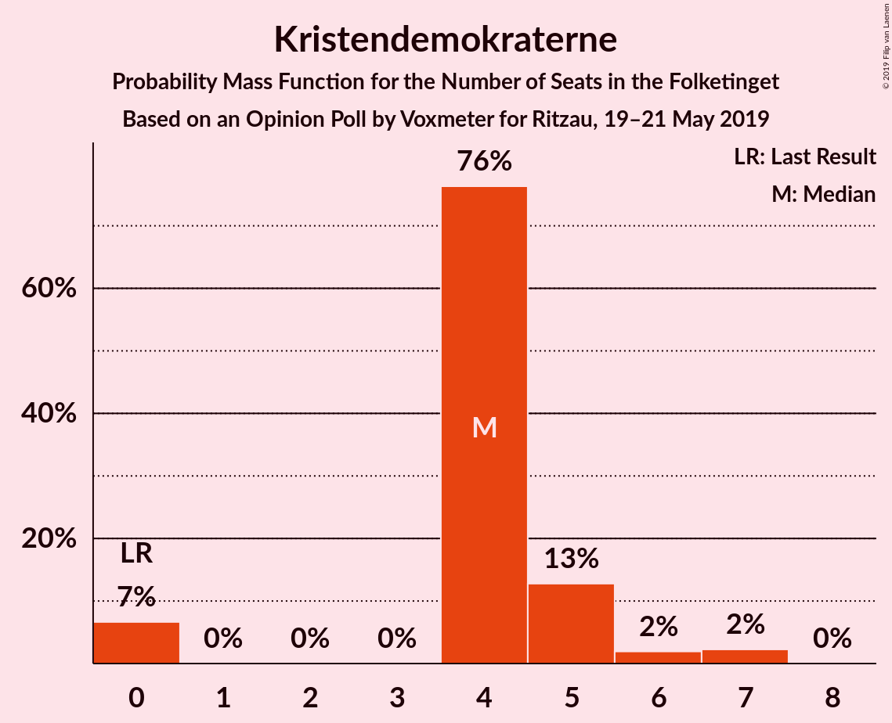

| Number of Seats | Probability | Accumulated | Special Marks |
|:---------------:|:-----------:|:-----------:|:-------------:|
| 0 | 7% | 100% | Last Result |
| 1 | 0% | 93% |  |
| 2 | 0% | 93% |  |
| 3 | 0% | 93% |  |
| 4 | 76% | 93% | Median |
| 5 | 13% | 17% |  |
| 6 | 2% | 4% |  |
| 7 | 2% | 2% |  |
| 8 | 0% | 0% |  |

### Nye Borgerlige

*For a full overview of the results for this party, see the [Nye Borgerlige](party-nyeborgerlige.html) page.*

| Number of Seats | Probability | Accumulated | Special Marks |
|:---------------:|:-----------:|:-----------:|:-------------:|
| 0 | 94% | 100% | Last Result, Median |
| 1 | 0% | 6% |  |
| 2 | 0% | 6% |  |
| 3 | 0% | 6% |  |
| 4 | 4% | 6% |  |
| 5 | 2% | 2% |  |
| 6 | 0.2% | 0.2% |  |
| 7 | 0% | 0% |  |

### Klaus Riskær Pedersen

*For a full overview of the results for this party, see the [Klaus Riskær Pedersen](party-klausriskærpedersen.html) page.*

| Number of Seats | Probability | Accumulated | Special Marks |
|:---------------:|:-----------:|:-----------:|:-------------:|
| 0 | 99.6% | 100% | Last Result, Median |
| 1 | 0% | 0.4% |  |
| 2 | 0% | 0.4% |  |
| 3 | 0% | 0.4% |  |
| 4 | 0.4% | 0.4% |  |
| 5 | 0% | 0% |  |

## Coalitions

### Confidence Intervals

| Coalition | Last Result | Median | Majority? | 80% Confidence Interval | 90% Confidence Interval | 95% Confidence Interval | 99% Confidence Interval |
|:---------:|:-----------:|:------:|:---------:|:-----------------------:|:-----------------------:|:-----------------------:|:-----------------------:|
| Socialdemokraterne – Enhedslisten–De Rød-Grønne – Radikale Venstre – Socialistisk Folkeparti – Alternativet | 85 | 102 | 99.9% | 95–102 | 93–103 | 93–104 | 91–106 |
| Socialdemokraterne – Enhedslisten–De Rød-Grønne – Radikale Venstre – Socialistisk Folkeparti | 76 | 94 | 77% | 88–94 | 86–96 | 86–97 | 83–98 |
| Socialdemokraterne – Enhedslisten–De Rød-Grønne – Socialistisk Folkeparti – Alternativet | 77 | 88 | 9% | 81–89 | 81–91 | 80–91 | 77–93 |
| Socialdemokraterne – Enhedslisten–De Rød-Grønne – Socialistisk Folkeparti | 68 | 80 | 0% | 73–82 | 73–82 | 72–82 | 70–85 |
| Venstre – Dansk Folkeparti – Liberal Alliance – Det Konservative Folkeparti – Stram Kurs – Kristendemokraterne – Nye Borgerlige – Klaus Riskær Pedersen | 90 | 73 | 0% | 73–79 | 72–81 | 71–82 | 69–84 |
| Socialdemokraterne – Radikale Venstre – Socialistisk Folkeparti | 62 | 74 | 0% | 71–77 | 70–79 | 67–79 | 67–80 |
| Venstre – Dansk Folkeparti – Liberal Alliance – Det Konservative Folkeparti – Kristendemokraterne – Nye Borgerlige – Klaus Riskær Pedersen | 90 | 68 | 0% | 68–74 | 67–76 | 65–77 | 62–79 |
| Venstre – Dansk Folkeparti – Liberal Alliance – Det Konservative Folkeparti – Kristendemokraterne – Nye Borgerlige | 90 | 68 | 0% | 68–74 | 67–76 | 65–77 | 62–79 |
| Venstre – Dansk Folkeparti – Liberal Alliance – Det Konservative Folkeparti – Kristendemokraterne | 90 | 68 | 0% | 67–73 | 67–76 | 65–76 | 62–79 |
| Venstre – Dansk Folkeparti – Liberal Alliance – Det Konservative Folkeparti – Nye Borgerlige – Klaus Riskær Pedersen | 90 | 64 | 0% | 63–69 | 63–71 | 63–73 | 61–74 |
| Venstre – Dansk Folkeparti – Liberal Alliance – Det Konservative Folkeparti – Nye Borgerlige | 90 | 64 | 0% | 63–69 | 63–71 | 63–73 | 61–74 |
| Venstre – Dansk Folkeparti – Liberal Alliance – Det Konservative Folkeparti | 90 | 64 | 0% | 63–69 | 63–69 | 62–71 | 61–74 |
| Socialdemokraterne – Radikale Venstre | 55 | 59 | 0% | 59–64 | 58–64 | 55–66 | 54–66 |
| Venstre – Liberal Alliance – Det Konservative Folkeparti | 53 | 45 | 0% | 45–50 | 44–51 | 44–53 | 43–54 |
| Venstre – Det Konservative Folkeparti | 40 | 37 | 0% | 37–42 | 35–43 | 35–45 | 34–46 |
| Venstre | 34 | 32 | 0% | 30–35 | 29–36 | 28–38 | 28–39 |

### Socialdemokraterne – Enhedslisten–De Rød-Grønne – Radikale Venstre – Socialistisk Folkeparti – Alternativet

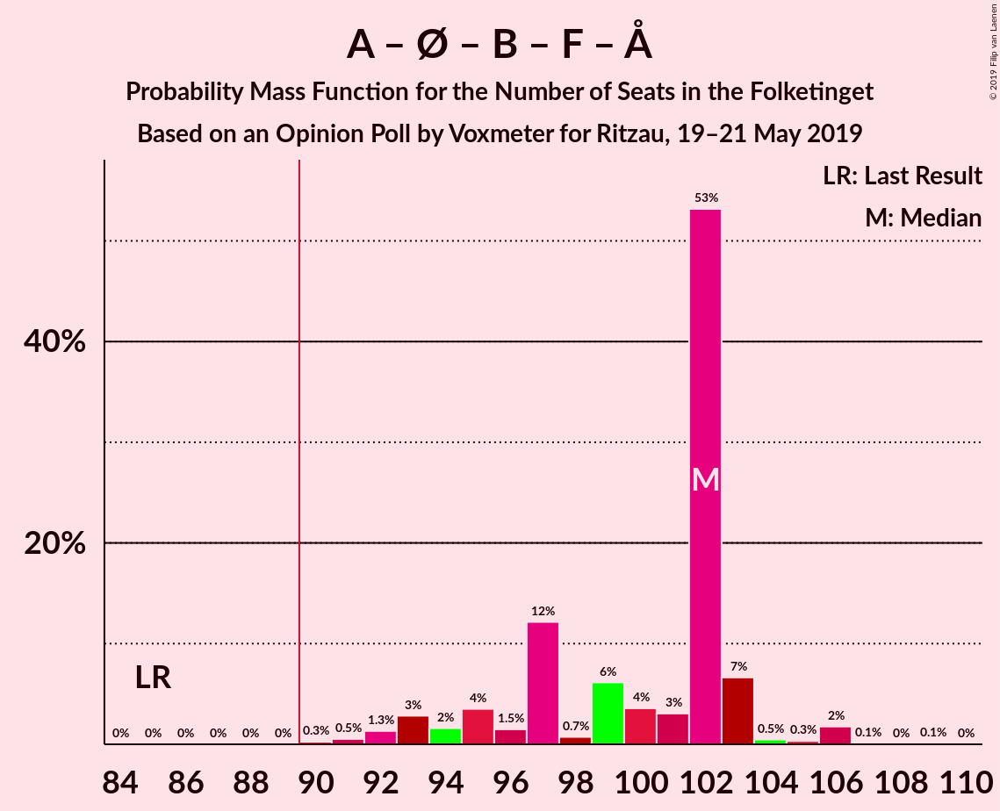

| Number of Seats | Probability | Accumulated | Special Marks |
|:---------------:|:-----------:|:-----------:|:-------------:|
| 85 | 0% | 100% | Last Result |
| 86 | 0% | 100% |  |
| 87 | 0% | 100% |  |
| 88 | 0% | 100% |  |
| 89 | 0% | 99.9% |  |
| 90 | 0.3% | 99.9% | Majority |
| 91 | 0.5% | 99.7% |  |
| 92 | 1.3% | 99.1% |  |
| 93 | 3% | 98% |  |
| 94 | 2% | 95% |  |
| 95 | 4% | 93% |  |
| 96 | 1.5% | 90% |  |
| 97 | 12% | 88% |  |
| 98 | 0.7% | 76% |  |
| 99 | 6% | 75% |  |
| 100 | 4% | 69% |  |
| 101 | 3% | 66% |  |
| 102 | 53% | 63% | Median |
| 103 | 7% | 9% |  |
| 104 | 0.5% | 3% |  |
| 105 | 0.3% | 2% |  |
| 106 | 2% | 2% |  |
| 107 | 0.1% | 0.3% |  |
| 108 | 0% | 0.2% |  |
| 109 | 0.1% | 0.1% |  |
| 110 | 0% | 0% |  |

### Socialdemokraterne – Enhedslisten–De Rød-Grønne – Radikale Venstre – Socialistisk Folkeparti

| Number of Seats | Probability | Accumulated | Special Marks |
|:---------------:|:-----------:|:-----------:|:-------------:|
| 76 | 0% | 100% | Last Result |
| 77 | 0% | 100% |  |
| 78 | 0% | 100% |  |
| 79 | 0% | 100% |  |
| 80 | 0% | 100% |  |
| 81 | 0% | 100% |  |
| 82 | 0.2% | 100% |  |
| 83 | 0.4% | 99.8% |  |
| 84 | 0.2% | 99.4% |  |
| 85 | 0.8% | 99.3% |  |
| 86 | 5% | 98% |  |
| 87 | 0.9% | 93% |  |
| 88 | 2% | 92% |  |
| 89 | 13% | 90% |  |
| 90 | 2% | 77% | Majority |
| 91 | 6% | 75% |  |
| 92 | 2% | 69% |  |
| 93 | 2% | 67% |  |
| 94 | 58% | 65% | Median |
| 95 | 1.3% | 7% |  |
| 96 | 3% | 5% |  |
| 97 | 0.3% | 3% |  |
| 98 | 2% | 2% |  |
| 99 | 0% | 0.2% |  |
| 100 | 0% | 0.2% |  |
| 101 | 0% | 0.2% |  |
| 102 | 0.1% | 0.1% |  |
| 103 | 0.1% | 0.1% |  |
| 104 | 0% | 0% |  |

### Socialdemokraterne – Enhedslisten–De Rød-Grønne – Socialistisk Folkeparti – Alternativet

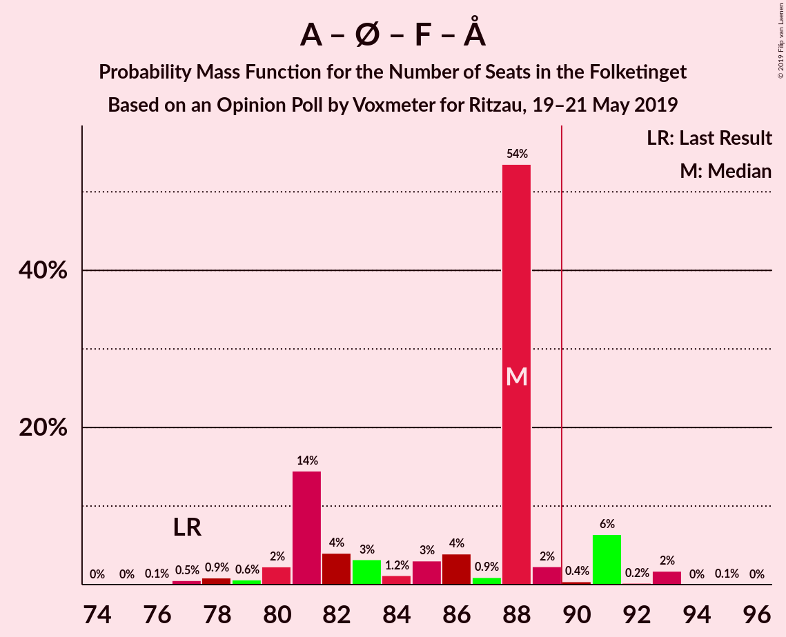

| Number of Seats | Probability | Accumulated | Special Marks |
|:---------------:|:-----------:|:-----------:|:-------------:|
| 76 | 0.1% | 100% |  |
| 77 | 0.5% | 99.8% | Last Result |
| 78 | 0.9% | 99.3% |  |
| 79 | 0.6% | 98% |  |
| 80 | 2% | 98% |  |
| 81 | 14% | 95% |  |
| 82 | 4% | 81% |  |
| 83 | 3% | 77% |  |
| 84 | 1.2% | 74% |  |
| 85 | 3% | 73% |  |
| 86 | 4% | 70% |  |
| 87 | 0.9% | 66% |  |
| 88 | 54% | 65% | Median |
| 89 | 2% | 11% |  |
| 90 | 0.4% | 9% | Majority |
| 91 | 6% | 8% |  |
| 92 | 0.2% | 2% |  |
| 93 | 2% | 2% |  |
| 94 | 0% | 0.1% |  |
| 95 | 0.1% | 0.1% |  |
| 96 | 0% | 0% |  |

### Socialdemokraterne – Enhedslisten–De Rød-Grønne – Socialistisk Folkeparti

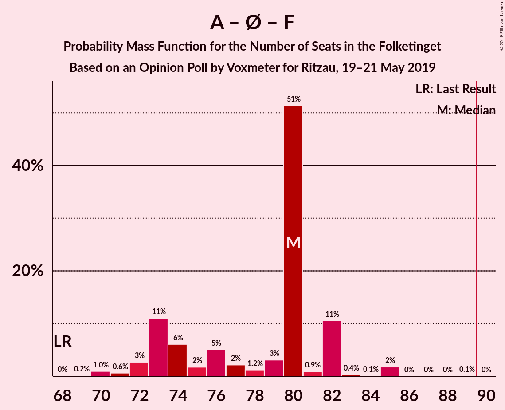

| Number of Seats | Probability | Accumulated | Special Marks |
|:---------------:|:-----------:|:-----------:|:-------------:|
| 68 | 0% | 100% | Last Result |
| 69 | 0.2% | 99.9% |  |
| 70 | 1.0% | 99.8% |  |
| 71 | 0.6% | 98.8% |  |
| 72 | 3% | 98% |  |
| 73 | 11% | 96% |  |
| 74 | 6% | 84% |  |
| 75 | 2% | 78% |  |
| 76 | 5% | 77% |  |
| 77 | 2% | 72% |  |
| 78 | 1.2% | 69% |  |
| 79 | 3% | 68% |  |
| 80 | 51% | 65% | Median |
| 81 | 0.9% | 14% |  |
| 82 | 11% | 13% |  |
| 83 | 0.4% | 2% |  |
| 84 | 0.1% | 2% |  |
| 85 | 2% | 2% |  |
| 86 | 0% | 0.1% |  |
| 87 | 0% | 0.1% |  |
| 88 | 0% | 0.1% |  |
| 89 | 0.1% | 0.1% |  |
| 90 | 0% | 0% | Majority |

### Venstre – Dansk Folkeparti – Liberal Alliance – Det Konservative Folkeparti – Stram Kurs – Kristendemokraterne – Nye Borgerlige – Klaus Riskær Pedersen

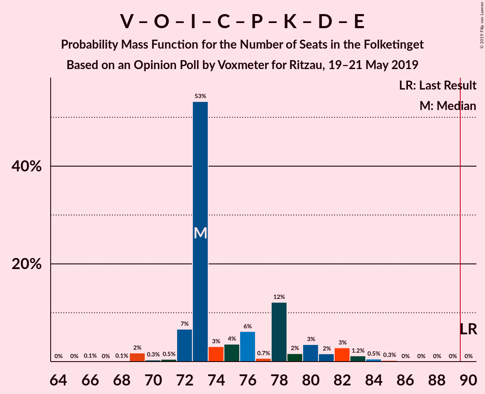

| Number of Seats | Probability | Accumulated | Special Marks |
|:---------------:|:-----------:|:-----------:|:-------------:|
| 66 | 0.1% | 100% |  |
| 67 | 0% | 99.9% |  |
| 68 | 0.1% | 99.8% |  |
| 69 | 2% | 99.7% |  |
| 70 | 0.3% | 98% |  |
| 71 | 0.5% | 98% |  |
| 72 | 7% | 97% |  |
| 73 | 53% | 91% | Median |
| 74 | 3% | 37% |  |
| 75 | 4% | 34% |  |
| 76 | 6% | 31% |  |
| 77 | 0.7% | 24% |  |
| 78 | 12% | 24% |  |
| 79 | 2% | 12% |  |
| 80 | 3% | 10% |  |
| 81 | 2% | 6% |  |
| 82 | 3% | 5% |  |
| 83 | 1.2% | 2% |  |
| 84 | 0.5% | 0.9% |  |
| 85 | 0.3% | 0.3% |  |
| 86 | 0% | 0.1% |  |
| 87 | 0% | 0.1% |  |
| 88 | 0% | 0% |  |
| 89 | 0% | 0% |  |
| 90 | 0% | 0% | Last Result, Majority |

### Socialdemokraterne – Radikale Venstre – Socialistisk Folkeparti

| Number of Seats | Probability | Accumulated | Special Marks |
|:---------------:|:-----------:|:-----------:|:-------------:|
| 62 | 0% | 100% | Last Result |
| 63 | 0% | 100% |  |
| 64 | 0% | 100% |  |
| 65 | 0% | 100% |  |
| 66 | 0.2% | 99.9% |  |
| 67 | 2% | 99.8% |  |
| 68 | 0.3% | 97% |  |
| 69 | 0.8% | 97% |  |
| 70 | 4% | 96% |  |
| 71 | 4% | 93% |  |
| 72 | 4% | 88% |  |
| 73 | 8% | 84% |  |
| 74 | 50% | 76% | Median |
| 75 | 12% | 26% |  |
| 76 | 0.6% | 14% |  |
| 77 | 7% | 13% |  |
| 78 | 1.4% | 7% |  |
| 79 | 5% | 5% |  |
| 80 | 0.2% | 0.6% |  |
| 81 | 0.2% | 0.4% |  |
| 82 | 0.1% | 0.2% |  |
| 83 | 0% | 0.2% |  |
| 84 | 0.1% | 0.1% |  |
| 85 | 0.1% | 0.1% |  |
| 86 | 0% | 0% |  |

### Venstre – Dansk Folkeparti – Liberal Alliance – Det Konservative Folkeparti – Kristendemokraterne – Nye Borgerlige – Klaus Riskær Pedersen

| Number of Seats | Probability | Accumulated | Special Marks |
|:---------------:|:-----------:|:-----------:|:-------------:|
| 60 | 0.1% | 100% |  |
| 61 | 0% | 99.9% |  |
| 62 | 2% | 99.9% |  |
| 63 | 0.2% | 98% |  |
| 64 | 0% | 98% |  |
| 65 | 0.6% | 98% |  |
| 66 | 0.4% | 97% |  |
| 67 | 7% | 97% |  |
| 68 | 51% | 90% | Median |
| 69 | 6% | 40% |  |
| 70 | 4% | 34% |  |
| 71 | 11% | 30% |  |
| 72 | 5% | 19% |  |
| 73 | 4% | 15% |  |
| 74 | 2% | 11% |  |
| 75 | 1.2% | 9% |  |
| 76 | 5% | 8% |  |
| 77 | 1.3% | 3% |  |
| 78 | 0.9% | 2% |  |
| 79 | 0.3% | 0.8% |  |
| 80 | 0.4% | 0.5% |  |
| 81 | 0% | 0% |  |
| 82 | 0% | 0% |  |
| 83 | 0% | 0% |  |
| 84 | 0% | 0% |  |
| 85 | 0% | 0% |  |
| 86 | 0% | 0% |  |
| 87 | 0% | 0% |  |
| 88 | 0% | 0% |  |
| 89 | 0% | 0% |  |
| 90 | 0% | 0% | Last Result, Majority |

### Venstre – Dansk Folkeparti – Liberal Alliance – Det Konservative Folkeparti – Kristendemokraterne – Nye Borgerlige

| Number of Seats | Probability | Accumulated | Special Marks |
|:---------------:|:-----------:|:-----------:|:-------------:|
| 60 | 0.1% | 100% |  |
| 61 | 0% | 99.9% |  |
| 62 | 2% | 99.9% |  |
| 63 | 0.2% | 98% |  |
| 64 | 0.1% | 98% |  |
| 65 | 0.6% | 98% |  |
| 66 | 0.4% | 97% |  |
| 67 | 7% | 97% |  |
| 68 | 51% | 90% | Median |
| 69 | 6% | 40% |  |
| 70 | 4% | 34% |  |
| 71 | 11% | 30% |  |
| 72 | 5% | 19% |  |
| 73 | 4% | 15% |  |
| 74 | 2% | 11% |  |
| 75 | 1.2% | 9% |  |
| 76 | 5% | 7% |  |
| 77 | 1.3% | 3% |  |
| 78 | 0.9% | 2% |  |
| 79 | 0.3% | 0.7% |  |
| 80 | 0.3% | 0.4% |  |
| 81 | 0% | 0% |  |
| 82 | 0% | 0% |  |
| 83 | 0% | 0% |  |
| 84 | 0% | 0% |  |
| 85 | 0% | 0% |  |
| 86 | 0% | 0% |  |
| 87 | 0% | 0% |  |
| 88 | 0% | 0% |  |
| 89 | 0% | 0% |  |
| 90 | 0% | 0% | Last Result, Majority |

### Venstre – Dansk Folkeparti – Liberal Alliance – Det Konservative Folkeparti – Kristendemokraterne

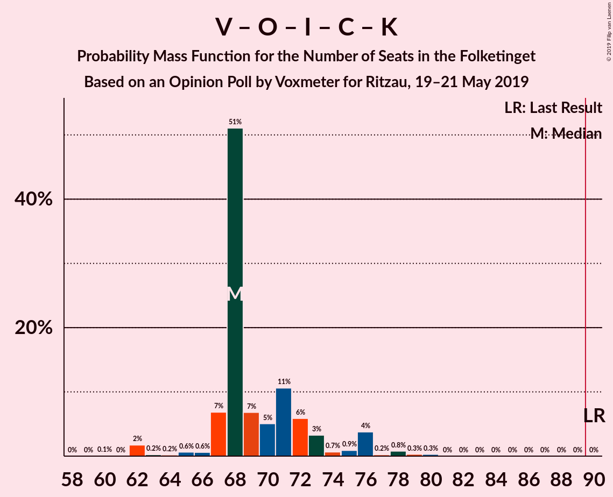

| Number of Seats | Probability | Accumulated | Special Marks |
|:---------------:|:-----------:|:-----------:|:-------------:|
| 60 | 0.1% | 100% |  |
| 61 | 0% | 99.9% |  |
| 62 | 2% | 99.9% |  |
| 63 | 0.2% | 98% |  |
| 64 | 0.2% | 98% |  |
| 65 | 0.6% | 98% |  |
| 66 | 0.6% | 97% |  |
| 67 | 7% | 96% |  |
| 68 | 51% | 90% | Median |
| 69 | 7% | 39% |  |
| 70 | 5% | 32% |  |
| 71 | 11% | 27% |  |
| 72 | 6% | 16% |  |
| 73 | 3% | 10% |  |
| 74 | 0.7% | 7% |  |
| 75 | 0.9% | 6% |  |
| 76 | 4% | 5% |  |
| 77 | 0.2% | 2% |  |
| 78 | 0.8% | 1.4% |  |
| 79 | 0.3% | 0.6% |  |
| 80 | 0.3% | 0.3% |  |
| 81 | 0% | 0% |  |
| 82 | 0% | 0% |  |
| 83 | 0% | 0% |  |
| 84 | 0% | 0% |  |
| 85 | 0% | 0% |  |
| 86 | 0% | 0% |  |
| 87 | 0% | 0% |  |
| 88 | 0% | 0% |  |
| 89 | 0% | 0% |  |
| 90 | 0% | 0% | Last Result, Majority |

### Venstre – Dansk Folkeparti – Liberal Alliance – Det Konservative Folkeparti – Nye Borgerlige – Klaus Riskær Pedersen

| Number of Seats | Probability | Accumulated | Special Marks |
|:---------------:|:-----------:|:-----------:|:-------------:|
| 56 | 0.1% | 100% |  |
| 57 | 0% | 99.9% |  |
| 58 | 0% | 99.9% |  |
| 59 | 0.1% | 99.9% |  |
| 60 | 0% | 99.8% |  |
| 61 | 0.3% | 99.8% |  |
| 62 | 2% | 99.5% |  |
| 63 | 8% | 98% |  |
| 64 | 49% | 90% | Median |
| 65 | 7% | 40% |  |
| 66 | 0.9% | 33% |  |
| 67 | 13% | 33% |  |
| 68 | 5% | 20% |  |
| 69 | 6% | 15% |  |
| 70 | 2% | 9% |  |
| 71 | 3% | 7% |  |
| 72 | 1.2% | 4% |  |
| 73 | 2% | 3% |  |
| 74 | 0.9% | 1.3% |  |
| 75 | 0.1% | 0.4% |  |
| 76 | 0.2% | 0.4% |  |
| 77 | 0.2% | 0.2% |  |
| 78 | 0% | 0% |  |
| 79 | 0% | 0% |  |
| 80 | 0% | 0% |  |
| 81 | 0% | 0% |  |
| 82 | 0% | 0% |  |
| 83 | 0% | 0% |  |
| 84 | 0% | 0% |  |
| 85 | 0% | 0% |  |
| 86 | 0% | 0% |  |
| 87 | 0% | 0% |  |
| 88 | 0% | 0% |  |
| 89 | 0% | 0% |  |
| 90 | 0% | 0% | Last Result, Majority |

### Venstre – Dansk Folkeparti – Liberal Alliance – Det Konservative Folkeparti – Nye Borgerlige

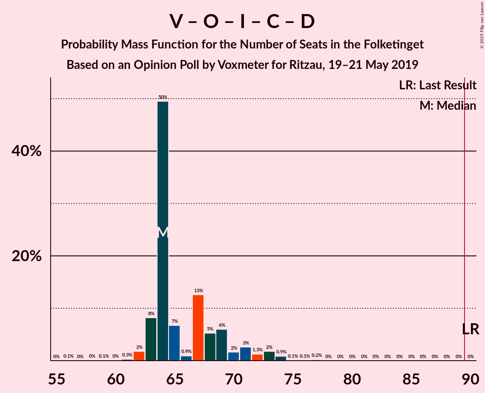

| Number of Seats | Probability | Accumulated | Special Marks |
|:---------------:|:-----------:|:-----------:|:-------------:|
| 56 | 0.1% | 100% |  |
| 57 | 0% | 99.9% |  |
| 58 | 0% | 99.9% |  |
| 59 | 0.1% | 99.9% |  |
| 60 | 0% | 99.8% |  |
| 61 | 0.3% | 99.8% |  |
| 62 | 2% | 99.5% |  |
| 63 | 8% | 98% |  |
| 64 | 50% | 90% | Median |
| 65 | 7% | 40% |  |
| 66 | 0.9% | 33% |  |
| 67 | 13% | 32% |  |
| 68 | 5% | 20% |  |
| 69 | 6% | 14% |  |
| 70 | 2% | 8% |  |
| 71 | 3% | 7% |  |
| 72 | 1.3% | 4% |  |
| 73 | 2% | 3% |  |
| 74 | 0.9% | 1.2% |  |
| 75 | 0.1% | 0.3% |  |
| 76 | 0.1% | 0.3% |  |
| 77 | 0.2% | 0.2% |  |
| 78 | 0% | 0% |  |
| 79 | 0% | 0% |  |
| 80 | 0% | 0% |  |
| 81 | 0% | 0% |  |
| 82 | 0% | 0% |  |
| 83 | 0% | 0% |  |
| 84 | 0% | 0% |  |
| 85 | 0% | 0% |  |
| 86 | 0% | 0% |  |
| 87 | 0% | 0% |  |
| 88 | 0% | 0% |  |
| 89 | 0% | 0% |  |
| 90 | 0% | 0% | Last Result, Majority |

### Venstre – Dansk Folkeparti – Liberal Alliance – Det Konservative Folkeparti

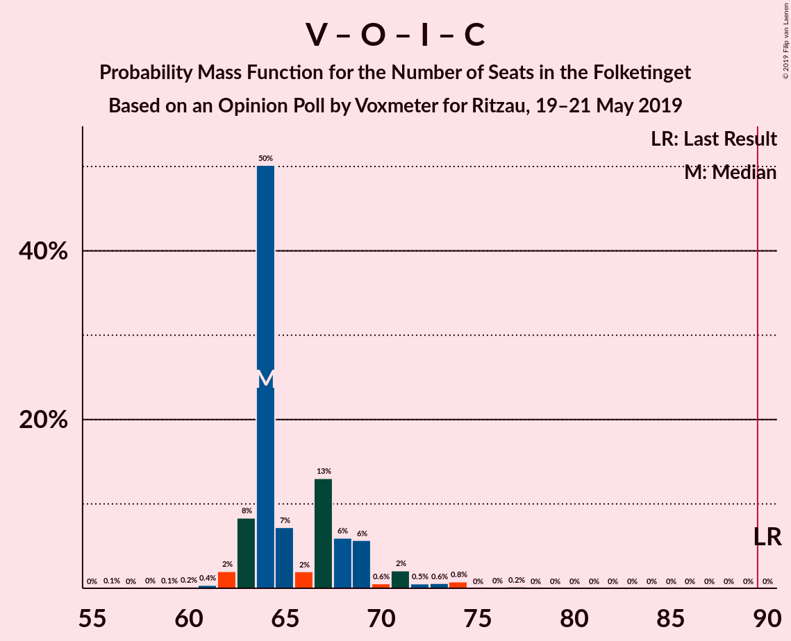

| Number of Seats | Probability | Accumulated | Special Marks |
|:---------------:|:-----------:|:-----------:|:-------------:|
| 56 | 0.1% | 100% |  |
| 57 | 0% | 99.9% |  |
| 58 | 0% | 99.9% |  |
| 59 | 0.1% | 99.9% |  |
| 60 | 0.2% | 99.8% |  |
| 61 | 0.4% | 99.6% |  |
| 62 | 2% | 99.2% |  |
| 63 | 8% | 97% |  |
| 64 | 50% | 89% | Median |
| 65 | 7% | 39% |  |
| 66 | 2% | 31% |  |
| 67 | 13% | 30% |  |
| 68 | 6% | 16% |  |
| 69 | 6% | 11% |  |
| 70 | 0.6% | 5% |  |
| 71 | 2% | 4% |  |
| 72 | 0.5% | 2% |  |
| 73 | 0.6% | 2% |  |
| 74 | 0.8% | 1.0% |  |
| 75 | 0% | 0.2% |  |
| 76 | 0% | 0.2% |  |
| 77 | 0.2% | 0.2% |  |
| 78 | 0% | 0% |  |
| 79 | 0% | 0% |  |
| 80 | 0% | 0% |  |
| 81 | 0% | 0% |  |
| 82 | 0% | 0% |  |
| 83 | 0% | 0% |  |
| 84 | 0% | 0% |  |
| 85 | 0% | 0% |  |
| 86 | 0% | 0% |  |
| 87 | 0% | 0% |  |
| 88 | 0% | 0% |  |
| 89 | 0% | 0% |  |
| 90 | 0% | 0% | Last Result, Majority |

### Socialdemokraterne – Radikale Venstre

| Number of Seats | Probability | Accumulated | Special Marks |
|:---------------:|:-----------:|:-----------:|:-------------:|
| 52 | 0% | 100% |  |
| 53 | 0.3% | 99.9% |  |
| 54 | 2% | 99.7% |  |
| 55 | 0.3% | 98% | Last Result |
| 56 | 0.3% | 97% |  |
| 57 | 2% | 97% |  |
| 58 | 3% | 95% |  |
| 59 | 57% | 92% | Median |
| 60 | 5% | 36% |  |
| 61 | 5% | 31% |  |
| 62 | 11% | 26% |  |
| 63 | 0.8% | 15% |  |
| 64 | 10% | 14% |  |
| 65 | 0.3% | 4% |  |
| 66 | 3% | 4% |  |
| 67 | 0.1% | 0.4% |  |
| 68 | 0.1% | 0.3% |  |
| 69 | 0.1% | 0.2% |  |
| 70 | 0% | 0.1% |  |
| 71 | 0.1% | 0.1% |  |
| 72 | 0% | 0% |  |

### Venstre – Liberal Alliance – Det Konservative Folkeparti

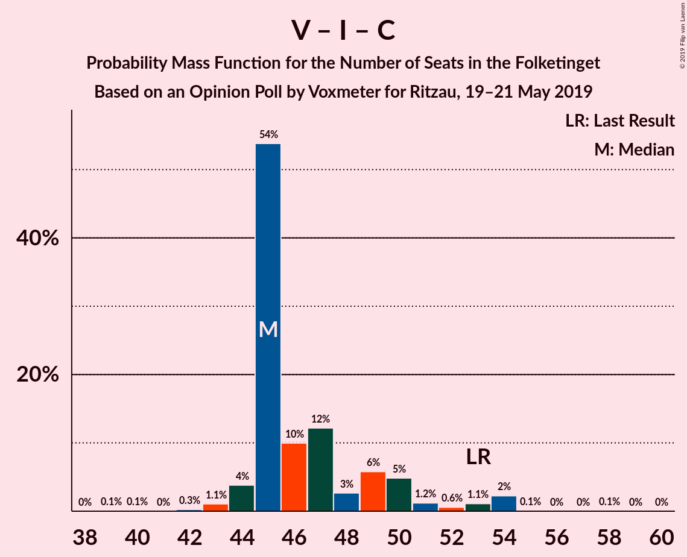

| Number of Seats | Probability | Accumulated | Special Marks |
|:---------------:|:-----------:|:-----------:|:-------------:|
| 39 | 0.1% | 100% |  |
| 40 | 0.1% | 99.9% |  |
| 41 | 0% | 99.8% |  |
| 42 | 0.3% | 99.8% |  |
| 43 | 1.1% | 99.5% |  |
| 44 | 4% | 98% |  |
| 45 | 54% | 95% | Median |
| 46 | 10% | 41% |  |
| 47 | 12% | 31% |  |
| 48 | 3% | 19% |  |
| 49 | 6% | 16% |  |
| 50 | 5% | 10% |  |
| 51 | 1.2% | 5% |  |
| 52 | 0.6% | 4% |  |
| 53 | 1.1% | 4% | Last Result |
| 54 | 2% | 2% |  |
| 55 | 0.1% | 0.2% |  |
| 56 | 0% | 0.1% |  |
| 57 | 0% | 0.1% |  |
| 58 | 0.1% | 0.1% |  |
| 59 | 0% | 0% |  |

### Venstre – Det Konservative Folkeparti

| Number of Seats | Probability | Accumulated | Special Marks |
|:---------------:|:-----------:|:-----------:|:-------------:|
| 33 | 0.5% | 100% |  |
| 34 | 0.3% | 99.5% |  |
| 35 | 5% | 99.2% |  |
| 36 | 0.9% | 95% |  |
| 37 | 58% | 94% | Median |
| 38 | 12% | 36% |  |
| 39 | 6% | 24% |  |
| 40 | 5% | 18% | Last Result |
| 41 | 2% | 13% |  |
| 42 | 4% | 11% |  |
| 43 | 3% | 7% |  |
| 44 | 1.0% | 4% |  |
| 45 | 0.7% | 3% |  |
| 46 | 2% | 2% |  |
| 47 | 0.1% | 0.2% |  |
| 48 | 0.1% | 0.1% |  |
| 49 | 0% | 0% |  |

### Venstre

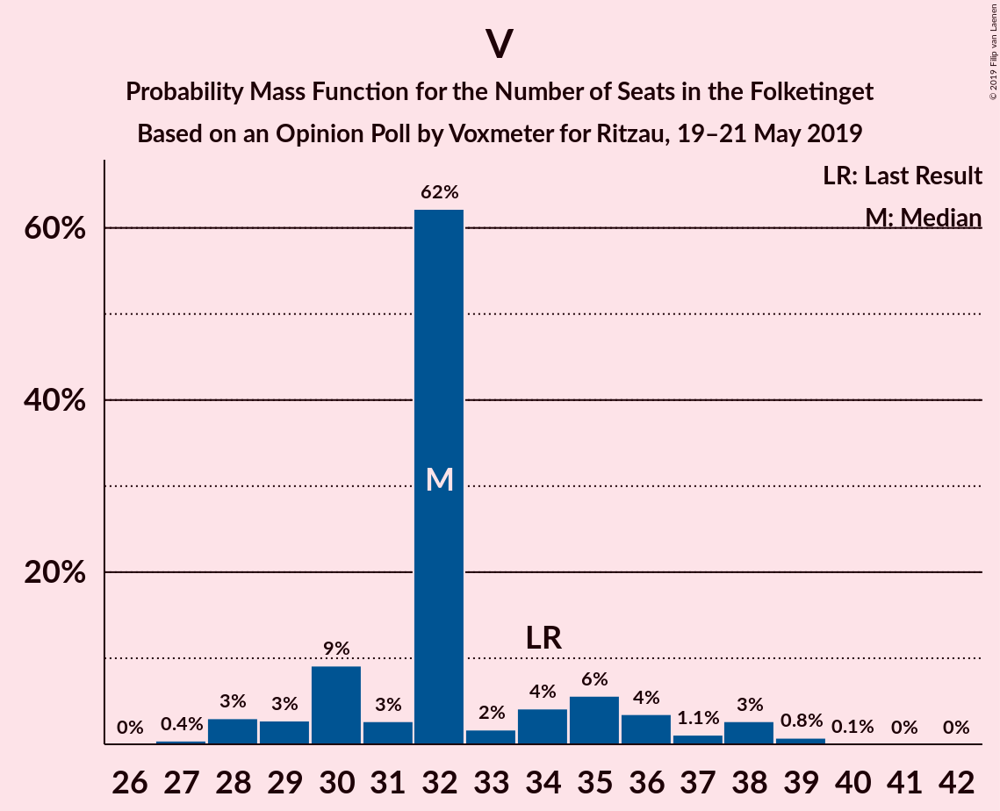

| Number of Seats | Probability | Accumulated | Special Marks |
|:---------------:|:-----------:|:-----------:|:-------------:|
| 27 | 0.4% | 100% |  |
| 28 | 3% | 99.5% |  |
| 29 | 3% | 97% |  |
| 30 | 9% | 94% |  |
| 31 | 3% | 85% |  |
| 32 | 62% | 82% | Median |
| 33 | 2% | 20% |  |
| 34 | 4% | 18% | Last Result |
| 35 | 6% | 14% |  |
| 36 | 4% | 8% |  |
| 37 | 1.1% | 5% |  |
| 38 | 3% | 4% |  |
| 39 | 0.8% | 0.9% |  |
| 40 | 0.1% | 0.2% |  |
| 41 | 0% | 0.1% |  |
| 42 | 0% | 0% |  |

## Technical Information

### Opinion Poll

+ **Polling firm:** Voxmeter
+ **Commissioner(s):** Ritzau
+ **Fieldwork period:** 19–21 May 2019

### Calculations

+ **Sample size:** 1002
+ **Simulations done:** 1,048,576
+ **Error estimate:** 3.14%

