# Opinion Poll by Greens Analyseinstitut for Børsen, 22 May 2019

<a href="#voting-intentions">Voting Intentions</a> | <a href="#seats">Seats</a> | <a href="#coalitions">Coalitions</a> | <a href="#technical-information">Technical Information</a>

## Voting Intentions

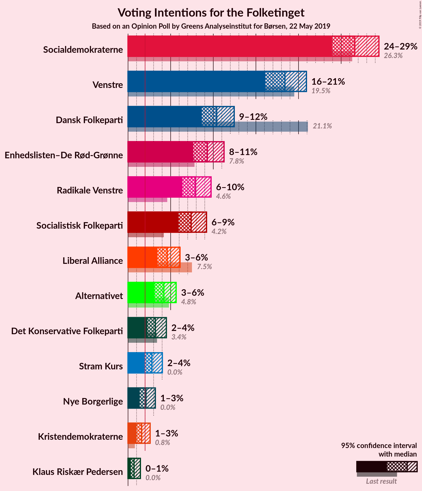

### Confidence Intervals

| Party | Last Result | Poll Result | 80% Confidence Interval | 90% Confidence Interval | 95% Confidence Interval | 99% Confidence Interval |
|:-----:|:-----------:|:-----------:|:-----------------------:|:-----------------------:|:-----------------------:|:-----------------------:|
| Socialdemokraterne | 26.3% | 26.6% | 24.9–28.5% |24.4–29.0% |23.9–29.4% |23.1–30.3% |
| Venstre | 19.5% | 18.4% | 16.9–20.1% |16.5–20.5% |16.1–20.9% |15.4–21.7% |
| Dansk Folkeparti | 21.1% | 10.4% | 9.3–11.7% |8.9–12.1% |8.7–12.5% |8.1–13.1% |
| Enhedslisten–De Rød-Grønne | 7.8% | 9.3% | 8.2–10.6% |7.9–10.9% |7.7–11.3% |7.2–11.9% |
| Radikale Venstre | 4.6% | 7.9% | 6.9–9.1% |6.6–9.4% |6.4–9.7% |5.9–10.3% |
| Socialistisk Folkeparti | 4.2% | 7.4% | 6.4–8.6% |6.2–8.9% |5.9–9.2% |5.5–9.8% |
| Liberal Alliance | 7.5% | 4.6% | 3.9–5.6% |3.6–5.9% |3.5–6.1% |3.1–6.6% |
| Alternativet | 4.8% | 4.2% | 3.5–5.1% |3.3–5.4% |3.1–5.6% |2.8–6.1% |
| Det Konservative Folkeparti | 3.4% | 3.2% | 2.6–4.0% |2.4–4.3% |2.3–4.5% |2.0–4.9% |
| Stram Kurs | 0.0% | 2.8% | 2.2–3.6% |2.1–3.8% |1.9–4.0% |1.7–4.4% |
| Nye Borgerlige | 0.0% | 2.1% | 1.6–2.8% |1.5–3.0% |1.4–3.2% |1.2–3.6% |
| Kristendemokraterne | 0.8% | 1.6% | 1.2–2.2% |1.1–2.4% |1.0–2.6% |0.8–2.9% |
| Klaus Riskær Pedersen | 0.0% | 0.7% | 0.5–1.2% |0.4–1.3% |0.3–1.4% |0.2–1.7% |

*Note:* The poll result column reflects the actual value used in the calculations. Published results may vary slightly, and in addition be rounded to fewer digits.

## Seats

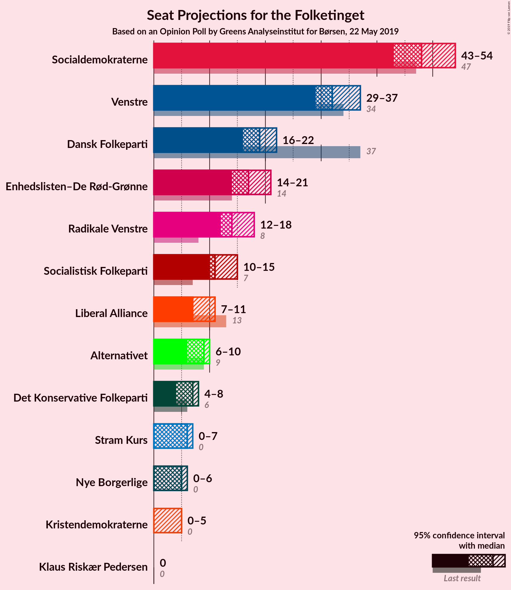

### Confidence Intervals

| Party | Last Result | Median | 80% Confidence Interval | 90% Confidence Interval | 95% Confidence Interval | 99% Confidence Interval |
|:-----:|:-----------:|:------:|:-----------------------:|:-----------------------:|:-----------------------:|:-----------------------:|
| <a href="#socialdemokraterne">Socialdemokraterne</a> | 47 | 48 | 46–50 |44–52 |43–54 |42–55 |
| <a href="#venstre">Venstre</a> | 34 | 32 | 30–35 |29–36 |29–37 |26–39 |
| <a href="#dansk-folkeparti">Dansk Folkeparti</a> | 37 | 19 | 18–19 |16–21 |16–22 |14–23 |
| <a href="#enhedslisten–de-rød-grønne">Enhedslisten–De Rød-Grønne</a> | 14 | 17 | 14–19 |14–20 |14–21 |13–21 |
| <a href="#radikale-venstre">Radikale Venstre</a> | 8 | 14 | 13–15 |12–16 |12–18 |10–18 |
| <a href="#socialistisk-folkeparti">Socialistisk Folkeparti</a> | 7 | 11 | 11–14 |11–15 |10–15 |10–16 |
| <a href="#liberal-alliance">Liberal Alliance</a> | 13 | 7 | 7–9 |7–10 |7–11 |6–11 |
| <a href="#alternativet">Alternativet</a> | 9 | 9 | 7–9 |6–10 |6–10 |5–10 |
| <a href="#det-konservative-folkeparti">Det Konservative Folkeparti</a> | 6 | 7 | 5–7 |5–8 |4–8 |4–8 |
| <a href="#stram-kurs">Stram Kurs</a> | 0 | 6 | 4–6 |4–6 |0–7 |0–8 |
| <a href="#nye-borgerlige">Nye Borgerlige</a> | 0 | 5 | 0–5 |0–6 |0–6 |0–6 |
| <a href="#kristendemokraterne">Kristendemokraterne</a> | 0 | 0 | 0–4 |0–4 |0–5 |0–5 |
| <a href="#klaus-riskær-pedersen">Klaus Riskær Pedersen</a> | 0 | 0 | 0 |0 |0 |0 |

### Socialdemokraterne

*For a full overview of the results for this party, see the [Socialdemokraterne](party-socialdemokraterne.html) page.*

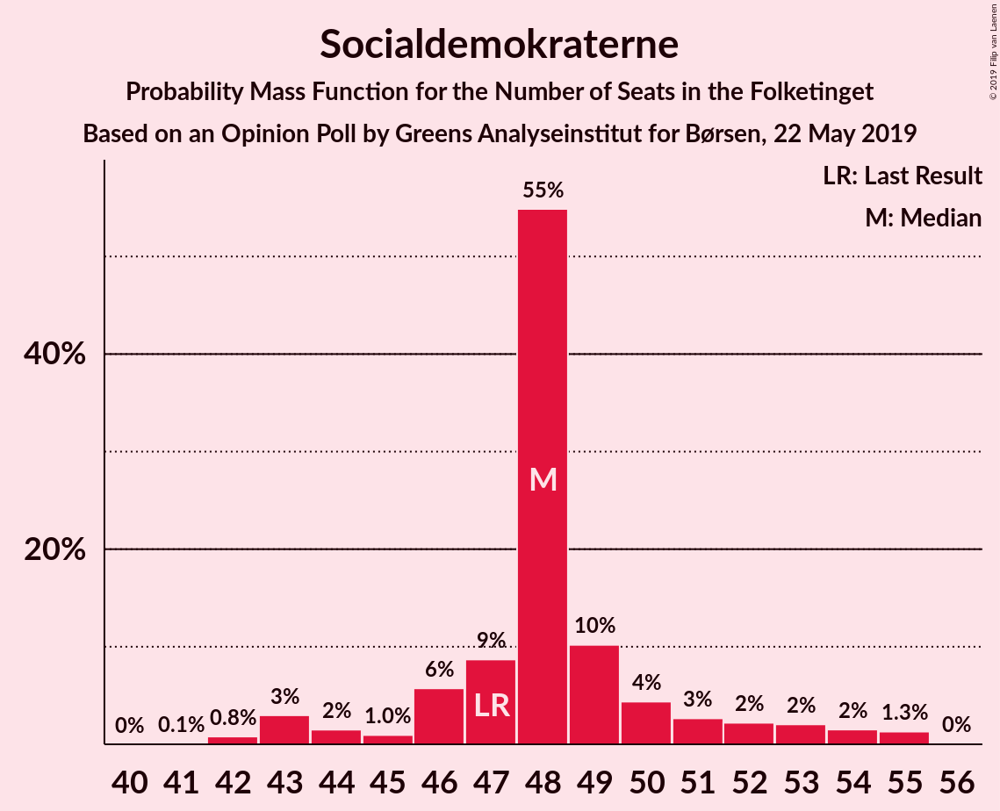

| Number of Seats | Probability | Accumulated | Special Marks |
|:---------------:|:-----------:|:-----------:|:-------------:|
| 41 | 0.1% | 100% |  |
| 42 | 0.8% | 99.9% |  |
| 43 | 3% | 99.1% |  |
| 44 | 2% | 96% |  |
| 45 | 1.0% | 95% |  |
| 46 | 6% | 94% |  |
| 47 | 9% | 88% | Last Result |
| 48 | 55% | 79% | Median |
| 49 | 10% | 24% |  |
| 50 | 4% | 14% |  |
| 51 | 3% | 10% |  |
| 52 | 2% | 7% |  |
| 53 | 2% | 5% |  |
| 54 | 2% | 3% |  |
| 55 | 1.3% | 1.3% |  |
| 56 | 0% | 0% |  |

### Venstre

*For a full overview of the results for this party, see the [Venstre](party-venstre.html) page.*

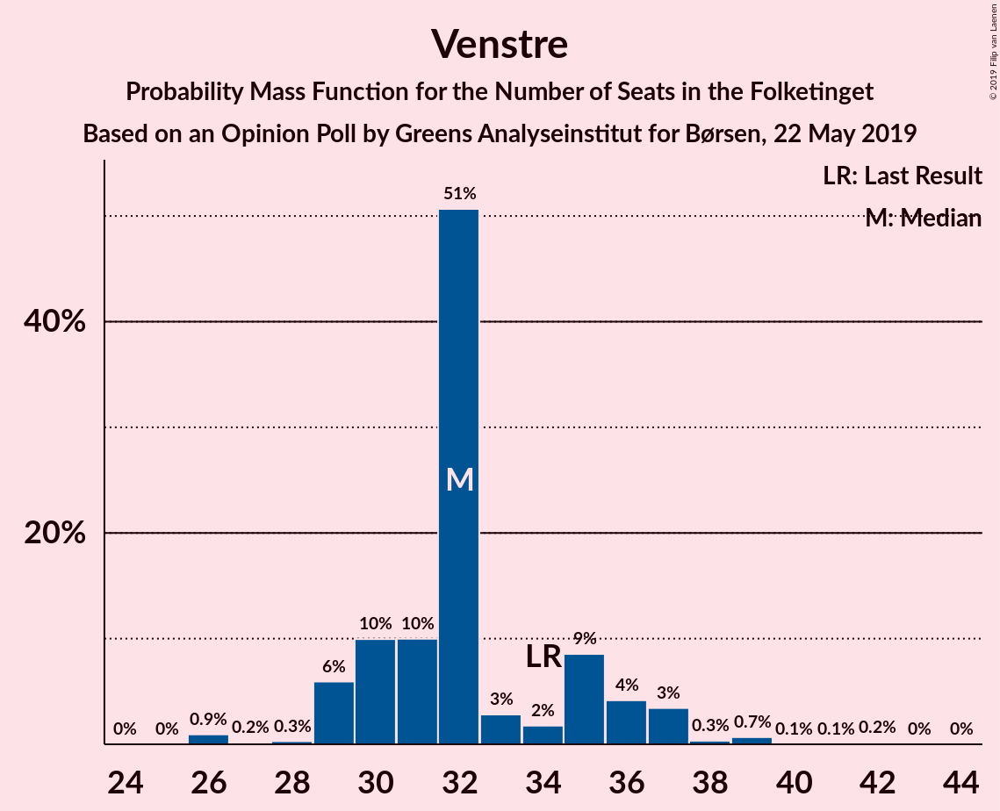

| Number of Seats | Probability | Accumulated | Special Marks |
|:---------------:|:-----------:|:-----------:|:-------------:|
| 26 | 0.9% | 100% |  |
| 27 | 0.2% | 99.1% |  |
| 28 | 0.3% | 98.9% |  |
| 29 | 6% | 98.6% |  |
| 30 | 10% | 93% |  |
| 31 | 10% | 83% |  |
| 32 | 51% | 73% | Median |
| 33 | 3% | 22% |  |
| 34 | 2% | 19% | Last Result |
| 35 | 9% | 17% |  |
| 36 | 4% | 9% |  |
| 37 | 3% | 5% |  |
| 38 | 0.3% | 1.3% |  |
| 39 | 0.7% | 0.9% |  |
| 40 | 0.1% | 0.3% |  |
| 41 | 0.1% | 0.2% |  |
| 42 | 0.2% | 0.2% |  |
| 43 | 0% | 0% |  |

### Dansk Folkeparti

*For a full overview of the results for this party, see the [Dansk Folkeparti](party-danskfolkeparti.html) page.*

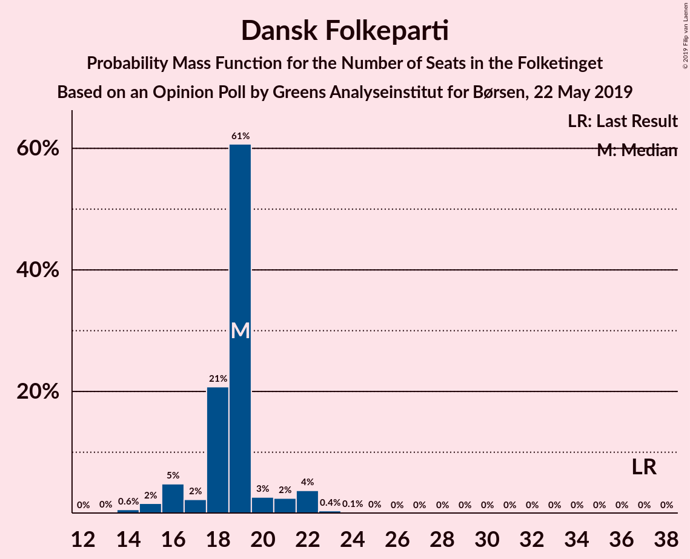

| Number of Seats | Probability | Accumulated | Special Marks |
|:---------------:|:-----------:|:-----------:|:-------------:|
| 14 | 0.6% | 100% |  |
| 15 | 2% | 99.4% |  |
| 16 | 5% | 98% |  |
| 17 | 2% | 93% |  |
| 18 | 21% | 91% |  |
| 19 | 61% | 70% | Median |
| 20 | 3% | 9% |  |
| 21 | 2% | 7% |  |
| 22 | 4% | 4% |  |
| 23 | 0.4% | 0.5% |  |
| 24 | 0.1% | 0.2% |  |
| 25 | 0% | 0% |  |
| 26 | 0% | 0% |  |
| 27 | 0% | 0% |  |
| 28 | 0% | 0% |  |
| 29 | 0% | 0% |  |
| 30 | 0% | 0% |  |
| 31 | 0% | 0% |  |
| 32 | 0% | 0% |  |
| 33 | 0% | 0% |  |
| 34 | 0% | 0% |  |
| 35 | 0% | 0% |  |
| 36 | 0% | 0% |  |
| 37 | 0% | 0% | Last Result |

### Enhedslisten–De Rød-Grønne

*For a full overview of the results for this party, see the [Enhedslisten–De Rød-Grønne](party-enhedslisten–derød-grønne.html) page.*

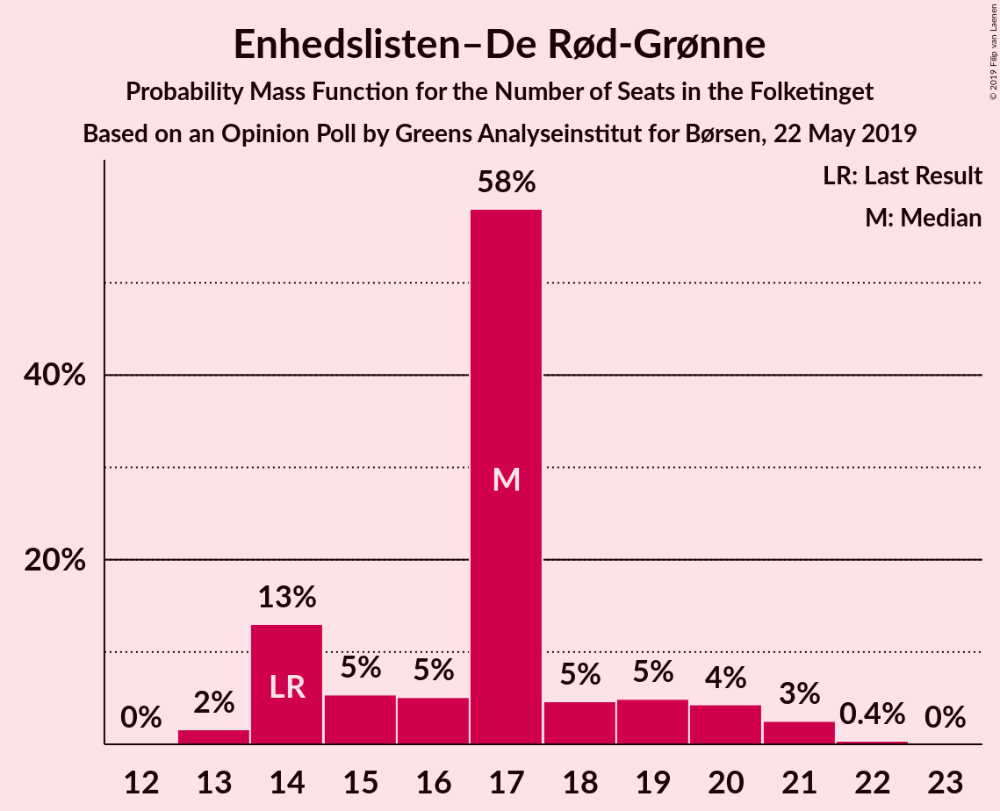

| Number of Seats | Probability | Accumulated | Special Marks |
|:---------------:|:-----------:|:-----------:|:-------------:|
| 12 | 0% | 100% |  |
| 13 | 2% | 99.9% |  |
| 14 | 13% | 98% | Last Result |
| 15 | 5% | 85% |  |
| 16 | 5% | 80% |  |
| 17 | 58% | 75% | Median |
| 18 | 5% | 17% |  |
| 19 | 5% | 12% |  |
| 20 | 4% | 7% |  |
| 21 | 3% | 3% |  |
| 22 | 0.4% | 0.4% |  |
| 23 | 0% | 0% |  |

### Radikale Venstre

*For a full overview of the results for this party, see the [Radikale Venstre](party-radikalevenstre.html) page.*

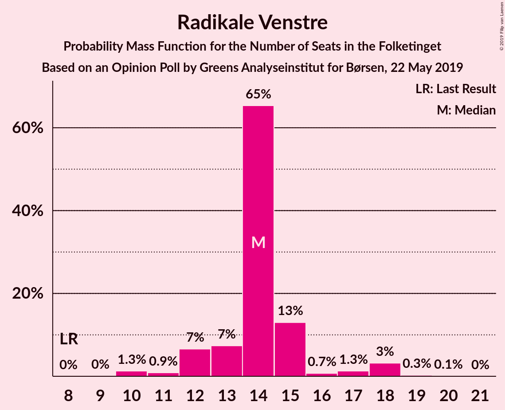

| Number of Seats | Probability | Accumulated | Special Marks |
|:---------------:|:-----------:|:-----------:|:-------------:|
| 8 | 0% | 100% | Last Result |
| 9 | 0% | 100% |  |
| 10 | 1.3% | 100% |  |
| 11 | 0.9% | 98.7% |  |
| 12 | 7% | 98% |  |
| 13 | 7% | 91% |  |
| 14 | 65% | 84% | Median |
| 15 | 13% | 19% |  |
| 16 | 0.7% | 6% |  |
| 17 | 1.3% | 5% |  |
| 18 | 3% | 4% |  |
| 19 | 0.3% | 0.4% |  |
| 20 | 0.1% | 0.1% |  |
| 21 | 0% | 0% |  |

### Socialistisk Folkeparti

*For a full overview of the results for this party, see the [Socialistisk Folkeparti](party-socialistiskfolkeparti.html) page.*

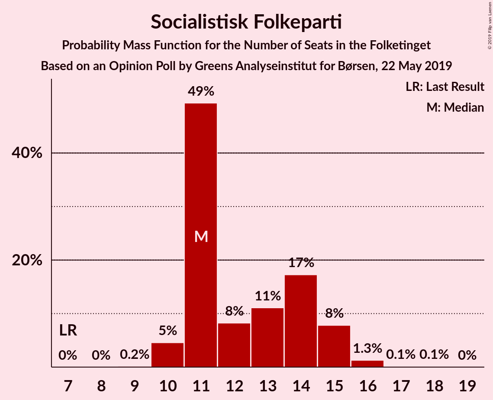

| Number of Seats | Probability | Accumulated | Special Marks |
|:---------------:|:-----------:|:-----------:|:-------------:|
| 7 | 0% | 100% | Last Result |
| 8 | 0% | 100% |  |
| 9 | 0.2% | 100% |  |
| 10 | 5% | 99.8% |  |
| 11 | 49% | 95% | Median |
| 12 | 8% | 46% |  |
| 13 | 11% | 38% |  |
| 14 | 17% | 27% |  |
| 15 | 8% | 9% |  |
| 16 | 1.3% | 2% |  |
| 17 | 0.1% | 0.3% |  |
| 18 | 0.1% | 0.1% |  |
| 19 | 0% | 0% |  |

### Liberal Alliance

*For a full overview of the results for this party, see the [Liberal Alliance](party-liberalalliance.html) page.*

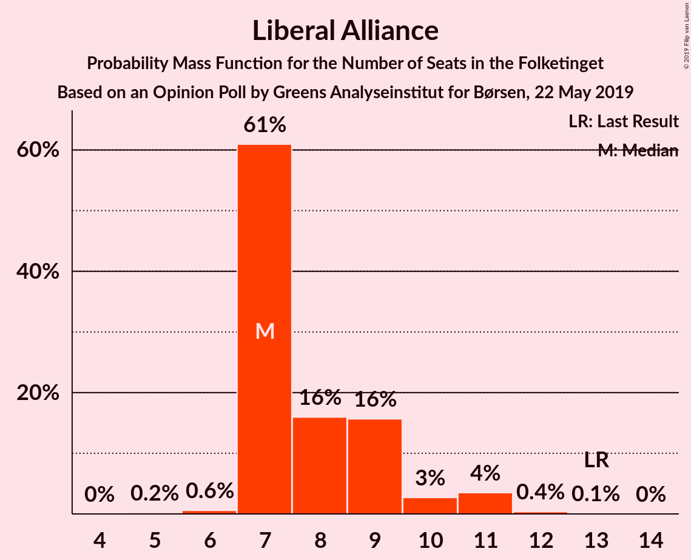

| Number of Seats | Probability | Accumulated | Special Marks |
|:---------------:|:-----------:|:-----------:|:-------------:|
| 5 | 0.2% | 100% |  |
| 6 | 0.6% | 99.8% |  |
| 7 | 61% | 99.2% | Median |
| 8 | 16% | 38% |  |
| 9 | 16% | 22% |  |
| 10 | 3% | 7% |  |
| 11 | 4% | 4% |  |
| 12 | 0.4% | 0.5% |  |
| 13 | 0.1% | 0.1% | Last Result |
| 14 | 0% | 0% |  |

### Alternativet

*For a full overview of the results for this party, see the [Alternativet](party-alternativet.html) page.*

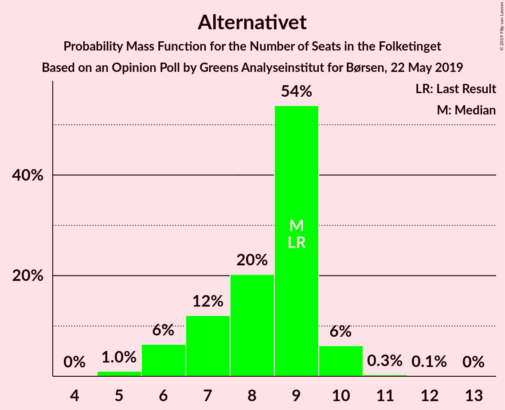

| Number of Seats | Probability | Accumulated | Special Marks |
|:---------------:|:-----------:|:-----------:|:-------------:|
| 5 | 1.0% | 100% |  |
| 6 | 6% | 99.0% |  |
| 7 | 12% | 93% |  |
| 8 | 20% | 81% |  |
| 9 | 54% | 60% | Last Result, Median |
| 10 | 6% | 6% |  |
| 11 | 0.3% | 0.4% |  |
| 12 | 0.1% | 0.1% |  |
| 13 | 0% | 0% |  |

### Det Konservative Folkeparti

*For a full overview of the results for this party, see the [Det Konservative Folkeparti](party-detkonservativefolkeparti.html) page.*

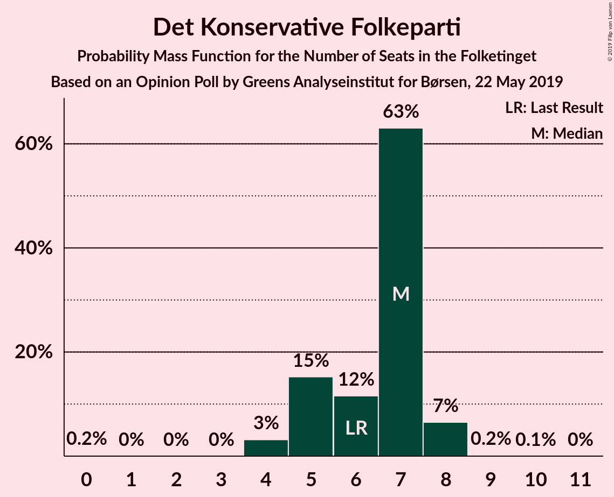

| Number of Seats | Probability | Accumulated | Special Marks |
|:---------------:|:-----------:|:-----------:|:-------------:|
| 0 | 0.2% | 100% |  |
| 1 | 0% | 99.8% |  |
| 2 | 0% | 99.8% |  |
| 3 | 0% | 99.8% |  |
| 4 | 3% | 99.8% |  |
| 5 | 15% | 97% |  |
| 6 | 12% | 81% | Last Result |
| 7 | 63% | 70% | Median |
| 8 | 7% | 7% |  |
| 9 | 0.2% | 0.3% |  |
| 10 | 0.1% | 0.1% |  |
| 11 | 0% | 0% |  |

### Stram Kurs

*For a full overview of the results for this party, see the [Stram Kurs](party-stramkurs.html) page.*

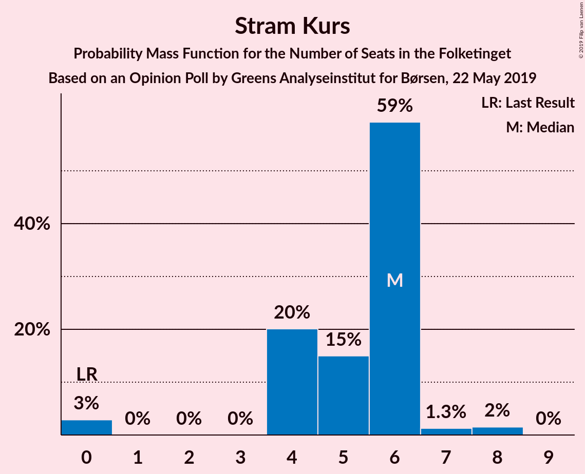

| Number of Seats | Probability | Accumulated | Special Marks |
|:---------------:|:-----------:|:-----------:|:-------------:|
| 0 | 3% | 100% | Last Result |
| 1 | 0% | 97% |  |
| 2 | 0% | 97% |  |
| 3 | 0% | 97% |  |
| 4 | 20% | 97% |  |
| 5 | 15% | 77% |  |
| 6 | 59% | 62% | Median |
| 7 | 1.3% | 3% |  |
| 8 | 2% | 2% |  |
| 9 | 0% | 0% |  |

### Nye Borgerlige

*For a full overview of the results for this party, see the [Nye Borgerlige](party-nyeborgerlige.html) page.*

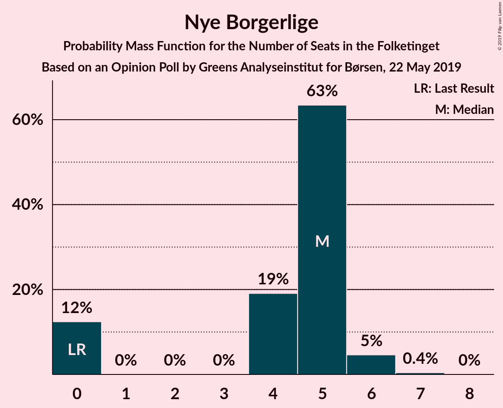

| Number of Seats | Probability | Accumulated | Special Marks |
|:---------------:|:-----------:|:-----------:|:-------------:|
| 0 | 12% | 100% | Last Result |
| 1 | 0% | 88% |  |
| 2 | 0% | 88% |  |
| 3 | 0% | 88% |  |
| 4 | 19% | 88% |  |
| 5 | 63% | 68% | Median |
| 6 | 5% | 5% |  |
| 7 | 0.4% | 0.4% |  |
| 8 | 0% | 0% |  |

### Kristendemokraterne

*For a full overview of the results for this party, see the [Kristendemokraterne](party-kristendemokraterne.html) page.*

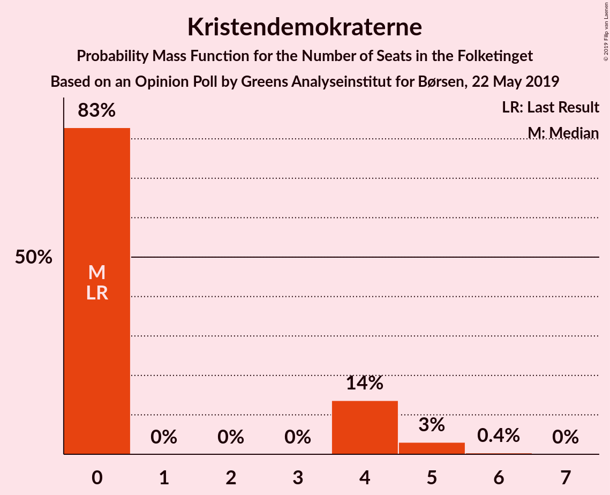

| Number of Seats | Probability | Accumulated | Special Marks |
|:---------------:|:-----------:|:-----------:|:-------------:|
| 0 | 83% | 100% | Last Result, Median |
| 1 | 0% | 17% |  |
| 2 | 0% | 17% |  |
| 3 | 0% | 17% |  |
| 4 | 14% | 17% |  |
| 5 | 3% | 3% |  |
| 6 | 0.4% | 0.4% |  |
| 7 | 0% | 0% |  |

### Klaus Riskær Pedersen

*For a full overview of the results for this party, see the [Klaus Riskær Pedersen](party-klausriskærpedersen.html) page.*

| Number of Seats | Probability | Accumulated | Special Marks |
|:---------------:|:-----------:|:-----------:|:-------------:|
| 0 | 100% | 100% | Last Result, Median |

## Coalitions

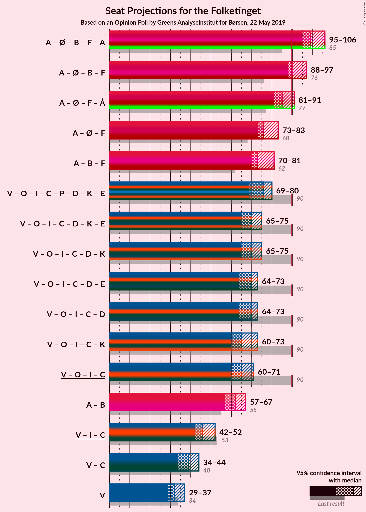

### Confidence Intervals

| Coalition | Last Result | Median | Majority? | 80% Confidence Interval | 90% Confidence Interval | 95% Confidence Interval | 99% Confidence Interval |
|:---------:|:-----------:|:------:|:---------:|:-----------------------:|:-----------------------:|:-----------------------:|:-----------------------:|
| Socialdemokraterne – Enhedslisten–De Rød-Grønne – Radikale Venstre – Socialistisk Folkeparti – Alternativet | 85 | 99 | 100% | 98–102 | 96–103 | 95–106 | 93–106 |
| Socialdemokraterne – Enhedslisten–De Rød-Grønne – Radikale Venstre – Socialistisk Folkeparti | 76 | 90 | 87% | 89–94 | 88–96 | 88–97 | 84–98 |
| Socialdemokraterne – Enhedslisten–De Rød-Grønne – Socialistisk Folkeparti – Alternativet | 77 | 85 | 7% | 82–89 | 82–91 | 81–91 | 79–91 |
| Socialdemokraterne – Enhedslisten–De Rød-Grønne – Socialistisk Folkeparti | 68 | 76 | 0% | 75–81 | 74–82 | 73–83 | 71–84 |
| Socialdemokraterne – Radikale Venstre – Socialistisk Folkeparti | 62 | 73 | 0% | 73–79 | 71–79 | 70–81 | 68–82 |
| Venstre – Dansk Folkeparti – Liberal Alliance – Det Konservative Folkeparti – Stram Kurs – Nye Borgerlige – Kristendemokraterne – Klaus Riskær Pedersen | 90 | 76 | 0% | 73–77 | 72–79 | 69–80 | 69–82 |
| Venstre – Dansk Folkeparti – Liberal Alliance – Det Konservative Folkeparti – Nye Borgerlige – Kristendemokraterne – Klaus Riskær Pedersen | 90 | 70 | 0% | 68–73 | 66–75 | 65–75 | 65–77 |
| Venstre – Dansk Folkeparti – Liberal Alliance – Det Konservative Folkeparti – Nye Borgerlige – Kristendemokraterne | 90 | 70 | 0% | 68–73 | 66–75 | 65–75 | 65–77 |
| Venstre – Dansk Folkeparti – Liberal Alliance – Det Konservative Folkeparti – Nye Borgerlige – Klaus Riskær Pedersen | 90 | 70 | 0% | 66–71 | 65–72 | 64–73 | 63–75 |
| Venstre – Dansk Folkeparti – Liberal Alliance – Det Konservative Folkeparti – Nye Borgerlige | 90 | 70 | 0% | 66–71 | 65–72 | 64–73 | 63–75 |
| Venstre – Dansk Folkeparti – Liberal Alliance – Det Konservative Folkeparti – Kristendemokraterne | 90 | 65 | 0% | 64–70 | 62–71 | 60–73 | 60–74 |
| Venstre – Dansk Folkeparti – Liberal Alliance – Det Konservative Folkeparti | 90 | 65 | 0% | 64–68 | 61–69 | 60–71 | 59–73 |
| Socialdemokraterne – Radikale Venstre | 55 | 62 | 0% | 60–65 | 58–66 | 57–67 | 55–68 |
| Venstre – Liberal Alliance – Det Konservative Folkeparti | 53 | 46 | 0% | 44–49 | 42–51 | 42–52 | 41–55 |
| Venstre – Det Konservative Folkeparti | 40 | 39 | 0% | 36–42 | 34–43 | 34–44 | 32–45 |
| Venstre | 34 | 32 | 0% | 30–35 | 29–36 | 29–37 | 26–39 |

### Socialdemokraterne – Enhedslisten–De Rød-Grønne – Radikale Venstre – Socialistisk Folkeparti – Alternativet

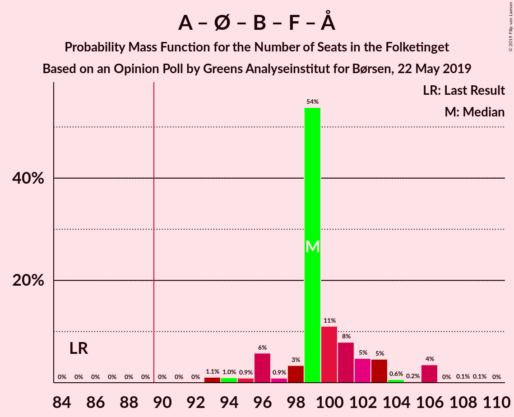

| Number of Seats | Probability | Accumulated | Special Marks |
|:---------------:|:-----------:|:-----------:|:-------------:|
| 85 | 0% | 100% | Last Result |
| 86 | 0% | 100% |  |
| 87 | 0% | 100% |  |
| 88 | 0% | 100% |  |
| 89 | 0% | 100% |  |
| 90 | 0% | 100% | Majority |
| 91 | 0% | 100% |  |
| 92 | 0% | 99.9% |  |
| 93 | 1.1% | 99.9% |  |
| 94 | 1.0% | 98.8% |  |
| 95 | 0.9% | 98% |  |
| 96 | 6% | 97% |  |
| 97 | 0.9% | 91% |  |
| 98 | 3% | 90% |  |
| 99 | 54% | 87% | Median |
| 100 | 11% | 33% |  |
| 101 | 8% | 22% |  |
| 102 | 5% | 14% |  |
| 103 | 5% | 9% |  |
| 104 | 0.6% | 5% |  |
| 105 | 0.2% | 4% |  |
| 106 | 4% | 4% |  |
| 107 | 0% | 0.3% |  |
| 108 | 0.1% | 0.3% |  |
| 109 | 0.1% | 0.2% |  |
| 110 | 0% | 0% |  |

### Socialdemokraterne – Enhedslisten–De Rød-Grønne – Radikale Venstre – Socialistisk Folkeparti

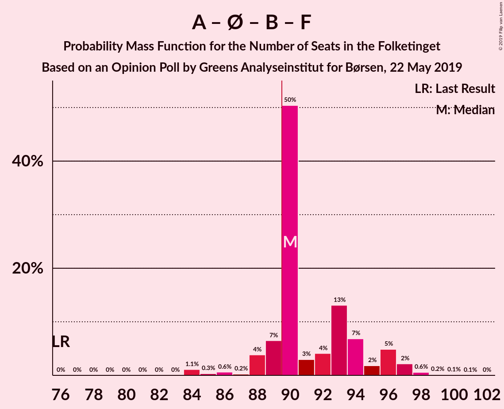

| Number of Seats | Probability | Accumulated | Special Marks |
|:---------------:|:-----------:|:-----------:|:-------------:|
| 76 | 0% | 100% | Last Result |
| 77 | 0% | 100% |  |
| 78 | 0% | 100% |  |
| 79 | 0% | 100% |  |
| 80 | 0% | 100% |  |
| 81 | 0% | 100% |  |
| 82 | 0% | 100% |  |
| 83 | 0% | 100% |  |
| 84 | 1.1% | 99.9% |  |
| 85 | 0.3% | 98.8% |  |
| 86 | 0.6% | 98% |  |
| 87 | 0.2% | 98% |  |
| 88 | 4% | 98% |  |
| 89 | 7% | 94% |  |
| 90 | 50% | 87% | Median, Majority |
| 91 | 3% | 37% |  |
| 92 | 4% | 34% |  |
| 93 | 13% | 30% |  |
| 94 | 7% | 17% |  |
| 95 | 2% | 10% |  |
| 96 | 5% | 8% |  |
| 97 | 2% | 3% |  |
| 98 | 0.6% | 1.0% |  |
| 99 | 0.2% | 0.4% |  |
| 100 | 0.1% | 0.2% |  |
| 101 | 0.1% | 0.1% |  |
| 102 | 0% | 0% |  |

### Socialdemokraterne – Enhedslisten–De Rød-Grønne – Socialistisk Folkeparti – Alternativet

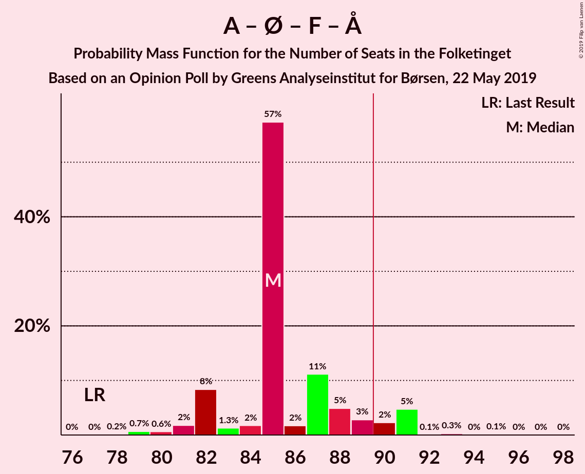

| Number of Seats | Probability | Accumulated | Special Marks |
|:---------------:|:-----------:|:-----------:|:-------------:|
| 77 | 0% | 100% | Last Result |
| 78 | 0.2% | 100% |  |
| 79 | 0.7% | 99.8% |  |
| 80 | 0.6% | 99.1% |  |
| 81 | 2% | 98.5% |  |
| 82 | 8% | 97% |  |
| 83 | 1.3% | 88% |  |
| 84 | 2% | 87% |  |
| 85 | 57% | 85% | Median |
| 86 | 2% | 28% |  |
| 87 | 11% | 26% |  |
| 88 | 5% | 15% |  |
| 89 | 3% | 10% |  |
| 90 | 2% | 7% | Majority |
| 91 | 5% | 5% |  |
| 92 | 0.1% | 0.5% |  |
| 93 | 0.3% | 0.4% |  |
| 94 | 0% | 0.2% |  |
| 95 | 0.1% | 0.2% |  |
| 96 | 0% | 0.1% |  |
| 97 | 0% | 0% |  |

### Socialdemokraterne – Enhedslisten–De Rød-Grønne – Socialistisk Folkeparti

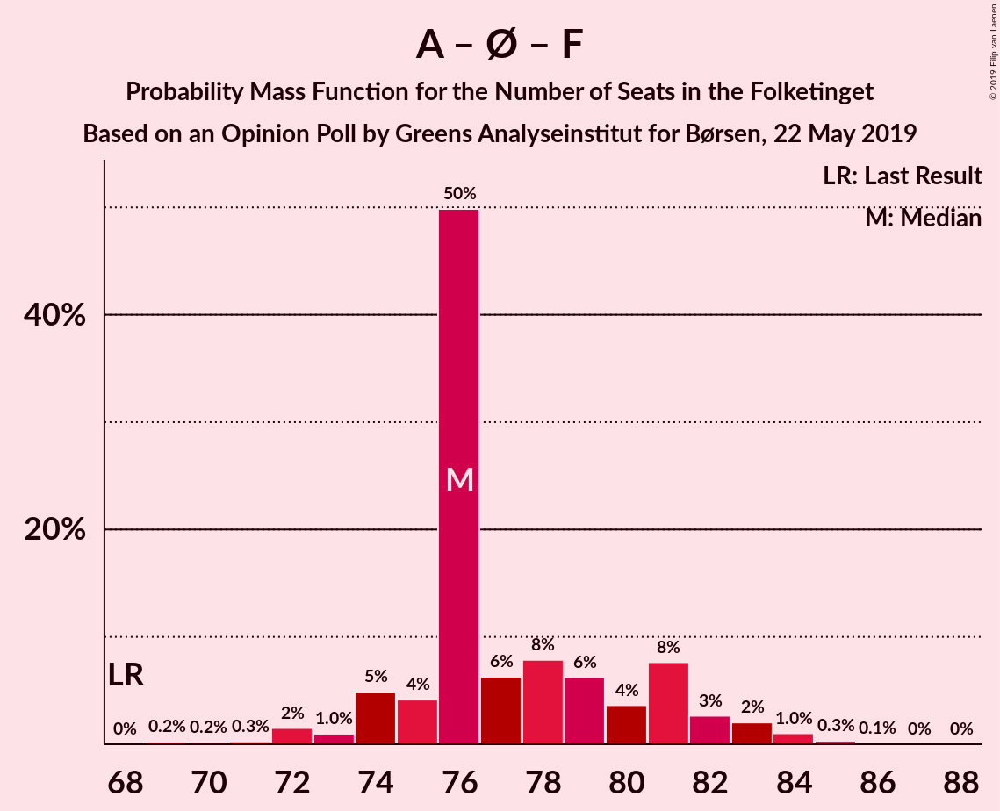

| Number of Seats | Probability | Accumulated | Special Marks |
|:---------------:|:-----------:|:-----------:|:-------------:|
| 68 | 0% | 100% | Last Result |
| 69 | 0.2% | 100% |  |
| 70 | 0.2% | 99.8% |  |
| 71 | 0.3% | 99.6% |  |
| 72 | 2% | 99.3% |  |
| 73 | 1.0% | 98% |  |
| 74 | 5% | 97% |  |
| 75 | 4% | 92% |  |
| 76 | 50% | 88% | Median |
| 77 | 6% | 38% |  |
| 78 | 8% | 32% |  |
| 79 | 6% | 24% |  |
| 80 | 4% | 17% |  |
| 81 | 8% | 14% |  |
| 82 | 3% | 6% |  |
| 83 | 2% | 4% |  |
| 84 | 1.0% | 1.5% |  |
| 85 | 0.3% | 0.5% |  |
| 86 | 0.1% | 0.2% |  |
| 87 | 0% | 0% |  |

### Socialdemokraterne – Radikale Venstre – Socialistisk Folkeparti

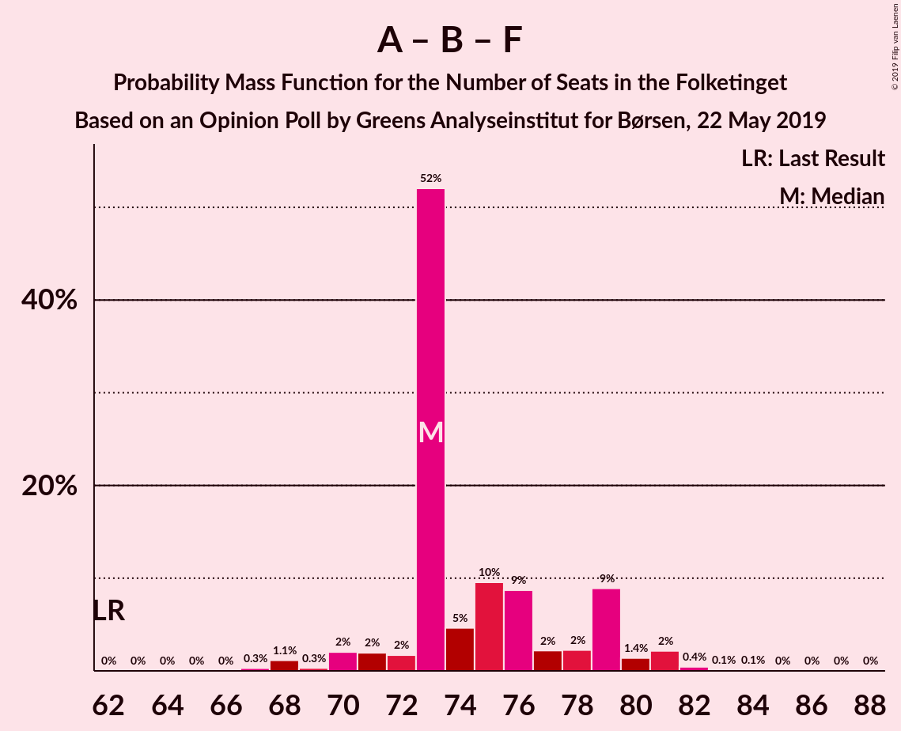

| Number of Seats | Probability | Accumulated | Special Marks |
|:---------------:|:-----------:|:-----------:|:-------------:|
| 62 | 0% | 100% | Last Result |
| 63 | 0% | 100% |  |
| 64 | 0% | 100% |  |
| 65 | 0% | 100% |  |
| 66 | 0% | 100% |  |
| 67 | 0.3% | 100% |  |
| 68 | 1.1% | 99.7% |  |
| 69 | 0.3% | 98.5% |  |
| 70 | 2% | 98% |  |
| 71 | 2% | 96% |  |
| 72 | 2% | 94% |  |
| 73 | 52% | 93% | Median |
| 74 | 5% | 40% |  |
| 75 | 10% | 36% |  |
| 76 | 9% | 26% |  |
| 77 | 2% | 18% |  |
| 78 | 2% | 15% |  |
| 79 | 9% | 13% |  |
| 80 | 1.4% | 4% |  |
| 81 | 2% | 3% |  |
| 82 | 0.4% | 0.7% |  |
| 83 | 0.1% | 0.2% |  |
| 84 | 0.1% | 0.2% |  |
| 85 | 0% | 0.1% |  |
| 86 | 0% | 0.1% |  |
| 87 | 0% | 0% |  |

### Venstre – Dansk Folkeparti – Liberal Alliance – Det Konservative Folkeparti – Stram Kurs – Nye Borgerlige – Kristendemokraterne – Klaus Riskær Pedersen

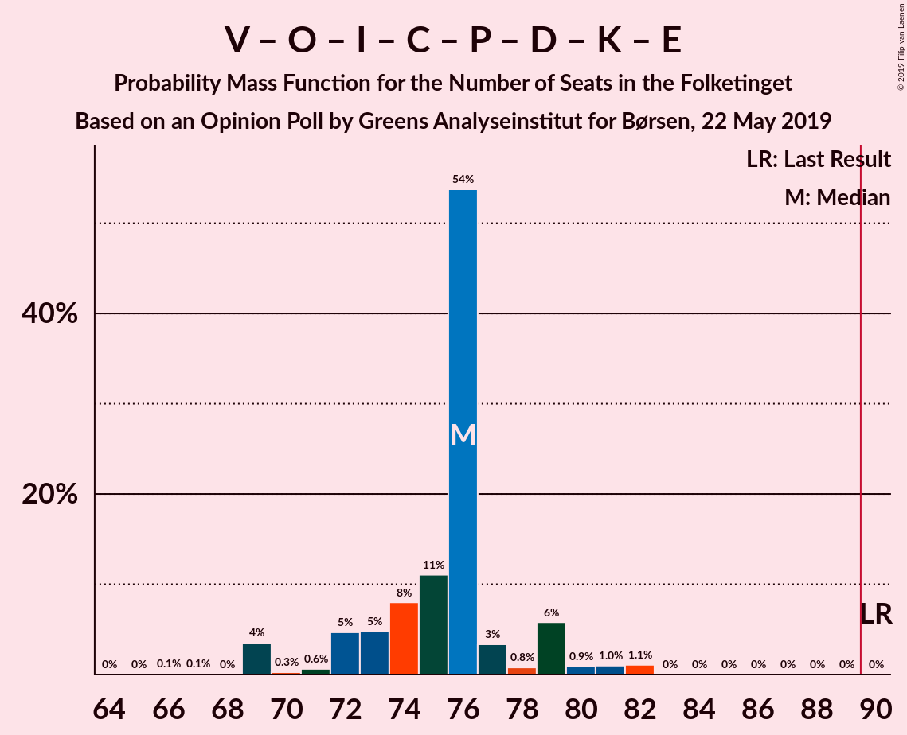

| Number of Seats | Probability | Accumulated | Special Marks |
|:---------------:|:-----------:|:-----------:|:-------------:|
| 66 | 0.1% | 100% |  |
| 67 | 0.1% | 99.8% |  |
| 68 | 0% | 99.7% |  |
| 69 | 4% | 99.7% |  |
| 70 | 0.3% | 96% |  |
| 71 | 0.6% | 96% |  |
| 72 | 5% | 95% |  |
| 73 | 5% | 91% |  |
| 74 | 8% | 86% |  |
| 75 | 11% | 78% |  |
| 76 | 54% | 67% | Median |
| 77 | 3% | 13% |  |
| 78 | 0.8% | 10% |  |
| 79 | 6% | 9% |  |
| 80 | 0.9% | 3% |  |
| 81 | 1.0% | 2% |  |
| 82 | 1.1% | 1.2% |  |
| 83 | 0% | 0.1% |  |
| 84 | 0% | 0.1% |  |
| 85 | 0% | 0% |  |
| 86 | 0% | 0% |  |
| 87 | 0% | 0% |  |
| 88 | 0% | 0% |  |
| 89 | 0% | 0% |  |
| 90 | 0% | 0% | Last Result, Majority |

### Venstre – Dansk Folkeparti – Liberal Alliance – Det Konservative Folkeparti – Nye Borgerlige – Kristendemokraterne – Klaus Riskær Pedersen

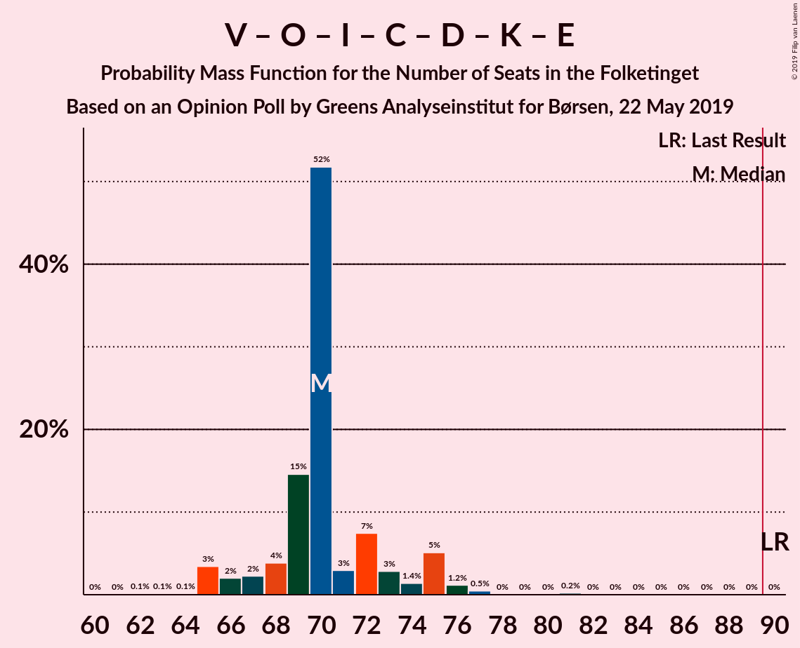

| Number of Seats | Probability | Accumulated | Special Marks |
|:---------------:|:-----------:|:-----------:|:-------------:|
| 62 | 0.1% | 100% |  |
| 63 | 0.1% | 99.8% |  |
| 64 | 0.1% | 99.7% |  |
| 65 | 3% | 99.6% |  |
| 66 | 2% | 96% |  |
| 67 | 2% | 94% |  |
| 68 | 4% | 92% |  |
| 69 | 15% | 88% |  |
| 70 | 52% | 73% | Median |
| 71 | 3% | 22% |  |
| 72 | 7% | 19% |  |
| 73 | 3% | 11% |  |
| 74 | 1.4% | 8% |  |
| 75 | 5% | 7% |  |
| 76 | 1.2% | 2% |  |
| 77 | 0.5% | 0.8% |  |
| 78 | 0% | 0.3% |  |
| 79 | 0% | 0.2% |  |
| 80 | 0% | 0.2% |  |
| 81 | 0.2% | 0.2% |  |
| 82 | 0% | 0% |  |
| 83 | 0% | 0% |  |
| 84 | 0% | 0% |  |
| 85 | 0% | 0% |  |
| 86 | 0% | 0% |  |
| 87 | 0% | 0% |  |
| 88 | 0% | 0% |  |
| 89 | 0% | 0% |  |
| 90 | 0% | 0% | Last Result, Majority |

### Venstre – Dansk Folkeparti – Liberal Alliance – Det Konservative Folkeparti – Nye Borgerlige – Kristendemokraterne

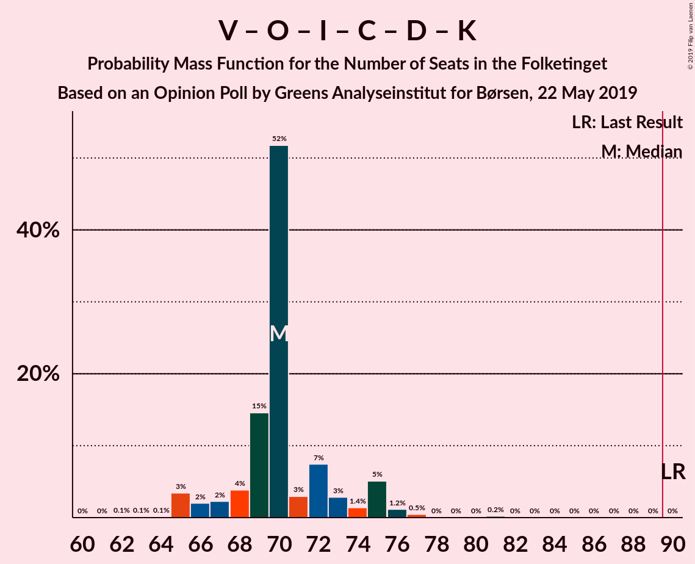

| Number of Seats | Probability | Accumulated | Special Marks |
|:---------------:|:-----------:|:-----------:|:-------------:|
| 62 | 0.1% | 100% |  |
| 63 | 0.1% | 99.8% |  |
| 64 | 0.1% | 99.7% |  |
| 65 | 3% | 99.6% |  |
| 66 | 2% | 96% |  |
| 67 | 2% | 94% |  |
| 68 | 4% | 92% |  |
| 69 | 15% | 88% |  |
| 70 | 52% | 73% | Median |
| 71 | 3% | 22% |  |
| 72 | 7% | 19% |  |
| 73 | 3% | 11% |  |
| 74 | 1.4% | 8% |  |
| 75 | 5% | 7% |  |
| 76 | 1.2% | 2% |  |
| 77 | 0.5% | 0.8% |  |
| 78 | 0% | 0.3% |  |
| 79 | 0% | 0.2% |  |
| 80 | 0% | 0.2% |  |
| 81 | 0.2% | 0.2% |  |
| 82 | 0% | 0% |  |
| 83 | 0% | 0% |  |
| 84 | 0% | 0% |  |
| 85 | 0% | 0% |  |
| 86 | 0% | 0% |  |
| 87 | 0% | 0% |  |
| 88 | 0% | 0% |  |
| 89 | 0% | 0% |  |
| 90 | 0% | 0% | Last Result, Majority |

### Venstre – Dansk Folkeparti – Liberal Alliance – Det Konservative Folkeparti – Nye Borgerlige – Klaus Riskær Pedersen

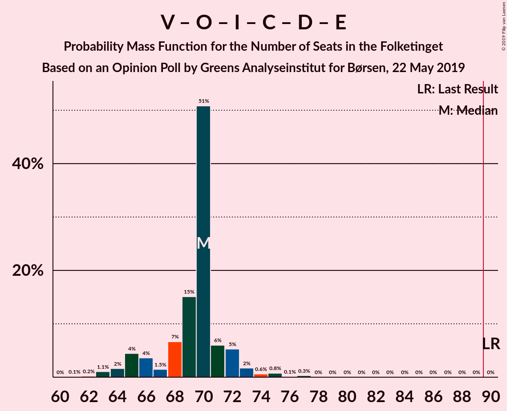

| Number of Seats | Probability | Accumulated | Special Marks |
|:---------------:|:-----------:|:-----------:|:-------------:|
| 60 | 0% | 100% |  |
| 61 | 0.1% | 99.9% |  |
| 62 | 0.2% | 99.9% |  |
| 63 | 1.1% | 99.6% |  |
| 64 | 2% | 98.6% |  |
| 65 | 4% | 97% |  |
| 66 | 4% | 93% |  |
| 67 | 1.5% | 89% |  |
| 68 | 7% | 87% |  |
| 69 | 15% | 81% |  |
| 70 | 51% | 66% | Median |
| 71 | 6% | 15% |  |
| 72 | 5% | 9% |  |
| 73 | 2% | 4% |  |
| 74 | 0.6% | 2% |  |
| 75 | 0.8% | 1.2% |  |
| 76 | 0.1% | 0.5% |  |
| 77 | 0.3% | 0.3% |  |
| 78 | 0% | 0% |  |
| 79 | 0% | 0% |  |
| 80 | 0% | 0% |  |
| 81 | 0% | 0% |  |
| 82 | 0% | 0% |  |
| 83 | 0% | 0% |  |
| 84 | 0% | 0% |  |
| 85 | 0% | 0% |  |
| 86 | 0% | 0% |  |
| 87 | 0% | 0% |  |
| 88 | 0% | 0% |  |
| 89 | 0% | 0% |  |
| 90 | 0% | 0% | Last Result, Majority |

### Venstre – Dansk Folkeparti – Liberal Alliance – Det Konservative Folkeparti – Nye Borgerlige

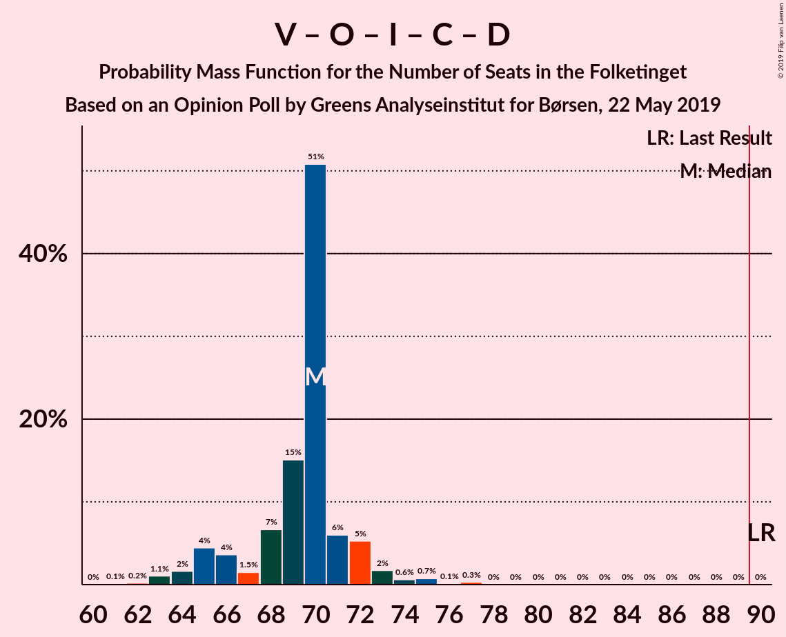

| Number of Seats | Probability | Accumulated | Special Marks |
|:---------------:|:-----------:|:-----------:|:-------------:|
| 60 | 0% | 100% |  |
| 61 | 0.1% | 99.9% |  |
| 62 | 0.2% | 99.9% |  |
| 63 | 1.1% | 99.6% |  |
| 64 | 2% | 98.6% |  |
| 65 | 4% | 97% |  |
| 66 | 4% | 92% |  |
| 67 | 1.5% | 89% |  |
| 68 | 7% | 87% |  |
| 69 | 15% | 81% |  |
| 70 | 51% | 66% | Median |
| 71 | 6% | 15% |  |
| 72 | 5% | 9% |  |
| 73 | 2% | 4% |  |
| 74 | 0.6% | 2% |  |
| 75 | 0.7% | 1.2% |  |
| 76 | 0.1% | 0.4% |  |
| 77 | 0.3% | 0.3% |  |
| 78 | 0% | 0% |  |
| 79 | 0% | 0% |  |
| 80 | 0% | 0% |  |
| 81 | 0% | 0% |  |
| 82 | 0% | 0% |  |
| 83 | 0% | 0% |  |
| 84 | 0% | 0% |  |
| 85 | 0% | 0% |  |
| 86 | 0% | 0% |  |
| 87 | 0% | 0% |  |
| 88 | 0% | 0% |  |
| 89 | 0% | 0% |  |
| 90 | 0% | 0% | Last Result, Majority |

### Venstre – Dansk Folkeparti – Liberal Alliance – Det Konservative Folkeparti – Kristendemokraterne

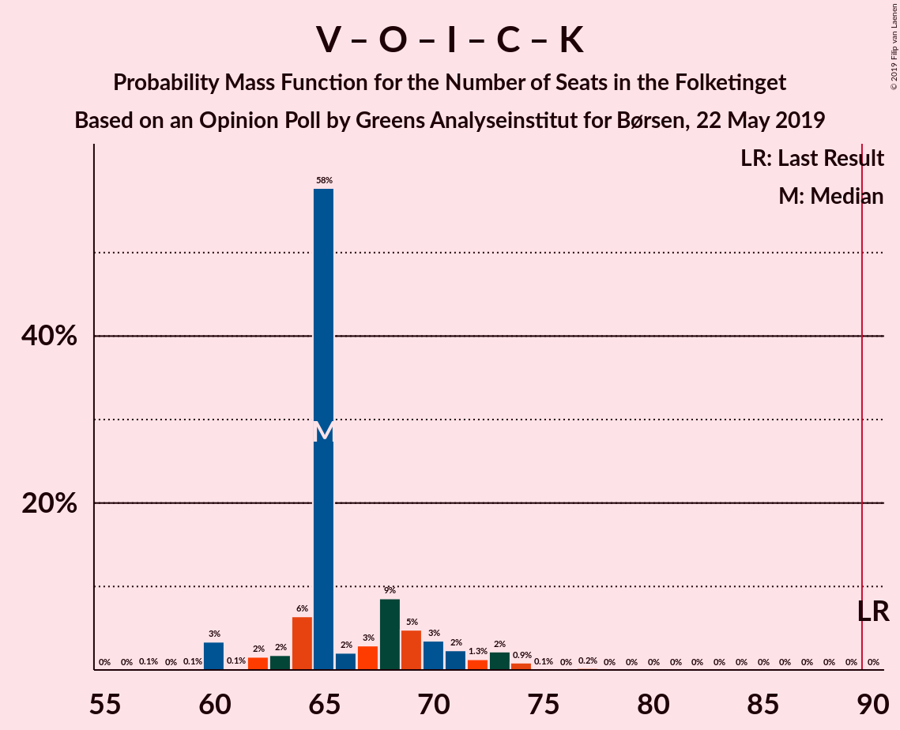

| Number of Seats | Probability | Accumulated | Special Marks |
|:---------------:|:-----------:|:-----------:|:-------------:|
| 57 | 0.1% | 100% |  |
| 58 | 0% | 99.9% |  |
| 59 | 0.1% | 99.9% |  |
| 60 | 3% | 99.8% |  |
| 61 | 0.1% | 96% |  |
| 62 | 2% | 96% |  |
| 63 | 2% | 95% |  |
| 64 | 6% | 93% |  |
| 65 | 58% | 87% | Median |
| 66 | 2% | 29% |  |
| 67 | 3% | 27% |  |
| 68 | 9% | 24% |  |
| 69 | 5% | 15% |  |
| 70 | 3% | 10% |  |
| 71 | 2% | 7% |  |
| 72 | 1.3% | 5% |  |
| 73 | 2% | 3% |  |
| 74 | 0.9% | 1.2% |  |
| 75 | 0.1% | 0.3% |  |
| 76 | 0% | 0.2% |  |
| 77 | 0.2% | 0.2% |  |
| 78 | 0% | 0% |  |
| 79 | 0% | 0% |  |
| 80 | 0% | 0% |  |
| 81 | 0% | 0% |  |
| 82 | 0% | 0% |  |
| 83 | 0% | 0% |  |
| 84 | 0% | 0% |  |
| 85 | 0% | 0% |  |
| 86 | 0% | 0% |  |
| 87 | 0% | 0% |  |
| 88 | 0% | 0% |  |
| 89 | 0% | 0% |  |
| 90 | 0% | 0% | Last Result, Majority |

### Venstre – Dansk Folkeparti – Liberal Alliance – Det Konservative Folkeparti

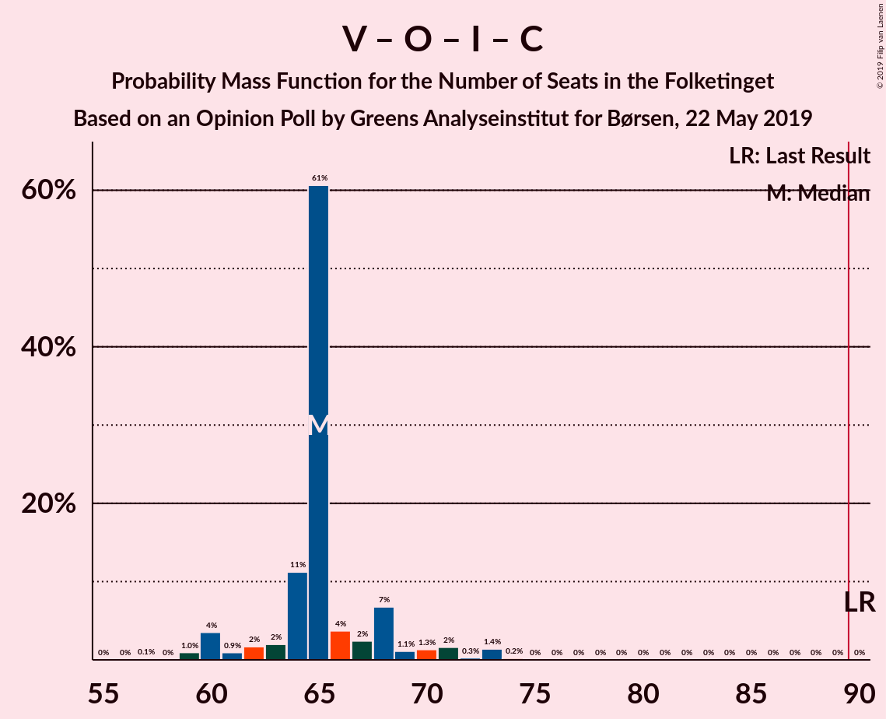

| Number of Seats | Probability | Accumulated | Special Marks |
|:---------------:|:-----------:|:-----------:|:-------------:|
| 57 | 0.1% | 100% |  |
| 58 | 0% | 99.9% |  |
| 59 | 1.0% | 99.9% |  |
| 60 | 4% | 98.9% |  |
| 61 | 0.9% | 95% |  |
| 62 | 2% | 94% |  |
| 63 | 2% | 93% |  |
| 64 | 11% | 91% |  |
| 65 | 61% | 80% | Median |
| 66 | 4% | 19% |  |
| 67 | 2% | 15% |  |
| 68 | 7% | 13% |  |
| 69 | 1.1% | 6% |  |
| 70 | 1.3% | 5% |  |
| 71 | 2% | 4% |  |
| 72 | 0.3% | 2% |  |
| 73 | 1.4% | 2% |  |
| 74 | 0.2% | 0.2% |  |
| 75 | 0% | 0% |  |
| 76 | 0% | 0% |  |
| 77 | 0% | 0% |  |
| 78 | 0% | 0% |  |
| 79 | 0% | 0% |  |
| 80 | 0% | 0% |  |
| 81 | 0% | 0% |  |
| 82 | 0% | 0% |  |
| 83 | 0% | 0% |  |
| 84 | 0% | 0% |  |
| 85 | 0% | 0% |  |
| 86 | 0% | 0% |  |
| 87 | 0% | 0% |  |
| 88 | 0% | 0% |  |
| 89 | 0% | 0% |  |
| 90 | 0% | 0% | Last Result, Majority |

### Socialdemokraterne – Radikale Venstre

| Number of Seats | Probability | Accumulated | Special Marks |
|:---------------:|:-----------:|:-----------:|:-------------:|
| 54 | 0.1% | 100% |  |
| 55 | 1.0% | 99.9% | Last Result |
| 56 | 0.8% | 98.9% |  |
| 57 | 1.4% | 98% |  |
| 58 | 2% | 97% |  |
| 59 | 0.6% | 94% |  |
| 60 | 7% | 94% |  |
| 61 | 3% | 86% |  |
| 62 | 60% | 84% | Median |
| 63 | 4% | 23% |  |
| 64 | 7% | 20% |  |
| 65 | 7% | 13% |  |
| 66 | 1.1% | 6% |  |
| 67 | 3% | 5% |  |
| 68 | 1.1% | 1.3% |  |
| 69 | 0.1% | 0.2% |  |
| 70 | 0% | 0.1% |  |
| 71 | 0% | 0.1% |  |
| 72 | 0% | 0% |  |

### Venstre – Liberal Alliance – Det Konservative Folkeparti

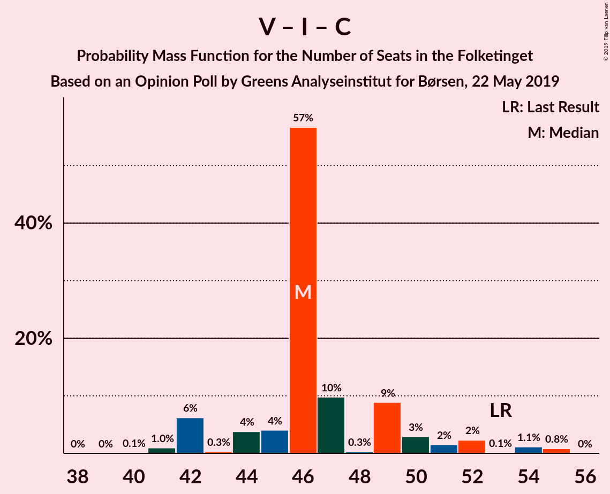

| Number of Seats | Probability | Accumulated | Special Marks |
|:---------------:|:-----------:|:-----------:|:-------------:|
| 40 | 0.1% | 100% |  |
| 41 | 1.0% | 99.8% |  |
| 42 | 6% | 98.9% |  |
| 43 | 0.3% | 93% |  |
| 44 | 4% | 92% |  |
| 45 | 4% | 89% |  |
| 46 | 57% | 85% | Median |
| 47 | 10% | 28% |  |
| 48 | 0.3% | 18% |  |
| 49 | 9% | 18% |  |
| 50 | 3% | 9% |  |
| 51 | 2% | 6% |  |
| 52 | 2% | 4% |  |
| 53 | 0.1% | 2% | Last Result |
| 54 | 1.1% | 2% |  |
| 55 | 0.8% | 0.9% |  |
| 56 | 0% | 0% |  |

### Venstre – Det Konservative Folkeparti

| Number of Seats | Probability | Accumulated | Special Marks |
|:---------------:|:-----------:|:-----------:|:-------------:|
| 32 | 1.0% | 100% |  |
| 33 | 0.2% | 98.9% |  |
| 34 | 4% | 98.8% |  |
| 35 | 3% | 95% |  |
| 36 | 5% | 92% |  |
| 37 | 4% | 87% |  |
| 38 | 14% | 83% |  |
| 39 | 50% | 68% | Median |
| 40 | 6% | 19% | Last Result |
| 41 | 2% | 13% |  |
| 42 | 6% | 11% |  |
| 43 | 2% | 5% |  |
| 44 | 3% | 4% |  |
| 45 | 0.7% | 0.9% |  |
| 46 | 0% | 0.2% |  |
| 47 | 0.2% | 0.2% |  |
| 48 | 0% | 0% |  |

### Venstre

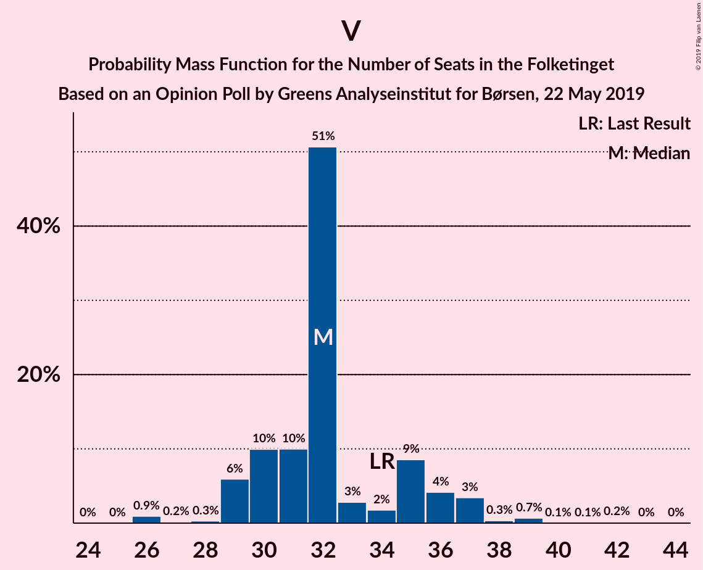

| Number of Seats | Probability | Accumulated | Special Marks |
|:---------------:|:-----------:|:-----------:|:-------------:|
| 26 | 0.9% | 100% |  |
| 27 | 0.2% | 99.1% |  |
| 28 | 0.3% | 98.9% |  |
| 29 | 6% | 98.6% |  |
| 30 | 10% | 93% |  |
| 31 | 10% | 83% |  |
| 32 | 51% | 73% | Median |
| 33 | 3% | 22% |  |
| 34 | 2% | 19% | Last Result |
| 35 | 9% | 17% |  |
| 36 | 4% | 9% |  |
| 37 | 3% | 5% |  |
| 38 | 0.3% | 1.3% |  |
| 39 | 0.7% | 0.9% |  |
| 40 | 0.1% | 0.3% |  |
| 41 | 0.1% | 0.2% |  |
| 42 | 0.2% | 0.2% |  |
| 43 | 0% | 0% |  |

## Technical Information

### Opinion Poll

+ **Polling firm:** Greens Analyseinstitut
+ **Commissioner(s):** Børsen
+ **Fieldwork period:** 22 May 2019

### Calculations

+ **Sample size:** 1000
+ **Simulations done:** 1,048,576
+ **Error estimate:** 2.19%

