# Opinion Poll by YouGov, 21–23 May 2019

<a href="#voting-intentions">Voting Intentions</a> | <a href="#seats">Seats</a> | <a href="#coalitions">Coalitions</a> | <a href="#technical-information">Technical Information</a>

## Voting Intentions

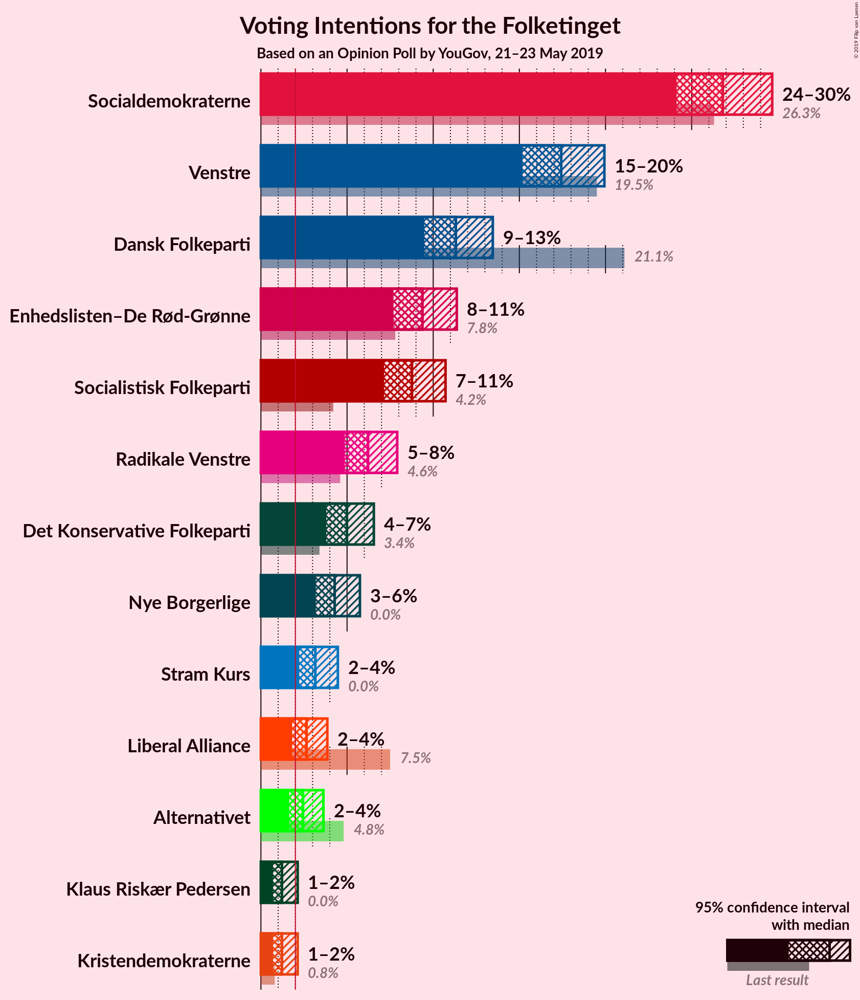

### Confidence Intervals

| Party | Last Result | Poll Result | 80% Confidence Interval | 90% Confidence Interval | 95% Confidence Interval | 99% Confidence Interval |
|:-----:|:-----------:|:-----------:|:-----------------------:|:-----------------------:|:-----------------------:|:-----------------------:|
| Socialdemokraterne | 26.3% | 26.8% | 25.0–28.7% |24.6–29.2% |24.1–29.7% |23.3–30.6% |
| Venstre | 19.5% | 17.4% | 16.0–19.1% |15.5–19.5% |15.2–19.9% |14.5–20.7% |
| Dansk Folkeparti | 21.1% | 11.3% | 10.1–12.7% |9.8–13.1% |9.5–13.5% |8.9–14.2% |
| Enhedslisten–De Rød-Grønne | 7.8% | 9.4% | 8.3–10.7% |8.0–11.1% |7.7–11.4% |7.2–12.0% |
| Socialistisk Folkeparti | 4.2% | 8.8% | 7.7–10.0% |7.4–10.4% |7.1–10.7% |6.7–11.3% |
| Radikale Venstre | 4.6% | 6.2% | 5.3–7.3% |5.1–7.6% |4.9–7.9% |4.5–8.5% |
| Det Konservative Folkeparti | 3.4% | 5.0% | 4.2–6.0% |4.0–6.3% |3.8–6.6% |3.4–7.1% |
| Nye Borgerlige | 0.0% | 4.3% | 3.6–5.2% |3.4–5.5% |3.2–5.7% |2.9–6.2% |
| Stram Kurs | 0.0% | 3.2% | 2.5–4.0% |2.4–4.2% |2.2–4.5% |2.0–4.9% |
| Liberal Alliance | 7.5% | 2.7% | 2.1–3.4% |1.9–3.7% |1.8–3.9% |1.6–4.3% |
| Alternativet | 4.8% | 2.4% | 1.9–3.2% |1.8–3.4% |1.6–3.6% |1.4–4.0% |
| Kristendemokraterne | 0.8% | 1.2% | 0.9–1.8% |0.8–2.0% |0.7–2.1% |0.6–2.5% |
| Klaus Riskær Pedersen | 0.0% | 1.2% | 0.9–1.8% |0.8–2.0% |0.7–2.1% |0.6–2.5% |

*Note:* The poll result column reflects the actual value used in the calculations. Published results may vary slightly, and in addition be rounded to fewer digits.

## Seats

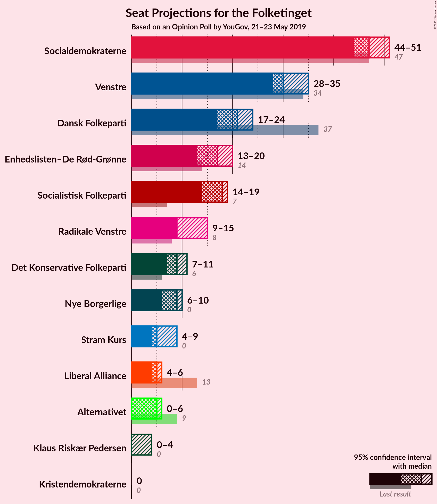

### Confidence Intervals

| Party | Last Result | Median | 80% Confidence Interval | 90% Confidence Interval | 95% Confidence Interval | 99% Confidence Interval |
|:-----:|:-----------:|:------:|:-----------------------:|:-----------------------:|:-----------------------:|:-----------------------:|
| <a href="#socialdemokraterne">Socialdemokraterne</a> | 47 | 47 | 45–51 |45–51 |44–51 |42–54 |
| <a href="#venstre">Venstre</a> | 34 | 30 | 29–33 |28–35 |28–35 |26–37 |
| <a href="#dansk-folkeparti">Dansk Folkeparti</a> | 37 | 21 | 19–24 |18–24 |17–24 |16–25 |
| <a href="#enhedslisten–de-rød-grønne">Enhedslisten–De Rød-Grønne</a> | 14 | 17 | 14–18 |13–19 |13–20 |12–21 |
| <a href="#socialistisk-folkeparti">Socialistisk Folkeparti</a> | 7 | 18 | 14–18 |14–19 |14–19 |13–21 |
| <a href="#radikale-venstre">Radikale Venstre</a> | 8 | 9 | 9–13 |9–15 |9–15 |8–15 |
| <a href="#det-konservative-folkeparti">Det Konservative Folkeparti</a> | 6 | 9 | 8–10 |8–11 |7–11 |6–12 |
| <a href="#nye-borgerlige">Nye Borgerlige</a> | 0 | 9 | 7–9 |6–10 |6–10 |6–10 |
| <a href="#stram-kurs">Stram Kurs</a> | 0 | 5 | 5–9 |5–9 |4–9 |4–9 |
| <a href="#liberal-alliance">Liberal Alliance</a> | 13 | 5 | 4–5 |4–6 |4–6 |0–9 |
| <a href="#alternativet">Alternativet</a> | 9 | 5 | 0–6 |0–6 |0–6 |0–7 |
| <a href="#kristendemokraterne">Kristendemokraterne</a> | 0 | 0 | 0 |0 |0 |0–4 |
| <a href="#klaus-riskær-pedersen">Klaus Riskær Pedersen</a> | 0 | 0 | 0 |0 |0–4 |0–5 |

### Socialdemokraterne

*For a full overview of the results for this party, see the [Socialdemokraterne](party-socialdemokraterne.html) page.*

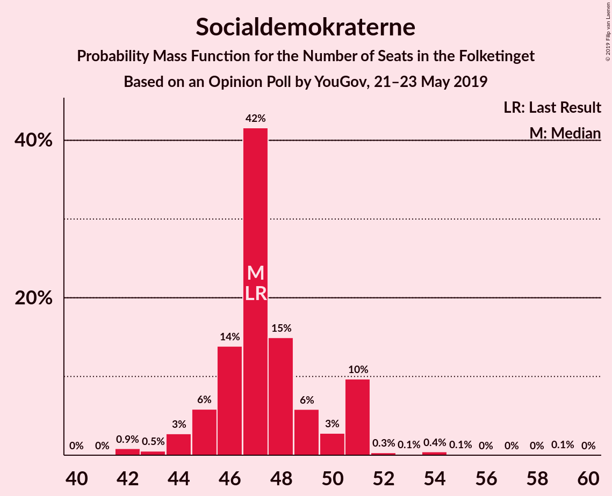

| Number of Seats | Probability | Accumulated | Special Marks |
|:---------------:|:-----------:|:-----------:|:-------------:|
| 40 | 0% | 100% |  |
| 41 | 0% | 99.9% |  |
| 42 | 0.9% | 99.9% |  |
| 43 | 0.5% | 99.1% |  |
| 44 | 3% | 98.5% |  |
| 45 | 6% | 96% |  |
| 46 | 14% | 90% |  |
| 47 | 42% | 76% | Last Result, Median |
| 48 | 15% | 34% |  |
| 49 | 6% | 20% |  |
| 50 | 3% | 14% |  |
| 51 | 10% | 11% |  |
| 52 | 0.3% | 1.2% |  |
| 53 | 0.1% | 0.9% |  |
| 54 | 0.4% | 0.7% |  |
| 55 | 0.1% | 0.3% |  |
| 56 | 0% | 0.2% |  |
| 57 | 0% | 0.2% |  |
| 58 | 0% | 0.1% |  |
| 59 | 0.1% | 0.1% |  |
| 60 | 0% | 0% |  |

### Venstre

*For a full overview of the results for this party, see the [Venstre](party-venstre.html) page.*

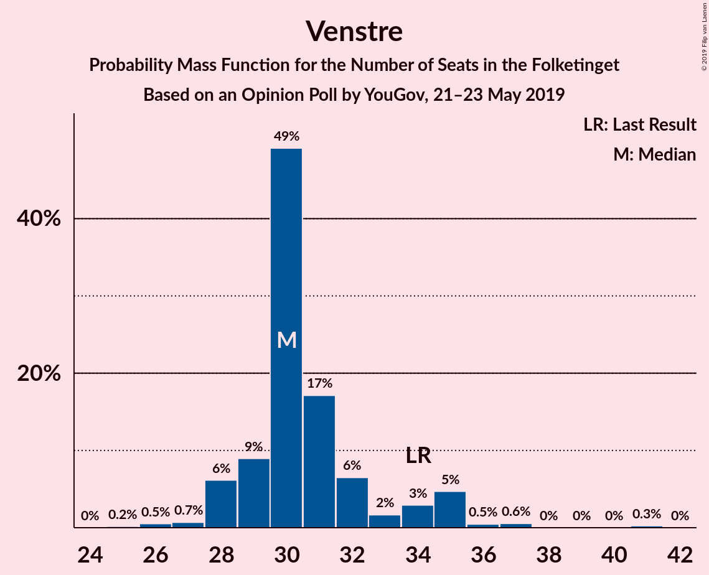

| Number of Seats | Probability | Accumulated | Special Marks |
|:---------------:|:-----------:|:-----------:|:-------------:|
| 24 | 0% | 100% |  |
| 25 | 0.2% | 99.9% |  |
| 26 | 0.5% | 99.7% |  |
| 27 | 0.7% | 99.2% |  |
| 28 | 6% | 98.5% |  |
| 29 | 9% | 92% |  |
| 30 | 49% | 83% | Median |
| 31 | 17% | 34% |  |
| 32 | 6% | 17% |  |
| 33 | 2% | 11% |  |
| 34 | 3% | 9% | Last Result |
| 35 | 5% | 6% |  |
| 36 | 0.5% | 1.3% |  |
| 37 | 0.6% | 0.9% |  |
| 38 | 0% | 0.3% |  |
| 39 | 0% | 0.3% |  |
| 40 | 0% | 0.3% |  |
| 41 | 0.3% | 0.3% |  |
| 42 | 0% | 0% |  |

### Dansk Folkeparti

*For a full overview of the results for this party, see the [Dansk Folkeparti](party-danskfolkeparti.html) page.*

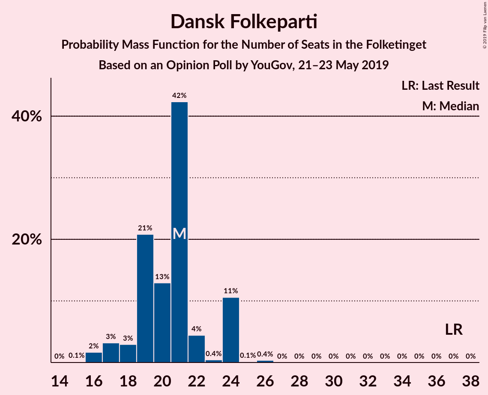

| Number of Seats | Probability | Accumulated | Special Marks |
|:---------------:|:-----------:|:-----------:|:-------------:|
| 15 | 0.1% | 100% |  |
| 16 | 2% | 99.9% |  |
| 17 | 3% | 98% |  |
| 18 | 3% | 95% |  |
| 19 | 21% | 92% |  |
| 20 | 13% | 71% |  |
| 21 | 42% | 58% | Median |
| 22 | 4% | 16% |  |
| 23 | 0.4% | 12% |  |
| 24 | 11% | 11% |  |
| 25 | 0.1% | 0.5% |  |
| 26 | 0.4% | 0.4% |  |
| 27 | 0% | 0% |  |
| 28 | 0% | 0% |  |
| 29 | 0% | 0% |  |
| 30 | 0% | 0% |  |
| 31 | 0% | 0% |  |
| 32 | 0% | 0% |  |
| 33 | 0% | 0% |  |
| 34 | 0% | 0% |  |
| 35 | 0% | 0% |  |
| 36 | 0% | 0% |  |
| 37 | 0% | 0% | Last Result |

### Enhedslisten–De Rød-Grønne

*For a full overview of the results for this party, see the [Enhedslisten–De Rød-Grønne](party-enhedslisten–derød-grønne.html) page.*

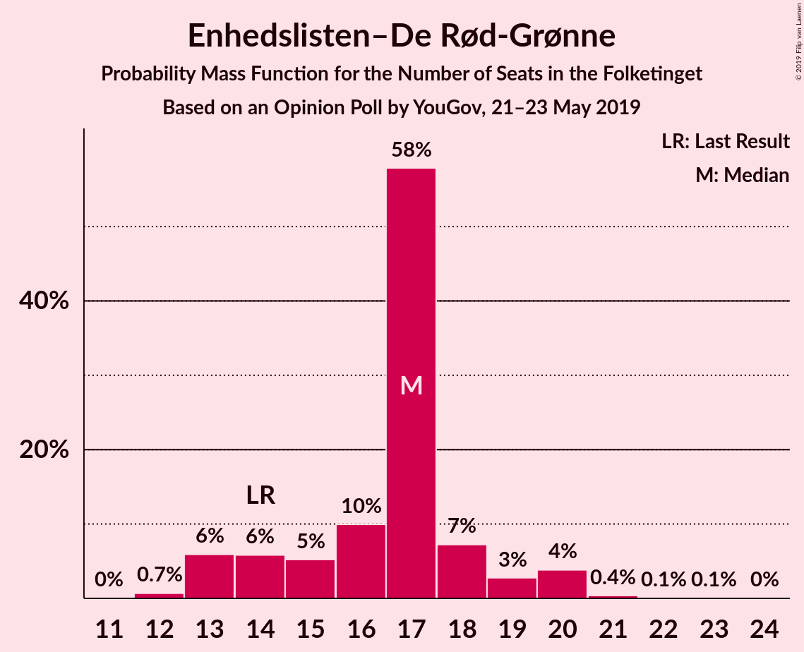

| Number of Seats | Probability | Accumulated | Special Marks |
|:---------------:|:-----------:|:-----------:|:-------------:|
| 12 | 0.7% | 100% |  |
| 13 | 6% | 99.3% |  |
| 14 | 6% | 93% | Last Result |
| 15 | 5% | 88% |  |
| 16 | 10% | 82% |  |
| 17 | 58% | 72% | Median |
| 18 | 7% | 14% |  |
| 19 | 3% | 7% |  |
| 20 | 4% | 4% |  |
| 21 | 0.4% | 0.6% |  |
| 22 | 0.1% | 0.2% |  |
| 23 | 0.1% | 0.1% |  |
| 24 | 0% | 0% |  |

### Socialistisk Folkeparti

*For a full overview of the results for this party, see the [Socialistisk Folkeparti](party-socialistiskfolkeparti.html) page.*

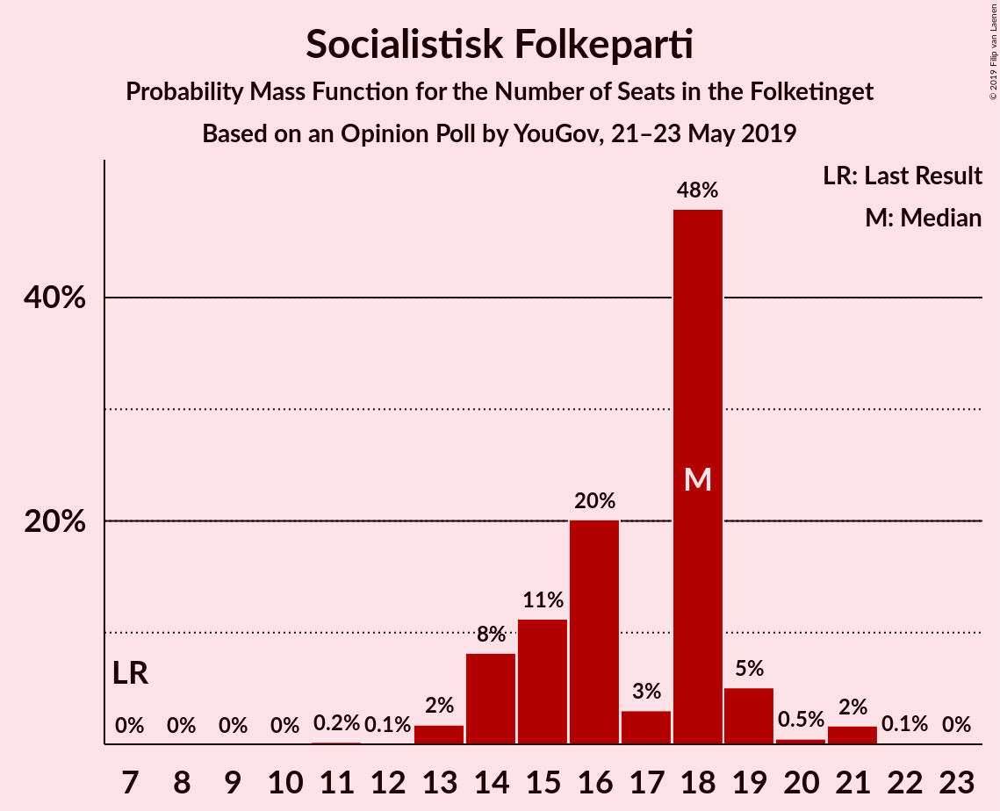

| Number of Seats | Probability | Accumulated | Special Marks |
|:---------------:|:-----------:|:-----------:|:-------------:|
| 7 | 0% | 100% | Last Result |
| 8 | 0% | 100% |  |
| 9 | 0% | 100% |  |
| 10 | 0% | 100% |  |
| 11 | 0.2% | 100% |  |
| 12 | 0.1% | 99.8% |  |
| 13 | 2% | 99.7% |  |
| 14 | 8% | 98% |  |
| 15 | 11% | 90% |  |
| 16 | 20% | 79% |  |
| 17 | 3% | 58% |  |
| 18 | 48% | 55% | Median |
| 19 | 5% | 7% |  |
| 20 | 0.5% | 2% |  |
| 21 | 2% | 2% |  |
| 22 | 0.1% | 0.2% |  |
| 23 | 0% | 0% |  |

### Radikale Venstre

*For a full overview of the results for this party, see the [Radikale Venstre](party-radikalevenstre.html) page.*

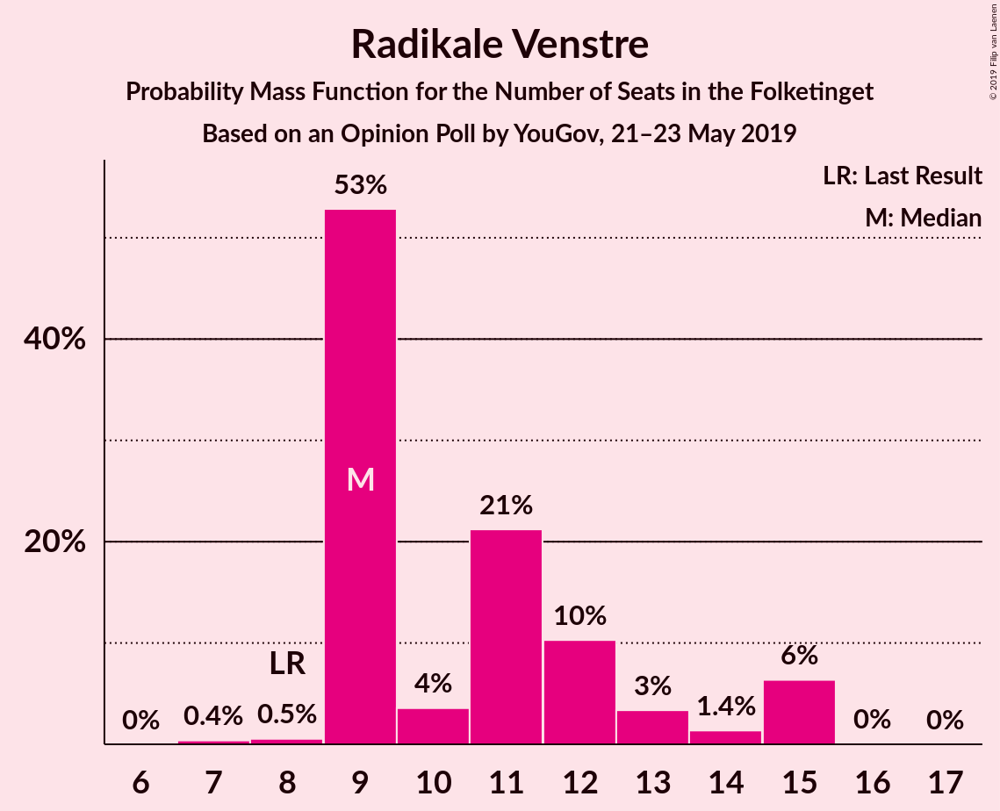

| Number of Seats | Probability | Accumulated | Special Marks |
|:---------------:|:-----------:|:-----------:|:-------------:|
| 7 | 0.4% | 100% |  |
| 8 | 0.5% | 99.6% | Last Result |
| 9 | 53% | 99.1% | Median |
| 10 | 4% | 46% |  |
| 11 | 21% | 43% |  |
| 12 | 10% | 21% |  |
| 13 | 3% | 11% |  |
| 14 | 1.4% | 8% |  |
| 15 | 6% | 6% |  |
| 16 | 0% | 0.1% |  |
| 17 | 0% | 0% |  |

### Det Konservative Folkeparti

*For a full overview of the results for this party, see the [Det Konservative Folkeparti](party-detkonservativefolkeparti.html) page.*

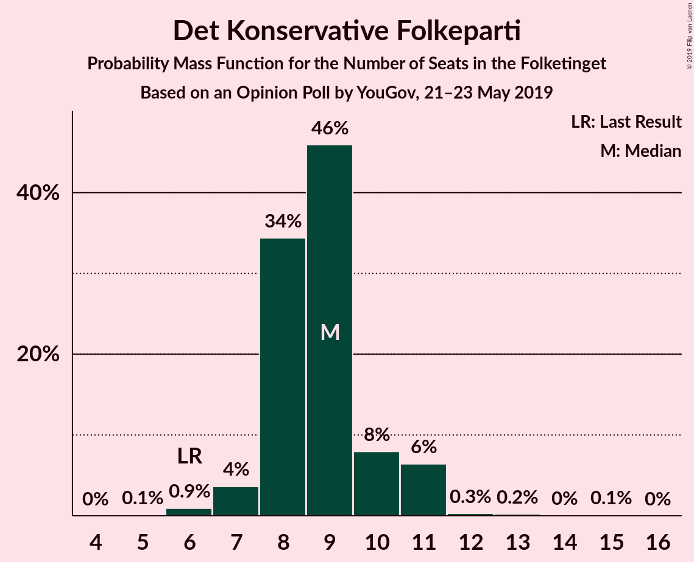

| Number of Seats | Probability | Accumulated | Special Marks |
|:---------------:|:-----------:|:-----------:|:-------------:|
| 5 | 0.1% | 100% |  |
| 6 | 0.9% | 99.9% | Last Result |
| 7 | 4% | 99.0% |  |
| 8 | 34% | 95% |  |
| 9 | 46% | 61% | Median |
| 10 | 8% | 15% |  |
| 11 | 6% | 7% |  |
| 12 | 0.3% | 0.7% |  |
| 13 | 0.2% | 0.4% |  |
| 14 | 0% | 0.1% |  |
| 15 | 0.1% | 0.1% |  |
| 16 | 0% | 0% |  |

### Nye Borgerlige

*For a full overview of the results for this party, see the [Nye Borgerlige](party-nyeborgerlige.html) page.*

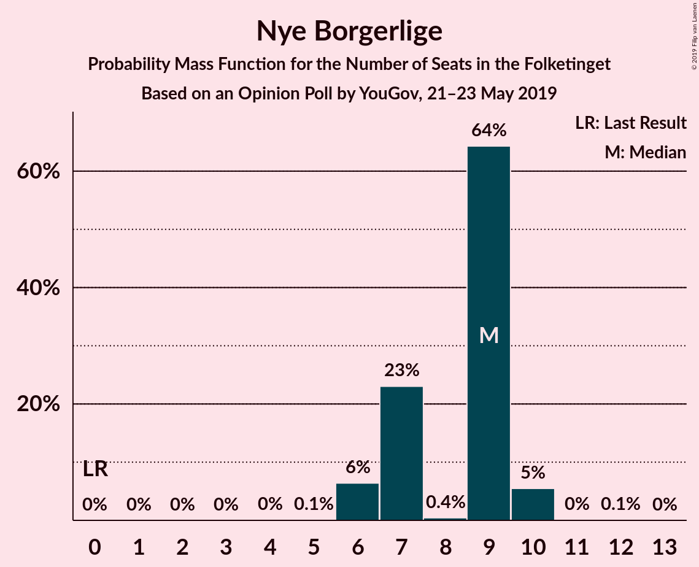

| Number of Seats | Probability | Accumulated | Special Marks |
|:---------------:|:-----------:|:-----------:|:-------------:|
| 0 | 0% | 100% | Last Result |
| 1 | 0% | 100% |  |
| 2 | 0% | 100% |  |
| 3 | 0% | 100% |  |
| 4 | 0% | 100% |  |
| 5 | 0.1% | 100% |  |
| 6 | 6% | 99.8% |  |
| 7 | 23% | 93% |  |
| 8 | 0.4% | 70% |  |
| 9 | 64% | 70% | Median |
| 10 | 5% | 6% |  |
| 11 | 0% | 0.2% |  |
| 12 | 0.1% | 0.1% |  |
| 13 | 0% | 0% |  |

### Stram Kurs

*For a full overview of the results for this party, see the [Stram Kurs](party-stramkurs.html) page.*

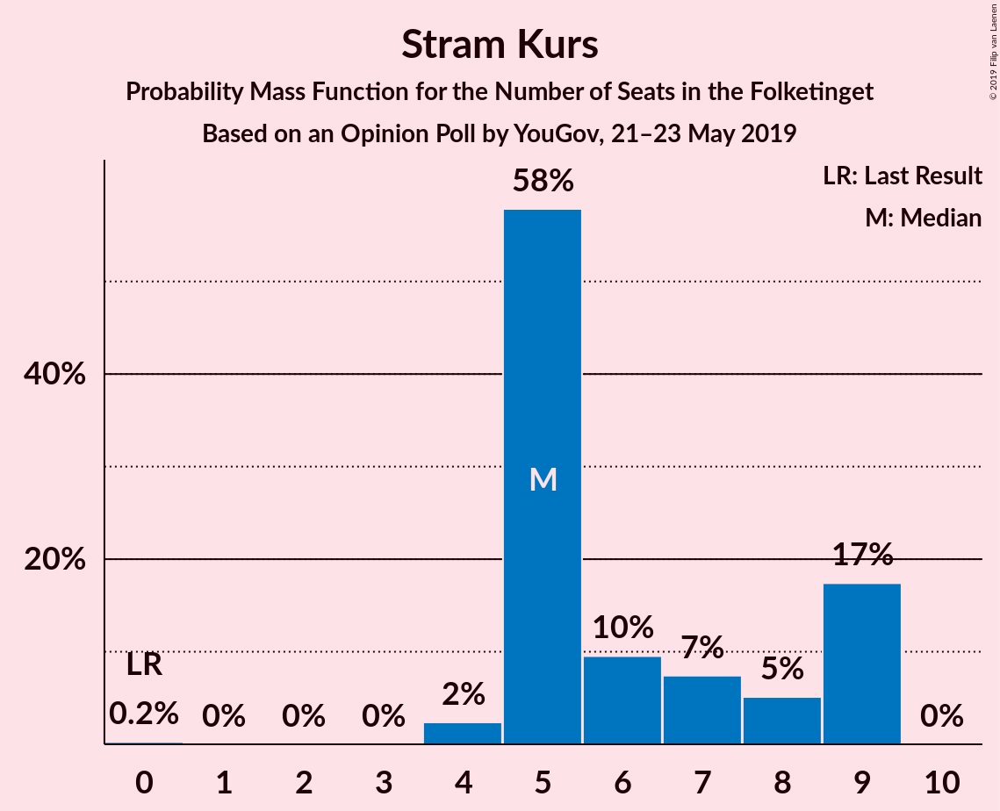

| Number of Seats | Probability | Accumulated | Special Marks |
|:---------------:|:-----------:|:-----------:|:-------------:|
| 0 | 0.2% | 100% | Last Result |
| 1 | 0% | 99.8% |  |
| 2 | 0% | 99.8% |  |
| 3 | 0% | 99.8% |  |
| 4 | 2% | 99.7% |  |
| 5 | 58% | 97% | Median |
| 6 | 10% | 40% |  |
| 7 | 7% | 30% |  |
| 8 | 5% | 23% |  |
| 9 | 17% | 17% |  |
| 10 | 0% | 0% |  |

### Liberal Alliance

*For a full overview of the results for this party, see the [Liberal Alliance](party-liberalalliance.html) page.*

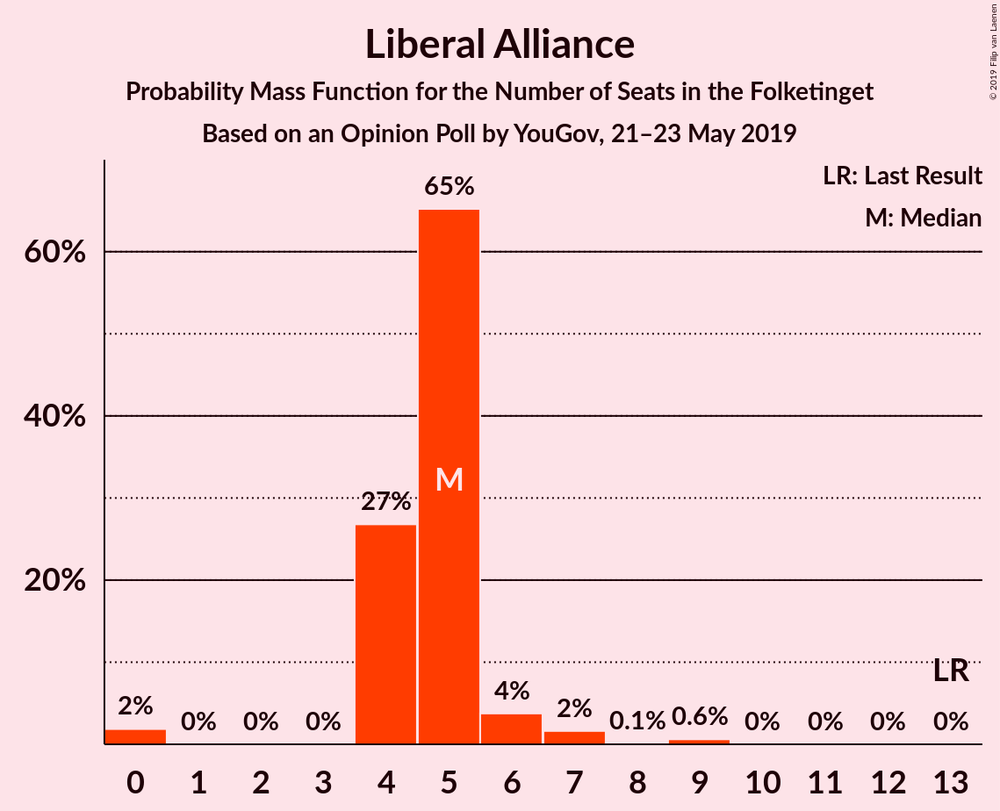

| Number of Seats | Probability | Accumulated | Special Marks |
|:---------------:|:-----------:|:-----------:|:-------------:|
| 0 | 2% | 100% |  |
| 1 | 0% | 98% |  |
| 2 | 0% | 98% |  |
| 3 | 0% | 98% |  |
| 4 | 27% | 98% |  |
| 5 | 65% | 71% | Median |
| 6 | 4% | 6% |  |
| 7 | 2% | 2% |  |
| 8 | 0.1% | 0.7% |  |
| 9 | 0.6% | 0.6% |  |
| 10 | 0% | 0% |  |
| 11 | 0% | 0% |  |
| 12 | 0% | 0% |  |
| 13 | 0% | 0% | Last Result |

### Alternativet

*For a full overview of the results for this party, see the [Alternativet](party-alternativet.html) page.*

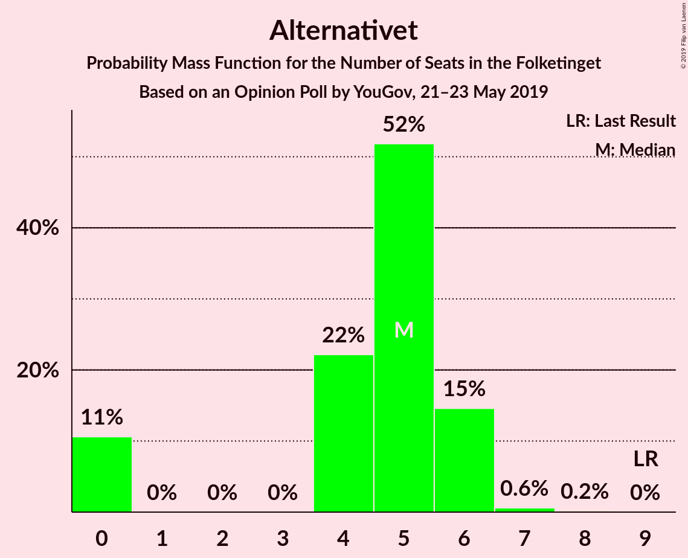

| Number of Seats | Probability | Accumulated | Special Marks |
|:---------------:|:-----------:|:-----------:|:-------------:|
| 0 | 11% | 100% |  |
| 1 | 0% | 89% |  |
| 2 | 0% | 89% |  |
| 3 | 0% | 89% |  |
| 4 | 22% | 89% |  |
| 5 | 52% | 67% | Median |
| 6 | 15% | 15% |  |
| 7 | 0.6% | 0.8% |  |
| 8 | 0.2% | 0.2% |  |
| 9 | 0% | 0% | Last Result |

### Kristendemokraterne

*For a full overview of the results for this party, see the [Kristendemokraterne](party-kristendemokraterne.html) page.*

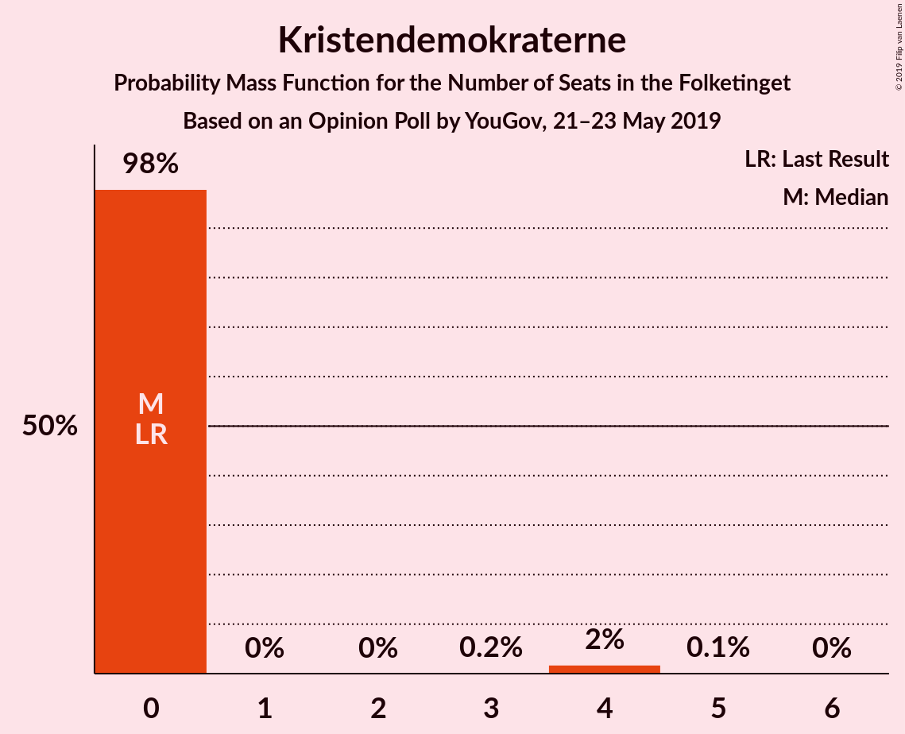

| Number of Seats | Probability | Accumulated | Special Marks |
|:---------------:|:-----------:|:-----------:|:-------------:|
| 0 | 98% | 100% | Last Result, Median |
| 1 | 0% | 2% |  |
| 2 | 0% | 2% |  |
| 3 | 0.2% | 2% |  |
| 4 | 2% | 2% |  |
| 5 | 0.1% | 0.1% |  |
| 6 | 0% | 0% |  |

### Klaus Riskær Pedersen

*For a full overview of the results for this party, see the [Klaus Riskær Pedersen](party-klausriskærpedersen.html) page.*

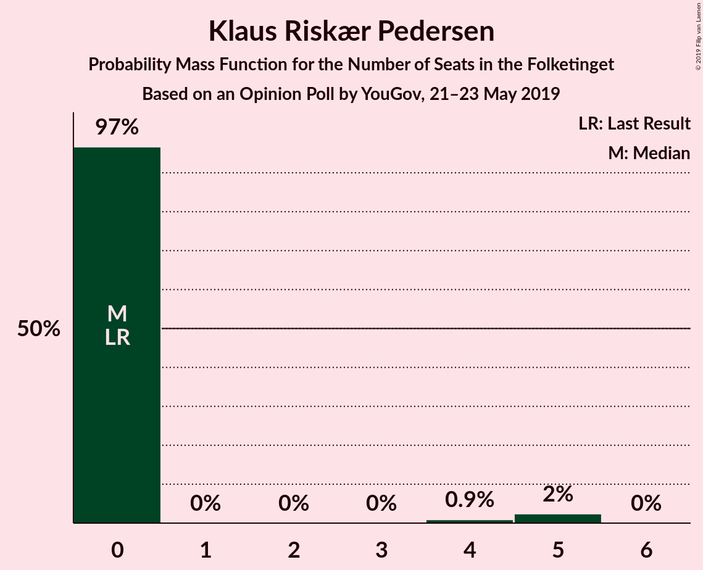

| Number of Seats | Probability | Accumulated | Special Marks |
|:---------------:|:-----------:|:-----------:|:-------------:|
| 0 | 97% | 100% | Last Result, Median |
| 1 | 0% | 3% |  |
| 2 | 0% | 3% |  |
| 3 | 0% | 3% |  |
| 4 | 0.9% | 3% |  |
| 5 | 2% | 2% |  |
| 6 | 0% | 0% |  |

## Coalitions

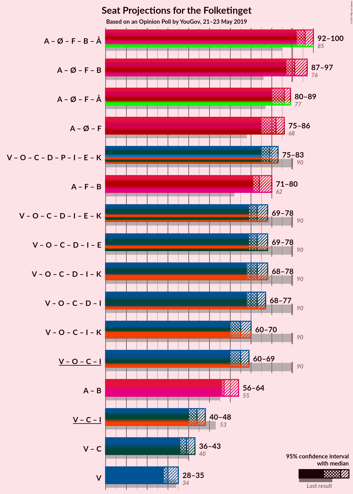

### Confidence Intervals

| Coalition | Last Result | Median | Majority? | 80% Confidence Interval | 90% Confidence Interval | 95% Confidence Interval | 99% Confidence Interval |
|:---------:|:-----------:|:------:|:---------:|:-----------------------:|:-----------------------:|:-----------------------:|:-----------------------:|
| Socialdemokraterne – Enhedslisten–De Rød-Grønne – Socialistisk Folkeparti – Radikale Venstre – Alternativet | 85 | 96 | 99.2% | 94–97 | 93–98 | 92–100 | 88–106 |
| Socialdemokraterne – Enhedslisten–De Rød-Grønne – Socialistisk Folkeparti – Radikale Venstre | 76 | 91 | 89% | 89–97 | 88–97 | 87–97 | 85–101 |
| Socialdemokraterne – Enhedslisten–De Rød-Grønne – Socialistisk Folkeparti – Alternativet | 77 | 86 | 2% | 82–87 | 81–87 | 80–89 | 75–95 |
| Socialdemokraterne – Enhedslisten–De Rød-Grønne – Socialistisk Folkeparti | 68 | 82 | 2% | 77–82 | 76–85 | 75–86 | 74–90 |
| Venstre – Dansk Folkeparti – Det Konservative Folkeparti – Nye Borgerlige – Stram Kurs – Liberal Alliance – Klaus Riskær Pedersen – Kristendemokraterne | 90 | 79 | 0% | 78–81 | 77–82 | 75–83 | 69–87 |
| Socialdemokraterne – Socialistisk Folkeparti – Radikale Venstre | 62 | 74 | 0% | 72–79 | 71–80 | 71–80 | 69–82 |
| Venstre – Dansk Folkeparti – Det Konservative Folkeparti – Nye Borgerlige – Liberal Alliance – Klaus Riskær Pedersen – Kristendemokraterne | 90 | 73 | 0% | 72–74 | 71–77 | 69–78 | 64–80 |
| Venstre – Dansk Folkeparti – Det Konservative Folkeparti – Nye Borgerlige – Liberal Alliance – Klaus Riskær Pedersen | 90 | 73 | 0% | 72–74 | 71–75 | 69–78 | 64–80 |
| Venstre – Dansk Folkeparti – Det Konservative Folkeparti – Nye Borgerlige – Liberal Alliance – Kristendemokraterne | 90 | 73 | 0% | 72–74 | 70–77 | 68–78 | 64–80 |
| Venstre – Dansk Folkeparti – Det Konservative Folkeparti – Nye Borgerlige – Liberal Alliance | 90 | 73 | 0% | 72–74 | 70–74 | 68–77 | 64–80 |
| Venstre – Dansk Folkeparti – Det Konservative Folkeparti – Liberal Alliance – Kristendemokraterne | 90 | 65 | 0% | 63–67 | 62–68 | 60–70 | 57–73 |
| Venstre – Dansk Folkeparti – Det Konservative Folkeparti – Liberal Alliance | 90 | 65 | 0% | 63–66 | 62–67 | 60–69 | 57–73 |
| Socialdemokraterne – Radikale Venstre | 55 | 57 | 0% | 56–62 | 56–64 | 56–64 | 53–65 |
| Venstre – Det Konservative Folkeparti – Liberal Alliance | 53 | 44 | 0% | 41–47 | 40–47 | 40–48 | 37–51 |
| Venstre – Det Konservative Folkeparti | 40 | 39 | 0% | 37–42 | 36–43 | 36–43 | 33–47 |
| Venstre | 34 | 30 | 0% | 29–33 | 28–35 | 28–35 | 26–37 |

### Socialdemokraterne – Enhedslisten–De Rød-Grønne – Socialistisk Folkeparti – Radikale Venstre – Alternativet

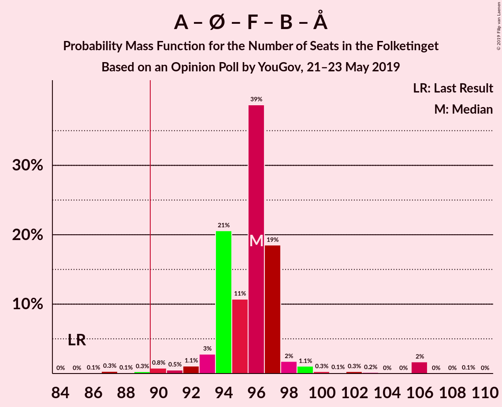

| Number of Seats | Probability | Accumulated | Special Marks |
|:---------------:|:-----------:|:-----------:|:-------------:|
| 85 | 0% | 100% | Last Result |
| 86 | 0.1% | 100% |  |
| 87 | 0.3% | 99.9% |  |
| 88 | 0.1% | 99.6% |  |
| 89 | 0.3% | 99.5% |  |
| 90 | 0.8% | 99.2% | Majority |
| 91 | 0.5% | 98% |  |
| 92 | 1.1% | 98% |  |
| 93 | 3% | 97% |  |
| 94 | 21% | 94% |  |
| 95 | 11% | 73% |  |
| 96 | 39% | 63% | Median |
| 97 | 19% | 24% |  |
| 98 | 2% | 6% |  |
| 99 | 1.1% | 4% |  |
| 100 | 0.3% | 3% |  |
| 101 | 0.1% | 2% |  |
| 102 | 0.3% | 2% |  |
| 103 | 0.2% | 2% |  |
| 104 | 0% | 2% |  |
| 105 | 0% | 2% |  |
| 106 | 2% | 2% |  |
| 107 | 0% | 0.1% |  |
| 108 | 0% | 0.1% |  |
| 109 | 0.1% | 0.1% |  |
| 110 | 0% | 0% |  |

### Socialdemokraterne – Enhedslisten–De Rød-Grønne – Socialistisk Folkeparti – Radikale Venstre

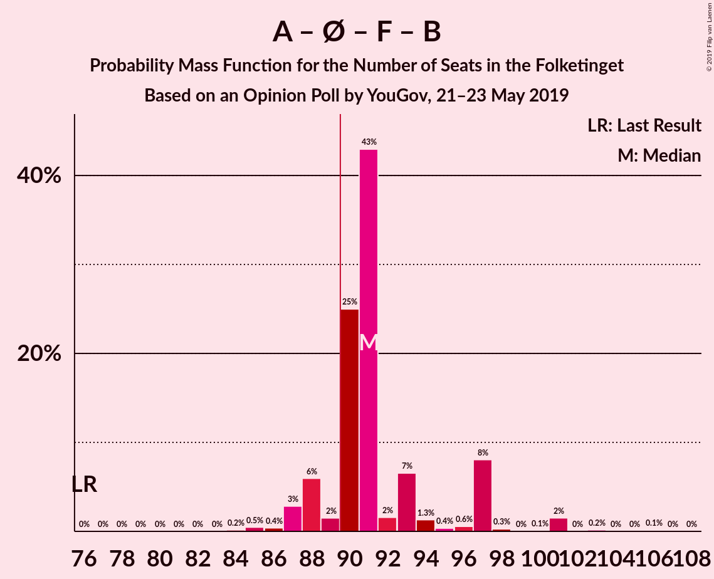

| Number of Seats | Probability | Accumulated | Special Marks |
|:---------------:|:-----------:|:-----------:|:-------------:|
| 76 | 0% | 100% | Last Result |
| 77 | 0% | 100% |  |
| 78 | 0% | 100% |  |
| 79 | 0% | 100% |  |
| 80 | 0% | 100% |  |
| 81 | 0% | 100% |  |
| 82 | 0% | 100% |  |
| 83 | 0% | 99.9% |  |
| 84 | 0.2% | 99.9% |  |
| 85 | 0.5% | 99.7% |  |
| 86 | 0.4% | 99.3% |  |
| 87 | 3% | 98.9% |  |
| 88 | 6% | 96% |  |
| 89 | 2% | 90% |  |
| 90 | 25% | 89% | Majority |
| 91 | 43% | 64% | Median |
| 92 | 2% | 21% |  |
| 93 | 7% | 19% |  |
| 94 | 1.3% | 12% |  |
| 95 | 0.4% | 11% |  |
| 96 | 0.6% | 11% |  |
| 97 | 8% | 10% |  |
| 98 | 0.3% | 2% |  |
| 99 | 0% | 2% |  |
| 100 | 0.1% | 2% |  |
| 101 | 2% | 2% |  |
| 102 | 0% | 0.3% |  |
| 103 | 0.2% | 0.3% |  |
| 104 | 0% | 0.1% |  |
| 105 | 0% | 0.1% |  |
| 106 | 0.1% | 0.1% |  |
| 107 | 0% | 0% |  |

### Socialdemokraterne – Enhedslisten–De Rød-Grønne – Socialistisk Folkeparti – Alternativet

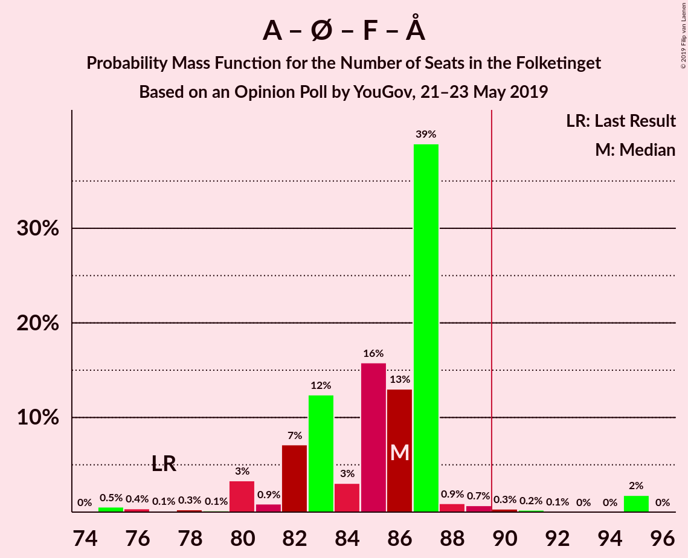

| Number of Seats | Probability | Accumulated | Special Marks |
|:---------------:|:-----------:|:-----------:|:-------------:|
| 75 | 0.5% | 100% |  |
| 76 | 0.4% | 99.4% |  |
| 77 | 0.1% | 99.1% | Last Result |
| 78 | 0.3% | 99.0% |  |
| 79 | 0.1% | 98.7% |  |
| 80 | 3% | 98.5% |  |
| 81 | 0.9% | 95% |  |
| 82 | 7% | 94% |  |
| 83 | 12% | 87% |  |
| 84 | 3% | 75% |  |
| 85 | 16% | 72% |  |
| 86 | 13% | 56% |  |
| 87 | 39% | 43% | Median |
| 88 | 0.9% | 4% |  |
| 89 | 0.7% | 3% |  |
| 90 | 0.3% | 2% | Majority |
| 91 | 0.2% | 2% |  |
| 92 | 0.1% | 2% |  |
| 93 | 0% | 2% |  |
| 94 | 0% | 2% |  |
| 95 | 2% | 2% |  |
| 96 | 0% | 0% |  |

### Socialdemokraterne – Enhedslisten–De Rød-Grønne – Socialistisk Folkeparti

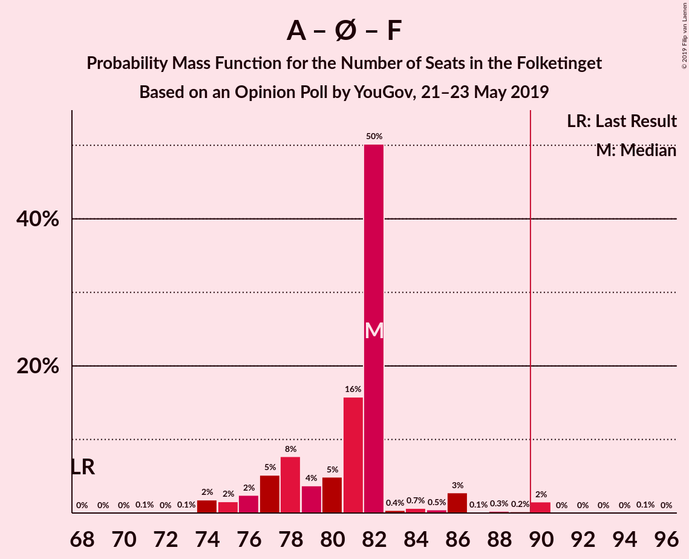

| Number of Seats | Probability | Accumulated | Special Marks |
|:---------------:|:-----------:|:-----------:|:-------------:|
| 68 | 0% | 100% | Last Result |
| 69 | 0% | 100% |  |
| 70 | 0% | 100% |  |
| 71 | 0.1% | 99.9% |  |
| 72 | 0% | 99.8% |  |
| 73 | 0.1% | 99.8% |  |
| 74 | 2% | 99.7% |  |
| 75 | 2% | 98% |  |
| 76 | 2% | 96% |  |
| 77 | 5% | 94% |  |
| 78 | 8% | 89% |  |
| 79 | 4% | 81% |  |
| 80 | 5% | 77% |  |
| 81 | 16% | 72% |  |
| 82 | 50% | 57% | Median |
| 83 | 0.4% | 6% |  |
| 84 | 0.7% | 6% |  |
| 85 | 0.5% | 5% |  |
| 86 | 3% | 5% |  |
| 87 | 0.1% | 2% |  |
| 88 | 0.3% | 2% |  |
| 89 | 0.2% | 2% |  |
| 90 | 2% | 2% | Majority |
| 91 | 0% | 0.1% |  |
| 92 | 0% | 0.1% |  |
| 93 | 0% | 0.1% |  |
| 94 | 0% | 0.1% |  |
| 95 | 0.1% | 0.1% |  |
| 96 | 0% | 0% |  |

### Venstre – Dansk Folkeparti – Det Konservative Folkeparti – Nye Borgerlige – Stram Kurs – Liberal Alliance – Klaus Riskær Pedersen – Kristendemokraterne

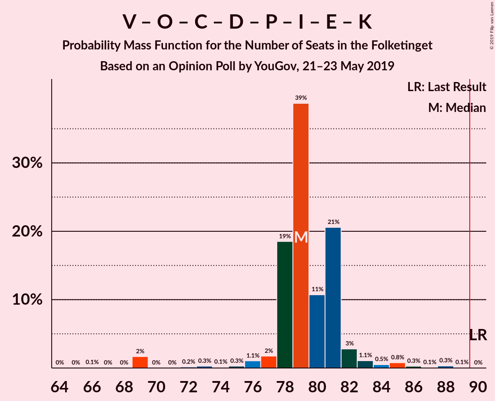

| Number of Seats | Probability | Accumulated | Special Marks |
|:---------------:|:-----------:|:-----------:|:-------------:|
| 66 | 0.1% | 100% |  |
| 67 | 0% | 99.9% |  |
| 68 | 0% | 99.9% |  |
| 69 | 2% | 99.9% |  |
| 70 | 0% | 98% |  |
| 71 | 0% | 98% |  |
| 72 | 0.2% | 98% |  |
| 73 | 0.3% | 98% |  |
| 74 | 0.1% | 98% |  |
| 75 | 0.3% | 98% |  |
| 76 | 1.1% | 97% |  |
| 77 | 2% | 96% |  |
| 78 | 19% | 94% |  |
| 79 | 39% | 76% | Median |
| 80 | 11% | 37% |  |
| 81 | 21% | 27% |  |
| 82 | 3% | 6% |  |
| 83 | 1.1% | 3% |  |
| 84 | 0.5% | 2% |  |
| 85 | 0.8% | 2% |  |
| 86 | 0.3% | 0.8% |  |
| 87 | 0.1% | 0.5% |  |
| 88 | 0.3% | 0.4% |  |
| 89 | 0.1% | 0.1% |  |
| 90 | 0% | 0% | Last Result, Majority |

### Socialdemokraterne – Socialistisk Folkeparti – Radikale Venstre

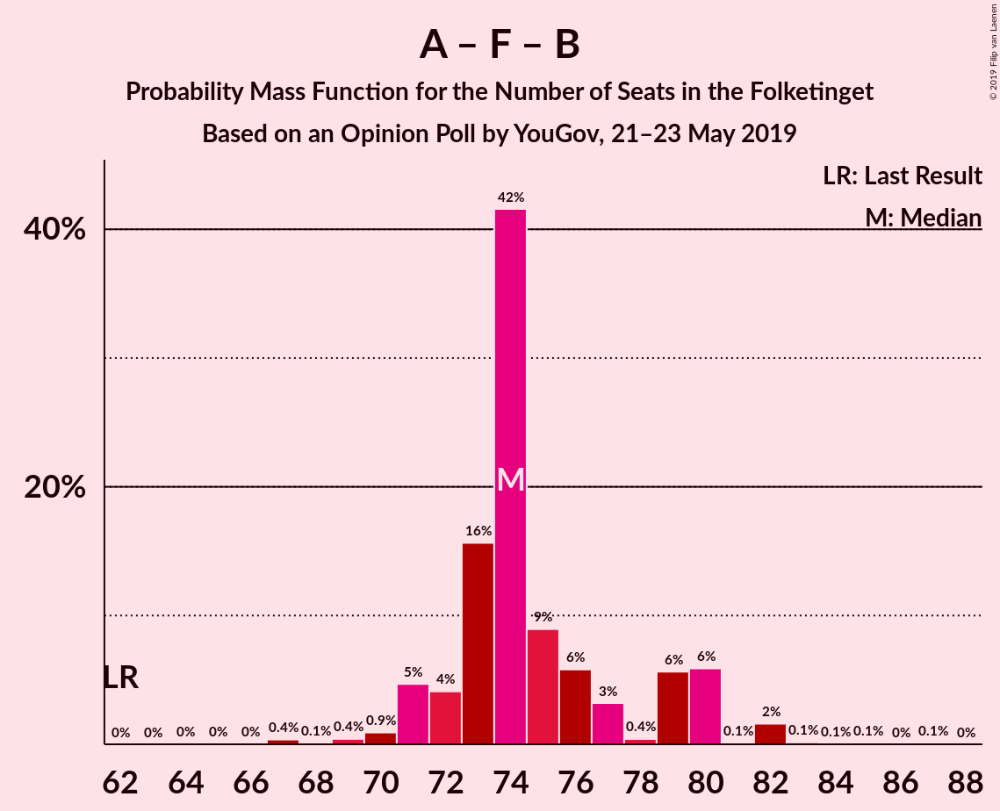

| Number of Seats | Probability | Accumulated | Special Marks |
|:---------------:|:-----------:|:-----------:|:-------------:|
| 62 | 0% | 100% | Last Result |
| 63 | 0% | 100% |  |
| 64 | 0% | 100% |  |
| 65 | 0% | 100% |  |
| 66 | 0% | 100% |  |
| 67 | 0.4% | 100% |  |
| 68 | 0.1% | 99.6% |  |
| 69 | 0.4% | 99.5% |  |
| 70 | 0.9% | 99.1% |  |
| 71 | 5% | 98% |  |
| 72 | 4% | 93% |  |
| 73 | 16% | 89% |  |
| 74 | 42% | 74% | Median |
| 75 | 9% | 32% |  |
| 76 | 6% | 23% |  |
| 77 | 3% | 17% |  |
| 78 | 0.4% | 14% |  |
| 79 | 6% | 14% |  |
| 80 | 6% | 8% |  |
| 81 | 0.1% | 2% |  |
| 82 | 2% | 2% |  |
| 83 | 0.1% | 0.5% |  |
| 84 | 0.1% | 0.3% |  |
| 85 | 0.1% | 0.3% |  |
| 86 | 0% | 0.1% |  |
| 87 | 0.1% | 0.1% |  |
| 88 | 0% | 0% |  |

### Venstre – Dansk Folkeparti – Det Konservative Folkeparti – Nye Borgerlige – Liberal Alliance – Klaus Riskær Pedersen – Kristendemokraterne

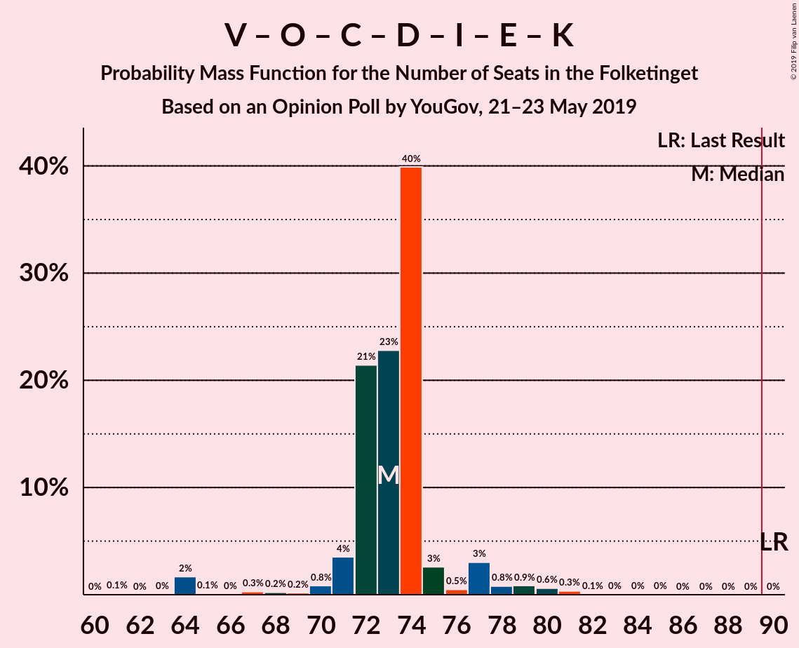

| Number of Seats | Probability | Accumulated | Special Marks |
|:---------------:|:-----------:|:-----------:|:-------------:|
| 61 | 0.1% | 100% |  |
| 62 | 0% | 99.9% |  |
| 63 | 0% | 99.9% |  |
| 64 | 2% | 99.8% |  |
| 65 | 0.1% | 98% |  |
| 66 | 0% | 98% |  |
| 67 | 0.3% | 98% |  |
| 68 | 0.2% | 98% |  |
| 69 | 0.2% | 98% |  |
| 70 | 0.8% | 97% |  |
| 71 | 4% | 97% |  |
| 72 | 21% | 93% |  |
| 73 | 23% | 72% |  |
| 74 | 40% | 49% | Median |
| 75 | 3% | 9% |  |
| 76 | 0.5% | 6% |  |
| 77 | 3% | 6% |  |
| 78 | 0.8% | 3% |  |
| 79 | 0.9% | 2% |  |
| 80 | 0.6% | 1.1% |  |
| 81 | 0.3% | 0.5% |  |
| 82 | 0.1% | 0.1% |  |
| 83 | 0% | 0.1% |  |
| 84 | 0% | 0.1% |  |
| 85 | 0% | 0% |  |
| 86 | 0% | 0% |  |
| 87 | 0% | 0% |  |
| 88 | 0% | 0% |  |
| 89 | 0% | 0% |  |
| 90 | 0% | 0% | Last Result, Majority |

### Venstre – Dansk Folkeparti – Det Konservative Folkeparti – Nye Borgerlige – Liberal Alliance – Klaus Riskær Pedersen

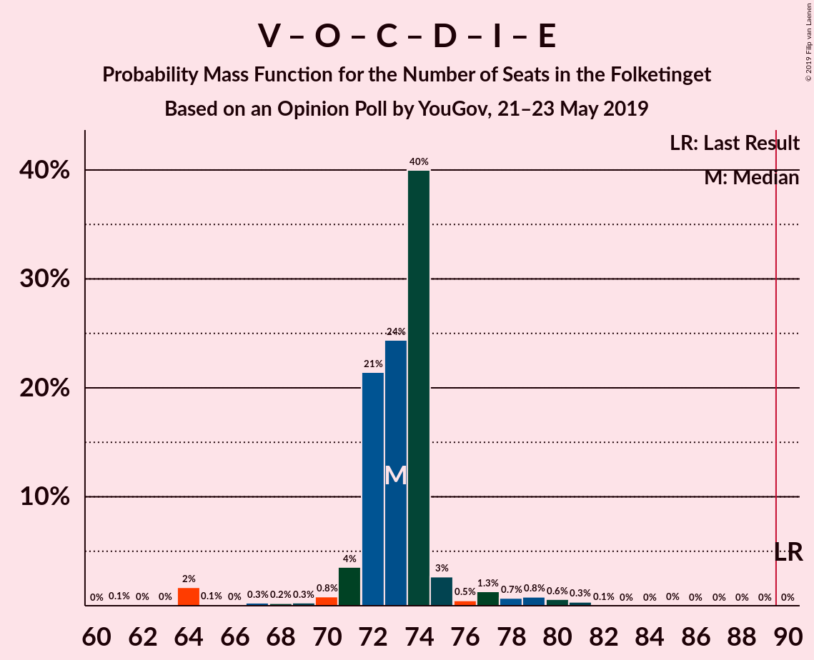

| Number of Seats | Probability | Accumulated | Special Marks |
|:---------------:|:-----------:|:-----------:|:-------------:|
| 61 | 0.1% | 100% |  |
| 62 | 0% | 99.9% |  |
| 63 | 0% | 99.9% |  |
| 64 | 2% | 99.8% |  |
| 65 | 0.1% | 98% |  |
| 66 | 0% | 98% |  |
| 67 | 0.3% | 98% |  |
| 68 | 0.2% | 98% |  |
| 69 | 0.3% | 98% |  |
| 70 | 0.8% | 97% |  |
| 71 | 4% | 96% |  |
| 72 | 21% | 93% |  |
| 73 | 24% | 71% |  |
| 74 | 40% | 47% | Median |
| 75 | 3% | 7% |  |
| 76 | 0.5% | 4% |  |
| 77 | 1.3% | 4% |  |
| 78 | 0.7% | 3% |  |
| 79 | 0.8% | 2% |  |
| 80 | 0.6% | 1.0% |  |
| 81 | 0.3% | 0.4% |  |
| 82 | 0.1% | 0.1% |  |
| 83 | 0% | 0% |  |
| 84 | 0% | 0% |  |
| 85 | 0% | 0% |  |
| 86 | 0% | 0% |  |
| 87 | 0% | 0% |  |
| 88 | 0% | 0% |  |
| 89 | 0% | 0% |  |
| 90 | 0% | 0% | Last Result, Majority |

### Venstre – Dansk Folkeparti – Det Konservative Folkeparti – Nye Borgerlige – Liberal Alliance – Kristendemokraterne

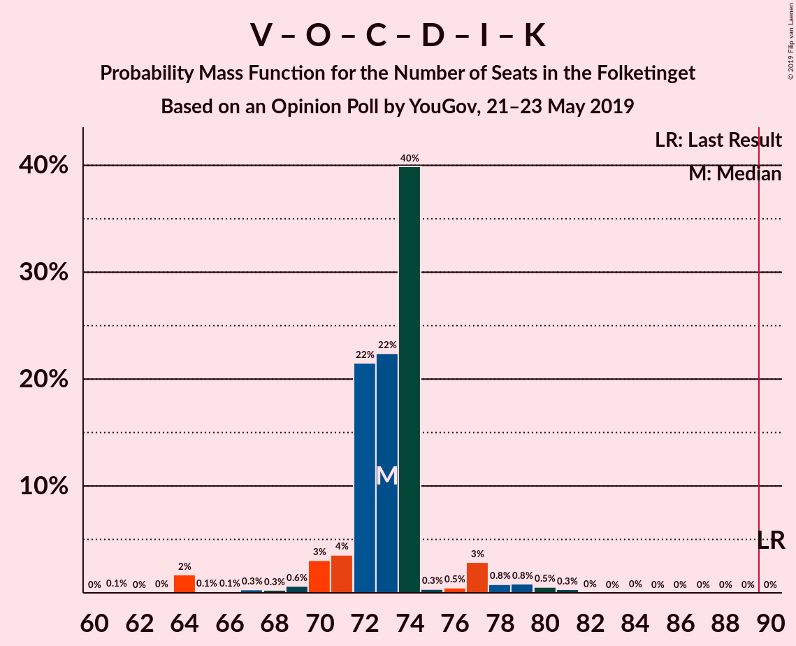

| Number of Seats | Probability | Accumulated | Special Marks |
|:---------------:|:-----------:|:-----------:|:-------------:|
| 61 | 0.1% | 100% |  |
| 62 | 0% | 99.9% |  |
| 63 | 0% | 99.9% |  |
| 64 | 2% | 99.8% |  |
| 65 | 0.1% | 98% |  |
| 66 | 0.1% | 98% |  |
| 67 | 0.3% | 98% |  |
| 68 | 0.3% | 98% |  |
| 69 | 0.6% | 97% |  |
| 70 | 3% | 97% |  |
| 71 | 4% | 94% |  |
| 72 | 22% | 90% |  |
| 73 | 22% | 69% |  |
| 74 | 40% | 46% | Median |
| 75 | 0.3% | 6% |  |
| 76 | 0.5% | 6% |  |
| 77 | 3% | 5% |  |
| 78 | 0.8% | 3% |  |
| 79 | 0.8% | 2% |  |
| 80 | 0.5% | 1.0% |  |
| 81 | 0.3% | 0.4% |  |
| 82 | 0% | 0.1% |  |
| 83 | 0% | 0% |  |
| 84 | 0% | 0% |  |
| 85 | 0% | 0% |  |
| 86 | 0% | 0% |  |
| 87 | 0% | 0% |  |
| 88 | 0% | 0% |  |
| 89 | 0% | 0% |  |
| 90 | 0% | 0% | Last Result, Majority |

### Venstre – Dansk Folkeparti – Det Konservative Folkeparti – Nye Borgerlige – Liberal Alliance

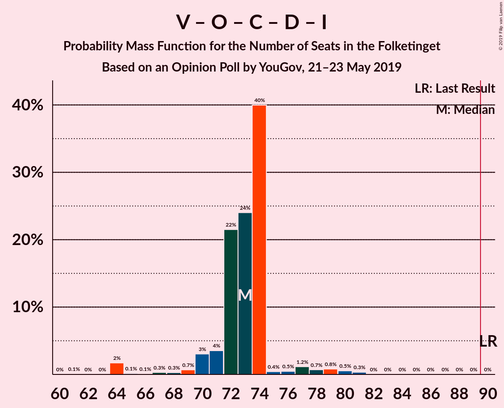

| Number of Seats | Probability | Accumulated | Special Marks |
|:---------------:|:-----------:|:-----------:|:-------------:|
| 61 | 0.1% | 100% |  |
| 62 | 0% | 99.9% |  |
| 63 | 0% | 99.9% |  |
| 64 | 2% | 99.8% |  |
| 65 | 0.1% | 98% |  |
| 66 | 0.1% | 98% |  |
| 67 | 0.3% | 98% |  |
| 68 | 0.3% | 98% |  |
| 69 | 0.7% | 97% |  |
| 70 | 3% | 97% |  |
| 71 | 4% | 94% |  |
| 72 | 22% | 90% |  |
| 73 | 24% | 69% |  |
| 74 | 40% | 44% | Median |
| 75 | 0.4% | 5% |  |
| 76 | 0.5% | 4% |  |
| 77 | 1.2% | 4% |  |
| 78 | 0.7% | 2% |  |
| 79 | 0.8% | 2% |  |
| 80 | 0.5% | 1.0% |  |
| 81 | 0.3% | 0.4% |  |
| 82 | 0% | 0.1% |  |
| 83 | 0% | 0% |  |
| 84 | 0% | 0% |  |
| 85 | 0% | 0% |  |
| 86 | 0% | 0% |  |
| 87 | 0% | 0% |  |
| 88 | 0% | 0% |  |
| 89 | 0% | 0% |  |
| 90 | 0% | 0% | Last Result, Majority |

### Venstre – Dansk Folkeparti – Det Konservative Folkeparti – Liberal Alliance – Kristendemokraterne

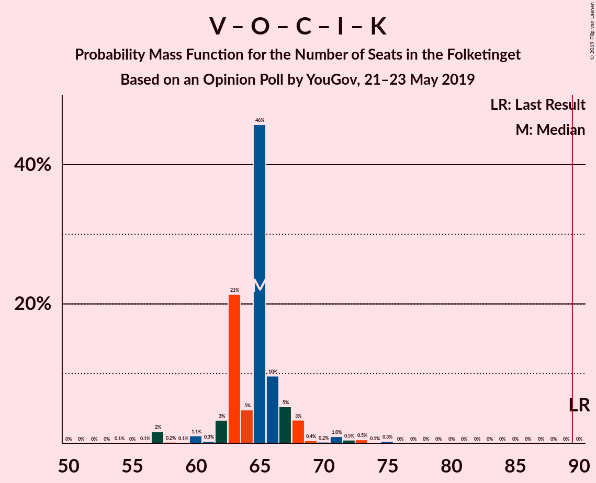

| Number of Seats | Probability | Accumulated | Special Marks |
|:---------------:|:-----------:|:-----------:|:-------------:|
| 54 | 0.1% | 100% |  |
| 55 | 0% | 99.9% |  |
| 56 | 0.1% | 99.9% |  |
| 57 | 2% | 99.8% |  |
| 58 | 0.2% | 98% |  |
| 59 | 0.1% | 98% |  |
| 60 | 1.1% | 98% |  |
| 61 | 0.3% | 97% |  |
| 62 | 3% | 96% |  |
| 63 | 21% | 93% |  |
| 64 | 5% | 72% |  |
| 65 | 46% | 67% | Median |
| 66 | 10% | 21% |  |
| 67 | 5% | 12% |  |
| 68 | 3% | 6% |  |
| 69 | 0.4% | 3% |  |
| 70 | 0.2% | 3% |  |
| 71 | 1.0% | 2% |  |
| 72 | 0.5% | 1.4% |  |
| 73 | 0.5% | 0.9% |  |
| 74 | 0.1% | 0.4% |  |
| 75 | 0.3% | 0.3% |  |
| 76 | 0% | 0% |  |
| 77 | 0% | 0% |  |
| 78 | 0% | 0% |  |
| 79 | 0% | 0% |  |
| 80 | 0% | 0% |  |
| 81 | 0% | 0% |  |
| 82 | 0% | 0% |  |
| 83 | 0% | 0% |  |
| 84 | 0% | 0% |  |
| 85 | 0% | 0% |  |
| 86 | 0% | 0% |  |
| 87 | 0% | 0% |  |
| 88 | 0% | 0% |  |
| 89 | 0% | 0% |  |
| 90 | 0% | 0% | Last Result, Majority |

### Venstre – Dansk Folkeparti – Det Konservative Folkeparti – Liberal Alliance

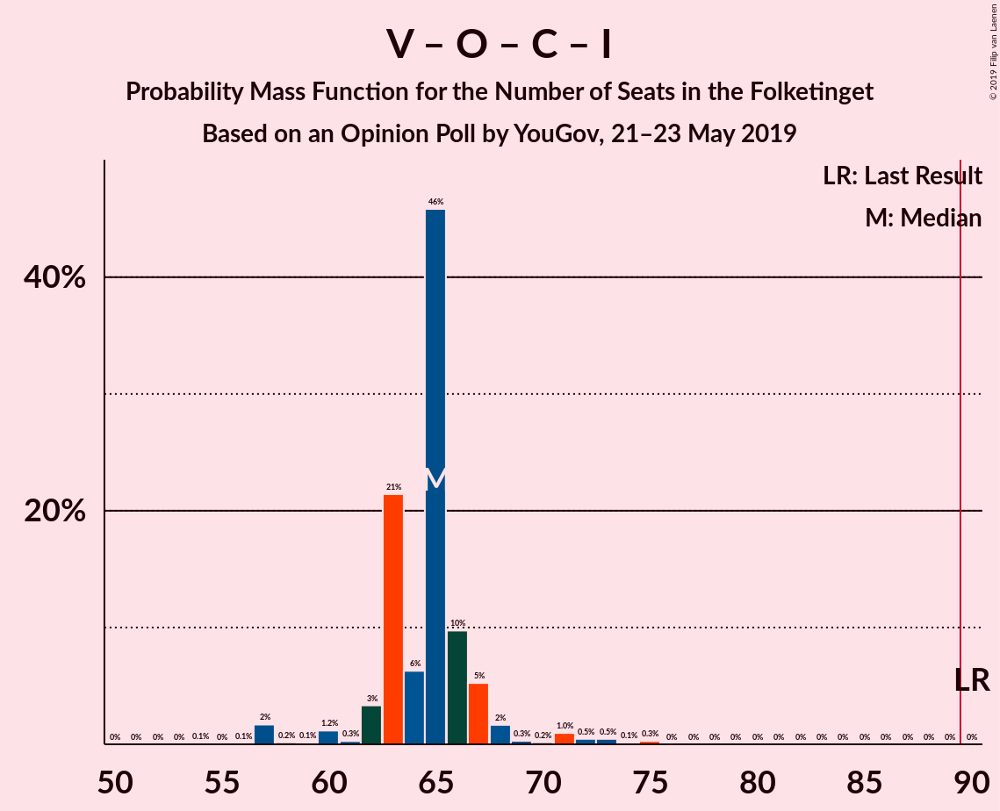

| Number of Seats | Probability | Accumulated | Special Marks |
|:---------------:|:-----------:|:-----------:|:-------------:|
| 54 | 0.1% | 100% |  |
| 55 | 0% | 99.9% |  |
| 56 | 0.1% | 99.9% |  |
| 57 | 2% | 99.8% |  |
| 58 | 0.2% | 98% |  |
| 59 | 0.1% | 98% |  |
| 60 | 1.2% | 98% |  |
| 61 | 0.3% | 97% |  |
| 62 | 3% | 96% |  |
| 63 | 21% | 93% |  |
| 64 | 6% | 72% |  |
| 65 | 46% | 65% | Median |
| 66 | 10% | 19% |  |
| 67 | 5% | 10% |  |
| 68 | 2% | 4% |  |
| 69 | 0.3% | 3% |  |
| 70 | 0.2% | 2% |  |
| 71 | 1.0% | 2% |  |
| 72 | 0.5% | 1.3% |  |
| 73 | 0.5% | 0.9% |  |
| 74 | 0.1% | 0.4% |  |
| 75 | 0.3% | 0.3% |  |
| 76 | 0% | 0% |  |
| 77 | 0% | 0% |  |
| 78 | 0% | 0% |  |
| 79 | 0% | 0% |  |
| 80 | 0% | 0% |  |
| 81 | 0% | 0% |  |
| 82 | 0% | 0% |  |
| 83 | 0% | 0% |  |
| 84 | 0% | 0% |  |
| 85 | 0% | 0% |  |
| 86 | 0% | 0% |  |
| 87 | 0% | 0% |  |
| 88 | 0% | 0% |  |
| 89 | 0% | 0% |  |
| 90 | 0% | 0% | Last Result, Majority |

### Socialdemokraterne – Radikale Venstre

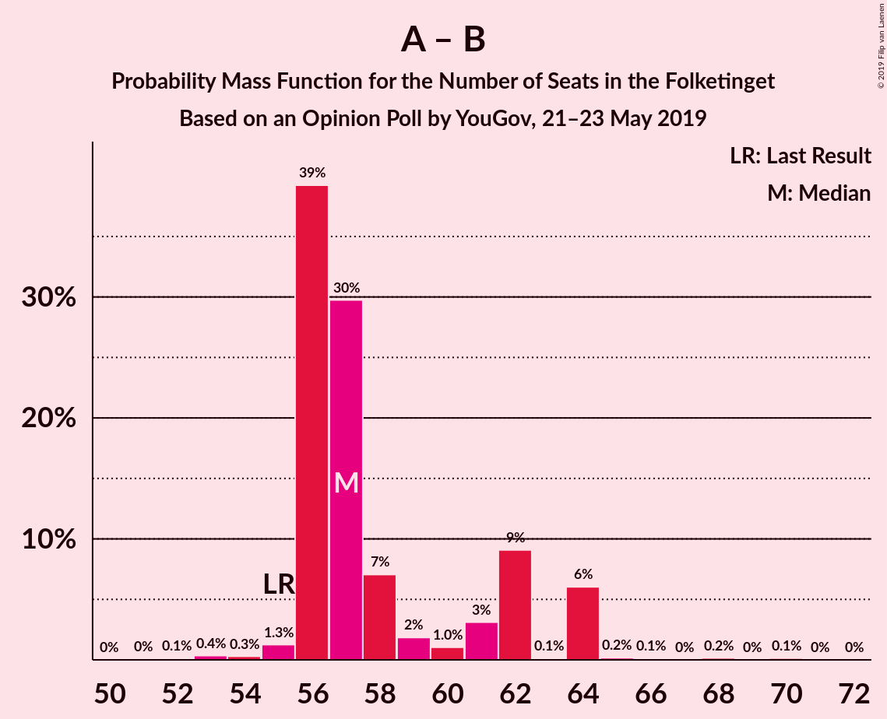

| Number of Seats | Probability | Accumulated | Special Marks |
|:---------------:|:-----------:|:-----------:|:-------------:|
| 51 | 0% | 100% |  |
| 52 | 0.1% | 99.9% |  |
| 53 | 0.4% | 99.8% |  |
| 54 | 0.3% | 99.5% |  |
| 55 | 1.3% | 99.2% | Last Result |
| 56 | 39% | 98% | Median |
| 57 | 30% | 59% |  |
| 58 | 7% | 29% |  |
| 59 | 2% | 22% |  |
| 60 | 1.0% | 20% |  |
| 61 | 3% | 19% |  |
| 62 | 9% | 16% |  |
| 63 | 0.1% | 7% |  |
| 64 | 6% | 7% |  |
| 65 | 0.2% | 0.6% |  |
| 66 | 0.1% | 0.4% |  |
| 67 | 0% | 0.3% |  |
| 68 | 0.2% | 0.3% |  |
| 69 | 0% | 0.1% |  |
| 70 | 0.1% | 0.1% |  |
| 71 | 0% | 0% |  |

### Venstre – Det Konservative Folkeparti – Liberal Alliance

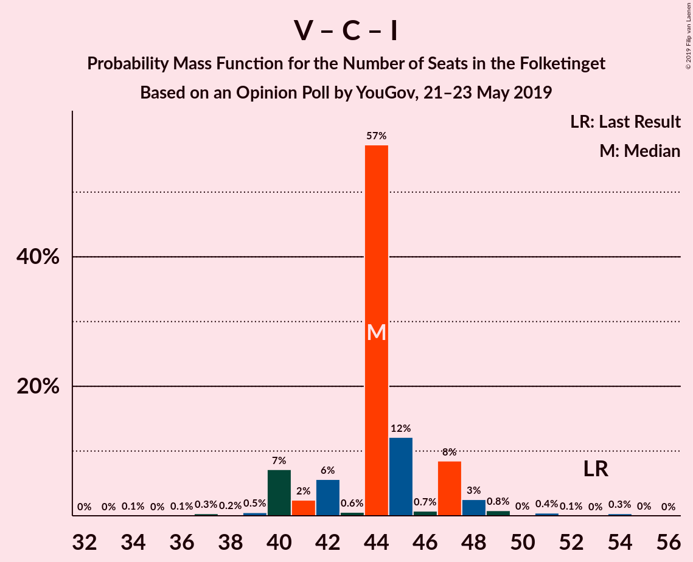

| Number of Seats | Probability | Accumulated | Special Marks |
|:---------------:|:-----------:|:-----------:|:-------------:|
| 34 | 0.1% | 100% |  |
| 35 | 0% | 99.9% |  |
| 36 | 0.1% | 99.9% |  |
| 37 | 0.3% | 99.8% |  |
| 38 | 0.2% | 99.5% |  |
| 39 | 0.5% | 99.3% |  |
| 40 | 7% | 98.8% |  |
| 41 | 2% | 92% |  |
| 42 | 6% | 89% |  |
| 43 | 0.6% | 84% |  |
| 44 | 57% | 83% | Median |
| 45 | 12% | 26% |  |
| 46 | 0.7% | 14% |  |
| 47 | 8% | 13% |  |
| 48 | 3% | 4% |  |
| 49 | 0.8% | 2% |  |
| 50 | 0% | 1.0% |  |
| 51 | 0.4% | 0.9% |  |
| 52 | 0.1% | 0.5% |  |
| 53 | 0% | 0.4% | Last Result |
| 54 | 0.3% | 0.4% |  |
| 55 | 0% | 0% |  |

### Venstre – Det Konservative Folkeparti

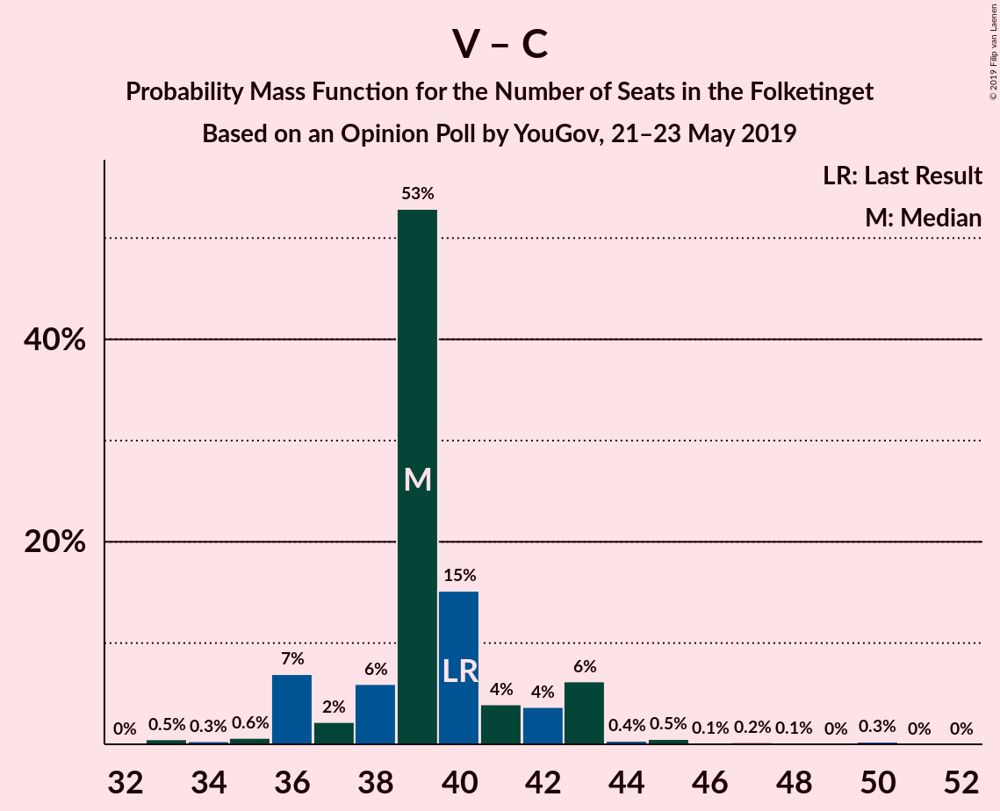

| Number of Seats | Probability | Accumulated | Special Marks |
|:---------------:|:-----------:|:-----------:|:-------------:|
| 33 | 0.5% | 100% |  |
| 34 | 0.3% | 99.5% |  |
| 35 | 0.6% | 99.2% |  |
| 36 | 7% | 98.5% |  |
| 37 | 2% | 92% |  |
| 38 | 6% | 89% |  |
| 39 | 53% | 83% | Median |
| 40 | 15% | 31% | Last Result |
| 41 | 4% | 15% |  |
| 42 | 4% | 11% |  |
| 43 | 6% | 8% |  |
| 44 | 0.4% | 2% |  |
| 45 | 0.5% | 1.2% |  |
| 46 | 0.1% | 0.7% |  |
| 47 | 0.2% | 0.6% |  |
| 48 | 0.1% | 0.4% |  |
| 49 | 0% | 0.3% |  |
| 50 | 0.3% | 0.3% |  |
| 51 | 0% | 0% |  |

### Venstre

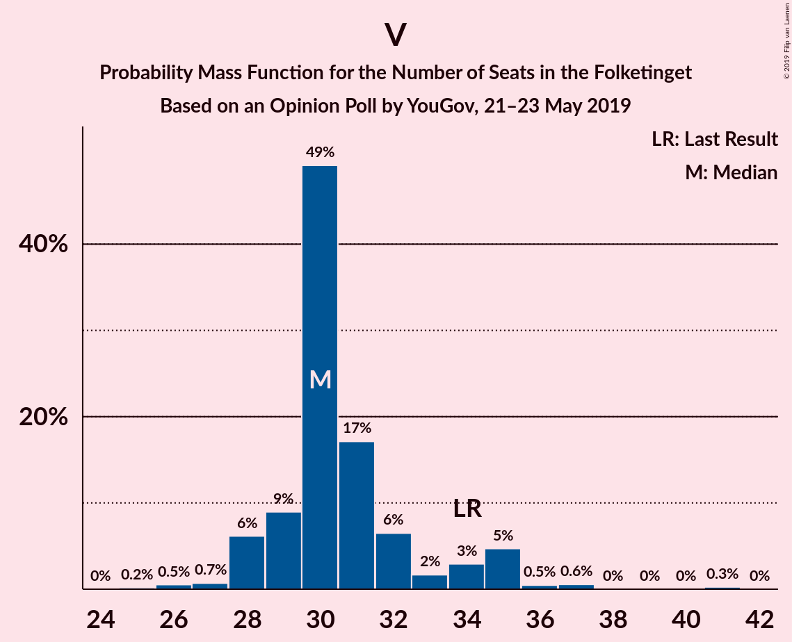

| Number of Seats | Probability | Accumulated | Special Marks |
|:---------------:|:-----------:|:-----------:|:-------------:|
| 24 | 0% | 100% |  |
| 25 | 0.2% | 99.9% |  |
| 26 | 0.5% | 99.7% |  |
| 27 | 0.7% | 99.2% |  |
| 28 | 6% | 98.5% |  |
| 29 | 9% | 92% |  |
| 30 | 49% | 83% | Median |
| 31 | 17% | 34% |  |
| 32 | 6% | 17% |  |
| 33 | 2% | 11% |  |
| 34 | 3% | 9% | Last Result |
| 35 | 5% | 6% |  |
| 36 | 0.5% | 1.3% |  |
| 37 | 0.6% | 0.9% |  |
| 38 | 0% | 0.3% |  |
| 39 | 0% | 0.3% |  |
| 40 | 0% | 0.3% |  |
| 41 | 0.3% | 0.3% |  |
| 42 | 0% | 0% |  |

## Technical Information

### Opinion Poll

+ **Polling firm:** YouGov
+ **Commissioner(s):** —
+ **Fieldwork period:** 21–23 May 2019

### Calculations

+ **Sample size:** 981
+ **Simulations done:** 1,048,576
+ **Error estimate:** 3.19%

