# Opinion Poll by Voxmeter for Ritzau, 25–27 May 2019

<a href="#voting-intentions">Voting Intentions</a> | <a href="#seats">Seats</a> | <a href="#coalitions">Coalitions</a> | <a href="#technical-information">Technical Information</a>

## Voting Intentions

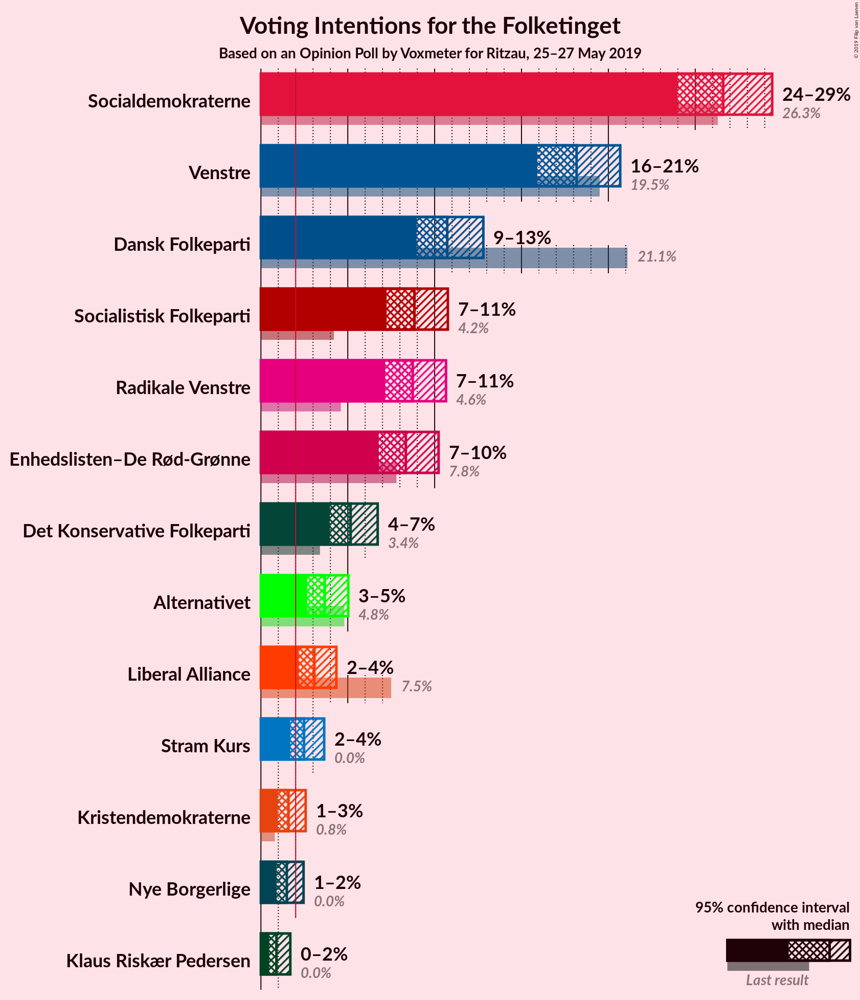

### Confidence Intervals

| Party | Last Result | Poll Result | 80% Confidence Interval | 90% Confidence Interval | 95% Confidence Interval | 99% Confidence Interval |
|:-----:|:-----------:|:-----------:|:-----------------------:|:-----------------------:|:-----------------------:|:-----------------------:|
| Socialdemokraterne | 26.3% | 26.6% | 24.9–28.5% |24.4–29.0% |24.0–29.4% |23.2–30.3% |
| Venstre | 19.5% | 18.2% | 16.7–19.8% |16.3–20.3% |15.9–20.7% |15.2–21.5% |
| Dansk Folkeparti | 21.1% | 10.7% | 9.6–12.1% |9.2–12.5% |9.0–12.8% |8.4–13.5% |
| Socialistisk Folkeparti | 4.2% | 8.8% | 7.8–10.1% |7.5–10.4% |7.2–10.8% |6.8–11.4% |
| Radikale Venstre | 4.6% | 8.7% | 7.7–10.0% |7.4–10.3% |7.1–10.7% |6.7–11.3% |
| Enhedslisten–De Rød-Grønne | 7.8% | 8.3% | 7.3–9.6% |7.0–9.9% |6.8–10.2% |6.3–10.8% |
| Det Konservative Folkeparti | 3.4% | 5.2% | 4.4–6.2% |4.1–6.5% |4.0–6.7% |3.6–7.2% |
| Alternativet | 4.8% | 3.7% | 3.0–4.6% |2.8–4.8% |2.7–5.0% |2.4–5.5% |
| Liberal Alliance | 7.5% | 3.1% | 2.5–3.9% |2.3–4.1% |2.2–4.3% |1.9–4.8% |
| Stram Kurs | 0.0% | 2.5% | 2.0–3.2% |1.8–3.5% |1.7–3.6% |1.5–4.0% |
| Kristendemokraterne | 0.8% | 1.6% | 1.2–2.2% |1.1–2.4% |1.0–2.6% |0.8–2.9% |
| Nye Borgerlige | 0.0% | 1.5% | 1.1–2.1% |1.0–2.3% |0.9–2.5% |0.7–2.8% |
| Klaus Riskær Pedersen | 0.0% | 0.9% | 0.6–1.4% |0.5–1.6% |0.5–1.7% |0.4–2.0% |

*Note:* The poll result column reflects the actual value used in the calculations. Published results may vary slightly, and in addition be rounded to fewer digits.

## Seats

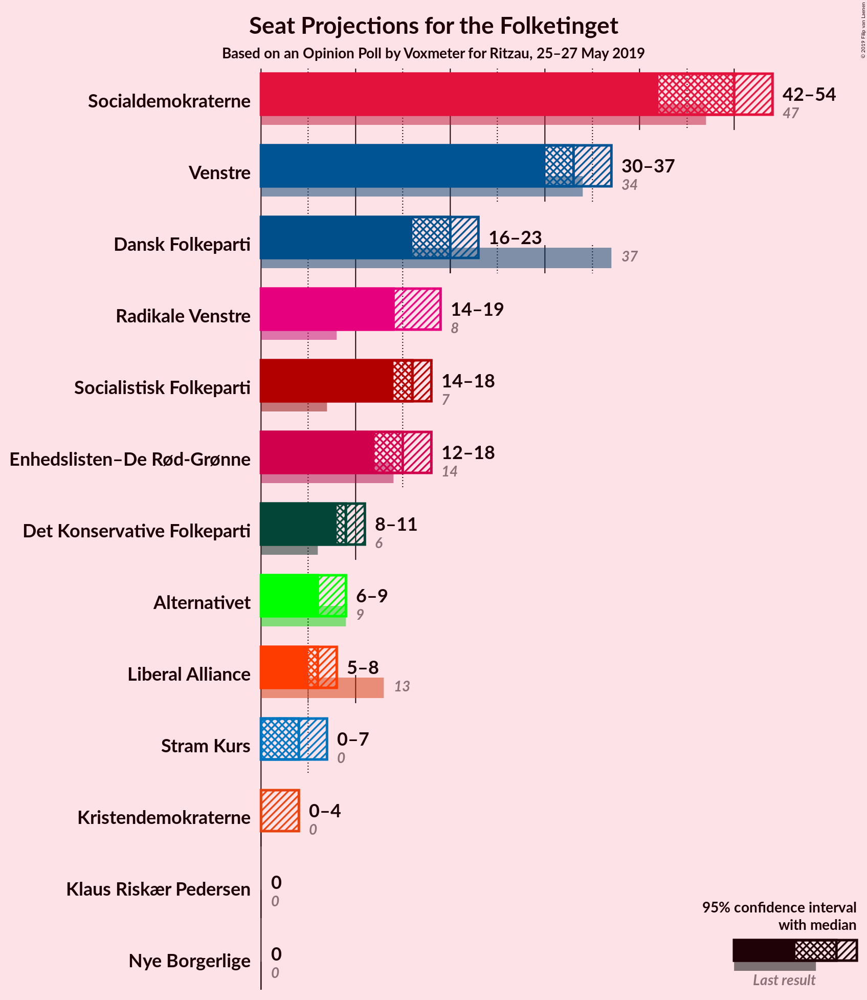

### Confidence Intervals

| Party | Last Result | Median | 80% Confidence Interval | 90% Confidence Interval | 95% Confidence Interval | 99% Confidence Interval |
|:-----:|:-----------:|:------:|:-----------------------:|:-----------------------:|:-----------------------:|:-----------------------:|
| <a href="#socialdemokraterne">Socialdemokraterne</a> | 47 | 50 | 46–52 |44–54 |42–54 |42–54 |
| <a href="#venstre">Venstre</a> | 34 | 33 | 30–34 |30–36 |30–37 |29–37 |
| <a href="#dansk-folkeparti">Dansk Folkeparti</a> | 37 | 20 | 18–21 |16–23 |16–23 |16–26 |
| <a href="#socialistisk-folkeparti">Socialistisk Folkeparti</a> | 7 | 16 | 14–18 |14–18 |14–18 |13–20 |
| <a href="#radikale-venstre">Radikale Venstre</a> | 8 | 14 | 14–18 |14–19 |14–19 |13–20 |
| <a href="#enhedslisten–de-rød-grønne">Enhedslisten–De Rød-Grønne</a> | 14 | 15 | 14–18 |13–18 |12–18 |11–20 |
| <a href="#det-konservative-folkeparti">Det Konservative Folkeparti</a> | 6 | 9 | 8–11 |8–11 |8–11 |7–12 |
| <a href="#alternativet">Alternativet</a> | 9 | 6 | 6–8 |6–9 |6–9 |5–9 |
| <a href="#liberal-alliance">Liberal Alliance</a> | 13 | 6 | 5–7 |5–8 |5–8 |4–8 |
| <a href="#stram-kurs">Stram Kurs</a> | 0 | 4 | 0–7 |0–7 |0–7 |0–7 |
| <a href="#kristendemokraterne">Kristendemokraterne</a> | 0 | 0 | 0 |0–4 |0–4 |0–5 |
| <a href="#nye-borgerlige">Nye Borgerlige</a> | 0 | 0 | 0 |0 |0 |0–4 |
| <a href="#klaus-riskær-pedersen">Klaus Riskær Pedersen</a> | 0 | 0 | 0 |0 |0 |0 |

### Socialdemokraterne

*For a full overview of the results for this party, see the [Socialdemokraterne](party-socialdemokraterne.html) page.*

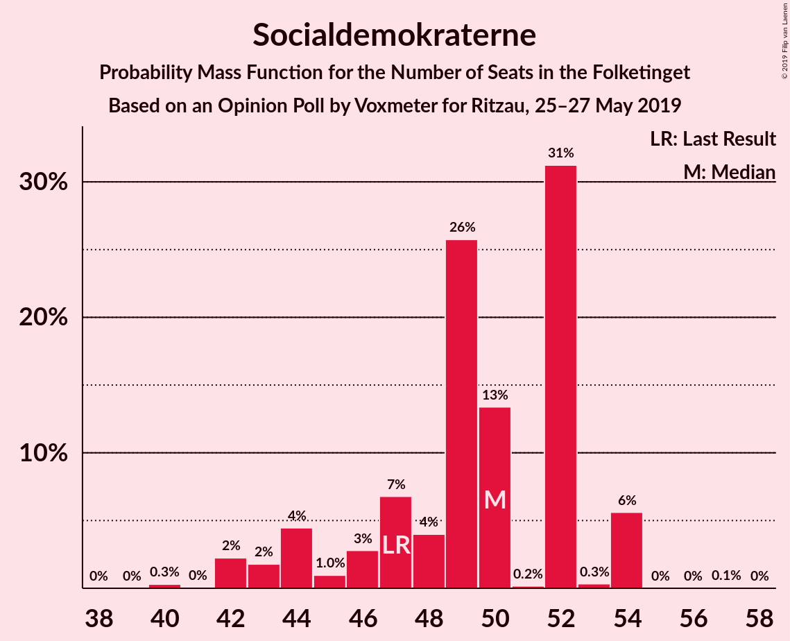

| Number of Seats | Probability | Accumulated | Special Marks |
|:---------------:|:-----------:|:-----------:|:-------------:|
| 40 | 0.3% | 100% |  |
| 41 | 0% | 99.7% |  |
| 42 | 2% | 99.6% |  |
| 43 | 2% | 97% |  |
| 44 | 4% | 96% |  |
| 45 | 1.0% | 91% |  |
| 46 | 3% | 90% |  |
| 47 | 7% | 87% | Last Result |
| 48 | 4% | 81% |  |
| 49 | 26% | 77% |  |
| 50 | 13% | 51% | Median |
| 51 | 0.2% | 37% |  |
| 52 | 31% | 37% |  |
| 53 | 0.3% | 6% |  |
| 54 | 6% | 6% |  |
| 55 | 0% | 0.1% |  |
| 56 | 0% | 0.1% |  |
| 57 | 0.1% | 0.1% |  |
| 58 | 0% | 0% |  |

### Venstre

*For a full overview of the results for this party, see the [Venstre](party-venstre.html) page.*

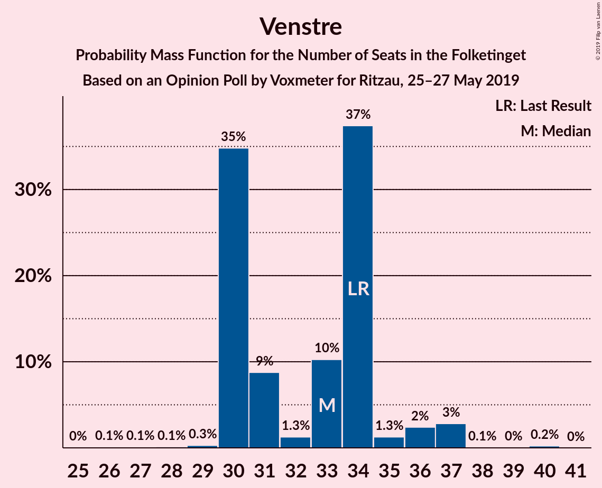

| Number of Seats | Probability | Accumulated | Special Marks |
|:---------------:|:-----------:|:-----------:|:-------------:|
| 26 | 0.1% | 100% |  |
| 27 | 0.1% | 99.9% |  |
| 28 | 0.1% | 99.8% |  |
| 29 | 0.3% | 99.6% |  |
| 30 | 35% | 99.3% |  |
| 31 | 9% | 65% |  |
| 32 | 1.3% | 56% |  |
| 33 | 10% | 55% | Median |
| 34 | 37% | 44% | Last Result |
| 35 | 1.3% | 7% |  |
| 36 | 2% | 6% |  |
| 37 | 3% | 3% |  |
| 38 | 0.1% | 0.3% |  |
| 39 | 0% | 0.3% |  |
| 40 | 0.2% | 0.2% |  |
| 41 | 0% | 0% |  |

### Dansk Folkeparti

*For a full overview of the results for this party, see the [Dansk Folkeparti](party-danskfolkeparti.html) page.*

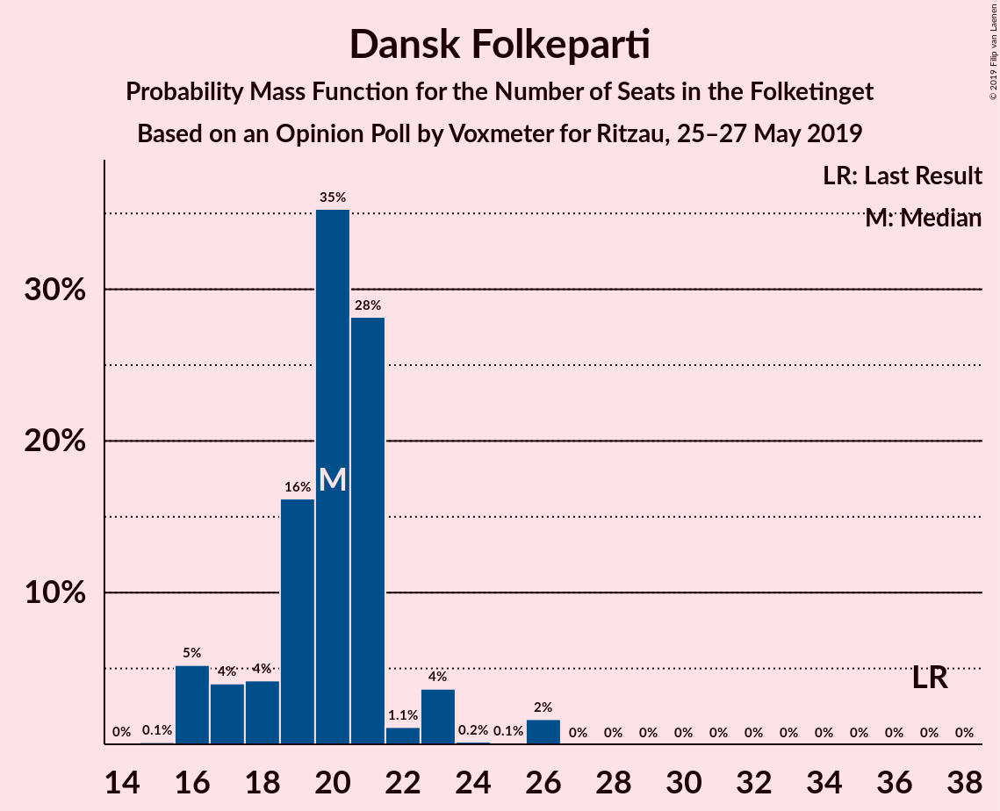

| Number of Seats | Probability | Accumulated | Special Marks |
|:---------------:|:-----------:|:-----------:|:-------------:|
| 15 | 0.1% | 100% |  |
| 16 | 5% | 99.8% |  |
| 17 | 4% | 95% |  |
| 18 | 4% | 91% |  |
| 19 | 16% | 86% |  |
| 20 | 35% | 70% | Median |
| 21 | 28% | 35% |  |
| 22 | 1.1% | 7% |  |
| 23 | 4% | 6% |  |
| 24 | 0.2% | 2% |  |
| 25 | 0.1% | 2% |  |
| 26 | 2% | 2% |  |
| 27 | 0% | 0% |  |
| 28 | 0% | 0% |  |
| 29 | 0% | 0% |  |
| 30 | 0% | 0% |  |
| 31 | 0% | 0% |  |
| 32 | 0% | 0% |  |
| 33 | 0% | 0% |  |
| 34 | 0% | 0% |  |
| 35 | 0% | 0% |  |
| 36 | 0% | 0% |  |
| 37 | 0% | 0% | Last Result |

### Socialistisk Folkeparti

*For a full overview of the results for this party, see the [Socialistisk Folkeparti](party-socialistiskfolkeparti.html) page.*

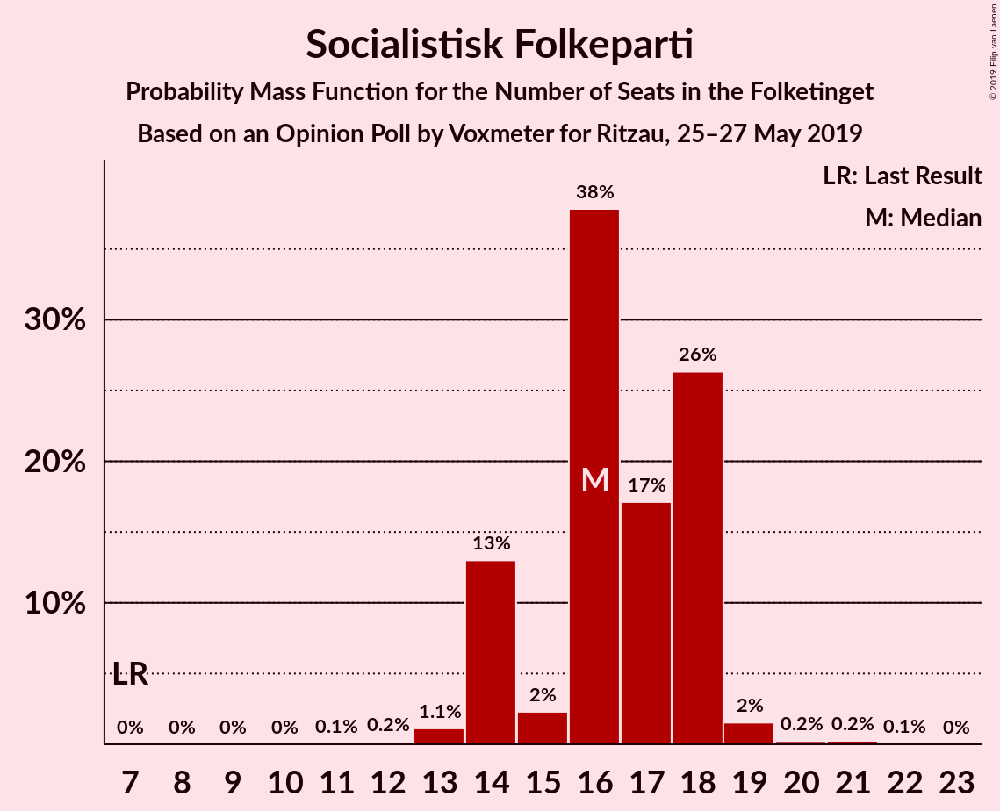

| Number of Seats | Probability | Accumulated | Special Marks |
|:---------------:|:-----------:|:-----------:|:-------------:|
| 7 | 0% | 100% | Last Result |
| 8 | 0% | 100% |  |
| 9 | 0% | 100% |  |
| 10 | 0% | 100% |  |
| 11 | 0.1% | 100% |  |
| 12 | 0.2% | 99.9% |  |
| 13 | 1.1% | 99.8% |  |
| 14 | 13% | 98.7% |  |
| 15 | 2% | 86% |  |
| 16 | 38% | 83% | Median |
| 17 | 17% | 46% |  |
| 18 | 26% | 28% |  |
| 19 | 2% | 2% |  |
| 20 | 0.2% | 0.5% |  |
| 21 | 0.2% | 0.3% |  |
| 22 | 0.1% | 0.1% |  |
| 23 | 0% | 0% |  |

### Radikale Venstre

*For a full overview of the results for this party, see the [Radikale Venstre](party-radikalevenstre.html) page.*

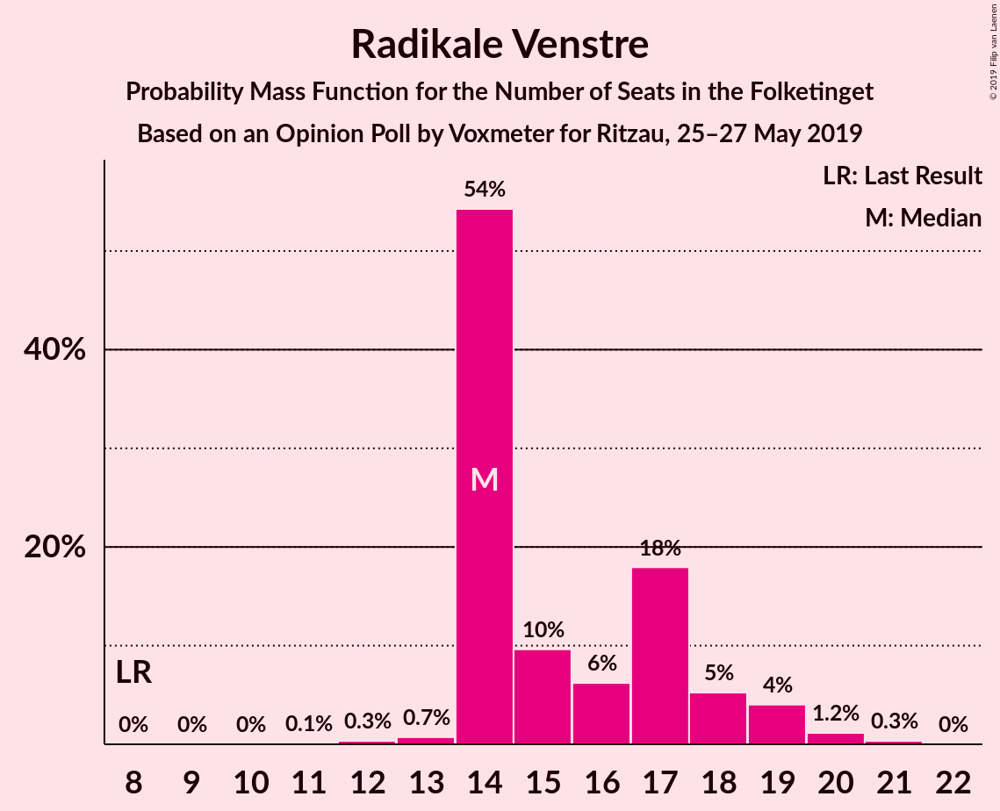

| Number of Seats | Probability | Accumulated | Special Marks |
|:---------------:|:-----------:|:-----------:|:-------------:|
| 8 | 0% | 100% | Last Result |
| 9 | 0% | 100% |  |
| 10 | 0% | 100% |  |
| 11 | 0.1% | 100% |  |
| 12 | 0.3% | 99.9% |  |
| 13 | 0.7% | 99.6% |  |
| 14 | 54% | 98.8% | Median |
| 15 | 10% | 45% |  |
| 16 | 6% | 35% |  |
| 17 | 18% | 29% |  |
| 18 | 5% | 11% |  |
| 19 | 4% | 6% |  |
| 20 | 1.2% | 2% |  |
| 21 | 0.3% | 0.4% |  |
| 22 | 0% | 0% |  |

### Enhedslisten–De Rød-Grønne

*For a full overview of the results for this party, see the [Enhedslisten–De Rød-Grønne](party-enhedslisten–derød-grønne.html) page.*

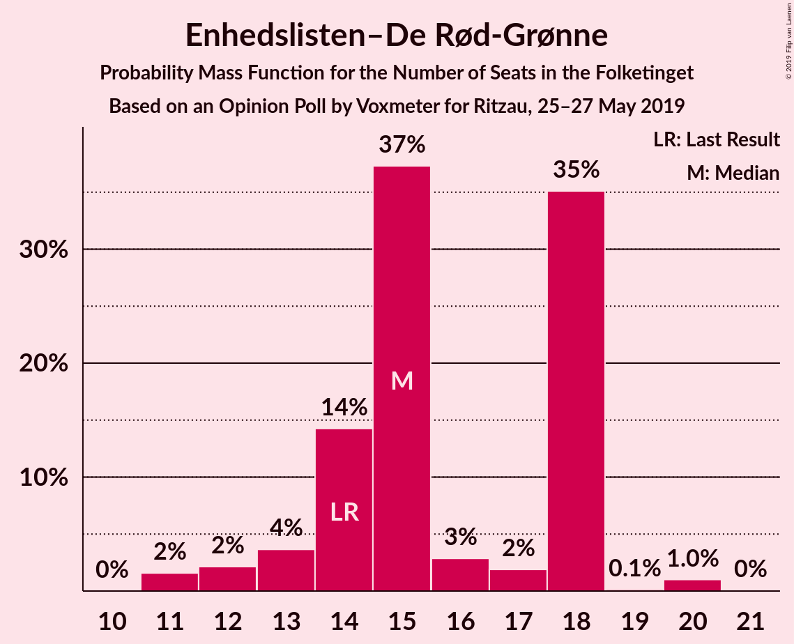

| Number of Seats | Probability | Accumulated | Special Marks |
|:---------------:|:-----------:|:-----------:|:-------------:|
| 11 | 2% | 100% |  |
| 12 | 2% | 98% |  |
| 13 | 4% | 96% |  |
| 14 | 14% | 93% | Last Result |
| 15 | 37% | 78% | Median |
| 16 | 3% | 41% |  |
| 17 | 2% | 38% |  |
| 18 | 35% | 36% |  |
| 19 | 0.1% | 1.2% |  |
| 20 | 1.0% | 1.1% |  |
| 21 | 0% | 0% |  |

### Det Konservative Folkeparti

*For a full overview of the results for this party, see the [Det Konservative Folkeparti](party-detkonservativefolkeparti.html) page.*

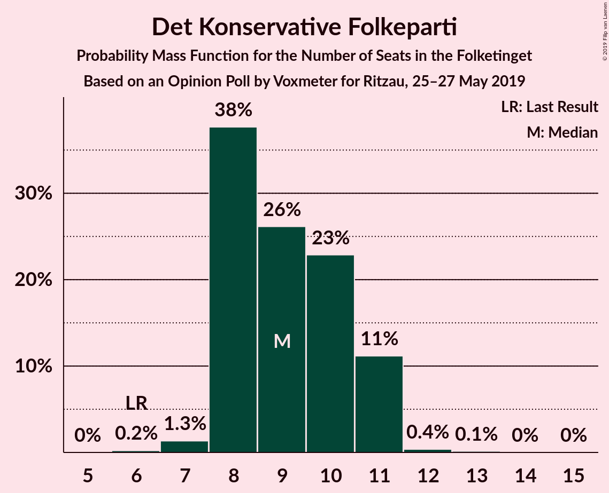

| Number of Seats | Probability | Accumulated | Special Marks |
|:---------------:|:-----------:|:-----------:|:-------------:|
| 6 | 0.2% | 100% | Last Result |
| 7 | 1.3% | 99.8% |  |
| 8 | 38% | 98% |  |
| 9 | 26% | 61% | Median |
| 10 | 23% | 35% |  |
| 11 | 11% | 12% |  |
| 12 | 0.4% | 0.6% |  |
| 13 | 0.1% | 0.2% |  |
| 14 | 0% | 0.1% |  |
| 15 | 0% | 0% |  |

### Alternativet

*For a full overview of the results for this party, see the [Alternativet](party-alternativet.html) page.*

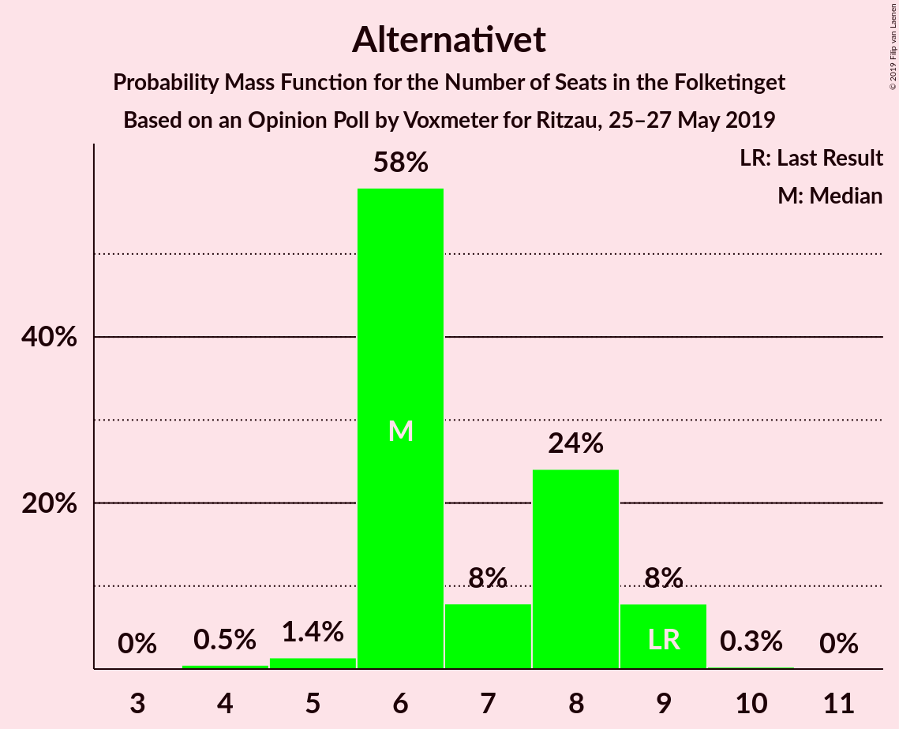

| Number of Seats | Probability | Accumulated | Special Marks |
|:---------------:|:-----------:|:-----------:|:-------------:|
| 4 | 0.5% | 100% |  |
| 5 | 1.4% | 99.5% |  |
| 6 | 58% | 98% | Median |
| 7 | 8% | 40% |  |
| 8 | 24% | 32% |  |
| 9 | 8% | 8% | Last Result |
| 10 | 0.3% | 0.3% |  |
| 11 | 0% | 0% |  |

### Liberal Alliance

*For a full overview of the results for this party, see the [Liberal Alliance](party-liberalalliance.html) page.*

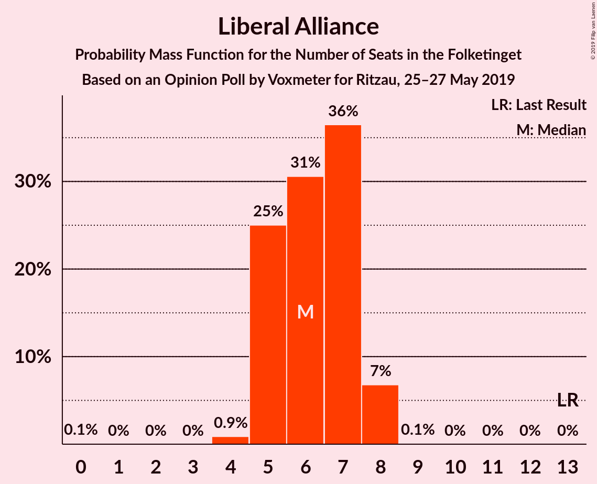

| Number of Seats | Probability | Accumulated | Special Marks |
|:---------------:|:-----------:|:-----------:|:-------------:|
| 0 | 0.1% | 100% |  |
| 1 | 0% | 99.9% |  |
| 2 | 0% | 99.9% |  |
| 3 | 0% | 99.9% |  |
| 4 | 0.9% | 99.9% |  |
| 5 | 25% | 99.0% |  |
| 6 | 31% | 74% | Median |
| 7 | 36% | 43% |  |
| 8 | 7% | 7% |  |
| 9 | 0.1% | 0.1% |  |
| 10 | 0% | 0% |  |
| 11 | 0% | 0% |  |
| 12 | 0% | 0% |  |
| 13 | 0% | 0% | Last Result |

### Stram Kurs

*For a full overview of the results for this party, see the [Stram Kurs](party-stramkurs.html) page.*

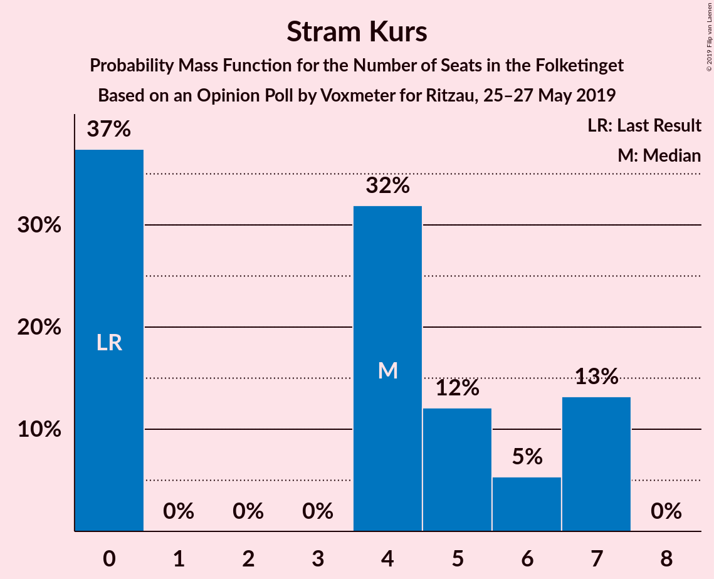

| Number of Seats | Probability | Accumulated | Special Marks |
|:---------------:|:-----------:|:-----------:|:-------------:|
| 0 | 37% | 100% | Last Result |
| 1 | 0% | 63% |  |
| 2 | 0% | 63% |  |
| 3 | 0% | 63% |  |
| 4 | 32% | 63% | Median |
| 5 | 12% | 31% |  |
| 6 | 5% | 19% |  |
| 7 | 13% | 13% |  |
| 8 | 0% | 0% |  |

### Kristendemokraterne

*For a full overview of the results for this party, see the [Kristendemokraterne](party-kristendemokraterne.html) page.*

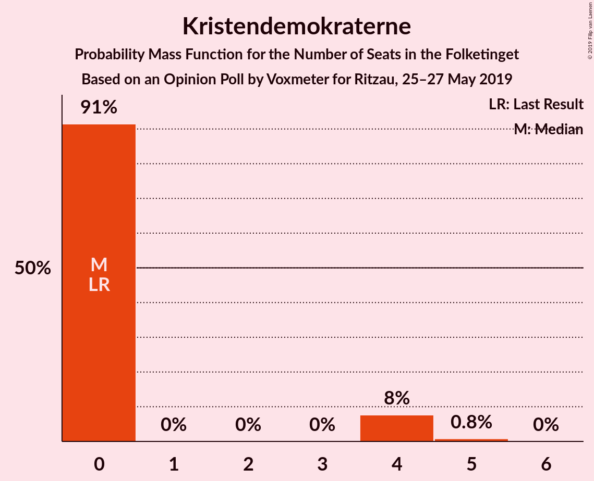

| Number of Seats | Probability | Accumulated | Special Marks |
|:---------------:|:-----------:|:-----------:|:-------------:|
| 0 | 91% | 100% | Last Result, Median |
| 1 | 0% | 9% |  |
| 2 | 0% | 9% |  |
| 3 | 0% | 9% |  |
| 4 | 8% | 9% |  |
| 5 | 0.8% | 0.9% |  |
| 6 | 0% | 0% |  |

### Nye Borgerlige

*For a full overview of the results for this party, see the [Nye Borgerlige](party-nyeborgerlige.html) page.*

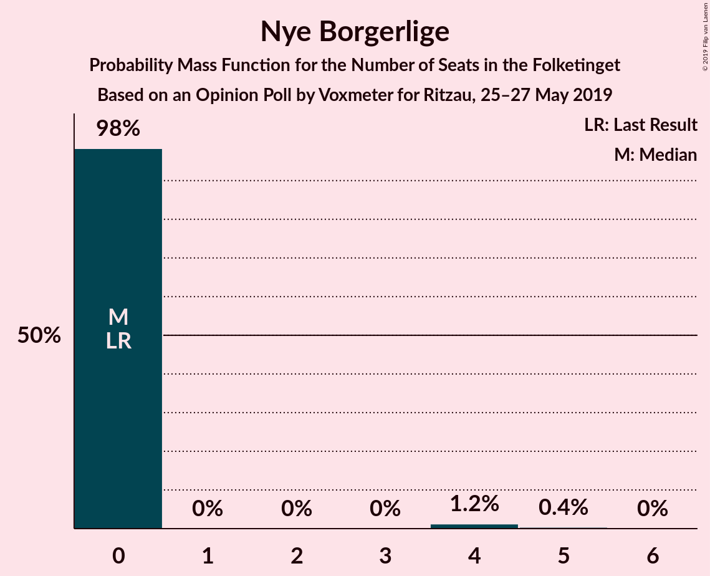

| Number of Seats | Probability | Accumulated | Special Marks |
|:---------------:|:-----------:|:-----------:|:-------------:|
| 0 | 98% | 100% | Last Result, Median |
| 1 | 0% | 2% |  |
| 2 | 0% | 2% |  |
| 3 | 0% | 2% |  |
| 4 | 1.2% | 2% |  |
| 5 | 0.4% | 0.4% |  |
| 6 | 0% | 0% |  |

### Klaus Riskær Pedersen

*For a full overview of the results for this party, see the [Klaus Riskær Pedersen](party-klausriskærpedersen.html) page.*

| Number of Seats | Probability | Accumulated | Special Marks |
|:---------------:|:-----------:|:-----------:|:-------------:|
| 0 | 99.9% | 100% | Last Result, Median |
| 1 | 0% | 0.1% |  |
| 2 | 0% | 0.1% |  |
| 3 | 0% | 0.1% |  |
| 4 | 0.1% | 0.1% |  |
| 5 | 0% | 0% |  |

## Coalitions

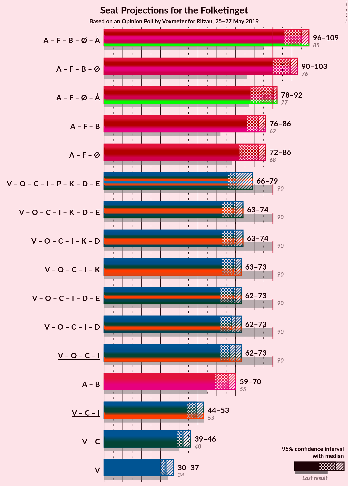

### Confidence Intervals

| Coalition | Last Result | Median | Majority? | 80% Confidence Interval | 90% Confidence Interval | 95% Confidence Interval | 99% Confidence Interval |
|:---------:|:-----------:|:------:|:---------:|:-----------------------:|:-----------------------:|:-----------------------:|:-----------------------:|
| Socialdemokraterne – Socialistisk Folkeparti – Radikale Venstre – Enhedslisten–De Rød-Grønne – Alternativet | 85 | 105 | 100% | 99–106 | 97–106 | 96–109 | 96–109 |
| Socialdemokraterne – Socialistisk Folkeparti – Radikale Venstre – Enhedslisten–De Rød-Grønne | 76 | 99 | 99.2% | 90–100 | 90–100 | 90–103 | 88–103 |
| Socialdemokraterne – Socialistisk Folkeparti – Enhedslisten–De Rød-Grønne – Alternativet | 77 | 90 | 59% | 84–92 | 80–92 | 78–92 | 78–92 |
| Socialdemokraterne – Socialistisk Folkeparti – Radikale Venstre | 62 | 82 | 0.1% | 76–84 | 76–85 | 76–86 | 73–86 |
| Socialdemokraterne – Socialistisk Folkeparti – Enhedslisten–De Rød-Grønne | 68 | 82 | 0% | 75–86 | 74–86 | 72–86 | 72–86 |
| Venstre – Dansk Folkeparti – Det Konservative Folkeparti – Liberal Alliance – Stram Kurs – Kristendemokraterne – Nye Borgerlige – Klaus Riskær Pedersen | 90 | 70 | 0% | 69–76 | 69–78 | 66–79 | 66–79 |
| Venstre – Dansk Folkeparti – Det Konservative Folkeparti – Liberal Alliance – Kristendemokraterne – Nye Borgerlige – Klaus Riskær Pedersen | 90 | 69 | 0% | 63–71 | 63–73 | 63–74 | 63–78 |
| Venstre – Dansk Folkeparti – Det Konservative Folkeparti – Liberal Alliance – Kristendemokraterne – Nye Borgerlige | 90 | 69 | 0% | 63–71 | 63–73 | 63–74 | 63–78 |
| Venstre – Dansk Folkeparti – Det Konservative Folkeparti – Liberal Alliance – Kristendemokraterne | 90 | 69 | 0% | 63–71 | 63–73 | 63–73 | 63–78 |
| Venstre – Dansk Folkeparti – Det Konservative Folkeparti – Liberal Alliance – Nye Borgerlige – Klaus Riskær Pedersen | 90 | 69 | 0% | 63–71 | 63–73 | 62–73 | 62–74 |
| Venstre – Dansk Folkeparti – Det Konservative Folkeparti – Liberal Alliance – Nye Borgerlige | 90 | 68 | 0% | 63–71 | 63–73 | 62–73 | 62–74 |
| Venstre – Dansk Folkeparti – Det Konservative Folkeparti – Liberal Alliance | 90 | 67 | 0% | 63–71 | 63–73 | 62–73 | 62–74 |
| Socialdemokraterne – Radikale Venstre | 55 | 66 | 0% | 62–67 | 60–69 | 59–70 | 57–71 |
| Venstre – Det Konservative Folkeparti – Liberal Alliance | 53 | 49 | 0% | 44–50 | 44–50 | 44–53 | 43–54 |
| Venstre – Det Konservative Folkeparti | 40 | 42 | 0% | 39–44 | 39–45 | 39–46 | 37–48 |
| Venstre | 34 | 33 | 0% | 30–34 | 30–36 | 30–37 | 29–37 |

### Socialdemokraterne – Socialistisk Folkeparti – Radikale Venstre – Enhedslisten–De Rød-Grønne – Alternativet

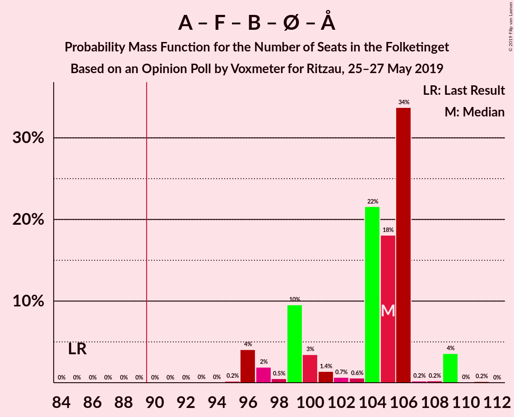

| Number of Seats | Probability | Accumulated | Special Marks |
|:---------------:|:-----------:|:-----------:|:-------------:|
| 85 | 0% | 100% | Last Result |
| 86 | 0% | 100% |  |
| 87 | 0% | 100% |  |
| 88 | 0% | 100% |  |
| 89 | 0% | 100% |  |
| 90 | 0% | 100% | Majority |
| 91 | 0% | 100% |  |
| 92 | 0% | 100% |  |
| 93 | 0% | 100% |  |
| 94 | 0% | 99.9% |  |
| 95 | 0.2% | 99.9% |  |
| 96 | 4% | 99.7% |  |
| 97 | 2% | 96% |  |
| 98 | 0.5% | 94% |  |
| 99 | 10% | 93% |  |
| 100 | 3% | 84% |  |
| 101 | 1.4% | 80% | Median |
| 102 | 0.7% | 79% |  |
| 103 | 0.6% | 78% |  |
| 104 | 22% | 78% |  |
| 105 | 18% | 56% |  |
| 106 | 34% | 38% |  |
| 107 | 0.2% | 4% |  |
| 108 | 0.2% | 4% |  |
| 109 | 4% | 4% |  |
| 110 | 0% | 0.2% |  |
| 111 | 0.2% | 0.2% |  |
| 112 | 0% | 0% |  |

### Socialdemokraterne – Socialistisk Folkeparti – Radikale Venstre – Enhedslisten–De Rød-Grønne

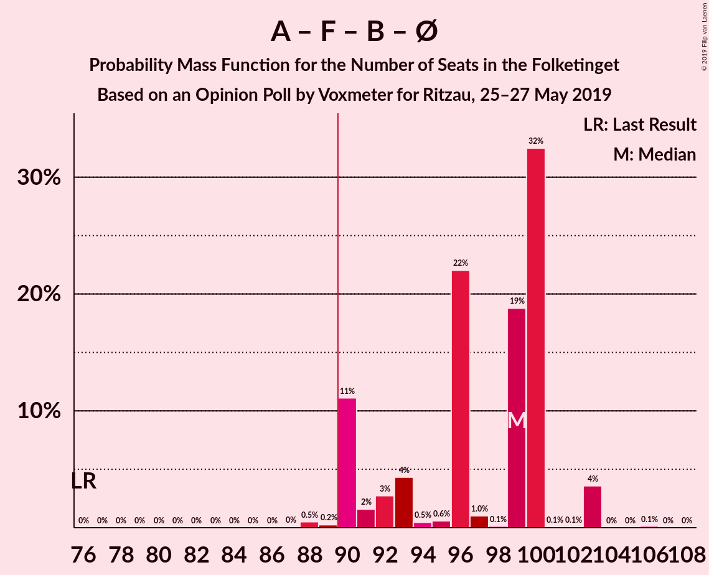

| Number of Seats | Probability | Accumulated | Special Marks |
|:---------------:|:-----------:|:-----------:|:-------------:|
| 76 | 0% | 100% | Last Result |
| 77 | 0% | 100% |  |
| 78 | 0% | 100% |  |
| 79 | 0% | 100% |  |
| 80 | 0% | 100% |  |
| 81 | 0% | 100% |  |
| 82 | 0% | 100% |  |
| 83 | 0% | 100% |  |
| 84 | 0% | 100% |  |
| 85 | 0% | 100% |  |
| 86 | 0% | 100% |  |
| 87 | 0% | 100% |  |
| 88 | 0.5% | 99.9% |  |
| 89 | 0.2% | 99.4% |  |
| 90 | 11% | 99.2% | Majority |
| 91 | 2% | 88% |  |
| 92 | 3% | 86% |  |
| 93 | 4% | 84% |  |
| 94 | 0.5% | 79% |  |
| 95 | 0.6% | 79% | Median |
| 96 | 22% | 78% |  |
| 97 | 1.0% | 56% |  |
| 98 | 0.1% | 55% |  |
| 99 | 19% | 55% |  |
| 100 | 32% | 36% |  |
| 101 | 0.1% | 4% |  |
| 102 | 0.1% | 4% |  |
| 103 | 4% | 4% |  |
| 104 | 0% | 0.2% |  |
| 105 | 0% | 0.2% |  |
| 106 | 0.1% | 0.1% |  |
| 107 | 0% | 0% |  |

### Socialdemokraterne – Socialistisk Folkeparti – Enhedslisten–De Rød-Grønne – Alternativet

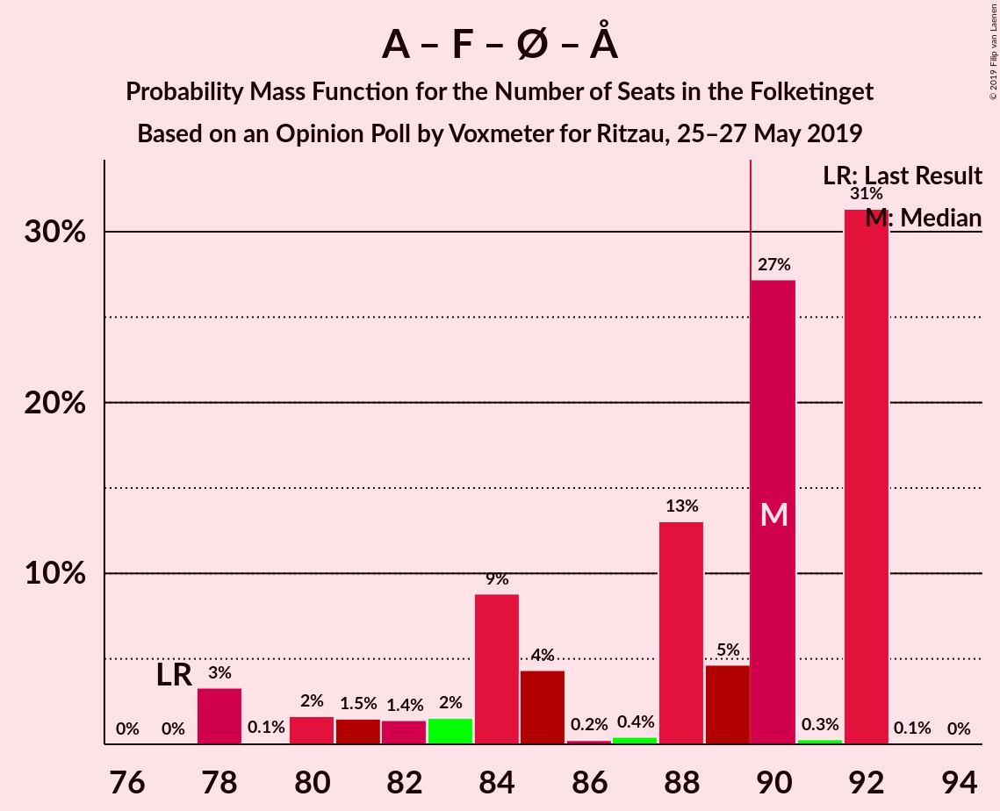

| Number of Seats | Probability | Accumulated | Special Marks |
|:---------------:|:-----------:|:-----------:|:-------------:|
| 77 | 0% | 100% | Last Result |
| 78 | 3% | 100% |  |
| 79 | 0.1% | 97% |  |
| 80 | 2% | 97% |  |
| 81 | 1.5% | 95% |  |
| 82 | 1.4% | 93% |  |
| 83 | 2% | 92% |  |
| 84 | 9% | 90% |  |
| 85 | 4% | 82% |  |
| 86 | 0.2% | 77% |  |
| 87 | 0.4% | 77% | Median |
| 88 | 13% | 77% |  |
| 89 | 5% | 64% |  |
| 90 | 27% | 59% | Majority |
| 91 | 0.3% | 32% |  |
| 92 | 31% | 31% |  |
| 93 | 0.1% | 0.1% |  |
| 94 | 0% | 0% |  |

### Socialdemokraterne – Socialistisk Folkeparti – Radikale Venstre

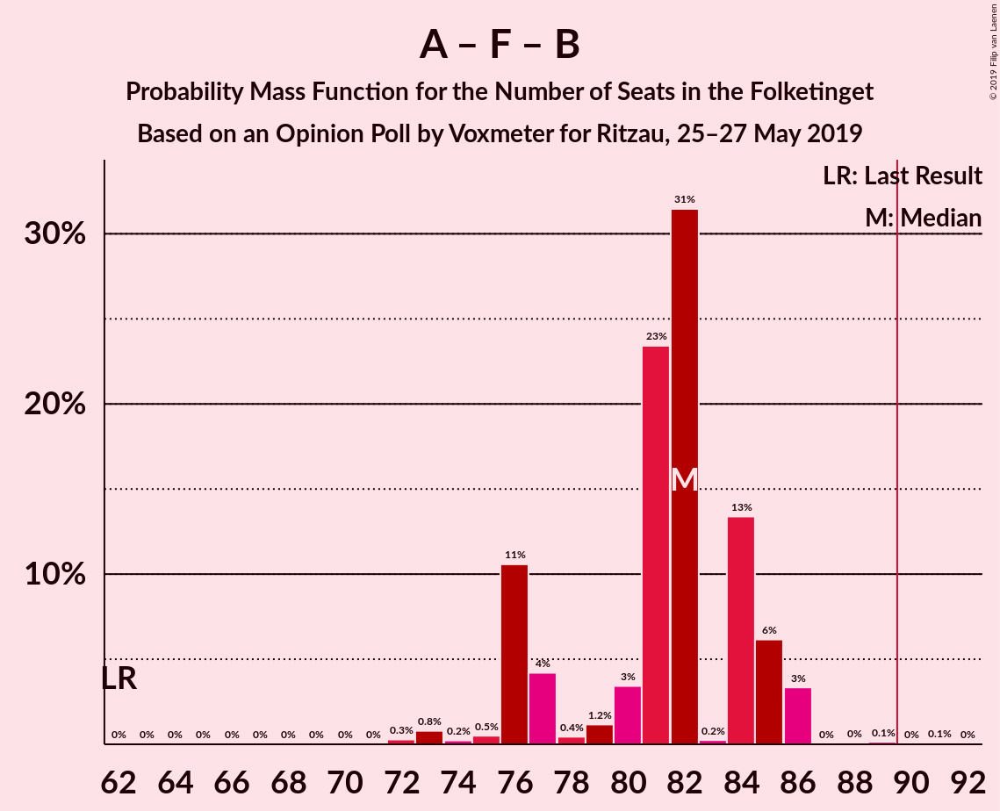

| Number of Seats | Probability | Accumulated | Special Marks |
|:---------------:|:-----------:|:-----------:|:-------------:|
| 62 | 0% | 100% | Last Result |
| 63 | 0% | 100% |  |
| 64 | 0% | 100% |  |
| 65 | 0% | 100% |  |
| 66 | 0% | 100% |  |
| 67 | 0% | 100% |  |
| 68 | 0% | 100% |  |
| 69 | 0% | 100% |  |
| 70 | 0% | 100% |  |
| 71 | 0% | 100% |  |
| 72 | 0.3% | 100% |  |
| 73 | 0.8% | 99.7% |  |
| 74 | 0.2% | 98.9% |  |
| 75 | 0.5% | 98.6% |  |
| 76 | 11% | 98% |  |
| 77 | 4% | 88% |  |
| 78 | 0.4% | 83% |  |
| 79 | 1.2% | 83% |  |
| 80 | 3% | 82% | Median |
| 81 | 23% | 78% |  |
| 82 | 31% | 55% |  |
| 83 | 0.2% | 23% |  |
| 84 | 13% | 23% |  |
| 85 | 6% | 10% |  |
| 86 | 3% | 4% |  |
| 87 | 0% | 0.3% |  |
| 88 | 0% | 0.3% |  |
| 89 | 0.1% | 0.2% |  |
| 90 | 0% | 0.1% | Majority |
| 91 | 0.1% | 0.1% |  |
| 92 | 0% | 0% |  |

### Socialdemokraterne – Socialistisk Folkeparti – Enhedslisten–De Rød-Grønne

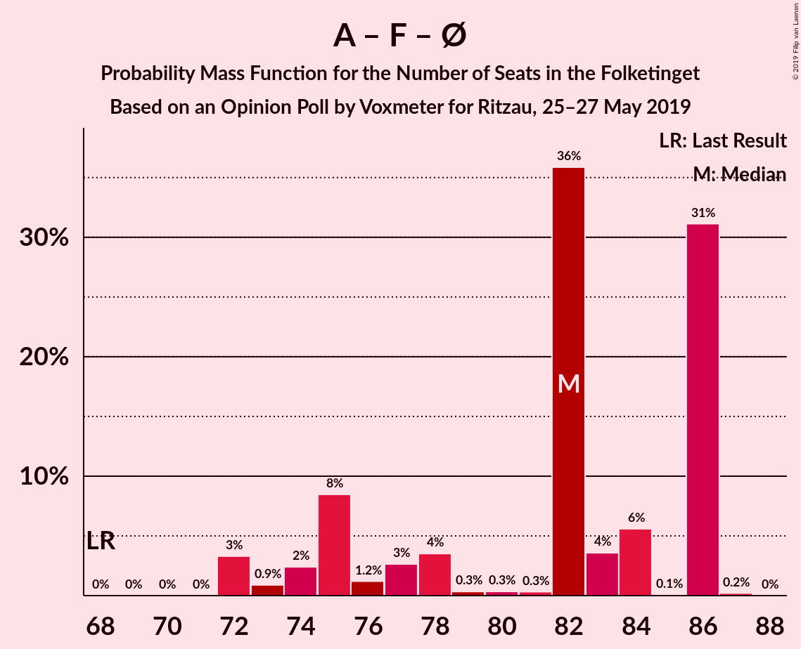

| Number of Seats | Probability | Accumulated | Special Marks |
|:---------------:|:-----------:|:-----------:|:-------------:|
| 68 | 0% | 100% | Last Result |
| 69 | 0% | 100% |  |
| 70 | 0% | 100% |  |
| 71 | 0% | 100% |  |
| 72 | 3% | 99.9% |  |
| 73 | 0.9% | 97% |  |
| 74 | 2% | 96% |  |
| 75 | 8% | 93% |  |
| 76 | 1.2% | 85% |  |
| 77 | 3% | 84% |  |
| 78 | 4% | 81% |  |
| 79 | 0.3% | 77% |  |
| 80 | 0.3% | 77% |  |
| 81 | 0.3% | 77% | Median |
| 82 | 36% | 76% |  |
| 83 | 4% | 41% |  |
| 84 | 6% | 37% |  |
| 85 | 0.1% | 31% |  |
| 86 | 31% | 31% |  |
| 87 | 0.2% | 0.2% |  |
| 88 | 0% | 0% |  |

### Venstre – Dansk Folkeparti – Det Konservative Folkeparti – Liberal Alliance – Stram Kurs – Kristendemokraterne – Nye Borgerlige – Klaus Riskær Pedersen

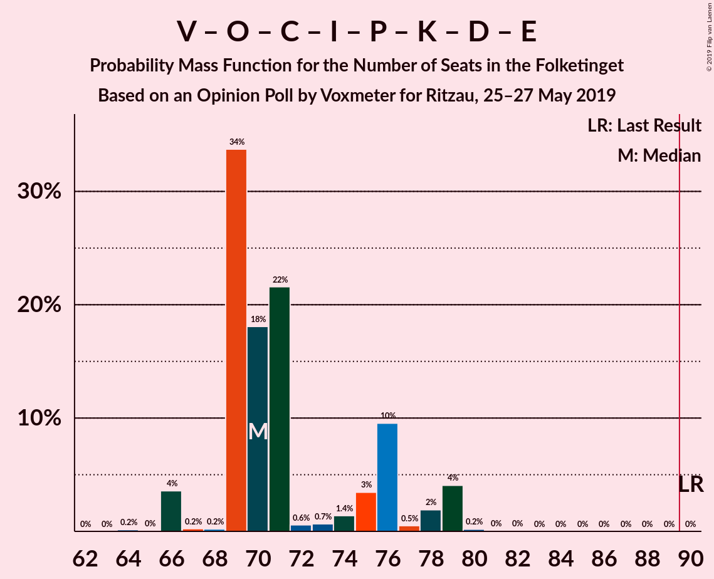

| Number of Seats | Probability | Accumulated | Special Marks |
|:---------------:|:-----------:|:-----------:|:-------------:|
| 64 | 0.2% | 100% |  |
| 65 | 0% | 99.8% |  |
| 66 | 4% | 99.8% |  |
| 67 | 0.2% | 96% |  |
| 68 | 0.2% | 96% |  |
| 69 | 34% | 96% |  |
| 70 | 18% | 62% |  |
| 71 | 22% | 44% |  |
| 72 | 0.6% | 22% | Median |
| 73 | 0.7% | 22% |  |
| 74 | 1.4% | 21% |  |
| 75 | 3% | 20% |  |
| 76 | 10% | 16% |  |
| 77 | 0.5% | 7% |  |
| 78 | 2% | 6% |  |
| 79 | 4% | 4% |  |
| 80 | 0.2% | 0.3% |  |
| 81 | 0% | 0.1% |  |
| 82 | 0% | 0.1% |  |
| 83 | 0% | 0% |  |
| 84 | 0% | 0% |  |
| 85 | 0% | 0% |  |
| 86 | 0% | 0% |  |
| 87 | 0% | 0% |  |
| 88 | 0% | 0% |  |
| 89 | 0% | 0% |  |
| 90 | 0% | 0% | Last Result, Majority |

### Venstre – Dansk Folkeparti – Det Konservative Folkeparti – Liberal Alliance – Kristendemokraterne – Nye Borgerlige – Klaus Riskær Pedersen

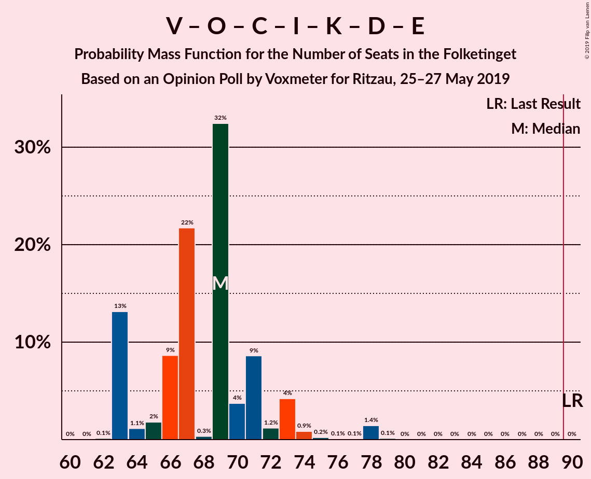

| Number of Seats | Probability | Accumulated | Special Marks |
|:---------------:|:-----------:|:-----------:|:-------------:|
| 62 | 0.1% | 100% |  |
| 63 | 13% | 99.8% |  |
| 64 | 1.1% | 87% |  |
| 65 | 2% | 86% |  |
| 66 | 9% | 84% |  |
| 67 | 22% | 75% |  |
| 68 | 0.3% | 53% | Median |
| 69 | 32% | 53% |  |
| 70 | 4% | 21% |  |
| 71 | 9% | 17% |  |
| 72 | 1.2% | 8% |  |
| 73 | 4% | 7% |  |
| 74 | 0.9% | 3% |  |
| 75 | 0.2% | 2% |  |
| 76 | 0.1% | 2% |  |
| 77 | 0.1% | 2% |  |
| 78 | 1.4% | 2% |  |
| 79 | 0.1% | 0.2% |  |
| 80 | 0% | 0% |  |
| 81 | 0% | 0% |  |
| 82 | 0% | 0% |  |
| 83 | 0% | 0% |  |
| 84 | 0% | 0% |  |
| 85 | 0% | 0% |  |
| 86 | 0% | 0% |  |
| 87 | 0% | 0% |  |
| 88 | 0% | 0% |  |
| 89 | 0% | 0% |  |
| 90 | 0% | 0% | Last Result, Majority |

### Venstre – Dansk Folkeparti – Det Konservative Folkeparti – Liberal Alliance – Kristendemokraterne – Nye Borgerlige

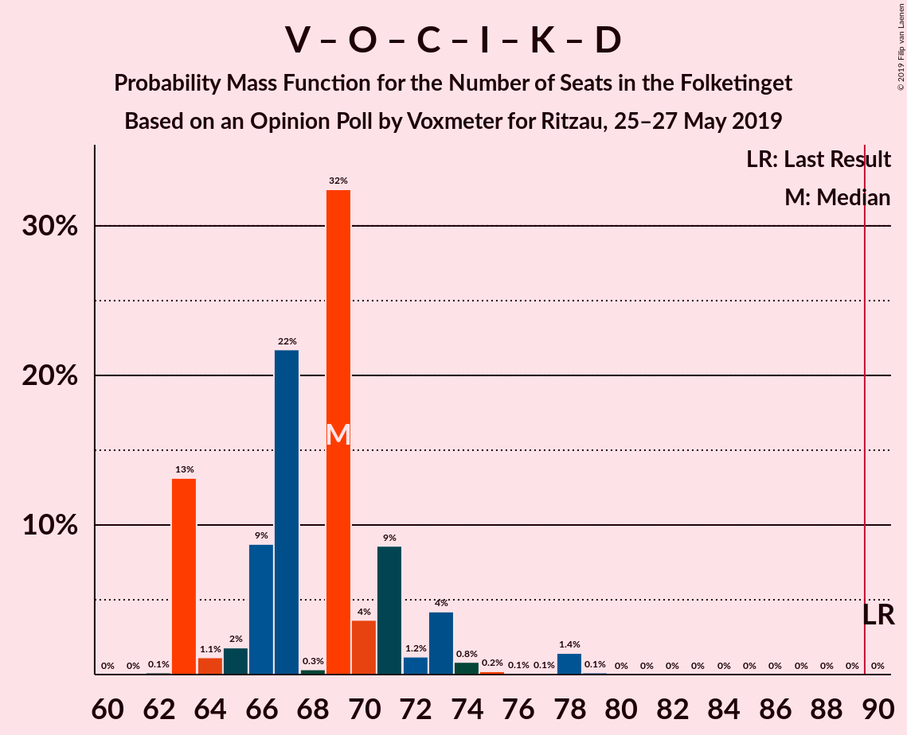

| Number of Seats | Probability | Accumulated | Special Marks |
|:---------------:|:-----------:|:-----------:|:-------------:|
| 62 | 0.1% | 100% |  |
| 63 | 13% | 99.8% |  |
| 64 | 1.1% | 87% |  |
| 65 | 2% | 86% |  |
| 66 | 9% | 84% |  |
| 67 | 22% | 75% |  |
| 68 | 0.3% | 53% | Median |
| 69 | 32% | 53% |  |
| 70 | 4% | 20% |  |
| 71 | 9% | 17% |  |
| 72 | 1.2% | 8% |  |
| 73 | 4% | 7% |  |
| 74 | 0.8% | 3% |  |
| 75 | 0.2% | 2% |  |
| 76 | 0.1% | 2% |  |
| 77 | 0.1% | 2% |  |
| 78 | 1.4% | 2% |  |
| 79 | 0.1% | 0.2% |  |
| 80 | 0% | 0% |  |
| 81 | 0% | 0% |  |
| 82 | 0% | 0% |  |
| 83 | 0% | 0% |  |
| 84 | 0% | 0% |  |
| 85 | 0% | 0% |  |
| 86 | 0% | 0% |  |
| 87 | 0% | 0% |  |
| 88 | 0% | 0% |  |
| 89 | 0% | 0% |  |
| 90 | 0% | 0% | Last Result, Majority |

### Venstre – Dansk Folkeparti – Det Konservative Folkeparti – Liberal Alliance – Kristendemokraterne

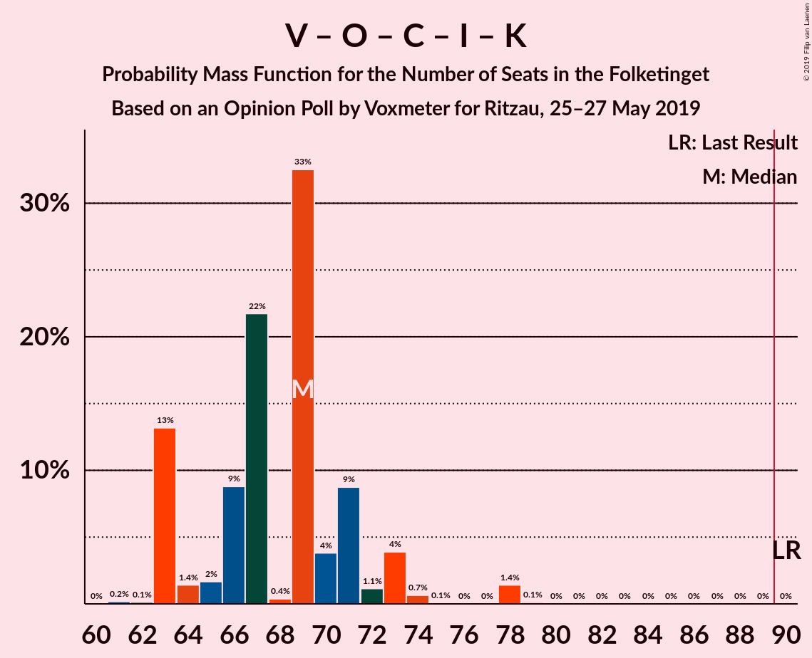

| Number of Seats | Probability | Accumulated | Special Marks |
|:---------------:|:-----------:|:-----------:|:-------------:|
| 60 | 0% | 100% |  |
| 61 | 0.2% | 99.9% |  |
| 62 | 0.1% | 99.8% |  |
| 63 | 13% | 99.6% |  |
| 64 | 1.4% | 86% |  |
| 65 | 2% | 85% |  |
| 66 | 9% | 83% |  |
| 67 | 22% | 75% |  |
| 68 | 0.4% | 53% | Median |
| 69 | 33% | 52% |  |
| 70 | 4% | 20% |  |
| 71 | 9% | 16% |  |
| 72 | 1.1% | 7% |  |
| 73 | 4% | 6% |  |
| 74 | 0.7% | 2% |  |
| 75 | 0.1% | 2% |  |
| 76 | 0% | 2% |  |
| 77 | 0% | 2% |  |
| 78 | 1.4% | 2% |  |
| 79 | 0.1% | 0.1% |  |
| 80 | 0% | 0% |  |
| 81 | 0% | 0% |  |
| 82 | 0% | 0% |  |
| 83 | 0% | 0% |  |
| 84 | 0% | 0% |  |
| 85 | 0% | 0% |  |
| 86 | 0% | 0% |  |
| 87 | 0% | 0% |  |
| 88 | 0% | 0% |  |
| 89 | 0% | 0% |  |
| 90 | 0% | 0% | Last Result, Majority |

### Venstre – Dansk Folkeparti – Det Konservative Folkeparti – Liberal Alliance – Nye Borgerlige – Klaus Riskær Pedersen

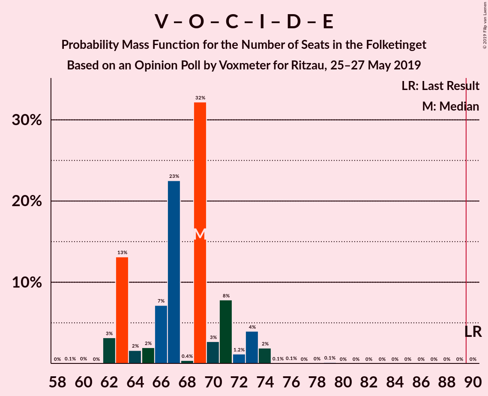

| Number of Seats | Probability | Accumulated | Special Marks |
|:---------------:|:-----------:|:-----------:|:-------------:|
| 59 | 0.1% | 100% |  |
| 60 | 0% | 99.9% |  |
| 61 | 0% | 99.9% |  |
| 62 | 3% | 99.9% |  |
| 63 | 13% | 97% |  |
| 64 | 2% | 84% |  |
| 65 | 2% | 82% |  |
| 66 | 7% | 80% |  |
| 67 | 23% | 73% |  |
| 68 | 0.4% | 50% | Median |
| 69 | 32% | 50% |  |
| 70 | 3% | 18% |  |
| 71 | 8% | 15% |  |
| 72 | 1.2% | 7% |  |
| 73 | 4% | 6% |  |
| 74 | 2% | 2% |  |
| 75 | 0.1% | 0.3% |  |
| 76 | 0.1% | 0.2% |  |
| 77 | 0% | 0.2% |  |
| 78 | 0% | 0.1% |  |
| 79 | 0.1% | 0.1% |  |
| 80 | 0% | 0% |  |
| 81 | 0% | 0% |  |
| 82 | 0% | 0% |  |
| 83 | 0% | 0% |  |
| 84 | 0% | 0% |  |
| 85 | 0% | 0% |  |
| 86 | 0% | 0% |  |
| 87 | 0% | 0% |  |
| 88 | 0% | 0% |  |
| 89 | 0% | 0% |  |
| 90 | 0% | 0% | Last Result, Majority |

### Venstre – Dansk Folkeparti – Det Konservative Folkeparti – Liberal Alliance – Nye Borgerlige

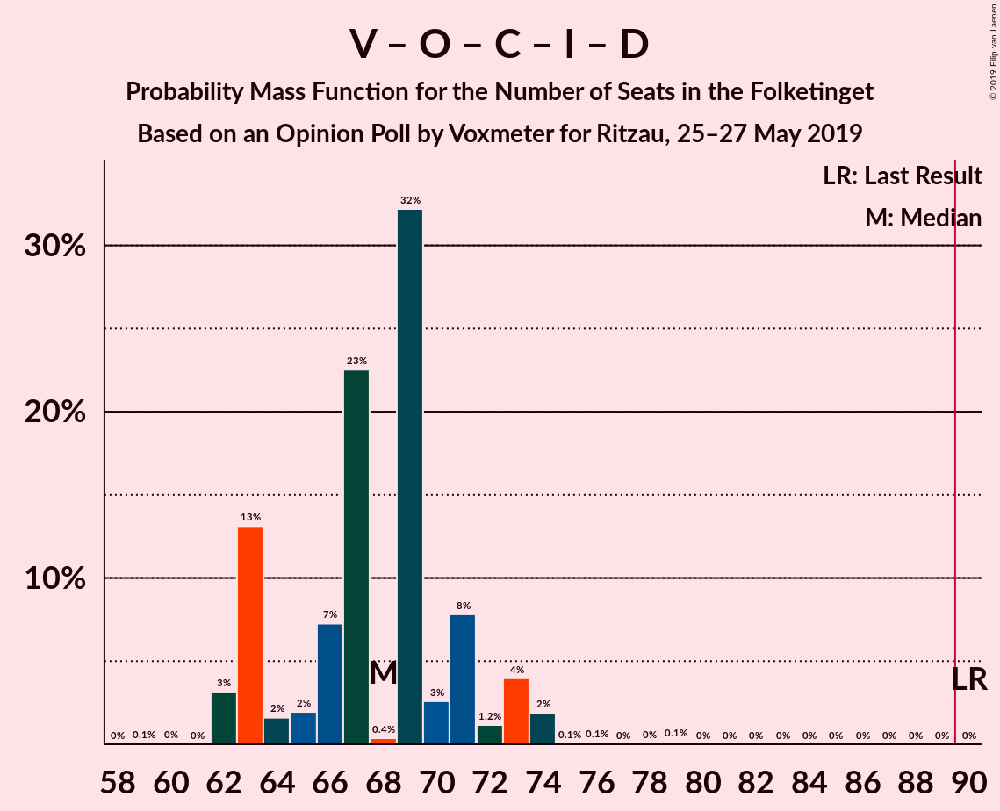

| Number of Seats | Probability | Accumulated | Special Marks |
|:---------------:|:-----------:|:-----------:|:-------------:|
| 59 | 0.1% | 100% |  |
| 60 | 0% | 99.9% |  |
| 61 | 0% | 99.9% |  |
| 62 | 3% | 99.9% |  |
| 63 | 13% | 97% |  |
| 64 | 2% | 84% |  |
| 65 | 2% | 82% |  |
| 66 | 7% | 80% |  |
| 67 | 23% | 73% |  |
| 68 | 0.4% | 50% | Median |
| 69 | 32% | 50% |  |
| 70 | 3% | 18% |  |
| 71 | 8% | 15% |  |
| 72 | 1.2% | 7% |  |
| 73 | 4% | 6% |  |
| 74 | 2% | 2% |  |
| 75 | 0.1% | 0.3% |  |
| 76 | 0.1% | 0.2% |  |
| 77 | 0% | 0.1% |  |
| 78 | 0% | 0.1% |  |
| 79 | 0.1% | 0.1% |  |
| 80 | 0% | 0% |  |
| 81 | 0% | 0% |  |
| 82 | 0% | 0% |  |
| 83 | 0% | 0% |  |
| 84 | 0% | 0% |  |
| 85 | 0% | 0% |  |
| 86 | 0% | 0% |  |
| 87 | 0% | 0% |  |
| 88 | 0% | 0% |  |
| 89 | 0% | 0% |  |
| 90 | 0% | 0% | Last Result, Majority |

### Venstre – Dansk Folkeparti – Det Konservative Folkeparti – Liberal Alliance

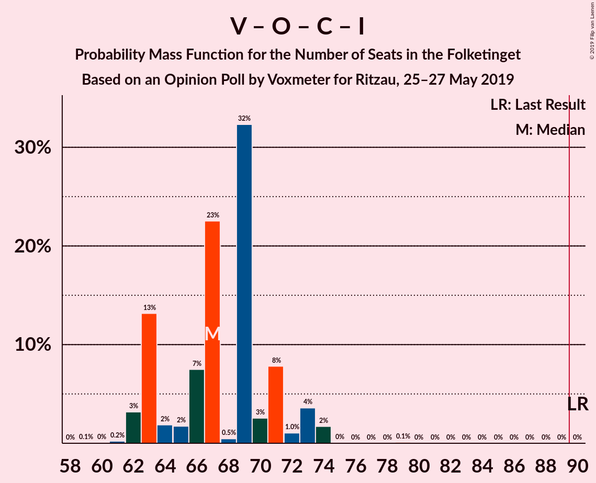

| Number of Seats | Probability | Accumulated | Special Marks |
|:---------------:|:-----------:|:-----------:|:-------------:|
| 59 | 0.1% | 100% |  |
| 60 | 0% | 99.9% |  |
| 61 | 0.2% | 99.9% |  |
| 62 | 3% | 99.7% |  |
| 63 | 13% | 96% |  |
| 64 | 2% | 83% |  |
| 65 | 2% | 81% |  |
| 66 | 7% | 80% |  |
| 67 | 23% | 72% |  |
| 68 | 0.5% | 50% | Median |
| 69 | 32% | 49% |  |
| 70 | 3% | 17% |  |
| 71 | 8% | 14% |  |
| 72 | 1.0% | 7% |  |
| 73 | 4% | 5% |  |
| 74 | 2% | 2% |  |
| 75 | 0% | 0.2% |  |
| 76 | 0% | 0.1% |  |
| 77 | 0% | 0.1% |  |
| 78 | 0% | 0.1% |  |
| 79 | 0.1% | 0.1% |  |
| 80 | 0% | 0% |  |
| 81 | 0% | 0% |  |
| 82 | 0% | 0% |  |
| 83 | 0% | 0% |  |
| 84 | 0% | 0% |  |
| 85 | 0% | 0% |  |
| 86 | 0% | 0% |  |
| 87 | 0% | 0% |  |
| 88 | 0% | 0% |  |
| 89 | 0% | 0% |  |
| 90 | 0% | 0% | Last Result, Majority |

### Socialdemokraterne – Radikale Venstre

| Number of Seats | Probability | Accumulated | Special Marks |
|:---------------:|:-----------:|:-----------:|:-------------:|
| 55 | 0% | 100% | Last Result |
| 56 | 0% | 100% |  |
| 57 | 0.9% | 99.9% |  |
| 58 | 1.5% | 99.1% |  |
| 59 | 0.1% | 98% |  |
| 60 | 4% | 97% |  |
| 61 | 1.0% | 94% |  |
| 62 | 10% | 93% |  |
| 63 | 22% | 83% |  |
| 64 | 3% | 61% | Median |
| 65 | 2% | 58% |  |
| 66 | 33% | 56% |  |
| 67 | 17% | 23% |  |
| 68 | 0.4% | 7% |  |
| 69 | 1.2% | 6% |  |
| 70 | 3% | 5% |  |
| 71 | 2% | 2% |  |
| 72 | 0.1% | 0.1% |  |
| 73 | 0% | 0.1% |  |
| 74 | 0% | 0.1% |  |
| 75 | 0% | 0.1% |  |
| 76 | 0.1% | 0.1% |  |
| 77 | 0% | 0% |  |

### Venstre – Det Konservative Folkeparti – Liberal Alliance

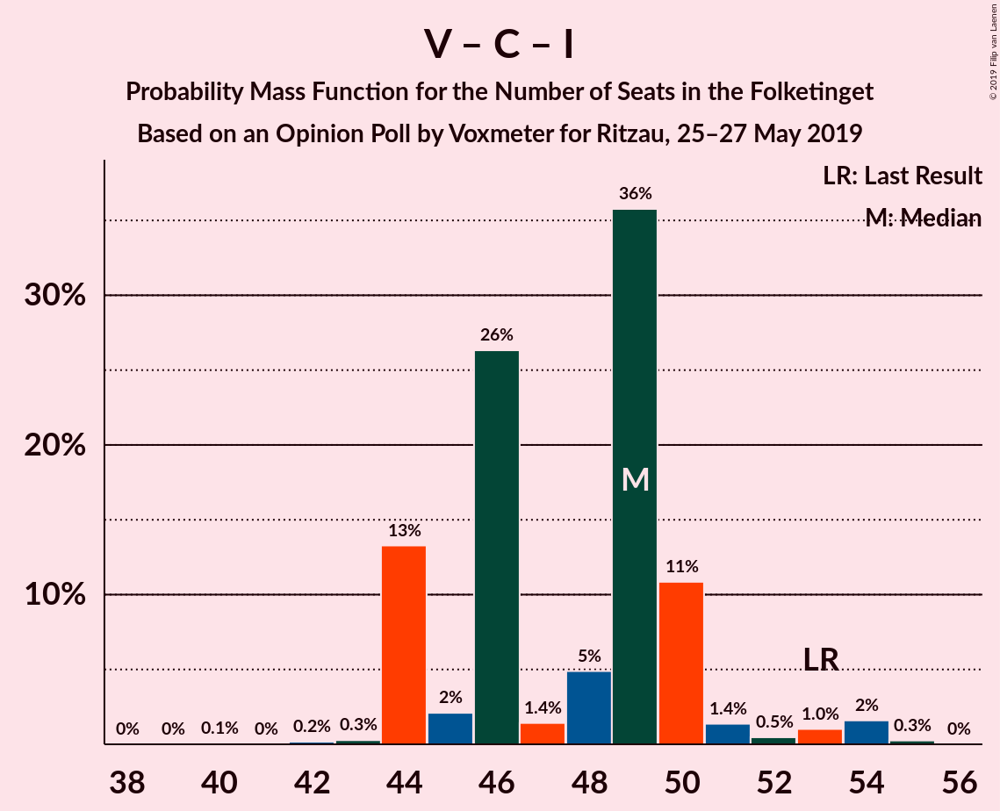

| Number of Seats | Probability | Accumulated | Special Marks |
|:---------------:|:-----------:|:-----------:|:-------------:|
| 40 | 0.1% | 100% |  |
| 41 | 0% | 99.9% |  |
| 42 | 0.2% | 99.9% |  |
| 43 | 0.3% | 99.7% |  |
| 44 | 13% | 99.4% |  |
| 45 | 2% | 86% |  |
| 46 | 26% | 84% |  |
| 47 | 1.4% | 58% |  |
| 48 | 5% | 56% | Median |
| 49 | 36% | 51% |  |
| 50 | 11% | 16% |  |
| 51 | 1.4% | 5% |  |
| 52 | 0.5% | 3% |  |
| 53 | 1.0% | 3% | Last Result |
| 54 | 2% | 2% |  |
| 55 | 0.3% | 0.3% |  |
| 56 | 0% | 0% |  |

### Venstre – Det Konservative Folkeparti

| Number of Seats | Probability | Accumulated | Special Marks |
|:---------------:|:-----------:|:-----------:|:-------------:|
| 34 | 0% | 100% |  |
| 35 | 0.1% | 99.9% |  |
| 36 | 0.1% | 99.8% |  |
| 37 | 0.3% | 99.8% |  |
| 38 | 0.2% | 99.5% |  |
| 39 | 15% | 99.3% |  |
| 40 | 24% | 85% | Last Result |
| 41 | 4% | 61% |  |
| 42 | 44% | 57% | Median |
| 43 | 3% | 13% |  |
| 44 | 2% | 10% |  |
| 45 | 5% | 8% |  |
| 46 | 1.1% | 3% |  |
| 47 | 0.4% | 2% |  |
| 48 | 2% | 2% |  |
| 49 | 0% | 0.2% |  |
| 50 | 0.1% | 0.2% |  |
| 51 | 0% | 0% |  |

### Venstre

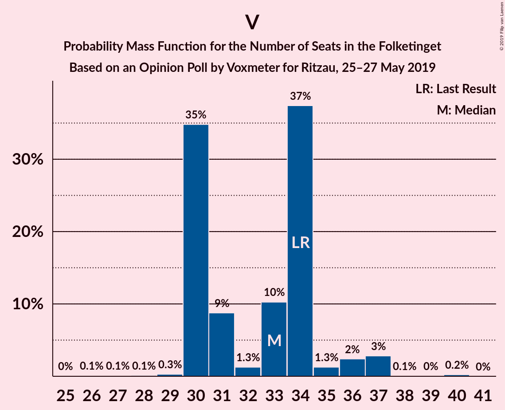

| Number of Seats | Probability | Accumulated | Special Marks |
|:---------------:|:-----------:|:-----------:|:-------------:|
| 26 | 0.1% | 100% |  |
| 27 | 0.1% | 99.9% |  |
| 28 | 0.1% | 99.8% |  |
| 29 | 0.3% | 99.6% |  |
| 30 | 35% | 99.3% |  |
| 31 | 9% | 65% |  |
| 32 | 1.3% | 56% |  |
| 33 | 10% | 55% | Median |
| 34 | 37% | 44% | Last Result |
| 35 | 1.3% | 7% |  |
| 36 | 2% | 6% |  |
| 37 | 3% | 3% |  |
| 38 | 0.1% | 0.3% |  |
| 39 | 0% | 0.3% |  |
| 40 | 0.2% | 0.2% |  |
| 41 | 0% | 0% |  |

## Technical Information

### Opinion Poll

+ **Polling firm:** Voxmeter
+ **Commissioner(s):** Ritzau
+ **Fieldwork period:** 25–27 May 2019

### Calculations

+ **Sample size:** 1007
+ **Simulations done:** 1,048,576
+ **Error estimate:** 1.89%

