# Opinion Poll by Voxmeter for Ritzau, 26–28 May 2019

<a href="#voting-intentions">Voting Intentions</a> | <a href="#seats">Seats</a> | <a href="#coalitions">Coalitions</a> | <a href="#technical-information">Technical Information</a>

## Voting Intentions

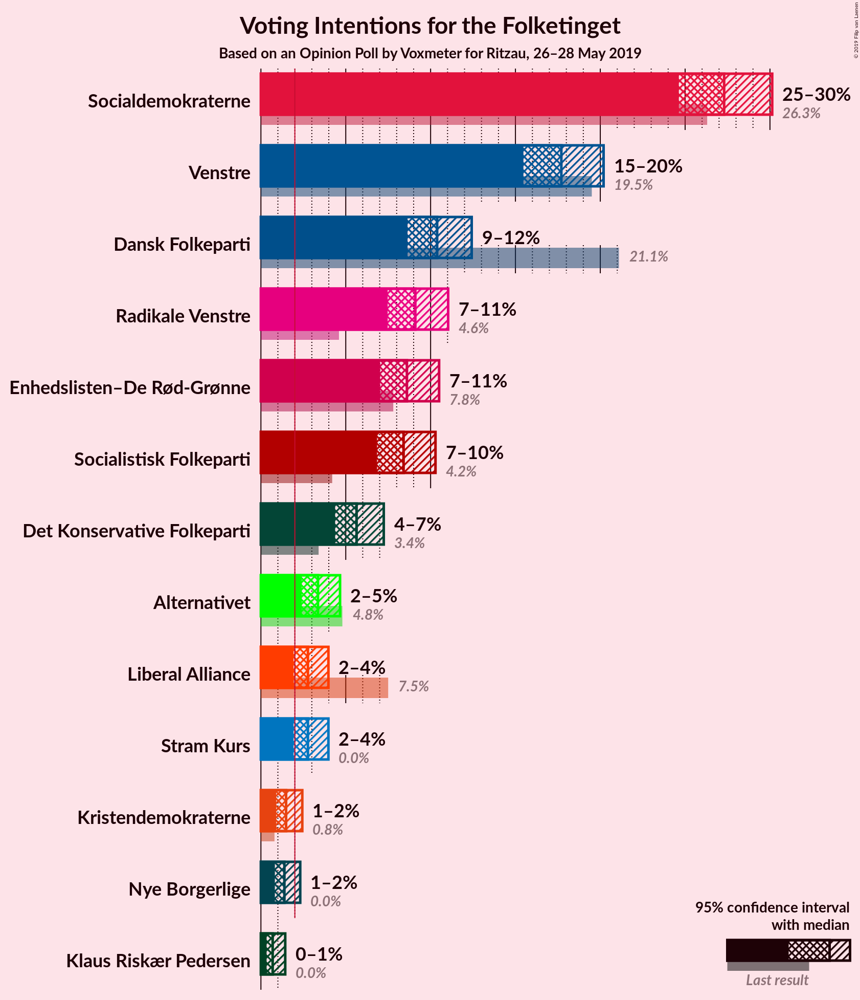

### Confidence Intervals

| Party | Last Result | Poll Result | 80% Confidence Interval | 90% Confidence Interval | 95% Confidence Interval | 99% Confidence Interval |
|:-----:|:-----------:|:-----------:|:-----------------------:|:-----------------------:|:-----------------------:|:-----------------------:|
| Socialdemokraterne | 26.3% | 27.3% | 25.6–29.2% |25.1–29.7% |24.6–30.1% |23.8–31.0% |
| Venstre | 19.5% | 17.7% | 16.2–19.3% |15.8–19.8% |15.5–20.2% |14.8–21.0% |
| Dansk Folkeparti | 21.1% | 10.4% | 9.2–11.7% |8.9–12.1% |8.6–12.4% |8.1–13.1% |
| Radikale Venstre | 4.6% | 9.1% | 8.0–10.4% |7.7–10.7% |7.5–11.0% |7.0–11.7% |
| Enhedslisten–De Rød-Grønne | 7.8% | 8.6% | 7.6–9.8% |7.3–10.2% |7.0–10.5% |6.6–11.1% |
| Socialistisk Folkeparti | 4.2% | 8.4% | 7.4–9.6% |7.1–10.0% |6.8–10.3% |6.4–10.9% |
| Det Konservative Folkeparti | 3.4% | 5.6% | 4.8–6.7% |4.6–7.0% |4.4–7.2% |4.0–7.8% |
| Alternativet | 4.8% | 3.4% | 2.7–4.2% |2.6–4.5% |2.4–4.7% |2.1–5.1% |
| Liberal Alliance | 7.5% | 2.8% | 2.2–3.6% |2.0–3.8% |1.9–4.0% |1.7–4.4% |
| Stram Kurs | 0.0% | 2.8% | 2.2–3.6% |2.0–3.8% |1.9–4.0% |1.7–4.4% |
| Kristendemokraterne | 0.8% | 1.5% | 1.1–2.1% |1.0–2.3% |0.9–2.4% |0.7–2.8% |
| Nye Borgerlige | 0.0% | 1.4% | 1.0–2.0% |0.9–2.2% |0.8–2.3% |0.7–2.6% |
| Klaus Riskær Pedersen | 0.0% | 0.7% | 0.5–1.2% |0.4–1.3% |0.3–1.4% |0.2–1.7% |

*Note:* The poll result column reflects the actual value used in the calculations. Published results may vary slightly, and in addition be rounded to fewer digits.

## Seats

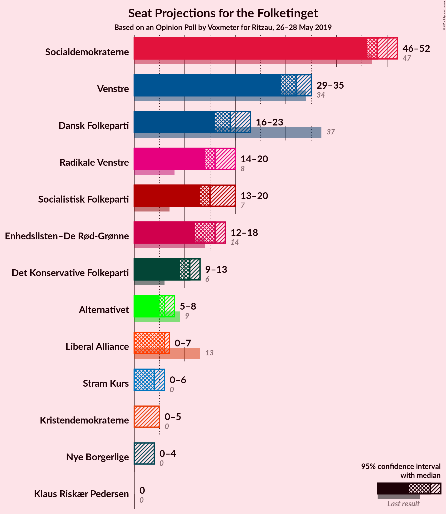

### Confidence Intervals

| Party | Last Result | Median | 80% Confidence Interval | 90% Confidence Interval | 95% Confidence Interval | 99% Confidence Interval |
|:-----:|:-----------:|:------:|:-----------------------:|:-----------------------:|:-----------------------:|:-----------------------:|
| <a href="#socialdemokraterne">Socialdemokraterne</a> | 47 | 48 | 46–50 |46–52 |46–52 |43–54 |
| <a href="#venstre">Venstre</a> | 34 | 32 | 30–34 |29–35 |29–35 |27–37 |
| <a href="#dansk-folkeparti">Dansk Folkeparti</a> | 37 | 19 | 17–23 |17–23 |16–23 |15–23 |
| <a href="#radikale-venstre">Radikale Venstre</a> | 8 | 16 | 14–18 |14–20 |14–20 |13–20 |
| <a href="#enhedslisten–de-rød-grønne">Enhedslisten–De Rød-Grønne</a> | 14 | 16 | 14–17 |12–17 |12–18 |12–20 |
| <a href="#socialistisk-folkeparti">Socialistisk Folkeparti</a> | 7 | 15 | 13–17 |13–19 |13–20 |12–20 |
| <a href="#det-konservative-folkeparti">Det Konservative Folkeparti</a> | 6 | 11 | 9–11 |9–12 |9–13 |7–15 |
| <a href="#alternativet">Alternativet</a> | 9 | 6 | 5–7 |5–8 |5–8 |4–9 |
| <a href="#liberal-alliance">Liberal Alliance</a> | 13 | 6 | 4–6 |0–6 |0–7 |0–8 |
| <a href="#stram-kurs">Stram Kurs</a> | 0 | 4 | 4–6 |0–6 |0–6 |0–7 |
| <a href="#kristendemokraterne">Kristendemokraterne</a> | 0 | 0 | 0–5 |0–5 |0–5 |0–5 |
| <a href="#nye-borgerlige">Nye Borgerlige</a> | 0 | 0 | 0–4 |0–4 |0–4 |0–4 |
| <a href="#klaus-riskær-pedersen">Klaus Riskær Pedersen</a> | 0 | 0 | 0 |0 |0 |0 |

### Socialdemokraterne

*For a full overview of the results for this party, see the [Socialdemokraterne](party-socialdemokraterne.html) page.*

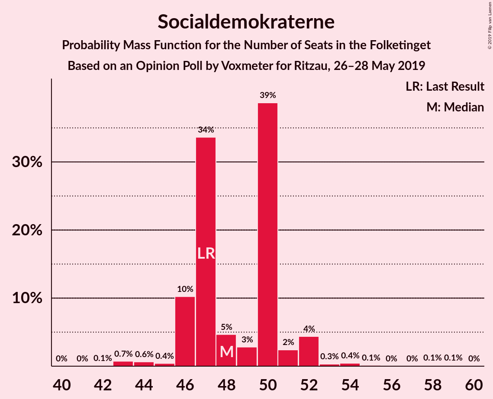

| Number of Seats | Probability | Accumulated | Special Marks |
|:---------------:|:-----------:|:-----------:|:-------------:|
| 41 | 0% | 100% |  |
| 42 | 0.1% | 99.9% |  |
| 43 | 0.7% | 99.9% |  |
| 44 | 0.6% | 99.1% |  |
| 45 | 0.4% | 98% |  |
| 46 | 10% | 98% |  |
| 47 | 34% | 88% | Last Result |
| 48 | 5% | 54% | Median |
| 49 | 3% | 50% |  |
| 50 | 39% | 47% |  |
| 51 | 2% | 8% |  |
| 52 | 4% | 6% |  |
| 53 | 0.3% | 1.2% |  |
| 54 | 0.4% | 0.9% |  |
| 55 | 0.1% | 0.5% |  |
| 56 | 0% | 0.3% |  |
| 57 | 0% | 0.3% |  |
| 58 | 0.1% | 0.2% |  |
| 59 | 0.1% | 0.1% |  |
| 60 | 0% | 0% |  |

### Venstre

*For a full overview of the results for this party, see the [Venstre](party-venstre.html) page.*

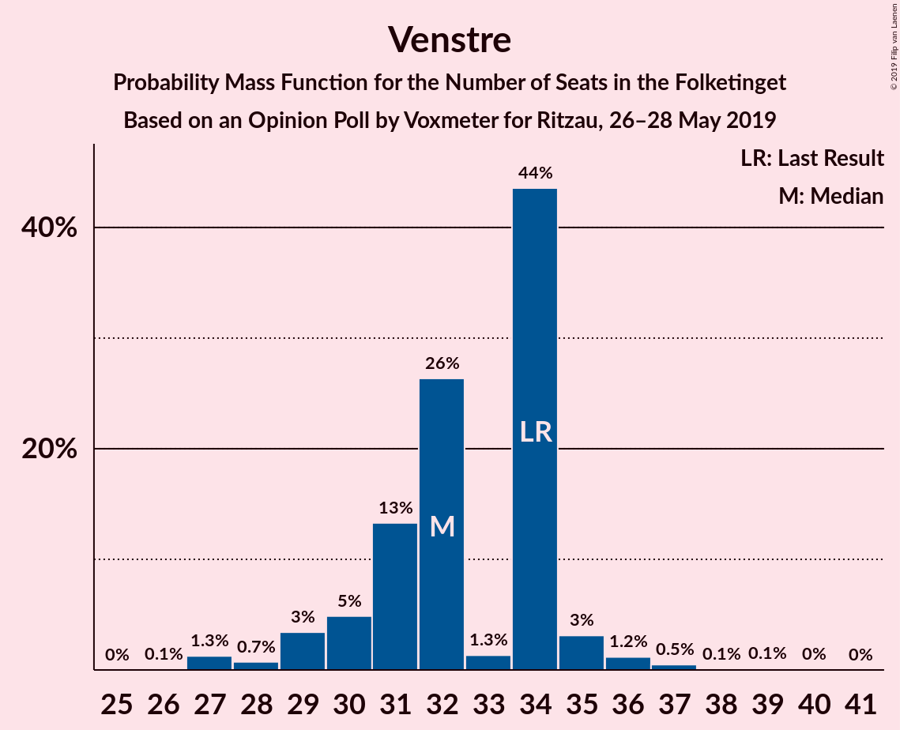

| Number of Seats | Probability | Accumulated | Special Marks |
|:---------------:|:-----------:|:-----------:|:-------------:|
| 26 | 0.1% | 100% |  |
| 27 | 1.3% | 99.9% |  |
| 28 | 0.7% | 98.6% |  |
| 29 | 3% | 98% |  |
| 30 | 5% | 94% |  |
| 31 | 13% | 90% |  |
| 32 | 26% | 76% | Median |
| 33 | 1.3% | 50% |  |
| 34 | 44% | 49% | Last Result |
| 35 | 3% | 5% |  |
| 36 | 1.2% | 2% |  |
| 37 | 0.5% | 0.7% |  |
| 38 | 0.1% | 0.2% |  |
| 39 | 0.1% | 0.2% |  |
| 40 | 0% | 0.1% |  |
| 41 | 0% | 0% |  |

### Dansk Folkeparti

*For a full overview of the results for this party, see the [Dansk Folkeparti](party-danskfolkeparti.html) page.*

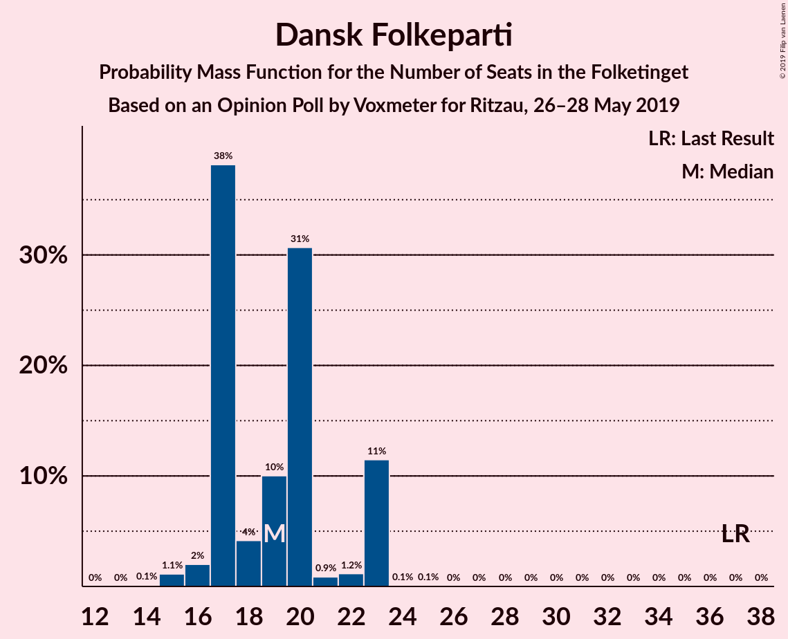

| Number of Seats | Probability | Accumulated | Special Marks |
|:---------------:|:-----------:|:-----------:|:-------------:|
| 14 | 0.1% | 100% |  |
| 15 | 1.1% | 99.8% |  |
| 16 | 2% | 98.7% |  |
| 17 | 38% | 97% |  |
| 18 | 4% | 59% |  |
| 19 | 10% | 54% | Median |
| 20 | 31% | 44% |  |
| 21 | 0.9% | 14% |  |
| 22 | 1.2% | 13% |  |
| 23 | 11% | 12% |  |
| 24 | 0.1% | 0.1% |  |
| 25 | 0.1% | 0.1% |  |
| 26 | 0% | 0% |  |
| 27 | 0% | 0% |  |
| 28 | 0% | 0% |  |
| 29 | 0% | 0% |  |
| 30 | 0% | 0% |  |
| 31 | 0% | 0% |  |
| 32 | 0% | 0% |  |
| 33 | 0% | 0% |  |
| 34 | 0% | 0% |  |
| 35 | 0% | 0% |  |
| 36 | 0% | 0% |  |
| 37 | 0% | 0% | Last Result |

### Radikale Venstre

*For a full overview of the results for this party, see the [Radikale Venstre](party-radikalevenstre.html) page.*

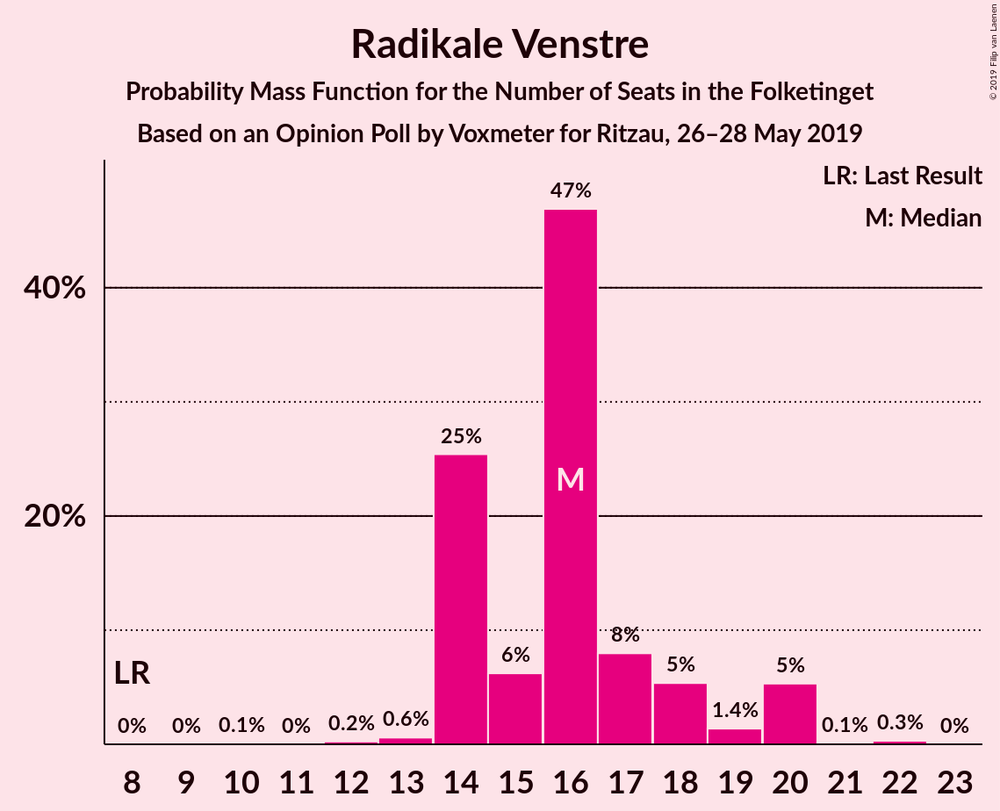

| Number of Seats | Probability | Accumulated | Special Marks |
|:---------------:|:-----------:|:-----------:|:-------------:|
| 8 | 0% | 100% | Last Result |
| 9 | 0% | 100% |  |
| 10 | 0.1% | 100% |  |
| 11 | 0% | 99.9% |  |
| 12 | 0.2% | 99.9% |  |
| 13 | 0.6% | 99.6% |  |
| 14 | 25% | 99.0% |  |
| 15 | 6% | 74% |  |
| 16 | 47% | 67% | Median |
| 17 | 8% | 20% |  |
| 18 | 5% | 13% |  |
| 19 | 1.4% | 7% |  |
| 20 | 5% | 6% |  |
| 21 | 0.1% | 0.5% |  |
| 22 | 0.3% | 0.3% |  |
| 23 | 0% | 0% |  |

### Enhedslisten–De Rød-Grønne

*For a full overview of the results for this party, see the [Enhedslisten–De Rød-Grønne](party-enhedslisten–derød-grønne.html) page.*

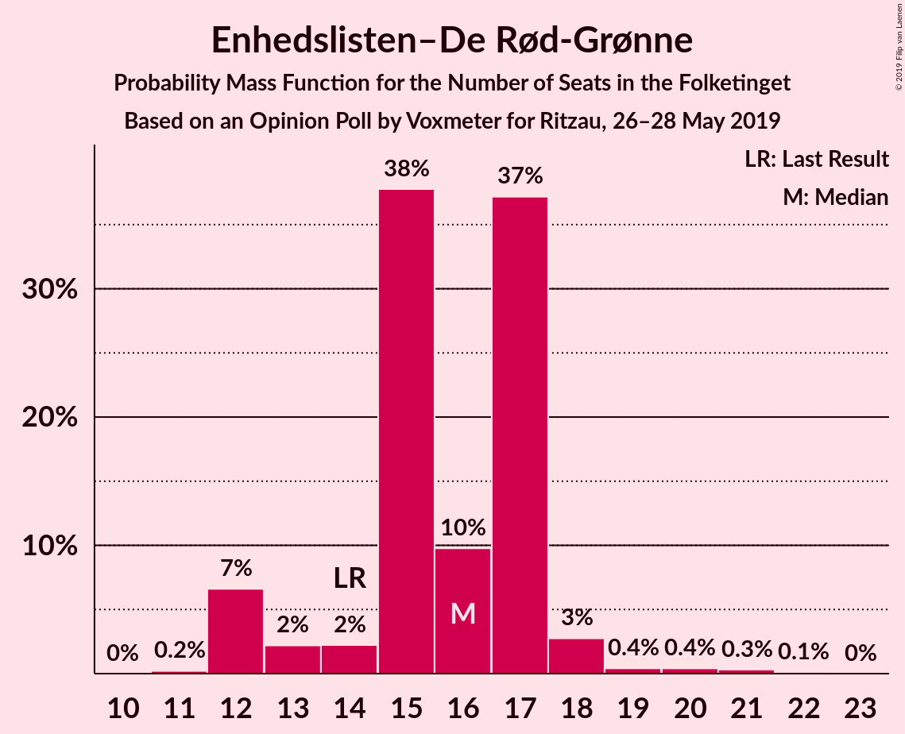

| Number of Seats | Probability | Accumulated | Special Marks |
|:---------------:|:-----------:|:-----------:|:-------------:|
| 11 | 0.2% | 100% |  |
| 12 | 7% | 99.8% |  |
| 13 | 2% | 93% |  |
| 14 | 2% | 91% | Last Result |
| 15 | 38% | 89% |  |
| 16 | 10% | 51% | Median |
| 17 | 37% | 41% |  |
| 18 | 3% | 4% |  |
| 19 | 0.4% | 1.3% |  |
| 20 | 0.4% | 0.9% |  |
| 21 | 0.3% | 0.4% |  |
| 22 | 0.1% | 0.1% |  |
| 23 | 0% | 0% |  |

### Socialistisk Folkeparti

*For a full overview of the results for this party, see the [Socialistisk Folkeparti](party-socialistiskfolkeparti.html) page.*

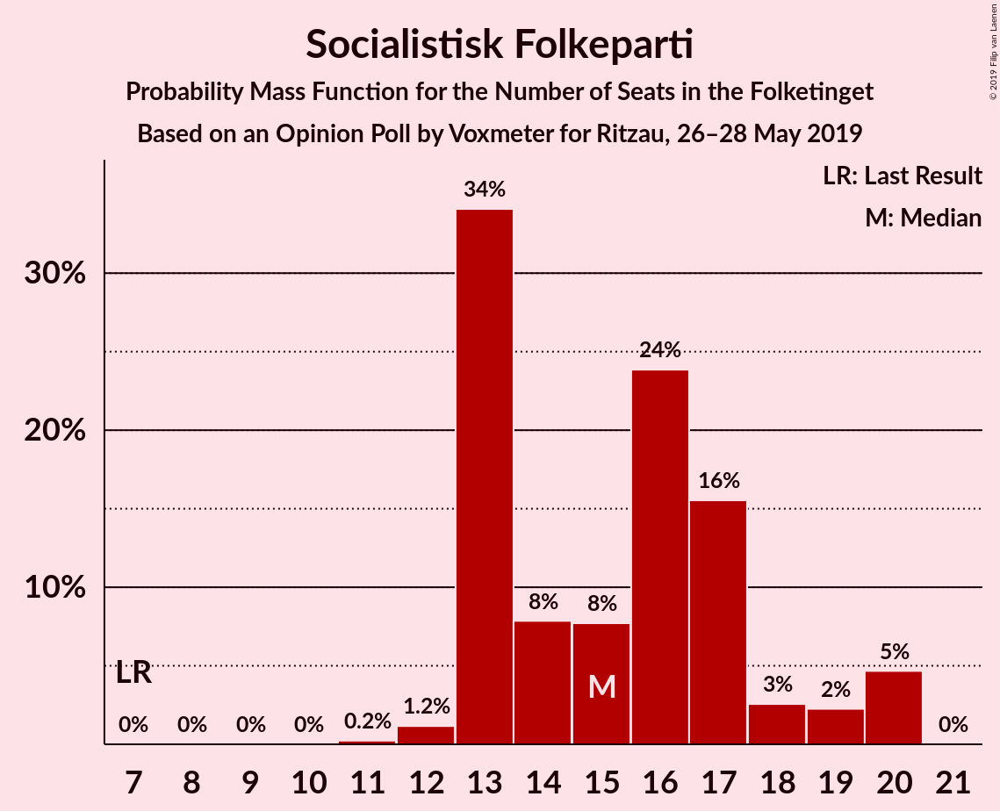

| Number of Seats | Probability | Accumulated | Special Marks |
|:---------------:|:-----------:|:-----------:|:-------------:|
| 7 | 0% | 100% | Last Result |
| 8 | 0% | 100% |  |
| 9 | 0% | 100% |  |
| 10 | 0% | 100% |  |
| 11 | 0.2% | 100% |  |
| 12 | 1.2% | 99.7% |  |
| 13 | 34% | 98.6% |  |
| 14 | 8% | 64% |  |
| 15 | 8% | 57% | Median |
| 16 | 24% | 49% |  |
| 17 | 16% | 25% |  |
| 18 | 3% | 10% |  |
| 19 | 2% | 7% |  |
| 20 | 5% | 5% |  |
| 21 | 0% | 0% |  |

### Det Konservative Folkeparti

*For a full overview of the results for this party, see the [Det Konservative Folkeparti](party-detkonservativefolkeparti.html) page.*

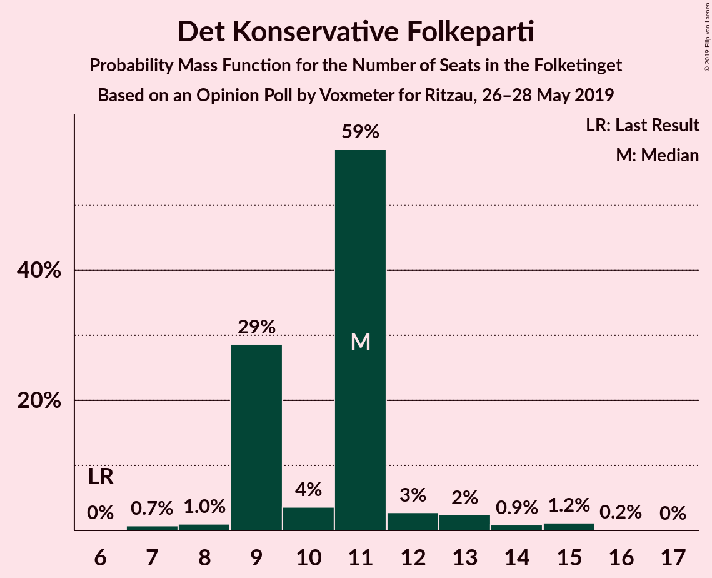

| Number of Seats | Probability | Accumulated | Special Marks |
|:---------------:|:-----------:|:-----------:|:-------------:|
| 6 | 0% | 100% | Last Result |
| 7 | 0.7% | 100% |  |
| 8 | 1.0% | 99.2% |  |
| 9 | 29% | 98% |  |
| 10 | 4% | 70% |  |
| 11 | 59% | 66% | Median |
| 12 | 3% | 7% |  |
| 13 | 2% | 5% |  |
| 14 | 0.9% | 2% |  |
| 15 | 1.2% | 1.3% |  |
| 16 | 0.2% | 0.2% |  |
| 17 | 0% | 0% |  |

### Alternativet

*For a full overview of the results for this party, see the [Alternativet](party-alternativet.html) page.*

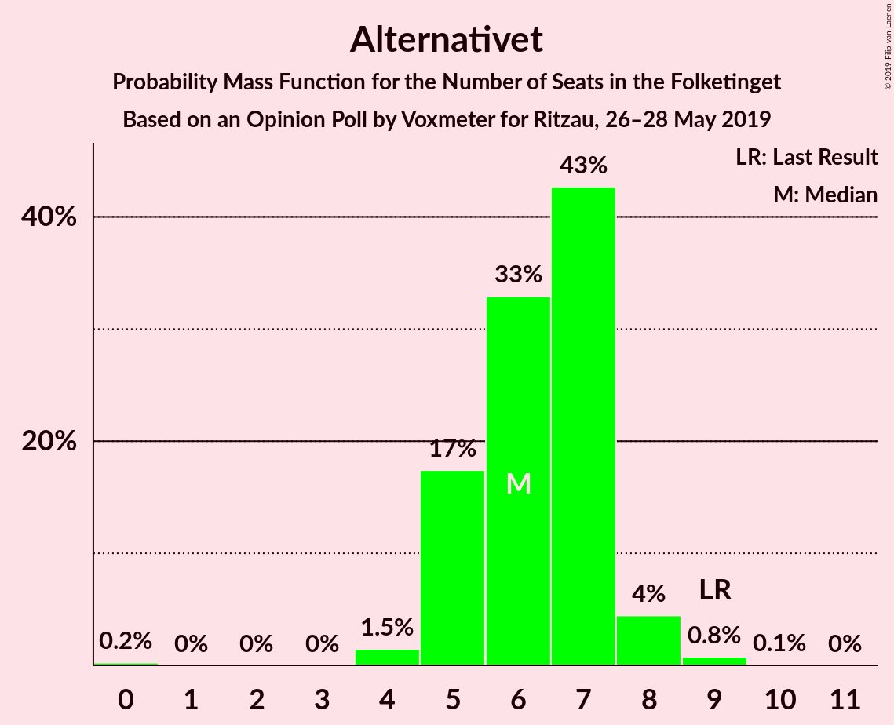

| Number of Seats | Probability | Accumulated | Special Marks |
|:---------------:|:-----------:|:-----------:|:-------------:|
| 0 | 0.2% | 100% |  |
| 1 | 0% | 99.8% |  |
| 2 | 0% | 99.8% |  |
| 3 | 0% | 99.8% |  |
| 4 | 1.5% | 99.8% |  |
| 5 | 17% | 98% |  |
| 6 | 33% | 81% | Median |
| 7 | 43% | 48% |  |
| 8 | 4% | 5% |  |
| 9 | 0.8% | 0.8% | Last Result |
| 10 | 0.1% | 0.1% |  |
| 11 | 0% | 0% |  |

### Liberal Alliance

*For a full overview of the results for this party, see the [Liberal Alliance](party-liberalalliance.html) page.*

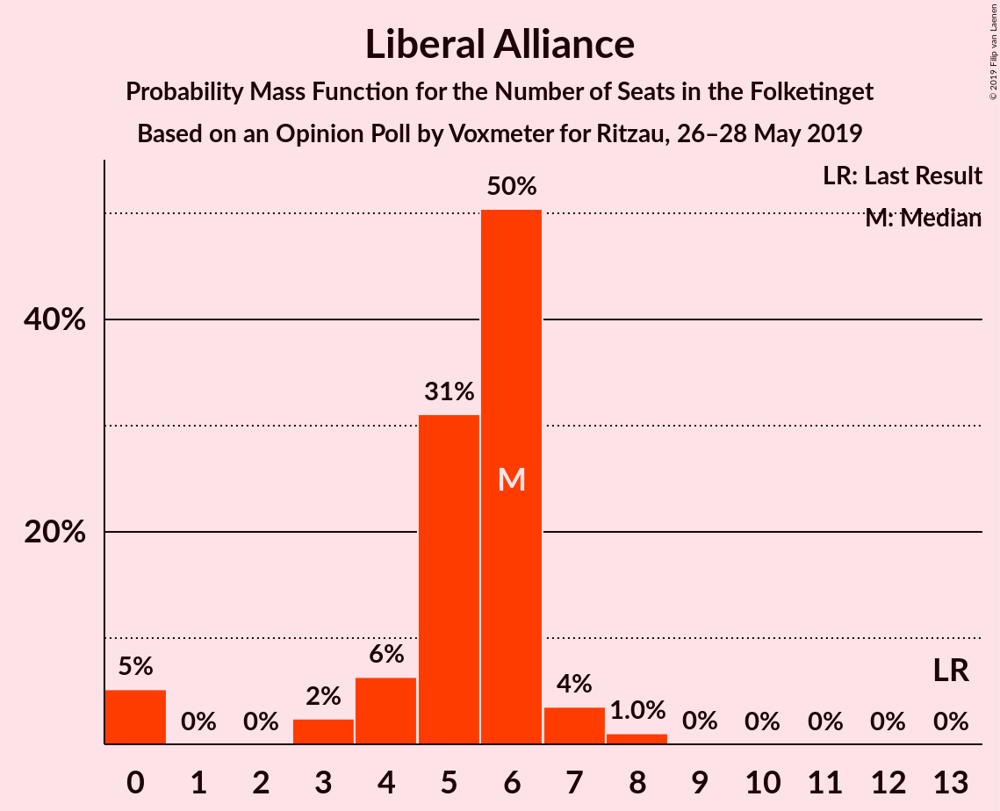

| Number of Seats | Probability | Accumulated | Special Marks |
|:---------------:|:-----------:|:-----------:|:-------------:|
| 0 | 5% | 100% |  |
| 1 | 0% | 95% |  |
| 2 | 0% | 95% |  |
| 3 | 2% | 95% |  |
| 4 | 6% | 92% |  |
| 5 | 31% | 86% |  |
| 6 | 50% | 55% | Median |
| 7 | 4% | 5% |  |
| 8 | 1.0% | 1.1% |  |
| 9 | 0% | 0% |  |
| 10 | 0% | 0% |  |
| 11 | 0% | 0% |  |
| 12 | 0% | 0% |  |
| 13 | 0% | 0% | Last Result |

### Stram Kurs

*For a full overview of the results for this party, see the [Stram Kurs](party-stramkurs.html) page.*

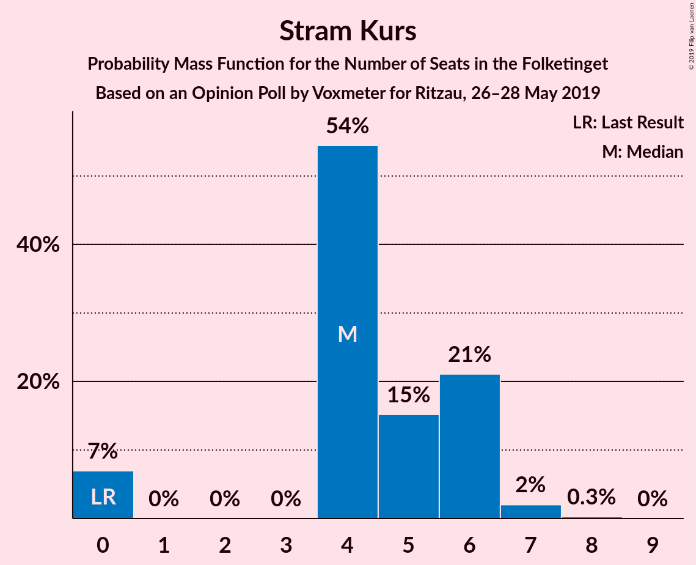

| Number of Seats | Probability | Accumulated | Special Marks |
|:---------------:|:-----------:|:-----------:|:-------------:|
| 0 | 7% | 100% | Last Result |
| 1 | 0% | 93% |  |
| 2 | 0% | 93% |  |
| 3 | 0% | 93% |  |
| 4 | 54% | 93% | Median |
| 5 | 15% | 39% |  |
| 6 | 21% | 23% |  |
| 7 | 2% | 2% |  |
| 8 | 0.3% | 0.3% |  |
| 9 | 0% | 0% |  |

### Kristendemokraterne

*For a full overview of the results for this party, see the [Kristendemokraterne](party-kristendemokraterne.html) page.*

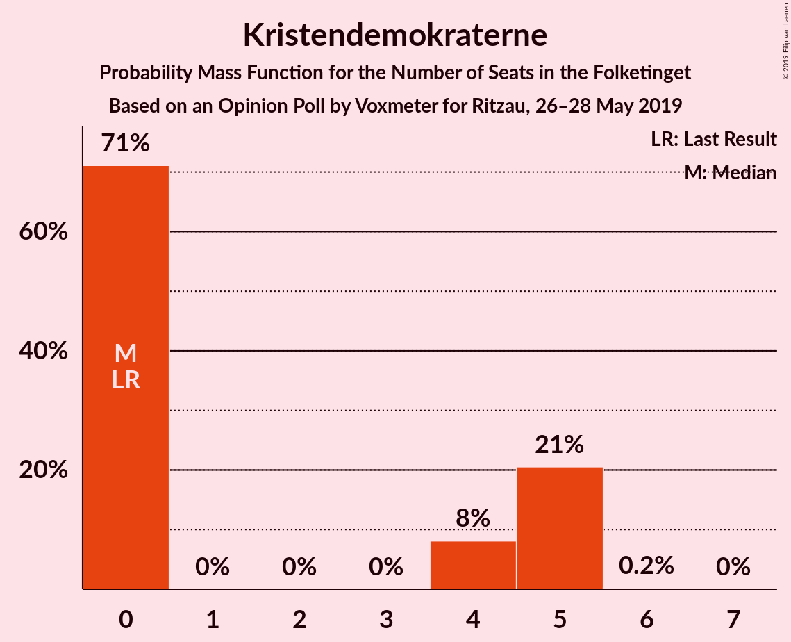

| Number of Seats | Probability | Accumulated | Special Marks |
|:---------------:|:-----------:|:-----------:|:-------------:|
| 0 | 71% | 100% | Last Result, Median |
| 1 | 0% | 29% |  |
| 2 | 0% | 29% |  |
| 3 | 0% | 29% |  |
| 4 | 8% | 29% |  |
| 5 | 21% | 21% |  |
| 6 | 0.2% | 0.2% |  |
| 7 | 0% | 0% |  |

### Nye Borgerlige

*For a full overview of the results for this party, see the [Nye Borgerlige](party-nyeborgerlige.html) page.*

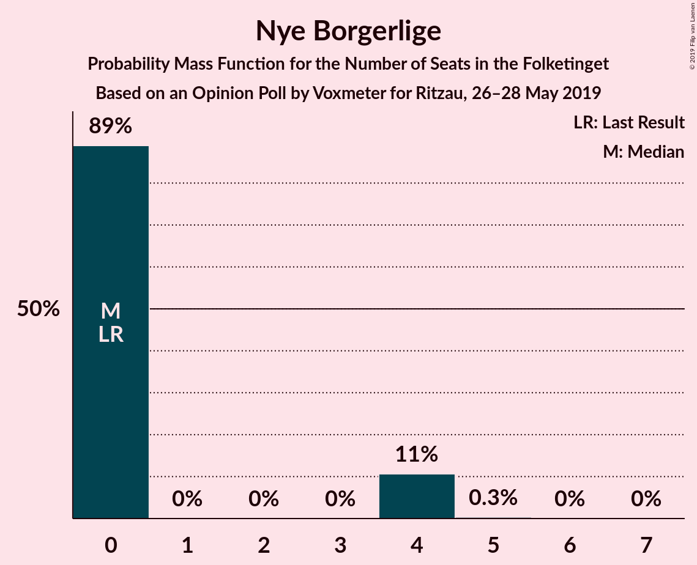

| Number of Seats | Probability | Accumulated | Special Marks |
|:---------------:|:-----------:|:-----------:|:-------------:|
| 0 | 89% | 100% | Last Result, Median |
| 1 | 0% | 11% |  |
| 2 | 0% | 11% |  |
| 3 | 0% | 11% |  |
| 4 | 11% | 11% |  |
| 5 | 0.3% | 0.4% |  |
| 6 | 0% | 0.1% |  |
| 7 | 0% | 0% |  |

### Klaus Riskær Pedersen

*For a full overview of the results for this party, see the [Klaus Riskær Pedersen](party-klausriskærpedersen.html) page.*

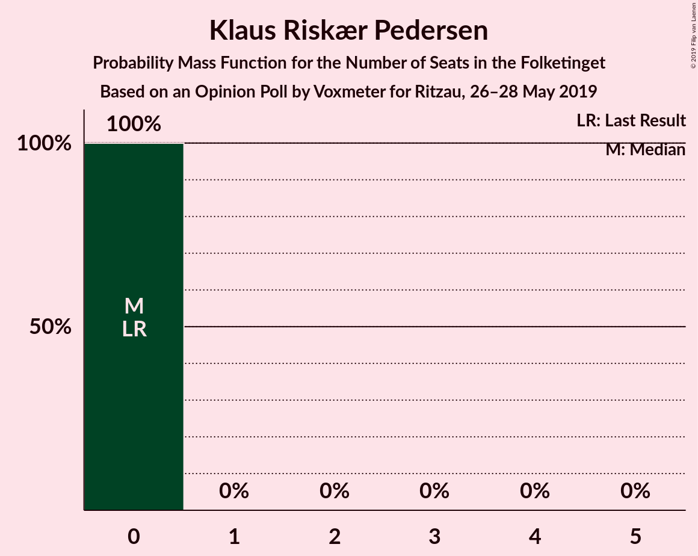

| Number of Seats | Probability | Accumulated | Special Marks |
|:---------------:|:-----------:|:-----------:|:-------------:|
| 0 | 100% | 100% | Last Result, Median |

## Coalitions

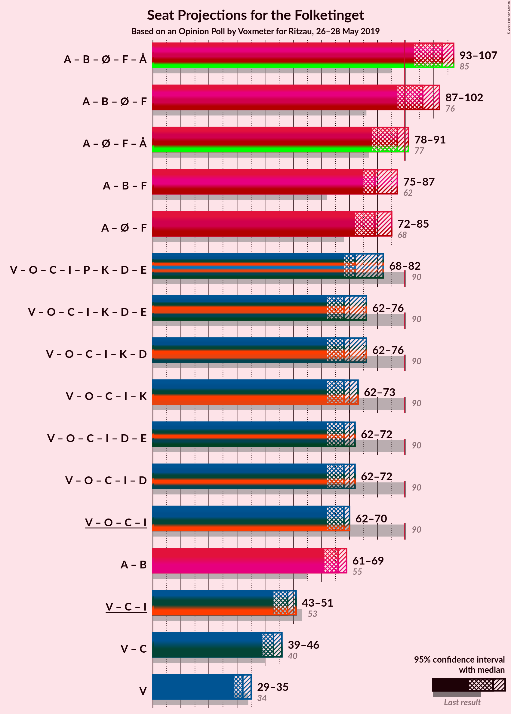

### Confidence Intervals

| Coalition | Last Result | Median | Majority? | 80% Confidence Interval | 90% Confidence Interval | 95% Confidence Interval | 99% Confidence Interval |
|:---------:|:-----------:|:------:|:---------:|:-----------------------:|:-----------------------:|:-----------------------:|:-----------------------:|
| Socialdemokraterne – Radikale Venstre – Enhedslisten–De Rød-Grønne – Socialistisk Folkeparti – Alternativet | 85 | 103 | 100% | 98–105 | 95–107 | 93–107 | 93–110 |
| Socialdemokraterne – Radikale Venstre – Enhedslisten–De Rød-Grønne – Socialistisk Folkeparti | 76 | 96 | 95% | 92–99 | 88–102 | 87–102 | 87–103 |
| Socialdemokraterne – Enhedslisten–De Rød-Grønne – Socialistisk Folkeparti – Alternativet | 77 | 87 | 11% | 84–90 | 78–90 | 78–91 | 78–93 |
| Socialdemokraterne – Radikale Venstre – Socialistisk Folkeparti | 62 | 79 | 0.2% | 77–84 | 75–87 | 75–87 | 75–87 |
| Socialdemokraterne – Enhedslisten–De Rød-Grønne – Socialistisk Folkeparti | 68 | 79 | 0.1% | 78–84 | 72–85 | 72–85 | 72–86 |
| Venstre – Dansk Folkeparti – Det Konservative Folkeparti – Liberal Alliance – Stram Kurs – Kristendemokraterne – Nye Borgerlige – Klaus Riskær Pedersen | 90 | 72 | 0% | 70–77 | 68–80 | 68–82 | 65–82 |
| Venstre – Dansk Folkeparti – Det Konservative Folkeparti – Liberal Alliance – Kristendemokraterne – Nye Borgerlige – Klaus Riskær Pedersen | 90 | 68 | 0% | 65–73 | 63–76 | 62–76 | 61–76 |
| Venstre – Dansk Folkeparti – Det Konservative Folkeparti – Liberal Alliance – Kristendemokraterne – Nye Borgerlige | 90 | 68 | 0% | 65–73 | 63–76 | 62–76 | 61–76 |
| Venstre – Dansk Folkeparti – Det Konservative Folkeparti – Liberal Alliance – Kristendemokraterne | 90 | 68 | 0% | 65–73 | 63–73 | 62–73 | 61–75 |
| Venstre – Dansk Folkeparti – Det Konservative Folkeparti – Liberal Alliance – Nye Borgerlige – Klaus Riskær Pedersen | 90 | 68 | 0% | 64–70 | 63–72 | 62–72 | 60–74 |
| Venstre – Dansk Folkeparti – Det Konservative Folkeparti – Liberal Alliance – Nye Borgerlige | 90 | 68 | 0% | 64–70 | 63–72 | 62–72 | 60–74 |
| Venstre – Dansk Folkeparti – Det Konservative Folkeparti – Liberal Alliance | 90 | 68 | 0% | 63–69 | 63–69 | 62–70 | 60–73 |
| Socialdemokraterne – Radikale Venstre | 55 | 66 | 0% | 61–67 | 61–67 | 61–69 | 59–72 |
| Venstre – Det Konservative Folkeparti – Liberal Alliance | 53 | 48 | 0% | 44–51 | 43–51 | 43–51 | 42–55 |
| Venstre – Det Konservative Folkeparti | 40 | 43 | 0% | 40–45 | 40–46 | 39–46 | 38–50 |
| Venstre | 34 | 32 | 0% | 30–34 | 29–35 | 29–35 | 27–37 |

### Socialdemokraterne – Radikale Venstre – Enhedslisten–De Rød-Grønne – Socialistisk Folkeparti – Alternativet

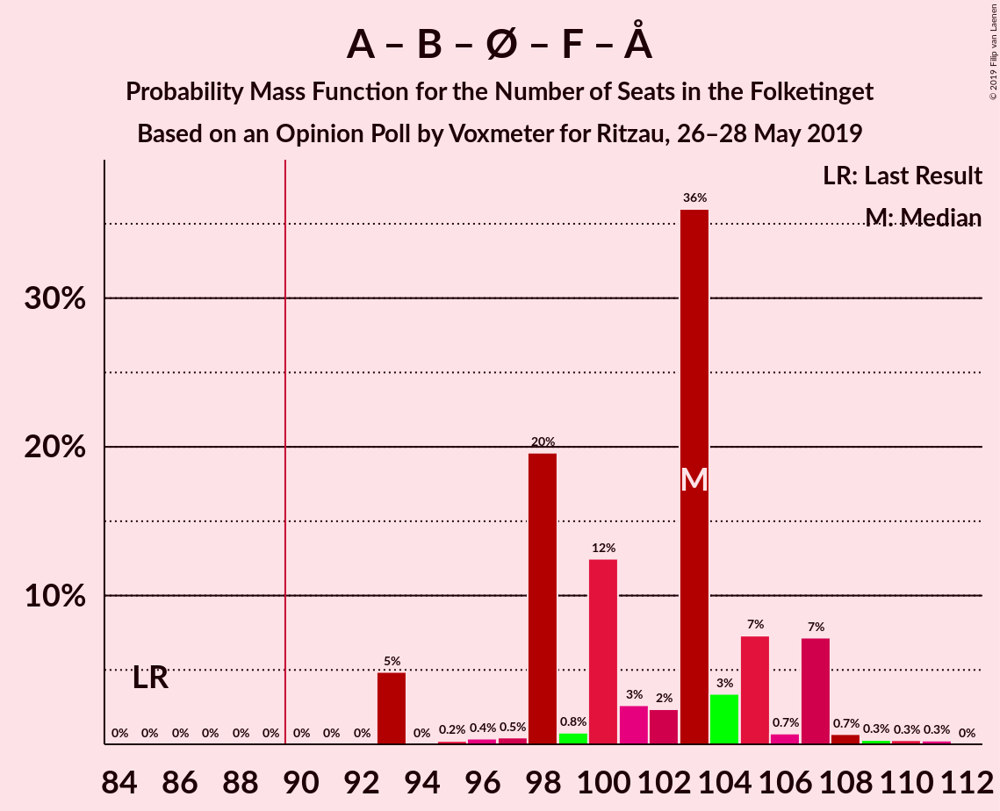

| Number of Seats | Probability | Accumulated | Special Marks |
|:---------------:|:-----------:|:-----------:|:-------------:|
| 85 | 0% | 100% | Last Result |
| 86 | 0% | 100% |  |
| 87 | 0% | 100% |  |
| 88 | 0% | 100% |  |
| 89 | 0% | 100% |  |
| 90 | 0% | 100% | Majority |
| 91 | 0% | 100% |  |
| 92 | 0% | 100% |  |
| 93 | 5% | 100% |  |
| 94 | 0% | 95% |  |
| 95 | 0.2% | 95% |  |
| 96 | 0.4% | 95% |  |
| 97 | 0.5% | 94% |  |
| 98 | 20% | 94% |  |
| 99 | 0.8% | 74% |  |
| 100 | 12% | 74% |  |
| 101 | 3% | 61% | Median |
| 102 | 2% | 59% |  |
| 103 | 36% | 56% |  |
| 104 | 3% | 20% |  |
| 105 | 7% | 17% |  |
| 106 | 0.7% | 9% |  |
| 107 | 7% | 9% |  |
| 108 | 0.7% | 2% |  |
| 109 | 0.3% | 0.9% |  |
| 110 | 0.3% | 0.6% |  |
| 111 | 0.3% | 0.3% |  |
| 112 | 0% | 0% |  |

### Socialdemokraterne – Radikale Venstre – Enhedslisten–De Rød-Grønne – Socialistisk Folkeparti

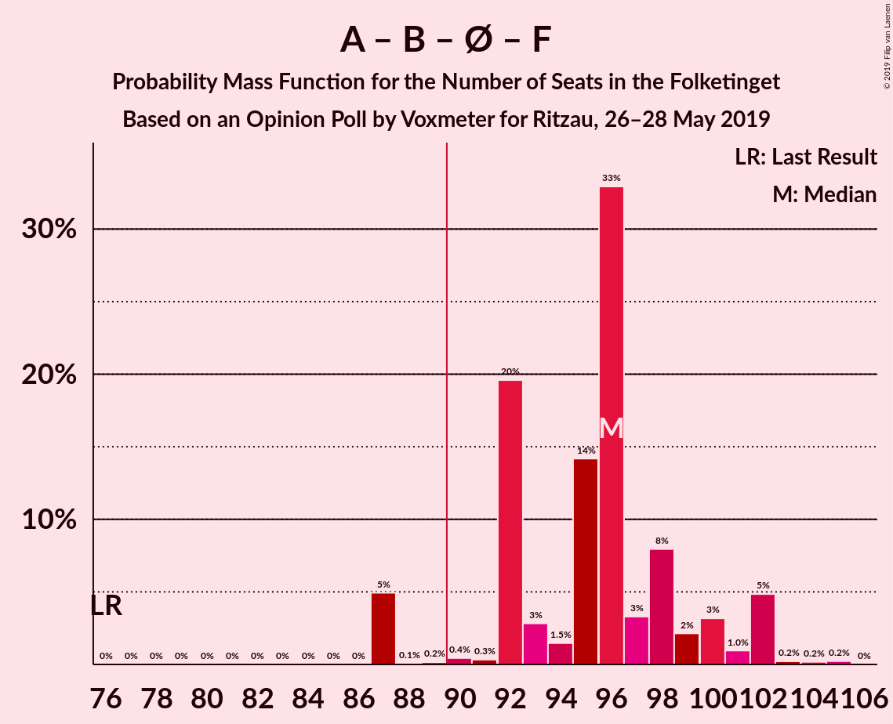

| Number of Seats | Probability | Accumulated | Special Marks |
|:---------------:|:-----------:|:-----------:|:-------------:|
| 76 | 0% | 100% | Last Result |
| 77 | 0% | 100% |  |
| 78 | 0% | 100% |  |
| 79 | 0% | 100% |  |
| 80 | 0% | 100% |  |
| 81 | 0% | 100% |  |
| 82 | 0% | 100% |  |
| 83 | 0% | 100% |  |
| 84 | 0% | 100% |  |
| 85 | 0% | 100% |  |
| 86 | 0% | 100% |  |
| 87 | 5% | 100% |  |
| 88 | 0.1% | 95% |  |
| 89 | 0.2% | 95% |  |
| 90 | 0.4% | 95% | Majority |
| 91 | 0.3% | 94% |  |
| 92 | 20% | 94% |  |
| 93 | 3% | 74% |  |
| 94 | 1.5% | 72% |  |
| 95 | 14% | 70% | Median |
| 96 | 33% | 56% |  |
| 97 | 3% | 23% |  |
| 98 | 8% | 20% |  |
| 99 | 2% | 12% |  |
| 100 | 3% | 10% |  |
| 101 | 1.0% | 6% |  |
| 102 | 5% | 6% |  |
| 103 | 0.2% | 0.7% |  |
| 104 | 0.2% | 0.4% |  |
| 105 | 0.2% | 0.3% |  |
| 106 | 0% | 0% |  |

### Socialdemokraterne – Enhedslisten–De Rød-Grønne – Socialistisk Folkeparti – Alternativet

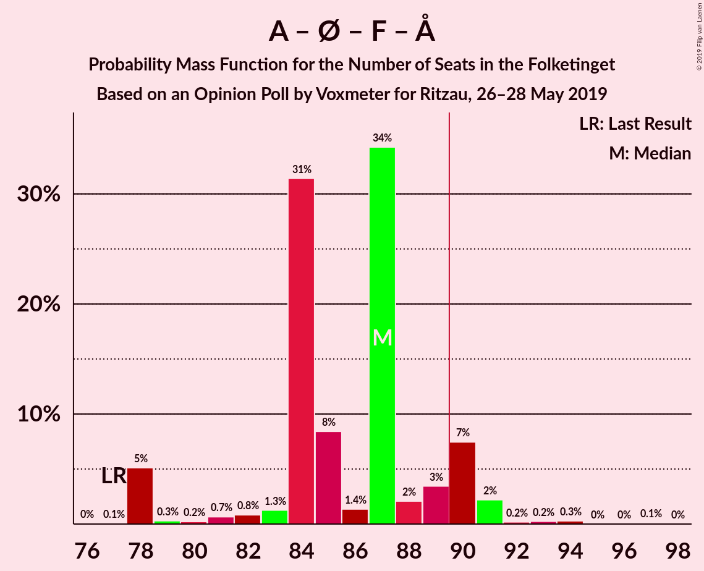

| Number of Seats | Probability | Accumulated | Special Marks |
|:---------------:|:-----------:|:-----------:|:-------------:|
| 77 | 0.1% | 100% | Last Result |
| 78 | 5% | 99.9% |  |
| 79 | 0.3% | 95% |  |
| 80 | 0.2% | 94% |  |
| 81 | 0.7% | 94% |  |
| 82 | 0.8% | 94% |  |
| 83 | 1.3% | 93% |  |
| 84 | 31% | 92% |  |
| 85 | 8% | 60% | Median |
| 86 | 1.4% | 52% |  |
| 87 | 34% | 50% |  |
| 88 | 2% | 16% |  |
| 89 | 3% | 14% |  |
| 90 | 7% | 11% | Majority |
| 91 | 2% | 3% |  |
| 92 | 0.2% | 0.9% |  |
| 93 | 0.2% | 0.7% |  |
| 94 | 0.3% | 0.4% |  |
| 95 | 0% | 0.1% |  |
| 96 | 0% | 0.1% |  |
| 97 | 0.1% | 0.1% |  |
| 98 | 0% | 0% |  |

### Socialdemokraterne – Radikale Venstre – Socialistisk Folkeparti

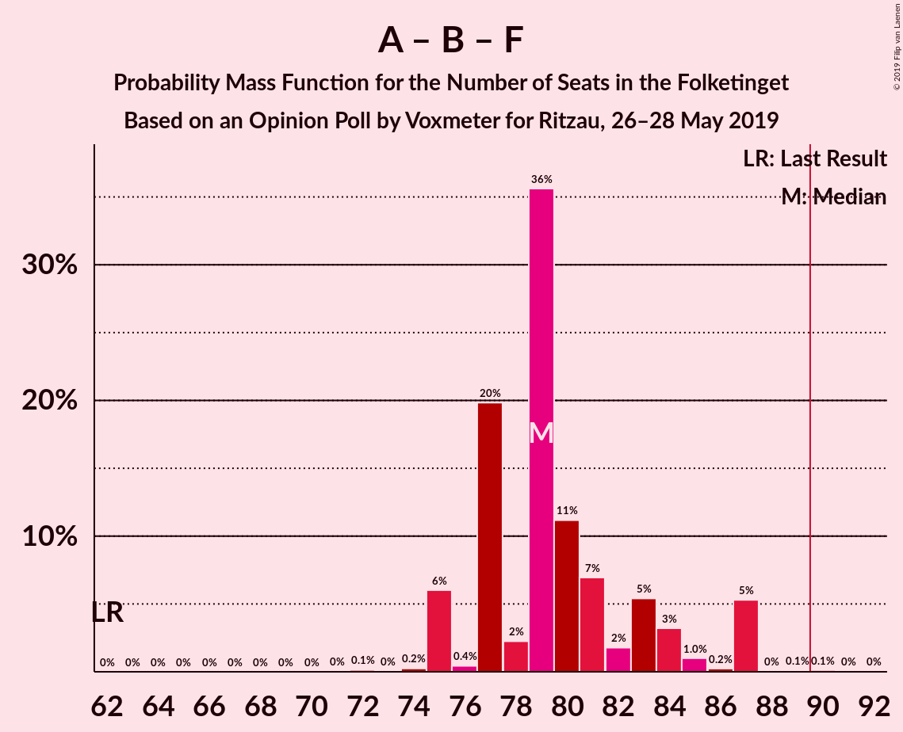

| Number of Seats | Probability | Accumulated | Special Marks |
|:---------------:|:-----------:|:-----------:|:-------------:|
| 62 | 0% | 100% | Last Result |
| 63 | 0% | 100% |  |
| 64 | 0% | 100% |  |
| 65 | 0% | 100% |  |
| 66 | 0% | 100% |  |
| 67 | 0% | 100% |  |
| 68 | 0% | 100% |  |
| 69 | 0% | 100% |  |
| 70 | 0% | 100% |  |
| 71 | 0% | 100% |  |
| 72 | 0.1% | 100% |  |
| 73 | 0% | 99.8% |  |
| 74 | 0.2% | 99.8% |  |
| 75 | 6% | 99.6% |  |
| 76 | 0.4% | 94% |  |
| 77 | 20% | 93% |  |
| 78 | 2% | 73% |  |
| 79 | 36% | 71% | Median |
| 80 | 11% | 35% |  |
| 81 | 7% | 24% |  |
| 82 | 2% | 17% |  |
| 83 | 5% | 15% |  |
| 84 | 3% | 10% |  |
| 85 | 1.0% | 7% |  |
| 86 | 0.2% | 6% |  |
| 87 | 5% | 6% |  |
| 88 | 0% | 0.3% |  |
| 89 | 0.1% | 0.3% |  |
| 90 | 0.1% | 0.2% | Majority |
| 91 | 0% | 0% |  |

### Socialdemokraterne – Enhedslisten–De Rød-Grønne – Socialistisk Folkeparti

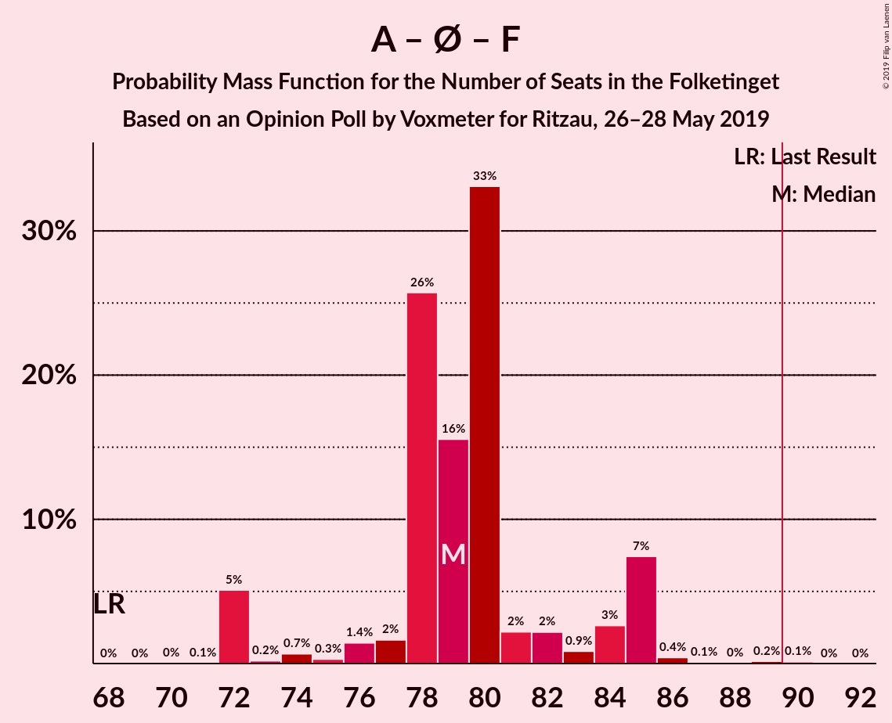

| Number of Seats | Probability | Accumulated | Special Marks |
|:---------------:|:-----------:|:-----------:|:-------------:|
| 68 | 0% | 100% | Last Result |
| 69 | 0% | 100% |  |
| 70 | 0% | 100% |  |
| 71 | 0.1% | 100% |  |
| 72 | 5% | 99.9% |  |
| 73 | 0.2% | 95% |  |
| 74 | 0.7% | 95% |  |
| 75 | 0.3% | 94% |  |
| 76 | 1.4% | 94% |  |
| 77 | 2% | 92% |  |
| 78 | 26% | 91% |  |
| 79 | 16% | 65% | Median |
| 80 | 33% | 49% |  |
| 81 | 2% | 16% |  |
| 82 | 2% | 14% |  |
| 83 | 0.9% | 12% |  |
| 84 | 3% | 11% |  |
| 85 | 7% | 8% |  |
| 86 | 0.4% | 0.9% |  |
| 87 | 0.1% | 0.4% |  |
| 88 | 0% | 0.3% |  |
| 89 | 0.2% | 0.3% |  |
| 90 | 0.1% | 0.1% | Majority |
| 91 | 0% | 0% |  |

### Venstre – Dansk Folkeparti – Det Konservative Folkeparti – Liberal Alliance – Stram Kurs – Kristendemokraterne – Nye Borgerlige – Klaus Riskær Pedersen

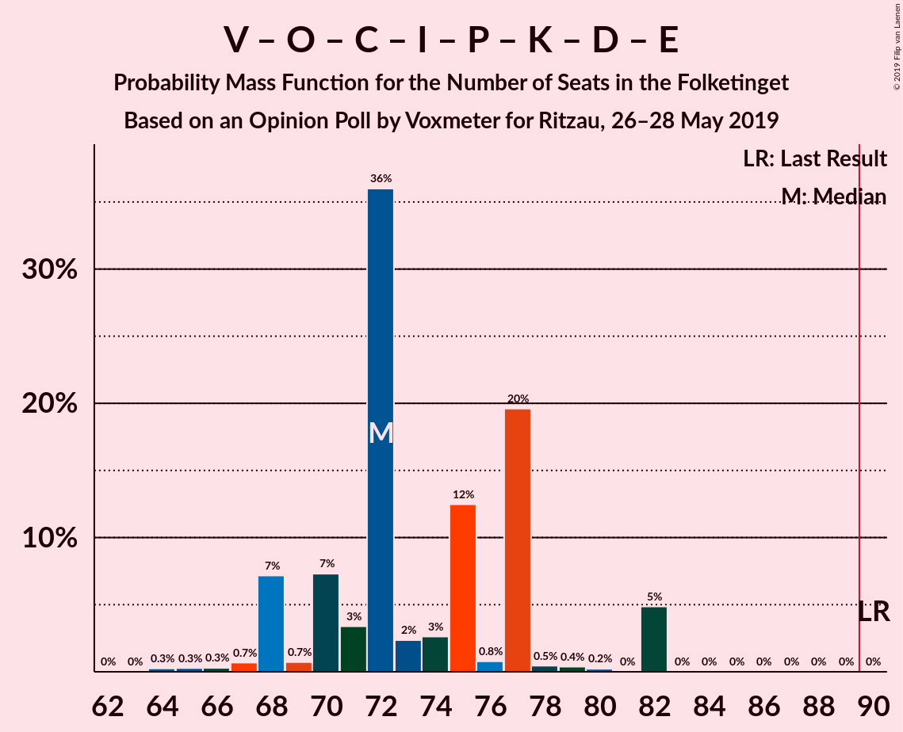

| Number of Seats | Probability | Accumulated | Special Marks |
|:---------------:|:-----------:|:-----------:|:-------------:|
| 64 | 0.3% | 100% |  |
| 65 | 0.3% | 99.7% |  |
| 66 | 0.3% | 99.4% |  |
| 67 | 0.7% | 99.1% |  |
| 68 | 7% | 98% |  |
| 69 | 0.7% | 91% |  |
| 70 | 7% | 91% |  |
| 71 | 3% | 83% |  |
| 72 | 36% | 80% | Median |
| 73 | 2% | 44% |  |
| 74 | 3% | 41% |  |
| 75 | 12% | 39% |  |
| 76 | 0.8% | 26% |  |
| 77 | 20% | 26% |  |
| 78 | 0.5% | 6% |  |
| 79 | 0.4% | 6% |  |
| 80 | 0.2% | 5% |  |
| 81 | 0% | 5% |  |
| 82 | 5% | 5% |  |
| 83 | 0% | 0% |  |
| 84 | 0% | 0% |  |
| 85 | 0% | 0% |  |
| 86 | 0% | 0% |  |
| 87 | 0% | 0% |  |
| 88 | 0% | 0% |  |
| 89 | 0% | 0% |  |
| 90 | 0% | 0% | Last Result, Majority |

### Venstre – Dansk Folkeparti – Det Konservative Folkeparti – Liberal Alliance – Kristendemokraterne – Nye Borgerlige – Klaus Riskær Pedersen

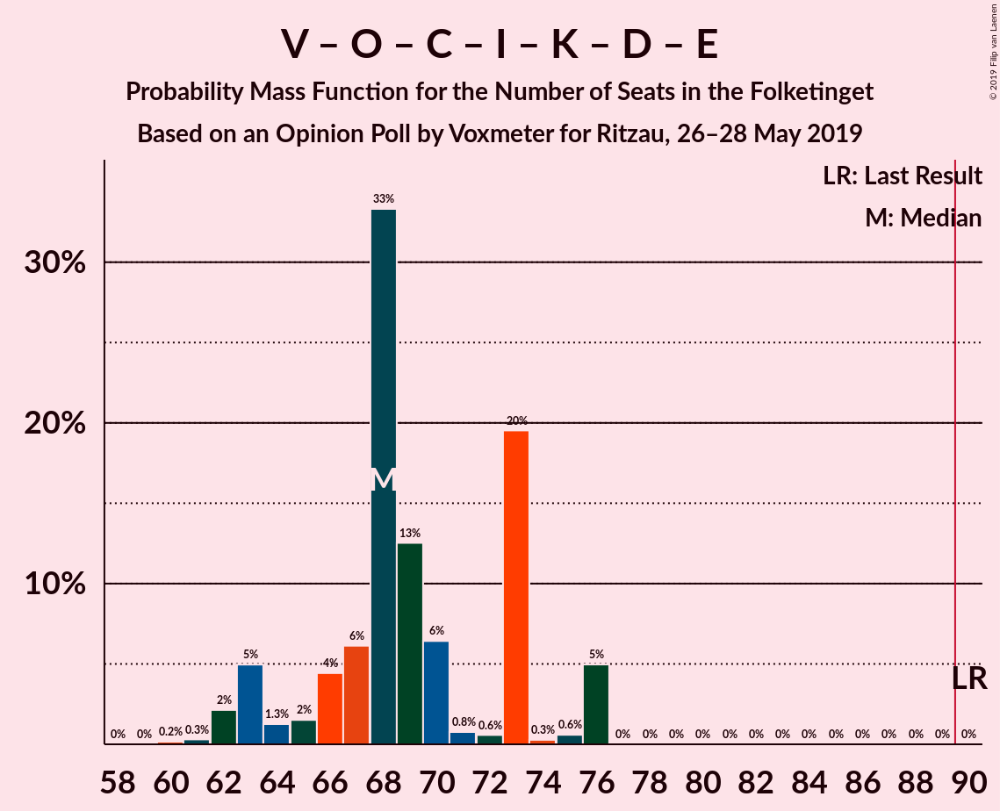

| Number of Seats | Probability | Accumulated | Special Marks |
|:---------------:|:-----------:|:-----------:|:-------------:|
| 60 | 0.2% | 100% |  |
| 61 | 0.3% | 99.8% |  |
| 62 | 2% | 99.5% |  |
| 63 | 5% | 97% |  |
| 64 | 1.3% | 92% |  |
| 65 | 2% | 91% |  |
| 66 | 4% | 90% |  |
| 67 | 6% | 85% |  |
| 68 | 33% | 79% | Median |
| 69 | 13% | 46% |  |
| 70 | 6% | 33% |  |
| 71 | 0.8% | 27% |  |
| 72 | 0.6% | 26% |  |
| 73 | 20% | 25% |  |
| 74 | 0.3% | 6% |  |
| 75 | 0.6% | 6% |  |
| 76 | 5% | 5% |  |
| 77 | 0% | 0.1% |  |
| 78 | 0% | 0% |  |
| 79 | 0% | 0% |  |
| 80 | 0% | 0% |  |
| 81 | 0% | 0% |  |
| 82 | 0% | 0% |  |
| 83 | 0% | 0% |  |
| 84 | 0% | 0% |  |
| 85 | 0% | 0% |  |
| 86 | 0% | 0% |  |
| 87 | 0% | 0% |  |
| 88 | 0% | 0% |  |
| 89 | 0% | 0% |  |
| 90 | 0% | 0% | Last Result, Majority |

### Venstre – Dansk Folkeparti – Det Konservative Folkeparti – Liberal Alliance – Kristendemokraterne – Nye Borgerlige

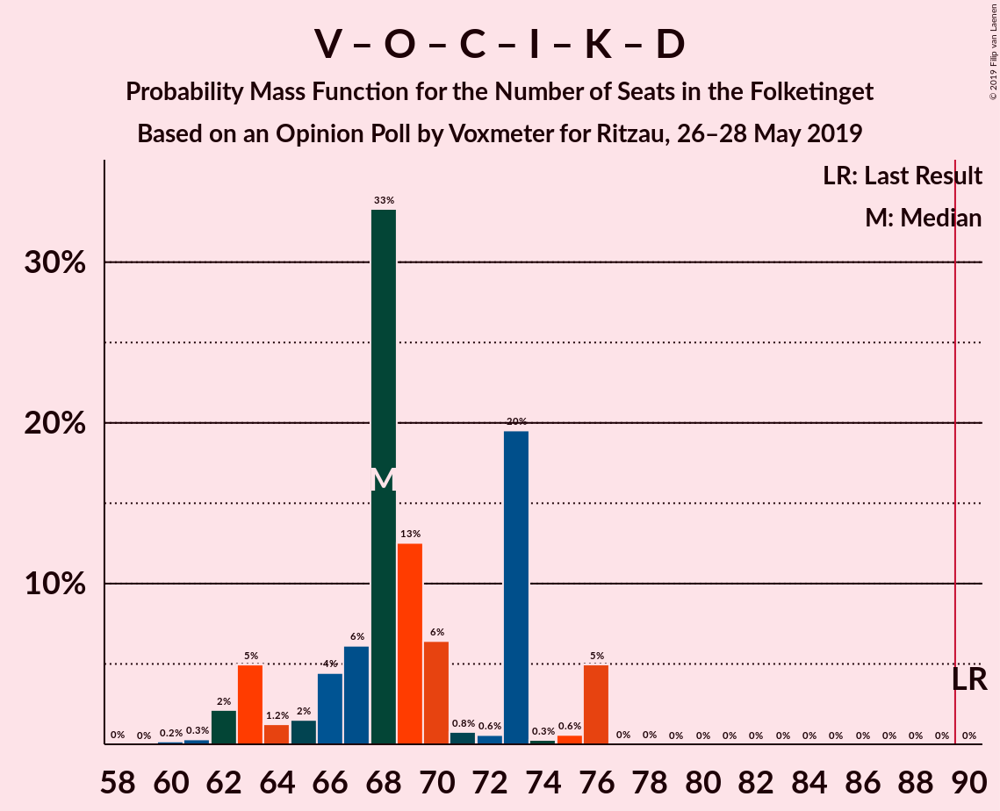

| Number of Seats | Probability | Accumulated | Special Marks |
|:---------------:|:-----------:|:-----------:|:-------------:|
| 60 | 0.2% | 100% |  |
| 61 | 0.3% | 99.8% |  |
| 62 | 2% | 99.5% |  |
| 63 | 5% | 97% |  |
| 64 | 1.2% | 92% |  |
| 65 | 2% | 91% |  |
| 66 | 4% | 90% |  |
| 67 | 6% | 85% |  |
| 68 | 33% | 79% | Median |
| 69 | 13% | 46% |  |
| 70 | 6% | 33% |  |
| 71 | 0.8% | 27% |  |
| 72 | 0.6% | 26% |  |
| 73 | 20% | 25% |  |
| 74 | 0.3% | 6% |  |
| 75 | 0.6% | 6% |  |
| 76 | 5% | 5% |  |
| 77 | 0% | 0.1% |  |
| 78 | 0% | 0% |  |
| 79 | 0% | 0% |  |
| 80 | 0% | 0% |  |
| 81 | 0% | 0% |  |
| 82 | 0% | 0% |  |
| 83 | 0% | 0% |  |
| 84 | 0% | 0% |  |
| 85 | 0% | 0% |  |
| 86 | 0% | 0% |  |
| 87 | 0% | 0% |  |
| 88 | 0% | 0% |  |
| 89 | 0% | 0% |  |
| 90 | 0% | 0% | Last Result, Majority |

### Venstre – Dansk Folkeparti – Det Konservative Folkeparti – Liberal Alliance – Kristendemokraterne

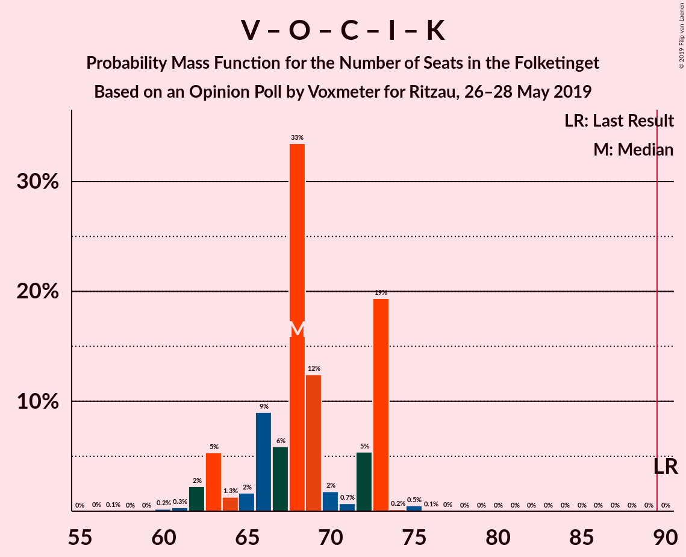

| Number of Seats | Probability | Accumulated | Special Marks |
|:---------------:|:-----------:|:-----------:|:-------------:|
| 57 | 0.1% | 100% |  |
| 58 | 0% | 99.9% |  |
| 59 | 0% | 99.9% |  |
| 60 | 0.2% | 99.9% |  |
| 61 | 0.3% | 99.7% |  |
| 62 | 2% | 99.4% |  |
| 63 | 5% | 97% |  |
| 64 | 1.3% | 92% |  |
| 65 | 2% | 90% |  |
| 66 | 9% | 89% |  |
| 67 | 6% | 80% |  |
| 68 | 33% | 74% | Median |
| 69 | 12% | 40% |  |
| 70 | 2% | 28% |  |
| 71 | 0.7% | 26% |  |
| 72 | 5% | 26% |  |
| 73 | 19% | 20% |  |
| 74 | 0.2% | 0.8% |  |
| 75 | 0.5% | 0.6% |  |
| 76 | 0.1% | 0.1% |  |
| 77 | 0% | 0% |  |
| 78 | 0% | 0% |  |
| 79 | 0% | 0% |  |
| 80 | 0% | 0% |  |
| 81 | 0% | 0% |  |
| 82 | 0% | 0% |  |
| 83 | 0% | 0% |  |
| 84 | 0% | 0% |  |
| 85 | 0% | 0% |  |
| 86 | 0% | 0% |  |
| 87 | 0% | 0% |  |
| 88 | 0% | 0% |  |
| 89 | 0% | 0% |  |
| 90 | 0% | 0% | Last Result, Majority |

### Venstre – Dansk Folkeparti – Det Konservative Folkeparti – Liberal Alliance – Nye Borgerlige – Klaus Riskær Pedersen

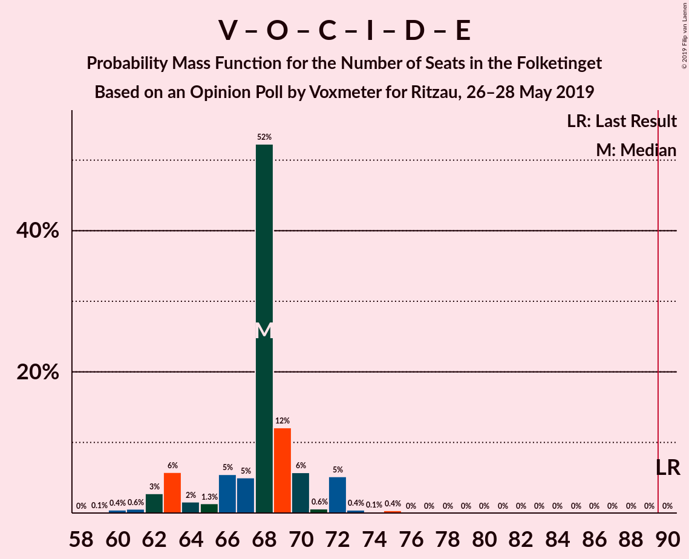

| Number of Seats | Probability | Accumulated | Special Marks |
|:---------------:|:-----------:|:-----------:|:-------------:|
| 59 | 0.1% | 100% |  |
| 60 | 0.4% | 99.8% |  |
| 61 | 0.6% | 99.4% |  |
| 62 | 3% | 98.8% |  |
| 63 | 6% | 96% |  |
| 64 | 2% | 90% |  |
| 65 | 1.3% | 89% |  |
| 66 | 5% | 87% |  |
| 67 | 5% | 82% |  |
| 68 | 52% | 77% | Median |
| 69 | 12% | 25% |  |
| 70 | 6% | 13% |  |
| 71 | 0.6% | 7% |  |
| 72 | 5% | 6% |  |
| 73 | 0.4% | 1.0% |  |
| 74 | 0.1% | 0.6% |  |
| 75 | 0.4% | 0.4% |  |
| 76 | 0% | 0.1% |  |
| 77 | 0% | 0% |  |
| 78 | 0% | 0% |  |
| 79 | 0% | 0% |  |
| 80 | 0% | 0% |  |
| 81 | 0% | 0% |  |
| 82 | 0% | 0% |  |
| 83 | 0% | 0% |  |
| 84 | 0% | 0% |  |
| 85 | 0% | 0% |  |
| 86 | 0% | 0% |  |
| 87 | 0% | 0% |  |
| 88 | 0% | 0% |  |
| 89 | 0% | 0% |  |
| 90 | 0% | 0% | Last Result, Majority |

### Venstre – Dansk Folkeparti – Det Konservative Folkeparti – Liberal Alliance – Nye Borgerlige

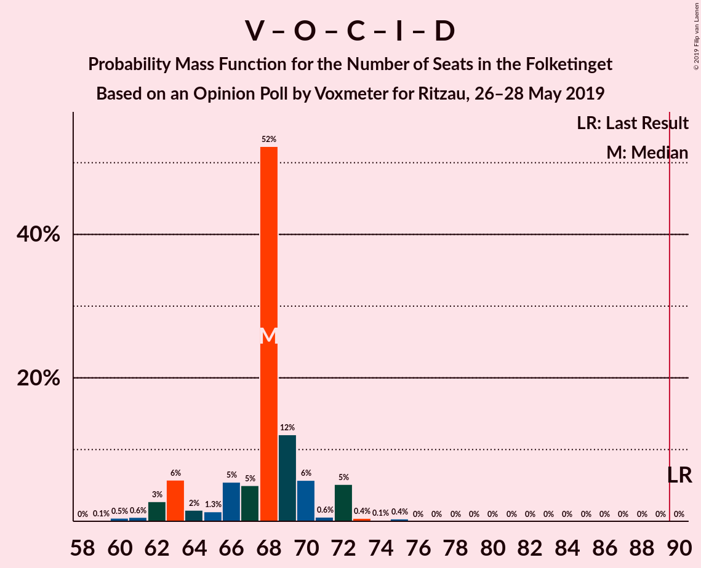

| Number of Seats | Probability | Accumulated | Special Marks |
|:---------------:|:-----------:|:-----------:|:-------------:|
| 59 | 0.1% | 100% |  |
| 60 | 0.5% | 99.8% |  |
| 61 | 0.6% | 99.4% |  |
| 62 | 3% | 98.8% |  |
| 63 | 6% | 96% |  |
| 64 | 2% | 90% |  |
| 65 | 1.3% | 89% |  |
| 66 | 5% | 87% |  |
| 67 | 5% | 82% |  |
| 68 | 52% | 77% | Median |
| 69 | 12% | 25% |  |
| 70 | 6% | 12% |  |
| 71 | 0.6% | 7% |  |
| 72 | 5% | 6% |  |
| 73 | 0.4% | 1.0% |  |
| 74 | 0.1% | 0.6% |  |
| 75 | 0.4% | 0.4% |  |
| 76 | 0% | 0.1% |  |
| 77 | 0% | 0% |  |
| 78 | 0% | 0% |  |
| 79 | 0% | 0% |  |
| 80 | 0% | 0% |  |
| 81 | 0% | 0% |  |
| 82 | 0% | 0% |  |
| 83 | 0% | 0% |  |
| 84 | 0% | 0% |  |
| 85 | 0% | 0% |  |
| 86 | 0% | 0% |  |
| 87 | 0% | 0% |  |
| 88 | 0% | 0% |  |
| 89 | 0% | 0% |  |
| 90 | 0% | 0% | Last Result, Majority |

### Venstre – Dansk Folkeparti – Det Konservative Folkeparti – Liberal Alliance

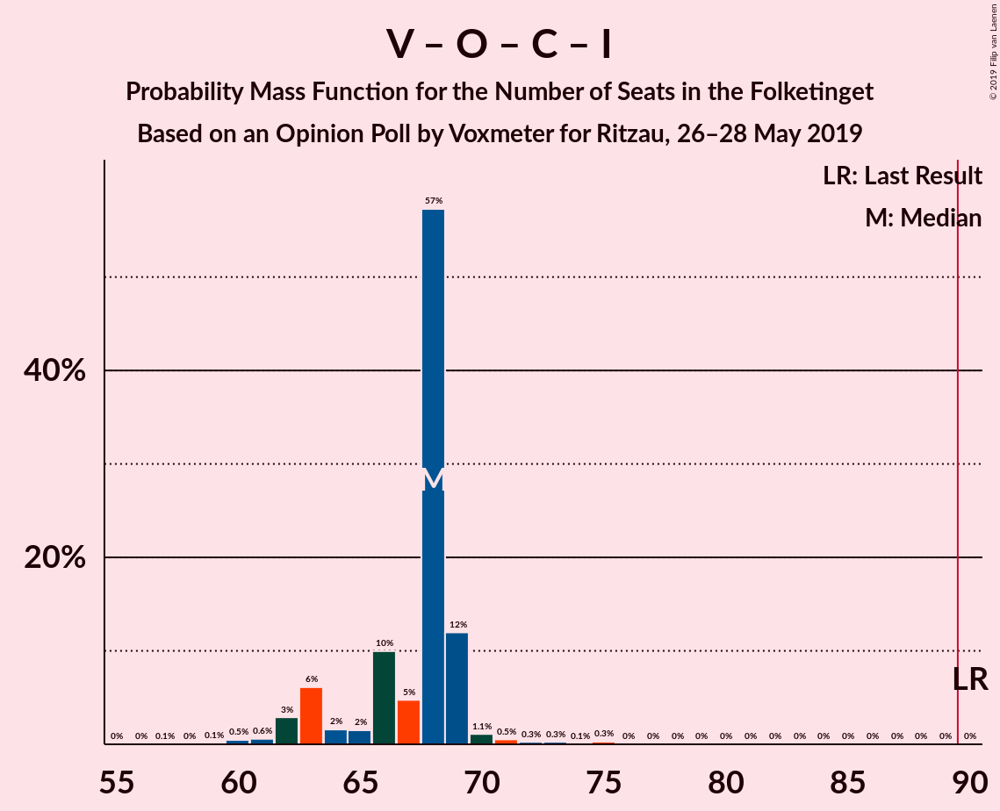

| Number of Seats | Probability | Accumulated | Special Marks |
|:---------------:|:-----------:|:-----------:|:-------------:|
| 57 | 0.1% | 100% |  |
| 58 | 0% | 99.9% |  |
| 59 | 0.1% | 99.9% |  |
| 60 | 0.5% | 99.7% |  |
| 61 | 0.6% | 99.2% |  |
| 62 | 3% | 98.6% |  |
| 63 | 6% | 96% |  |
| 64 | 2% | 90% |  |
| 65 | 2% | 88% |  |
| 66 | 10% | 87% |  |
| 67 | 5% | 77% |  |
| 68 | 57% | 72% | Median |
| 69 | 12% | 15% |  |
| 70 | 1.1% | 3% |  |
| 71 | 0.5% | 1.4% |  |
| 72 | 0.3% | 0.9% |  |
| 73 | 0.3% | 0.6% |  |
| 74 | 0.1% | 0.4% |  |
| 75 | 0.3% | 0.3% |  |
| 76 | 0% | 0% |  |
| 77 | 0% | 0% |  |
| 78 | 0% | 0% |  |
| 79 | 0% | 0% |  |
| 80 | 0% | 0% |  |
| 81 | 0% | 0% |  |
| 82 | 0% | 0% |  |
| 83 | 0% | 0% |  |
| 84 | 0% | 0% |  |
| 85 | 0% | 0% |  |
| 86 | 0% | 0% |  |
| 87 | 0% | 0% |  |
| 88 | 0% | 0% |  |
| 89 | 0% | 0% |  |
| 90 | 0% | 0% | Last Result, Majority |

### Socialdemokraterne – Radikale Venstre

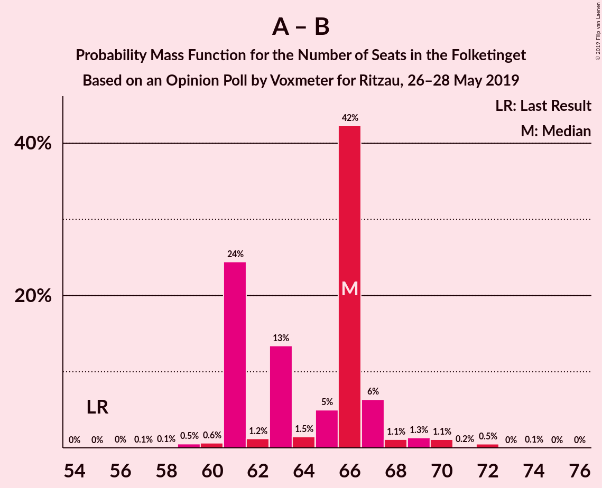

| Number of Seats | Probability | Accumulated | Special Marks |
|:---------------:|:-----------:|:-----------:|:-------------:|
| 55 | 0% | 100% | Last Result |
| 56 | 0% | 100% |  |
| 57 | 0.1% | 100% |  |
| 58 | 0.1% | 99.9% |  |
| 59 | 0.5% | 99.7% |  |
| 60 | 0.6% | 99.2% |  |
| 61 | 24% | 98.5% |  |
| 62 | 1.2% | 74% |  |
| 63 | 13% | 73% |  |
| 64 | 1.5% | 59% | Median |
| 65 | 5% | 58% |  |
| 66 | 42% | 53% |  |
| 67 | 6% | 11% |  |
| 68 | 1.1% | 4% |  |
| 69 | 1.3% | 3% |  |
| 70 | 1.1% | 2% |  |
| 71 | 0.2% | 0.8% |  |
| 72 | 0.5% | 0.7% |  |
| 73 | 0% | 0.1% |  |
| 74 | 0.1% | 0.1% |  |
| 75 | 0% | 0.1% |  |
| 76 | 0% | 0% |  |

### Venstre – Det Konservative Folkeparti – Liberal Alliance

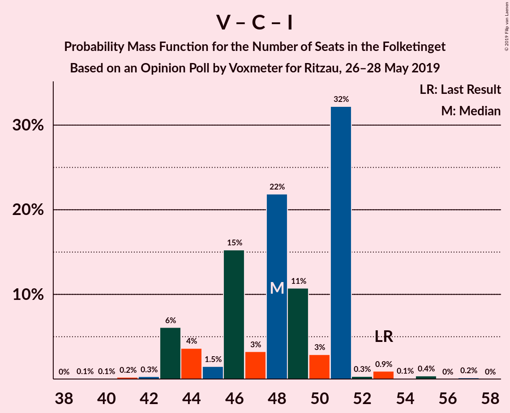

| Number of Seats | Probability | Accumulated | Special Marks |
|:---------------:|:-----------:|:-----------:|:-------------:|
| 39 | 0.1% | 100% |  |
| 40 | 0.1% | 99.9% |  |
| 41 | 0.2% | 99.8% |  |
| 42 | 0.3% | 99.6% |  |
| 43 | 6% | 99.3% |  |
| 44 | 4% | 93% |  |
| 45 | 1.5% | 90% |  |
| 46 | 15% | 88% |  |
| 47 | 3% | 73% |  |
| 48 | 22% | 70% |  |
| 49 | 11% | 48% | Median |
| 50 | 3% | 37% |  |
| 51 | 32% | 34% |  |
| 52 | 0.3% | 2% |  |
| 53 | 0.9% | 2% | Last Result |
| 54 | 0.1% | 0.6% |  |
| 55 | 0.4% | 0.5% |  |
| 56 | 0% | 0.2% |  |
| 57 | 0.2% | 0.2% |  |
| 58 | 0% | 0% |  |

### Venstre – Det Konservative Folkeparti

| Number of Seats | Probability | Accumulated | Special Marks |
|:---------------:|:-----------:|:-----------:|:-------------:|
| 35 | 0.1% | 100% |  |
| 36 | 0.1% | 99.9% |  |
| 37 | 0.3% | 99.8% |  |
| 38 | 1.2% | 99.5% |  |
| 39 | 3% | 98% |  |
| 40 | 13% | 95% | Last Result |
| 41 | 7% | 82% |  |
| 42 | 2% | 75% |  |
| 43 | 32% | 73% | Median |
| 44 | 3% | 41% |  |
| 45 | 32% | 38% |  |
| 46 | 3% | 5% |  |
| 47 | 0.3% | 2% |  |
| 48 | 1.0% | 2% |  |
| 49 | 0% | 0.6% |  |
| 50 | 0.4% | 0.5% |  |
| 51 | 0.2% | 0.2% |  |
| 52 | 0% | 0% |  |

### Venstre

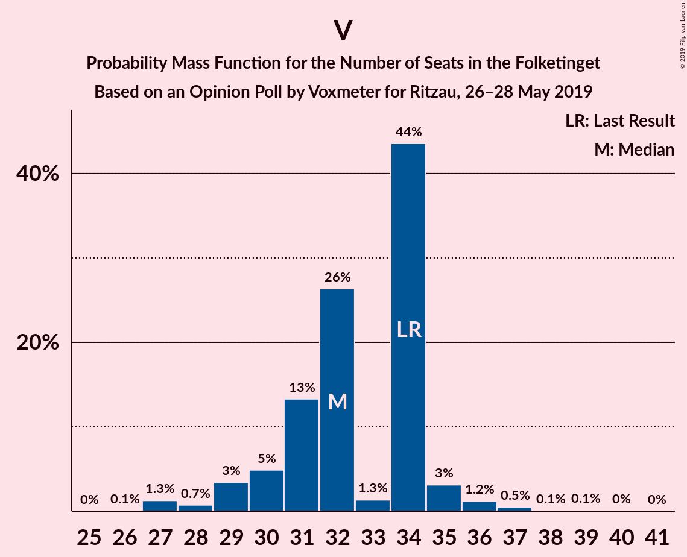

| Number of Seats | Probability | Accumulated | Special Marks |
|:---------------:|:-----------:|:-----------:|:-------------:|
| 26 | 0.1% | 100% |  |
| 27 | 1.3% | 99.9% |  |
| 28 | 0.7% | 98.6% |  |
| 29 | 3% | 98% |  |
| 30 | 5% | 94% |  |
| 31 | 13% | 90% |  |
| 32 | 26% | 76% | Median |
| 33 | 1.3% | 50% |  |
| 34 | 44% | 49% | Last Result |
| 35 | 3% | 5% |  |
| 36 | 1.2% | 2% |  |
| 37 | 0.5% | 0.7% |  |
| 38 | 0.1% | 0.2% |  |
| 39 | 0.1% | 0.2% |  |
| 40 | 0% | 0.1% |  |
| 41 | 0% | 0% |  |

## Technical Information

### Opinion Poll

+ **Polling firm:** Voxmeter
+ **Commissioner(s):** Ritzau
+ **Fieldwork period:** 26–28 May 2019

### Calculations

+ **Sample size:** 1011
+ **Simulations done:** 1,048,576
+ **Error estimate:** 1.78%

