# Opinion Poll by YouGov, 24–28 May 2019

<a href="#voting-intentions">Voting Intentions</a> | <a href="#seats">Seats</a> | <a href="#coalitions">Coalitions</a> | <a href="#technical-information">Technical Information</a>

## Voting Intentions

### Confidence Intervals

| Party | Last Result | Poll Result | 80% Confidence Interval | 90% Confidence Interval | 95% Confidence Interval | 99% Confidence Interval |
|:-----:|:-----------:|:-----------:|:-----------------------:|:-----------------------:|:-----------------------:|:-----------------------:|
| Socialdemokraterne | 26.3% | 26.3% | 24.5–28.2% |24.0–28.7% |23.6–29.1% |22.8–30.0% |
| Venstre | 19.5% | 16.2% | 14.7–17.8% |14.3–18.2% |14.0–18.6% |13.3–19.4% |
| Dansk Folkeparti | 21.1% | 12.5% | 11.2–13.9% |10.9–14.3% |10.5–14.7% |10.0–15.4% |
| Socialistisk Folkeparti | 4.2% | 9.1% | 8.0–10.4% |7.7–10.8% |7.5–11.1% |7.0–11.7% |
| Enhedslisten–De Rød-Grønne | 7.8% | 8.8% | 7.7–10.1% |7.4–10.4% |7.2–10.7% |6.7–11.4% |
| Radikale Venstre | 4.6% | 6.9% | 5.9–8.0% |5.7–8.3% |5.4–8.6% |5.0–9.2% |
| Det Konservative Folkeparti | 3.4% | 6.2% | 5.3–7.3% |5.1–7.7% |4.9–7.9% |4.5–8.5% |
| Nye Borgerlige | 0.0% | 3.9% | 3.2–4.8% |3.0–5.1% |2.8–5.3% |2.5–5.8% |
| Alternativet | 4.8% | 3.5% | 2.8–4.4% |2.7–4.6% |2.5–4.8% |2.2–5.3% |
| Liberal Alliance | 7.5% | 2.7% | 2.1–3.4% |2.0–3.7% |1.8–3.9% |1.6–4.3% |
| Stram Kurs | 0.0% | 2.6% | 2.0–3.3% |1.9–3.6% |1.7–3.7% |1.5–4.2% |
| Kristendemokraterne | 0.8% | 0.9% | 0.6–1.4% |0.5–1.6% |0.5–1.8% |0.4–2.0% |
| Klaus Riskær Pedersen | 0.0% | 0.4% | 0.2–0.8% |0.2–0.9% |0.2–1.1% |0.1–1.3% |

*Note:* The poll result column reflects the actual value used in the calculations. Published results may vary slightly, and in addition be rounded to fewer digits.

## Seats

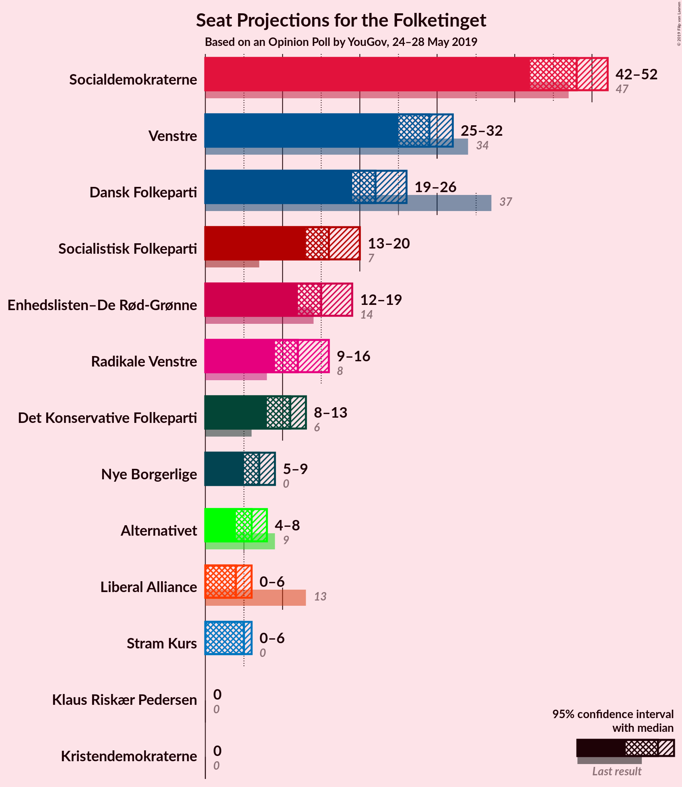

### Confidence Intervals

| Party | Last Result | Median | 80% Confidence Interval | 90% Confidence Interval | 95% Confidence Interval | 99% Confidence Interval |
|:-----:|:-----------:|:------:|:-----------------------:|:-----------------------:|:-----------------------:|:-----------------------:|
| <a href="#socialdemokraterne">Socialdemokraterne</a> | 47 | 48 | 45–50 |43–50 |42–52 |40–53 |
| <a href="#venstre">Venstre</a> | 34 | 29 | 26–32 |25–32 |25–32 |24–34 |
| <a href="#dansk-folkeparti">Dansk Folkeparti</a> | 37 | 22 | 19–24 |19–25 |19–26 |17–27 |
| <a href="#socialistisk-folkeparti">Socialistisk Folkeparti</a> | 7 | 16 | 14–20 |14–20 |13–20 |13–20 |
| <a href="#enhedslisten–de-rød-grønne">Enhedslisten–De Rød-Grønne</a> | 14 | 15 | 13–18 |12–18 |12–19 |12–22 |
| <a href="#radikale-venstre">Radikale Venstre</a> | 8 | 12 | 10–16 |10–16 |9–16 |9–16 |
| <a href="#det-konservative-folkeparti">Det Konservative Folkeparti</a> | 6 | 11 | 9–13 |8–13 |8–13 |8–15 |
| <a href="#nye-borgerlige">Nye Borgerlige</a> | 0 | 7 | 6–8 |6–9 |5–9 |5–10 |
| <a href="#alternativet">Alternativet</a> | 9 | 6 | 4–7 |4–8 |4–8 |4–9 |
| <a href="#liberal-alliance">Liberal Alliance</a> | 13 | 4 | 0–6 |0–6 |0–6 |0–8 |
| <a href="#stram-kurs">Stram Kurs</a> | 0 | 5 | 4–6 |4–6 |0–6 |0–7 |
| <a href="#kristendemokraterne">Kristendemokraterne</a> | 0 | 0 | 0 |0 |0 |0–4 |
| <a href="#klaus-riskær-pedersen">Klaus Riskær Pedersen</a> | 0 | 0 | 0 |0 |0 |0 |

### Socialdemokraterne

*For a full overview of the results for this party, see the [Socialdemokraterne](party-socialdemokraterne.html) page.*

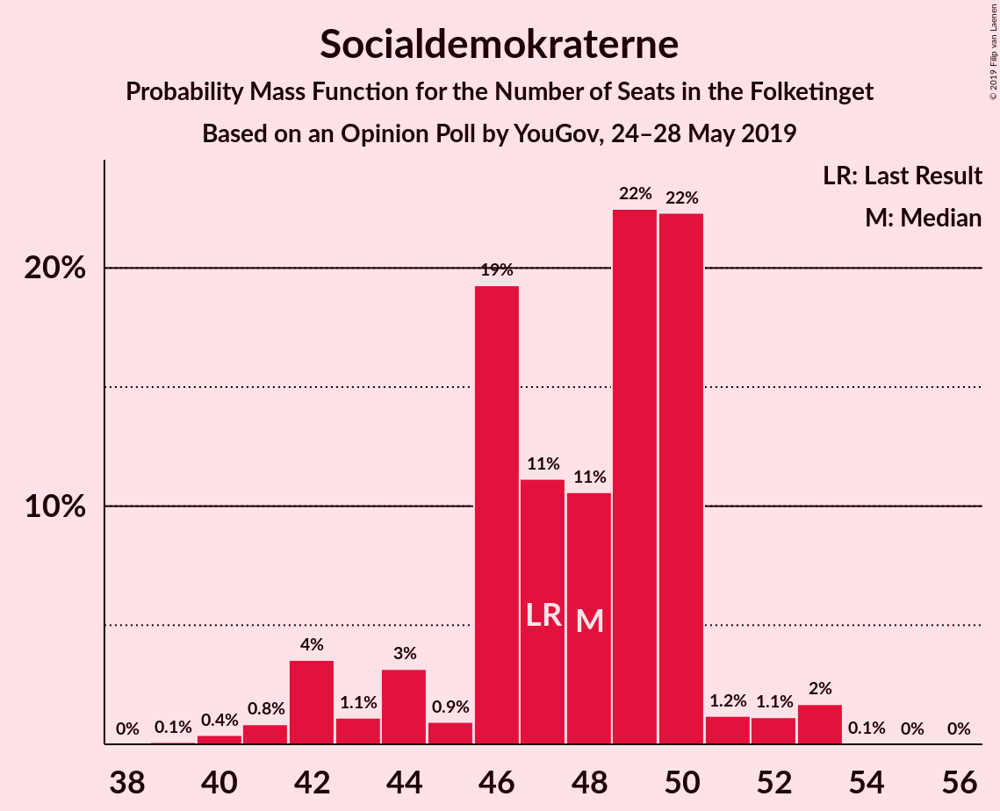

| Number of Seats | Probability | Accumulated | Special Marks |
|:---------------:|:-----------:|:-----------:|:-------------:|
| 39 | 0.1% | 100% |  |
| 40 | 0.4% | 99.9% |  |
| 41 | 0.8% | 99.5% |  |
| 42 | 4% | 98.6% |  |
| 43 | 1.1% | 95% |  |
| 44 | 3% | 94% |  |
| 45 | 0.9% | 91% |  |
| 46 | 19% | 90% |  |
| 47 | 11% | 71% | Last Result |
| 48 | 11% | 59% | Median |
| 49 | 22% | 49% |  |
| 50 | 22% | 26% |  |
| 51 | 1.2% | 4% |  |
| 52 | 1.1% | 3% |  |
| 53 | 2% | 2% |  |
| 54 | 0.1% | 0.1% |  |
| 55 | 0% | 0% |  |

### Venstre

*For a full overview of the results for this party, see the [Venstre](party-venstre.html) page.*

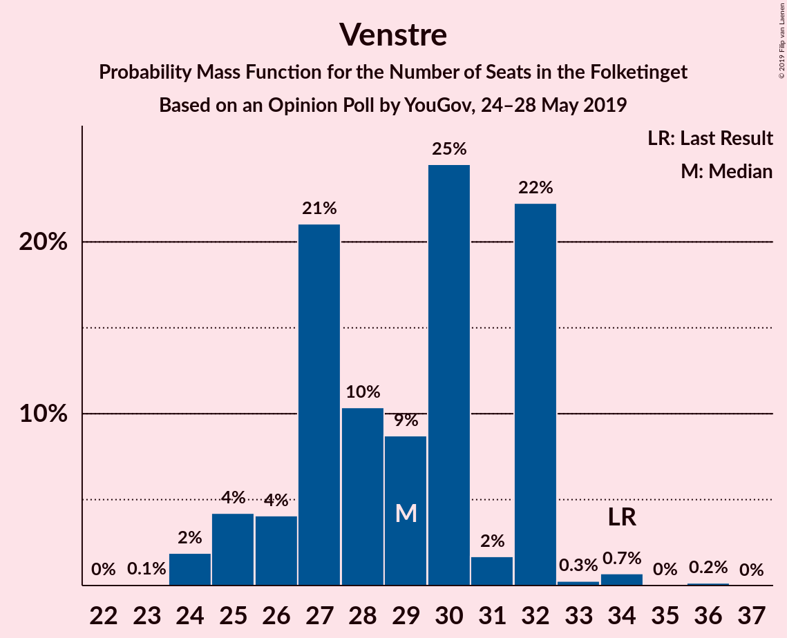

| Number of Seats | Probability | Accumulated | Special Marks |
|:---------------:|:-----------:|:-----------:|:-------------:|
| 23 | 0.1% | 100% |  |
| 24 | 2% | 99.9% |  |
| 25 | 4% | 98% |  |
| 26 | 4% | 94% |  |
| 27 | 21% | 90% |  |
| 28 | 10% | 69% |  |
| 29 | 9% | 58% | Median |
| 30 | 25% | 50% |  |
| 31 | 2% | 25% |  |
| 32 | 22% | 23% |  |
| 33 | 0.3% | 1.1% |  |
| 34 | 0.7% | 0.9% | Last Result |
| 35 | 0% | 0.2% |  |
| 36 | 0.2% | 0.2% |  |
| 37 | 0% | 0% |  |

### Dansk Folkeparti

*For a full overview of the results for this party, see the [Dansk Folkeparti](party-danskfolkeparti.html) page.*

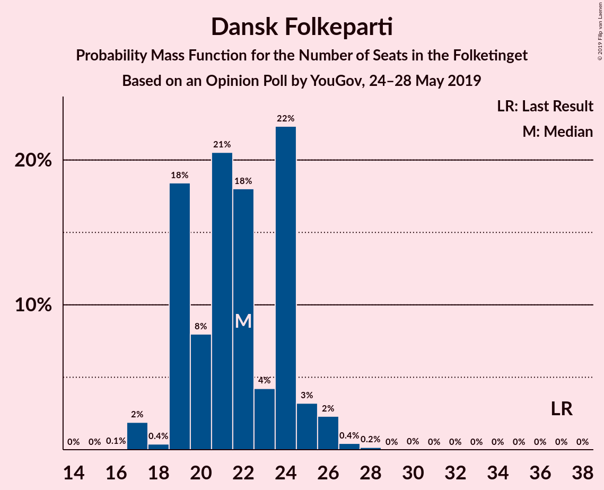

| Number of Seats | Probability | Accumulated | Special Marks |
|:---------------:|:-----------:|:-----------:|:-------------:|
| 16 | 0.1% | 100% |  |
| 17 | 2% | 99.9% |  |
| 18 | 0.4% | 98% |  |
| 19 | 18% | 98% |  |
| 20 | 8% | 79% |  |
| 21 | 21% | 71% |  |
| 22 | 18% | 51% | Median |
| 23 | 4% | 33% |  |
| 24 | 22% | 28% |  |
| 25 | 3% | 6% |  |
| 26 | 2% | 3% |  |
| 27 | 0.4% | 0.6% |  |
| 28 | 0.2% | 0.2% |  |
| 29 | 0% | 0% |  |
| 30 | 0% | 0% |  |
| 31 | 0% | 0% |  |
| 32 | 0% | 0% |  |
| 33 | 0% | 0% |  |
| 34 | 0% | 0% |  |
| 35 | 0% | 0% |  |
| 36 | 0% | 0% |  |
| 37 | 0% | 0% | Last Result |

### Socialistisk Folkeparti

*For a full overview of the results for this party, see the [Socialistisk Folkeparti](party-socialistiskfolkeparti.html) page.*

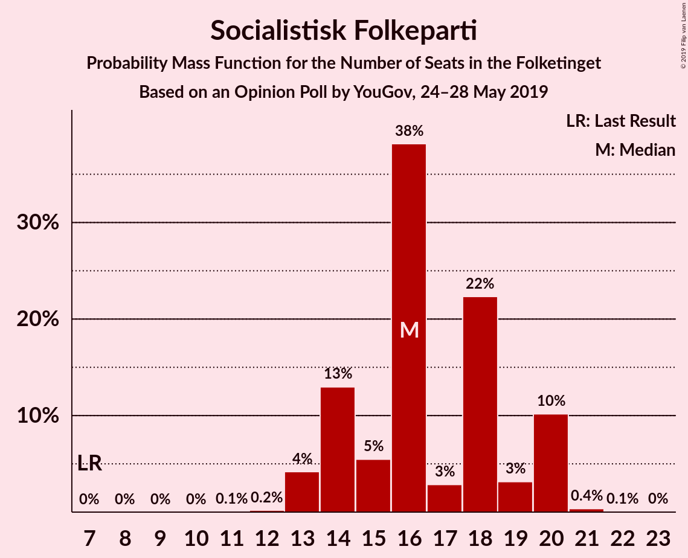

| Number of Seats | Probability | Accumulated | Special Marks |
|:---------------:|:-----------:|:-----------:|:-------------:|
| 7 | 0% | 100% | Last Result |
| 8 | 0% | 100% |  |
| 9 | 0% | 100% |  |
| 10 | 0% | 100% |  |
| 11 | 0.1% | 100% |  |
| 12 | 0.2% | 99.9% |  |
| 13 | 4% | 99.7% |  |
| 14 | 13% | 96% |  |
| 15 | 5% | 83% |  |
| 16 | 38% | 77% | Median |
| 17 | 3% | 39% |  |
| 18 | 22% | 36% |  |
| 19 | 3% | 14% |  |
| 20 | 10% | 11% |  |
| 21 | 0.4% | 0.4% |  |
| 22 | 0.1% | 0.1% |  |
| 23 | 0% | 0% |  |

### Enhedslisten–De Rød-Grønne

*For a full overview of the results for this party, see the [Enhedslisten–De Rød-Grønne](party-enhedslisten–derød-grønne.html) page.*

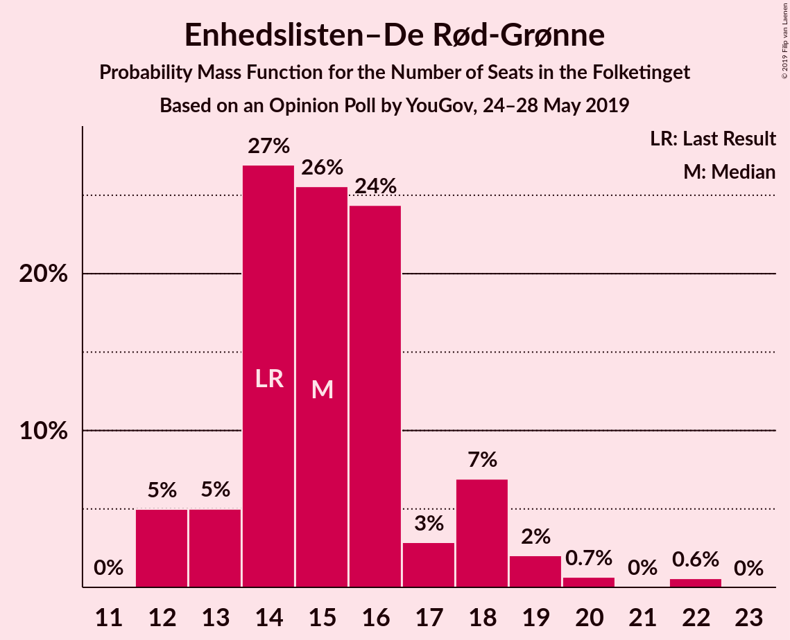

| Number of Seats | Probability | Accumulated | Special Marks |
|:---------------:|:-----------:|:-----------:|:-------------:|
| 11 | 0% | 100% |  |
| 12 | 5% | 99.9% |  |
| 13 | 5% | 95% |  |
| 14 | 27% | 90% | Last Result |
| 15 | 26% | 63% | Median |
| 16 | 24% | 37% |  |
| 17 | 3% | 13% |  |
| 18 | 7% | 10% |  |
| 19 | 2% | 3% |  |
| 20 | 0.7% | 1.3% |  |
| 21 | 0% | 0.6% |  |
| 22 | 0.6% | 0.6% |  |
| 23 | 0% | 0% |  |

### Radikale Venstre

*For a full overview of the results for this party, see the [Radikale Venstre](party-radikalevenstre.html) page.*

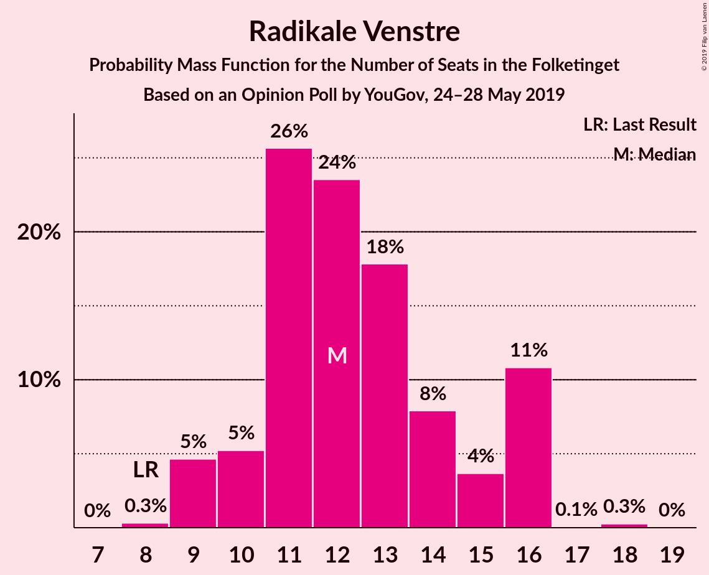

| Number of Seats | Probability | Accumulated | Special Marks |
|:---------------:|:-----------:|:-----------:|:-------------:|
| 8 | 0.3% | 100% | Last Result |
| 9 | 5% | 99.7% |  |
| 10 | 5% | 95% |  |
| 11 | 26% | 90% |  |
| 12 | 24% | 64% | Median |
| 13 | 18% | 41% |  |
| 14 | 8% | 23% |  |
| 15 | 4% | 15% |  |
| 16 | 11% | 11% |  |
| 17 | 0.1% | 0.4% |  |
| 18 | 0.3% | 0.3% |  |
| 19 | 0% | 0% |  |

### Det Konservative Folkeparti

*For a full overview of the results for this party, see the [Det Konservative Folkeparti](party-detkonservativefolkeparti.html) page.*

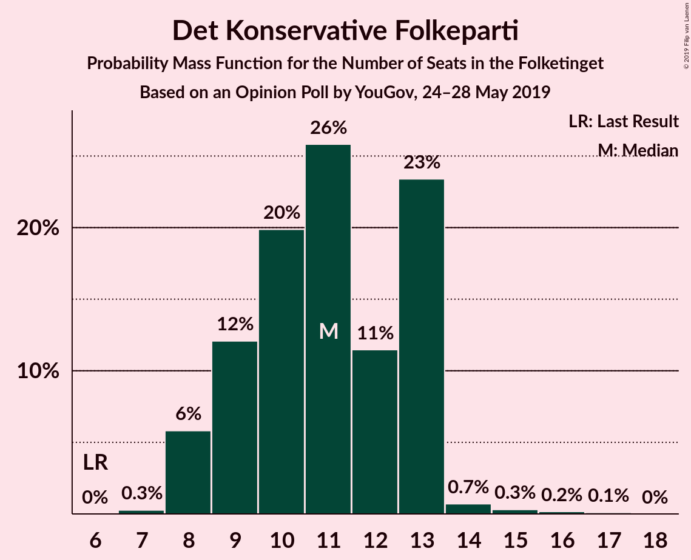

| Number of Seats | Probability | Accumulated | Special Marks |
|:---------------:|:-----------:|:-----------:|:-------------:|
| 6 | 0% | 100% | Last Result |
| 7 | 0.3% | 100% |  |
| 8 | 6% | 99.7% |  |
| 9 | 12% | 94% |  |
| 10 | 20% | 82% |  |
| 11 | 26% | 62% | Median |
| 12 | 11% | 36% |  |
| 13 | 23% | 25% |  |
| 14 | 0.7% | 1.3% |  |
| 15 | 0.3% | 0.6% |  |
| 16 | 0.2% | 0.3% |  |
| 17 | 0.1% | 0.1% |  |
| 18 | 0% | 0% |  |

### Nye Borgerlige

*For a full overview of the results for this party, see the [Nye Borgerlige](party-nyeborgerlige.html) page.*

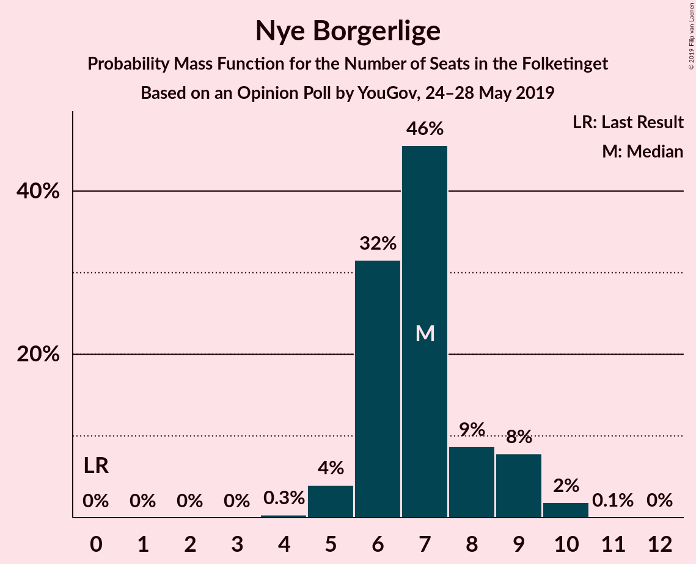

| Number of Seats | Probability | Accumulated | Special Marks |
|:---------------:|:-----------:|:-----------:|:-------------:|
| 0 | 0% | 100% | Last Result |
| 1 | 0% | 100% |  |
| 2 | 0% | 100% |  |
| 3 | 0% | 100% |  |
| 4 | 0.3% | 100% |  |
| 5 | 4% | 99.7% |  |
| 6 | 32% | 96% |  |
| 7 | 46% | 64% | Median |
| 8 | 9% | 19% |  |
| 9 | 8% | 10% |  |
| 10 | 2% | 2% |  |
| 11 | 0.1% | 0.1% |  |
| 12 | 0% | 0% |  |

### Alternativet

*For a full overview of the results for this party, see the [Alternativet](party-alternativet.html) page.*

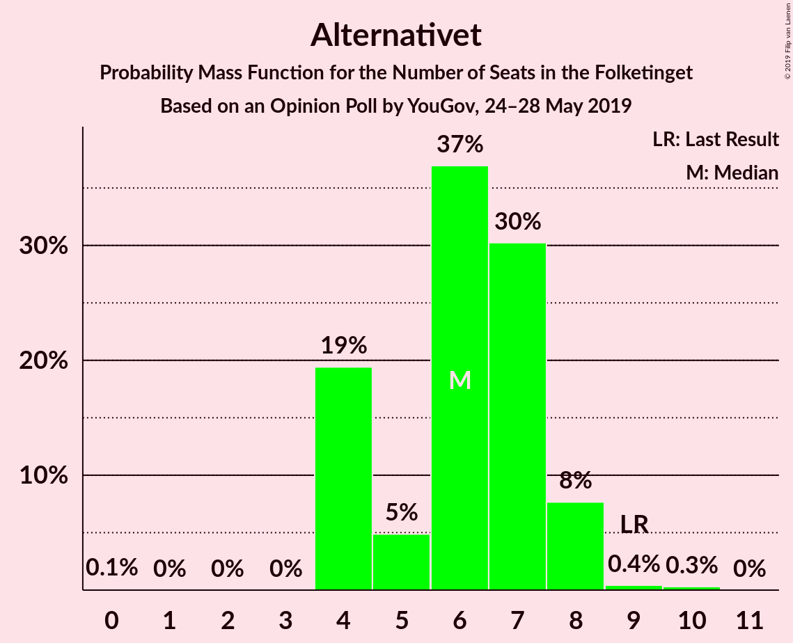

| Number of Seats | Probability | Accumulated | Special Marks |
|:---------------:|:-----------:|:-----------:|:-------------:|
| 0 | 0.1% | 100% |  |
| 1 | 0% | 99.9% |  |
| 2 | 0% | 99.9% |  |
| 3 | 0% | 99.9% |  |
| 4 | 19% | 99.9% |  |
| 5 | 5% | 80% |  |
| 6 | 37% | 76% | Median |
| 7 | 30% | 39% |  |
| 8 | 8% | 8% |  |
| 9 | 0.4% | 0.7% | Last Result |
| 10 | 0.3% | 0.3% |  |
| 11 | 0% | 0% |  |

### Liberal Alliance

*For a full overview of the results for this party, see the [Liberal Alliance](party-liberalalliance.html) page.*

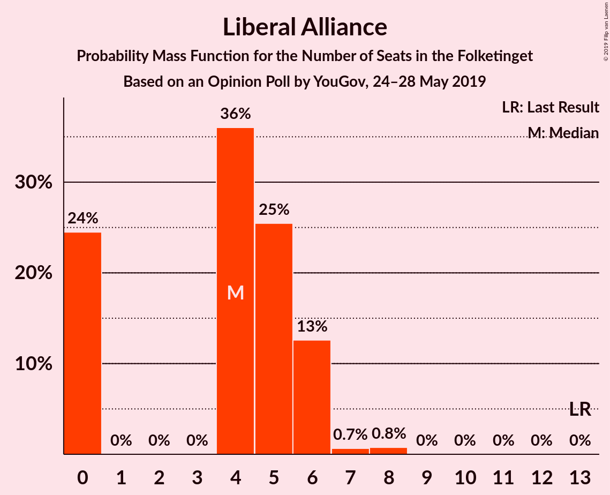

| Number of Seats | Probability | Accumulated | Special Marks |
|:---------------:|:-----------:|:-----------:|:-------------:|
| 0 | 24% | 100% |  |
| 1 | 0% | 76% |  |
| 2 | 0% | 76% |  |
| 3 | 0% | 76% |  |
| 4 | 36% | 76% | Median |
| 5 | 25% | 39% |  |
| 6 | 13% | 14% |  |
| 7 | 0.7% | 1.4% |  |
| 8 | 0.8% | 0.8% |  |
| 9 | 0% | 0% |  |
| 10 | 0% | 0% |  |
| 11 | 0% | 0% |  |
| 12 | 0% | 0% |  |
| 13 | 0% | 0% | Last Result |

### Stram Kurs

*For a full overview of the results for this party, see the [Stram Kurs](party-stramkurs.html) page.*

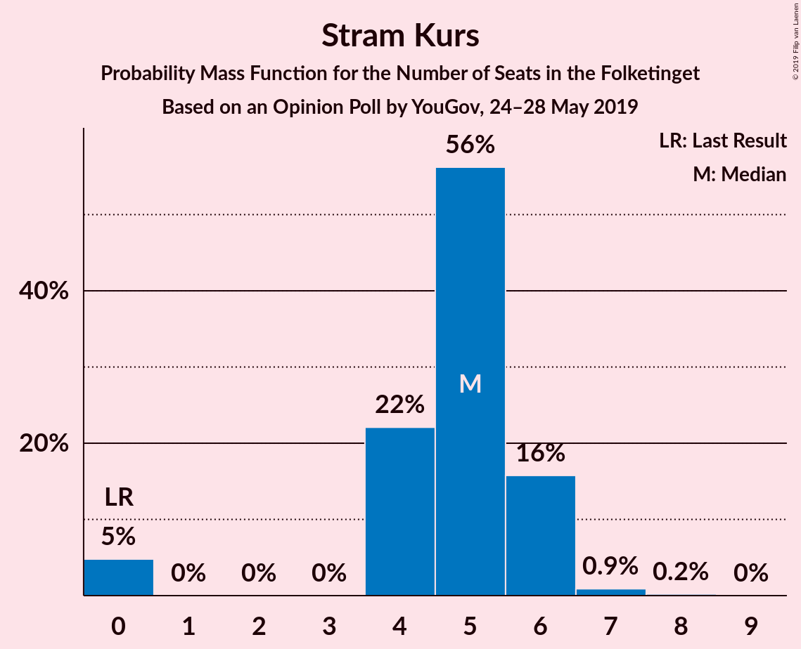

| Number of Seats | Probability | Accumulated | Special Marks |
|:---------------:|:-----------:|:-----------:|:-------------:|
| 0 | 5% | 100% | Last Result |
| 1 | 0% | 95% |  |
| 2 | 0% | 95% |  |
| 3 | 0% | 95% |  |
| 4 | 22% | 95% |  |
| 5 | 56% | 73% | Median |
| 6 | 16% | 17% |  |
| 7 | 0.9% | 1.1% |  |
| 8 | 0.2% | 0.2% |  |
| 9 | 0% | 0% |  |

### Kristendemokraterne

*For a full overview of the results for this party, see the [Kristendemokraterne](party-kristendemokraterne.html) page.*

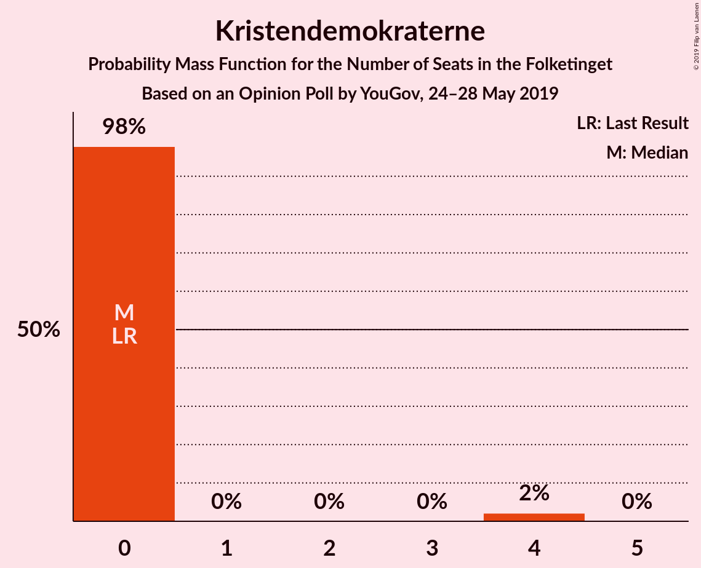

| Number of Seats | Probability | Accumulated | Special Marks |
|:---------------:|:-----------:|:-----------:|:-------------:|
| 0 | 98% | 100% | Last Result, Median |
| 1 | 0% | 2% |  |
| 2 | 0% | 2% |  |
| 3 | 0% | 2% |  |
| 4 | 2% | 2% |  |
| 5 | 0% | 0% |  |

### Klaus Riskær Pedersen

*For a full overview of the results for this party, see the [Klaus Riskær Pedersen](party-klausriskærpedersen.html) page.*

| Number of Seats | Probability | Accumulated | Special Marks |
|:---------------:|:-----------:|:-----------:|:-------------:|
| 0 | 100% | 100% | Last Result, Median |

## Coalitions

### Confidence Intervals

| Coalition | Last Result | Median | Majority? | 80% Confidence Interval | 90% Confidence Interval | 95% Confidence Interval | 99% Confidence Interval |
|:---------:|:-----------:|:------:|:---------:|:-----------------------:|:-----------------------:|:-----------------------:|:-----------------------:|
| Socialdemokraterne – Socialistisk Folkeparti – Enhedslisten–De Rød-Grønne – Radikale Venstre – Alternativet | 85 | 98 | 99.6% | 95–102 | 93–102 | 92–103 | 90–106 |
| Socialdemokraterne – Socialistisk Folkeparti – Enhedslisten–De Rød-Grønne – Radikale Venstre | 76 | 92 | 92% | 90–95 | 87–95 | 86–96 | 82–100 |
| Socialdemokraterne – Socialistisk Folkeparti – Enhedslisten–De Rød-Grønne – Alternativet | 77 | 86 | 6% | 82–88 | 80–91 | 80–91 | 78–92 |
| Socialdemokraterne – Socialistisk Folkeparti – Enhedslisten–De Rød-Grønne | 68 | 79 | 0% | 76–83 | 75–85 | 74–85 | 71–85 |
| Venstre – Dansk Folkeparti – Det Konservative Folkeparti – Nye Borgerlige – Liberal Alliance – Stram Kurs – Kristendemokraterne – Klaus Riskær Pedersen | 90 | 77 | 0% | 73–80 | 73–82 | 72–83 | 69–85 |
| Socialdemokraterne – Socialistisk Folkeparti – Radikale Venstre | 62 | 77 | 0% | 74–81 | 72–81 | 71–81 | 68–84 |
| Venstre – Dansk Folkeparti – Det Konservative Folkeparti – Nye Borgerlige – Liberal Alliance – Kristendemokraterne – Klaus Riskær Pedersen | 90 | 72 | 0% | 69–75 | 69–78 | 69–78 | 67–81 |
| Venstre – Dansk Folkeparti – Det Konservative Folkeparti – Nye Borgerlige – Liberal Alliance – Klaus Riskær Pedersen | 90 | 72 | 0% | 69–75 | 69–76 | 69–78 | 67–81 |
| Venstre – Dansk Folkeparti – Det Konservative Folkeparti – Nye Borgerlige – Liberal Alliance – Kristendemokraterne | 90 | 72 | 0% | 69–75 | 69–78 | 69–78 | 67–81 |
| Venstre – Dansk Folkeparti – Det Konservative Folkeparti – Nye Borgerlige – Liberal Alliance | 90 | 72 | 0% | 69–75 | 69–76 | 69–78 | 67–81 |
| Venstre – Dansk Folkeparti – Det Konservative Folkeparti – Liberal Alliance – Kristendemokraterne | 90 | 64 | 0% | 62–68 | 62–71 | 62–71 | 61–74 |
| Venstre – Dansk Folkeparti – Det Konservative Folkeparti – Liberal Alliance | 90 | 64 | 0% | 62–68 | 62–70 | 62–71 | 61–74 |
| Socialdemokraterne – Radikale Venstre | 55 | 61 | 0% | 57–65 | 55–65 | 54–65 | 51–68 |
| Venstre – Det Konservative Folkeparti – Liberal Alliance | 53 | 44 | 0% | 40–48 | 40–48 | 38–50 | 38–51 |
| Venstre – Det Konservative Folkeparti | 40 | 40 | 0% | 36–43 | 36–43 | 36–44 | 34–47 |
| Venstre | 34 | 29 | 0% | 26–32 | 25–32 | 25–32 | 24–34 |

### Socialdemokraterne – Socialistisk Folkeparti – Enhedslisten–De Rød-Grønne – Radikale Venstre – Alternativet

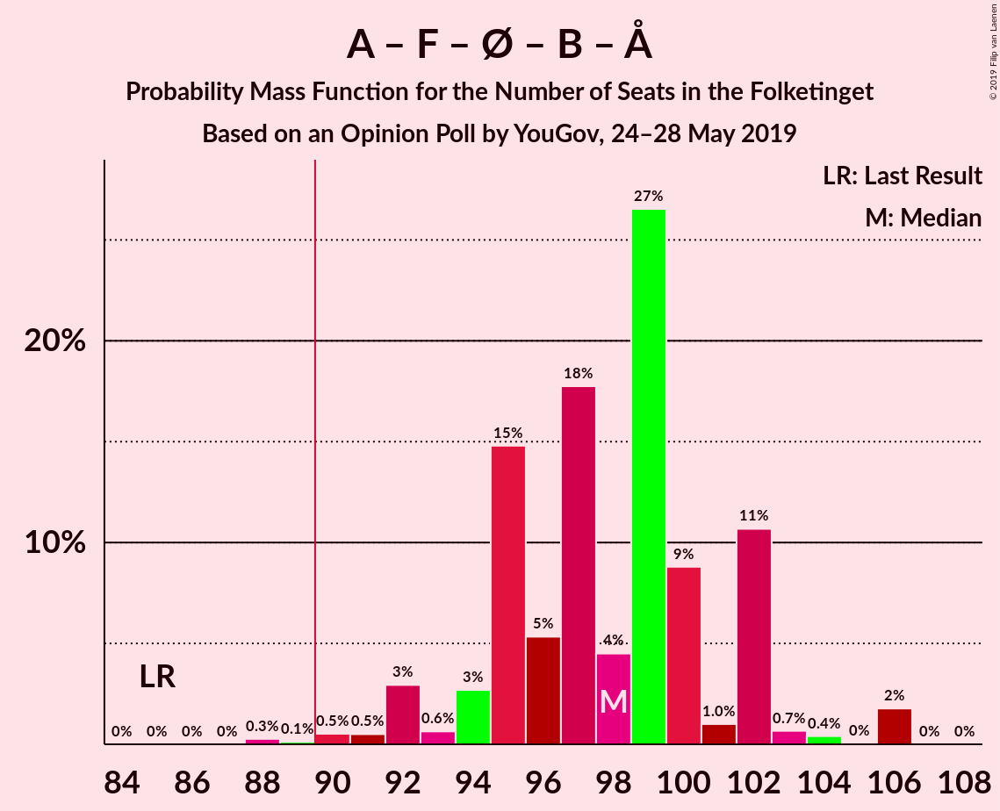

| Number of Seats | Probability | Accumulated | Special Marks |
|:---------------:|:-----------:|:-----------:|:-------------:|
| 85 | 0% | 100% | Last Result |
| 86 | 0% | 100% |  |
| 87 | 0% | 100% |  |
| 88 | 0.3% | 100% |  |
| 89 | 0.1% | 99.7% |  |
| 90 | 0.5% | 99.6% | Majority |
| 91 | 0.5% | 99.1% |  |
| 92 | 3% | 98.6% |  |
| 93 | 0.6% | 96% |  |
| 94 | 3% | 95% |  |
| 95 | 15% | 92% |  |
| 96 | 5% | 77% |  |
| 97 | 18% | 72% | Median |
| 98 | 4% | 54% |  |
| 99 | 27% | 50% |  |
| 100 | 9% | 23% |  |
| 101 | 1.0% | 15% |  |
| 102 | 11% | 14% |  |
| 103 | 0.7% | 3% |  |
| 104 | 0.4% | 2% |  |
| 105 | 0% | 2% |  |
| 106 | 2% | 2% |  |
| 107 | 0% | 0% |  |

### Socialdemokraterne – Socialistisk Folkeparti – Enhedslisten–De Rød-Grønne – Radikale Venstre

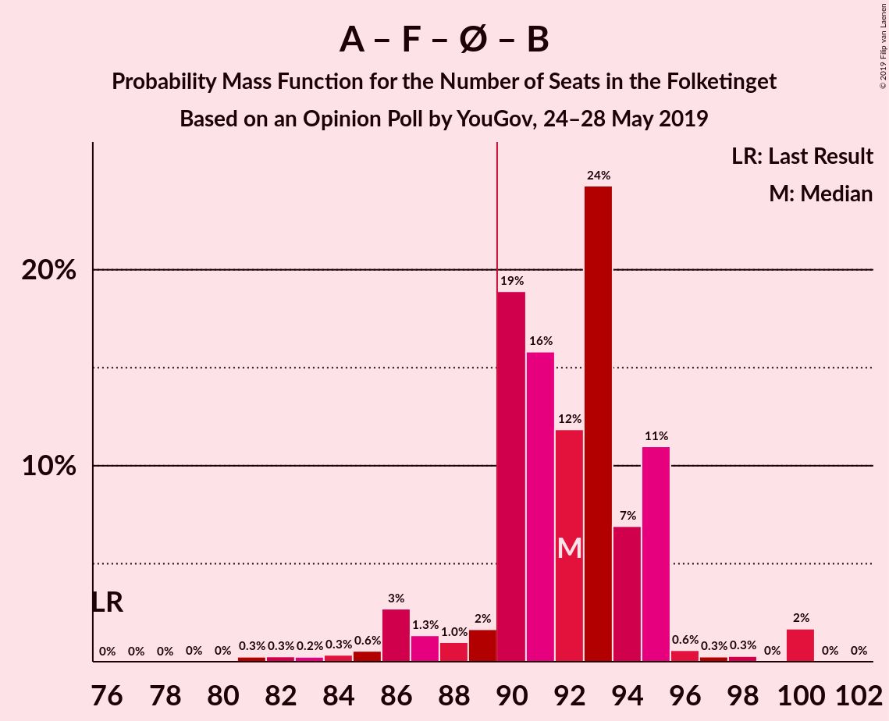

| Number of Seats | Probability | Accumulated | Special Marks |
|:---------------:|:-----------:|:-----------:|:-------------:|
| 76 | 0% | 100% | Last Result |
| 77 | 0% | 100% |  |
| 78 | 0% | 100% |  |
| 79 | 0% | 100% |  |
| 80 | 0% | 100% |  |
| 81 | 0.3% | 100% |  |
| 82 | 0.3% | 99.7% |  |
| 83 | 0.2% | 99.5% |  |
| 84 | 0.3% | 99.2% |  |
| 85 | 0.6% | 98.9% |  |
| 86 | 3% | 98% |  |
| 87 | 1.3% | 96% |  |
| 88 | 1.0% | 94% |  |
| 89 | 2% | 93% |  |
| 90 | 19% | 92% | Majority |
| 91 | 16% | 73% | Median |
| 92 | 12% | 57% |  |
| 93 | 24% | 45% |  |
| 94 | 7% | 21% |  |
| 95 | 11% | 14% |  |
| 96 | 0.6% | 3% |  |
| 97 | 0.3% | 2% |  |
| 98 | 0.3% | 2% |  |
| 99 | 0% | 2% |  |
| 100 | 2% | 2% |  |
| 101 | 0% | 0% |  |

### Socialdemokraterne – Socialistisk Folkeparti – Enhedslisten–De Rød-Grønne – Alternativet

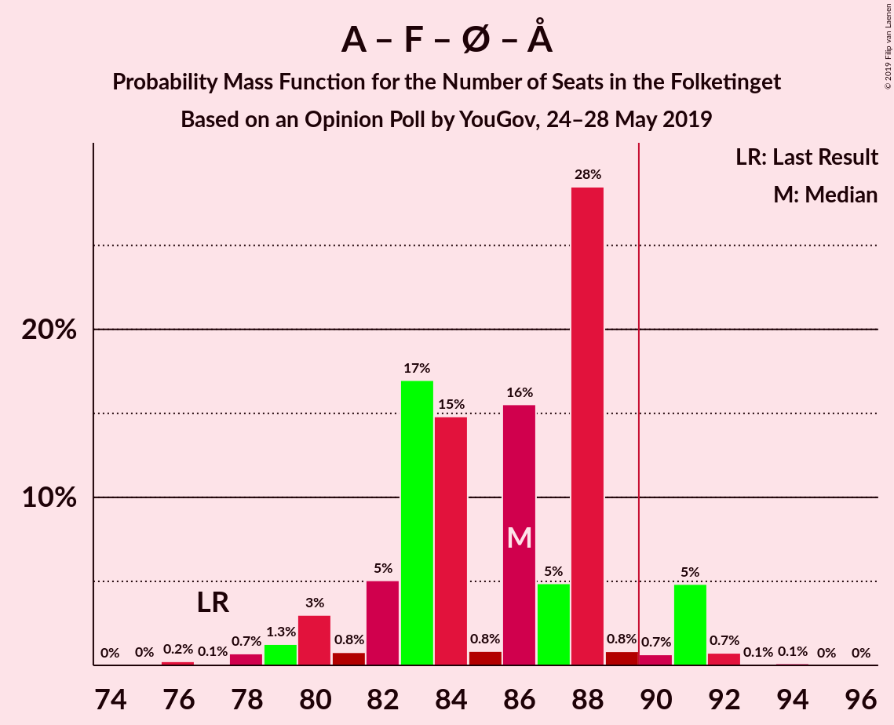

| Number of Seats | Probability | Accumulated | Special Marks |
|:---------------:|:-----------:|:-----------:|:-------------:|
| 75 | 0% | 100% |  |
| 76 | 0.2% | 99.9% |  |
| 77 | 0.1% | 99.7% | Last Result |
| 78 | 0.7% | 99.6% |  |
| 79 | 1.3% | 98.9% |  |
| 80 | 3% | 98% |  |
| 81 | 0.8% | 95% |  |
| 82 | 5% | 94% |  |
| 83 | 17% | 89% |  |
| 84 | 15% | 72% |  |
| 85 | 0.8% | 57% | Median |
| 86 | 16% | 56% |  |
| 87 | 5% | 41% |  |
| 88 | 28% | 36% |  |
| 89 | 0.8% | 7% |  |
| 90 | 0.7% | 6% | Majority |
| 91 | 5% | 6% |  |
| 92 | 0.7% | 0.9% |  |
| 93 | 0.1% | 0.2% |  |
| 94 | 0.1% | 0.1% |  |
| 95 | 0% | 0% |  |

### Socialdemokraterne – Socialistisk Folkeparti – Enhedslisten–De Rød-Grønne

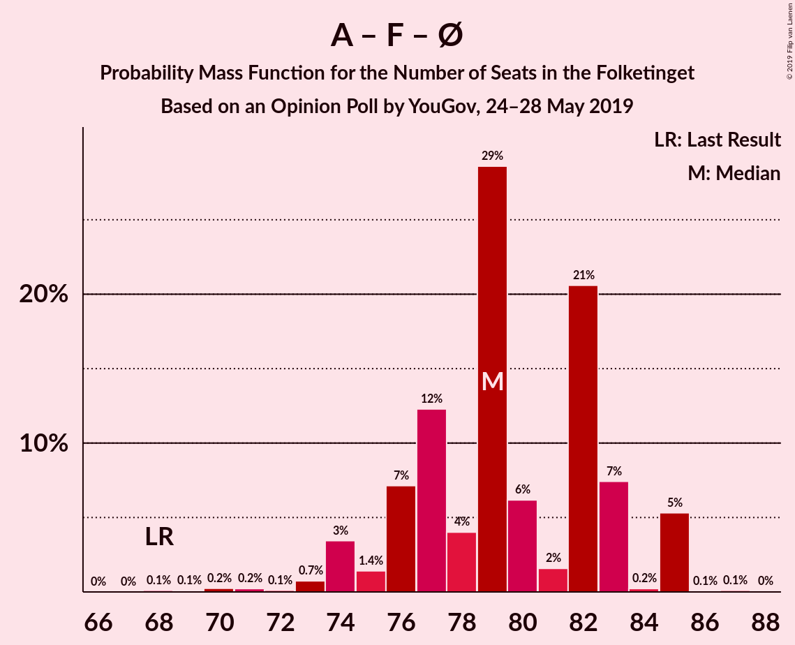

| Number of Seats | Probability | Accumulated | Special Marks |
|:---------------:|:-----------:|:-----------:|:-------------:|
| 68 | 0.1% | 100% | Last Result |
| 69 | 0.1% | 99.9% |  |
| 70 | 0.2% | 99.8% |  |
| 71 | 0.2% | 99.6% |  |
| 72 | 0.1% | 99.3% |  |
| 73 | 0.7% | 99.2% |  |
| 74 | 3% | 98% |  |
| 75 | 1.4% | 95% |  |
| 76 | 7% | 94% |  |
| 77 | 12% | 86% |  |
| 78 | 4% | 74% |  |
| 79 | 29% | 70% | Median |
| 80 | 6% | 42% |  |
| 81 | 2% | 35% |  |
| 82 | 21% | 34% |  |
| 83 | 7% | 13% |  |
| 84 | 0.2% | 6% |  |
| 85 | 5% | 6% |  |
| 86 | 0.1% | 0.2% |  |
| 87 | 0.1% | 0.2% |  |
| 88 | 0% | 0% |  |

### Venstre – Dansk Folkeparti – Det Konservative Folkeparti – Nye Borgerlige – Liberal Alliance – Stram Kurs – Kristendemokraterne – Klaus Riskær Pedersen

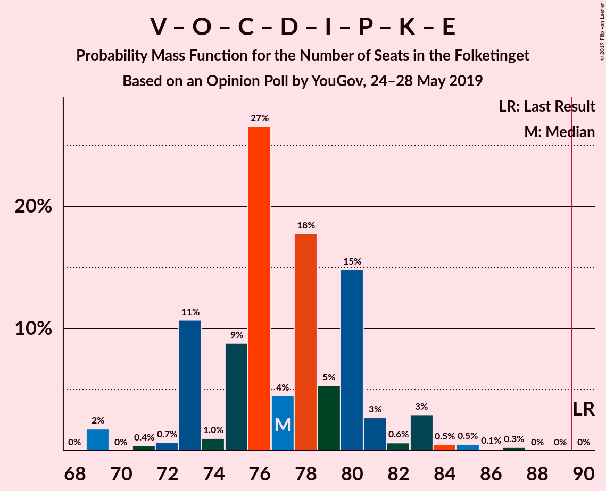

| Number of Seats | Probability | Accumulated | Special Marks |
|:---------------:|:-----------:|:-----------:|:-------------:|
| 69 | 2% | 100% |  |
| 70 | 0% | 98% |  |
| 71 | 0.4% | 98% |  |
| 72 | 0.7% | 98% |  |
| 73 | 11% | 97% |  |
| 74 | 1.0% | 86% |  |
| 75 | 9% | 85% |  |
| 76 | 27% | 77% |  |
| 77 | 4% | 50% |  |
| 78 | 18% | 46% | Median |
| 79 | 5% | 28% |  |
| 80 | 15% | 23% |  |
| 81 | 3% | 8% |  |
| 82 | 0.6% | 5% |  |
| 83 | 3% | 4% |  |
| 84 | 0.5% | 1.4% |  |
| 85 | 0.5% | 0.9% |  |
| 86 | 0.1% | 0.4% |  |
| 87 | 0.3% | 0.3% |  |
| 88 | 0% | 0% |  |
| 89 | 0% | 0% |  |
| 90 | 0% | 0% | Last Result, Majority |

### Socialdemokraterne – Socialistisk Folkeparti – Radikale Venstre

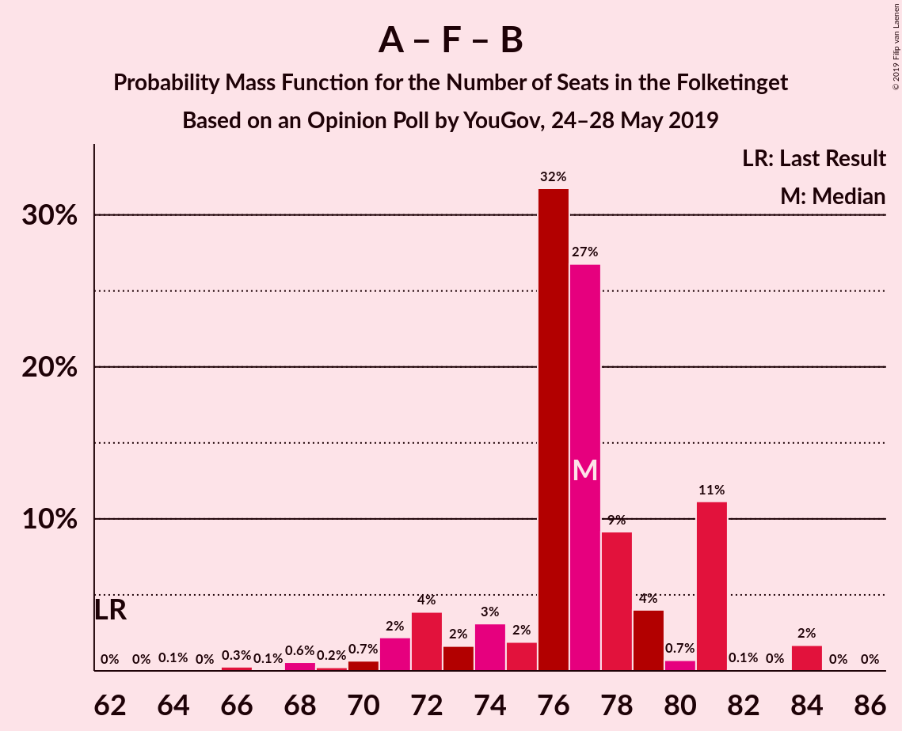

| Number of Seats | Probability | Accumulated | Special Marks |
|:---------------:|:-----------:|:-----------:|:-------------:|
| 62 | 0% | 100% | Last Result |
| 63 | 0% | 100% |  |
| 64 | 0.1% | 100% |  |
| 65 | 0% | 99.9% |  |
| 66 | 0.3% | 99.9% |  |
| 67 | 0.1% | 99.6% |  |
| 68 | 0.6% | 99.6% |  |
| 69 | 0.2% | 99.0% |  |
| 70 | 0.7% | 98.8% |  |
| 71 | 2% | 98% |  |
| 72 | 4% | 96% |  |
| 73 | 2% | 92% |  |
| 74 | 3% | 90% |  |
| 75 | 2% | 87% |  |
| 76 | 32% | 85% | Median |
| 77 | 27% | 54% |  |
| 78 | 9% | 27% |  |
| 79 | 4% | 18% |  |
| 80 | 0.7% | 14% |  |
| 81 | 11% | 13% |  |
| 82 | 0.1% | 2% |  |
| 83 | 0% | 2% |  |
| 84 | 2% | 2% |  |
| 85 | 0% | 0% |  |

### Venstre – Dansk Folkeparti – Det Konservative Folkeparti – Nye Borgerlige – Liberal Alliance – Kristendemokraterne – Klaus Riskær Pedersen

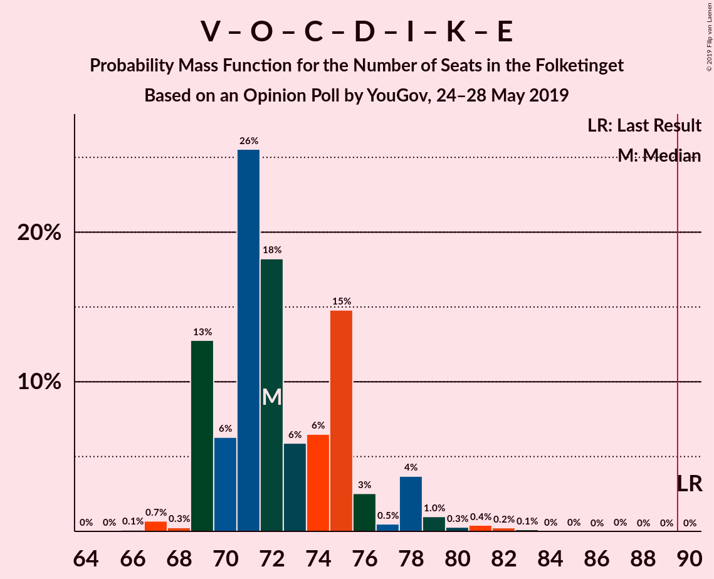

| Number of Seats | Probability | Accumulated | Special Marks |
|:---------------:|:-----------:|:-----------:|:-------------:|
| 65 | 0% | 100% |  |
| 66 | 0.1% | 99.9% |  |
| 67 | 0.7% | 99.8% |  |
| 68 | 0.3% | 99.1% |  |
| 69 | 13% | 98.9% |  |
| 70 | 6% | 86% |  |
| 71 | 26% | 80% |  |
| 72 | 18% | 54% |  |
| 73 | 6% | 36% | Median |
| 74 | 6% | 30% |  |
| 75 | 15% | 24% |  |
| 76 | 3% | 9% |  |
| 77 | 0.5% | 6% |  |
| 78 | 4% | 6% |  |
| 79 | 1.0% | 2% |  |
| 80 | 0.3% | 1.1% |  |
| 81 | 0.4% | 0.8% |  |
| 82 | 0.2% | 0.4% |  |
| 83 | 0.1% | 0.2% |  |
| 84 | 0% | 0.1% |  |
| 85 | 0% | 0.1% |  |
| 86 | 0% | 0% |  |
| 87 | 0% | 0% |  |
| 88 | 0% | 0% |  |
| 89 | 0% | 0% |  |
| 90 | 0% | 0% | Last Result, Majority |

### Venstre – Dansk Folkeparti – Det Konservative Folkeparti – Nye Borgerlige – Liberal Alliance – Klaus Riskær Pedersen

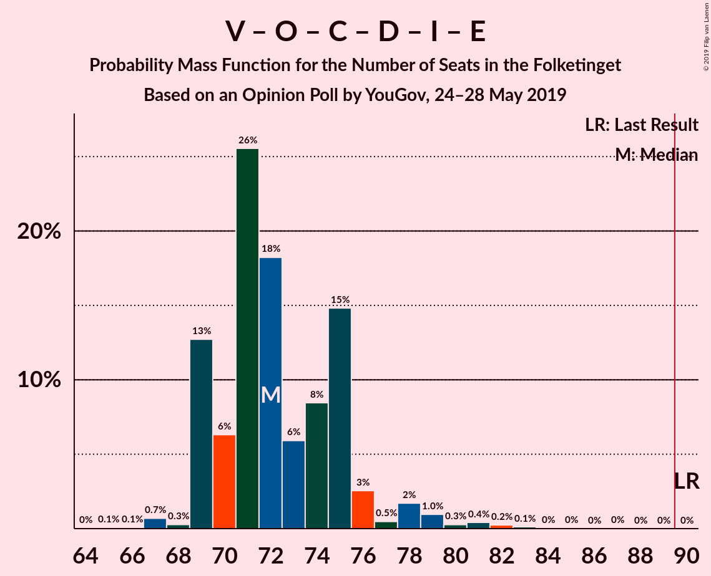

| Number of Seats | Probability | Accumulated | Special Marks |
|:---------------:|:-----------:|:-----------:|:-------------:|
| 65 | 0.1% | 100% |  |
| 66 | 0.1% | 99.9% |  |
| 67 | 0.7% | 99.8% |  |
| 68 | 0.3% | 99.1% |  |
| 69 | 13% | 98.8% |  |
| 70 | 6% | 86% |  |
| 71 | 26% | 80% |  |
| 72 | 18% | 54% |  |
| 73 | 6% | 36% | Median |
| 74 | 8% | 30% |  |
| 75 | 15% | 22% |  |
| 76 | 3% | 7% |  |
| 77 | 0.5% | 4% |  |
| 78 | 2% | 4% |  |
| 79 | 1.0% | 2% |  |
| 80 | 0.3% | 1.1% |  |
| 81 | 0.4% | 0.8% |  |
| 82 | 0.2% | 0.4% |  |
| 83 | 0.1% | 0.2% |  |
| 84 | 0% | 0.1% |  |
| 85 | 0% | 0.1% |  |
| 86 | 0% | 0% |  |
| 87 | 0% | 0% |  |
| 88 | 0% | 0% |  |
| 89 | 0% | 0% |  |
| 90 | 0% | 0% | Last Result, Majority |

### Venstre – Dansk Folkeparti – Det Konservative Folkeparti – Nye Borgerlige – Liberal Alliance – Kristendemokraterne

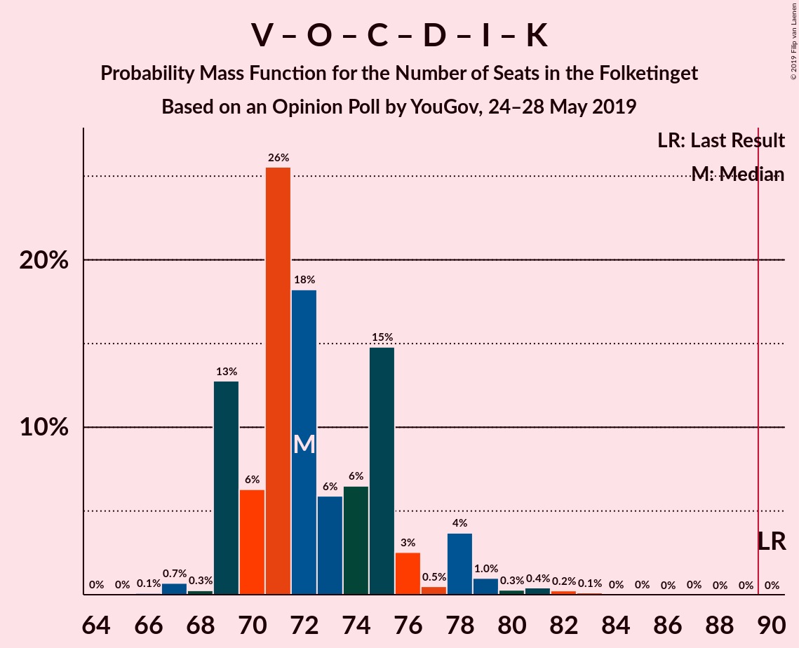

| Number of Seats | Probability | Accumulated | Special Marks |
|:---------------:|:-----------:|:-----------:|:-------------:|
| 65 | 0% | 100% |  |
| 66 | 0.1% | 99.9% |  |
| 67 | 0.7% | 99.8% |  |
| 68 | 0.3% | 99.1% |  |
| 69 | 13% | 98.9% |  |
| 70 | 6% | 86% |  |
| 71 | 26% | 80% |  |
| 72 | 18% | 54% |  |
| 73 | 6% | 36% | Median |
| 74 | 6% | 30% |  |
| 75 | 15% | 24% |  |
| 76 | 3% | 9% |  |
| 77 | 0.5% | 6% |  |
| 78 | 4% | 6% |  |
| 79 | 1.0% | 2% |  |
| 80 | 0.3% | 1.1% |  |
| 81 | 0.4% | 0.8% |  |
| 82 | 0.2% | 0.4% |  |
| 83 | 0.1% | 0.2% |  |
| 84 | 0% | 0.1% |  |
| 85 | 0% | 0.1% |  |
| 86 | 0% | 0% |  |
| 87 | 0% | 0% |  |
| 88 | 0% | 0% |  |
| 89 | 0% | 0% |  |
| 90 | 0% | 0% | Last Result, Majority |

### Venstre – Dansk Folkeparti – Det Konservative Folkeparti – Nye Borgerlige – Liberal Alliance

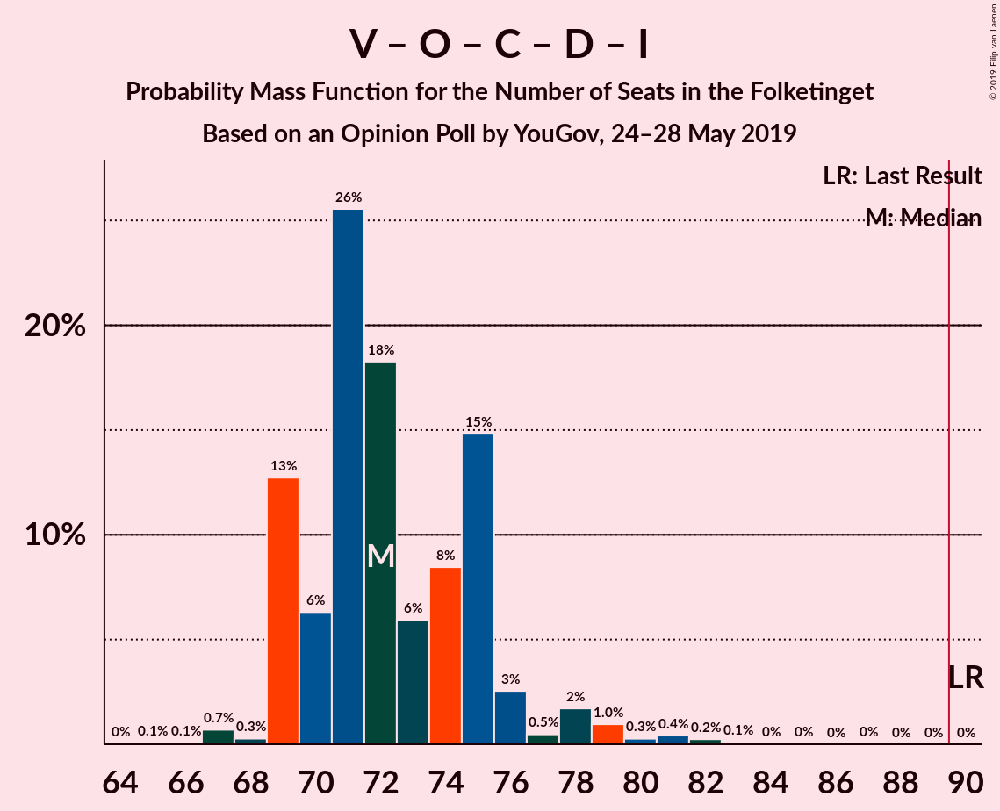

| Number of Seats | Probability | Accumulated | Special Marks |
|:---------------:|:-----------:|:-----------:|:-------------:|
| 65 | 0.1% | 100% |  |
| 66 | 0.1% | 99.9% |  |
| 67 | 0.7% | 99.8% |  |
| 68 | 0.3% | 99.1% |  |
| 69 | 13% | 98.8% |  |
| 70 | 6% | 86% |  |
| 71 | 26% | 80% |  |
| 72 | 18% | 54% |  |
| 73 | 6% | 36% | Median |
| 74 | 8% | 30% |  |
| 75 | 15% | 22% |  |
| 76 | 3% | 7% |  |
| 77 | 0.5% | 4% |  |
| 78 | 2% | 4% |  |
| 79 | 1.0% | 2% |  |
| 80 | 0.3% | 1.1% |  |
| 81 | 0.4% | 0.8% |  |
| 82 | 0.2% | 0.4% |  |
| 83 | 0.1% | 0.2% |  |
| 84 | 0% | 0.1% |  |
| 85 | 0% | 0.1% |  |
| 86 | 0% | 0% |  |
| 87 | 0% | 0% |  |
| 88 | 0% | 0% |  |
| 89 | 0% | 0% |  |
| 90 | 0% | 0% | Last Result, Majority |

### Venstre – Dansk Folkeparti – Det Konservative Folkeparti – Liberal Alliance – Kristendemokraterne

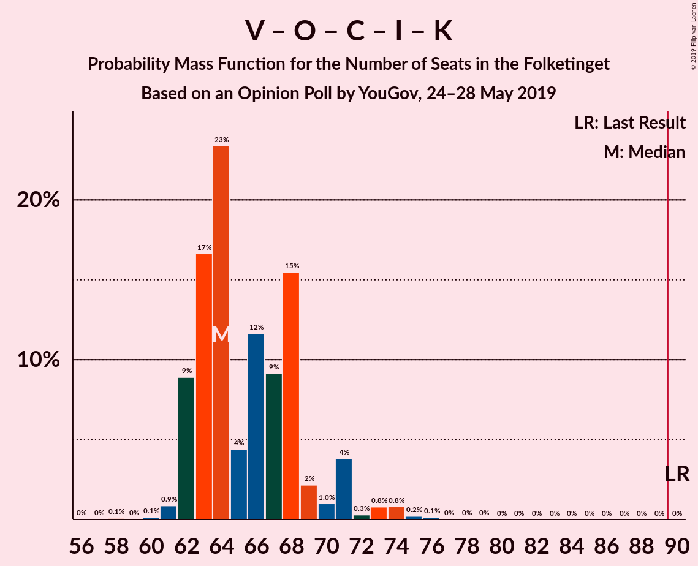

| Number of Seats | Probability | Accumulated | Special Marks |
|:---------------:|:-----------:|:-----------:|:-------------:|
| 58 | 0.1% | 100% |  |
| 59 | 0% | 99.9% |  |
| 60 | 0.1% | 99.8% |  |
| 61 | 0.9% | 99.7% |  |
| 62 | 9% | 98.8% |  |
| 63 | 17% | 90% |  |
| 64 | 23% | 73% |  |
| 65 | 4% | 50% |  |
| 66 | 12% | 45% | Median |
| 67 | 9% | 34% |  |
| 68 | 15% | 25% |  |
| 69 | 2% | 9% |  |
| 70 | 1.0% | 7% |  |
| 71 | 4% | 6% |  |
| 72 | 0.3% | 2% |  |
| 73 | 0.8% | 2% |  |
| 74 | 0.8% | 1.2% |  |
| 75 | 0.2% | 0.4% |  |
| 76 | 0.1% | 0.2% |  |
| 77 | 0% | 0.1% |  |
| 78 | 0% | 0% |  |
| 79 | 0% | 0% |  |
| 80 | 0% | 0% |  |
| 81 | 0% | 0% |  |
| 82 | 0% | 0% |  |
| 83 | 0% | 0% |  |
| 84 | 0% | 0% |  |
| 85 | 0% | 0% |  |
| 86 | 0% | 0% |  |
| 87 | 0% | 0% |  |
| 88 | 0% | 0% |  |
| 89 | 0% | 0% |  |
| 90 | 0% | 0% | Last Result, Majority |

### Venstre – Dansk Folkeparti – Det Konservative Folkeparti – Liberal Alliance

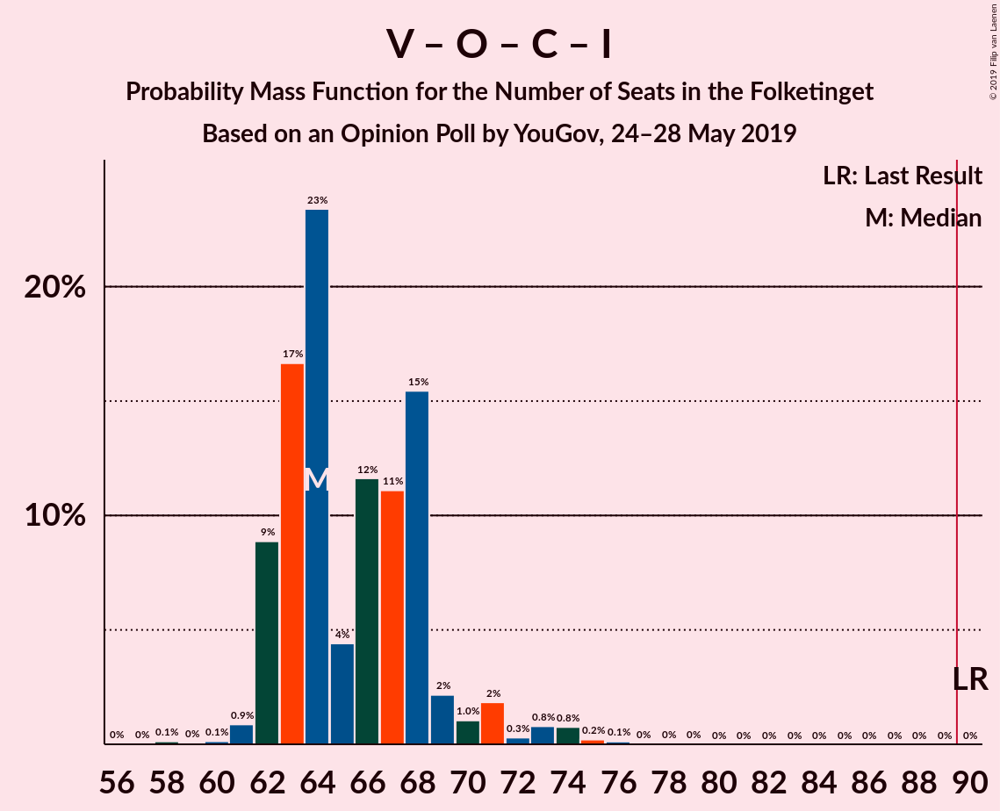

| Number of Seats | Probability | Accumulated | Special Marks |
|:---------------:|:-----------:|:-----------:|:-------------:|
| 57 | 0% | 100% |  |
| 58 | 0.1% | 99.9% |  |
| 59 | 0% | 99.8% |  |
| 60 | 0.1% | 99.8% |  |
| 61 | 0.9% | 99.6% |  |
| 62 | 9% | 98.8% |  |
| 63 | 17% | 90% |  |
| 64 | 23% | 73% |  |
| 65 | 4% | 50% |  |
| 66 | 12% | 45% | Median |
| 67 | 11% | 34% |  |
| 68 | 15% | 23% |  |
| 69 | 2% | 7% |  |
| 70 | 1.0% | 5% |  |
| 71 | 2% | 4% |  |
| 72 | 0.3% | 2% |  |
| 73 | 0.8% | 2% |  |
| 74 | 0.8% | 1.1% |  |
| 75 | 0.2% | 0.4% |  |
| 76 | 0.1% | 0.2% |  |
| 77 | 0% | 0.1% |  |
| 78 | 0% | 0% |  |
| 79 | 0% | 0% |  |
| 80 | 0% | 0% |  |
| 81 | 0% | 0% |  |
| 82 | 0% | 0% |  |
| 83 | 0% | 0% |  |
| 84 | 0% | 0% |  |
| 85 | 0% | 0% |  |
| 86 | 0% | 0% |  |
| 87 | 0% | 0% |  |
| 88 | 0% | 0% |  |
| 89 | 0% | 0% |  |
| 90 | 0% | 0% | Last Result, Majority |

### Socialdemokraterne – Radikale Venstre

| Number of Seats | Probability | Accumulated | Special Marks |
|:---------------:|:-----------:|:-----------:|:-------------:|
| 51 | 0.5% | 100% |  |
| 52 | 0.2% | 99.4% |  |
| 53 | 0.7% | 99.2% |  |
| 54 | 2% | 98% |  |
| 55 | 3% | 96% | Last Result |
| 56 | 4% | 94% |  |
| 57 | 2% | 90% |  |
| 58 | 20% | 88% |  |
| 59 | 12% | 68% |  |
| 60 | 2% | 57% | Median |
| 61 | 23% | 54% |  |
| 62 | 17% | 32% |  |
| 63 | 1.1% | 14% |  |
| 64 | 0.6% | 13% |  |
| 65 | 11% | 13% |  |
| 66 | 0% | 2% |  |
| 67 | 0% | 2% |  |
| 68 | 2% | 2% |  |
| 69 | 0% | 0% |  |

### Venstre – Det Konservative Folkeparti – Liberal Alliance

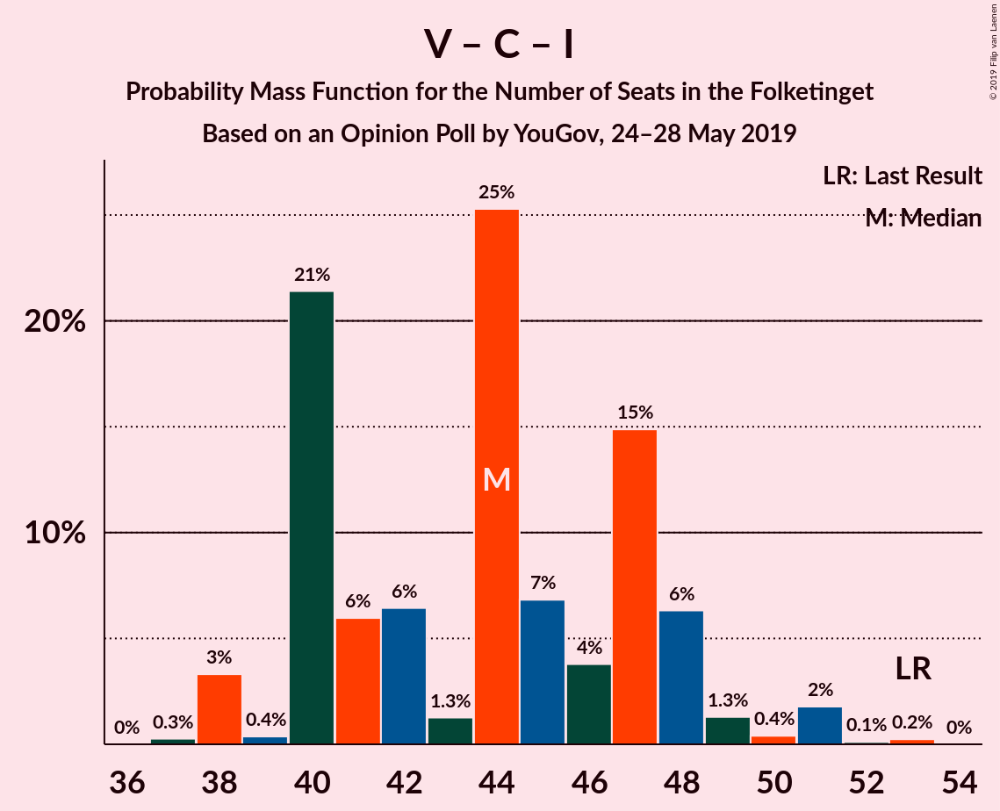

| Number of Seats | Probability | Accumulated | Special Marks |
|:---------------:|:-----------:|:-----------:|:-------------:|
| 37 | 0.3% | 100% |  |
| 38 | 3% | 99.7% |  |
| 39 | 0.4% | 96% |  |
| 40 | 21% | 96% |  |
| 41 | 6% | 75% |  |
| 42 | 6% | 69% |  |
| 43 | 1.3% | 62% |  |
| 44 | 25% | 61% | Median |
| 45 | 7% | 36% |  |
| 46 | 4% | 29% |  |
| 47 | 15% | 25% |  |
| 48 | 6% | 10% |  |
| 49 | 1.3% | 4% |  |
| 50 | 0.4% | 3% |  |
| 51 | 2% | 2% |  |
| 52 | 0.1% | 0.4% |  |
| 53 | 0.2% | 0.2% | Last Result |
| 54 | 0% | 0% |  |

### Venstre – Det Konservative Folkeparti

| Number of Seats | Probability | Accumulated | Special Marks |
|:---------------:|:-----------:|:-----------:|:-------------:|
| 33 | 0.3% | 100% |  |
| 34 | 0.2% | 99.7% |  |
| 35 | 1.2% | 99.5% |  |
| 36 | 10% | 98% |  |
| 37 | 2% | 88% |  |
| 38 | 7% | 86% |  |
| 39 | 11% | 79% |  |
| 40 | 35% | 68% | Last Result, Median |
| 41 | 7% | 33% |  |
| 42 | 2% | 26% |  |
| 43 | 20% | 24% |  |
| 44 | 3% | 5% |  |
| 45 | 2% | 2% |  |
| 46 | 0.1% | 0.6% |  |
| 47 | 0.4% | 0.5% |  |
| 48 | 0.1% | 0.1% |  |
| 49 | 0% | 0% |  |

### Venstre

| Number of Seats | Probability | Accumulated | Special Marks |
|:---------------:|:-----------:|:-----------:|:-------------:|
| 23 | 0.1% | 100% |  |
| 24 | 2% | 99.9% |  |
| 25 | 4% | 98% |  |
| 26 | 4% | 94% |  |
| 27 | 21% | 90% |  |
| 28 | 10% | 69% |  |
| 29 | 9% | 58% | Median |
| 30 | 25% | 50% |  |
| 31 | 2% | 25% |  |
| 32 | 22% | 23% |  |
| 33 | 0.3% | 1.1% |  |
| 34 | 0.7% | 0.9% | Last Result |
| 35 | 0% | 0.2% |  |
| 36 | 0.2% | 0.2% |  |
| 37 | 0% | 0% |  |

## Technical Information

### Opinion Poll

+ **Polling firm:** YouGov
+ **Commissioner(s):** —
+ **Fieldwork period:** 24–28 May 2019

### Calculations

+ **Sample size:** 978
+ **Simulations done:** 1,048,576
+ **Error estimate:** 3.08%

