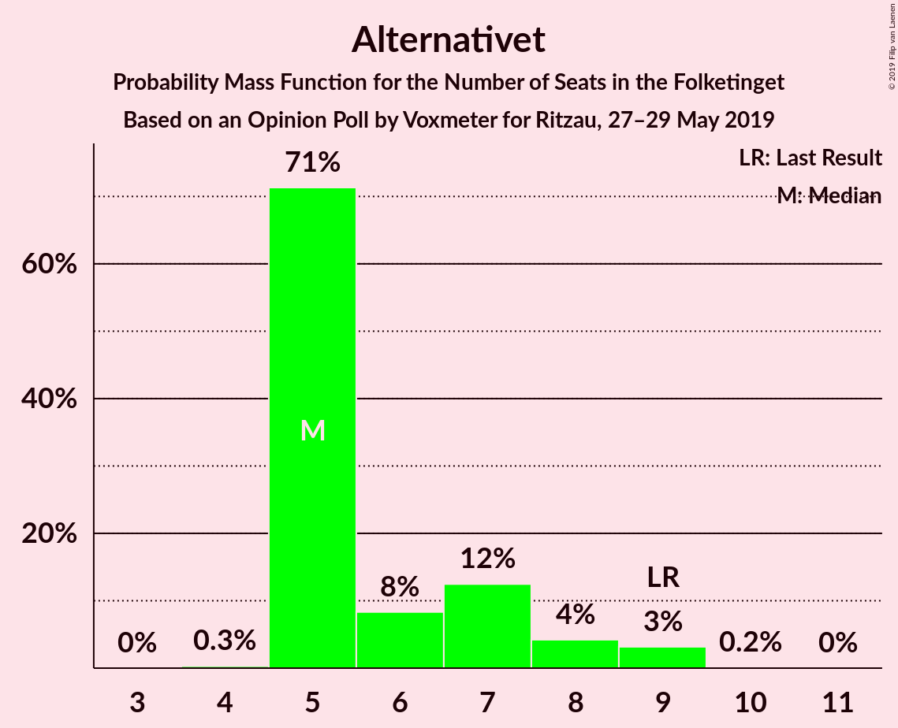

# Opinion Poll by Voxmeter for Ritzau, 27–29 May 2019

<a href="#voting-intentions">Voting Intentions</a> | <a href="#seats">Seats</a> | <a href="#coalitions">Coalitions</a> | <a href="#technical-information">Technical Information</a>

## Voting Intentions

### Confidence Intervals

| Party | Last Result | Poll Result | 80% Confidence Interval | 90% Confidence Interval | 95% Confidence Interval | 99% Confidence Interval |
|:-----:|:-----------:|:-----------:|:-----------------------:|:-----------------------:|:-----------------------:|:-----------------------:|
| Socialdemokraterne | 26.3% | 27.1% | 25.4–29.0% |24.9–29.5% |24.4–29.9% |23.6–30.8% |
| Venstre | 19.5% | 17.5% | 16.0–19.1% |15.6–19.6% |15.3–20.0% |14.6–20.8% |
| Dansk Folkeparti | 21.1% | 11.1% | 9.9–12.5% |9.6–12.8% |9.3–13.2% |8.7–13.9% |
| Radikale Venstre | 4.6% | 8.8% | 7.8–10.1% |7.5–10.4% |7.2–10.7% |6.7–11.3% |
| Enhedslisten–De Rød-Grønne | 7.8% | 8.4% | 7.4–9.6% |7.1–10.0% |6.8–10.3% |6.4–10.9% |
| Socialistisk Folkeparti | 4.2% | 8.0% | 7.0–9.2% |6.7–9.6% |6.5–9.9% |6.0–10.5% |
| Det Konservative Folkeparti | 3.4% | 5.6% | 4.8–6.7% |4.6–7.0% |4.4–7.2% |4.0–7.8% |
| Alternativet | 4.8% | 3.6% | 2.9–4.4% |2.7–4.7% |2.6–4.9% |2.3–5.3% |
| Liberal Alliance | 7.5% | 3.0% | 2.4–3.8% |2.2–4.0% |2.1–4.2% |1.8–4.6% |
| Stram Kurs | 0.0% | 2.4% | 1.9–3.1% |1.7–3.3% |1.6–3.5% |1.4–3.9% |
| Nye Borgerlige | 0.0% | 1.7% | 1.3–2.3% |1.1–2.5% |1.1–2.7% |0.9–3.0% |
| Kristendemokraterne | 0.8% | 1.6% | 1.2–2.2% |1.1–2.4% |1.0–2.6% |0.8–2.9% |
| Klaus Riskær Pedersen | 0.0% | 0.8% | 0.5–1.3% |0.5–1.4% |0.4–1.6% |0.3–1.8% |

*Note:* The poll result column reflects the actual value used in the calculations. Published results may vary slightly, and in addition be rounded to fewer digits.

## Seats

### Confidence Intervals

| Party | Last Result | Median | 80% Confidence Interval | 90% Confidence Interval | 95% Confidence Interval | 99% Confidence Interval |
|:-----:|:-----------:|:------:|:-----------------------:|:-----------------------:|:-----------------------:|:-----------------------:|
| <a href="#socialdemokraterne">Socialdemokraterne</a> | 47 | 50 | 48–50 |47–52 |45–53 |43–55 |
| <a href="#venstre">Venstre</a> | 34 | 29 | 29–33 |29–33 |28–35 |27–36 |
| <a href="#dansk-folkeparti">Dansk Folkeparti</a> | 37 | 21 | 19–21 |18–23 |17–23 |16–25 |
| <a href="#radikale-venstre">Radikale Venstre</a> | 8 | 17 | 14–17 |13–17 |13–18 |12–19 |
| <a href="#enhedslisten–de-rød-grønne">Enhedslisten–De Rød-Grønne</a> | 14 | 15 | 12–16 |12–17 |12–18 |12–20 |
| <a href="#socialistisk-folkeparti">Socialistisk Folkeparti</a> | 7 | 14 | 13–16 |12–18 |12–18 |11–18 |
| <a href="#det-konservative-folkeparti">Det Konservative Folkeparti</a> | 6 | 11 | 10–11 |9–12 |8–12 |8–13 |
| <a href="#alternativet">Alternativet</a> | 9 | 5 | 5–7 |5–8 |5–9 |5–9 |
| <a href="#liberal-alliance">Liberal Alliance</a> | 13 | 5 | 5–7 |5–7 |4–7 |0–8 |
| <a href="#stram-kurs">Stram Kurs</a> | 0 | 4 | 0–6 |0–7 |0–7 |0–8 |
| <a href="#nye-borgerlige">Nye Borgerlige</a> | 0 | 0 | 0–5 |0–5 |0–5 |0–6 |
| <a href="#kristendemokraterne">Kristendemokraterne</a> | 0 | 4 | 0–4 |0–4 |0–5 |0–5 |
| <a href="#klaus-riskær-pedersen">Klaus Riskær Pedersen</a> | 0 | 0 | 0 |0 |0 |0 |

### Socialdemokraterne

*For a full overview of the results for this party, see the [Socialdemokraterne](party-socialdemokraterne.html) page.*

| Number of Seats | Probability | Accumulated | Special Marks |
|:---------------:|:-----------:|:-----------:|:-------------:|
| 41 | 0.1% | 100% |  |
| 42 | 0.4% | 99.9% |  |
| 43 | 0.3% | 99.5% |  |
| 44 | 0.8% | 99.2% |  |
| 45 | 2% | 98% |  |
| 46 | 0.7% | 97% |  |
| 47 | 5% | 96% | Last Result |
| 48 | 16% | 91% |  |
| 49 | 10% | 74% |  |
| 50 | 54% | 64% | Median |
| 51 | 3% | 10% |  |
| 52 | 3% | 7% |  |
| 53 | 2% | 3% |  |
| 54 | 0.3% | 1.2% |  |
| 55 | 0.5% | 0.9% |  |
| 56 | 0.3% | 0.4% |  |
| 57 | 0% | 0% |  |

### Venstre

*For a full overview of the results for this party, see the [Venstre](party-venstre.html) page.*

| Number of Seats | Probability | Accumulated | Special Marks |
|:---------------:|:-----------:|:-----------:|:-------------:|
| 26 | 0.1% | 100% |  |
| 27 | 1.0% | 99.9% |  |
| 28 | 3% | 98.9% |  |
| 29 | 61% | 96% | Median |
| 30 | 10% | 35% |  |
| 31 | 2% | 25% |  |
| 32 | 10% | 23% |  |
| 33 | 9% | 13% |  |
| 34 | 1.4% | 4% | Last Result |
| 35 | 2% | 3% |  |
| 36 | 0.4% | 0.8% |  |
| 37 | 0.2% | 0.3% |  |
| 38 | 0.1% | 0.2% |  |
| 39 | 0% | 0% |  |

### Dansk Folkeparti

*For a full overview of the results for this party, see the [Dansk Folkeparti](party-danskfolkeparti.html) page.*

| Number of Seats | Probability | Accumulated | Special Marks |
|:---------------:|:-----------:|:-----------:|:-------------:|
| 15 | 0.2% | 100% |  |
| 16 | 0.8% | 99.8% |  |
| 17 | 2% | 98.9% |  |
| 18 | 3% | 97% |  |
| 19 | 10% | 94% |  |
| 20 | 13% | 84% |  |
| 21 | 62% | 71% | Median |
| 22 | 2% | 9% |  |
| 23 | 5% | 7% |  |
| 24 | 0.3% | 2% |  |
| 25 | 1.0% | 1.3% |  |
| 26 | 0.2% | 0.3% |  |
| 27 | 0.1% | 0.1% |  |
| 28 | 0% | 0% |  |
| 29 | 0% | 0% |  |
| 30 | 0% | 0% |  |
| 31 | 0% | 0% |  |
| 32 | 0% | 0% |  |
| 33 | 0% | 0% |  |
| 34 | 0% | 0% |  |
| 35 | 0% | 0% |  |
| 36 | 0% | 0% |  |
| 37 | 0% | 0% | Last Result |

### Radikale Venstre

*For a full overview of the results for this party, see the [Radikale Venstre](party-radikalevenstre.html) page.*

| Number of Seats | Probability | Accumulated | Special Marks |
|:---------------:|:-----------:|:-----------:|:-------------:|
| 8 | 0% | 100% | Last Result |
| 9 | 0% | 100% |  |
| 10 | 0% | 100% |  |
| 11 | 0.1% | 100% |  |
| 12 | 1.2% | 99.9% |  |
| 13 | 6% | 98.6% |  |
| 14 | 3% | 92% |  |
| 15 | 7% | 89% |  |
| 16 | 20% | 82% |  |
| 17 | 58% | 62% | Median |
| 18 | 2% | 5% |  |
| 19 | 2% | 2% |  |
| 20 | 0.4% | 0.5% |  |
| 21 | 0.1% | 0.1% |  |
| 22 | 0% | 0% |  |

### Enhedslisten–De Rød-Grønne

*For a full overview of the results for this party, see the [Enhedslisten–De Rød-Grønne](party-enhedslisten–derød-grønne.html) page.*

| Number of Seats | Probability | Accumulated | Special Marks |
|:---------------:|:-----------:|:-----------:|:-------------:|
| 11 | 0.3% | 100% |  |
| 12 | 10% | 99.7% |  |
| 13 | 8% | 89% |  |
| 14 | 3% | 82% | Last Result |
| 15 | 64% | 79% | Median |
| 16 | 7% | 16% |  |
| 17 | 4% | 9% |  |
| 18 | 3% | 5% |  |
| 19 | 1.0% | 2% |  |
| 20 | 0.9% | 1.0% |  |
| 21 | 0.1% | 0.1% |  |
| 22 | 0% | 0% |  |

### Socialistisk Folkeparti

*For a full overview of the results for this party, see the [Socialistisk Folkeparti](party-socialistiskfolkeparti.html) page.*

| Number of Seats | Probability | Accumulated | Special Marks |
|:---------------:|:-----------:|:-----------:|:-------------:|
| 7 | 0% | 100% | Last Result |
| 8 | 0% | 100% |  |
| 9 | 0% | 100% |  |
| 10 | 0.2% | 100% |  |
| 11 | 0.3% | 99.8% |  |
| 12 | 9% | 99.5% |  |
| 13 | 6% | 91% |  |
| 14 | 59% | 84% | Median |
| 15 | 12% | 25% |  |
| 16 | 3% | 13% |  |
| 17 | 0.9% | 10% |  |
| 18 | 9% | 9% |  |
| 19 | 0.1% | 0.2% |  |
| 20 | 0.1% | 0.1% |  |
| 21 | 0% | 0% |  |

### Det Konservative Folkeparti

*For a full overview of the results for this party, see the [Det Konservative Folkeparti](party-detkonservativefolkeparti.html) page.*

| Number of Seats | Probability | Accumulated | Special Marks |
|:---------------:|:-----------:|:-----------:|:-------------:|
| 6 | 0% | 100% | Last Result |
| 7 | 0.2% | 100% |  |
| 8 | 3% | 99.8% |  |
| 9 | 4% | 97% |  |
| 10 | 23% | 93% |  |
| 11 | 63% | 70% | Median |
| 12 | 5% | 7% |  |
| 13 | 2% | 2% |  |
| 14 | 0.1% | 0.2% |  |
| 15 | 0% | 0% |  |

### Alternativet

*For a full overview of the results for this party, see the [Alternativet](party-alternativet.html) page.*

| Number of Seats | Probability | Accumulated | Special Marks |
|:---------------:|:-----------:|:-----------:|:-------------:|
| 4 | 0.3% | 100% |  |
| 5 | 71% | 99.7% | Median |
| 6 | 8% | 28% |  |
| 7 | 12% | 20% |  |
| 8 | 4% | 8% |  |
| 9 | 3% | 3% | Last Result |
| 10 | 0.2% | 0.2% |  |
| 11 | 0% | 0% |  |

### Liberal Alliance

*For a full overview of the results for this party, see the [Liberal Alliance](party-liberalalliance.html) page.*

| Number of Seats | Probability | Accumulated | Special Marks |
|:---------------:|:-----------:|:-----------:|:-------------:|
| 0 | 0.6% | 100% |  |
| 1 | 0% | 99.4% |  |
| 2 | 0% | 99.4% |  |
| 3 | 0% | 99.4% |  |
| 4 | 3% | 99.4% |  |
| 5 | 64% | 97% | Median |
| 6 | 22% | 33% |  |
| 7 | 9% | 11% |  |
| 8 | 2% | 2% |  |
| 9 | 0% | 0% |  |
| 10 | 0% | 0% |  |
| 11 | 0% | 0% |  |
| 12 | 0% | 0% |  |
| 13 | 0% | 0% | Last Result |

### Stram Kurs

*For a full overview of the results for this party, see the [Stram Kurs](party-stramkurs.html) page.*

| Number of Seats | Probability | Accumulated | Special Marks |
|:---------------:|:-----------:|:-----------:|:-------------:|
| 0 | 11% | 100% | Last Result |
| 1 | 0% | 89% |  |
| 2 | 0% | 89% |  |
| 3 | 0% | 89% |  |
| 4 | 72% | 89% | Median |
| 5 | 7% | 18% |  |
| 6 | 3% | 10% |  |
| 7 | 6% | 8% |  |
| 8 | 1.4% | 1.4% |  |
| 9 | 0% | 0% |  |

### Nye Borgerlige

*For a full overview of the results for this party, see the [Nye Borgerlige](party-nyeborgerlige.html) page.*

| Number of Seats | Probability | Accumulated | Special Marks |
|:---------------:|:-----------:|:-----------:|:-------------:|
| 0 | 77% | 100% | Last Result, Median |
| 1 | 0% | 23% |  |
| 2 | 0% | 23% |  |
| 3 | 0% | 23% |  |
| 4 | 13% | 23% |  |
| 5 | 10% | 10% |  |
| 6 | 0.6% | 0.6% |  |
| 7 | 0% | 0% |  |

### Kristendemokraterne

*For a full overview of the results for this party, see the [Kristendemokraterne](party-kristendemokraterne.html) page.*

| Number of Seats | Probability | Accumulated | Special Marks |
|:---------------:|:-----------:|:-----------:|:-------------:|
| 0 | 30% | 100% | Last Result |
| 1 | 0% | 70% |  |
| 2 | 0% | 70% |  |
| 3 | 0% | 70% |  |
| 4 | 66% | 70% | Median |
| 5 | 4% | 4% |  |
| 6 | 0.1% | 0.1% |  |
| 7 | 0% | 0% |  |

### Klaus Riskær Pedersen

*For a full overview of the results for this party, see the [Klaus Riskær Pedersen](party-klausriskærpedersen.html) page.*

| Number of Seats | Probability | Accumulated | Special Marks |
|:---------------:|:-----------:|:-----------:|:-------------:|
| 0 | 99.8% | 100% | Last Result, Median |
| 1 | 0% | 0.2% |  |
| 2 | 0% | 0.2% |  |
| 3 | 0% | 0.2% |  |
| 4 | 0.2% | 0.2% |  |
| 5 | 0% | 0% |  |

## Coalitions

### Confidence Intervals

| Coalition | Last Result | Median | Majority? | 80% Confidence Interval | 90% Confidence Interval | 95% Confidence Interval | 99% Confidence Interval |
|:---------:|:-----------:|:------:|:---------:|:-----------------------:|:-----------------------:|:-----------------------:|:-----------------------:|
| Socialdemokraterne – Radikale Venstre – Enhedslisten–De Rød-Grønne – Socialistisk Folkeparti – Alternativet | 85 | 101 | 100% | 97–103 | 92–105 | 92–107 | 92–110 |
| Socialdemokraterne – Radikale Venstre – Enhedslisten–De Rød-Grønne – Socialistisk Folkeparti | 76 | 96 | 92% | 92–96 | 87–98 | 87–99 | 87–102 |
| Socialdemokraterne – Enhedslisten–De Rød-Grønne – Socialistisk Folkeparti – Alternativet | 77 | 84 | 4% | 82–88 | 79–89 | 79–90 | 79–92 |
| Socialdemokraterne – Enhedslisten–De Rød-Grønne – Socialistisk Folkeparti | 68 | 79 | 0% | 76–80 | 74–83 | 74–83 | 73–86 |
| Socialdemokraterne – Radikale Venstre – Socialistisk Folkeparti | 62 | 81 | 0% | 76–82 | 74–82 | 74–83 | 72–85 |
| Venstre – Dansk Folkeparti – Det Konservative Folkeparti – Liberal Alliance – Stram Kurs – Nye Borgerlige – Kristendemokraterne – Klaus Riskær Pedersen | 90 | 74 | 0% | 72–78 | 70–83 | 68–83 | 65–83 |
| Venstre – Dansk Folkeparti – Det Konservative Folkeparti – Liberal Alliance – Nye Borgerlige – Kristendemokraterne – Klaus Riskær Pedersen | 90 | 70 | 0% | 69–76 | 67–79 | 66–79 | 62–79 |
| Venstre – Dansk Folkeparti – Det Konservative Folkeparti – Liberal Alliance – Nye Borgerlige – Kristendemokraterne | 90 | 70 | 0% | 69–76 | 67–79 | 66–79 | 62–79 |
| Venstre – Dansk Folkeparti – Det Konservative Folkeparti – Liberal Alliance – Nye Borgerlige – Klaus Riskær Pedersen | 90 | 66 | 0% | 66–73 | 66–75 | 63–75 | 59–78 |
| Venstre – Dansk Folkeparti – Det Konservative Folkeparti – Liberal Alliance – Nye Borgerlige | 90 | 66 | 0% | 66–73 | 66–75 | 63–75 | 59–78 |
| Venstre – Dansk Folkeparti – Det Konservative Folkeparti – Liberal Alliance – Kristendemokraterne | 90 | 70 | 0% | 66–72 | 66–74 | 64–74 | 62–76 |
| Venstre – Dansk Folkeparti – Det Konservative Folkeparti – Liberal Alliance | 90 | 66 | 0% | 66–70 | 64–70 | 62–73 | 59–75 |
| Socialdemokraterne – Radikale Venstre | 55 | 67 | 0% | 62–67 | 62–68 | 61–69 | 58–70 |
| Venstre – Det Konservative Folkeparti – Liberal Alliance | 53 | 45 | 0% | 45–50 | 44–50 | 44–50 | 42–52 |
| Venstre – Det Konservative Folkeparti | 40 | 40 | 0% | 40–43 | 39–44 | 39–45 | 36–47 |
| Venstre | 34 | 29 | 0% | 29–33 | 29–33 | 28–35 | 27–36 |

### Socialdemokraterne – Radikale Venstre – Enhedslisten–De Rød-Grønne – Socialistisk Folkeparti – Alternativet

| Number of Seats | Probability | Accumulated | Special Marks |
|:---------------:|:-----------:|:-----------:|:-------------:|
| 85 | 0% | 100% | Last Result |
| 86 | 0% | 100% |  |
| 87 | 0% | 100% |  |
| 88 | 0% | 100% |  |
| 89 | 0% | 100% |  |
| 90 | 0% | 100% | Majority |
| 91 | 0% | 100% |  |
| 92 | 6% | 99.9% |  |
| 93 | 0.1% | 94% |  |
| 94 | 0.5% | 94% |  |
| 95 | 1.2% | 93% |  |
| 96 | 0.7% | 92% |  |
| 97 | 2% | 92% |  |
| 98 | 1.4% | 90% |  |
| 99 | 9% | 88% |  |
| 100 | 4% | 79% |  |
| 101 | 64% | 76% | Median |
| 102 | 1.4% | 12% |  |
| 103 | 0.7% | 10% |  |
| 104 | 4% | 10% |  |
| 105 | 1.3% | 6% |  |
| 106 | 1.3% | 4% |  |
| 107 | 2% | 3% |  |
| 108 | 0.7% | 1.4% |  |
| 109 | 0.1% | 0.7% |  |
| 110 | 0.1% | 0.5% |  |
| 111 | 0.4% | 0.4% |  |
| 112 | 0% | 0% |  |

### Socialdemokraterne – Radikale Venstre – Enhedslisten–De Rød-Grønne – Socialistisk Folkeparti

| Number of Seats | Probability | Accumulated | Special Marks |
|:---------------:|:-----------:|:-----------:|:-------------:|
| 76 | 0% | 100% | Last Result |
| 77 | 0% | 100% |  |
| 78 | 0% | 100% |  |
| 79 | 0% | 100% |  |
| 80 | 0% | 100% |  |
| 81 | 0% | 100% |  |
| 82 | 0% | 100% |  |
| 83 | 0% | 100% |  |
| 84 | 0.1% | 100% |  |
| 85 | 0% | 99.9% |  |
| 86 | 0.3% | 99.9% |  |
| 87 | 6% | 99.6% |  |
| 88 | 0.1% | 93% |  |
| 89 | 1.0% | 93% |  |
| 90 | 1.2% | 92% | Majority |
| 91 | 0.7% | 91% |  |
| 92 | 4% | 90% |  |
| 93 | 3% | 87% |  |
| 94 | 17% | 84% |  |
| 95 | 2% | 66% |  |
| 96 | 55% | 64% | Median |
| 97 | 0.4% | 9% |  |
| 98 | 4% | 8% |  |
| 99 | 2% | 4% |  |
| 100 | 1.1% | 2% |  |
| 101 | 0.5% | 1.1% |  |
| 102 | 0.2% | 0.6% |  |
| 103 | 0.3% | 0.4% |  |
| 104 | 0.1% | 0.1% |  |
| 105 | 0% | 0% |  |

### Socialdemokraterne – Enhedslisten–De Rød-Grønne – Socialistisk Folkeparti – Alternativet

| Number of Seats | Probability | Accumulated | Special Marks |
|:---------------:|:-----------:|:-----------:|:-------------:|
| 75 | 0% | 100% |  |
| 76 | 0% | 99.9% |  |
| 77 | 0.1% | 99.9% | Last Result |
| 78 | 0.1% | 99.8% |  |
| 79 | 7% | 99.6% |  |
| 80 | 0.6% | 92% |  |
| 81 | 2% | 92% |  |
| 82 | 3% | 90% |  |
| 83 | 8% | 87% |  |
| 84 | 55% | 78% | Median |
| 85 | 9% | 23% |  |
| 86 | 2% | 14% |  |
| 87 | 2% | 12% |  |
| 88 | 4% | 11% |  |
| 89 | 3% | 7% |  |
| 90 | 1.3% | 4% | Majority |
| 91 | 1.3% | 2% |  |
| 92 | 0.5% | 1.0% |  |
| 93 | 0.3% | 0.5% |  |
| 94 | 0% | 0.2% |  |
| 95 | 0% | 0.2% |  |
| 96 | 0% | 0.2% |  |
| 97 | 0.1% | 0.1% |  |
| 98 | 0% | 0% |  |

### Socialdemokraterne – Enhedslisten–De Rød-Grønne – Socialistisk Folkeparti

| Number of Seats | Probability | Accumulated | Special Marks |
|:---------------:|:-----------:|:-----------:|:-------------:|
| 68 | 0% | 100% | Last Result |
| 69 | 0.1% | 99.9% |  |
| 70 | 0.1% | 99.8% |  |
| 71 | 0% | 99.8% |  |
| 72 | 0.1% | 99.7% |  |
| 73 | 1.4% | 99.6% |  |
| 74 | 7% | 98% |  |
| 75 | 0.5% | 91% |  |
| 76 | 5% | 91% |  |
| 77 | 0.9% | 86% |  |
| 78 | 17% | 85% |  |
| 79 | 56% | 67% | Median |
| 80 | 2% | 11% |  |
| 81 | 3% | 10% |  |
| 82 | 1.3% | 7% |  |
| 83 | 4% | 6% |  |
| 84 | 0.4% | 2% |  |
| 85 | 0.6% | 1.3% |  |
| 86 | 0.4% | 0.6% |  |
| 87 | 0% | 0.2% |  |
| 88 | 0.1% | 0.2% |  |
| 89 | 0% | 0% |  |

### Socialdemokraterne – Radikale Venstre – Socialistisk Folkeparti

| Number of Seats | Probability | Accumulated | Special Marks |
|:---------------:|:-----------:|:-----------:|:-------------:|
| 62 | 0% | 100% | Last Result |
| 63 | 0% | 100% |  |
| 64 | 0% | 100% |  |
| 65 | 0% | 100% |  |
| 66 | 0% | 100% |  |
| 67 | 0% | 100% |  |
| 68 | 0% | 100% |  |
| 69 | 0% | 100% |  |
| 70 | 0% | 100% |  |
| 71 | 0.2% | 100% |  |
| 72 | 0.4% | 99.8% |  |
| 73 | 0.1% | 99.4% |  |
| 74 | 8% | 99.3% |  |
| 75 | 1.1% | 92% |  |
| 76 | 2% | 91% |  |
| 77 | 0.9% | 89% |  |
| 78 | 7% | 88% |  |
| 79 | 8% | 81% |  |
| 80 | 3% | 73% |  |
| 81 | 55% | 70% | Median |
| 82 | 12% | 15% |  |
| 83 | 1.2% | 3% |  |
| 84 | 1.2% | 2% |  |
| 85 | 0.7% | 1.0% |  |
| 86 | 0.1% | 0.4% |  |
| 87 | 0.3% | 0.3% |  |
| 88 | 0% | 0% |  |

### Venstre – Dansk Folkeparti – Det Konservative Folkeparti – Liberal Alliance – Stram Kurs – Nye Borgerlige – Kristendemokraterne – Klaus Riskær Pedersen

| Number of Seats | Probability | Accumulated | Special Marks |
|:---------------:|:-----------:|:-----------:|:-------------:|
| 64 | 0.4% | 100% |  |
| 65 | 0.1% | 99.6% |  |
| 66 | 0.1% | 99.5% |  |
| 67 | 0.7% | 99.3% |  |
| 68 | 2% | 98.6% |  |
| 69 | 1.3% | 97% |  |
| 70 | 1.3% | 96% |  |
| 71 | 4% | 94% |  |
| 72 | 0.7% | 90% |  |
| 73 | 1.4% | 90% |  |
| 74 | 64% | 88% | Median |
| 75 | 4% | 24% |  |
| 76 | 9% | 21% |  |
| 77 | 1.4% | 12% |  |
| 78 | 2% | 10% |  |
| 79 | 0.7% | 8% |  |
| 80 | 1.2% | 8% |  |
| 81 | 0.5% | 7% |  |
| 82 | 0.1% | 6% |  |
| 83 | 6% | 6% |  |
| 84 | 0% | 0.1% |  |
| 85 | 0% | 0% |  |
| 86 | 0% | 0% |  |
| 87 | 0% | 0% |  |
| 88 | 0% | 0% |  |
| 89 | 0% | 0% |  |
| 90 | 0% | 0% | Last Result, Majority |

### Venstre – Dansk Folkeparti – Det Konservative Folkeparti – Liberal Alliance – Nye Borgerlige – Kristendemokraterne – Klaus Riskær Pedersen

| Number of Seats | Probability | Accumulated | Special Marks |
|:---------------:|:-----------:|:-----------:|:-------------:|
| 59 | 0.4% | 100% |  |
| 60 | 0% | 99.6% |  |
| 61 | 0% | 99.6% |  |
| 62 | 0.1% | 99.6% |  |
| 63 | 0.2% | 99.5% |  |
| 64 | 1.0% | 99.3% |  |
| 65 | 0.5% | 98% |  |
| 66 | 3% | 98% |  |
| 67 | 2% | 95% |  |
| 68 | 2% | 93% |  |
| 69 | 8% | 92% |  |
| 70 | 65% | 83% | Median |
| 71 | 4% | 18% |  |
| 72 | 0.9% | 14% |  |
| 73 | 0.8% | 13% |  |
| 74 | 0.7% | 13% |  |
| 75 | 1.2% | 12% |  |
| 76 | 3% | 11% |  |
| 77 | 0.2% | 8% |  |
| 78 | 2% | 8% |  |
| 79 | 6% | 6% |  |
| 80 | 0.1% | 0.1% |  |
| 81 | 0% | 0% |  |
| 82 | 0% | 0% |  |
| 83 | 0% | 0% |  |
| 84 | 0% | 0% |  |
| 85 | 0% | 0% |  |
| 86 | 0% | 0% |  |
| 87 | 0% | 0% |  |
| 88 | 0% | 0% |  |
| 89 | 0% | 0% |  |
| 90 | 0% | 0% | Last Result, Majority |

### Venstre – Dansk Folkeparti – Det Konservative Folkeparti – Liberal Alliance – Nye Borgerlige – Kristendemokraterne

| Number of Seats | Probability | Accumulated | Special Marks |
|:---------------:|:-----------:|:-----------:|:-------------:|
| 59 | 0.4% | 100% |  |
| 60 | 0% | 99.6% |  |
| 61 | 0% | 99.6% |  |
| 62 | 0.1% | 99.6% |  |
| 63 | 0.2% | 99.5% |  |
| 64 | 1.0% | 99.3% |  |
| 65 | 0.5% | 98% |  |
| 66 | 3% | 98% |  |
| 67 | 2% | 95% |  |
| 68 | 2% | 93% |  |
| 69 | 8% | 91% |  |
| 70 | 65% | 83% | Median |
| 71 | 4% | 18% |  |
| 72 | 0.9% | 14% |  |
| 73 | 0.7% | 13% |  |
| 74 | 0.7% | 12% |  |
| 75 | 1.1% | 12% |  |
| 76 | 3% | 11% |  |
| 77 | 0.2% | 8% |  |
| 78 | 2% | 8% |  |
| 79 | 6% | 6% |  |
| 80 | 0% | 0% |  |
| 81 | 0% | 0% |  |
| 82 | 0% | 0% |  |
| 83 | 0% | 0% |  |
| 84 | 0% | 0% |  |
| 85 | 0% | 0% |  |
| 86 | 0% | 0% |  |
| 87 | 0% | 0% |  |
| 88 | 0% | 0% |  |
| 89 | 0% | 0% |  |
| 90 | 0% | 0% | Last Result, Majority |

### Venstre – Dansk Folkeparti – Det Konservative Folkeparti – Liberal Alliance – Nye Borgerlige – Klaus Riskær Pedersen

| Number of Seats | Probability | Accumulated | Special Marks |
|:---------------:|:-----------:|:-----------:|:-------------:|
| 58 | 0.1% | 100% |  |
| 59 | 0.4% | 99.9% |  |
| 60 | 0.1% | 99.5% |  |
| 61 | 0% | 99.4% |  |
| 62 | 2% | 99.4% |  |
| 63 | 0.2% | 98% |  |
| 64 | 1.3% | 97% |  |
| 65 | 0.7% | 96% |  |
| 66 | 59% | 95% | Median |
| 67 | 2% | 37% |  |
| 68 | 2% | 35% |  |
| 69 | 8% | 33% |  |
| 70 | 10% | 25% |  |
| 71 | 2% | 14% |  |
| 72 | 2% | 13% |  |
| 73 | 0.7% | 10% |  |
| 74 | 0.6% | 10% |  |
| 75 | 7% | 9% |  |
| 76 | 0.7% | 2% |  |
| 77 | 0.1% | 2% |  |
| 78 | 1.4% | 1.4% |  |
| 79 | 0% | 0% |  |
| 80 | 0% | 0% |  |
| 81 | 0% | 0% |  |
| 82 | 0% | 0% |  |
| 83 | 0% | 0% |  |
| 84 | 0% | 0% |  |
| 85 | 0% | 0% |  |
| 86 | 0% | 0% |  |
| 87 | 0% | 0% |  |
| 88 | 0% | 0% |  |
| 89 | 0% | 0% |  |
| 90 | 0% | 0% | Last Result, Majority |

### Venstre – Dansk Folkeparti – Det Konservative Folkeparti – Liberal Alliance – Nye Borgerlige

| Number of Seats | Probability | Accumulated | Special Marks |
|:---------------:|:-----------:|:-----------:|:-------------:|
| 58 | 0.1% | 100% |  |
| 59 | 0.4% | 99.9% |  |
| 60 | 0.1% | 99.5% |  |
| 61 | 0% | 99.4% |  |
| 62 | 2% | 99.4% |  |
| 63 | 0.2% | 98% |  |
| 64 | 1.3% | 97% |  |
| 65 | 0.7% | 96% |  |
| 66 | 59% | 95% | Median |
| 67 | 2% | 37% |  |
| 68 | 2% | 35% |  |
| 69 | 8% | 33% |  |
| 70 | 10% | 25% |  |
| 71 | 1.5% | 14% |  |
| 72 | 2% | 13% |  |
| 73 | 0.6% | 10% |  |
| 74 | 0.6% | 10% |  |
| 75 | 7% | 9% |  |
| 76 | 0.7% | 2% |  |
| 77 | 0.1% | 2% |  |
| 78 | 1.4% | 1.4% |  |
| 79 | 0% | 0% |  |
| 80 | 0% | 0% |  |
| 81 | 0% | 0% |  |
| 82 | 0% | 0% |  |
| 83 | 0% | 0% |  |
| 84 | 0% | 0% |  |
| 85 | 0% | 0% |  |
| 86 | 0% | 0% |  |
| 87 | 0% | 0% |  |
| 88 | 0% | 0% |  |
| 89 | 0% | 0% |  |
| 90 | 0% | 0% | Last Result, Majority |

### Venstre – Dansk Folkeparti – Det Konservative Folkeparti – Liberal Alliance – Kristendemokraterne

| Number of Seats | Probability | Accumulated | Special Marks |
|:---------------:|:-----------:|:-----------:|:-------------:|
| 59 | 0.4% | 100% |  |
| 60 | 0% | 99.6% |  |
| 61 | 0.1% | 99.6% |  |
| 62 | 0.2% | 99.5% |  |
| 63 | 0.5% | 99.3% |  |
| 64 | 3% | 98.9% |  |
| 65 | 0.5% | 96% |  |
| 66 | 12% | 96% |  |
| 67 | 3% | 84% |  |
| 68 | 2% | 81% |  |
| 69 | 8% | 80% |  |
| 70 | 57% | 72% | Median |
| 71 | 3% | 15% |  |
| 72 | 3% | 12% |  |
| 73 | 2% | 10% |  |
| 74 | 6% | 8% |  |
| 75 | 0.8% | 2% |  |
| 76 | 0.8% | 1.1% |  |
| 77 | 0.1% | 0.3% |  |
| 78 | 0.1% | 0.2% |  |
| 79 | 0% | 0% |  |
| 80 | 0% | 0% |  |
| 81 | 0% | 0% |  |
| 82 | 0% | 0% |  |
| 83 | 0% | 0% |  |
| 84 | 0% | 0% |  |
| 85 | 0% | 0% |  |
| 86 | 0% | 0% |  |
| 87 | 0% | 0% |  |
| 88 | 0% | 0% |  |
| 89 | 0% | 0% |  |
| 90 | 0% | 0% | Last Result, Majority |

### Venstre – Dansk Folkeparti – Det Konservative Folkeparti – Liberal Alliance

| Number of Seats | Probability | Accumulated | Special Marks |
|:---------------:|:-----------:|:-----------:|:-------------:|
| 58 | 0.2% | 100% |  |
| 59 | 0.4% | 99.8% |  |
| 60 | 0.2% | 99.4% |  |
| 61 | 0.1% | 99.2% |  |
| 62 | 2% | 99.1% |  |
| 63 | 0.7% | 97% |  |
| 64 | 3% | 96% |  |
| 65 | 0.8% | 94% |  |
| 66 | 68% | 93% | Median |
| 67 | 2% | 25% |  |
| 68 | 3% | 23% |  |
| 69 | 7% | 20% |  |
| 70 | 8% | 12% |  |
| 71 | 0.6% | 4% |  |
| 72 | 0.7% | 4% |  |
| 73 | 2% | 3% |  |
| 74 | 0.2% | 1.4% |  |
| 75 | 0.8% | 1.2% |  |
| 76 | 0.4% | 0.4% |  |
| 77 | 0% | 0% |  |
| 78 | 0% | 0% |  |
| 79 | 0% | 0% |  |
| 80 | 0% | 0% |  |
| 81 | 0% | 0% |  |
| 82 | 0% | 0% |  |
| 83 | 0% | 0% |  |
| 84 | 0% | 0% |  |
| 85 | 0% | 0% |  |
| 86 | 0% | 0% |  |
| 87 | 0% | 0% |  |
| 88 | 0% | 0% |  |
| 89 | 0% | 0% |  |
| 90 | 0% | 0% | Last Result, Majority |

### Socialdemokraterne – Radikale Venstre

| Number of Seats | Probability | Accumulated | Special Marks |
|:---------------:|:-----------:|:-----------:|:-------------:|
| 55 | 0% | 100% | Last Result |
| 56 | 0.1% | 100% |  |
| 57 | 0.4% | 99.9% |  |
| 58 | 0.1% | 99.6% |  |
| 59 | 0.6% | 99.5% |  |
| 60 | 0.9% | 98.9% |  |
| 61 | 2% | 98% |  |
| 62 | 8% | 96% |  |
| 63 | 2% | 88% |  |
| 64 | 19% | 86% |  |
| 65 | 4% | 67% |  |
| 66 | 0.7% | 64% |  |
| 67 | 57% | 63% | Median |
| 68 | 2% | 6% |  |
| 69 | 1.2% | 3% |  |
| 70 | 2% | 2% |  |
| 71 | 0.2% | 0.5% |  |
| 72 | 0.1% | 0.3% |  |
| 73 | 0.1% | 0.2% |  |
| 74 | 0.1% | 0.1% |  |
| 75 | 0% | 0% |  |

### Venstre – Det Konservative Folkeparti – Liberal Alliance

| Number of Seats | Probability | Accumulated | Special Marks |
|:---------------:|:-----------:|:-----------:|:-------------:|
| 39 | 0.1% | 100% |  |
| 40 | 0% | 99.8% |  |
| 41 | 0.3% | 99.8% |  |
| 42 | 0.4% | 99.5% |  |
| 43 | 0.9% | 99.1% |  |
| 44 | 4% | 98% |  |
| 45 | 57% | 94% | Median |
| 46 | 11% | 37% |  |
| 47 | 4% | 26% |  |
| 48 | 2% | 22% |  |
| 49 | 8% | 19% |  |
| 50 | 9% | 11% |  |
| 51 | 0.7% | 2% |  |
| 52 | 0.7% | 1.1% |  |
| 53 | 0.4% | 0.5% | Last Result |
| 54 | 0% | 0.1% |  |
| 55 | 0% | 0% |  |

### Venstre – Det Konservative Folkeparti

| Number of Seats | Probability | Accumulated | Special Marks |
|:---------------:|:-----------:|:-----------:|:-------------:|
| 35 | 0.3% | 100% |  |
| 36 | 0.3% | 99.7% |  |
| 37 | 0.6% | 99.3% |  |
| 38 | 0.6% | 98.8% |  |
| 39 | 8% | 98% |  |
| 40 | 64% | 91% | Last Result, Median |
| 41 | 5% | 27% |  |
| 42 | 2% | 22% |  |
| 43 | 13% | 20% |  |
| 44 | 3% | 7% |  |
| 45 | 3% | 4% |  |
| 46 | 0.8% | 1.3% |  |
| 47 | 0.4% | 0.6% |  |
| 48 | 0.1% | 0.2% |  |
| 49 | 0% | 0.1% |  |
| 50 | 0% | 0% |  |

### Venstre

| Number of Seats | Probability | Accumulated | Special Marks |
|:---------------:|:-----------:|:-----------:|:-------------:|
| 26 | 0.1% | 100% |  |
| 27 | 1.0% | 99.9% |  |
| 28 | 3% | 98.9% |  |
| 29 | 61% | 96% | Median |
| 30 | 10% | 35% |  |
| 31 | 2% | 25% |  |
| 32 | 10% | 23% |  |
| 33 | 9% | 13% |  |
| 34 | 1.4% | 4% | Last Result |
| 35 | 2% | 3% |  |
| 36 | 0.4% | 0.8% |  |
| 37 | 0.2% | 0.3% |  |
| 38 | 0.1% | 0.2% |  |
| 39 | 0% | 0% |  |

## Technical Information

### Opinion Poll

+ **Polling firm:** Voxmeter
+ **Commissioner(s):** Ritzau
+ **Fieldwork period:** 27–29 May 2019

### Calculations

+ **Sample size:** 1011
+ **Simulations done:** 1,048,576
+ **Error estimate:** 2.26%

