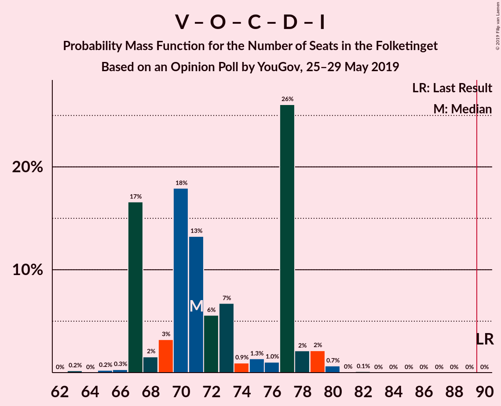

# Opinion Poll by YouGov, 25–29 May 2019

<a href="#voting-intentions">Voting Intentions</a> | <a href="#seats">Seats</a> | <a href="#coalitions">Coalitions</a> | <a href="#technical-information">Technical Information</a>

## Voting Intentions

### Confidence Intervals

| Party | Last Result | Poll Result | 80% Confidence Interval | 90% Confidence Interval | 95% Confidence Interval | 99% Confidence Interval |
|:-----:|:-----------:|:-----------:|:-----------------------:|:-----------------------:|:-----------------------:|:-----------------------:|
| Socialdemokraterne | 26.3% | 26.2% | 24.4–28.1% |24.0–28.6% |23.5–29.1% |22.7–29.9% |
| Venstre | 19.5% | 17.2% | 15.8–18.9% |15.3–19.3% |15.0–19.7% |14.3–20.5% |
| Dansk Folkeparti | 21.1% | 11.3% | 10.1–12.7% |9.8–13.1% |9.5–13.5% |8.9–14.2% |
| Socialistisk Folkeparti | 4.2% | 9.0% | 7.9–10.3% |7.6–10.6% |7.3–10.9% |6.8–11.6% |
| Enhedslisten–De Rød-Grønne | 7.8% | 8.7% | 7.6–9.9% |7.3–10.3% |7.1–10.6% |6.6–11.2% |
| Radikale Venstre | 4.6% | 8.0% | 6.9–9.2% |6.7–9.5% |6.4–9.8% |6.0–10.4% |
| Det Konservative Folkeparti | 3.4% | 5.7% | 4.9–6.8% |4.6–7.1% |4.4–7.3% |4.0–7.9% |
| Nye Borgerlige | 0.0% | 4.3% | 3.6–5.2% |3.4–5.5% |3.2–5.7% |2.9–6.2% |
| Alternativet | 4.8% | 3.3% | 2.6–4.1% |2.5–4.4% |2.3–4.6% |2.0–5.0% |
| Liberal Alliance | 7.5% | 2.5% | 2.0–3.3% |1.9–3.6% |1.7–3.7% |1.5–4.1% |
| Stram Kurs | 0.0% | 2.3% | 1.8–3.1% |1.7–3.3% |1.6–3.5% |1.4–3.9% |
| Kristendemokraterne | 0.8% | 0.7% | 0.5–1.2% |0.4–1.3% |0.4–1.5% |0.3–1.7% |
| Klaus Riskær Pedersen | 0.0% | 0.6% | 0.4–1.1% |0.3–1.2% |0.3–1.3% |0.2–1.6% |

*Note:* The poll result column reflects the actual value used in the calculations. Published results may vary slightly, and in addition be rounded to fewer digits.

## Seats

### Confidence Intervals

| Party | Last Result | Median | 80% Confidence Interval | 90% Confidence Interval | 95% Confidence Interval | 99% Confidence Interval |
|:-----:|:-----------:|:------:|:-----------------------:|:-----------------------:|:-----------------------:|:-----------------------:|
| <a href="#socialdemokraterne">Socialdemokraterne</a> | 47 | 46 | 43–49 |43–50 |42–50 |41–52 |
| <a href="#venstre">Venstre</a> | 34 | 29 | 27–33 |27–33 |27–34 |25–37 |
| <a href="#dansk-folkeparti">Dansk Folkeparti</a> | 37 | 20 | 18–21 |18–23 |18–23 |17–25 |
| <a href="#socialistisk-folkeparti">Socialistisk Folkeparti</a> | 7 | 16 | 14–17 |14–18 |13–18 |12–19 |
| <a href="#enhedslisten–de-rød-grønne">Enhedslisten–De Rød-Grønne</a> | 14 | 16 | 14–21 |13–21 |13–21 |12–21 |
| <a href="#radikale-venstre">Radikale Venstre</a> | 8 | 13 | 13–14 |12–16 |12–17 |10–18 |
| <a href="#det-konservative-folkeparti">Det Konservative Folkeparti</a> | 6 | 10 | 9–11 |8–12 |7–14 |7–14 |
| <a href="#nye-borgerlige">Nye Borgerlige</a> | 0 | 8 | 6–10 |6–10 |6–10 |5–11 |
| <a href="#alternativet">Alternativet</a> | 9 | 7 | 6–8 |5–8 |5–8 |4–9 |
| <a href="#liberal-alliance">Liberal Alliance</a> | 13 | 6 | 0–7 |0–7 |0–7 |0–7 |
| <a href="#stram-kurs">Stram Kurs</a> | 0 | 5 | 4–5 |0–6 |0–6 |0–7 |
| <a href="#kristendemokraterne">Kristendemokraterne</a> | 0 | 0 | 0 |0 |0 |0 |
| <a href="#klaus-riskær-pedersen">Klaus Riskær Pedersen</a> | 0 | 0 | 0 |0 |0 |0 |

### Socialdemokraterne

*For a full overview of the results for this party, see the [Socialdemokraterne](party-socialdemokraterne.html) page.*

| Number of Seats | Probability | Accumulated | Special Marks |
|:---------------:|:-----------:|:-----------:|:-------------:|
| 39 | 0.2% | 100% |  |
| 40 | 0.2% | 99.7% |  |
| 41 | 1.1% | 99.5% |  |
| 42 | 2% | 98% |  |
| 43 | 26% | 96% |  |
| 44 | 15% | 70% |  |
| 45 | 3% | 55% |  |
| 46 | 7% | 52% | Median |
| 47 | 3% | 45% | Last Result |
| 48 | 18% | 42% |  |
| 49 | 18% | 24% |  |
| 50 | 4% | 6% |  |
| 51 | 0.3% | 2% |  |
| 52 | 0.9% | 1.4% |  |
| 53 | 0.3% | 0.5% |  |
| 54 | 0.1% | 0.1% |  |
| 55 | 0% | 0% |  |

### Venstre

*For a full overview of the results for this party, see the [Venstre](party-venstre.html) page.*

| Number of Seats | Probability | Accumulated | Special Marks |
|:---------------:|:-----------:|:-----------:|:-------------:|
| 23 | 0.3% | 100% |  |
| 24 | 0% | 99.7% |  |
| 25 | 0.4% | 99.6% |  |
| 26 | 1.5% | 99.2% |  |
| 27 | 12% | 98% |  |
| 28 | 20% | 86% |  |
| 29 | 27% | 66% | Median |
| 30 | 8% | 39% |  |
| 31 | 3% | 31% |  |
| 32 | 5% | 27% |  |
| 33 | 19% | 22% |  |
| 34 | 0.9% | 3% | Last Result |
| 35 | 0.3% | 2% |  |
| 36 | 0% | 2% |  |
| 37 | 2% | 2% |  |
| 38 | 0% | 0.1% |  |
| 39 | 0.1% | 0.1% |  |
| 40 | 0% | 0% |  |

### Dansk Folkeparti

*For a full overview of the results for this party, see the [Dansk Folkeparti](party-danskfolkeparti.html) page.*

| Number of Seats | Probability | Accumulated | Special Marks |
|:---------------:|:-----------:|:-----------:|:-------------:|
| 15 | 0.1% | 100% |  |
| 16 | 0.2% | 99.9% |  |
| 17 | 2% | 99.7% |  |
| 18 | 22% | 98% |  |
| 19 | 3% | 76% |  |
| 20 | 26% | 73% | Median |
| 21 | 38% | 47% |  |
| 22 | 2% | 9% |  |
| 23 | 6% | 7% |  |
| 24 | 0.8% | 1.5% |  |
| 25 | 0.4% | 0.7% |  |
| 26 | 0.2% | 0.3% |  |
| 27 | 0.1% | 0.1% |  |
| 28 | 0% | 0% |  |
| 29 | 0% | 0% |  |
| 30 | 0% | 0% |  |
| 31 | 0% | 0% |  |
| 32 | 0% | 0% |  |
| 33 | 0% | 0% |  |
| 34 | 0% | 0% |  |
| 35 | 0% | 0% |  |
| 36 | 0% | 0% |  |
| 37 | 0% | 0% | Last Result |

### Socialistisk Folkeparti

*For a full overview of the results for this party, see the [Socialistisk Folkeparti](party-socialistiskfolkeparti.html) page.*

| Number of Seats | Probability | Accumulated | Special Marks |
|:---------------:|:-----------:|:-----------:|:-------------:|
| 7 | 0% | 100% | Last Result |
| 8 | 0% | 100% |  |
| 9 | 0% | 100% |  |
| 10 | 0% | 100% |  |
| 11 | 0.1% | 100% |  |
| 12 | 0.4% | 99.9% |  |
| 13 | 2% | 99.5% |  |
| 14 | 12% | 97% |  |
| 15 | 4% | 85% |  |
| 16 | 50% | 81% | Median |
| 17 | 24% | 31% |  |
| 18 | 6% | 7% |  |
| 19 | 0.2% | 0.5% |  |
| 20 | 0.2% | 0.3% |  |
| 21 | 0% | 0.1% |  |
| 22 | 0.1% | 0.1% |  |
| 23 | 0% | 0% |  |

### Enhedslisten–De Rød-Grønne

*For a full overview of the results for this party, see the [Enhedslisten–De Rød-Grønne](party-enhedslisten–derød-grønne.html) page.*

| Number of Seats | Probability | Accumulated | Special Marks |
|:---------------:|:-----------:|:-----------:|:-------------:|
| 11 | 0.3% | 100% |  |
| 12 | 1.3% | 99.7% |  |
| 13 | 4% | 98% |  |
| 14 | 28% | 95% | Last Result |
| 15 | 6% | 66% |  |
| 16 | 26% | 60% | Median |
| 17 | 18% | 34% |  |
| 18 | 4% | 16% |  |
| 19 | 0.6% | 13% |  |
| 20 | 0.4% | 12% |  |
| 21 | 11% | 11% |  |
| 22 | 0% | 0% |  |

### Radikale Venstre

*For a full overview of the results for this party, see the [Radikale Venstre](party-radikalevenstre.html) page.*

| Number of Seats | Probability | Accumulated | Special Marks |
|:---------------:|:-----------:|:-----------:|:-------------:|
| 8 | 0% | 100% | Last Result |
| 9 | 0.1% | 100% |  |
| 10 | 0.5% | 99.9% |  |
| 11 | 0.9% | 99.4% |  |
| 12 | 8% | 98.6% |  |
| 13 | 65% | 91% | Median |
| 14 | 16% | 25% |  |
| 15 | 2% | 9% |  |
| 16 | 3% | 7% |  |
| 17 | 3% | 4% |  |
| 18 | 0.9% | 1.1% |  |
| 19 | 0% | 0.3% |  |
| 20 | 0.1% | 0.2% |  |
| 21 | 0.2% | 0.2% |  |
| 22 | 0% | 0% |  |

### Det Konservative Folkeparti

*For a full overview of the results for this party, see the [Det Konservative Folkeparti](party-detkonservativefolkeparti.html) page.*

| Number of Seats | Probability | Accumulated | Special Marks |
|:---------------:|:-----------:|:-----------:|:-------------:|
| 6 | 0% | 100% | Last Result |
| 7 | 3% | 100% |  |
| 8 | 4% | 97% |  |
| 9 | 38% | 93% |  |
| 10 | 16% | 55% | Median |
| 11 | 30% | 39% |  |
| 12 | 4% | 9% |  |
| 13 | 2% | 4% |  |
| 14 | 3% | 3% |  |
| 15 | 0% | 0% |  |

### Nye Borgerlige

*For a full overview of the results for this party, see the [Nye Borgerlige](party-nyeborgerlige.html) page.*

| Number of Seats | Probability | Accumulated | Special Marks |
|:---------------:|:-----------:|:-----------:|:-------------:|
| 0 | 0% | 100% | Last Result |
| 1 | 0% | 100% |  |
| 2 | 0% | 100% |  |
| 3 | 0% | 100% |  |
| 4 | 0% | 100% |  |
| 5 | 1.4% | 100% |  |
| 6 | 20% | 98.6% |  |
| 7 | 27% | 78% |  |
| 8 | 17% | 51% | Median |
| 9 | 6% | 34% |  |
| 10 | 27% | 28% |  |
| 11 | 0.9% | 1.0% |  |
| 12 | 0.1% | 0.1% |  |
| 13 | 0% | 0% |  |

### Alternativet

*For a full overview of the results for this party, see the [Alternativet](party-alternativet.html) page.*

| Number of Seats | Probability | Accumulated | Special Marks |
|:---------------:|:-----------:|:-----------:|:-------------:|
| 0 | 0.4% | 100% |  |
| 1 | 0% | 99.6% |  |
| 2 | 0% | 99.6% |  |
| 3 | 0% | 99.6% |  |
| 4 | 2% | 99.6% |  |
| 5 | 5% | 98% |  |
| 6 | 41% | 93% |  |
| 7 | 32% | 52% | Median |
| 8 | 19% | 19% |  |
| 9 | 0.8% | 0.8% | Last Result |
| 10 | 0% | 0% |  |

### Liberal Alliance

*For a full overview of the results for this party, see the [Liberal Alliance](party-liberalalliance.html) page.*

| Number of Seats | Probability | Accumulated | Special Marks |
|:---------------:|:-----------:|:-----------:|:-------------:|
| 0 | 22% | 100% |  |
| 1 | 0% | 78% |  |
| 2 | 0% | 78% |  |
| 3 | 0% | 78% |  |
| 4 | 11% | 78% |  |
| 5 | 18% | 68% |  |
| 6 | 32% | 50% | Median |
| 7 | 17% | 18% |  |
| 8 | 0.2% | 0.2% |  |
| 9 | 0% | 0% |  |
| 10 | 0% | 0% |  |
| 11 | 0% | 0% |  |
| 12 | 0% | 0% |  |
| 13 | 0% | 0% | Last Result |

### Stram Kurs

*For a full overview of the results for this party, see the [Stram Kurs](party-stramkurs.html) page.*

| Number of Seats | Probability | Accumulated | Special Marks |
|:---------------:|:-----------:|:-----------:|:-------------:|
| 0 | 5% | 100% | Last Result |
| 1 | 0% | 95% |  |
| 2 | 0% | 95% |  |
| 3 | 0% | 95% |  |
| 4 | 8% | 95% |  |
| 5 | 79% | 87% | Median |
| 6 | 7% | 8% |  |
| 7 | 0.7% | 0.8% |  |
| 8 | 0.2% | 0.2% |  |
| 9 | 0% | 0% |  |

### Kristendemokraterne

*For a full overview of the results for this party, see the [Kristendemokraterne](party-kristendemokraterne.html) page.*

| Number of Seats | Probability | Accumulated | Special Marks |
|:---------------:|:-----------:|:-----------:|:-------------:|
| 0 | 99.9% | 100% | Last Result, Median |
| 1 | 0% | 0.1% |  |
| 2 | 0% | 0.1% |  |
| 3 | 0% | 0.1% |  |
| 4 | 0.1% | 0.1% |  |
| 5 | 0% | 0% |  |

### Klaus Riskær Pedersen

*For a full overview of the results for this party, see the [Klaus Riskær Pedersen](party-klausriskærpedersen.html) page.*

| Number of Seats | Probability | Accumulated | Special Marks |
|:---------------:|:-----------:|:-----------:|:-------------:|
| 0 | 100% | 100% | Last Result, Median |

## Coalitions

### Confidence Intervals

| Coalition | Last Result | Median | Majority? | 80% Confidence Interval | 90% Confidence Interval | 95% Confidence Interval | 99% Confidence Interval |
|:---------:|:-----------:|:------:|:---------:|:-----------------------:|:-----------------------:|:-----------------------:|:-----------------------:|
| Socialdemokraterne – Socialistisk Folkeparti – Enhedslisten–De Rød-Grønne – Radikale Venstre – Alternativet | 85 | 99 | 100% | 93–103 | 93–103 | 92–103 | 91–106 |
| Socialdemokraterne – Socialistisk Folkeparti – Enhedslisten–De Rød-Grønne – Radikale Venstre | 76 | 93 | 69% | 86–95 | 86–95 | 86–96 | 84–101 |
| Socialdemokraterne – Socialistisk Folkeparti – Enhedslisten–De Rød-Grønne – Alternativet | 77 | 85 | 18% | 80–90 | 80–90 | 79–90 | 76–91 |
| Venstre – Dansk Folkeparti – Det Konservative Folkeparti – Nye Borgerlige – Liberal Alliance – Stram Kurs – Kristendemokraterne – Klaus Riskær Pedersen | 90 | 76 | 0% | 72–82 | 72–82 | 72–83 | 69–84 |
| Socialdemokraterne – Socialistisk Folkeparti – Enhedslisten–De Rød-Grønne | 68 | 79 | 0% | 73–82 | 73–82 | 73–82 | 69–86 |
| Socialdemokraterne – Socialistisk Folkeparti – Radikale Venstre | 62 | 76 | 0% | 72–78 | 72–80 | 72–81 | 69–83 |
| Venstre – Dansk Folkeparti – Det Konservative Folkeparti – Nye Borgerlige – Liberal Alliance – Kristendemokraterne – Klaus Riskær Pedersen | 90 | 71 | 0% | 67–77 | 67–78 | 67–79 | 66–80 |
| Venstre – Dansk Folkeparti – Det Konservative Folkeparti – Nye Borgerlige – Liberal Alliance – Klaus Riskær Pedersen | 90 | 71 | 0% | 67–77 | 67–78 | 67–79 | 66–80 |
| Venstre – Dansk Folkeparti – Det Konservative Folkeparti – Nye Borgerlige – Liberal Alliance – Kristendemokraterne | 90 | 71 | 0% | 67–77 | 67–78 | 67–79 | 66–80 |
| Venstre – Dansk Folkeparti – Det Konservative Folkeparti – Nye Borgerlige – Liberal Alliance | 90 | 71 | 0% | 67–77 | 67–78 | 67–79 | 66–80 |
| Venstre – Dansk Folkeparti – Det Konservative Folkeparti – Liberal Alliance – Kristendemokraterne | 90 | 64 | 0% | 60–67 | 60–70 | 60–71 | 58–72 |
| Venstre – Dansk Folkeparti – Det Konservative Folkeparti – Liberal Alliance | 90 | 64 | 0% | 60–67 | 60–70 | 60–71 | 58–72 |
| Socialdemokraterne – Radikale Venstre | 55 | 59 | 0% | 56–62 | 56–63 | 56–64 | 55–68 |
| Venstre – Det Konservative Folkeparti – Liberal Alliance | 53 | 44 | 0% | 42–46 | 42–50 | 41–51 | 38–54 |
| Venstre – Det Konservative Folkeparti | 40 | 40 | 0% | 37–43 | 37–44 | 37–45 | 35–48 |
| Venstre | 34 | 29 | 0% | 27–33 | 27–33 | 27–34 | 25–37 |

### Socialdemokraterne – Socialistisk Folkeparti – Enhedslisten–De Rød-Grønne – Radikale Venstre – Alternativet

| Number of Seats | Probability | Accumulated | Special Marks |
|:---------------:|:-----------:|:-----------:|:-------------:|
| 85 | 0% | 100% | Last Result |
| 86 | 0% | 100% |  |
| 87 | 0% | 100% |  |
| 88 | 0% | 100% |  |
| 89 | 0% | 100% |  |
| 90 | 0.3% | 100% | Majority |
| 91 | 0.5% | 99.6% |  |
| 92 | 3% | 99.1% |  |
| 93 | 26% | 96% |  |
| 94 | 0.5% | 70% |  |
| 95 | 0.9% | 70% |  |
| 96 | 0.6% | 69% |  |
| 97 | 7% | 68% |  |
| 98 | 3% | 61% | Median |
| 99 | 16% | 58% |  |
| 100 | 21% | 42% |  |
| 101 | 2% | 21% |  |
| 102 | 0.5% | 20% |  |
| 103 | 18% | 19% |  |
| 104 | 0.5% | 1.2% |  |
| 105 | 0.2% | 0.7% |  |
| 106 | 0.2% | 0.5% |  |
| 107 | 0% | 0.3% |  |
| 108 | 0.2% | 0.3% |  |
| 109 | 0.1% | 0.1% |  |
| 110 | 0% | 0% |  |

### Socialdemokraterne – Socialistisk Folkeparti – Enhedslisten–De Rød-Grønne – Radikale Venstre

| Number of Seats | Probability | Accumulated | Special Marks |
|:---------------:|:-----------:|:-----------:|:-------------:|
| 76 | 0% | 100% | Last Result |
| 77 | 0% | 100% |  |
| 78 | 0% | 100% |  |
| 79 | 0% | 100% |  |
| 80 | 0% | 100% |  |
| 81 | 0% | 100% |  |
| 82 | 0% | 100% |  |
| 83 | 0.2% | 100% |  |
| 84 | 0.8% | 99.8% |  |
| 85 | 0.2% | 99.0% |  |
| 86 | 27% | 98.8% |  |
| 87 | 1.3% | 72% |  |
| 88 | 0.8% | 70% |  |
| 89 | 1.0% | 70% |  |
| 90 | 4% | 69% | Majority |
| 91 | 5% | 64% | Median |
| 92 | 0.5% | 60% |  |
| 93 | 15% | 59% |  |
| 94 | 23% | 44% |  |
| 95 | 18% | 21% |  |
| 96 | 0.5% | 3% |  |
| 97 | 0.7% | 2% |  |
| 98 | 0.8% | 2% |  |
| 99 | 0.2% | 0.8% |  |
| 100 | 0.1% | 0.6% |  |
| 101 | 0.4% | 0.5% |  |
| 102 | 0% | 0.1% |  |
| 103 | 0.1% | 0.1% |  |
| 104 | 0% | 0% |  |

### Socialdemokraterne – Socialistisk Folkeparti – Enhedslisten–De Rød-Grønne – Alternativet

| Number of Seats | Probability | Accumulated | Special Marks |
|:---------------:|:-----------:|:-----------:|:-------------:|
| 73 | 0.2% | 100% |  |
| 74 | 0.1% | 99.8% |  |
| 75 | 0% | 99.7% |  |
| 76 | 1.4% | 99.7% |  |
| 77 | 0.1% | 98% | Last Result |
| 78 | 0.2% | 98% |  |
| 79 | 2% | 98% |  |
| 80 | 26% | 96% |  |
| 81 | 0.6% | 70% |  |
| 82 | 3% | 69% |  |
| 83 | 1.5% | 66% |  |
| 84 | 3% | 65% |  |
| 85 | 18% | 61% | Median |
| 86 | 6% | 44% |  |
| 87 | 18% | 38% |  |
| 88 | 2% | 20% |  |
| 89 | 0.2% | 18% |  |
| 90 | 17% | 18% | Majority |
| 91 | 0.2% | 0.7% |  |
| 92 | 0% | 0.5% |  |
| 93 | 0.3% | 0.4% |  |
| 94 | 0.1% | 0.1% |  |
| 95 | 0% | 0% |  |

### Venstre – Dansk Folkeparti – Det Konservative Folkeparti – Nye Borgerlige – Liberal Alliance – Stram Kurs – Kristendemokraterne – Klaus Riskær Pedersen

| Number of Seats | Probability | Accumulated | Special Marks |
|:---------------:|:-----------:|:-----------:|:-------------:|
| 66 | 0.1% | 100% |  |
| 67 | 0.2% | 99.9% |  |
| 68 | 0% | 99.7% |  |
| 69 | 0.2% | 99.7% |  |
| 70 | 0.2% | 99.5% |  |
| 71 | 0.5% | 99.3% |  |
| 72 | 18% | 98.8% |  |
| 73 | 0.5% | 81% |  |
| 74 | 2% | 80% |  |
| 75 | 21% | 79% |  |
| 76 | 16% | 58% |  |
| 77 | 3% | 42% |  |
| 78 | 7% | 39% | Median |
| 79 | 0.6% | 32% |  |
| 80 | 0.9% | 31% |  |
| 81 | 0.5% | 30% |  |
| 82 | 26% | 30% |  |
| 83 | 3% | 4% |  |
| 84 | 0.5% | 0.9% |  |
| 85 | 0.3% | 0.4% |  |
| 86 | 0% | 0% |  |
| 87 | 0% | 0% |  |
| 88 | 0% | 0% |  |
| 89 | 0% | 0% |  |
| 90 | 0% | 0% | Last Result, Majority |

### Socialdemokraterne – Socialistisk Folkeparti – Enhedslisten–De Rød-Grønne

| Number of Seats | Probability | Accumulated | Special Marks |
|:---------------:|:-----------:|:-----------:|:-------------:|
| 66 | 0.2% | 100% |  |
| 67 | 0% | 99.8% |  |
| 68 | 0.1% | 99.8% | Last Result |
| 69 | 0.4% | 99.7% |  |
| 70 | 0% | 99.4% |  |
| 71 | 1.5% | 99.3% |  |
| 72 | 0.1% | 98% |  |
| 73 | 27% | 98% |  |
| 74 | 0.3% | 71% |  |
| 75 | 2% | 70% |  |
| 76 | 1.5% | 68% |  |
| 77 | 3% | 67% |  |
| 78 | 4% | 64% | Median |
| 79 | 17% | 60% |  |
| 80 | 6% | 43% |  |
| 81 | 18% | 37% |  |
| 82 | 17% | 19% |  |
| 83 | 1.0% | 2% |  |
| 84 | 0.3% | 1.2% |  |
| 85 | 0.3% | 0.8% |  |
| 86 | 0.1% | 0.6% |  |
| 87 | 0.4% | 0.4% |  |
| 88 | 0.1% | 0.1% |  |
| 89 | 0% | 0% |  |

### Socialdemokraterne – Socialistisk Folkeparti – Radikale Venstre

| Number of Seats | Probability | Accumulated | Special Marks |
|:---------------:|:-----------:|:-----------:|:-------------:|
| 62 | 0% | 100% | Last Result |
| 63 | 0% | 100% |  |
| 64 | 0% | 100% |  |
| 65 | 0% | 100% |  |
| 66 | 0% | 100% |  |
| 67 | 0% | 100% |  |
| 68 | 0% | 100% |  |
| 69 | 0.6% | 99.9% |  |
| 70 | 0.7% | 99.3% |  |
| 71 | 0.9% | 98.6% |  |
| 72 | 38% | 98% |  |
| 73 | 2% | 60% |  |
| 74 | 3% | 58% |  |
| 75 | 2% | 54% | Median |
| 76 | 6% | 52% |  |
| 77 | 2% | 46% |  |
| 78 | 38% | 44% |  |
| 79 | 1.0% | 7% |  |
| 80 | 2% | 6% |  |
| 81 | 1.3% | 3% |  |
| 82 | 0.8% | 2% |  |
| 83 | 0.9% | 1.4% |  |
| 84 | 0.2% | 0.4% |  |
| 85 | 0% | 0.3% |  |
| 86 | 0.1% | 0.2% |  |
| 87 | 0.1% | 0.1% |  |
| 88 | 0.1% | 0.1% |  |
| 89 | 0% | 0% |  |

### Venstre – Dansk Folkeparti – Det Konservative Folkeparti – Nye Borgerlige – Liberal Alliance – Kristendemokraterne – Klaus Riskær Pedersen

| Number of Seats | Probability | Accumulated | Special Marks |
|:---------------:|:-----------:|:-----------:|:-------------:|
| 63 | 0.2% | 100% |  |
| 64 | 0% | 99.8% |  |
| 65 | 0.2% | 99.8% |  |
| 66 | 0.3% | 99.6% |  |
| 67 | 17% | 99.3% |  |
| 68 | 2% | 83% |  |
| 69 | 3% | 81% |  |
| 70 | 18% | 78% |  |
| 71 | 13% | 60% |  |
| 72 | 6% | 47% |  |
| 73 | 7% | 41% | Median |
| 74 | 0.9% | 34% |  |
| 75 | 1.3% | 34% |  |
| 76 | 1.0% | 32% |  |
| 77 | 26% | 31% |  |
| 78 | 2% | 5% |  |
| 79 | 2% | 3% |  |
| 80 | 0.7% | 0.8% |  |
| 81 | 0% | 0.2% |  |
| 82 | 0.1% | 0.1% |  |
| 83 | 0% | 0% |  |
| 84 | 0% | 0% |  |
| 85 | 0% | 0% |  |
| 86 | 0% | 0% |  |
| 87 | 0% | 0% |  |
| 88 | 0% | 0% |  |
| 89 | 0% | 0% |  |
| 90 | 0% | 0% | Last Result, Majority |

### Venstre – Dansk Folkeparti – Det Konservative Folkeparti – Nye Borgerlige – Liberal Alliance – Klaus Riskær Pedersen

| Number of Seats | Probability | Accumulated | Special Marks |
|:---------------:|:-----------:|:-----------:|:-------------:|
| 63 | 0.2% | 100% |  |
| 64 | 0% | 99.8% |  |
| 65 | 0.2% | 99.8% |  |
| 66 | 0.3% | 99.6% |  |
| 67 | 17% | 99.3% |  |
| 68 | 2% | 83% |  |
| 69 | 3% | 81% |  |
| 70 | 18% | 78% |  |
| 71 | 13% | 60% |  |
| 72 | 6% | 47% |  |
| 73 | 7% | 41% | Median |
| 74 | 0.9% | 34% |  |
| 75 | 1.3% | 34% |  |
| 76 | 1.0% | 32% |  |
| 77 | 26% | 31% |  |
| 78 | 2% | 5% |  |
| 79 | 2% | 3% |  |
| 80 | 0.7% | 0.8% |  |
| 81 | 0% | 0.2% |  |
| 82 | 0.1% | 0.1% |  |
| 83 | 0% | 0% |  |
| 84 | 0% | 0% |  |
| 85 | 0% | 0% |  |
| 86 | 0% | 0% |  |
| 87 | 0% | 0% |  |
| 88 | 0% | 0% |  |
| 89 | 0% | 0% |  |
| 90 | 0% | 0% | Last Result, Majority |

### Venstre – Dansk Folkeparti – Det Konservative Folkeparti – Nye Borgerlige – Liberal Alliance – Kristendemokraterne

| Number of Seats | Probability | Accumulated | Special Marks |
|:---------------:|:-----------:|:-----------:|:-------------:|
| 63 | 0.2% | 100% |  |
| 64 | 0% | 99.8% |  |
| 65 | 0.2% | 99.8% |  |
| 66 | 0.3% | 99.6% |  |
| 67 | 17% | 99.3% |  |
| 68 | 2% | 83% |  |
| 69 | 3% | 81% |  |
| 70 | 18% | 78% |  |
| 71 | 13% | 60% |  |
| 72 | 6% | 47% |  |
| 73 | 7% | 41% | Median |
| 74 | 0.9% | 34% |  |
| 75 | 1.3% | 34% |  |
| 76 | 1.0% | 32% |  |
| 77 | 26% | 31% |  |
| 78 | 2% | 5% |  |
| 79 | 2% | 3% |  |
| 80 | 0.7% | 0.8% |  |
| 81 | 0% | 0.2% |  |
| 82 | 0.1% | 0.1% |  |
| 83 | 0% | 0% |  |
| 84 | 0% | 0% |  |
| 85 | 0% | 0% |  |
| 86 | 0% | 0% |  |
| 87 | 0% | 0% |  |
| 88 | 0% | 0% |  |
| 89 | 0% | 0% |  |
| 90 | 0% | 0% | Last Result, Majority |

### Venstre – Dansk Folkeparti – Det Konservative Folkeparti – Nye Borgerlige – Liberal Alliance

| Number of Seats | Probability | Accumulated | Special Marks |
|:---------------:|:-----------:|:-----------:|:-------------:|
| 63 | 0.2% | 100% |  |
| 64 | 0% | 99.8% |  |
| 65 | 0.2% | 99.8% |  |
| 66 | 0.3% | 99.6% |  |
| 67 | 17% | 99.3% |  |
| 68 | 2% | 83% |  |
| 69 | 3% | 81% |  |
| 70 | 18% | 78% |  |
| 71 | 13% | 60% |  |
| 72 | 6% | 47% |  |
| 73 | 7% | 41% | Median |
| 74 | 0.9% | 34% |  |
| 75 | 1.3% | 34% |  |
| 76 | 1.0% | 32% |  |
| 77 | 26% | 31% |  |
| 78 | 2% | 5% |  |
| 79 | 2% | 3% |  |
| 80 | 0.7% | 0.8% |  |
| 81 | 0% | 0.2% |  |
| 82 | 0.1% | 0.1% |  |
| 83 | 0% | 0% |  |
| 84 | 0% | 0% |  |
| 85 | 0% | 0% |  |
| 86 | 0% | 0% |  |
| 87 | 0% | 0% |  |
| 88 | 0% | 0% |  |
| 89 | 0% | 0% |  |
| 90 | 0% | 0% | Last Result, Majority |

### Venstre – Dansk Folkeparti – Det Konservative Folkeparti – Liberal Alliance – Kristendemokraterne

| Number of Seats | Probability | Accumulated | Special Marks |
|:---------------:|:-----------:|:-----------:|:-------------:|
| 57 | 0.1% | 100% |  |
| 58 | 0.6% | 99.9% |  |
| 59 | 0.6% | 99.3% |  |
| 60 | 19% | 98.7% |  |
| 61 | 2% | 80% |  |
| 62 | 1.0% | 78% |  |
| 63 | 12% | 77% |  |
| 64 | 23% | 64% |  |
| 65 | 4% | 42% | Median |
| 66 | 4% | 38% |  |
| 67 | 26% | 34% |  |
| 68 | 2% | 8% |  |
| 69 | 0.8% | 7% |  |
| 70 | 2% | 6% |  |
| 71 | 2% | 4% |  |
| 72 | 2% | 2% |  |
| 73 | 0.1% | 0.2% |  |
| 74 | 0% | 0% |  |
| 75 | 0% | 0% |  |
| 76 | 0% | 0% |  |
| 77 | 0% | 0% |  |
| 78 | 0% | 0% |  |
| 79 | 0% | 0% |  |
| 80 | 0% | 0% |  |
| 81 | 0% | 0% |  |
| 82 | 0% | 0% |  |
| 83 | 0% | 0% |  |
| 84 | 0% | 0% |  |
| 85 | 0% | 0% |  |
| 86 | 0% | 0% |  |
| 87 | 0% | 0% |  |
| 88 | 0% | 0% |  |
| 89 | 0% | 0% |  |
| 90 | 0% | 0% | Last Result, Majority |

### Venstre – Dansk Folkeparti – Det Konservative Folkeparti – Liberal Alliance

| Number of Seats | Probability | Accumulated | Special Marks |
|:---------------:|:-----------:|:-----------:|:-------------:|
| 57 | 0.1% | 100% |  |
| 58 | 0.6% | 99.9% |  |
| 59 | 0.6% | 99.2% |  |
| 60 | 19% | 98.7% |  |
| 61 | 2% | 80% |  |
| 62 | 1.0% | 78% |  |
| 63 | 12% | 77% |  |
| 64 | 23% | 64% |  |
| 65 | 4% | 42% | Median |
| 66 | 4% | 38% |  |
| 67 | 26% | 34% |  |
| 68 | 2% | 8% |  |
| 69 | 0.7% | 7% |  |
| 70 | 2% | 6% |  |
| 71 | 2% | 4% |  |
| 72 | 2% | 2% |  |
| 73 | 0.1% | 0.2% |  |
| 74 | 0% | 0% |  |
| 75 | 0% | 0% |  |
| 76 | 0% | 0% |  |
| 77 | 0% | 0% |  |
| 78 | 0% | 0% |  |
| 79 | 0% | 0% |  |
| 80 | 0% | 0% |  |
| 81 | 0% | 0% |  |
| 82 | 0% | 0% |  |
| 83 | 0% | 0% |  |
| 84 | 0% | 0% |  |
| 85 | 0% | 0% |  |
| 86 | 0% | 0% |  |
| 87 | 0% | 0% |  |
| 88 | 0% | 0% |  |
| 89 | 0% | 0% |  |
| 90 | 0% | 0% | Last Result, Majority |

### Socialdemokraterne – Radikale Venstre

| Number of Seats | Probability | Accumulated | Special Marks |
|:---------------:|:-----------:|:-----------:|:-------------:|
| 52 | 0.1% | 100% |  |
| 53 | 0.1% | 99.9% |  |
| 54 | 0.3% | 99.8% |  |
| 55 | 2% | 99.5% | Last Result |
| 56 | 26% | 98% |  |
| 57 | 3% | 72% |  |
| 58 | 15% | 69% |  |
| 59 | 4% | 53% | Median |
| 60 | 3% | 49% |  |
| 61 | 20% | 46% |  |
| 62 | 18% | 26% |  |
| 63 | 4% | 7% |  |
| 64 | 1.2% | 4% |  |
| 65 | 0.6% | 2% |  |
| 66 | 0.6% | 2% |  |
| 67 | 0.3% | 1.1% |  |
| 68 | 0.4% | 0.8% |  |
| 69 | 0.3% | 0.3% |  |
| 70 | 0.1% | 0.1% |  |
| 71 | 0% | 0% |  |

### Venstre – Det Konservative Folkeparti – Liberal Alliance

| Number of Seats | Probability | Accumulated | Special Marks |
|:---------------:|:-----------:|:-----------:|:-------------:|
| 36 | 0.5% | 100% |  |
| 37 | 0% | 99.5% |  |
| 38 | 0.2% | 99.5% |  |
| 39 | 0.5% | 99.4% |  |
| 40 | 0.6% | 98.8% |  |
| 41 | 2% | 98% |  |
| 42 | 32% | 96% |  |
| 43 | 5% | 64% |  |
| 44 | 22% | 59% |  |
| 45 | 1.3% | 37% | Median |
| 46 | 27% | 36% |  |
| 47 | 1.0% | 9% |  |
| 48 | 2% | 8% |  |
| 49 | 0.6% | 6% |  |
| 50 | 2% | 5% |  |
| 51 | 1.4% | 3% |  |
| 52 | 0% | 2% |  |
| 53 | 0% | 2% | Last Result |
| 54 | 2% | 2% |  |
| 55 | 0% | 0% |  |

### Venstre – Det Konservative Folkeparti

| Number of Seats | Probability | Accumulated | Special Marks |
|:---------------:|:-----------:|:-----------:|:-------------:|
| 33 | 0.1% | 100% |  |
| 34 | 0.2% | 99.9% |  |
| 35 | 0.6% | 99.7% |  |
| 36 | 1.5% | 99.2% |  |
| 37 | 31% | 98% |  |
| 38 | 3% | 67% |  |
| 39 | 6% | 64% | Median |
| 40 | 26% | 57% | Last Result |
| 41 | 2% | 31% |  |
| 42 | 19% | 29% |  |
| 43 | 1.2% | 10% |  |
| 44 | 5% | 9% |  |
| 45 | 2% | 4% |  |
| 46 | 0.1% | 2% |  |
| 47 | 0.2% | 2% |  |
| 48 | 2% | 2% |  |
| 49 | 0% | 0.1% |  |
| 50 | 0.1% | 0.1% |  |
| 51 | 0% | 0% |  |

### Venstre

| Number of Seats | Probability | Accumulated | Special Marks |
|:---------------:|:-----------:|:-----------:|:-------------:|
| 23 | 0.3% | 100% |  |
| 24 | 0% | 99.7% |  |
| 25 | 0.4% | 99.6% |  |
| 26 | 1.5% | 99.2% |  |
| 27 | 12% | 98% |  |
| 28 | 20% | 86% |  |
| 29 | 27% | 66% | Median |
| 30 | 8% | 39% |  |
| 31 | 3% | 31% |  |
| 32 | 5% | 27% |  |
| 33 | 19% | 22% |  |
| 34 | 0.9% | 3% | Last Result |
| 35 | 0.3% | 2% |  |
| 36 | 0% | 2% |  |
| 37 | 2% | 2% |  |
| 38 | 0% | 0.1% |  |
| 39 | 0.1% | 0.1% |  |
| 40 | 0% | 0% |  |

## Technical Information

### Opinion Poll

+ **Polling firm:** YouGov
+ **Commissioner(s):** —
+ **Fieldwork period:** 25–29 May 2019

### Calculations

+ **Sample size:** 981
+ **Simulations done:** 1,048,576
+ **Error estimate:** 2.10%

