# Opinion Poll by Voxmeter for Ritzau, 28–30 May 2019

<a href="#voting-intentions">Voting Intentions</a> | <a href="#seats">Seats</a> | <a href="#coalitions">Coalitions</a> | <a href="#technical-information">Technical Information</a>

## Voting Intentions

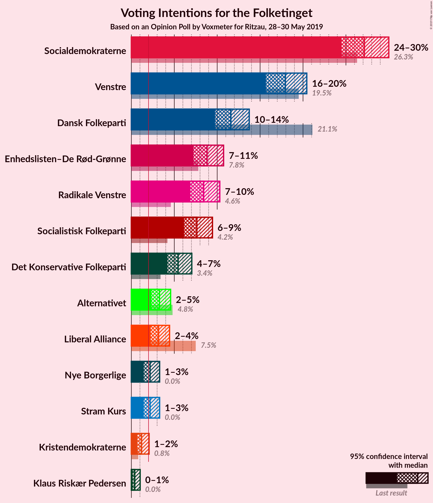

### Confidence Intervals

| Party | Last Result | Poll Result | 80% Confidence Interval | 90% Confidence Interval | 95% Confidence Interval | 99% Confidence Interval |
|:-----:|:-----------:|:-----------:|:-----------------------:|:-----------------------:|:-----------------------:|:-----------------------:|
| Socialdemokraterne | 26.3% | 27.2% | 25.4–29.0% |24.9–29.5% |24.5–30.0% |23.7–30.9% |
| Venstre | 19.5% | 17.9% | 16.5–19.6% |16.0–20.0% |15.7–20.4% |15.0–21.2% |
| Dansk Folkeparti | 21.1% | 11.6% | 10.4–13.0% |10.0–13.4% |9.8–13.7% |9.2–14.4% |
| Enhedslisten–De Rød-Grønne | 7.8% | 8.8% | 7.8–10.1% |7.5–10.4% |7.2–10.7% |6.7–11.4% |
| Radikale Venstre | 4.6% | 8.4% | 7.4–9.6% |7.1–10.0% |6.9–10.3% |6.4–10.9% |
| Socialistisk Folkeparti | 4.2% | 7.6% | 6.6–8.8% |6.4–9.1% |6.1–9.4% |5.7–10.0% |
| Det Konservative Folkeparti | 3.4% | 5.5% | 4.6–6.5% |4.4–6.8% |4.2–7.0% |3.8–7.6% |
| Alternativet | 4.8% | 3.3% | 2.7–4.1% |2.5–4.4% |2.3–4.6% |2.1–5.0% |
| Liberal Alliance | 7.5% | 3.2% | 2.6–4.0% |2.4–4.2% |2.3–4.5% |2.0–4.9% |
| Nye Borgerlige | 0.0% | 2.2% | 1.7–2.9% |1.6–3.1% |1.4–3.3% |1.2–3.7% |
| Stram Kurs | 0.0% | 2.2% | 1.7–2.9% |1.6–3.1% |1.4–3.3% |1.2–3.7% |
| Kristendemokraterne | 0.8% | 1.2% | 0.9–1.8% |0.8–1.9% |0.7–2.1% |0.5–2.4% |
| Klaus Riskær Pedersen | 0.0% | 0.4% | 0.2–0.8% |0.2–0.9% |0.2–1.0% |0.1–1.2% |

*Note:* The poll result column reflects the actual value used in the calculations. Published results may vary slightly, and in addition be rounded to fewer digits.

## Seats

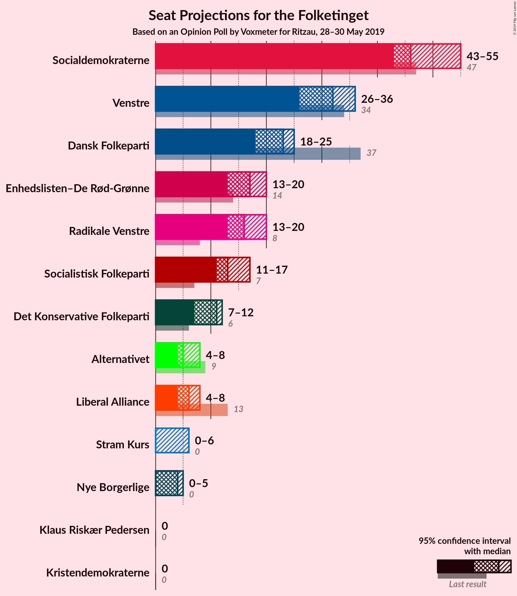

### Confidence Intervals

| Party | Last Result | Median | 80% Confidence Interval | 90% Confidence Interval | 95% Confidence Interval | 99% Confidence Interval |
|:-----:|:-----------:|:------:|:-----------------------:|:-----------------------:|:-----------------------:|:-----------------------:|
| <a href="#socialdemokraterne">Socialdemokraterne</a> | 47 | 46 | 45–50 |45–52 |43–55 |42–56 |
| <a href="#venstre">Venstre</a> | 34 | 32 | 29–34 |29–36 |26–36 |26–36 |
| <a href="#dansk-folkeparti">Dansk Folkeparti</a> | 37 | 23 | 19–25 |19–25 |18–25 |17–25 |
| <a href="#enhedslisten–de-rød-grønne">Enhedslisten–De Rød-Grønne</a> | 14 | 17 | 14–18 |14–19 |13–20 |12–20 |
| <a href="#radikale-venstre">Radikale Venstre</a> | 8 | 16 | 14–17 |13–19 |13–20 |12–20 |
| <a href="#socialistisk-folkeparti">Socialistisk Folkeparti</a> | 7 | 13 | 12–15 |12–16 |11–17 |10–18 |
| <a href="#det-konservative-folkeparti">Det Konservative Folkeparti</a> | 6 | 11 | 8–11 |8–12 |7–12 |7–13 |
| <a href="#alternativet">Alternativet</a> | 9 | 5 | 5–7 |5–8 |4–8 |4–9 |
| <a href="#liberal-alliance">Liberal Alliance</a> | 13 | 6 | 5–7 |5–7 |4–8 |4–9 |
| <a href="#nye-borgerlige">Nye Borgerlige</a> | 0 | 4 | 0–5 |0–5 |0–5 |0–6 |
| <a href="#stram-kurs">Stram Kurs</a> | 0 | 0 | 0–6 |0–6 |0–6 |0–7 |
| <a href="#kristendemokraterne">Kristendemokraterne</a> | 0 | 0 | 0 |0 |0 |0–4 |
| <a href="#klaus-riskær-pedersen">Klaus Riskær Pedersen</a> | 0 | 0 | 0 |0 |0 |0 |

### Socialdemokraterne

*For a full overview of the results for this party, see the [Socialdemokraterne](party-socialdemokraterne.html) page.*

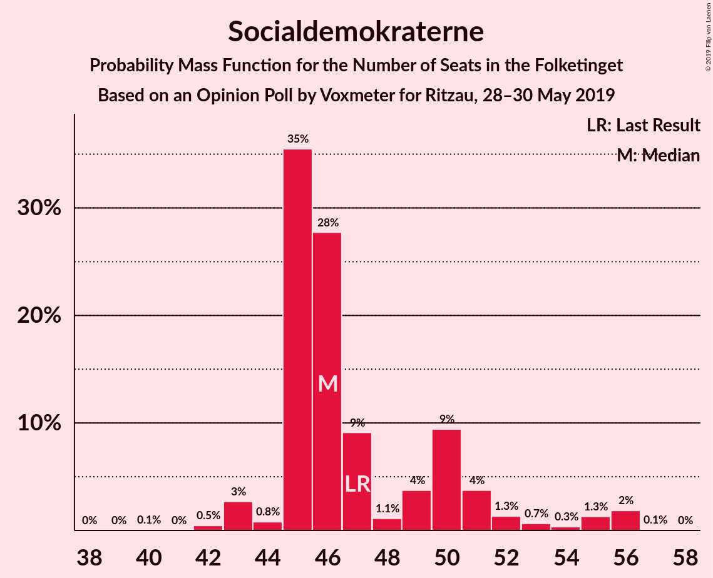

| Number of Seats | Probability | Accumulated | Special Marks |
|:---------------:|:-----------:|:-----------:|:-------------:|
| 40 | 0.1% | 100% |  |
| 41 | 0% | 99.9% |  |
| 42 | 0.5% | 99.9% |  |
| 43 | 3% | 99.4% |  |
| 44 | 0.8% | 97% |  |
| 45 | 35% | 96% |  |
| 46 | 28% | 60% | Median |
| 47 | 9% | 33% | Last Result |
| 48 | 1.1% | 24% |  |
| 49 | 4% | 22% |  |
| 50 | 9% | 19% |  |
| 51 | 4% | 9% |  |
| 52 | 1.3% | 6% |  |
| 53 | 0.7% | 4% |  |
| 54 | 0.3% | 4% |  |
| 55 | 1.3% | 3% |  |
| 56 | 2% | 2% |  |
| 57 | 0.1% | 0.1% |  |
| 58 | 0% | 0% |  |

### Venstre

*For a full overview of the results for this party, see the [Venstre](party-venstre.html) page.*

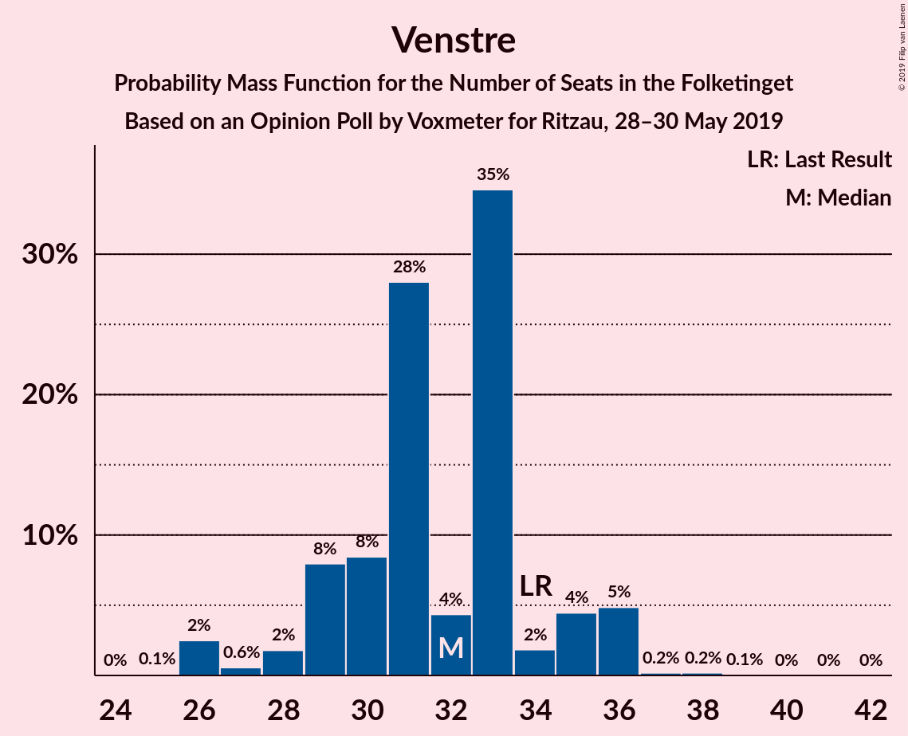

| Number of Seats | Probability | Accumulated | Special Marks |
|:---------------:|:-----------:|:-----------:|:-------------:|
| 25 | 0.1% | 100% |  |
| 26 | 2% | 99.9% |  |
| 27 | 0.6% | 97% |  |
| 28 | 2% | 97% |  |
| 29 | 8% | 95% |  |
| 30 | 8% | 87% |  |
| 31 | 28% | 79% |  |
| 32 | 4% | 51% | Median |
| 33 | 35% | 46% |  |
| 34 | 2% | 12% | Last Result |
| 35 | 4% | 10% |  |
| 36 | 5% | 5% |  |
| 37 | 0.2% | 0.5% |  |
| 38 | 0.2% | 0.3% |  |
| 39 | 0.1% | 0.1% |  |
| 40 | 0% | 0.1% |  |
| 41 | 0% | 0% |  |

### Dansk Folkeparti

*For a full overview of the results for this party, see the [Dansk Folkeparti](party-danskfolkeparti.html) page.*

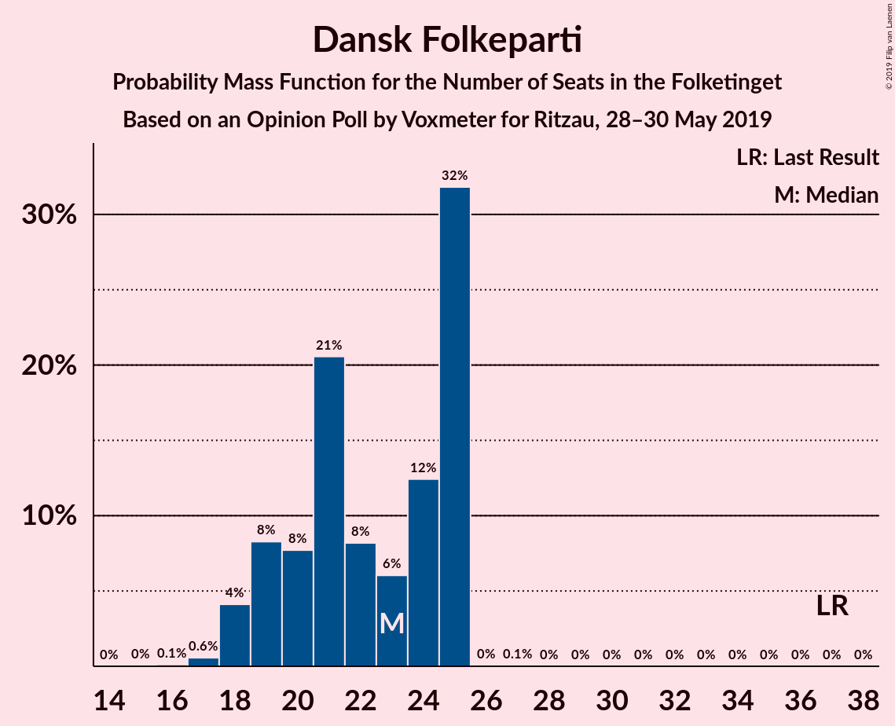

| Number of Seats | Probability | Accumulated | Special Marks |
|:---------------:|:-----------:|:-----------:|:-------------:|
| 16 | 0.1% | 100% |  |
| 17 | 0.6% | 99.8% |  |
| 18 | 4% | 99.3% |  |
| 19 | 8% | 95% |  |
| 20 | 8% | 87% |  |
| 21 | 21% | 79% |  |
| 22 | 8% | 59% |  |
| 23 | 6% | 50% | Median |
| 24 | 12% | 44% |  |
| 25 | 32% | 32% |  |
| 26 | 0% | 0.1% |  |
| 27 | 0.1% | 0.1% |  |
| 28 | 0% | 0% |  |
| 29 | 0% | 0% |  |
| 30 | 0% | 0% |  |
| 31 | 0% | 0% |  |
| 32 | 0% | 0% |  |
| 33 | 0% | 0% |  |
| 34 | 0% | 0% |  |
| 35 | 0% | 0% |  |
| 36 | 0% | 0% |  |
| 37 | 0% | 0% | Last Result |

### Enhedslisten–De Rød-Grønne

*For a full overview of the results for this party, see the [Enhedslisten–De Rød-Grønne](party-enhedslisten–derød-grønne.html) page.*

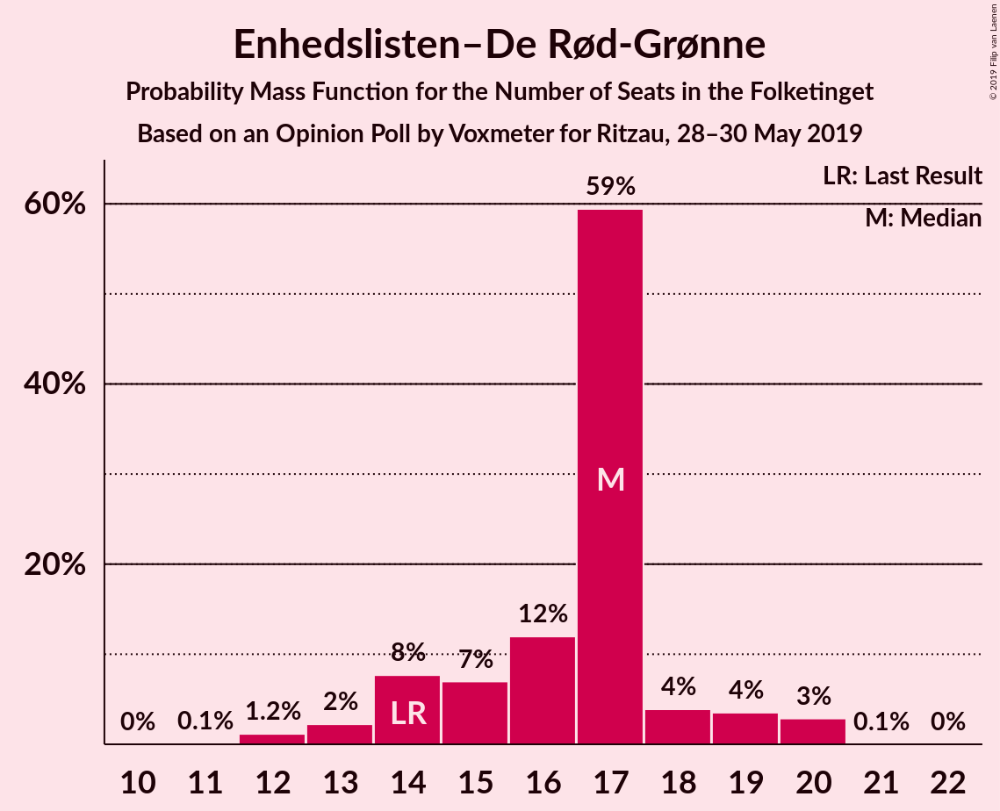

| Number of Seats | Probability | Accumulated | Special Marks |
|:---------------:|:-----------:|:-----------:|:-------------:|
| 11 | 0.1% | 100% |  |
| 12 | 1.2% | 99.8% |  |
| 13 | 2% | 98.7% |  |
| 14 | 8% | 96% | Last Result |
| 15 | 7% | 89% |  |
| 16 | 12% | 82% |  |
| 17 | 59% | 70% | Median |
| 18 | 4% | 10% |  |
| 19 | 4% | 6% |  |
| 20 | 3% | 3% |  |
| 21 | 0.1% | 0.1% |  |
| 22 | 0% | 0% |  |

### Radikale Venstre

*For a full overview of the results for this party, see the [Radikale Venstre](party-radikalevenstre.html) page.*

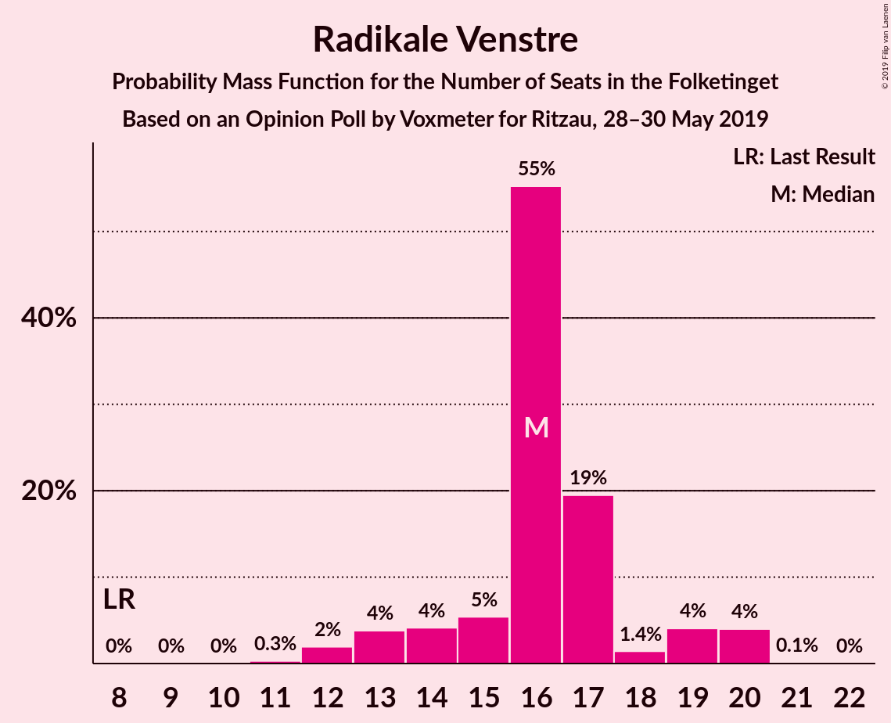

| Number of Seats | Probability | Accumulated | Special Marks |
|:---------------:|:-----------:|:-----------:|:-------------:|
| 8 | 0% | 100% | Last Result |
| 9 | 0% | 100% |  |
| 10 | 0% | 100% |  |
| 11 | 0.3% | 100% |  |
| 12 | 2% | 99.7% |  |
| 13 | 4% | 98% |  |
| 14 | 4% | 94% |  |
| 15 | 5% | 90% |  |
| 16 | 55% | 84% | Median |
| 17 | 19% | 29% |  |
| 18 | 1.4% | 10% |  |
| 19 | 4% | 8% |  |
| 20 | 4% | 4% |  |
| 21 | 0.1% | 0.2% |  |
| 22 | 0% | 0% |  |

### Socialistisk Folkeparti

*For a full overview of the results for this party, see the [Socialistisk Folkeparti](party-socialistiskfolkeparti.html) page.*

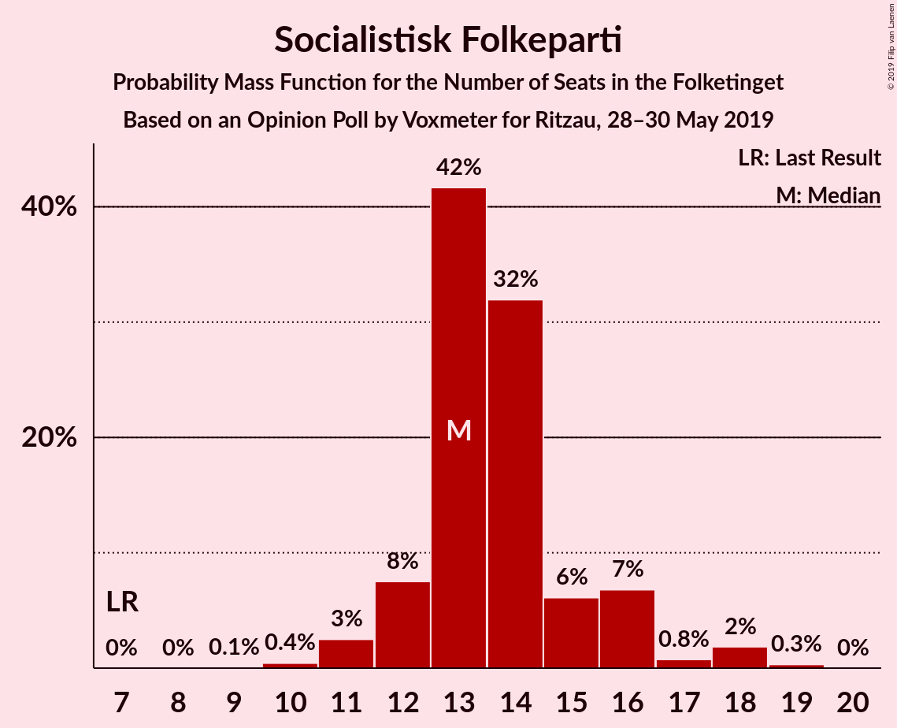

| Number of Seats | Probability | Accumulated | Special Marks |
|:---------------:|:-----------:|:-----------:|:-------------:|
| 7 | 0% | 100% | Last Result |
| 8 | 0% | 100% |  |
| 9 | 0.1% | 100% |  |
| 10 | 0.4% | 99.9% |  |
| 11 | 3% | 99.5% |  |
| 12 | 8% | 97% |  |
| 13 | 42% | 89% | Median |
| 14 | 32% | 48% |  |
| 15 | 6% | 16% |  |
| 16 | 7% | 10% |  |
| 17 | 0.8% | 3% |  |
| 18 | 2% | 2% |  |
| 19 | 0.3% | 0.3% |  |
| 20 | 0% | 0% |  |

### Det Konservative Folkeparti

*For a full overview of the results for this party, see the [Det Konservative Folkeparti](party-detkonservativefolkeparti.html) page.*

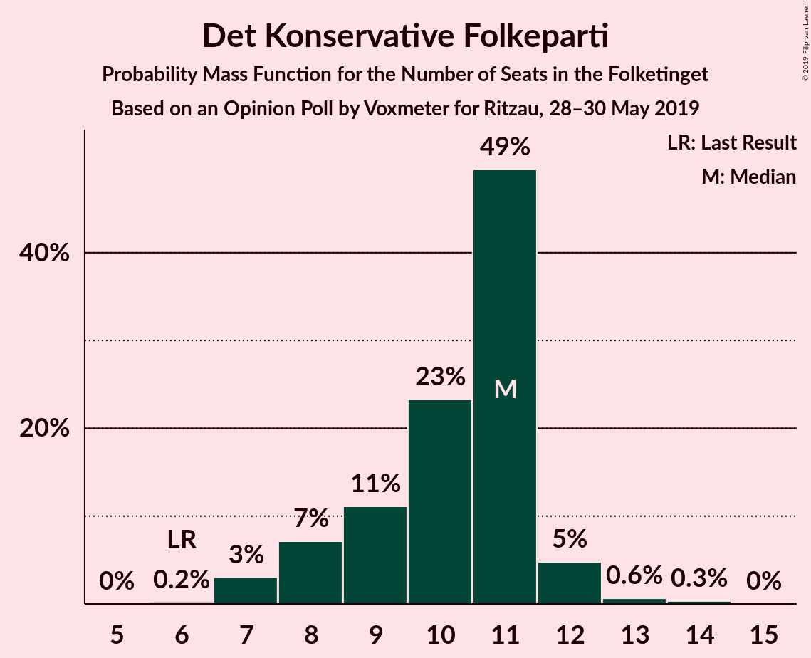

| Number of Seats | Probability | Accumulated | Special Marks |
|:---------------:|:-----------:|:-----------:|:-------------:|
| 6 | 0.2% | 100% | Last Result |
| 7 | 3% | 99.8% |  |
| 8 | 7% | 97% |  |
| 9 | 11% | 90% |  |
| 10 | 23% | 79% |  |
| 11 | 49% | 55% | Median |
| 12 | 5% | 6% |  |
| 13 | 0.6% | 1.0% |  |
| 14 | 0.3% | 0.4% |  |
| 15 | 0% | 0% |  |

### Alternativet

*For a full overview of the results for this party, see the [Alternativet](party-alternativet.html) page.*

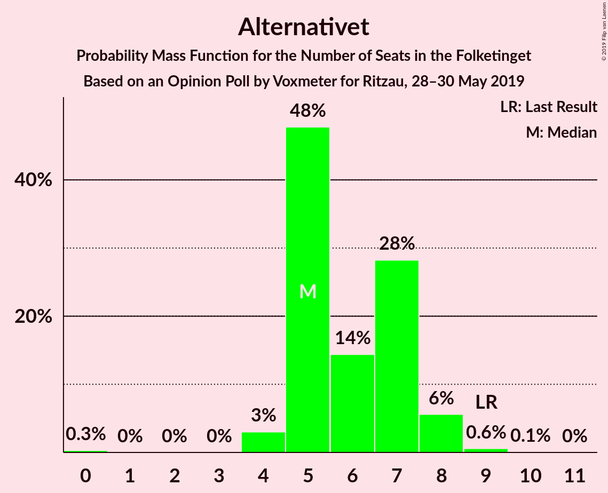

| Number of Seats | Probability | Accumulated | Special Marks |
|:---------------:|:-----------:|:-----------:|:-------------:|
| 0 | 0.3% | 100% |  |
| 1 | 0% | 99.7% |  |
| 2 | 0% | 99.7% |  |
| 3 | 0% | 99.7% |  |
| 4 | 3% | 99.7% |  |
| 5 | 48% | 97% | Median |
| 6 | 14% | 49% |  |
| 7 | 28% | 35% |  |
| 8 | 6% | 6% |  |
| 9 | 0.6% | 0.7% | Last Result |
| 10 | 0.1% | 0.1% |  |
| 11 | 0% | 0% |  |

### Liberal Alliance

*For a full overview of the results for this party, see the [Liberal Alliance](party-liberalalliance.html) page.*

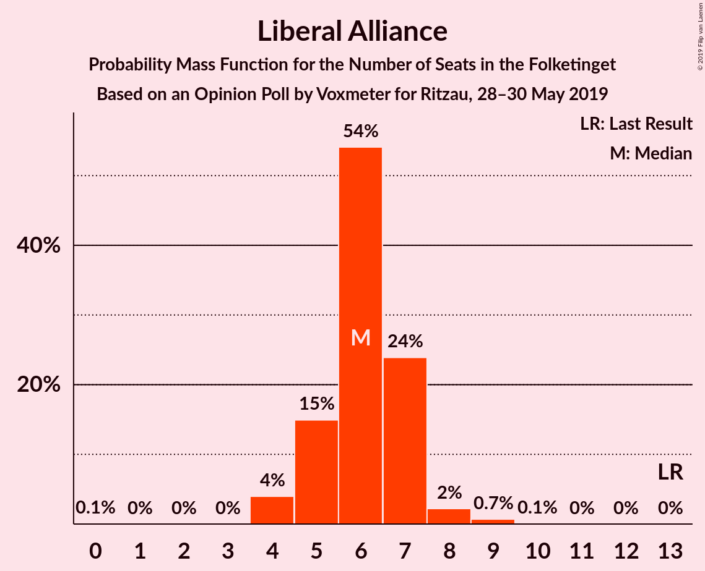

| Number of Seats | Probability | Accumulated | Special Marks |
|:---------------:|:-----------:|:-----------:|:-------------:|
| 0 | 0.1% | 100% |  |
| 1 | 0% | 99.9% |  |
| 2 | 0% | 99.9% |  |
| 3 | 0% | 99.9% |  |
| 4 | 4% | 99.9% |  |
| 5 | 15% | 96% |  |
| 6 | 54% | 81% | Median |
| 7 | 24% | 27% |  |
| 8 | 2% | 3% |  |
| 9 | 0.7% | 0.8% |  |
| 10 | 0.1% | 0.1% |  |
| 11 | 0% | 0% |  |
| 12 | 0% | 0% |  |
| 13 | 0% | 0% | Last Result |

### Nye Borgerlige

*For a full overview of the results for this party, see the [Nye Borgerlige](party-nyeborgerlige.html) page.*

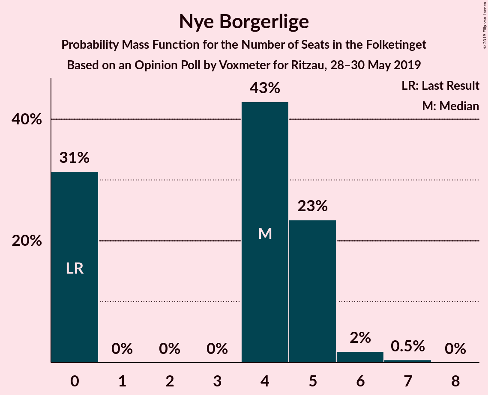

| Number of Seats | Probability | Accumulated | Special Marks |
|:---------------:|:-----------:|:-----------:|:-------------:|
| 0 | 31% | 100% | Last Result |
| 1 | 0% | 69% |  |
| 2 | 0% | 69% |  |
| 3 | 0% | 69% |  |
| 4 | 43% | 69% | Median |
| 5 | 23% | 26% |  |
| 6 | 2% | 2% |  |
| 7 | 0.5% | 0.5% |  |
| 8 | 0% | 0% |  |

### Stram Kurs

*For a full overview of the results for this party, see the [Stram Kurs](party-stramkurs.html) page.*

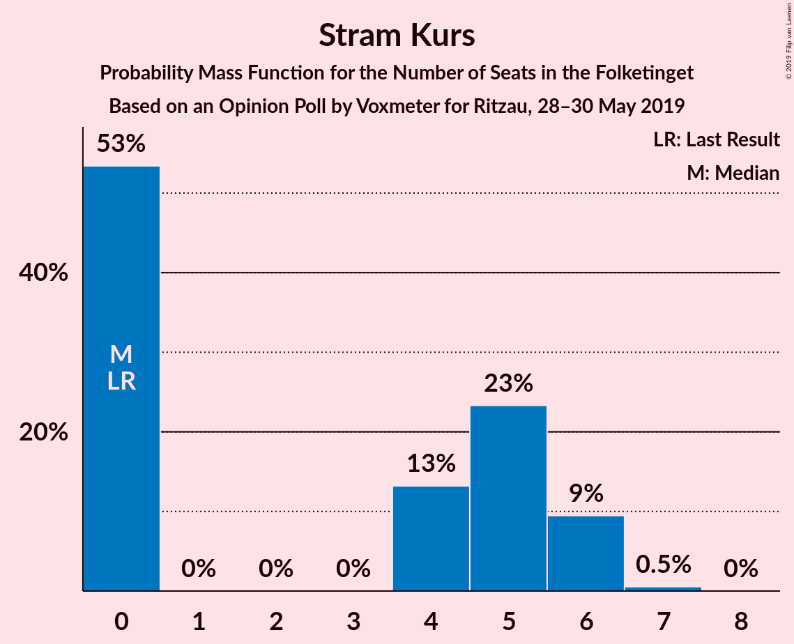

| Number of Seats | Probability | Accumulated | Special Marks |
|:---------------:|:-----------:|:-----------:|:-------------:|
| 0 | 53% | 100% | Last Result, Median |
| 1 | 0% | 47% |  |
| 2 | 0% | 47% |  |
| 3 | 0% | 47% |  |
| 4 | 13% | 47% |  |
| 5 | 23% | 33% |  |
| 6 | 9% | 10% |  |
| 7 | 0.5% | 0.6% |  |
| 8 | 0% | 0% |  |

### Kristendemokraterne

*For a full overview of the results for this party, see the [Kristendemokraterne](party-kristendemokraterne.html) page.*

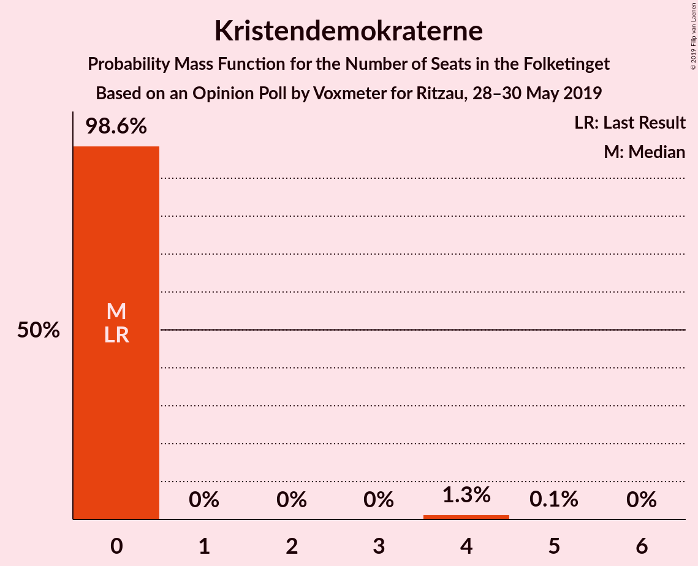

| Number of Seats | Probability | Accumulated | Special Marks |
|:---------------:|:-----------:|:-----------:|:-------------:|
| 0 | 98.6% | 100% | Last Result, Median |
| 1 | 0% | 1.4% |  |
| 2 | 0% | 1.4% |  |
| 3 | 0% | 1.4% |  |
| 4 | 1.3% | 1.4% |  |
| 5 | 0.1% | 0.1% |  |
| 6 | 0% | 0% |  |

### Klaus Riskær Pedersen

*For a full overview of the results for this party, see the [Klaus Riskær Pedersen](party-klausriskærpedersen.html) page.*

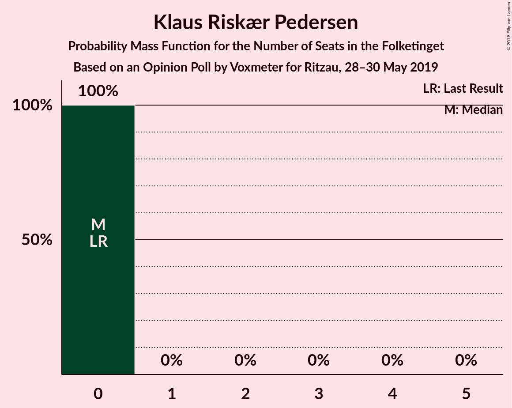

| Number of Seats | Probability | Accumulated | Special Marks |
|:---------------:|:-----------:|:-----------:|:-------------:|
| 0 | 100% | 100% | Last Result, Median |

## Coalitions

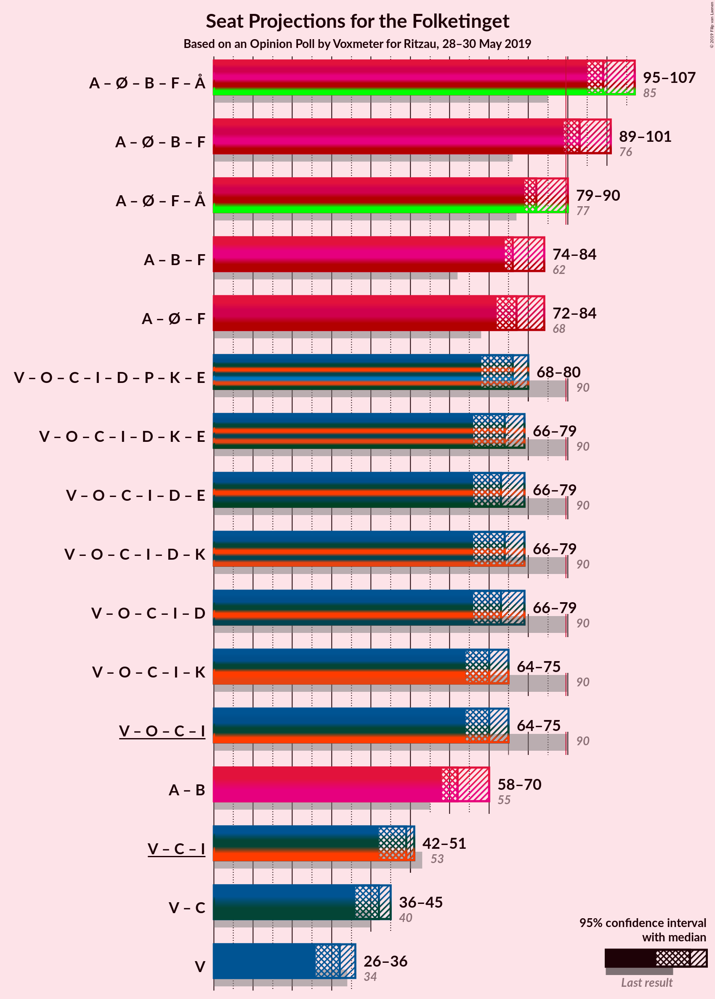

### Confidence Intervals

| Coalition | Last Result | Median | Majority? | 80% Confidence Interval | 90% Confidence Interval | 95% Confidence Interval | 99% Confidence Interval |
|:---------:|:-----------:|:------:|:---------:|:-----------------------:|:-----------------------:|:-----------------------:|:-----------------------:|
| Socialdemokraterne – Enhedslisten–De Rød-Grønne – Radikale Venstre – Socialistisk Folkeparti – Alternativet | 85 | 99 | 99.8% | 96–104 | 96–106 | 95–107 | 91–107 |
| Socialdemokraterne – Enhedslisten–De Rød-Grønne – Radikale Venstre – Socialistisk Folkeparti | 76 | 93 | 94% | 90–97 | 89–100 | 89–101 | 86–101 |
| Socialdemokraterne – Enhedslisten–De Rød-Grønne – Socialistisk Folkeparti – Alternativet | 77 | 82 | 6% | 80–88 | 79–90 | 79–90 | 76–92 |
| Socialdemokraterne – Radikale Venstre – Socialistisk Folkeparti | 62 | 76 | 0% | 74–82 | 74–83 | 74–84 | 70–85 |
| Socialdemokraterne – Enhedslisten–De Rød-Grønne – Socialistisk Folkeparti | 68 | 77 | 0% | 75–82 | 73–83 | 72–84 | 71–87 |
| Venstre – Dansk Folkeparti – Det Konservative Folkeparti – Liberal Alliance – Nye Borgerlige – Stram Kurs – Kristendemokraterne – Klaus Riskær Pedersen | 90 | 76 | 0% | 71–79 | 69–79 | 68–80 | 68–84 |
| Venstre – Dansk Folkeparti – Det Konservative Folkeparti – Liberal Alliance – Nye Borgerlige – Kristendemokraterne – Klaus Riskær Pedersen | 90 | 74 | 0% | 68–79 | 66–79 | 66–79 | 65–79 |
| Venstre – Dansk Folkeparti – Det Konservative Folkeparti – Liberal Alliance – Nye Borgerlige – Klaus Riskær Pedersen | 90 | 73 | 0% | 68–79 | 66–79 | 66–79 | 65–79 |
| Venstre – Dansk Folkeparti – Det Konservative Folkeparti – Liberal Alliance – Nye Borgerlige – Kristendemokraterne | 90 | 74 | 0% | 68–79 | 66–79 | 66–79 | 65–79 |
| Venstre – Dansk Folkeparti – Det Konservative Folkeparti – Liberal Alliance – Nye Borgerlige | 90 | 73 | 0% | 68–79 | 66–79 | 66–79 | 65–79 |
| Venstre – Dansk Folkeparti – Det Konservative Folkeparti – Liberal Alliance – Kristendemokraterne | 90 | 70 | 0% | 66–75 | 65–75 | 64–75 | 62–76 |
| Venstre – Dansk Folkeparti – Det Konservative Folkeparti – Liberal Alliance | 90 | 70 | 0% | 66–75 | 65–75 | 64–75 | 62–76 |
| Socialdemokraterne – Radikale Venstre | 55 | 62 | 0% | 61–69 | 60–70 | 58–70 | 57–73 |
| Venstre – Det Konservative Folkeparti – Liberal Alliance | 53 | 49 | 0% | 44–50 | 44–51 | 42–51 | 42–54 |
| Venstre – Det Konservative Folkeparti | 40 | 42 | 0% | 39–44 | 37–45 | 36–45 | 35–47 |
| Venstre | 34 | 32 | 0% | 29–34 | 29–36 | 26–36 | 26–36 |

### Socialdemokraterne – Enhedslisten–De Rød-Grønne – Radikale Venstre – Socialistisk Folkeparti – Alternativet

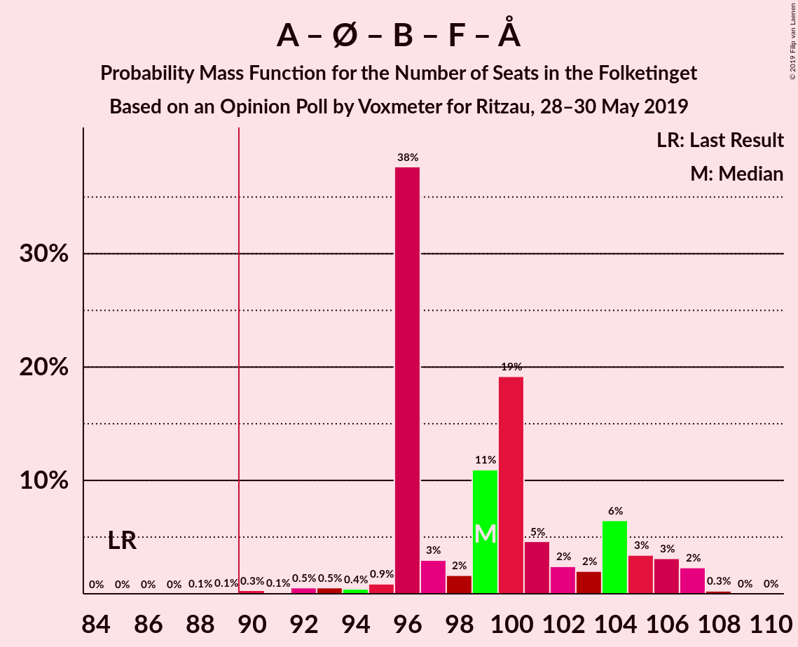

| Number of Seats | Probability | Accumulated | Special Marks |
|:---------------:|:-----------:|:-----------:|:-------------:|
| 85 | 0% | 100% | Last Result |
| 86 | 0% | 100% |  |
| 87 | 0% | 100% |  |
| 88 | 0.1% | 100% |  |
| 89 | 0.1% | 99.9% |  |
| 90 | 0.3% | 99.8% | Majority |
| 91 | 0.1% | 99.5% |  |
| 92 | 0.5% | 99.4% |  |
| 93 | 0.5% | 98.9% |  |
| 94 | 0.4% | 98% |  |
| 95 | 0.9% | 98% |  |
| 96 | 38% | 97% |  |
| 97 | 3% | 59% | Median |
| 98 | 2% | 56% |  |
| 99 | 11% | 55% |  |
| 100 | 19% | 44% |  |
| 101 | 5% | 25% |  |
| 102 | 2% | 20% |  |
| 103 | 2% | 18% |  |
| 104 | 6% | 16% |  |
| 105 | 3% | 9% |  |
| 106 | 3% | 6% |  |
| 107 | 2% | 3% |  |
| 108 | 0.3% | 0.3% |  |
| 109 | 0% | 0% |  |

### Socialdemokraterne – Enhedslisten–De Rød-Grønne – Radikale Venstre – Socialistisk Folkeparti

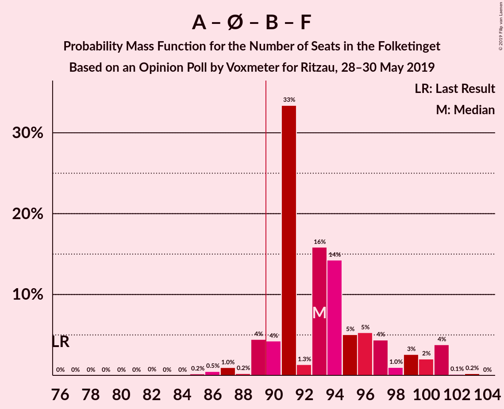

| Number of Seats | Probability | Accumulated | Special Marks |
|:---------------:|:-----------:|:-----------:|:-------------:|
| 76 | 0% | 100% | Last Result |
| 77 | 0% | 100% |  |
| 78 | 0% | 100% |  |
| 79 | 0% | 100% |  |
| 80 | 0% | 100% |  |
| 81 | 0% | 100% |  |
| 82 | 0% | 100% |  |
| 83 | 0% | 100% |  |
| 84 | 0% | 100% |  |
| 85 | 0.2% | 99.9% |  |
| 86 | 0.5% | 99.7% |  |
| 87 | 1.0% | 99.2% |  |
| 88 | 0.2% | 98% |  |
| 89 | 4% | 98% |  |
| 90 | 4% | 94% | Majority |
| 91 | 33% | 89% |  |
| 92 | 1.3% | 56% | Median |
| 93 | 16% | 55% |  |
| 94 | 14% | 39% |  |
| 95 | 5% | 24% |  |
| 96 | 5% | 19% |  |
| 97 | 4% | 14% |  |
| 98 | 1.0% | 10% |  |
| 99 | 3% | 9% |  |
| 100 | 2% | 6% |  |
| 101 | 4% | 4% |  |
| 102 | 0.1% | 0.4% |  |
| 103 | 0.2% | 0.2% |  |
| 104 | 0% | 0% |  |

### Socialdemokraterne – Enhedslisten–De Rød-Grønne – Socialistisk Folkeparti – Alternativet

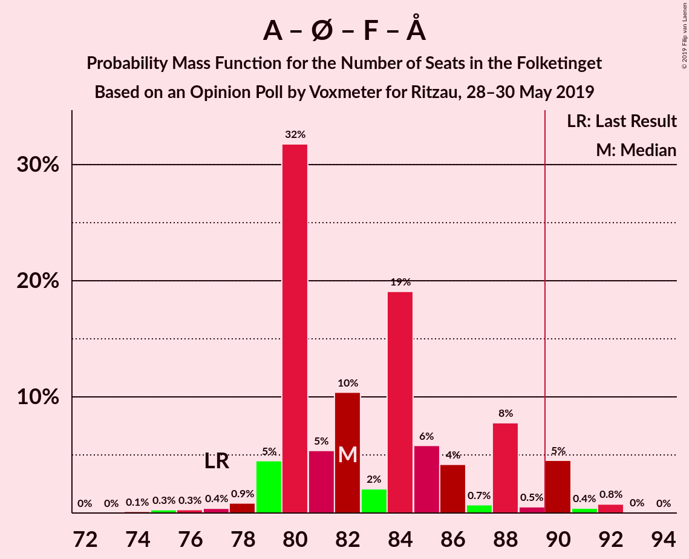

| Number of Seats | Probability | Accumulated | Special Marks |
|:---------------:|:-----------:|:-----------:|:-------------:|
| 74 | 0.1% | 100% |  |
| 75 | 0.3% | 99.9% |  |
| 76 | 0.3% | 99.6% |  |
| 77 | 0.4% | 99.3% | Last Result |
| 78 | 0.9% | 98.9% |  |
| 79 | 5% | 98% |  |
| 80 | 32% | 94% |  |
| 81 | 5% | 62% | Median |
| 82 | 10% | 56% |  |
| 83 | 2% | 46% |  |
| 84 | 19% | 44% |  |
| 85 | 6% | 25% |  |
| 86 | 4% | 19% |  |
| 87 | 0.7% | 15% |  |
| 88 | 8% | 14% |  |
| 89 | 0.5% | 6% |  |
| 90 | 5% | 6% | Majority |
| 91 | 0.4% | 1.3% |  |
| 92 | 0.8% | 0.9% |  |
| 93 | 0% | 0.1% |  |
| 94 | 0% | 0% |  |

### Socialdemokraterne – Radikale Venstre – Socialistisk Folkeparti

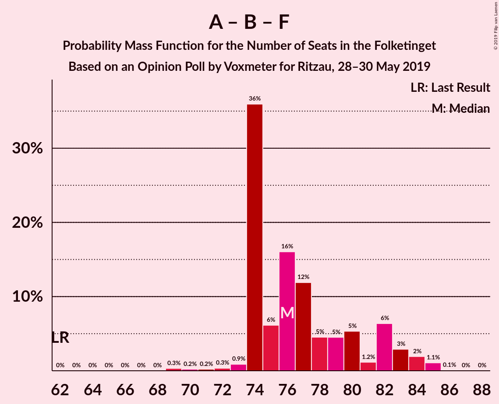

| Number of Seats | Probability | Accumulated | Special Marks |
|:---------------:|:-----------:|:-----------:|:-------------:|
| 62 | 0% | 100% | Last Result |
| 63 | 0% | 100% |  |
| 64 | 0% | 100% |  |
| 65 | 0% | 100% |  |
| 66 | 0% | 100% |  |
| 67 | 0% | 100% |  |
| 68 | 0% | 100% |  |
| 69 | 0.3% | 100% |  |
| 70 | 0.2% | 99.6% |  |
| 71 | 0.2% | 99.4% |  |
| 72 | 0.3% | 99.2% |  |
| 73 | 0.9% | 98.9% |  |
| 74 | 36% | 98% |  |
| 75 | 6% | 62% | Median |
| 76 | 16% | 56% |  |
| 77 | 12% | 40% |  |
| 78 | 5% | 28% |  |
| 79 | 5% | 23% |  |
| 80 | 5% | 19% |  |
| 81 | 1.2% | 14% |  |
| 82 | 6% | 12% |  |
| 83 | 3% | 6% |  |
| 84 | 2% | 3% |  |
| 85 | 1.1% | 1.2% |  |
| 86 | 0.1% | 0.1% |  |
| 87 | 0% | 0% |  |

### Socialdemokraterne – Enhedslisten–De Rød-Grønne – Socialistisk Folkeparti

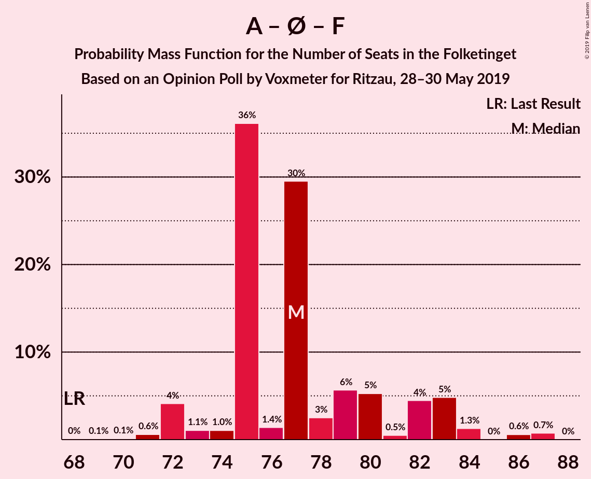

| Number of Seats | Probability | Accumulated | Special Marks |
|:---------------:|:-----------:|:-----------:|:-------------:|
| 68 | 0% | 100% | Last Result |
| 69 | 0.1% | 100% |  |
| 70 | 0.1% | 99.9% |  |
| 71 | 0.6% | 99.8% |  |
| 72 | 4% | 99.2% |  |
| 73 | 1.1% | 95% |  |
| 74 | 1.0% | 94% |  |
| 75 | 36% | 93% |  |
| 76 | 1.4% | 57% | Median |
| 77 | 30% | 55% |  |
| 78 | 3% | 26% |  |
| 79 | 6% | 23% |  |
| 80 | 5% | 18% |  |
| 81 | 0.5% | 12% |  |
| 82 | 4% | 12% |  |
| 83 | 5% | 7% |  |
| 84 | 1.3% | 3% |  |
| 85 | 0% | 1.4% |  |
| 86 | 0.6% | 1.4% |  |
| 87 | 0.7% | 0.8% |  |
| 88 | 0% | 0% |  |

### Venstre – Dansk Folkeparti – Det Konservative Folkeparti – Liberal Alliance – Nye Borgerlige – Stram Kurs – Kristendemokraterne – Klaus Riskær Pedersen

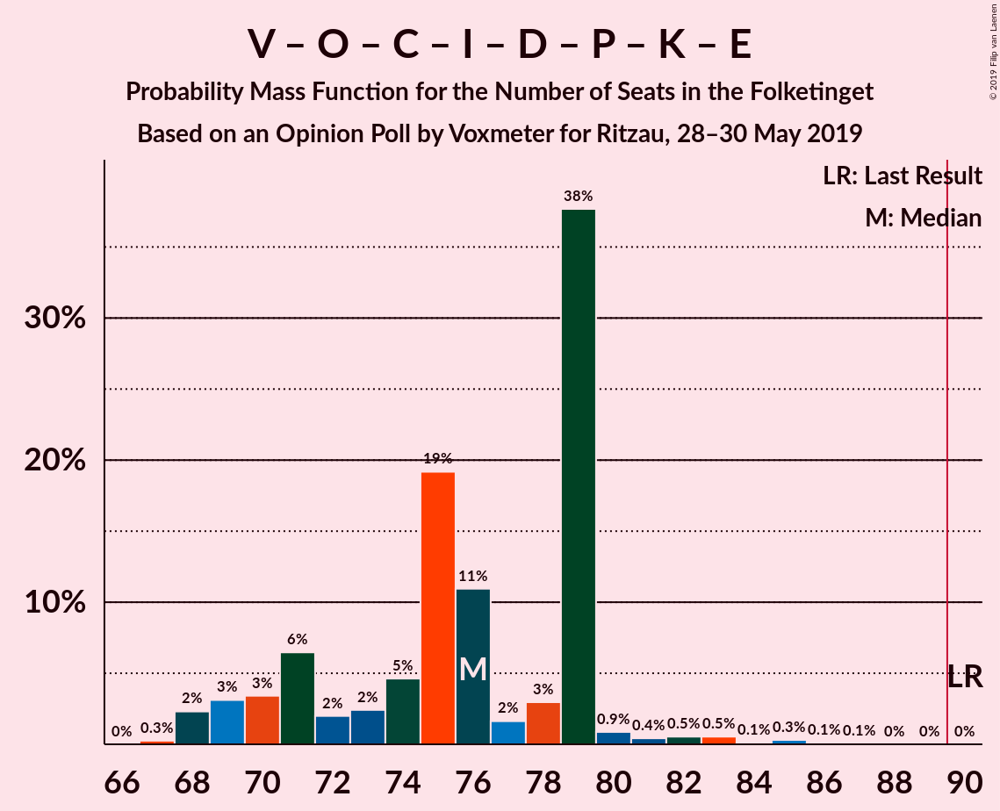

| Number of Seats | Probability | Accumulated | Special Marks |
|:---------------:|:-----------:|:-----------:|:-------------:|
| 67 | 0.3% | 100% |  |
| 68 | 2% | 99.7% |  |
| 69 | 3% | 97% |  |
| 70 | 3% | 94% |  |
| 71 | 6% | 91% |  |
| 72 | 2% | 84% |  |
| 73 | 2% | 82% |  |
| 74 | 5% | 80% |  |
| 75 | 19% | 75% |  |
| 76 | 11% | 56% | Median |
| 77 | 2% | 45% |  |
| 78 | 3% | 44% |  |
| 79 | 38% | 41% |  |
| 80 | 0.9% | 3% |  |
| 81 | 0.4% | 2% |  |
| 82 | 0.5% | 2% |  |
| 83 | 0.5% | 1.1% |  |
| 84 | 0.1% | 0.6% |  |
| 85 | 0.3% | 0.5% |  |
| 86 | 0.1% | 0.2% |  |
| 87 | 0.1% | 0.1% |  |
| 88 | 0% | 0% |  |
| 89 | 0% | 0% |  |
| 90 | 0% | 0% | Last Result, Majority |

### Venstre – Dansk Folkeparti – Det Konservative Folkeparti – Liberal Alliance – Nye Borgerlige – Kristendemokraterne – Klaus Riskær Pedersen

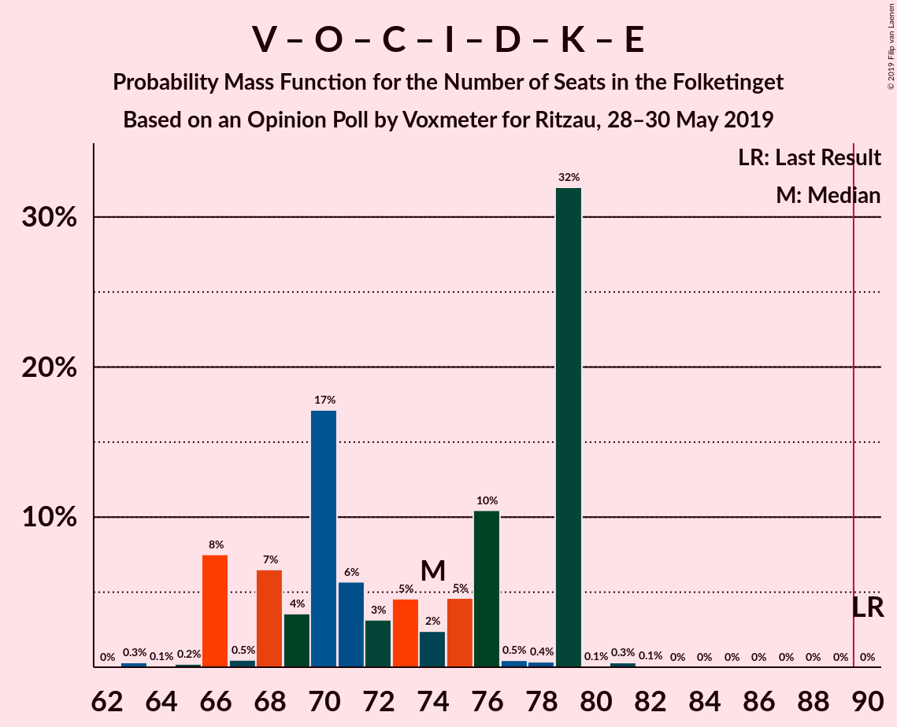

| Number of Seats | Probability | Accumulated | Special Marks |
|:---------------:|:-----------:|:-----------:|:-------------:|
| 63 | 0.3% | 100% |  |
| 64 | 0.1% | 99.7% |  |
| 65 | 0.2% | 99.6% |  |
| 66 | 8% | 99.4% |  |
| 67 | 0.5% | 92% |  |
| 68 | 7% | 91% |  |
| 69 | 4% | 85% |  |
| 70 | 17% | 81% |  |
| 71 | 6% | 64% |  |
| 72 | 3% | 58% |  |
| 73 | 5% | 55% |  |
| 74 | 2% | 51% |  |
| 75 | 5% | 48% |  |
| 76 | 10% | 44% | Median |
| 77 | 0.5% | 33% |  |
| 78 | 0.4% | 33% |  |
| 79 | 32% | 32% |  |
| 80 | 0.1% | 0.5% |  |
| 81 | 0.3% | 0.4% |  |
| 82 | 0.1% | 0.1% |  |
| 83 | 0% | 0% |  |
| 84 | 0% | 0% |  |
| 85 | 0% | 0% |  |
| 86 | 0% | 0% |  |
| 87 | 0% | 0% |  |
| 88 | 0% | 0% |  |
| 89 | 0% | 0% |  |
| 90 | 0% | 0% | Last Result, Majority |

### Venstre – Dansk Folkeparti – Det Konservative Folkeparti – Liberal Alliance – Nye Borgerlige – Klaus Riskær Pedersen

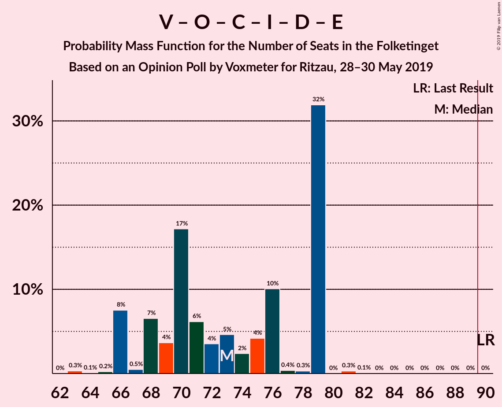

| Number of Seats | Probability | Accumulated | Special Marks |
|:---------------:|:-----------:|:-----------:|:-------------:|
| 63 | 0.3% | 100% |  |
| 64 | 0.1% | 99.7% |  |
| 65 | 0.2% | 99.6% |  |
| 66 | 8% | 99.4% |  |
| 67 | 0.5% | 92% |  |
| 68 | 7% | 91% |  |
| 69 | 4% | 85% |  |
| 70 | 17% | 81% |  |
| 71 | 6% | 64% |  |
| 72 | 4% | 58% |  |
| 73 | 5% | 54% |  |
| 74 | 2% | 50% |  |
| 75 | 4% | 47% |  |
| 76 | 10% | 43% | Median |
| 77 | 0.4% | 33% |  |
| 78 | 0.3% | 33% |  |
| 79 | 32% | 32% |  |
| 80 | 0% | 0.4% |  |
| 81 | 0.3% | 0.4% |  |
| 82 | 0.1% | 0.1% |  |
| 83 | 0% | 0% |  |
| 84 | 0% | 0% |  |
| 85 | 0% | 0% |  |
| 86 | 0% | 0% |  |
| 87 | 0% | 0% |  |
| 88 | 0% | 0% |  |
| 89 | 0% | 0% |  |
| 90 | 0% | 0% | Last Result, Majority |

### Venstre – Dansk Folkeparti – Det Konservative Folkeparti – Liberal Alliance – Nye Borgerlige – Kristendemokraterne

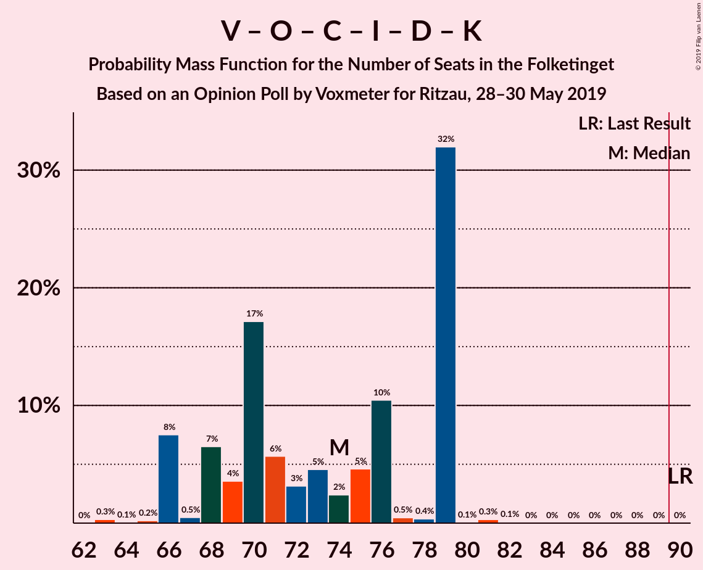

| Number of Seats | Probability | Accumulated | Special Marks |
|:---------------:|:-----------:|:-----------:|:-------------:|
| 63 | 0.3% | 100% |  |
| 64 | 0.1% | 99.7% |  |
| 65 | 0.2% | 99.6% |  |
| 66 | 8% | 99.4% |  |
| 67 | 0.5% | 92% |  |
| 68 | 7% | 91% |  |
| 69 | 4% | 85% |  |
| 70 | 17% | 81% |  |
| 71 | 6% | 64% |  |
| 72 | 3% | 58% |  |
| 73 | 5% | 55% |  |
| 74 | 2% | 51% |  |
| 75 | 5% | 48% |  |
| 76 | 10% | 44% | Median |
| 77 | 0.5% | 33% |  |
| 78 | 0.4% | 33% |  |
| 79 | 32% | 32% |  |
| 80 | 0.1% | 0.5% |  |
| 81 | 0.3% | 0.4% |  |
| 82 | 0.1% | 0.1% |  |
| 83 | 0% | 0% |  |
| 84 | 0% | 0% |  |
| 85 | 0% | 0% |  |
| 86 | 0% | 0% |  |
| 87 | 0% | 0% |  |
| 88 | 0% | 0% |  |
| 89 | 0% | 0% |  |
| 90 | 0% | 0% | Last Result, Majority |

### Venstre – Dansk Folkeparti – Det Konservative Folkeparti – Liberal Alliance – Nye Borgerlige

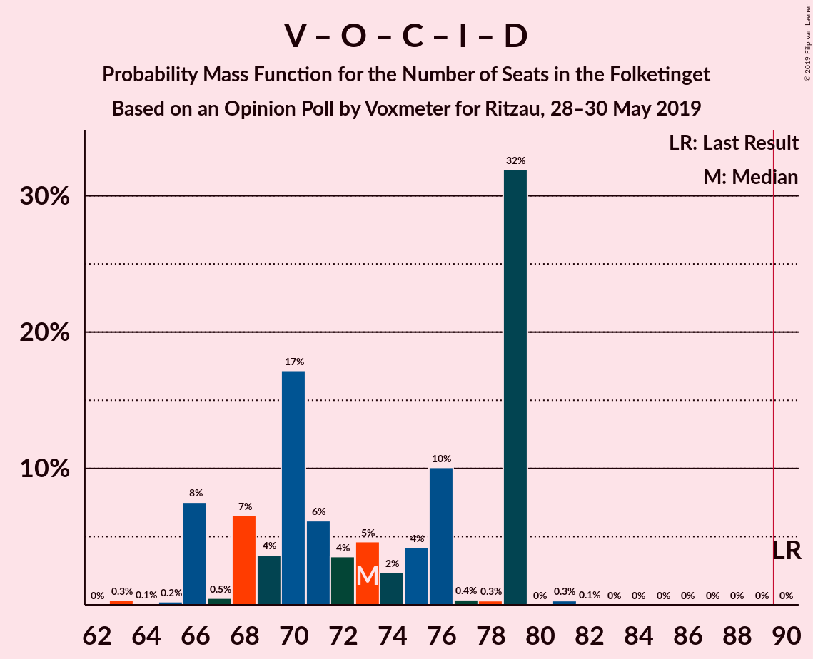

| Number of Seats | Probability | Accumulated | Special Marks |
|:---------------:|:-----------:|:-----------:|:-------------:|
| 63 | 0.3% | 100% |  |
| 64 | 0.1% | 99.7% |  |
| 65 | 0.2% | 99.6% |  |
| 66 | 8% | 99.4% |  |
| 67 | 0.5% | 92% |  |
| 68 | 7% | 91% |  |
| 69 | 4% | 85% |  |
| 70 | 17% | 81% |  |
| 71 | 6% | 64% |  |
| 72 | 4% | 58% |  |
| 73 | 5% | 54% |  |
| 74 | 2% | 50% |  |
| 75 | 4% | 47% |  |
| 76 | 10% | 43% | Median |
| 77 | 0.4% | 33% |  |
| 78 | 0.3% | 33% |  |
| 79 | 32% | 32% |  |
| 80 | 0% | 0.4% |  |
| 81 | 0.3% | 0.4% |  |
| 82 | 0.1% | 0.1% |  |
| 83 | 0% | 0% |  |
| 84 | 0% | 0% |  |
| 85 | 0% | 0% |  |
| 86 | 0% | 0% |  |
| 87 | 0% | 0% |  |
| 88 | 0% | 0% |  |
| 89 | 0% | 0% |  |
| 90 | 0% | 0% | Last Result, Majority |

### Venstre – Dansk Folkeparti – Det Konservative Folkeparti – Liberal Alliance – Kristendemokraterne

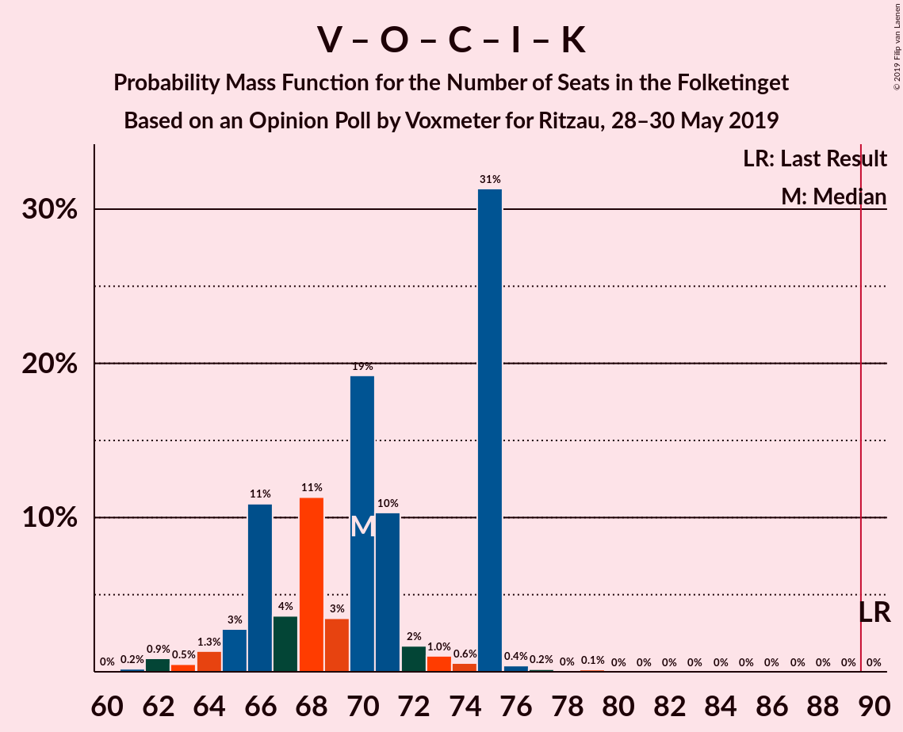

| Number of Seats | Probability | Accumulated | Special Marks |
|:---------------:|:-----------:|:-----------:|:-------------:|
| 60 | 0% | 100% |  |
| 61 | 0.2% | 99.9% |  |
| 62 | 0.9% | 99.7% |  |
| 63 | 0.5% | 98.9% |  |
| 64 | 1.3% | 98% |  |
| 65 | 3% | 97% |  |
| 66 | 11% | 94% |  |
| 67 | 4% | 83% |  |
| 68 | 11% | 80% |  |
| 69 | 3% | 68% |  |
| 70 | 19% | 65% |  |
| 71 | 10% | 46% |  |
| 72 | 2% | 35% | Median |
| 73 | 1.0% | 34% |  |
| 74 | 0.6% | 33% |  |
| 75 | 31% | 32% |  |
| 76 | 0.4% | 0.8% |  |
| 77 | 0.2% | 0.4% |  |
| 78 | 0% | 0.2% |  |
| 79 | 0.1% | 0.2% |  |
| 80 | 0% | 0% |  |
| 81 | 0% | 0% |  |
| 82 | 0% | 0% |  |
| 83 | 0% | 0% |  |
| 84 | 0% | 0% |  |
| 85 | 0% | 0% |  |
| 86 | 0% | 0% |  |
| 87 | 0% | 0% |  |
| 88 | 0% | 0% |  |
| 89 | 0% | 0% |  |
| 90 | 0% | 0% | Last Result, Majority |

### Venstre – Dansk Folkeparti – Det Konservative Folkeparti – Liberal Alliance

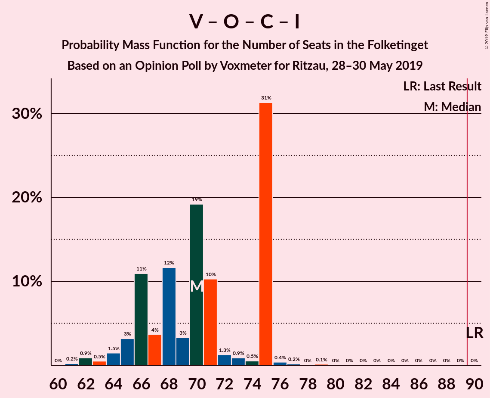

| Number of Seats | Probability | Accumulated | Special Marks |
|:---------------:|:-----------:|:-----------:|:-------------:|
| 60 | 0% | 100% |  |
| 61 | 0.2% | 99.9% |  |
| 62 | 0.9% | 99.7% |  |
| 63 | 0.5% | 98.8% |  |
| 64 | 1.5% | 98% |  |
| 65 | 3% | 97% |  |
| 66 | 11% | 94% |  |
| 67 | 4% | 83% |  |
| 68 | 12% | 79% |  |
| 69 | 3% | 67% |  |
| 70 | 19% | 64% |  |
| 71 | 10% | 45% |  |
| 72 | 1.3% | 35% | Median |
| 73 | 0.9% | 33% |  |
| 74 | 0.5% | 33% |  |
| 75 | 31% | 32% |  |
| 76 | 0.4% | 0.7% |  |
| 77 | 0.2% | 0.3% |  |
| 78 | 0% | 0.2% |  |
| 79 | 0.1% | 0.1% |  |
| 80 | 0% | 0% |  |
| 81 | 0% | 0% |  |
| 82 | 0% | 0% |  |
| 83 | 0% | 0% |  |
| 84 | 0% | 0% |  |
| 85 | 0% | 0% |  |
| 86 | 0% | 0% |  |
| 87 | 0% | 0% |  |
| 88 | 0% | 0% |  |
| 89 | 0% | 0% |  |
| 90 | 0% | 0% | Last Result, Majority |

### Socialdemokraterne – Radikale Venstre

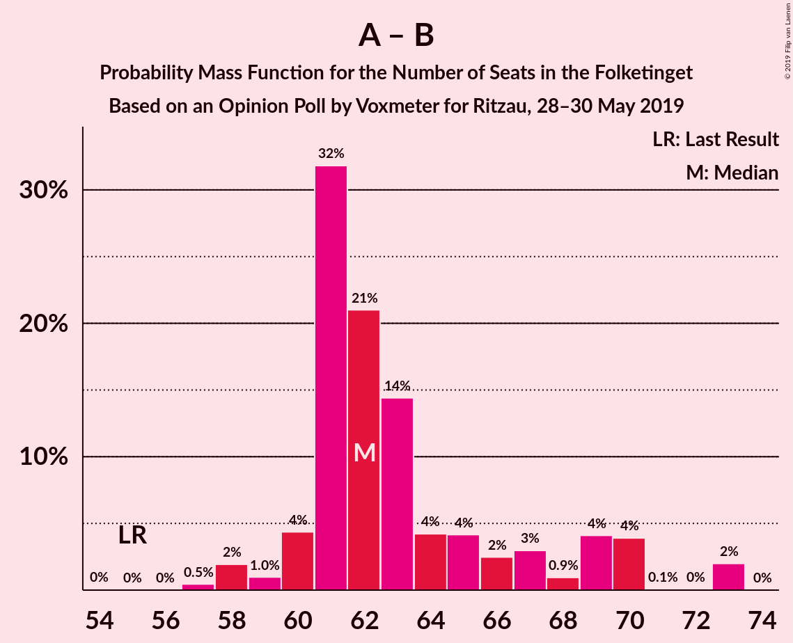

| Number of Seats | Probability | Accumulated | Special Marks |
|:---------------:|:-----------:|:-----------:|:-------------:|
| 54 | 0% | 100% |  |
| 55 | 0% | 99.9% | Last Result |
| 56 | 0% | 99.9% |  |
| 57 | 0.5% | 99.9% |  |
| 58 | 2% | 99.4% |  |
| 59 | 1.0% | 97% |  |
| 60 | 4% | 97% |  |
| 61 | 32% | 92% |  |
| 62 | 21% | 60% | Median |
| 63 | 14% | 39% |  |
| 64 | 4% | 25% |  |
| 65 | 4% | 21% |  |
| 66 | 2% | 17% |  |
| 67 | 3% | 14% |  |
| 68 | 0.9% | 11% |  |
| 69 | 4% | 10% |  |
| 70 | 4% | 6% |  |
| 71 | 0.1% | 2% |  |
| 72 | 0% | 2% |  |
| 73 | 2% | 2% |  |
| 74 | 0% | 0% |  |

### Venstre – Det Konservative Folkeparti – Liberal Alliance

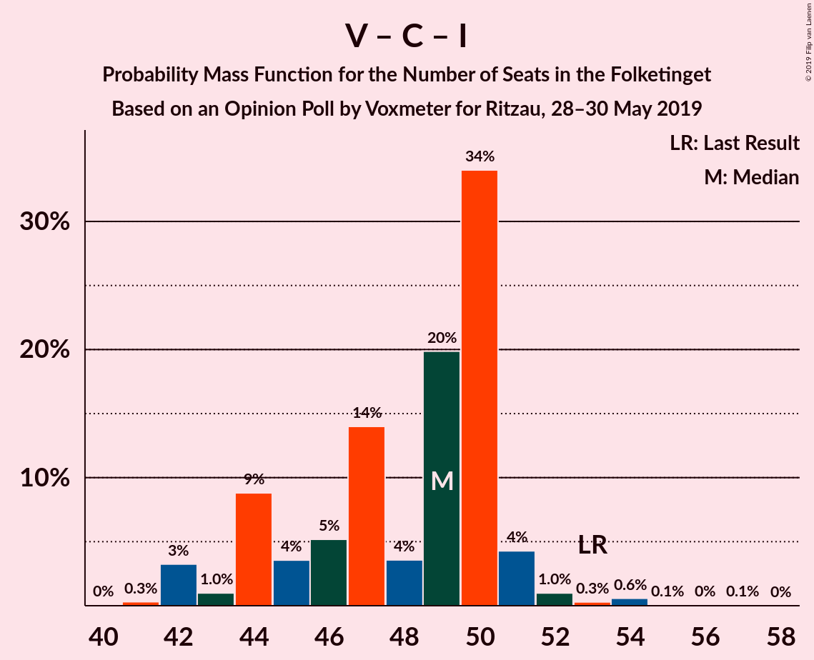

| Number of Seats | Probability | Accumulated | Special Marks |
|:---------------:|:-----------:|:-----------:|:-------------:|
| 40 | 0% | 100% |  |
| 41 | 0.3% | 99.9% |  |
| 42 | 3% | 99.6% |  |
| 43 | 1.0% | 96% |  |
| 44 | 9% | 95% |  |
| 45 | 4% | 87% |  |
| 46 | 5% | 83% |  |
| 47 | 14% | 78% |  |
| 48 | 4% | 64% |  |
| 49 | 20% | 60% | Median |
| 50 | 34% | 40% |  |
| 51 | 4% | 6% |  |
| 52 | 1.0% | 2% |  |
| 53 | 0.3% | 1.1% | Last Result |
| 54 | 0.6% | 0.8% |  |
| 55 | 0.1% | 0.2% |  |
| 56 | 0% | 0.1% |  |
| 57 | 0.1% | 0.1% |  |
| 58 | 0% | 0% |  |

### Venstre – Det Konservative Folkeparti

| Number of Seats | Probability | Accumulated | Special Marks |
|:---------------:|:-----------:|:-----------:|:-------------:|
| 35 | 0.6% | 100% |  |
| 36 | 3% | 99.4% |  |
| 37 | 3% | 97% |  |
| 38 | 2% | 93% |  |
| 39 | 8% | 91% |  |
| 40 | 4% | 83% | Last Result |
| 41 | 13% | 79% |  |
| 42 | 21% | 66% |  |
| 43 | 4% | 45% | Median |
| 44 | 33% | 41% |  |
| 45 | 7% | 9% |  |
| 46 | 0.3% | 2% |  |
| 47 | 1.1% | 2% |  |
| 48 | 0.3% | 0.4% |  |
| 49 | 0% | 0.2% |  |
| 50 | 0.1% | 0.1% |  |
| 51 | 0% | 0% |  |

### Venstre

| Number of Seats | Probability | Accumulated | Special Marks |
|:---------------:|:-----------:|:-----------:|:-------------:|
| 25 | 0.1% | 100% |  |
| 26 | 2% | 99.9% |  |
| 27 | 0.6% | 97% |  |
| 28 | 2% | 97% |  |
| 29 | 8% | 95% |  |
| 30 | 8% | 87% |  |
| 31 | 28% | 79% |  |
| 32 | 4% | 51% | Median |
| 33 | 35% | 46% |  |
| 34 | 2% | 12% | Last Result |
| 35 | 4% | 10% |  |
| 36 | 5% | 5% |  |
| 37 | 0.2% | 0.5% |  |
| 38 | 0.2% | 0.3% |  |
| 39 | 0.1% | 0.1% |  |
| 40 | 0% | 0.1% |  |
| 41 | 0% | 0% |  |

## Technical Information

### Opinion Poll

+ **Polling firm:** Voxmeter
+ **Commissioner(s):** Ritzau
+ **Fieldwork period:** 28–30 May 2019

### Calculations

+ **Sample size:** 1009
+ **Simulations done:** 1,048,576
+ **Error estimate:** 2.18%

