# Opinion Poll by YouGov, 29 May–2 June 2019

<a href="#voting-intentions">Voting Intentions</a> | <a href="#seats">Seats</a> | <a href="#coalitions">Coalitions</a> | <a href="#technical-information">Technical Information</a>

## Voting Intentions

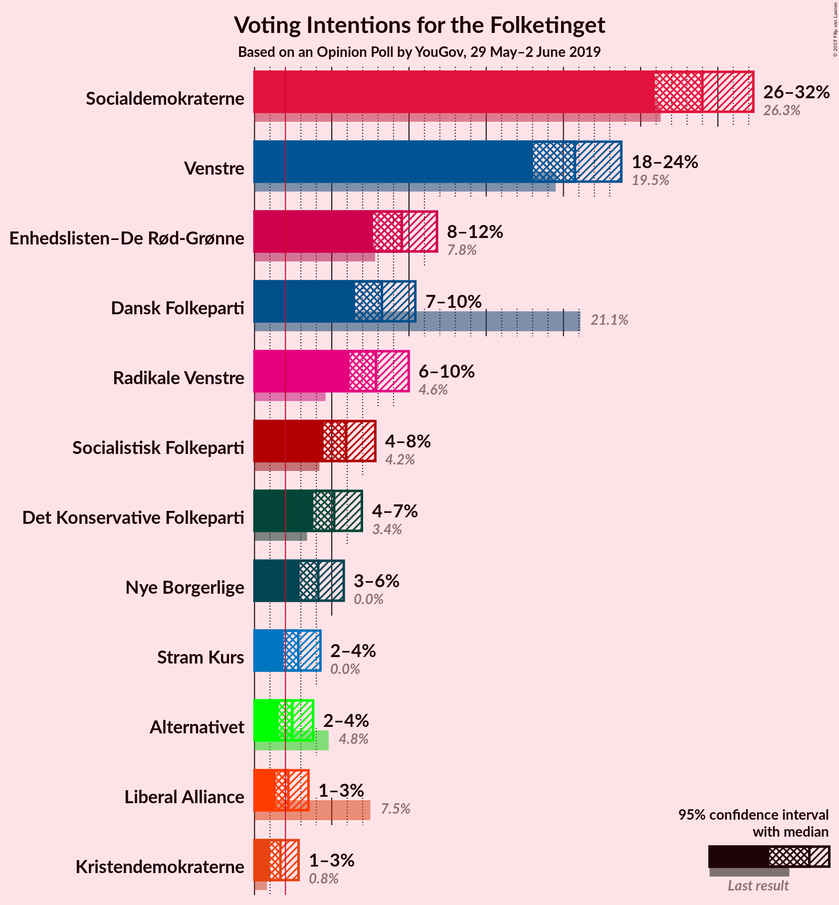

### Confidence Intervals

| Party | Last Result | Poll Result | 80% Confidence Interval | 90% Confidence Interval | 95% Confidence Interval | 99% Confidence Interval |
|:-----:|:-----------:|:-----------:|:-----------------------:|:-----------------------:|:-----------------------:|:-----------------------:|
| Socialdemokraterne | 26.3% | 29.0% | 27.0–31.2% |26.4–31.8% |25.9–32.3% |25.0–33.3% |
| Venstre | 19.5% | 20.7% | 19.0–22.7% |18.5–23.3% |18.0–23.7% |17.2–24.7% |
| Enhedslisten–De Rød-Grønne | 7.8% | 9.5% | 8.3–11.0% |8.0–11.4% |7.7–11.8% |7.1–12.6% |
| Dansk Folkeparti | 21.1% | 8.2% | 7.1–9.6% |6.8–10.0% |6.5–10.4% |6.0–11.1% |
| Radikale Venstre | 4.6% | 7.9% | 6.7–9.2% |6.4–9.6% |6.2–10.0% |5.7–10.7% |
| Socialistisk Folkeparti | 4.2% | 5.9% | 5.0–7.2% |4.7–7.5% |4.5–7.8% |4.1–8.5% |
| Det Konservative Folkeparti | 3.4% | 5.2% | 4.3–6.3% |4.0–6.7% |3.8–7.0% |3.4–7.5% |
| Nye Borgerlige | 0.0% | 4.1% | 3.3–5.2% |3.1–5.5% |2.9–5.8% |2.6–6.3% |
| Stram Kurs | 0.0% | 2.8% | 2.2–3.8% |2.0–4.0% |1.9–4.3% |1.6–4.8% |
| Alternativet | 4.8% | 2.4% | 1.9–3.3% |1.7–3.6% |1.6–3.8% |1.3–4.3% |
| Liberal Alliance | 7.5% | 2.2% | 1.6–3.0% |1.5–3.3% |1.4–3.5% |1.1–3.9% |
| Kristendemokraterne | 0.8% | 1.7% | 1.2–2.4% |1.1–2.7% |1.0–2.9% |0.8–3.3% |

*Note:* The poll result column reflects the actual value used in the calculations. Published results may vary slightly, and in addition be rounded to fewer digits.

## Seats

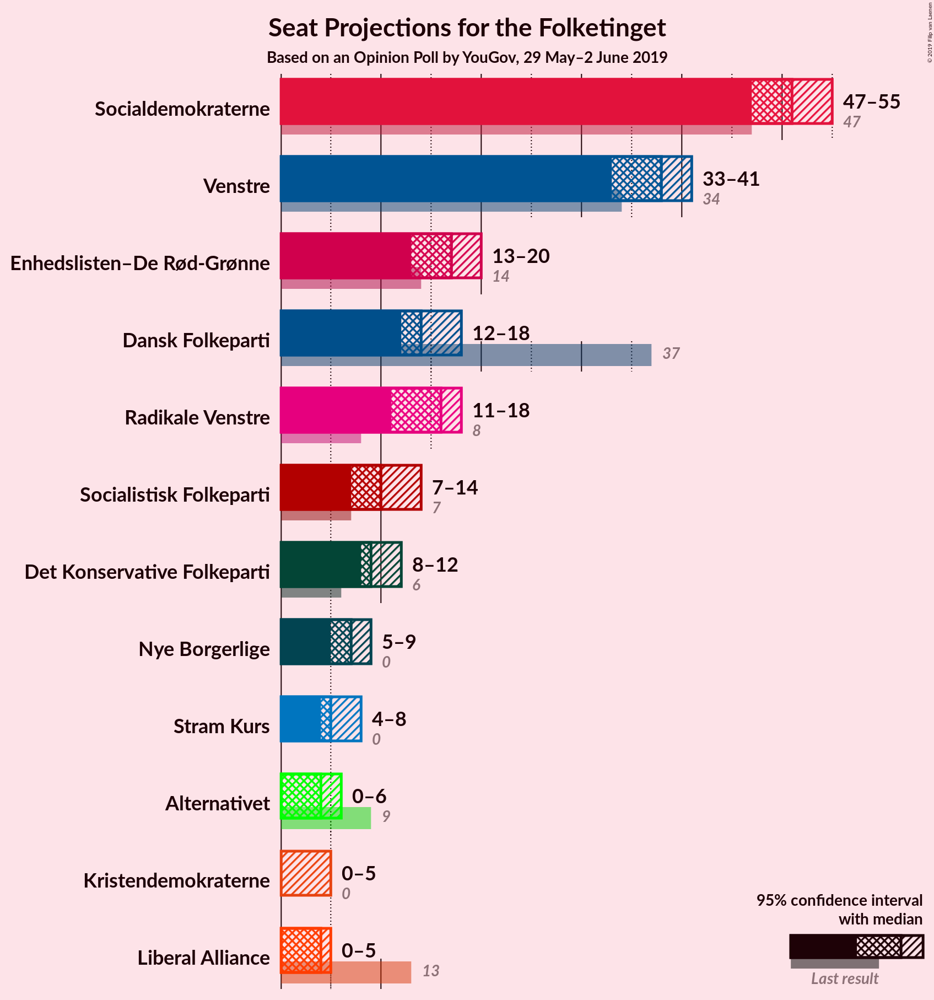

### Confidence Intervals

| Party | Last Result | Median | 80% Confidence Interval | 90% Confidence Interval | 95% Confidence Interval | 99% Confidence Interval |
|:-----:|:-----------:|:------:|:-----------------------:|:-----------------------:|:-----------------------:|:-----------------------:|
| <a href="#socialdemokraterne">Socialdemokraterne</a> | 47 | 51 | 49–53 |48–53 |47–55 |44–59 |
| <a href="#venstre">Venstre</a> | 34 | 38 | 34–40 |33–40 |33–41 |31–42 |
| <a href="#enhedslisten–de-rød-grønne">Enhedslisten–De Rød-Grønne</a> | 14 | 17 | 15–20 |13–20 |13–20 |13–21 |
| <a href="#dansk-folkeparti">Dansk Folkeparti</a> | 37 | 14 | 13–17 |13–18 |12–18 |11–19 |
| <a href="#radikale-venstre">Radikale Venstre</a> | 8 | 16 | 11–17 |11–18 |11–18 |11–20 |
| <a href="#socialistisk-folkeparti">Socialistisk Folkeparti</a> | 7 | 10 | 9–13 |8–13 |7–14 |7–14 |
| <a href="#det-konservative-folkeparti">Det Konservative Folkeparti</a> | 6 | 9 | 9–12 |8–12 |8–12 |6–13 |
| <a href="#nye-borgerlige">Nye Borgerlige</a> | 0 | 7 | 5–8 |5–8 |5–9 |5–10 |
| <a href="#stram-kurs">Stram Kurs</a> | 0 | 5 | 4–8 |4–8 |4–8 |0–8 |
| <a href="#alternativet">Alternativet</a> | 9 | 4 | 0–5 |0–5 |0–6 |0–8 |
| <a href="#liberal-alliance">Liberal Alliance</a> | 13 | 4 | 0–5 |0–5 |0–5 |0–7 |
| <a href="#kristendemokraterne">Kristendemokraterne</a> | 0 | 0 | 0–5 |0–5 |0–5 |0–6 |

### Socialdemokraterne

*For a full overview of the results for this party, see the [Socialdemokraterne](party-socialdemokraterne.html) page.*

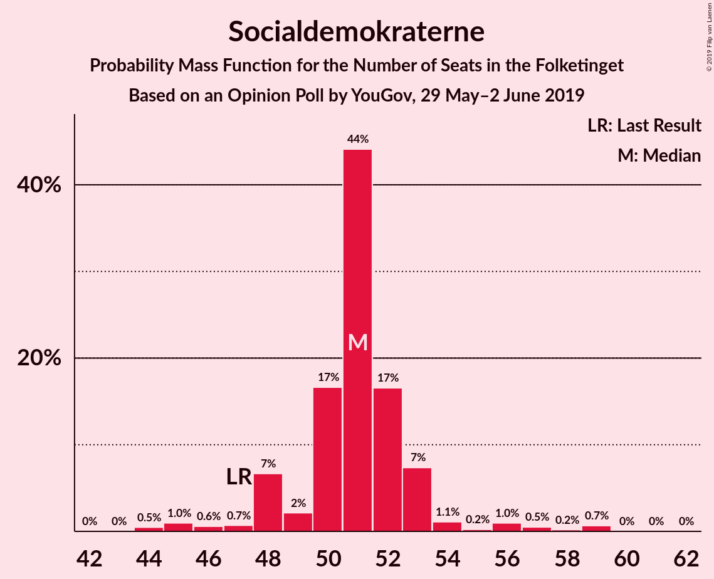

| Number of Seats | Probability | Accumulated | Special Marks |
|:---------------:|:-----------:|:-----------:|:-------------:|
| 43 | 0% | 100% |  |
| 44 | 0.5% | 99.9% |  |
| 45 | 1.0% | 99.5% |  |
| 46 | 0.6% | 98.5% |  |
| 47 | 0.7% | 98% | Last Result |
| 48 | 7% | 97% |  |
| 49 | 2% | 91% |  |
| 50 | 17% | 88% |  |
| 51 | 44% | 72% | Median |
| 52 | 17% | 28% |  |
| 53 | 7% | 11% |  |
| 54 | 1.1% | 4% |  |
| 55 | 0.2% | 3% |  |
| 56 | 1.0% | 2% |  |
| 57 | 0.5% | 1.4% |  |
| 58 | 0.2% | 0.9% |  |
| 59 | 0.7% | 0.7% |  |
| 60 | 0% | 0.1% |  |
| 61 | 0% | 0.1% |  |
| 62 | 0% | 0% |  |

### Venstre

*For a full overview of the results for this party, see the [Venstre](party-venstre.html) page.*

| Number of Seats | Probability | Accumulated | Special Marks |
|:---------------:|:-----------:|:-----------:|:-------------:|
| 29 | 0% | 100% |  |
| 30 | 0.1% | 99.9% |  |
| 31 | 1.0% | 99.8% |  |
| 32 | 1.3% | 98.9% |  |
| 33 | 7% | 98% |  |
| 34 | 4% | 91% | Last Result |
| 35 | 2% | 87% |  |
| 36 | 29% | 85% |  |
| 37 | 2% | 55% |  |
| 38 | 18% | 54% | Median |
| 39 | 20% | 36% |  |
| 40 | 12% | 16% |  |
| 41 | 3% | 4% |  |
| 42 | 0.9% | 1.3% |  |
| 43 | 0.1% | 0.4% |  |
| 44 | 0.2% | 0.3% |  |
| 45 | 0% | 0% |  |

### Enhedslisten–De Rød-Grønne

*For a full overview of the results for this party, see the [Enhedslisten–De Rød-Grønne](party-enhedslisten–derød-grønne.html) page.*

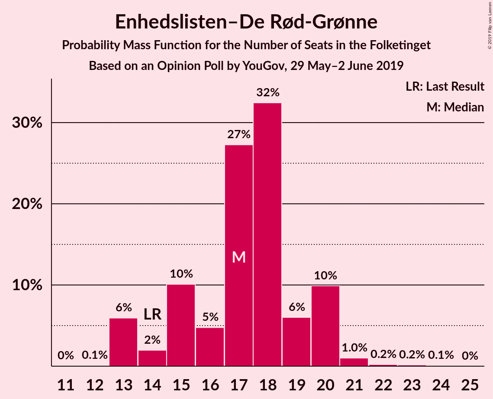

| Number of Seats | Probability | Accumulated | Special Marks |
|:---------------:|:-----------:|:-----------:|:-------------:|
| 12 | 0.1% | 100% |  |
| 13 | 6% | 99.9% |  |
| 14 | 2% | 94% | Last Result |
| 15 | 10% | 92% |  |
| 16 | 5% | 82% |  |
| 17 | 27% | 77% | Median |
| 18 | 32% | 50% |  |
| 19 | 6% | 17% |  |
| 20 | 10% | 11% |  |
| 21 | 1.0% | 1.5% |  |
| 22 | 0.2% | 0.5% |  |
| 23 | 0.2% | 0.3% |  |
| 24 | 0.1% | 0.1% |  |
| 25 | 0% | 0% |  |

### Dansk Folkeparti

*For a full overview of the results for this party, see the [Dansk Folkeparti](party-danskfolkeparti.html) page.*

| Number of Seats | Probability | Accumulated | Special Marks |
|:---------------:|:-----------:|:-----------:|:-------------:|
| 10 | 0.2% | 100% |  |
| 11 | 0.5% | 99.8% |  |
| 12 | 3% | 99.3% |  |
| 13 | 38% | 96% |  |
| 14 | 28% | 59% | Median |
| 15 | 6% | 31% |  |
| 16 | 6% | 25% |  |
| 17 | 14% | 19% |  |
| 18 | 4% | 5% |  |
| 19 | 0.6% | 0.9% |  |
| 20 | 0.3% | 0.4% |  |
| 21 | 0% | 0.1% |  |
| 22 | 0% | 0% |  |
| 23 | 0% | 0% |  |
| 24 | 0% | 0% |  |
| 25 | 0% | 0% |  |
| 26 | 0% | 0% |  |
| 27 | 0% | 0% |  |
| 28 | 0% | 0% |  |
| 29 | 0% | 0% |  |
| 30 | 0% | 0% |  |
| 31 | 0% | 0% |  |
| 32 | 0% | 0% |  |
| 33 | 0% | 0% |  |
| 34 | 0% | 0% |  |
| 35 | 0% | 0% |  |
| 36 | 0% | 0% |  |
| 37 | 0% | 0% | Last Result |

### Radikale Venstre

*For a full overview of the results for this party, see the [Radikale Venstre](party-radikalevenstre.html) page.*

| Number of Seats | Probability | Accumulated | Special Marks |
|:---------------:|:-----------:|:-----------:|:-------------:|
| 8 | 0% | 100% | Last Result |
| 9 | 0% | 100% |  |
| 10 | 0.4% | 100% |  |
| 11 | 11% | 99.5% |  |
| 12 | 3% | 88% |  |
| 13 | 10% | 86% |  |
| 14 | 4% | 76% |  |
| 15 | 12% | 72% |  |
| 16 | 41% | 60% | Median |
| 17 | 11% | 19% |  |
| 18 | 7% | 9% |  |
| 19 | 0.2% | 2% |  |
| 20 | 2% | 2% |  |
| 21 | 0% | 0% |  |

### Socialistisk Folkeparti

*For a full overview of the results for this party, see the [Socialistisk Folkeparti](party-socialistiskfolkeparti.html) page.*

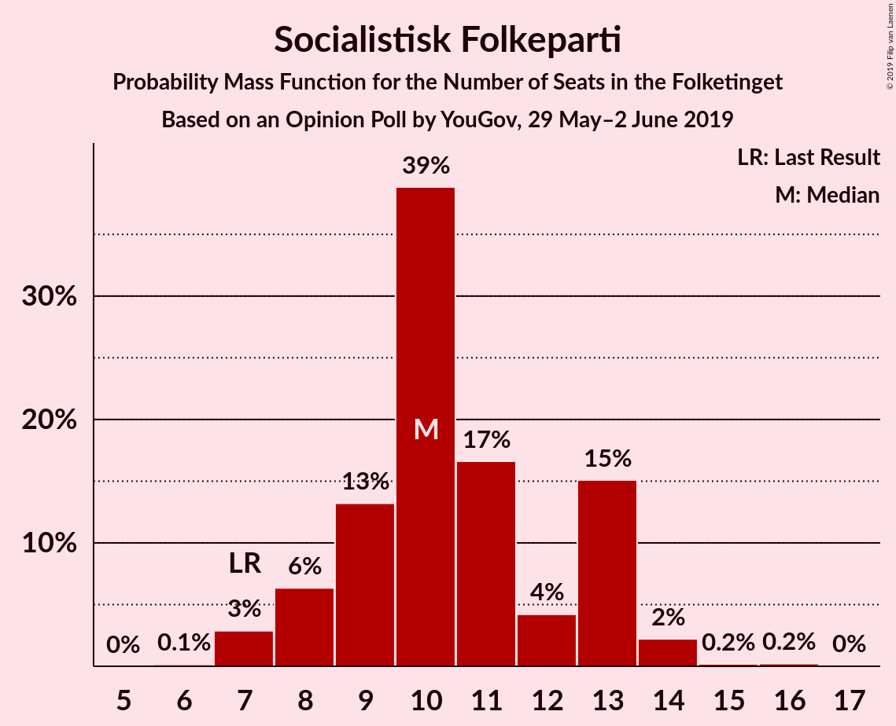

| Number of Seats | Probability | Accumulated | Special Marks |
|:---------------:|:-----------:|:-----------:|:-------------:|
| 6 | 0.1% | 100% |  |
| 7 | 3% | 99.9% | Last Result |
| 8 | 6% | 97% |  |
| 9 | 13% | 91% |  |
| 10 | 39% | 77% | Median |
| 11 | 17% | 39% |  |
| 12 | 4% | 22% |  |
| 13 | 15% | 18% |  |
| 14 | 2% | 3% |  |
| 15 | 0.2% | 0.4% |  |
| 16 | 0.2% | 0.2% |  |
| 17 | 0% | 0% |  |

### Det Konservative Folkeparti

*For a full overview of the results for this party, see the [Det Konservative Folkeparti](party-detkonservativefolkeparti.html) page.*

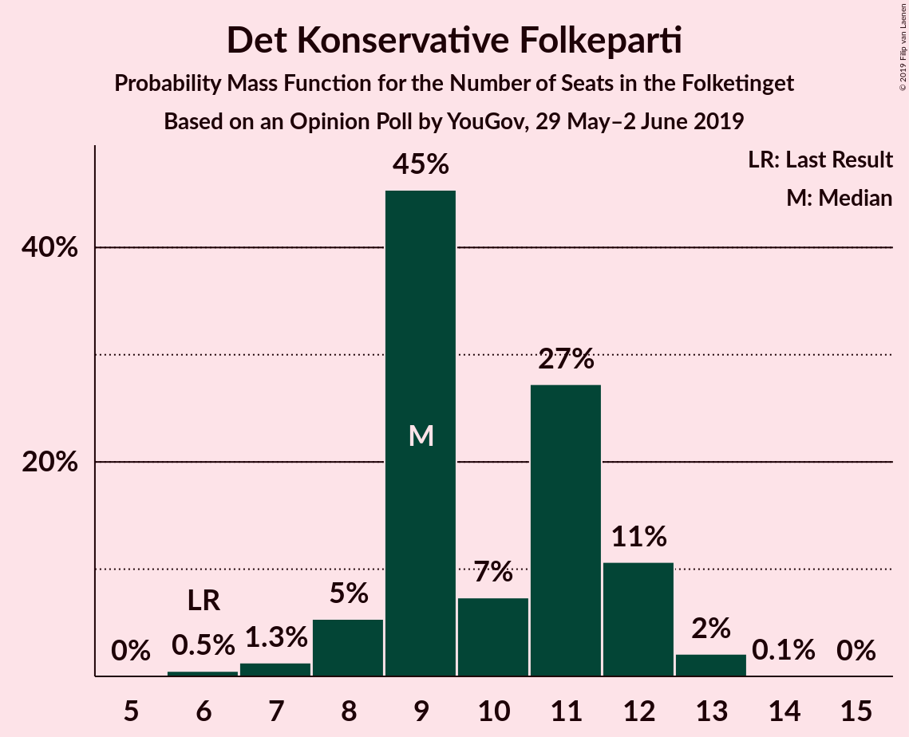

| Number of Seats | Probability | Accumulated | Special Marks |
|:---------------:|:-----------:|:-----------:|:-------------:|
| 6 | 0.5% | 100% | Last Result |
| 7 | 1.3% | 99.5% |  |
| 8 | 5% | 98% |  |
| 9 | 45% | 93% | Median |
| 10 | 7% | 47% |  |
| 11 | 27% | 40% |  |
| 12 | 11% | 13% |  |
| 13 | 2% | 2% |  |
| 14 | 0.1% | 0.1% |  |
| 15 | 0% | 0% |  |

### Nye Borgerlige

*For a full overview of the results for this party, see the [Nye Borgerlige](party-nyeborgerlige.html) page.*

| Number of Seats | Probability | Accumulated | Special Marks |
|:---------------:|:-----------:|:-----------:|:-------------:|
| 0 | 0% | 100% | Last Result |
| 1 | 0% | 100% |  |
| 2 | 0% | 100% |  |
| 3 | 0% | 100% |  |
| 4 | 0.1% | 100% |  |
| 5 | 20% | 99.9% |  |
| 6 | 11% | 80% |  |
| 7 | 48% | 69% | Median |
| 8 | 16% | 20% |  |
| 9 | 3% | 4% |  |
| 10 | 0.8% | 1.3% |  |
| 11 | 0.2% | 0.5% |  |
| 12 | 0.2% | 0.2% |  |
| 13 | 0% | 0% |  |

### Stram Kurs

*For a full overview of the results for this party, see the [Stram Kurs](party-stramkurs.html) page.*

| Number of Seats | Probability | Accumulated | Special Marks |
|:---------------:|:-----------:|:-----------:|:-------------:|
| 0 | 1.2% | 100% | Last Result |
| 1 | 0% | 98.8% |  |
| 2 | 0% | 98.8% |  |
| 3 | 0% | 98.8% |  |
| 4 | 10% | 98.8% |  |
| 5 | 46% | 89% | Median |
| 6 | 21% | 43% |  |
| 7 | 3% | 22% |  |
| 8 | 19% | 20% |  |
| 9 | 0.3% | 0.4% |  |
| 10 | 0% | 0.1% |  |
| 11 | 0% | 0% |  |

### Alternativet

*For a full overview of the results for this party, see the [Alternativet](party-alternativet.html) page.*

| Number of Seats | Probability | Accumulated | Special Marks |
|:---------------:|:-----------:|:-----------:|:-------------:|
| 0 | 38% | 100% |  |
| 1 | 0% | 62% |  |
| 2 | 0% | 62% |  |
| 3 | 0% | 62% |  |
| 4 | 41% | 62% | Median |
| 5 | 17% | 21% |  |
| 6 | 2% | 4% |  |
| 7 | 2% | 2% |  |
| 8 | 0.5% | 0.6% |  |
| 9 | 0.1% | 0.1% | Last Result |
| 10 | 0% | 0% |  |

### Liberal Alliance

*For a full overview of the results for this party, see the [Liberal Alliance](party-liberalalliance.html) page.*

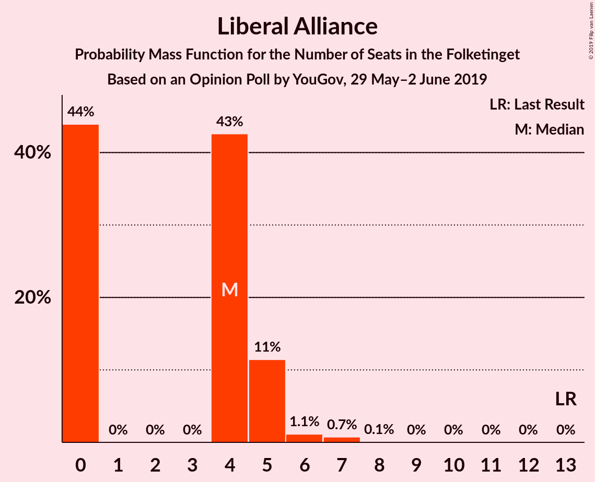

| Number of Seats | Probability | Accumulated | Special Marks |
|:---------------:|:-----------:|:-----------:|:-------------:|
| 0 | 44% | 100% |  |
| 1 | 0% | 56% |  |
| 2 | 0% | 56% |  |
| 3 | 0% | 56% |  |
| 4 | 43% | 56% | Median |
| 5 | 11% | 13% |  |
| 6 | 1.1% | 2% |  |
| 7 | 0.7% | 0.9% |  |
| 8 | 0.1% | 0.1% |  |
| 9 | 0% | 0% |  |
| 10 | 0% | 0% |  |
| 11 | 0% | 0% |  |
| 12 | 0% | 0% |  |
| 13 | 0% | 0% | Last Result |

### Kristendemokraterne

*For a full overview of the results for this party, see the [Kristendemokraterne](party-kristendemokraterne.html) page.*

| Number of Seats | Probability | Accumulated | Special Marks |
|:---------------:|:-----------:|:-----------:|:-------------:|
| 0 | 56% | 100% | Last Result, Median |
| 1 | 0% | 44% |  |
| 2 | 0% | 44% |  |
| 3 | 0.1% | 44% |  |
| 4 | 16% | 44% |  |
| 5 | 27% | 28% |  |
| 6 | 1.0% | 1.1% |  |
| 7 | 0.1% | 0.1% |  |
| 8 | 0% | 0% |  |

## Coalitions

### Confidence Intervals

| Coalition | Last Result | Median | Majority? | 80% Confidence Interval | 90% Confidence Interval | 95% Confidence Interval | 99% Confidence Interval |
|:---------:|:-----------:|:------:|:---------:|:-----------------------:|:-----------------------:|:-----------------------:|:-----------------------:|
| Socialdemokraterne – Enhedslisten–De Rød-Grønne – Radikale Venstre – Socialistisk Folkeparti – Alternativet | 85 | 97 | 98.9% | 91–98 | 91–101 | 90–102 | 88–105 |
| Socialdemokraterne – Enhedslisten–De Rød-Grønne – Radikale Venstre – Socialistisk Folkeparti | 76 | 94 | 91% | 90–97 | 89–97 | 86–98 | 85–101 |
| Socialdemokraterne – Enhedslisten–De Rød-Grønne – Socialistisk Folkeparti – Alternativet | 77 | 81 | 2% | 78–87 | 76–87 | 74–87 | 73–91 |
| Socialdemokraterne – Enhedslisten–De Rød-Grønne – Socialistisk Folkeparti | 68 | 78 | 0% | 76–82 | 74–82 | 73–84 | 70–87 |
| Venstre – Dansk Folkeparti – Det Konservative Folkeparti – Nye Borgerlige – Liberal Alliance – Kristendemokraterne | 90 | 72 | 0% | 70–78 | 68–80 | 68–80 | 65–81 |
| Venstre – Dansk Folkeparti – Det Konservative Folkeparti – Nye Borgerlige – Liberal Alliance | 90 | 70 | 0% | 67–76 | 67–80 | 66–80 | 63–80 |
| Socialdemokraterne – Radikale Venstre – Socialistisk Folkeparti | 62 | 77 | 0% | 73–79 | 71–79 | 71–79 | 69–86 |
| Venstre – Dansk Folkeparti – Det Konservative Folkeparti – Liberal Alliance – Kristendemokraterne | 90 | 65 | 0% | 64–71 | 61–73 | 60–73 | 59–74 |
| Venstre – Dansk Folkeparti – Det Konservative Folkeparti – Liberal Alliance | 90 | 65 | 0% | 60–69 | 60–73 | 60–73 | 56–73 |
| Socialdemokraterne – Radikale Venstre | 55 | 67 | 0% | 62–68 | 62–68 | 61–70 | 58–75 |
| Venstre – Det Konservative Folkeparti – Liberal Alliance | 53 | 50 | 0% | 47–53 | 46–56 | 45–56 | 42–56 |
| Venstre – Det Konservative Folkeparti | 40 | 47 | 0% | 43–52 | 42–52 | 41–52 | 40–52 |
| Venstre | 34 | 38 | 0% | 34–40 | 33–40 | 33–41 | 31–42 |

### Socialdemokraterne – Enhedslisten–De Rød-Grønne – Radikale Venstre – Socialistisk Folkeparti – Alternativet

| Number of Seats | Probability | Accumulated | Special Marks |
|:---------------:|:-----------:|:-----------:|:-------------:|
| 84 | 0.1% | 100% |  |
| 85 | 0.1% | 99.9% | Last Result |
| 86 | 0% | 99.9% |  |
| 87 | 0% | 99.8% |  |
| 88 | 0.5% | 99.8% |  |
| 89 | 0.4% | 99.3% |  |
| 90 | 3% | 98.9% | Majority |
| 91 | 7% | 96% |  |
| 92 | 1.1% | 90% |  |
| 93 | 5% | 89% |  |
| 94 | 1.3% | 83% |  |
| 95 | 6% | 82% |  |
| 96 | 9% | 76% |  |
| 97 | 25% | 67% |  |
| 98 | 32% | 42% | Median |
| 99 | 1.0% | 10% |  |
| 100 | 1.3% | 9% |  |
| 101 | 3% | 7% |  |
| 102 | 2% | 5% |  |
| 103 | 2% | 2% |  |
| 104 | 0.1% | 0.7% |  |
| 105 | 0.2% | 0.6% |  |
| 106 | 0.2% | 0.4% |  |
| 107 | 0% | 0.1% |  |
| 108 | 0.1% | 0.1% |  |
| 109 | 0% | 0% |  |

### Socialdemokraterne – Enhedslisten–De Rød-Grønne – Radikale Venstre – Socialistisk Folkeparti

| Number of Seats | Probability | Accumulated | Special Marks |
|:---------------:|:-----------:|:-----------:|:-------------:|
| 76 | 0% | 100% | Last Result |
| 77 | 0% | 100% |  |
| 78 | 0% | 100% |  |
| 79 | 0% | 100% |  |
| 80 | 0% | 100% |  |
| 81 | 0% | 100% |  |
| 82 | 0.1% | 100% |  |
| 83 | 0.1% | 99.9% |  |
| 84 | 0.2% | 99.8% |  |
| 85 | 0.4% | 99.6% |  |
| 86 | 2% | 99.2% |  |
| 87 | 0.2% | 97% |  |
| 88 | 2% | 97% |  |
| 89 | 5% | 95% |  |
| 90 | 3% | 91% | Majority |
| 91 | 12% | 88% |  |
| 92 | 6% | 76% |  |
| 93 | 10% | 70% |  |
| 94 | 24% | 61% | Median |
| 95 | 1.2% | 37% |  |
| 96 | 8% | 35% |  |
| 97 | 25% | 28% |  |
| 98 | 1.1% | 3% |  |
| 99 | 0.4% | 2% |  |
| 100 | 0.2% | 1.1% |  |
| 101 | 0.4% | 0.9% |  |
| 102 | 0.1% | 0.5% |  |
| 103 | 0.3% | 0.4% |  |
| 104 | 0% | 0.1% |  |
| 105 | 0% | 0% |  |

### Socialdemokraterne – Enhedslisten–De Rød-Grønne – Socialistisk Folkeparti – Alternativet

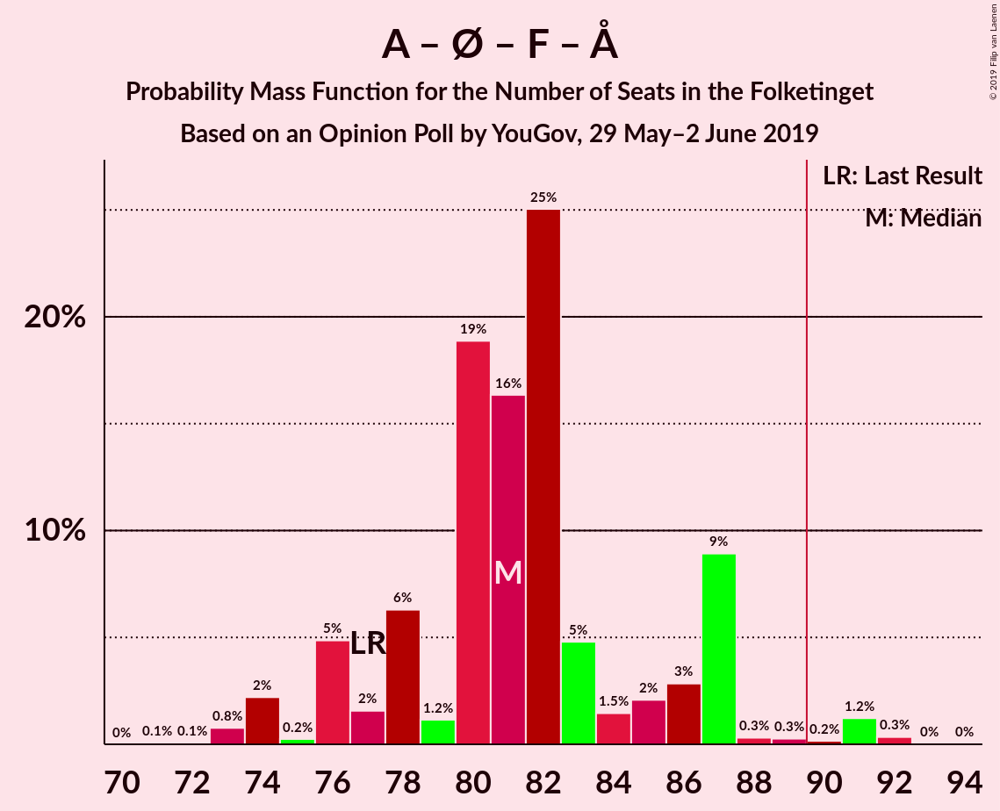

| Number of Seats | Probability | Accumulated | Special Marks |
|:---------------:|:-----------:|:-----------:|:-------------:|
| 71 | 0.1% | 100% |  |
| 72 | 0.1% | 99.9% |  |
| 73 | 0.8% | 99.8% |  |
| 74 | 2% | 99.1% |  |
| 75 | 0.2% | 97% |  |
| 76 | 5% | 97% |  |
| 77 | 2% | 92% | Last Result |
| 78 | 6% | 90% |  |
| 79 | 1.2% | 84% |  |
| 80 | 19% | 83% |  |
| 81 | 16% | 64% |  |
| 82 | 25% | 48% | Median |
| 83 | 5% | 22% |  |
| 84 | 1.5% | 18% |  |
| 85 | 2% | 16% |  |
| 86 | 3% | 14% |  |
| 87 | 9% | 11% |  |
| 88 | 0.3% | 2% |  |
| 89 | 0.3% | 2% |  |
| 90 | 0.2% | 2% | Majority |
| 91 | 1.2% | 2% |  |
| 92 | 0.3% | 0.4% |  |
| 93 | 0% | 0.1% |  |
| 94 | 0% | 0% |  |

### Socialdemokraterne – Enhedslisten–De Rød-Grønne – Socialistisk Folkeparti

| Number of Seats | Probability | Accumulated | Special Marks |
|:---------------:|:-----------:|:-----------:|:-------------:|
| 68 | 0.3% | 100% | Last Result |
| 69 | 0.1% | 99.7% |  |
| 70 | 0.1% | 99.6% |  |
| 71 | 0.2% | 99.4% |  |
| 72 | 0.7% | 99.2% |  |
| 73 | 1.3% | 98.5% |  |
| 74 | 3% | 97% |  |
| 75 | 2% | 94% |  |
| 76 | 14% | 92% |  |
| 77 | 5% | 78% |  |
| 78 | 30% | 73% | Median |
| 79 | 4% | 44% |  |
| 80 | 10% | 40% |  |
| 81 | 17% | 30% |  |
| 82 | 9% | 12% |  |
| 83 | 0.6% | 3% |  |
| 84 | 1.4% | 3% |  |
| 85 | 0.4% | 1.3% |  |
| 86 | 0.3% | 1.0% |  |
| 87 | 0.4% | 0.7% |  |
| 88 | 0.3% | 0.3% |  |
| 89 | 0% | 0% |  |

### Venstre – Dansk Folkeparti – Det Konservative Folkeparti – Nye Borgerlige – Liberal Alliance – Kristendemokraterne

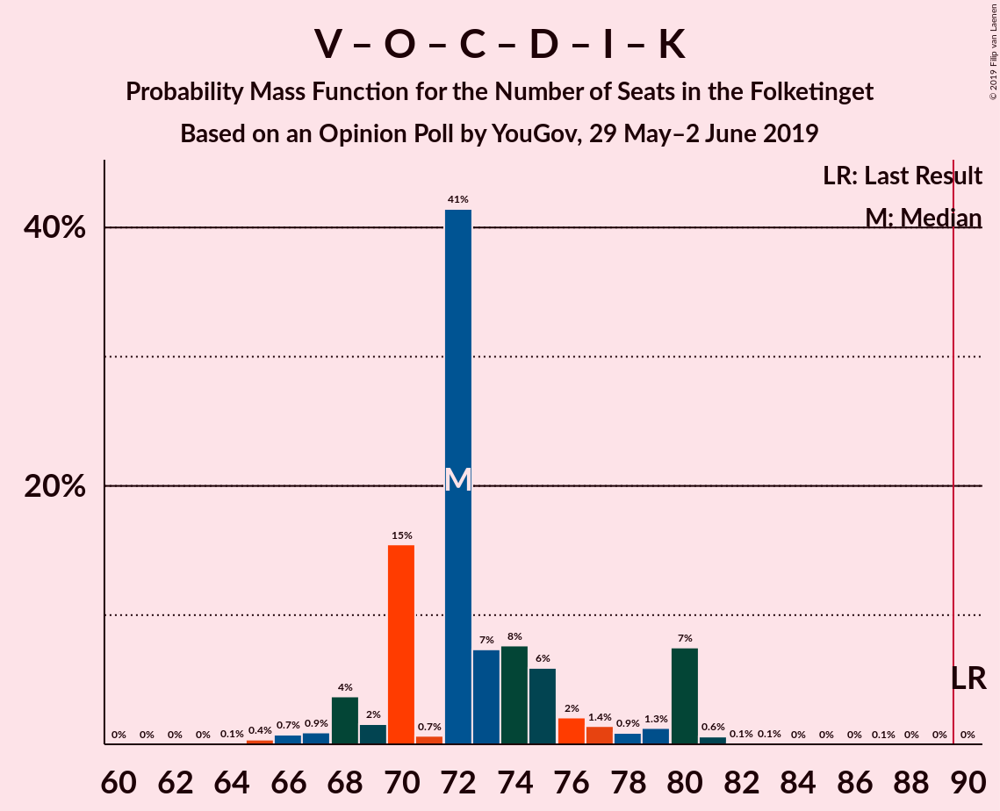

| Number of Seats | Probability | Accumulated | Special Marks |
|:---------------:|:-----------:|:-----------:|:-------------:|
| 61 | 0% | 100% |  |
| 62 | 0% | 99.9% |  |
| 63 | 0% | 99.9% |  |
| 64 | 0.1% | 99.9% |  |
| 65 | 0.4% | 99.8% |  |
| 66 | 0.7% | 99.4% |  |
| 67 | 0.9% | 98.7% |  |
| 68 | 4% | 98% |  |
| 69 | 2% | 94% |  |
| 70 | 15% | 92% |  |
| 71 | 0.7% | 77% |  |
| 72 | 41% | 76% | Median |
| 73 | 7% | 35% |  |
| 74 | 8% | 28% |  |
| 75 | 6% | 20% |  |
| 76 | 2% | 14% |  |
| 77 | 1.4% | 12% |  |
| 78 | 0.9% | 11% |  |
| 79 | 1.3% | 10% |  |
| 80 | 7% | 8% |  |
| 81 | 0.6% | 0.9% |  |
| 82 | 0.1% | 0.3% |  |
| 83 | 0.1% | 0.2% |  |
| 84 | 0% | 0.1% |  |
| 85 | 0% | 0.1% |  |
| 86 | 0% | 0.1% |  |
| 87 | 0.1% | 0.1% |  |
| 88 | 0% | 0% |  |
| 89 | 0% | 0% |  |
| 90 | 0% | 0% | Last Result, Majority |

### Venstre – Dansk Folkeparti – Det Konservative Folkeparti – Nye Borgerlige – Liberal Alliance

| Number of Seats | Probability | Accumulated | Special Marks |
|:---------------:|:-----------:|:-----------:|:-------------:|
| 61 | 0.1% | 100% |  |
| 62 | 0% | 99.9% |  |
| 63 | 0.5% | 99.8% |  |
| 64 | 0.6% | 99.3% |  |
| 65 | 0.4% | 98.7% |  |
| 66 | 0.8% | 98% |  |
| 67 | 24% | 97% |  |
| 68 | 11% | 73% |  |
| 69 | 2% | 62% |  |
| 70 | 16% | 60% |  |
| 71 | 6% | 44% |  |
| 72 | 11% | 38% | Median |
| 73 | 7% | 27% |  |
| 74 | 8% | 19% |  |
| 75 | 0.9% | 11% |  |
| 76 | 1.4% | 10% |  |
| 77 | 0.6% | 9% |  |
| 78 | 0.5% | 8% |  |
| 79 | 0.1% | 8% |  |
| 80 | 7% | 7% |  |
| 81 | 0.1% | 0.2% |  |
| 82 | 0% | 0.1% |  |
| 83 | 0% | 0.1% |  |
| 84 | 0% | 0.1% |  |
| 85 | 0% | 0.1% |  |
| 86 | 0% | 0.1% |  |
| 87 | 0.1% | 0.1% |  |
| 88 | 0% | 0% |  |
| 89 | 0% | 0% |  |
| 90 | 0% | 0% | Last Result, Majority |

### Socialdemokraterne – Radikale Venstre – Socialistisk Folkeparti

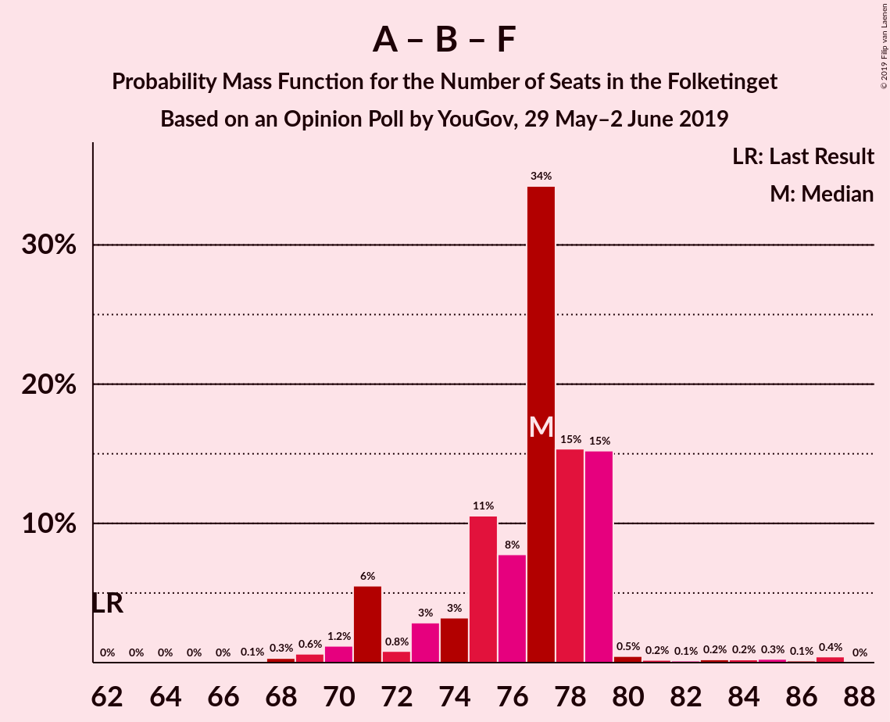

| Number of Seats | Probability | Accumulated | Special Marks |
|:---------------:|:-----------:|:-----------:|:-------------:|
| 62 | 0% | 100% | Last Result |
| 63 | 0% | 100% |  |
| 64 | 0% | 100% |  |
| 65 | 0% | 100% |  |
| 66 | 0% | 100% |  |
| 67 | 0.1% | 100% |  |
| 68 | 0.3% | 99.9% |  |
| 69 | 0.6% | 99.6% |  |
| 70 | 1.2% | 98.9% |  |
| 71 | 6% | 98% |  |
| 72 | 0.8% | 92% |  |
| 73 | 3% | 91% |  |
| 74 | 3% | 89% |  |
| 75 | 11% | 85% |  |
| 76 | 8% | 75% |  |
| 77 | 34% | 67% | Median |
| 78 | 15% | 33% |  |
| 79 | 15% | 17% |  |
| 80 | 0.5% | 2% |  |
| 81 | 0.2% | 2% |  |
| 82 | 0.1% | 1.5% |  |
| 83 | 0.2% | 1.3% |  |
| 84 | 0.2% | 1.1% |  |
| 85 | 0.3% | 0.9% |  |
| 86 | 0.1% | 0.6% |  |
| 87 | 0.4% | 0.5% |  |
| 88 | 0% | 0% |  |

### Venstre – Dansk Folkeparti – Det Konservative Folkeparti – Liberal Alliance – Kristendemokraterne

| Number of Seats | Probability | Accumulated | Special Marks |
|:---------------:|:-----------:|:-----------:|:-------------:|
| 55 | 0.1% | 100% |  |
| 56 | 0% | 99.8% |  |
| 57 | 0.1% | 99.8% |  |
| 58 | 0.1% | 99.7% |  |
| 59 | 0.3% | 99.5% |  |
| 60 | 4% | 99.2% |  |
| 61 | 2% | 95% |  |
| 62 | 0.5% | 94% |  |
| 63 | 2% | 93% |  |
| 64 | 2% | 91% |  |
| 65 | 50% | 89% | Median |
| 66 | 15% | 39% |  |
| 67 | 2% | 24% |  |
| 68 | 8% | 22% |  |
| 69 | 3% | 14% |  |
| 70 | 0.8% | 11% |  |
| 71 | 0.3% | 10% |  |
| 72 | 2% | 10% |  |
| 73 | 7% | 8% |  |
| 74 | 0.5% | 0.8% |  |
| 75 | 0.1% | 0.2% |  |
| 76 | 0% | 0.1% |  |
| 77 | 0.1% | 0.1% |  |
| 78 | 0% | 0% |  |
| 79 | 0% | 0% |  |
| 80 | 0% | 0% |  |
| 81 | 0% | 0% |  |
| 82 | 0% | 0% |  |
| 83 | 0% | 0% |  |
| 84 | 0% | 0% |  |
| 85 | 0% | 0% |  |
| 86 | 0% | 0% |  |
| 87 | 0% | 0% |  |
| 88 | 0% | 0% |  |
| 89 | 0% | 0% |  |
| 90 | 0% | 0% | Last Result, Majority |

### Venstre – Dansk Folkeparti – Det Konservative Folkeparti – Liberal Alliance

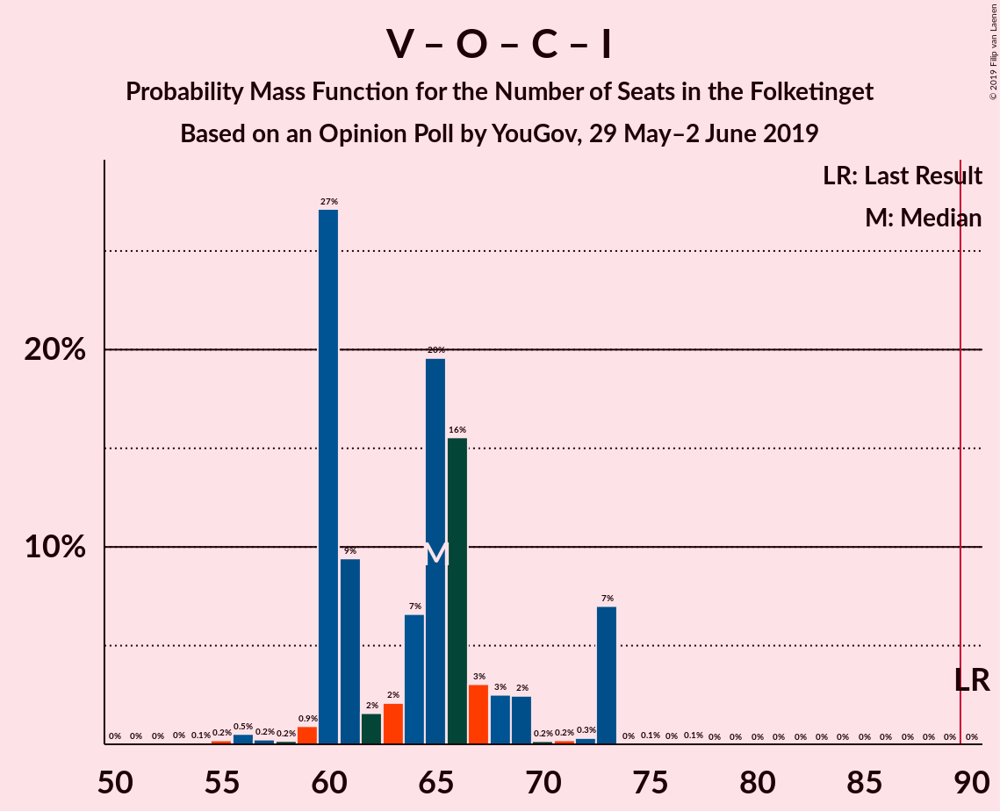

| Number of Seats | Probability | Accumulated | Special Marks |
|:---------------:|:-----------:|:-----------:|:-------------:|
| 53 | 0% | 100% |  |
| 54 | 0.1% | 99.9% |  |
| 55 | 0.2% | 99.9% |  |
| 56 | 0.5% | 99.7% |  |
| 57 | 0.2% | 99.2% |  |
| 58 | 0.2% | 98.9% |  |
| 59 | 0.9% | 98.7% |  |
| 60 | 27% | 98% |  |
| 61 | 9% | 71% |  |
| 62 | 2% | 61% |  |
| 63 | 2% | 60% |  |
| 64 | 7% | 58% |  |
| 65 | 20% | 51% | Median |
| 66 | 16% | 31% |  |
| 67 | 3% | 16% |  |
| 68 | 3% | 13% |  |
| 69 | 2% | 10% |  |
| 70 | 0.2% | 8% |  |
| 71 | 0.2% | 8% |  |
| 72 | 0.3% | 7% |  |
| 73 | 7% | 7% |  |
| 74 | 0% | 0.2% |  |
| 75 | 0.1% | 0.2% |  |
| 76 | 0% | 0.1% |  |
| 77 | 0.1% | 0.1% |  |
| 78 | 0% | 0% |  |
| 79 | 0% | 0% |  |
| 80 | 0% | 0% |  |
| 81 | 0% | 0% |  |
| 82 | 0% | 0% |  |
| 83 | 0% | 0% |  |
| 84 | 0% | 0% |  |
| 85 | 0% | 0% |  |
| 86 | 0% | 0% |  |
| 87 | 0% | 0% |  |
| 88 | 0% | 0% |  |
| 89 | 0% | 0% |  |
| 90 | 0% | 0% | Last Result, Majority |

### Socialdemokraterne – Radikale Venstre

| Number of Seats | Probability | Accumulated | Special Marks |
|:---------------:|:-----------:|:-----------:|:-------------:|
| 55 | 0% | 100% | Last Result |
| 56 | 0.1% | 100% |  |
| 57 | 0.2% | 99.9% |  |
| 58 | 0.9% | 99.8% |  |
| 59 | 0.5% | 98.9% |  |
| 60 | 0.5% | 98% |  |
| 61 | 2% | 98% |  |
| 62 | 9% | 95% |  |
| 63 | 15% | 87% |  |
| 64 | 1.0% | 72% |  |
| 65 | 1.3% | 71% |  |
| 66 | 2% | 69% |  |
| 67 | 28% | 67% | Median |
| 68 | 35% | 40% |  |
| 69 | 1.4% | 4% |  |
| 70 | 2% | 3% |  |
| 71 | 0.3% | 1.5% |  |
| 72 | 0% | 1.1% |  |
| 73 | 0.3% | 1.1% |  |
| 74 | 0.2% | 0.8% |  |
| 75 | 0.2% | 0.6% |  |
| 76 | 0.3% | 0.4% |  |
| 77 | 0% | 0% |  |

### Venstre – Det Konservative Folkeparti – Liberal Alliance

| Number of Seats | Probability | Accumulated | Special Marks |
|:---------------:|:-----------:|:-----------:|:-------------:|
| 39 | 0.1% | 100% |  |
| 40 | 0.1% | 99.9% |  |
| 41 | 0% | 99.8% |  |
| 42 | 0.6% | 99.8% |  |
| 43 | 0.2% | 99.2% |  |
| 44 | 0.5% | 99.0% |  |
| 45 | 3% | 98% |  |
| 46 | 3% | 95% |  |
| 47 | 29% | 92% |  |
| 48 | 10% | 63% |  |
| 49 | 2% | 52% |  |
| 50 | 4% | 51% |  |
| 51 | 19% | 46% | Median |
| 52 | 16% | 28% |  |
| 53 | 2% | 11% | Last Result |
| 54 | 0.6% | 10% |  |
| 55 | 4% | 9% |  |
| 56 | 5% | 5% |  |
| 57 | 0.1% | 0.4% |  |
| 58 | 0.1% | 0.2% |  |
| 59 | 0.1% | 0.1% |  |
| 60 | 0% | 0% |  |

### Venstre – Det Konservative Folkeparti

| Number of Seats | Probability | Accumulated | Special Marks |
|:---------------:|:-----------:|:-----------:|:-------------:|
| 38 | 0.1% | 100% |  |
| 39 | 0.2% | 99.9% |  |
| 40 | 1.0% | 99.7% | Last Result |
| 41 | 1.3% | 98.6% |  |
| 42 | 7% | 97% |  |
| 43 | 0.8% | 90% |  |
| 44 | 2% | 89% |  |
| 45 | 2% | 88% |  |
| 46 | 7% | 86% |  |
| 47 | 43% | 79% | Median |
| 48 | 21% | 36% |  |
| 49 | 0.8% | 16% |  |
| 50 | 3% | 15% |  |
| 51 | 2% | 12% |  |
| 52 | 10% | 11% |  |
| 53 | 0.3% | 0.5% |  |
| 54 | 0.1% | 0.2% |  |
| 55 | 0% | 0.1% |  |
| 56 | 0% | 0% |  |

### Venstre

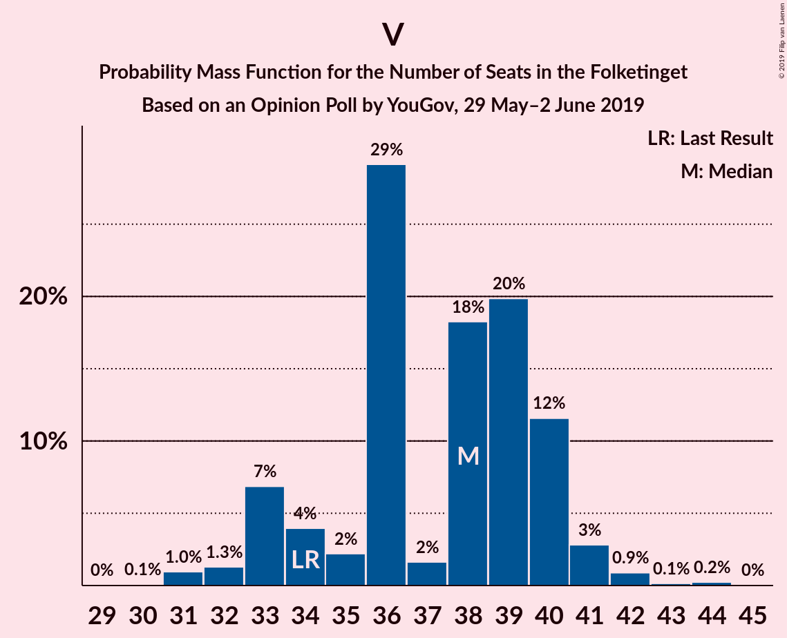

| Number of Seats | Probability | Accumulated | Special Marks |
|:---------------:|:-----------:|:-----------:|:-------------:|
| 29 | 0% | 100% |  |
| 30 | 0.1% | 99.9% |  |
| 31 | 1.0% | 99.8% |  |
| 32 | 1.3% | 98.9% |  |
| 33 | 7% | 98% |  |
| 34 | 4% | 91% | Last Result |
| 35 | 2% | 87% |  |
| 36 | 29% | 85% |  |
| 37 | 2% | 55% |  |
| 38 | 18% | 54% | Median |
| 39 | 20% | 36% |  |
| 40 | 12% | 16% |  |
| 41 | 3% | 4% |  |
| 42 | 0.9% | 1.3% |  |
| 43 | 0.1% | 0.4% |  |
| 44 | 0.2% | 0.3% |  |
| 45 | 0% | 0% |  |

## Technical Information

### Opinion Poll

+ **Polling firm:** YouGov
+ **Commissioner(s):** —
+ **Fieldwork period:** 29 May–2 June 2019

### Calculations

+ **Sample size:** 776
+ **Simulations done:** 1,048,576
+ **Error estimate:** 1.57%

