# Opinion Poll by Norstat for Altinget and Jyllands-Posten, 3 June 2019

<a href="#voting-intentions">Voting Intentions</a> | <a href="#seats">Seats</a> | <a href="#coalitions">Coalitions</a> | <a href="#technical-information">Technical Information</a>

## Voting Intentions

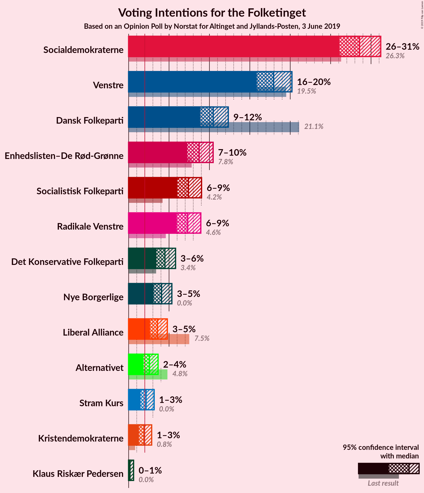

### Confidence Intervals

| Party | Last Result | Poll Result | 80% Confidence Interval | 90% Confidence Interval | 95% Confidence Interval | 99% Confidence Interval |
|:-----:|:-----------:|:-----------:|:-----------------------:|:-----------------------:|:-----------------------:|:-----------------------:|
| Socialdemokraterne | 26.3% | 28.6% | 26.9–30.3% |26.5–30.8% |26.1–31.2% |25.3–32.0% |
| Venstre | 19.5% | 17.9% | 16.6–19.4% |16.2–19.8% |15.9–20.2% |15.2–20.9% |
| Dansk Folkeparti | 21.1% | 10.5% | 9.4–11.7% |9.1–12.0% |8.9–12.3% |8.4–12.9% |
| Enhedslisten–De Rød-Grønne | 7.8% | 8.7% | 7.8–9.9% |7.5–10.2% |7.3–10.5% |6.8–11.0% |
| Socialistisk Folkeparti | 4.2% | 7.4% | 6.5–8.5% |6.2–8.7% |6.0–9.0% |5.6–9.6% |
| Radikale Venstre | 4.6% | 7.3% | 6.4–8.4% |6.2–8.7% |6.0–8.9% |5.6–9.4% |
| Det Konservative Folkeparti | 3.4% | 4.5% | 3.8–5.3% |3.6–5.6% |3.4–5.8% |3.2–6.2% |
| Nye Borgerlige | 0.0% | 4.1% | 3.4–4.9% |3.2–5.1% |3.1–5.3% |2.8–5.8% |
| Liberal Alliance | 7.5% | 3.6% | 3.0–4.4% |2.8–4.6% |2.7–4.8% |2.4–5.2% |
| Alternativet | 4.8% | 2.6% | 2.1–3.3% |1.9–3.5% |1.8–3.6% |1.6–4.0% |
| Stram Kurs | 0.0% | 2.2% | 1.7–2.8% |1.6–3.0% |1.5–3.2% |1.3–3.5% |
| Kristendemokraterne | 0.8% | 1.9% | 1.5–2.5% |1.4–2.7% |1.3–2.9% |1.1–3.2% |
| Klaus Riskær Pedersen | 0.0% | 0.2% | 0.1–0.4% |0.1–0.5% |0.0–0.6% |0.0–0.8% |

*Note:* The poll result column reflects the actual value used in the calculations. Published results may vary slightly, and in addition be rounded to fewer digits.

## Seats

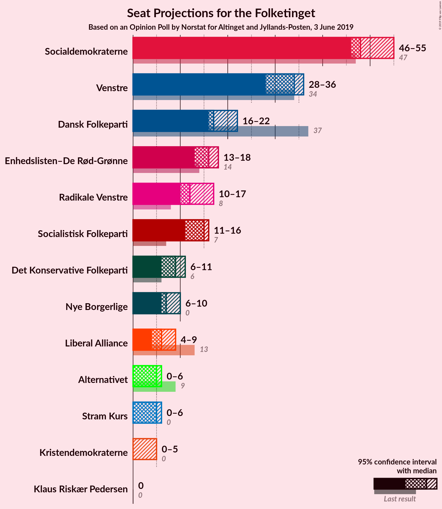

### Confidence Intervals

| Party | Last Result | Median | 80% Confidence Interval | 90% Confidence Interval | 95% Confidence Interval | 99% Confidence Interval |
|:-----:|:-----------:|:------:|:-----------------------:|:-----------------------:|:-----------------------:|:-----------------------:|
| <a href="#socialdemokraterne">Socialdemokraterne</a> | 47 | 48 | 47–53 |47–54 |46–55 |45–57 |
| <a href="#venstre">Venstre</a> | 34 | 34 | 30–34 |29–35 |28–36 |27–39 |
| <a href="#dansk-folkeparti">Dansk Folkeparti</a> | 37 | 17 | 16–20 |16–22 |16–22 |15–23 |
| <a href="#enhedslisten–de-rød-grønne">Enhedslisten–De Rød-Grønne</a> | 14 | 16 | 15–17 |14–18 |13–18 |12–21 |
| <a href="#socialistisk-folkeparti">Socialistisk Folkeparti</a> | 7 | 15 | 12–15 |11–16 |11–16 |9–18 |
| <a href="#radikale-venstre">Radikale Venstre</a> | 8 | 12 | 11–15 |11–17 |10–17 |10–17 |
| <a href="#det-konservative-folkeparti">Det Konservative Folkeparti</a> | 6 | 9 | 7–9 |6–10 |6–11 |6–12 |
| <a href="#nye-borgerlige">Nye Borgerlige</a> | 0 | 7 | 6–8 |6–9 |6–10 |5–11 |
| <a href="#liberal-alliance">Liberal Alliance</a> | 13 | 6 | 5–8 |4–9 |4–9 |4–9 |
| <a href="#alternativet">Alternativet</a> | 9 | 5 | 4–6 |0–6 |0–6 |0–7 |
| <a href="#stram-kurs">Stram Kurs</a> | 0 | 5 | 0–6 |0–6 |0–6 |0–7 |
| <a href="#kristendemokraterne">Kristendemokraterne</a> | 0 | 0 | 0–4 |0–4 |0–5 |0–6 |
| <a href="#klaus-riskær-pedersen">Klaus Riskær Pedersen</a> | 0 | 0 | 0 |0 |0 |0 |

### Socialdemokraterne

*For a full overview of the results for this party, see the [Socialdemokraterne](party-socialdemokraterne.html) page.*

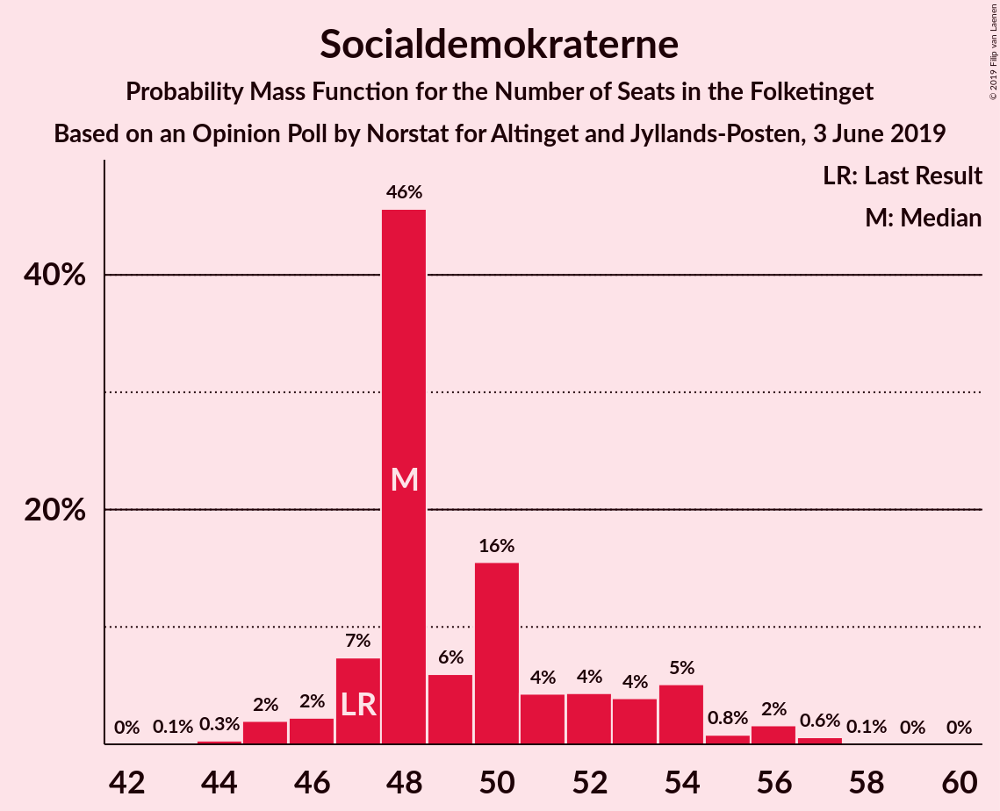

| Number of Seats | Probability | Accumulated | Special Marks |
|:---------------:|:-----------:|:-----------:|:-------------:|
| 43 | 0.1% | 100% |  |
| 44 | 0.3% | 99.9% |  |
| 45 | 2% | 99.5% |  |
| 46 | 2% | 98% |  |
| 47 | 7% | 95% | Last Result |
| 48 | 46% | 88% | Median |
| 49 | 6% | 42% |  |
| 50 | 16% | 36% |  |
| 51 | 4% | 21% |  |
| 52 | 4% | 16% |  |
| 53 | 4% | 12% |  |
| 54 | 5% | 8% |  |
| 55 | 0.8% | 3% |  |
| 56 | 2% | 2% |  |
| 57 | 0.6% | 0.7% |  |
| 58 | 0.1% | 0.1% |  |
| 59 | 0% | 0% |  |

### Venstre

*For a full overview of the results for this party, see the [Venstre](party-venstre.html) page.*

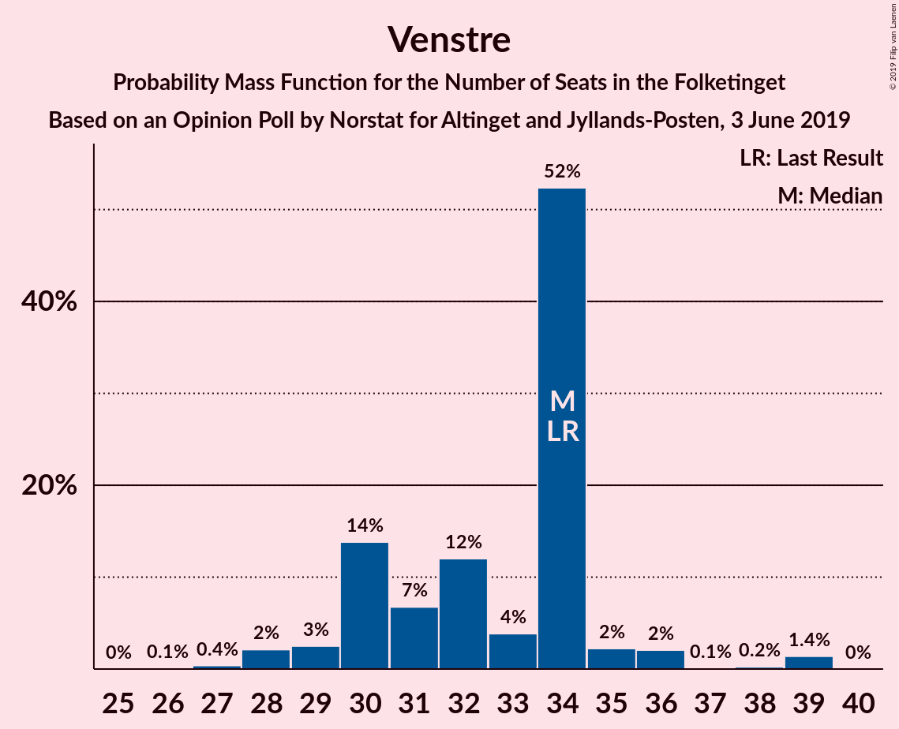

| Number of Seats | Probability | Accumulated | Special Marks |
|:---------------:|:-----------:|:-----------:|:-------------:|
| 26 | 0.1% | 100% |  |
| 27 | 0.4% | 99.9% |  |
| 28 | 2% | 99.5% |  |
| 29 | 3% | 97% |  |
| 30 | 14% | 95% |  |
| 31 | 7% | 81% |  |
| 32 | 12% | 74% |  |
| 33 | 4% | 62% |  |
| 34 | 52% | 58% | Last Result, Median |
| 35 | 2% | 6% |  |
| 36 | 2% | 4% |  |
| 37 | 0.1% | 2% |  |
| 38 | 0.2% | 2% |  |
| 39 | 1.4% | 1.4% |  |
| 40 | 0% | 0% |  |

### Dansk Folkeparti

*For a full overview of the results for this party, see the [Dansk Folkeparti](party-danskfolkeparti.html) page.*

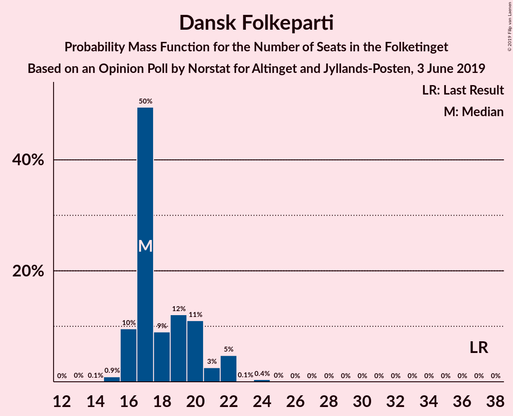

| Number of Seats | Probability | Accumulated | Special Marks |
|:---------------:|:-----------:|:-----------:|:-------------:|
| 14 | 0.1% | 100% |  |
| 15 | 0.9% | 99.9% |  |
| 16 | 10% | 99.0% |  |
| 17 | 50% | 89% | Median |
| 18 | 9% | 40% |  |
| 19 | 12% | 31% |  |
| 20 | 11% | 19% |  |
| 21 | 3% | 8% |  |
| 22 | 5% | 5% |  |
| 23 | 0.1% | 0.6% |  |
| 24 | 0.4% | 0.4% |  |
| 25 | 0% | 0% |  |
| 26 | 0% | 0% |  |
| 27 | 0% | 0% |  |
| 28 | 0% | 0% |  |
| 29 | 0% | 0% |  |
| 30 | 0% | 0% |  |
| 31 | 0% | 0% |  |
| 32 | 0% | 0% |  |
| 33 | 0% | 0% |  |
| 34 | 0% | 0% |  |
| 35 | 0% | 0% |  |
| 36 | 0% | 0% |  |
| 37 | 0% | 0% | Last Result |

### Enhedslisten–De Rød-Grønne

*For a full overview of the results for this party, see the [Enhedslisten–De Rød-Grønne](party-enhedslisten–derød-grønne.html) page.*

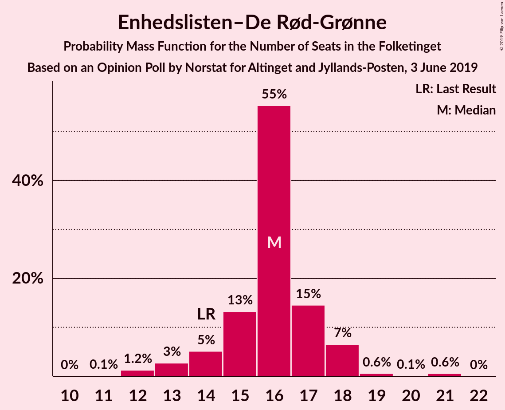

| Number of Seats | Probability | Accumulated | Special Marks |
|:---------------:|:-----------:|:-----------:|:-------------:|
| 11 | 0.1% | 100% |  |
| 12 | 1.2% | 99.9% |  |
| 13 | 3% | 98.6% |  |
| 14 | 5% | 96% | Last Result |
| 15 | 13% | 91% |  |
| 16 | 55% | 78% | Median |
| 17 | 15% | 22% |  |
| 18 | 7% | 8% |  |
| 19 | 0.6% | 1.3% |  |
| 20 | 0.1% | 0.7% |  |
| 21 | 0.6% | 0.6% |  |
| 22 | 0% | 0% |  |

### Socialistisk Folkeparti

*For a full overview of the results for this party, see the [Socialistisk Folkeparti](party-socialistiskfolkeparti.html) page.*

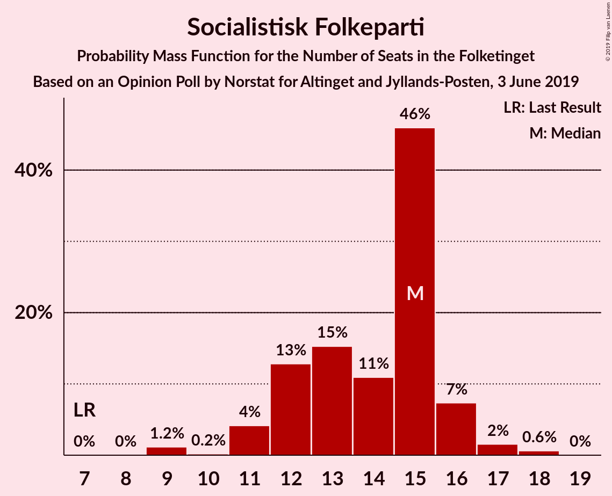

| Number of Seats | Probability | Accumulated | Special Marks |
|:---------------:|:-----------:|:-----------:|:-------------:|
| 7 | 0% | 100% | Last Result |
| 8 | 0% | 100% |  |
| 9 | 1.2% | 100% |  |
| 10 | 0.2% | 98.8% |  |
| 11 | 4% | 98.6% |  |
| 12 | 13% | 94% |  |
| 13 | 15% | 82% |  |
| 14 | 11% | 66% |  |
| 15 | 46% | 55% | Median |
| 16 | 7% | 10% |  |
| 17 | 2% | 2% |  |
| 18 | 0.6% | 0.6% |  |
| 19 | 0% | 0% |  |

### Radikale Venstre

*For a full overview of the results for this party, see the [Radikale Venstre](party-radikalevenstre.html) page.*

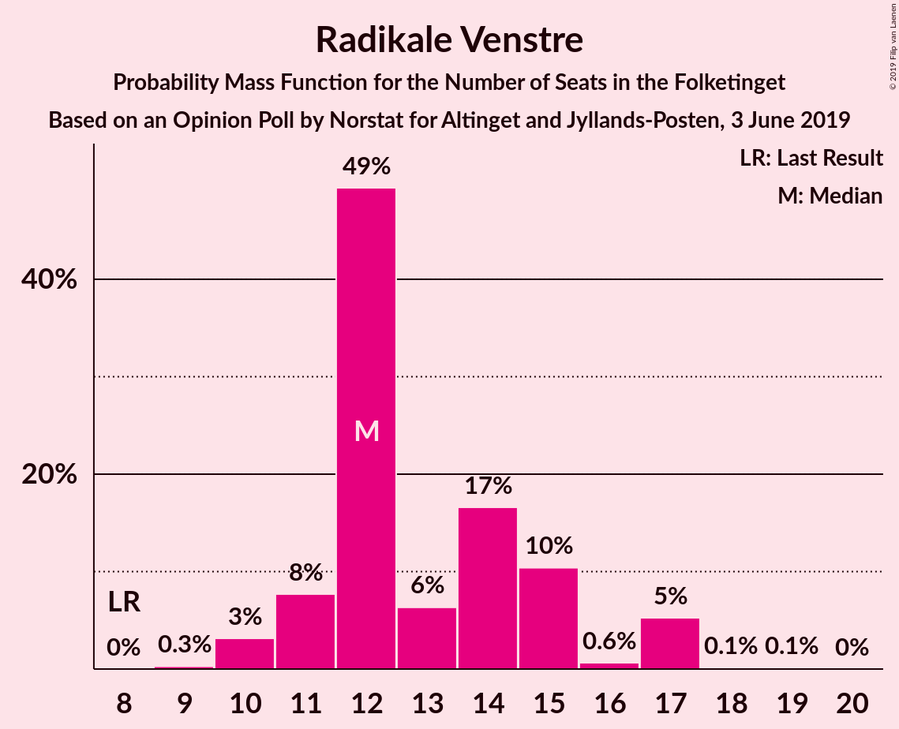

| Number of Seats | Probability | Accumulated | Special Marks |
|:---------------:|:-----------:|:-----------:|:-------------:|
| 8 | 0% | 100% | Last Result |
| 9 | 0.3% | 100% |  |
| 10 | 3% | 99.7% |  |
| 11 | 8% | 97% |  |
| 12 | 49% | 89% | Median |
| 13 | 6% | 39% |  |
| 14 | 17% | 33% |  |
| 15 | 10% | 17% |  |
| 16 | 0.6% | 6% |  |
| 17 | 5% | 5% |  |
| 18 | 0.1% | 0.2% |  |
| 19 | 0.1% | 0.1% |  |
| 20 | 0% | 0% |  |

### Det Konservative Folkeparti

*For a full overview of the results for this party, see the [Det Konservative Folkeparti](party-detkonservativefolkeparti.html) page.*

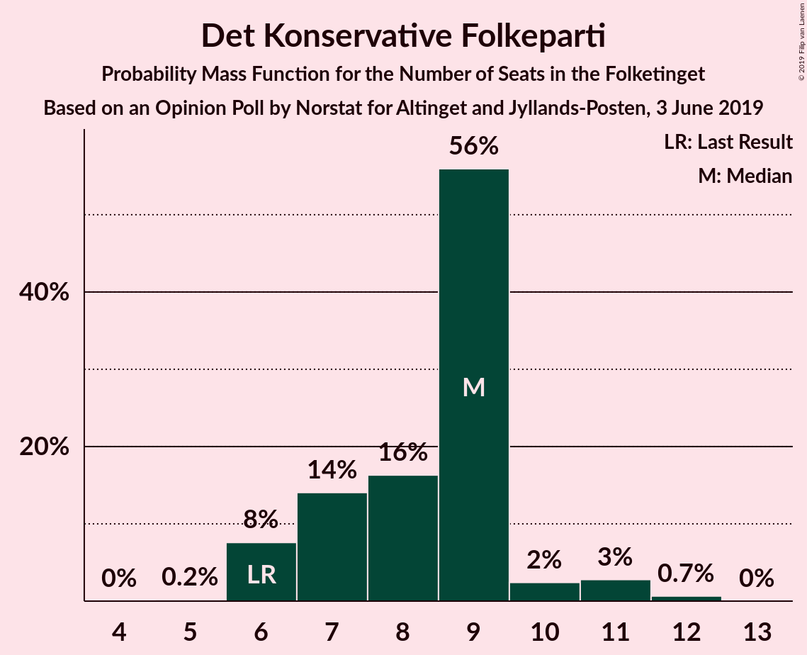

| Number of Seats | Probability | Accumulated | Special Marks |
|:---------------:|:-----------:|:-----------:|:-------------:|
| 5 | 0.2% | 100% |  |
| 6 | 8% | 99.8% | Last Result |
| 7 | 14% | 92% |  |
| 8 | 16% | 78% |  |
| 9 | 56% | 62% | Median |
| 10 | 2% | 6% |  |
| 11 | 3% | 3% |  |
| 12 | 0.7% | 0.7% |  |
| 13 | 0% | 0% |  |

### Nye Borgerlige

*For a full overview of the results for this party, see the [Nye Borgerlige](party-nyeborgerlige.html) page.*

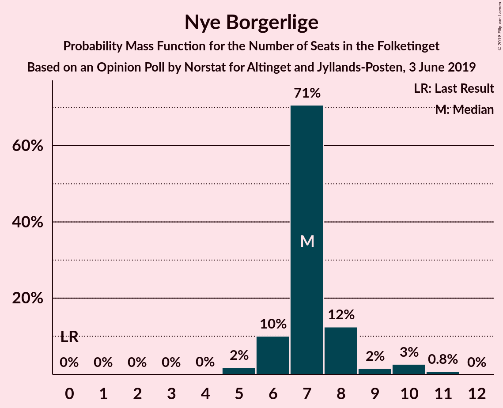

| Number of Seats | Probability | Accumulated | Special Marks |
|:---------------:|:-----------:|:-----------:|:-------------:|
| 0 | 0% | 100% | Last Result |
| 1 | 0% | 100% |  |
| 2 | 0% | 100% |  |
| 3 | 0% | 100% |  |
| 4 | 0% | 100% |  |
| 5 | 2% | 100% |  |
| 6 | 10% | 98% |  |
| 7 | 71% | 88% | Median |
| 8 | 12% | 18% |  |
| 9 | 2% | 5% |  |
| 10 | 3% | 4% |  |
| 11 | 0.8% | 0.8% |  |
| 12 | 0% | 0% |  |

### Liberal Alliance

*For a full overview of the results for this party, see the [Liberal Alliance](party-liberalalliance.html) page.*

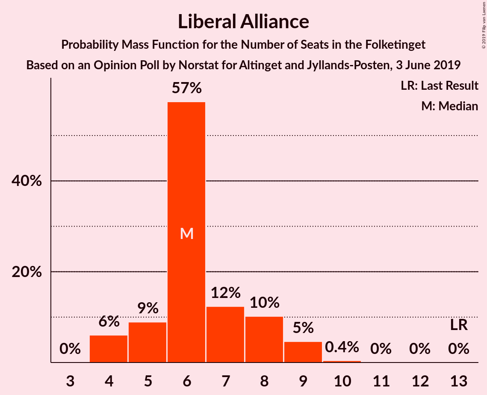

| Number of Seats | Probability | Accumulated | Special Marks |
|:---------------:|:-----------:|:-----------:|:-------------:|
| 4 | 6% | 100% |  |
| 5 | 9% | 94% |  |
| 6 | 57% | 85% | Median |
| 7 | 12% | 28% |  |
| 8 | 10% | 15% |  |
| 9 | 5% | 5% |  |
| 10 | 0.4% | 0.4% |  |
| 11 | 0% | 0% |  |
| 12 | 0% | 0% |  |
| 13 | 0% | 0% | Last Result |

### Alternativet

*For a full overview of the results for this party, see the [Alternativet](party-alternativet.html) page.*

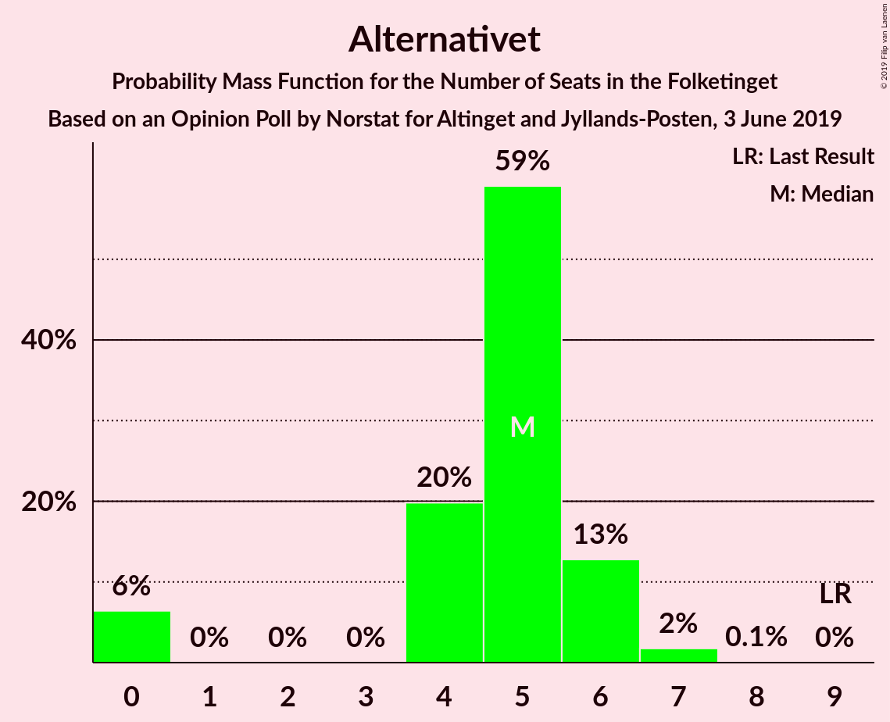

| Number of Seats | Probability | Accumulated | Special Marks |
|:---------------:|:-----------:|:-----------:|:-------------:|
| 0 | 6% | 100% |  |
| 1 | 0% | 94% |  |
| 2 | 0% | 94% |  |
| 3 | 0% | 94% |  |
| 4 | 20% | 94% |  |
| 5 | 59% | 74% | Median |
| 6 | 13% | 15% |  |
| 7 | 2% | 2% |  |
| 8 | 0.1% | 0.1% |  |
| 9 | 0% | 0% | Last Result |

### Stram Kurs

*For a full overview of the results for this party, see the [Stram Kurs](party-stramkurs.html) page.*

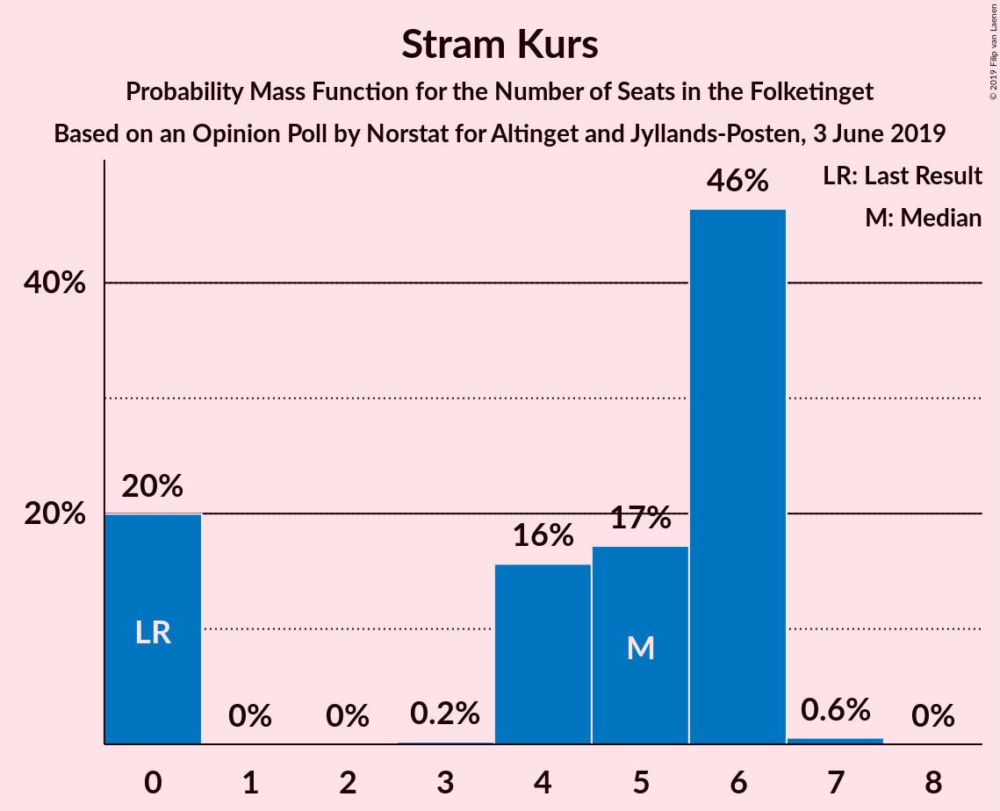

| Number of Seats | Probability | Accumulated | Special Marks |
|:---------------:|:-----------:|:-----------:|:-------------:|
| 0 | 20% | 100% | Last Result |
| 1 | 0% | 80% |  |
| 2 | 0% | 80% |  |
| 3 | 0.2% | 80% |  |
| 4 | 16% | 80% |  |
| 5 | 17% | 64% | Median |
| 6 | 46% | 47% |  |
| 7 | 0.6% | 0.6% |  |
| 8 | 0% | 0% |  |

### Kristendemokraterne

*For a full overview of the results for this party, see the [Kristendemokraterne](party-kristendemokraterne.html) page.*

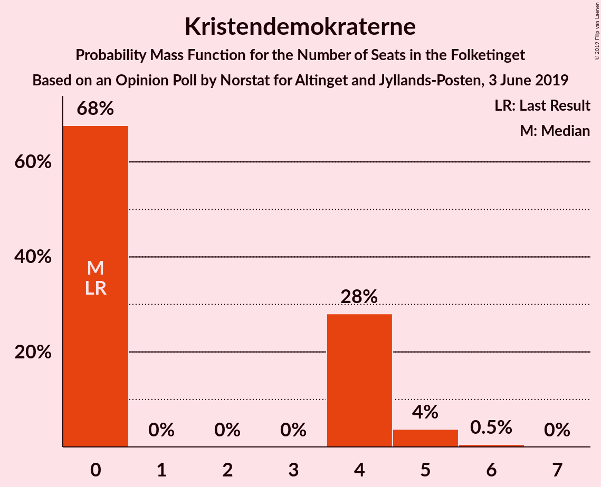

| Number of Seats | Probability | Accumulated | Special Marks |
|:---------------:|:-----------:|:-----------:|:-------------:|
| 0 | 68% | 100% | Last Result, Median |
| 1 | 0% | 32% |  |
| 2 | 0% | 32% |  |
| 3 | 0% | 32% |  |
| 4 | 28% | 32% |  |
| 5 | 4% | 4% |  |
| 6 | 0.5% | 0.5% |  |
| 7 | 0% | 0% |  |

### Klaus Riskær Pedersen

*For a full overview of the results for this party, see the [Klaus Riskær Pedersen](party-klausriskærpedersen.html) page.*

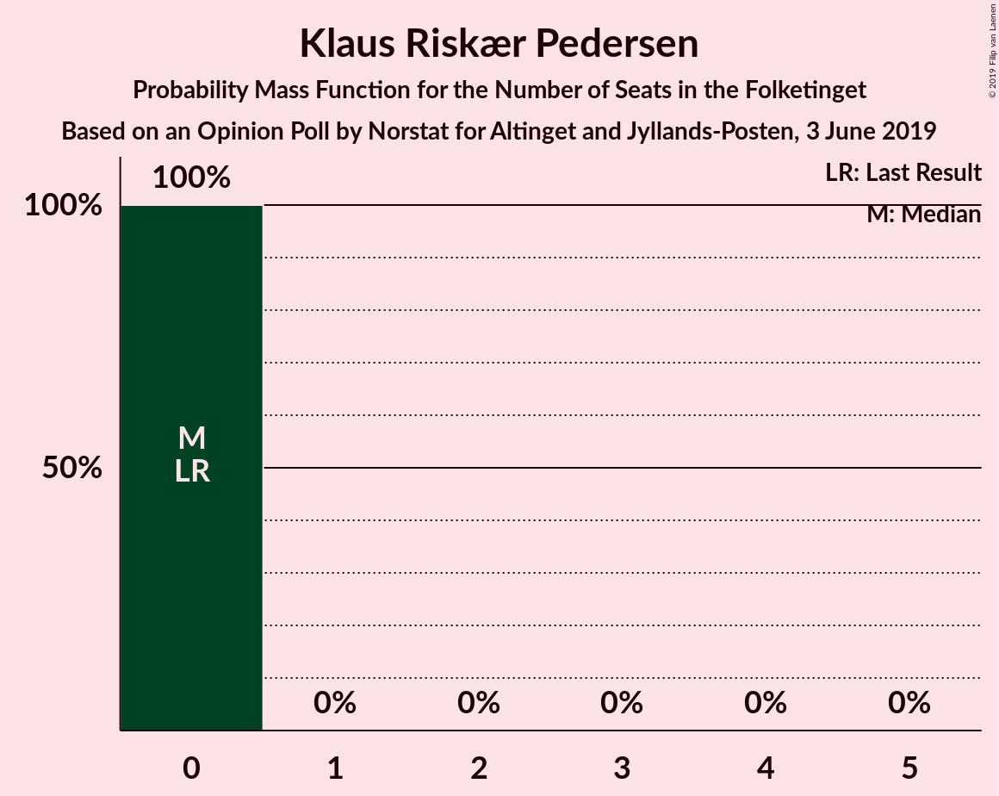

| Number of Seats | Probability | Accumulated | Special Marks |
|:---------------:|:-----------:|:-----------:|:-------------:|
| 0 | 100% | 100% | Last Result, Median |

## Coalitions

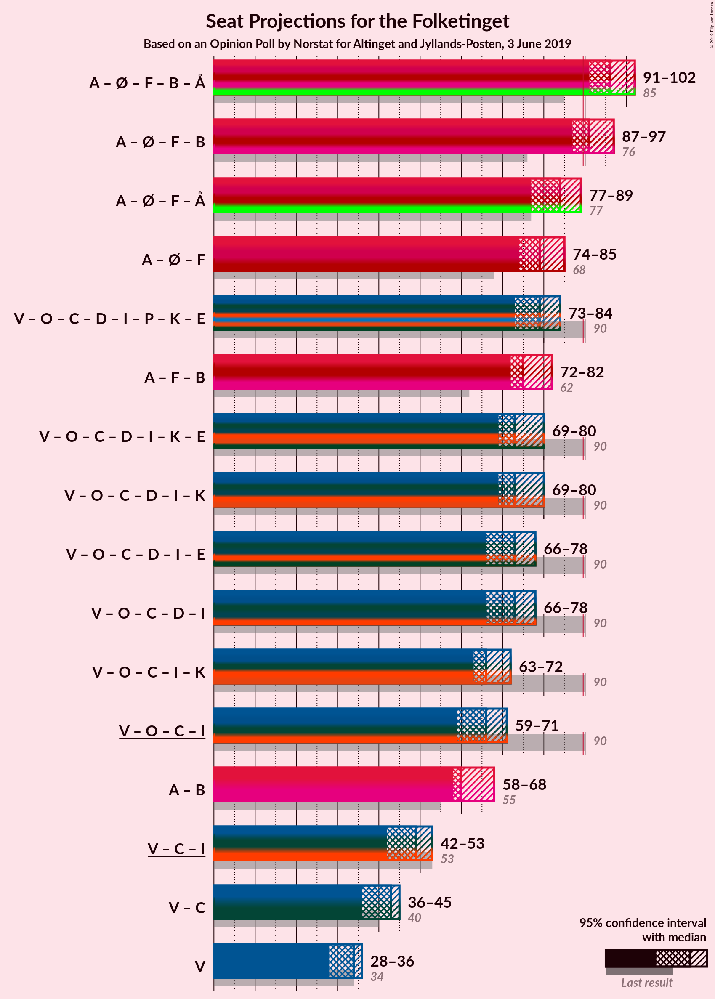

### Confidence Intervals

| Coalition | Last Result | Median | Majority? | 80% Confidence Interval | 90% Confidence Interval | 95% Confidence Interval | 99% Confidence Interval |
|:---------:|:-----------:|:------:|:---------:|:-----------------------:|:-----------------------:|:-----------------------:|:-----------------------:|
| Socialdemokraterne – Enhedslisten–De Rød-Grønne – Socialistisk Folkeparti – Radikale Venstre – Alternativet | 85 | 96 | 99.7% | 93–100 | 92–102 | 91–102 | 90–104 |
| Socialdemokraterne – Enhedslisten–De Rød-Grønne – Socialistisk Folkeparti – Radikale Venstre | 76 | 91 | 88% | 89–96 | 88–97 | 87–97 | 85–100 |
| Socialdemokraterne – Enhedslisten–De Rød-Grønne – Socialistisk Folkeparti – Alternativet | 77 | 84 | 2% | 81–88 | 79–88 | 77–89 | 77–91 |
| Socialdemokraterne – Enhedslisten–De Rød-Grønne – Socialistisk Folkeparti | 68 | 79 | 0% | 76–82 | 75–84 | 74–85 | 72–88 |
| Venstre – Dansk Folkeparti – Det Konservative Folkeparti – Nye Borgerlige – Liberal Alliance – Stram Kurs – Kristendemokraterne – Klaus Riskær Pedersen | 90 | 79 | 0% | 75–82 | 73–83 | 73–84 | 71–85 |
| Socialdemokraterne – Socialistisk Folkeparti – Radikale Venstre | 62 | 75 | 0% | 74–80 | 72–80 | 72–82 | 70–86 |
| Venstre – Dansk Folkeparti – Det Konservative Folkeparti – Nye Borgerlige – Liberal Alliance – Kristendemokraterne – Klaus Riskær Pedersen | 90 | 73 | 0% | 71–78 | 70–79 | 69–80 | 68–81 |
| Venstre – Dansk Folkeparti – Det Konservative Folkeparti – Nye Borgerlige – Liberal Alliance – Kristendemokraterne | 90 | 73 | 0% | 71–78 | 70–79 | 69–80 | 68–81 |
| Venstre – Dansk Folkeparti – Det Konservative Folkeparti – Nye Borgerlige – Liberal Alliance – Klaus Riskær Pedersen | 90 | 73 | 0% | 69–76 | 66–78 | 66–78 | 65–80 |
| Venstre – Dansk Folkeparti – Det Konservative Folkeparti – Nye Borgerlige – Liberal Alliance | 90 | 73 | 0% | 69–76 | 66–78 | 66–78 | 65–80 |
| Venstre – Dansk Folkeparti – Det Konservative Folkeparti – Liberal Alliance – Kristendemokraterne | 90 | 66 | 0% | 64–70 | 64–72 | 63–72 | 60–73 |
| Venstre – Dansk Folkeparti – Det Konservative Folkeparti – Liberal Alliance | 90 | 66 | 0% | 62–68 | 60–70 | 59–71 | 59–72 |
| Socialdemokraterne – Radikale Venstre | 55 | 60 | 0% | 60–66 | 59–67 | 58–68 | 57–71 |
| Venstre – Det Konservative Folkeparti – Liberal Alliance | 53 | 49 | 0% | 44–49 | 43–52 | 42–53 | 40–54 |
| Venstre – Det Konservative Folkeparti | 40 | 43 | 0% | 37–43 | 36–43 | 36–45 | 35–48 |
| Venstre | 34 | 34 | 0% | 30–34 | 29–35 | 28–36 | 27–39 |

### Socialdemokraterne – Enhedslisten–De Rød-Grønne – Socialistisk Folkeparti – Radikale Venstre – Alternativet

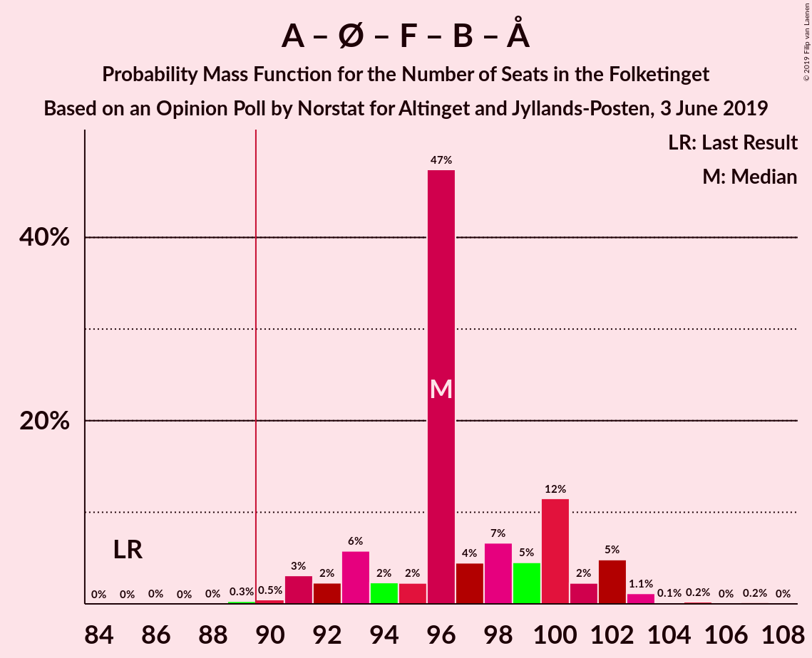

| Number of Seats | Probability | Accumulated | Special Marks |
|:---------------:|:-----------:|:-----------:|:-------------:|
| 85 | 0% | 100% | Last Result |
| 86 | 0% | 100% |  |
| 87 | 0% | 100% |  |
| 88 | 0% | 100% |  |
| 89 | 0.3% | 99.9% |  |
| 90 | 0.5% | 99.7% | Majority |
| 91 | 3% | 99.2% |  |
| 92 | 2% | 96% |  |
| 93 | 6% | 94% |  |
| 94 | 2% | 88% |  |
| 95 | 2% | 86% |  |
| 96 | 47% | 83% | Median |
| 97 | 4% | 36% |  |
| 98 | 7% | 32% |  |
| 99 | 5% | 25% |  |
| 100 | 12% | 20% |  |
| 101 | 2% | 9% |  |
| 102 | 5% | 7% |  |
| 103 | 1.1% | 2% |  |
| 104 | 0.1% | 0.6% |  |
| 105 | 0.2% | 0.4% |  |
| 106 | 0% | 0.2% |  |
| 107 | 0.2% | 0.2% |  |
| 108 | 0% | 0% |  |

### Socialdemokraterne – Enhedslisten–De Rød-Grønne – Socialistisk Folkeparti – Radikale Venstre

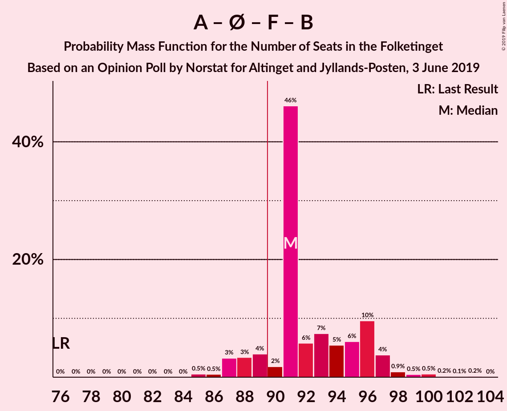

| Number of Seats | Probability | Accumulated | Special Marks |
|:---------------:|:-----------:|:-----------:|:-------------:|
| 76 | 0% | 100% | Last Result |
| 77 | 0% | 100% |  |
| 78 | 0% | 100% |  |
| 79 | 0% | 100% |  |
| 80 | 0% | 100% |  |
| 81 | 0% | 100% |  |
| 82 | 0% | 100% |  |
| 83 | 0% | 100% |  |
| 84 | 0% | 99.9% |  |
| 85 | 0.5% | 99.9% |  |
| 86 | 0.5% | 99.4% |  |
| 87 | 3% | 98.9% |  |
| 88 | 3% | 96% |  |
| 89 | 4% | 92% |  |
| 90 | 2% | 88% | Majority |
| 91 | 46% | 87% | Median |
| 92 | 6% | 40% |  |
| 93 | 7% | 35% |  |
| 94 | 5% | 27% |  |
| 95 | 6% | 22% |  |
| 96 | 10% | 16% |  |
| 97 | 4% | 6% |  |
| 98 | 0.9% | 2% |  |
| 99 | 0.5% | 1.4% |  |
| 100 | 0.5% | 0.9% |  |
| 101 | 0.2% | 0.4% |  |
| 102 | 0.1% | 0.2% |  |
| 103 | 0.2% | 0.2% |  |
| 104 | 0% | 0% |  |

### Socialdemokraterne – Enhedslisten–De Rød-Grønne – Socialistisk Folkeparti – Alternativet

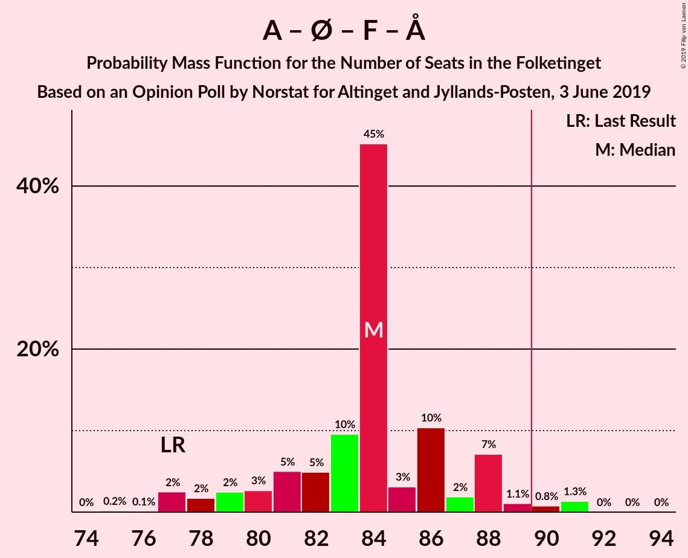

| Number of Seats | Probability | Accumulated | Special Marks |
|:---------------:|:-----------:|:-----------:|:-------------:|
| 75 | 0.2% | 100% |  |
| 76 | 0.1% | 99.8% |  |
| 77 | 2% | 99.7% | Last Result |
| 78 | 2% | 97% |  |
| 79 | 2% | 96% |  |
| 80 | 3% | 93% |  |
| 81 | 5% | 90% |  |
| 82 | 5% | 85% |  |
| 83 | 10% | 80% |  |
| 84 | 45% | 71% | Median |
| 85 | 3% | 26% |  |
| 86 | 10% | 23% |  |
| 87 | 2% | 12% |  |
| 88 | 7% | 10% |  |
| 89 | 1.1% | 3% |  |
| 90 | 0.8% | 2% | Majority |
| 91 | 1.3% | 1.4% |  |
| 92 | 0% | 0.1% |  |
| 93 | 0% | 0.1% |  |
| 94 | 0% | 0% |  |

### Socialdemokraterne – Enhedslisten–De Rød-Grønne – Socialistisk Folkeparti

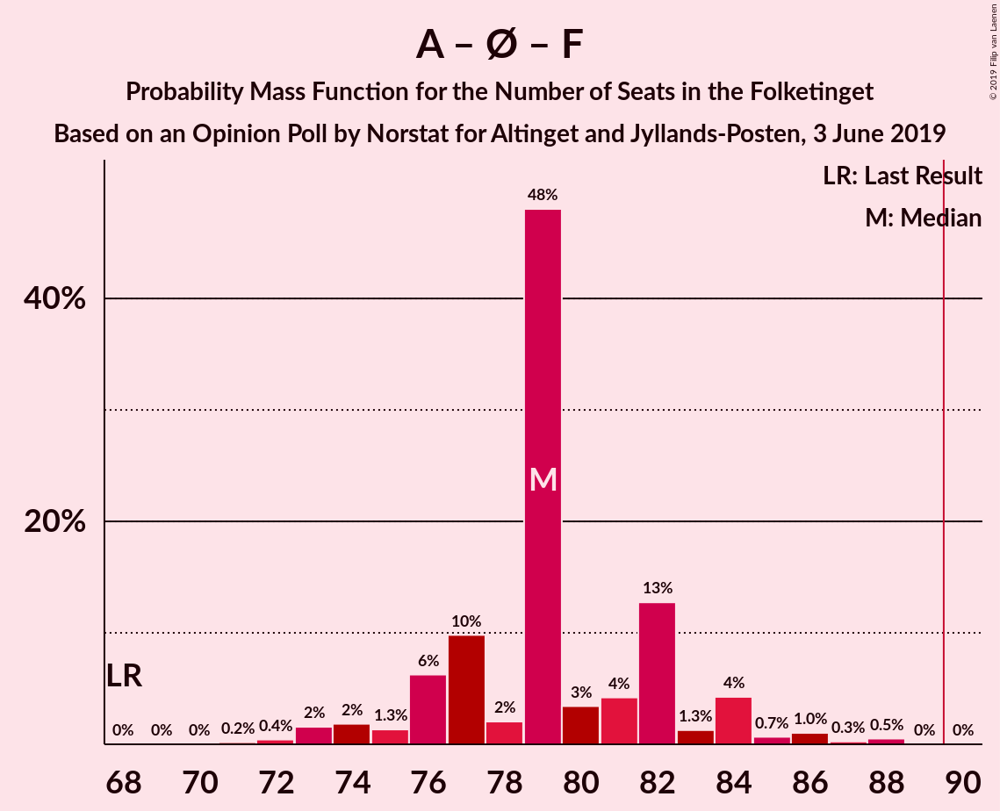

| Number of Seats | Probability | Accumulated | Special Marks |
|:---------------:|:-----------:|:-----------:|:-------------:|
| 68 | 0% | 100% | Last Result |
| 69 | 0% | 100% |  |
| 70 | 0% | 100% |  |
| 71 | 0.2% | 100% |  |
| 72 | 0.4% | 99.8% |  |
| 73 | 2% | 99.4% |  |
| 74 | 2% | 98% |  |
| 75 | 1.3% | 96% |  |
| 76 | 6% | 95% |  |
| 77 | 10% | 88% |  |
| 78 | 2% | 79% |  |
| 79 | 48% | 76% | Median |
| 80 | 3% | 28% |  |
| 81 | 4% | 25% |  |
| 82 | 13% | 21% |  |
| 83 | 1.3% | 8% |  |
| 84 | 4% | 7% |  |
| 85 | 0.7% | 3% |  |
| 86 | 1.0% | 2% |  |
| 87 | 0.3% | 0.8% |  |
| 88 | 0.5% | 0.6% |  |
| 89 | 0% | 0.1% |  |
| 90 | 0% | 0% | Majority |

### Venstre – Dansk Folkeparti – Det Konservative Folkeparti – Nye Borgerlige – Liberal Alliance – Stram Kurs – Kristendemokraterne – Klaus Riskær Pedersen

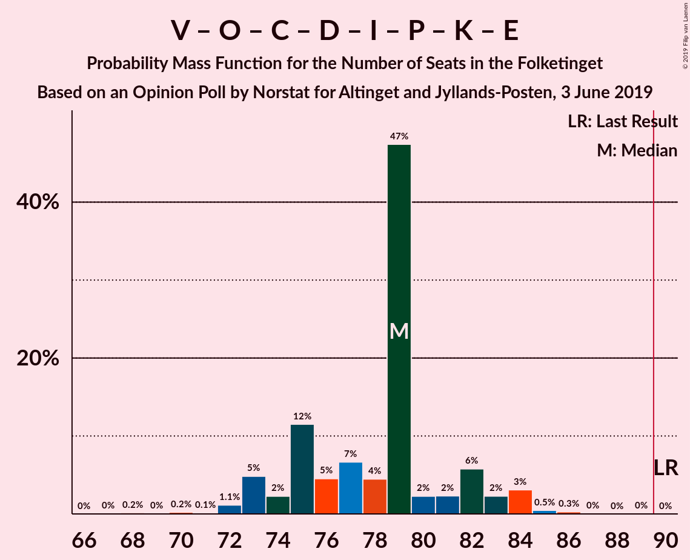

| Number of Seats | Probability | Accumulated | Special Marks |
|:---------------:|:-----------:|:-----------:|:-------------:|
| 68 | 0.2% | 100% |  |
| 69 | 0% | 99.8% |  |
| 70 | 0.2% | 99.8% |  |
| 71 | 0.1% | 99.6% |  |
| 72 | 1.1% | 99.4% |  |
| 73 | 5% | 98% |  |
| 74 | 2% | 93% |  |
| 75 | 12% | 91% |  |
| 76 | 5% | 80% |  |
| 77 | 7% | 75% |  |
| 78 | 4% | 68% | Median |
| 79 | 47% | 64% |  |
| 80 | 2% | 17% |  |
| 81 | 2% | 14% |  |
| 82 | 6% | 12% |  |
| 83 | 2% | 6% |  |
| 84 | 3% | 4% |  |
| 85 | 0.5% | 0.8% |  |
| 86 | 0.3% | 0.3% |  |
| 87 | 0% | 0.1% |  |
| 88 | 0% | 0% |  |
| 89 | 0% | 0% |  |
| 90 | 0% | 0% | Last Result, Majority |

### Socialdemokraterne – Socialistisk Folkeparti – Radikale Venstre

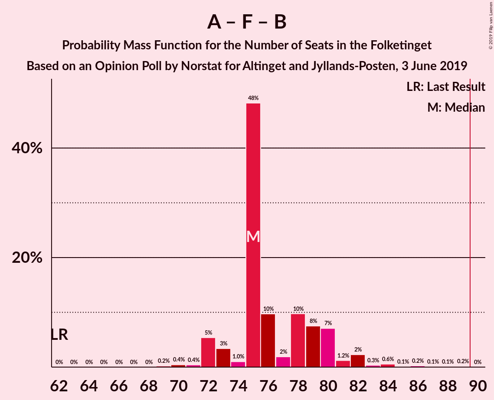

| Number of Seats | Probability | Accumulated | Special Marks |
|:---------------:|:-----------:|:-----------:|:-------------:|
| 62 | 0% | 100% | Last Result |
| 63 | 0% | 100% |  |
| 64 | 0% | 100% |  |
| 65 | 0% | 100% |  |
| 66 | 0% | 100% |  |
| 67 | 0% | 100% |  |
| 68 | 0% | 100% |  |
| 69 | 0.2% | 100% |  |
| 70 | 0.4% | 99.8% |  |
| 71 | 0.4% | 99.3% |  |
| 72 | 5% | 98.9% |  |
| 73 | 3% | 94% |  |
| 74 | 1.0% | 90% |  |
| 75 | 48% | 89% | Median |
| 76 | 10% | 41% |  |
| 77 | 2% | 31% |  |
| 78 | 10% | 29% |  |
| 79 | 8% | 20% |  |
| 80 | 7% | 12% |  |
| 81 | 1.2% | 5% |  |
| 82 | 2% | 4% |  |
| 83 | 0.3% | 1.5% |  |
| 84 | 0.6% | 1.1% |  |
| 85 | 0.1% | 0.6% |  |
| 86 | 0.2% | 0.5% |  |
| 87 | 0.1% | 0.3% |  |
| 88 | 0.1% | 0.2% |  |
| 89 | 0.2% | 0.2% |  |
| 90 | 0% | 0% | Majority |

### Venstre – Dansk Folkeparti – Det Konservative Folkeparti – Nye Borgerlige – Liberal Alliance – Kristendemokraterne – Klaus Riskær Pedersen

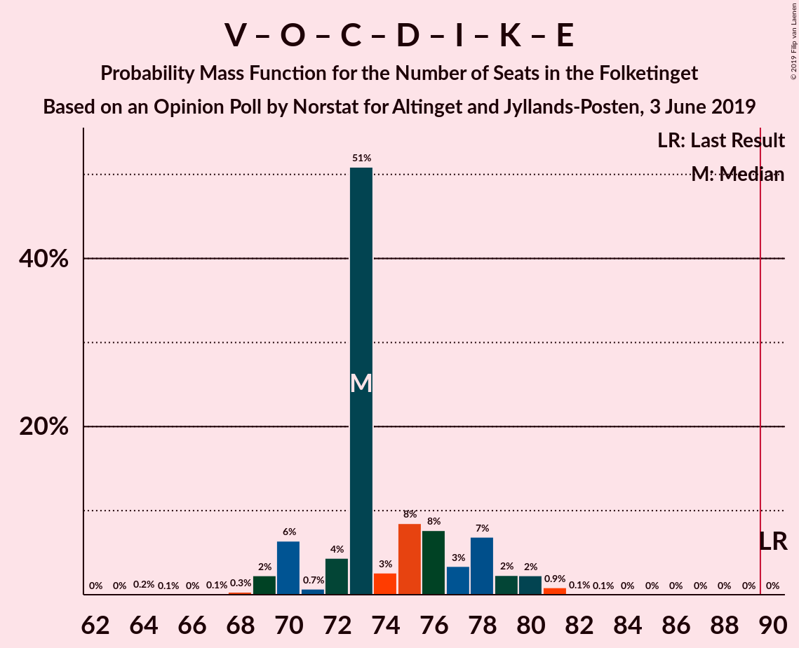

| Number of Seats | Probability | Accumulated | Special Marks |
|:---------------:|:-----------:|:-----------:|:-------------:|
| 64 | 0.2% | 100% |  |
| 65 | 0.1% | 99.8% |  |
| 66 | 0% | 99.8% |  |
| 67 | 0.1% | 99.8% |  |
| 68 | 0.3% | 99.7% |  |
| 69 | 2% | 99.4% |  |
| 70 | 6% | 97% |  |
| 71 | 0.7% | 91% |  |
| 72 | 4% | 90% |  |
| 73 | 51% | 86% | Median |
| 74 | 3% | 35% |  |
| 75 | 8% | 32% |  |
| 76 | 8% | 24% |  |
| 77 | 3% | 16% |  |
| 78 | 7% | 13% |  |
| 79 | 2% | 6% |  |
| 80 | 2% | 3% |  |
| 81 | 0.9% | 1.1% |  |
| 82 | 0.1% | 0.2% |  |
| 83 | 0.1% | 0.1% |  |
| 84 | 0% | 0.1% |  |
| 85 | 0% | 0% |  |
| 86 | 0% | 0% |  |
| 87 | 0% | 0% |  |
| 88 | 0% | 0% |  |
| 89 | 0% | 0% |  |
| 90 | 0% | 0% | Last Result, Majority |

### Venstre – Dansk Folkeparti – Det Konservative Folkeparti – Nye Borgerlige – Liberal Alliance – Kristendemokraterne

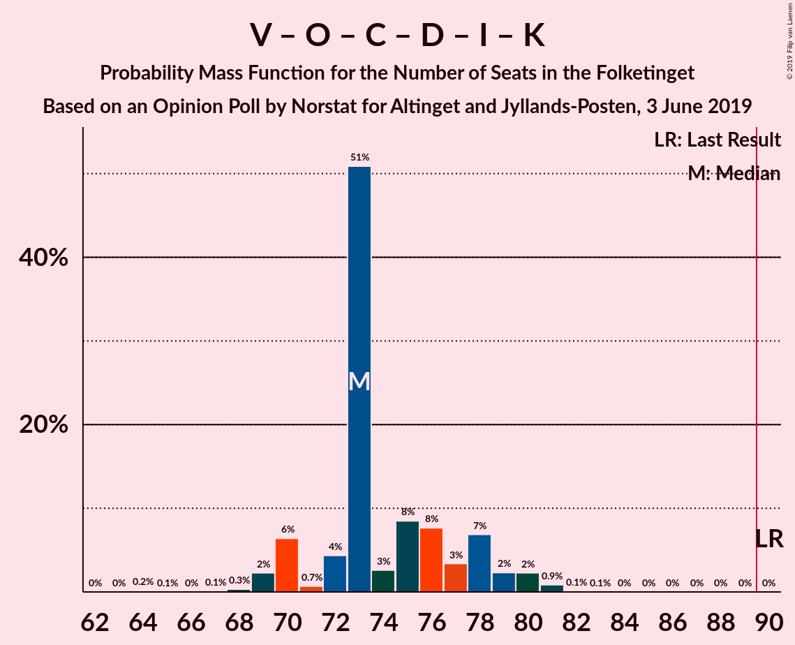

| Number of Seats | Probability | Accumulated | Special Marks |
|:---------------:|:-----------:|:-----------:|:-------------:|
| 64 | 0.2% | 100% |  |
| 65 | 0.1% | 99.8% |  |
| 66 | 0% | 99.8% |  |
| 67 | 0.1% | 99.8% |  |
| 68 | 0.3% | 99.7% |  |
| 69 | 2% | 99.4% |  |
| 70 | 6% | 97% |  |
| 71 | 0.7% | 91% |  |
| 72 | 4% | 90% |  |
| 73 | 51% | 86% | Median |
| 74 | 3% | 35% |  |
| 75 | 8% | 32% |  |
| 76 | 8% | 24% |  |
| 77 | 3% | 16% |  |
| 78 | 7% | 13% |  |
| 79 | 2% | 6% |  |
| 80 | 2% | 3% |  |
| 81 | 0.9% | 1.1% |  |
| 82 | 0.1% | 0.2% |  |
| 83 | 0.1% | 0.1% |  |
| 84 | 0% | 0.1% |  |
| 85 | 0% | 0% |  |
| 86 | 0% | 0% |  |
| 87 | 0% | 0% |  |
| 88 | 0% | 0% |  |
| 89 | 0% | 0% |  |
| 90 | 0% | 0% | Last Result, Majority |

### Venstre – Dansk Folkeparti – Det Konservative Folkeparti – Nye Borgerlige – Liberal Alliance – Klaus Riskær Pedersen

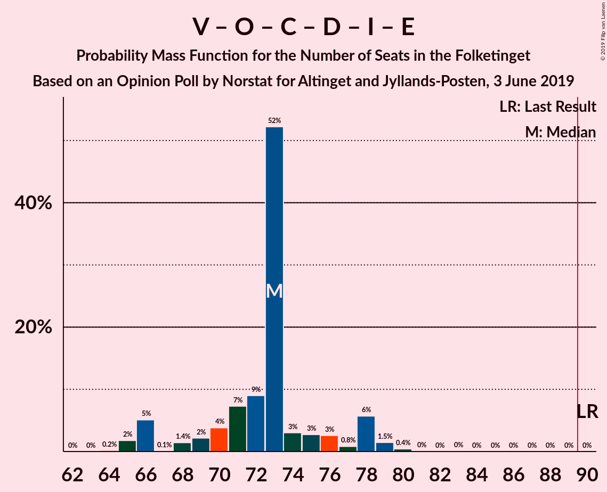

| Number of Seats | Probability | Accumulated | Special Marks |
|:---------------:|:-----------:|:-----------:|:-------------:|
| 64 | 0.2% | 100% |  |
| 65 | 2% | 99.8% |  |
| 66 | 5% | 98% |  |
| 67 | 0.1% | 93% |  |
| 68 | 1.4% | 93% |  |
| 69 | 2% | 91% |  |
| 70 | 4% | 89% |  |
| 71 | 7% | 85% |  |
| 72 | 9% | 78% |  |
| 73 | 52% | 69% | Median |
| 74 | 3% | 17% |  |
| 75 | 3% | 14% |  |
| 76 | 3% | 11% |  |
| 77 | 0.8% | 9% |  |
| 78 | 6% | 8% |  |
| 79 | 1.5% | 2% |  |
| 80 | 0.4% | 0.5% |  |
| 81 | 0% | 0.1% |  |
| 82 | 0% | 0% |  |
| 83 | 0% | 0% |  |
| 84 | 0% | 0% |  |
| 85 | 0% | 0% |  |
| 86 | 0% | 0% |  |
| 87 | 0% | 0% |  |
| 88 | 0% | 0% |  |
| 89 | 0% | 0% |  |
| 90 | 0% | 0% | Last Result, Majority |

### Venstre – Dansk Folkeparti – Det Konservative Folkeparti – Nye Borgerlige – Liberal Alliance

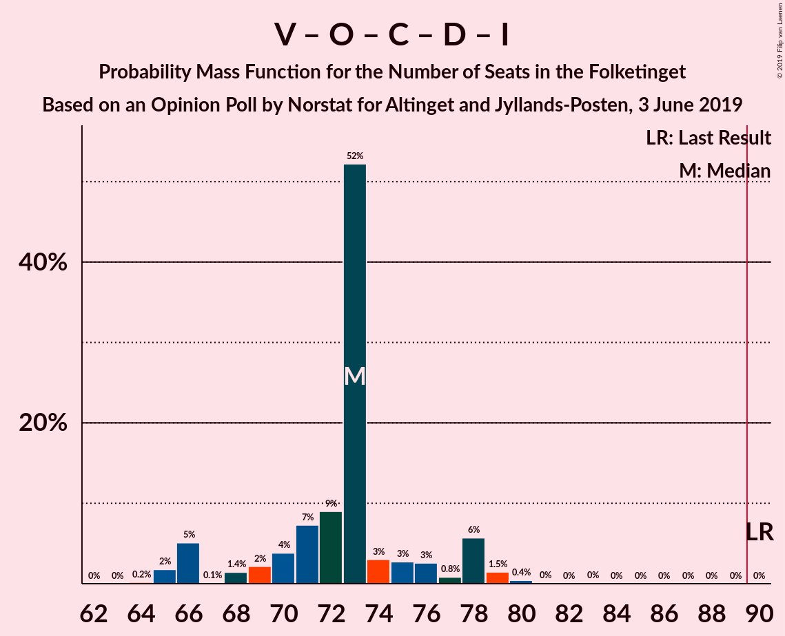

| Number of Seats | Probability | Accumulated | Special Marks |
|:---------------:|:-----------:|:-----------:|:-------------:|
| 64 | 0.2% | 100% |  |
| 65 | 2% | 99.8% |  |
| 66 | 5% | 98% |  |
| 67 | 0.1% | 93% |  |
| 68 | 1.4% | 93% |  |
| 69 | 2% | 91% |  |
| 70 | 4% | 89% |  |
| 71 | 7% | 85% |  |
| 72 | 9% | 78% |  |
| 73 | 52% | 69% | Median |
| 74 | 3% | 17% |  |
| 75 | 3% | 14% |  |
| 76 | 3% | 11% |  |
| 77 | 0.8% | 9% |  |
| 78 | 6% | 8% |  |
| 79 | 1.5% | 2% |  |
| 80 | 0.4% | 0.5% |  |
| 81 | 0% | 0.1% |  |
| 82 | 0% | 0% |  |
| 83 | 0% | 0% |  |
| 84 | 0% | 0% |  |
| 85 | 0% | 0% |  |
| 86 | 0% | 0% |  |
| 87 | 0% | 0% |  |
| 88 | 0% | 0% |  |
| 89 | 0% | 0% |  |
| 90 | 0% | 0% | Last Result, Majority |

### Venstre – Dansk Folkeparti – Det Konservative Folkeparti – Liberal Alliance – Kristendemokraterne

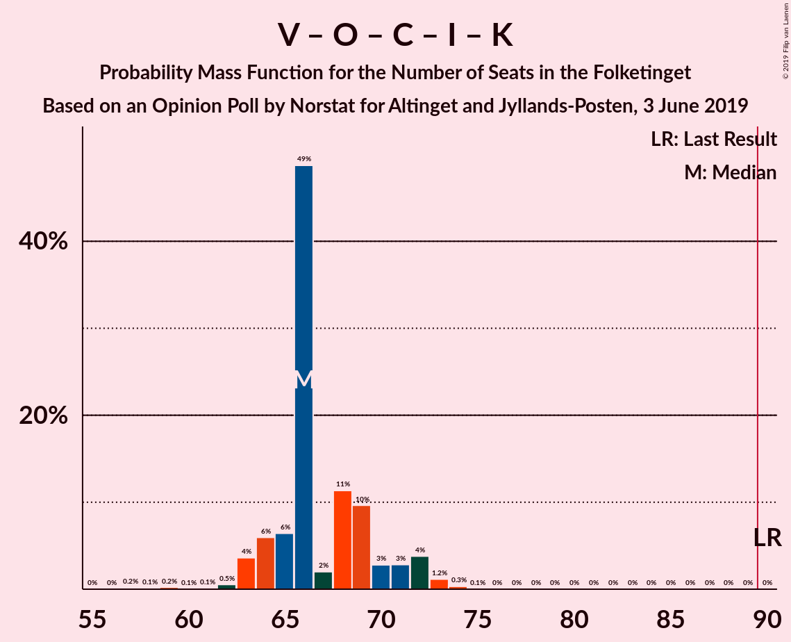

| Number of Seats | Probability | Accumulated | Special Marks |
|:---------------:|:-----------:|:-----------:|:-------------:|
| 57 | 0.2% | 100% |  |
| 58 | 0.1% | 99.8% |  |
| 59 | 0.2% | 99.8% |  |
| 60 | 0.1% | 99.5% |  |
| 61 | 0.1% | 99.5% |  |
| 62 | 0.5% | 99.3% |  |
| 63 | 4% | 98.8% |  |
| 64 | 6% | 95% |  |
| 65 | 6% | 89% |  |
| 66 | 49% | 83% | Median |
| 67 | 2% | 34% |  |
| 68 | 11% | 32% |  |
| 69 | 10% | 21% |  |
| 70 | 3% | 11% |  |
| 71 | 3% | 8% |  |
| 72 | 4% | 5% |  |
| 73 | 1.2% | 2% |  |
| 74 | 0.3% | 0.5% |  |
| 75 | 0.1% | 0.2% |  |
| 76 | 0% | 0.1% |  |
| 77 | 0% | 0.1% |  |
| 78 | 0% | 0% |  |
| 79 | 0% | 0% |  |
| 80 | 0% | 0% |  |
| 81 | 0% | 0% |  |
| 82 | 0% | 0% |  |
| 83 | 0% | 0% |  |
| 84 | 0% | 0% |  |
| 85 | 0% | 0% |  |
| 86 | 0% | 0% |  |
| 87 | 0% | 0% |  |
| 88 | 0% | 0% |  |
| 89 | 0% | 0% |  |
| 90 | 0% | 0% | Last Result, Majority |

### Venstre – Dansk Folkeparti – Det Konservative Folkeparti – Liberal Alliance

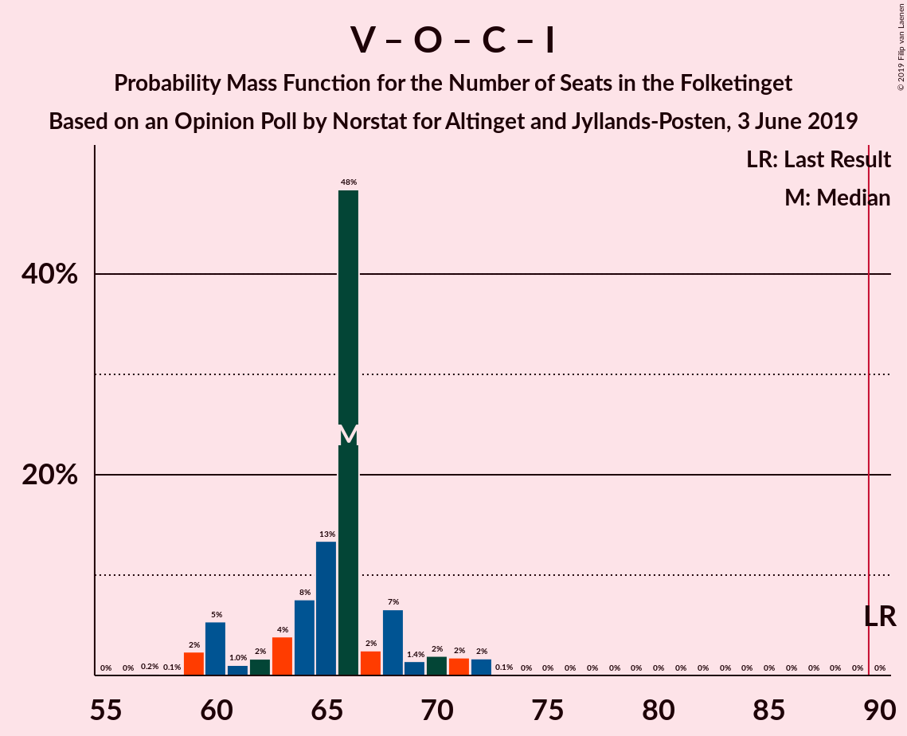

| Number of Seats | Probability | Accumulated | Special Marks |
|:---------------:|:-----------:|:-----------:|:-------------:|
| 57 | 0.2% | 100% |  |
| 58 | 0.1% | 99.8% |  |
| 59 | 2% | 99.7% |  |
| 60 | 5% | 97% |  |
| 61 | 1.0% | 92% |  |
| 62 | 2% | 91% |  |
| 63 | 4% | 89% |  |
| 64 | 8% | 85% |  |
| 65 | 13% | 78% |  |
| 66 | 48% | 64% | Median |
| 67 | 2% | 16% |  |
| 68 | 7% | 14% |  |
| 69 | 1.4% | 7% |  |
| 70 | 2% | 6% |  |
| 71 | 2% | 4% |  |
| 72 | 2% | 2% |  |
| 73 | 0.1% | 0.1% |  |
| 74 | 0% | 0% |  |
| 75 | 0% | 0% |  |
| 76 | 0% | 0% |  |
| 77 | 0% | 0% |  |
| 78 | 0% | 0% |  |
| 79 | 0% | 0% |  |
| 80 | 0% | 0% |  |
| 81 | 0% | 0% |  |
| 82 | 0% | 0% |  |
| 83 | 0% | 0% |  |
| 84 | 0% | 0% |  |
| 85 | 0% | 0% |  |
| 86 | 0% | 0% |  |
| 87 | 0% | 0% |  |
| 88 | 0% | 0% |  |
| 89 | 0% | 0% |  |
| 90 | 0% | 0% | Last Result, Majority |

### Socialdemokraterne – Radikale Venstre

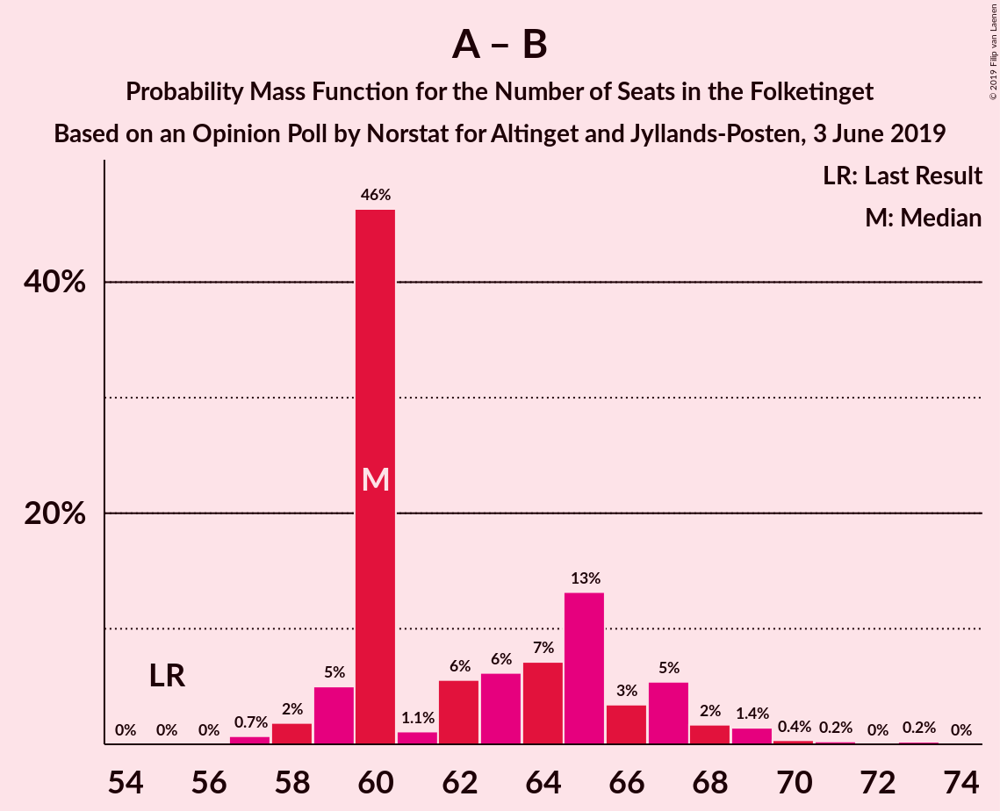

| Number of Seats | Probability | Accumulated | Special Marks |
|:---------------:|:-----------:|:-----------:|:-------------:|
| 55 | 0% | 100% | Last Result |
| 56 | 0% | 100% |  |
| 57 | 0.7% | 99.9% |  |
| 58 | 2% | 99.2% |  |
| 59 | 5% | 97% |  |
| 60 | 46% | 92% | Median |
| 61 | 1.1% | 46% |  |
| 62 | 6% | 45% |  |
| 63 | 6% | 39% |  |
| 64 | 7% | 33% |  |
| 65 | 13% | 26% |  |
| 66 | 3% | 13% |  |
| 67 | 5% | 9% |  |
| 68 | 2% | 4% |  |
| 69 | 1.4% | 2% |  |
| 70 | 0.4% | 0.9% |  |
| 71 | 0.2% | 0.5% |  |
| 72 | 0% | 0.3% |  |
| 73 | 0.2% | 0.2% |  |
| 74 | 0% | 0% |  |

### Venstre – Det Konservative Folkeparti – Liberal Alliance

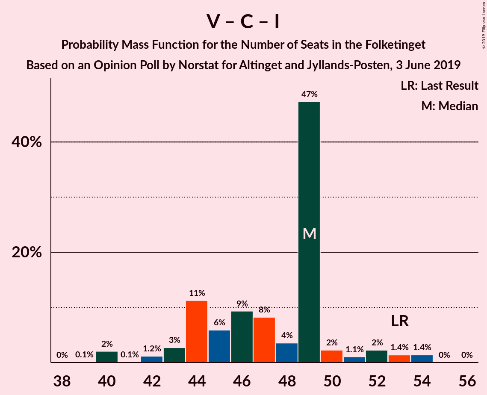

| Number of Seats | Probability | Accumulated | Special Marks |
|:---------------:|:-----------:|:-----------:|:-------------:|
| 39 | 0.1% | 100% |  |
| 40 | 2% | 99.9% |  |
| 41 | 0.1% | 98% |  |
| 42 | 1.2% | 98% |  |
| 43 | 3% | 97% |  |
| 44 | 11% | 94% |  |
| 45 | 6% | 83% |  |
| 46 | 9% | 77% |  |
| 47 | 8% | 67% |  |
| 48 | 4% | 59% |  |
| 49 | 47% | 56% | Median |
| 50 | 2% | 8% |  |
| 51 | 1.1% | 6% |  |
| 52 | 2% | 5% |  |
| 53 | 1.4% | 3% | Last Result |
| 54 | 1.4% | 1.4% |  |
| 55 | 0% | 0% |  |

### Venstre – Det Konservative Folkeparti

| Number of Seats | Probability | Accumulated | Special Marks |
|:---------------:|:-----------:|:-----------:|:-------------:|
| 33 | 0.1% | 100% |  |
| 34 | 0.2% | 99.9% |  |
| 35 | 0.5% | 99.7% |  |
| 36 | 8% | 99.2% |  |
| 37 | 2% | 92% |  |
| 38 | 10% | 89% |  |
| 39 | 5% | 79% |  |
| 40 | 11% | 74% | Last Result |
| 41 | 6% | 64% |  |
| 42 | 1.0% | 57% |  |
| 43 | 51% | 56% | Median |
| 44 | 0.6% | 5% |  |
| 45 | 2% | 4% |  |
| 46 | 0.6% | 2% |  |
| 47 | 0.1% | 1.5% |  |
| 48 | 1.4% | 1.4% |  |
| 49 | 0% | 0% |  |

### Venstre

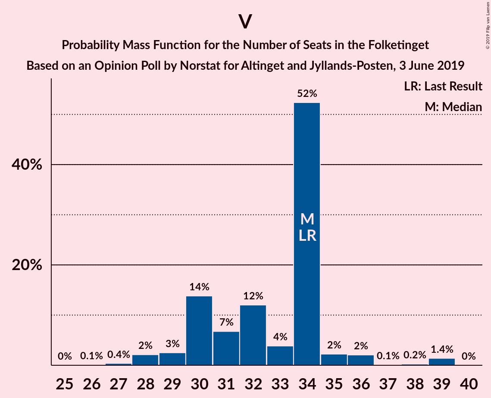

| Number of Seats | Probability | Accumulated | Special Marks |
|:---------------:|:-----------:|:-----------:|:-------------:|
| 26 | 0.1% | 100% |  |
| 27 | 0.4% | 99.9% |  |
| 28 | 2% | 99.5% |  |
| 29 | 3% | 97% |  |
| 30 | 14% | 95% |  |
| 31 | 7% | 81% |  |
| 32 | 12% | 74% |  |
| 33 | 4% | 62% |  |
| 34 | 52% | 58% | Last Result, Median |
| 35 | 2% | 6% |  |
| 36 | 2% | 4% |  |
| 37 | 0.1% | 2% |  |
| 38 | 0.2% | 2% |  |
| 39 | 1.4% | 1.4% |  |
| 40 | 0% | 0% |  |

## Technical Information

### Opinion Poll

+ **Polling firm:** Norstat
+ **Commissioner(s):** Altinget and Jyllands-Posten
+ **Fieldwork period:** 3 June 2019

### Calculations

+ **Sample size:** 1204
+ **Simulations done:** 1,048,576
+ **Error estimate:** 1.74%

