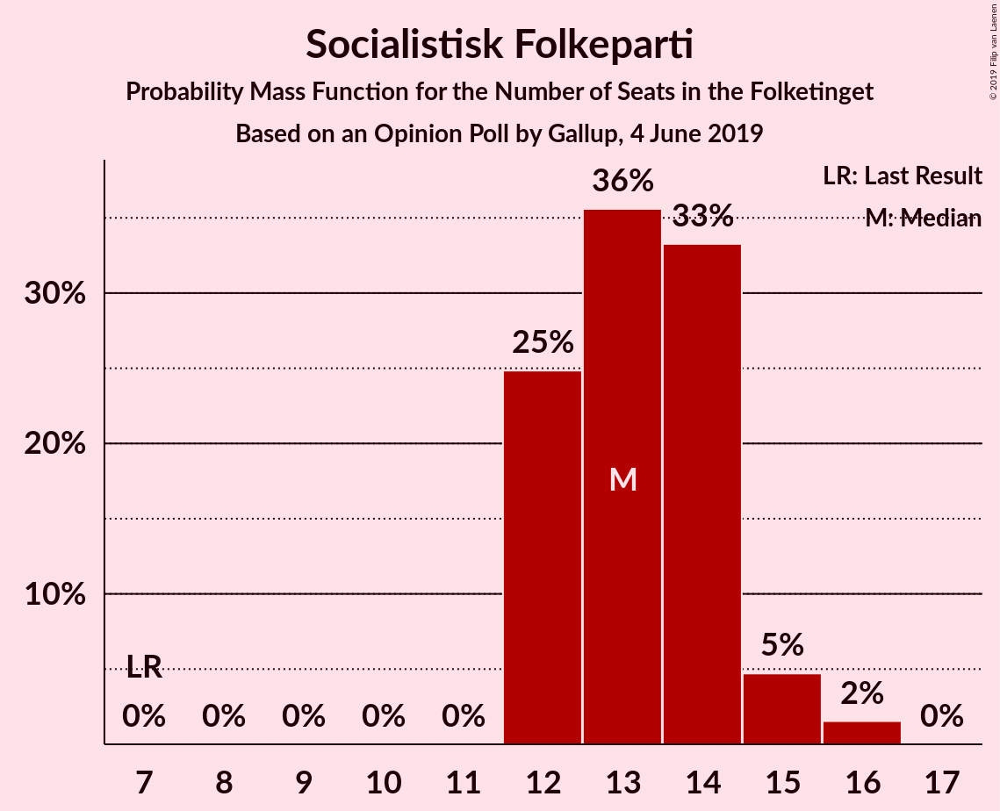
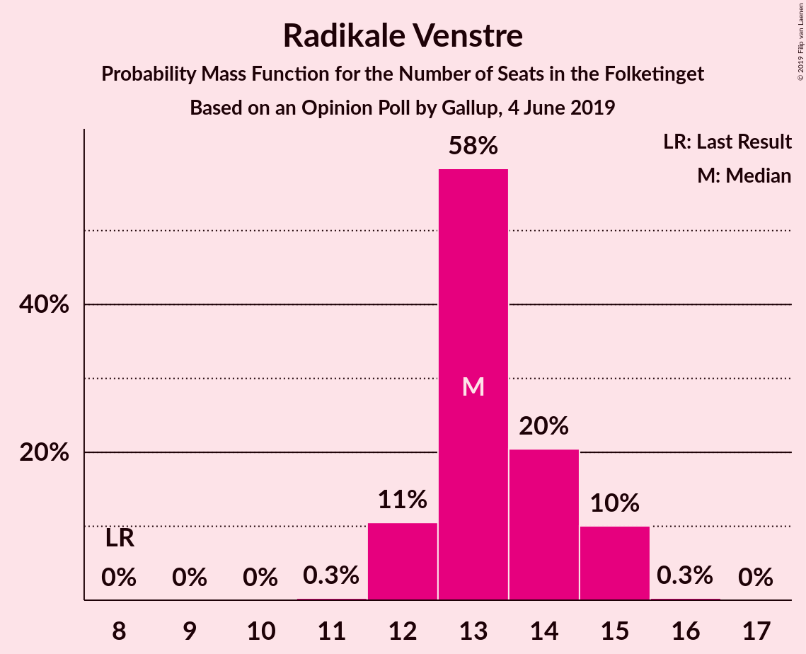
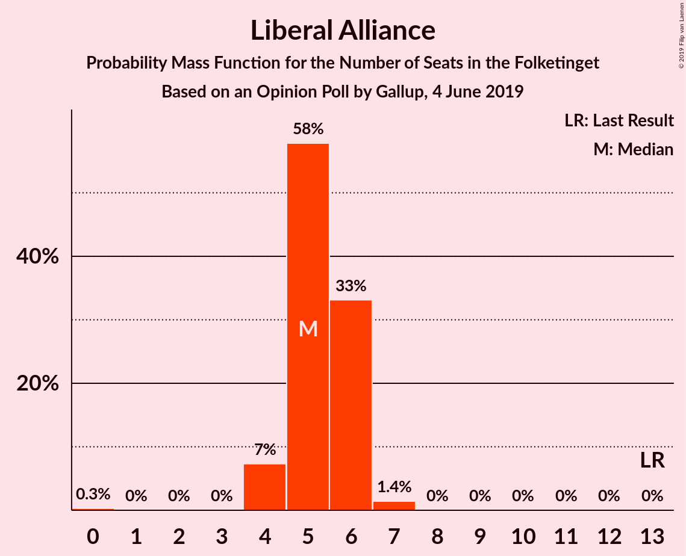

# Opinion Poll by Gallup, 4 June 2019

<a href="#voting-intentions">Voting Intentions</a> | <a href="#seats">Seats</a> | <a href="#coalitions">Coalitions</a> | <a href="#technical-information">Technical Information</a>

## Voting Intentions

### Confidence Intervals

| Party | Last Result | Poll Result | 80% Confidence Interval | 90% Confidence Interval | 95% Confidence Interval | 99% Confidence Interval |
|:-----:|:-----------:|:-----------:|:-----------------------:|:-----------------------:|:-----------------------:|:-----------------------:|
| Socialdemokraterne | 26.3% | 25.7% | 24.9–26.5% |24.7–26.7% |24.5–26.9% |24.1–27.3% |
| Venstre | 19.5% | 22.3% | 21.6–23.1% |21.3–23.3% |21.2–23.5% |20.8–23.9% |
| Dansk Folkeparti | 21.1% | 10.6% | 10.0–11.2% |9.9–11.4% |9.8–11.5% |9.5–11.8% |
| Enhedslisten–De Rød-Grønne | 7.8% | 8.0% | 7.5–8.5% |7.4–8.7% |7.3–8.8% |7.0–9.1% |
| Socialistisk Folkeparti | 4.2% | 7.6% | 7.1–8.1% |7.0–8.3% |6.9–8.4% |6.7–8.6% |
| Radikale Venstre | 4.6% | 7.5% | 7.0–8.0% |6.9–8.2% |6.8–8.3% |6.6–8.5% |
| Det Konservative Folkeparti | 3.4% | 6.1% | 5.7–6.6% |5.5–6.7% |5.4–6.8% |5.3–7.0% |
| Alternativet | 4.8% | 2.9% | 2.6–3.2% |2.5–3.3% |2.5–3.4% |2.3–3.6% |
| Liberal Alliance | 7.5% | 2.8% | 2.5–3.1% |2.4–3.2% |2.4–3.3% |2.2–3.5% |
| Nye Borgerlige | 0.0% | 2.6% | 2.3–2.9% |2.3–3.0% |2.2–3.1% |2.1–3.3% |
| Kristendemokraterne | 0.8% | 1.9% | 1.7–2.2% |1.6–2.3% |1.5–2.3% |1.4–2.5% |
| Stram Kurs | 0.0% | 1.1% | 0.9–1.3% |0.9–1.4% |0.8–1.4% |0.8–1.6% |
| Klaus Riskær Pedersen | 0.0% | 0.7% | 0.6–0.9% |0.5–0.9% |0.5–1.0% |0.4–1.1% |

*Note:* The poll result column reflects the actual value used in the calculations. Published results may vary slightly, and in addition be rounded to fewer digits.

## Seats

### Confidence Intervals

| Party | Last Result | Median | 80% Confidence Interval | 90% Confidence Interval | 95% Confidence Interval | 99% Confidence Interval |
|:-----:|:-----------:|:------:|:-----------------------:|:-----------------------:|:-----------------------:|:-----------------------:|
| <a href="#socialdemokraterne">Socialdemokraterne</a> | 47 | 47 | 44–48 |44–48 |44–49 |42–50 |
| <a href="#venstre">Venstre</a> | 34 | 40 | 39–41 |38–42 |37–42 |37–43 |
| <a href="#dansk-folkeparti">Dansk Folkeparti</a> | 37 | 19 | 18–21 |18–21 |17–21 |17–22 |
| <a href="#enhedslisten–de-rød-grønne">Enhedslisten–De Rød-Grønne</a> | 14 | 14 | 13–15 |13–16 |13–16 |12–17 |
| <a href="#socialistisk-folkeparti">Socialistisk Folkeparti</a> | 7 | 13 | 12–14 |12–15 |12–15 |12–16 |
| <a href="#radikale-venstre">Radikale Venstre</a> | 8 | 13 | 12–15 |12–15 |12–15 |12–15 |
| <a href="#det-konservative-folkeparti">Det Konservative Folkeparti</a> | 6 | 11 | 10–12 |10–12 |10–13 |9–13 |
| <a href="#alternativet">Alternativet</a> | 9 | 5 | 5–6 |4–6 |4–6 |4–6 |
| <a href="#liberal-alliance">Liberal Alliance</a> | 13 | 5 | 5–6 |4–6 |4–6 |4–7 |
| <a href="#nye-borgerlige">Nye Borgerlige</a> | 0 | 5 | 4–6 |4–6 |4–6 |4–6 |
| <a href="#kristendemokraterne">Kristendemokraterne</a> | 0 | 4 | 0–4 |0–4 |0–4 |0–4 |
| <a href="#stram-kurs">Stram Kurs</a> | 0 | 0 | 0 |0 |0 |0 |
| <a href="#klaus-riskær-pedersen">Klaus Riskær Pedersen</a> | 0 | 0 | 0 |0 |0 |0 |

### Socialdemokraterne

*For a full overview of the results for this party, see the [Socialdemokraterne](party-socialdemokraterne.html) page.*

| Number of Seats | Probability | Accumulated | Special Marks |
|:---------------:|:-----------:|:-----------:|:-------------:|
| 42 | 0.5% | 100% |  |
| 43 | 0.9% | 99.5% |  |
| 44 | 15% | 98.6% |  |
| 45 | 11% | 84% |  |
| 46 | 9% | 73% |  |
| 47 | 52% | 64% | Last Result, Median |
| 48 | 9% | 11% |  |
| 49 | 2% | 3% |  |
| 50 | 1.0% | 1.0% |  |
| 51 | 0% | 0% |  |

### Venstre

*For a full overview of the results for this party, see the [Venstre](party-venstre.html) page.*

| Number of Seats | Probability | Accumulated | Special Marks |
|:---------------:|:-----------:|:-----------:|:-------------:|
| 34 | 0% | 100% | Last Result |
| 35 | 0% | 100% |  |
| 36 | 0.1% | 100% |  |
| 37 | 3% | 99.9% |  |
| 38 | 3% | 97% |  |
| 39 | 16% | 94% |  |
| 40 | 47% | 78% | Median |
| 41 | 21% | 31% |  |
| 42 | 8% | 10% |  |
| 43 | 2% | 2% |  |
| 44 | 0% | 0.1% |  |
| 45 | 0.1% | 0.1% |  |
| 46 | 0% | 0% |  |

### Dansk Folkeparti

*For a full overview of the results for this party, see the [Dansk Folkeparti](party-danskfolkeparti.html) page.*

| Number of Seats | Probability | Accumulated | Special Marks |
|:---------------:|:-----------:|:-----------:|:-------------:|
| 16 | 0.3% | 100% |  |
| 17 | 4% | 99.7% |  |
| 18 | 21% | 96% |  |
| 19 | 37% | 75% | Median |
| 20 | 10% | 38% |  |
| 21 | 26% | 28% |  |
| 22 | 2% | 2% |  |
| 23 | 0% | 0% |  |
| 24 | 0% | 0% |  |
| 25 | 0% | 0% |  |
| 26 | 0% | 0% |  |
| 27 | 0% | 0% |  |
| 28 | 0% | 0% |  |
| 29 | 0% | 0% |  |
| 30 | 0% | 0% |  |
| 31 | 0% | 0% |  |
| 32 | 0% | 0% |  |
| 33 | 0% | 0% |  |
| 34 | 0% | 0% |  |
| 35 | 0% | 0% |  |
| 36 | 0% | 0% |  |
| 37 | 0% | 0% | Last Result |

### Enhedslisten–De Rød-Grønne

*For a full overview of the results for this party, see the [Enhedslisten–De Rød-Grønne](party-enhedslisten–derød-grønne.html) page.*

| Number of Seats | Probability | Accumulated | Special Marks |
|:---------------:|:-----------:|:-----------:|:-------------:|
| 12 | 0.7% | 100% |  |
| 13 | 28% | 99.3% |  |
| 14 | 27% | 71% | Last Result, Median |
| 15 | 35% | 45% |  |
| 16 | 9% | 10% |  |
| 17 | 0.6% | 0.6% |  |
| 18 | 0% | 0% |  |

### Socialistisk Folkeparti

*For a full overview of the results for this party, see the [Socialistisk Folkeparti](party-socialistiskfolkeparti.html) page.*

| Number of Seats | Probability | Accumulated | Special Marks |
|:---------------:|:-----------:|:-----------:|:-------------:|
| 7 | 0% | 100% | Last Result |
| 8 | 0% | 100% |  |
| 9 | 0% | 100% |  |
| 10 | 0% | 100% |  |
| 11 | 0% | 100% |  |
| 12 | 25% | 100% |  |
| 13 | 36% | 75% | Median |
| 14 | 33% | 40% |  |
| 15 | 5% | 6% |  |
| 16 | 2% | 2% |  |
| 17 | 0% | 0% |  |

### Radikale Venstre

*For a full overview of the results for this party, see the [Radikale Venstre](party-radikalevenstre.html) page.*

| Number of Seats | Probability | Accumulated | Special Marks |
|:---------------:|:-----------:|:-----------:|:-------------:|
| 8 | 0% | 100% | Last Result |
| 9 | 0% | 100% |  |
| 10 | 0% | 100% |  |
| 11 | 0.3% | 100% |  |
| 12 | 11% | 99.7% |  |
| 13 | 58% | 89% | Median |
| 14 | 20% | 31% |  |
| 15 | 10% | 10% |  |
| 16 | 0.3% | 0.3% |  |
| 17 | 0% | 0% |  |

### Det Konservative Folkeparti

*For a full overview of the results for this party, see the [Det Konservative Folkeparti](party-detkonservativefolkeparti.html) page.*

| Number of Seats | Probability | Accumulated | Special Marks |
|:---------------:|:-----------:|:-----------:|:-------------:|
| 6 | 0% | 100% | Last Result |
| 7 | 0% | 100% |  |
| 8 | 0% | 100% |  |
| 9 | 0.7% | 100% |  |
| 10 | 33% | 99.3% |  |
| 11 | 46% | 67% | Median |
| 12 | 17% | 21% |  |
| 13 | 4% | 4% |  |
| 14 | 0% | 0% |  |

### Alternativet

*For a full overview of the results for this party, see the [Alternativet](party-alternativet.html) page.*

| Number of Seats | Probability | Accumulated | Special Marks |
|:---------------:|:-----------:|:-----------:|:-------------:|
| 4 | 7% | 100% |  |
| 5 | 80% | 93% | Median |
| 6 | 13% | 13% |  |
| 7 | 0.2% | 0.2% |  |
| 8 | 0% | 0% |  |
| 9 | 0% | 0% | Last Result |

### Liberal Alliance

*For a full overview of the results for this party, see the [Liberal Alliance](party-liberalalliance.html) page.*

| Number of Seats | Probability | Accumulated | Special Marks |
|:---------------:|:-----------:|:-----------:|:-------------:|
| 0 | 0.3% | 100% |  |
| 1 | 0% | 99.7% |  |
| 2 | 0% | 99.7% |  |
| 3 | 0% | 99.7% |  |
| 4 | 7% | 99.7% |  |
| 5 | 58% | 92% | Median |
| 6 | 33% | 35% |  |
| 7 | 1.4% | 1.4% |  |
| 8 | 0% | 0% |  |
| 9 | 0% | 0% |  |
| 10 | 0% | 0% |  |
| 11 | 0% | 0% |  |
| 12 | 0% | 0% |  |
| 13 | 0% | 0% | Last Result |

### Nye Borgerlige

*For a full overview of the results for this party, see the [Nye Borgerlige](party-nyeborgerlige.html) page.*

| Number of Seats | Probability | Accumulated | Special Marks |
|:---------------:|:-----------:|:-----------:|:-------------:|
| 0 | 0.1% | 100% | Last Result |
| 1 | 0% | 99.9% |  |
| 2 | 0% | 99.9% |  |
| 3 | 0% | 99.9% |  |
| 4 | 24% | 99.9% |  |
| 5 | 57% | 76% | Median |
| 6 | 20% | 20% |  |
| 7 | 0% | 0% |  |

### Kristendemokraterne

*For a full overview of the results for this party, see the [Kristendemokraterne](party-kristendemokraterne.html) page.*

| Number of Seats | Probability | Accumulated | Special Marks |
|:---------------:|:-----------:|:-----------:|:-------------:|
| 0 | 46% | 100% | Last Result |
| 1 | 0% | 54% |  |
| 2 | 0% | 54% |  |
| 3 | 0% | 54% |  |
| 4 | 54% | 54% | Median |
| 5 | 0.1% | 0.1% |  |
| 6 | 0% | 0% |  |

### Stram Kurs

*For a full overview of the results for this party, see the [Stram Kurs](party-stramkurs.html) page.*

| Number of Seats | Probability | Accumulated | Special Marks |
|:---------------:|:-----------:|:-----------:|:-------------:|
| 0 | 100% | 100% | Last Result, Median |

### Klaus Riskær Pedersen

*For a full overview of the results for this party, see the [Klaus Riskær Pedersen](party-klausriskærpedersen.html) page.*

| Number of Seats | Probability | Accumulated | Special Marks |
|:---------------:|:-----------:|:-----------:|:-------------:|
| 0 | 100% | 100% | Last Result, Median |

## Coalitions

### Confidence Intervals

| Coalition | Last Result | Median | Majority? | 80% Confidence Interval | 90% Confidence Interval | 95% Confidence Interval | 99% Confidence Interval |
|:---------:|:-----------:|:------:|:---------:|:-----------------------:|:-----------------------:|:-----------------------:|:-----------------------:|
| Socialdemokraterne – Enhedslisten–De Rød-Grønne – Socialistisk Folkeparti – Radikale Venstre – Alternativet | 85 | 92 | 98% | 90–96 | 90–96 | 90–97 | 89–97 |
| Socialdemokraterne – Enhedslisten–De Rød-Grønne – Socialistisk Folkeparti – Radikale Venstre | 76 | 86 | 15% | 85–91 | 85–91 | 85–91 | 84–93 |
| Venstre – Dansk Folkeparti – Det Konservative Folkeparti – Liberal Alliance – Nye Borgerlige – Kristendemokraterne – Stram Kurs – Klaus Riskær Pedersen | 90 | 83 | 0% | 79–85 | 79–85 | 78–85 | 78–86 |
| Venstre – Dansk Folkeparti – Det Konservative Folkeparti – Liberal Alliance – Nye Borgerlige – Kristendemokraterne – Klaus Riskær Pedersen | 90 | 83 | 0% | 79–85 | 79–85 | 78–85 | 78–86 |
| Venstre – Dansk Folkeparti – Det Konservative Folkeparti – Liberal Alliance – Nye Borgerlige – Kristendemokraterne | 90 | 83 | 0% | 79–85 | 79–85 | 78–85 | 78–86 |
| Venstre – Dansk Folkeparti – Det Konservative Folkeparti – Liberal Alliance – Nye Borgerlige – Klaus Riskær Pedersen | 90 | 81 | 0% | 79–83 | 78–83 | 77–83 | 76–84 |
| Venstre – Dansk Folkeparti – Det Konservative Folkeparti – Liberal Alliance – Nye Borgerlige | 90 | 81 | 0% | 79–83 | 78–83 | 77–83 | 76–84 |
| Socialdemokraterne – Enhedslisten–De Rød-Grønne – Socialistisk Folkeparti – Alternativet | 77 | 79 | 0% | 77–81 | 77–82 | 76–82 | 75–84 |
| Venstre – Dansk Folkeparti – Det Konservative Folkeparti – Liberal Alliance – Kristendemokraterne | 90 | 78 | 0% | 75–80 | 75–80 | 74–81 | 73–82 |
| Venstre – Dansk Folkeparti – Det Konservative Folkeparti – Liberal Alliance | 90 | 76 | 0% | 74–78 | 73–78 | 73–79 | 72–79 |
| Socialdemokraterne – Enhedslisten–De Rød-Grønne – Socialistisk Folkeparti | 68 | 74 | 0% | 72–76 | 72–77 | 71–77 | 71–79 |
| Socialdemokraterne – Socialistisk Folkeparti – Radikale Venstre | 62 | 72 | 0% | 71–76 | 70–76 | 70–77 | 69–77 |
| Socialdemokraterne – Radikale Venstre | 55 | 60 | 0% | 58–62 | 57–62 | 57–62 | 55–63 |
| Venstre – Det Konservative Folkeparti – Liberal Alliance | 53 | 57 | 0% | 55–58 | 54–59 | 54–59 | 52–60 |
| Venstre – Det Konservative Folkeparti | 40 | 51 | 0% | 50–52 | 49–54 | 49–54 | 48–55 |
| Venstre | 34 | 40 | 0% | 39–41 | 38–42 | 37–42 | 37–43 |

### Socialdemokraterne – Enhedslisten–De Rød-Grønne – Socialistisk Folkeparti – Radikale Venstre – Alternativet

| Number of Seats | Probability | Accumulated | Special Marks |
|:---------------:|:-----------:|:-----------:|:-------------:|
| 85 | 0% | 100% | Last Result |
| 86 | 0% | 100% |  |
| 87 | 0% | 100% |  |
| 88 | 0.5% | 100% |  |
| 89 | 2% | 99.5% |  |
| 90 | 23% | 98% | Majority |
| 91 | 22% | 75% |  |
| 92 | 10% | 53% | Median |
| 93 | 23% | 43% |  |
| 94 | 4% | 20% |  |
| 95 | 4% | 16% |  |
| 96 | 9% | 12% |  |
| 97 | 2% | 3% |  |
| 98 | 0.1% | 0.2% |  |
| 99 | 0.1% | 0.1% |  |
| 100 | 0% | 0% |  |

### Socialdemokraterne – Enhedslisten–De Rød-Grønne – Socialistisk Folkeparti – Radikale Venstre

| Number of Seats | Probability | Accumulated | Special Marks |
|:---------------:|:-----------:|:-----------:|:-------------:|
| 76 | 0% | 100% | Last Result |
| 77 | 0% | 100% |  |
| 78 | 0% | 100% |  |
| 79 | 0% | 100% |  |
| 80 | 0% | 100% |  |
| 81 | 0% | 100% |  |
| 82 | 0% | 100% |  |
| 83 | 0% | 100% |  |
| 84 | 2% | 100% |  |
| 85 | 24% | 98% |  |
| 86 | 25% | 74% |  |
| 87 | 7% | 49% | Median |
| 88 | 24% | 43% |  |
| 89 | 4% | 19% |  |
| 90 | 3% | 15% | Majority |
| 91 | 9% | 12% |  |
| 92 | 2% | 2% |  |
| 93 | 0.6% | 0.6% |  |
| 94 | 0% | 0% |  |

### Venstre – Dansk Folkeparti – Det Konservative Folkeparti – Liberal Alliance – Nye Borgerlige – Kristendemokraterne – Stram Kurs – Klaus Riskær Pedersen

| Number of Seats | Probability | Accumulated | Special Marks |
|:---------------:|:-----------:|:-----------:|:-------------:|
| 76 | 0.1% | 100% |  |
| 77 | 0.1% | 99.9% |  |
| 78 | 2% | 99.8% |  |
| 79 | 9% | 97% |  |
| 80 | 4% | 88% |  |
| 81 | 4% | 84% |  |
| 82 | 23% | 80% |  |
| 83 | 10% | 57% |  |
| 84 | 22% | 47% | Median |
| 85 | 23% | 25% |  |
| 86 | 2% | 2% |  |
| 87 | 0.5% | 0.5% |  |
| 88 | 0% | 0% |  |
| 89 | 0% | 0% |  |
| 90 | 0% | 0% | Last Result, Majority |

### Venstre – Dansk Folkeparti – Det Konservative Folkeparti – Liberal Alliance – Nye Borgerlige – Kristendemokraterne – Klaus Riskær Pedersen

| Number of Seats | Probability | Accumulated | Special Marks |
|:---------------:|:-----------:|:-----------:|:-------------:|
| 76 | 0.1% | 100% |  |
| 77 | 0.1% | 99.9% |  |
| 78 | 2% | 99.8% |  |
| 79 | 9% | 97% |  |
| 80 | 4% | 88% |  |
| 81 | 4% | 84% |  |
| 82 | 23% | 80% |  |
| 83 | 10% | 57% |  |
| 84 | 22% | 47% | Median |
| 85 | 23% | 25% |  |
| 86 | 2% | 2% |  |
| 87 | 0.5% | 0.5% |  |
| 88 | 0% | 0% |  |
| 89 | 0% | 0% |  |
| 90 | 0% | 0% | Last Result, Majority |

### Venstre – Dansk Folkeparti – Det Konservative Folkeparti – Liberal Alliance – Nye Borgerlige – Kristendemokraterne

| Number of Seats | Probability | Accumulated | Special Marks |
|:---------------:|:-----------:|:-----------:|:-------------:|
| 76 | 0.1% | 100% |  |
| 77 | 0.1% | 99.9% |  |
| 78 | 2% | 99.8% |  |
| 79 | 9% | 97% |  |
| 80 | 4% | 88% |  |
| 81 | 4% | 84% |  |
| 82 | 23% | 80% |  |
| 83 | 10% | 57% |  |
| 84 | 22% | 47% | Median |
| 85 | 23% | 25% |  |
| 86 | 2% | 2% |  |
| 87 | 0.5% | 0.5% |  |
| 88 | 0% | 0% |  |
| 89 | 0% | 0% |  |
| 90 | 0% | 0% | Last Result, Majority |

### Venstre – Dansk Folkeparti – Det Konservative Folkeparti – Liberal Alliance – Nye Borgerlige – Klaus Riskær Pedersen

| Number of Seats | Probability | Accumulated | Special Marks |
|:---------------:|:-----------:|:-----------:|:-------------:|
| 76 | 1.4% | 100% |  |
| 77 | 3% | 98.5% |  |
| 78 | 5% | 95% |  |
| 79 | 11% | 91% |  |
| 80 | 23% | 79% | Median |
| 81 | 24% | 56% |  |
| 82 | 23% | 33% |  |
| 83 | 8% | 10% |  |
| 84 | 1.3% | 2% |  |
| 85 | 0.3% | 0.4% |  |
| 86 | 0.1% | 0.1% |  |
| 87 | 0% | 0% |  |
| 88 | 0% | 0% |  |
| 89 | 0% | 0% |  |
| 90 | 0% | 0% | Last Result, Majority |

### Venstre – Dansk Folkeparti – Det Konservative Folkeparti – Liberal Alliance – Nye Borgerlige

| Number of Seats | Probability | Accumulated | Special Marks |
|:---------------:|:-----------:|:-----------:|:-------------:|
| 76 | 1.4% | 100% |  |
| 77 | 3% | 98.5% |  |
| 78 | 5% | 95% |  |
| 79 | 11% | 91% |  |
| 80 | 23% | 79% | Median |
| 81 | 24% | 56% |  |
| 82 | 23% | 33% |  |
| 83 | 8% | 10% |  |
| 84 | 1.3% | 2% |  |
| 85 | 0.3% | 0.4% |  |
| 86 | 0.1% | 0.1% |  |
| 87 | 0% | 0% |  |
| 88 | 0% | 0% |  |
| 89 | 0% | 0% |  |
| 90 | 0% | 0% | Last Result, Majority |

### Socialdemokraterne – Enhedslisten–De Rød-Grønne – Socialistisk Folkeparti – Alternativet

| Number of Seats | Probability | Accumulated | Special Marks |
|:---------------:|:-----------:|:-----------:|:-------------:|
| 75 | 0.7% | 100% |  |
| 76 | 2% | 99.3% |  |
| 77 | 32% | 97% | Last Result |
| 78 | 9% | 65% |  |
| 79 | 15% | 57% | Median |
| 80 | 25% | 42% |  |
| 81 | 11% | 17% |  |
| 82 | 4% | 6% |  |
| 83 | 0.7% | 2% |  |
| 84 | 1.4% | 2% |  |
| 85 | 0.1% | 0.2% |  |
| 86 | 0% | 0% |  |

### Venstre – Dansk Folkeparti – Det Konservative Folkeparti – Liberal Alliance – Kristendemokraterne

| Number of Seats | Probability | Accumulated | Special Marks |
|:---------------:|:-----------:|:-----------:|:-------------:|
| 72 | 0.1% | 100% |  |
| 73 | 2% | 99.9% |  |
| 74 | 3% | 98% |  |
| 75 | 8% | 95% |  |
| 76 | 23% | 87% |  |
| 77 | 7% | 65% |  |
| 78 | 9% | 58% |  |
| 79 | 19% | 49% | Median |
| 80 | 26% | 30% |  |
| 81 | 3% | 3% |  |
| 82 | 0.3% | 0.7% |  |
| 83 | 0.5% | 0.5% |  |
| 84 | 0% | 0% |  |
| 85 | 0% | 0% |  |
| 86 | 0% | 0% |  |
| 87 | 0% | 0% |  |
| 88 | 0% | 0% |  |
| 89 | 0% | 0% |  |
| 90 | 0% | 0% | Last Result, Majority |

### Venstre – Dansk Folkeparti – Det Konservative Folkeparti – Liberal Alliance

| Number of Seats | Probability | Accumulated | Special Marks |
|:---------------:|:-----------:|:-----------:|:-------------:|
| 71 | 0.4% | 100% |  |
| 72 | 2% | 99.6% |  |
| 73 | 6% | 98% |  |
| 74 | 4% | 92% |  |
| 75 | 25% | 87% | Median |
| 76 | 47% | 63% |  |
| 77 | 5% | 16% |  |
| 78 | 8% | 10% |  |
| 79 | 2% | 3% |  |
| 80 | 0.3% | 0.4% |  |
| 81 | 0.1% | 0.1% |  |
| 82 | 0% | 0% |  |
| 83 | 0% | 0% |  |
| 84 | 0% | 0% |  |
| 85 | 0% | 0% |  |
| 86 | 0% | 0% |  |
| 87 | 0% | 0% |  |
| 88 | 0% | 0% |  |
| 89 | 0% | 0% |  |
| 90 | 0% | 0% | Last Result, Majority |

### Socialdemokraterne – Enhedslisten–De Rød-Grønne – Socialistisk Folkeparti

| Number of Seats | Probability | Accumulated | Special Marks |
|:---------------:|:-----------:|:-----------:|:-------------:|
| 68 | 0% | 100% | Last Result |
| 69 | 0% | 100% |  |
| 70 | 0% | 100% |  |
| 71 | 3% | 99.9% |  |
| 72 | 34% | 97% |  |
| 73 | 9% | 64% |  |
| 74 | 14% | 54% | Median |
| 75 | 24% | 41% |  |
| 76 | 11% | 16% |  |
| 77 | 3% | 6% |  |
| 78 | 1.5% | 2% |  |
| 79 | 0.5% | 0.9% |  |
| 80 | 0.4% | 0.4% |  |
| 81 | 0% | 0% |  |

### Socialdemokraterne – Socialistisk Folkeparti – Radikale Venstre

| Number of Seats | Probability | Accumulated | Special Marks |
|:---------------:|:-----------:|:-----------:|:-------------:|
| 62 | 0% | 100% | Last Result |
| 63 | 0% | 100% |  |
| 64 | 0% | 100% |  |
| 65 | 0% | 100% |  |
| 66 | 0% | 100% |  |
| 67 | 0% | 100% |  |
| 68 | 0% | 100% |  |
| 69 | 0.6% | 100% |  |
| 70 | 6% | 99.4% |  |
| 71 | 4% | 93% |  |
| 72 | 44% | 89% |  |
| 73 | 23% | 46% | Median |
| 74 | 6% | 23% |  |
| 75 | 4% | 17% |  |
| 76 | 10% | 14% |  |
| 77 | 3% | 4% |  |
| 78 | 0.3% | 0.4% |  |
| 79 | 0% | 0% |  |

### Socialdemokraterne – Radikale Venstre

| Number of Seats | Probability | Accumulated | Special Marks |
|:---------------:|:-----------:|:-----------:|:-------------:|
| 55 | 0.5% | 100% | Last Result |
| 56 | 0.7% | 99.5% |  |
| 57 | 7% | 98.7% |  |
| 58 | 20% | 92% |  |
| 59 | 6% | 72% |  |
| 60 | 47% | 66% | Median |
| 61 | 5% | 19% |  |
| 62 | 12% | 14% |  |
| 63 | 2% | 2% |  |
| 64 | 0.1% | 0.1% |  |
| 65 | 0% | 0% |  |

### Venstre – Det Konservative Folkeparti – Liberal Alliance

| Number of Seats | Probability | Accumulated | Special Marks |
|:---------------:|:-----------:|:-----------:|:-------------:|
| 51 | 0.1% | 100% |  |
| 52 | 0.4% | 99.9% |  |
| 53 | 2% | 99.5% | Last Result |
| 54 | 4% | 98% |  |
| 55 | 28% | 94% |  |
| 56 | 15% | 66% | Median |
| 57 | 37% | 51% |  |
| 58 | 9% | 15% |  |
| 59 | 4% | 5% |  |
| 60 | 0.9% | 1.0% |  |
| 61 | 0% | 0.1% |  |
| 62 | 0.1% | 0.1% |  |
| 63 | 0% | 0% |  |

### Venstre – Det Konservative Folkeparti

| Number of Seats | Probability | Accumulated | Special Marks |
|:---------------:|:-----------:|:-----------:|:-------------:|
| 40 | 0% | 100% | Last Result |
| 41 | 0% | 100% |  |
| 42 | 0% | 100% |  |
| 43 | 0% | 100% |  |
| 44 | 0% | 100% |  |
| 45 | 0% | 100% |  |
| 46 | 0% | 100% |  |
| 47 | 0.4% | 100% |  |
| 48 | 1.4% | 99.6% |  |
| 49 | 4% | 98% |  |
| 50 | 31% | 94% |  |
| 51 | 32% | 63% | Median |
| 52 | 21% | 31% |  |
| 53 | 4% | 10% |  |
| 54 | 5% | 6% |  |
| 55 | 1.1% | 1.2% |  |
| 56 | 0% | 0.1% |  |
| 57 | 0.1% | 0.1% |  |
| 58 | 0% | 0% |  |

### Venstre

| Number of Seats | Probability | Accumulated | Special Marks |
|:---------------:|:-----------:|:-----------:|:-------------:|
| 34 | 0% | 100% | Last Result |
| 35 | 0% | 100% |  |
| 36 | 0.1% | 100% |  |
| 37 | 3% | 99.9% |  |
| 38 | 3% | 97% |  |
| 39 | 16% | 94% |  |
| 40 | 47% | 78% | Median |
| 41 | 21% | 31% |  |
| 42 | 8% | 10% |  |
| 43 | 2% | 2% |  |
| 44 | 0% | 0.1% |  |
| 45 | 0.1% | 0.1% |  |
| 46 | 0% | 0% |  |

## Technical Information

### Opinion Poll

+ **Polling firm:** Gallup
+ **Commissioner(s):** —
+ **Fieldwork period:** 4 June 2019

### Calculations

+ **Sample size:** 4841
+ **Simulations done:** 1,048,576
+ **Error estimate:** 1.45%

