# Poll Average

<a href="#voting-intentions">Voting Intentions</a> | <a href="#seats">Seats</a> | <a href="#coalitions">Coalitions</a> | <a href="#technical-information">Technical Information</a>

## Summary

The table below lists the polls on which the average is based. They are the most recent polls (less than 90 days old) registered and analyzed so far.

| Period     | Polling firm/Commissioner(s) | A | O | V | Ø | I | Å | B | F | C | K | D | E | P |
|:----------:|:----------------------------:|:--:|:--:|:--:|:--:|:--:|:--:|:--:|:--:|:--:|:--:|:--:|:--:|:--:|
| 18 June 2015 | General Election | 26.3%   47 | 21.1%   37 | 19.5%   34 | 7.8%   14 | 7.5%   13 | 4.8%   9 | 4.6%   8 | 4.2%   7 | 3.4%   6 | 0.8%   0 | 0.0%   0 | 0.0%   0 | 0.0%   0 |
| N/A | Poll Average | 23–31%   42–57 | 9–14%   15–24 | 16–23%   29–41 | 7–10%   13–18 | 2–5%   0–10 | 2–5%   4–8 | 6–10%   11–18 | 6–10%   11–18 | 4–7%   7–12 | 1–3%   0–4 | 2–5%   0–10 | 0–1%   0 | 1–4%   0–7 |
| [31 May–4 June 2019](2019-06-04-YouGov.html) | YouGov | 25–30%   43–51 | 9–13%   18–23 | 16–21%   30–37 | 7–10%   12–19 | 2–4%   4–7 | 2–4%   4–6 | 6–9%   11–17 | 6–9%   10–14 | 3–6%   7–10 | 1–3%   0–4 | 4–6%   7–12 | 0–1%   0 | 2–4%   0–7 |
| [4 June 2019](2019-06-04-Gallup.html) | Gallup | 24–27%   44–49 | 10–12%   17–21 | 21–24%   37–42 | 7–9%   13–16 | 2–3%   4–6 | 2–3%   4–6 | 7–8%   12–15 | 7–8%   12–15 | 5–7%   10–13 | 2%   0–4 | 2–3%   4–6 | 1%   0 | 1%   0 |
| [4 June 2019](2019-06-04-Epinion.html) | Epinion   DR | 24–27%   43–48 | 8–11%   15–19 | 19–22%   35–40 | 7–10%   13–18 | 2–3%   0–7 | 3–4%   4–8 | 8–10%   14–19 | 7–9%   13–16 | 5–7%   10–12 | 1–2%   0–4 | 2–3%   4–6 | 0–1%   0 | 1–3%   0–4 |
| [1–3 June 2019](2019-06-03-Voxmeter.html) | Voxmeter   Ritzau | 27–32%   48–57 | 8–12%   16–22 | 16–21%   29–39 | 7–10%   13–19 | 2–5%   4–9 | 2–4%   4–8 | 7–11%   13–18 | 7–11%   13–19 | 3–6%   6–10 | 1–3%   0–4 | 1–3%   0–5 | 0–1%   0 | 1–2%   0–4 |
| [3 June 2019](2019-06-03-Norstat.html) | Norstat   Altinget and Jyllands-Posten | 26–31%   46–55 | 9–12%   16–22 | 16–20%   28–36 | 7–10%   13–18 | 3–5%   4–9 | 2–4%   0–6 | 6–9%   10–17 | 6–9%   11–16 | 3–6%   6–11 | 1–3%   0–5 | 3–5%   6–10 | 0–1%   0 | 1–3%   0–6 |
| [3 June 2019](2019-06-03-GreensAnalyseinstitut.html) | Greens Analyseinstitut   Børsen | 24–29%   44–50 | 9–12%   17–21 | 17–21%   30–36 | 7–10%   13–17 | 2–4%   4–7 | 3–5%   6–10 | 5–8%   10–14 | 7–10%   13–17 | 4–7%   8–11 | 1–3%   0–5 | 2–4%   4–7 | 0–1%   0 | 2–4%   0–6 |
| [28–30 May 2019](2019-05-30-Megafon.html) | Megafon   Politiken and TV 2 | 23–28%   41–50 | 10–14%   20–25 | 17–22%   32–40 | 7–11%   13–19 | 2–5%   4–8 | 2–5%   5–8 | 7–10%   12–18 | 6–9%   11–15 | 4–7%   8–12 | 1–2%   0 | 1–3%   0–6 | 0–1%   0 | 1–3%   0–5 |
| [8 May 2019](2019-05-08-KantarGallup.html) | Kantar Gallup   Berlingske | 22–26%   40–46 | 11–14%   19–25 | 16–20%   30–35 | 8–11%   15–19 | 3–5%   6–10 | 2–4%   4–7 | 7–10%   13–18 | 6–9%   12–15 | 4–6%   6–11 | 1–2%   0 | 2–4%   0–6 | 1–2%   0 | 3–4%   5–8 |
| 18 June 2015 | General Election | 26.3%   47 | 21.1%   37 | 19.5%   34 | 7.8%   14 | 7.5%   13 | 4.8%   9 | 4.6%   8 | 4.2%   7 | 3.4%   6 | 0.8%   0 | 0.0%   0 | 0.0%   0 | 0.0%   0 |

Only polls for which at least the sample size has been published are included in the table above.

**Legend:**
+ **Top half of each row:** Voting intentions (95% confidence interval)
+ **Bottom half of each row:** Seat projections for the Folketinget (95% confidence interval)
+ **A:** Socialdemokraterne
+ **O:** Dansk Folkeparti
+ **V:** Venstre
+ **Ø:** Enhedslisten–De Rød-Grønne
+ **I:** Liberal Alliance
+ **Å:** Alternativet
+ **B:** Radikale Venstre
+ **F:** Socialistisk Folkeparti
+ **C:** Det Konservative Folkeparti
+ **K:** Kristendemokraterne
+ **D:** Nye Borgerlige
+ **E:** Klaus Riskær Pedersen
+ **P:** Stram Kurs
+ **N/A (single party):** Party not included the published results
+ **N/A (entire row):** Calculation for this opinion poll not started yet

## Voting Intentions

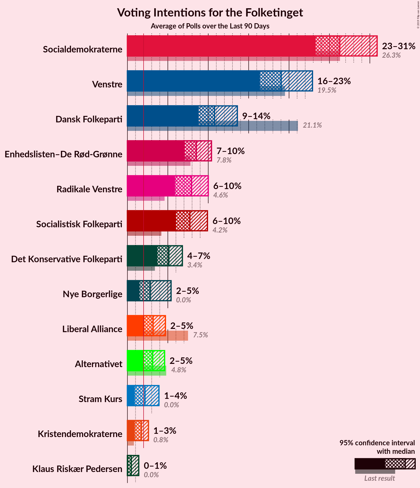

### Confidence Intervals

| Party | Last Result | Median | 80% Confidence Interval | 90% Confidence Interval | 95% Confidence Interval | 99% Confidence Interval |
|:-----:|:-----------:|:------:|:-----------------------:|:-----------------------:|:-----------------------:|:-----------------------:|
| <a href="#socialdemokraterne">Socialdemokraterne</a> | 26.3% | 26.3% | 24.3–29.5% |23.8–30.3% | 23.3–30.9% | 22.5–32.1% |
| <a href="#dansk-folkeparti">Dansk Folkeparti</a> | 21.1% | 10.8% | 9.4–12.8% |9.1–13.2% | 8.8–13.6% | 8.3–14.4% |
| <a href="#venstre">Venstre</a> | 19.5% | 19.0% | 17.2–22.0% |16.7–22.5% | 16.4–22.9% | 15.7–23.4% |
| <a href="#enhedslisten–de-rød-grønne">Enhedslisten–De Rød-Grønne</a> | 7.8% | 8.5% | 7.6–9.7% |7.3–10.1% | 7.1–10.4% | 6.6–11.0% |
| <a href="#liberal-alliance">Liberal Alliance</a> | 7.5% | 3.2% | 2.4–4.2% |2.2–4.5% | 2.1–4.7% | 1.9–5.1% |
| <a href="#alternativet">Alternativet</a> | 4.8% | 3.1% | 2.4–4.0% |2.2–4.4% | 2.0–4.6% | 1.8–5.2% |
| <a href="#radikale-venstre">Radikale Venstre</a> | 4.6% | 7.9% | 6.6–9.3% |6.2–9.7% | 5.9–10.0% | 5.4–10.8% |
| <a href="#socialistisk-folkeparti">Socialistisk Folkeparti</a> | 4.2% | 7.7% | 6.6–9.0% |6.3–9.5% | 6.0–9.9% | 5.5–10.7% |
| <a href="#det-konservative-folkeparti">Det Konservative Folkeparti</a> | 3.4% | 5.1% | 4.1–6.4% |3.9–6.6% | 3.7–6.8% | 3.3–7.2% |
| <a href="#kristendemokraterne">Kristendemokraterne</a> | 0.8% | 1.7% | 1.2–2.3% |1.0–2.5% | 0.9–2.6% | 0.7–3.0% |
| <a href="#nye-borgerlige">Nye Borgerlige</a> | 0.0% | 2.8% | 1.9–4.6% |1.7–5.1% | 1.5–5.4% | 1.2–6.0% |
| <a href="#klaus-riskær-pedersen">Klaus Riskær Pedersen</a> | 0.0% | 0.5% | 0.2–1.0% |0.1–1.2% | 0.1–1.4% | 0.1–1.7% |
| <a href="#stram-kurs">Stram Kurs</a> | 0.0% | 2.2% | 1.1–3.4% |1.0–3.7% | 0.9–3.9% | 0.8–4.3% |

### Socialdemokraterne

*For a full overview of the results for this party, see the [Socialdemokraterne](party-socialdemokraterne.html) page.*

| Voting Intentions | Probability | Accumulated | Special Marks |
|:-----------------:|:-----------:|:-----------:|:-------------:|
| 20.5–21.5% | 0% | 100% |  |
| 21.5–22.5% | 0.6% | 100% |  |
| 22.5–23.5% | 3% | 99.4% |  |
| 23.5–24.5% | 9% | 96% |  |
| 24.5–25.5% | 19% | 87% |  |
| 25.5–26.5% | 23% | 68% | Last Result, Median |
| 26.5–27.5% | 15% | 45% |  |
| 27.5–28.5% | 11% | 30% |  |
| 28.5–29.5% | 9% | 19% |  |
| 29.5–30.5% | 6% | 9% |  |
| 30.5–31.5% | 3% | 4% |  |
| 31.5–32.5% | 0.9% | 1.1% |  |
| 32.5–33.5% | 0.2% | 0.2% |  |
| 33.5–34.5% | 0% | 0% |  |

### Dansk Folkeparti

*For a full overview of the results for this party, see the [Dansk Folkeparti](party-danskfolkeparti.html) page.*

| Voting Intentions | Probability | Accumulated | Special Marks |
|:-----------------:|:-----------:|:-----------:|:-------------:|
| 6.5–7.5% | 0% | 100% |  |
| 7.5–8.5% | 1.0% | 100% |  |
| 8.5–9.5% | 11% | 99.0% |  |
| 9.5–10.5% | 29% | 88% |  |
| 10.5–11.5% | 29% | 59% | Median |
| 11.5–12.5% | 17% | 30% |  |
| 12.5–13.5% | 10% | 13% |  |
| 13.5–14.5% | 3% | 3% |  |
| 14.5–15.5% | 0.3% | 0.3% |  |
| 15.5–16.5% | 0% | 0% |  |
| 16.5–17.5% | 0% | 0% |  |
| 17.5–18.5% | 0% | 0% |  |
| 18.5–19.5% | 0% | 0% |  |
| 19.5–20.5% | 0% | 0% |  |
| 20.5–21.5% | 0% | 0% | Last Result |

### Venstre

*For a full overview of the results for this party, see the [Venstre](party-venstre.html) page.*

| Voting Intentions | Probability | Accumulated | Special Marks |
|:-----------------:|:-----------:|:-----------:|:-------------:|
| 13.5–14.5% | 0% | 100% |  |
| 14.5–15.5% | 0.4% | 100% |  |
| 15.5–16.5% | 3% | 99.6% |  |
| 16.5–17.5% | 13% | 96% |  |
| 17.5–18.5% | 23% | 84% |  |
| 18.5–19.5% | 21% | 61% | Median |
| 19.5–20.5% | 15% | 40% | Last Result |
| 20.5–21.5% | 10% | 25% |  |
| 21.5–22.5% | 10% | 14% |  |
| 22.5–23.5% | 4% | 5% |  |
| 23.5–24.5% | 0.3% | 0.3% |  |
| 24.5–25.5% | 0% | 0% |  |

### Enhedslisten–De Rød-Grønne

*For a full overview of the results for this party, see the [Enhedslisten–De Rød-Grønne](party-enhedslisten–derød-grønne.html) page.*

| Voting Intentions | Probability | Accumulated | Special Marks |
|:-----------------:|:-----------:|:-----------:|:-------------:|
| 4.5–5.5% | 0% | 100% |  |
| 5.5–6.5% | 0.4% | 100% |  |
| 6.5–7.5% | 9% | 99.6% |  |
| 7.5–8.5% | 42% | 91% | Last Result |
| 8.5–9.5% | 36% | 49% | Median |
| 9.5–10.5% | 12% | 13% |  |
| 10.5–11.5% | 1.5% | 2% |  |
| 11.5–12.5% | 0.1% | 0.1% |  |
| 12.5–13.5% | 0% | 0% |  |

### Liberal Alliance

*For a full overview of the results for this party, see the [Liberal Alliance](party-liberalalliance.html) page.*

| Voting Intentions | Probability | Accumulated | Special Marks |
|:-----------------:|:-----------:|:-----------:|:-------------:|
| 0.5–1.5% | 0% | 100% |  |
| 1.5–2.5% | 15% | 100% |  |
| 2.5–3.5% | 52% | 85% | Median |
| 3.5–4.5% | 29% | 33% |  |
| 4.5–5.5% | 4% | 4% |  |
| 5.5–6.5% | 0.1% | 0.1% |  |
| 6.5–7.5% | 0% | 0% |  |
| 7.5–8.5% | 0% | 0% | Last Result |

### Alternativet

*For a full overview of the results for this party, see the [Alternativet](party-alternativet.html) page.*

| Voting Intentions | Probability | Accumulated | Special Marks |
|:-----------------:|:-----------:|:-----------:|:-------------:|
| 0.5–1.5% | 0.1% | 100% |  |
| 1.5–2.5% | 15% | 99.9% |  |
| 2.5–3.5% | 59% | 85% | Median |
| 3.5–4.5% | 23% | 26% |  |
| 4.5–5.5% | 3% | 3% | Last Result |
| 5.5–6.5% | 0.1% | 0.1% |  |
| 6.5–7.5% | 0% | 0% |  |

### Radikale Venstre

*For a full overview of the results for this party, see the [Radikale Venstre](party-radikalevenstre.html) page.*

| Voting Intentions | Probability | Accumulated | Special Marks |
|:-----------------:|:-----------:|:-----------:|:-------------:|
| 3.5–4.5% | 0% | 100% |  |
| 4.5–5.5% | 0.9% | 100% | Last Result |
| 5.5–6.5% | 8% | 99.1% |  |
| 6.5–7.5% | 26% | 91% |  |
| 7.5–8.5% | 36% | 65% | Median |
| 8.5–9.5% | 23% | 29% |  |
| 9.5–10.5% | 6% | 6% |  |
| 10.5–11.5% | 0.8% | 0.8% |  |
| 11.5–12.5% | 0.1% | 0.1% |  |
| 12.5–13.5% | 0% | 0% |  |

### Socialistisk Folkeparti

*For a full overview of the results for this party, see the [Socialistisk Folkeparti](party-socialistiskfolkeparti.html) page.*

| Voting Intentions | Probability | Accumulated | Special Marks |
|:-----------------:|:-----------:|:-----------:|:-------------:|
| 3.5–4.5% | 0% | 100% | Last Result |
| 4.5–5.5% | 0.5% | 100% |  |
| 5.5–6.5% | 8% | 99.5% |  |
| 6.5–7.5% | 33% | 91% |  |
| 7.5–8.5% | 39% | 58% | Median |
| 8.5–9.5% | 15% | 20% |  |
| 9.5–10.5% | 4% | 5% |  |
| 10.5–11.5% | 0.6% | 0.7% |  |
| 11.5–12.5% | 0% | 0% |  |
| 12.5–13.5% | 0% | 0% |  |

### Det Konservative Folkeparti

*For a full overview of the results for this party, see the [Det Konservative Folkeparti](party-detkonservativefolkeparti.html) page.*

| Voting Intentions | Probability | Accumulated | Special Marks |
|:-----------------:|:-----------:|:-----------:|:-------------:|
| 1.5–2.5% | 0% | 100% |  |
| 2.5–3.5% | 2% | 100% | Last Result |
| 3.5–4.5% | 24% | 98% |  |
| 4.5–5.5% | 38% | 75% | Median |
| 5.5–6.5% | 31% | 36% |  |
| 6.5–7.5% | 6% | 6% |  |
| 7.5–8.5% | 0.1% | 0.1% |  |
| 8.5–9.5% | 0% | 0% |  |

### Kristendemokraterne

*For a full overview of the results for this party, see the [Kristendemokraterne](party-kristendemokraterne.html) page.*

| Voting Intentions | Probability | Accumulated | Special Marks |
|:-----------------:|:-----------:|:-----------:|:-------------:|
| 0.0–0.5% | 0% | 100% |  |
| 0.5–1.5% | 33% | 100% | Last Result |
| 1.5–2.5% | 63% | 67% | Median |
| 2.5–3.5% | 4% | 4% |  |
| 3.5–4.5% | 0% | 0% |  |

### Nye Borgerlige

*For a full overview of the results for this party, see the [Nye Borgerlige](party-nyeborgerlige.html) page.*

| Voting Intentions | Probability | Accumulated | Special Marks |
|:-----------------:|:-----------:|:-----------:|:-------------:|
| 0.0–0.5% | 0% | 100% | Last Result |
| 0.5–1.5% | 3% | 100% |  |
| 1.5–2.5% | 30% | 97% |  |
| 2.5–3.5% | 39% | 66% | Median |
| 3.5–4.5% | 17% | 28% |  |
| 4.5–5.5% | 9% | 11% |  |
| 5.5–6.5% | 2% | 2% |  |
| 6.5–7.5% | 0.1% | 0.1% |  |
| 7.5–8.5% | 0% | 0% |  |

### Klaus Riskær Pedersen

*For a full overview of the results for this party, see the [Klaus Riskær Pedersen](party-klausriskærpedersen.html) page.*

| Voting Intentions | Probability | Accumulated | Special Marks |
|:-----------------:|:-----------:|:-----------:|:-------------:|
| 0.0–0.5% | 55% | 100% | Last Result, Median |
| 0.5–1.5% | 43% | 45% |  |
| 1.5–2.5% | 1.1% | 1.1% |  |
| 2.5–3.5% | 0% | 0% |  |

### Stram Kurs

*For a full overview of the results for this party, see the [Stram Kurs](party-stramkurs.html) page.*

| Voting Intentions | Probability | Accumulated | Special Marks |
|:-----------------:|:-----------:|:-----------:|:-------------:|
| 0.0–0.5% | 0% | 100% | Last Result |
| 0.5–1.5% | 25% | 100% |  |
| 1.5–2.5% | 39% | 75% | Median |
| 2.5–3.5% | 29% | 37% |  |
| 3.5–4.5% | 7% | 8% |  |
| 4.5–5.5% | 0.2% | 0.2% |  |
| 5.5–6.5% | 0% | 0% |  |

## Seats

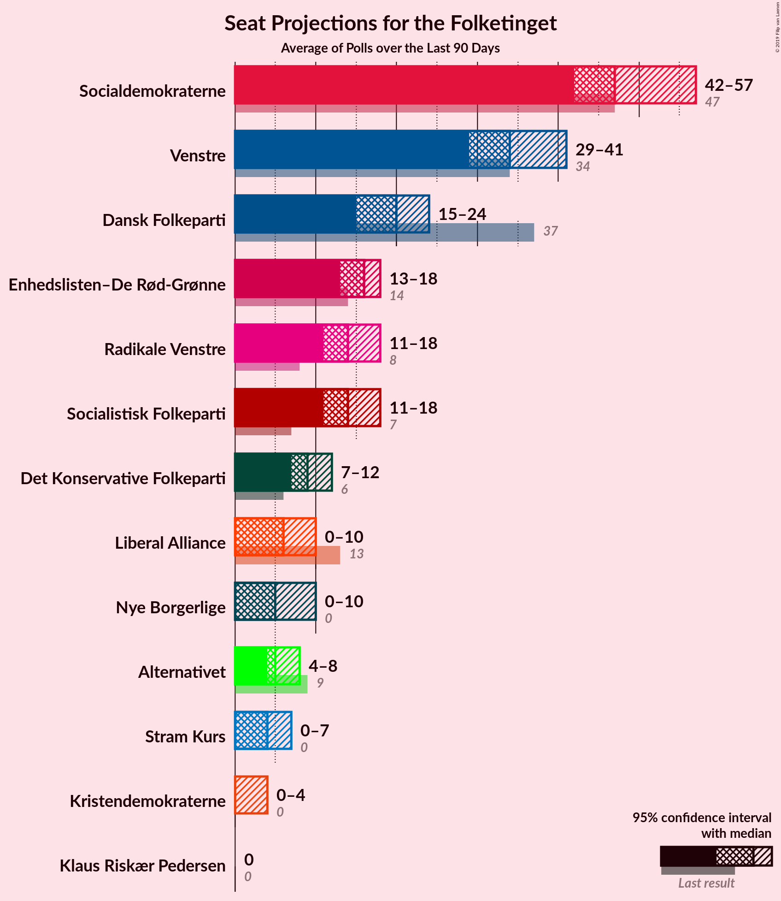

### Confidence Intervals

| Party | Last Result | Median | 80% Confidence Interval | 90% Confidence Interval | 95% Confidence Interval | 99% Confidence Interval |
|:-----:|:-----------:|:------:|:-----------------------:|:-----------------------:|:-----------------------:|:-----------------------:|
| <a href="#socialdemokraterne">Socialdemokraterne</a> | 47 | 47 | 43–55 |43–57 | 42–57 | 40–57 |
| <a href="#dansk-folkeparti">Dansk Folkeparti</a> | 37 | 20 | 16–23 |16–24 | 15–24 | 15–25 |
| <a href="#venstre">Venstre</a> | 34 | 34 | 30–40 |30–40 | 29–41 | 28–42 |
| <a href="#enhedslisten–de-rød-grønne">Enhedslisten–De Rød-Grønne</a> | 14 | 16 | 13–18 |13–18 | 13–18 | 12–19 |
| <a href="#liberal-alliance">Liberal Alliance</a> | 13 | 6 | 4–8 |0–8 | 0–10 | 0–10 |
| <a href="#alternativet">Alternativet</a> | 9 | 5 | 4–8 |4–8 | 4–8 | 0–10 |
| <a href="#radikale-venstre">Radikale Venstre</a> | 8 | 14 | 12–18 |11–18 | 11–18 | 10–19 |
| <a href="#socialistisk-folkeparti">Socialistisk Folkeparti</a> | 7 | 14 | 12–16 |12–18 | 11–18 | 10–19 |
| <a href="#det-konservative-folkeparti">Det Konservative Folkeparti</a> | 6 | 9 | 8–12 |7–12 | 7–12 | 6–13 |
| <a href="#kristendemokraterne">Kristendemokraterne</a> | 0 | 0 | 0–4 |0–4 | 0–4 | 0–5 |
| <a href="#nye-borgerlige">Nye Borgerlige</a> | 0 | 5 | 0–9 |0–9 | 0–10 | 0–11 |
| <a href="#klaus-riskær-pedersen">Klaus Riskær Pedersen</a> | 0 | 0 | 0 |0 | 0 | 0 |
| <a href="#stram-kurs">Stram Kurs</a> | 0 | 4 | 0–6 |0–7 | 0–7 | 0–8 |

### Socialdemokraterne

*For a full overview of the results for this party, see the [Socialdemokraterne](party-socialdemokraterne.html) page.*

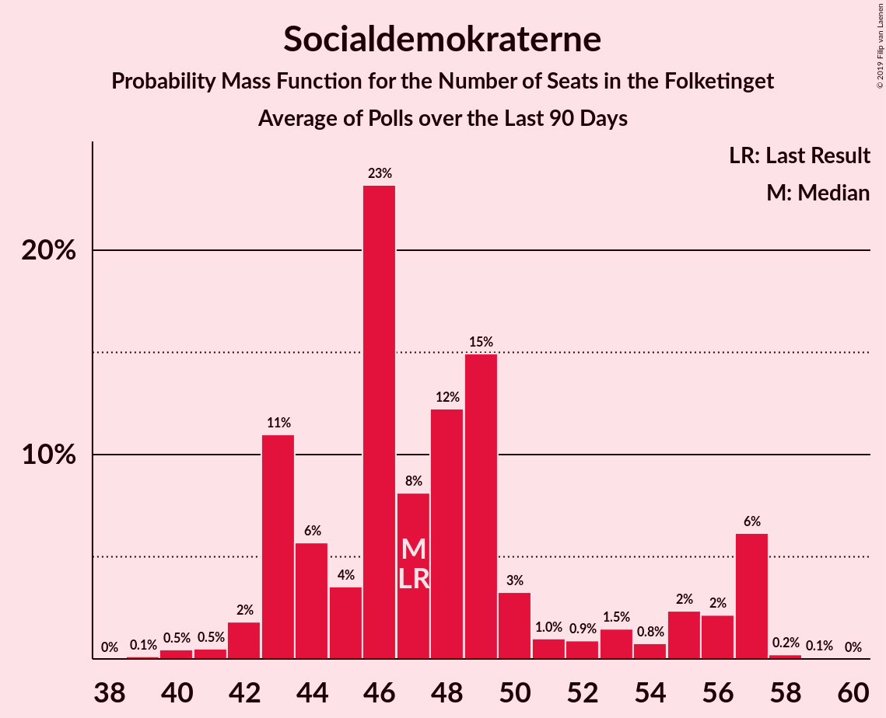

| Number of Seats | Probability | Accumulated | Special Marks |
|:---------------:|:-----------:|:-----------:|:-------------:|
| 39 | 0.1% | 100% |  |
| 40 | 0.5% | 99.9% |  |
| 41 | 0.5% | 99.4% |  |
| 42 | 2% | 98.9% |  |
| 43 | 11% | 97% |  |
| 44 | 6% | 86% |  |
| 45 | 4% | 80% |  |
| 46 | 23% | 77% |  |
| 47 | 8% | 54% | Last Result, Median |
| 48 | 12% | 46% |  |
| 49 | 15% | 33% |  |
| 50 | 3% | 18% |  |
| 51 | 1.0% | 15% |  |
| 52 | 0.9% | 14% |  |
| 53 | 1.5% | 13% |  |
| 54 | 0.8% | 12% |  |
| 55 | 2% | 11% |  |
| 56 | 2% | 9% |  |
| 57 | 6% | 6% |  |
| 58 | 0.2% | 0.3% |  |
| 59 | 0.1% | 0.1% |  |
| 60 | 0% | 0% |  |

### Dansk Folkeparti

*For a full overview of the results for this party, see the [Dansk Folkeparti](party-danskfolkeparti.html) page.*

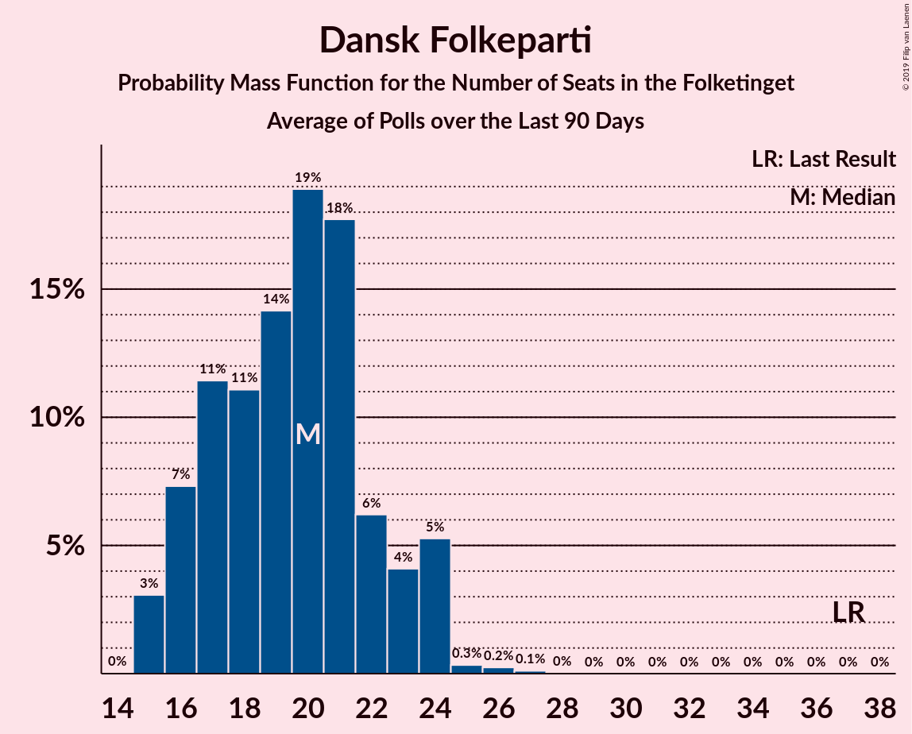

| Number of Seats | Probability | Accumulated | Special Marks |
|:---------------:|:-----------:|:-----------:|:-------------:|
| 15 | 3% | 100% |  |
| 16 | 7% | 97% |  |
| 17 | 11% | 90% |  |
| 18 | 11% | 78% |  |
| 19 | 14% | 67% |  |
| 20 | 19% | 53% | Median |
| 21 | 18% | 34% |  |
| 22 | 6% | 16% |  |
| 23 | 4% | 10% |  |
| 24 | 5% | 6% |  |
| 25 | 0.3% | 0.7% |  |
| 26 | 0.2% | 0.4% |  |
| 27 | 0.1% | 0.1% |  |
| 28 | 0% | 0% |  |
| 29 | 0% | 0% |  |
| 30 | 0% | 0% |  |
| 31 | 0% | 0% |  |
| 32 | 0% | 0% |  |
| 33 | 0% | 0% |  |
| 34 | 0% | 0% |  |
| 35 | 0% | 0% |  |
| 36 | 0% | 0% |  |
| 37 | 0% | 0% | Last Result |

### Venstre

*For a full overview of the results for this party, see the [Venstre](party-venstre.html) page.*

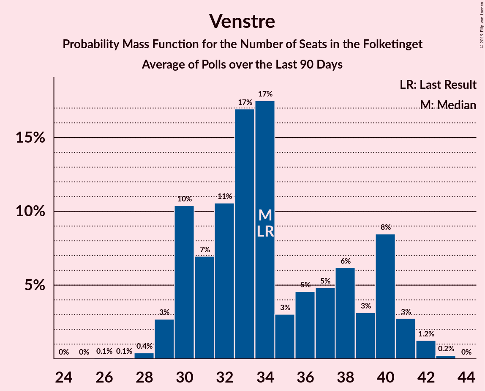

| Number of Seats | Probability | Accumulated | Special Marks |
|:---------------:|:-----------:|:-----------:|:-------------:|
| 26 | 0.1% | 100% |  |
| 27 | 0.1% | 99.9% |  |
| 28 | 0.4% | 99.9% |  |
| 29 | 3% | 99.4% |  |
| 30 | 10% | 97% |  |
| 31 | 7% | 86% |  |
| 32 | 11% | 79% |  |
| 33 | 17% | 69% |  |
| 34 | 17% | 52% | Last Result, Median |
| 35 | 3% | 34% |  |
| 36 | 5% | 31% |  |
| 37 | 5% | 27% |  |
| 38 | 6% | 22% |  |
| 39 | 3% | 16% |  |
| 40 | 8% | 13% |  |
| 41 | 3% | 4% |  |
| 42 | 1.2% | 1.5% |  |
| 43 | 0.2% | 0.2% |  |
| 44 | 0% | 0% |  |

### Enhedslisten–De Rød-Grønne

*For a full overview of the results for this party, see the [Enhedslisten–De Rød-Grønne](party-enhedslisten–derød-grønne.html) page.*

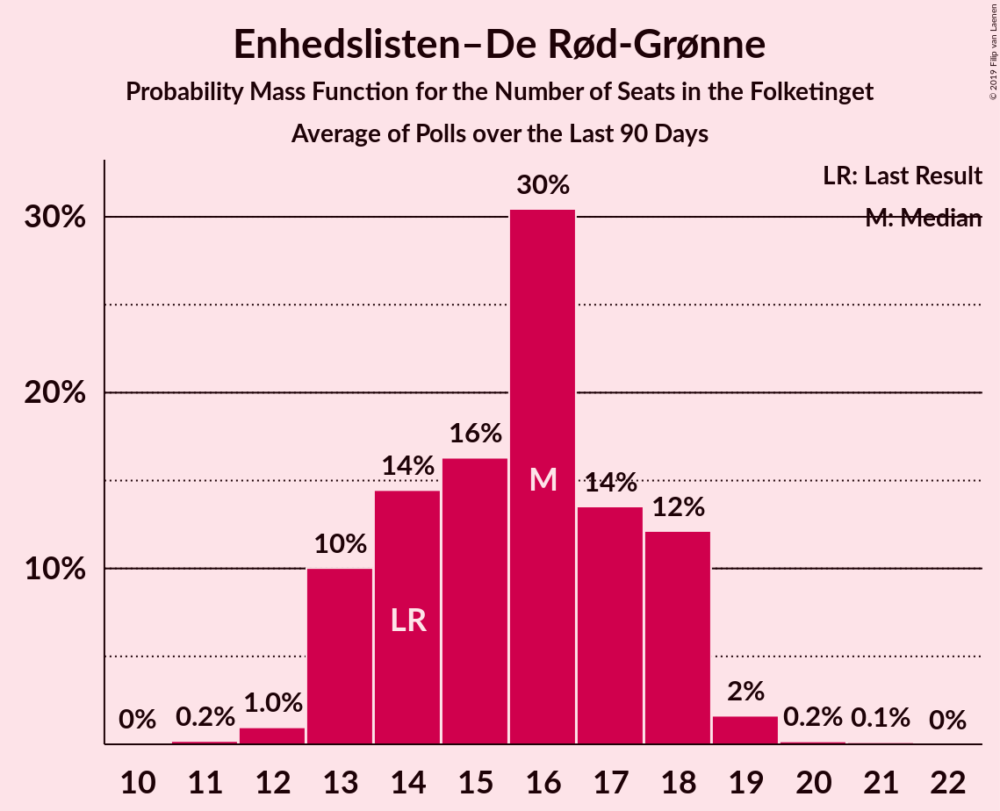

| Number of Seats | Probability | Accumulated | Special Marks |
|:---------------:|:-----------:|:-----------:|:-------------:|
| 11 | 0.2% | 100% |  |
| 12 | 1.0% | 99.8% |  |
| 13 | 10% | 98.8% |  |
| 14 | 14% | 89% | Last Result |
| 15 | 16% | 74% |  |
| 16 | 30% | 58% | Median |
| 17 | 14% | 28% |  |
| 18 | 12% | 14% |  |
| 19 | 2% | 2% |  |
| 20 | 0.2% | 0.3% |  |
| 21 | 0.1% | 0.1% |  |
| 22 | 0% | 0% |  |

### Liberal Alliance

*For a full overview of the results for this party, see the [Liberal Alliance](party-liberalalliance.html) page.*

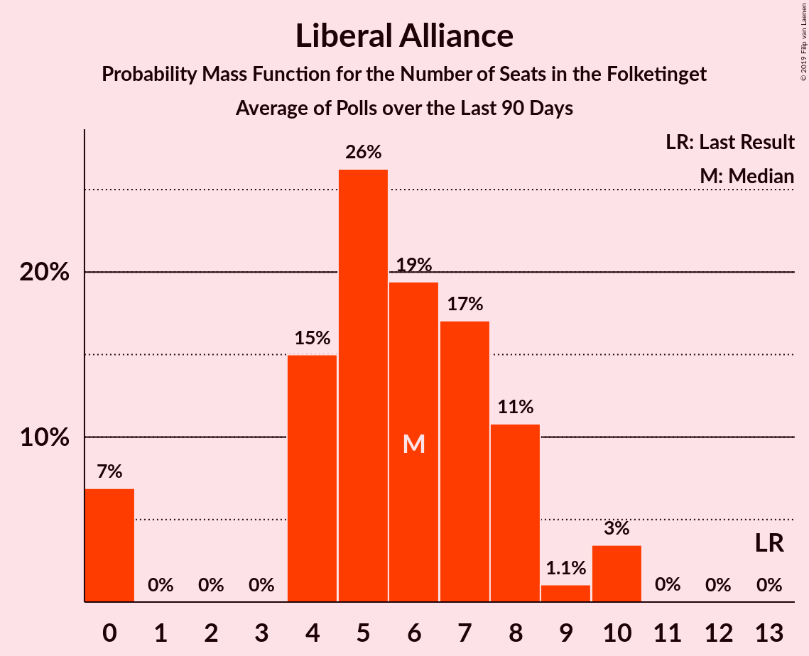

| Number of Seats | Probability | Accumulated | Special Marks |
|:---------------:|:-----------:|:-----------:|:-------------:|
| 0 | 7% | 100% |  |
| 1 | 0% | 93% |  |
| 2 | 0% | 93% |  |
| 3 | 0% | 93% |  |
| 4 | 15% | 93% |  |
| 5 | 26% | 78% |  |
| 6 | 19% | 52% | Median |
| 7 | 17% | 32% |  |
| 8 | 11% | 15% |  |
| 9 | 1.1% | 5% |  |
| 10 | 3% | 4% |  |
| 11 | 0% | 0.1% |  |
| 12 | 0% | 0% |  |
| 13 | 0% | 0% | Last Result |

### Alternativet

*For a full overview of the results for this party, see the [Alternativet](party-alternativet.html) page.*

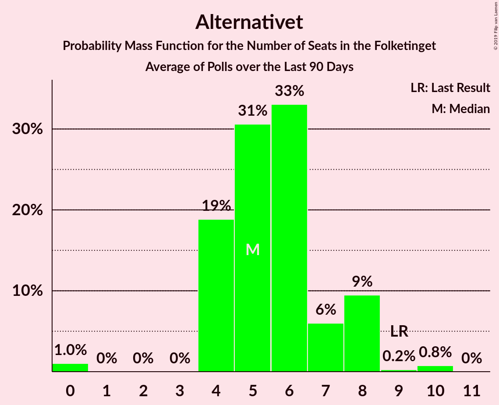

| Number of Seats | Probability | Accumulated | Special Marks |
|:---------------:|:-----------:|:-----------:|:-------------:|
| 0 | 1.0% | 100% |  |
| 1 | 0% | 99.0% |  |
| 2 | 0% | 99.0% |  |
| 3 | 0% | 99.0% |  |
| 4 | 19% | 99.0% |  |
| 5 | 31% | 80% | Median |
| 6 | 33% | 50% |  |
| 7 | 6% | 16% |  |
| 8 | 9% | 10% |  |
| 9 | 0.2% | 1.0% | Last Result |
| 10 | 0.8% | 0.8% |  |
| 11 | 0% | 0% |  |

### Radikale Venstre

*For a full overview of the results for this party, see the [Radikale Venstre](party-radikalevenstre.html) page.*

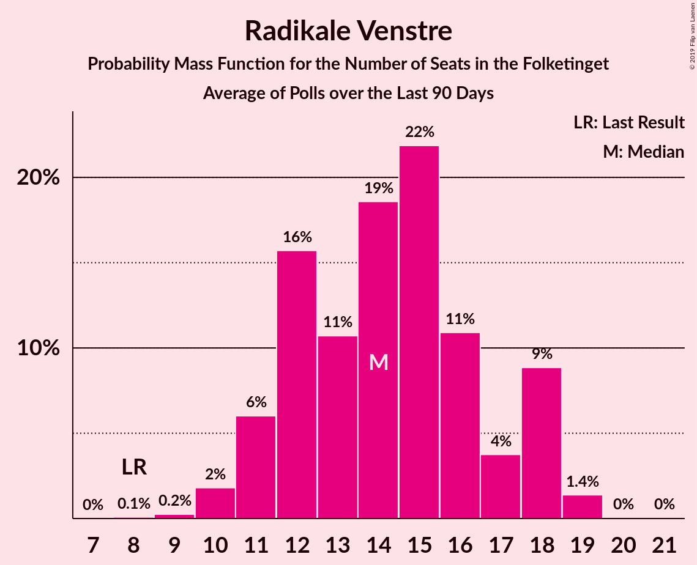

| Number of Seats | Probability | Accumulated | Special Marks |
|:---------------:|:-----------:|:-----------:|:-------------:|
| 8 | 0.1% | 100% | Last Result |
| 9 | 0.2% | 99.9% |  |
| 10 | 2% | 99.7% |  |
| 11 | 6% | 98% |  |
| 12 | 16% | 92% |  |
| 13 | 11% | 76% |  |
| 14 | 19% | 65% | Median |
| 15 | 22% | 47% |  |
| 16 | 11% | 25% |  |
| 17 | 4% | 14% |  |
| 18 | 9% | 10% |  |
| 19 | 1.4% | 1.5% |  |
| 20 | 0% | 0.1% |  |
| 21 | 0% | 0% |  |

### Socialistisk Folkeparti

*For a full overview of the results for this party, see the [Socialistisk Folkeparti](party-socialistiskfolkeparti.html) page.*

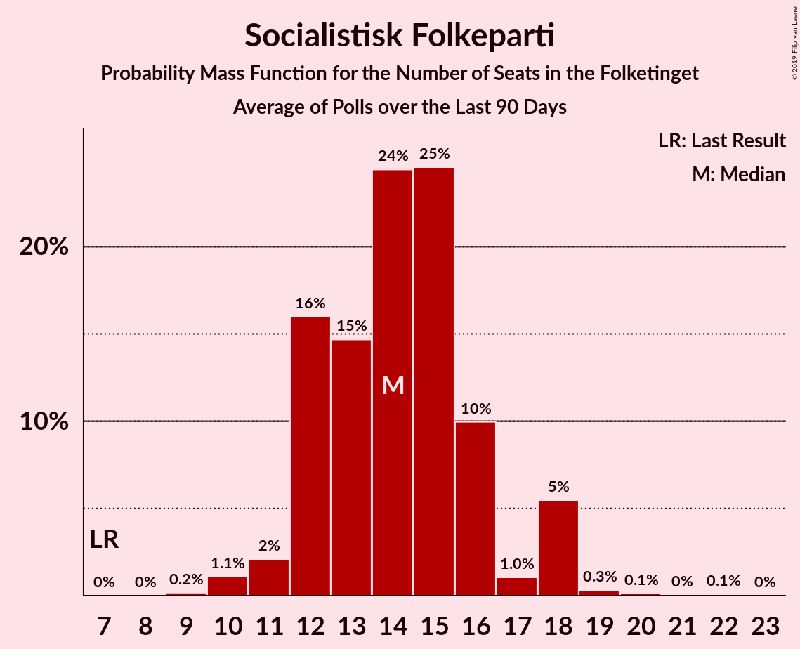

| Number of Seats | Probability | Accumulated | Special Marks |
|:---------------:|:-----------:|:-----------:|:-------------:|
| 7 | 0% | 100% | Last Result |
| 8 | 0% | 100% |  |
| 9 | 0.2% | 100% |  |
| 10 | 1.1% | 99.8% |  |
| 11 | 2% | 98.7% |  |
| 12 | 16% | 97% |  |
| 13 | 15% | 81% |  |
| 14 | 24% | 66% | Median |
| 15 | 25% | 42% |  |
| 16 | 10% | 17% |  |
| 17 | 1.0% | 7% |  |
| 18 | 5% | 6% |  |
| 19 | 0.3% | 0.5% |  |
| 20 | 0.1% | 0.2% |  |
| 21 | 0% | 0.1% |  |
| 22 | 0.1% | 0.1% |  |
| 23 | 0% | 0% |  |

### Det Konservative Folkeparti

*For a full overview of the results for this party, see the [Det Konservative Folkeparti](party-detkonservativefolkeparti.html) page.*

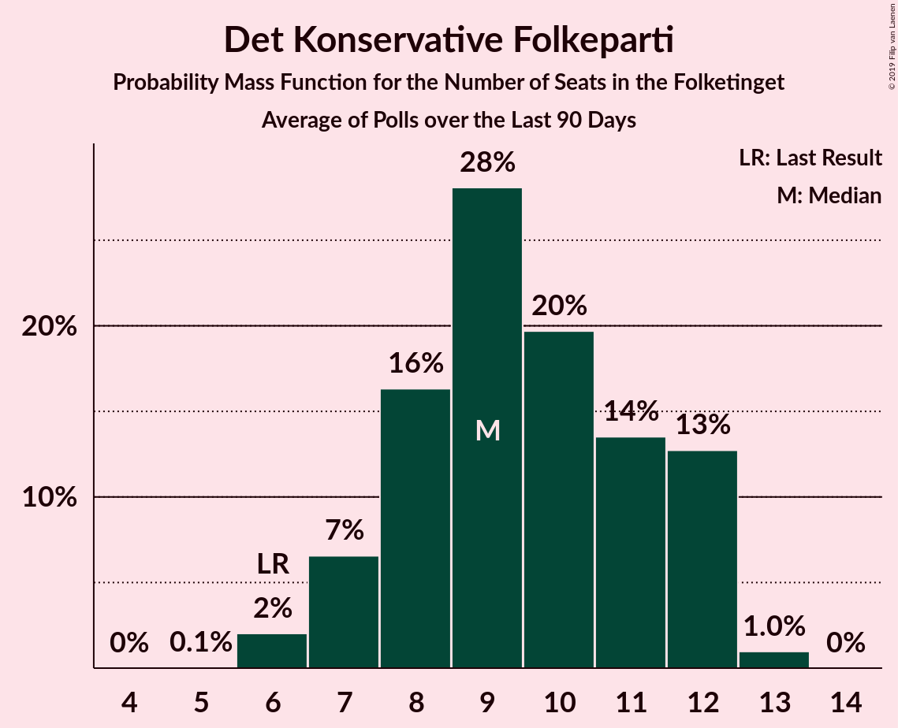

| Number of Seats | Probability | Accumulated | Special Marks |
|:---------------:|:-----------:|:-----------:|:-------------:|
| 5 | 0.1% | 100% |  |
| 6 | 2% | 99.9% | Last Result |
| 7 | 7% | 98% |  |
| 8 | 16% | 91% |  |
| 9 | 28% | 75% | Median |
| 10 | 20% | 47% |  |
| 11 | 14% | 27% |  |
| 12 | 13% | 14% |  |
| 13 | 1.0% | 1.0% |  |
| 14 | 0% | 0% |  |

### Kristendemokraterne

*For a full overview of the results for this party, see the [Kristendemokraterne](party-kristendemokraterne.html) page.*

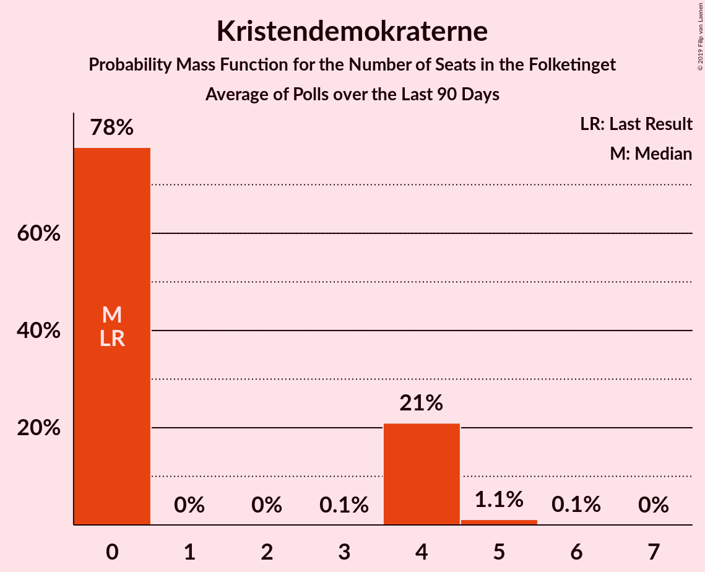

| Number of Seats | Probability | Accumulated | Special Marks |
|:---------------:|:-----------:|:-----------:|:-------------:|
| 0 | 78% | 100% | Last Result, Median |
| 1 | 0% | 22% |  |
| 2 | 0% | 22% |  |
| 3 | 0.1% | 22% |  |
| 4 | 21% | 22% |  |
| 5 | 1.1% | 1.3% |  |
| 6 | 0.1% | 0.1% |  |
| 7 | 0% | 0% |  |

### Nye Borgerlige

*For a full overview of the results for this party, see the [Nye Borgerlige](party-nyeborgerlige.html) page.*

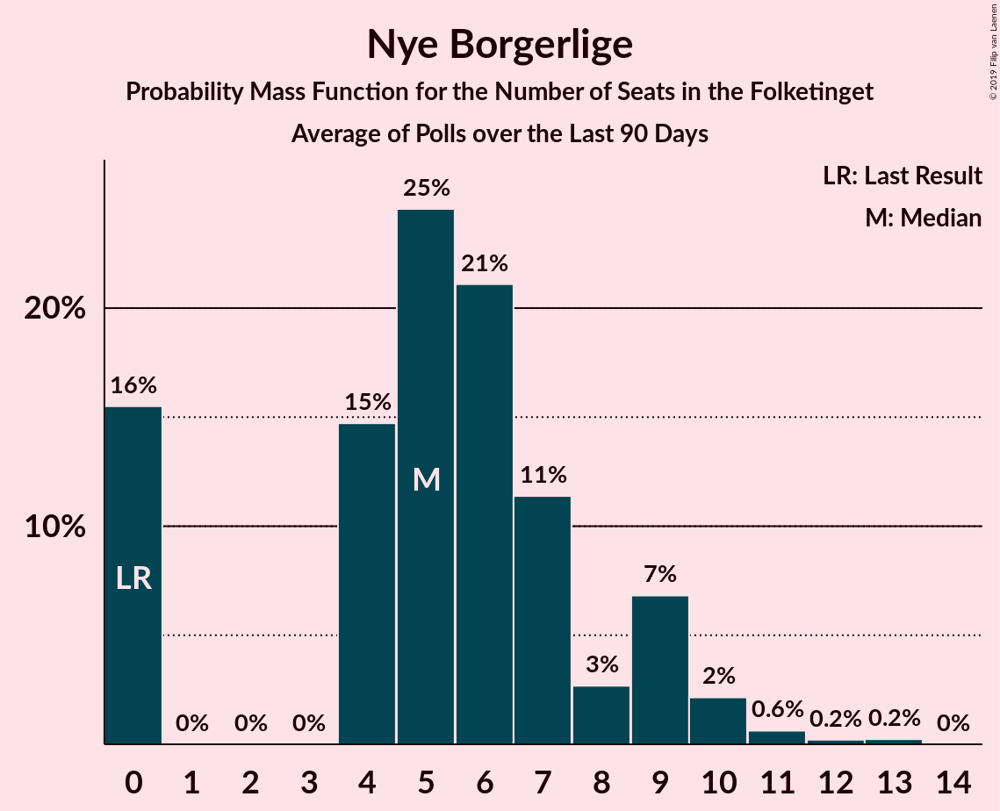

| Number of Seats | Probability | Accumulated | Special Marks |
|:---------------:|:-----------:|:-----------:|:-------------:|
| 0 | 16% | 100% | Last Result |
| 1 | 0% | 84% |  |
| 2 | 0% | 84% |  |
| 3 | 0% | 84% |  |
| 4 | 15% | 84% |  |
| 5 | 25% | 70% | Median |
| 6 | 21% | 45% |  |
| 7 | 11% | 24% |  |
| 8 | 3% | 13% |  |
| 9 | 7% | 10% |  |
| 10 | 2% | 3% |  |
| 11 | 0.6% | 1.1% |  |
| 12 | 0.2% | 0.4% |  |
| 13 | 0.2% | 0.2% |  |
| 14 | 0% | 0% |  |

### Klaus Riskær Pedersen

*For a full overview of the results for this party, see the [Klaus Riskær Pedersen](party-klausriskærpedersen.html) page.*

| Number of Seats | Probability | Accumulated | Special Marks |
|:---------------:|:-----------:|:-----------:|:-------------:|
| 0 | 100% | 100% | Last Result, Median |

### Stram Kurs

*For a full overview of the results for this party, see the [Stram Kurs](party-stramkurs.html) page.*

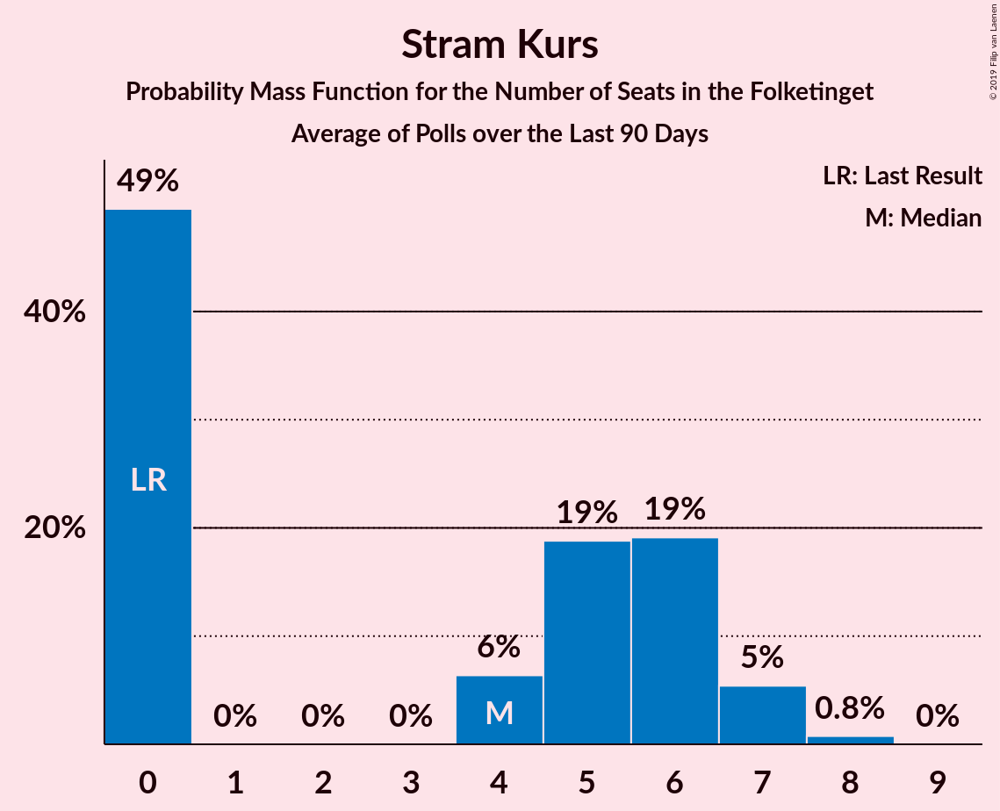

| Number of Seats | Probability | Accumulated | Special Marks |
|:---------------:|:-----------:|:-----------:|:-------------:|
| 0 | 49% | 100% | Last Result |
| 1 | 0% | 51% |  |
| 2 | 0% | 51% |  |
| 3 | 0% | 51% |  |
| 4 | 6% | 50% | Median |
| 5 | 19% | 44% |  |
| 6 | 19% | 25% |  |
| 7 | 5% | 6% |  |
| 8 | 0.8% | 0.8% |  |
| 9 | 0% | 0% |  |

## Coalitions

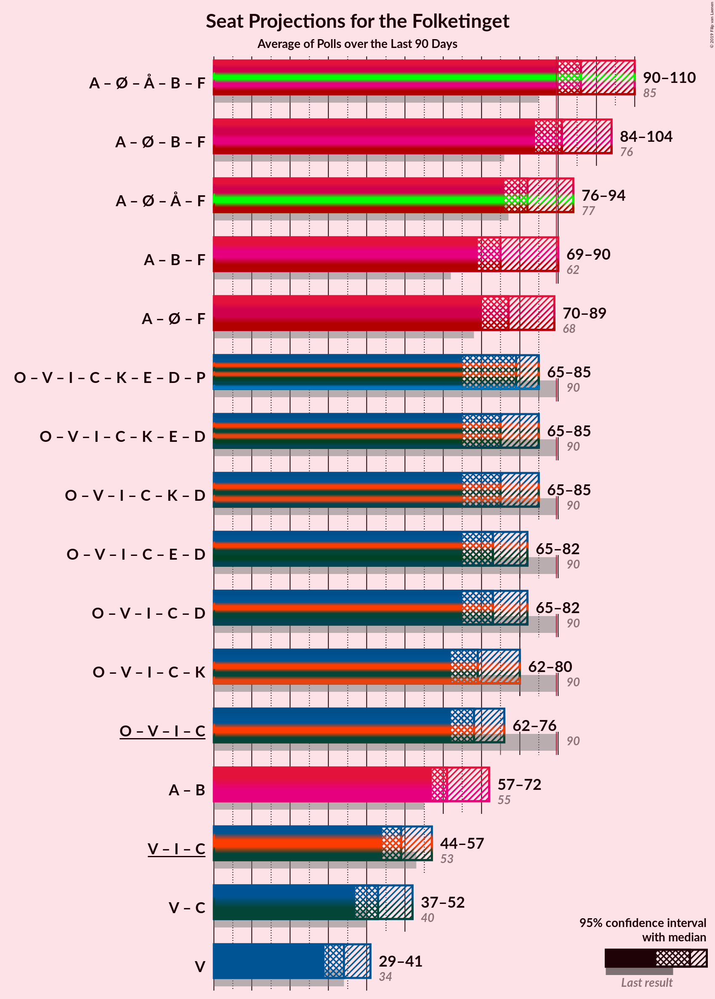

### Confidence Intervals

| Coalition | Last Result | Median | Majority? | 80% Confidence Interval | 90% Confidence Interval | 95% Confidence Interval | 99% Confidence Interval |
|:---------:|:-----------:|:------:|:---------:|:-----------------------:|:-----------------------:|:-----------------------:|:-----------------------:|
| Socialdemokraterne – Enhedslisten–De Rød-Grønne – Alternativet – Radikale Venstre – Socialistisk Folkeparti | 85 | 96 | 98.7% | 91–108 | 90–109 | 90–110 | 88–112 |
| Socialdemokraterne – Enhedslisten–De Rød-Grønne – Radikale Venstre – Socialistisk Folkeparti | 76 | 91 | 61% | 85–101 | 85–104 | 84–104 | 83–107 |
| Socialdemokraterne – Enhedslisten–De Rød-Grønne – Alternativet – Socialistisk Folkeparti | 77 | 82 | 11% | 77–92 | 77–94 | 76–94 | 74–96 |
| Socialdemokraterne – Radikale Venstre – Socialistisk Folkeparti | 62 | 75 | 5% | 71–85 | 70–90 | 69–90 | 68–90 |
| Socialdemokraterne – Enhedslisten–De Rød-Grønne – Socialistisk Folkeparti | 68 | 77 | 0.7% | 72–86 | 71–89 | 70–89 | 69–90 |
| Dansk Folkeparti – Venstre – Liberal Alliance – Det Konservative Folkeparti – Kristendemokraterne – Klaus Riskær Pedersen – Nye Borgerlige – Stram Kurs | 90 | 79 | 0% | 67–84 | 66–85 | 65–85 | 63–87 |
| Dansk Folkeparti – Venstre – Liberal Alliance – Det Konservative Folkeparti – Kristendemokraterne – Klaus Riskær Pedersen – Nye Borgerlige | 90 | 75 | 0% | 67–82 | 66–84 | 65–85 | 62–85 |
| Dansk Folkeparti – Venstre – Liberal Alliance – Det Konservative Folkeparti – Kristendemokraterne – Nye Borgerlige | 90 | 75 | 0% | 67–82 | 66–84 | 65–85 | 62–85 |
| Dansk Folkeparti – Venstre – Liberal Alliance – Det Konservative Folkeparti – Klaus Riskær Pedersen – Nye Borgerlige | 90 | 73 | 0% | 66–80 | 65–81 | 65–82 | 62–83 |
| Dansk Folkeparti – Venstre – Liberal Alliance – Det Konservative Folkeparti – Nye Borgerlige | 90 | 73 | 0% | 66–80 | 65–81 | 65–82 | 62–83 |
| Dansk Folkeparti – Venstre – Liberal Alliance – Det Konservative Folkeparti – Kristendemokraterne | 90 | 69 | 0% | 65–76 | 62–79 | 62–80 | 62–81 |
| Dansk Folkeparti – Venstre – Liberal Alliance – Det Konservative Folkeparti | 90 | 68 | 0% | 64–75 | 62–76 | 62–76 | 59–79 |
| Socialdemokraterne – Radikale Venstre | 55 | 61 | 0% | 57–71 | 57–72 | 57–72 | 54–73 |
| Venstre – Liberal Alliance – Det Konservative Folkeparti | 53 | 49 | 0% | 45–55 | 44–57 | 44–57 | 41–59 |
| Venstre – Det Konservative Folkeparti | 40 | 43 | 0% | 39–51 | 39–52 | 37–52 | 36–54 |
| Venstre | 34 | 34 | 0% | 30–40 | 30–40 | 29–41 | 28–42 |

### Socialdemokraterne – Enhedslisten–De Rød-Grønne – Alternativet – Radikale Venstre – Socialistisk Folkeparti

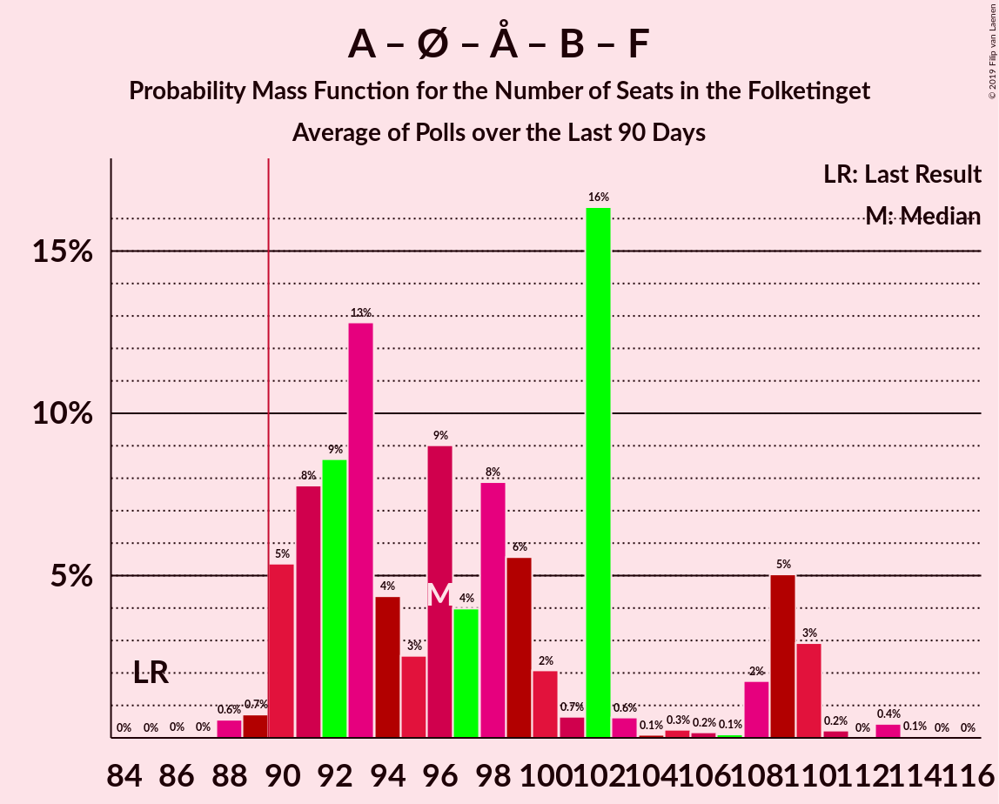

| Number of Seats | Probability | Accumulated | Special Marks |
|:---------------:|:-----------:|:-----------:|:-------------:|
| 85 | 0% | 100% | Last Result |
| 86 | 0% | 100% |  |
| 87 | 0% | 100% |  |
| 88 | 0.6% | 99.9% |  |
| 89 | 0.7% | 99.4% |  |
| 90 | 5% | 98.7% | Majority |
| 91 | 8% | 93% |  |
| 92 | 9% | 86% |  |
| 93 | 13% | 77% |  |
| 94 | 4% | 64% |  |
| 95 | 3% | 60% |  |
| 96 | 9% | 57% | Median |
| 97 | 4% | 48% |  |
| 98 | 8% | 44% |  |
| 99 | 6% | 36% |  |
| 100 | 2% | 31% |  |
| 101 | 0.7% | 29% |  |
| 102 | 16% | 28% |  |
| 103 | 0.6% | 12% |  |
| 104 | 0.1% | 11% |  |
| 105 | 0.3% | 11% |  |
| 106 | 0.2% | 11% |  |
| 107 | 0.1% | 11% |  |
| 108 | 2% | 10% |  |
| 109 | 5% | 9% |  |
| 110 | 3% | 4% |  |
| 111 | 0.2% | 0.7% |  |
| 112 | 0% | 0.5% |  |
| 113 | 0.4% | 0.5% |  |
| 114 | 0.1% | 0.1% |  |
| 115 | 0% | 0% |  |

### Socialdemokraterne – Enhedslisten–De Rød-Grønne – Radikale Venstre – Socialistisk Folkeparti

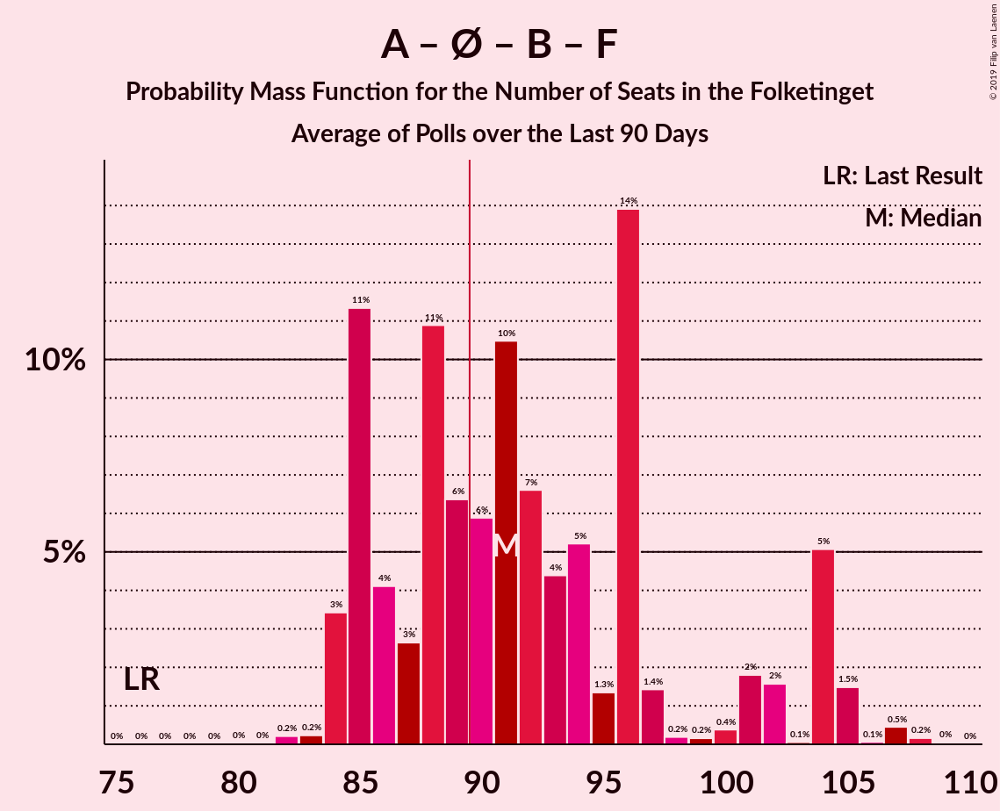

| Number of Seats | Probability | Accumulated | Special Marks |
|:---------------:|:-----------:|:-----------:|:-------------:|
| 76 | 0% | 100% | Last Result |
| 77 | 0% | 100% |  |
| 78 | 0% | 100% |  |
| 79 | 0% | 100% |  |
| 80 | 0% | 100% |  |
| 81 | 0% | 100% |  |
| 82 | 0.2% | 99.9% |  |
| 83 | 0.2% | 99.7% |  |
| 84 | 3% | 99.5% |  |
| 85 | 11% | 96% |  |
| 86 | 4% | 85% |  |
| 87 | 3% | 81% |  |
| 88 | 11% | 78% |  |
| 89 | 6% | 67% |  |
| 90 | 6% | 61% | Majority |
| 91 | 10% | 55% | Median |
| 92 | 7% | 44% |  |
| 93 | 4% | 38% |  |
| 94 | 5% | 33% |  |
| 95 | 1.3% | 28% |  |
| 96 | 14% | 27% |  |
| 97 | 1.4% | 13% |  |
| 98 | 0.2% | 11% |  |
| 99 | 0.2% | 11% |  |
| 100 | 0.4% | 11% |  |
| 101 | 2% | 11% |  |
| 102 | 2% | 9% |  |
| 103 | 0.1% | 7% |  |
| 104 | 5% | 7% |  |
| 105 | 1.5% | 2% |  |
| 106 | 0.1% | 0.7% |  |
| 107 | 0.5% | 0.7% |  |
| 108 | 0.2% | 0.2% |  |
| 109 | 0% | 0.1% |  |
| 110 | 0% | 0% |  |

### Socialdemokraterne – Enhedslisten–De Rød-Grønne – Alternativet – Socialistisk Folkeparti

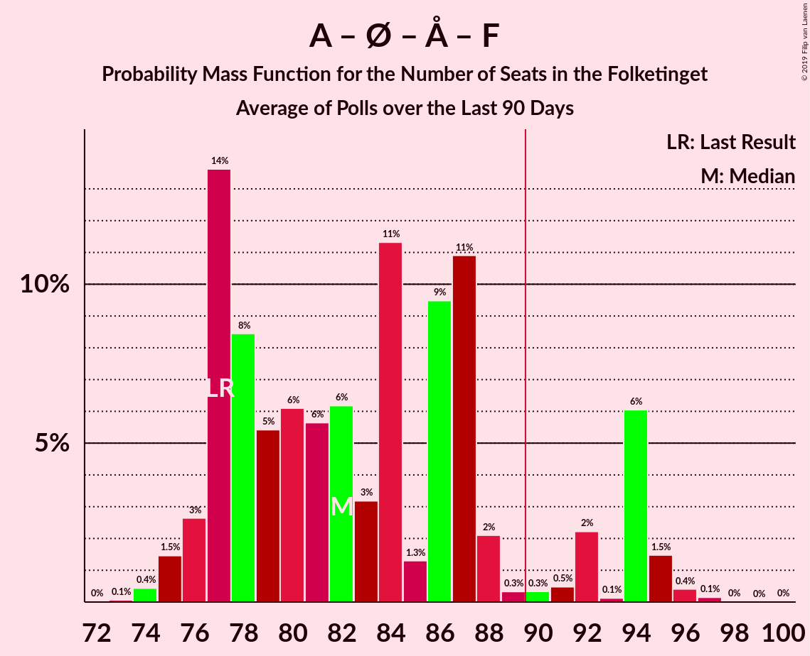

| Number of Seats | Probability | Accumulated | Special Marks |
|:---------------:|:-----------:|:-----------:|:-------------:|
| 73 | 0.1% | 100% |  |
| 74 | 0.4% | 99.9% |  |
| 75 | 1.5% | 99.5% |  |
| 76 | 3% | 98% |  |
| 77 | 14% | 95% | Last Result |
| 78 | 8% | 82% |  |
| 79 | 5% | 73% |  |
| 80 | 6% | 68% |  |
| 81 | 6% | 62% |  |
| 82 | 6% | 56% | Median |
| 83 | 3% | 50% |  |
| 84 | 11% | 47% |  |
| 85 | 1.3% | 35% |  |
| 86 | 9% | 34% |  |
| 87 | 11% | 25% |  |
| 88 | 2% | 14% |  |
| 89 | 0.3% | 12% |  |
| 90 | 0.3% | 11% | Majority |
| 91 | 0.5% | 11% |  |
| 92 | 2% | 10% |  |
| 93 | 0.1% | 8% |  |
| 94 | 6% | 8% |  |
| 95 | 1.5% | 2% |  |
| 96 | 0.4% | 0.6% |  |
| 97 | 0.1% | 0.2% |  |
| 98 | 0% | 0.1% |  |
| 99 | 0% | 0% |  |

### Socialdemokraterne – Radikale Venstre – Socialistisk Folkeparti

| Number of Seats | Probability | Accumulated | Special Marks |
|:---------------:|:-----------:|:-----------:|:-------------:|
| 62 | 0% | 100% | Last Result |
| 63 | 0% | 100% |  |
| 64 | 0% | 100% |  |
| 65 | 0.1% | 100% |  |
| 66 | 0.1% | 99.9% |  |
| 67 | 0.2% | 99.9% |  |
| 68 | 0.1% | 99.6% |  |
| 69 | 4% | 99.5% |  |
| 70 | 4% | 95% |  |
| 71 | 2% | 91% |  |
| 72 | 18% | 89% |  |
| 73 | 11% | 71% |  |
| 74 | 3% | 60% |  |
| 75 | 11% | 56% | Median |
| 76 | 5% | 45% |  |
| 77 | 6% | 41% |  |
| 78 | 12% | 35% |  |
| 79 | 8% | 22% |  |
| 80 | 2% | 15% |  |
| 81 | 1.0% | 13% |  |
| 82 | 0.4% | 12% |  |
| 83 | 0.3% | 11% |  |
| 84 | 0.4% | 11% |  |
| 85 | 2% | 11% |  |
| 86 | 1.1% | 8% |  |
| 87 | 0.1% | 7% |  |
| 88 | 2% | 7% |  |
| 89 | 0% | 5% |  |
| 90 | 5% | 5% | Majority |
| 91 | 0.2% | 0.3% |  |
| 92 | 0.1% | 0.1% |  |
| 93 | 0% | 0% |  |

### Socialdemokraterne – Enhedslisten–De Rød-Grønne – Socialistisk Folkeparti

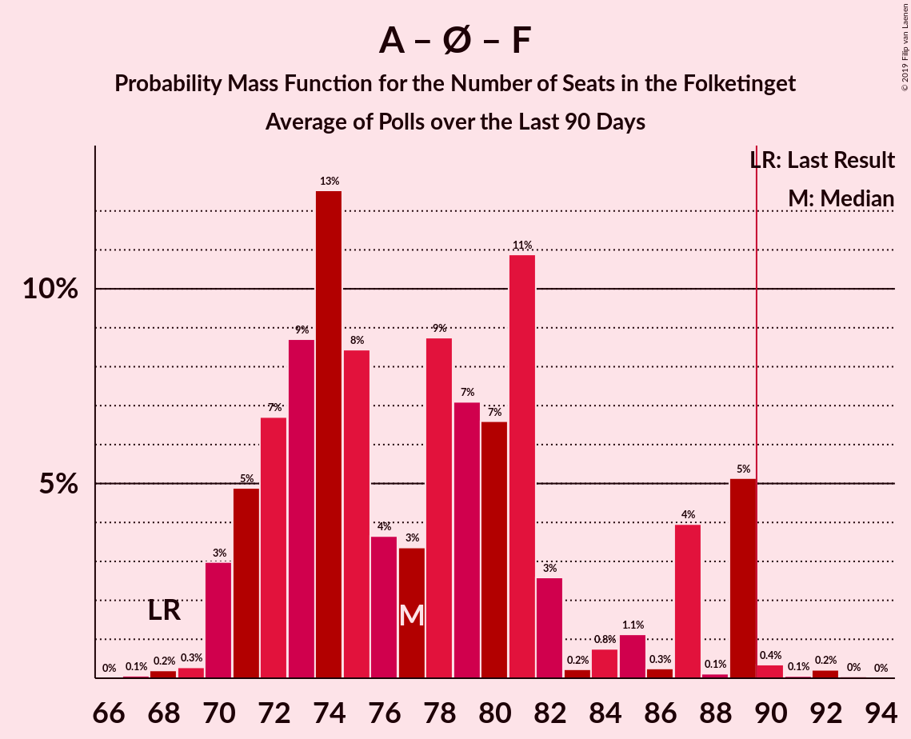

| Number of Seats | Probability | Accumulated | Special Marks |
|:---------------:|:-----------:|:-----------:|:-------------:|
| 67 | 0.1% | 100% |  |
| 68 | 0.2% | 99.9% | Last Result |
| 69 | 0.3% | 99.7% |  |
| 70 | 3% | 99.4% |  |
| 71 | 5% | 96% |  |
| 72 | 7% | 92% |  |
| 73 | 9% | 85% |  |
| 74 | 13% | 76% |  |
| 75 | 8% | 64% |  |
| 76 | 4% | 55% |  |
| 77 | 3% | 52% | Median |
| 78 | 9% | 48% |  |
| 79 | 7% | 39% |  |
| 80 | 7% | 32% |  |
| 81 | 11% | 26% |  |
| 82 | 3% | 15% |  |
| 83 | 0.2% | 12% |  |
| 84 | 0.8% | 12% |  |
| 85 | 1.1% | 11% |  |
| 86 | 0.3% | 10% |  |
| 87 | 4% | 10% |  |
| 88 | 0.1% | 6% |  |
| 89 | 5% | 6% |  |
| 90 | 0.4% | 0.7% | Majority |
| 91 | 0.1% | 0.3% |  |
| 92 | 0.2% | 0.3% |  |
| 93 | 0% | 0.1% |  |
| 94 | 0% | 0% |  |

### Dansk Folkeparti – Venstre – Liberal Alliance – Det Konservative Folkeparti – Kristendemokraterne – Klaus Riskær Pedersen – Nye Borgerlige – Stram Kurs

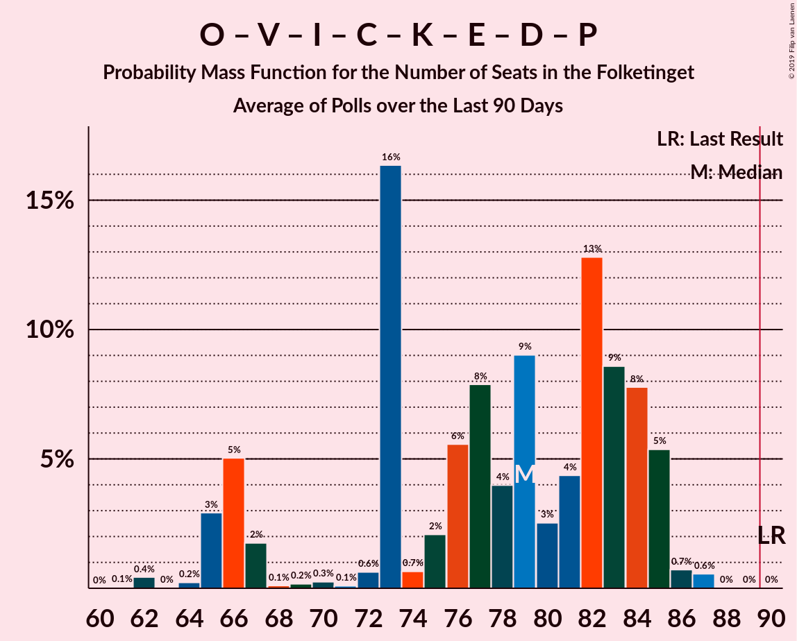

| Number of Seats | Probability | Accumulated | Special Marks |
|:---------------:|:-----------:|:-----------:|:-------------:|
| 61 | 0.1% | 100% |  |
| 62 | 0.4% | 99.9% |  |
| 63 | 0% | 99.5% |  |
| 64 | 0.2% | 99.5% |  |
| 65 | 3% | 99.3% |  |
| 66 | 5% | 96% |  |
| 67 | 2% | 91% |  |
| 68 | 0.1% | 90% |  |
| 69 | 0.2% | 89% |  |
| 70 | 0.3% | 89% |  |
| 71 | 0.1% | 89% |  |
| 72 | 0.6% | 89% |  |
| 73 | 16% | 88% |  |
| 74 | 0.7% | 72% |  |
| 75 | 2% | 71% |  |
| 76 | 6% | 69% |  |
| 77 | 8% | 64% |  |
| 78 | 4% | 56% | Median |
| 79 | 9% | 52% |  |
| 80 | 3% | 43% |  |
| 81 | 4% | 40% |  |
| 82 | 13% | 36% |  |
| 83 | 9% | 23% |  |
| 84 | 8% | 14% |  |
| 85 | 5% | 7% |  |
| 86 | 0.7% | 1.3% |  |
| 87 | 0.6% | 0.6% |  |
| 88 | 0% | 0.1% |  |
| 89 | 0% | 0% |  |
| 90 | 0% | 0% | Last Result, Majority |

### Dansk Folkeparti – Venstre – Liberal Alliance – Det Konservative Folkeparti – Kristendemokraterne – Klaus Riskær Pedersen – Nye Borgerlige

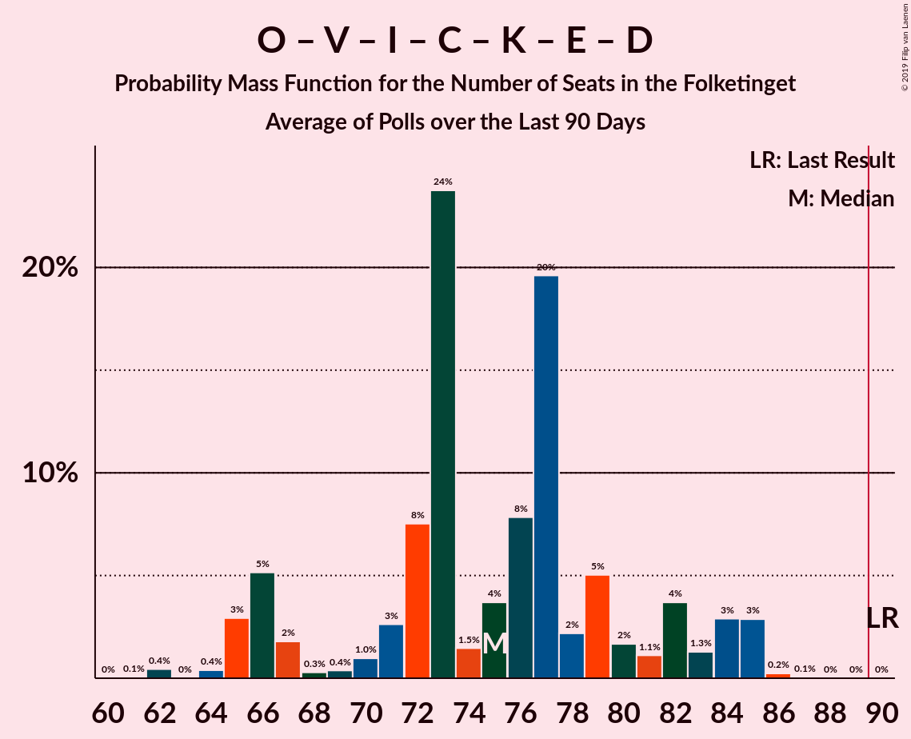

| Number of Seats | Probability | Accumulated | Special Marks |
|:---------------:|:-----------:|:-----------:|:-------------:|
| 61 | 0.1% | 100% |  |
| 62 | 0.4% | 99.9% |  |
| 63 | 0% | 99.5% |  |
| 64 | 0.4% | 99.5% |  |
| 65 | 3% | 99.1% |  |
| 66 | 5% | 96% |  |
| 67 | 2% | 91% |  |
| 68 | 0.3% | 89% |  |
| 69 | 0.4% | 89% |  |
| 70 | 1.0% | 89% |  |
| 71 | 3% | 88% |  |
| 72 | 8% | 85% |  |
| 73 | 24% | 77% |  |
| 74 | 1.5% | 54% | Median |
| 75 | 4% | 52% |  |
| 76 | 8% | 49% |  |
| 77 | 20% | 41% |  |
| 78 | 2% | 21% |  |
| 79 | 5% | 19% |  |
| 80 | 2% | 14% |  |
| 81 | 1.1% | 12% |  |
| 82 | 4% | 11% |  |
| 83 | 1.3% | 7% |  |
| 84 | 3% | 6% |  |
| 85 | 3% | 3% |  |
| 86 | 0.2% | 0.3% |  |
| 87 | 0.1% | 0.1% |  |
| 88 | 0% | 0% |  |
| 89 | 0% | 0% |  |
| 90 | 0% | 0% | Last Result, Majority |

### Dansk Folkeparti – Venstre – Liberal Alliance – Det Konservative Folkeparti – Kristendemokraterne – Nye Borgerlige

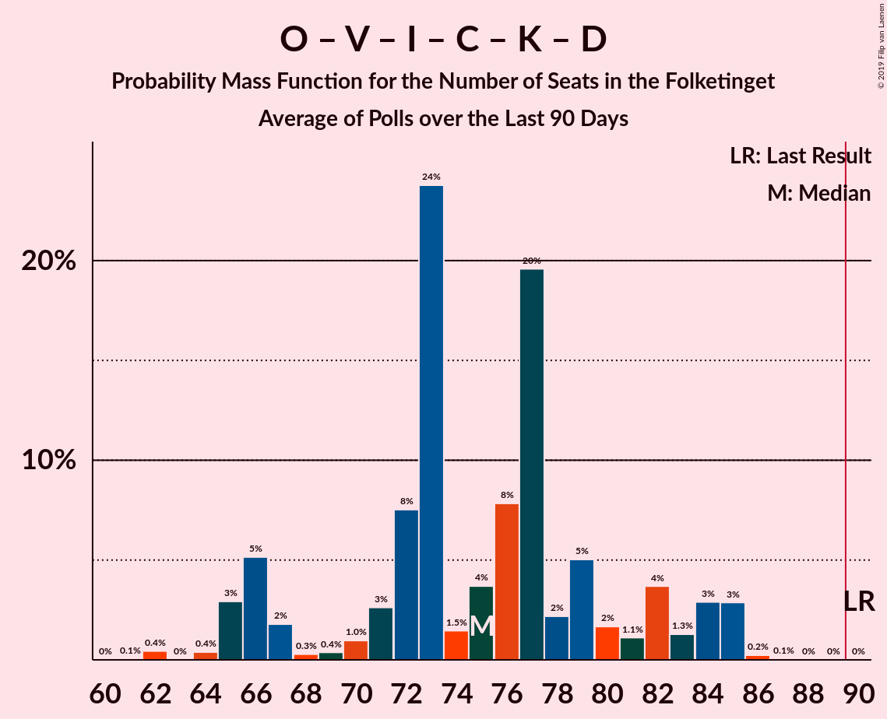

| Number of Seats | Probability | Accumulated | Special Marks |
|:---------------:|:-----------:|:-----------:|:-------------:|
| 61 | 0.1% | 100% |  |
| 62 | 0.4% | 99.9% |  |
| 63 | 0% | 99.5% |  |
| 64 | 0.4% | 99.5% |  |
| 65 | 3% | 99.1% |  |
| 66 | 5% | 96% |  |
| 67 | 2% | 91% |  |
| 68 | 0.3% | 89% |  |
| 69 | 0.4% | 89% |  |
| 70 | 1.0% | 89% |  |
| 71 | 3% | 88% |  |
| 72 | 8% | 85% |  |
| 73 | 24% | 77% |  |
| 74 | 1.5% | 54% | Median |
| 75 | 4% | 52% |  |
| 76 | 8% | 48% |  |
| 77 | 20% | 41% |  |
| 78 | 2% | 21% |  |
| 79 | 5% | 19% |  |
| 80 | 2% | 14% |  |
| 81 | 1.1% | 12% |  |
| 82 | 4% | 11% |  |
| 83 | 1.3% | 7% |  |
| 84 | 3% | 6% |  |
| 85 | 3% | 3% |  |
| 86 | 0.2% | 0.3% |  |
| 87 | 0.1% | 0.1% |  |
| 88 | 0% | 0% |  |
| 89 | 0% | 0% |  |
| 90 | 0% | 0% | Last Result, Majority |

### Dansk Folkeparti – Venstre – Liberal Alliance – Det Konservative Folkeparti – Klaus Riskær Pedersen – Nye Borgerlige

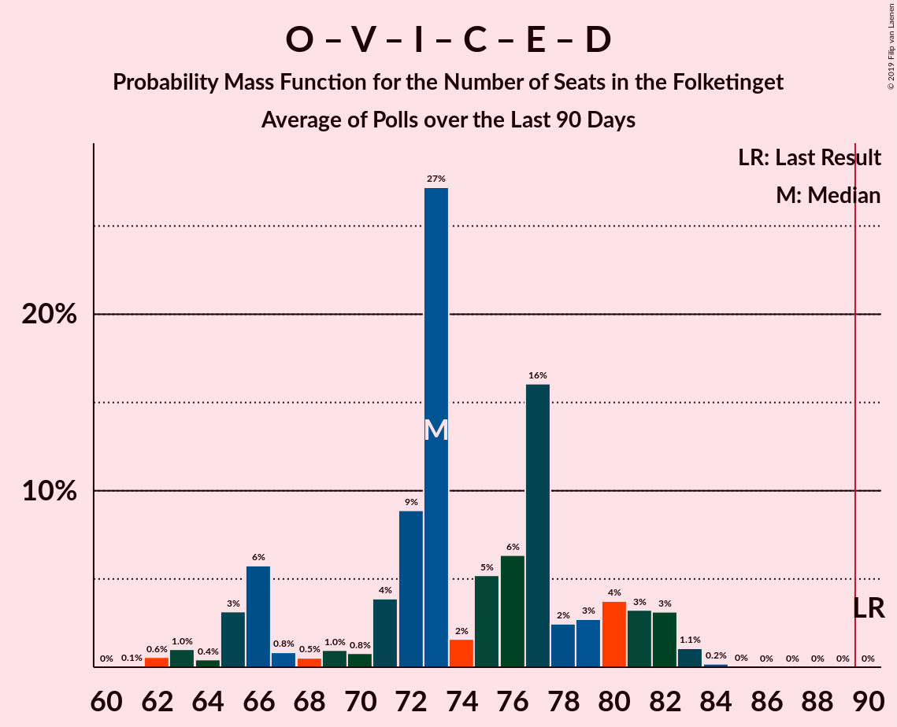

| Number of Seats | Probability | Accumulated | Special Marks |
|:---------------:|:-----------:|:-----------:|:-------------:|
| 61 | 0.1% | 100% |  |
| 62 | 0.6% | 99.9% |  |
| 63 | 1.0% | 99.3% |  |
| 64 | 0.4% | 98% |  |
| 65 | 3% | 98% |  |
| 66 | 6% | 95% |  |
| 67 | 0.8% | 89% |  |
| 68 | 0.5% | 88% |  |
| 69 | 1.0% | 88% |  |
| 70 | 0.8% | 87% |  |
| 71 | 4% | 86% |  |
| 72 | 9% | 82% |  |
| 73 | 27% | 73% |  |
| 74 | 2% | 46% | Median |
| 75 | 5% | 44% |  |
| 76 | 6% | 39% |  |
| 77 | 16% | 33% |  |
| 78 | 2% | 17% |  |
| 79 | 3% | 14% |  |
| 80 | 4% | 11% |  |
| 81 | 3% | 8% |  |
| 82 | 3% | 4% |  |
| 83 | 1.1% | 1.3% |  |
| 84 | 0.2% | 0.3% |  |
| 85 | 0% | 0.1% |  |
| 86 | 0% | 0% |  |
| 87 | 0% | 0% |  |
| 88 | 0% | 0% |  |
| 89 | 0% | 0% |  |
| 90 | 0% | 0% | Last Result, Majority |

### Dansk Folkeparti – Venstre – Liberal Alliance – Det Konservative Folkeparti – Nye Borgerlige

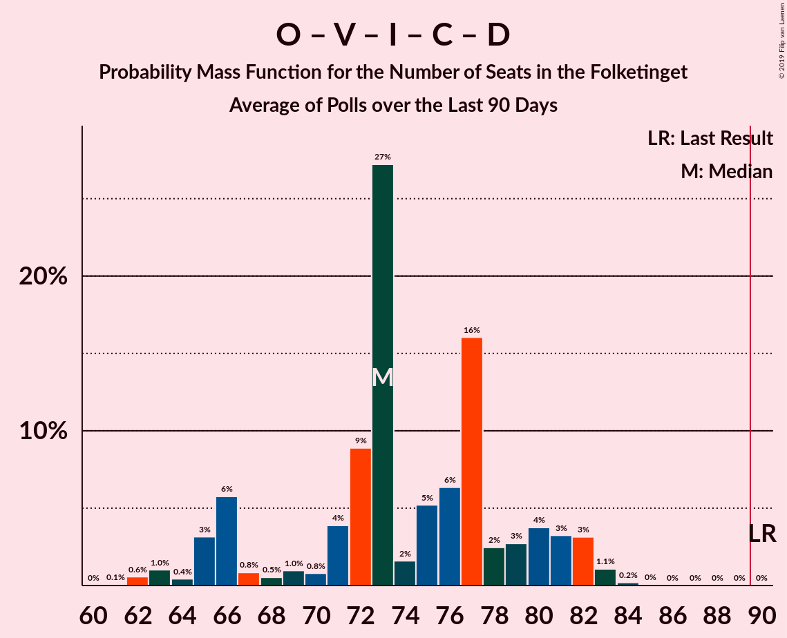

| Number of Seats | Probability | Accumulated | Special Marks |
|:---------------:|:-----------:|:-----------:|:-------------:|
| 61 | 0.1% | 100% |  |
| 62 | 0.6% | 99.9% |  |
| 63 | 1.0% | 99.3% |  |
| 64 | 0.4% | 98% |  |
| 65 | 3% | 98% |  |
| 66 | 6% | 95% |  |
| 67 | 0.8% | 89% |  |
| 68 | 0.5% | 88% |  |
| 69 | 1.0% | 88% |  |
| 70 | 0.8% | 87% |  |
| 71 | 4% | 86% |  |
| 72 | 9% | 82% |  |
| 73 | 27% | 73% |  |
| 74 | 2% | 46% | Median |
| 75 | 5% | 44% |  |
| 76 | 6% | 39% |  |
| 77 | 16% | 33% |  |
| 78 | 2% | 17% |  |
| 79 | 3% | 14% |  |
| 80 | 4% | 11% |  |
| 81 | 3% | 8% |  |
| 82 | 3% | 4% |  |
| 83 | 1.1% | 1.3% |  |
| 84 | 0.2% | 0.3% |  |
| 85 | 0% | 0.1% |  |
| 86 | 0% | 0% |  |
| 87 | 0% | 0% |  |
| 88 | 0% | 0% |  |
| 89 | 0% | 0% |  |
| 90 | 0% | 0% | Last Result, Majority |

### Dansk Folkeparti – Venstre – Liberal Alliance – Det Konservative Folkeparti – Kristendemokraterne

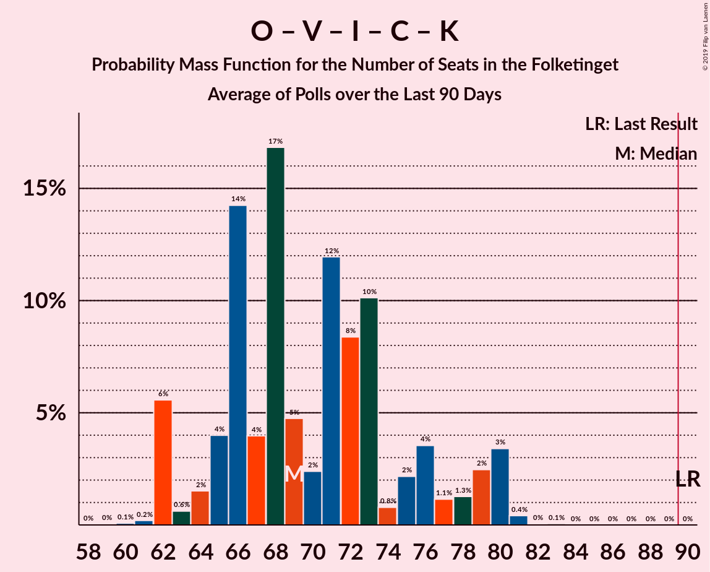

| Number of Seats | Probability | Accumulated | Special Marks |
|:---------------:|:-----------:|:-----------:|:-------------:|
| 59 | 0% | 100% |  |
| 60 | 0.1% | 99.9% |  |
| 61 | 0.2% | 99.8% |  |
| 62 | 6% | 99.6% |  |
| 63 | 0.6% | 94% |  |
| 64 | 2% | 93% |  |
| 65 | 4% | 92% |  |
| 66 | 14% | 88% |  |
| 67 | 4% | 74% |  |
| 68 | 17% | 70% |  |
| 69 | 5% | 53% | Median |
| 70 | 2% | 48% |  |
| 71 | 12% | 46% |  |
| 72 | 8% | 34% |  |
| 73 | 10% | 25% |  |
| 74 | 0.8% | 15% |  |
| 75 | 2% | 15% |  |
| 76 | 4% | 12% |  |
| 77 | 1.1% | 9% |  |
| 78 | 1.3% | 8% |  |
| 79 | 2% | 6% |  |
| 80 | 3% | 4% |  |
| 81 | 0.4% | 0.5% |  |
| 82 | 0% | 0.1% |  |
| 83 | 0.1% | 0.1% |  |
| 84 | 0% | 0% |  |
| 85 | 0% | 0% |  |
| 86 | 0% | 0% |  |
| 87 | 0% | 0% |  |
| 88 | 0% | 0% |  |
| 89 | 0% | 0% |  |
| 90 | 0% | 0% | Last Result, Majority |

### Dansk Folkeparti – Venstre – Liberal Alliance – Det Konservative Folkeparti

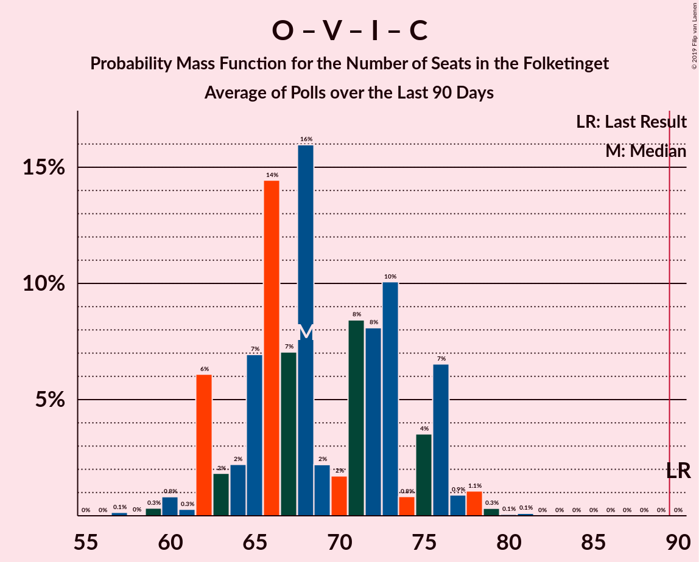

| Number of Seats | Probability | Accumulated | Special Marks |
|:---------------:|:-----------:|:-----------:|:-------------:|
| 57 | 0.1% | 100% |  |
| 58 | 0% | 99.8% |  |
| 59 | 0.3% | 99.8% |  |
| 60 | 0.8% | 99.5% |  |
| 61 | 0.3% | 98.7% |  |
| 62 | 6% | 98% |  |
| 63 | 2% | 92% |  |
| 64 | 2% | 90% |  |
| 65 | 7% | 88% |  |
| 66 | 14% | 81% |  |
| 67 | 7% | 67% |  |
| 68 | 16% | 60% |  |
| 69 | 2% | 44% | Median |
| 70 | 2% | 42% |  |
| 71 | 8% | 40% |  |
| 72 | 8% | 32% |  |
| 73 | 10% | 23% |  |
| 74 | 0.8% | 13% |  |
| 75 | 4% | 13% |  |
| 76 | 7% | 9% |  |
| 77 | 0.9% | 2% |  |
| 78 | 1.1% | 2% |  |
| 79 | 0.3% | 0.5% |  |
| 80 | 0.1% | 0.2% |  |
| 81 | 0.1% | 0.1% |  |
| 82 | 0% | 0% |  |
| 83 | 0% | 0% |  |
| 84 | 0% | 0% |  |
| 85 | 0% | 0% |  |
| 86 | 0% | 0% |  |
| 87 | 0% | 0% |  |
| 88 | 0% | 0% |  |
| 89 | 0% | 0% |  |
| 90 | 0% | 0% | Last Result, Majority |

### Socialdemokraterne – Radikale Venstre

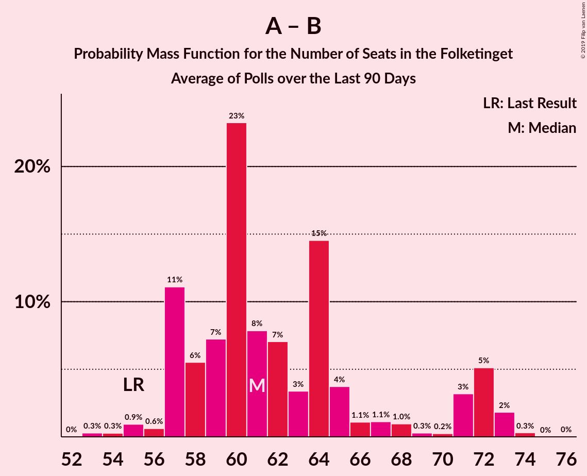

| Number of Seats | Probability | Accumulated | Special Marks |
|:---------------:|:-----------:|:-----------:|:-------------:|
| 53 | 0.3% | 100% |  |
| 54 | 0.3% | 99.7% |  |
| 55 | 0.9% | 99.4% | Last Result |
| 56 | 0.6% | 98% |  |
| 57 | 11% | 98% |  |
| 58 | 6% | 87% |  |
| 59 | 7% | 81% |  |
| 60 | 23% | 74% |  |
| 61 | 8% | 51% | Median |
| 62 | 7% | 43% |  |
| 63 | 3% | 36% |  |
| 64 | 15% | 32% |  |
| 65 | 4% | 18% |  |
| 66 | 1.1% | 14% |  |
| 67 | 1.1% | 13% |  |
| 68 | 1.0% | 12% |  |
| 69 | 0.3% | 11% |  |
| 70 | 0.2% | 11% |  |
| 71 | 3% | 10% |  |
| 72 | 5% | 7% |  |
| 73 | 2% | 2% |  |
| 74 | 0.3% | 0.3% |  |
| 75 | 0% | 0% |  |

### Venstre – Liberal Alliance – Det Konservative Folkeparti

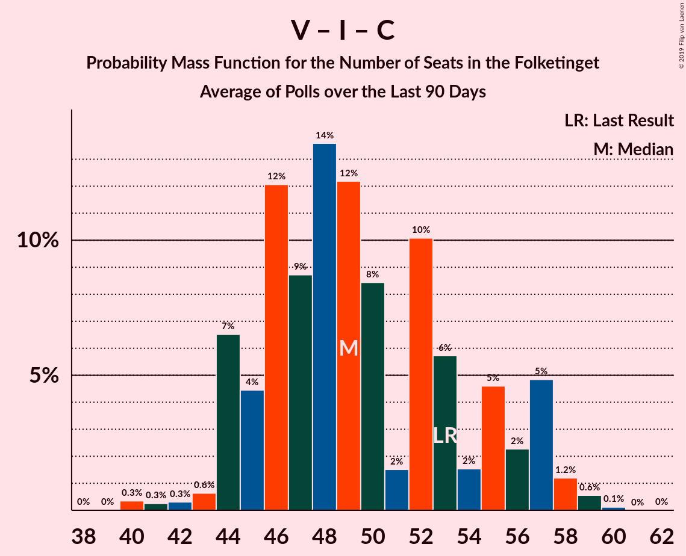

| Number of Seats | Probability | Accumulated | Special Marks |
|:---------------:|:-----------:|:-----------:|:-------------:|
| 40 | 0.3% | 100% |  |
| 41 | 0.3% | 99.6% |  |
| 42 | 0.3% | 99.4% |  |
| 43 | 0.6% | 99.1% |  |
| 44 | 7% | 98% |  |
| 45 | 4% | 92% |  |
| 46 | 12% | 87% |  |
| 47 | 9% | 75% |  |
| 48 | 14% | 67% |  |
| 49 | 12% | 53% | Median |
| 50 | 8% | 41% |  |
| 51 | 2% | 32% |  |
| 52 | 10% | 31% |  |
| 53 | 6% | 21% | Last Result |
| 54 | 2% | 15% |  |
| 55 | 5% | 14% |  |
| 56 | 2% | 9% |  |
| 57 | 5% | 7% |  |
| 58 | 1.2% | 2% |  |
| 59 | 0.6% | 0.7% |  |
| 60 | 0.1% | 0.1% |  |
| 61 | 0% | 0% |  |

### Venstre – Det Konservative Folkeparti

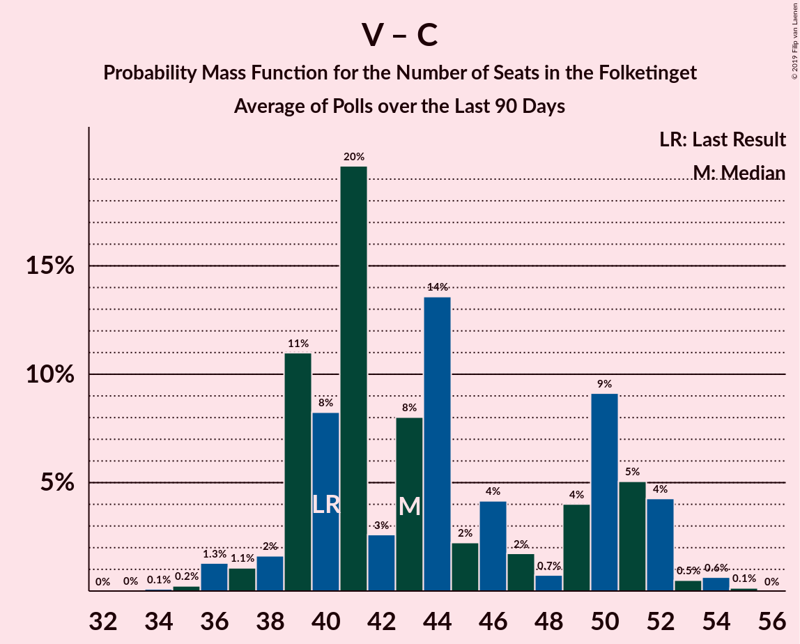

| Number of Seats | Probability | Accumulated | Special Marks |
|:---------------:|:-----------:|:-----------:|:-------------:|
| 34 | 0.1% | 100% |  |
| 35 | 0.2% | 99.9% |  |
| 36 | 1.3% | 99.7% |  |
| 37 | 1.1% | 98% |  |
| 38 | 2% | 97% |  |
| 39 | 11% | 96% |  |
| 40 | 8% | 85% | Last Result |
| 41 | 20% | 76% |  |
| 42 | 3% | 57% |  |
| 43 | 8% | 54% | Median |
| 44 | 14% | 46% |  |
| 45 | 2% | 33% |  |
| 46 | 4% | 30% |  |
| 47 | 2% | 26% |  |
| 48 | 0.7% | 24% |  |
| 49 | 4% | 24% |  |
| 50 | 9% | 20% |  |
| 51 | 5% | 11% |  |
| 52 | 4% | 6% |  |
| 53 | 0.5% | 1.3% |  |
| 54 | 0.6% | 0.8% |  |
| 55 | 0.1% | 0.2% |  |
| 56 | 0% | 0% |  |

### Venstre

| Number of Seats | Probability | Accumulated | Special Marks |
|:---------------:|:-----------:|:-----------:|:-------------:|
| 26 | 0.1% | 100% |  |
| 27 | 0.1% | 99.9% |  |
| 28 | 0.4% | 99.9% |  |
| 29 | 3% | 99.4% |  |
| 30 | 10% | 97% |  |
| 31 | 7% | 86% |  |
| 32 | 11% | 79% |  |
| 33 | 17% | 69% |  |
| 34 | 17% | 52% | Last Result, Median |
| 35 | 3% | 34% |  |
| 36 | 5% | 31% |  |
| 37 | 5% | 27% |  |
| 38 | 6% | 22% |  |
| 39 | 3% | 16% |  |
| 40 | 8% | 13% |  |
| 41 | 3% | 4% |  |
| 42 | 1.2% | 1.5% |  |
| 43 | 0.2% | 0.2% |  |
| 44 | 0% | 0% |  |

## Technical Information

+ **Number of polls included in this average:** 8
+ **Lowest number of simulations done in a poll included in this average:** 1,048,576
+ **Total number of simulations done in the polls included in this average:** 8,388,608
+ **Error estimate:** 2.13%
