# Opinion Poll by Voxmeter for Ritzau, 30 December 2019–5 January 2020

<a href="#voting-intentions">Voting Intentions</a> | <a href="#seats">Seats</a> | <a href="#coalitions">Coalitions</a> | <a href="#technical-information">Technical Information</a>

## Voting Intentions

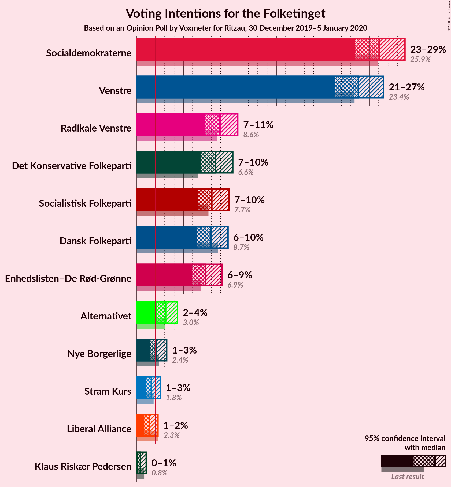

### Confidence Intervals

| Party | Last Result | Poll Result | 80% Confidence Interval | 90% Confidence Interval | 95% Confidence Interval | 99% Confidence Interval |
|:-----:|:-----------:|:-----------:|:-----------------------:|:-----------------------:|:-----------------------:|:-----------------------:|
| Socialdemokraterne | 25.9% | 26.0% | 24.3–27.9% |23.9–28.4% |23.5–28.8% |22.6–29.7% |
| Venstre | 23.4% | 23.8% | 22.2–25.6% |21.7–26.1% |21.3–26.5% |20.5–27.4% |
| Radikale Venstre | 8.6% | 8.9% | 7.9–10.2% |7.6–10.5% |7.3–10.9% |6.9–11.5% |
| Det Konservative Folkeparti | 6.6% | 8.5% | 7.4–9.7% |7.1–10.0% |6.9–10.3% |6.4–10.9% |
| Socialistisk Folkeparti | 7.7% | 8.1% | 7.1–9.3% |6.8–9.6% |6.6–9.9% |6.1–10.5% |
| Dansk Folkeparti | 8.7% | 8.0% | 7.0–9.2% |6.7–9.5% |6.5–9.8% |6.0–10.4% |
| Enhedslisten–De Rød-Grønne | 6.9% | 7.4% | 6.4–8.5% |6.2–8.9% |5.9–9.2% |5.5–9.7% |
| Alternativet | 3.0% | 3.1% | 2.5–3.9% |2.3–4.2% |2.2–4.4% |2.0–4.8% |
| Nye Borgerlige | 2.4% | 2.1% | 1.7–2.9% |1.5–3.0% |1.4–3.2% |1.2–3.6% |
| Stram Kurs | 1.8% | 1.6% | 1.2–2.2% |1.1–2.4% |1.0–2.5% |0.8–2.9% |
| Liberal Alliance | 2.3% | 1.4% | 1.0–2.0% |0.9–2.1% |0.8–2.3% |0.7–2.6% |
| Klaus Riskær Pedersen | 0.8% | 0.4% | 0.2–0.8% |0.2–0.9% |0.2–1.0% |0.1–1.2% |

*Note:* The poll result column reflects the actual value used in the calculations. Published results may vary slightly, and in addition be rounded to fewer digits.

## Seats

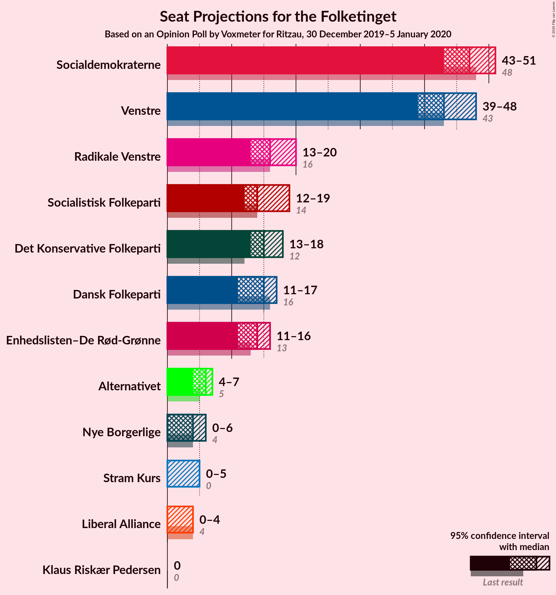

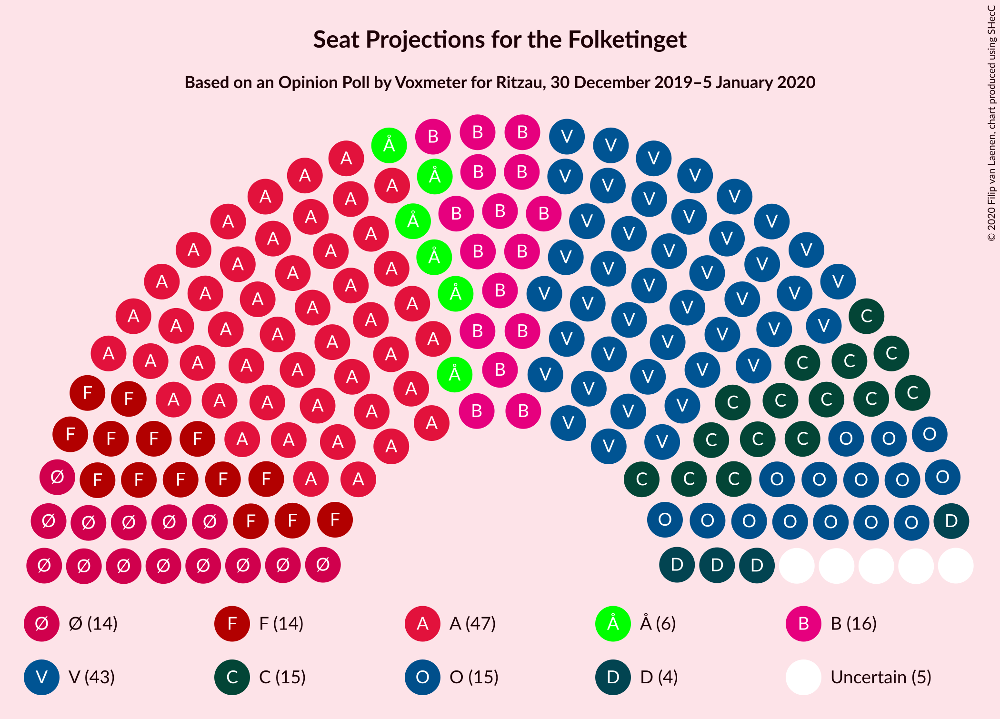

### Confidence Intervals

| Party | Last Result | Median | 80% Confidence Interval | 90% Confidence Interval | 95% Confidence Interval | 99% Confidence Interval |
|:-----:|:-----------:|:------:|:-----------------------:|:-----------------------:|:-----------------------:|:-----------------------:|
| <a href="#socialdemokraterne">Socialdemokraterne</a> | 48 | 47 | 43–51 |43–51 |43–51 |41–53 |
| <a href="#venstre">Venstre</a> | 43 | 43 | 41–47 |41–47 |39–48 |37–49 |
| <a href="#radikale-venstre">Radikale Venstre</a> | 16 | 16 | 14–18 |13–19 |13–20 |12–20 |
| <a href="#det-konservative-folkeparti">Det Konservative Folkeparti</a> | 12 | 15 | 14–17 |14–17 |13–18 |12–19 |
| <a href="#socialistisk-folkeparti">Socialistisk Folkeparti</a> | 14 | 14 | 13–18 |12–19 |12–19 |11–19 |
| <a href="#dansk-folkeparti">Dansk Folkeparti</a> | 16 | 15 | 13–17 |12–17 |11–17 |11–20 |
| <a href="#enhedslisten–de-rød-grønne">Enhedslisten–De Rød-Grønne</a> | 13 | 14 | 12–15 |12–16 |11–16 |10–18 |
| <a href="#alternativet">Alternativet</a> | 5 | 6 | 5–7 |4–7 |4–7 |4–9 |
| <a href="#nye-borgerlige">Nye Borgerlige</a> | 4 | 4 | 0–5 |0–5 |0–6 |0–7 |
| <a href="#stram-kurs">Stram Kurs</a> | 0 | 0 | 0–4 |0–4 |0–5 |0–5 |
| <a href="#liberal-alliance">Liberal Alliance</a> | 4 | 0 | 0 |0–4 |0–4 |0–4 |
| <a href="#klaus-riskær-pedersen">Klaus Riskær Pedersen</a> | 0 | 0 | 0 |0 |0 |0 |

### Socialdemokraterne

*For a full overview of the results for this party, see the [Socialdemokraterne](party-socialdemokraterne.html) page.*

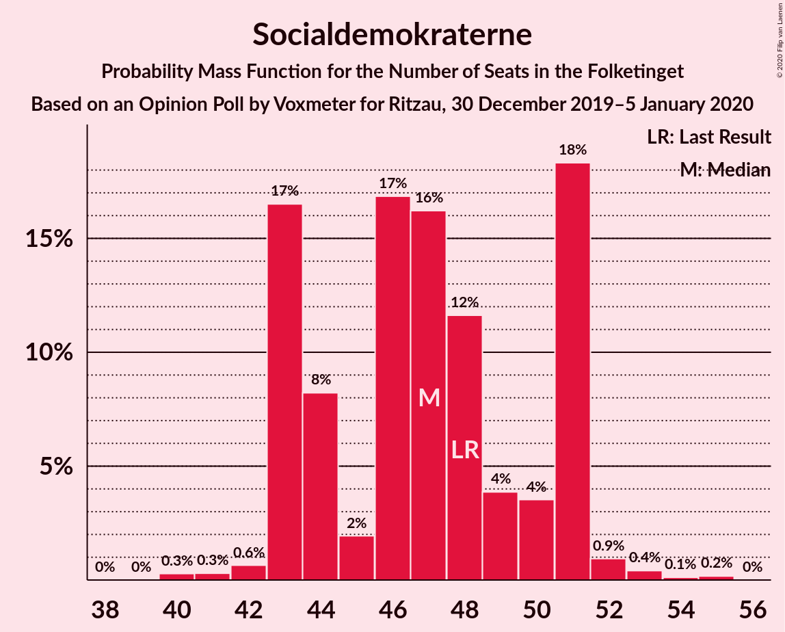

| Number of Seats | Probability | Accumulated | Special Marks |
|:---------------:|:-----------:|:-----------:|:-------------:|
| 40 | 0.3% | 100% |  |
| 41 | 0.3% | 99.7% |  |
| 42 | 0.6% | 99.4% |  |
| 43 | 17% | 98.7% |  |
| 44 | 8% | 82% |  |
| 45 | 2% | 74% |  |
| 46 | 17% | 72% |  |
| 47 | 16% | 55% | Median |
| 48 | 12% | 39% | Last Result |
| 49 | 4% | 27% |  |
| 50 | 4% | 24% |  |
| 51 | 18% | 20% |  |
| 52 | 0.9% | 2% |  |
| 53 | 0.4% | 0.7% |  |
| 54 | 0.1% | 0.3% |  |
| 55 | 0.2% | 0.2% |  |
| 56 | 0% | 0% |  |

### Venstre

*For a full overview of the results for this party, see the [Venstre](party-venstre.html) page.*

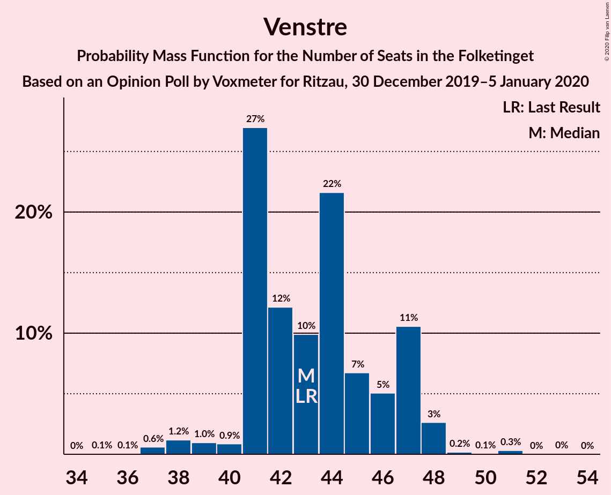

| Number of Seats | Probability | Accumulated | Special Marks |
|:---------------:|:-----------:|:-----------:|:-------------:|
| 35 | 0.1% | 100% |  |
| 36 | 0.1% | 99.9% |  |
| 37 | 0.6% | 99.9% |  |
| 38 | 1.2% | 99.3% |  |
| 39 | 1.0% | 98% |  |
| 40 | 0.9% | 97% |  |
| 41 | 27% | 96% |  |
| 42 | 12% | 69% |  |
| 43 | 10% | 57% | Last Result, Median |
| 44 | 22% | 47% |  |
| 45 | 7% | 26% |  |
| 46 | 5% | 19% |  |
| 47 | 11% | 14% |  |
| 48 | 3% | 3% |  |
| 49 | 0.2% | 0.6% |  |
| 50 | 0.1% | 0.4% |  |
| 51 | 0.3% | 0.4% |  |
| 52 | 0% | 0.1% |  |
| 53 | 0% | 0.1% |  |
| 54 | 0% | 0% |  |

### Radikale Venstre

*For a full overview of the results for this party, see the [Radikale Venstre](party-radikalevenstre.html) page.*

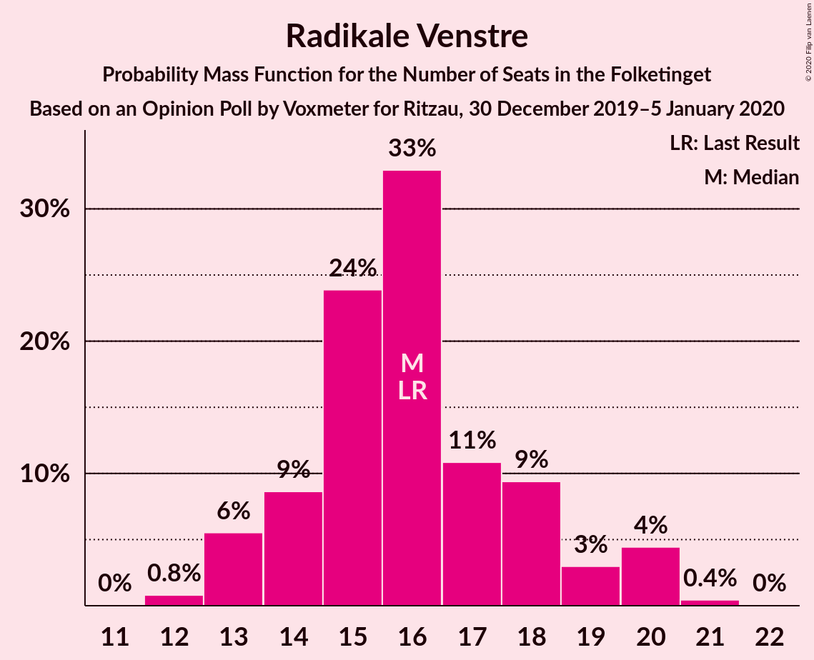

| Number of Seats | Probability | Accumulated | Special Marks |
|:---------------:|:-----------:|:-----------:|:-------------:|
| 12 | 0.8% | 100% |  |
| 13 | 6% | 99.1% |  |
| 14 | 9% | 94% |  |
| 15 | 24% | 85% |  |
| 16 | 33% | 61% | Last Result, Median |
| 17 | 11% | 28% |  |
| 18 | 9% | 17% |  |
| 19 | 3% | 8% |  |
| 20 | 4% | 5% |  |
| 21 | 0.4% | 0.5% |  |
| 22 | 0% | 0% |  |

### Det Konservative Folkeparti

*For a full overview of the results for this party, see the [Det Konservative Folkeparti](party-detkonservativefolkeparti.html) page.*

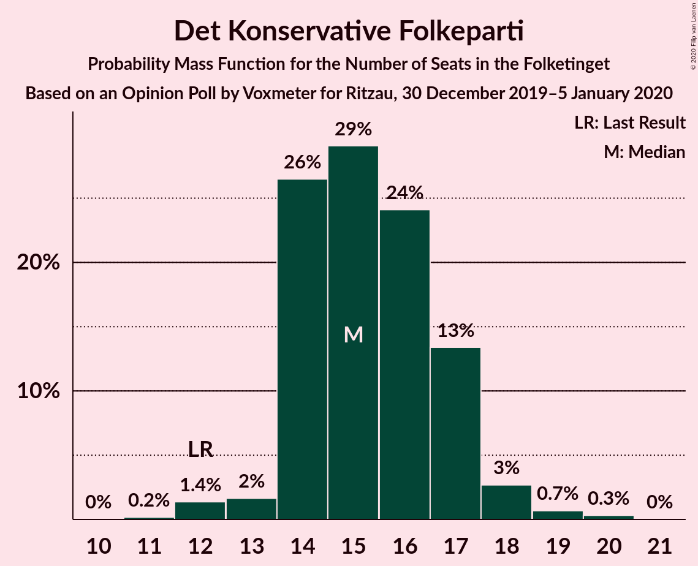

| Number of Seats | Probability | Accumulated | Special Marks |
|:---------------:|:-----------:|:-----------:|:-------------:|
| 11 | 0.2% | 100% |  |
| 12 | 1.4% | 99.8% | Last Result |
| 13 | 2% | 98% |  |
| 14 | 26% | 97% |  |
| 15 | 29% | 70% | Median |
| 16 | 24% | 41% |  |
| 17 | 13% | 17% |  |
| 18 | 3% | 4% |  |
| 19 | 0.7% | 1.0% |  |
| 20 | 0.3% | 0.4% |  |
| 21 | 0% | 0% |  |

### Socialistisk Folkeparti

*For a full overview of the results for this party, see the [Socialistisk Folkeparti](party-socialistiskfolkeparti.html) page.*

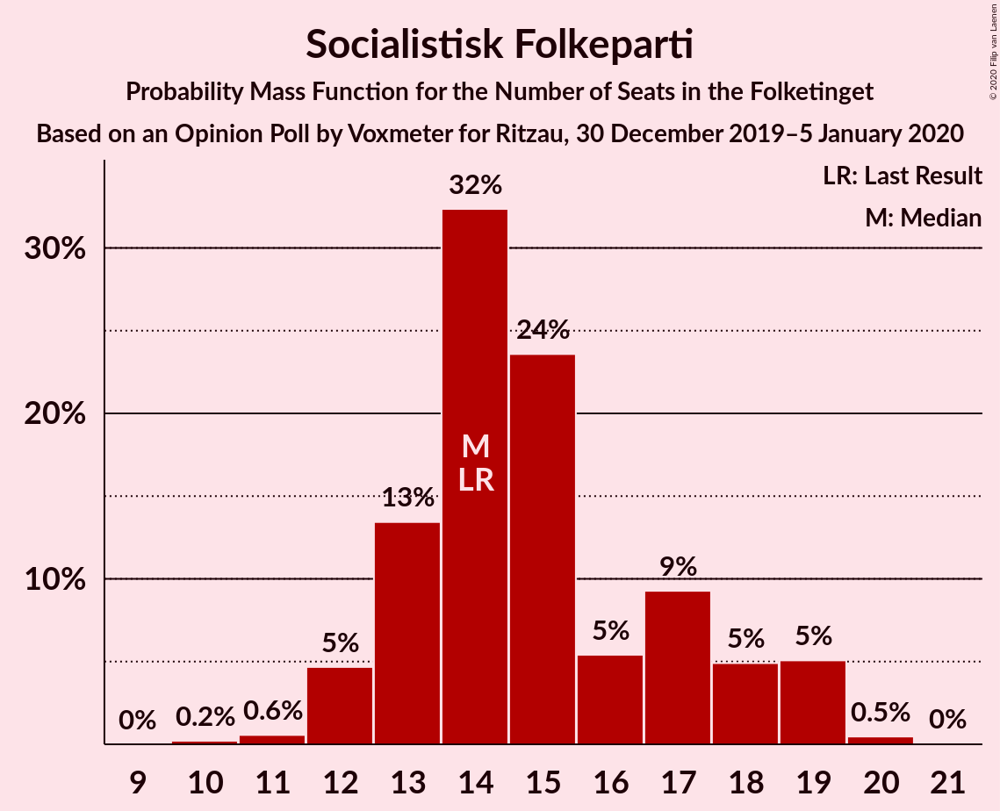

| Number of Seats | Probability | Accumulated | Special Marks |
|:---------------:|:-----------:|:-----------:|:-------------:|
| 10 | 0.2% | 100% |  |
| 11 | 0.6% | 99.8% |  |
| 12 | 5% | 99.2% |  |
| 13 | 13% | 95% |  |
| 14 | 32% | 81% | Last Result, Median |
| 15 | 24% | 49% |  |
| 16 | 5% | 25% |  |
| 17 | 9% | 20% |  |
| 18 | 5% | 10% |  |
| 19 | 5% | 6% |  |
| 20 | 0.5% | 0.5% |  |
| 21 | 0% | 0% |  |

### Dansk Folkeparti

*For a full overview of the results for this party, see the [Dansk Folkeparti](party-danskfolkeparti.html) page.*

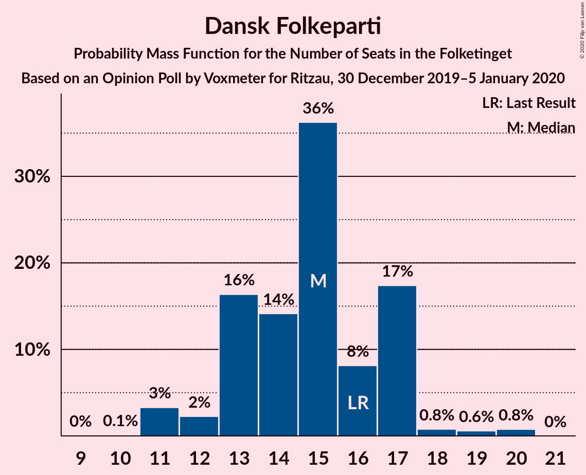

| Number of Seats | Probability | Accumulated | Special Marks |
|:---------------:|:-----------:|:-----------:|:-------------:|
| 10 | 0.1% | 100% |  |
| 11 | 3% | 99.9% |  |
| 12 | 2% | 97% |  |
| 13 | 16% | 94% |  |
| 14 | 14% | 78% |  |
| 15 | 36% | 64% | Median |
| 16 | 8% | 28% | Last Result |
| 17 | 17% | 20% |  |
| 18 | 0.8% | 2% |  |
| 19 | 0.6% | 1.3% |  |
| 20 | 0.8% | 0.8% |  |
| 21 | 0% | 0% |  |

### Enhedslisten–De Rød-Grønne

*For a full overview of the results for this party, see the [Enhedslisten–De Rød-Grønne](party-enhedslisten–derød-grønne.html) page.*

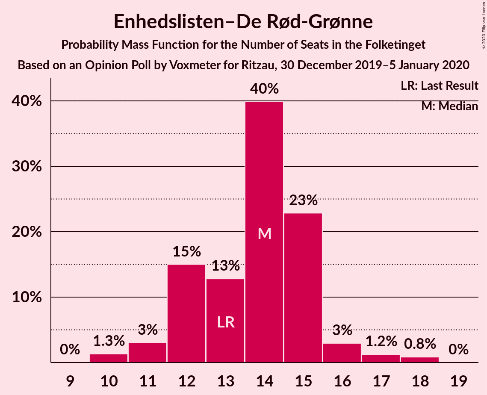

| Number of Seats | Probability | Accumulated | Special Marks |
|:---------------:|:-----------:|:-----------:|:-------------:|
| 10 | 1.3% | 100% |  |
| 11 | 3% | 98.6% |  |
| 12 | 15% | 96% |  |
| 13 | 13% | 81% | Last Result |
| 14 | 40% | 68% | Median |
| 15 | 23% | 28% |  |
| 16 | 3% | 5% |  |
| 17 | 1.2% | 2% |  |
| 18 | 0.8% | 0.9% |  |
| 19 | 0% | 0% |  |

### Alternativet

*For a full overview of the results for this party, see the [Alternativet](party-alternativet.html) page.*

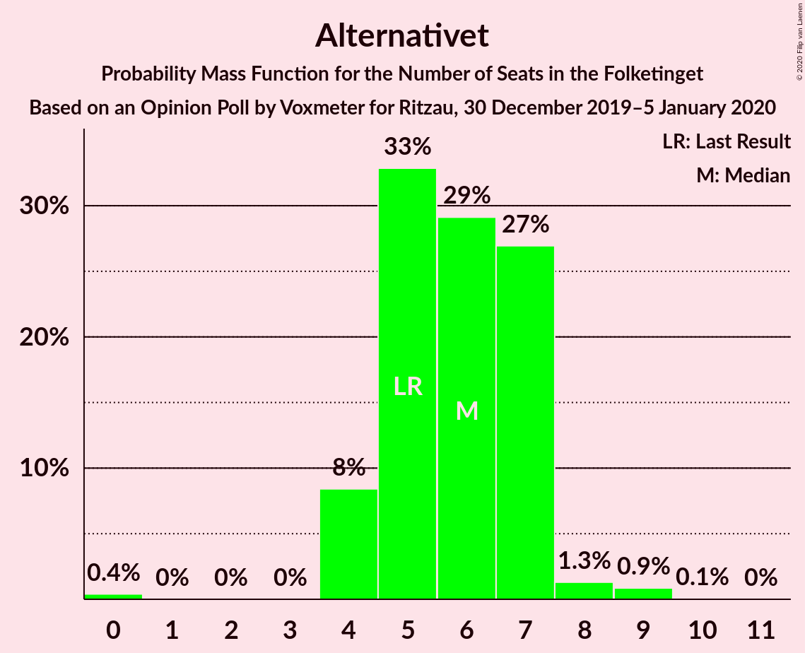

| Number of Seats | Probability | Accumulated | Special Marks |
|:---------------:|:-----------:|:-----------:|:-------------:|
| 0 | 0.4% | 100% |  |
| 1 | 0% | 99.6% |  |
| 2 | 0% | 99.6% |  |
| 3 | 0% | 99.6% |  |
| 4 | 8% | 99.6% |  |
| 5 | 33% | 91% | Last Result |
| 6 | 29% | 58% | Median |
| 7 | 27% | 29% |  |
| 8 | 1.3% | 2% |  |
| 9 | 0.9% | 0.9% |  |
| 10 | 0.1% | 0.1% |  |
| 11 | 0% | 0% |  |

### Nye Borgerlige

*For a full overview of the results for this party, see the [Nye Borgerlige](party-nyeborgerlige.html) page.*

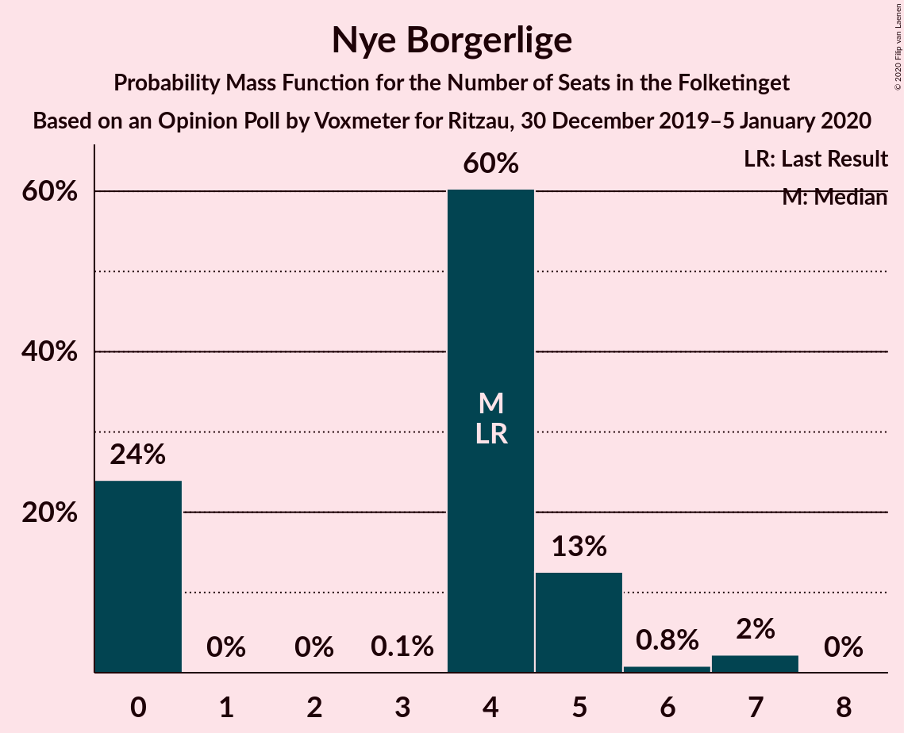

| Number of Seats | Probability | Accumulated | Special Marks |
|:---------------:|:-----------:|:-----------:|:-------------:|
| 0 | 24% | 100% |  |
| 1 | 0% | 76% |  |
| 2 | 0% | 76% |  |
| 3 | 0.1% | 76% |  |
| 4 | 60% | 76% | Last Result, Median |
| 5 | 13% | 16% |  |
| 6 | 0.8% | 3% |  |
| 7 | 2% | 2% |  |
| 8 | 0% | 0% |  |

### Stram Kurs

*For a full overview of the results for this party, see the [Stram Kurs](party-stramkurs.html) page.*

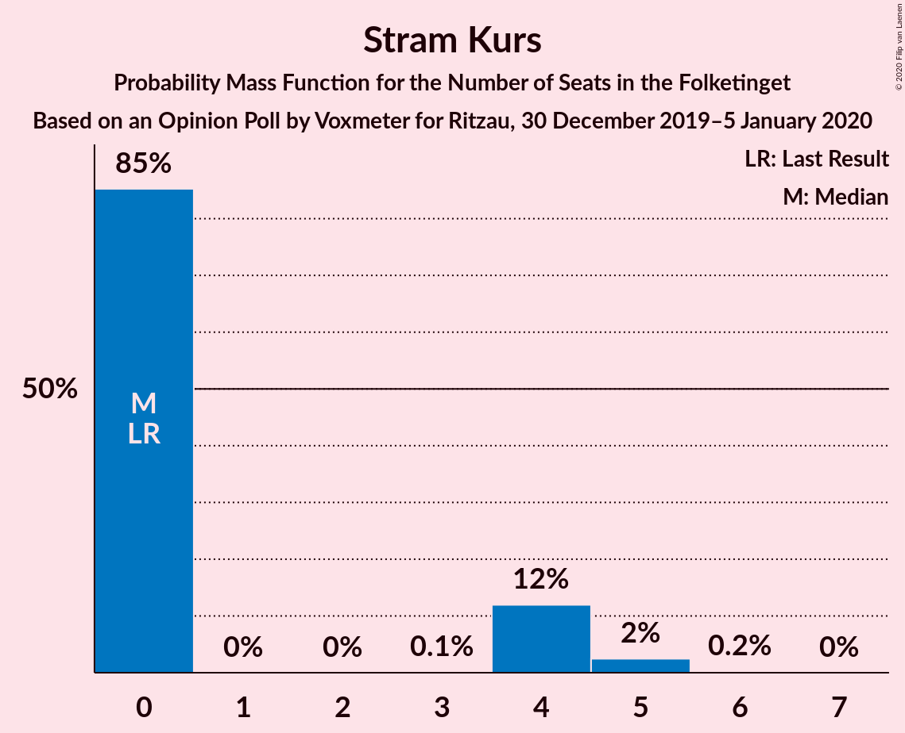

| Number of Seats | Probability | Accumulated | Special Marks |
|:---------------:|:-----------:|:-----------:|:-------------:|
| 0 | 85% | 100% | Last Result, Median |
| 1 | 0% | 15% |  |
| 2 | 0% | 15% |  |
| 3 | 0.1% | 15% |  |
| 4 | 12% | 15% |  |
| 5 | 2% | 3% |  |
| 6 | 0.2% | 0.2% |  |
| 7 | 0% | 0% |  |

### Liberal Alliance

*For a full overview of the results for this party, see the [Liberal Alliance](party-liberalalliance.html) page.*

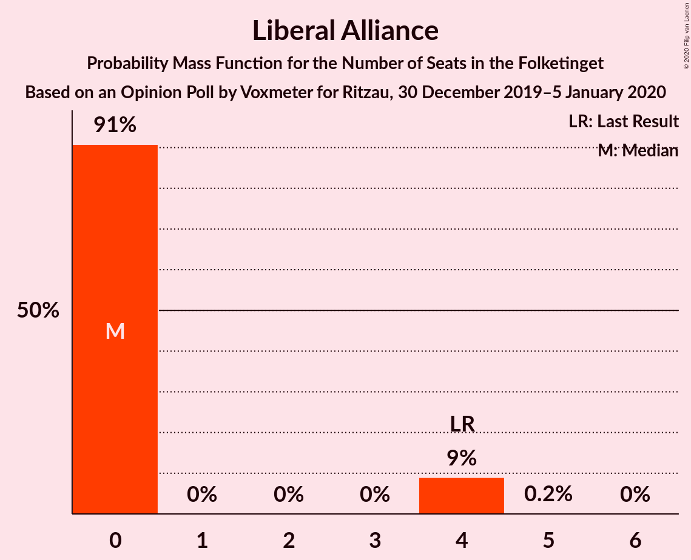

| Number of Seats | Probability | Accumulated | Special Marks |
|:---------------:|:-----------:|:-----------:|:-------------:|
| 0 | 91% | 100% | Median |
| 1 | 0% | 9% |  |
| 2 | 0% | 9% |  |
| 3 | 0% | 9% |  |
| 4 | 9% | 9% | Last Result |
| 5 | 0.2% | 0.2% |  |
| 6 | 0% | 0% |  |

### Klaus Riskær Pedersen

*For a full overview of the results for this party, see the [Klaus Riskær Pedersen](party-klausriskærpedersen.html) page.*

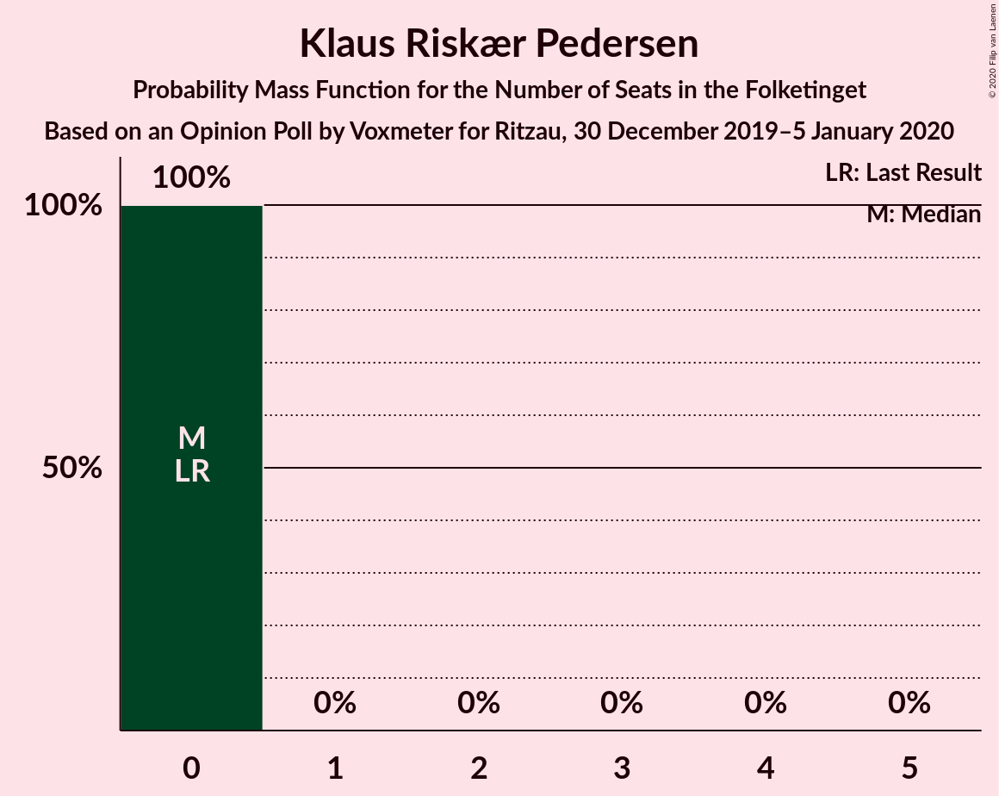

| Number of Seats | Probability | Accumulated | Special Marks |
|:---------------:|:-----------:|:-----------:|:-------------:|
| 0 | 100% | 100% | Last Result, Median |

## Coalitions

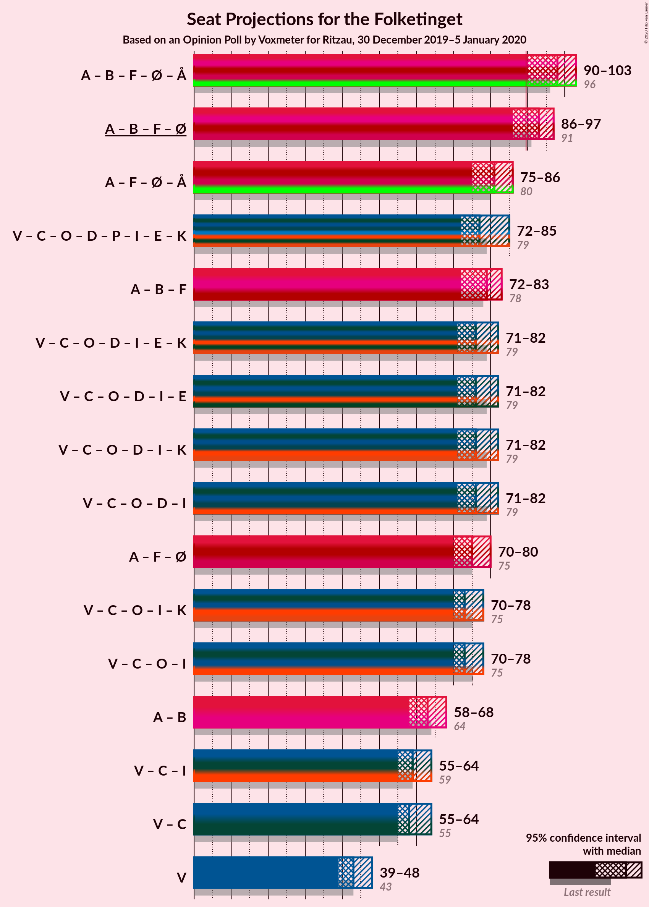

### Confidence Intervals

| Coalition | Last Result | Median | Majority? | 80% Confidence Interval | 90% Confidence Interval | 95% Confidence Interval | 99% Confidence Interval |
|:---------:|:-----------:|:------:|:---------:|:-----------------------:|:-----------------------:|:-----------------------:|:-----------------------:|
| Socialdemokraterne – Radikale Venstre – Socialistisk Folkeparti – Enhedslisten–De Rød-Grønne – Alternativet | 96 | 98 | 99.1% | 93–101 | 92–103 | 90–103 | 89–104 |
| Socialdemokraterne – Radikale Venstre – Socialistisk Folkeparti – Enhedslisten–De Rød-Grønne | 91 | 93 | 60% | 87–96 | 87–97 | 86–97 | 84–98 |
| Socialdemokraterne – Socialistisk Folkeparti – Enhedslisten–De Rød-Grønne – Alternativet | 80 | 81 | 0.2% | 78–86 | 77–86 | 75–86 | 74–88 |
| Socialdemokraterne – Radikale Venstre – Socialistisk Folkeparti | 78 | 79 | 0% | 73–82 | 73–83 | 72–83 | 72–84 |
| Venstre – Det Konservative Folkeparti – Dansk Folkeparti – Nye Borgerlige – Liberal Alliance – Klaus Riskær Pedersen | 79 | 76 | 0% | 74–81 | 72–82 | 71–82 | 70–83 |
| Venstre – Det Konservative Folkeparti – Dansk Folkeparti – Nye Borgerlige – Liberal Alliance | 79 | 76 | 0% | 74–81 | 72–82 | 71–82 | 70–83 |
| Socialdemokraterne – Socialistisk Folkeparti – Enhedslisten–De Rød-Grønne | 75 | 75 | 0% | 71–80 | 71–80 | 70–80 | 69–82 |
| Venstre – Det Konservative Folkeparti – Dansk Folkeparti – Liberal Alliance | 75 | 73 | 0% | 70–77 | 70–77 | 70–78 | 68–80 |
| Socialdemokraterne – Radikale Venstre | 64 | 63 | 0% | 58–67 | 58–68 | 58–68 | 57–70 |
| Venstre – Det Konservative Folkeparti – Liberal Alliance | 59 | 59 | 0% | 55–64 | 55–64 | 55–64 | 52–65 |
| Venstre – Det Konservative Folkeparti | 55 | 58 | 0% | 55–63 | 55–64 | 55–64 | 52–65 |
| Venstre | 43 | 43 | 0% | 41–47 | 41–47 | 39–48 | 37–49 |

### Socialdemokraterne – Radikale Venstre – Socialistisk Folkeparti – Enhedslisten–De Rød-Grønne – Alternativet

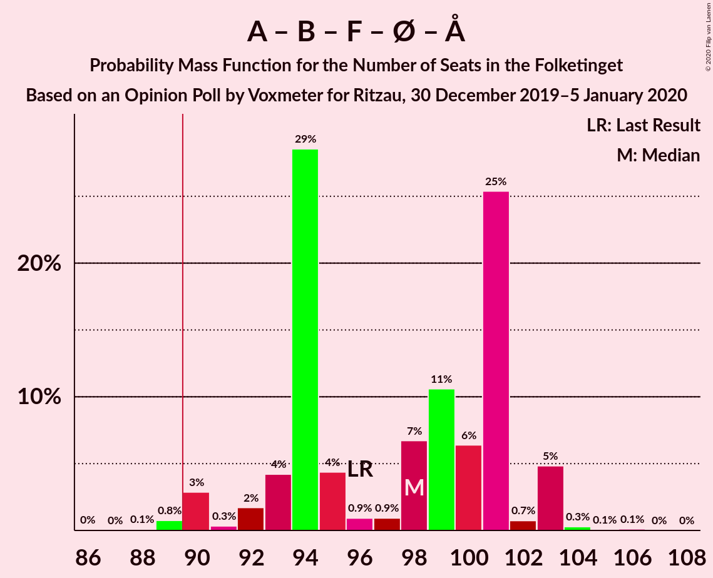

| Number of Seats | Probability | Accumulated | Special Marks |
|:---------------:|:-----------:|:-----------:|:-------------:|
| 86 | 0% | 100% |  |
| 87 | 0% | 99.9% |  |
| 88 | 0.1% | 99.9% |  |
| 89 | 0.8% | 99.9% |  |
| 90 | 3% | 99.1% | Majority |
| 91 | 0.3% | 96% |  |
| 92 | 2% | 96% |  |
| 93 | 4% | 94% |  |
| 94 | 29% | 90% |  |
| 95 | 4% | 61% |  |
| 96 | 0.9% | 57% | Last Result |
| 97 | 0.9% | 56% | Median |
| 98 | 7% | 55% |  |
| 99 | 11% | 48% |  |
| 100 | 6% | 38% |  |
| 101 | 25% | 31% |  |
| 102 | 0.7% | 6% |  |
| 103 | 5% | 5% |  |
| 104 | 0.3% | 0.5% |  |
| 105 | 0.1% | 0.3% |  |
| 106 | 0.1% | 0.2% |  |
| 107 | 0% | 0.1% |  |
| 108 | 0% | 0% |  |

### Socialdemokraterne – Radikale Venstre – Socialistisk Folkeparti – Enhedslisten–De Rød-Grønne

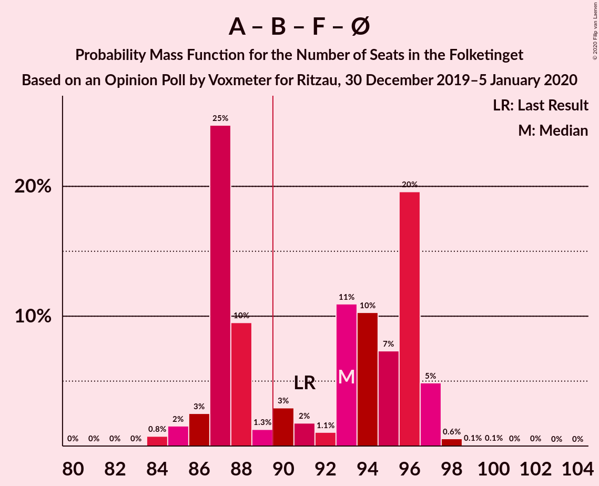

| Number of Seats | Probability | Accumulated | Special Marks |
|:---------------:|:-----------:|:-----------:|:-------------:|
| 81 | 0% | 100% |  |
| 82 | 0% | 99.9% |  |
| 83 | 0% | 99.9% |  |
| 84 | 0.8% | 99.9% |  |
| 85 | 2% | 99.1% |  |
| 86 | 3% | 98% |  |
| 87 | 25% | 95% |  |
| 88 | 10% | 70% |  |
| 89 | 1.3% | 61% |  |
| 90 | 3% | 60% | Majority |
| 91 | 2% | 57% | Last Result, Median |
| 92 | 1.1% | 55% |  |
| 93 | 11% | 54% |  |
| 94 | 10% | 43% |  |
| 95 | 7% | 33% |  |
| 96 | 20% | 25% |  |
| 97 | 5% | 6% |  |
| 98 | 0.6% | 0.8% |  |
| 99 | 0.1% | 0.2% |  |
| 100 | 0.1% | 0.2% |  |
| 101 | 0% | 0.1% |  |
| 102 | 0% | 0.1% |  |
| 103 | 0% | 0% |  |

### Socialdemokraterne – Socialistisk Folkeparti – Enhedslisten–De Rød-Grønne – Alternativet

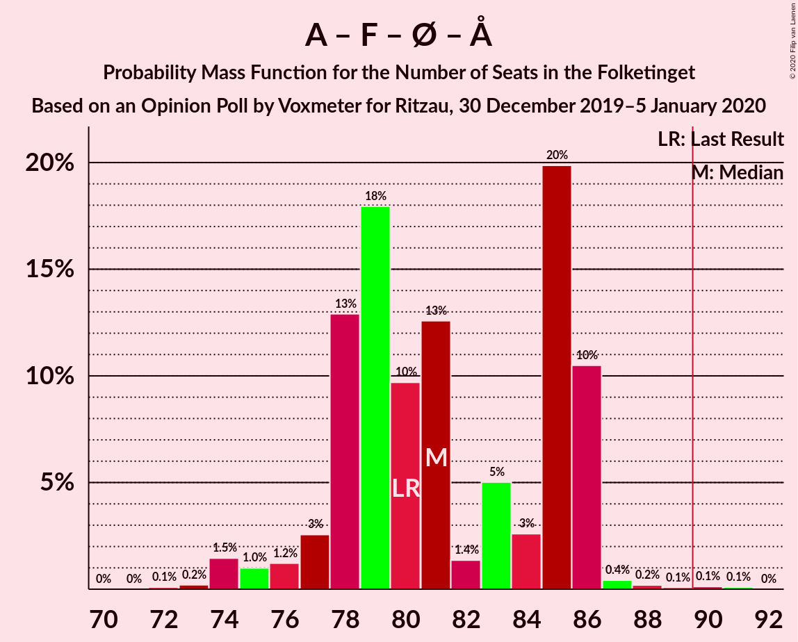

| Number of Seats | Probability | Accumulated | Special Marks |
|:---------------:|:-----------:|:-----------:|:-------------:|
| 70 | 0% | 100% |  |
| 71 | 0% | 99.9% |  |
| 72 | 0.1% | 99.9% |  |
| 73 | 0.2% | 99.8% |  |
| 74 | 1.5% | 99.6% |  |
| 75 | 1.0% | 98% |  |
| 76 | 1.2% | 97% |  |
| 77 | 3% | 96% |  |
| 78 | 13% | 93% |  |
| 79 | 18% | 81% |  |
| 80 | 10% | 63% | Last Result |
| 81 | 13% | 53% | Median |
| 82 | 1.4% | 40% |  |
| 83 | 5% | 39% |  |
| 84 | 3% | 34% |  |
| 85 | 20% | 31% |  |
| 86 | 10% | 11% |  |
| 87 | 0.4% | 0.9% |  |
| 88 | 0.2% | 0.5% |  |
| 89 | 0.1% | 0.3% |  |
| 90 | 0.1% | 0.2% | Majority |
| 91 | 0.1% | 0.1% |  |
| 92 | 0% | 0% |  |

### Socialdemokraterne – Radikale Venstre – Socialistisk Folkeparti

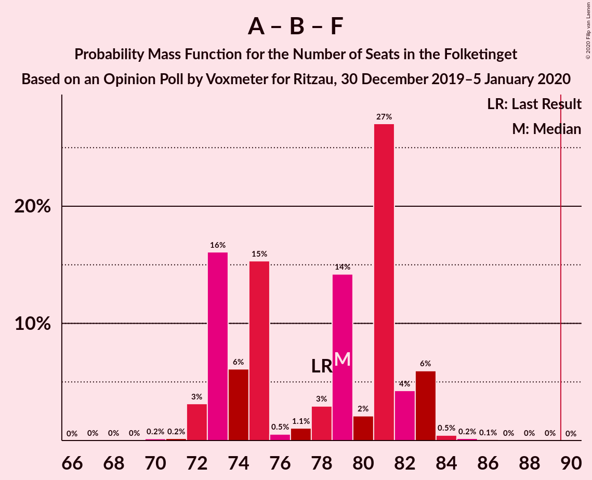

| Number of Seats | Probability | Accumulated | Special Marks |
|:---------------:|:-----------:|:-----------:|:-------------:|
| 67 | 0% | 100% |  |
| 68 | 0% | 99.9% |  |
| 69 | 0% | 99.9% |  |
| 70 | 0.2% | 99.9% |  |
| 71 | 0.2% | 99.8% |  |
| 72 | 3% | 99.6% |  |
| 73 | 16% | 96% |  |
| 74 | 6% | 80% |  |
| 75 | 15% | 74% |  |
| 76 | 0.5% | 59% |  |
| 77 | 1.1% | 58% | Median |
| 78 | 3% | 57% | Last Result |
| 79 | 14% | 54% |  |
| 80 | 2% | 40% |  |
| 81 | 27% | 38% |  |
| 82 | 4% | 11% |  |
| 83 | 6% | 7% |  |
| 84 | 0.5% | 0.8% |  |
| 85 | 0.2% | 0.4% |  |
| 86 | 0.1% | 0.2% |  |
| 87 | 0% | 0.1% |  |
| 88 | 0% | 0.1% |  |
| 89 | 0% | 0% |  |

### Venstre – Det Konservative Folkeparti – Dansk Folkeparti – Nye Borgerlige – Liberal Alliance – Klaus Riskær Pedersen

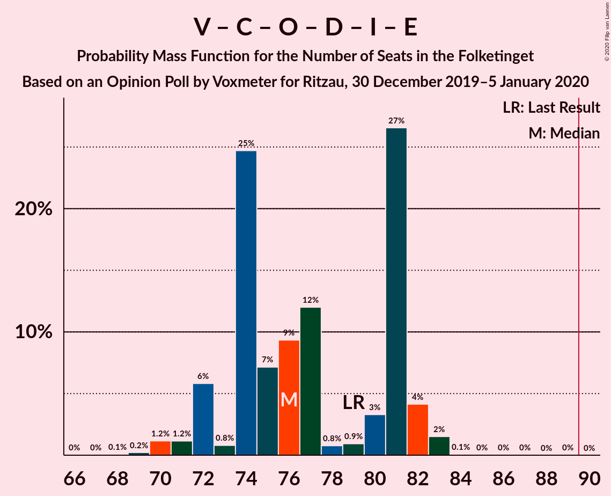

| Number of Seats | Probability | Accumulated | Special Marks |
|:---------------:|:-----------:|:-----------:|:-------------:|
| 66 | 0% | 100% |  |
| 67 | 0% | 99.9% |  |
| 68 | 0.1% | 99.9% |  |
| 69 | 0.2% | 99.8% |  |
| 70 | 1.2% | 99.6% |  |
| 71 | 1.2% | 98% |  |
| 72 | 6% | 97% |  |
| 73 | 0.8% | 91% |  |
| 74 | 25% | 91% |  |
| 75 | 7% | 66% |  |
| 76 | 9% | 59% |  |
| 77 | 12% | 49% | Median |
| 78 | 0.8% | 37% |  |
| 79 | 0.9% | 37% | Last Result |
| 80 | 3% | 36% |  |
| 81 | 27% | 32% |  |
| 82 | 4% | 6% |  |
| 83 | 2% | 2% |  |
| 84 | 0.1% | 0.2% |  |
| 85 | 0% | 0.2% |  |
| 86 | 0% | 0.1% |  |
| 87 | 0% | 0.1% |  |
| 88 | 0% | 0.1% |  |
| 89 | 0% | 0% |  |

### Venstre – Det Konservative Folkeparti – Dansk Folkeparti – Nye Borgerlige – Liberal Alliance

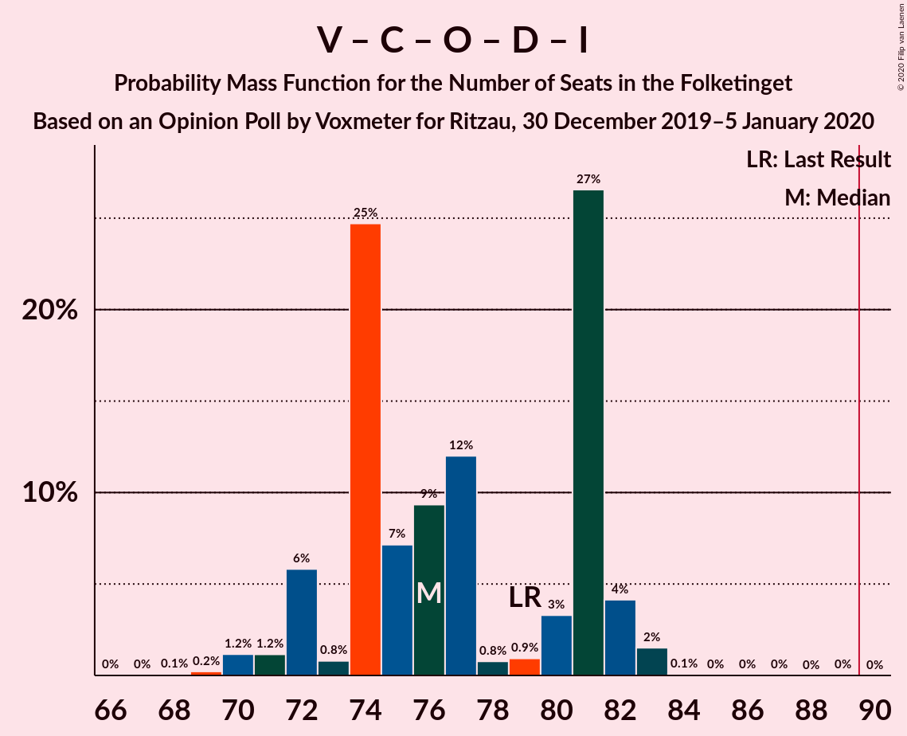

| Number of Seats | Probability | Accumulated | Special Marks |
|:---------------:|:-----------:|:-----------:|:-------------:|
| 66 | 0% | 100% |  |
| 67 | 0% | 99.9% |  |
| 68 | 0.1% | 99.9% |  |
| 69 | 0.2% | 99.8% |  |
| 70 | 1.2% | 99.6% |  |
| 71 | 1.2% | 98% |  |
| 72 | 6% | 97% |  |
| 73 | 0.8% | 91% |  |
| 74 | 25% | 91% |  |
| 75 | 7% | 66% |  |
| 76 | 9% | 59% |  |
| 77 | 12% | 49% | Median |
| 78 | 0.8% | 37% |  |
| 79 | 0.9% | 37% | Last Result |
| 80 | 3% | 36% |  |
| 81 | 27% | 32% |  |
| 82 | 4% | 6% |  |
| 83 | 2% | 2% |  |
| 84 | 0.1% | 0.2% |  |
| 85 | 0% | 0.2% |  |
| 86 | 0% | 0.1% |  |
| 87 | 0% | 0.1% |  |
| 88 | 0% | 0.1% |  |
| 89 | 0% | 0% |  |

### Socialdemokraterne – Socialistisk Folkeparti – Enhedslisten–De Rød-Grønne

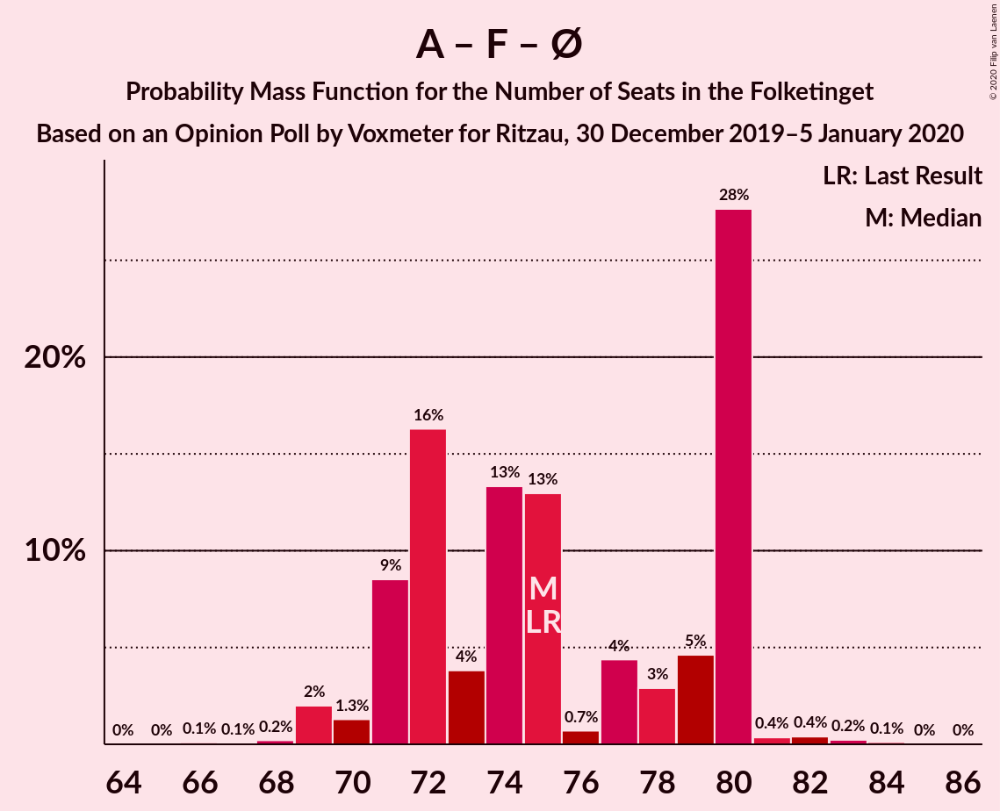

| Number of Seats | Probability | Accumulated | Special Marks |
|:---------------:|:-----------:|:-----------:|:-------------:|
| 66 | 0.1% | 100% |  |
| 67 | 0.1% | 99.9% |  |
| 68 | 0.2% | 99.8% |  |
| 69 | 2% | 99.6% |  |
| 70 | 1.3% | 98% |  |
| 71 | 9% | 96% |  |
| 72 | 16% | 88% |  |
| 73 | 4% | 72% |  |
| 74 | 13% | 68% |  |
| 75 | 13% | 54% | Last Result, Median |
| 76 | 0.7% | 41% |  |
| 77 | 4% | 41% |  |
| 78 | 3% | 36% |  |
| 79 | 5% | 33% |  |
| 80 | 28% | 29% |  |
| 81 | 0.4% | 1.1% |  |
| 82 | 0.4% | 0.8% |  |
| 83 | 0.2% | 0.4% |  |
| 84 | 0.1% | 0.1% |  |
| 85 | 0% | 0% |  |

### Venstre – Det Konservative Folkeparti – Dansk Folkeparti – Liberal Alliance

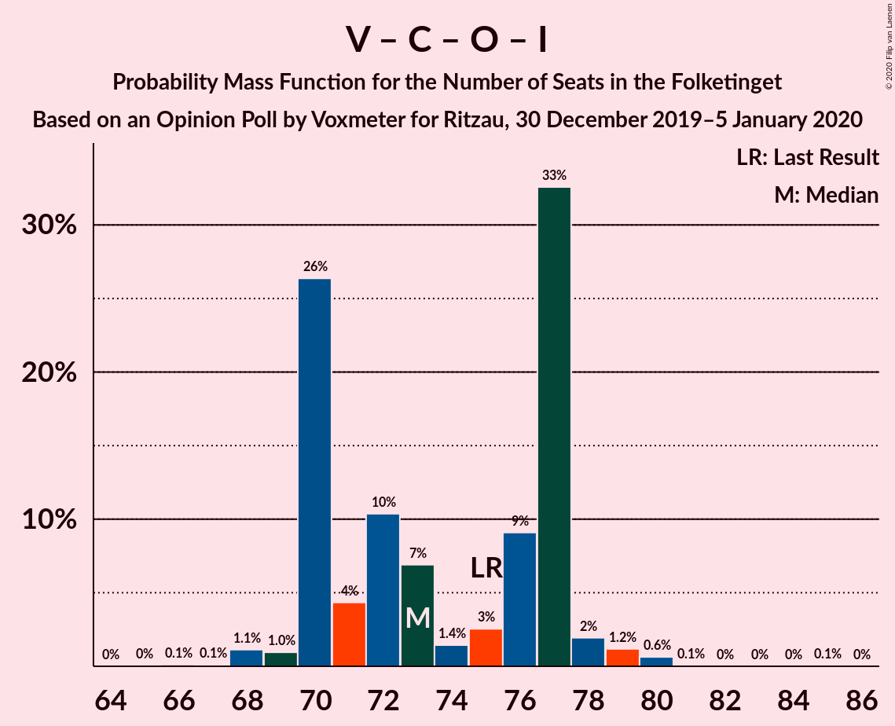

| Number of Seats | Probability | Accumulated | Special Marks |
|:---------------:|:-----------:|:-----------:|:-------------:|
| 64 | 0% | 100% |  |
| 65 | 0% | 99.9% |  |
| 66 | 0.1% | 99.9% |  |
| 67 | 0.1% | 99.8% |  |
| 68 | 1.1% | 99.7% |  |
| 69 | 1.0% | 98.6% |  |
| 70 | 26% | 98% |  |
| 71 | 4% | 71% |  |
| 72 | 10% | 67% |  |
| 73 | 7% | 57% | Median |
| 74 | 1.4% | 50% |  |
| 75 | 3% | 48% | Last Result |
| 76 | 9% | 46% |  |
| 77 | 33% | 37% |  |
| 78 | 2% | 4% |  |
| 79 | 1.2% | 2% |  |
| 80 | 0.6% | 0.8% |  |
| 81 | 0.1% | 0.2% |  |
| 82 | 0% | 0.1% |  |
| 83 | 0% | 0.1% |  |
| 84 | 0% | 0.1% |  |
| 85 | 0.1% | 0.1% |  |
| 86 | 0% | 0% |  |

### Socialdemokraterne – Radikale Venstre

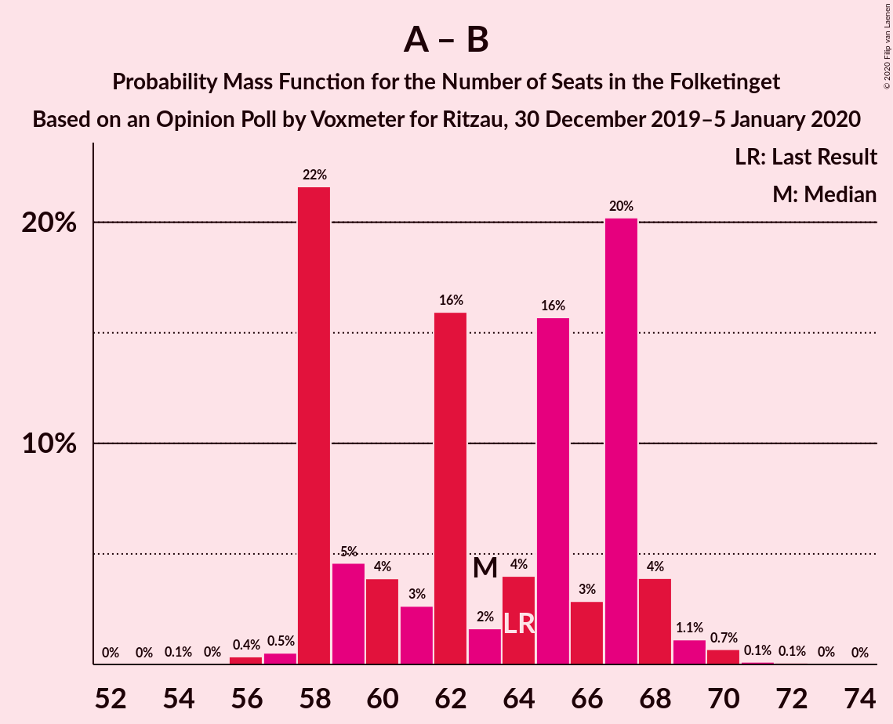

| Number of Seats | Probability | Accumulated | Special Marks |
|:---------------:|:-----------:|:-----------:|:-------------:|
| 54 | 0.1% | 100% |  |
| 55 | 0% | 99.9% |  |
| 56 | 0.4% | 99.9% |  |
| 57 | 0.5% | 99.5% |  |
| 58 | 22% | 99.0% |  |
| 59 | 5% | 77% |  |
| 60 | 4% | 73% |  |
| 61 | 3% | 69% |  |
| 62 | 16% | 66% |  |
| 63 | 2% | 50% | Median |
| 64 | 4% | 49% | Last Result |
| 65 | 16% | 45% |  |
| 66 | 3% | 29% |  |
| 67 | 20% | 26% |  |
| 68 | 4% | 6% |  |
| 69 | 1.1% | 2% |  |
| 70 | 0.7% | 0.9% |  |
| 71 | 0.1% | 0.2% |  |
| 72 | 0.1% | 0.1% |  |
| 73 | 0% | 0% |  |

### Venstre – Det Konservative Folkeparti – Liberal Alliance

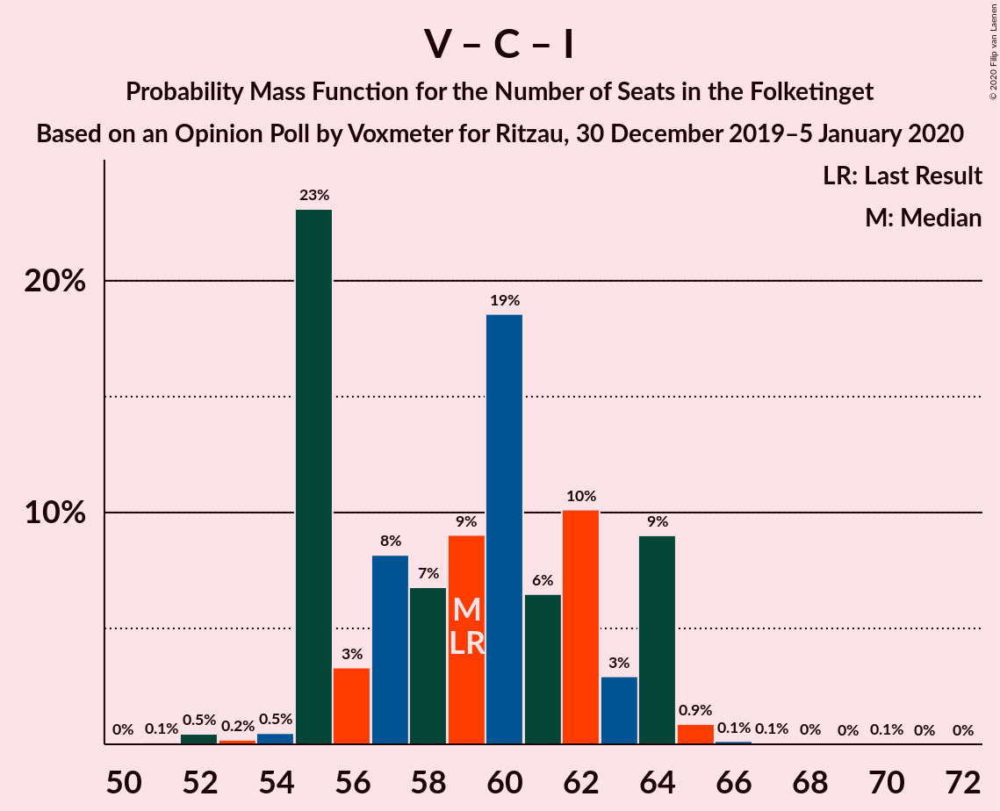

| Number of Seats | Probability | Accumulated | Special Marks |
|:---------------:|:-----------:|:-----------:|:-------------:|
| 50 | 0% | 100% |  |
| 51 | 0.1% | 99.9% |  |
| 52 | 0.5% | 99.9% |  |
| 53 | 0.2% | 99.4% |  |
| 54 | 0.5% | 99.2% |  |
| 55 | 23% | 98.7% |  |
| 56 | 3% | 76% |  |
| 57 | 8% | 72% |  |
| 58 | 7% | 64% | Median |
| 59 | 9% | 57% | Last Result |
| 60 | 19% | 48% |  |
| 61 | 6% | 30% |  |
| 62 | 10% | 23% |  |
| 63 | 3% | 13% |  |
| 64 | 9% | 10% |  |
| 65 | 0.9% | 1.2% |  |
| 66 | 0.1% | 0.3% |  |
| 67 | 0.1% | 0.2% |  |
| 68 | 0% | 0.1% |  |
| 69 | 0% | 0.1% |  |
| 70 | 0.1% | 0.1% |  |
| 71 | 0% | 0% |  |

### Venstre – Det Konservative Folkeparti

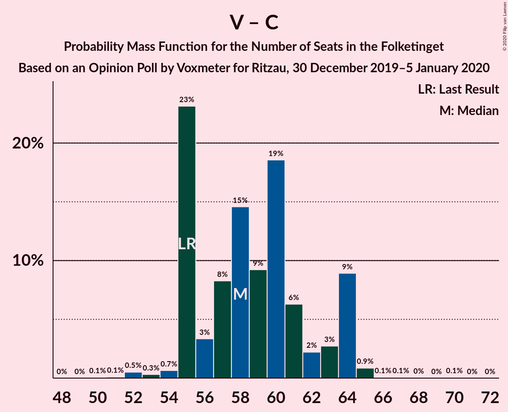

| Number of Seats | Probability | Accumulated | Special Marks |
|:---------------:|:-----------:|:-----------:|:-------------:|
| 50 | 0.1% | 100% |  |
| 51 | 0.1% | 99.9% |  |
| 52 | 0.5% | 99.8% |  |
| 53 | 0.3% | 99.3% |  |
| 54 | 0.7% | 99.0% |  |
| 55 | 23% | 98% | Last Result |
| 56 | 3% | 75% |  |
| 57 | 8% | 72% |  |
| 58 | 15% | 64% | Median |
| 59 | 9% | 49% |  |
| 60 | 19% | 40% |  |
| 61 | 6% | 21% |  |
| 62 | 2% | 15% |  |
| 63 | 3% | 13% |  |
| 64 | 9% | 10% |  |
| 65 | 0.9% | 1.1% |  |
| 66 | 0.1% | 0.2% |  |
| 67 | 0.1% | 0.1% |  |
| 68 | 0% | 0.1% |  |
| 69 | 0% | 0.1% |  |
| 70 | 0.1% | 0.1% |  |
| 71 | 0% | 0% |  |

### Venstre

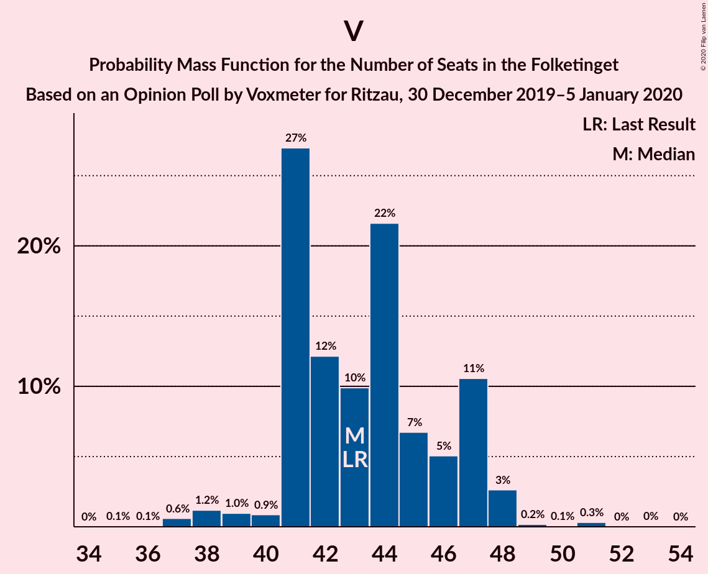

| Number of Seats | Probability | Accumulated | Special Marks |
|:---------------:|:-----------:|:-----------:|:-------------:|
| 35 | 0.1% | 100% |  |
| 36 | 0.1% | 99.9% |  |
| 37 | 0.6% | 99.9% |  |
| 38 | 1.2% | 99.3% |  |
| 39 | 1.0% | 98% |  |
| 40 | 0.9% | 97% |  |
| 41 | 27% | 96% |  |
| 42 | 12% | 69% |  |
| 43 | 10% | 57% | Last Result, Median |
| 44 | 22% | 47% |  |
| 45 | 7% | 26% |  |
| 46 | 5% | 19% |  |
| 47 | 11% | 14% |  |
| 48 | 3% | 3% |  |
| 49 | 0.2% | 0.6% |  |
| 50 | 0.1% | 0.4% |  |
| 51 | 0.3% | 0.4% |  |
| 52 | 0% | 0.1% |  |
| 53 | 0% | 0.1% |  |
| 54 | 0% | 0% |  |

## Technical Information

### Opinion Poll

+ **Polling firm:** Voxmeter
+ **Commissioner(s):** Ritzau
+ **Fieldwork period:** 30 December 2019–5 January 2020

### Calculations

+ **Sample size:** 1029
+ **Simulations done:** 1,048,576
+ **Error estimate:** 2.21%

