# Opinion Poll by Voxmeter for Ritzau, 6–11 January 2020

<a href="#voting-intentions">Voting Intentions</a> | <a href="#seats">Seats</a> | <a href="#coalitions">Coalitions</a> | <a href="#technical-information">Technical Information</a>

## Voting Intentions

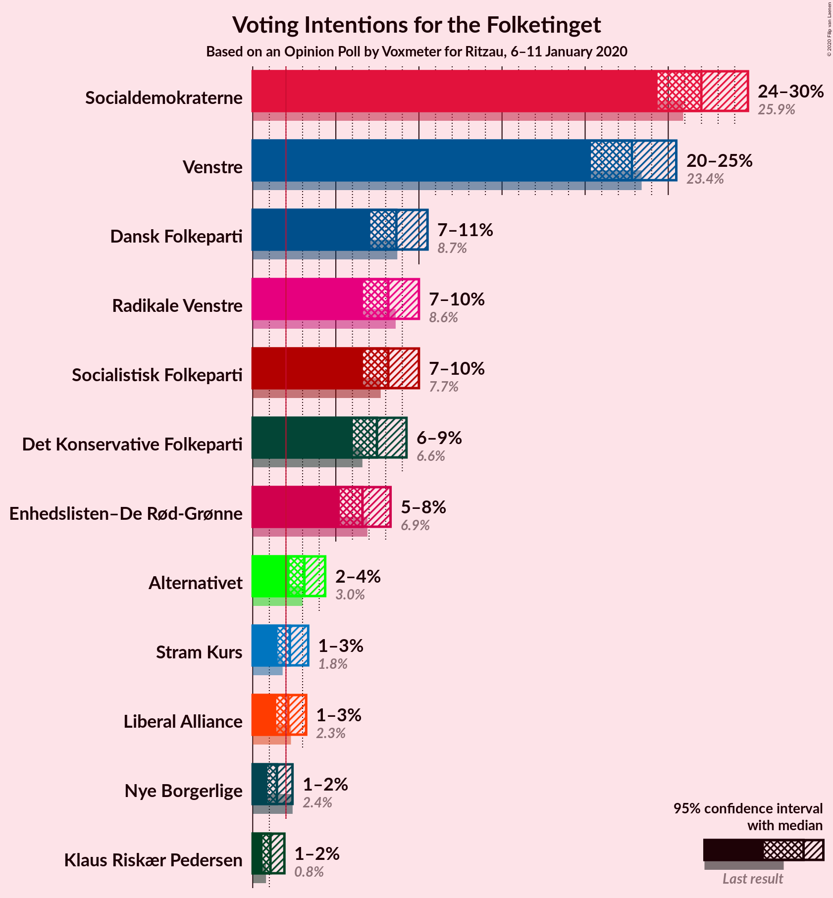

### Confidence Intervals

| Party | Last Result | Poll Result | 80% Confidence Interval | 90% Confidence Interval | 95% Confidence Interval | 99% Confidence Interval |
|:-----:|:-----------:|:-----------:|:-----------------------:|:-----------------------:|:-----------------------:|:-----------------------:|
| Socialdemokraterne | 25.9% | 27.0% | 25.3–28.8% |24.8–29.3% |24.4–29.8% |23.5–30.7% |
| Venstre | 23.4% | 22.8% | 21.2–24.6% |20.7–25.1% |20.3–25.5% |19.6–26.3% |
| Dansk Folkeparti | 8.7% | 8.6% | 7.6–9.9% |7.3–10.2% |7.1–10.5% |6.6–11.1% |
| Radikale Venstre | 8.6% | 8.2% | 7.1–9.4% |6.9–9.7% |6.6–10.0% |6.2–10.6% |
| Socialistisk Folkeparti | 7.7% | 8.2% | 7.1–9.4% |6.9–9.7% |6.6–10.0% |6.2–10.6% |
| Det Konservative Folkeparti | 6.6% | 7.5% | 6.5–8.6% |6.2–9.0% |6.0–9.3% |5.6–9.8% |
| Enhedslisten–De Rød-Grønne | 6.9% | 6.6% | 5.7–7.7% |5.5–8.0% |5.2–8.3% |4.8–8.9% |
| Alternativet | 3.0% | 3.1% | 2.5–3.9% |2.3–4.2% |2.2–4.4% |2.0–4.8% |
| Stram Kurs | 1.8% | 2.2% | 1.7–3.0% |1.6–3.2% |1.5–3.3% |1.3–3.7% |
| Liberal Alliance | 2.3% | 2.1% | 1.7–2.8% |1.5–3.0% |1.4–3.2% |1.2–3.6% |
| Nye Borgerlige | 2.4% | 1.5% | 1.1–2.1% |1.0–2.2% |0.9–2.4% |0.7–2.7% |
| Klaus Riskær Pedersen | 0.8% | 1.1% | 0.7–1.6% |0.7–1.8% |0.6–1.9% |0.5–2.2% |

*Note:* The poll result column reflects the actual value used in the calculations. Published results may vary slightly, and in addition be rounded to fewer digits.

## Seats

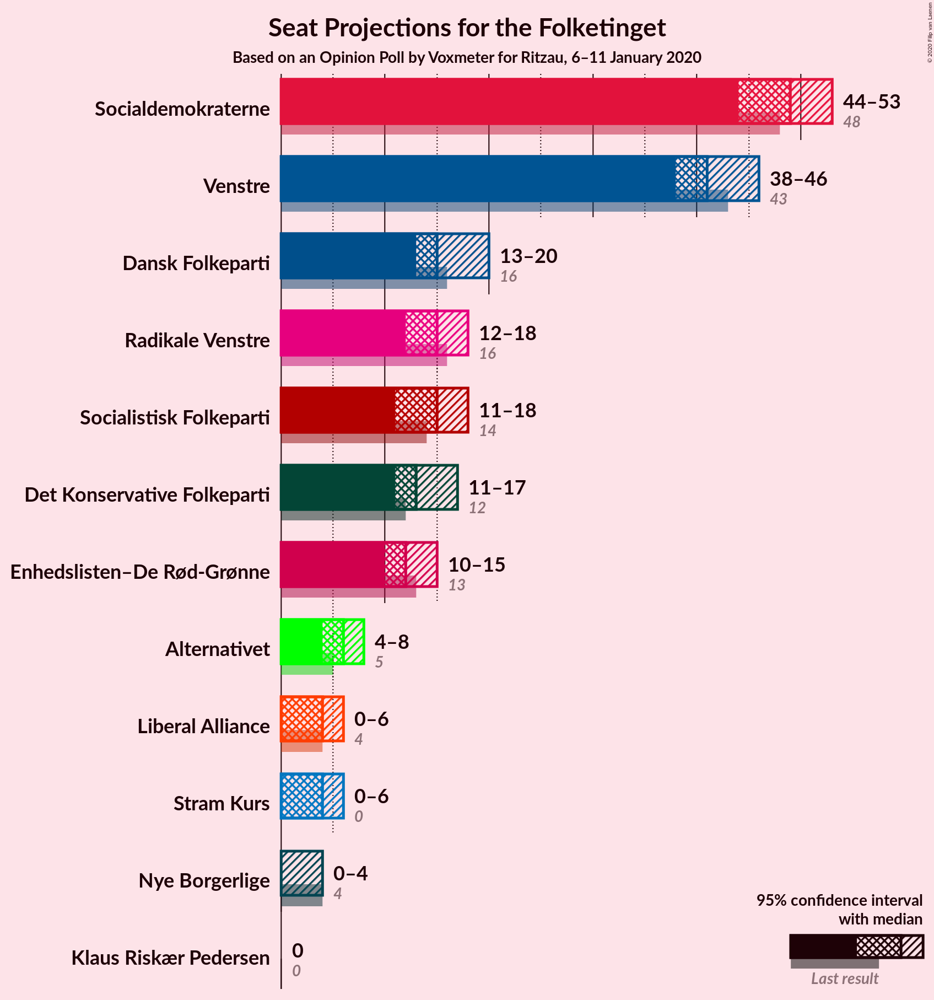

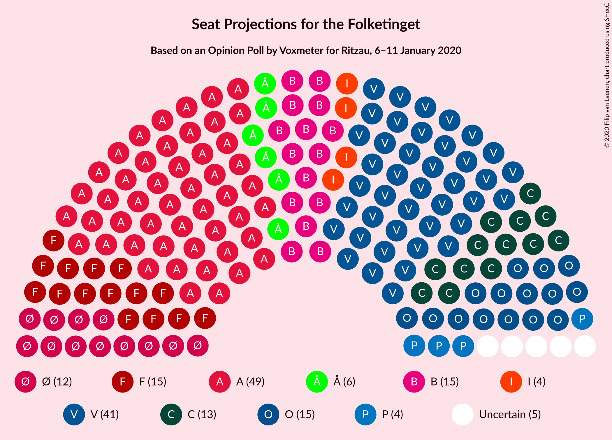

### Confidence Intervals

| Party | Last Result | Median | 80% Confidence Interval | 90% Confidence Interval | 95% Confidence Interval | 99% Confidence Interval |
|:-----:|:-----------:|:------:|:-----------------------:|:-----------------------:|:-----------------------:|:-----------------------:|
| <a href="#socialdemokraterne">Socialdemokraterne</a> | 48 | 49 | 47–52 |46–52 |44–53 |42–55 |
| <a href="#venstre">Venstre</a> | 43 | 41 | 39–45 |39–46 |38–46 |35–49 |
| <a href="#dansk-folkeparti">Dansk Folkeparti</a> | 16 | 15 | 14–18 |13–19 |13–20 |12–20 |
| <a href="#radikale-venstre">Radikale Venstre</a> | 16 | 15 | 13–17 |12–17 |12–18 |11–20 |
| <a href="#socialistisk-folkeparti">Socialistisk Folkeparti</a> | 14 | 15 | 12–17 |12–18 |11–18 |11–19 |
| <a href="#det-konservative-folkeparti">Det Konservative Folkeparti</a> | 12 | 13 | 11–17 |11–17 |11–17 |11–18 |
| <a href="#enhedslisten–de-rød-grønne">Enhedslisten–De Rød-Grønne</a> | 13 | 12 | 11–14 |10–14 |10–15 |9–16 |
| <a href="#alternativet">Alternativet</a> | 5 | 6 | 4–7 |4–7 |4–8 |4–8 |
| <a href="#stram-kurs">Stram Kurs</a> | 0 | 4 | 0–6 |0–6 |0–6 |0–6 |
| <a href="#liberal-alliance">Liberal Alliance</a> | 4 | 4 | 0–5 |0–5 |0–6 |0–7 |
| <a href="#nye-borgerlige">Nye Borgerlige</a> | 4 | 0 | 0 |0–4 |0–4 |0–5 |
| <a href="#klaus-riskær-pedersen">Klaus Riskær Pedersen</a> | 0 | 0 | 0 |0 |0 |0–4 |

### Socialdemokraterne

*For a full overview of the results for this party, see the [Socialdemokraterne](party-socialdemokraterne.html) page.*

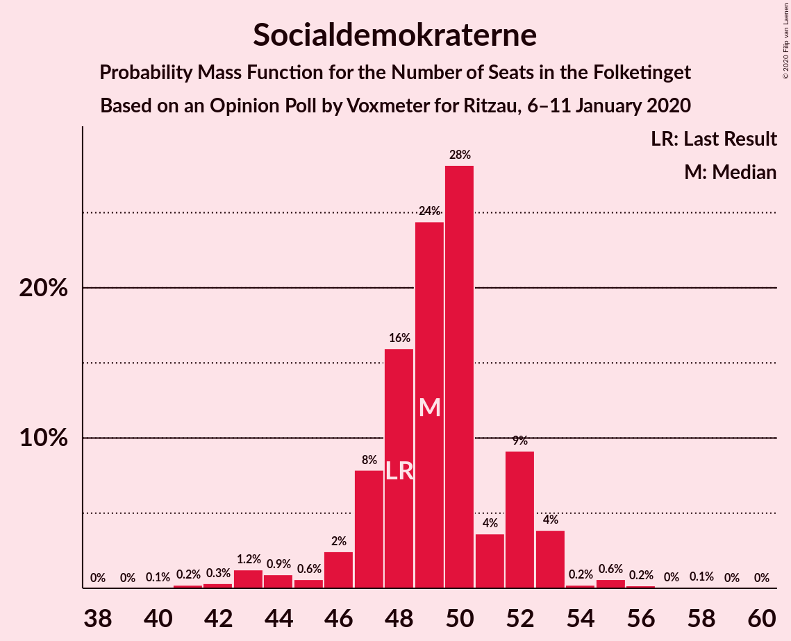

| Number of Seats | Probability | Accumulated | Special Marks |
|:---------------:|:-----------:|:-----------:|:-------------:|
| 40 | 0.1% | 100% |  |
| 41 | 0.2% | 99.9% |  |
| 42 | 0.3% | 99.7% |  |
| 43 | 1.2% | 99.4% |  |
| 44 | 0.9% | 98% |  |
| 45 | 0.6% | 97% |  |
| 46 | 2% | 97% |  |
| 47 | 8% | 94% |  |
| 48 | 16% | 86% | Last Result |
| 49 | 24% | 70% | Median |
| 50 | 28% | 46% |  |
| 51 | 4% | 18% |  |
| 52 | 9% | 14% |  |
| 53 | 4% | 5% |  |
| 54 | 0.2% | 1.1% |  |
| 55 | 0.6% | 0.9% |  |
| 56 | 0.2% | 0.3% |  |
| 57 | 0% | 0.1% |  |
| 58 | 0.1% | 0.1% |  |
| 59 | 0% | 0% |  |

### Venstre

*For a full overview of the results for this party, see the [Venstre](party-venstre.html) page.*

| Number of Seats | Probability | Accumulated | Special Marks |
|:---------------:|:-----------:|:-----------:|:-------------:|
| 34 | 0.2% | 100% |  |
| 35 | 0.4% | 99.8% |  |
| 36 | 0.3% | 99.4% |  |
| 37 | 1.4% | 99.1% |  |
| 38 | 2% | 98% |  |
| 39 | 6% | 96% |  |
| 40 | 33% | 89% |  |
| 41 | 10% | 56% | Median |
| 42 | 8% | 46% |  |
| 43 | 20% | 39% | Last Result |
| 44 | 6% | 18% |  |
| 45 | 5% | 13% |  |
| 46 | 7% | 8% |  |
| 47 | 0.2% | 1.1% |  |
| 48 | 0.3% | 0.9% |  |
| 49 | 0.4% | 0.6% |  |
| 50 | 0.2% | 0.2% |  |
| 51 | 0% | 0% |  |

### Dansk Folkeparti

*For a full overview of the results for this party, see the [Dansk Folkeparti](party-danskfolkeparti.html) page.*

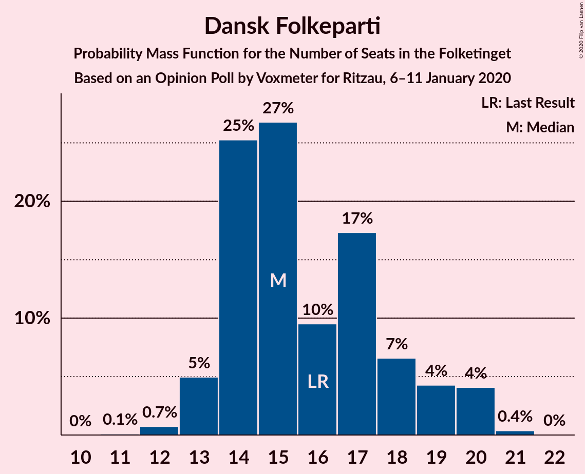

| Number of Seats | Probability | Accumulated | Special Marks |
|:---------------:|:-----------:|:-----------:|:-------------:|
| 11 | 0.1% | 100% |  |
| 12 | 0.7% | 99.9% |  |
| 13 | 5% | 99.2% |  |
| 14 | 25% | 94% |  |
| 15 | 27% | 69% | Median |
| 16 | 10% | 42% | Last Result |
| 17 | 17% | 33% |  |
| 18 | 7% | 15% |  |
| 19 | 4% | 9% |  |
| 20 | 4% | 4% |  |
| 21 | 0.4% | 0.4% |  |
| 22 | 0% | 0% |  |

### Radikale Venstre

*For a full overview of the results for this party, see the [Radikale Venstre](party-radikalevenstre.html) page.*

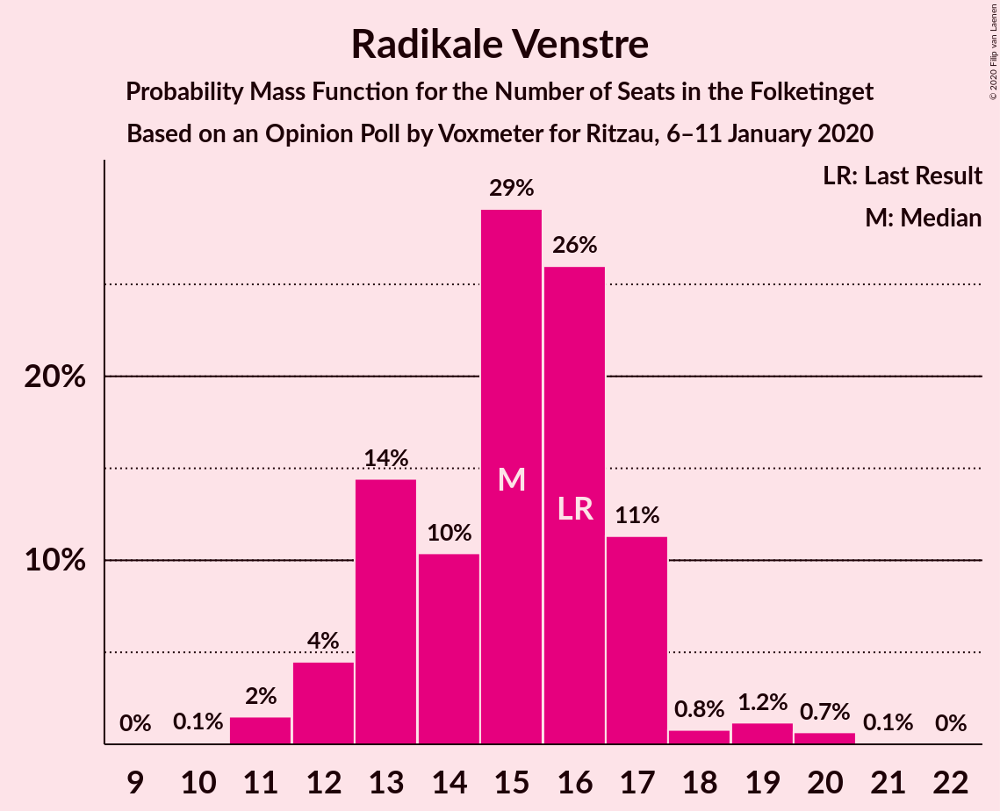

| Number of Seats | Probability | Accumulated | Special Marks |
|:---------------:|:-----------:|:-----------:|:-------------:|
| 10 | 0.1% | 100% |  |
| 11 | 2% | 99.9% |  |
| 12 | 4% | 98% |  |
| 13 | 14% | 94% |  |
| 14 | 10% | 79% |  |
| 15 | 29% | 69% | Median |
| 16 | 26% | 40% | Last Result |
| 17 | 11% | 14% |  |
| 18 | 0.8% | 3% |  |
| 19 | 1.2% | 2% |  |
| 20 | 0.7% | 0.7% |  |
| 21 | 0.1% | 0.1% |  |
| 22 | 0% | 0% |  |

### Socialistisk Folkeparti

*For a full overview of the results for this party, see the [Socialistisk Folkeparti](party-socialistiskfolkeparti.html) page.*

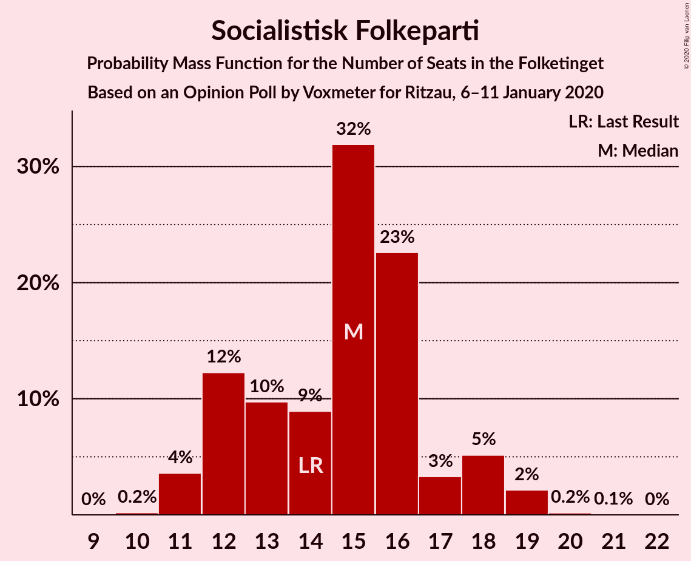

| Number of Seats | Probability | Accumulated | Special Marks |
|:---------------:|:-----------:|:-----------:|:-------------:|
| 10 | 0.2% | 100% |  |
| 11 | 4% | 99.8% |  |
| 12 | 12% | 96% |  |
| 13 | 10% | 84% |  |
| 14 | 9% | 74% | Last Result |
| 15 | 32% | 65% | Median |
| 16 | 23% | 33% |  |
| 17 | 3% | 11% |  |
| 18 | 5% | 8% |  |
| 19 | 2% | 2% |  |
| 20 | 0.2% | 0.2% |  |
| 21 | 0.1% | 0.1% |  |
| 22 | 0% | 0% |  |

### Det Konservative Folkeparti

*For a full overview of the results for this party, see the [Det Konservative Folkeparti](party-detkonservativefolkeparti.html) page.*

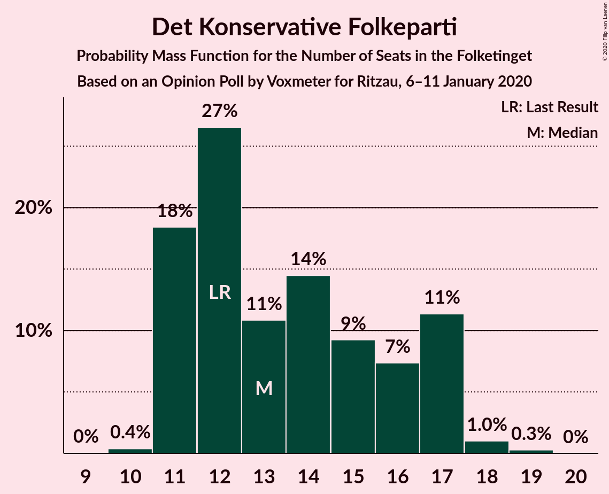

| Number of Seats | Probability | Accumulated | Special Marks |
|:---------------:|:-----------:|:-----------:|:-------------:|
| 10 | 0.4% | 100% |  |
| 11 | 18% | 99.6% |  |
| 12 | 27% | 81% | Last Result |
| 13 | 11% | 55% | Median |
| 14 | 14% | 44% |  |
| 15 | 9% | 29% |  |
| 16 | 7% | 20% |  |
| 17 | 11% | 13% |  |
| 18 | 1.0% | 1.3% |  |
| 19 | 0.3% | 0.3% |  |
| 20 | 0% | 0% |  |

### Enhedslisten–De Rød-Grønne

*For a full overview of the results for this party, see the [Enhedslisten–De Rød-Grønne](party-enhedslisten–derød-grønne.html) page.*

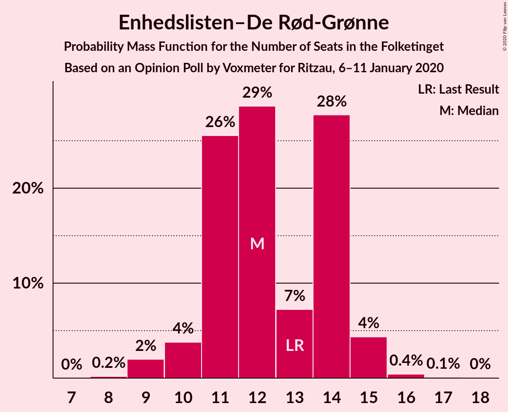

| Number of Seats | Probability | Accumulated | Special Marks |
|:---------------:|:-----------:|:-----------:|:-------------:|
| 8 | 0.2% | 100% |  |
| 9 | 2% | 99.8% |  |
| 10 | 4% | 98% |  |
| 11 | 26% | 94% |  |
| 12 | 29% | 69% | Median |
| 13 | 7% | 40% | Last Result |
| 14 | 28% | 33% |  |
| 15 | 4% | 5% |  |
| 16 | 0.4% | 0.6% |  |
| 17 | 0.1% | 0.1% |  |
| 18 | 0% | 0% |  |

### Alternativet

*For a full overview of the results for this party, see the [Alternativet](party-alternativet.html) page.*

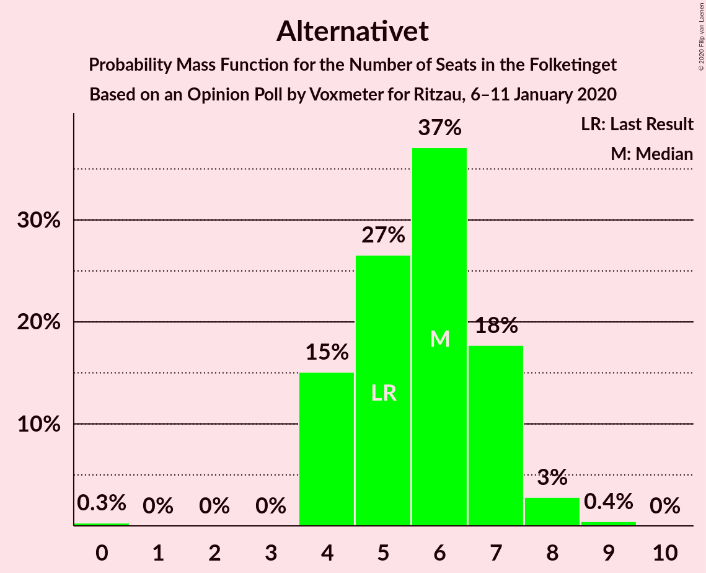

| Number of Seats | Probability | Accumulated | Special Marks |
|:---------------:|:-----------:|:-----------:|:-------------:|
| 0 | 0.3% | 100% |  |
| 1 | 0% | 99.7% |  |
| 2 | 0% | 99.7% |  |
| 3 | 0% | 99.7% |  |
| 4 | 15% | 99.7% |  |
| 5 | 27% | 85% | Last Result |
| 6 | 37% | 58% | Median |
| 7 | 18% | 21% |  |
| 8 | 3% | 3% |  |
| 9 | 0.4% | 0.4% |  |
| 10 | 0% | 0% |  |

### Stram Kurs

*For a full overview of the results for this party, see the [Stram Kurs](party-stramkurs.html) page.*

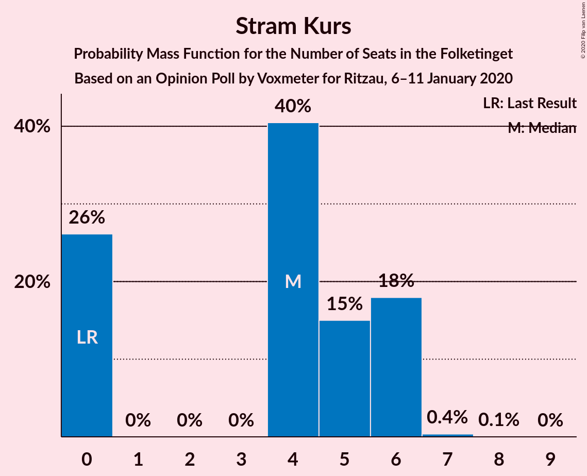

| Number of Seats | Probability | Accumulated | Special Marks |
|:---------------:|:-----------:|:-----------:|:-------------:|
| 0 | 26% | 100% | Last Result |
| 1 | 0% | 74% |  |
| 2 | 0% | 74% |  |
| 3 | 0% | 74% |  |
| 4 | 40% | 74% | Median |
| 5 | 15% | 33% |  |
| 6 | 18% | 18% |  |
| 7 | 0.4% | 0.4% |  |
| 8 | 0.1% | 0.1% |  |
| 9 | 0% | 0% |  |

### Liberal Alliance

*For a full overview of the results for this party, see the [Liberal Alliance](party-liberalalliance.html) page.*

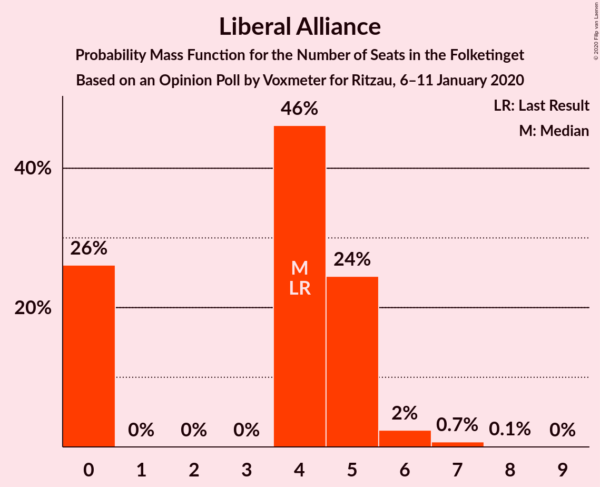

| Number of Seats | Probability | Accumulated | Special Marks |
|:---------------:|:-----------:|:-----------:|:-------------:|
| 0 | 26% | 100% |  |
| 1 | 0% | 74% |  |
| 2 | 0% | 74% |  |
| 3 | 0% | 74% |  |
| 4 | 46% | 74% | Last Result, Median |
| 5 | 24% | 28% |  |
| 6 | 2% | 3% |  |
| 7 | 0.7% | 0.9% |  |
| 8 | 0.1% | 0.1% |  |
| 9 | 0% | 0% |  |

### Nye Borgerlige

*For a full overview of the results for this party, see the [Nye Borgerlige](party-nyeborgerlige.html) page.*

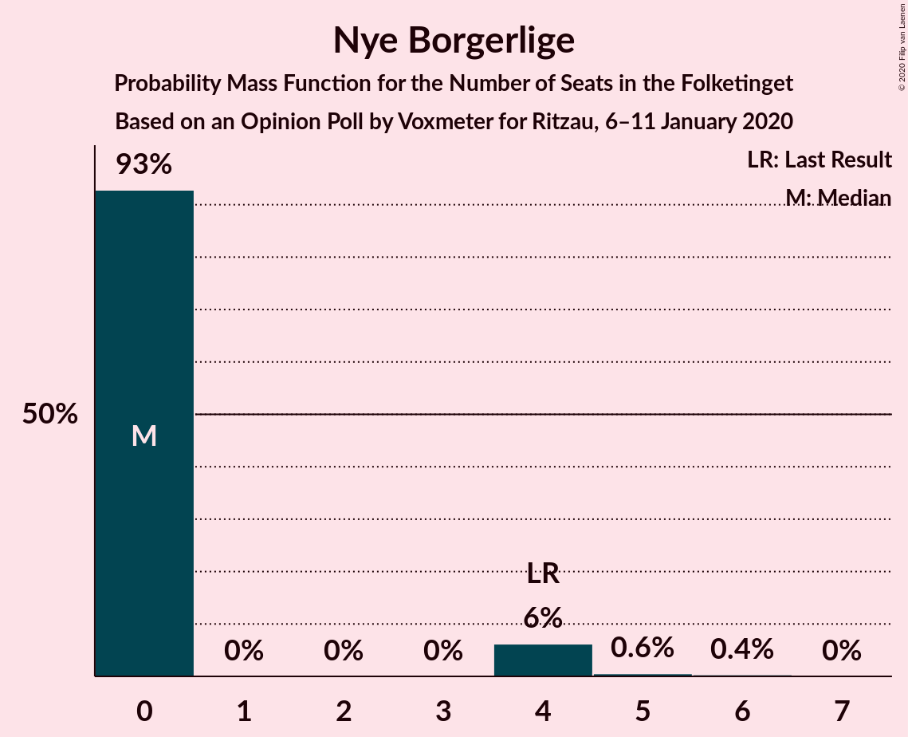

| Number of Seats | Probability | Accumulated | Special Marks |
|:---------------:|:-----------:|:-----------:|:-------------:|
| 0 | 93% | 100% | Median |
| 1 | 0% | 7% |  |
| 2 | 0% | 7% |  |
| 3 | 0% | 7% |  |
| 4 | 6% | 7% | Last Result |
| 5 | 0.6% | 0.9% |  |
| 6 | 0.4% | 0.4% |  |
| 7 | 0% | 0% |  |

### Klaus Riskær Pedersen

*For a full overview of the results for this party, see the [Klaus Riskær Pedersen](party-klausriskærpedersen.html) page.*

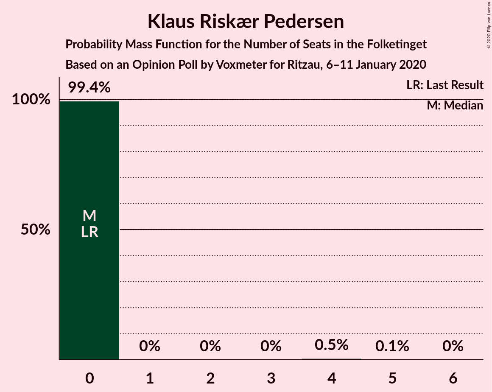

| Number of Seats | Probability | Accumulated | Special Marks |
|:---------------:|:-----------:|:-----------:|:-------------:|
| 0 | 99.4% | 100% | Last Result, Median |
| 1 | 0% | 0.6% |  |
| 2 | 0% | 0.6% |  |
| 3 | 0% | 0.6% |  |
| 4 | 0.5% | 0.6% |  |
| 5 | 0.1% | 0.1% |  |
| 6 | 0% | 0% |  |

## Coalitions

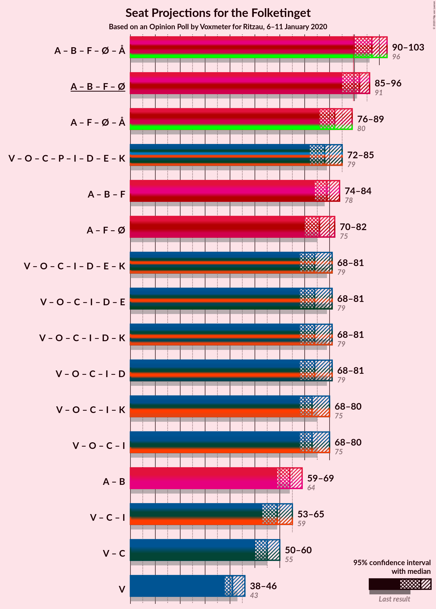

### Confidence Intervals

| Coalition | Last Result | Median | Majority? | 80% Confidence Interval | 90% Confidence Interval | 95% Confidence Interval | 99% Confidence Interval |
|:---------:|:-----------:|:------:|:---------:|:-----------------------:|:-----------------------:|:-----------------------:|:-----------------------:|
| Socialdemokraterne – Radikale Venstre – Socialistisk Folkeparti – Enhedslisten–De Rød-Grønne – Alternativet | 96 | 97 | 98% | 93–100 | 91–102 | 90–103 | 89–104 |
| Socialdemokraterne – Radikale Venstre – Socialistisk Folkeparti – Enhedslisten–De Rød-Grønne | 91 | 92 | 76% | 86–95 | 86–96 | 85–96 | 83–98 |
| Socialdemokraterne – Socialistisk Folkeparti – Enhedslisten–De Rød-Grønne – Alternativet | 80 | 82 | 0.4% | 78–85 | 76–88 | 76–89 | 74–89 |
| Socialdemokraterne – Radikale Venstre – Socialistisk Folkeparti | 78 | 79 | 0.1% | 74–82 | 74–84 | 74–84 | 71–86 |
| Socialdemokraterne – Socialistisk Folkeparti – Enhedslisten–De Rød-Grønne | 75 | 76 | 0% | 73–80 | 71–82 | 70–82 | 68–84 |
| Venstre – Dansk Folkeparti – Det Konservative Folkeparti – Liberal Alliance – Nye Borgerlige – Klaus Riskær Pedersen | 79 | 74 | 0% | 71–79 | 69–80 | 68–81 | 66–82 |
| Venstre – Dansk Folkeparti – Det Konservative Folkeparti – Liberal Alliance – Nye Borgerlige | 79 | 74 | 0% | 71–79 | 69–80 | 68–81 | 66–81 |
| Venstre – Dansk Folkeparti – Det Konservative Folkeparti – Liberal Alliance | 75 | 73 | 0% | 70–78 | 69–80 | 68–80 | 66–81 |
| Socialdemokraterne – Radikale Venstre | 64 | 64 | 0% | 62–68 | 60–68 | 59–69 | 57–72 |
| Venstre – Det Konservative Folkeparti – Liberal Alliance | 59 | 59 | 0% | 55–61 | 53–64 | 53–65 | 51–66 |
| Venstre – Det Konservative Folkeparti | 55 | 55 | 0% | 51–58 | 51–60 | 50–60 | 49–62 |
| Venstre | 43 | 41 | 0% | 39–45 | 39–46 | 38–46 | 35–49 |

### Socialdemokraterne – Radikale Venstre – Socialistisk Folkeparti – Enhedslisten–De Rød-Grønne – Alternativet

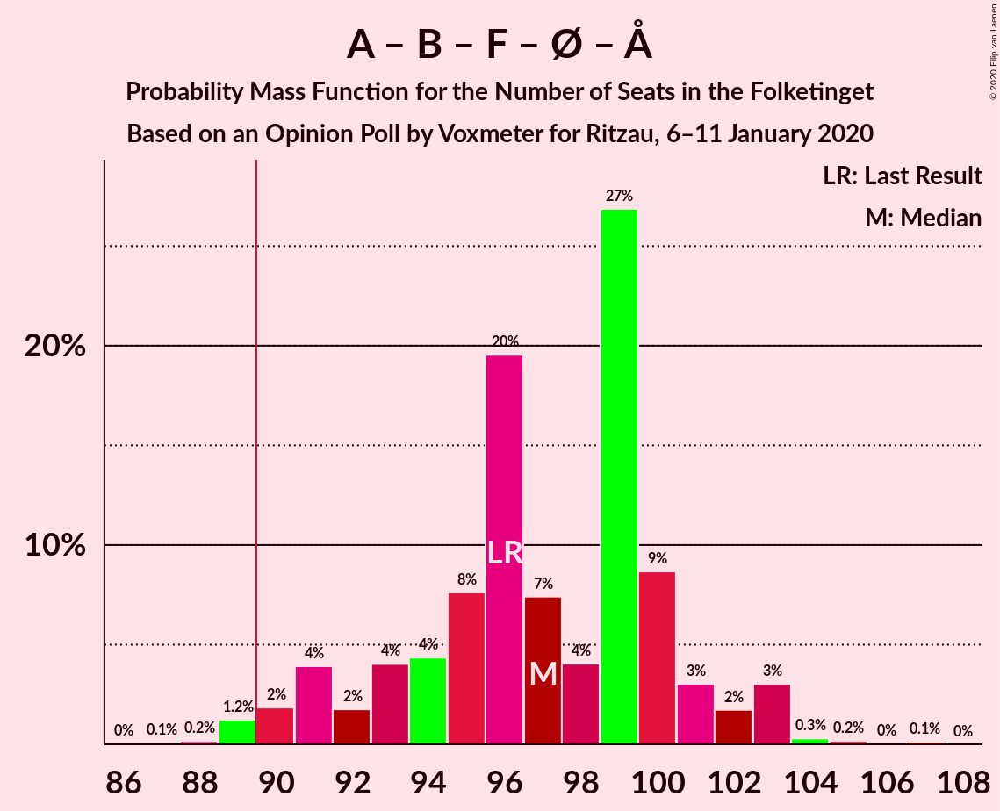

| Number of Seats | Probability | Accumulated | Special Marks |
|:---------------:|:-----------:|:-----------:|:-------------:|
| 87 | 0.1% | 100% |  |
| 88 | 0.2% | 99.9% |  |
| 89 | 1.2% | 99.7% |  |
| 90 | 2% | 98% | Majority |
| 91 | 4% | 97% |  |
| 92 | 2% | 93% |  |
| 93 | 4% | 91% |  |
| 94 | 4% | 87% |  |
| 95 | 8% | 83% |  |
| 96 | 20% | 75% | Last Result |
| 97 | 7% | 55% | Median |
| 98 | 4% | 48% |  |
| 99 | 27% | 44% |  |
| 100 | 9% | 17% |  |
| 101 | 3% | 8% |  |
| 102 | 2% | 5% |  |
| 103 | 3% | 4% |  |
| 104 | 0.3% | 0.6% |  |
| 105 | 0.2% | 0.3% |  |
| 106 | 0% | 0.2% |  |
| 107 | 0.1% | 0.1% |  |
| 108 | 0% | 0% |  |

### Socialdemokraterne – Radikale Venstre – Socialistisk Folkeparti – Enhedslisten–De Rød-Grønne

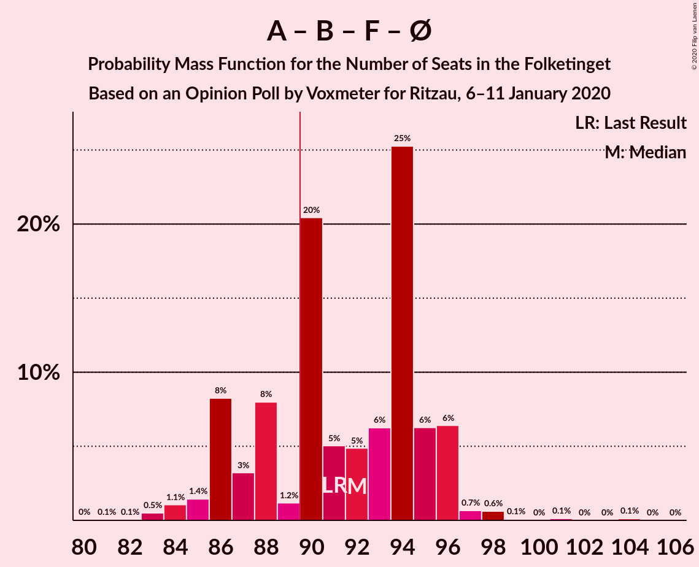

| Number of Seats | Probability | Accumulated | Special Marks |
|:---------------:|:-----------:|:-----------:|:-------------:|
| 80 | 0% | 100% |  |
| 81 | 0.1% | 99.9% |  |
| 82 | 0.1% | 99.9% |  |
| 83 | 0.5% | 99.8% |  |
| 84 | 1.1% | 99.3% |  |
| 85 | 1.4% | 98% |  |
| 86 | 8% | 97% |  |
| 87 | 3% | 89% |  |
| 88 | 8% | 85% |  |
| 89 | 1.2% | 77% |  |
| 90 | 20% | 76% | Majority |
| 91 | 5% | 56% | Last Result, Median |
| 92 | 5% | 51% |  |
| 93 | 6% | 46% |  |
| 94 | 25% | 40% |  |
| 95 | 6% | 14% |  |
| 96 | 6% | 8% |  |
| 97 | 0.7% | 2% |  |
| 98 | 0.6% | 1.0% |  |
| 99 | 0.1% | 0.4% |  |
| 100 | 0% | 0.3% |  |
| 101 | 0.1% | 0.3% |  |
| 102 | 0% | 0.1% |  |
| 103 | 0% | 0.1% |  |
| 104 | 0.1% | 0.1% |  |
| 105 | 0% | 0% |  |

### Socialdemokraterne – Socialistisk Folkeparti – Enhedslisten–De Rød-Grønne – Alternativet

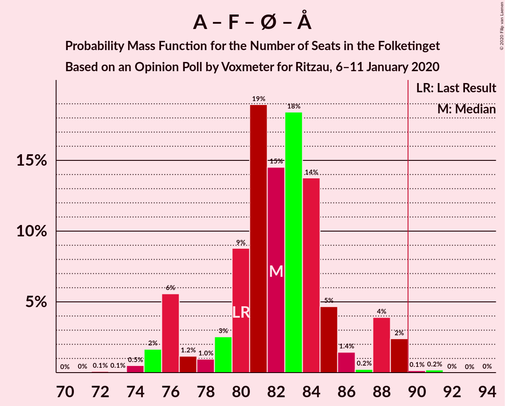

| Number of Seats | Probability | Accumulated | Special Marks |
|:---------------:|:-----------:|:-----------:|:-------------:|
| 72 | 0.1% | 100% |  |
| 73 | 0.1% | 99.9% |  |
| 74 | 0.5% | 99.8% |  |
| 75 | 2% | 99.3% |  |
| 76 | 6% | 98% |  |
| 77 | 1.2% | 92% |  |
| 78 | 1.0% | 91% |  |
| 79 | 3% | 90% |  |
| 80 | 9% | 87% | Last Result |
| 81 | 19% | 79% |  |
| 82 | 15% | 60% | Median |
| 83 | 18% | 45% |  |
| 84 | 14% | 27% |  |
| 85 | 5% | 13% |  |
| 86 | 1.4% | 8% |  |
| 87 | 0.2% | 7% |  |
| 88 | 4% | 7% |  |
| 89 | 2% | 3% |  |
| 90 | 0.1% | 0.4% | Majority |
| 91 | 0.2% | 0.2% |  |
| 92 | 0% | 0.1% |  |
| 93 | 0% | 0% |  |

### Socialdemokraterne – Radikale Venstre – Socialistisk Folkeparti

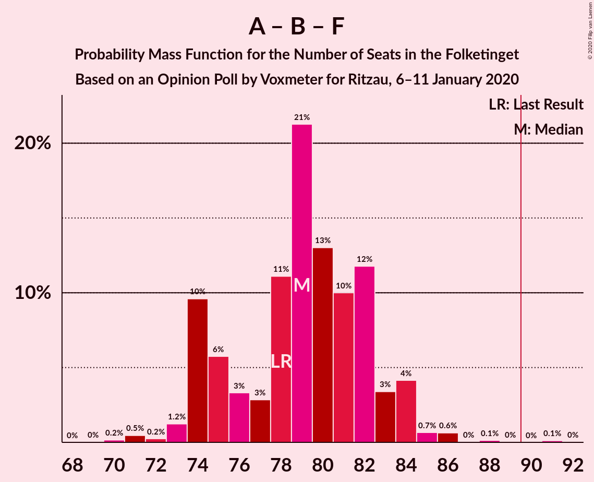

| Number of Seats | Probability | Accumulated | Special Marks |
|:---------------:|:-----------:|:-----------:|:-------------:|
| 70 | 0.2% | 100% |  |
| 71 | 0.5% | 99.8% |  |
| 72 | 0.2% | 99.3% |  |
| 73 | 1.2% | 99.1% |  |
| 74 | 10% | 98% |  |
| 75 | 6% | 88% |  |
| 76 | 3% | 82% |  |
| 77 | 3% | 79% |  |
| 78 | 11% | 76% | Last Result |
| 79 | 21% | 65% | Median |
| 80 | 13% | 44% |  |
| 81 | 10% | 31% |  |
| 82 | 12% | 21% |  |
| 83 | 3% | 9% |  |
| 84 | 4% | 6% |  |
| 85 | 0.7% | 2% |  |
| 86 | 0.6% | 0.9% |  |
| 87 | 0% | 0.3% |  |
| 88 | 0.1% | 0.3% |  |
| 89 | 0% | 0.1% |  |
| 90 | 0% | 0.1% | Majority |
| 91 | 0.1% | 0.1% |  |
| 92 | 0% | 0% |  |

### Socialdemokraterne – Socialistisk Folkeparti – Enhedslisten–De Rød-Grønne

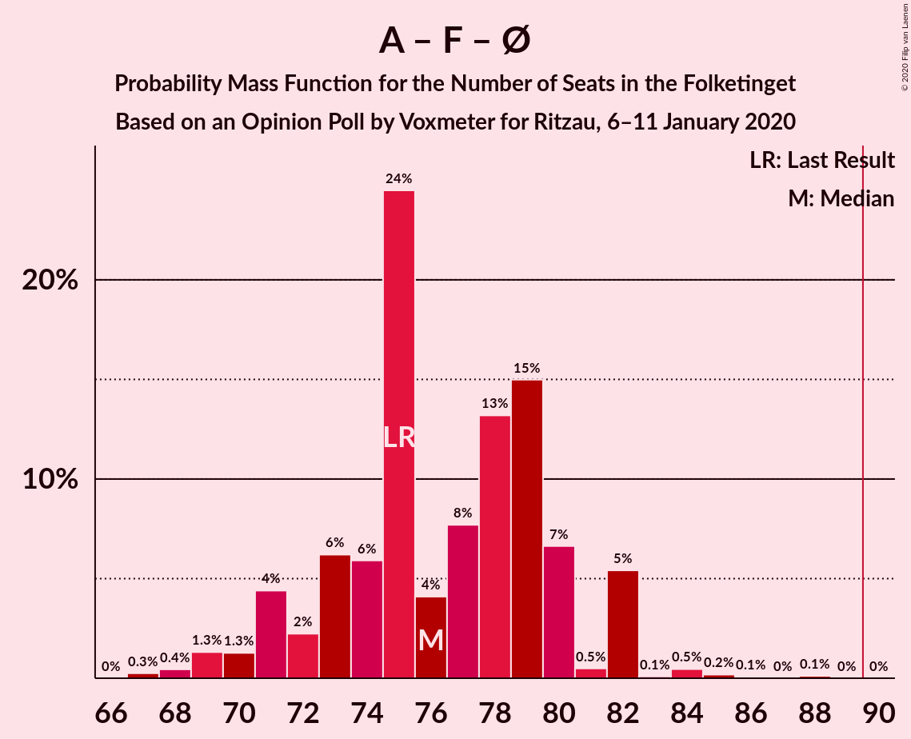

| Number of Seats | Probability | Accumulated | Special Marks |
|:---------------:|:-----------:|:-----------:|:-------------:|
| 67 | 0.3% | 100% |  |
| 68 | 0.4% | 99.7% |  |
| 69 | 1.3% | 99.3% |  |
| 70 | 1.3% | 98% |  |
| 71 | 4% | 97% |  |
| 72 | 2% | 92% |  |
| 73 | 6% | 90% |  |
| 74 | 6% | 84% |  |
| 75 | 24% | 78% | Last Result |
| 76 | 4% | 53% | Median |
| 77 | 8% | 49% |  |
| 78 | 13% | 42% |  |
| 79 | 15% | 28% |  |
| 80 | 7% | 13% |  |
| 81 | 0.5% | 7% |  |
| 82 | 5% | 6% |  |
| 83 | 0.1% | 0.9% |  |
| 84 | 0.5% | 0.8% |  |
| 85 | 0.2% | 0.4% |  |
| 86 | 0.1% | 0.2% |  |
| 87 | 0% | 0.1% |  |
| 88 | 0.1% | 0.1% |  |
| 89 | 0% | 0% |  |

### Venstre – Dansk Folkeparti – Det Konservative Folkeparti – Liberal Alliance – Nye Borgerlige – Klaus Riskær Pedersen

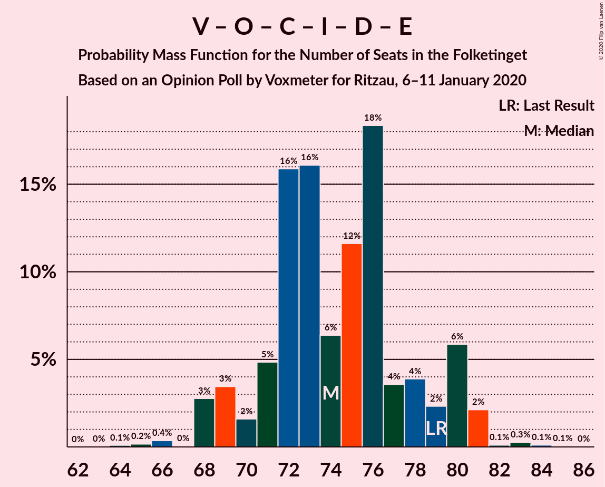

| Number of Seats | Probability | Accumulated | Special Marks |
|:---------------:|:-----------:|:-----------:|:-------------:|
| 64 | 0.1% | 100% |  |
| 65 | 0.2% | 99.9% |  |
| 66 | 0.4% | 99.7% |  |
| 67 | 0% | 99.4% |  |
| 68 | 3% | 99.3% |  |
| 69 | 3% | 97% |  |
| 70 | 2% | 93% |  |
| 71 | 5% | 91% |  |
| 72 | 16% | 87% |  |
| 73 | 16% | 71% | Median |
| 74 | 6% | 55% |  |
| 75 | 12% | 48% |  |
| 76 | 18% | 37% |  |
| 77 | 4% | 18% |  |
| 78 | 4% | 15% |  |
| 79 | 2% | 11% | Last Result |
| 80 | 6% | 9% |  |
| 81 | 2% | 3% |  |
| 82 | 0.1% | 0.6% |  |
| 83 | 0.3% | 0.5% |  |
| 84 | 0.1% | 0.2% |  |
| 85 | 0.1% | 0.1% |  |
| 86 | 0% | 0% |  |

### Venstre – Dansk Folkeparti – Det Konservative Folkeparti – Liberal Alliance – Nye Borgerlige

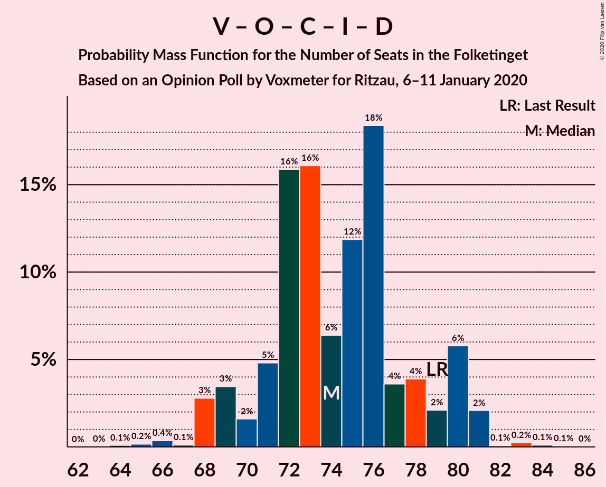

| Number of Seats | Probability | Accumulated | Special Marks |
|:---------------:|:-----------:|:-----------:|:-------------:|
| 64 | 0.1% | 100% |  |
| 65 | 0.2% | 99.9% |  |
| 66 | 0.4% | 99.7% |  |
| 67 | 0.1% | 99.4% |  |
| 68 | 3% | 99.2% |  |
| 69 | 3% | 96% |  |
| 70 | 2% | 93% |  |
| 71 | 5% | 91% |  |
| 72 | 16% | 87% |  |
| 73 | 16% | 71% | Median |
| 74 | 6% | 55% |  |
| 75 | 12% | 48% |  |
| 76 | 18% | 36% |  |
| 77 | 4% | 18% |  |
| 78 | 4% | 14% |  |
| 79 | 2% | 10% | Last Result |
| 80 | 6% | 8% |  |
| 81 | 2% | 3% |  |
| 82 | 0.1% | 0.5% |  |
| 83 | 0.2% | 0.4% |  |
| 84 | 0.1% | 0.2% |  |
| 85 | 0.1% | 0.1% |  |
| 86 | 0% | 0% |  |

### Venstre – Dansk Folkeparti – Det Konservative Folkeparti – Liberal Alliance

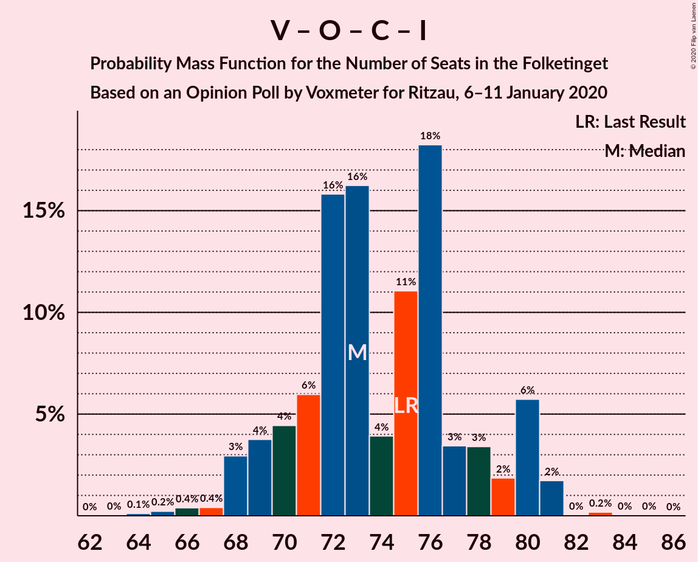

| Number of Seats | Probability | Accumulated | Special Marks |
|:---------------:|:-----------:|:-----------:|:-------------:|
| 64 | 0.1% | 100% |  |
| 65 | 0.2% | 99.9% |  |
| 66 | 0.4% | 99.6% |  |
| 67 | 0.4% | 99.2% |  |
| 68 | 3% | 98.8% |  |
| 69 | 4% | 96% |  |
| 70 | 4% | 92% |  |
| 71 | 6% | 88% |  |
| 72 | 16% | 82% |  |
| 73 | 16% | 66% | Median |
| 74 | 4% | 50% |  |
| 75 | 11% | 46% | Last Result |
| 76 | 18% | 35% |  |
| 77 | 3% | 16% |  |
| 78 | 3% | 13% |  |
| 79 | 2% | 10% |  |
| 80 | 6% | 8% |  |
| 81 | 2% | 2% |  |
| 82 | 0% | 0.3% |  |
| 83 | 0.2% | 0.3% |  |
| 84 | 0% | 0.1% |  |
| 85 | 0% | 0% |  |

### Socialdemokraterne – Radikale Venstre

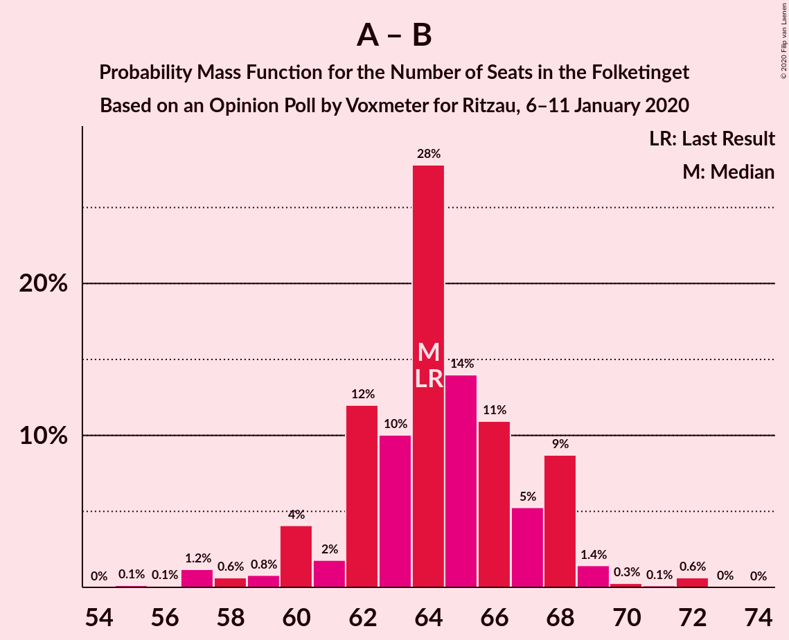

| Number of Seats | Probability | Accumulated | Special Marks |
|:---------------:|:-----------:|:-----------:|:-------------:|
| 55 | 0.1% | 100% |  |
| 56 | 0.1% | 99.8% |  |
| 57 | 1.2% | 99.7% |  |
| 58 | 0.6% | 98.6% |  |
| 59 | 0.8% | 98% |  |
| 60 | 4% | 97% |  |
| 61 | 2% | 93% |  |
| 62 | 12% | 91% |  |
| 63 | 10% | 79% |  |
| 64 | 28% | 69% | Last Result, Median |
| 65 | 14% | 41% |  |
| 66 | 11% | 27% |  |
| 67 | 5% | 16% |  |
| 68 | 9% | 11% |  |
| 69 | 1.4% | 3% |  |
| 70 | 0.3% | 1.1% |  |
| 71 | 0.1% | 0.8% |  |
| 72 | 0.6% | 0.7% |  |
| 73 | 0% | 0.1% |  |
| 74 | 0% | 0% |  |

### Venstre – Det Konservative Folkeparti – Liberal Alliance

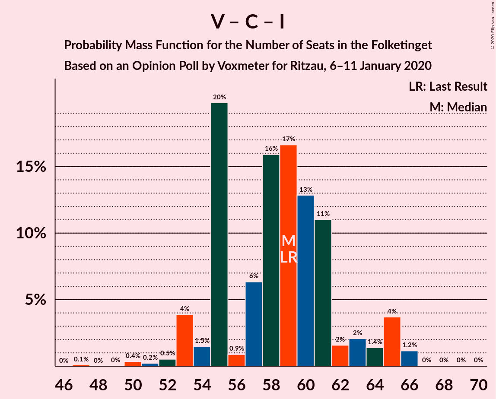

| Number of Seats | Probability | Accumulated | Special Marks |
|:---------------:|:-----------:|:-----------:|:-------------:|
| 47 | 0.1% | 100% |  |
| 48 | 0% | 99.9% |  |
| 49 | 0% | 99.9% |  |
| 50 | 0.4% | 99.9% |  |
| 51 | 0.2% | 99.5% |  |
| 52 | 0.5% | 99.3% |  |
| 53 | 4% | 98.8% |  |
| 54 | 1.5% | 95% |  |
| 55 | 20% | 93% |  |
| 56 | 0.9% | 74% |  |
| 57 | 6% | 73% |  |
| 58 | 16% | 66% | Median |
| 59 | 17% | 50% | Last Result |
| 60 | 13% | 34% |  |
| 61 | 11% | 21% |  |
| 62 | 2% | 10% |  |
| 63 | 2% | 8% |  |
| 64 | 1.4% | 6% |  |
| 65 | 4% | 5% |  |
| 66 | 1.2% | 1.2% |  |
| 67 | 0% | 0.1% |  |
| 68 | 0% | 0.1% |  |
| 69 | 0% | 0% |  |

### Venstre – Det Konservative Folkeparti

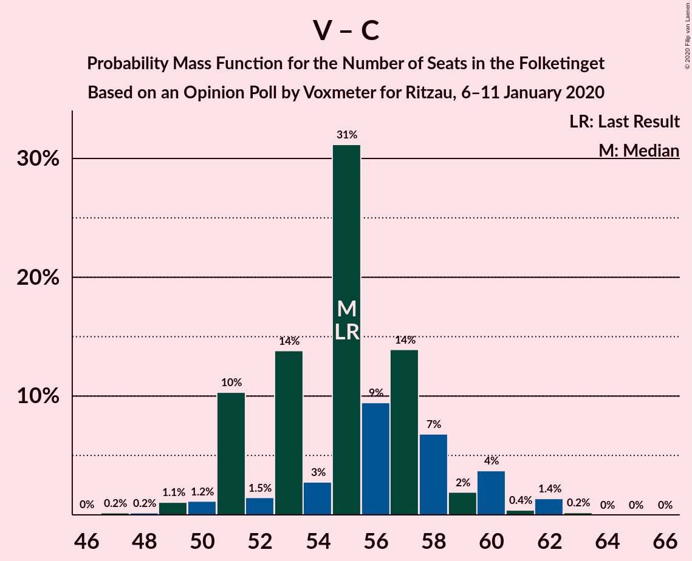

| Number of Seats | Probability | Accumulated | Special Marks |
|:---------------:|:-----------:|:-----------:|:-------------:|
| 46 | 0% | 100% |  |
| 47 | 0.2% | 99.9% |  |
| 48 | 0.2% | 99.8% |  |
| 49 | 1.1% | 99.6% |  |
| 50 | 1.2% | 98.5% |  |
| 51 | 10% | 97% |  |
| 52 | 1.5% | 87% |  |
| 53 | 14% | 86% |  |
| 54 | 3% | 72% | Median |
| 55 | 31% | 69% | Last Result |
| 56 | 9% | 38% |  |
| 57 | 14% | 28% |  |
| 58 | 7% | 14% |  |
| 59 | 2% | 8% |  |
| 60 | 4% | 6% |  |
| 61 | 0.4% | 2% |  |
| 62 | 1.4% | 2% |  |
| 63 | 0.2% | 0.3% |  |
| 64 | 0% | 0.1% |  |
| 65 | 0% | 0% |  |

### Venstre

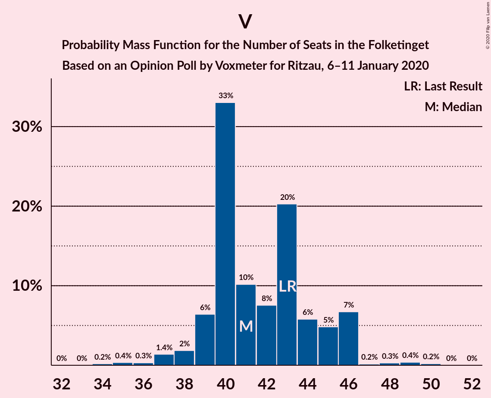

| Number of Seats | Probability | Accumulated | Special Marks |
|:---------------:|:-----------:|:-----------:|:-------------:|
| 34 | 0.2% | 100% |  |
| 35 | 0.4% | 99.8% |  |
| 36 | 0.3% | 99.4% |  |
| 37 | 1.4% | 99.1% |  |
| 38 | 2% | 98% |  |
| 39 | 6% | 96% |  |
| 40 | 33% | 89% |  |
| 41 | 10% | 56% | Median |
| 42 | 8% | 46% |  |
| 43 | 20% | 39% | Last Result |
| 44 | 6% | 18% |  |
| 45 | 5% | 13% |  |
| 46 | 7% | 8% |  |
| 47 | 0.2% | 1.1% |  |
| 48 | 0.3% | 0.9% |  |
| 49 | 0.4% | 0.6% |  |
| 50 | 0.2% | 0.2% |  |
| 51 | 0% | 0% |  |

## Technical Information

### Opinion Poll

+ **Polling firm:** Voxmeter
+ **Commissioner(s):** Ritzau
+ **Fieldwork period:** 6–11 January 2020

### Calculations

+ **Sample size:** 1030
+ **Simulations done:** 1,048,576
+ **Error estimate:** 2.67%

