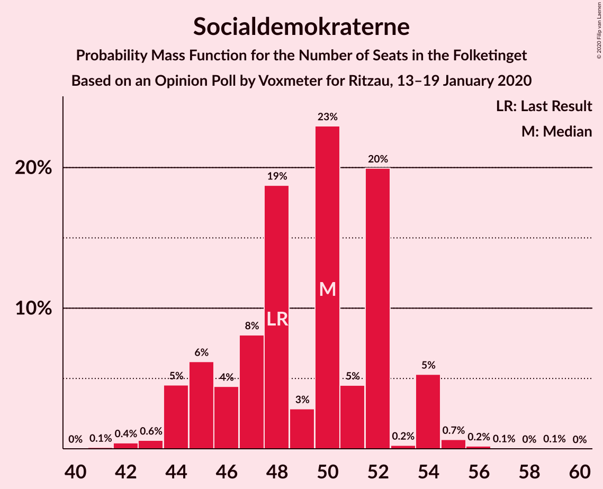
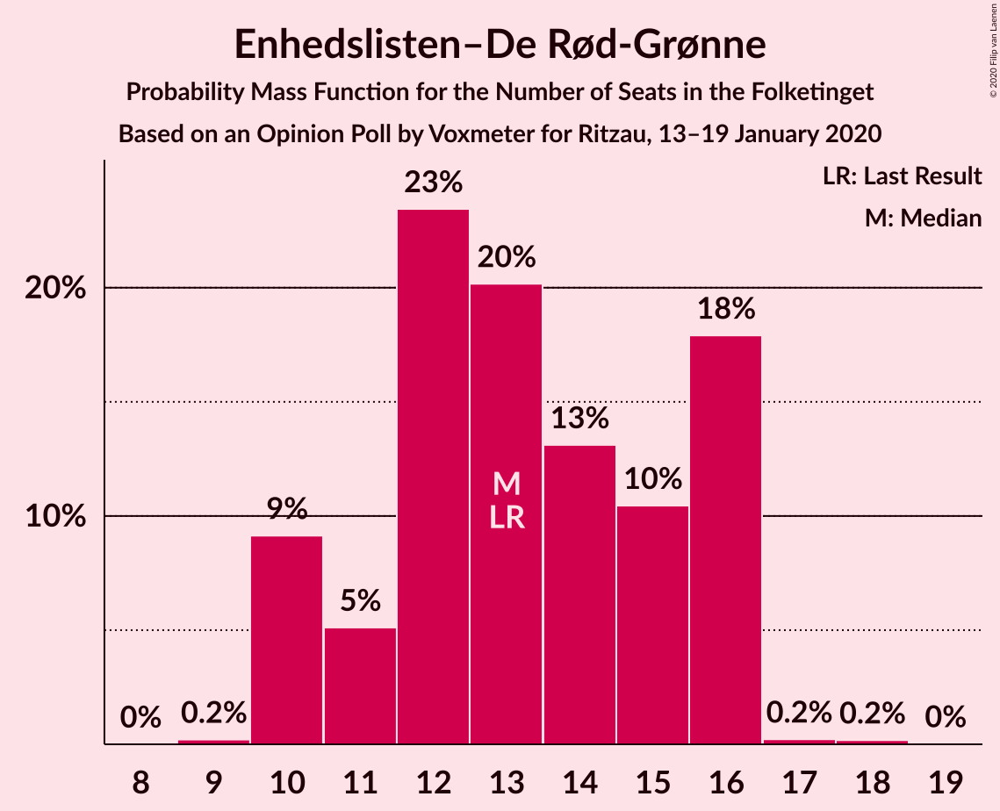
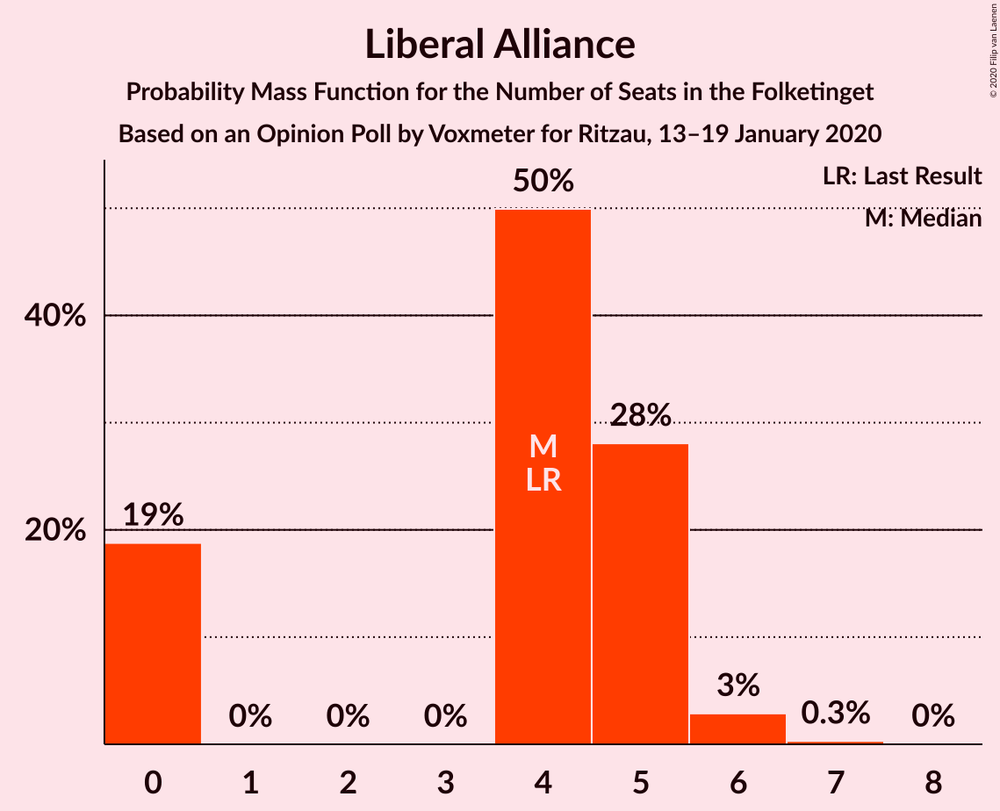
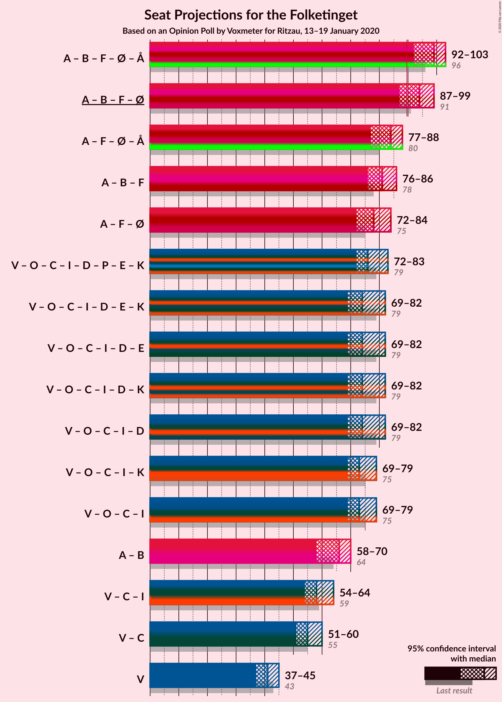
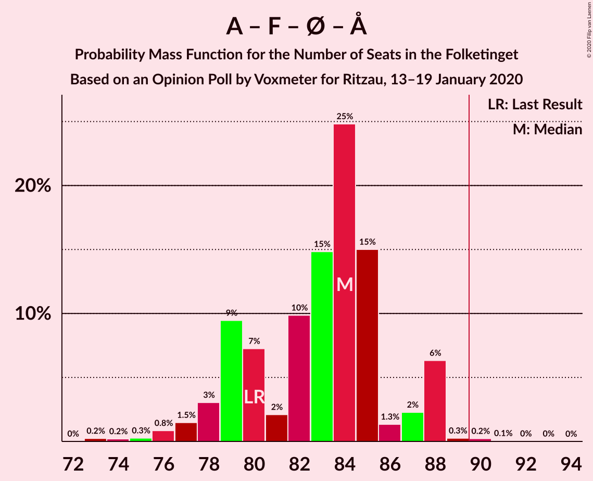
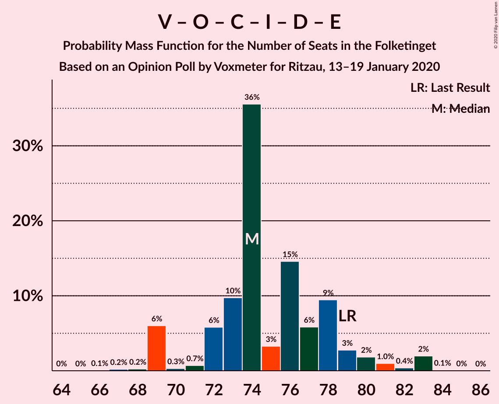
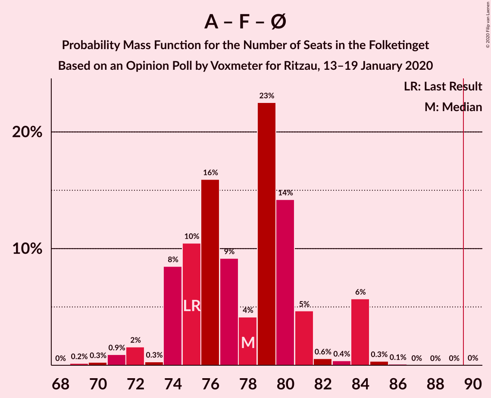
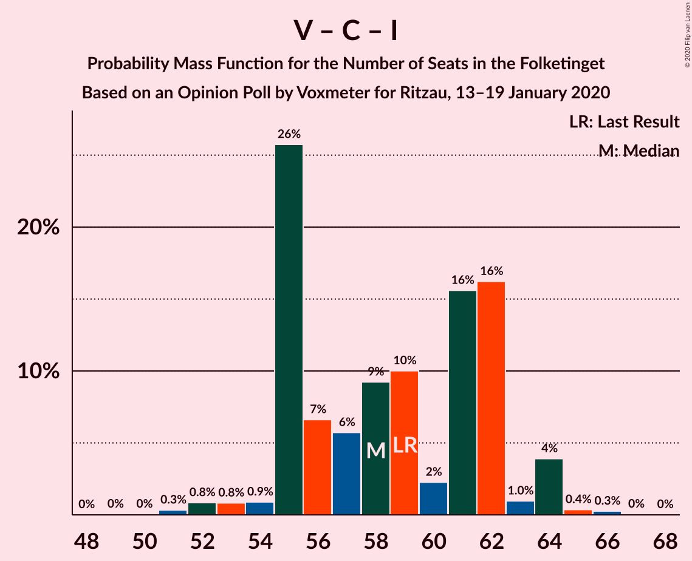

# Opinion Poll by Voxmeter for Ritzau, 13–19 January 2020

<a href="#voting-intentions">Voting Intentions</a> | <a href="#seats">Seats</a> | <a href="#coalitions">Coalitions</a> | <a href="#technical-information">Technical Information</a>

## Voting Intentions

### Confidence Intervals

| Party | Last Result | Poll Result | 80% Confidence Interval | 90% Confidence Interval | 95% Confidence Interval | 99% Confidence Interval |
|:-----:|:-----------:|:-----------:|:-----------------------:|:-----------------------:|:-----------------------:|:-----------------------:|
| Socialdemokraterne | 25.9% | 27.2% | 25.5–29.0% |25.0–29.5% |24.6–30.0% |23.8–30.9% |
| Venstre | 23.4% | 22.3% | 20.7–24.0% |20.2–24.5% |19.8–24.9% |19.1–25.8% |
| Radikale Venstre | 8.6% | 8.7% | 7.7–9.9% |7.4–10.3% |7.1–10.6% |6.6–11.2% |
| Socialistisk Folkeparti | 7.7% | 8.6% | 7.6–9.8% |7.3–10.2% |7.0–10.5% |6.6–11.1% |
| Dansk Folkeparti | 8.7% | 8.1% | 7.1–9.3% |6.8–9.6% |6.6–9.9% |6.1–10.5% |
| Det Konservative Folkeparti | 6.6% | 8.0% | 7.0–9.2% |6.7–9.5% |6.5–9.8% |6.1–10.4% |
| Enhedslisten–De Rød-Grønne | 6.9% | 7.1% | 6.2–8.3% |5.9–8.6% |5.7–8.9% |5.3–9.4% |
| Alternativet | 3.0% | 2.6% | 2.1–3.4% |1.9–3.6% |1.8–3.8% |1.6–4.2% |
| Liberal Alliance | 2.3% | 2.2% | 1.7–2.9% |1.6–3.1% |1.5–3.3% |1.3–3.7% |
| Nye Borgerlige | 2.4% | 1.8% | 1.4–2.5% |1.3–2.7% |1.2–2.9% |1.0–3.2% |
| Stram Kurs | 1.8% | 1.8% | 1.4–2.5% |1.3–2.7% |1.2–2.9% |1.0–3.2% |
| Klaus Riskær Pedersen | 0.8% | 0.6% | 0.4–1.0% |0.3–1.1% |0.3–1.3% |0.2–1.5% |

*Note:* The poll result column reflects the actual value used in the calculations. Published results may vary slightly, and in addition be rounded to fewer digits.

## Seats

### Confidence Intervals

| Party | Last Result | Median | 80% Confidence Interval | 90% Confidence Interval | 95% Confidence Interval | 99% Confidence Interval |
|:-----:|:-----------:|:------:|:-----------------------:|:-----------------------:|:-----------------------:|:-----------------------:|
| <a href="#socialdemokraterne">Socialdemokraterne</a> | 48 | 50 | 50 |46–50 |45–51 |42–54 |
| <a href="#venstre">Venstre</a> | 43 | 41 | 41–42 |39–42 |38–43 |37–46 |
| <a href="#radikale-venstre">Radikale Venstre</a> | 16 | 18 | 14–18 |14–18 |13–18 |13–20 |
| <a href="#socialistisk-folkeparti">Socialistisk Folkeparti</a> | 14 | 14 | 14–16 |14–17 |14–18 |13–19 |
| <a href="#dansk-folkeparti">Dansk Folkeparti</a> | 16 | 13 | 13 |13–16 |11–17 |11–17 |
| <a href="#det-konservative-folkeparti">Det Konservative Folkeparti</a> | 12 | 15 | 15–16 |15–17 |13–17 |12–19 |
| <a href="#enhedslisten–de-rød-grønne">Enhedslisten–De Rød-Grønne</a> | 13 | 12 | 12–14 |12–15 |11–15 |10–18 |
| <a href="#alternativet">Alternativet</a> | 5 | 7 | 5–7 |4–7 |4–7 |0–7 |
| <a href="#liberal-alliance">Liberal Alliance</a> | 4 | 5 | 4–5 |0–5 |0–5 |0–6 |
| <a href="#nye-borgerlige">Nye Borgerlige</a> | 4 | 0 | 0–4 |0–4 |0–5 |0–6 |
| <a href="#stram-kurs">Stram Kurs</a> | 0 | 0 | 0–4 |0–4 |0–4 |0–6 |
| <a href="#klaus-riskær-pedersen">Klaus Riskær Pedersen</a> | 0 | 0 | 0 |0 |0 |0 |

### Socialdemokraterne

*For a full overview of the results for this party, see the [Socialdemokraterne](party-socialdemokraterne.html) page.*

| Number of Seats | Probability | Accumulated | Special Marks |
|:---------------:|:-----------:|:-----------:|:-------------:|
| 41 | 0.2% | 100% |  |
| 42 | 1.1% | 99.8% |  |
| 43 | 0.1% | 98.7% |  |
| 44 | 0.3% | 98.5% |  |
| 45 | 1.4% | 98% |  |
| 46 | 2% | 97% |  |
| 47 | 0.8% | 94% |  |
| 48 | 2% | 94% | Last Result |
| 49 | 0.1% | 91% |  |
| 50 | 87% | 91% | Median |
| 51 | 3% | 4% |  |
| 52 | 0.1% | 2% |  |
| 53 | 0.1% | 2% |  |
| 54 | 1.0% | 1.4% |  |
| 55 | 0.3% | 0.4% |  |
| 56 | 0% | 0% |  |

### Venstre

*For a full overview of the results for this party, see the [Venstre](party-venstre.html) page.*

| Number of Seats | Probability | Accumulated | Special Marks |
|:---------------:|:-----------:|:-----------:|:-------------:|
| 34 | 0.1% | 100% |  |
| 35 | 0.3% | 99.9% |  |
| 36 | 0.1% | 99.6% |  |
| 37 | 0.9% | 99.5% |  |
| 38 | 2% | 98.6% |  |
| 39 | 2% | 96% |  |
| 40 | 1.4% | 94% |  |
| 41 | 82% | 92% | Median |
| 42 | 7% | 10% |  |
| 43 | 0.7% | 3% | Last Result |
| 44 | 2% | 2% |  |
| 45 | 0.1% | 0.6% |  |
| 46 | 0.2% | 0.5% |  |
| 47 | 0.1% | 0.3% |  |
| 48 | 0.2% | 0.3% |  |
| 49 | 0% | 0% |  |

### Radikale Venstre

*For a full overview of the results for this party, see the [Radikale Venstre](party-radikalevenstre.html) page.*

| Number of Seats | Probability | Accumulated | Special Marks |
|:---------------:|:-----------:|:-----------:|:-------------:|
| 12 | 0.1% | 100% |  |
| 13 | 4% | 99.9% |  |
| 14 | 9% | 96% |  |
| 15 | 2% | 87% |  |
| 16 | 1.1% | 84% | Last Result |
| 17 | 1.3% | 83% |  |
| 18 | 79% | 82% | Median |
| 19 | 1.0% | 2% |  |
| 20 | 1.4% | 1.5% |  |
| 21 | 0.1% | 0.1% |  |
| 22 | 0% | 0% |  |

### Socialistisk Folkeparti

*For a full overview of the results for this party, see the [Socialistisk Folkeparti](party-socialistiskfolkeparti.html) page.*

| Number of Seats | Probability | Accumulated | Special Marks |
|:---------------:|:-----------:|:-----------:|:-------------:|
| 12 | 0.2% | 100% |  |
| 13 | 2% | 99.8% |  |
| 14 | 86% | 98% | Last Result, Median |
| 15 | 2% | 12% |  |
| 16 | 4% | 11% |  |
| 17 | 4% | 7% |  |
| 18 | 2% | 3% |  |
| 19 | 0.3% | 0.7% |  |
| 20 | 0.4% | 0.4% |  |
| 21 | 0% | 0% |  |

### Dansk Folkeparti

*For a full overview of the results for this party, see the [Dansk Folkeparti](party-danskfolkeparti.html) page.*

| Number of Seats | Probability | Accumulated | Special Marks |
|:---------------:|:-----------:|:-----------:|:-------------:|
| 10 | 0.1% | 100% |  |
| 11 | 2% | 99.9% |  |
| 12 | 0.9% | 97% |  |
| 13 | 87% | 97% | Median |
| 14 | 2% | 9% |  |
| 15 | 2% | 7% |  |
| 16 | 2% | 5% | Last Result |
| 17 | 3% | 3% |  |
| 18 | 0.3% | 0.4% |  |
| 19 | 0% | 0.1% |  |
| 20 | 0% | 0% |  |

### Det Konservative Folkeparti

*For a full overview of the results for this party, see the [Det Konservative Folkeparti](party-detkonservativefolkeparti.html) page.*

| Number of Seats | Probability | Accumulated | Special Marks |
|:---------------:|:-----------:|:-----------:|:-------------:|
| 11 | 0.4% | 100% |  |
| 12 | 0.1% | 99.6% | Last Result |
| 13 | 3% | 99.5% |  |
| 14 | 0.3% | 96% |  |
| 15 | 85% | 96% | Median |
| 16 | 1.4% | 10% |  |
| 17 | 8% | 9% |  |
| 18 | 0.1% | 1.0% |  |
| 19 | 0.9% | 0.9% |  |
| 20 | 0% | 0% |  |

### Enhedslisten–De Rød-Grønne

*For a full overview of the results for this party, see the [Enhedslisten–De Rød-Grønne](party-enhedslisten–derød-grønne.html) page.*

| Number of Seats | Probability | Accumulated | Special Marks |
|:---------------:|:-----------:|:-----------:|:-------------:|
| 10 | 2% | 100% |  |
| 11 | 2% | 98% |  |
| 12 | 81% | 97% | Median |
| 13 | 4% | 15% | Last Result |
| 14 | 2% | 12% |  |
| 15 | 8% | 10% |  |
| 16 | 0.4% | 1.5% |  |
| 17 | 0.2% | 1.0% |  |
| 18 | 0.8% | 0.9% |  |
| 19 | 0% | 0% |  |

### Alternativet

*For a full overview of the results for this party, see the [Alternativet](party-alternativet.html) page.*

| Number of Seats | Probability | Accumulated | Special Marks |
|:---------------:|:-----------:|:-----------:|:-------------:|
| 0 | 2% | 100% |  |
| 1 | 0% | 98% |  |
| 2 | 0% | 98% |  |
| 3 | 0% | 98% |  |
| 4 | 4% | 98% |  |
| 5 | 6% | 93% | Last Result |
| 6 | 8% | 87% |  |
| 7 | 79% | 79% | Median |
| 8 | 0% | 0% |  |

### Liberal Alliance

*For a full overview of the results for this party, see the [Liberal Alliance](party-liberalalliance.html) page.*

| Number of Seats | Probability | Accumulated | Special Marks |
|:---------------:|:-----------:|:-----------:|:-------------:|
| 0 | 9% | 100% |  |
| 1 | 0% | 91% |  |
| 2 | 0% | 91% |  |
| 3 | 0% | 91% |  |
| 4 | 8% | 91% | Last Result |
| 5 | 82% | 83% | Median |
| 6 | 0.8% | 0.9% |  |
| 7 | 0.1% | 0.1% |  |
| 8 | 0% | 0% |  |

### Nye Borgerlige

*For a full overview of the results for this party, see the [Nye Borgerlige](party-nyeborgerlige.html) page.*

| Number of Seats | Probability | Accumulated | Special Marks |
|:---------------:|:-----------:|:-----------:|:-------------:|
| 0 | 90% | 100% | Median |
| 1 | 0% | 10% |  |
| 2 | 0% | 10% |  |
| 3 | 0% | 10% |  |
| 4 | 6% | 10% | Last Result |
| 5 | 3% | 4% |  |
| 6 | 2% | 2% |  |
| 7 | 0% | 0% |  |

### Stram Kurs

*For a full overview of the results for this party, see the [Stram Kurs](party-stramkurs.html) page.*

| Number of Seats | Probability | Accumulated | Special Marks |
|:---------------:|:-----------:|:-----------:|:-------------:|
| 0 | 87% | 100% | Last Result, Median |
| 1 | 0% | 13% |  |
| 2 | 0% | 13% |  |
| 3 | 0% | 13% |  |
| 4 | 11% | 13% |  |
| 5 | 0.9% | 2% |  |
| 6 | 0.7% | 0.7% |  |
| 7 | 0% | 0% |  |

### Klaus Riskær Pedersen

*For a full overview of the results for this party, see the [Klaus Riskær Pedersen](party-klausriskærpedersen.html) page.*

| Number of Seats | Probability | Accumulated | Special Marks |
|:---------------:|:-----------:|:-----------:|:-------------:|
| 0 | 100% | 100% | Last Result, Median |

## Coalitions

### Confidence Intervals

| Coalition | Last Result | Median | Majority? | 80% Confidence Interval | 90% Confidence Interval | 95% Confidence Interval | 99% Confidence Interval |
|:---------:|:-----------:|:------:|:---------:|:-----------------------:|:-----------------------:|:-----------------------:|:-----------------------:|
| Socialdemokraterne – Radikale Venstre – Socialistisk Folkeparti – Enhedslisten–De Rød-Grønne – Alternativet | 96 | 101 | 100% | 99–101 | 94–101 | 92–101 | 91–104 |
| Socialdemokraterne – Radikale Venstre – Socialistisk Folkeparti – Enhedslisten–De Rød-Grønne | 91 | 94 | 95% | 93–94 | 90–94 | 88–97 | 85–104 |
| Socialdemokraterne – Socialistisk Folkeparti – Enhedslisten–De Rød-Grønne – Alternativet | 80 | 83 | 0.2% | 83–85 | 79–85 | 78–86 | 74–88 |
| Socialdemokraterne – Radikale Venstre – Socialistisk Folkeparti | 78 | 82 | 1.2% | 78–82 | 78–82 | 77–82 | 71–91 |
| Venstre – Dansk Folkeparti – Det Konservative Folkeparti – Liberal Alliance – Nye Borgerlige – Klaus Riskær Pedersen | 79 | 74 | 0% | 72–74 | 72–79 | 72–81 | 70–83 |
| Venstre – Dansk Folkeparti – Det Konservative Folkeparti – Liberal Alliance – Nye Borgerlige | 79 | 74 | 0% | 72–74 | 72–79 | 72–81 | 70–83 |
| Socialdemokraterne – Socialistisk Folkeparti – Enhedslisten–De Rød-Grønne | 75 | 76 | 0% | 76–79 | 75–80 | 72–81 | 70–85 |
| Venstre – Dansk Folkeparti – Det Konservative Folkeparti – Liberal Alliance | 75 | 74 | 0% | 72–74 | 71–75 | 68–78 | 67–79 |
| Socialdemokraterne – Radikale Venstre | 64 | 68 | 0% | 64–68 | 62–68 | 60–68 | 57–73 |
| Venstre – Det Konservative Folkeparti – Liberal Alliance | 59 | 61 | 0% | 59–61 | 58–61 | 57–61 | 52–65 |
| Venstre – Det Konservative Folkeparti | 55 | 56 | 0% | 56–57 | 53–59 | 53–59 | 51–61 |
| Venstre | 43 | 41 | 0% | 41–42 | 39–42 | 38–43 | 37–46 |

### Socialdemokraterne – Radikale Venstre – Socialistisk Folkeparti – Enhedslisten–De Rød-Grønne – Alternativet

| Number of Seats | Probability | Accumulated | Special Marks |
|:---------------:|:-----------:|:-----------:|:-------------:|
| 90 | 0.2% | 100% | Majority |
| 91 | 1.2% | 99.7% |  |
| 92 | 2% | 98% |  |
| 93 | 0.3% | 97% |  |
| 94 | 2% | 96% |  |
| 95 | 0.3% | 94% |  |
| 96 | 0.9% | 94% | Last Result |
| 97 | 2% | 93% |  |
| 98 | 0.1% | 91% |  |
| 99 | 9% | 91% |  |
| 100 | 0.2% | 82% |  |
| 101 | 79% | 82% | Median |
| 102 | 0.2% | 2% |  |
| 103 | 0.1% | 2% |  |
| 104 | 2% | 2% |  |
| 105 | 0% | 0.4% |  |
| 106 | 0.3% | 0.4% |  |
| 107 | 0% | 0% |  |

### Socialdemokraterne – Radikale Venstre – Socialistisk Folkeparti – Enhedslisten–De Rød-Grønne

| Number of Seats | Probability | Accumulated | Special Marks |
|:---------------:|:-----------:|:-----------:|:-------------:|
| 85 | 1.4% | 100% |  |
| 86 | 0% | 98.6% |  |
| 87 | 0.3% | 98.6% |  |
| 88 | 1.4% | 98% |  |
| 89 | 2% | 97% |  |
| 90 | 0.9% | 95% | Majority |
| 91 | 0.1% | 94% | Last Result |
| 92 | 2% | 94% |  |
| 93 | 7% | 92% |  |
| 94 | 82% | 86% | Median |
| 95 | 0.4% | 4% |  |
| 96 | 0.3% | 3% |  |
| 97 | 0.9% | 3% |  |
| 98 | 0.1% | 2% |  |
| 99 | 0.1% | 2% |  |
| 100 | 0.6% | 2% |  |
| 101 | 0.3% | 1.4% |  |
| 102 | 0% | 1.0% |  |
| 103 | 0% | 1.0% |  |
| 104 | 0.9% | 1.0% |  |
| 105 | 0% | 0.1% |  |
| 106 | 0% | 0.1% |  |
| 107 | 0% | 0% |  |

### Socialdemokraterne – Socialistisk Folkeparti – Enhedslisten–De Rød-Grønne – Alternativet

| Number of Seats | Probability | Accumulated | Special Marks |
|:---------------:|:-----------:|:-----------:|:-------------:|
| 74 | 0.8% | 100% |  |
| 75 | 0.3% | 99.1% |  |
| 76 | 0% | 98.9% |  |
| 77 | 0.5% | 98.8% |  |
| 78 | 3% | 98% |  |
| 79 | 0.7% | 95% |  |
| 80 | 2% | 95% | Last Result |
| 81 | 0.7% | 93% |  |
| 82 | 0.9% | 92% |  |
| 83 | 79% | 91% | Median |
| 84 | 2% | 12% |  |
| 85 | 7% | 10% |  |
| 86 | 2% | 3% |  |
| 87 | 0% | 0.6% |  |
| 88 | 0.1% | 0.6% |  |
| 89 | 0.2% | 0.5% |  |
| 90 | 0.2% | 0.2% | Majority |
| 91 | 0% | 0% |  |

### Socialdemokraterne – Radikale Venstre – Socialistisk Folkeparti

| Number of Seats | Probability | Accumulated | Special Marks |
|:---------------:|:-----------:|:-----------:|:-------------:|
| 71 | 1.2% | 100% |  |
| 72 | 0% | 98.7% |  |
| 73 | 0.2% | 98.7% |  |
| 74 | 0.3% | 98% |  |
| 75 | 0.6% | 98% |  |
| 76 | 0.1% | 98% |  |
| 77 | 0.8% | 98% |  |
| 78 | 11% | 97% | Last Result |
| 79 | 0.8% | 86% |  |
| 80 | 0.9% | 85% |  |
| 81 | 2% | 84% |  |
| 82 | 80% | 82% | Median |
| 83 | 0.1% | 2% |  |
| 84 | 0.1% | 2% |  |
| 85 | 0.8% | 2% |  |
| 86 | 0.1% | 1.5% |  |
| 87 | 0.1% | 1.4% |  |
| 88 | 0% | 1.3% |  |
| 89 | 0% | 1.3% |  |
| 90 | 0.1% | 1.2% | Majority |
| 91 | 1.2% | 1.2% |  |
| 92 | 0% | 0% |  |

### Venstre – Dansk Folkeparti – Det Konservative Folkeparti – Liberal Alliance – Nye Borgerlige – Klaus Riskær Pedersen

| Number of Seats | Probability | Accumulated | Special Marks |
|:---------------:|:-----------:|:-----------:|:-------------:|
| 67 | 0% | 100% |  |
| 68 | 0% | 99.9% |  |
| 69 | 0.4% | 99.9% |  |
| 70 | 0.4% | 99.5% |  |
| 71 | 2% | 99.1% |  |
| 72 | 9% | 98% |  |
| 73 | 0.1% | 88% |  |
| 74 | 80% | 88% | Median |
| 75 | 0.2% | 9% |  |
| 76 | 0.3% | 9% |  |
| 77 | 1.2% | 8% |  |
| 78 | 2% | 7% |  |
| 79 | 0.7% | 5% | Last Result |
| 80 | 2% | 5% |  |
| 81 | 1.4% | 3% |  |
| 82 | 0% | 2% |  |
| 83 | 2% | 2% |  |
| 84 | 0.1% | 0.1% |  |
| 85 | 0% | 0% |  |

### Venstre – Dansk Folkeparti – Det Konservative Folkeparti – Liberal Alliance – Nye Borgerlige

| Number of Seats | Probability | Accumulated | Special Marks |
|:---------------:|:-----------:|:-----------:|:-------------:|
| 67 | 0% | 100% |  |
| 68 | 0% | 99.9% |  |
| 69 | 0.4% | 99.9% |  |
| 70 | 0.4% | 99.5% |  |
| 71 | 2% | 99.1% |  |
| 72 | 9% | 98% |  |
| 73 | 0.1% | 88% |  |
| 74 | 80% | 88% | Median |
| 75 | 0.2% | 9% |  |
| 76 | 0.3% | 9% |  |
| 77 | 1.2% | 8% |  |
| 78 | 2% | 7% |  |
| 79 | 0.7% | 5% | Last Result |
| 80 | 2% | 5% |  |
| 81 | 1.4% | 3% |  |
| 82 | 0% | 2% |  |
| 83 | 2% | 2% |  |
| 84 | 0.1% | 0.1% |  |
| 85 | 0% | 0% |  |

### Socialdemokraterne – Socialistisk Folkeparti – Enhedslisten–De Rød-Grønne

| Number of Seats | Probability | Accumulated | Special Marks |
|:---------------:|:-----------:|:-----------:|:-------------:|
| 70 | 1.1% | 100% |  |
| 71 | 0.1% | 98.9% |  |
| 72 | 1.4% | 98.9% |  |
| 73 | 0% | 97% |  |
| 74 | 2% | 97% |  |
| 75 | 2% | 96% | Last Result |
| 76 | 80% | 93% | Median |
| 77 | 0.3% | 13% |  |
| 78 | 0.6% | 13% |  |
| 79 | 7% | 12% |  |
| 80 | 1.0% | 6% |  |
| 81 | 2% | 5% |  |
| 82 | 0.9% | 2% |  |
| 83 | 0.1% | 2% |  |
| 84 | 0.3% | 1.4% |  |
| 85 | 1.0% | 1.1% |  |
| 86 | 0% | 0.1% |  |
| 87 | 0% | 0.1% |  |
| 88 | 0% | 0% |  |

### Venstre – Dansk Folkeparti – Det Konservative Folkeparti – Liberal Alliance

| Number of Seats | Probability | Accumulated | Special Marks |
|:---------------:|:-----------:|:-----------:|:-------------:|
| 64 | 0.1% | 100% |  |
| 65 | 0% | 99.9% |  |
| 66 | 0.4% | 99.9% |  |
| 67 | 0.1% | 99.5% |  |
| 68 | 2% | 99.4% |  |
| 69 | 0.5% | 97% |  |
| 70 | 0.2% | 97% |  |
| 71 | 2% | 96% |  |
| 72 | 7% | 95% |  |
| 73 | 2% | 88% |  |
| 74 | 80% | 86% | Median |
| 75 | 3% | 6% | Last Result |
| 76 | 0.3% | 3% |  |
| 77 | 0.4% | 3% |  |
| 78 | 0.8% | 3% |  |
| 79 | 1.4% | 2% |  |
| 80 | 0.2% | 0.4% |  |
| 81 | 0% | 0.3% |  |
| 82 | 0% | 0.3% |  |
| 83 | 0.2% | 0.3% |  |
| 84 | 0% | 0% |  |

### Socialdemokraterne – Radikale Venstre

| Number of Seats | Probability | Accumulated | Special Marks |
|:---------------:|:-----------:|:-----------:|:-------------:|
| 56 | 0.3% | 100% |  |
| 57 | 0.3% | 99.7% |  |
| 58 | 1.3% | 99.5% |  |
| 59 | 0.1% | 98% |  |
| 60 | 2% | 98% |  |
| 61 | 0.3% | 96% |  |
| 62 | 3% | 96% |  |
| 63 | 1.3% | 93% |  |
| 64 | 9% | 92% | Last Result |
| 65 | 0.6% | 82% |  |
| 66 | 0.2% | 82% |  |
| 67 | 0.2% | 82% |  |
| 68 | 79% | 81% | Median |
| 69 | 0.1% | 2% |  |
| 70 | 0.6% | 2% |  |
| 71 | 0.1% | 1.3% |  |
| 72 | 0.2% | 1.2% |  |
| 73 | 0.9% | 1.0% |  |
| 74 | 0% | 0% |  |

### Venstre – Det Konservative Folkeparti – Liberal Alliance

| Number of Seats | Probability | Accumulated | Special Marks |
|:---------------:|:-----------:|:-----------:|:-------------:|
| 49 | 0.1% | 100% |  |
| 50 | 0% | 99.9% |  |
| 51 | 0.4% | 99.9% |  |
| 52 | 0.3% | 99.5% |  |
| 53 | 0.1% | 99.3% |  |
| 54 | 0.1% | 99.2% |  |
| 55 | 0.1% | 99.1% |  |
| 56 | 0.3% | 99.0% |  |
| 57 | 3% | 98.7% |  |
| 58 | 4% | 95% |  |
| 59 | 7% | 91% | Last Result |
| 60 | 0.6% | 85% |  |
| 61 | 82% | 84% | Median |
| 62 | 0.1% | 2% |  |
| 63 | 2% | 2% |  |
| 64 | 0% | 0.6% |  |
| 65 | 0.4% | 0.5% |  |
| 66 | 0.1% | 0.2% |  |
| 67 | 0% | 0% |  |

### Venstre – Det Konservative Folkeparti

| Number of Seats | Probability | Accumulated | Special Marks |
|:---------------:|:-----------:|:-----------:|:-------------:|
| 48 | 0.3% | 100% |  |
| 49 | 0.1% | 99.7% |  |
| 50 | 0% | 99.6% |  |
| 51 | 0.4% | 99.5% |  |
| 52 | 0.9% | 99.1% |  |
| 53 | 3% | 98% |  |
| 54 | 3% | 95% |  |
| 55 | 0.1% | 92% | Last Result |
| 56 | 81% | 92% | Median |
| 57 | 2% | 11% |  |
| 58 | 0.3% | 10% |  |
| 59 | 8% | 9% |  |
| 60 | 0.5% | 2% |  |
| 61 | 0.8% | 1.2% |  |
| 62 | 0.1% | 0.3% |  |
| 63 | 0% | 0.3% |  |
| 64 | 0% | 0.2% |  |
| 65 | 0.2% | 0.2% |  |
| 66 | 0% | 0% |  |

### Venstre

| Number of Seats | Probability | Accumulated | Special Marks |
|:---------------:|:-----------:|:-----------:|:-------------:|
| 34 | 0.1% | 100% |  |
| 35 | 0.3% | 99.9% |  |
| 36 | 0.1% | 99.6% |  |
| 37 | 0.9% | 99.5% |  |
| 38 | 2% | 98.6% |  |
| 39 | 2% | 96% |  |
| 40 | 1.4% | 94% |  |
| 41 | 82% | 92% | Median |
| 42 | 7% | 10% |  |
| 43 | 0.7% | 3% | Last Result |
| 44 | 2% | 2% |  |
| 45 | 0.1% | 0.6% |  |
| 46 | 0.2% | 0.5% |  |
| 47 | 0.1% | 0.3% |  |
| 48 | 0.2% | 0.3% |  |
| 49 | 0% | 0% |  |

## Technical Information

### Opinion Poll

+ **Polling firm:** Voxmeter
+ **Commissioner(s):** Ritzau
+ **Fieldwork period:** 13–19 January 2020

### Calculations

+ **Sample size:** 1037
+ **Simulations done:** 131,072
+ **Error estimate:** 2.33%

