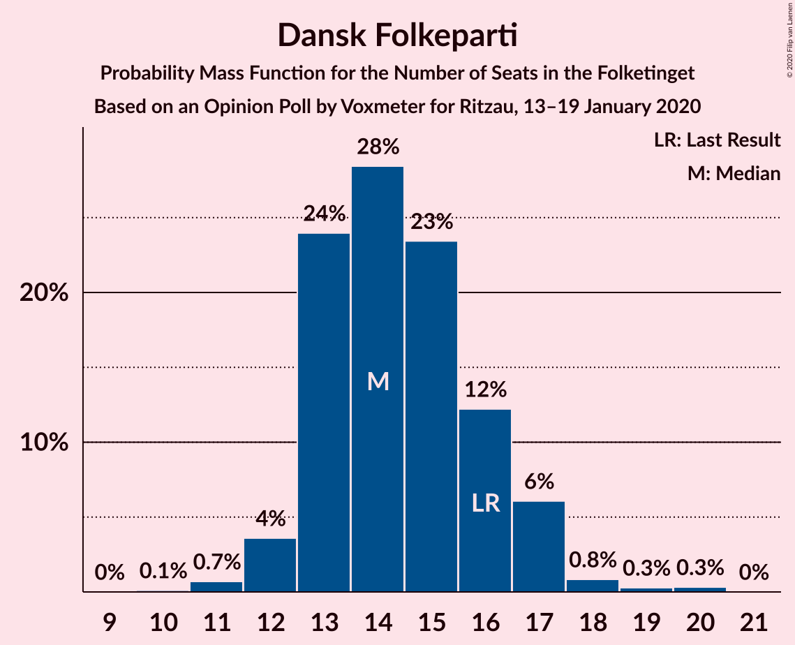
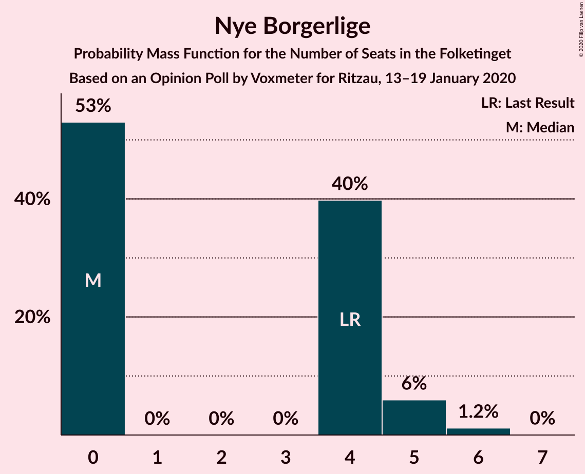
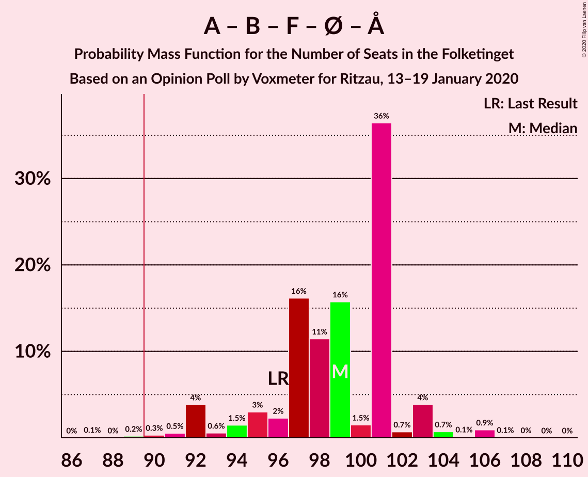
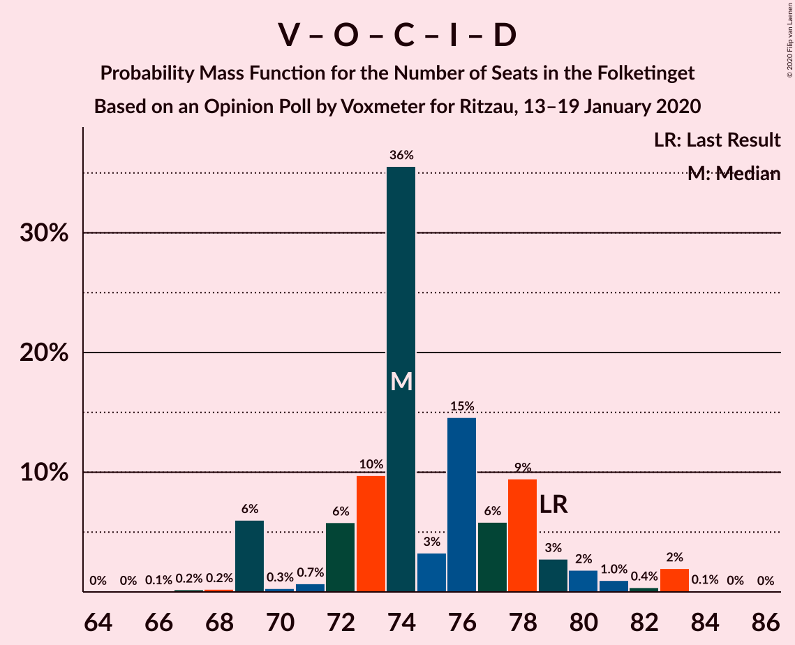

# Opinion Poll by Voxmeter for Ritzau, 13–19 January 2020

<a href="#voting-intentions">Voting Intentions</a> | <a href="#seats">Seats</a> | <a href="#coalitions">Coalitions</a> | <a href="#technical-information">Technical Information</a>

## Voting Intentions

### Confidence Intervals

| Party | Last Result | Poll Result | 80% Confidence Interval | 90% Confidence Interval | 95% Confidence Interval | 99% Confidence Interval |
|:-----:|:-----------:|:-----------:|:-----------------------:|:-----------------------:|:-----------------------:|:-----------------------:|
| Socialdemokraterne | 25.9% | 27.2% | 25.5–29.0% |25.0–29.5% |24.6–30.0% |23.8–30.9% |
| Venstre | 23.4% | 22.3% | 20.7–24.0% |20.2–24.5% |19.8–24.9% |19.1–25.8% |
| Radikale Venstre | 8.6% | 8.7% | 7.7–9.9% |7.4–10.3% |7.1–10.6% |6.6–11.2% |
| Socialistisk Folkeparti | 7.7% | 8.6% | 7.6–9.8% |7.3–10.2% |7.0–10.5% |6.6–11.1% |
| Dansk Folkeparti | 8.7% | 8.1% | 7.1–9.3% |6.8–9.6% |6.6–9.9% |6.1–10.5% |
| Det Konservative Folkeparti | 6.6% | 8.0% | 7.0–9.2% |6.7–9.5% |6.5–9.8% |6.1–10.4% |
| Enhedslisten–De Rød-Grønne | 6.9% | 7.1% | 6.2–8.3% |5.9–8.6% |5.7–8.9% |5.3–9.4% |
| Alternativet | 3.0% | 2.6% | 2.1–3.4% |1.9–3.6% |1.8–3.8% |1.6–4.2% |
| Liberal Alliance | 2.3% | 2.2% | 1.7–2.9% |1.6–3.1% |1.5–3.3% |1.3–3.7% |
| Nye Borgerlige | 2.4% | 1.8% | 1.4–2.5% |1.3–2.7% |1.2–2.9% |1.0–3.2% |
| Stram Kurs | 1.8% | 1.8% | 1.4–2.5% |1.3–2.7% |1.2–2.9% |1.0–3.2% |
| Klaus Riskær Pedersen | 0.8% | 0.6% | 0.4–1.0% |0.3–1.1% |0.3–1.3% |0.2–1.5% |

*Note:* The poll result column reflects the actual value used in the calculations. Published results may vary slightly, and in addition be rounded to fewer digits.

## Seats

### Confidence Intervals

| Party | Last Result | Median | 80% Confidence Interval | 90% Confidence Interval | 95% Confidence Interval | 99% Confidence Interval |
|:-----:|:-----------:|:------:|:-----------------------:|:-----------------------:|:-----------------------:|:-----------------------:|
| <a href="#socialdemokraterne">Socialdemokraterne</a> | 48 | 50 | 45–52 |44–54 |44–54 |42–55 |
| <a href="#venstre">Venstre</a> | 43 | 41 | 38–43 |38–44 |37–45 |33–46 |
| <a href="#radikale-venstre">Radikale Venstre</a> | 16 | 17 | 13–18 |13–19 |13–19 |12–20 |
| <a href="#socialistisk-folkeparti">Socialistisk Folkeparti</a> | 14 | 15 | 14–18 |14–19 |12–19 |12–19 |
| <a href="#dansk-folkeparti">Dansk Folkeparti</a> | 16 | 14 | 13–16 |13–17 |12–17 |11–19 |
| <a href="#det-konservative-folkeparti">Det Konservative Folkeparti</a> | 12 | 14 | 12–16 |12–17 |12–17 |11–19 |
| <a href="#enhedslisten–de-rød-grønne">Enhedslisten–De Rød-Grønne</a> | 13 | 13 | 11–16 |10–16 |10–16 |10–16 |
| <a href="#alternativet">Alternativet</a> | 5 | 5 | 4–7 |4–7 |0–7 |0–7 |
| <a href="#liberal-alliance">Liberal Alliance</a> | 4 | 4 | 0–5 |0–5 |0–6 |0–6 |
| <a href="#nye-borgerlige">Nye Borgerlige</a> | 4 | 0 | 0–4 |0–5 |0–5 |0–6 |
| <a href="#stram-kurs">Stram Kurs</a> | 0 | 0 | 0–5 |0–5 |0–5 |0–6 |
| <a href="#klaus-riskær-pedersen">Klaus Riskær Pedersen</a> | 0 | 0 | 0 |0 |0 |0 |

### Socialdemokraterne

*For a full overview of the results for this party, see the [Socialdemokraterne](party-socialdemokraterne.html) page.*

| Number of Seats | Probability | Accumulated | Special Marks |
|:---------------:|:-----------:|:-----------:|:-------------:|
| 41 | 0.1% | 100% |  |
| 42 | 0.4% | 99.9% |  |
| 43 | 0.6% | 99.4% |  |
| 44 | 5% | 98.8% |  |
| 45 | 6% | 94% |  |
| 46 | 4% | 88% |  |
| 47 | 8% | 84% |  |
| 48 | 19% | 76% | Last Result |
| 49 | 3% | 57% |  |
| 50 | 23% | 54% | Median |
| 51 | 5% | 31% |  |
| 52 | 20% | 27% |  |
| 53 | 0.2% | 7% |  |
| 54 | 5% | 6% |  |
| 55 | 0.7% | 1.0% |  |
| 56 | 0.2% | 0.4% |  |
| 57 | 0.1% | 0.2% |  |
| 58 | 0% | 0.1% |  |
| 59 | 0.1% | 0.1% |  |
| 60 | 0% | 0% |  |

### Venstre

*For a full overview of the results for this party, see the [Venstre](party-venstre.html) page.*

| Number of Seats | Probability | Accumulated | Special Marks |
|:---------------:|:-----------:|:-----------:|:-------------:|
| 32 | 0.1% | 100% |  |
| 33 | 0.5% | 99.9% |  |
| 34 | 0.1% | 99.3% |  |
| 35 | 0.5% | 99.2% |  |
| 36 | 0.8% | 98.7% |  |
| 37 | 0.6% | 98% |  |
| 38 | 17% | 97% |  |
| 39 | 13% | 80% |  |
| 40 | 5% | 67% |  |
| 41 | 34% | 62% | Median |
| 42 | 7% | 28% |  |
| 43 | 16% | 21% | Last Result |
| 44 | 1.2% | 5% |  |
| 45 | 2% | 4% |  |
| 46 | 2% | 2% |  |
| 47 | 0.1% | 0.1% |  |
| 48 | 0.1% | 0.1% |  |
| 49 | 0% | 0% |  |

### Radikale Venstre

*For a full overview of the results for this party, see the [Radikale Venstre](party-radikalevenstre.html) page.*

| Number of Seats | Probability | Accumulated | Special Marks |
|:---------------:|:-----------:|:-----------:|:-------------:|
| 11 | 0.2% | 100% |  |
| 12 | 0.6% | 99.8% |  |
| 13 | 15% | 99.2% |  |
| 14 | 17% | 84% |  |
| 15 | 4% | 67% |  |
| 16 | 11% | 62% | Last Result |
| 17 | 25% | 51% | Median |
| 18 | 19% | 27% |  |
| 19 | 6% | 8% |  |
| 20 | 1.0% | 1.3% |  |
| 21 | 0.2% | 0.3% |  |
| 22 | 0% | 0.1% |  |
| 23 | 0.1% | 0.1% |  |
| 24 | 0% | 0% |  |

### Socialistisk Folkeparti

*For a full overview of the results for this party, see the [Socialistisk Folkeparti](party-socialistiskfolkeparti.html) page.*

| Number of Seats | Probability | Accumulated | Special Marks |
|:---------------:|:-----------:|:-----------:|:-------------:|
| 11 | 0.1% | 100% |  |
| 12 | 4% | 99.9% |  |
| 13 | 1.1% | 96% |  |
| 14 | 19% | 95% | Last Result |
| 15 | 48% | 77% | Median |
| 16 | 16% | 29% |  |
| 17 | 3% | 13% |  |
| 18 | 1.1% | 10% |  |
| 19 | 9% | 9% |  |
| 20 | 0.2% | 0.4% |  |
| 21 | 0.2% | 0.2% |  |
| 22 | 0% | 0% |  |

### Dansk Folkeparti

*For a full overview of the results for this party, see the [Dansk Folkeparti](party-danskfolkeparti.html) page.*

| Number of Seats | Probability | Accumulated | Special Marks |
|:---------------:|:-----------:|:-----------:|:-------------:|
| 10 | 0.1% | 100% |  |
| 11 | 0.7% | 99.9% |  |
| 12 | 4% | 99.2% |  |
| 13 | 24% | 96% |  |
| 14 | 28% | 72% | Median |
| 15 | 23% | 43% |  |
| 16 | 12% | 20% | Last Result |
| 17 | 6% | 8% |  |
| 18 | 0.8% | 1.5% |  |
| 19 | 0.3% | 0.6% |  |
| 20 | 0.3% | 0.3% |  |
| 21 | 0% | 0% |  |

### Det Konservative Folkeparti

*For a full overview of the results for this party, see the [Det Konservative Folkeparti](party-detkonservativefolkeparti.html) page.*

| Number of Seats | Probability | Accumulated | Special Marks |
|:---------------:|:-----------:|:-----------:|:-------------:|
| 10 | 0.1% | 100% |  |
| 11 | 0.5% | 99.9% |  |
| 12 | 11% | 99.3% | Last Result |
| 13 | 23% | 88% |  |
| 14 | 16% | 65% | Median |
| 15 | 33% | 49% |  |
| 16 | 10% | 16% |  |
| 17 | 4% | 6% |  |
| 18 | 0.7% | 1.5% |  |
| 19 | 0.7% | 0.8% |  |
| 20 | 0.1% | 0.1% |  |
| 21 | 0% | 0% |  |

### Enhedslisten–De Rød-Grønne

*For a full overview of the results for this party, see the [Enhedslisten–De Rød-Grønne](party-enhedslisten–derød-grønne.html) page.*

| Number of Seats | Probability | Accumulated | Special Marks |
|:---------------:|:-----------:|:-----------:|:-------------:|
| 9 | 0.2% | 100% |  |
| 10 | 9% | 99.8% |  |
| 11 | 5% | 91% |  |
| 12 | 23% | 86% |  |
| 13 | 20% | 62% | Last Result, Median |
| 14 | 13% | 42% |  |
| 15 | 10% | 29% |  |
| 16 | 18% | 18% |  |
| 17 | 0.2% | 0.4% |  |
| 18 | 0.2% | 0.2% |  |
| 19 | 0% | 0% |  |

### Alternativet

*For a full overview of the results for this party, see the [Alternativet](party-alternativet.html) page.*

| Number of Seats | Probability | Accumulated | Special Marks |
|:---------------:|:-----------:|:-----------:|:-------------:|
| 0 | 3% | 100% |  |
| 1 | 0% | 97% |  |
| 2 | 0% | 97% |  |
| 3 | 0% | 97% |  |
| 4 | 16% | 97% |  |
| 5 | 52% | 81% | Last Result, Median |
| 6 | 13% | 29% |  |
| 7 | 16% | 16% |  |
| 8 | 0.2% | 0.2% |  |
| 9 | 0% | 0% |  |

### Liberal Alliance

*For a full overview of the results for this party, see the [Liberal Alliance](party-liberalalliance.html) page.*

| Number of Seats | Probability | Accumulated | Special Marks |
|:---------------:|:-----------:|:-----------:|:-------------:|
| 0 | 19% | 100% |  |
| 1 | 0% | 81% |  |
| 2 | 0% | 81% |  |
| 3 | 0% | 81% |  |
| 4 | 50% | 81% | Last Result, Median |
| 5 | 28% | 31% |  |
| 6 | 3% | 3% |  |
| 7 | 0.3% | 0.3% |  |
| 8 | 0% | 0% |  |

### Nye Borgerlige

*For a full overview of the results for this party, see the [Nye Borgerlige](party-nyeborgerlige.html) page.*

| Number of Seats | Probability | Accumulated | Special Marks |
|:---------------:|:-----------:|:-----------:|:-------------:|
| 0 | 53% | 100% | Median |
| 1 | 0% | 47% |  |
| 2 | 0% | 47% |  |
| 3 | 0% | 47% |  |
| 4 | 40% | 47% | Last Result |
| 5 | 6% | 7% |  |
| 6 | 1.2% | 1.2% |  |
| 7 | 0% | 0% |  |

### Stram Kurs

*For a full overview of the results for this party, see the [Stram Kurs](party-stramkurs.html) page.*

| Number of Seats | Probability | Accumulated | Special Marks |
|:---------------:|:-----------:|:-----------:|:-------------:|
| 0 | 72% | 100% | Last Result, Median |
| 1 | 0% | 28% |  |
| 2 | 0% | 28% |  |
| 3 | 0% | 28% |  |
| 4 | 17% | 28% |  |
| 5 | 10% | 10% |  |
| 6 | 0.5% | 0.5% |  |
| 7 | 0% | 0% |  |

### Klaus Riskær Pedersen

*For a full overview of the results for this party, see the [Klaus Riskær Pedersen](party-klausriskærpedersen.html) page.*

| Number of Seats | Probability | Accumulated | Special Marks |
|:---------------:|:-----------:|:-----------:|:-------------:|
| 0 | 100% | 100% | Last Result, Median |

## Coalitions

### Confidence Intervals

| Coalition | Last Result | Median | Majority? | 80% Confidence Interval | 90% Confidence Interval | 95% Confidence Interval | 99% Confidence Interval |
|:---------:|:-----------:|:------:|:---------:|:-----------------------:|:-----------------------:|:-----------------------:|:-----------------------:|
| Socialdemokraterne – Radikale Venstre – Socialistisk Folkeparti – Enhedslisten–De Rød-Grønne – Alternativet | 96 | 99 | 99.7% | 96–101 | 93–103 | 92–103 | 90–106 |
| Socialdemokraterne – Radikale Venstre – Socialistisk Folkeparti – Enhedslisten–De Rød-Grønne | 91 | 94 | 93% | 91–97 | 89–98 | 87–99 | 85–101 |
| Socialdemokraterne – Socialistisk Folkeparti – Enhedslisten–De Rød-Grønne – Alternativet | 80 | 84 | 0.4% | 79–86 | 78–88 | 77–88 | 75–89 |
| Socialdemokraterne – Radikale Venstre – Socialistisk Folkeparti | 78 | 81 | 0.3% | 77–83 | 76–84 | 76–86 | 73–88 |
| Socialdemokraterne – Socialistisk Folkeparti – Enhedslisten–De Rød-Grønne | 75 | 78 | 0% | 74–81 | 74–84 | 72–84 | 71–85 |
| Venstre – Dansk Folkeparti – Det Konservative Folkeparti – Liberal Alliance – Nye Borgerlige – Klaus Riskær Pedersen | 79 | 74 | 0% | 72–78 | 69–80 | 69–82 | 68–83 |
| Venstre – Dansk Folkeparti – Det Konservative Folkeparti – Liberal Alliance – Nye Borgerlige | 79 | 74 | 0% | 72–78 | 69–80 | 69–82 | 68–83 |
| Venstre – Dansk Folkeparti – Det Konservative Folkeparti – Liberal Alliance | 75 | 73 | 0% | 69–76 | 69–79 | 69–79 | 66–80 |
| Socialdemokraterne – Radikale Venstre | 64 | 66 | 0% | 61–68 | 58–68 | 58–70 | 58–72 |
| Venstre – Det Konservative Folkeparti – Liberal Alliance | 59 | 58 | 0% | 55–62 | 55–63 | 54–64 | 52–65 |
| Venstre – Det Konservative Folkeparti | 55 | 55 | 0% | 51–58 | 51–59 | 51–60 | 49–63 |
| Venstre | 43 | 41 | 0% | 38–43 | 38–44 | 37–45 | 33–46 |

### Socialdemokraterne – Radikale Venstre – Socialistisk Folkeparti – Enhedslisten–De Rød-Grønne – Alternativet

| Number of Seats | Probability | Accumulated | Special Marks |
|:---------------:|:-----------:|:-----------:|:-------------:|
| 87 | 0.1% | 100% |  |
| 88 | 0% | 99.9% |  |
| 89 | 0.2% | 99.9% |  |
| 90 | 0.3% | 99.7% | Majority |
| 91 | 0.5% | 99.4% |  |
| 92 | 4% | 98.9% |  |
| 93 | 0.6% | 95% |  |
| 94 | 1.5% | 94% |  |
| 95 | 3% | 93% |  |
| 96 | 2% | 90% | Last Result |
| 97 | 16% | 88% |  |
| 98 | 11% | 72% |  |
| 99 | 16% | 60% |  |
| 100 | 1.5% | 44% | Median |
| 101 | 36% | 43% |  |
| 102 | 0.7% | 6% |  |
| 103 | 4% | 6% |  |
| 104 | 0.7% | 2% |  |
| 105 | 0.1% | 1.2% |  |
| 106 | 0.9% | 1.1% |  |
| 107 | 0.1% | 0.1% |  |
| 108 | 0% | 0.1% |  |
| 109 | 0% | 0% |  |

### Socialdemokraterne – Radikale Venstre – Socialistisk Folkeparti – Enhedslisten–De Rød-Grønne

| Number of Seats | Probability | Accumulated | Special Marks |
|:---------------:|:-----------:|:-----------:|:-------------:|
| 83 | 0.1% | 100% |  |
| 84 | 0% | 99.9% |  |
| 85 | 0.5% | 99.9% |  |
| 86 | 0.1% | 99.4% |  |
| 87 | 2% | 99.3% |  |
| 88 | 2% | 97% |  |
| 89 | 2% | 95% |  |
| 90 | 2% | 93% | Majority |
| 91 | 8% | 91% | Last Result |
| 92 | 10% | 83% |  |
| 93 | 10% | 73% |  |
| 94 | 32% | 63% |  |
| 95 | 1.1% | 31% | Median |
| 96 | 17% | 30% |  |
| 97 | 8% | 13% |  |
| 98 | 2% | 5% |  |
| 99 | 1.5% | 3% |  |
| 100 | 1.1% | 2% |  |
| 101 | 0.3% | 0.6% |  |
| 102 | 0.1% | 0.4% |  |
| 103 | 0.1% | 0.3% |  |
| 104 | 0.2% | 0.2% |  |
| 105 | 0% | 0% |  |

### Socialdemokraterne – Socialistisk Folkeparti – Enhedslisten–De Rød-Grønne – Alternativet

| Number of Seats | Probability | Accumulated | Special Marks |
|:---------------:|:-----------:|:-----------:|:-------------:|
| 73 | 0.2% | 100% |  |
| 74 | 0.2% | 99.7% |  |
| 75 | 0.3% | 99.5% |  |
| 76 | 0.8% | 99.3% |  |
| 77 | 1.5% | 98% |  |
| 78 | 3% | 97% |  |
| 79 | 9% | 94% |  |
| 80 | 7% | 84% | Last Result |
| 81 | 2% | 77% |  |
| 82 | 10% | 75% |  |
| 83 | 15% | 65% | Median |
| 84 | 25% | 50% |  |
| 85 | 15% | 26% |  |
| 86 | 1.3% | 11% |  |
| 87 | 2% | 9% |  |
| 88 | 6% | 7% |  |
| 89 | 0.3% | 0.6% |  |
| 90 | 0.2% | 0.4% | Majority |
| 91 | 0.1% | 0.1% |  |
| 92 | 0% | 0.1% |  |
| 93 | 0% | 0% |  |

### Socialdemokraterne – Radikale Venstre – Socialistisk Folkeparti

| Number of Seats | Probability | Accumulated | Special Marks |
|:---------------:|:-----------:|:-----------:|:-------------:|
| 70 | 0% | 100% |  |
| 71 | 0.3% | 99.9% |  |
| 72 | 0.1% | 99.7% |  |
| 73 | 0.1% | 99.6% |  |
| 74 | 0.4% | 99.4% |  |
| 75 | 0.6% | 99.1% |  |
| 76 | 4% | 98% |  |
| 77 | 12% | 94% |  |
| 78 | 4% | 82% | Last Result |
| 79 | 5% | 78% |  |
| 80 | 17% | 73% |  |
| 81 | 18% | 56% |  |
| 82 | 19% | 38% | Median |
| 83 | 12% | 19% |  |
| 84 | 3% | 7% |  |
| 85 | 0.7% | 4% |  |
| 86 | 3% | 4% |  |
| 87 | 0.3% | 0.9% |  |
| 88 | 0.2% | 0.6% |  |
| 89 | 0.1% | 0.4% |  |
| 90 | 0.1% | 0.3% | Majority |
| 91 | 0.2% | 0.2% |  |
| 92 | 0% | 0% |  |

### Socialdemokraterne – Socialistisk Folkeparti – Enhedslisten–De Rød-Grønne

| Number of Seats | Probability | Accumulated | Special Marks |
|:---------------:|:-----------:|:-----------:|:-------------:|
| 69 | 0.2% | 100% |  |
| 70 | 0.3% | 99.8% |  |
| 71 | 0.9% | 99.5% |  |
| 72 | 2% | 98.6% |  |
| 73 | 0.3% | 97% |  |
| 74 | 8% | 97% |  |
| 75 | 10% | 88% | Last Result |
| 76 | 16% | 78% |  |
| 77 | 9% | 62% |  |
| 78 | 4% | 53% | Median |
| 79 | 23% | 49% |  |
| 80 | 14% | 26% |  |
| 81 | 5% | 12% |  |
| 82 | 0.6% | 7% |  |
| 83 | 0.4% | 7% |  |
| 84 | 6% | 6% |  |
| 85 | 0.3% | 0.5% |  |
| 86 | 0.1% | 0.2% |  |
| 87 | 0% | 0.1% |  |
| 88 | 0% | 0.1% |  |
| 89 | 0% | 0.1% |  |
| 90 | 0% | 0% | Majority |

### Venstre – Dansk Folkeparti – Det Konservative Folkeparti – Liberal Alliance – Nye Borgerlige – Klaus Riskær Pedersen

| Number of Seats | Probability | Accumulated | Special Marks |
|:---------------:|:-----------:|:-----------:|:-------------:|
| 65 | 0% | 100% |  |
| 66 | 0.1% | 99.9% |  |
| 67 | 0.2% | 99.9% |  |
| 68 | 0.2% | 99.7% |  |
| 69 | 6% | 99.4% |  |
| 70 | 0.3% | 93% |  |
| 71 | 0.7% | 93% |  |
| 72 | 6% | 92% |  |
| 73 | 10% | 87% | Median |
| 74 | 36% | 77% |  |
| 75 | 3% | 41% |  |
| 76 | 15% | 38% |  |
| 77 | 6% | 23% |  |
| 78 | 9% | 18% |  |
| 79 | 3% | 8% | Last Result |
| 80 | 2% | 5% |  |
| 81 | 1.0% | 3% |  |
| 82 | 0.4% | 3% |  |
| 83 | 2% | 2% |  |
| 84 | 0.1% | 0.1% |  |
| 85 | 0% | 0% |  |

### Venstre – Dansk Folkeparti – Det Konservative Folkeparti – Liberal Alliance – Nye Borgerlige

| Number of Seats | Probability | Accumulated | Special Marks |
|:---------------:|:-----------:|:-----------:|:-------------:|
| 65 | 0% | 100% |  |
| 66 | 0.1% | 99.9% |  |
| 67 | 0.2% | 99.9% |  |
| 68 | 0.2% | 99.7% |  |
| 69 | 6% | 99.4% |  |
| 70 | 0.3% | 93% |  |
| 71 | 0.7% | 93% |  |
| 72 | 6% | 92% |  |
| 73 | 10% | 87% | Median |
| 74 | 36% | 77% |  |
| 75 | 3% | 41% |  |
| 76 | 15% | 38% |  |
| 77 | 6% | 23% |  |
| 78 | 9% | 18% |  |
| 79 | 3% | 8% | Last Result |
| 80 | 2% | 5% |  |
| 81 | 1.0% | 3% |  |
| 82 | 0.4% | 3% |  |
| 83 | 2% | 2% |  |
| 84 | 0.1% | 0.1% |  |
| 85 | 0% | 0% |  |

### Venstre – Dansk Folkeparti – Det Konservative Folkeparti – Liberal Alliance

| Number of Seats | Probability | Accumulated | Special Marks |
|:---------------:|:-----------:|:-----------:|:-------------:|
| 64 | 0.1% | 100% |  |
| 65 | 0.1% | 99.9% |  |
| 66 | 0.6% | 99.8% |  |
| 67 | 0.3% | 99.2% |  |
| 68 | 1.1% | 98.9% |  |
| 69 | 15% | 98% |  |
| 70 | 17% | 83% |  |
| 71 | 1.5% | 66% |  |
| 72 | 6% | 64% |  |
| 73 | 8% | 58% | Median |
| 74 | 24% | 50% |  |
| 75 | 4% | 26% | Last Result |
| 76 | 15% | 22% |  |
| 77 | 0.5% | 8% |  |
| 78 | 2% | 7% |  |
| 79 | 4% | 5% |  |
| 80 | 0.6% | 0.9% |  |
| 81 | 0.2% | 0.4% |  |
| 82 | 0.1% | 0.1% |  |
| 83 | 0.1% | 0.1% |  |
| 84 | 0% | 0% |  |

### Socialdemokraterne – Radikale Venstre

| Number of Seats | Probability | Accumulated | Special Marks |
|:---------------:|:-----------:|:-----------:|:-------------:|
| 55 | 0.1% | 100% |  |
| 56 | 0.1% | 99.9% |  |
| 57 | 0.3% | 99.9% |  |
| 58 | 6% | 99.5% |  |
| 59 | 0.3% | 94% |  |
| 60 | 3% | 93% |  |
| 61 | 5% | 90% |  |
| 62 | 2% | 86% |  |
| 63 | 5% | 84% |  |
| 64 | 6% | 79% | Last Result |
| 65 | 19% | 73% |  |
| 66 | 18% | 54% |  |
| 67 | 12% | 36% | Median |
| 68 | 21% | 24% |  |
| 69 | 0.4% | 3% |  |
| 70 | 1.1% | 3% |  |
| 71 | 0.9% | 2% |  |
| 72 | 0.6% | 1.0% |  |
| 73 | 0.3% | 0.4% |  |
| 74 | 0.1% | 0.2% |  |
| 75 | 0% | 0% |  |

### Venstre – Det Konservative Folkeparti – Liberal Alliance

| Number of Seats | Probability | Accumulated | Special Marks |
|:---------------:|:-----------:|:-----------:|:-------------:|
| 49 | 0% | 100% |  |
| 50 | 0% | 99.9% |  |
| 51 | 0.3% | 99.9% |  |
| 52 | 0.8% | 99.6% |  |
| 53 | 0.8% | 98.7% |  |
| 54 | 0.9% | 98% |  |
| 55 | 26% | 97% |  |
| 56 | 7% | 71% |  |
| 57 | 6% | 65% |  |
| 58 | 9% | 59% |  |
| 59 | 10% | 50% | Last Result, Median |
| 60 | 2% | 40% |  |
| 61 | 16% | 37% |  |
| 62 | 16% | 22% |  |
| 63 | 1.0% | 6% |  |
| 64 | 4% | 5% |  |
| 65 | 0.4% | 0.7% |  |
| 66 | 0.3% | 0.3% |  |
| 67 | 0% | 0.1% |  |
| 68 | 0% | 0% |  |

### Venstre – Det Konservative Folkeparti

| Number of Seats | Probability | Accumulated | Special Marks |
|:---------------:|:-----------:|:-----------:|:-------------:|
| 46 | 0.1% | 100% |  |
| 47 | 0.1% | 99.9% |  |
| 48 | 0.2% | 99.8% |  |
| 49 | 0.8% | 99.6% |  |
| 50 | 0.4% | 98.8% |  |
| 51 | 22% | 98% |  |
| 52 | 2% | 76% |  |
| 53 | 5% | 74% |  |
| 54 | 9% | 70% |  |
| 55 | 16% | 60% | Last Result, Median |
| 56 | 16% | 44% |  |
| 57 | 5% | 28% |  |
| 58 | 15% | 23% |  |
| 59 | 4% | 8% |  |
| 60 | 2% | 4% |  |
| 61 | 0.6% | 2% |  |
| 62 | 0.7% | 1.3% |  |
| 63 | 0.4% | 0.5% |  |
| 64 | 0% | 0.1% |  |
| 65 | 0% | 0.1% |  |
| 66 | 0% | 0% |  |

### Venstre

| Number of Seats | Probability | Accumulated | Special Marks |
|:---------------:|:-----------:|:-----------:|:-------------:|
| 32 | 0.1% | 100% |  |
| 33 | 0.5% | 99.9% |  |
| 34 | 0.1% | 99.3% |  |
| 35 | 0.5% | 99.2% |  |
| 36 | 0.8% | 98.7% |  |
| 37 | 0.6% | 98% |  |
| 38 | 17% | 97% |  |
| 39 | 13% | 80% |  |
| 40 | 5% | 67% |  |
| 41 | 34% | 62% | Median |
| 42 | 7% | 28% |  |
| 43 | 16% | 21% | Last Result |
| 44 | 1.2% | 5% |  |
| 45 | 2% | 4% |  |
| 46 | 2% | 2% |  |
| 47 | 0.1% | 0.1% |  |
| 48 | 0.1% | 0.1% |  |
| 49 | 0% | 0% |  |

## Technical Information

### Opinion Poll

+ **Polling firm:** Voxmeter
+ **Commissioner(s):** Ritzau
+ **Fieldwork period:** 13–19 January 2020

### Calculations

+ **Sample size:** 1037
+ **Simulations done:** 1,048,576
+ **Error estimate:** 2.82%

