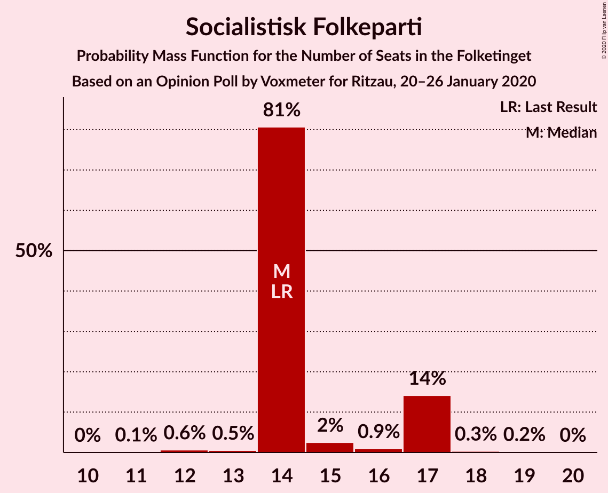
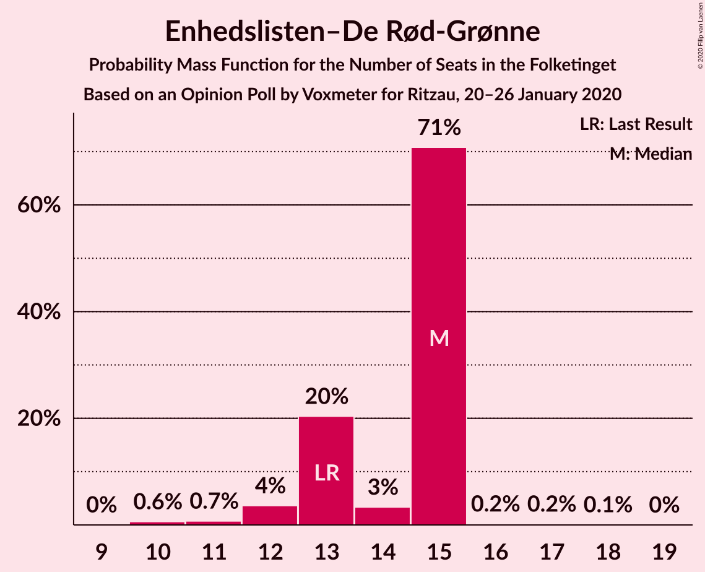
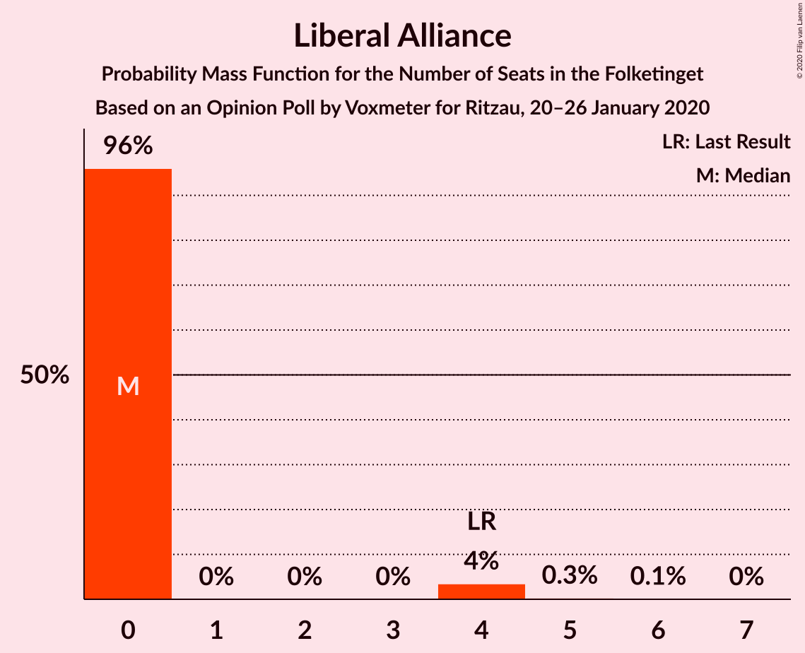
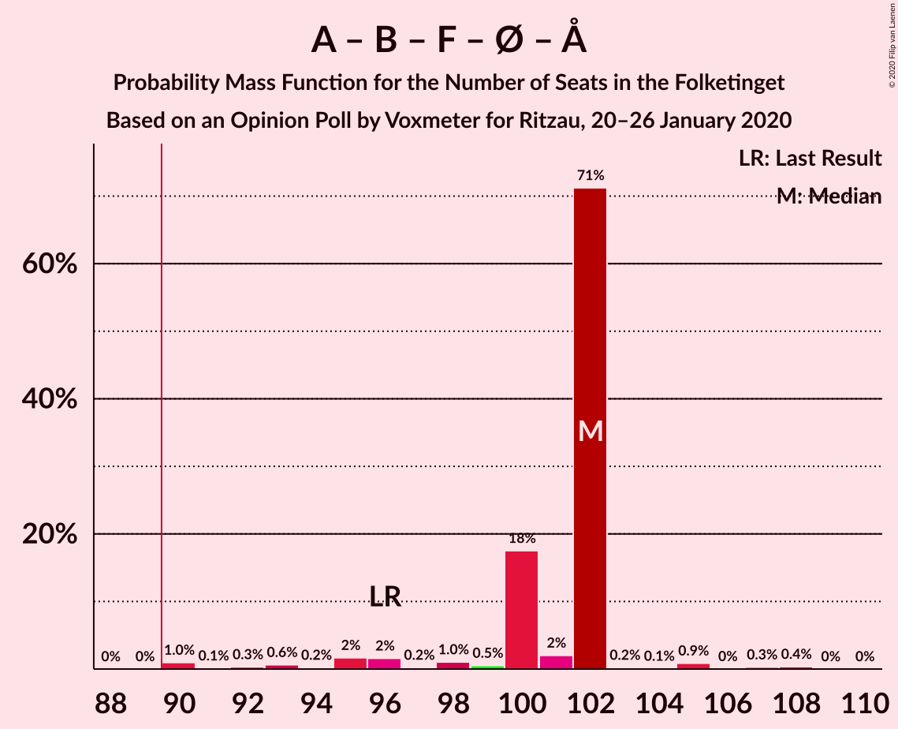
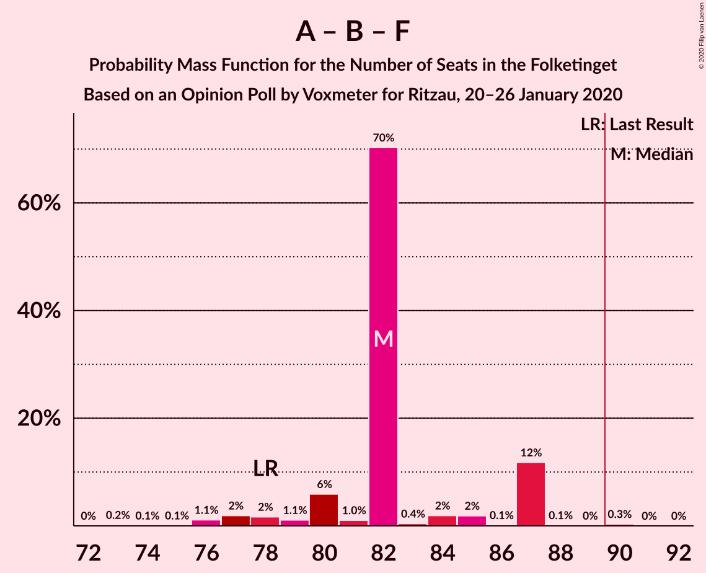
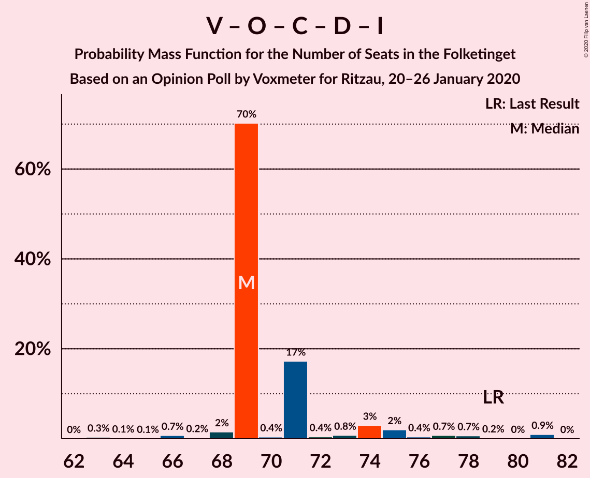
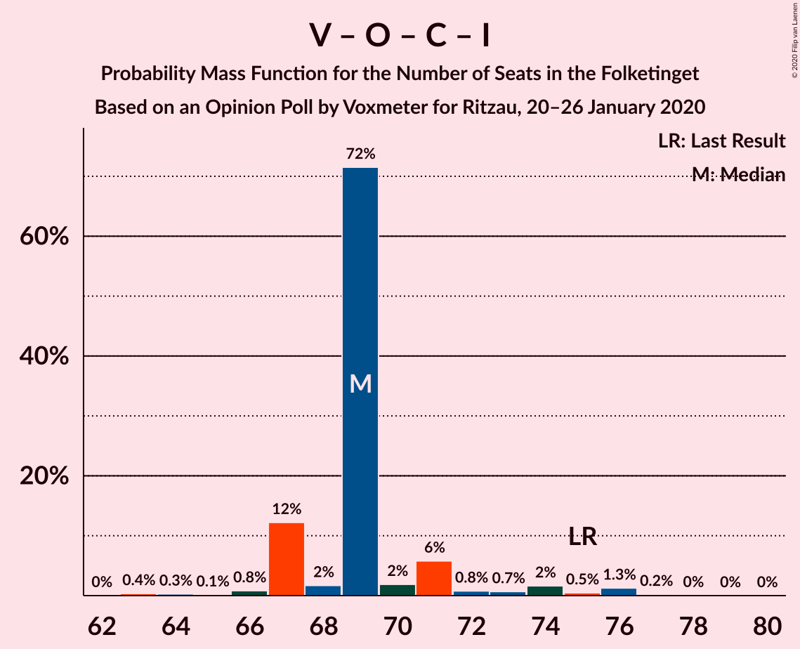

# Opinion Poll by Voxmeter for Ritzau, 20–26 January 2020

<a href="#voting-intentions">Voting Intentions</a> | <a href="#seats">Seats</a> | <a href="#coalitions">Coalitions</a> | <a href="#technical-information">Technical Information</a>

## Voting Intentions

### Confidence Intervals

| Party | Last Result | Poll Result | 80% Confidence Interval | 90% Confidence Interval | 95% Confidence Interval | 99% Confidence Interval |
|:-----:|:-----------:|:-----------:|:-----------------------:|:-----------------------:|:-----------------------:|:-----------------------:|
| Socialdemokraterne | 25.9% | 27.8% | 26.1–29.7% |25.6–30.2% |25.2–30.7% |24.4–31.6% |
| Venstre | 23.4% | 22.6% | 21.0–24.3% |20.5–24.8% |20.1–25.3% |19.4–26.1% |
| Radikale Venstre | 8.6% | 9.0% | 7.9–10.2% |7.6–10.6% |7.4–10.9% |6.9–11.5% |
| Socialistisk Folkeparti | 7.7% | 8.1% | 7.1–9.3% |6.8–9.6% |6.6–9.9% |6.1–10.5% |
| Dansk Folkeparti | 8.7% | 8.0% | 7.0–9.2% |6.7–9.5% |6.5–9.8% |6.0–10.4% |
| Det Konservative Folkeparti | 6.6% | 7.5% | 6.5–8.7% |6.3–9.0% |6.0–9.3% |5.6–9.9% |
| Enhedslisten–De Rød-Grønne | 6.9% | 7.3% | 6.4–8.5% |6.1–8.8% |5.9–9.1% |5.4–9.6% |
| Alternativet | 3.0% | 2.6% | 2.1–3.4% |1.9–3.6% |1.8–3.8% |1.6–4.2% |
| Stram Kurs | 1.8% | 2.3% | 1.8–3.1% |1.7–3.3% |1.6–3.5% |1.4–3.8% |
| Nye Borgerlige | 2.4% | 2.0% | 1.6–2.7% |1.4–2.9% |1.3–3.1% |1.1–3.5% |
| Liberal Alliance | 2.3% | 1.7% | 1.2–2.3% |1.1–2.5% |1.0–2.6% |0.9–3.0% |
| Klaus Riskær Pedersen | 0.8% | 0.1% | 0.0–0.4% |0.0–0.5% |0.0–0.5% |0.0–0.7% |

*Note:* The poll result column reflects the actual value used in the calculations. Published results may vary slightly, and in addition be rounded to fewer digits.

## Seats

### Confidence Intervals

| Party | Last Result | Median | 80% Confidence Interval | 90% Confidence Interval | 95% Confidence Interval | 99% Confidence Interval |
|:-----:|:-----------:|:------:|:-----------------------:|:-----------------------:|:-----------------------:|:-----------------------:|
| <a href="#socialdemokraterne">Socialdemokraterne</a> | 48 | 54 | 52–54 |50–55 |46–56 |44–56 |
| <a href="#venstre">Venstre</a> | 43 | 43 | 39–44 |38–44 |36–44 |36–45 |
| <a href="#radikale-venstre">Radikale Venstre</a> | 16 | 16 | 15–17 |15–18 |14–18 |13–19 |
| <a href="#socialistisk-folkeparti">Socialistisk Folkeparti</a> | 14 | 15 | 13–15 |12–15 |12–19 |11–20 |
| <a href="#dansk-folkeparti">Dansk Folkeparti</a> | 16 | 15 | 14–15 |13–16 |11–16 |11–21 |
| <a href="#det-konservative-folkeparti">Det Konservative Folkeparti</a> | 12 | 10 | 10–15 |10–16 |10–16 |10–17 |
| <a href="#enhedslisten–de-rød-grønne">Enhedslisten–De Rød-Grønne</a> | 13 | 12 | 10–13 |10–15 |10–17 |10–17 |
| <a href="#alternativet">Alternativet</a> | 5 | 5 | 5 |0–6 |0–6 |0–7 |
| <a href="#stram-kurs">Stram Kurs</a> | 0 | 5 | 0–5 |0–5 |0–6 |0–7 |
| <a href="#nye-borgerlige">Nye Borgerlige</a> | 4 | 0 | 0–4 |0–5 |0–6 |0–6 |
| <a href="#liberal-alliance">Liberal Alliance</a> | 4 | 0 | 0 |0–4 |0–5 |0–5 |
| <a href="#klaus-riskær-pedersen">Klaus Riskær Pedersen</a> | 0 | 0 | 0 |0 |0 |0 |

### Socialdemokraterne

*For a full overview of the results for this party, see the [Socialdemokraterne](party-socialdemokraterne.html) page.*

| Number of Seats | Probability | Accumulated | Special Marks |
|:---------------:|:-----------:|:-----------:|:-------------:|
| 42 | 0% | 100% |  |
| 43 | 0.1% | 99.9% |  |
| 44 | 0.6% | 99.8% |  |
| 45 | 2% | 99.3% |  |
| 46 | 0.1% | 98% |  |
| 47 | 1.0% | 97% |  |
| 48 | 0.7% | 96% | Last Result |
| 49 | 0.4% | 96% |  |
| 50 | 2% | 95% |  |
| 51 | 3% | 94% |  |
| 52 | 26% | 91% |  |
| 53 | 0.6% | 64% |  |
| 54 | 56% | 64% | Median |
| 55 | 4% | 8% |  |
| 56 | 3% | 3% |  |
| 57 | 0% | 0.1% |  |
| 58 | 0.1% | 0.1% |  |
| 59 | 0% | 0% |  |

### Venstre

*For a full overview of the results for this party, see the [Venstre](party-venstre.html) page.*

| Number of Seats | Probability | Accumulated | Special Marks |
|:---------------:|:-----------:|:-----------:|:-------------:|
| 33 | 0.1% | 100% |  |
| 34 | 0.3% | 99.9% |  |
| 35 | 0.1% | 99.6% |  |
| 36 | 3% | 99.6% |  |
| 37 | 0.7% | 96% |  |
| 38 | 0.8% | 96% |  |
| 39 | 6% | 95% |  |
| 40 | 4% | 89% |  |
| 41 | 6% | 85% |  |
| 42 | 1.0% | 80% |  |
| 43 | 53% | 79% | Last Result, Median |
| 44 | 25% | 26% |  |
| 45 | 0.7% | 1.1% |  |
| 46 | 0.2% | 0.5% |  |
| 47 | 0% | 0.3% |  |
| 48 | 0.3% | 0.3% |  |
| 49 | 0% | 0% |  |

### Radikale Venstre

*For a full overview of the results for this party, see the [Radikale Venstre](party-radikalevenstre.html) page.*

| Number of Seats | Probability | Accumulated | Special Marks |
|:---------------:|:-----------:|:-----------:|:-------------:|
| 12 | 0.4% | 100% |  |
| 13 | 2% | 99.5% |  |
| 14 | 1.1% | 98% |  |
| 15 | 28% | 97% |  |
| 16 | 57% | 69% | Last Result, Median |
| 17 | 4% | 12% |  |
| 18 | 7% | 9% |  |
| 19 | 2% | 2% |  |
| 20 | 0.2% | 0.3% |  |
| 21 | 0% | 0.1% |  |
| 22 | 0% | 0% |  |

### Socialistisk Folkeparti

*For a full overview of the results for this party, see the [Socialistisk Folkeparti](party-socialistiskfolkeparti.html) page.*

| Number of Seats | Probability | Accumulated | Special Marks |
|:---------------:|:-----------:|:-----------:|:-------------:|
| 11 | 0.7% | 100% |  |
| 12 | 9% | 99.2% |  |
| 13 | 7% | 90% |  |
| 14 | 25% | 84% | Last Result |
| 15 | 54% | 59% | Median |
| 16 | 0.8% | 5% |  |
| 17 | 0.3% | 4% |  |
| 18 | 0.5% | 4% |  |
| 19 | 2% | 3% |  |
| 20 | 1.4% | 1.4% |  |
| 21 | 0% | 0% |  |

### Dansk Folkeparti

*For a full overview of the results for this party, see the [Dansk Folkeparti](party-danskfolkeparti.html) page.*

| Number of Seats | Probability | Accumulated | Special Marks |
|:---------------:|:-----------:|:-----------:|:-------------:|
| 9 | 0.1% | 100% |  |
| 10 | 0.2% | 99.9% |  |
| 11 | 4% | 99.7% |  |
| 12 | 0.5% | 96% |  |
| 13 | 2% | 95% |  |
| 14 | 7% | 93% |  |
| 15 | 81% | 86% | Median |
| 16 | 3% | 5% | Last Result |
| 17 | 0.2% | 2% |  |
| 18 | 0.6% | 2% |  |
| 19 | 0.1% | 1.0% |  |
| 20 | 0.3% | 0.9% |  |
| 21 | 0.6% | 0.6% |  |
| 22 | 0% | 0% |  |

### Det Konservative Folkeparti

*For a full overview of the results for this party, see the [Det Konservative Folkeparti](party-detkonservativefolkeparti.html) page.*

| Number of Seats | Probability | Accumulated | Special Marks |
|:---------------:|:-----------:|:-----------:|:-------------:|
| 9 | 0.1% | 100% |  |
| 10 | 55% | 99.9% | Median |
| 11 | 0.2% | 45% |  |
| 12 | 1.3% | 44% | Last Result |
| 13 | 1.3% | 43% |  |
| 14 | 6% | 42% |  |
| 15 | 30% | 36% |  |
| 16 | 5% | 5% |  |
| 17 | 0% | 0.5% |  |
| 18 | 0.1% | 0.5% |  |
| 19 | 0.4% | 0.4% |  |
| 20 | 0% | 0% |  |

### Enhedslisten–De Rød-Grønne

*For a full overview of the results for this party, see the [Enhedslisten–De Rød-Grønne](party-enhedslisten–derød-grønne.html) page.*

| Number of Seats | Probability | Accumulated | Special Marks |
|:---------------:|:-----------:|:-----------:|:-------------:|
| 9 | 0.1% | 100% |  |
| 10 | 28% | 99.9% |  |
| 11 | 1.2% | 72% |  |
| 12 | 56% | 71% | Median |
| 13 | 6% | 15% | Last Result |
| 14 | 2% | 9% |  |
| 15 | 4% | 8% |  |
| 16 | 0.8% | 4% |  |
| 17 | 3% | 3% |  |
| 18 | 0.1% | 0.2% |  |
| 19 | 0.1% | 0.1% |  |
| 20 | 0% | 0% |  |

### Alternativet

*For a full overview of the results for this party, see the [Alternativet](party-alternativet.html) page.*

| Number of Seats | Probability | Accumulated | Special Marks |
|:---------------:|:-----------:|:-----------:|:-------------:|
| 0 | 6% | 100% |  |
| 1 | 0% | 94% |  |
| 2 | 0% | 94% |  |
| 3 | 0.3% | 94% |  |
| 4 | 3% | 94% |  |
| 5 | 84% | 91% | Last Result, Median |
| 6 | 5% | 7% |  |
| 7 | 2% | 2% |  |
| 8 | 0.3% | 0.3% |  |
| 9 | 0% | 0% |  |

### Stram Kurs

*For a full overview of the results for this party, see the [Stram Kurs](party-stramkurs.html) page.*

| Number of Seats | Probability | Accumulated | Special Marks |
|:---------------:|:-----------:|:-----------:|:-------------:|
| 0 | 11% | 100% | Last Result |
| 1 | 0% | 89% |  |
| 2 | 0% | 89% |  |
| 3 | 0% | 89% |  |
| 4 | 4% | 89% |  |
| 5 | 81% | 85% | Median |
| 6 | 3% | 4% |  |
| 7 | 0.5% | 0.6% |  |
| 8 | 0.1% | 0.1% |  |
| 9 | 0% | 0% |  |

### Nye Borgerlige

*For a full overview of the results for this party, see the [Nye Borgerlige](party-nyeborgerlige.html) page.*

| Number of Seats | Probability | Accumulated | Special Marks |
|:---------------:|:-----------:|:-----------:|:-------------:|
| 0 | 84% | 100% | Median |
| 1 | 0% | 16% |  |
| 2 | 0% | 16% |  |
| 3 | 0% | 16% |  |
| 4 | 6% | 16% | Last Result |
| 5 | 7% | 10% |  |
| 6 | 3% | 3% |  |
| 7 | 0.1% | 0.1% |  |
| 8 | 0% | 0% |  |

### Liberal Alliance

*For a full overview of the results for this party, see the [Liberal Alliance](party-liberalalliance.html) page.*

| Number of Seats | Probability | Accumulated | Special Marks |
|:---------------:|:-----------:|:-----------:|:-------------:|
| 0 | 93% | 100% | Median |
| 1 | 0% | 7% |  |
| 2 | 0% | 7% |  |
| 3 | 0% | 7% |  |
| 4 | 4% | 7% | Last Result |
| 5 | 2% | 3% |  |
| 6 | 0.2% | 0.2% |  |
| 7 | 0% | 0% |  |

### Klaus Riskær Pedersen

*For a full overview of the results for this party, see the [Klaus Riskær Pedersen](party-klausriskærpedersen.html) page.*

| Number of Seats | Probability | Accumulated | Special Marks |
|:---------------:|:-----------:|:-----------:|:-------------:|
| 0 | 100% | 100% | Last Result, Median |

## Coalitions

### Confidence Intervals

| Coalition | Last Result | Median | Majority? | 80% Confidence Interval | 90% Confidence Interval | 95% Confidence Interval | 99% Confidence Interval |
|:---------:|:-----------:|:------:|:---------:|:-----------------------:|:-----------------------:|:-----------------------:|:-----------------------:|
| Socialdemokraterne – Radikale Venstre – Socialistisk Folkeparti – Enhedslisten–De Rød-Grønne – Alternativet | 96 | 102 | 100% | 96–102 | 96–104 | 93–105 | 91–105 |
| Socialdemokraterne – Radikale Venstre – Socialistisk Folkeparti – Enhedslisten–De Rød-Grønne | 91 | 97 | 97% | 91–98 | 91–99 | 87–100 | 86–100 |
| Socialdemokraterne – Socialistisk Folkeparti – Enhedslisten–De Rød-Grønne – Alternativet | 80 | 86 | 2% | 81–86 | 81–87 | 77–87 | 75–91 |
| Socialdemokraterne – Radikale Venstre – Socialistisk Folkeparti | 78 | 85 | 0% | 81–85 | 79–85 | 75–87 | 73–89 |
| Socialdemokraterne – Socialistisk Folkeparti – Enhedslisten–De Rød-Grønne | 75 | 81 | 0% | 76–81 | 76–82 | 71–84 | 70–84 |
| Venstre – Dansk Folkeparti – Det Konservative Folkeparti – Nye Borgerlige – Liberal Alliance – Klaus Riskær Pedersen | 79 | 68 | 0% | 68–75 | 68–77 | 66–78 | 64–80 |
| Venstre – Dansk Folkeparti – Det Konservative Folkeparti – Nye Borgerlige – Liberal Alliance | 79 | 68 | 0% | 68–75 | 68–77 | 66–78 | 64–80 |
| Venstre – Dansk Folkeparti – Det Konservative Folkeparti – Liberal Alliance | 75 | 68 | 0% | 67–74 | 65–74 | 64–76 | 60–76 |
| Socialdemokraterne – Radikale Venstre | 64 | 70 | 0% | 67–70 | 66–72 | 61–73 | 60–73 |
| Venstre – Det Konservative Folkeparti – Liberal Alliance | 59 | 53 | 0% | 53–59 | 51–61 | 50–61 | 49–61 |
| Venstre – Det Konservative Folkeparti | 55 | 53 | 0% | 53–59 | 51–59 | 50–59 | 48–61 |
| Venstre | 43 | 43 | 0% | 39–44 | 38–44 | 36–44 | 36–45 |

### Socialdemokraterne – Radikale Venstre – Socialistisk Folkeparti – Enhedslisten–De Rød-Grønne – Alternativet

| Number of Seats | Probability | Accumulated | Special Marks |
|:---------------:|:-----------:|:-----------:|:-------------:|
| 90 | 0.1% | 100% | Majority |
| 91 | 2% | 99.9% |  |
| 92 | 0.3% | 98% |  |
| 93 | 0.5% | 98% |  |
| 94 | 0.6% | 97% |  |
| 95 | 0.1% | 97% |  |
| 96 | 25% | 96% | Last Result |
| 97 | 0.2% | 71% |  |
| 98 | 3% | 71% |  |
| 99 | 4% | 68% |  |
| 100 | 3% | 64% |  |
| 101 | 0.6% | 62% |  |
| 102 | 54% | 61% | Median |
| 103 | 0.2% | 7% |  |
| 104 | 2% | 7% |  |
| 105 | 4% | 5% |  |
| 106 | 0% | 0.3% |  |
| 107 | 0.3% | 0.3% |  |
| 108 | 0% | 0% |  |

### Socialdemokraterne – Radikale Venstre – Socialistisk Folkeparti – Enhedslisten–De Rød-Grønne

| Number of Seats | Probability | Accumulated | Special Marks |
|:---------------:|:-----------:|:-----------:|:-------------:|
| 83 | 0.1% | 100% |  |
| 84 | 0% | 99.9% |  |
| 85 | 0% | 99.8% |  |
| 86 | 2% | 99.8% |  |
| 87 | 0.8% | 98% |  |
| 88 | 0.2% | 97% |  |
| 89 | 0.3% | 97% |  |
| 90 | 0.6% | 97% | Majority |
| 91 | 25% | 96% | Last Result |
| 92 | 0.7% | 72% |  |
| 93 | 0.2% | 71% |  |
| 94 | 3% | 71% |  |
| 95 | 0.8% | 68% |  |
| 96 | 0.9% | 67% |  |
| 97 | 55% | 66% | Median |
| 98 | 4% | 12% |  |
| 99 | 4% | 8% |  |
| 100 | 3% | 4% |  |
| 101 | 0.2% | 0.3% |  |
| 102 | 0% | 0.1% |  |
| 103 | 0% | 0.1% |  |
| 104 | 0% | 0.1% |  |
| 105 | 0% | 0% |  |

### Socialdemokraterne – Socialistisk Folkeparti – Enhedslisten–De Rød-Grønne – Alternativet

| Number of Seats | Probability | Accumulated | Special Marks |
|:---------------:|:-----------:|:-----------:|:-------------:|
| 74 | 0% | 100% |  |
| 75 | 2% | 99.9% |  |
| 76 | 0% | 98% |  |
| 77 | 0.7% | 98% |  |
| 78 | 0.6% | 97% |  |
| 79 | 0.1% | 96% |  |
| 80 | 1.1% | 96% | Last Result |
| 81 | 27% | 95% |  |
| 82 | 2% | 68% |  |
| 83 | 0.6% | 66% |  |
| 84 | 4% | 65% |  |
| 85 | 0.9% | 61% |  |
| 86 | 55% | 60% | Median |
| 87 | 3% | 6% |  |
| 88 | 0.1% | 2% |  |
| 89 | 0.4% | 2% |  |
| 90 | 0.3% | 2% | Majority |
| 91 | 2% | 2% |  |
| 92 | 0% | 0% |  |

### Socialdemokraterne – Radikale Venstre – Socialistisk Folkeparti

| Number of Seats | Probability | Accumulated | Special Marks |
|:---------------:|:-----------:|:-----------:|:-------------:|
| 71 | 0.1% | 100% |  |
| 72 | 0% | 99.9% |  |
| 73 | 2% | 99.8% |  |
| 74 | 0.4% | 98% |  |
| 75 | 0.5% | 98% |  |
| 76 | 0.5% | 97% |  |
| 77 | 0.2% | 97% |  |
| 78 | 0.8% | 97% | Last Result |
| 79 | 1.1% | 96% |  |
| 80 | 0.3% | 95% |  |
| 81 | 24% | 94% |  |
| 82 | 5% | 70% |  |
| 83 | 2% | 65% |  |
| 84 | 0.1% | 63% |  |
| 85 | 59% | 63% | Median |
| 86 | 0.6% | 4% |  |
| 87 | 2% | 3% |  |
| 88 | 0.1% | 2% |  |
| 89 | 1.4% | 1.5% |  |
| 90 | 0% | 0% | Majority |

### Socialdemokraterne – Socialistisk Folkeparti – Enhedslisten–De Rød-Grønne

| Number of Seats | Probability | Accumulated | Special Marks |
|:---------------:|:-----------:|:-----------:|:-------------:|
| 68 | 0% | 100% |  |
| 69 | 0.2% | 99.9% |  |
| 70 | 2% | 99.8% |  |
| 71 | 0.7% | 98% |  |
| 72 | 0.5% | 97% |  |
| 73 | 0.2% | 97% |  |
| 74 | 0.5% | 97% |  |
| 75 | 0.2% | 96% | Last Result |
| 76 | 27% | 96% |  |
| 77 | 0.2% | 69% |  |
| 78 | 0.3% | 69% |  |
| 79 | 1.4% | 68% |  |
| 80 | 2% | 67% |  |
| 81 | 56% | 65% | Median |
| 82 | 4% | 9% |  |
| 83 | 0.2% | 5% |  |
| 84 | 4% | 5% |  |
| 85 | 0.2% | 0.4% |  |
| 86 | 0.2% | 0.3% |  |
| 87 | 0% | 0% |  |

### Venstre – Dansk Folkeparti – Det Konservative Folkeparti – Nye Borgerlige – Liberal Alliance – Klaus Riskær Pedersen

| Number of Seats | Probability | Accumulated | Special Marks |
|:---------------:|:-----------:|:-----------:|:-------------:|
| 62 | 0.3% | 100% |  |
| 63 | 0% | 99.7% |  |
| 64 | 0.8% | 99.7% |  |
| 65 | 1.4% | 98.9% |  |
| 66 | 0.1% | 98% |  |
| 67 | 2% | 97% |  |
| 68 | 53% | 96% | Median |
| 69 | 2% | 42% |  |
| 70 | 3% | 40% |  |
| 71 | 0.6% | 37% |  |
| 72 | 0.5% | 36% |  |
| 73 | 0.4% | 36% |  |
| 74 | 25% | 35% |  |
| 75 | 0.3% | 10% |  |
| 76 | 4% | 10% |  |
| 77 | 4% | 6% |  |
| 78 | 0.3% | 3% |  |
| 79 | 0.7% | 2% | Last Result |
| 80 | 2% | 2% |  |
| 81 | 0% | 0.1% |  |
| 82 | 0% | 0.1% |  |
| 83 | 0% | 0.1% |  |
| 84 | 0.1% | 0.1% |  |
| 85 | 0% | 0% |  |

### Venstre – Dansk Folkeparti – Det Konservative Folkeparti – Nye Borgerlige – Liberal Alliance

| Number of Seats | Probability | Accumulated | Special Marks |
|:---------------:|:-----------:|:-----------:|:-------------:|
| 62 | 0.3% | 100% |  |
| 63 | 0% | 99.7% |  |
| 64 | 0.8% | 99.7% |  |
| 65 | 1.4% | 98.9% |  |
| 66 | 0.1% | 98% |  |
| 67 | 2% | 97% |  |
| 68 | 53% | 96% | Median |
| 69 | 2% | 42% |  |
| 70 | 3% | 40% |  |
| 71 | 0.6% | 37% |  |
| 72 | 0.5% | 36% |  |
| 73 | 0.4% | 36% |  |
| 74 | 25% | 35% |  |
| 75 | 0.3% | 10% |  |
| 76 | 4% | 10% |  |
| 77 | 4% | 6% |  |
| 78 | 0.3% | 3% |  |
| 79 | 0.7% | 2% | Last Result |
| 80 | 2% | 2% |  |
| 81 | 0% | 0.1% |  |
| 82 | 0% | 0.1% |  |
| 83 | 0% | 0.1% |  |
| 84 | 0.1% | 0.1% |  |
| 85 | 0% | 0% |  |

### Venstre – Dansk Folkeparti – Det Konservative Folkeparti – Liberal Alliance

| Number of Seats | Probability | Accumulated | Special Marks |
|:---------------:|:-----------:|:-----------:|:-------------:|
| 58 | 0.3% | 100% |  |
| 59 | 0% | 99.7% |  |
| 60 | 0.7% | 99.7% |  |
| 61 | 0% | 99.0% |  |
| 62 | 0.1% | 99.0% |  |
| 63 | 0.1% | 99.0% |  |
| 64 | 3% | 98.8% |  |
| 65 | 4% | 96% |  |
| 66 | 0.4% | 92% |  |
| 67 | 2% | 91% |  |
| 68 | 53% | 89% | Median |
| 69 | 0.2% | 36% |  |
| 70 | 0.5% | 36% |  |
| 71 | 1.3% | 35% |  |
| 72 | 4% | 34% |  |
| 73 | 0.6% | 30% |  |
| 74 | 25% | 30% |  |
| 75 | 2% | 5% | Last Result |
| 76 | 3% | 3% |  |
| 77 | 0.1% | 0.2% |  |
| 78 | 0% | 0.1% |  |
| 79 | 0% | 0.1% |  |
| 80 | 0.1% | 0.1% |  |
| 81 | 0% | 0% |  |

### Socialdemokraterne – Radikale Venstre

| Number of Seats | Probability | Accumulated | Special Marks |
|:---------------:|:-----------:|:-----------:|:-------------:|
| 57 | 0.2% | 100% |  |
| 58 | 0% | 99.8% |  |
| 59 | 0.2% | 99.8% |  |
| 60 | 0.4% | 99.7% |  |
| 61 | 2% | 99.2% |  |
| 62 | 0.4% | 97% |  |
| 63 | 0.5% | 97% |  |
| 64 | 0.3% | 97% | Last Result |
| 65 | 0.9% | 96% |  |
| 66 | 0.5% | 95% |  |
| 67 | 25% | 95% |  |
| 68 | 2% | 69% |  |
| 69 | 4% | 67% |  |
| 70 | 56% | 63% | Median |
| 71 | 0.7% | 7% |  |
| 72 | 3% | 6% |  |
| 73 | 3% | 3% |  |
| 74 | 0% | 0.1% |  |
| 75 | 0% | 0% |  |

### Venstre – Det Konservative Folkeparti – Liberal Alliance

| Number of Seats | Probability | Accumulated | Special Marks |
|:---------------:|:-----------:|:-----------:|:-------------:|
| 44 | 0.3% | 100% |  |
| 45 | 0% | 99.7% |  |
| 46 | 0% | 99.7% |  |
| 47 | 0.1% | 99.7% |  |
| 48 | 0% | 99.7% |  |
| 49 | 0.9% | 99.6% |  |
| 50 | 1.4% | 98.7% |  |
| 51 | 3% | 97% |  |
| 52 | 0.2% | 95% |  |
| 53 | 58% | 94% | Median |
| 54 | 0.8% | 36% |  |
| 55 | 0.7% | 35% |  |
| 56 | 4% | 35% |  |
| 57 | 0.6% | 31% |  |
| 58 | 0.5% | 30% |  |
| 59 | 25% | 30% | Last Result |
| 60 | 0.1% | 5% |  |
| 61 | 5% | 5% |  |
| 62 | 0.2% | 0.3% |  |
| 63 | 0% | 0.1% |  |
| 64 | 0% | 0% |  |

### Venstre – Det Konservative Folkeparti

| Number of Seats | Probability | Accumulated | Special Marks |
|:---------------:|:-----------:|:-----------:|:-------------:|
| 44 | 0.3% | 100% |  |
| 45 | 0% | 99.7% |  |
| 46 | 0% | 99.7% |  |
| 47 | 0.1% | 99.7% |  |
| 48 | 0.1% | 99.6% |  |
| 49 | 1.3% | 99.5% |  |
| 50 | 2% | 98% |  |
| 51 | 3% | 97% |  |
| 52 | 0.6% | 94% |  |
| 53 | 58% | 93% | Median |
| 54 | 1.0% | 35% |  |
| 55 | 1.0% | 34% | Last Result |
| 56 | 5% | 33% |  |
| 57 | 3% | 28% |  |
| 58 | 0.2% | 25% |  |
| 59 | 25% | 25% |  |
| 60 | 0% | 0.7% |  |
| 61 | 0.7% | 0.7% |  |
| 62 | 0% | 0% |  |

### Venstre

| Number of Seats | Probability | Accumulated | Special Marks |
|:---------------:|:-----------:|:-----------:|:-------------:|
| 33 | 0.1% | 100% |  |
| 34 | 0.3% | 99.9% |  |
| 35 | 0.1% | 99.6% |  |
| 36 | 3% | 99.6% |  |
| 37 | 0.7% | 96% |  |
| 38 | 0.8% | 96% |  |
| 39 | 6% | 95% |  |
| 40 | 4% | 89% |  |
| 41 | 6% | 85% |  |
| 42 | 1.0% | 80% |  |
| 43 | 53% | 79% | Last Result, Median |
| 44 | 25% | 26% |  |
| 45 | 0.7% | 1.1% |  |
| 46 | 0.2% | 0.5% |  |
| 47 | 0% | 0.3% |  |
| 48 | 0.3% | 0.3% |  |
| 49 | 0% | 0% |  |

## Technical Information

### Opinion Poll

+ **Polling firm:** Voxmeter
+ **Commissioner(s):** Ritzau
+ **Fieldwork period:** 20–26 January 2020

### Calculations

+ **Sample size:** 1027
+ **Simulations done:** 131,072
+ **Error estimate:** 2.30%

