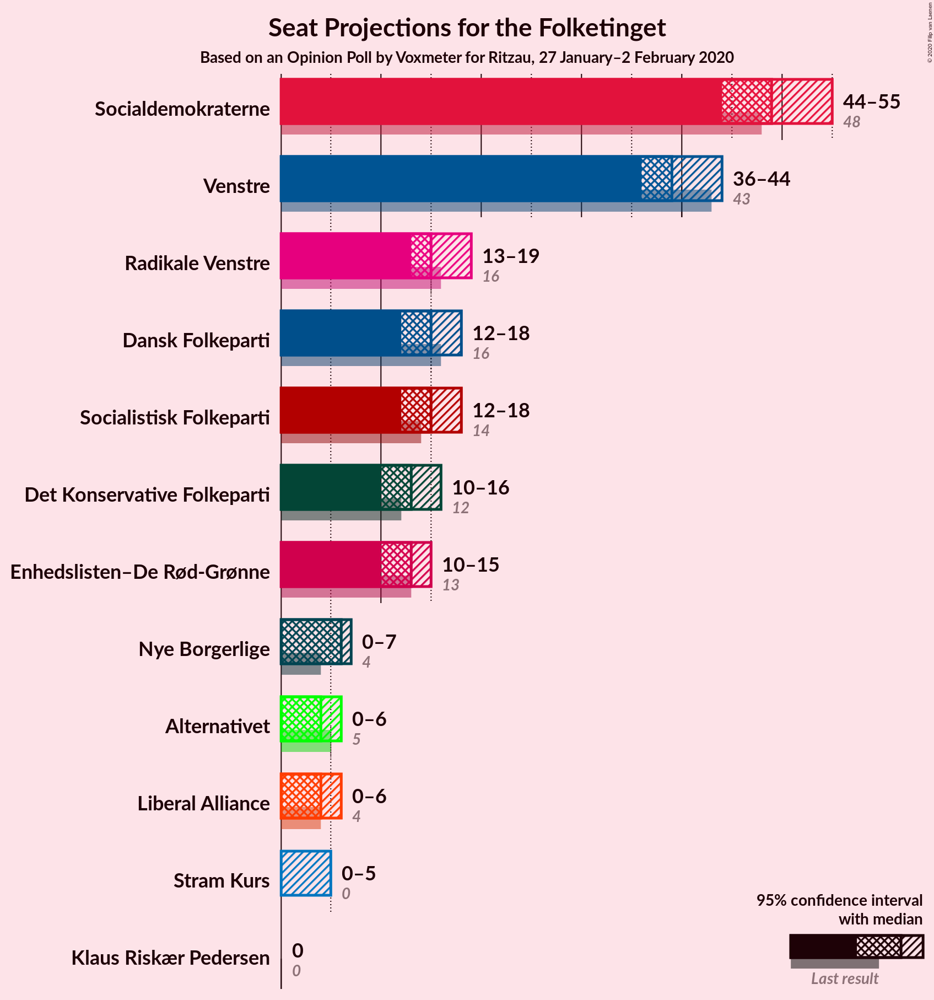
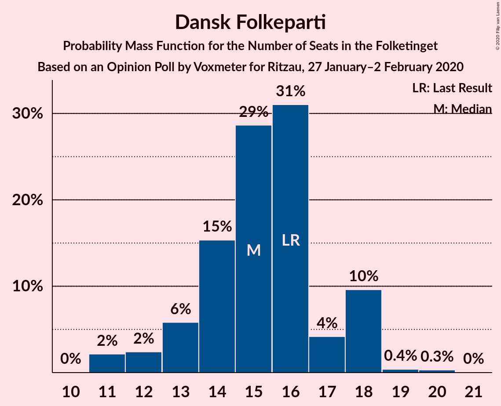
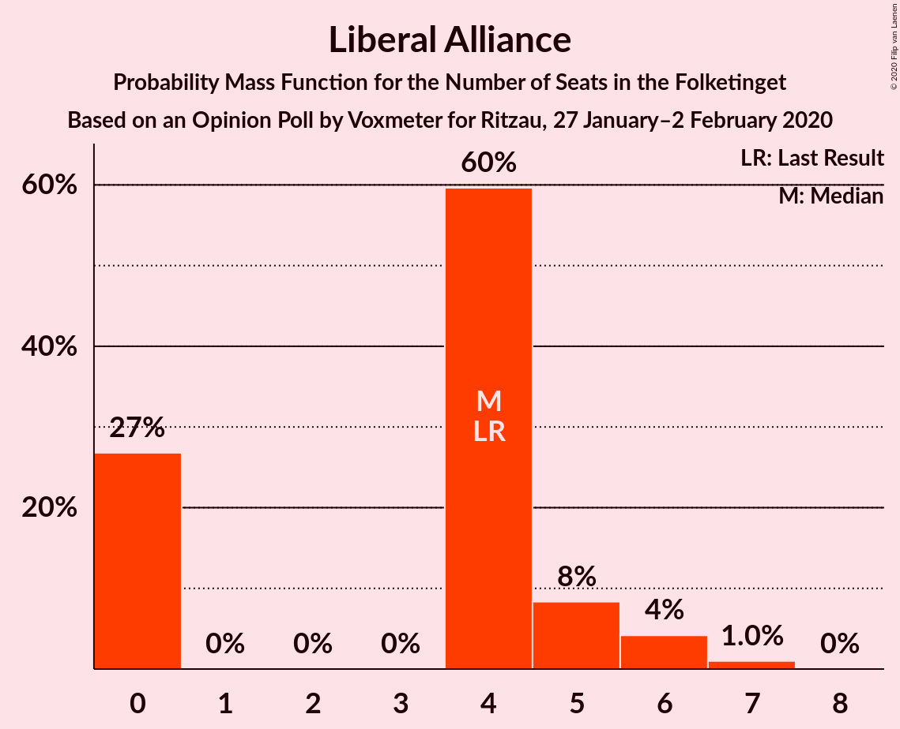
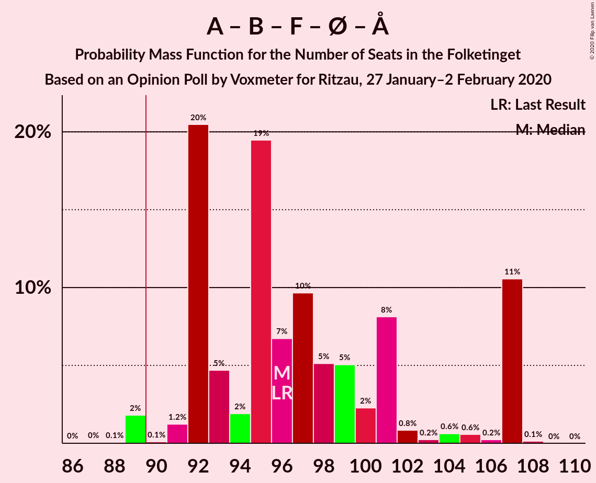
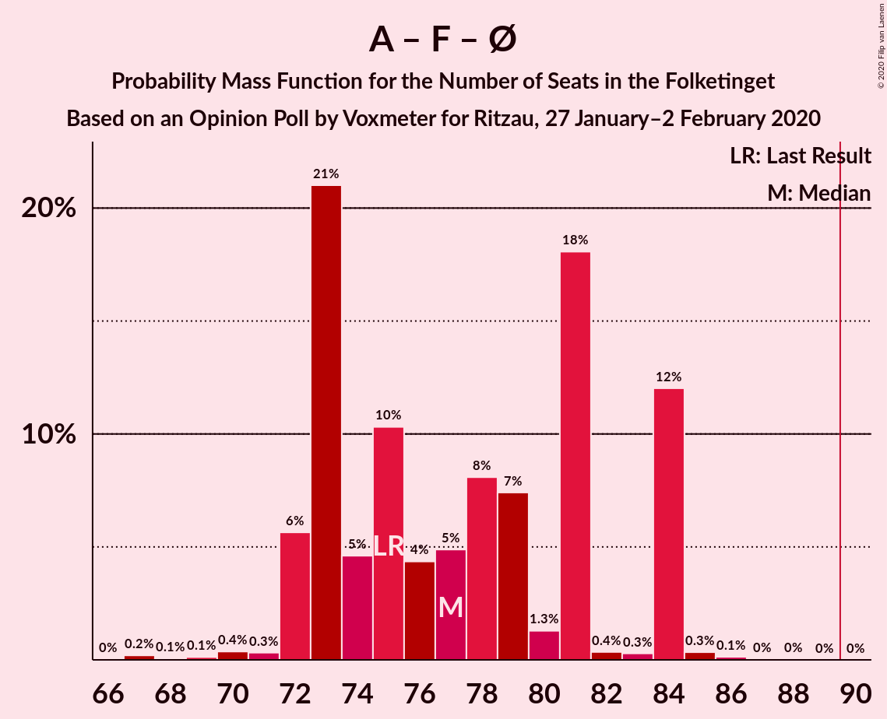
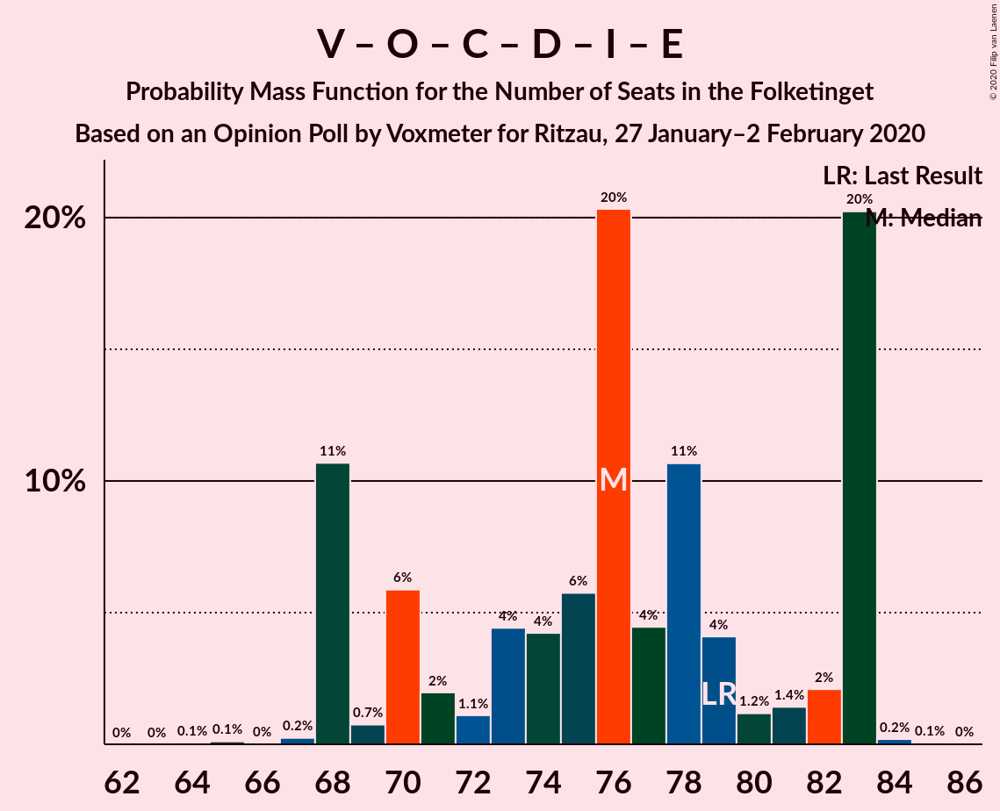
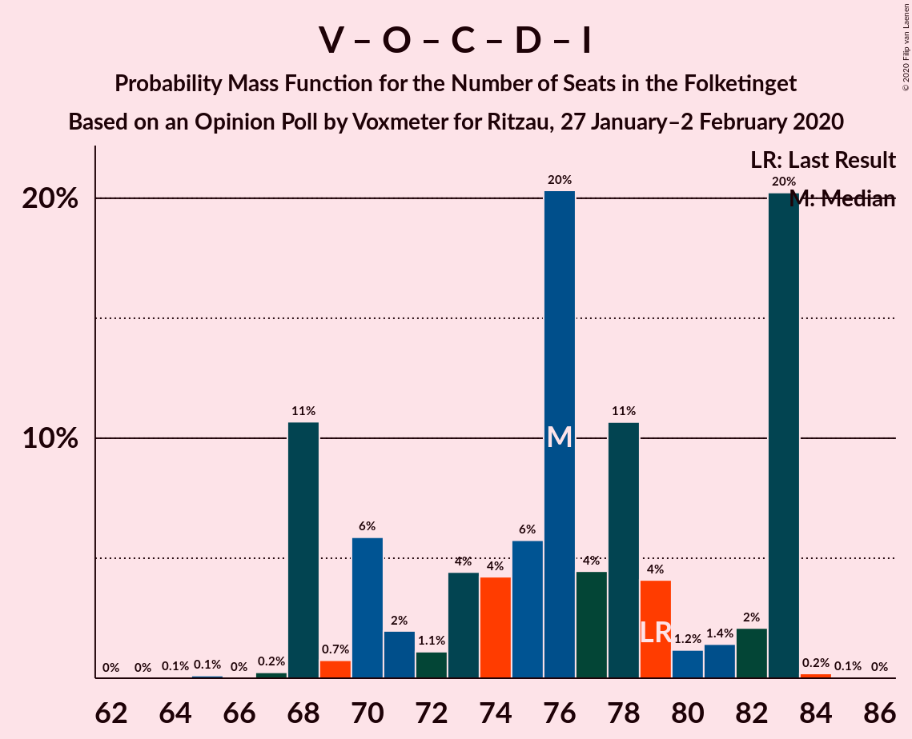
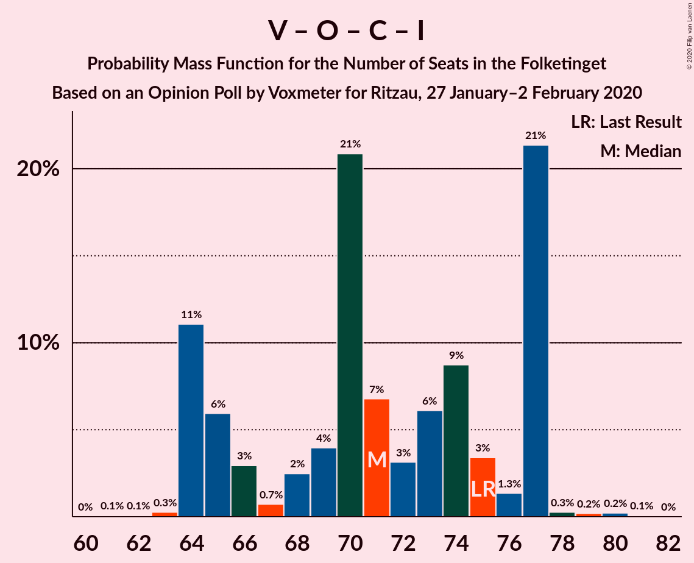

# Opinion Poll by Voxmeter for Ritzau, 27 January–2 February 2020

<a href="#voting-intentions">Voting Intentions</a> | <a href="#seats">Seats</a> | <a href="#coalitions">Coalitions</a> | <a href="#technical-information">Technical Information</a>

## Voting Intentions

### Confidence Intervals

| Party | Last Result | Poll Result | 80% Confidence Interval | 90% Confidence Interval | 95% Confidence Interval | 99% Confidence Interval |
|:-----:|:-----------:|:-----------:|:-----------------------:|:-----------------------:|:-----------------------:|:-----------------------:|
| Socialdemokraterne | 25.9% | 27.2% | 25.5–29.1% |25.0–29.6% |24.6–30.0% |23.8–30.9% |
| Venstre | 23.4% | 22.1% | 20.5–23.9% |20.1–24.4% |19.7–24.8% |19.0–25.7% |
| Radikale Venstre | 8.6% | 9.1% | 8.0–10.3% |7.7–10.7% |7.5–11.0% |7.0–11.6% |
| Dansk Folkeparti | 8.7% | 8.3% | 7.3–9.5% |7.0–9.8% |6.8–10.2% |6.3–10.8% |
| Socialistisk Folkeparti | 7.7% | 8.3% | 7.3–9.5% |7.0–9.8% |6.8–10.2% |6.3–10.8% |
| Det Konservative Folkeparti | 6.6% | 7.2% | 6.3–8.4% |6.0–8.7% |5.8–9.0% |5.4–9.6% |
| Enhedslisten–De Rød-Grønne | 6.9% | 6.9% | 6.0–8.1% |5.7–8.4% |5.5–8.7% |5.1–9.2% |
| Nye Borgerlige | 2.4% | 2.5% | 2.0–3.3% |1.9–3.5% |1.7–3.7% |1.5–4.1% |
| Alternativet | 3.0% | 2.4% | 1.9–3.2% |1.8–3.4% |1.7–3.6% |1.4–4.0% |
| Liberal Alliance | 2.3% | 2.2% | 1.8–3.0% |1.6–3.2% |1.5–3.4% |1.3–3.7% |
| Stram Kurs | 1.8% | 1.9% | 1.4–2.5% |1.3–2.7% |1.2–2.9% |1.0–3.2% |
| Klaus Riskær Pedersen | 0.8% | 0.6% | 0.4–1.0% |0.3–1.2% |0.3–1.3% |0.2–1.5% |

*Note:* The poll result column reflects the actual value used in the calculations. Published results may vary slightly, and in addition be rounded to fewer digits.

## Seats

### Confidence Intervals

| Party | Last Result | Median | 80% Confidence Interval | 90% Confidence Interval | 95% Confidence Interval | 99% Confidence Interval |
|:-----:|:-----------:|:------:|:-----------------------:|:-----------------------:|:-----------------------:|:-----------------------:|
| <a href="#socialdemokraterne">Socialdemokraterne</a> | 48 | 49 | 45–54 |45–55 |44–55 |43–56 |
| <a href="#venstre">Venstre</a> | 43 | 39 | 36–44 |36–44 |36–44 |34–47 |
| <a href="#radikale-venstre">Radikale Venstre</a> | 16 | 15 | 14–18 |14–19 |13–19 |13–21 |
| <a href="#dansk-folkeparti">Dansk Folkeparti</a> | 16 | 15 | 13–18 |13–18 |12–18 |11–19 |
| <a href="#socialistisk-folkeparti">Socialistisk Folkeparti</a> | 14 | 15 | 12–17 |12–18 |12–18 |11–19 |
| <a href="#det-konservative-folkeparti">Det Konservative Folkeparti</a> | 12 | 13 | 12–15 |11–16 |10–16 |10–17 |
| <a href="#enhedslisten–de-rød-grønne">Enhedslisten–De Rød-Grønne</a> | 13 | 13 | 11–14 |10–15 |10–15 |9–16 |
| <a href="#nye-borgerlige">Nye Borgerlige</a> | 4 | 6 | 4–6 |4–7 |0–7 |0–7 |
| <a href="#alternativet">Alternativet</a> | 5 | 4 | 0–6 |0–6 |0–6 |0–7 |
| <a href="#liberal-alliance">Liberal Alliance</a> | 4 | 4 | 0–5 |0–6 |0–6 |0–7 |
| <a href="#stram-kurs">Stram Kurs</a> | 0 | 0 | 0–4 |0–5 |0–5 |0–6 |
| <a href="#klaus-riskær-pedersen">Klaus Riskær Pedersen</a> | 0 | 0 | 0 |0 |0 |0 |

### Socialdemokraterne

*For a full overview of the results for this party, see the [Socialdemokraterne](party-socialdemokraterne.html) page.*

| Number of Seats | Probability | Accumulated | Special Marks |
|:---------------:|:-----------:|:-----------:|:-------------:|
| 40 | 0% | 100% |  |
| 41 | 0% | 99.9% |  |
| 42 | 0.4% | 99.9% |  |
| 43 | 0.7% | 99.5% |  |
| 44 | 4% | 98.8% |  |
| 45 | 21% | 95% |  |
| 46 | 4% | 74% |  |
| 47 | 6% | 70% |  |
| 48 | 4% | 64% | Last Result |
| 49 | 14% | 61% | Median |
| 50 | 6% | 47% |  |
| 51 | 4% | 41% |  |
| 52 | 19% | 36% |  |
| 53 | 0.7% | 17% |  |
| 54 | 12% | 17% |  |
| 55 | 5% | 5% |  |
| 56 | 0.3% | 0.6% |  |
| 57 | 0.1% | 0.2% |  |
| 58 | 0.1% | 0.1% |  |
| 59 | 0% | 0% |  |

### Venstre

*For a full overview of the results for this party, see the [Venstre](party-venstre.html) page.*

| Number of Seats | Probability | Accumulated | Special Marks |
|:---------------:|:-----------:|:-----------:|:-------------:|
| 32 | 0.1% | 100% |  |
| 33 | 0.1% | 99.9% |  |
| 34 | 0.4% | 99.8% |  |
| 35 | 1.4% | 99.5% |  |
| 36 | 13% | 98% |  |
| 37 | 8% | 85% |  |
| 38 | 21% | 77% |  |
| 39 | 6% | 56% | Median |
| 40 | 17% | 49% |  |
| 41 | 6% | 33% |  |
| 42 | 3% | 27% |  |
| 43 | 1.2% | 24% | Last Result |
| 44 | 21% | 22% |  |
| 45 | 0.6% | 1.4% |  |
| 46 | 0.3% | 0.9% |  |
| 47 | 0.5% | 0.6% |  |
| 48 | 0% | 0.1% |  |
| 49 | 0% | 0% |  |

### Radikale Venstre

*For a full overview of the results for this party, see the [Radikale Venstre](party-radikalevenstre.html) page.*

| Number of Seats | Probability | Accumulated | Special Marks |
|:---------------:|:-----------:|:-----------:|:-------------:|
| 12 | 0.2% | 100% |  |
| 13 | 3% | 99.7% |  |
| 14 | 20% | 97% |  |
| 15 | 28% | 77% | Median |
| 16 | 8% | 49% | Last Result |
| 17 | 13% | 41% |  |
| 18 | 22% | 28% |  |
| 19 | 4% | 6% |  |
| 20 | 2% | 2% |  |
| 21 | 0.3% | 0.7% |  |
| 22 | 0.3% | 0.4% |  |
| 23 | 0% | 0% |  |

### Dansk Folkeparti

*For a full overview of the results for this party, see the [Dansk Folkeparti](party-danskfolkeparti.html) page.*

| Number of Seats | Probability | Accumulated | Special Marks |
|:---------------:|:-----------:|:-----------:|:-------------:|
| 10 | 0% | 100% |  |
| 11 | 2% | 99.9% |  |
| 12 | 2% | 98% |  |
| 13 | 6% | 95% |  |
| 14 | 15% | 90% |  |
| 15 | 29% | 74% | Median |
| 16 | 31% | 46% | Last Result |
| 17 | 4% | 15% |  |
| 18 | 10% | 10% |  |
| 19 | 0.4% | 0.7% |  |
| 20 | 0.3% | 0.4% |  |
| 21 | 0% | 0% |  |

### Socialistisk Folkeparti

*For a full overview of the results for this party, see the [Socialistisk Folkeparti](party-socialistiskfolkeparti.html) page.*

| Number of Seats | Probability | Accumulated | Special Marks |
|:---------------:|:-----------:|:-----------:|:-------------:|
| 10 | 0.3% | 100% |  |
| 11 | 1.0% | 99.7% |  |
| 12 | 9% | 98.8% |  |
| 13 | 5% | 90% |  |
| 14 | 7% | 84% | Last Result |
| 15 | 31% | 77% | Median |
| 16 | 26% | 46% |  |
| 17 | 13% | 20% |  |
| 18 | 4% | 6% |  |
| 19 | 2% | 2% |  |
| 20 | 0.3% | 0.5% |  |
| 21 | 0.1% | 0.1% |  |
| 22 | 0.1% | 0.1% |  |
| 23 | 0% | 0% |  |

### Det Konservative Folkeparti

*For a full overview of the results for this party, see the [Det Konservative Folkeparti](party-detkonservativefolkeparti.html) page.*

| Number of Seats | Probability | Accumulated | Special Marks |
|:---------------:|:-----------:|:-----------:|:-------------:|
| 9 | 0.3% | 100% |  |
| 10 | 4% | 99.7% |  |
| 11 | 3% | 96% |  |
| 12 | 40% | 93% | Last Result |
| 13 | 4% | 53% | Median |
| 14 | 35% | 49% |  |
| 15 | 8% | 14% |  |
| 16 | 4% | 5% |  |
| 17 | 1.3% | 1.4% |  |
| 18 | 0.1% | 0.1% |  |
| 19 | 0.1% | 0.1% |  |
| 20 | 0% | 0% |  |

### Enhedslisten–De Rød-Grønne

*For a full overview of the results for this party, see the [Enhedslisten–De Rød-Grønne](party-enhedslisten–derød-grønne.html) page.*

| Number of Seats | Probability | Accumulated | Special Marks |
|:---------------:|:-----------:|:-----------:|:-------------:|
| 8 | 0.1% | 100% |  |
| 9 | 0.6% | 99.9% |  |
| 10 | 8% | 99.4% |  |
| 11 | 4% | 91% |  |
| 12 | 29% | 87% |  |
| 13 | 20% | 58% | Last Result, Median |
| 14 | 31% | 38% |  |
| 15 | 5% | 6% |  |
| 16 | 2% | 2% |  |
| 17 | 0.1% | 0.2% |  |
| 18 | 0.1% | 0.1% |  |
| 19 | 0% | 0% |  |

### Nye Borgerlige

*For a full overview of the results for this party, see the [Nye Borgerlige](party-nyeborgerlige.html) page.*

| Number of Seats | Probability | Accumulated | Special Marks |
|:---------------:|:-----------:|:-----------:|:-------------:|
| 0 | 5% | 100% |  |
| 1 | 0% | 95% |  |
| 2 | 0% | 95% |  |
| 3 | 0% | 95% |  |
| 4 | 26% | 95% | Last Result |
| 5 | 16% | 69% |  |
| 6 | 48% | 53% | Median |
| 7 | 5% | 5% |  |
| 8 | 0.1% | 0.1% |  |
| 9 | 0% | 0% |  |

### Alternativet

*For a full overview of the results for this party, see the [Alternativet](party-alternativet.html) page.*

| Number of Seats | Probability | Accumulated | Special Marks |
|:---------------:|:-----------:|:-----------:|:-------------:|
| 0 | 26% | 100% |  |
| 1 | 0% | 74% |  |
| 2 | 0% | 74% |  |
| 3 | 0.1% | 74% |  |
| 4 | 33% | 74% | Median |
| 5 | 30% | 41% | Last Result |
| 6 | 10% | 11% |  |
| 7 | 0.9% | 1.0% |  |
| 8 | 0.1% | 0.1% |  |
| 9 | 0% | 0% |  |

### Liberal Alliance

*For a full overview of the results for this party, see the [Liberal Alliance](party-liberalalliance.html) page.*

| Number of Seats | Probability | Accumulated | Special Marks |
|:---------------:|:-----------:|:-----------:|:-------------:|
| 0 | 27% | 100% |  |
| 1 | 0% | 73% |  |
| 2 | 0% | 73% |  |
| 3 | 0% | 73% |  |
| 4 | 60% | 73% | Last Result, Median |
| 5 | 8% | 14% |  |
| 6 | 4% | 5% |  |
| 7 | 1.0% | 1.0% |  |
| 8 | 0% | 0% |  |

### Stram Kurs

*For a full overview of the results for this party, see the [Stram Kurs](party-stramkurs.html) page.*

| Number of Seats | Probability | Accumulated | Special Marks |
|:---------------:|:-----------:|:-----------:|:-------------:|
| 0 | 59% | 100% | Last Result, Median |
| 1 | 0% | 41% |  |
| 2 | 0% | 41% |  |
| 3 | 0% | 41% |  |
| 4 | 32% | 41% |  |
| 5 | 7% | 8% |  |
| 6 | 1.2% | 1.3% |  |
| 7 | 0% | 0% |  |

### Klaus Riskær Pedersen

*For a full overview of the results for this party, see the [Klaus Riskær Pedersen](party-klausriskærpedersen.html) page.*

| Number of Seats | Probability | Accumulated | Special Marks |
|:---------------:|:-----------:|:-----------:|:-------------:|
| 0 | 100% | 100% | Last Result, Median |

## Coalitions

### Confidence Intervals

| Coalition | Last Result | Median | Majority? | 80% Confidence Interval | 90% Confidence Interval | 95% Confidence Interval | 99% Confidence Interval |
|:---------:|:-----------:|:------:|:---------:|:-----------------------:|:-----------------------:|:-----------------------:|:-----------------------:|
| Socialdemokraterne – Radikale Venstre – Socialistisk Folkeparti – Enhedslisten–De Rød-Grønne – Alternativet | 96 | 96 | 98% | 92–107 | 92–107 | 91–107 | 89–107 |
| Socialdemokraterne – Radikale Venstre – Socialistisk Folkeparti – Enhedslisten–De Rød-Grønne | 91 | 93 | 74% | 88–102 | 88–102 | 87–102 | 86–103 |
| Socialdemokraterne – Socialistisk Folkeparti – Enhedslisten–De Rød-Grønne – Alternativet | 80 | 81 | 0.2% | 77–89 | 77–89 | 75–89 | 72–89 |
| Socialdemokraterne – Radikale Venstre – Socialistisk Folkeparti | 78 | 80 | 0.4% | 76–89 | 76–89 | 75–89 | 73–89 |
| Socialdemokraterne – Socialistisk Folkeparti – Enhedslisten–De Rød-Grønne | 75 | 77 | 0% | 73–84 | 72–84 | 72–84 | 70–85 |
| Venstre – Dansk Folkeparti – Det Konservative Folkeparti – Nye Borgerlige – Liberal Alliance – Klaus Riskær Pedersen | 79 | 76 | 0% | 68–83 | 68–83 | 68–83 | 68–83 |
| Venstre – Dansk Folkeparti – Det Konservative Folkeparti – Nye Borgerlige – Liberal Alliance | 79 | 76 | 0% | 68–83 | 68–83 | 68–83 | 68–83 |
| Venstre – Dansk Folkeparti – Det Konservative Folkeparti – Liberal Alliance | 75 | 71 | 0% | 64–77 | 64–77 | 64–77 | 64–78 |
| Socialdemokraterne – Radikale Venstre | 64 | 66 | 0% | 60–72 | 60–72 | 60–73 | 57–74 |
| Venstre – Det Konservative Folkeparti – Liberal Alliance | 59 | 56 | 0% | 48–62 | 48–62 | 48–62 | 48–63 |
| Venstre – Det Konservative Folkeparti | 55 | 52 | 0% | 48–58 | 48–58 | 48–58 | 47–60 |
| Venstre | 43 | 39 | 0% | 36–44 | 36–44 | 36–44 | 34–47 |

### Socialdemokraterne – Radikale Venstre – Socialistisk Folkeparti – Enhedslisten–De Rød-Grønne – Alternativet

| Number of Seats | Probability | Accumulated | Special Marks |
|:---------------:|:-----------:|:-----------:|:-------------:|
| 87 | 0% | 100% |  |
| 88 | 0.1% | 99.9% |  |
| 89 | 2% | 99.9% |  |
| 90 | 0.1% | 98% | Majority |
| 91 | 1.2% | 98% |  |
| 92 | 20% | 97% |  |
| 93 | 5% | 76% |  |
| 94 | 2% | 72% |  |
| 95 | 19% | 70% |  |
| 96 | 7% | 50% | Last Result, Median |
| 97 | 10% | 43% |  |
| 98 | 5% | 34% |  |
| 99 | 5% | 29% |  |
| 100 | 2% | 24% |  |
| 101 | 8% | 21% |  |
| 102 | 0.8% | 13% |  |
| 103 | 0.2% | 12% |  |
| 104 | 0.6% | 12% |  |
| 105 | 0.6% | 12% |  |
| 106 | 0.2% | 11% |  |
| 107 | 11% | 11% |  |
| 108 | 0.1% | 0.1% |  |
| 109 | 0% | 0% |  |

### Socialdemokraterne – Radikale Venstre – Socialistisk Folkeparti – Enhedslisten–De Rød-Grønne

| Number of Seats | Probability | Accumulated | Special Marks |
|:---------------:|:-----------:|:-----------:|:-------------:|
| 83 | 0.1% | 100% |  |
| 84 | 0.2% | 99.9% |  |
| 85 | 0.1% | 99.7% |  |
| 86 | 0.5% | 99.6% |  |
| 87 | 3% | 99.1% |  |
| 88 | 21% | 97% |  |
| 89 | 2% | 76% |  |
| 90 | 7% | 74% | Majority |
| 91 | 2% | 67% | Last Result |
| 92 | 10% | 64% | Median |
| 93 | 8% | 55% |  |
| 94 | 4% | 47% |  |
| 95 | 19% | 43% |  |
| 96 | 2% | 23% |  |
| 97 | 6% | 22% |  |
| 98 | 1.2% | 15% |  |
| 99 | 0.8% | 14% |  |
| 100 | 1.2% | 13% |  |
| 101 | 1.1% | 12% |  |
| 102 | 11% | 11% |  |
| 103 | 0.2% | 0.5% |  |
| 104 | 0% | 0.3% |  |
| 105 | 0.3% | 0.3% |  |
| 106 | 0% | 0% |  |

### Socialdemokraterne – Socialistisk Folkeparti – Enhedslisten–De Rød-Grønne – Alternativet

| Number of Seats | Probability | Accumulated | Special Marks |
|:---------------:|:-----------:|:-----------:|:-------------:|
| 71 | 0.1% | 100% |  |
| 72 | 2% | 99.9% |  |
| 73 | 0.1% | 98% |  |
| 74 | 0.3% | 98% |  |
| 75 | 0.5% | 98% |  |
| 76 | 0.7% | 97% |  |
| 77 | 22% | 97% |  |
| 78 | 7% | 75% |  |
| 79 | 3% | 68% |  |
| 80 | 13% | 65% | Last Result |
| 81 | 23% | 52% | Median |
| 82 | 3% | 29% |  |
| 83 | 9% | 26% |  |
| 84 | 3% | 17% |  |
| 85 | 2% | 14% |  |
| 86 | 0.5% | 12% |  |
| 87 | 0.5% | 12% |  |
| 88 | 0.2% | 11% |  |
| 89 | 11% | 11% |  |
| 90 | 0% | 0.2% | Majority |
| 91 | 0.1% | 0.1% |  |
| 92 | 0% | 0% |  |

### Socialdemokraterne – Radikale Venstre – Socialistisk Folkeparti

| Number of Seats | Probability | Accumulated | Special Marks |
|:---------------:|:-----------:|:-----------:|:-------------:|
| 71 | 0% | 100% |  |
| 72 | 0.1% | 99.9% |  |
| 73 | 0.7% | 99.8% |  |
| 74 | 0.2% | 99.1% |  |
| 75 | 3% | 98.9% |  |
| 76 | 24% | 96% |  |
| 77 | 4% | 73% |  |
| 78 | 9% | 68% | Last Result |
| 79 | 4% | 59% | Median |
| 80 | 5% | 54% |  |
| 81 | 22% | 49% |  |
| 82 | 2% | 28% |  |
| 83 | 3% | 26% |  |
| 84 | 3% | 22% |  |
| 85 | 0.5% | 19% |  |
| 86 | 1.5% | 19% |  |
| 87 | 6% | 17% |  |
| 88 | 0.2% | 11% |  |
| 89 | 11% | 11% |  |
| 90 | 0.1% | 0.4% | Majority |
| 91 | 0.3% | 0.3% |  |
| 92 | 0% | 0% |  |

### Socialdemokraterne – Socialistisk Folkeparti – Enhedslisten–De Rød-Grønne

| Number of Seats | Probability | Accumulated | Special Marks |
|:---------------:|:-----------:|:-----------:|:-------------:|
| 67 | 0.2% | 100% |  |
| 68 | 0.1% | 99.8% |  |
| 69 | 0.1% | 99.7% |  |
| 70 | 0.4% | 99.6% |  |
| 71 | 0.3% | 99.2% |  |
| 72 | 6% | 98.9% |  |
| 73 | 21% | 93% |  |
| 74 | 5% | 72% |  |
| 75 | 10% | 68% | Last Result |
| 76 | 4% | 57% |  |
| 77 | 5% | 53% | Median |
| 78 | 8% | 48% |  |
| 79 | 7% | 40% |  |
| 80 | 1.3% | 33% |  |
| 81 | 18% | 31% |  |
| 82 | 0.4% | 13% |  |
| 83 | 0.3% | 13% |  |
| 84 | 12% | 13% |  |
| 85 | 0.3% | 0.6% |  |
| 86 | 0.1% | 0.2% |  |
| 87 | 0% | 0.1% |  |
| 88 | 0% | 0.1% |  |
| 89 | 0% | 0% |  |

### Venstre – Dansk Folkeparti – Det Konservative Folkeparti – Nye Borgerlige – Liberal Alliance – Klaus Riskær Pedersen

| Number of Seats | Probability | Accumulated | Special Marks |
|:---------------:|:-----------:|:-----------:|:-------------:|
| 64 | 0.1% | 100% |  |
| 65 | 0.1% | 99.9% |  |
| 66 | 0% | 99.8% |  |
| 67 | 0.2% | 99.8% |  |
| 68 | 11% | 99.6% |  |
| 69 | 0.7% | 89% |  |
| 70 | 6% | 88% |  |
| 71 | 2% | 82% |  |
| 72 | 1.1% | 80% |  |
| 73 | 4% | 79% |  |
| 74 | 4% | 75% |  |
| 75 | 6% | 71% |  |
| 76 | 20% | 65% |  |
| 77 | 4% | 44% | Median |
| 78 | 11% | 40% |  |
| 79 | 4% | 29% | Last Result |
| 80 | 1.2% | 25% |  |
| 81 | 1.4% | 24% |  |
| 82 | 2% | 23% |  |
| 83 | 20% | 21% |  |
| 84 | 0.2% | 0.3% |  |
| 85 | 0.1% | 0.1% |  |
| 86 | 0% | 0% |  |

### Venstre – Dansk Folkeparti – Det Konservative Folkeparti – Nye Borgerlige – Liberal Alliance

| Number of Seats | Probability | Accumulated | Special Marks |
|:---------------:|:-----------:|:-----------:|:-------------:|
| 64 | 0.1% | 100% |  |
| 65 | 0.1% | 99.9% |  |
| 66 | 0% | 99.8% |  |
| 67 | 0.2% | 99.8% |  |
| 68 | 11% | 99.6% |  |
| 69 | 0.7% | 89% |  |
| 70 | 6% | 88% |  |
| 71 | 2% | 82% |  |
| 72 | 1.1% | 80% |  |
| 73 | 4% | 79% |  |
| 74 | 4% | 75% |  |
| 75 | 6% | 71% |  |
| 76 | 20% | 65% |  |
| 77 | 4% | 44% | Median |
| 78 | 11% | 40% |  |
| 79 | 4% | 29% | Last Result |
| 80 | 1.2% | 25% |  |
| 81 | 1.4% | 24% |  |
| 82 | 2% | 23% |  |
| 83 | 20% | 21% |  |
| 84 | 0.2% | 0.3% |  |
| 85 | 0.1% | 0.1% |  |
| 86 | 0% | 0% |  |

### Venstre – Dansk Folkeparti – Det Konservative Folkeparti – Liberal Alliance

| Number of Seats | Probability | Accumulated | Special Marks |
|:---------------:|:-----------:|:-----------:|:-------------:|
| 61 | 0.1% | 100% |  |
| 62 | 0.1% | 99.9% |  |
| 63 | 0.3% | 99.9% |  |
| 64 | 11% | 99.6% |  |
| 65 | 6% | 89% |  |
| 66 | 3% | 83% |  |
| 67 | 0.7% | 80% |  |
| 68 | 2% | 79% |  |
| 69 | 4% | 76% |  |
| 70 | 21% | 72% |  |
| 71 | 7% | 52% | Median |
| 72 | 3% | 45% |  |
| 73 | 6% | 42% |  |
| 74 | 9% | 36% |  |
| 75 | 3% | 27% | Last Result |
| 76 | 1.3% | 23% |  |
| 77 | 21% | 22% |  |
| 78 | 0.3% | 0.7% |  |
| 79 | 0.2% | 0.5% |  |
| 80 | 0.2% | 0.3% |  |
| 81 | 0.1% | 0.1% |  |
| 82 | 0% | 0% |  |

### Socialdemokraterne – Radikale Venstre

| Number of Seats | Probability | Accumulated | Special Marks |
|:---------------:|:-----------:|:-----------:|:-------------:|
| 56 | 0.1% | 100% |  |
| 57 | 0.4% | 99.9% |  |
| 58 | 0.3% | 99.5% |  |
| 59 | 0.6% | 99.2% |  |
| 60 | 21% | 98.6% |  |
| 61 | 2% | 78% |  |
| 62 | 7% | 76% |  |
| 63 | 4% | 69% |  |
| 64 | 4% | 65% | Last Result, Median |
| 65 | 8% | 61% |  |
| 66 | 27% | 54% |  |
| 67 | 3% | 26% |  |
| 68 | 1.3% | 23% |  |
| 69 | 4% | 22% |  |
| 70 | 1.1% | 18% |  |
| 71 | 1.2% | 17% |  |
| 72 | 11% | 15% |  |
| 73 | 4% | 5% |  |
| 74 | 0.3% | 0.6% |  |
| 75 | 0% | 0.3% |  |
| 76 | 0.3% | 0.3% |  |
| 77 | 0% | 0% |  |

### Venstre – Det Konservative Folkeparti – Liberal Alliance

| Number of Seats | Probability | Accumulated | Special Marks |
|:---------------:|:-----------:|:-----------:|:-------------:|
| 47 | 0.1% | 100% |  |
| 48 | 11% | 99.9% |  |
| 49 | 0.2% | 89% |  |
| 50 | 0.5% | 89% |  |
| 51 | 6% | 88% |  |
| 52 | 2% | 82% |  |
| 53 | 5% | 81% |  |
| 54 | 22% | 76% |  |
| 55 | 1.1% | 54% |  |
| 56 | 12% | 53% | Median |
| 57 | 4% | 41% |  |
| 58 | 3% | 37% |  |
| 59 | 8% | 34% | Last Result |
| 60 | 4% | 26% |  |
| 61 | 0.7% | 23% |  |
| 62 | 21% | 22% |  |
| 63 | 1.0% | 1.3% |  |
| 64 | 0.3% | 0.4% |  |
| 65 | 0.1% | 0.1% |  |
| 66 | 0% | 0% |  |

### Venstre – Det Konservative Folkeparti

| Number of Seats | Probability | Accumulated | Special Marks |
|:---------------:|:-----------:|:-----------:|:-------------:|
| 43 | 0.1% | 100% |  |
| 44 | 0% | 99.9% |  |
| 45 | 0.1% | 99.9% |  |
| 46 | 0.2% | 99.8% |  |
| 47 | 0.4% | 99.7% |  |
| 48 | 12% | 99.2% |  |
| 49 | 5% | 88% |  |
| 50 | 18% | 83% |  |
| 51 | 8% | 65% |  |
| 52 | 14% | 57% | Median |
| 53 | 3% | 43% |  |
| 54 | 7% | 40% |  |
| 55 | 7% | 33% | Last Result |
| 56 | 0.6% | 26% |  |
| 57 | 3% | 26% |  |
| 58 | 21% | 23% |  |
| 59 | 0.9% | 2% |  |
| 60 | 0.5% | 0.7% |  |
| 61 | 0.1% | 0.2% |  |
| 62 | 0% | 0% |  |

### Venstre

| Number of Seats | Probability | Accumulated | Special Marks |
|:---------------:|:-----------:|:-----------:|:-------------:|
| 32 | 0.1% | 100% |  |
| 33 | 0.1% | 99.9% |  |
| 34 | 0.4% | 99.8% |  |
| 35 | 1.4% | 99.5% |  |
| 36 | 13% | 98% |  |
| 37 | 8% | 85% |  |
| 38 | 21% | 77% |  |
| 39 | 6% | 56% | Median |
| 40 | 17% | 49% |  |
| 41 | 6% | 33% |  |
| 42 | 3% | 27% |  |
| 43 | 1.2% | 24% | Last Result |
| 44 | 21% | 22% |  |
| 45 | 0.6% | 1.4% |  |
| 46 | 0.3% | 0.9% |  |
| 47 | 0.5% | 0.6% |  |
| 48 | 0% | 0.1% |  |
| 49 | 0% | 0% |  |

## Technical Information

### Opinion Poll

+ **Polling firm:** Voxmeter
+ **Commissioner(s):** Ritzau
+ **Fieldwork period:** 27 January–2 February 2020

### Calculations

+ **Sample size:** 1025
+ **Simulations done:** 1,048,576
+ **Error estimate:** 3.89%

