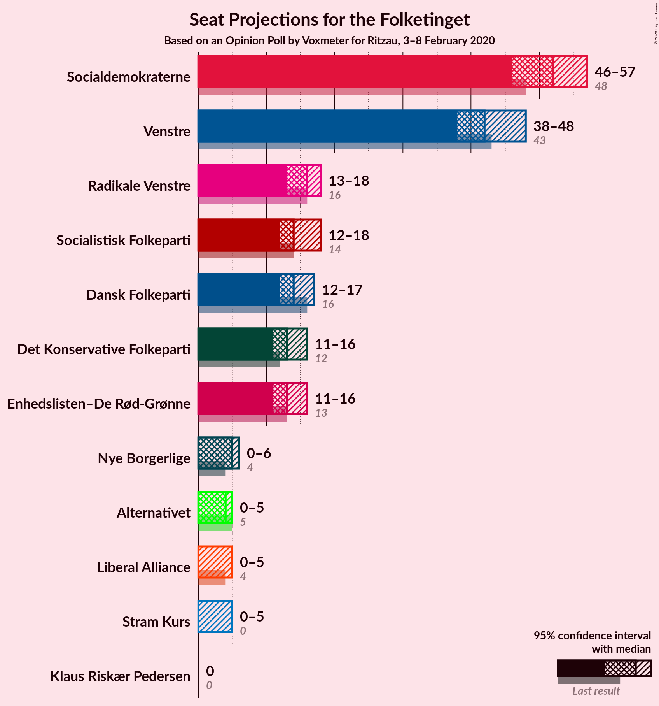
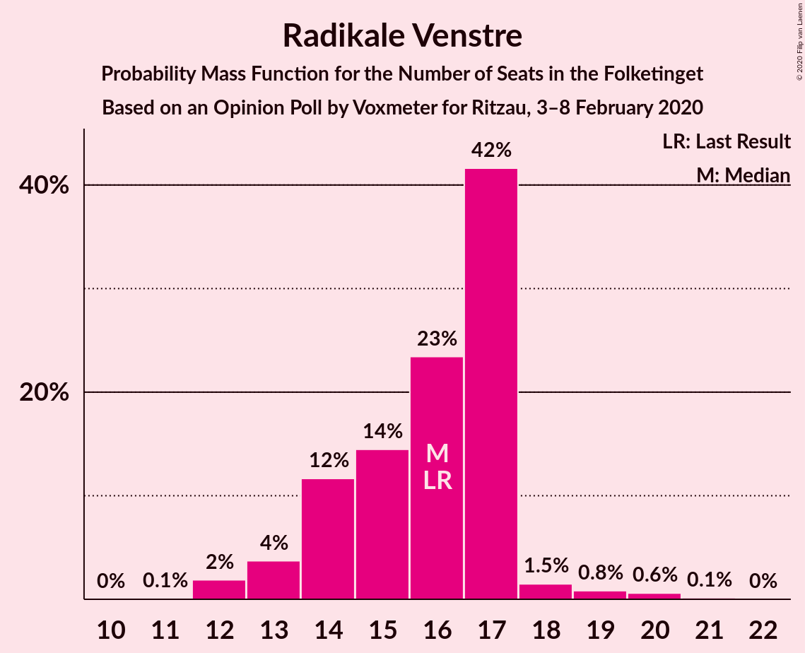
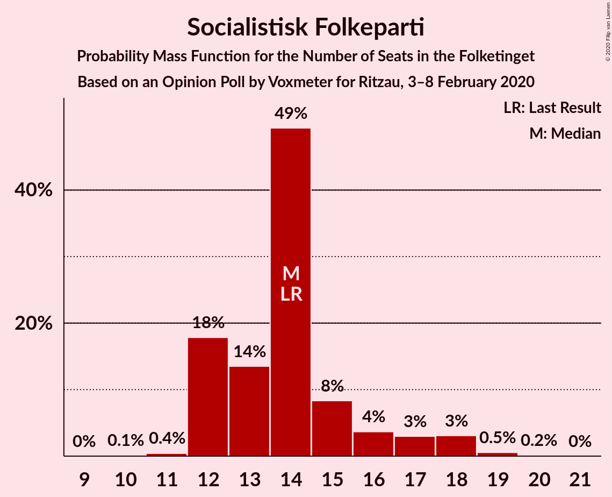
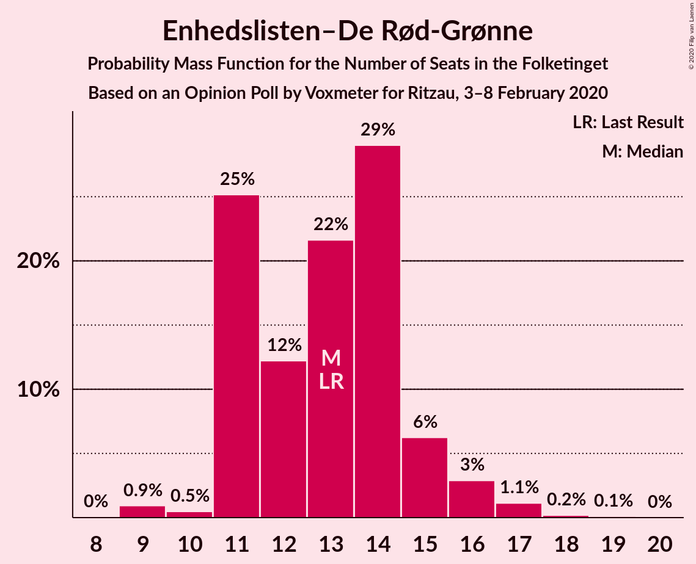
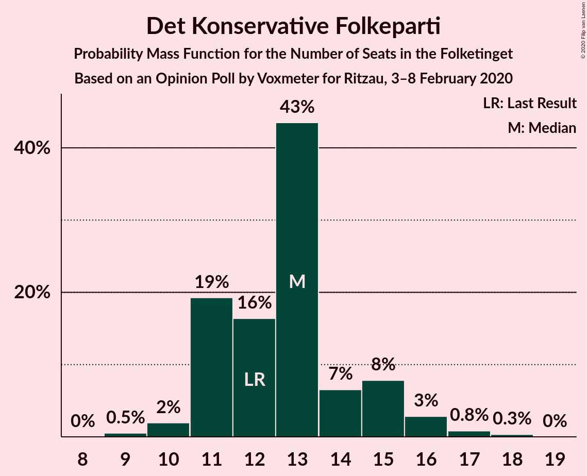
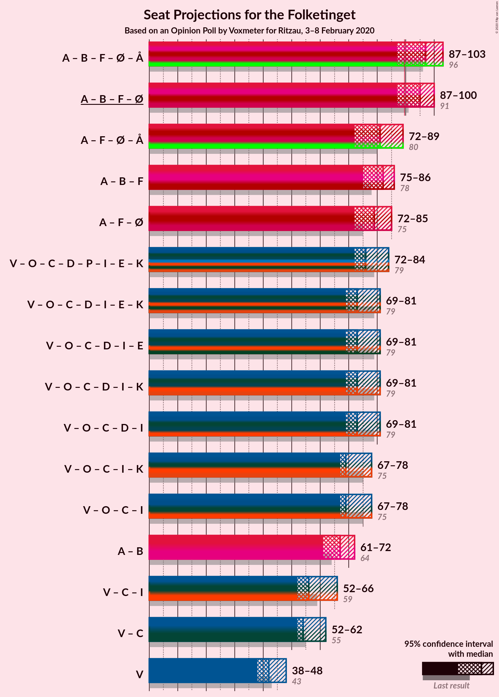
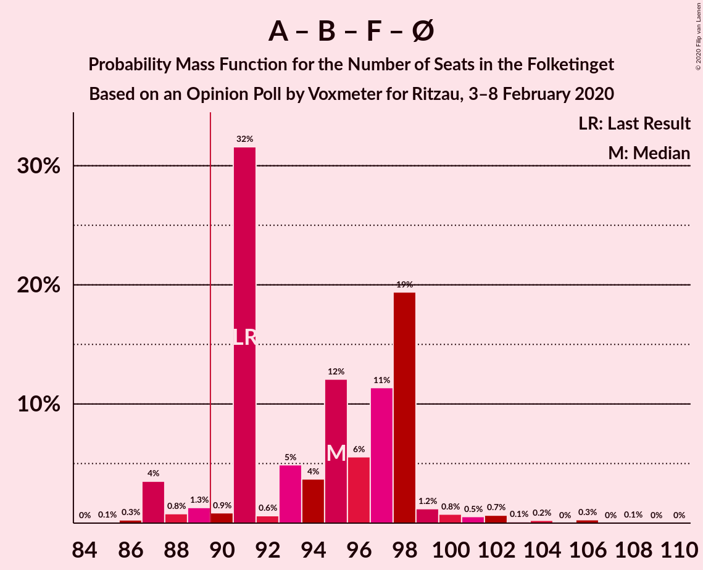
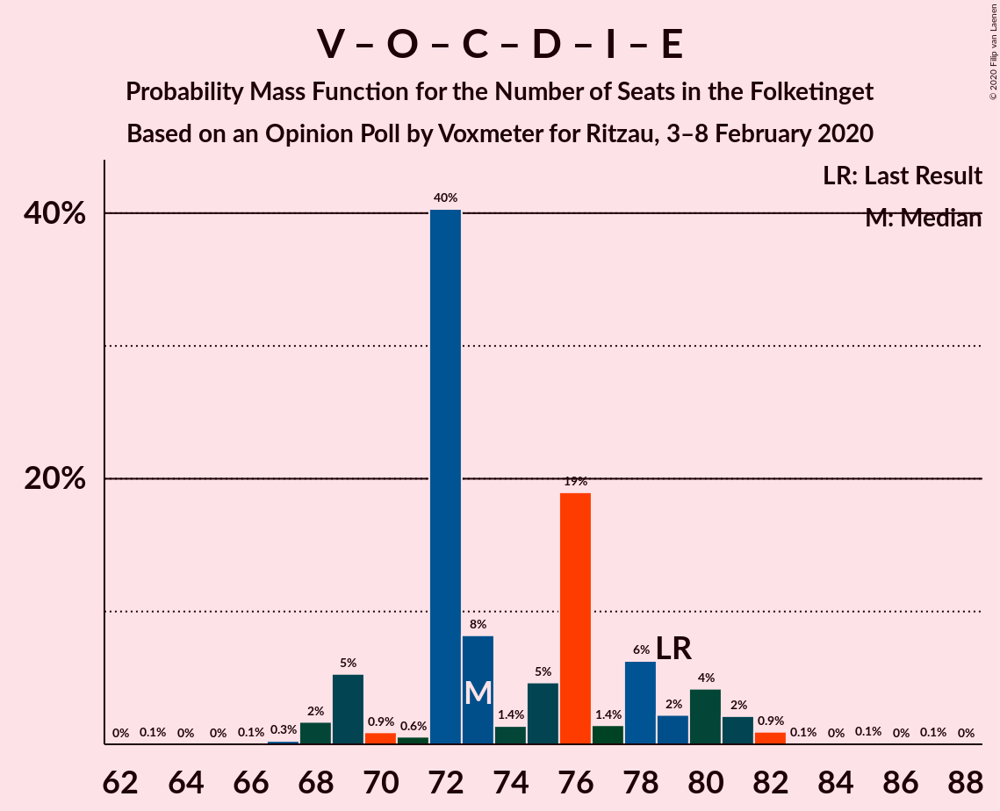
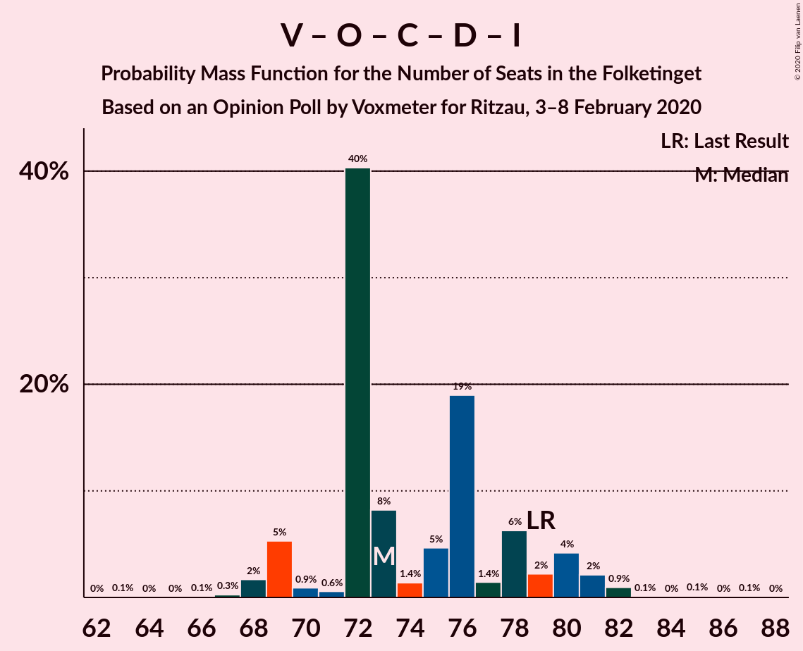

# Opinion Poll by Voxmeter for Ritzau, 3–8 February 2020

<a href="#voting-intentions">Voting Intentions</a> | <a href="#seats">Seats</a> | <a href="#coalitions">Coalitions</a> | <a href="#technical-information">Technical Information</a>

## Voting Intentions

### Confidence Intervals

| Party | Last Result | Poll Result | 80% Confidence Interval | 90% Confidence Interval | 95% Confidence Interval | 99% Confidence Interval |
|:-----:|:-----------:|:-----------:|:-----------------------:|:-----------------------:|:-----------------------:|:-----------------------:|
| Socialdemokraterne | 25.9% | 28.4% | 26.7–30.3% |26.2–30.8% |25.8–31.2% |25.0–32.1% |
| Venstre | 23.4% | 23.9% | 22.2–25.6% |21.8–26.1% |21.4–26.5% |20.6–27.4% |
| Radikale Venstre | 8.6% | 8.4% | 7.4–9.6% |7.1–9.9% |6.9–10.2% |6.4–10.8% |
| Socialistisk Folkeparti | 7.7% | 8.0% | 7.0–9.2% |6.8–9.5% |6.5–9.8% |6.1–10.4% |
| Dansk Folkeparti | 8.7% | 7.7% | 6.8–8.9% |6.5–9.2% |6.3–9.5% |5.8–10.1% |
| Enhedslisten–De Rød-Grønne | 6.9% | 7.2% | 6.2–8.3% |6.0–8.6% |5.7–8.9% |5.3–9.4% |
| Det Konservative Folkeparti | 6.6% | 7.0% | 6.1–8.1% |5.8–8.4% |5.6–8.7% |5.2–9.2% |
| Nye Borgerlige | 2.4% | 2.1% | 1.6–2.8% |1.5–3.0% |1.4–3.2% |1.2–3.5% |
| Alternativet | 3.0% | 1.9% | 1.5–2.6% |1.3–2.8% |1.2–2.9% |1.1–3.3% |
| Stram Kurs | 1.8% | 1.8% | 1.4–2.5% |1.3–2.7% |1.2–2.8% |1.0–3.2% |
| Liberal Alliance | 2.3% | 1.7% | 1.3–2.4% |1.2–2.5% |1.1–2.7% |0.9–3.0% |
| Klaus Riskær Pedersen | 0.8% | 0.1% | 0.0–0.4% |0.0–0.5% |0.0–0.5% |0.0–0.7% |

*Note:* The poll result column reflects the actual value used in the calculations. Published results may vary slightly, and in addition be rounded to fewer digits.

## Seats

### Confidence Intervals

| Party | Last Result | Median | 80% Confidence Interval | 90% Confidence Interval | 95% Confidence Interval | 99% Confidence Interval |
|:-----:|:-----------:|:------:|:-----------------------:|:-----------------------:|:-----------------------:|:-----------------------:|
| <a href="#socialdemokraterne">Socialdemokraterne</a> | 48 | 55 | 49–55 |48–55 |47–55 |46–57 |
| <a href="#venstre">Venstre</a> | 43 | 41 | 40–45 |40–47 |40–47 |37–47 |
| <a href="#radikale-venstre">Radikale Venstre</a> | 16 | 15 | 14–17 |13–17 |12–18 |12–21 |
| <a href="#socialistisk-folkeparti">Socialistisk Folkeparti</a> | 14 | 14 | 13–16 |12–17 |11–17 |11–19 |
| <a href="#dansk-folkeparti">Dansk Folkeparti</a> | 16 | 14 | 13–14 |12–15 |12–15 |12–17 |
| <a href="#enhedslisten–de-rød-grønne">Enhedslisten–De Rød-Grønne</a> | 13 | 13 | 12–15 |11–15 |10–16 |9–16 |
| <a href="#det-konservative-folkeparti">Det Konservative Folkeparti</a> | 12 | 13 | 12–15 |10–17 |10–17 |9–17 |
| <a href="#nye-borgerlige">Nye Borgerlige</a> | 4 | 5 | 0–5 |0–6 |0–6 |0–7 |
| <a href="#alternativet">Alternativet</a> | 5 | 0 | 0–5 |0–5 |0–6 |0–6 |
| <a href="#stram-kurs">Stram Kurs</a> | 0 | 0 | 0–4 |0–4 |0–5 |0–7 |
| <a href="#liberal-alliance">Liberal Alliance</a> | 4 | 0 | 0–4 |0–4 |0–5 |0–5 |
| <a href="#klaus-riskær-pedersen">Klaus Riskær Pedersen</a> | 0 | 0 | 0 |0 |0 |0 |

### Socialdemokraterne

*For a full overview of the results for this party, see the [Socialdemokraterne](party-socialdemokraterne.html) page.*

| Number of Seats | Probability | Accumulated | Special Marks |
|:---------------:|:-----------:|:-----------:|:-------------:|
| 42 | 0.1% | 100% |  |
| 43 | 0% | 99.9% |  |
| 44 | 0% | 99.9% |  |
| 45 | 0% | 99.9% |  |
| 46 | 0.4% | 99.8% |  |
| 47 | 3% | 99.4% |  |
| 48 | 4% | 97% | Last Result |
| 49 | 5% | 93% |  |
| 50 | 6% | 88% |  |
| 51 | 8% | 82% |  |
| 52 | 0.6% | 74% |  |
| 53 | 7% | 73% |  |
| 54 | 6% | 66% |  |
| 55 | 58% | 60% | Median |
| 56 | 0.5% | 2% |  |
| 57 | 1.2% | 1.4% |  |
| 58 | 0.1% | 0.2% |  |
| 59 | 0.1% | 0.1% |  |
| 60 | 0% | 0% |  |

### Venstre

*For a full overview of the results for this party, see the [Venstre](party-venstre.html) page.*

| Number of Seats | Probability | Accumulated | Special Marks |
|:---------------:|:-----------:|:-----------:|:-------------:|
| 36 | 0.1% | 100% |  |
| 37 | 0.7% | 99.9% |  |
| 38 | 0.1% | 99.1% |  |
| 39 | 1.0% | 99.0% |  |
| 40 | 8% | 98% |  |
| 41 | 61% | 90% | Median |
| 42 | 2% | 29% |  |
| 43 | 8% | 27% | Last Result |
| 44 | 6% | 19% |  |
| 45 | 3% | 13% |  |
| 46 | 4% | 9% |  |
| 47 | 5% | 5% |  |
| 48 | 0.1% | 0.4% |  |
| 49 | 0% | 0.2% |  |
| 50 | 0.1% | 0.2% |  |
| 51 | 0% | 0.1% |  |
| 52 | 0% | 0% |  |

### Radikale Venstre

*For a full overview of the results for this party, see the [Radikale Venstre](party-radikalevenstre.html) page.*

| Number of Seats | Probability | Accumulated | Special Marks |
|:---------------:|:-----------:|:-----------:|:-------------:|
| 11 | 0.1% | 100% |  |
| 12 | 4% | 99.9% |  |
| 13 | 6% | 96% |  |
| 14 | 2% | 90% |  |
| 15 | 61% | 88% | Median |
| 16 | 8% | 27% | Last Result |
| 17 | 15% | 19% |  |
| 18 | 3% | 4% |  |
| 19 | 0.2% | 2% |  |
| 20 | 0% | 1.5% |  |
| 21 | 1.4% | 1.4% |  |
| 22 | 0% | 0% |  |

### Socialistisk Folkeparti

*For a full overview of the results for this party, see the [Socialistisk Folkeparti](party-socialistiskfolkeparti.html) page.*

| Number of Seats | Probability | Accumulated | Special Marks |
|:---------------:|:-----------:|:-----------:|:-------------:|
| 10 | 0.1% | 100% |  |
| 11 | 3% | 99.9% |  |
| 12 | 3% | 97% |  |
| 13 | 9% | 94% |  |
| 14 | 68% | 86% | Last Result, Median |
| 15 | 8% | 18% |  |
| 16 | 5% | 10% |  |
| 17 | 4% | 6% |  |
| 18 | 0.9% | 1.4% |  |
| 19 | 0.4% | 0.6% |  |
| 20 | 0.2% | 0.2% |  |
| 21 | 0% | 0% |  |

### Dansk Folkeparti

*For a full overview of the results for this party, see the [Dansk Folkeparti](party-danskfolkeparti.html) page.*

| Number of Seats | Probability | Accumulated | Special Marks |
|:---------------:|:-----------:|:-----------:|:-------------:|
| 10 | 0.1% | 100% |  |
| 11 | 0.3% | 99.9% |  |
| 12 | 9% | 99.6% |  |
| 13 | 18% | 91% |  |
| 14 | 64% | 73% | Median |
| 15 | 7% | 9% |  |
| 16 | 1.0% | 2% | Last Result |
| 17 | 0.8% | 1.1% |  |
| 18 | 0.2% | 0.3% |  |
| 19 | 0.1% | 0.1% |  |
| 20 | 0% | 0% |  |

### Enhedslisten–De Rød-Grønne

*For a full overview of the results for this party, see the [Enhedslisten–De Rød-Grønne](party-enhedslisten–derød-grønne.html) page.*

| Number of Seats | Probability | Accumulated | Special Marks |
|:---------------:|:-----------:|:-----------:|:-------------:|
| 9 | 2% | 100% |  |
| 10 | 2% | 98% |  |
| 11 | 1.3% | 96% |  |
| 12 | 5% | 94% |  |
| 13 | 64% | 89% | Last Result, Median |
| 14 | 4% | 25% |  |
| 15 | 17% | 21% |  |
| 16 | 4% | 4% |  |
| 17 | 0.1% | 0.1% |  |
| 18 | 0% | 0.1% |  |
| 19 | 0% | 0% |  |

### Det Konservative Folkeparti

*For a full overview of the results for this party, see the [Det Konservative Folkeparti](party-detkonservativefolkeparti.html) page.*

| Number of Seats | Probability | Accumulated | Special Marks |
|:---------------:|:-----------:|:-----------:|:-------------:|
| 9 | 0.7% | 100% |  |
| 10 | 5% | 99.3% |  |
| 11 | 1.0% | 94% |  |
| 12 | 12% | 93% | Last Result |
| 13 | 63% | 81% | Median |
| 14 | 6% | 19% |  |
| 15 | 5% | 12% |  |
| 16 | 0.5% | 7% |  |
| 17 | 6% | 7% |  |
| 18 | 0% | 0.1% |  |
| 19 | 0.1% | 0.1% |  |
| 20 | 0% | 0% |  |

### Nye Borgerlige

*For a full overview of the results for this party, see the [Nye Borgerlige](party-nyeborgerlige.html) page.*

| Number of Seats | Probability | Accumulated | Special Marks |
|:---------------:|:-----------:|:-----------:|:-------------:|
| 0 | 26% | 100% |  |
| 1 | 0% | 74% |  |
| 2 | 0% | 74% |  |
| 3 | 0% | 74% |  |
| 4 | 5% | 74% | Last Result |
| 5 | 63% | 69% | Median |
| 6 | 4% | 6% |  |
| 7 | 2% | 2% |  |
| 8 | 0% | 0% |  |

### Alternativet

*For a full overview of the results for this party, see the [Alternativet](party-alternativet.html) page.*

| Number of Seats | Probability | Accumulated | Special Marks |
|:---------------:|:-----------:|:-----------:|:-------------:|
| 0 | 74% | 100% | Median |
| 1 | 0% | 26% |  |
| 2 | 0% | 26% |  |
| 3 | 0% | 26% |  |
| 4 | 12% | 26% |  |
| 5 | 10% | 14% | Last Result |
| 6 | 4% | 4% |  |
| 7 | 0.1% | 0.1% |  |
| 8 | 0% | 0% |  |

### Stram Kurs

*For a full overview of the results for this party, see the [Stram Kurs](party-stramkurs.html) page.*

| Number of Seats | Probability | Accumulated | Special Marks |
|:---------------:|:-----------:|:-----------:|:-------------:|
| 0 | 79% | 100% | Last Result, Median |
| 1 | 0% | 21% |  |
| 2 | 0% | 21% |  |
| 3 | 0% | 21% |  |
| 4 | 17% | 21% |  |
| 5 | 3% | 4% |  |
| 6 | 0.1% | 0.8% |  |
| 7 | 0.7% | 0.7% |  |
| 8 | 0% | 0% |  |

### Liberal Alliance

*For a full overview of the results for this party, see the [Liberal Alliance](party-liberalalliance.html) page.*

| Number of Seats | Probability | Accumulated | Special Marks |
|:---------------:|:-----------:|:-----------:|:-------------:|
| 0 | 80% | 100% | Median |
| 1 | 0% | 20% |  |
| 2 | 0% | 20% |  |
| 3 | 0% | 20% |  |
| 4 | 17% | 20% | Last Result |
| 5 | 3% | 4% |  |
| 6 | 0.4% | 0.4% |  |
| 7 | 0.1% | 0.1% |  |
| 8 | 0% | 0% |  |

### Klaus Riskær Pedersen

*For a full overview of the results for this party, see the [Klaus Riskær Pedersen](party-klausriskærpedersen.html) page.*

| Number of Seats | Probability | Accumulated | Special Marks |
|:---------------:|:-----------:|:-----------:|:-------------:|
| 0 | 100% | 100% | Last Result, Median |

## Coalitions

### Confidence Intervals

| Coalition | Last Result | Median | Majority? | 80% Confidence Interval | 90% Confidence Interval | 95% Confidence Interval | 99% Confidence Interval |
|:---------:|:-----------:|:------:|:---------:|:-----------------------:|:-----------------------:|:-----------------------:|:-----------------------:|
| Socialdemokraterne – Radikale Venstre – Socialistisk Folkeparti – Enhedslisten–De Rød-Grønne – Alternativet | 96 | 97 | 97% | 95–102 | 94–102 | 88–104 | 87–104 |
| Socialdemokraterne – Radikale Venstre – Socialistisk Folkeparti – Enhedslisten–De Rød-Grønne | 91 | 97 | 97% | 91–98 | 90–98 | 88–99 | 87–100 |
| Socialdemokraterne – Socialistisk Folkeparti – Enhedslisten–De Rød-Grønne – Alternativet | 80 | 82 | 0% | 79–85 | 76–88 | 74–88 | 71–88 |
| Socialdemokraterne – Radikale Venstre – Socialistisk Folkeparti | 78 | 84 | 0.2% | 77–85 | 75–85 | 75–86 | 75–88 |
| Socialdemokraterne – Socialistisk Folkeparti – Enhedslisten–De Rød-Grønne | 75 | 82 | 0% | 76–82 | 75–82 | 74–83 | 71–85 |
| Venstre – Dansk Folkeparti – Det Konservative Folkeparti – Nye Borgerlige – Liberal Alliance – Klaus Riskær Pedersen | 79 | 73 | 0% | 70–77 | 69–78 | 69–79 | 68–80 |
| Venstre – Dansk Folkeparti – Det Konservative Folkeparti – Nye Borgerlige – Liberal Alliance | 79 | 73 | 0% | 70–77 | 69–78 | 69–79 | 68–80 |
| Venstre – Dansk Folkeparti – Det Konservative Folkeparti – Liberal Alliance | 75 | 68 | 0% | 68–74 | 67–77 | 66–77 | 65–77 |
| Socialdemokraterne – Radikale Venstre | 64 | 70 | 0% | 64–70 | 61–71 | 61–71 | 60–73 |
| Venstre – Det Konservative Folkeparti – Liberal Alliance | 59 | 54 | 0% | 54–61 | 53–64 | 51–64 | 51–64 |
| Venstre – Det Konservative Folkeparti | 55 | 54 | 0% | 52–60 | 51–60 | 51–60 | 49–62 |
| Venstre | 43 | 41 | 0% | 40–45 | 40–47 | 40–47 | 37–47 |

### Socialdemokraterne – Radikale Venstre – Socialistisk Folkeparti – Enhedslisten–De Rød-Grønne – Alternativet

| Number of Seats | Probability | Accumulated | Special Marks |
|:---------------:|:-----------:|:-----------:|:-------------:|
| 85 | 0.1% | 100% |  |
| 86 | 0% | 99.9% |  |
| 87 | 1.3% | 99.9% |  |
| 88 | 2% | 98.6% |  |
| 89 | 0% | 97% |  |
| 90 | 0.3% | 97% | Majority |
| 91 | 0.6% | 97% |  |
| 92 | 0.1% | 96% |  |
| 93 | 0.9% | 96% |  |
| 94 | 2% | 95% |  |
| 95 | 9% | 93% |  |
| 96 | 4% | 85% | Last Result |
| 97 | 56% | 81% | Median |
| 98 | 8% | 25% |  |
| 99 | 0.6% | 17% |  |
| 100 | 1.0% | 16% |  |
| 101 | 4% | 15% |  |
| 102 | 8% | 12% |  |
| 103 | 0.1% | 4% |  |
| 104 | 4% | 4% |  |
| 105 | 0.2% | 0.2% |  |
| 106 | 0% | 0% |  |

### Socialdemokraterne – Radikale Venstre – Socialistisk Folkeparti – Enhedslisten–De Rød-Grønne

| Number of Seats | Probability | Accumulated | Special Marks |
|:---------------:|:-----------:|:-----------:|:-------------:|
| 81 | 0.1% | 100% |  |
| 82 | 0% | 99.9% |  |
| 83 | 0% | 99.9% |  |
| 84 | 0% | 99.9% |  |
| 85 | 0.3% | 99.9% |  |
| 86 | 0.1% | 99.7% |  |
| 87 | 1.4% | 99.6% |  |
| 88 | 2% | 98% |  |
| 89 | 0.1% | 97% |  |
| 90 | 4% | 97% | Majority |
| 91 | 6% | 93% | Last Result |
| 92 | 0.3% | 87% |  |
| 93 | 1.1% | 86% |  |
| 94 | 2% | 85% |  |
| 95 | 6% | 84% |  |
| 96 | 2% | 78% |  |
| 97 | 56% | 76% | Median |
| 98 | 15% | 20% |  |
| 99 | 4% | 5% |  |
| 100 | 0.3% | 0.8% |  |
| 101 | 0% | 0.5% |  |
| 102 | 0.3% | 0.5% |  |
| 103 | 0% | 0.2% |  |
| 104 | 0% | 0.2% |  |
| 105 | 0.2% | 0.2% |  |
| 106 | 0% | 0% |  |

### Socialdemokraterne – Socialistisk Folkeparti – Enhedslisten–De Rød-Grønne – Alternativet

| Number of Seats | Probability | Accumulated | Special Marks |
|:---------------:|:-----------:|:-----------:|:-------------:|
| 71 | 2% | 100% |  |
| 72 | 0% | 98% |  |
| 73 | 0% | 98% |  |
| 74 | 2% | 98% |  |
| 75 | 0.2% | 96% |  |
| 76 | 1.3% | 96% |  |
| 77 | 2% | 95% |  |
| 78 | 2% | 93% |  |
| 79 | 3% | 91% |  |
| 80 | 0.5% | 88% | Last Result |
| 81 | 10% | 88% |  |
| 82 | 56% | 77% | Median |
| 83 | 4% | 21% |  |
| 84 | 0.1% | 17% |  |
| 85 | 7% | 17% |  |
| 86 | 1.5% | 9% |  |
| 87 | 0.2% | 8% |  |
| 88 | 8% | 8% |  |
| 89 | 0.1% | 0.1% |  |
| 90 | 0% | 0% | Majority |

### Socialdemokraterne – Radikale Venstre – Socialistisk Folkeparti

| Number of Seats | Probability | Accumulated | Special Marks |
|:---------------:|:-----------:|:-----------:|:-------------:|
| 70 | 0.1% | 100% |  |
| 71 | 0% | 99.9% |  |
| 72 | 0% | 99.9% |  |
| 73 | 0% | 99.9% |  |
| 74 | 0.1% | 99.9% |  |
| 75 | 5% | 99.8% |  |
| 76 | 3% | 95% |  |
| 77 | 2% | 92% |  |
| 78 | 0.1% | 90% | Last Result |
| 79 | 3% | 90% |  |
| 80 | 5% | 87% |  |
| 81 | 2% | 82% |  |
| 82 | 2% | 80% |  |
| 83 | 10% | 78% |  |
| 84 | 57% | 68% | Median |
| 85 | 7% | 11% |  |
| 86 | 2% | 3% |  |
| 87 | 0.1% | 1.5% |  |
| 88 | 1.1% | 1.4% |  |
| 89 | 0.1% | 0.3% |  |
| 90 | 0% | 0.2% | Majority |
| 91 | 0.1% | 0.1% |  |
| 92 | 0% | 0% |  |

### Socialdemokraterne – Socialistisk Folkeparti – Enhedslisten–De Rød-Grønne

| Number of Seats | Probability | Accumulated | Special Marks |
|:---------------:|:-----------:|:-----------:|:-------------:|
| 67 | 0.1% | 100% |  |
| 68 | 0% | 99.9% |  |
| 69 | 0% | 99.9% |  |
| 70 | 0.2% | 99.9% |  |
| 71 | 2% | 99.7% |  |
| 72 | 0.1% | 98% |  |
| 73 | 0.4% | 98% |  |
| 74 | 2% | 98% |  |
| 75 | 2% | 96% | Last Result |
| 76 | 3% | 93% |  |
| 77 | 2% | 90% |  |
| 78 | 5% | 88% |  |
| 79 | 0.9% | 82% |  |
| 80 | 1.4% | 81% |  |
| 81 | 14% | 80% |  |
| 82 | 61% | 66% | Median |
| 83 | 4% | 5% |  |
| 84 | 0% | 0.8% |  |
| 85 | 0.3% | 0.7% |  |
| 86 | 0% | 0.5% |  |
| 87 | 0.1% | 0.4% |  |
| 88 | 0.3% | 0.4% |  |
| 89 | 0.1% | 0.1% |  |
| 90 | 0% | 0% | Majority |

### Venstre – Dansk Folkeparti – Det Konservative Folkeparti – Nye Borgerlige – Liberal Alliance – Klaus Riskær Pedersen

| Number of Seats | Probability | Accumulated | Special Marks |
|:---------------:|:-----------:|:-----------:|:-------------:|
| 64 | 0.1% | 100% |  |
| 65 | 0.1% | 99.9% |  |
| 66 | 0.2% | 99.9% |  |
| 67 | 0.2% | 99.7% |  |
| 68 | 0.1% | 99.5% |  |
| 69 | 7% | 99.4% |  |
| 70 | 3% | 92% |  |
| 71 | 5% | 90% |  |
| 72 | 1.4% | 85% |  |
| 73 | 59% | 84% | Median |
| 74 | 6% | 25% |  |
| 75 | 3% | 19% |  |
| 76 | 4% | 17% |  |
| 77 | 7% | 13% |  |
| 78 | 2% | 6% |  |
| 79 | 3% | 4% | Last Result |
| 80 | 0.3% | 0.7% |  |
| 81 | 0.1% | 0.4% |  |
| 82 | 0% | 0.3% |  |
| 83 | 0.1% | 0.3% |  |
| 84 | 0.1% | 0.2% |  |
| 85 | 0.1% | 0.1% |  |
| 86 | 0% | 0% |  |

### Venstre – Dansk Folkeparti – Det Konservative Folkeparti – Nye Borgerlige – Liberal Alliance

| Number of Seats | Probability | Accumulated | Special Marks |
|:---------------:|:-----------:|:-----------:|:-------------:|
| 64 | 0.1% | 100% |  |
| 65 | 0.1% | 99.9% |  |
| 66 | 0.2% | 99.9% |  |
| 67 | 0.2% | 99.7% |  |
| 68 | 0.1% | 99.5% |  |
| 69 | 7% | 99.4% |  |
| 70 | 3% | 92% |  |
| 71 | 5% | 90% |  |
| 72 | 1.4% | 85% |  |
| 73 | 59% | 84% | Median |
| 74 | 6% | 25% |  |
| 75 | 3% | 19% |  |
| 76 | 4% | 17% |  |
| 77 | 7% | 13% |  |
| 78 | 2% | 6% |  |
| 79 | 3% | 4% | Last Result |
| 80 | 0.3% | 0.7% |  |
| 81 | 0.1% | 0.4% |  |
| 82 | 0% | 0.3% |  |
| 83 | 0.1% | 0.3% |  |
| 84 | 0.1% | 0.2% |  |
| 85 | 0.1% | 0.1% |  |
| 86 | 0% | 0% |  |

### Venstre – Dansk Folkeparti – Det Konservative Folkeparti – Liberal Alliance

| Number of Seats | Probability | Accumulated | Special Marks |
|:---------------:|:-----------:|:-----------:|:-------------:|
| 61 | 0% | 100% |  |
| 62 | 0.1% | 99.9% |  |
| 63 | 0.1% | 99.9% |  |
| 64 | 0.1% | 99.7% |  |
| 65 | 0.3% | 99.7% |  |
| 66 | 4% | 99.3% |  |
| 67 | 0.9% | 96% |  |
| 68 | 56% | 95% | Median |
| 69 | 8% | 38% |  |
| 70 | 7% | 30% |  |
| 71 | 0.8% | 23% |  |
| 72 | 3% | 22% |  |
| 73 | 1.4% | 19% |  |
| 74 | 9% | 17% |  |
| 75 | 1.0% | 9% | Last Result |
| 76 | 0.8% | 8% |  |
| 77 | 7% | 7% |  |
| 78 | 0.2% | 0.5% |  |
| 79 | 0.2% | 0.3% |  |
| 80 | 0% | 0.2% |  |
| 81 | 0.1% | 0.1% |  |
| 82 | 0% | 0.1% |  |
| 83 | 0% | 0% |  |

### Socialdemokraterne – Radikale Venstre

| Number of Seats | Probability | Accumulated | Special Marks |
|:---------------:|:-----------:|:-----------:|:-------------:|
| 56 | 0.1% | 100% |  |
| 57 | 0% | 99.9% |  |
| 58 | 0% | 99.9% |  |
| 59 | 0.1% | 99.9% |  |
| 60 | 1.4% | 99.8% |  |
| 61 | 4% | 98% |  |
| 62 | 0.2% | 94% |  |
| 63 | 0.1% | 94% |  |
| 64 | 8% | 94% | Last Result |
| 65 | 3% | 86% |  |
| 66 | 6% | 84% |  |
| 67 | 2% | 78% |  |
| 68 | 2% | 76% |  |
| 69 | 0.2% | 74% |  |
| 70 | 64% | 74% | Median |
| 71 | 8% | 9% |  |
| 72 | 0.2% | 2% |  |
| 73 | 1.2% | 1.5% |  |
| 74 | 0.2% | 0.3% |  |
| 75 | 0% | 0.1% |  |
| 76 | 0.1% | 0.1% |  |
| 77 | 0% | 0% |  |

### Venstre – Det Konservative Folkeparti – Liberal Alliance

| Number of Seats | Probability | Accumulated | Special Marks |
|:---------------:|:-----------:|:-----------:|:-------------:|
| 47 | 0.1% | 100% |  |
| 48 | 0.1% | 99.9% |  |
| 49 | 0% | 99.8% |  |
| 50 | 0.1% | 99.8% |  |
| 51 | 4% | 99.7% |  |
| 52 | 0.2% | 95% |  |
| 53 | 1.1% | 95% |  |
| 54 | 56% | 94% | Median |
| 55 | 0.1% | 38% |  |
| 56 | 8% | 38% |  |
| 57 | 2% | 30% |  |
| 58 | 9% | 28% |  |
| 59 | 2% | 19% | Last Result |
| 60 | 6% | 17% |  |
| 61 | 3% | 11% |  |
| 62 | 1.2% | 8% |  |
| 63 | 0.1% | 7% |  |
| 64 | 6% | 7% |  |
| 65 | 0.2% | 0.3% |  |
| 66 | 0% | 0.1% |  |
| 67 | 0.1% | 0.1% |  |
| 68 | 0% | 0% |  |

### Venstre – Det Konservative Folkeparti

| Number of Seats | Probability | Accumulated | Special Marks |
|:---------------:|:-----------:|:-----------:|:-------------:|
| 47 | 0.1% | 100% |  |
| 48 | 0.1% | 99.9% |  |
| 49 | 0.5% | 99.8% |  |
| 50 | 0.1% | 99.3% |  |
| 51 | 4% | 99.2% |  |
| 52 | 7% | 95% |  |
| 53 | 2% | 88% |  |
| 54 | 56% | 86% | Median |
| 55 | 2% | 29% | Last Result |
| 56 | 4% | 28% |  |
| 57 | 2% | 24% |  |
| 58 | 8% | 22% |  |
| 59 | 0.2% | 14% |  |
| 60 | 11% | 14% |  |
| 61 | 1.1% | 2% |  |
| 62 | 1.1% | 1.2% |  |
| 63 | 0% | 0.1% |  |
| 64 | 0% | 0.1% |  |
| 65 | 0% | 0% |  |

### Venstre

| Number of Seats | Probability | Accumulated | Special Marks |
|:---------------:|:-----------:|:-----------:|:-------------:|
| 36 | 0.1% | 100% |  |
| 37 | 0.7% | 99.9% |  |
| 38 | 0.1% | 99.1% |  |
| 39 | 1.0% | 99.0% |  |
| 40 | 8% | 98% |  |
| 41 | 61% | 90% | Median |
| 42 | 2% | 29% |  |
| 43 | 8% | 27% | Last Result |
| 44 | 6% | 19% |  |
| 45 | 3% | 13% |  |
| 46 | 4% | 9% |  |
| 47 | 5% | 5% |  |
| 48 | 0.1% | 0.4% |  |
| 49 | 0% | 0.2% |  |
| 50 | 0.1% | 0.2% |  |
| 51 | 0% | 0.1% |  |
| 52 | 0% | 0% |  |

## Technical Information

### Opinion Poll

+ **Polling firm:** Voxmeter
+ **Commissioner(s):** Ritzau
+ **Fieldwork period:** 3–8 February 2020

### Calculations

+ **Sample size:** 1048
+ **Simulations done:** 131,072
+ **Error estimate:** 2.38%

