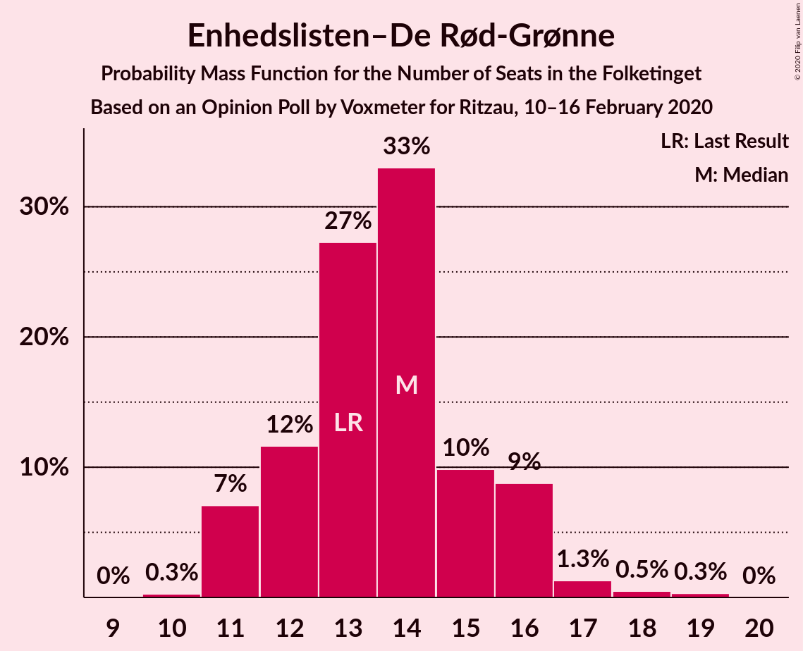
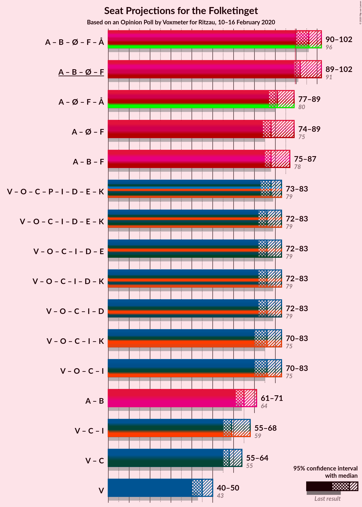
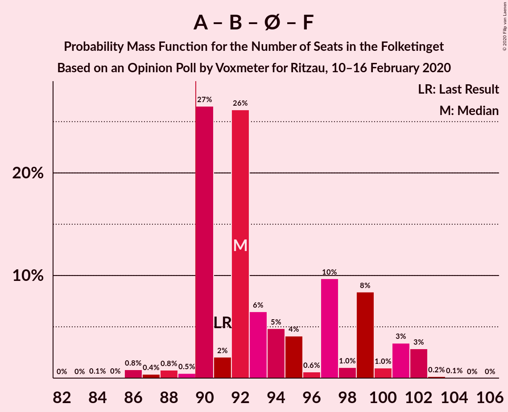

# Opinion Poll by Voxmeter for Ritzau, 10–16 February 2020

<a href="#voting-intentions">Voting Intentions</a> | <a href="#seats">Seats</a> | <a href="#coalitions">Coalitions</a> | <a href="#technical-information">Technical Information</a>

## Voting Intentions

### Confidence Intervals

| Party | Last Result | Poll Result | 80% Confidence Interval | 90% Confidence Interval | 95% Confidence Interval | 99% Confidence Interval |
|:-----:|:-----------:|:-----------:|:-----------------------:|:-----------------------:|:-----------------------:|:-----------------------:|
| Socialdemokraterne | 25.9% | 27.8% | 26.0–29.7% |25.6–30.2% |25.1–30.7% |24.3–31.6% |
| Venstre | 23.4% | 24.4% | 22.7–26.2% |22.3–26.7% |21.9–27.2% |21.1–28.1% |
| Dansk Folkeparti | 8.7% | 8.3% | 7.3–9.5% |7.0–9.8% |6.7–10.2% |6.3–10.8% |
| Radikale Venstre | 8.6% | 8.0% | 7.0–9.2% |6.7–9.5% |6.4–9.8% |6.0–10.4% |
| Enhedslisten–De Rød-Grønne | 6.9% | 7.7% | 6.7–8.9% |6.4–9.2% |6.2–9.5% |5.7–10.1% |
| Det Konservative Folkeparti | 6.6% | 7.6% | 6.6–8.8% |6.3–9.1% |6.1–9.4% |5.7–10.0% |
| Socialistisk Folkeparti | 7.7% | 7.5% | 6.5–8.7% |6.2–9.0% |6.0–9.3% |5.6–9.9% |
| Stram Kurs | 1.8% | 1.9% | 1.4–2.6% |1.3–2.8% |1.2–2.9% |1.0–3.3% |
| Liberal Alliance | 2.3% | 1.6% | 1.2–2.2% |1.1–2.4% |1.0–2.6% |0.8–2.9% |
| Alternativet | 3.0% | 1.6% | 1.2–2.2% |1.1–2.4% |1.0–2.6% |0.8–2.9% |
| Nye Borgerlige | 2.4% | 1.6% | 1.2–2.2% |1.1–2.4% |1.0–2.6% |0.8–2.9% |
| Klaus Riskær Pedersen | 0.8% | 0.5% | 0.3–0.9% |0.3–1.1% |0.2–1.2% |0.2–1.4% |

*Note:* The poll result column reflects the actual value used in the calculations. Published results may vary slightly, and in addition be rounded to fewer digits.

## Seats

### Confidence Intervals

| Party | Last Result | Median | 80% Confidence Interval | 90% Confidence Interval | 95% Confidence Interval | 99% Confidence Interval |
|:-----:|:-----------:|:------:|:-----------------------:|:-----------------------:|:-----------------------:|:-----------------------:|
| <a href="#socialdemokraterne">Socialdemokraterne</a> | 48 | 51 | 50–53 |48–53 |48–53 |46–56 |
| <a href="#venstre">Venstre</a> | 43 | 44 | 44–48 |42–48 |42–48 |40–49 |
| <a href="#dansk-folkeparti">Dansk Folkeparti</a> | 16 | 16 | 14–19 |14–21 |13–21 |13–21 |
| <a href="#radikale-venstre">Radikale Venstre</a> | 16 | 13 | 13–14 |13–15 |13–15 |12–18 |
| <a href="#enhedslisten–de-rød-grønne">Enhedslisten–De Rød-Grønne</a> | 13 | 14 | 14–16 |13–16 |13–16 |12–17 |
| <a href="#det-konservative-folkeparti">Det Konservative Folkeparti</a> | 12 | 13 | 11–15 |11–17 |11–17 |11–17 |
| <a href="#socialistisk-folkeparti">Socialistisk Folkeparti</a> | 14 | 13 | 11–17 |11–17 |11–17 |11–17 |
| <a href="#stram-kurs">Stram Kurs</a> | 0 | 0 | 0–4 |0–4 |0–4 |0–5 |
| <a href="#liberal-alliance">Liberal Alliance</a> | 4 | 0 | 0 |0–4 |0–4 |0–4 |
| <a href="#alternativet">Alternativet</a> | 5 | 0 | 0–4 |0–5 |0–5 |0–5 |
| <a href="#nye-borgerlige">Nye Borgerlige</a> | 4 | 4 | 0–4 |0–4 |0–4 |0–4 |
| <a href="#klaus-riskær-pedersen">Klaus Riskær Pedersen</a> | 0 | 0 | 0 |0 |0 |0 |

### Socialdemokraterne

*For a full overview of the results for this party, see the [Socialdemokraterne](party-socialdemokraterne.html) page.*

| Number of Seats | Probability | Accumulated | Special Marks |
|:---------------:|:-----------:|:-----------:|:-------------:|
| 43 | 0% | 100% |  |
| 44 | 0.2% | 99.9% |  |
| 45 | 0.2% | 99.8% |  |
| 46 | 0.2% | 99.6% |  |
| 47 | 1.0% | 99.4% |  |
| 48 | 5% | 98% | Last Result |
| 49 | 1.2% | 93% |  |
| 50 | 6% | 92% |  |
| 51 | 37% | 86% | Median |
| 52 | 0.7% | 49% |  |
| 53 | 47% | 49% |  |
| 54 | 0.2% | 1.4% |  |
| 55 | 0.5% | 1.2% |  |
| 56 | 0.4% | 0.7% |  |
| 57 | 0.1% | 0.4% |  |
| 58 | 0% | 0.3% |  |
| 59 | 0.3% | 0.3% |  |
| 60 | 0% | 0% |  |

### Venstre

*For a full overview of the results for this party, see the [Venstre](party-venstre.html) page.*

| Number of Seats | Probability | Accumulated | Special Marks |
|:---------------:|:-----------:|:-----------:|:-------------:|
| 38 | 0.2% | 100% |  |
| 39 | 0% | 99.7% |  |
| 40 | 0.8% | 99.7% |  |
| 41 | 0.2% | 99.0% |  |
| 42 | 6% | 98.8% |  |
| 43 | 0.5% | 93% | Last Result |
| 44 | 46% | 93% | Median |
| 45 | 30% | 46% |  |
| 46 | 1.5% | 17% |  |
| 47 | 0% | 15% |  |
| 48 | 14% | 15% |  |
| 49 | 1.4% | 2% |  |
| 50 | 0.1% | 0.4% |  |
| 51 | 0% | 0.3% |  |
| 52 | 0% | 0.2% |  |
| 53 | 0.2% | 0.2% |  |
| 54 | 0% | 0% |  |

### Dansk Folkeparti

*For a full overview of the results for this party, see the [Dansk Folkeparti](party-danskfolkeparti.html) page.*

| Number of Seats | Probability | Accumulated | Special Marks |
|:---------------:|:-----------:|:-----------:|:-------------:|
| 12 | 0.2% | 100% |  |
| 13 | 3% | 99.7% |  |
| 14 | 30% | 97% |  |
| 15 | 7% | 67% |  |
| 16 | 14% | 59% | Last Result, Median |
| 17 | 34% | 45% |  |
| 18 | 0.1% | 11% |  |
| 19 | 5% | 11% |  |
| 20 | 0.4% | 6% |  |
| 21 | 5% | 5% |  |
| 22 | 0% | 0% |  |

### Radikale Venstre

*For a full overview of the results for this party, see the [Radikale Venstre](party-radikalevenstre.html) page.*

| Number of Seats | Probability | Accumulated | Special Marks |
|:---------------:|:-----------:|:-----------:|:-------------:|
| 11 | 0.3% | 100% |  |
| 12 | 2% | 99.6% |  |
| 13 | 69% | 98% | Median |
| 14 | 21% | 29% |  |
| 15 | 5% | 8% |  |
| 16 | 0.4% | 2% | Last Result |
| 17 | 0.3% | 2% |  |
| 18 | 1.5% | 2% |  |
| 19 | 0% | 0.2% |  |
| 20 | 0.1% | 0.1% |  |
| 21 | 0% | 0% |  |

### Enhedslisten–De Rød-Grønne

*For a full overview of the results for this party, see the [Enhedslisten–De Rød-Grønne](party-enhedslisten–derød-grønne.html) page.*

| Number of Seats | Probability | Accumulated | Special Marks |
|:---------------:|:-----------:|:-----------:|:-------------:|
| 10 | 0.1% | 100% |  |
| 11 | 0.1% | 99.9% |  |
| 12 | 0.4% | 99.8% |  |
| 13 | 7% | 99.4% | Last Result |
| 14 | 55% | 92% | Median |
| 15 | 8% | 38% |  |
| 16 | 29% | 30% |  |
| 17 | 0.4% | 0.7% |  |
| 18 | 0% | 0.3% |  |
| 19 | 0.3% | 0.3% |  |
| 20 | 0% | 0% |  |

### Det Konservative Folkeparti

*For a full overview of the results for this party, see the [Det Konservative Folkeparti](party-detkonservativefolkeparti.html) page.*

| Number of Seats | Probability | Accumulated | Special Marks |
|:---------------:|:-----------:|:-----------:|:-------------:|
| 10 | 0.1% | 100% |  |
| 11 | 29% | 99.9% |  |
| 12 | 1.0% | 71% | Last Result |
| 13 | 45% | 70% | Median |
| 14 | 1.4% | 25% |  |
| 15 | 14% | 23% |  |
| 16 | 2% | 9% |  |
| 17 | 7% | 8% |  |
| 18 | 0.2% | 0.2% |  |
| 19 | 0% | 0% |  |

### Socialistisk Folkeparti

*For a full overview of the results for this party, see the [Socialistisk Folkeparti](party-socialistiskfolkeparti.html) page.*

| Number of Seats | Probability | Accumulated | Special Marks |
|:---------------:|:-----------:|:-----------:|:-------------:|
| 9 | 0.1% | 100% |  |
| 10 | 0.3% | 99.9% |  |
| 11 | 13% | 99.7% |  |
| 12 | 6% | 87% |  |
| 13 | 32% | 81% | Median |
| 14 | 7% | 49% | Last Result |
| 15 | 0.8% | 42% |  |
| 16 | 6% | 41% |  |
| 17 | 35% | 35% |  |
| 18 | 0.2% | 0.2% |  |
| 19 | 0% | 0% |  |

### Stram Kurs

*For a full overview of the results for this party, see the [Stram Kurs](party-stramkurs.html) page.*

| Number of Seats | Probability | Accumulated | Special Marks |
|:---------------:|:-----------:|:-----------:|:-------------:|
| 0 | 63% | 100% | Last Result, Median |
| 1 | 0% | 37% |  |
| 2 | 0% | 37% |  |
| 3 | 0% | 37% |  |
| 4 | 36% | 37% |  |
| 5 | 0.4% | 0.5% |  |
| 6 | 0.1% | 0.1% |  |
| 7 | 0% | 0% |  |

### Liberal Alliance

*For a full overview of the results for this party, see the [Liberal Alliance](party-liberalalliance.html) page.*

| Number of Seats | Probability | Accumulated | Special Marks |
|:---------------:|:-----------:|:-----------:|:-------------:|
| 0 | 93% | 100% | Median |
| 1 | 0% | 7% |  |
| 2 | 0% | 7% |  |
| 3 | 0% | 7% |  |
| 4 | 7% | 7% | Last Result |
| 5 | 0.3% | 0.4% |  |
| 6 | 0.1% | 0.1% |  |
| 7 | 0% | 0% |  |

### Alternativet

*For a full overview of the results for this party, see the [Alternativet](party-alternativet.html) page.*

| Number of Seats | Probability | Accumulated | Special Marks |
|:---------------:|:-----------:|:-----------:|:-------------:|
| 0 | 54% | 100% | Median |
| 1 | 0% | 46% |  |
| 2 | 0% | 46% |  |
| 3 | 0% | 46% |  |
| 4 | 39% | 46% |  |
| 5 | 7% | 7% | Last Result |
| 6 | 0.1% | 0.1% |  |
| 7 | 0% | 0% |  |

### Nye Borgerlige

*For a full overview of the results for this party, see the [Nye Borgerlige](party-nyeborgerlige.html) page.*

| Number of Seats | Probability | Accumulated | Special Marks |
|:---------------:|:-----------:|:-----------:|:-------------:|
| 0 | 37% | 100% |  |
| 1 | 0% | 63% |  |
| 2 | 0% | 63% |  |
| 3 | 0% | 63% |  |
| 4 | 63% | 63% | Last Result, Median |
| 5 | 0.3% | 0.3% |  |
| 6 | 0% | 0% |  |

### Klaus Riskær Pedersen

*For a full overview of the results for this party, see the [Klaus Riskær Pedersen](party-klausriskærpedersen.html) page.*

| Number of Seats | Probability | Accumulated | Special Marks |
|:---------------:|:-----------:|:-----------:|:-------------:|
| 0 | 100% | 100% | Last Result, Median |

## Coalitions

### Confidence Intervals

| Coalition | Last Result | Median | Majority? | 80% Confidence Interval | 90% Confidence Interval | 95% Confidence Interval | 99% Confidence Interval |
|:---------:|:-----------:|:------:|:---------:|:-----------------------:|:-----------------------:|:-----------------------:|:-----------------------:|
| Socialdemokraterne – Radikale Venstre – Enhedslisten–De Rød-Grønne – Socialistisk Folkeparti – Alternativet | 96 | 97 | 99.7% | 92–97 | 90–99 | 90–99 | 90–103 |
| Socialdemokraterne – Radikale Venstre – Enhedslisten–De Rød-Grønne – Socialistisk Folkeparti | 91 | 93 | 98% | 91–97 | 90–97 | 90–97 | 88–99 |
| Socialdemokraterne – Enhedslisten–De Rød-Grønne – Socialistisk Folkeparti – Alternativet | 80 | 84 | 0.6% | 78–84 | 77–85 | 77–85 | 76–90 |
| Socialdemokraterne – Enhedslisten–De Rød-Grønne – Socialistisk Folkeparti | 75 | 80 | 0% | 77–84 | 76–84 | 76–84 | 72–86 |
| Socialdemokraterne – Radikale Venstre – Socialistisk Folkeparti | 78 | 78 | 0.2% | 77–83 | 77–83 | 77–83 | 74–85 |
| Venstre – Dansk Folkeparti – Det Konservative Folkeparti – Liberal Alliance – Nye Borgerlige – Klaus Riskær Pedersen | 79 | 78 | 0% | 74–79 | 74–80 | 74–80 | 72–83 |
| Venstre – Dansk Folkeparti – Det Konservative Folkeparti – Liberal Alliance – Nye Borgerlige | 79 | 78 | 0% | 74–79 | 74–80 | 74–80 | 72–83 |
| Venstre – Dansk Folkeparti – Det Konservative Folkeparti – Liberal Alliance | 75 | 74 | 0% | 70–79 | 70–80 | 70–80 | 70–81 |
| Socialdemokraterne – Radikale Venstre | 64 | 66 | 0% | 64–67 | 61–67 | 61–67 | 61–72 |
| Venstre – Det Konservative Folkeparti – Liberal Alliance | 59 | 57 | 0% | 56–63 | 55–63 | 55–63 | 55–66 |
| Venstre – Det Konservative Folkeparti | 55 | 57 | 0% | 56–63 | 55–63 | 55–63 | 53–63 |
| Venstre | 43 | 44 | 0% | 44–48 | 42–48 | 42–48 | 40–49 |

### Socialdemokraterne – Radikale Venstre – Enhedslisten–De Rød-Grønne – Socialistisk Folkeparti – Alternativet

| Number of Seats | Probability | Accumulated | Special Marks |
|:---------------:|:-----------:|:-----------:|:-------------:|
| 86 | 0.1% | 100% |  |
| 87 | 0% | 99.9% |  |
| 88 | 0.2% | 99.9% |  |
| 89 | 0% | 99.7% |  |
| 90 | 5% | 99.7% | Majority |
| 91 | 0.3% | 94% | Median |
| 92 | 13% | 94% |  |
| 93 | 0.6% | 81% |  |
| 94 | 0.4% | 80% |  |
| 95 | 6% | 80% |  |
| 96 | 1.3% | 74% | Last Result |
| 97 | 63% | 73% |  |
| 98 | 0.9% | 10% |  |
| 99 | 8% | 9% |  |
| 100 | 0% | 1.2% |  |
| 101 | 0.3% | 1.2% |  |
| 102 | 0.2% | 0.9% |  |
| 103 | 0.6% | 0.6% |  |
| 104 | 0% | 0% |  |

### Socialdemokraterne – Radikale Venstre – Enhedslisten–De Rød-Grønne – Socialistisk Folkeparti

| Number of Seats | Probability | Accumulated | Special Marks |
|:---------------:|:-----------:|:-----------:|:-------------:|
| 85 | 0% | 100% |  |
| 86 | 0.4% | 99.9% |  |
| 87 | 0% | 99.6% |  |
| 88 | 0.4% | 99.6% |  |
| 89 | 0.8% | 99.2% |  |
| 90 | 5% | 98% | Majority |
| 91 | 6% | 93% | Last Result, Median |
| 92 | 14% | 87% |  |
| 93 | 29% | 73% |  |
| 94 | 7% | 44% |  |
| 95 | 1.1% | 37% |  |
| 96 | 0.2% | 36% |  |
| 97 | 34% | 36% |  |
| 98 | 1.0% | 2% |  |
| 99 | 0.3% | 0.6% |  |
| 100 | 0% | 0.3% |  |
| 101 | 0.1% | 0.3% |  |
| 102 | 0% | 0.2% |  |
| 103 | 0.2% | 0.2% |  |
| 104 | 0% | 0% |  |

### Socialdemokraterne – Enhedslisten–De Rød-Grønne – Socialistisk Folkeparti – Alternativet

| Number of Seats | Probability | Accumulated | Special Marks |
|:---------------:|:-----------:|:-----------:|:-------------:|
| 72 | 0.2% | 100% |  |
| 73 | 0% | 99.8% |  |
| 74 | 0.1% | 99.7% |  |
| 75 | 0.1% | 99.7% |  |
| 76 | 0.1% | 99.6% |  |
| 77 | 5% | 99.5% |  |
| 78 | 13% | 94% | Median |
| 79 | 0.6% | 81% |  |
| 80 | 6% | 80% | Last Result |
| 81 | 1.4% | 74% |  |
| 82 | 0.1% | 73% |  |
| 83 | 0.5% | 73% |  |
| 84 | 64% | 72% |  |
| 85 | 8% | 9% |  |
| 86 | 0.2% | 1.0% |  |
| 87 | 0% | 0.8% |  |
| 88 | 0.2% | 0.8% |  |
| 89 | 0% | 0.6% |  |
| 90 | 0.4% | 0.6% | Majority |
| 91 | 0.2% | 0.2% |  |
| 92 | 0% | 0% |  |

### Socialdemokraterne – Enhedslisten–De Rød-Grønne – Socialistisk Folkeparti

| Number of Seats | Probability | Accumulated | Special Marks |
|:---------------:|:-----------:|:-----------:|:-------------:|
| 70 | 0.1% | 100% |  |
| 71 | 0% | 99.9% |  |
| 72 | 0.5% | 99.9% |  |
| 73 | 0.1% | 99.4% |  |
| 74 | 0.3% | 99.4% |  |
| 75 | 0.8% | 99.1% | Last Result |
| 76 | 5% | 98% |  |
| 77 | 6% | 93% |  |
| 78 | 13% | 86% | Median |
| 79 | 0.6% | 73% |  |
| 80 | 37% | 73% |  |
| 81 | 0.5% | 36% |  |
| 82 | 0.2% | 35% |  |
| 83 | 0.1% | 35% |  |
| 84 | 34% | 35% |  |
| 85 | 0.7% | 2% |  |
| 86 | 0.6% | 0.8% |  |
| 87 | 0% | 0.2% |  |
| 88 | 0.2% | 0.2% |  |
| 89 | 0% | 0% |  |

### Socialdemokraterne – Radikale Venstre – Socialistisk Folkeparti

| Number of Seats | Probability | Accumulated | Special Marks |
|:---------------:|:-----------:|:-----------:|:-------------:|
| 72 | 0.3% | 100% |  |
| 73 | 0% | 99.7% |  |
| 74 | 0.6% | 99.7% |  |
| 75 | 0.3% | 99.0% |  |
| 76 | 0.6% | 98.8% |  |
| 77 | 40% | 98% | Median |
| 78 | 14% | 58% | Last Result |
| 79 | 7% | 44% |  |
| 80 | 0.2% | 37% |  |
| 81 | 0.7% | 37% |  |
| 82 | 1.2% | 36% |  |
| 83 | 34% | 35% |  |
| 84 | 0.3% | 0.9% |  |
| 85 | 0.2% | 0.6% |  |
| 86 | 0.1% | 0.4% |  |
| 87 | 0.1% | 0.2% |  |
| 88 | 0% | 0.2% |  |
| 89 | 0% | 0.2% |  |
| 90 | 0.2% | 0.2% | Majority |
| 91 | 0% | 0% |  |

### Venstre – Dansk Folkeparti – Det Konservative Folkeparti – Liberal Alliance – Nye Borgerlige – Klaus Riskær Pedersen

| Number of Seats | Probability | Accumulated | Special Marks |
|:---------------:|:-----------:|:-----------:|:-------------:|
| 69 | 0.2% | 100% |  |
| 70 | 0.1% | 99.8% |  |
| 71 | 0% | 99.7% |  |
| 72 | 1.1% | 99.6% |  |
| 73 | 0.6% | 98% |  |
| 74 | 29% | 98% |  |
| 75 | 0.1% | 69% |  |
| 76 | 14% | 69% |  |
| 77 | 0.8% | 55% | Median |
| 78 | 34% | 54% |  |
| 79 | 14% | 20% | Last Result |
| 80 | 5% | 6% |  |
| 81 | 0.3% | 0.9% |  |
| 82 | 0% | 0.6% |  |
| 83 | 0.4% | 0.5% |  |
| 84 | 0% | 0.1% |  |
| 85 | 0.1% | 0.1% |  |
| 86 | 0% | 0% |  |

### Venstre – Dansk Folkeparti – Det Konservative Folkeparti – Liberal Alliance – Nye Borgerlige

| Number of Seats | Probability | Accumulated | Special Marks |
|:---------------:|:-----------:|:-----------:|:-------------:|
| 69 | 0.2% | 100% |  |
| 70 | 0.1% | 99.8% |  |
| 71 | 0% | 99.7% |  |
| 72 | 1.1% | 99.6% |  |
| 73 | 0.6% | 98% |  |
| 74 | 29% | 98% |  |
| 75 | 0.1% | 69% |  |
| 76 | 14% | 69% |  |
| 77 | 0.8% | 55% | Median |
| 78 | 34% | 54% |  |
| 79 | 14% | 20% | Last Result |
| 80 | 5% | 6% |  |
| 81 | 0.3% | 0.9% |  |
| 82 | 0% | 0.6% |  |
| 83 | 0.4% | 0.5% |  |
| 84 | 0% | 0.1% |  |
| 85 | 0.1% | 0.1% |  |
| 86 | 0% | 0% |  |

### Venstre – Dansk Folkeparti – Det Konservative Folkeparti – Liberal Alliance

| Number of Seats | Probability | Accumulated | Special Marks |
|:---------------:|:-----------:|:-----------:|:-------------:|
| 67 | 0.2% | 100% |  |
| 68 | 0% | 99.8% |  |
| 69 | 0.3% | 99.8% |  |
| 70 | 29% | 99.5% |  |
| 71 | 0% | 71% |  |
| 72 | 1.0% | 70% |  |
| 73 | 0.6% | 69% | Median |
| 74 | 34% | 69% |  |
| 75 | 0.2% | 35% | Last Result |
| 76 | 14% | 35% |  |
| 77 | 0.8% | 21% |  |
| 78 | 0.1% | 20% |  |
| 79 | 14% | 20% |  |
| 80 | 5% | 6% |  |
| 81 | 0.3% | 0.6% |  |
| 82 | 0% | 0.3% |  |
| 83 | 0.2% | 0.3% |  |
| 84 | 0% | 0.1% |  |
| 85 | 0% | 0.1% |  |
| 86 | 0% | 0% |  |

### Socialdemokraterne – Radikale Venstre

| Number of Seats | Probability | Accumulated | Special Marks |
|:---------------:|:-----------:|:-----------:|:-------------:|
| 57 | 0% | 100% |  |
| 58 | 0.2% | 99.9% |  |
| 59 | 0.1% | 99.8% |  |
| 60 | 0.1% | 99.6% |  |
| 61 | 7% | 99.6% |  |
| 62 | 0.1% | 92% |  |
| 63 | 0.2% | 92% |  |
| 64 | 30% | 92% | Last Result, Median |
| 65 | 12% | 62% |  |
| 66 | 35% | 50% |  |
| 67 | 13% | 15% |  |
| 68 | 0.2% | 2% |  |
| 69 | 1.3% | 2% |  |
| 70 | 0.1% | 0.8% |  |
| 71 | 0.1% | 0.7% |  |
| 72 | 0.4% | 0.6% |  |
| 73 | 0% | 0.2% |  |
| 74 | 0.2% | 0.2% |  |
| 75 | 0% | 0% |  |

### Venstre – Det Konservative Folkeparti – Liberal Alliance

| Number of Seats | Probability | Accumulated | Special Marks |
|:---------------:|:-----------:|:-----------:|:-------------:|
| 52 | 0.2% | 100% |  |
| 53 | 0.2% | 99.8% |  |
| 54 | 0% | 99.6% |  |
| 55 | 6% | 99.6% |  |
| 56 | 29% | 94% |  |
| 57 | 35% | 65% | Median |
| 58 | 0.1% | 30% |  |
| 59 | 0.4% | 30% | Last Result |
| 60 | 0.5% | 30% |  |
| 61 | 12% | 29% |  |
| 62 | 0% | 17% |  |
| 63 | 15% | 17% |  |
| 64 | 0.1% | 2% |  |
| 65 | 0.1% | 2% |  |
| 66 | 1.2% | 2% |  |
| 67 | 0.1% | 0.3% |  |
| 68 | 0.2% | 0.2% |  |
| 69 | 0% | 0% |  |

### Venstre – Det Konservative Folkeparti

| Number of Seats | Probability | Accumulated | Special Marks |
|:---------------:|:-----------:|:-----------:|:-------------:|
| 52 | 0.2% | 100% |  |
| 53 | 0.4% | 99.7% |  |
| 54 | 0.1% | 99.4% |  |
| 55 | 6% | 99.3% | Last Result |
| 56 | 29% | 94% |  |
| 57 | 40% | 64% | Median |
| 58 | 0.2% | 25% |  |
| 59 | 0.5% | 24% |  |
| 60 | 0.3% | 24% |  |
| 61 | 7% | 24% |  |
| 62 | 1.2% | 16% |  |
| 63 | 15% | 15% |  |
| 64 | 0.1% | 0.4% |  |
| 65 | 0.1% | 0.4% |  |
| 66 | 0.1% | 0.3% |  |
| 67 | 0% | 0.2% |  |
| 68 | 0.2% | 0.2% |  |
| 69 | 0% | 0% |  |

### Venstre

| Number of Seats | Probability | Accumulated | Special Marks |
|:---------------:|:-----------:|:-----------:|:-------------:|
| 38 | 0.2% | 100% |  |
| 39 | 0% | 99.7% |  |
| 40 | 0.8% | 99.7% |  |
| 41 | 0.2% | 99.0% |  |
| 42 | 6% | 98.8% |  |
| 43 | 0.5% | 93% | Last Result |
| 44 | 46% | 93% | Median |
| 45 | 30% | 46% |  |
| 46 | 1.5% | 17% |  |
| 47 | 0% | 15% |  |
| 48 | 14% | 15% |  |
| 49 | 1.4% | 2% |  |
| 50 | 0.1% | 0.4% |  |
| 51 | 0% | 0.3% |  |
| 52 | 0% | 0.2% |  |
| 53 | 0.2% | 0.2% |  |
| 54 | 0% | 0% |  |

## Technical Information

### Opinion Poll

+ **Polling firm:** Voxmeter
+ **Commissioner(s):** Ritzau
+ **Fieldwork period:** 10–16 February 2020

### Calculations

+ **Sample size:** 1003
+ **Simulations done:** 131,072
+ **Error estimate:** 2.79%

