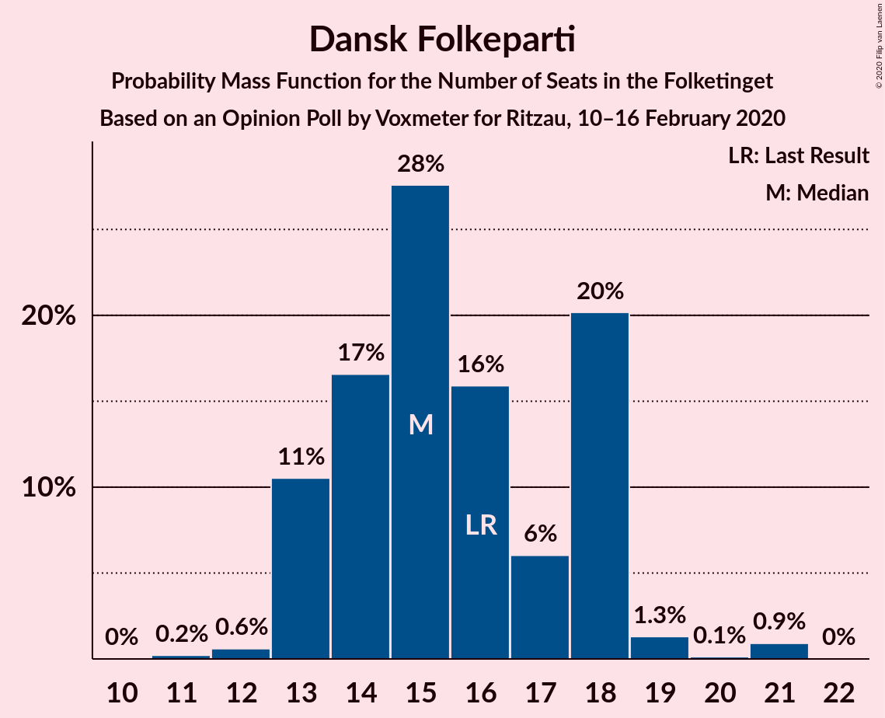
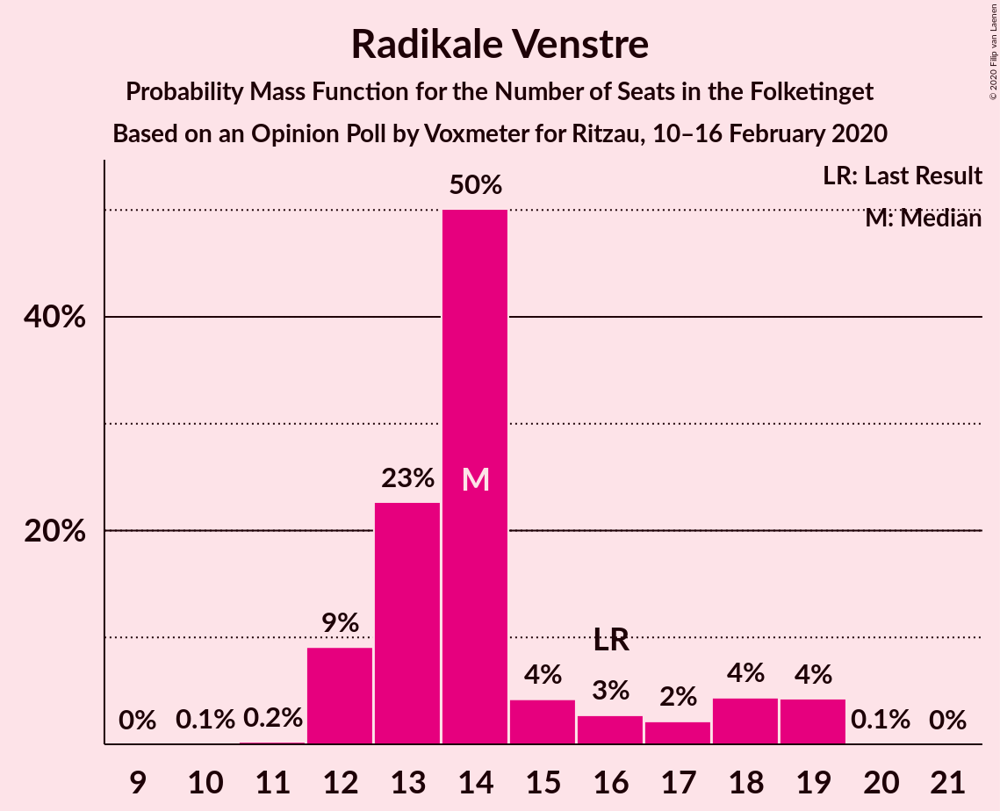
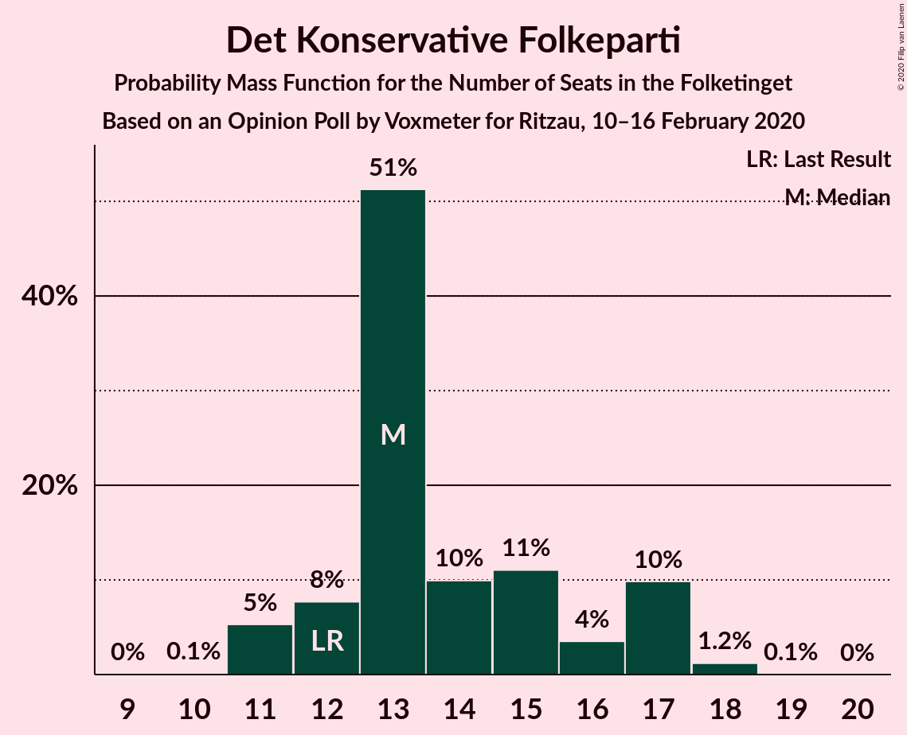
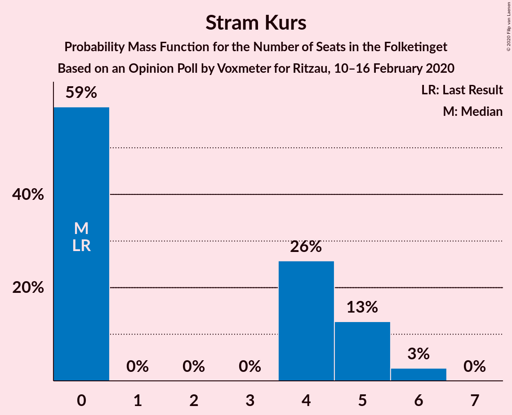
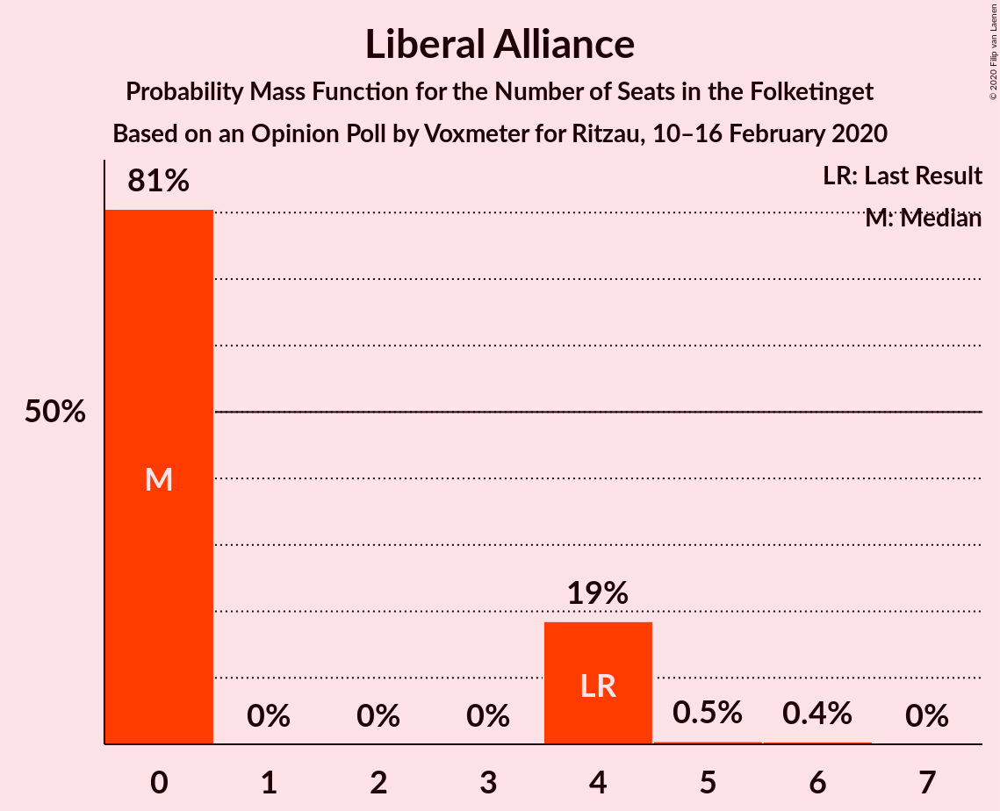
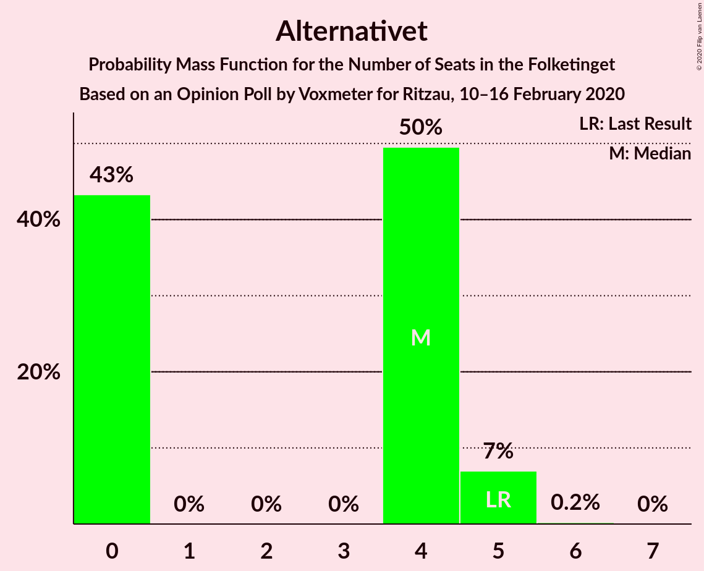
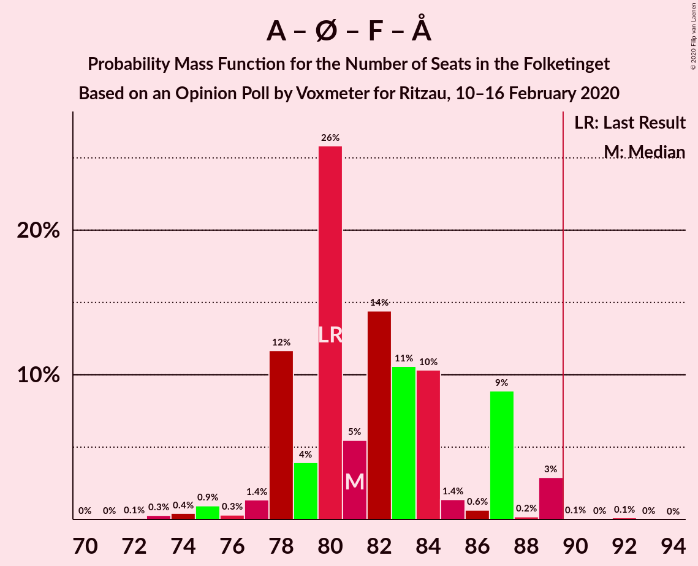
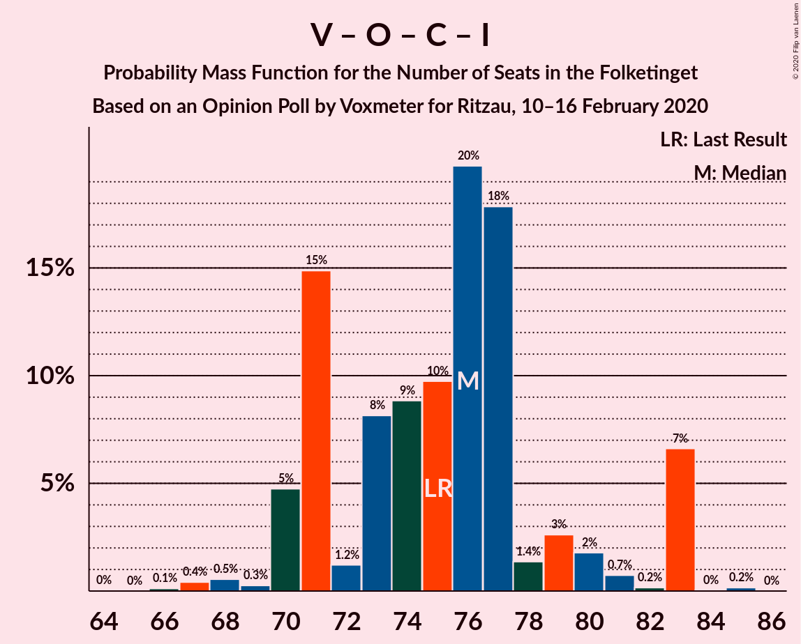
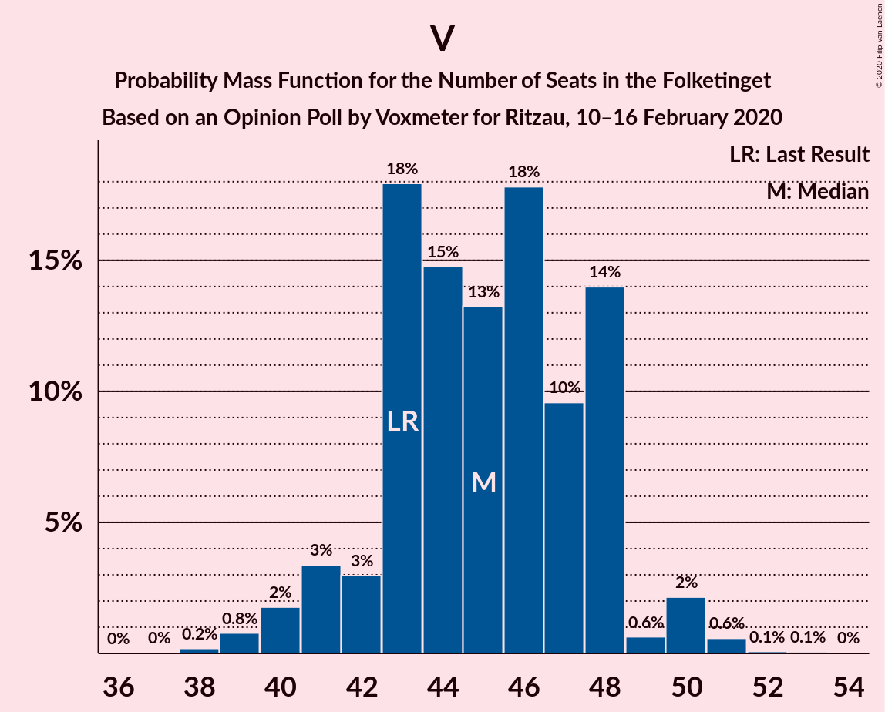

# Opinion Poll by Voxmeter for Ritzau, 10–16 February 2020

<a href="#voting-intentions">Voting Intentions</a> | <a href="#seats">Seats</a> | <a href="#coalitions">Coalitions</a> | <a href="#technical-information">Technical Information</a>

## Voting Intentions

### Confidence Intervals

| Party | Last Result | Poll Result | 80% Confidence Interval | 90% Confidence Interval | 95% Confidence Interval | 99% Confidence Interval |
|:-----:|:-----------:|:-----------:|:-----------------------:|:-----------------------:|:-----------------------:|:-----------------------:|
| Socialdemokraterne | 25.9% | 27.8% | 26.0–29.7% |25.6–30.2% |25.1–30.7% |24.3–31.6% |
| Venstre | 23.4% | 24.4% | 22.7–26.2% |22.3–26.7% |21.9–27.2% |21.1–28.1% |
| Dansk Folkeparti | 8.7% | 8.3% | 7.3–9.5% |7.0–9.8% |6.7–10.2% |6.3–10.8% |
| Radikale Venstre | 8.6% | 8.0% | 7.0–9.2% |6.7–9.5% |6.4–9.8% |6.0–10.4% |
| Enhedslisten–De Rød-Grønne | 6.9% | 7.7% | 6.7–8.9% |6.4–9.2% |6.2–9.5% |5.7–10.1% |
| Det Konservative Folkeparti | 6.6% | 7.6% | 6.6–8.8% |6.3–9.1% |6.1–9.4% |5.7–10.0% |
| Socialistisk Folkeparti | 7.7% | 7.5% | 6.5–8.7% |6.2–9.0% |6.0–9.3% |5.6–9.9% |
| Stram Kurs | 1.8% | 1.9% | 1.4–2.6% |1.3–2.8% |1.2–2.9% |1.0–3.3% |
| Liberal Alliance | 2.3% | 1.6% | 1.2–2.2% |1.1–2.4% |1.0–2.6% |0.8–2.9% |
| Alternativet | 3.0% | 1.6% | 1.2–2.2% |1.1–2.4% |1.0–2.6% |0.8–2.9% |
| Nye Borgerlige | 2.4% | 1.6% | 1.2–2.2% |1.1–2.4% |1.0–2.6% |0.8–2.9% |
| Klaus Riskær Pedersen | 0.8% | 0.5% | 0.3–0.9% |0.3–1.1% |0.2–1.2% |0.2–1.4% |

*Note:* The poll result column reflects the actual value used in the calculations. Published results may vary slightly, and in addition be rounded to fewer digits.

## Seats

### Confidence Intervals

| Party | Last Result | Median | 80% Confidence Interval | 90% Confidence Interval | 95% Confidence Interval | 99% Confidence Interval |
|:-----:|:-----------:|:------:|:-----------------------:|:-----------------------:|:-----------------------:|:-----------------------:|
| <a href="#socialdemokraterne">Socialdemokraterne</a> | 48 | 51 | 49–58 |48–58 |48–58 |45–58 |
| <a href="#venstre">Venstre</a> | 43 | 45 | 43–48 |41–48 |40–50 |39–51 |
| <a href="#dansk-folkeparti">Dansk Folkeparti</a> | 16 | 15 | 13–18 |13–18 |13–18 |12–21 |
| <a href="#radikale-venstre">Radikale Venstre</a> | 16 | 14 | 13–17 |12–18 |12–19 |12–19 |
| <a href="#enhedslisten–de-rød-grønne">Enhedslisten–De Rød-Grønne</a> | 13 | 14 | 12–16 |11–16 |11–16 |11–18 |
| <a href="#det-konservative-folkeparti">Det Konservative Folkeparti</a> | 12 | 13 | 12–17 |11–17 |11–17 |11–18 |
| <a href="#socialistisk-folkeparti">Socialistisk Folkeparti</a> | 14 | 13 | 13–16 |12–17 |11–17 |11–17 |
| <a href="#stram-kurs">Stram Kurs</a> | 0 | 0 | 0–5 |0–5 |0–6 |0–6 |
| <a href="#liberal-alliance">Liberal Alliance</a> | 4 | 0 | 0–4 |0–4 |0–4 |0–5 |
| <a href="#alternativet">Alternativet</a> | 5 | 4 | 0–4 |0–5 |0–5 |0–5 |
| <a href="#nye-borgerlige">Nye Borgerlige</a> | 4 | 0 | 0–4 |0–4 |0–4 |0–4 |
| <a href="#klaus-riskær-pedersen">Klaus Riskær Pedersen</a> | 0 | 0 | 0 |0 |0 |0 |

### Socialdemokraterne

*For a full overview of the results for this party, see the [Socialdemokraterne](party-socialdemokraterne.html) page.*

| Number of Seats | Probability | Accumulated | Special Marks |
|:---------------:|:-----------:|:-----------:|:-------------:|
| 42 | 0.1% | 100% |  |
| 43 | 0% | 99.9% |  |
| 44 | 0.3% | 99.8% |  |
| 45 | 0.4% | 99.5% |  |
| 46 | 0.2% | 99.1% |  |
| 47 | 1.1% | 98.9% |  |
| 48 | 3% | 98% | Last Result |
| 49 | 11% | 95% |  |
| 50 | 20% | 83% |  |
| 51 | 30% | 64% | Median |
| 52 | 9% | 33% |  |
| 53 | 9% | 25% |  |
| 54 | 2% | 16% |  |
| 55 | 2% | 13% |  |
| 56 | 0.2% | 11% |  |
| 57 | 0.1% | 11% |  |
| 58 | 11% | 11% |  |
| 59 | 0.2% | 0.2% |  |
| 60 | 0% | 0% |  |

### Venstre

*For a full overview of the results for this party, see the [Venstre](party-venstre.html) page.*

| Number of Seats | Probability | Accumulated | Special Marks |
|:---------------:|:-----------:|:-----------:|:-------------:|
| 38 | 0.2% | 100% |  |
| 39 | 0.8% | 99.8% |  |
| 40 | 2% | 99.0% |  |
| 41 | 3% | 97% |  |
| 42 | 3% | 94% |  |
| 43 | 18% | 91% | Last Result |
| 44 | 15% | 73% |  |
| 45 | 13% | 58% | Median |
| 46 | 18% | 45% |  |
| 47 | 10% | 27% |  |
| 48 | 14% | 18% |  |
| 49 | 0.6% | 4% |  |
| 50 | 2% | 3% |  |
| 51 | 0.6% | 0.8% |  |
| 52 | 0.1% | 0.2% |  |
| 53 | 0.1% | 0.1% |  |
| 54 | 0% | 0% |  |

### Dansk Folkeparti

*For a full overview of the results for this party, see the [Dansk Folkeparti](party-danskfolkeparti.html) page.*

| Number of Seats | Probability | Accumulated | Special Marks |
|:---------------:|:-----------:|:-----------:|:-------------:|
| 11 | 0.2% | 100% |  |
| 12 | 0.6% | 99.8% |  |
| 13 | 11% | 99.2% |  |
| 14 | 17% | 89% |  |
| 15 | 28% | 72% | Median |
| 16 | 16% | 44% | Last Result |
| 17 | 6% | 29% |  |
| 18 | 20% | 23% |  |
| 19 | 1.3% | 2% |  |
| 20 | 0.1% | 1.1% |  |
| 21 | 0.9% | 0.9% |  |
| 22 | 0% | 0% |  |

### Radikale Venstre

*For a full overview of the results for this party, see the [Radikale Venstre](party-radikalevenstre.html) page.*

| Number of Seats | Probability | Accumulated | Special Marks |
|:---------------:|:-----------:|:-----------:|:-------------:|
| 10 | 0.1% | 100% |  |
| 11 | 0.2% | 99.9% |  |
| 12 | 9% | 99.7% |  |
| 13 | 23% | 91% |  |
| 14 | 50% | 68% | Median |
| 15 | 4% | 18% |  |
| 16 | 3% | 14% | Last Result |
| 17 | 2% | 11% |  |
| 18 | 4% | 9% |  |
| 19 | 4% | 4% |  |
| 20 | 0.1% | 0.1% |  |
| 21 | 0% | 0% |  |

### Enhedslisten–De Rød-Grønne

*For a full overview of the results for this party, see the [Enhedslisten–De Rød-Grønne](party-enhedslisten–derød-grønne.html) page.*

| Number of Seats | Probability | Accumulated | Special Marks |
|:---------------:|:-----------:|:-----------:|:-------------:|
| 10 | 0.3% | 100% |  |
| 11 | 7% | 99.7% |  |
| 12 | 12% | 93% |  |
| 13 | 27% | 81% | Last Result |
| 14 | 33% | 54% | Median |
| 15 | 10% | 21% |  |
| 16 | 9% | 11% |  |
| 17 | 1.3% | 2% |  |
| 18 | 0.5% | 0.8% |  |
| 19 | 0.3% | 0.3% |  |
| 20 | 0% | 0% |  |

### Det Konservative Folkeparti

*For a full overview of the results for this party, see the [Det Konservative Folkeparti](party-detkonservativefolkeparti.html) page.*

| Number of Seats | Probability | Accumulated | Special Marks |
|:---------------:|:-----------:|:-----------:|:-------------:|
| 10 | 0.1% | 100% |  |
| 11 | 5% | 99.9% |  |
| 12 | 8% | 95% | Last Result |
| 13 | 51% | 87% | Median |
| 14 | 10% | 36% |  |
| 15 | 11% | 26% |  |
| 16 | 4% | 15% |  |
| 17 | 10% | 11% |  |
| 18 | 1.2% | 1.3% |  |
| 19 | 0.1% | 0.1% |  |
| 20 | 0% | 0% |  |

### Socialistisk Folkeparti

*For a full overview of the results for this party, see the [Socialistisk Folkeparti](party-socialistiskfolkeparti.html) page.*

| Number of Seats | Probability | Accumulated | Special Marks |
|:---------------:|:-----------:|:-----------:|:-------------:|
| 9 | 0.1% | 100% |  |
| 10 | 0.2% | 99.9% |  |
| 11 | 2% | 99.7% |  |
| 12 | 5% | 97% |  |
| 13 | 47% | 92% | Median |
| 14 | 6% | 45% | Last Result |
| 15 | 6% | 39% |  |
| 16 | 26% | 33% |  |
| 17 | 7% | 7% |  |
| 18 | 0.1% | 0.1% |  |
| 19 | 0% | 0% |  |

### Stram Kurs

*For a full overview of the results for this party, see the [Stram Kurs](party-stramkurs.html) page.*

| Number of Seats | Probability | Accumulated | Special Marks |
|:---------------:|:-----------:|:-----------:|:-------------:|
| 0 | 59% | 100% | Last Result, Median |
| 1 | 0% | 41% |  |
| 2 | 0% | 41% |  |
| 3 | 0% | 41% |  |
| 4 | 26% | 41% |  |
| 5 | 13% | 15% |  |
| 6 | 3% | 3% |  |
| 7 | 0% | 0% |  |

### Liberal Alliance

*For a full overview of the results for this party, see the [Liberal Alliance](party-liberalalliance.html) page.*

| Number of Seats | Probability | Accumulated | Special Marks |
|:---------------:|:-----------:|:-----------:|:-------------:|
| 0 | 81% | 100% | Median |
| 1 | 0% | 19% |  |
| 2 | 0% | 19% |  |
| 3 | 0% | 19% |  |
| 4 | 19% | 19% | Last Result |
| 5 | 0.5% | 0.9% |  |
| 6 | 0.4% | 0.4% |  |
| 7 | 0% | 0% |  |

### Alternativet

*For a full overview of the results for this party, see the [Alternativet](party-alternativet.html) page.*

| Number of Seats | Probability | Accumulated | Special Marks |
|:---------------:|:-----------:|:-----------:|:-------------:|
| 0 | 43% | 100% |  |
| 1 | 0% | 57% |  |
| 2 | 0% | 57% |  |
| 3 | 0% | 57% |  |
| 4 | 50% | 57% | Median |
| 5 | 7% | 7% | Last Result |
| 6 | 0.2% | 0.2% |  |
| 7 | 0% | 0% |  |

### Nye Borgerlige

*For a full overview of the results for this party, see the [Nye Borgerlige](party-nyeborgerlige.html) page.*

| Number of Seats | Probability | Accumulated | Special Marks |
|:---------------:|:-----------:|:-----------:|:-------------:|
| 0 | 71% | 100% | Median |
| 1 | 0% | 29% |  |
| 2 | 0% | 29% |  |
| 3 | 0% | 29% |  |
| 4 | 29% | 29% | Last Result |
| 5 | 0.4% | 0.5% |  |
| 6 | 0.1% | 0.1% |  |
| 7 | 0% | 0% |  |

### Klaus Riskær Pedersen

*For a full overview of the results for this party, see the [Klaus Riskær Pedersen](party-klausriskærpedersen.html) page.*

| Number of Seats | Probability | Accumulated | Special Marks |
|:---------------:|:-----------:|:-----------:|:-------------:|
| 0 | 100% | 100% | Last Result, Median |

## Coalitions

### Confidence Intervals

| Coalition | Last Result | Median | Majority? | 80% Confidence Interval | 90% Confidence Interval | 95% Confidence Interval | 99% Confidence Interval |
|:---------:|:-----------:|:------:|:---------:|:-----------------------:|:-----------------------:|:-----------------------:|:-----------------------:|
| Socialdemokraterne – Radikale Venstre – Enhedslisten–De Rød-Grønne – Socialistisk Folkeparti – Alternativet | 96 | 96 | 99.3% | 92–101 | 92–102 | 90–102 | 89–103 |
| Socialdemokraterne – Radikale Venstre – Enhedslisten–De Rød-Grønne – Socialistisk Folkeparti | 91 | 92 | 97% | 90–99 | 90–101 | 89–102 | 86–102 |
| Socialdemokraterne – Enhedslisten–De Rød-Grønne – Socialistisk Folkeparti – Alternativet | 80 | 81 | 0.2% | 78–87 | 78–87 | 77–89 | 74–89 |
| Socialdemokraterne – Enhedslisten–De Rød-Grønne – Socialistisk Folkeparti | 75 | 78 | 0% | 76–87 | 76–87 | 74–89 | 71–89 |
| Socialdemokraterne – Radikale Venstre – Socialistisk Folkeparti | 78 | 78 | 0.1% | 76–86 | 76–86 | 75–87 | 73–87 |
| Venstre – Dansk Folkeparti – Det Konservative Folkeparti – Liberal Alliance – Nye Borgerlige – Klaus Riskær Pedersen | 79 | 76 | 0% | 73–80 | 73–83 | 72–83 | 68–83 |
| Venstre – Dansk Folkeparti – Det Konservative Folkeparti – Liberal Alliance – Nye Borgerlige | 79 | 76 | 0% | 73–80 | 73–83 | 72–83 | 68–83 |
| Venstre – Dansk Folkeparti – Det Konservative Folkeparti – Liberal Alliance | 75 | 76 | 0% | 71–79 | 70–83 | 70–83 | 67–83 |
| Socialdemokraterne – Radikale Venstre | 64 | 65 | 0% | 63–70 | 63–71 | 61–71 | 60–72 |
| Venstre – Det Konservative Folkeparti – Liberal Alliance | 59 | 59 | 0% | 56–63 | 55–68 | 55–68 | 53–68 |
| Venstre – Det Konservative Folkeparti | 55 | 58 | 0% | 56–63 | 55–64 | 55–64 | 53–67 |
| Venstre | 43 | 45 | 0% | 43–48 | 41–48 | 40–50 | 39–51 |

### Socialdemokraterne – Radikale Venstre – Enhedslisten–De Rød-Grønne – Socialistisk Folkeparti – Alternativet

| Number of Seats | Probability | Accumulated | Special Marks |
|:---------------:|:-----------:|:-----------:|:-------------:|
| 86 | 0.1% | 100% |  |
| 87 | 0.2% | 99.9% |  |
| 88 | 0.2% | 99.7% |  |
| 89 | 0.2% | 99.5% |  |
| 90 | 2% | 99.3% | Majority |
| 91 | 1.3% | 97% |  |
| 92 | 12% | 96% |  |
| 93 | 2% | 84% |  |
| 94 | 28% | 82% |  |
| 95 | 3% | 54% |  |
| 96 | 16% | 51% | Last Result, Median |
| 97 | 10% | 35% |  |
| 98 | 2% | 25% |  |
| 99 | 10% | 23% |  |
| 100 | 2% | 13% |  |
| 101 | 3% | 11% |  |
| 102 | 7% | 8% |  |
| 103 | 0.5% | 0.9% |  |
| 104 | 0.2% | 0.4% |  |
| 105 | 0.1% | 0.2% |  |
| 106 | 0% | 0.1% |  |
| 107 | 0% | 0.1% |  |
| 108 | 0% | 0% |  |

### Socialdemokraterne – Radikale Venstre – Enhedslisten–De Rød-Grønne – Socialistisk Folkeparti

| Number of Seats | Probability | Accumulated | Special Marks |
|:---------------:|:-----------:|:-----------:|:-------------:|
| 84 | 0.1% | 100% |  |
| 85 | 0% | 99.9% |  |
| 86 | 0.8% | 99.9% |  |
| 87 | 0.4% | 99.0% |  |
| 88 | 0.8% | 98.7% |  |
| 89 | 0.5% | 98% |  |
| 90 | 27% | 97% | Majority |
| 91 | 2% | 71% | Last Result |
| 92 | 26% | 69% | Median |
| 93 | 6% | 43% |  |
| 94 | 5% | 36% |  |
| 95 | 4% | 31% |  |
| 96 | 0.6% | 27% |  |
| 97 | 10% | 27% |  |
| 98 | 1.0% | 17% |  |
| 99 | 8% | 16% |  |
| 100 | 1.0% | 8% |  |
| 101 | 3% | 7% |  |
| 102 | 3% | 3% |  |
| 103 | 0.2% | 0.2% |  |
| 104 | 0.1% | 0.1% |  |
| 105 | 0% | 0% |  |

### Socialdemokraterne – Enhedslisten–De Rød-Grønne – Socialistisk Folkeparti – Alternativet

| Number of Seats | Probability | Accumulated | Special Marks |
|:---------------:|:-----------:|:-----------:|:-------------:|
| 71 | 0% | 100% |  |
| 72 | 0.1% | 99.9% |  |
| 73 | 0.3% | 99.9% |  |
| 74 | 0.4% | 99.6% |  |
| 75 | 0.9% | 99.1% |  |
| 76 | 0.3% | 98% |  |
| 77 | 1.4% | 98% |  |
| 78 | 12% | 97% |  |
| 79 | 4% | 85% |  |
| 80 | 26% | 81% | Last Result |
| 81 | 5% | 55% |  |
| 82 | 14% | 50% | Median |
| 83 | 11% | 35% |  |
| 84 | 10% | 25% |  |
| 85 | 1.4% | 14% |  |
| 86 | 0.6% | 13% |  |
| 87 | 9% | 12% |  |
| 88 | 0.2% | 3% |  |
| 89 | 3% | 3% |  |
| 90 | 0.1% | 0.2% | Majority |
| 91 | 0% | 0.2% |  |
| 92 | 0.1% | 0.1% |  |
| 93 | 0% | 0% |  |

### Socialdemokraterne – Enhedslisten–De Rød-Grønne – Socialistisk Folkeparti

| Number of Seats | Probability | Accumulated | Special Marks |
|:---------------:|:-----------:|:-----------:|:-------------:|
| 70 | 0.2% | 100% |  |
| 71 | 0.6% | 99.8% |  |
| 72 | 0.2% | 99.1% |  |
| 73 | 0.4% | 99.0% |  |
| 74 | 2% | 98.6% |  |
| 75 | 0.7% | 96% | Last Result |
| 76 | 25% | 96% |  |
| 77 | 2% | 71% |  |
| 78 | 28% | 69% | Median |
| 79 | 6% | 41% |  |
| 80 | 6% | 35% |  |
| 81 | 5% | 28% |  |
| 82 | 2% | 24% |  |
| 83 | 5% | 22% |  |
| 84 | 6% | 17% |  |
| 85 | 0.3% | 11% |  |
| 86 | 0.3% | 11% |  |
| 87 | 8% | 11% |  |
| 88 | 0.1% | 3% |  |
| 89 | 3% | 3% |  |
| 90 | 0% | 0% | Majority |

### Socialdemokraterne – Radikale Venstre – Socialistisk Folkeparti

| Number of Seats | Probability | Accumulated | Special Marks |
|:---------------:|:-----------:|:-----------:|:-------------:|
| 71 | 0.1% | 100% |  |
| 72 | 0.2% | 99.9% |  |
| 73 | 0.3% | 99.6% |  |
| 74 | 0.5% | 99.4% |  |
| 75 | 1.5% | 98.9% |  |
| 76 | 9% | 97% |  |
| 77 | 22% | 89% |  |
| 78 | 21% | 66% | Last Result, Median |
| 79 | 3% | 45% |  |
| 80 | 6% | 42% |  |
| 81 | 8% | 36% |  |
| 82 | 0.9% | 27% |  |
| 83 | 7% | 27% |  |
| 84 | 0.9% | 20% |  |
| 85 | 4% | 19% |  |
| 86 | 11% | 15% |  |
| 87 | 4% | 4% |  |
| 88 | 0.1% | 0.2% |  |
| 89 | 0% | 0.1% |  |
| 90 | 0% | 0.1% | Majority |
| 91 | 0% | 0.1% |  |
| 92 | 0% | 0.1% |  |
| 93 | 0% | 0% |  |

### Venstre – Dansk Folkeparti – Det Konservative Folkeparti – Liberal Alliance – Nye Borgerlige – Klaus Riskær Pedersen

| Number of Seats | Probability | Accumulated | Special Marks |
|:---------------:|:-----------:|:-----------:|:-------------:|
| 66 | 0.1% | 100% |  |
| 67 | 0.4% | 99.9% |  |
| 68 | 0.1% | 99.6% |  |
| 69 | 0.2% | 99.4% |  |
| 70 | 0.3% | 99.2% |  |
| 71 | 0.7% | 98.9% |  |
| 72 | 2% | 98% |  |
| 73 | 7% | 97% | Median |
| 74 | 8% | 89% |  |
| 75 | 21% | 81% |  |
| 76 | 20% | 60% |  |
| 77 | 19% | 41% |  |
| 78 | 7% | 22% |  |
| 79 | 6% | 16% | Last Result |
| 80 | 2% | 10% |  |
| 81 | 0.9% | 8% |  |
| 82 | 0.2% | 7% |  |
| 83 | 7% | 7% |  |
| 84 | 0.1% | 0.3% |  |
| 85 | 0.2% | 0.3% |  |
| 86 | 0% | 0% |  |

### Venstre – Dansk Folkeparti – Det Konservative Folkeparti – Liberal Alliance – Nye Borgerlige

| Number of Seats | Probability | Accumulated | Special Marks |
|:---------------:|:-----------:|:-----------:|:-------------:|
| 66 | 0.1% | 100% |  |
| 67 | 0.4% | 99.9% |  |
| 68 | 0.1% | 99.6% |  |
| 69 | 0.2% | 99.4% |  |
| 70 | 0.3% | 99.2% |  |
| 71 | 0.7% | 98.9% |  |
| 72 | 2% | 98% |  |
| 73 | 7% | 97% | Median |
| 74 | 8% | 89% |  |
| 75 | 21% | 81% |  |
| 76 | 20% | 60% |  |
| 77 | 19% | 41% |  |
| 78 | 7% | 22% |  |
| 79 | 6% | 16% | Last Result |
| 80 | 2% | 10% |  |
| 81 | 0.9% | 8% |  |
| 82 | 0.2% | 7% |  |
| 83 | 7% | 7% |  |
| 84 | 0.1% | 0.3% |  |
| 85 | 0.2% | 0.3% |  |
| 86 | 0% | 0% |  |

### Venstre – Dansk Folkeparti – Det Konservative Folkeparti – Liberal Alliance

| Number of Seats | Probability | Accumulated | Special Marks |
|:---------------:|:-----------:|:-----------:|:-------------:|
| 66 | 0.1% | 100% |  |
| 67 | 0.4% | 99.8% |  |
| 68 | 0.5% | 99.4% |  |
| 69 | 0.3% | 98.9% |  |
| 70 | 5% | 98.6% |  |
| 71 | 15% | 94% |  |
| 72 | 1.2% | 79% |  |
| 73 | 8% | 78% | Median |
| 74 | 9% | 70% |  |
| 75 | 10% | 61% | Last Result |
| 76 | 20% | 51% |  |
| 77 | 18% | 31% |  |
| 78 | 1.4% | 13% |  |
| 79 | 3% | 12% |  |
| 80 | 2% | 9% |  |
| 81 | 0.7% | 8% |  |
| 82 | 0.2% | 7% |  |
| 83 | 7% | 7% |  |
| 84 | 0% | 0.2% |  |
| 85 | 0.2% | 0.2% |  |
| 86 | 0% | 0% |  |

### Socialdemokraterne – Radikale Venstre

| Number of Seats | Probability | Accumulated | Special Marks |
|:---------------:|:-----------:|:-----------:|:-------------:|
| 56 | 0.1% | 100% |  |
| 57 | 0.1% | 99.9% |  |
| 58 | 0.1% | 99.8% |  |
| 59 | 0.2% | 99.7% |  |
| 60 | 0.5% | 99.5% |  |
| 61 | 2% | 99.0% |  |
| 62 | 2% | 97% |  |
| 63 | 12% | 95% |  |
| 64 | 24% | 83% | Last Result |
| 65 | 24% | 59% | Median |
| 66 | 6% | 35% |  |
| 67 | 6% | 29% |  |
| 68 | 0.8% | 23% |  |
| 69 | 2% | 22% |  |
| 70 | 12% | 20% |  |
| 71 | 7% | 8% |  |
| 72 | 0.8% | 1.0% |  |
| 73 | 0.1% | 0.3% |  |
| 74 | 0% | 0.2% |  |
| 75 | 0.1% | 0.1% |  |
| 76 | 0% | 0% |  |

### Venstre – Det Konservative Folkeparti – Liberal Alliance

| Number of Seats | Probability | Accumulated | Special Marks |
|:---------------:|:-----------:|:-----------:|:-------------:|
| 52 | 0.3% | 100% |  |
| 53 | 0.4% | 99.7% |  |
| 54 | 0.5% | 99.3% |  |
| 55 | 4% | 98.8% |  |
| 56 | 19% | 95% |  |
| 57 | 12% | 76% |  |
| 58 | 5% | 64% | Median |
| 59 | 20% | 60% | Last Result |
| 60 | 6% | 40% |  |
| 61 | 3% | 34% |  |
| 62 | 9% | 31% |  |
| 63 | 12% | 21% |  |
| 64 | 0.8% | 9% |  |
| 65 | 0.6% | 8% |  |
| 66 | 0.4% | 8% |  |
| 67 | 0.9% | 7% |  |
| 68 | 6% | 6% |  |
| 69 | 0% | 0.1% |  |
| 70 | 0% | 0% |  |

### Venstre – Det Konservative Folkeparti

| Number of Seats | Probability | Accumulated | Special Marks |
|:---------------:|:-----------:|:-----------:|:-------------:|
| 50 | 0% | 100% |  |
| 51 | 0% | 99.9% |  |
| 52 | 0.4% | 99.9% |  |
| 53 | 1.2% | 99.6% |  |
| 54 | 0.6% | 98% |  |
| 55 | 5% | 98% | Last Result |
| 56 | 19% | 93% |  |
| 57 | 12% | 74% |  |
| 58 | 12% | 62% | Median |
| 59 | 19% | 49% |  |
| 60 | 6% | 30% |  |
| 61 | 2% | 24% |  |
| 62 | 2% | 22% |  |
| 63 | 12% | 20% |  |
| 64 | 6% | 7% |  |
| 65 | 0.4% | 1.1% |  |
| 66 | 0.1% | 0.7% |  |
| 67 | 0.5% | 0.6% |  |
| 68 | 0.1% | 0.1% |  |
| 69 | 0% | 0% |  |

### Venstre

| Number of Seats | Probability | Accumulated | Special Marks |
|:---------------:|:-----------:|:-----------:|:-------------:|
| 38 | 0.2% | 100% |  |
| 39 | 0.8% | 99.8% |  |
| 40 | 2% | 99.0% |  |
| 41 | 3% | 97% |  |
| 42 | 3% | 94% |  |
| 43 | 18% | 91% | Last Result |
| 44 | 15% | 73% |  |
| 45 | 13% | 58% | Median |
| 46 | 18% | 45% |  |
| 47 | 10% | 27% |  |
| 48 | 14% | 18% |  |
| 49 | 0.6% | 4% |  |
| 50 | 2% | 3% |  |
| 51 | 0.6% | 0.8% |  |
| 52 | 0.1% | 0.2% |  |
| 53 | 0.1% | 0.1% |  |
| 54 | 0% | 0% |  |

## Technical Information

### Opinion Poll

+ **Polling firm:** Voxmeter
+ **Commissioner(s):** Ritzau
+ **Fieldwork period:** 10–16 February 2020

### Calculations

+ **Sample size:** 1003
+ **Simulations done:** 1,048,576
+ **Error estimate:** 1.60%

