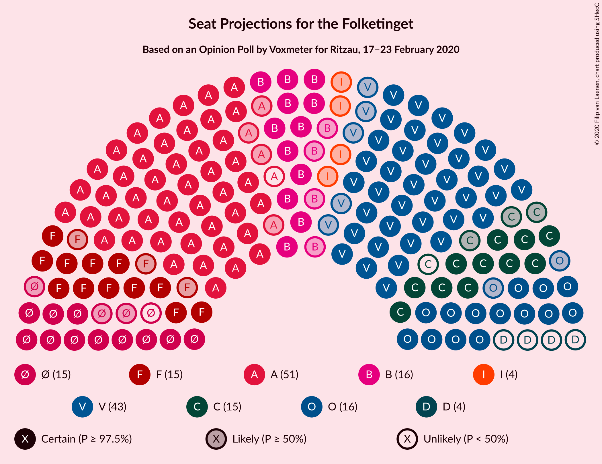
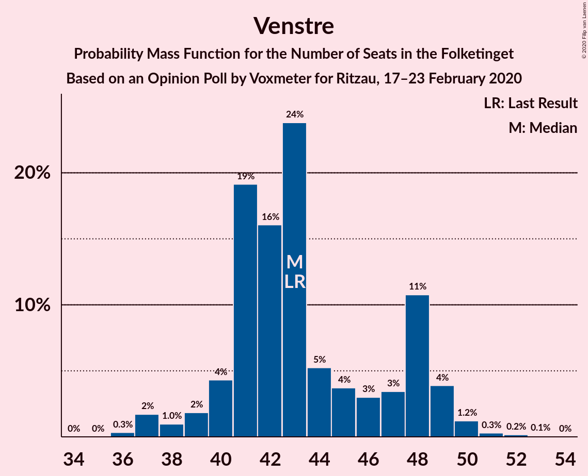
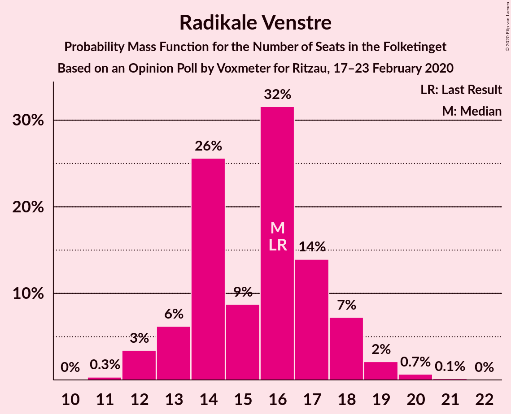
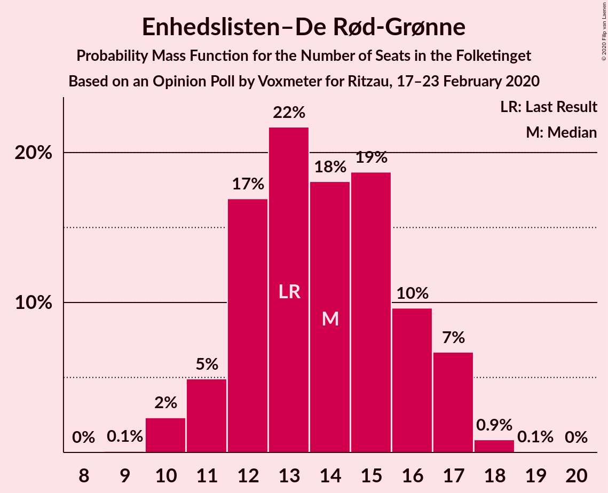
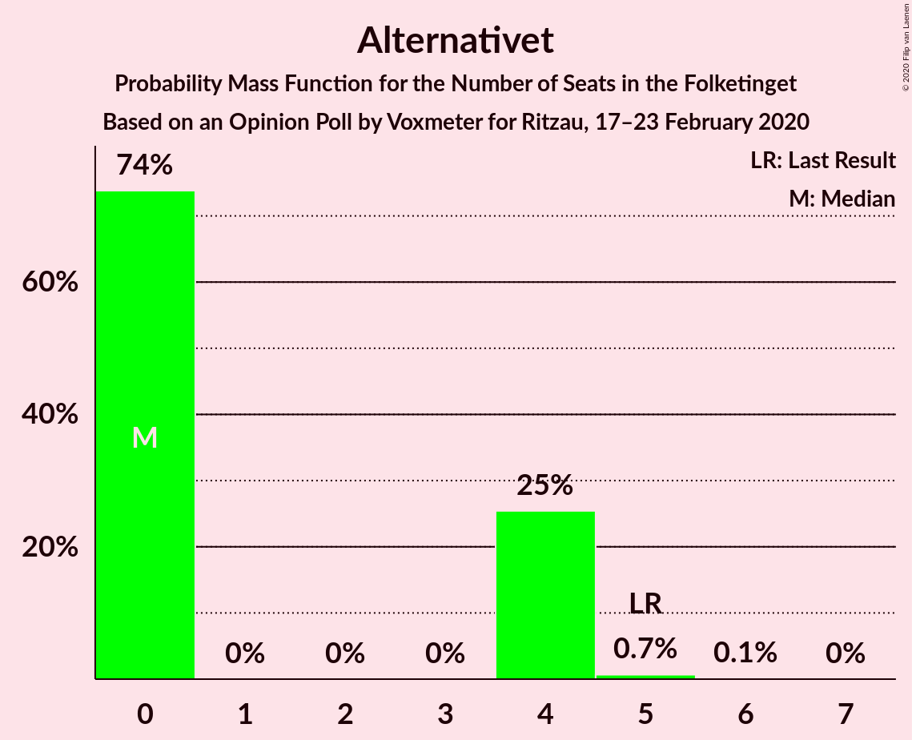
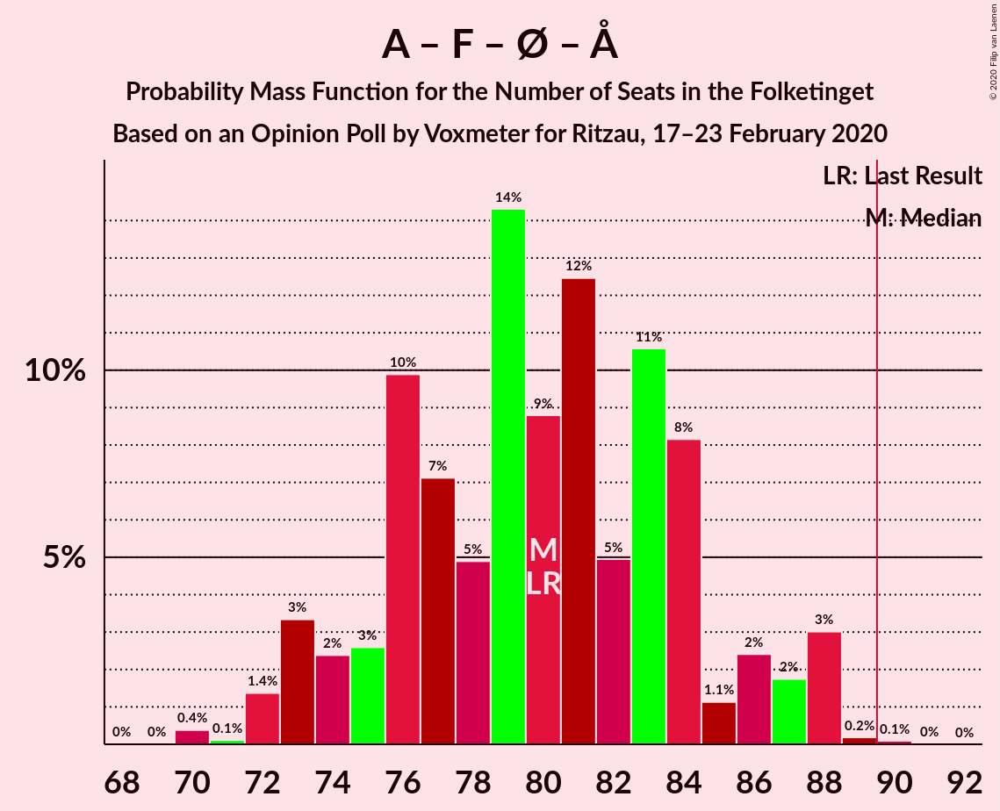
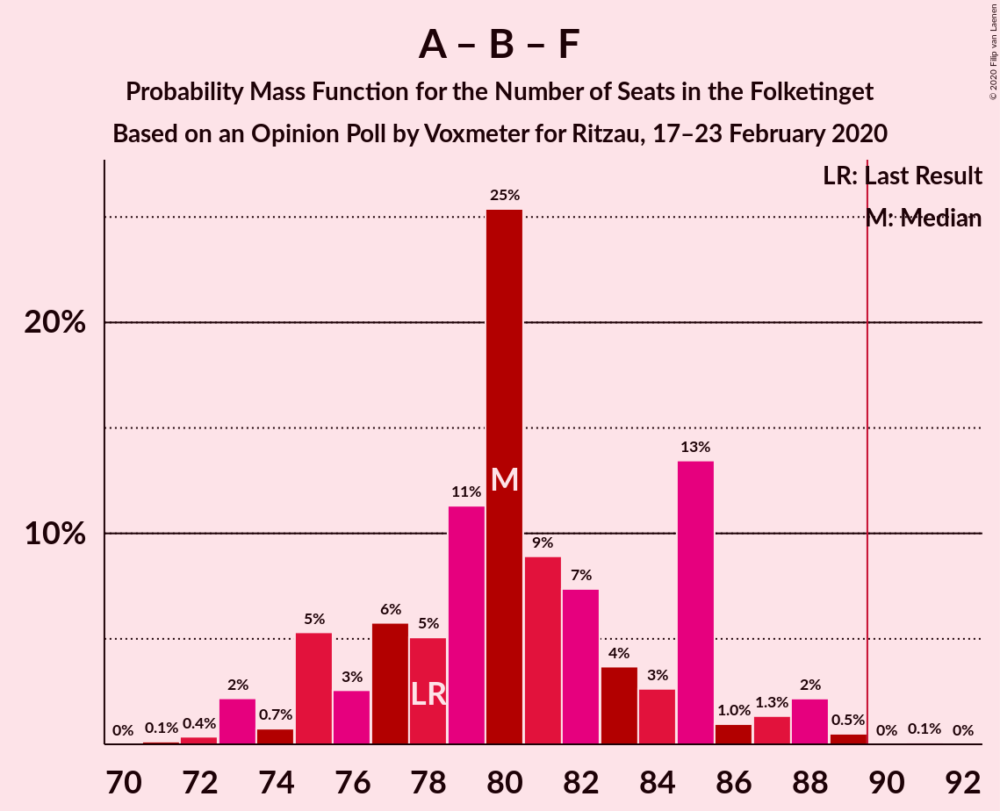
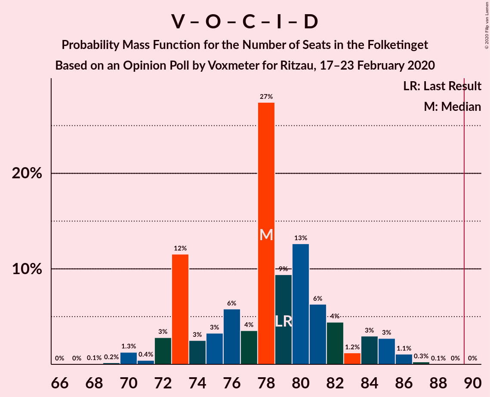
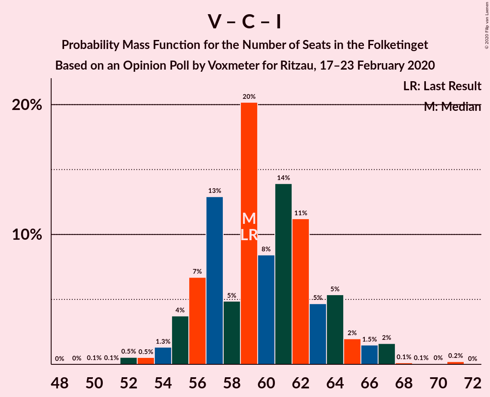

# Opinion Poll by Voxmeter for Ritzau, 17–23 February 2020

<a href="#voting-intentions">Voting Intentions</a> | <a href="#seats">Seats</a> | <a href="#coalitions">Coalitions</a> | <a href="#technical-information">Technical Information</a>

## Voting Intentions

### Confidence Intervals

| Party | Last Result | Poll Result | 80% Confidence Interval | 90% Confidence Interval | 95% Confidence Interval | 99% Confidence Interval |
|:-----:|:-----------:|:-----------:|:-----------------------:|:-----------------------:|:-----------------------:|:-----------------------:|
| Socialdemokraterne | 25.9% | 27.5% | 25.7–29.3% |25.3–29.8% |24.8–30.2% |24.0–31.1% |
| Venstre | 23.4% | 23.8% | 22.2–25.6% |21.7–26.1% |21.4–26.5% |20.6–27.4% |
| Dansk Folkeparti | 8.7% | 8.8% | 7.7–10.0% |7.5–10.3% |7.2–10.6% |6.7–11.3% |
| Radikale Venstre | 8.6% | 8.5% | 7.5–9.7% |7.2–10.0% |6.9–10.3% |6.5–10.9% |
| Socialistisk Folkeparti | 7.7% | 8.0% | 7.0–9.2% |6.7–9.5% |6.5–9.8% |6.1–10.4% |
| Det Konservative Folkeparti | 6.6% | 7.6% | 6.7–8.8% |6.4–9.1% |6.2–9.4% |5.7–10.0% |
| Enhedslisten–De Rød-Grønne | 6.9% | 7.2% | 6.3–8.4% |6.1–8.7% |5.8–9.0% |5.4–9.6% |
| Liberal Alliance | 2.3% | 2.1% | 1.6–2.8% |1.5–3.0% |1.4–3.2% |1.2–3.5% |
| Nye Borgerlige | 2.4% | 1.9% | 1.5–2.6% |1.3–2.8% |1.2–2.9% |1.1–3.3% |
| Alternativet | 3.0% | 1.5% | 1.1–2.1% |1.0–2.3% |0.9–2.5% |0.8–2.8% |
| Stram Kurs | 1.8% | 1.5% | 1.1–2.1% |1.0–2.3% |0.9–2.5% |0.8–2.8% |

*Note:* The poll result column reflects the actual value used in the calculations. Published results may vary slightly, and in addition be rounded to fewer digits.

## Seats

### Confidence Intervals

| Party | Last Result | Median | 80% Confidence Interval | 90% Confidence Interval | 95% Confidence Interval | 99% Confidence Interval |
|:-----:|:-----------:|:------:|:-----------------------:|:-----------------------:|:-----------------------:|:-----------------------:|
| <a href="#socialdemokraterne">Socialdemokraterne</a> | 48 | 50 | 47–53 |46–54 |46–56 |44–56 |
| <a href="#venstre">Venstre</a> | 43 | 43 | 41–48 |40–49 |38–49 |37–51 |
| <a href="#dansk-folkeparti">Dansk Folkeparti</a> | 16 | 16 | 15–18 |14–18 |14–19 |12–20 |
| <a href="#radikale-venstre">Radikale Venstre</a> | 16 | 16 | 14–18 |13–18 |12–19 |12–20 |
| <a href="#socialistisk-folkeparti">Socialistisk Folkeparti</a> | 14 | 15 | 13–18 |12–18 |12–18 |11–19 |
| <a href="#det-konservative-folkeparti">Det Konservative Folkeparti</a> | 12 | 14 | 12–16 |12–17 |11–17 |10–18 |
| <a href="#enhedslisten–de-rød-grønne">Enhedslisten–De Rød-Grønne</a> | 13 | 14 | 12–16 |11–17 |11–17 |10–18 |
| <a href="#liberal-alliance">Liberal Alliance</a> | 4 | 4 | 0–5 |0–5 |0–5 |0–6 |
| <a href="#nye-borgerlige">Nye Borgerlige</a> | 4 | 0 | 0–5 |0–5 |0–5 |0–6 |
| <a href="#alternativet">Alternativet</a> | 5 | 0 | 0–4 |0–4 |0–4 |0–5 |
| <a href="#stram-kurs">Stram Kurs</a> | 0 | 0 | 0–4 |0–4 |0–5 |0–5 |

### Socialdemokraterne

*For a full overview of the results for this party, see the [Socialdemokraterne](party-socialdemokraterne.html) page.*

| Number of Seats | Probability | Accumulated | Special Marks |
|:---------------:|:-----------:|:-----------:|:-------------:|
| 42 | 0.1% | 100% |  |
| 43 | 0.2% | 99.9% |  |
| 44 | 0.6% | 99.7% |  |
| 45 | 1.1% | 99.1% |  |
| 46 | 7% | 98% |  |
| 47 | 5% | 91% |  |
| 48 | 13% | 86% | Last Result |
| 49 | 16% | 73% |  |
| 50 | 10% | 56% | Median |
| 51 | 20% | 46% |  |
| 52 | 6% | 26% |  |
| 53 | 12% | 20% |  |
| 54 | 3% | 8% |  |
| 55 | 0.6% | 5% |  |
| 56 | 4% | 4% |  |
| 57 | 0.2% | 0.3% |  |
| 58 | 0.1% | 0.1% |  |
| 59 | 0% | 0.1% |  |
| 60 | 0% | 0% |  |

### Venstre

*For a full overview of the results for this party, see the [Venstre](party-venstre.html) page.*

| Number of Seats | Probability | Accumulated | Special Marks |
|:---------------:|:-----------:|:-----------:|:-------------:|
| 36 | 0.3% | 100% |  |
| 37 | 2% | 99.6% |  |
| 38 | 1.0% | 98% |  |
| 39 | 2% | 97% |  |
| 40 | 4% | 95% |  |
| 41 | 19% | 91% |  |
| 42 | 16% | 72% |  |
| 43 | 24% | 56% | Last Result, Median |
| 44 | 5% | 32% |  |
| 45 | 4% | 27% |  |
| 46 | 3% | 23% |  |
| 47 | 3% | 20% |  |
| 48 | 11% | 16% |  |
| 49 | 4% | 6% |  |
| 50 | 1.2% | 2% |  |
| 51 | 0.3% | 0.5% |  |
| 52 | 0.2% | 0.2% |  |
| 53 | 0.1% | 0.1% |  |
| 54 | 0% | 0% |  |

### Dansk Folkeparti

*For a full overview of the results for this party, see the [Dansk Folkeparti](party-danskfolkeparti.html) page.*

| Number of Seats | Probability | Accumulated | Special Marks |
|:---------------:|:-----------:|:-----------:|:-------------:|
| 12 | 0.5% | 100% |  |
| 13 | 1.1% | 99.4% |  |
| 14 | 7% | 98% |  |
| 15 | 17% | 91% |  |
| 16 | 29% | 74% | Last Result, Median |
| 17 | 29% | 45% |  |
| 18 | 13% | 16% |  |
| 19 | 3% | 4% |  |
| 20 | 0.8% | 1.1% |  |
| 21 | 0.2% | 0.3% |  |
| 22 | 0% | 0% |  |

### Radikale Venstre

*For a full overview of the results for this party, see the [Radikale Venstre](party-radikalevenstre.html) page.*

| Number of Seats | Probability | Accumulated | Special Marks |
|:---------------:|:-----------:|:-----------:|:-------------:|
| 11 | 0.3% | 100% |  |
| 12 | 3% | 99.7% |  |
| 13 | 6% | 96% |  |
| 14 | 26% | 90% |  |
| 15 | 9% | 64% |  |
| 16 | 32% | 56% | Last Result, Median |
| 17 | 14% | 24% |  |
| 18 | 7% | 10% |  |
| 19 | 2% | 3% |  |
| 20 | 0.7% | 0.8% |  |
| 21 | 0.1% | 0.2% |  |
| 22 | 0% | 0% |  |

### Socialistisk Folkeparti

*For a full overview of the results for this party, see the [Socialistisk Folkeparti](party-socialistiskfolkeparti.html) page.*

| Number of Seats | Probability | Accumulated | Special Marks |
|:---------------:|:-----------:|:-----------:|:-------------:|
| 10 | 0.1% | 100% |  |
| 11 | 0.5% | 99.9% |  |
| 12 | 6% | 99.4% |  |
| 13 | 14% | 93% |  |
| 14 | 17% | 80% | Last Result |
| 15 | 35% | 63% | Median |
| 16 | 9% | 28% |  |
| 17 | 6% | 19% |  |
| 18 | 12% | 13% |  |
| 19 | 0.4% | 0.6% |  |
| 20 | 0.2% | 0.2% |  |
| 21 | 0% | 0% |  |

### Det Konservative Folkeparti

*For a full overview of the results for this party, see the [Det Konservative Folkeparti](party-detkonservativefolkeparti.html) page.*

| Number of Seats | Probability | Accumulated | Special Marks |
|:---------------:|:-----------:|:-----------:|:-------------:|
| 10 | 1.0% | 100% |  |
| 11 | 3% | 98.9% |  |
| 12 | 11% | 96% | Last Result |
| 13 | 28% | 85% |  |
| 14 | 21% | 57% | Median |
| 15 | 22% | 36% |  |
| 16 | 7% | 14% |  |
| 17 | 7% | 8% |  |
| 18 | 0.3% | 0.6% |  |
| 19 | 0.3% | 0.3% |  |
| 20 | 0% | 0% |  |

### Enhedslisten–De Rød-Grønne

*For a full overview of the results for this party, see the [Enhedslisten–De Rød-Grønne](party-enhedslisten–derød-grønne.html) page.*

| Number of Seats | Probability | Accumulated | Special Marks |
|:---------------:|:-----------:|:-----------:|:-------------:|
| 9 | 0.1% | 100% |  |
| 10 | 2% | 99.9% |  |
| 11 | 5% | 98% |  |
| 12 | 17% | 93% |  |
| 13 | 22% | 76% | Last Result |
| 14 | 18% | 54% | Median |
| 15 | 19% | 36% |  |
| 16 | 10% | 17% |  |
| 17 | 7% | 8% |  |
| 18 | 0.9% | 0.9% |  |
| 19 | 0.1% | 0.1% |  |
| 20 | 0% | 0% |  |

### Liberal Alliance

*For a full overview of the results for this party, see the [Liberal Alliance](party-liberalalliance.html) page.*

| Number of Seats | Probability | Accumulated | Special Marks |
|:---------------:|:-----------:|:-----------:|:-------------:|
| 0 | 44% | 100% |  |
| 1 | 0% | 56% |  |
| 2 | 0% | 56% |  |
| 3 | 0% | 56% |  |
| 4 | 35% | 56% | Last Result, Median |
| 5 | 19% | 21% |  |
| 6 | 2% | 2% |  |
| 7 | 0.2% | 0.2% |  |
| 8 | 0% | 0% |  |

### Nye Borgerlige

*For a full overview of the results for this party, see the [Nye Borgerlige](party-nyeborgerlige.html) page.*

| Number of Seats | Probability | Accumulated | Special Marks |
|:---------------:|:-----------:|:-----------:|:-------------:|
| 0 | 55% | 100% | Median |
| 1 | 0% | 45% |  |
| 2 | 0% | 45% |  |
| 3 | 0.1% | 45% |  |
| 4 | 30% | 45% | Last Result |
| 5 | 14% | 15% |  |
| 6 | 0.9% | 0.9% |  |
| 7 | 0% | 0% |  |

### Alternativet

*For a full overview of the results for this party, see the [Alternativet](party-alternativet.html) page.*

| Number of Seats | Probability | Accumulated | Special Marks |
|:---------------:|:-----------:|:-----------:|:-------------:|
| 0 | 74% | 100% | Median |
| 1 | 0% | 26% |  |
| 2 | 0% | 26% |  |
| 3 | 0% | 26% |  |
| 4 | 25% | 26% |  |
| 5 | 0.7% | 0.7% | Last Result |
| 6 | 0.1% | 0.1% |  |
| 7 | 0% | 0% |  |

### Stram Kurs

*For a full overview of the results for this party, see the [Stram Kurs](party-stramkurs.html) page.*

| Number of Seats | Probability | Accumulated | Special Marks |
|:---------------:|:-----------:|:-----------:|:-------------:|
| 0 | 80% | 100% | Last Result, Median |
| 1 | 0% | 20% |  |
| 2 | 0% | 20% |  |
| 3 | 0.5% | 20% |  |
| 4 | 17% | 20% |  |
| 5 | 3% | 3% |  |
| 6 | 0.1% | 0.1% |  |
| 7 | 0% | 0% |  |

## Coalitions

### Confidence Intervals

| Coalition | Last Result | Median | Majority? | 80% Confidence Interval | 90% Confidence Interval | 95% Confidence Interval | 99% Confidence Interval |
|:---------:|:-----------:|:------:|:---------:|:-----------------------:|:-----------------------:|:-----------------------:|:-----------------------:|
| Socialdemokraterne – Radikale Venstre – Socialistisk Folkeparti – Enhedslisten–De Rød-Grønne – Alternativet | 96 | 96 | 92% | 90–100 | 89–102 | 87–103 | 86–103 |
| Socialdemokraterne – Radikale Venstre – Socialistisk Folkeparti – Enhedslisten–De Rød-Grønne | 91 | 95 | 90% | 89–98 | 88–100 | 87–102 | 86–103 |
| Socialdemokraterne – Socialistisk Folkeparti – Enhedslisten–De Rød-Grønne – Alternativet | 80 | 80 | 0.1% | 75–84 | 73–87 | 73–88 | 71–88 |
| Socialdemokraterne – Radikale Venstre – Socialistisk Folkeparti | 78 | 80 | 0.1% | 76–85 | 75–86 | 73–88 | 72–89 |
| Socialdemokraterne – Socialistisk Folkeparti – Enhedslisten–De Rød-Grønne | 75 | 79 | 0% | 74–83 | 73–84 | 72–86 | 70–86 |
| Venstre – Dansk Folkeparti – Det Konservative Folkeparti – Liberal Alliance – Nye Borgerlige | 79 | 78 | 0% | 73–82 | 73–84 | 72–85 | 70–86 |
| Venstre – Dansk Folkeparti – Det Konservative Folkeparti – Liberal Alliance | 75 | 76 | 0% | 72–80 | 71–81 | 70–82 | 68–85 |
| Socialdemokraterne – Radikale Venstre | 64 | 65 | 0% | 62–69 | 61–70 | 60–70 | 59–73 |
| Venstre – Det Konservative Folkeparti – Liberal Alliance | 59 | 59 | 0% | 56–64 | 55–65 | 54–66 | 52–67 |
| Venstre – Det Konservative Folkeparti | 55 | 57 | 0% | 54–61 | 53–63 | 51–63 | 49–65 |
| Venstre | 43 | 43 | 0% | 41–48 | 40–49 | 38–49 | 37–51 |

### Socialdemokraterne – Radikale Venstre – Socialistisk Folkeparti – Enhedslisten–De Rød-Grønne – Alternativet

| Number of Seats | Probability | Accumulated | Special Marks |
|:---------------:|:-----------:|:-----------:|:-------------:|
| 84 | 0.1% | 100% |  |
| 85 | 0.2% | 99.9% |  |
| 86 | 0.7% | 99.8% |  |
| 87 | 3% | 99.1% |  |
| 88 | 1.1% | 96% |  |
| 89 | 4% | 95% |  |
| 90 | 4% | 92% | Majority |
| 91 | 1.3% | 88% |  |
| 92 | 4% | 87% |  |
| 93 | 11% | 83% |  |
| 94 | 6% | 72% |  |
| 95 | 14% | 66% | Median |
| 96 | 9% | 52% | Last Result |
| 97 | 19% | 43% |  |
| 98 | 10% | 24% |  |
| 99 | 4% | 14% |  |
| 100 | 3% | 11% |  |
| 101 | 0.7% | 7% |  |
| 102 | 4% | 6% |  |
| 103 | 2% | 3% |  |
| 104 | 0.2% | 0.5% |  |
| 105 | 0.1% | 0.2% |  |
| 106 | 0.1% | 0.2% |  |
| 107 | 0.1% | 0.1% |  |
| 108 | 0% | 0% |  |

### Socialdemokraterne – Radikale Venstre – Socialistisk Folkeparti – Enhedslisten–De Rød-Grønne

| Number of Seats | Probability | Accumulated | Special Marks |
|:---------------:|:-----------:|:-----------:|:-------------:|
| 84 | 0.1% | 100% |  |
| 85 | 0.2% | 99.8% |  |
| 86 | 0.8% | 99.6% |  |
| 87 | 3% | 98.9% |  |
| 88 | 2% | 96% |  |
| 89 | 4% | 94% |  |
| 90 | 6% | 90% | Majority |
| 91 | 2% | 84% | Last Result |
| 92 | 6% | 83% |  |
| 93 | 13% | 76% |  |
| 94 | 12% | 64% |  |
| 95 | 16% | 52% | Median |
| 96 | 7% | 36% |  |
| 97 | 17% | 29% |  |
| 98 | 6% | 12% |  |
| 99 | 0.7% | 6% |  |
| 100 | 2% | 5% |  |
| 101 | 0.3% | 3% |  |
| 102 | 0.3% | 3% |  |
| 103 | 2% | 2% |  |
| 104 | 0% | 0.1% |  |
| 105 | 0% | 0% |  |

### Socialdemokraterne – Socialistisk Folkeparti – Enhedslisten–De Rød-Grønne – Alternativet

| Number of Seats | Probability | Accumulated | Special Marks |
|:---------------:|:-----------:|:-----------:|:-------------:|
| 70 | 0.4% | 100% |  |
| 71 | 0.1% | 99.6% |  |
| 72 | 1.4% | 99.5% |  |
| 73 | 3% | 98% |  |
| 74 | 2% | 95% |  |
| 75 | 3% | 92% |  |
| 76 | 10% | 90% |  |
| 77 | 7% | 80% |  |
| 78 | 5% | 73% |  |
| 79 | 14% | 68% | Median |
| 80 | 9% | 54% | Last Result |
| 81 | 12% | 45% |  |
| 82 | 5% | 32% |  |
| 83 | 11% | 27% |  |
| 84 | 8% | 17% |  |
| 85 | 1.1% | 9% |  |
| 86 | 2% | 7% |  |
| 87 | 2% | 5% |  |
| 88 | 3% | 3% |  |
| 89 | 0.2% | 0.3% |  |
| 90 | 0.1% | 0.1% | Majority |
| 91 | 0% | 0% |  |

### Socialdemokraterne – Radikale Venstre – Socialistisk Folkeparti

| Number of Seats | Probability | Accumulated | Special Marks |
|:---------------:|:-----------:|:-----------:|:-------------:|
| 71 | 0.1% | 100% |  |
| 72 | 0.4% | 99.8% |  |
| 73 | 2% | 99.5% |  |
| 74 | 0.7% | 97% |  |
| 75 | 5% | 97% |  |
| 76 | 3% | 91% |  |
| 77 | 6% | 89% |  |
| 78 | 5% | 83% | Last Result |
| 79 | 11% | 78% |  |
| 80 | 25% | 67% |  |
| 81 | 9% | 41% | Median |
| 82 | 7% | 32% |  |
| 83 | 4% | 25% |  |
| 84 | 3% | 21% |  |
| 85 | 13% | 19% |  |
| 86 | 1.0% | 5% |  |
| 87 | 1.3% | 4% |  |
| 88 | 2% | 3% |  |
| 89 | 0.5% | 0.6% |  |
| 90 | 0% | 0.1% | Majority |
| 91 | 0.1% | 0.1% |  |
| 92 | 0% | 0% |  |

### Socialdemokraterne – Socialistisk Folkeparti – Enhedslisten–De Rød-Grønne

| Number of Seats | Probability | Accumulated | Special Marks |
|:---------------:|:-----------:|:-----------:|:-------------:|
| 68 | 0% | 100% |  |
| 69 | 0% | 99.9% |  |
| 70 | 0.4% | 99.9% |  |
| 71 | 0.3% | 99.5% |  |
| 72 | 2% | 99.2% |  |
| 73 | 5% | 97% |  |
| 74 | 5% | 93% |  |
| 75 | 4% | 88% | Last Result |
| 76 | 11% | 84% |  |
| 77 | 7% | 73% |  |
| 78 | 5% | 66% |  |
| 79 | 16% | 62% | Median |
| 80 | 15% | 46% |  |
| 81 | 11% | 31% |  |
| 82 | 3% | 20% |  |
| 83 | 9% | 16% |  |
| 84 | 3% | 7% |  |
| 85 | 0.8% | 3% |  |
| 86 | 2% | 3% |  |
| 87 | 0.2% | 0.4% |  |
| 88 | 0.1% | 0.2% |  |
| 89 | 0% | 0.1% |  |
| 90 | 0% | 0% | Majority |

### Venstre – Dansk Folkeparti – Det Konservative Folkeparti – Liberal Alliance – Nye Borgerlige

| Number of Seats | Probability | Accumulated | Special Marks |
|:---------------:|:-----------:|:-----------:|:-------------:|
| 68 | 0.1% | 100% |  |
| 69 | 0.2% | 99.9% |  |
| 70 | 1.3% | 99.7% |  |
| 71 | 0.4% | 98% |  |
| 72 | 3% | 98% |  |
| 73 | 12% | 95% |  |
| 74 | 3% | 84% |  |
| 75 | 3% | 81% |  |
| 76 | 6% | 78% |  |
| 77 | 4% | 72% | Median |
| 78 | 27% | 69% |  |
| 79 | 9% | 41% | Last Result |
| 80 | 13% | 32% |  |
| 81 | 6% | 19% |  |
| 82 | 4% | 13% |  |
| 83 | 1.2% | 8% |  |
| 84 | 3% | 7% |  |
| 85 | 3% | 4% |  |
| 86 | 1.1% | 1.5% |  |
| 87 | 0.3% | 0.4% |  |
| 88 | 0.1% | 0.1% |  |
| 89 | 0% | 0.1% |  |
| 90 | 0% | 0% | Majority |

### Venstre – Dansk Folkeparti – Det Konservative Folkeparti – Liberal Alliance

| Number of Seats | Probability | Accumulated | Special Marks |
|:---------------:|:-----------:|:-----------:|:-------------:|
| 64 | 0% | 100% |  |
| 65 | 0% | 99.9% |  |
| 66 | 0.1% | 99.9% |  |
| 67 | 0.1% | 99.9% |  |
| 68 | 0.5% | 99.8% |  |
| 69 | 0.8% | 99.3% |  |
| 70 | 2% | 98.6% |  |
| 71 | 3% | 96% |  |
| 72 | 4% | 94% |  |
| 73 | 12% | 90% |  |
| 74 | 14% | 78% |  |
| 75 | 5% | 64% | Last Result |
| 76 | 15% | 59% |  |
| 77 | 5% | 43% | Median |
| 78 | 23% | 39% |  |
| 79 | 4% | 16% |  |
| 80 | 4% | 12% |  |
| 81 | 5% | 8% |  |
| 82 | 1.3% | 3% |  |
| 83 | 0.3% | 2% |  |
| 84 | 0.2% | 2% |  |
| 85 | 1.3% | 1.5% |  |
| 86 | 0% | 0.2% |  |
| 87 | 0.2% | 0.2% |  |
| 88 | 0% | 0% |  |

### Socialdemokraterne – Radikale Venstre

| Number of Seats | Probability | Accumulated | Special Marks |
|:---------------:|:-----------:|:-----------:|:-------------:|
| 56 | 0.1% | 100% |  |
| 57 | 0.1% | 99.9% |  |
| 58 | 0.2% | 99.9% |  |
| 59 | 1.3% | 99.6% |  |
| 60 | 2% | 98% |  |
| 61 | 2% | 96% |  |
| 62 | 5% | 94% |  |
| 63 | 9% | 89% |  |
| 64 | 5% | 80% | Last Result |
| 65 | 28% | 75% |  |
| 66 | 11% | 46% | Median |
| 67 | 19% | 35% |  |
| 68 | 3% | 16% |  |
| 69 | 4% | 13% |  |
| 70 | 7% | 9% |  |
| 71 | 1.0% | 2% |  |
| 72 | 0.7% | 1.3% |  |
| 73 | 0.3% | 0.6% |  |
| 74 | 0.2% | 0.3% |  |
| 75 | 0.1% | 0.1% |  |
| 76 | 0% | 0% |  |

### Venstre – Det Konservative Folkeparti – Liberal Alliance

| Number of Seats | Probability | Accumulated | Special Marks |
|:---------------:|:-----------:|:-----------:|:-------------:|
| 50 | 0.1% | 100% |  |
| 51 | 0.1% | 99.9% |  |
| 52 | 0.5% | 99.9% |  |
| 53 | 0.5% | 99.3% |  |
| 54 | 1.3% | 98.8% |  |
| 55 | 4% | 97% |  |
| 56 | 7% | 94% |  |
| 57 | 13% | 87% |  |
| 58 | 5% | 74% |  |
| 59 | 20% | 69% | Last Result |
| 60 | 8% | 49% |  |
| 61 | 14% | 41% | Median |
| 62 | 11% | 27% |  |
| 63 | 5% | 16% |  |
| 64 | 5% | 11% |  |
| 65 | 2% | 5% |  |
| 66 | 1.5% | 4% |  |
| 67 | 2% | 2% |  |
| 68 | 0.1% | 0.4% |  |
| 69 | 0.1% | 0.3% |  |
| 70 | 0% | 0.3% |  |
| 71 | 0.2% | 0.2% |  |
| 72 | 0% | 0% |  |

### Venstre – Det Konservative Folkeparti

| Number of Seats | Probability | Accumulated | Special Marks |
|:---------------:|:-----------:|:-----------:|:-------------:|
| 48 | 0.1% | 100% |  |
| 49 | 0.4% | 99.9% |  |
| 50 | 0.2% | 99.5% |  |
| 51 | 2% | 99.2% |  |
| 52 | 1.1% | 97% |  |
| 53 | 3% | 96% |  |
| 54 | 17% | 94% |  |
| 55 | 6% | 77% | Last Result |
| 56 | 13% | 71% |  |
| 57 | 16% | 58% | Median |
| 58 | 9% | 42% |  |
| 59 | 8% | 33% |  |
| 60 | 6% | 26% |  |
| 61 | 11% | 19% |  |
| 62 | 3% | 8% |  |
| 63 | 3% | 5% |  |
| 64 | 1.0% | 2% |  |
| 65 | 0.4% | 0.8% |  |
| 66 | 0.1% | 0.4% |  |
| 67 | 0.3% | 0.3% |  |
| 68 | 0% | 0% |  |

### Venstre

| Number of Seats | Probability | Accumulated | Special Marks |
|:---------------:|:-----------:|:-----------:|:-------------:|
| 36 | 0.3% | 100% |  |
| 37 | 2% | 99.6% |  |
| 38 | 1.0% | 98% |  |
| 39 | 2% | 97% |  |
| 40 | 4% | 95% |  |
| 41 | 19% | 91% |  |
| 42 | 16% | 72% |  |
| 43 | 24% | 56% | Last Result, Median |
| 44 | 5% | 32% |  |
| 45 | 4% | 27% |  |
| 46 | 3% | 23% |  |
| 47 | 3% | 20% |  |
| 48 | 11% | 16% |  |
| 49 | 4% | 6% |  |
| 50 | 1.2% | 2% |  |
| 51 | 0.3% | 0.5% |  |
| 52 | 0.2% | 0.2% |  |
| 53 | 0.1% | 0.1% |  |
| 54 | 0% | 0% |  |

## Technical Information

### Opinion Poll

+ **Polling firm:** Voxmeter
+ **Commissioner(s):** Ritzau
+ **Fieldwork period:** 17–23 February 2020

### Calculations

+ **Sample size:** 1049
+ **Simulations done:** 1,048,576
+ **Error estimate:** 2.55%

