# Opinion Poll by Megafon for TV2, 24–27 February 2020

<a href="#voting-intentions">Voting Intentions</a> | <a href="#seats">Seats</a> | <a href="#coalitions">Coalitions</a> | <a href="#technical-information">Technical Information</a>

## Voting Intentions

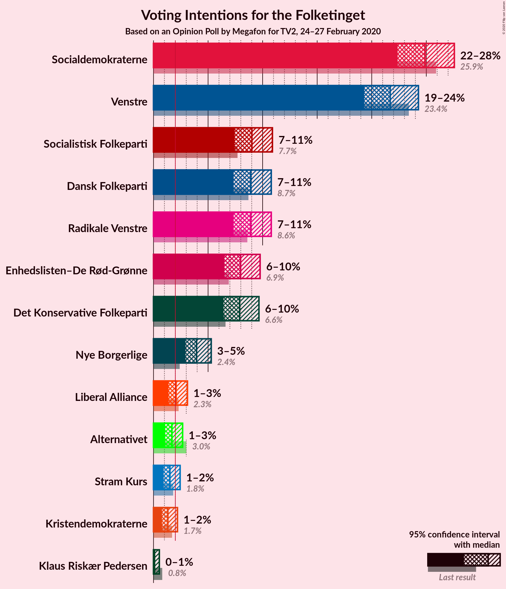

### Confidence Intervals

| Party | Last Result | Poll Result | 80% Confidence Interval | 90% Confidence Interval | 95% Confidence Interval | 99% Confidence Interval |
|:-----:|:-----------:|:-----------:|:-----------------------:|:-----------------------:|:-----------------------:|:-----------------------:|
| Socialdemokraterne | 25.9% | 24.9% | 23.2–26.6% |22.8–27.1% |22.4–27.6% |21.6–28.4% |
| Venstre | 23.4% | 21.7% | 20.1–23.4% |19.7–23.9% |19.3–24.3% |18.6–25.1% |
| Socialistisk Folkeparti | 7.7% | 9.0% | 8.0–10.2% |7.7–10.6% |7.4–10.9% |7.0–11.5% |
| Dansk Folkeparti | 8.7% | 8.9% | 7.9–10.1% |7.6–10.5% |7.3–10.8% |6.9–11.4% |
| Radikale Venstre | 8.6% | 8.9% | 7.9–10.1% |7.6–10.5% |7.3–10.8% |6.9–11.4% |
| Enhedslisten–De Rød-Grønne | 6.9% | 8.0% | 7.0–9.1% |6.7–9.5% |6.5–9.8% |6.1–10.4% |
| Det Konservative Folkeparti | 6.6% | 7.9% | 6.9–9.1% |6.6–9.4% |6.4–9.7% |6.0–10.3% |
| Nye Borgerlige | 2.4% | 3.9% | 3.3–4.8% |3.1–5.1% |2.9–5.3% |2.6–5.7% |
| Liberal Alliance | 2.3% | 2.1% | 1.6–2.7% |1.5–2.9% |1.4–3.1% |1.2–3.5% |
| Alternativet | 3.0% | 1.7% | 1.3–2.3% |1.2–2.5% |1.1–2.7% |0.9–3.0% |
| Stram Kurs | 1.8% | 1.5% | 1.1–2.1% |1.0–2.3% |0.9–2.4% |0.8–2.8% |
| Kristendemokraterne | 1.7% | 1.3% | 1.0–1.9% |0.9–2.1% |0.8–2.2% |0.6–2.5% |
| Klaus Riskær Pedersen | 0.8% | 0.1% | 0.0–0.4% |0.0–0.5% |0.0–0.5% |0.0–0.7% |

*Note:* The poll result column reflects the actual value used in the calculations. Published results may vary slightly, and in addition be rounded to fewer digits.

## Seats

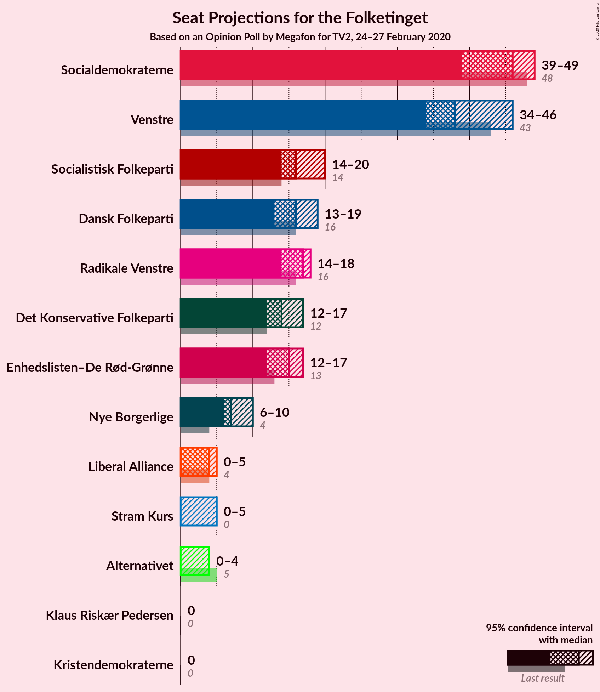

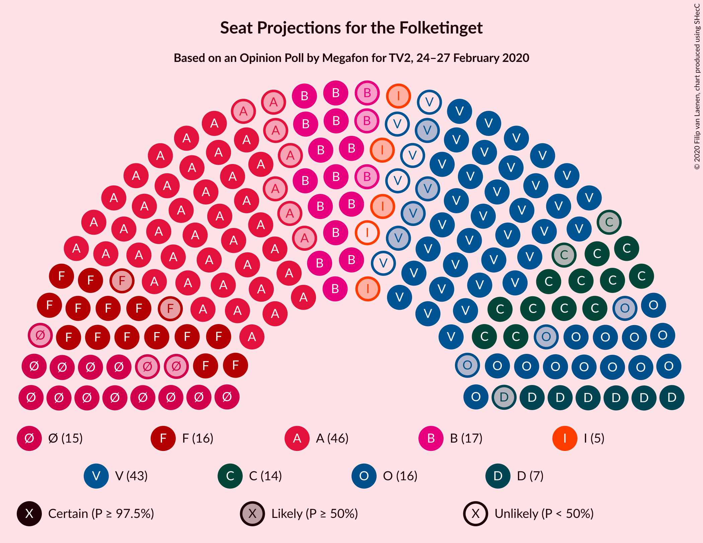

### Confidence Intervals

| Party | Last Result | Median | 80% Confidence Interval | 90% Confidence Interval | 95% Confidence Interval | 99% Confidence Interval |
|:-----:|:-----------:|:------:|:-----------------------:|:-----------------------:|:-----------------------:|:-----------------------:|
| <a href="#socialdemokraterne">Socialdemokraterne</a> | 48 | 46 | 39–47 |39–47 |39–49 |38–50 |
| <a href="#venstre">Venstre</a> | 43 | 38 | 36–46 |36–46 |34–46 |33–46 |
| <a href="#socialistisk-folkeparti">Socialistisk Folkeparti</a> | 14 | 16 | 14–19 |14–19 |14–20 |13–22 |
| <a href="#dansk-folkeparti">Dansk Folkeparti</a> | 16 | 16 | 13–18 |13–18 |13–19 |13–20 |
| <a href="#radikale-venstre">Radikale Venstre</a> | 16 | 17 | 14–18 |14–18 |14–18 |13–20 |
| <a href="#enhedslisten–de-rød-grønne">Enhedslisten–De Rød-Grønne</a> | 13 | 15 | 13–17 |13–17 |12–17 |11–20 |
| <a href="#det-konservative-folkeparti">Det Konservative Folkeparti</a> | 12 | 14 | 13–16 |13–16 |12–17 |12–19 |
| <a href="#nye-borgerlige">Nye Borgerlige</a> | 4 | 7 | 6–8 |6–8 |6–10 |5–10 |
| <a href="#liberal-alliance">Liberal Alliance</a> | 4 | 4 | 0–5 |0–5 |0–5 |0–6 |
| <a href="#alternativet">Alternativet</a> | 5 | 0 | 0–4 |0–4 |0–4 |0–5 |
| <a href="#stram-kurs">Stram Kurs</a> | 0 | 0 | 0–5 |0–5 |0–5 |0–5 |
| <a href="#kristendemokraterne">Kristendemokraterne</a> | 0 | 0 | 0 |0 |0 |0–4 |
| <a href="#klaus-riskær-pedersen">Klaus Riskær Pedersen</a> | 0 | 0 | 0 |0 |0 |0 |

### Socialdemokraterne

*For a full overview of the results for this party, see the [Socialdemokraterne](party-socialdemokraterne.html) page.*

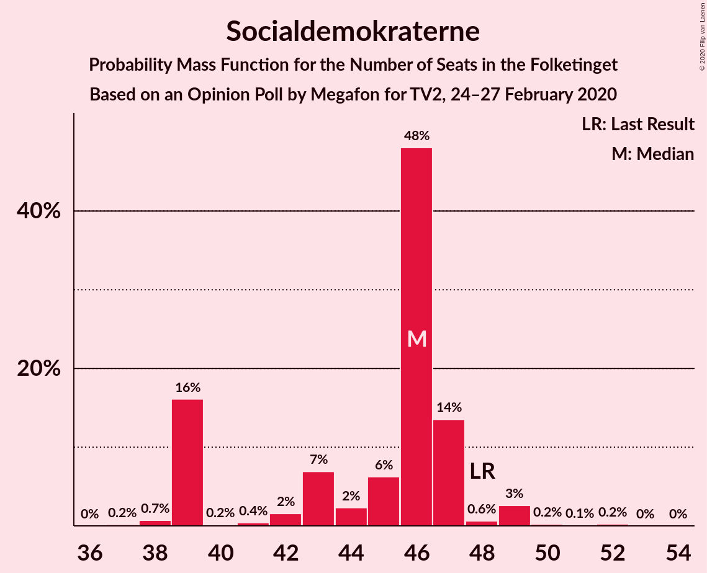

| Number of Seats | Probability | Accumulated | Special Marks |
|:---------------:|:-----------:|:-----------:|:-------------:|
| 37 | 0.2% | 100% |  |
| 38 | 0.7% | 99.8% |  |
| 39 | 16% | 99.1% |  |
| 40 | 0.2% | 83% |  |
| 41 | 0.4% | 83% |  |
| 42 | 2% | 82% |  |
| 43 | 7% | 81% |  |
| 44 | 2% | 74% |  |
| 45 | 6% | 72% |  |
| 46 | 48% | 65% | Median |
| 47 | 14% | 17% |  |
| 48 | 0.6% | 4% | Last Result |
| 49 | 3% | 3% |  |
| 50 | 0.2% | 0.6% |  |
| 51 | 0.1% | 0.3% |  |
| 52 | 0.2% | 0.3% |  |
| 53 | 0% | 0% |  |

### Venstre

*For a full overview of the results for this party, see the [Venstre](party-venstre.html) page.*

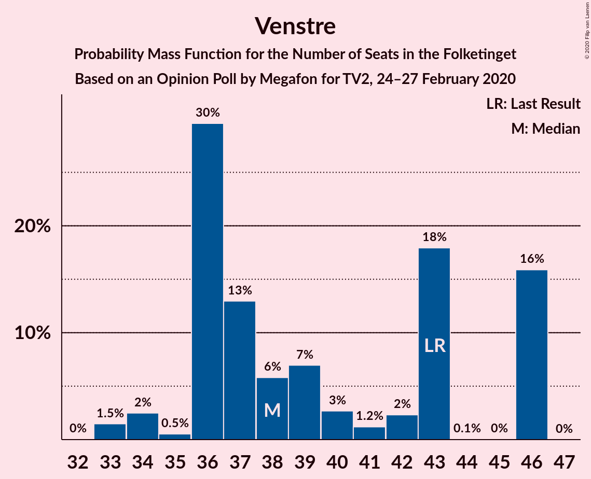

| Number of Seats | Probability | Accumulated | Special Marks |
|:---------------:|:-----------:|:-----------:|:-------------:|
| 32 | 0% | 100% |  |
| 33 | 1.5% | 99.9% |  |
| 34 | 2% | 98% |  |
| 35 | 0.5% | 96% |  |
| 36 | 30% | 95% |  |
| 37 | 13% | 66% |  |
| 38 | 6% | 53% | Median |
| 39 | 7% | 47% |  |
| 40 | 3% | 40% |  |
| 41 | 1.2% | 37% |  |
| 42 | 2% | 36% |  |
| 43 | 18% | 34% | Last Result |
| 44 | 0.1% | 16% |  |
| 45 | 0% | 16% |  |
| 46 | 16% | 16% |  |
| 47 | 0% | 0% |  |

### Socialistisk Folkeparti

*For a full overview of the results for this party, see the [Socialistisk Folkeparti](party-socialistiskfolkeparti.html) page.*

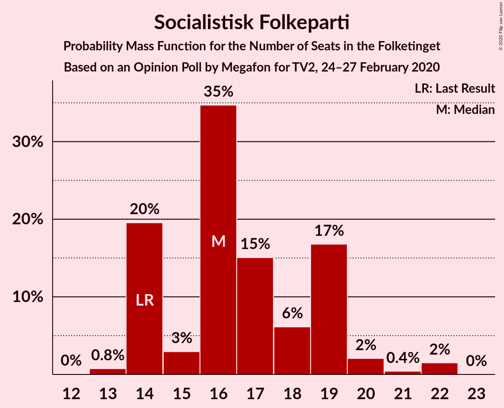

| Number of Seats | Probability | Accumulated | Special Marks |
|:---------------:|:-----------:|:-----------:|:-------------:|
| 12 | 0% | 100% |  |
| 13 | 0.8% | 99.9% |  |
| 14 | 20% | 99.2% | Last Result |
| 15 | 3% | 80% |  |
| 16 | 35% | 77% | Median |
| 17 | 15% | 42% |  |
| 18 | 6% | 27% |  |
| 19 | 17% | 21% |  |
| 20 | 2% | 4% |  |
| 21 | 0.4% | 2% |  |
| 22 | 2% | 2% |  |
| 23 | 0% | 0% |  |

### Dansk Folkeparti

*For a full overview of the results for this party, see the [Dansk Folkeparti](party-danskfolkeparti.html) page.*

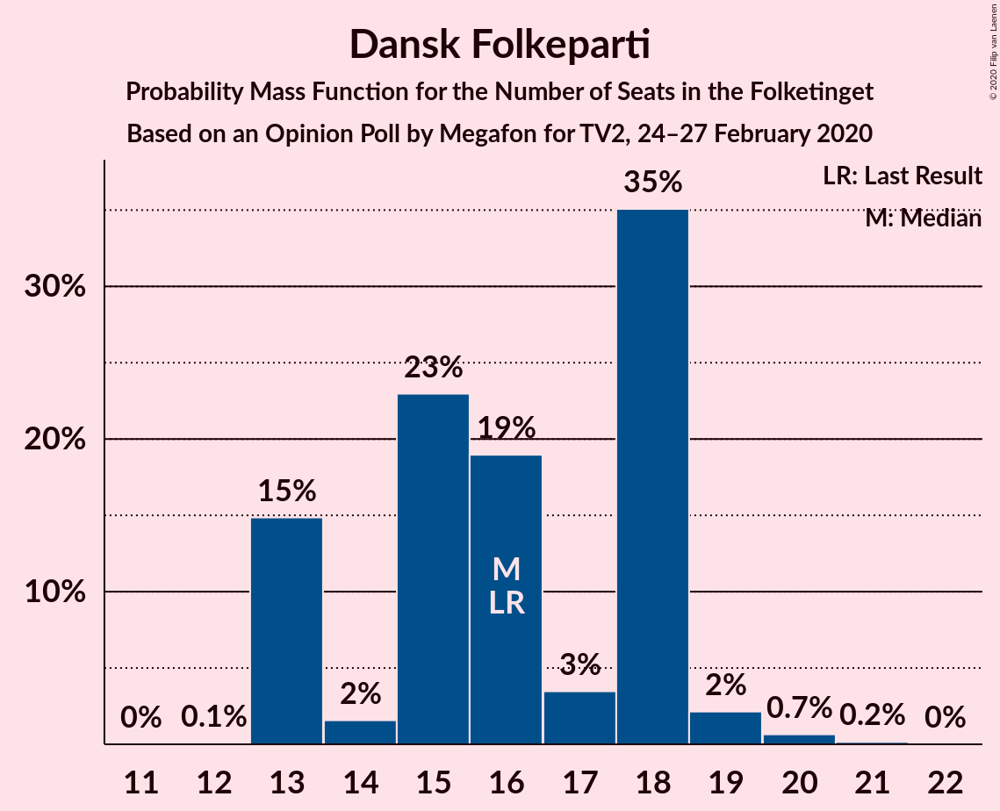

| Number of Seats | Probability | Accumulated | Special Marks |
|:---------------:|:-----------:|:-----------:|:-------------:|
| 12 | 0.1% | 100% |  |
| 13 | 15% | 99.9% |  |
| 14 | 2% | 85% |  |
| 15 | 23% | 83% |  |
| 16 | 19% | 61% | Last Result, Median |
| 17 | 3% | 42% |  |
| 18 | 35% | 38% |  |
| 19 | 2% | 3% |  |
| 20 | 0.7% | 0.8% |  |
| 21 | 0.2% | 0.2% |  |
| 22 | 0% | 0% |  |

### Radikale Venstre

*For a full overview of the results for this party, see the [Radikale Venstre](party-radikalevenstre.html) page.*

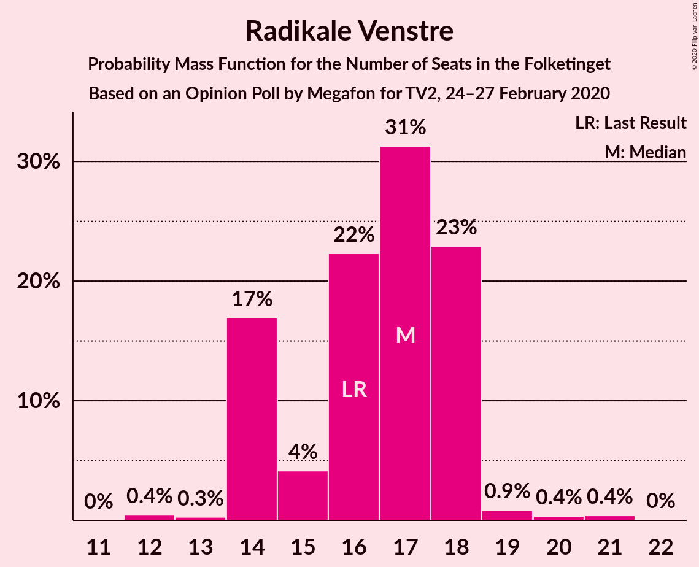

| Number of Seats | Probability | Accumulated | Special Marks |
|:---------------:|:-----------:|:-----------:|:-------------:|
| 12 | 0.4% | 100% |  |
| 13 | 0.3% | 99.5% |  |
| 14 | 17% | 99.3% |  |
| 15 | 4% | 82% |  |
| 16 | 22% | 78% | Last Result |
| 17 | 31% | 56% | Median |
| 18 | 23% | 25% |  |
| 19 | 0.9% | 2% |  |
| 20 | 0.4% | 0.8% |  |
| 21 | 0.4% | 0.4% |  |
| 22 | 0% | 0% |  |

### Enhedslisten–De Rød-Grønne

*For a full overview of the results for this party, see the [Enhedslisten–De Rød-Grønne](party-enhedslisten–derød-grønne.html) page.*

| Number of Seats | Probability | Accumulated | Special Marks |
|:---------------:|:-----------:|:-----------:|:-------------:|
| 11 | 2% | 100% |  |
| 12 | 0.7% | 98% |  |
| 13 | 20% | 97% | Last Result |
| 14 | 5% | 77% |  |
| 15 | 35% | 72% | Median |
| 16 | 5% | 37% |  |
| 17 | 31% | 33% |  |
| 18 | 0.3% | 1.1% |  |
| 19 | 0.2% | 0.9% |  |
| 20 | 0.6% | 0.6% |  |
| 21 | 0% | 0% |  |

### Det Konservative Folkeparti

*For a full overview of the results for this party, see the [Det Konservative Folkeparti](party-detkonservativefolkeparti.html) page.*

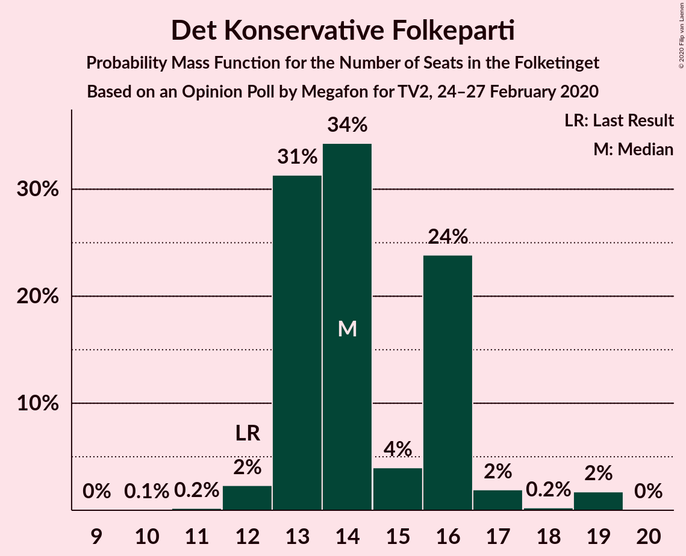

| Number of Seats | Probability | Accumulated | Special Marks |
|:---------------:|:-----------:|:-----------:|:-------------:|
| 10 | 0.1% | 100% |  |
| 11 | 0.2% | 99.9% |  |
| 12 | 2% | 99.7% | Last Result |
| 13 | 31% | 97% |  |
| 14 | 34% | 66% | Median |
| 15 | 4% | 32% |  |
| 16 | 24% | 28% |  |
| 17 | 2% | 4% |  |
| 18 | 0.2% | 2% |  |
| 19 | 2% | 2% |  |
| 20 | 0% | 0% |  |

### Nye Borgerlige

*For a full overview of the results for this party, see the [Nye Borgerlige](party-nyeborgerlige.html) page.*

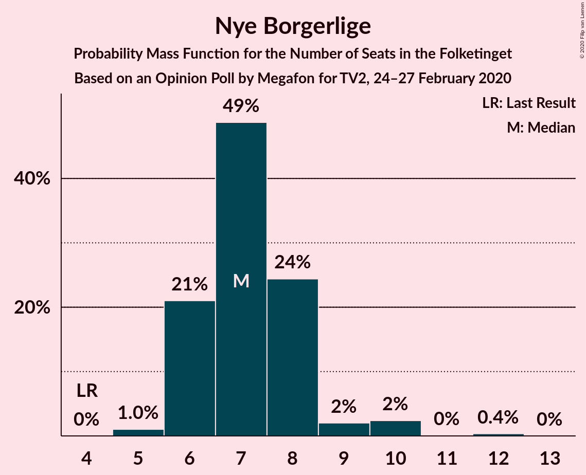

| Number of Seats | Probability | Accumulated | Special Marks |
|:---------------:|:-----------:|:-----------:|:-------------:|
| 4 | 0% | 100% | Last Result |
| 5 | 1.0% | 100% |  |
| 6 | 21% | 99.0% |  |
| 7 | 49% | 78% | Median |
| 8 | 24% | 29% |  |
| 9 | 2% | 5% |  |
| 10 | 2% | 3% |  |
| 11 | 0% | 0.4% |  |
| 12 | 0.4% | 0.4% |  |
| 13 | 0% | 0% |  |

### Liberal Alliance

*For a full overview of the results for this party, see the [Liberal Alliance](party-liberalalliance.html) page.*

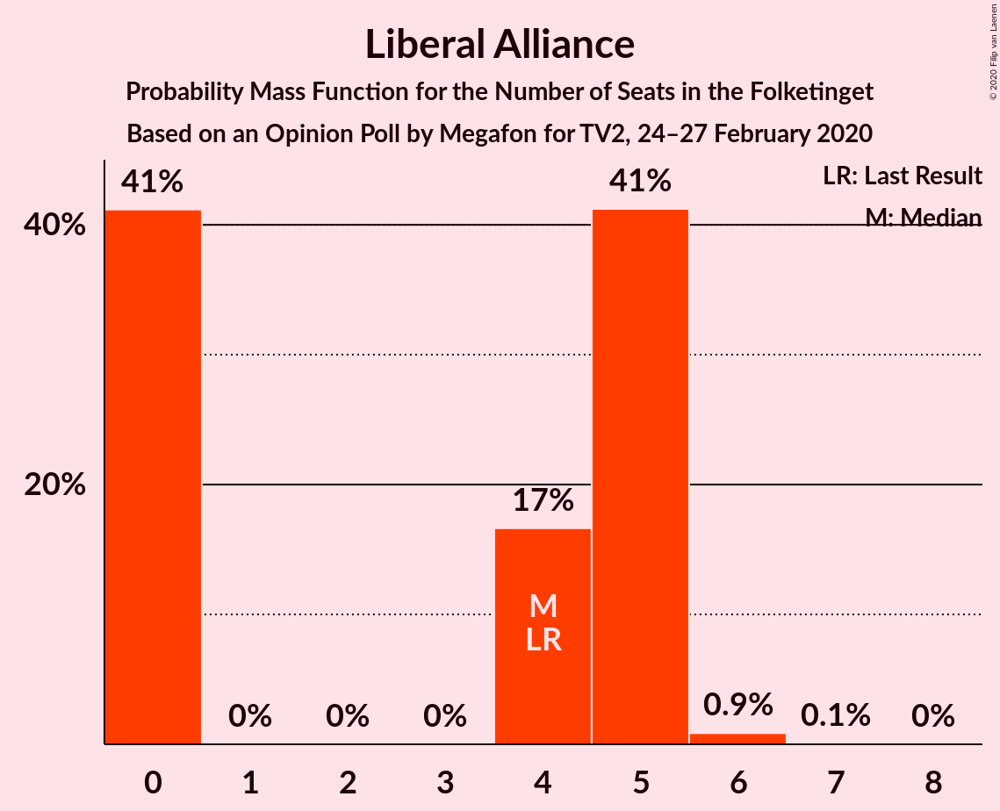

| Number of Seats | Probability | Accumulated | Special Marks |
|:---------------:|:-----------:|:-----------:|:-------------:|
| 0 | 41% | 100% |  |
| 1 | 0% | 59% |  |
| 2 | 0% | 59% |  |
| 3 | 0% | 59% |  |
| 4 | 17% | 59% | Last Result, Median |
| 5 | 41% | 42% |  |
| 6 | 0.9% | 1.0% |  |
| 7 | 0.1% | 0.1% |  |
| 8 | 0% | 0% |  |

### Alternativet

*For a full overview of the results for this party, see the [Alternativet](party-alternativet.html) page.*

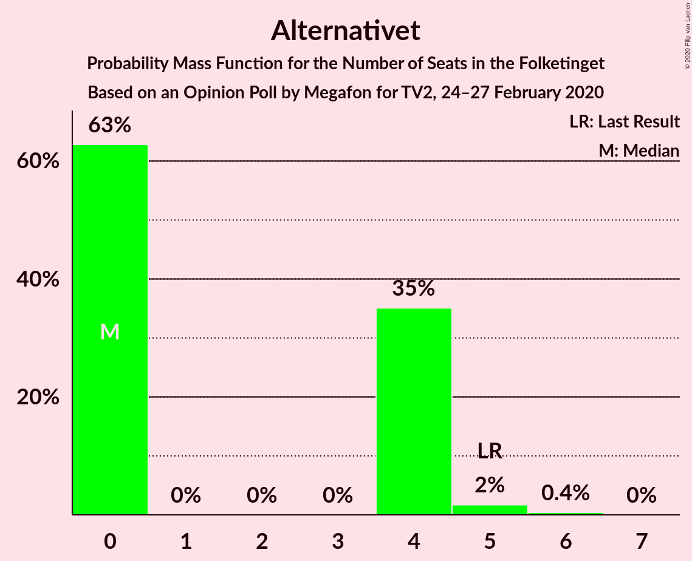

| Number of Seats | Probability | Accumulated | Special Marks |
|:---------------:|:-----------:|:-----------:|:-------------:|
| 0 | 63% | 100% | Median |
| 1 | 0% | 37% |  |
| 2 | 0% | 37% |  |
| 3 | 0% | 37% |  |
| 4 | 35% | 37% |  |
| 5 | 2% | 2% | Last Result |
| 6 | 0.4% | 0.4% |  |
| 7 | 0% | 0% |  |

### Stram Kurs

*For a full overview of the results for this party, see the [Stram Kurs](party-stramkurs.html) page.*

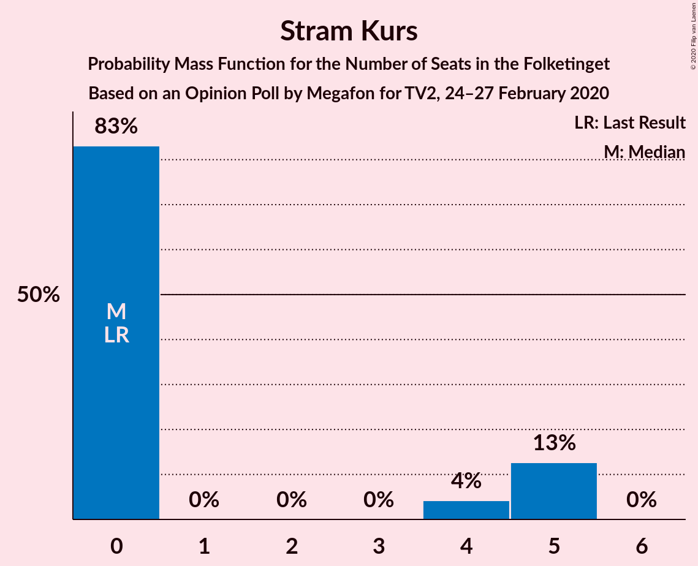

| Number of Seats | Probability | Accumulated | Special Marks |
|:---------------:|:-----------:|:-----------:|:-------------:|
| 0 | 83% | 100% | Last Result, Median |
| 1 | 0% | 17% |  |
| 2 | 0% | 17% |  |
| 3 | 0% | 17% |  |
| 4 | 4% | 17% |  |
| 5 | 13% | 13% |  |
| 6 | 0% | 0% |  |

### Kristendemokraterne

*For a full overview of the results for this party, see the [Kristendemokraterne](party-kristendemokraterne.html) page.*

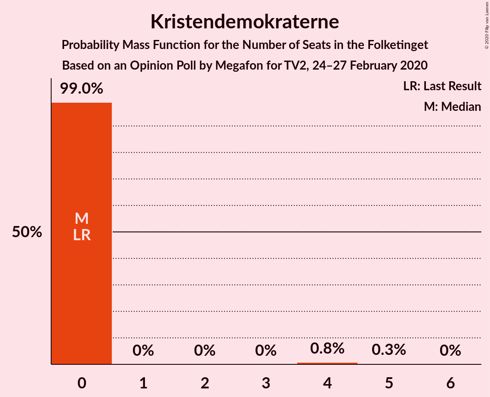

| Number of Seats | Probability | Accumulated | Special Marks |
|:---------------:|:-----------:|:-----------:|:-------------:|
| 0 | 99.0% | 100% | Last Result, Median |
| 1 | 0% | 1.0% |  |
| 2 | 0% | 1.0% |  |
| 3 | 0% | 1.0% |  |
| 4 | 0.8% | 1.0% |  |
| 5 | 0.3% | 0.3% |  |
| 6 | 0% | 0% |  |

### Klaus Riskær Pedersen

*For a full overview of the results for this party, see the [Klaus Riskær Pedersen](party-klausriskærpedersen.html) page.*

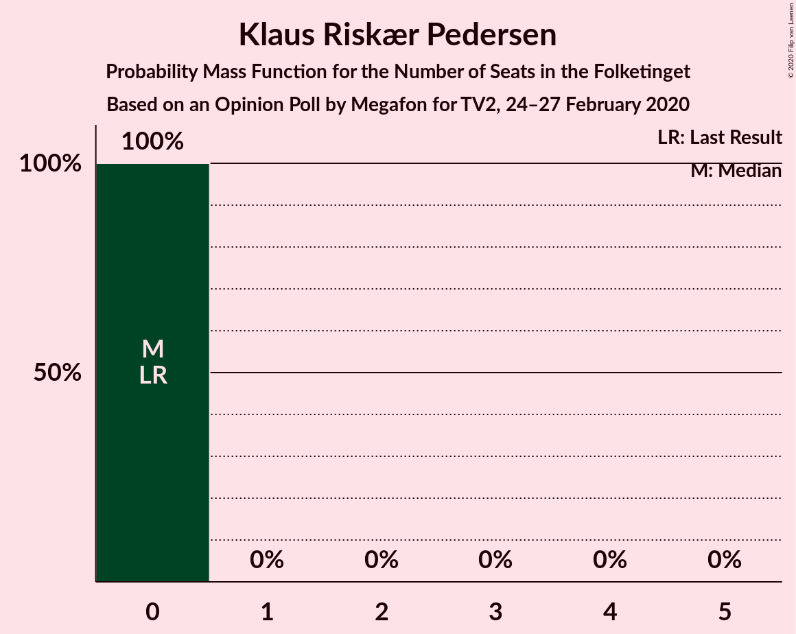

| Number of Seats | Probability | Accumulated | Special Marks |
|:---------------:|:-----------:|:-----------:|:-------------:|
| 0 | 100% | 100% | Last Result, Median |

## Coalitions

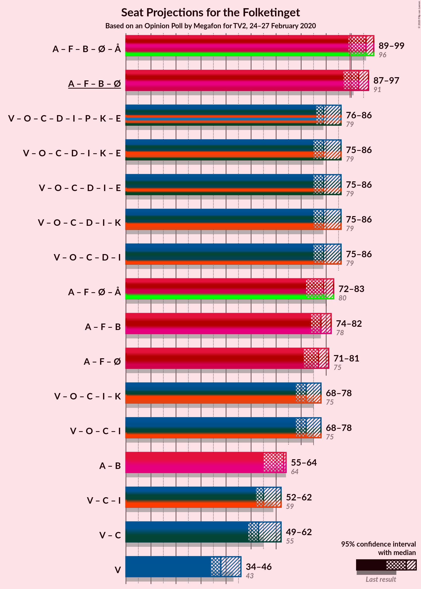

### Confidence Intervals

| Coalition | Last Result | Median | Majority? | 80% Confidence Interval | 90% Confidence Interval | 95% Confidence Interval | 99% Confidence Interval |
|:---------:|:-----------:|:------:|:---------:|:-----------------------:|:-----------------------:|:-----------------------:|:-----------------------:|
| Socialdemokraterne – Socialistisk Folkeparti – Radikale Venstre – Enhedslisten–De Rød-Grønne – Alternativet | 96 | 96 | 81% | 89–97 | 89–97 | 89–99 | 87–101 |
| Socialdemokraterne – Socialistisk Folkeparti – Radikale Venstre – Enhedslisten–De Rød-Grønne | 91 | 93 | 81% | 89–96 | 89–96 | 87–97 | 84–100 |
| Venstre – Dansk Folkeparti – Det Konservative Folkeparti – Nye Borgerlige – Liberal Alliance – Stram Kurs – Kristendemokraterne – Klaus Riskær Pedersen | 79 | 79 | 0.1% | 78–86 | 78–86 | 76–86 | 74–88 |
| Venstre – Dansk Folkeparti – Det Konservative Folkeparti – Nye Borgerlige – Liberal Alliance – Kristendemokraterne – Klaus Riskær Pedersen | 79 | 79 | 0% | 75–86 | 75–86 | 75–86 | 73–88 |
| Venstre – Dansk Folkeparti – Det Konservative Folkeparti – Nye Borgerlige – Liberal Alliance – Klaus Riskær Pedersen | 79 | 79 | 0% | 75–86 | 75–86 | 75–86 | 73–88 |
| Venstre – Dansk Folkeparti – Det Konservative Folkeparti – Nye Borgerlige – Liberal Alliance – Kristendemokraterne | 79 | 79 | 0% | 75–86 | 75–86 | 75–86 | 73–88 |
| Venstre – Dansk Folkeparti – Det Konservative Folkeparti – Nye Borgerlige – Liberal Alliance | 79 | 79 | 0% | 75–86 | 75–86 | 75–86 | 73–88 |
| Socialdemokraterne – Socialistisk Folkeparti – Enhedslisten–De Rød-Grønne – Alternativet | 80 | 79 | 0% | 73–81 | 72–81 | 72–83 | 69–85 |
| Socialdemokraterne – Socialistisk Folkeparti – Radikale Venstre | 78 | 78 | 0% | 74–79 | 74–81 | 74–82 | 70–83 |
| Socialdemokraterne – Socialistisk Folkeparti – Enhedslisten–De Rød-Grønne | 75 | 77 | 0% | 73–79 | 72–80 | 71–81 | 69–83 |
| Venstre – Dansk Folkeparti – Det Konservative Folkeparti – Liberal Alliance – Kristendemokraterne | 75 | 72 | 0% | 68–78 | 68–78 | 68–78 | 65–79 |
| Venstre – Dansk Folkeparti – Det Konservative Folkeparti – Liberal Alliance | 75 | 72 | 0% | 68–78 | 68–78 | 68–78 | 65–79 |
| Socialdemokraterne – Radikale Venstre | 64 | 63 | 0% | 55–64 | 55–64 | 55–64 | 54–67 |
| Venstre – Det Konservative Folkeparti – Liberal Alliance | 59 | 55 | 0% | 54–62 | 53–62 | 52–62 | 49–63 |
| Venstre – Det Konservative Folkeparti | 55 | 53 | 0% | 49–62 | 49–62 | 49–62 | 48–62 |
| Venstre | 43 | 38 | 0% | 36–46 | 36–46 | 34–46 | 33–46 |

### Socialdemokraterne – Socialistisk Folkeparti – Radikale Venstre – Enhedslisten–De Rød-Grønne – Alternativet

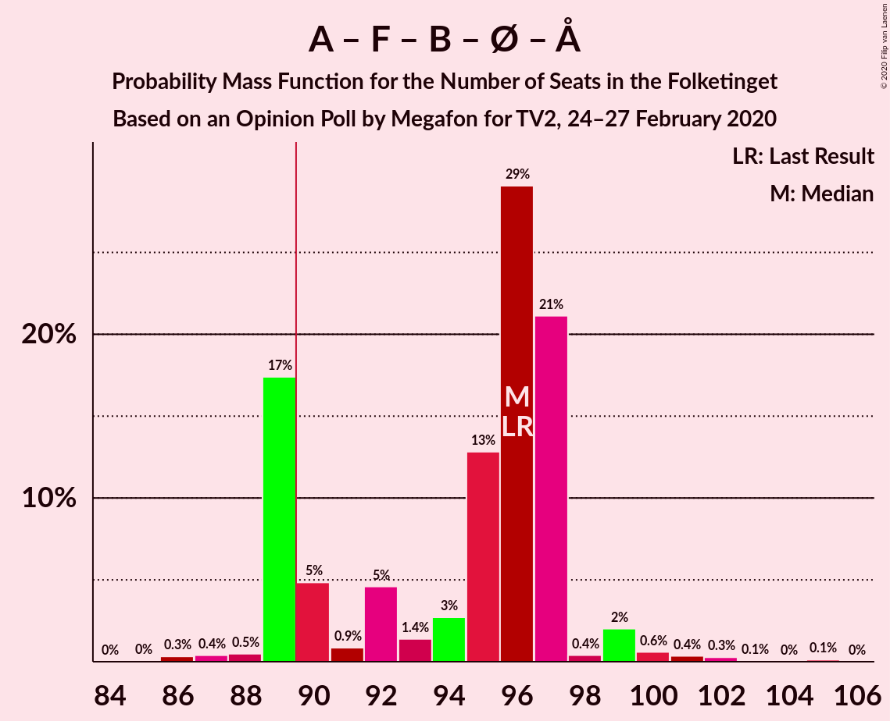

| Number of Seats | Probability | Accumulated | Special Marks |
|:---------------:|:-----------:|:-----------:|:-------------:|
| 85 | 0% | 100% |  |
| 86 | 0.3% | 99.9% |  |
| 87 | 0.4% | 99.6% |  |
| 88 | 0.5% | 99.2% |  |
| 89 | 17% | 98.7% |  |
| 90 | 5% | 81% | Majority |
| 91 | 0.9% | 76% |  |
| 92 | 5% | 76% |  |
| 93 | 1.4% | 71% |  |
| 94 | 3% | 70% | Median |
| 95 | 13% | 67% |  |
| 96 | 29% | 54% | Last Result |
| 97 | 21% | 25% |  |
| 98 | 0.4% | 4% |  |
| 99 | 2% | 3% |  |
| 100 | 0.6% | 1.4% |  |
| 101 | 0.4% | 0.8% |  |
| 102 | 0.3% | 0.5% |  |
| 103 | 0.1% | 0.2% |  |
| 104 | 0% | 0.1% |  |
| 105 | 0.1% | 0.1% |  |
| 106 | 0% | 0% |  |

### Socialdemokraterne – Socialistisk Folkeparti – Radikale Venstre – Enhedslisten–De Rød-Grønne

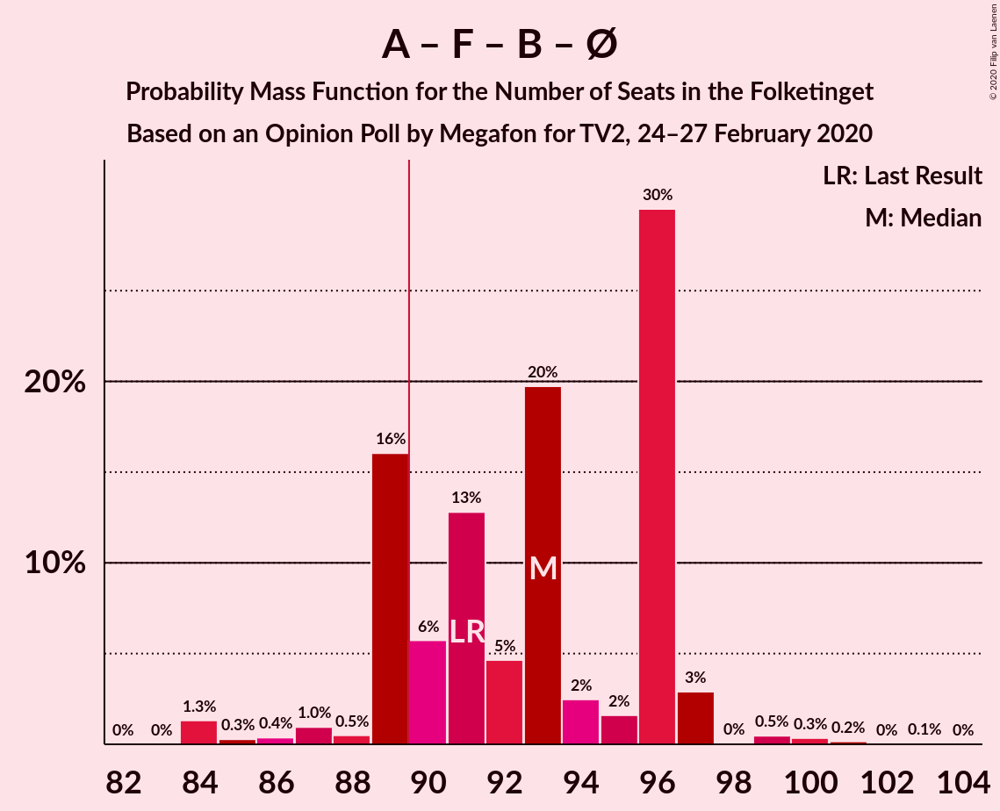

| Number of Seats | Probability | Accumulated | Special Marks |
|:---------------:|:-----------:|:-----------:|:-------------:|
| 84 | 1.3% | 100% |  |
| 85 | 0.3% | 98.7% |  |
| 86 | 0.4% | 98% |  |
| 87 | 1.0% | 98% |  |
| 88 | 0.5% | 97% |  |
| 89 | 16% | 97% |  |
| 90 | 6% | 81% | Majority |
| 91 | 13% | 75% | Last Result |
| 92 | 5% | 62% |  |
| 93 | 20% | 57% |  |
| 94 | 2% | 38% | Median |
| 95 | 2% | 35% |  |
| 96 | 30% | 34% |  |
| 97 | 3% | 4% |  |
| 98 | 0% | 1.1% |  |
| 99 | 0.5% | 1.1% |  |
| 100 | 0.3% | 0.6% |  |
| 101 | 0.2% | 0.2% |  |
| 102 | 0% | 0.1% |  |
| 103 | 0.1% | 0.1% |  |
| 104 | 0% | 0% |  |

### Venstre – Dansk Folkeparti – Det Konservative Folkeparti – Nye Borgerlige – Liberal Alliance – Stram Kurs – Kristendemokraterne – Klaus Riskær Pedersen

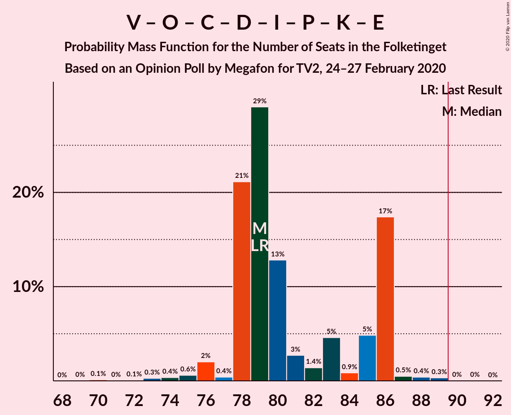

| Number of Seats | Probability | Accumulated | Special Marks |
|:---------------:|:-----------:|:-----------:|:-------------:|
| 70 | 0.1% | 100% |  |
| 71 | 0% | 99.9% |  |
| 72 | 0.1% | 99.9% |  |
| 73 | 0.3% | 99.8% |  |
| 74 | 0.4% | 99.5% |  |
| 75 | 0.6% | 99.2% |  |
| 76 | 2% | 98.6% |  |
| 77 | 0.4% | 97% |  |
| 78 | 21% | 96% |  |
| 79 | 29% | 75% | Last Result, Median |
| 80 | 13% | 46% |  |
| 81 | 3% | 33% |  |
| 82 | 1.4% | 30% |  |
| 83 | 5% | 29% |  |
| 84 | 0.9% | 24% |  |
| 85 | 5% | 24% |  |
| 86 | 17% | 19% |  |
| 87 | 0.5% | 1.3% |  |
| 88 | 0.4% | 0.8% |  |
| 89 | 0.3% | 0.4% |  |
| 90 | 0% | 0.1% | Majority |
| 91 | 0% | 0% |  |

### Venstre – Dansk Folkeparti – Det Konservative Folkeparti – Nye Borgerlige – Liberal Alliance – Kristendemokraterne – Klaus Riskær Pedersen

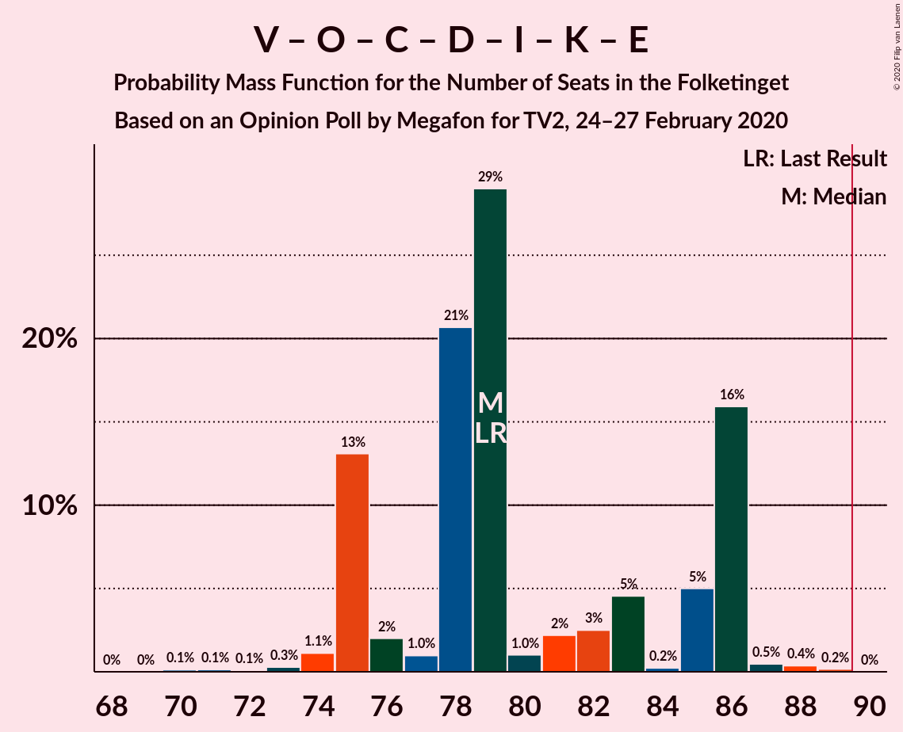

| Number of Seats | Probability | Accumulated | Special Marks |
|:---------------:|:-----------:|:-----------:|:-------------:|
| 70 | 0.1% | 100% |  |
| 71 | 0.1% | 99.9% |  |
| 72 | 0.1% | 99.7% |  |
| 73 | 0.3% | 99.7% |  |
| 74 | 1.1% | 99.4% |  |
| 75 | 13% | 98% |  |
| 76 | 2% | 85% |  |
| 77 | 1.0% | 83% |  |
| 78 | 21% | 82% |  |
| 79 | 29% | 61% | Last Result, Median |
| 80 | 1.0% | 32% |  |
| 81 | 2% | 31% |  |
| 82 | 3% | 29% |  |
| 83 | 5% | 27% |  |
| 84 | 0.2% | 22% |  |
| 85 | 5% | 22% |  |
| 86 | 16% | 17% |  |
| 87 | 0.5% | 1.0% |  |
| 88 | 0.4% | 0.6% |  |
| 89 | 0.2% | 0.2% |  |
| 90 | 0% | 0% | Majority |

### Venstre – Dansk Folkeparti – Det Konservative Folkeparti – Nye Borgerlige – Liberal Alliance – Klaus Riskær Pedersen

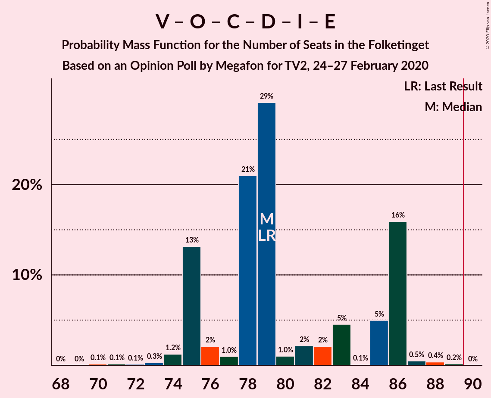

| Number of Seats | Probability | Accumulated | Special Marks |
|:---------------:|:-----------:|:-----------:|:-------------:|
| 70 | 0.1% | 100% |  |
| 71 | 0.1% | 99.9% |  |
| 72 | 0.1% | 99.7% |  |
| 73 | 0.3% | 99.6% |  |
| 74 | 1.2% | 99.3% |  |
| 75 | 13% | 98% |  |
| 76 | 2% | 85% |  |
| 77 | 1.0% | 83% |  |
| 78 | 21% | 82% |  |
| 79 | 29% | 61% | Last Result, Median |
| 80 | 1.0% | 32% |  |
| 81 | 2% | 31% |  |
| 82 | 2% | 29% |  |
| 83 | 5% | 27% |  |
| 84 | 0.1% | 22% |  |
| 85 | 5% | 22% |  |
| 86 | 16% | 17% |  |
| 87 | 0.5% | 1.0% |  |
| 88 | 0.4% | 0.5% |  |
| 89 | 0.2% | 0.2% |  |
| 90 | 0% | 0% | Majority |

### Venstre – Dansk Folkeparti – Det Konservative Folkeparti – Nye Borgerlige – Liberal Alliance – Kristendemokraterne

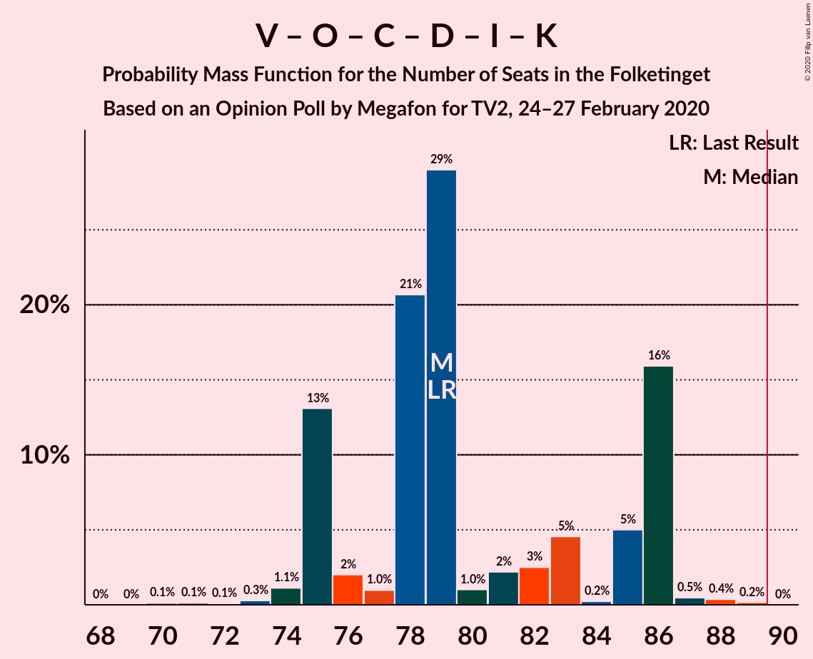

| Number of Seats | Probability | Accumulated | Special Marks |
|:---------------:|:-----------:|:-----------:|:-------------:|
| 70 | 0.1% | 100% |  |
| 71 | 0.1% | 99.9% |  |
| 72 | 0.1% | 99.7% |  |
| 73 | 0.3% | 99.7% |  |
| 74 | 1.1% | 99.4% |  |
| 75 | 13% | 98% |  |
| 76 | 2% | 85% |  |
| 77 | 1.0% | 83% |  |
| 78 | 21% | 82% |  |
| 79 | 29% | 61% | Last Result, Median |
| 80 | 1.0% | 32% |  |
| 81 | 2% | 31% |  |
| 82 | 3% | 29% |  |
| 83 | 5% | 27% |  |
| 84 | 0.2% | 22% |  |
| 85 | 5% | 22% |  |
| 86 | 16% | 17% |  |
| 87 | 0.5% | 1.0% |  |
| 88 | 0.4% | 0.6% |  |
| 89 | 0.2% | 0.2% |  |
| 90 | 0% | 0% | Majority |

### Venstre – Dansk Folkeparti – Det Konservative Folkeparti – Nye Borgerlige – Liberal Alliance

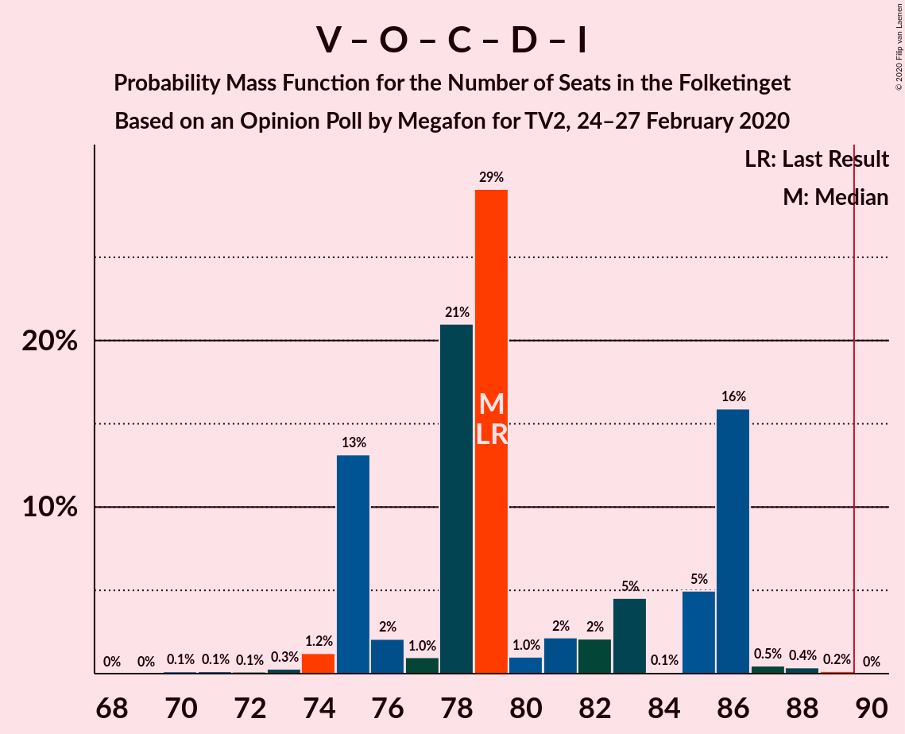

| Number of Seats | Probability | Accumulated | Special Marks |
|:---------------:|:-----------:|:-----------:|:-------------:|
| 70 | 0.1% | 100% |  |
| 71 | 0.1% | 99.9% |  |
| 72 | 0.1% | 99.7% |  |
| 73 | 0.3% | 99.6% |  |
| 74 | 1.2% | 99.3% |  |
| 75 | 13% | 98% |  |
| 76 | 2% | 85% |  |
| 77 | 1.0% | 83% |  |
| 78 | 21% | 82% |  |
| 79 | 29% | 61% | Last Result, Median |
| 80 | 1.0% | 32% |  |
| 81 | 2% | 31% |  |
| 82 | 2% | 29% |  |
| 83 | 5% | 27% |  |
| 84 | 0.1% | 22% |  |
| 85 | 5% | 22% |  |
| 86 | 16% | 17% |  |
| 87 | 0.5% | 1.0% |  |
| 88 | 0.4% | 0.5% |  |
| 89 | 0.2% | 0.2% |  |
| 90 | 0% | 0% | Majority |

### Socialdemokraterne – Socialistisk Folkeparti – Enhedslisten–De Rød-Grønne – Alternativet

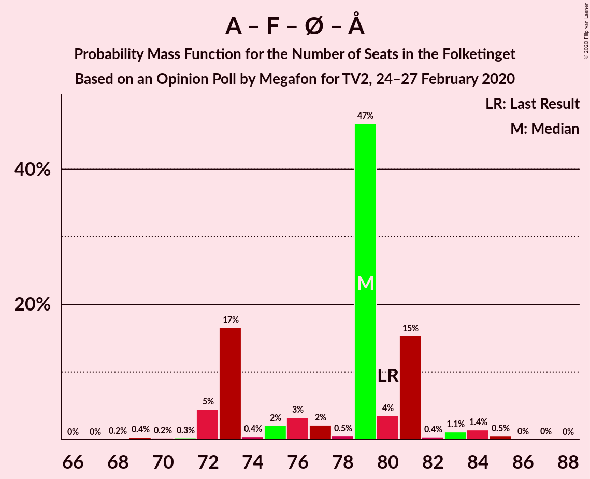

| Number of Seats | Probability | Accumulated | Special Marks |
|:---------------:|:-----------:|:-----------:|:-------------:|
| 68 | 0.2% | 100% |  |
| 69 | 0.4% | 99.8% |  |
| 70 | 0.2% | 99.5% |  |
| 71 | 0.3% | 99.2% |  |
| 72 | 5% | 99.0% |  |
| 73 | 17% | 94% |  |
| 74 | 0.4% | 78% |  |
| 75 | 2% | 77% |  |
| 76 | 3% | 75% |  |
| 77 | 2% | 72% | Median |
| 78 | 0.5% | 70% |  |
| 79 | 47% | 69% |  |
| 80 | 4% | 23% | Last Result |
| 81 | 15% | 19% |  |
| 82 | 0.4% | 4% |  |
| 83 | 1.1% | 3% |  |
| 84 | 1.4% | 2% |  |
| 85 | 0.5% | 0.7% |  |
| 86 | 0% | 0.1% |  |
| 87 | 0% | 0.1% |  |
| 88 | 0% | 0% |  |

### Socialdemokraterne – Socialistisk Folkeparti – Radikale Venstre

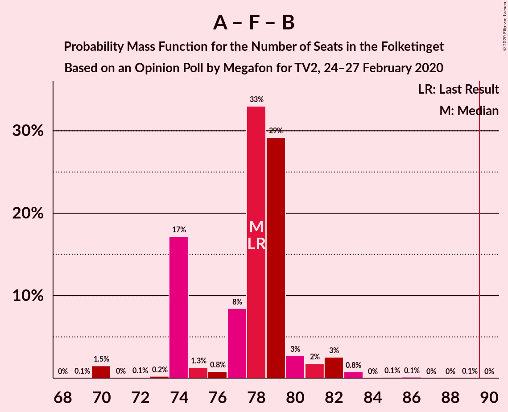

| Number of Seats | Probability | Accumulated | Special Marks |
|:---------------:|:-----------:|:-----------:|:-------------:|
| 69 | 0.1% | 100% |  |
| 70 | 1.5% | 99.9% |  |
| 71 | 0% | 98% |  |
| 72 | 0.1% | 98% |  |
| 73 | 0.2% | 98% |  |
| 74 | 17% | 98% |  |
| 75 | 1.3% | 81% |  |
| 76 | 0.8% | 80% |  |
| 77 | 8% | 79% |  |
| 78 | 33% | 70% | Last Result |
| 79 | 29% | 37% | Median |
| 80 | 3% | 8% |  |
| 81 | 2% | 5% |  |
| 82 | 3% | 4% |  |
| 83 | 0.8% | 1.1% |  |
| 84 | 0% | 0.4% |  |
| 85 | 0.1% | 0.3% |  |
| 86 | 0.1% | 0.2% |  |
| 87 | 0% | 0.1% |  |
| 88 | 0% | 0.1% |  |
| 89 | 0.1% | 0.1% |  |
| 90 | 0% | 0% | Majority |

### Socialdemokraterne – Socialistisk Folkeparti – Enhedslisten–De Rød-Grønne

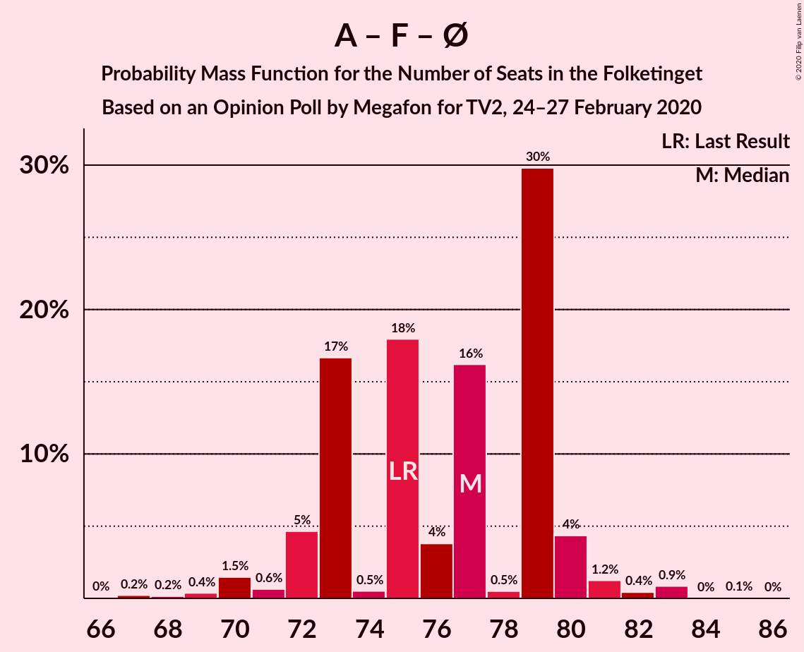

| Number of Seats | Probability | Accumulated | Special Marks |
|:---------------:|:-----------:|:-----------:|:-------------:|
| 67 | 0.2% | 100% |  |
| 68 | 0.2% | 99.7% |  |
| 69 | 0.4% | 99.6% |  |
| 70 | 1.5% | 99.2% |  |
| 71 | 0.6% | 98% |  |
| 72 | 5% | 97% |  |
| 73 | 17% | 92% |  |
| 74 | 0.5% | 76% |  |
| 75 | 18% | 75% | Last Result |
| 76 | 4% | 57% |  |
| 77 | 16% | 53% | Median |
| 78 | 0.5% | 37% |  |
| 79 | 30% | 37% |  |
| 80 | 4% | 7% |  |
| 81 | 1.2% | 3% |  |
| 82 | 0.4% | 1.4% |  |
| 83 | 0.9% | 1.0% |  |
| 84 | 0% | 0.1% |  |
| 85 | 0.1% | 0.1% |  |
| 86 | 0% | 0% |  |

### Venstre – Dansk Folkeparti – Det Konservative Folkeparti – Liberal Alliance – Kristendemokraterne

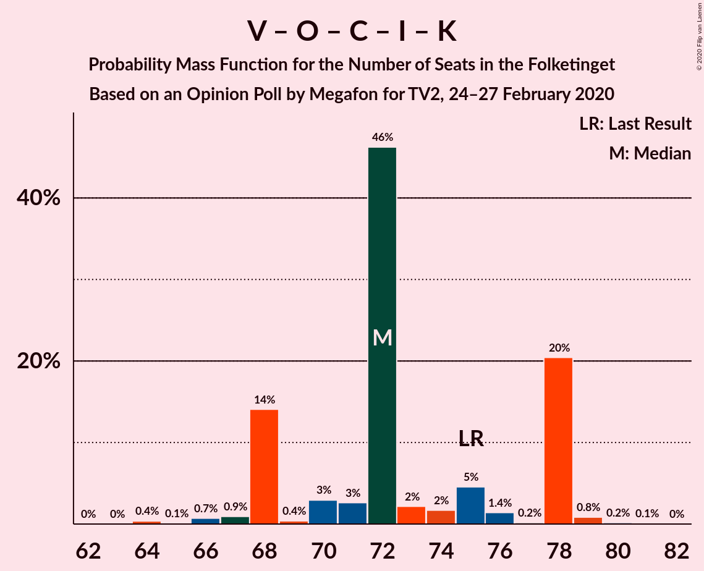

| Number of Seats | Probability | Accumulated | Special Marks |
|:---------------:|:-----------:|:-----------:|:-------------:|
| 63 | 0% | 100% |  |
| 64 | 0.4% | 99.9% |  |
| 65 | 0.1% | 99.6% |  |
| 66 | 0.7% | 99.5% |  |
| 67 | 0.9% | 98.7% |  |
| 68 | 14% | 98% |  |
| 69 | 0.4% | 84% |  |
| 70 | 3% | 83% |  |
| 71 | 3% | 80% |  |
| 72 | 46% | 78% | Median |
| 73 | 2% | 32% |  |
| 74 | 2% | 29% |  |
| 75 | 5% | 28% | Last Result |
| 76 | 1.4% | 23% |  |
| 77 | 0.2% | 22% |  |
| 78 | 20% | 22% |  |
| 79 | 0.8% | 1.1% |  |
| 80 | 0.2% | 0.3% |  |
| 81 | 0.1% | 0.1% |  |
| 82 | 0% | 0% |  |

### Venstre – Dansk Folkeparti – Det Konservative Folkeparti – Liberal Alliance

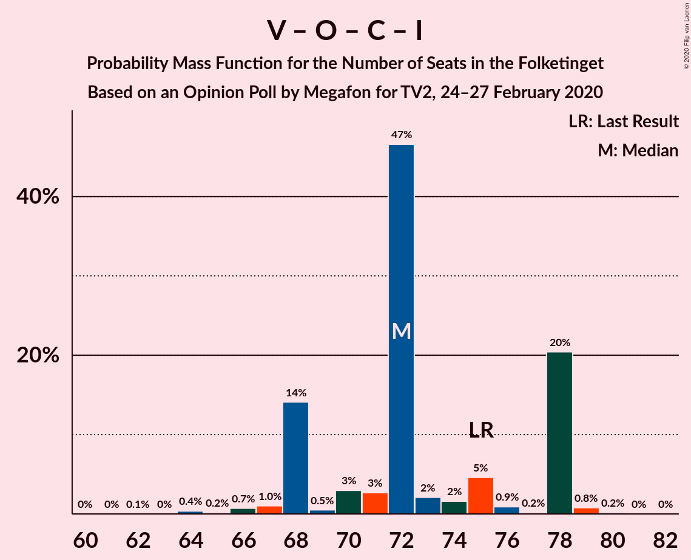

| Number of Seats | Probability | Accumulated | Special Marks |
|:---------------:|:-----------:|:-----------:|:-------------:|
| 62 | 0.1% | 100% |  |
| 63 | 0% | 99.9% |  |
| 64 | 0.4% | 99.9% |  |
| 65 | 0.2% | 99.6% |  |
| 66 | 0.7% | 99.4% |  |
| 67 | 1.0% | 98.7% |  |
| 68 | 14% | 98% |  |
| 69 | 0.5% | 84% |  |
| 70 | 3% | 83% |  |
| 71 | 3% | 80% |  |
| 72 | 47% | 77% | Median |
| 73 | 2% | 31% |  |
| 74 | 2% | 29% |  |
| 75 | 5% | 27% | Last Result |
| 76 | 0.9% | 23% |  |
| 77 | 0.2% | 22% |  |
| 78 | 20% | 21% |  |
| 79 | 0.8% | 1.0% |  |
| 80 | 0.2% | 0.2% |  |
| 81 | 0% | 0.1% |  |
| 82 | 0% | 0% |  |

### Socialdemokraterne – Radikale Venstre

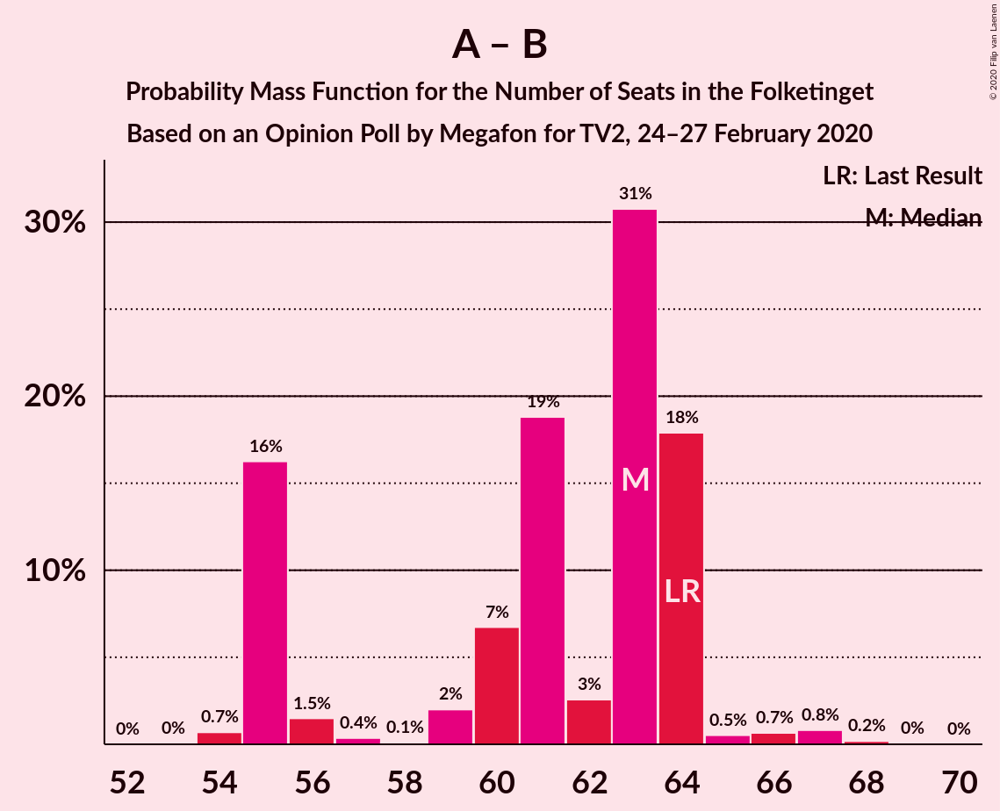

| Number of Seats | Probability | Accumulated | Special Marks |
|:---------------:|:-----------:|:-----------:|:-------------:|
| 53 | 0% | 100% |  |
| 54 | 0.7% | 99.9% |  |
| 55 | 16% | 99.2% |  |
| 56 | 1.5% | 83% |  |
| 57 | 0.4% | 81% |  |
| 58 | 0.1% | 81% |  |
| 59 | 2% | 81% |  |
| 60 | 7% | 79% |  |
| 61 | 19% | 72% |  |
| 62 | 3% | 53% |  |
| 63 | 31% | 51% | Median |
| 64 | 18% | 20% | Last Result |
| 65 | 0.5% | 2% |  |
| 66 | 0.7% | 2% |  |
| 67 | 0.8% | 1.1% |  |
| 68 | 0.2% | 0.2% |  |
| 69 | 0% | 0.1% |  |
| 70 | 0% | 0% |  |

### Venstre – Det Konservative Folkeparti – Liberal Alliance

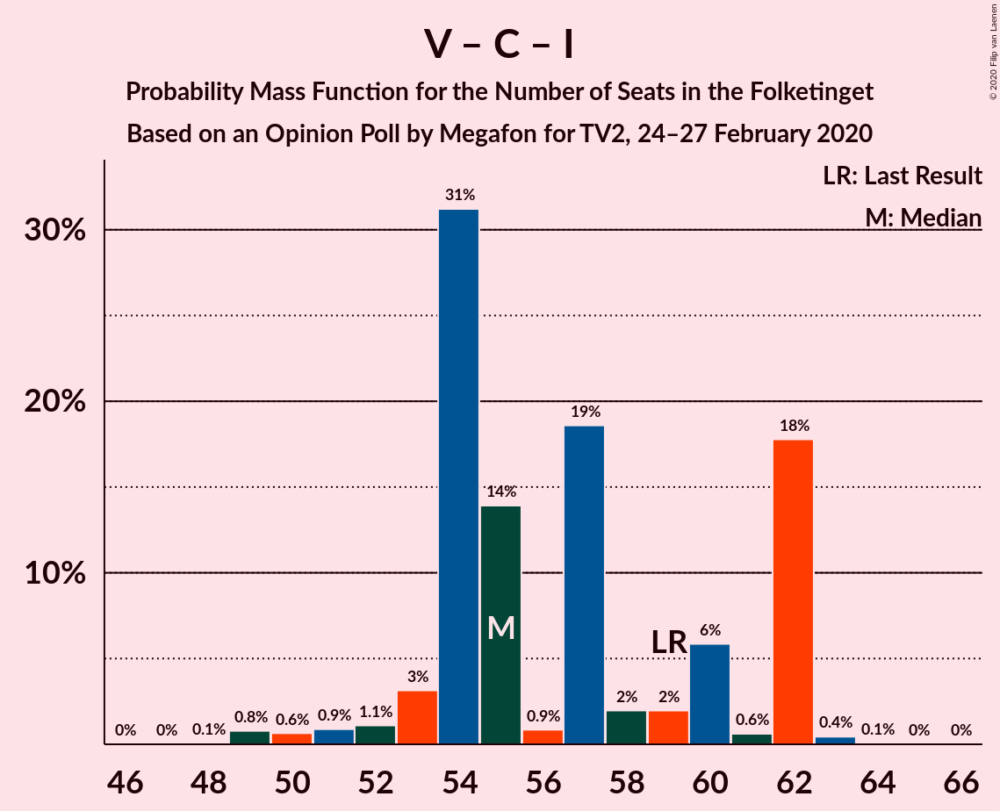

| Number of Seats | Probability | Accumulated | Special Marks |
|:---------------:|:-----------:|:-----------:|:-------------:|
| 46 | 0% | 100% |  |
| 47 | 0% | 99.9% |  |
| 48 | 0.1% | 99.9% |  |
| 49 | 0.8% | 99.9% |  |
| 50 | 0.6% | 99.1% |  |
| 51 | 0.9% | 98% |  |
| 52 | 1.1% | 98% |  |
| 53 | 3% | 96% |  |
| 54 | 31% | 93% |  |
| 55 | 14% | 62% |  |
| 56 | 0.9% | 48% | Median |
| 57 | 19% | 47% |  |
| 58 | 2% | 29% |  |
| 59 | 2% | 27% | Last Result |
| 60 | 6% | 25% |  |
| 61 | 0.6% | 19% |  |
| 62 | 18% | 18% |  |
| 63 | 0.4% | 0.5% |  |
| 64 | 0.1% | 0.1% |  |
| 65 | 0% | 0% |  |

### Venstre – Det Konservative Folkeparti

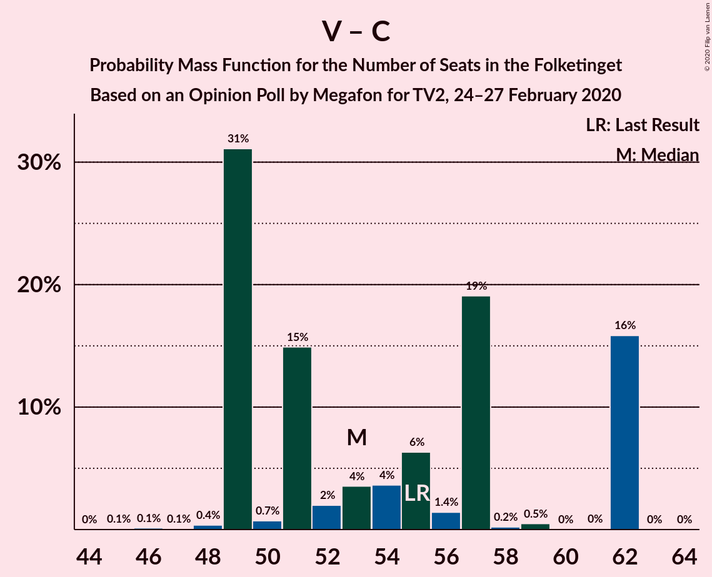

| Number of Seats | Probability | Accumulated | Special Marks |
|:---------------:|:-----------:|:-----------:|:-------------:|
| 45 | 0.1% | 100% |  |
| 46 | 0.1% | 99.9% |  |
| 47 | 0.1% | 99.8% |  |
| 48 | 0.4% | 99.7% |  |
| 49 | 31% | 99.3% |  |
| 50 | 0.7% | 68% |  |
| 51 | 15% | 68% |  |
| 52 | 2% | 53% | Median |
| 53 | 4% | 51% |  |
| 54 | 4% | 47% |  |
| 55 | 6% | 43% | Last Result |
| 56 | 1.4% | 37% |  |
| 57 | 19% | 36% |  |
| 58 | 0.2% | 17% |  |
| 59 | 0.5% | 16% |  |
| 60 | 0% | 16% |  |
| 61 | 0% | 16% |  |
| 62 | 16% | 16% |  |
| 63 | 0% | 0% |  |

### Venstre

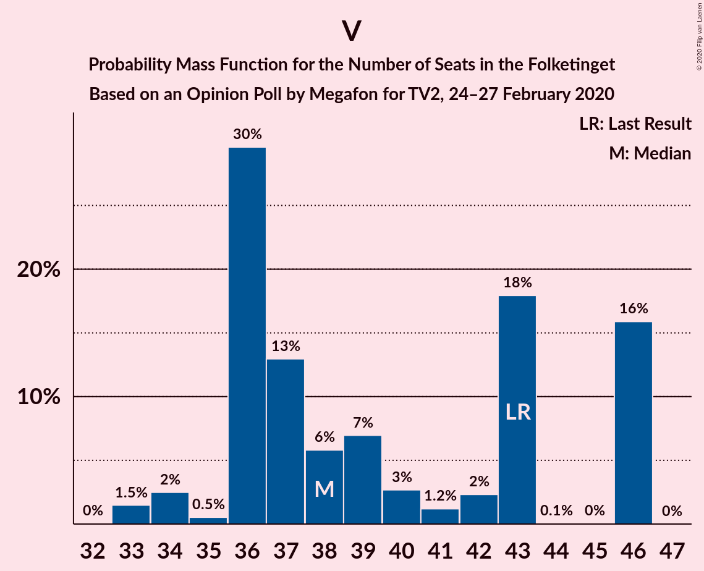

| Number of Seats | Probability | Accumulated | Special Marks |
|:---------------:|:-----------:|:-----------:|:-------------:|
| 32 | 0% | 100% |  |
| 33 | 1.5% | 99.9% |  |
| 34 | 2% | 98% |  |
| 35 | 0.5% | 96% |  |
| 36 | 30% | 95% |  |
| 37 | 13% | 66% |  |
| 38 | 6% | 53% | Median |
| 39 | 7% | 47% |  |
| 40 | 3% | 40% |  |
| 41 | 1.2% | 37% |  |
| 42 | 2% | 36% |  |
| 43 | 18% | 34% | Last Result |
| 44 | 0.1% | 16% |  |
| 45 | 0% | 16% |  |
| 46 | 16% | 16% |  |
| 47 | 0% | 0% |  |

## Technical Information

### Opinion Poll

+ **Polling firm:** Megafon
+ **Commissioner(s):** TV2
+ **Fieldwork period:** 24–27 February 2020

### Calculations

+ **Sample size:** 1065
+ **Simulations done:** 1,048,576
+ **Error estimate:** 3.60%

