# Opinion Poll by Voxmeter for Ritzau, 24 February–1 March 2020

<a href="#voting-intentions">Voting Intentions</a> | <a href="#seats">Seats</a> | <a href="#coalitions">Coalitions</a> | <a href="#technical-information">Technical Information</a>

## Voting Intentions

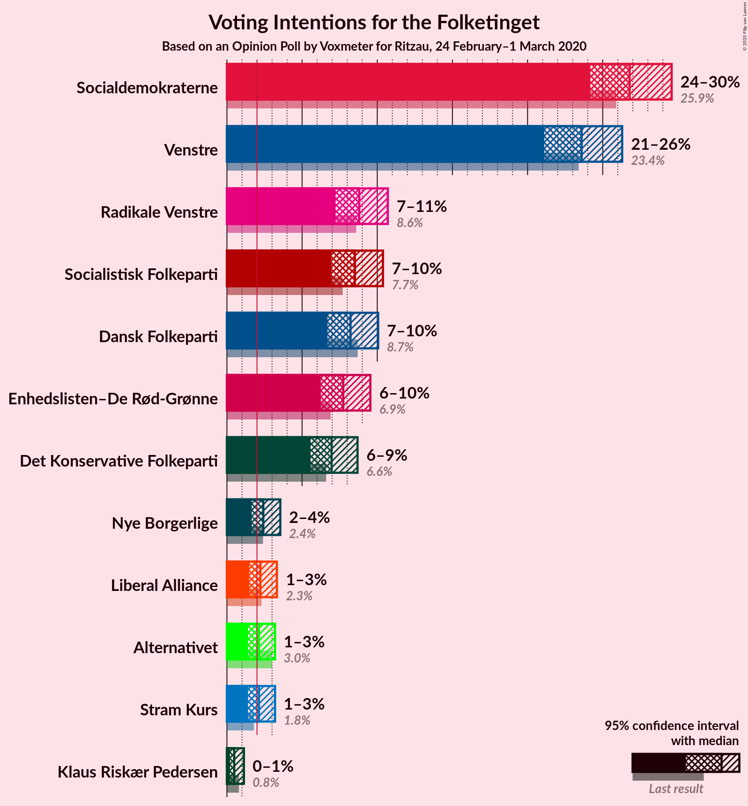

### Confidence Intervals

| Party | Last Result | Poll Result | 80% Confidence Interval | 90% Confidence Interval | 95% Confidence Interval | 99% Confidence Interval |
|:-----:|:-----------:|:-----------:|:-----------------------:|:-----------------------:|:-----------------------:|:-----------------------:|
| Socialdemokraterne | 25.9% | 26.8% | 25.1–28.6% |24.6–29.1% |24.2–29.6% |23.4–30.5% |
| Venstre | 23.4% | 23.6% | 22.0–25.4% |21.5–25.8% |21.1–26.3% |20.3–27.1% |
| Radikale Venstre | 8.6% | 8.8% | 7.8–10.0% |7.5–10.4% |7.2–10.7% |6.8–11.3% |
| Socialistisk Folkeparti | 7.7% | 8.5% | 7.5–9.7% |7.2–10.1% |7.0–10.4% |6.5–11.0% |
| Dansk Folkeparti | 8.7% | 8.2% | 7.2–9.4% |6.9–9.8% |6.7–10.1% |6.2–10.7% |
| Enhedslisten–De Rød-Grønne | 6.9% | 7.7% | 6.8–8.9% |6.5–9.2% |6.2–9.5% |5.8–10.1% |
| Det Konservative Folkeparti | 6.6% | 7.0% | 6.0–8.1% |5.8–8.4% |5.6–8.7% |5.2–9.3% |
| Nye Borgerlige | 2.4% | 2.4% | 1.9–3.2% |1.8–3.4% |1.6–3.6% |1.4–3.9% |
| Liberal Alliance | 2.3% | 2.2% | 1.7–2.9% |1.6–3.1% |1.5–3.3% |1.3–3.7% |
| Alternativet | 3.0% | 2.1% | 1.6–2.8% |1.5–3.0% |1.4–3.2% |1.2–3.6% |
| Stram Kurs | 1.8% | 2.1% | 1.6–2.8% |1.5–3.0% |1.4–3.2% |1.2–3.6% |
| Klaus Riskær Pedersen | 0.8% | 0.5% | 0.3–0.9% |0.2–1.0% |0.2–1.1% |0.1–1.4% |

*Note:* The poll result column reflects the actual value used in the calculations. Published results may vary slightly, and in addition be rounded to fewer digits.

## Seats

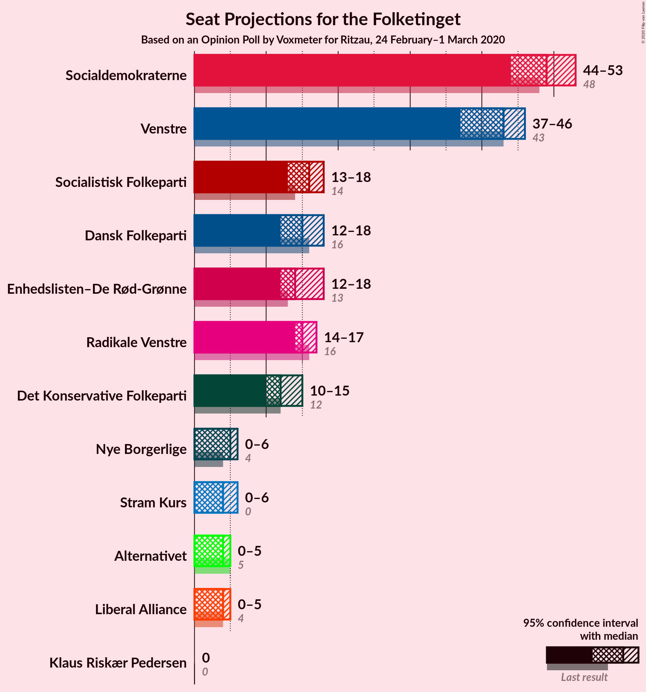

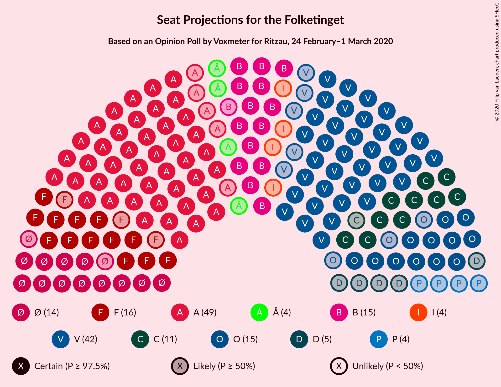

### Confidence Intervals

| Party | Last Result | Median | 80% Confidence Interval | 90% Confidence Interval | 95% Confidence Interval | 99% Confidence Interval |
|:-----:|:-----------:|:------:|:-----------------------:|:-----------------------:|:-----------------------:|:-----------------------:|
| <a href="#socialdemokraterne">Socialdemokraterne</a> | 48 | 49 | 45–51 |44–52 |44–53 |44–54 |
| <a href="#venstre">Venstre</a> | 43 | 43 | 38–45 |37–45 |37–46 |36–47 |
| <a href="#radikale-venstre">Radikale Venstre</a> | 16 | 15 | 14–16 |14–17 |14–17 |12–19 |
| <a href="#socialistisk-folkeparti">Socialistisk Folkeparti</a> | 14 | 16 | 13–17 |13–17 |13–18 |11–20 |
| <a href="#dansk-folkeparti">Dansk Folkeparti</a> | 16 | 15 | 14–18 |13–18 |12–18 |11–20 |
| <a href="#enhedslisten–de-rød-grønne">Enhedslisten–De Rød-Grønne</a> | 13 | 14 | 12–17 |12–18 |12–18 |11–18 |
| <a href="#det-konservative-folkeparti">Det Konservative Folkeparti</a> | 12 | 12 | 11–14 |10–14 |10–15 |10–16 |
| <a href="#nye-borgerlige">Nye Borgerlige</a> | 4 | 5 | 4–6 |0–6 |0–6 |0–7 |
| <a href="#liberal-alliance">Liberal Alliance</a> | 4 | 4 | 0–5 |0–5 |0–5 |0–6 |
| <a href="#alternativet">Alternativet</a> | 5 | 4 | 0–5 |0–5 |0–5 |0–6 |
| <a href="#stram-kurs">Stram Kurs</a> | 0 | 4 | 0–4 |0–6 |0–6 |0–6 |
| <a href="#klaus-riskær-pedersen">Klaus Riskær Pedersen</a> | 0 | 0 | 0 |0 |0 |0 |

### Socialdemokraterne

*For a full overview of the results for this party, see the [Socialdemokraterne](party-socialdemokraterne.html) page.*

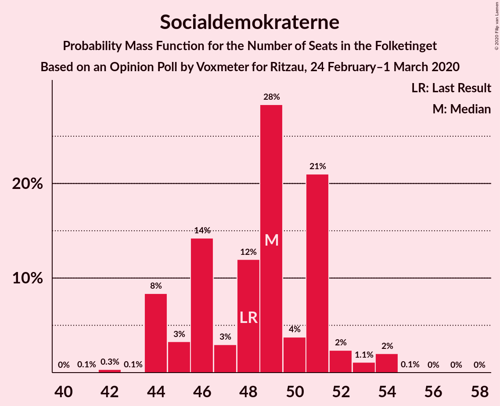

| Number of Seats | Probability | Accumulated | Special Marks |
|:---------------:|:-----------:|:-----------:|:-------------:|
| 41 | 0.1% | 100% |  |
| 42 | 0.3% | 99.9% |  |
| 43 | 0.1% | 99.6% |  |
| 44 | 8% | 99.5% |  |
| 45 | 3% | 91% |  |
| 46 | 14% | 88% |  |
| 47 | 3% | 74% |  |
| 48 | 12% | 71% | Last Result |
| 49 | 28% | 59% | Median |
| 50 | 4% | 30% |  |
| 51 | 21% | 27% |  |
| 52 | 2% | 6% |  |
| 53 | 1.1% | 3% |  |
| 54 | 2% | 2% |  |
| 55 | 0.1% | 0.1% |  |
| 56 | 0% | 0.1% |  |
| 57 | 0% | 0% |  |

### Venstre

*For a full overview of the results for this party, see the [Venstre](party-venstre.html) page.*

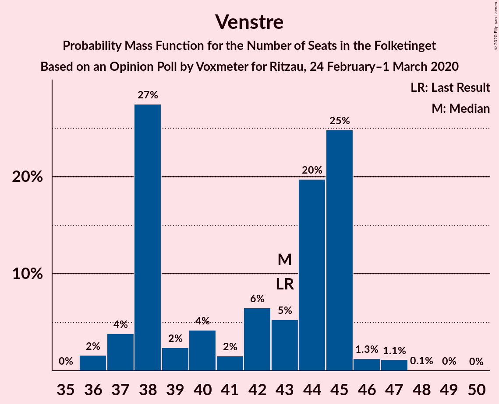

| Number of Seats | Probability | Accumulated | Special Marks |
|:---------------:|:-----------:|:-----------:|:-------------:|
| 35 | 0% | 100% |  |
| 36 | 2% | 99.9% |  |
| 37 | 4% | 98% |  |
| 38 | 27% | 95% |  |
| 39 | 2% | 67% |  |
| 40 | 4% | 65% |  |
| 41 | 2% | 60% |  |
| 42 | 6% | 59% |  |
| 43 | 5% | 52% | Last Result, Median |
| 44 | 20% | 47% |  |
| 45 | 25% | 27% |  |
| 46 | 1.3% | 3% |  |
| 47 | 1.1% | 1.3% |  |
| 48 | 0.1% | 0.1% |  |
| 49 | 0% | 0.1% |  |
| 50 | 0% | 0% |  |

### Radikale Venstre

*For a full overview of the results for this party, see the [Radikale Venstre](party-radikalevenstre.html) page.*

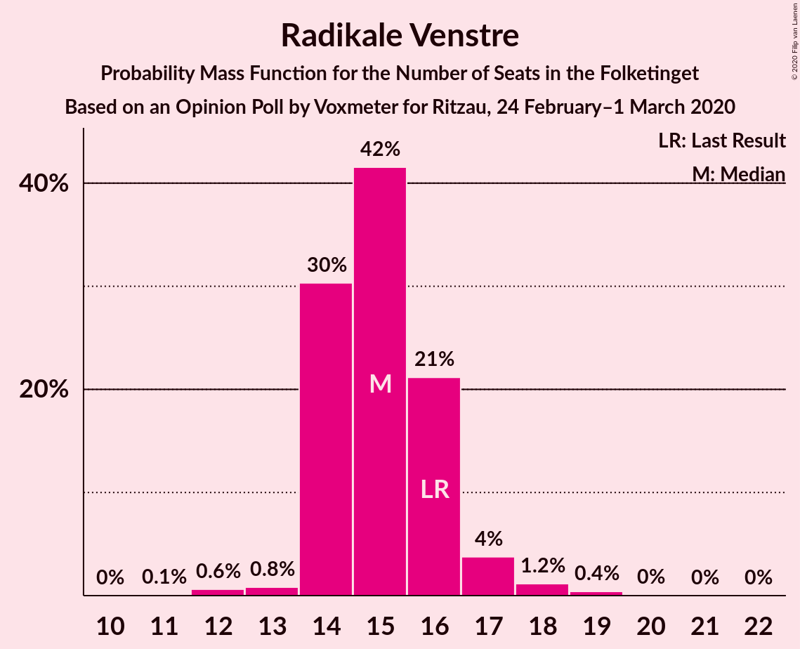

| Number of Seats | Probability | Accumulated | Special Marks |
|:---------------:|:-----------:|:-----------:|:-------------:|
| 11 | 0.1% | 100% |  |
| 12 | 0.6% | 99.9% |  |
| 13 | 0.8% | 99.3% |  |
| 14 | 30% | 98% |  |
| 15 | 42% | 68% | Median |
| 16 | 21% | 27% | Last Result |
| 17 | 4% | 5% |  |
| 18 | 1.2% | 2% |  |
| 19 | 0.4% | 0.5% |  |
| 20 | 0% | 0.1% |  |
| 21 | 0% | 0.1% |  |
| 22 | 0% | 0% |  |

### Socialistisk Folkeparti

*For a full overview of the results for this party, see the [Socialistisk Folkeparti](party-socialistiskfolkeparti.html) page.*

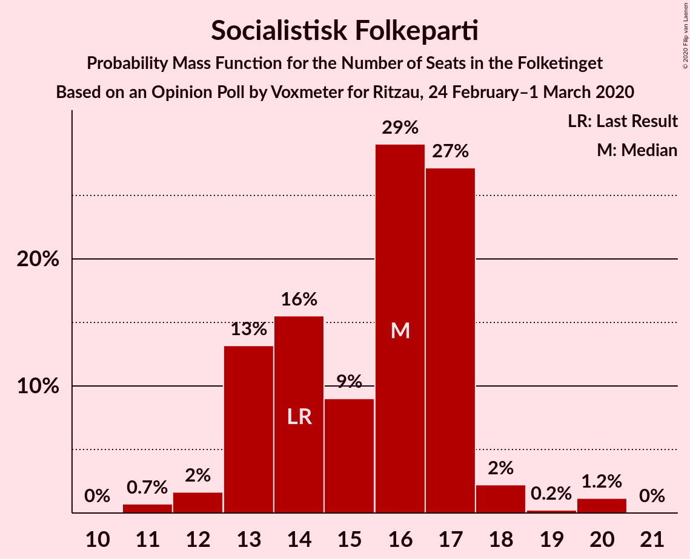

| Number of Seats | Probability | Accumulated | Special Marks |
|:---------------:|:-----------:|:-----------:|:-------------:|
| 11 | 0.7% | 100% |  |
| 12 | 2% | 99.3% |  |
| 13 | 13% | 98% |  |
| 14 | 16% | 84% | Last Result |
| 15 | 9% | 69% |  |
| 16 | 29% | 60% | Median |
| 17 | 27% | 31% |  |
| 18 | 2% | 4% |  |
| 19 | 0.2% | 1.4% |  |
| 20 | 1.2% | 1.2% |  |
| 21 | 0% | 0% |  |

### Dansk Folkeparti

*For a full overview of the results for this party, see the [Dansk Folkeparti](party-danskfolkeparti.html) page.*

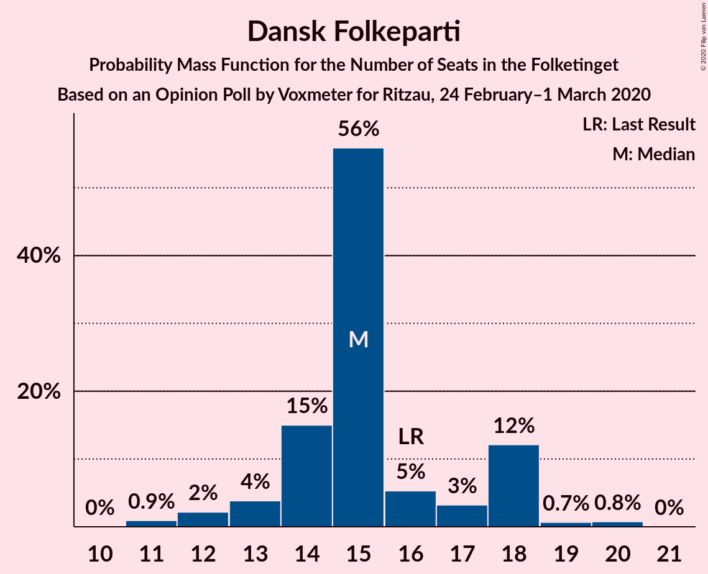

| Number of Seats | Probability | Accumulated | Special Marks |
|:---------------:|:-----------:|:-----------:|:-------------:|
| 11 | 0.9% | 100% |  |
| 12 | 2% | 99.0% |  |
| 13 | 4% | 97% |  |
| 14 | 15% | 93% |  |
| 15 | 56% | 78% | Median |
| 16 | 5% | 22% | Last Result |
| 17 | 3% | 17% |  |
| 18 | 12% | 14% |  |
| 19 | 0.7% | 1.4% |  |
| 20 | 0.8% | 0.8% |  |
| 21 | 0% | 0% |  |

### Enhedslisten–De Rød-Grønne

*For a full overview of the results for this party, see the [Enhedslisten–De Rød-Grønne](party-enhedslisten–derød-grønne.html) page.*

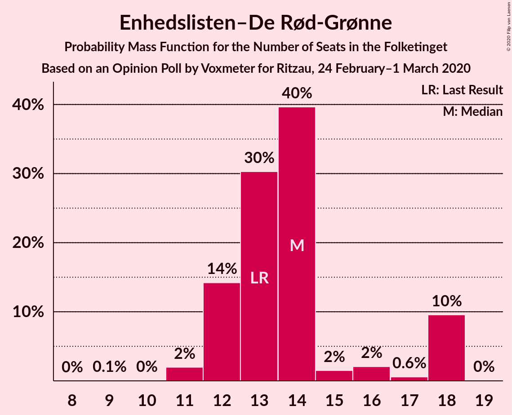

| Number of Seats | Probability | Accumulated | Special Marks |
|:---------------:|:-----------:|:-----------:|:-------------:|
| 9 | 0.1% | 100% |  |
| 10 | 0% | 99.9% |  |
| 11 | 2% | 99.9% |  |
| 12 | 14% | 98% |  |
| 13 | 30% | 84% | Last Result |
| 14 | 40% | 53% | Median |
| 15 | 2% | 14% |  |
| 16 | 2% | 12% |  |
| 17 | 0.6% | 10% |  |
| 18 | 10% | 10% |  |
| 19 | 0% | 0% |  |

### Det Konservative Folkeparti

*For a full overview of the results for this party, see the [Det Konservative Folkeparti](party-detkonservativefolkeparti.html) page.*

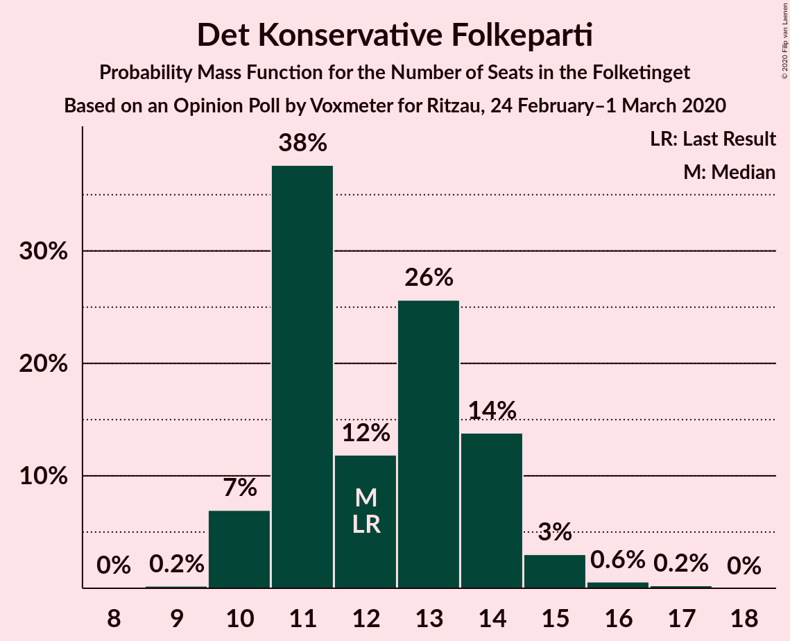

| Number of Seats | Probability | Accumulated | Special Marks |
|:---------------:|:-----------:|:-----------:|:-------------:|
| 9 | 0.2% | 100% |  |
| 10 | 7% | 99.8% |  |
| 11 | 38% | 93% |  |
| 12 | 12% | 55% | Last Result, Median |
| 13 | 26% | 43% |  |
| 14 | 14% | 18% |  |
| 15 | 3% | 4% |  |
| 16 | 0.6% | 0.8% |  |
| 17 | 0.2% | 0.3% |  |
| 18 | 0% | 0% |  |

### Nye Borgerlige

*For a full overview of the results for this party, see the [Nye Borgerlige](party-nyeborgerlige.html) page.*

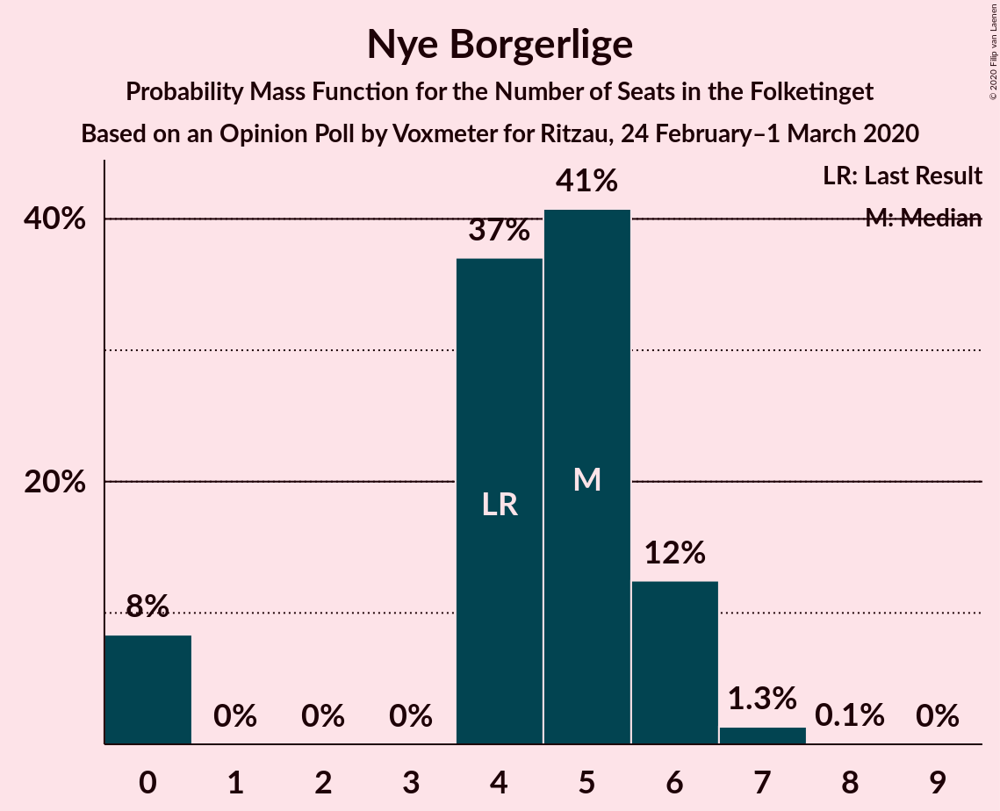

| Number of Seats | Probability | Accumulated | Special Marks |
|:---------------:|:-----------:|:-----------:|:-------------:|
| 0 | 8% | 100% |  |
| 1 | 0% | 92% |  |
| 2 | 0% | 92% |  |
| 3 | 0% | 92% |  |
| 4 | 37% | 92% | Last Result |
| 5 | 41% | 55% | Median |
| 6 | 12% | 14% |  |
| 7 | 1.3% | 1.4% |  |
| 8 | 0.1% | 0.1% |  |
| 9 | 0% | 0% |  |

### Liberal Alliance

*For a full overview of the results for this party, see the [Liberal Alliance](party-liberalalliance.html) page.*

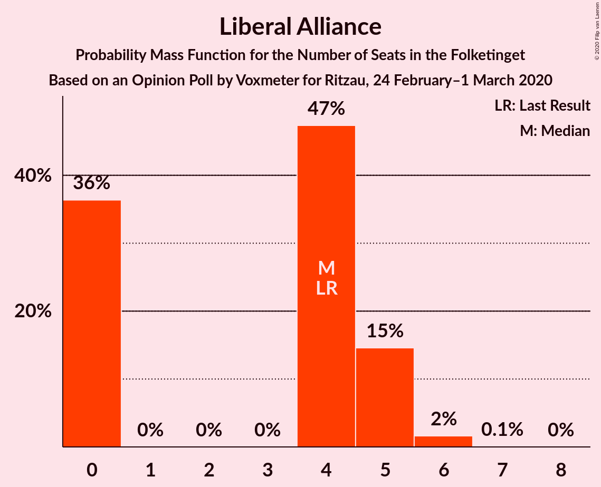

| Number of Seats | Probability | Accumulated | Special Marks |
|:---------------:|:-----------:|:-----------:|:-------------:|
| 0 | 36% | 100% |  |
| 1 | 0% | 64% |  |
| 2 | 0% | 64% |  |
| 3 | 0% | 64% |  |
| 4 | 47% | 64% | Last Result, Median |
| 5 | 15% | 16% |  |
| 6 | 2% | 2% |  |
| 7 | 0.1% | 0.1% |  |
| 8 | 0% | 0% |  |

### Alternativet

*For a full overview of the results for this party, see the [Alternativet](party-alternativet.html) page.*

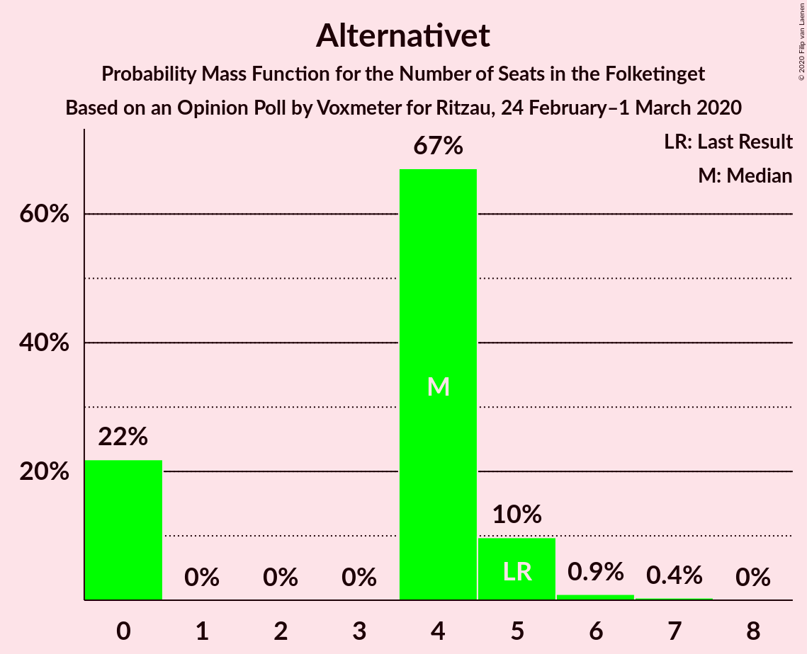

| Number of Seats | Probability | Accumulated | Special Marks |
|:---------------:|:-----------:|:-----------:|:-------------:|
| 0 | 22% | 100% |  |
| 1 | 0% | 78% |  |
| 2 | 0% | 78% |  |
| 3 | 0% | 78% |  |
| 4 | 67% | 78% | Median |
| 5 | 10% | 11% | Last Result |
| 6 | 0.9% | 1.3% |  |
| 7 | 0.4% | 0.4% |  |
| 8 | 0% | 0% |  |

### Stram Kurs

*For a full overview of the results for this party, see the [Stram Kurs](party-stramkurs.html) page.*

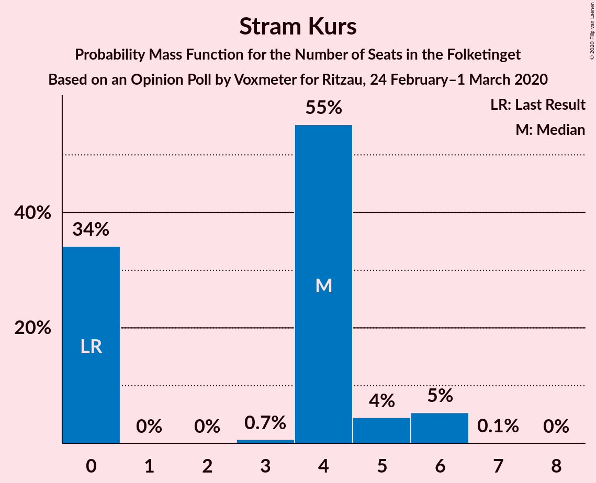

| Number of Seats | Probability | Accumulated | Special Marks |
|:---------------:|:-----------:|:-----------:|:-------------:|
| 0 | 34% | 100% | Last Result |
| 1 | 0% | 66% |  |
| 2 | 0% | 66% |  |
| 3 | 0.7% | 66% |  |
| 4 | 55% | 65% | Median |
| 5 | 4% | 10% |  |
| 6 | 5% | 5% |  |
| 7 | 0.1% | 0.1% |  |
| 8 | 0% | 0% |  |

### Klaus Riskær Pedersen

*For a full overview of the results for this party, see the [Klaus Riskær Pedersen](party-klausriskærpedersen.html) page.*

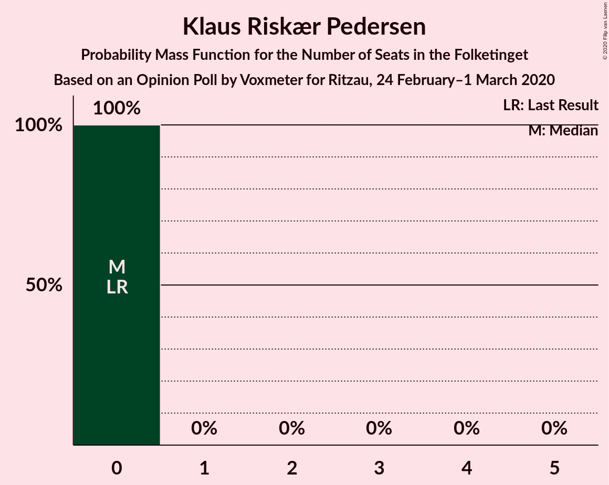

| Number of Seats | Probability | Accumulated | Special Marks |
|:---------------:|:-----------:|:-----------:|:-------------:|
| 0 | 100% | 100% | Last Result, Median |

## Coalitions

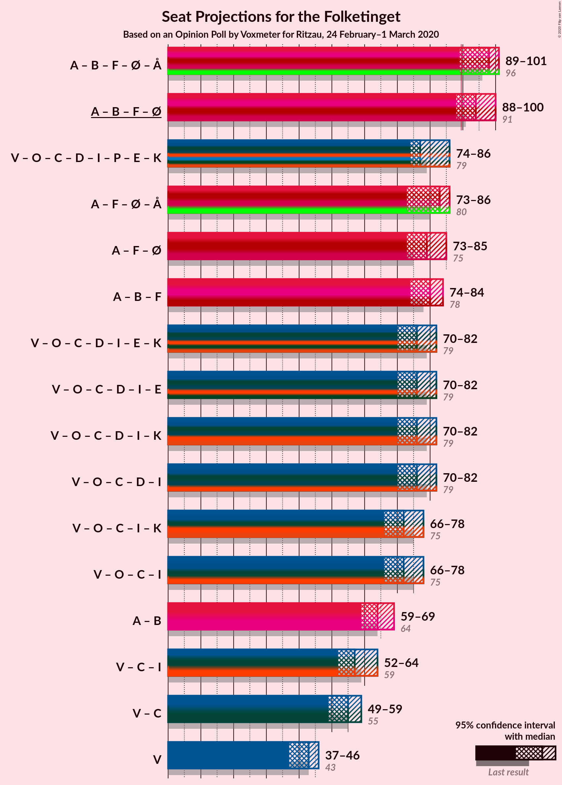

### Confidence Intervals

| Coalition | Last Result | Median | Majority? | 80% Confidence Interval | 90% Confidence Interval | 95% Confidence Interval | 99% Confidence Interval |
|:---------:|:-----------:|:------:|:---------:|:-----------------------:|:-----------------------:|:-----------------------:|:-----------------------:|
| Socialdemokraterne – Radikale Venstre – Socialistisk Folkeparti – Enhedslisten–De Rød-Grønne – Alternativet | 96 | 98 | 87% | 89–99 | 89–100 | 89–101 | 88–105 |
| Socialdemokraterne – Radikale Venstre – Socialistisk Folkeparti – Enhedslisten–De Rød-Grønne | 91 | 94 | 71% | 88–96 | 88–100 | 88–100 | 87–101 |
| Socialdemokraterne – Socialistisk Folkeparti – Enhedslisten–De Rød-Grønne – Alternativet | 80 | 83 | 0% | 73–85 | 73–85 | 73–86 | 72–89 |
| Socialdemokraterne – Socialistisk Folkeparti – Enhedslisten–De Rød-Grønne | 75 | 79 | 0% | 73–81 | 73–83 | 73–85 | 71–85 |
| Socialdemokraterne – Radikale Venstre – Socialistisk Folkeparti | 78 | 80 | 0% | 75–82 | 74–83 | 74–84 | 74–87 |
| Venstre – Dansk Folkeparti – Det Konservative Folkeparti – Nye Borgerlige – Liberal Alliance – Klaus Riskær Pedersen | 79 | 76 | 0% | 73–82 | 73–82 | 70–82 | 66–83 |
| Venstre – Dansk Folkeparti – Det Konservative Folkeparti – Nye Borgerlige – Liberal Alliance | 79 | 76 | 0% | 73–82 | 73–82 | 70–82 | 66–83 |
| Venstre – Dansk Folkeparti – Det Konservative Folkeparti – Liberal Alliance | 75 | 72 | 0% | 68–78 | 68–78 | 66–78 | 62–79 |
| Socialdemokraterne – Radikale Venstre | 64 | 64 | 0% | 61–65 | 59–68 | 59–69 | 59–70 |
| Venstre – Det Konservative Folkeparti – Liberal Alliance | 59 | 57 | 0% | 53–64 | 53–64 | 52–64 | 49–64 |
| Venstre – Det Konservative Folkeparti | 55 | 55 | 0% | 49–59 | 49–59 | 49–59 | 47–60 |
| Venstre | 43 | 43 | 0% | 38–45 | 37–45 | 37–46 | 36–47 |

### Socialdemokraterne – Radikale Venstre – Socialistisk Folkeparti – Enhedslisten–De Rød-Grønne – Alternativet

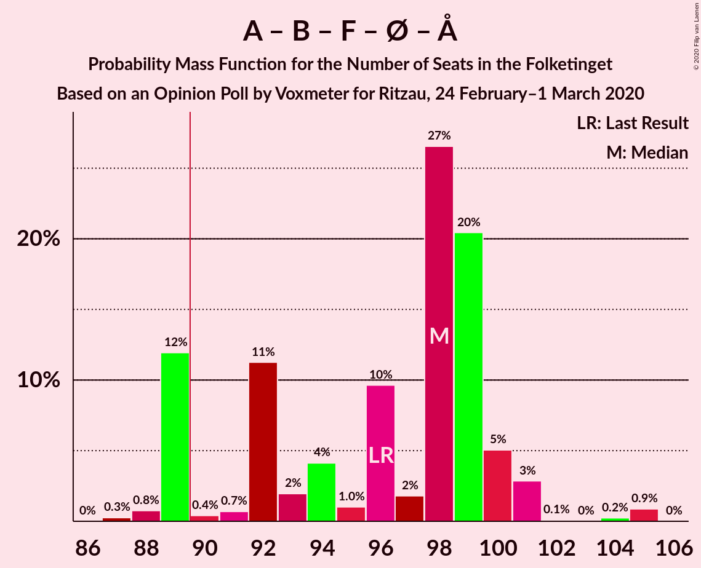

| Number of Seats | Probability | Accumulated | Special Marks |
|:---------------:|:-----------:|:-----------:|:-------------:|
| 87 | 0.3% | 100% |  |
| 88 | 0.8% | 99.7% |  |
| 89 | 12% | 99.0% |  |
| 90 | 0.4% | 87% | Majority |
| 91 | 0.7% | 87% |  |
| 92 | 11% | 86% |  |
| 93 | 2% | 75% |  |
| 94 | 4% | 73% |  |
| 95 | 1.0% | 69% |  |
| 96 | 10% | 68% | Last Result |
| 97 | 2% | 58% |  |
| 98 | 27% | 56% | Median |
| 99 | 20% | 30% |  |
| 100 | 5% | 9% |  |
| 101 | 3% | 4% |  |
| 102 | 0.1% | 1.2% |  |
| 103 | 0% | 1.1% |  |
| 104 | 0.2% | 1.1% |  |
| 105 | 0.9% | 0.9% |  |
| 106 | 0% | 0% |  |

### Socialdemokraterne – Radikale Venstre – Socialistisk Folkeparti – Enhedslisten–De Rød-Grønne

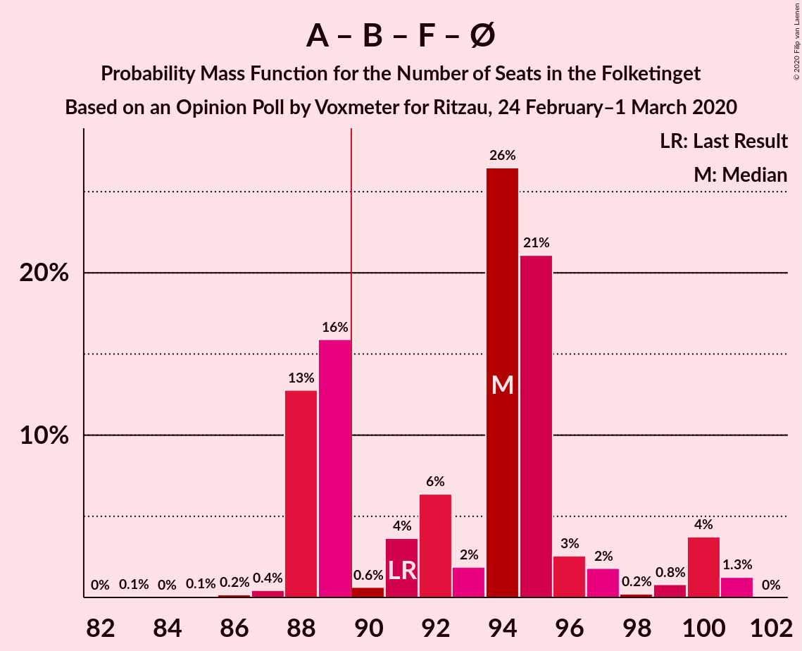

| Number of Seats | Probability | Accumulated | Special Marks |
|:---------------:|:-----------:|:-----------:|:-------------:|
| 83 | 0.1% | 100% |  |
| 84 | 0% | 99.9% |  |
| 85 | 0.1% | 99.9% |  |
| 86 | 0.2% | 99.8% |  |
| 87 | 0.4% | 99.7% |  |
| 88 | 13% | 99.2% |  |
| 89 | 16% | 86% |  |
| 90 | 0.6% | 71% | Majority |
| 91 | 4% | 70% | Last Result |
| 92 | 6% | 66% |  |
| 93 | 2% | 60% |  |
| 94 | 26% | 58% | Median |
| 95 | 21% | 32% |  |
| 96 | 3% | 10% |  |
| 97 | 2% | 8% |  |
| 98 | 0.2% | 6% |  |
| 99 | 0.8% | 6% |  |
| 100 | 4% | 5% |  |
| 101 | 1.3% | 1.3% |  |
| 102 | 0% | 0% |  |

### Socialdemokraterne – Socialistisk Folkeparti – Enhedslisten–De Rød-Grønne – Alternativet

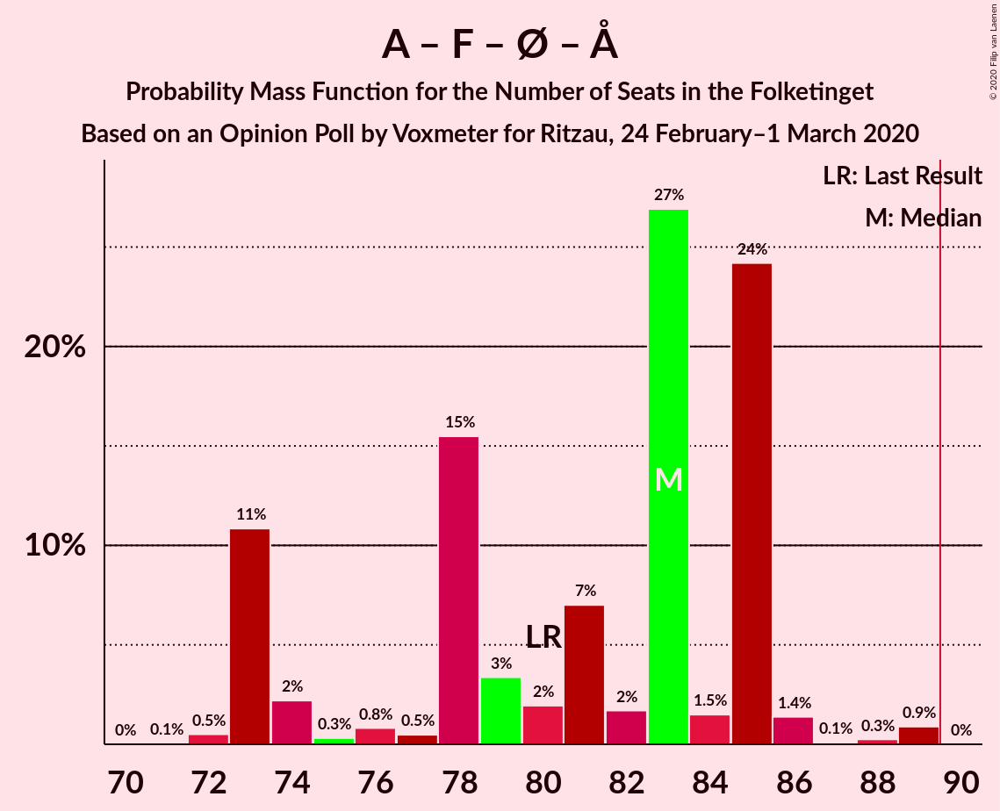

| Number of Seats | Probability | Accumulated | Special Marks |
|:---------------:|:-----------:|:-----------:|:-------------:|
| 71 | 0.1% | 100% |  |
| 72 | 0.5% | 99.9% |  |
| 73 | 11% | 99.4% |  |
| 74 | 2% | 89% |  |
| 75 | 0.3% | 86% |  |
| 76 | 0.8% | 86% |  |
| 77 | 0.5% | 85% |  |
| 78 | 15% | 85% |  |
| 79 | 3% | 69% |  |
| 80 | 2% | 66% | Last Result |
| 81 | 7% | 64% |  |
| 82 | 2% | 57% |  |
| 83 | 27% | 55% | Median |
| 84 | 1.5% | 28% |  |
| 85 | 24% | 27% |  |
| 86 | 1.4% | 3% |  |
| 87 | 0.1% | 1.2% |  |
| 88 | 0.3% | 1.2% |  |
| 89 | 0.9% | 0.9% |  |
| 90 | 0% | 0% | Majority |

### Socialdemokraterne – Socialistisk Folkeparti – Enhedslisten–De Rød-Grønne

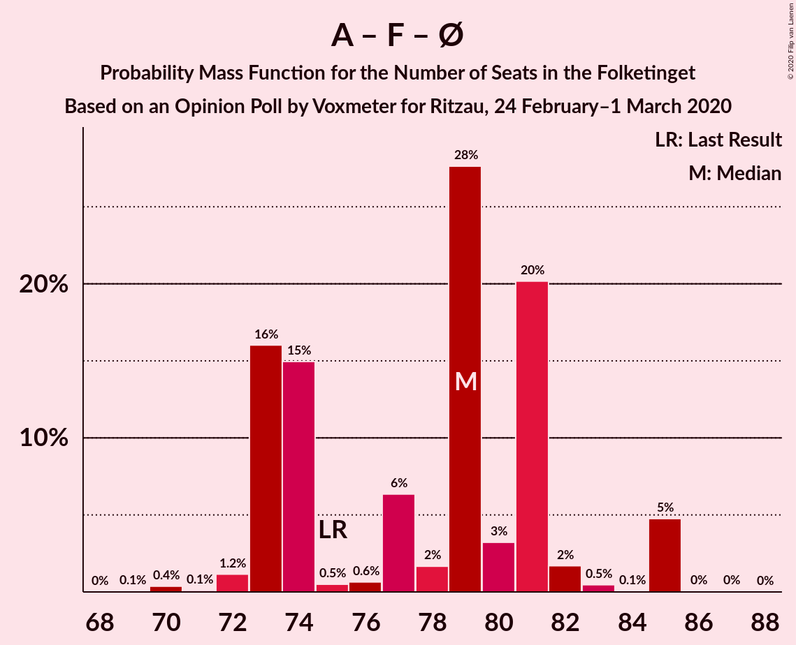

| Number of Seats | Probability | Accumulated | Special Marks |
|:---------------:|:-----------:|:-----------:|:-------------:|
| 68 | 0% | 100% |  |
| 69 | 0.1% | 99.9% |  |
| 70 | 0.4% | 99.9% |  |
| 71 | 0.1% | 99.5% |  |
| 72 | 1.2% | 99.4% |  |
| 73 | 16% | 98% |  |
| 74 | 15% | 82% |  |
| 75 | 0.5% | 67% | Last Result |
| 76 | 0.6% | 67% |  |
| 77 | 6% | 66% |  |
| 78 | 2% | 60% |  |
| 79 | 28% | 58% | Median |
| 80 | 3% | 30% |  |
| 81 | 20% | 27% |  |
| 82 | 2% | 7% |  |
| 83 | 0.5% | 5% |  |
| 84 | 0.1% | 5% |  |
| 85 | 5% | 5% |  |
| 86 | 0% | 0.1% |  |
| 87 | 0% | 0% |  |

### Socialdemokraterne – Radikale Venstre – Socialistisk Folkeparti

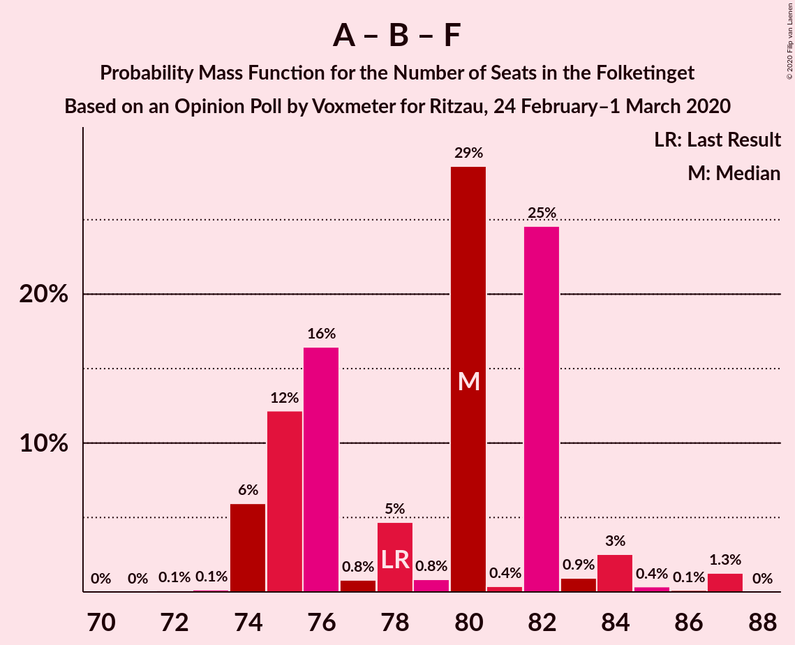

| Number of Seats | Probability | Accumulated | Special Marks |
|:---------------:|:-----------:|:-----------:|:-------------:|
| 71 | 0% | 100% |  |
| 72 | 0.1% | 99.9% |  |
| 73 | 0.1% | 99.8% |  |
| 74 | 6% | 99.7% |  |
| 75 | 12% | 94% |  |
| 76 | 16% | 82% |  |
| 77 | 0.8% | 65% |  |
| 78 | 5% | 64% | Last Result |
| 79 | 0.8% | 60% |  |
| 80 | 29% | 59% | Median |
| 81 | 0.4% | 30% |  |
| 82 | 25% | 30% |  |
| 83 | 0.9% | 5% |  |
| 84 | 3% | 4% |  |
| 85 | 0.4% | 2% |  |
| 86 | 0.1% | 1.4% |  |
| 87 | 1.3% | 1.3% |  |
| 88 | 0% | 0% |  |

### Venstre – Dansk Folkeparti – Det Konservative Folkeparti – Nye Borgerlige – Liberal Alliance – Klaus Riskær Pedersen

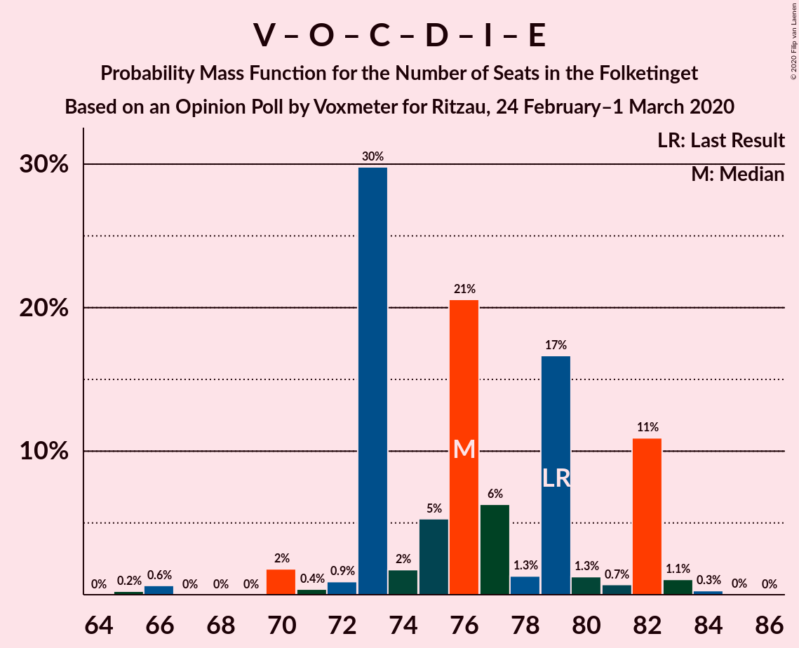

| Number of Seats | Probability | Accumulated | Special Marks |
|:---------------:|:-----------:|:-----------:|:-------------:|
| 65 | 0.2% | 100% |  |
| 66 | 0.6% | 99.8% |  |
| 67 | 0% | 99.1% |  |
| 68 | 0% | 99.1% |  |
| 69 | 0% | 99.1% |  |
| 70 | 2% | 99.1% |  |
| 71 | 0.4% | 97% |  |
| 72 | 0.9% | 97% |  |
| 73 | 30% | 96% |  |
| 74 | 2% | 66% |  |
| 75 | 5% | 64% |  |
| 76 | 21% | 59% |  |
| 77 | 6% | 39% |  |
| 78 | 1.3% | 32% |  |
| 79 | 17% | 31% | Last Result, Median |
| 80 | 1.3% | 14% |  |
| 81 | 0.7% | 13% |  |
| 82 | 11% | 12% |  |
| 83 | 1.1% | 1.4% |  |
| 84 | 0.3% | 0.3% |  |
| 85 | 0% | 0.1% |  |
| 86 | 0% | 0% |  |

### Venstre – Dansk Folkeparti – Det Konservative Folkeparti – Nye Borgerlige – Liberal Alliance

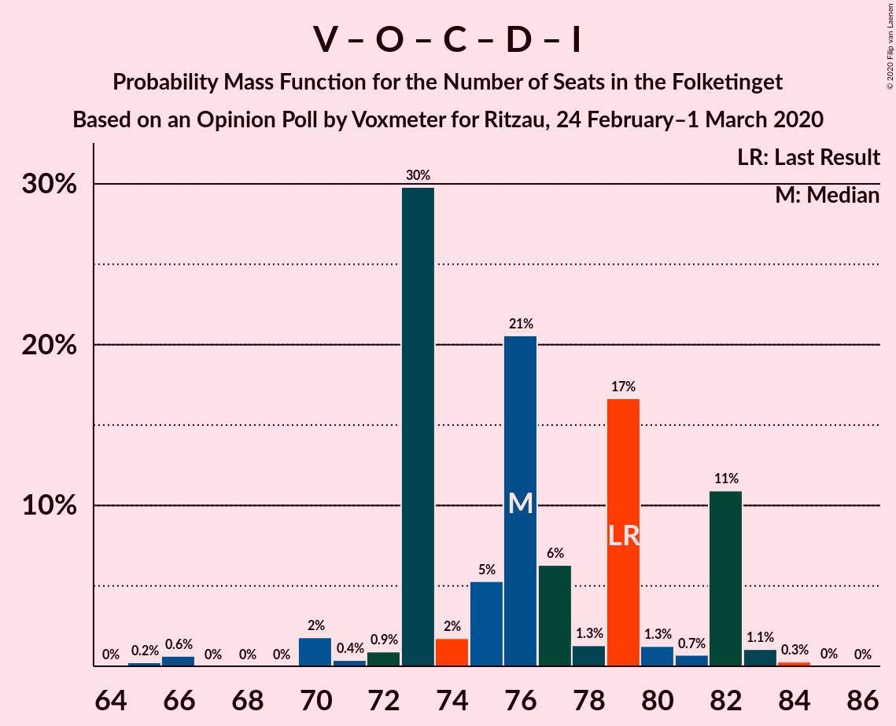

| Number of Seats | Probability | Accumulated | Special Marks |
|:---------------:|:-----------:|:-----------:|:-------------:|
| 65 | 0.2% | 100% |  |
| 66 | 0.6% | 99.8% |  |
| 67 | 0% | 99.1% |  |
| 68 | 0% | 99.1% |  |
| 69 | 0% | 99.1% |  |
| 70 | 2% | 99.1% |  |
| 71 | 0.4% | 97% |  |
| 72 | 0.9% | 97% |  |
| 73 | 30% | 96% |  |
| 74 | 2% | 66% |  |
| 75 | 5% | 64% |  |
| 76 | 21% | 59% |  |
| 77 | 6% | 39% |  |
| 78 | 1.3% | 32% |  |
| 79 | 17% | 31% | Last Result, Median |
| 80 | 1.3% | 14% |  |
| 81 | 0.7% | 13% |  |
| 82 | 11% | 12% |  |
| 83 | 1.1% | 1.4% |  |
| 84 | 0.3% | 0.3% |  |
| 85 | 0% | 0.1% |  |
| 86 | 0% | 0% |  |

### Venstre – Dansk Folkeparti – Det Konservative Folkeparti – Liberal Alliance

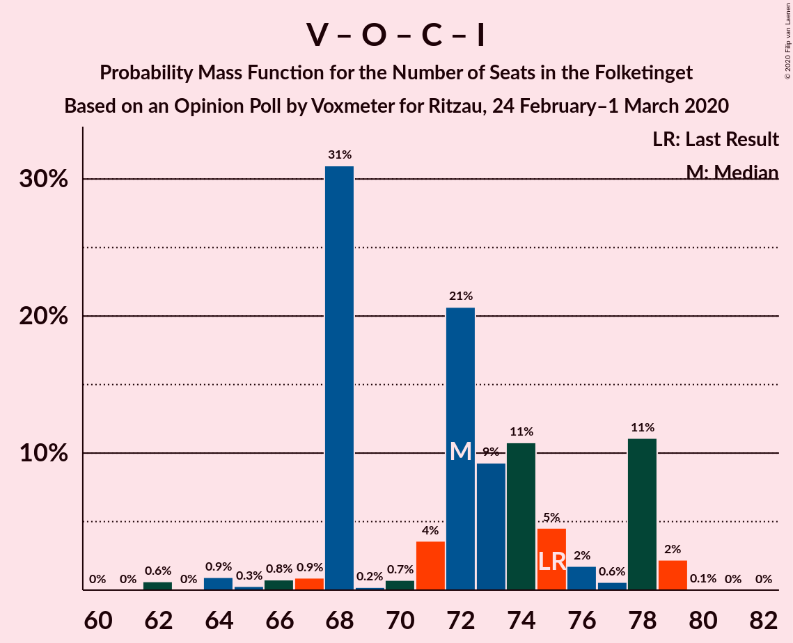

| Number of Seats | Probability | Accumulated | Special Marks |
|:---------------:|:-----------:|:-----------:|:-------------:|
| 62 | 0.6% | 100% |  |
| 63 | 0% | 99.4% |  |
| 64 | 0.9% | 99.3% |  |
| 65 | 0.3% | 98% |  |
| 66 | 0.8% | 98% |  |
| 67 | 0.9% | 97% |  |
| 68 | 31% | 96% |  |
| 69 | 0.2% | 66% |  |
| 70 | 0.7% | 65% |  |
| 71 | 4% | 65% |  |
| 72 | 21% | 61% |  |
| 73 | 9% | 40% |  |
| 74 | 11% | 31% | Median |
| 75 | 5% | 20% | Last Result |
| 76 | 2% | 16% |  |
| 77 | 0.6% | 14% |  |
| 78 | 11% | 13% |  |
| 79 | 2% | 2% |  |
| 80 | 0.1% | 0.1% |  |
| 81 | 0% | 0% |  |

### Socialdemokraterne – Radikale Venstre

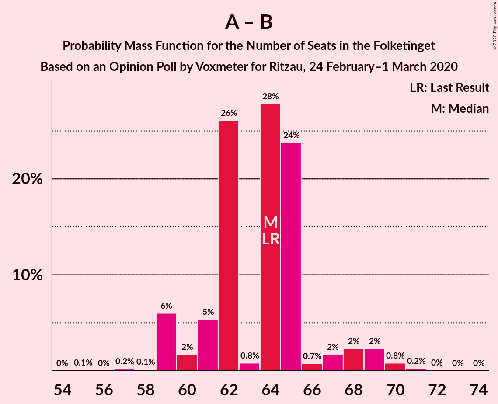

| Number of Seats | Probability | Accumulated | Special Marks |
|:---------------:|:-----------:|:-----------:|:-------------:|
| 55 | 0.1% | 100% |  |
| 56 | 0% | 99.9% |  |
| 57 | 0.2% | 99.9% |  |
| 58 | 0.1% | 99.7% |  |
| 59 | 6% | 99.6% |  |
| 60 | 2% | 94% |  |
| 61 | 5% | 92% |  |
| 62 | 26% | 87% |  |
| 63 | 0.8% | 61% |  |
| 64 | 28% | 60% | Last Result, Median |
| 65 | 24% | 32% |  |
| 66 | 0.7% | 8% |  |
| 67 | 2% | 7% |  |
| 68 | 2% | 6% |  |
| 69 | 2% | 3% |  |
| 70 | 0.8% | 1.1% |  |
| 71 | 0.2% | 0.3% |  |
| 72 | 0% | 0.1% |  |
| 73 | 0% | 0% |  |

### Venstre – Det Konservative Folkeparti – Liberal Alliance

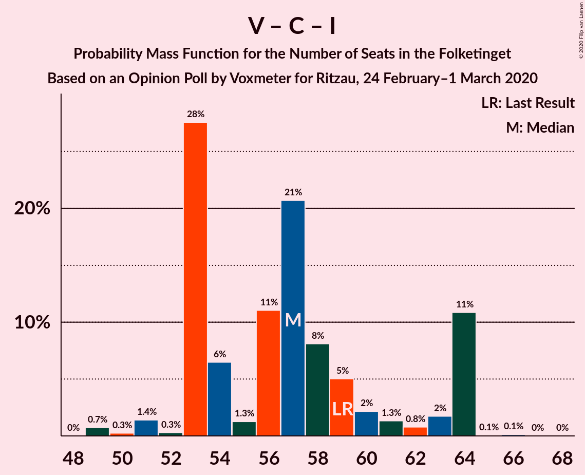

| Number of Seats | Probability | Accumulated | Special Marks |
|:---------------:|:-----------:|:-----------:|:-------------:|
| 49 | 0.7% | 100% |  |
| 50 | 0.3% | 99.2% |  |
| 51 | 1.4% | 99.0% |  |
| 52 | 0.3% | 98% |  |
| 53 | 28% | 97% |  |
| 54 | 6% | 70% |  |
| 55 | 1.3% | 63% |  |
| 56 | 11% | 62% |  |
| 57 | 21% | 51% |  |
| 58 | 8% | 30% |  |
| 59 | 5% | 22% | Last Result, Median |
| 60 | 2% | 17% |  |
| 61 | 1.3% | 15% |  |
| 62 | 0.8% | 14% |  |
| 63 | 2% | 13% |  |
| 64 | 11% | 11% |  |
| 65 | 0.1% | 0.2% |  |
| 66 | 0.1% | 0.2% |  |
| 67 | 0% | 0% |  |

### Venstre – Det Konservative Folkeparti

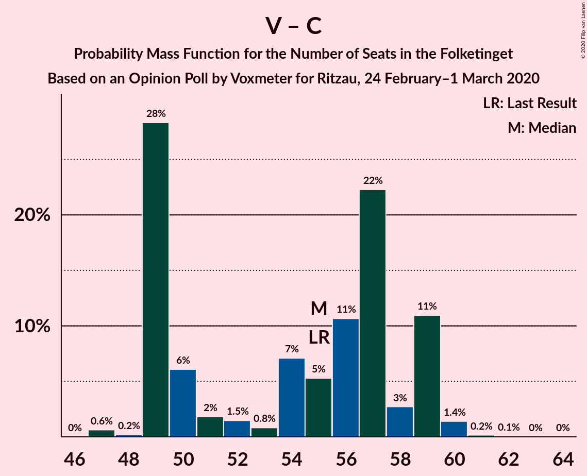

| Number of Seats | Probability | Accumulated | Special Marks |
|:---------------:|:-----------:|:-----------:|:-------------:|
| 47 | 0.6% | 100% |  |
| 48 | 0.2% | 99.4% |  |
| 49 | 28% | 99.1% |  |
| 50 | 6% | 71% |  |
| 51 | 2% | 65% |  |
| 52 | 1.5% | 63% |  |
| 53 | 0.8% | 61% |  |
| 54 | 7% | 61% |  |
| 55 | 5% | 54% | Last Result, Median |
| 56 | 11% | 48% |  |
| 57 | 22% | 38% |  |
| 58 | 3% | 15% |  |
| 59 | 11% | 13% |  |
| 60 | 1.4% | 2% |  |
| 61 | 0.2% | 0.2% |  |
| 62 | 0.1% | 0.1% |  |
| 63 | 0% | 0% |  |

### Venstre

| Number of Seats | Probability | Accumulated | Special Marks |
|:---------------:|:-----------:|:-----------:|:-------------:|
| 35 | 0% | 100% |  |
| 36 | 2% | 99.9% |  |
| 37 | 4% | 98% |  |
| 38 | 27% | 95% |  |
| 39 | 2% | 67% |  |
| 40 | 4% | 65% |  |
| 41 | 2% | 60% |  |
| 42 | 6% | 59% |  |
| 43 | 5% | 52% | Last Result, Median |
| 44 | 20% | 47% |  |
| 45 | 25% | 27% |  |
| 46 | 1.3% | 3% |  |
| 47 | 1.1% | 1.3% |  |
| 48 | 0.1% | 0.1% |  |
| 49 | 0% | 0.1% |  |
| 50 | 0% | 0% |  |

## Technical Information

### Opinion Poll

+ **Polling firm:** Voxmeter
+ **Commissioner(s):** Ritzau
+ **Fieldwork period:** 24 February–1 March 2020

### Calculations

+ **Sample size:** 1034
+ **Simulations done:** 1,048,576
+ **Error estimate:** 2.77%

