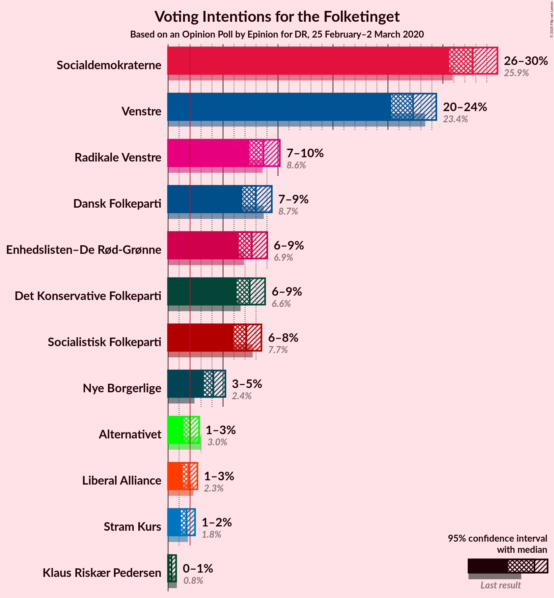

# Opinion Poll by Epinion for DR, 25 February–2 March 2020

<a href="#voting-intentions">Voting Intentions</a> | <a href="#seats">Seats</a> | <a href="#coalitions">Coalitions</a> | <a href="#technical-information">Technical Information</a>

## Voting Intentions

### Confidence Intervals

| Party | Last Result | Poll Result | 80% Confidence Interval | 90% Confidence Interval | 95% Confidence Interval | 99% Confidence Interval |
|:-----:|:-----------:|:-----------:|:-----------------------:|:-----------------------:|:-----------------------:|:-----------------------:|
| Socialdemokraterne | 25.9% | 27.7% | 26.3–29.2% |25.9–29.6% |25.6–30.0% |24.9–30.7% |
| Venstre | 23.4% | 22.3% | 21.0–23.7% |20.6–24.1% |20.3–24.4% |19.7–25.1% |
| Radikale Venstre | 8.6% | 8.7% | 7.8–9.6% |7.6–9.9% |7.4–10.2% |7.0–10.6% |
| Dansk Folkeparti | 8.7% | 8.0% | 7.2–8.9% |7.0–9.2% |6.8–9.4% |6.4–9.9% |
| Enhedslisten–De Rød-Grønne | 6.9% | 7.6% | 6.8–8.5% |6.6–8.8% |6.4–9.0% |6.1–9.5% |
| Det Konservative Folkeparti | 6.6% | 7.4% | 6.6–8.3% |6.4–8.6% |6.2–8.8% |5.9–9.3% |
| Socialistisk Folkeparti | 7.7% | 7.1% | 6.4–8.0% |6.1–8.3% |5.9–8.5% |5.6–8.9% |
| Nye Borgerlige | 2.4% | 4.1% | 3.5–4.8% |3.4–5.0% |3.2–5.2% |3.0–5.6% |
| Alternativet | 3.0% | 2.0% | 1.6–2.5% |1.5–2.7% |1.4–2.8% |1.2–3.1% |
| Liberal Alliance | 2.3% | 1.9% | 1.5–2.4% |1.4–2.5% |1.3–2.7% |1.2–2.9% |
| Stram Kurs | 1.8% | 1.7% | 1.3–2.2% |1.2–2.3% |1.2–2.5% |1.0–2.7% |
| Klaus Riskær Pedersen | 0.8% | 0.3% | 0.2–0.6% |0.2–0.7% |0.1–0.7% |0.1–0.9% |

*Note:* The poll result column reflects the actual value used in the calculations. Published results may vary slightly, and in addition be rounded to fewer digits.

## Seats

### Confidence Intervals

| Party | Last Result | Median | 80% Confidence Interval | 90% Confidence Interval | 95% Confidence Interval | 99% Confidence Interval |
|:-----:|:-----------:|:------:|:-----------------------:|:-----------------------:|:-----------------------:|:-----------------------:|
| <a href="#socialdemokraterne">Socialdemokraterne</a> | 48 | 52 | 48–55 |47–56 |46–56 |45–58 |
| <a href="#venstre">Venstre</a> | 43 | 40 | 39–43 |38–44 |37–44 |37–45 |
| <a href="#radikale-venstre">Radikale Venstre</a> | 16 | 16 | 14–18 |14–19 |14–19 |13–19 |
| <a href="#dansk-folkeparti">Dansk Folkeparti</a> | 16 | 13 | 13–16 |13–16 |13–17 |12–18 |
| <a href="#enhedslisten–de-rød-grønne">Enhedslisten–De Rød-Grønne</a> | 13 | 14 | 13–15 |13–16 |12–17 |11–17 |
| <a href="#det-konservative-folkeparti">Det Konservative Folkeparti</a> | 12 | 13 | 12–15 |12–16 |12–16 |11–17 |
| <a href="#socialistisk-folkeparti">Socialistisk Folkeparti</a> | 14 | 12 | 12–14 |11–14 |11–15 |11–17 |
| <a href="#nye-borgerlige">Nye Borgerlige</a> | 4 | 7 | 7–9 |7–9 |6–9 |6–10 |
| <a href="#alternativet">Alternativet</a> | 5 | 4 | 0–5 |0–5 |0–5 |0–6 |
| <a href="#liberal-alliance">Liberal Alliance</a> | 4 | 0 | 0–4 |0–5 |0–5 |0–5 |
| <a href="#stram-kurs">Stram Kurs</a> | 0 | 0 | 0–4 |0–4 |0–4 |0–5 |
| <a href="#klaus-riskær-pedersen">Klaus Riskær Pedersen</a> | 0 | 0 | 0 |0 |0 |0 |

### Socialdemokraterne

*For a full overview of the results for this party, see the [Socialdemokraterne](party-socialdemokraterne.html) page.*

| Number of Seats | Probability | Accumulated | Special Marks |
|:---------------:|:-----------:|:-----------:|:-------------:|
| 44 | 0.3% | 100% |  |
| 45 | 1.5% | 99.7% |  |
| 46 | 2% | 98% |  |
| 47 | 4% | 96% |  |
| 48 | 3% | 92% | Last Result |
| 49 | 17% | 90% |  |
| 50 | 3% | 72% |  |
| 51 | 15% | 69% |  |
| 52 | 9% | 53% | Median |
| 53 | 1.1% | 44% |  |
| 54 | 1.0% | 43% |  |
| 55 | 34% | 42% |  |
| 56 | 6% | 8% |  |
| 57 | 0% | 1.5% |  |
| 58 | 1.4% | 1.4% |  |
| 59 | 0% | 0% |  |

### Venstre

*For a full overview of the results for this party, see the [Venstre](party-venstre.html) page.*

| Number of Seats | Probability | Accumulated | Special Marks |
|:---------------:|:-----------:|:-----------:|:-------------:|
| 34 | 0.1% | 100% |  |
| 35 | 0.1% | 99.9% |  |
| 36 | 0.3% | 99.8% |  |
| 37 | 2% | 99.5% |  |
| 38 | 3% | 97% |  |
| 39 | 43% | 94% |  |
| 40 | 20% | 51% | Median |
| 41 | 8% | 31% |  |
| 42 | 4% | 23% |  |
| 43 | 11% | 19% | Last Result |
| 44 | 7% | 8% |  |
| 45 | 0.5% | 1.0% |  |
| 46 | 0.3% | 0.5% |  |
| 47 | 0% | 0.2% |  |
| 48 | 0.1% | 0.2% |  |
| 49 | 0% | 0% |  |

### Radikale Venstre

*For a full overview of the results for this party, see the [Radikale Venstre](party-radikalevenstre.html) page.*

| Number of Seats | Probability | Accumulated | Special Marks |
|:---------------:|:-----------:|:-----------:|:-------------:|
| 12 | 0.2% | 100% |  |
| 13 | 1.2% | 99.8% |  |
| 14 | 11% | 98.6% |  |
| 15 | 7% | 87% |  |
| 16 | 32% | 81% | Last Result, Median |
| 17 | 7% | 49% |  |
| 18 | 36% | 42% |  |
| 19 | 6% | 6% |  |
| 20 | 0.2% | 0.2% |  |
| 21 | 0% | 0% |  |

### Dansk Folkeparti

*For a full overview of the results for this party, see the [Dansk Folkeparti](party-danskfolkeparti.html) page.*

| Number of Seats | Probability | Accumulated | Special Marks |
|:---------------:|:-----------:|:-----------:|:-------------:|
| 11 | 0.3% | 100% |  |
| 12 | 1.2% | 99.6% |  |
| 13 | 61% | 98% | Median |
| 14 | 16% | 38% |  |
| 15 | 10% | 22% |  |
| 16 | 8% | 12% | Last Result |
| 17 | 3% | 4% |  |
| 18 | 0.9% | 1.0% |  |
| 19 | 0% | 0.1% |  |
| 20 | 0.1% | 0.1% |  |
| 21 | 0% | 0% |  |

### Enhedslisten–De Rød-Grønne

*For a full overview of the results for this party, see the [Enhedslisten–De Rød-Grønne](party-enhedslisten–derød-grønne.html) page.*

| Number of Seats | Probability | Accumulated | Special Marks |
|:---------------:|:-----------:|:-----------:|:-------------:|
| 10 | 0% | 100% |  |
| 11 | 1.4% | 99.9% |  |
| 12 | 2% | 98.5% |  |
| 13 | 13% | 96% | Last Result |
| 14 | 64% | 83% | Median |
| 15 | 14% | 19% |  |
| 16 | 2% | 5% |  |
| 17 | 3% | 3% |  |
| 18 | 0.1% | 0.5% |  |
| 19 | 0.4% | 0.4% |  |
| 20 | 0% | 0% |  |

### Det Konservative Folkeparti

*For a full overview of the results for this party, see the [Det Konservative Folkeparti](party-detkonservativefolkeparti.html) page.*

| Number of Seats | Probability | Accumulated | Special Marks |
|:---------------:|:-----------:|:-----------:|:-------------:|
| 10 | 0.2% | 100% |  |
| 11 | 1.1% | 99.8% |  |
| 12 | 25% | 98.7% | Last Result |
| 13 | 48% | 73% | Median |
| 14 | 4% | 26% |  |
| 15 | 16% | 21% |  |
| 16 | 5% | 5% |  |
| 17 | 0.5% | 0.6% |  |
| 18 | 0% | 0.1% |  |
| 19 | 0% | 0% |  |

### Socialistisk Folkeparti

*For a full overview of the results for this party, see the [Socialistisk Folkeparti](party-socialistiskfolkeparti.html) page.*

| Number of Seats | Probability | Accumulated | Special Marks |
|:---------------:|:-----------:|:-----------:|:-------------:|
| 10 | 0.4% | 100% |  |
| 11 | 7% | 99.5% |  |
| 12 | 43% | 92% | Median |
| 13 | 21% | 49% |  |
| 14 | 24% | 28% | Last Result |
| 15 | 2% | 4% |  |
| 16 | 0.9% | 2% |  |
| 17 | 0.8% | 0.8% |  |
| 18 | 0% | 0% |  |

### Nye Borgerlige

*For a full overview of the results for this party, see the [Nye Borgerlige](party-nyeborgerlige.html) page.*

| Number of Seats | Probability | Accumulated | Special Marks |
|:---------------:|:-----------:|:-----------:|:-------------:|
| 4 | 0% | 100% | Last Result |
| 5 | 0.3% | 100% |  |
| 6 | 5% | 99.7% |  |
| 7 | 53% | 95% | Median |
| 8 | 14% | 42% |  |
| 9 | 26% | 28% |  |
| 10 | 2% | 2% |  |
| 11 | 0.1% | 0.2% |  |
| 12 | 0% | 0% |  |

### Alternativet

*For a full overview of the results for this party, see the [Alternativet](party-alternativet.html) page.*

| Number of Seats | Probability | Accumulated | Special Marks |
|:---------------:|:-----------:|:-----------:|:-------------:|
| 0 | 20% | 100% |  |
| 1 | 0% | 80% |  |
| 2 | 0% | 80% |  |
| 3 | 0.1% | 80% |  |
| 4 | 64% | 80% | Median |
| 5 | 15% | 15% | Last Result |
| 6 | 0.6% | 0.7% |  |
| 7 | 0% | 0% |  |

### Liberal Alliance

*For a full overview of the results for this party, see the [Liberal Alliance](party-liberalalliance.html) page.*

| Number of Seats | Probability | Accumulated | Special Marks |
|:---------------:|:-----------:|:-----------:|:-------------:|
| 0 | 83% | 100% | Median |
| 1 | 0% | 17% |  |
| 2 | 0% | 17% |  |
| 3 | 0% | 17% |  |
| 4 | 12% | 17% | Last Result |
| 5 | 5% | 5% |  |
| 6 | 0.4% | 0.4% |  |
| 7 | 0% | 0% |  |

### Stram Kurs

*For a full overview of the results for this party, see the [Stram Kurs](party-stramkurs.html) page.*

| Number of Seats | Probability | Accumulated | Special Marks |
|:---------------:|:-----------:|:-----------:|:-------------:|
| 0 | 90% | 100% | Last Result, Median |
| 1 | 0% | 10% |  |
| 2 | 0% | 10% |  |
| 3 | 0% | 10% |  |
| 4 | 9% | 10% |  |
| 5 | 1.3% | 1.3% |  |
| 6 | 0.1% | 0.1% |  |
| 7 | 0% | 0% |  |

### Klaus Riskær Pedersen

*For a full overview of the results for this party, see the [Klaus Riskær Pedersen](party-klausriskærpedersen.html) page.*

| Number of Seats | Probability | Accumulated | Special Marks |
|:---------------:|:-----------:|:-----------:|:-------------:|
| 0 | 100% | 100% | Last Result, Median |

## Coalitions

### Confidence Intervals

| Coalition | Last Result | Median | Majority? | 80% Confidence Interval | 90% Confidence Interval | 95% Confidence Interval | 99% Confidence Interval |
|:---------:|:-----------:|:------:|:---------:|:-----------------------:|:-----------------------:|:-----------------------:|:-----------------------:|
| Socialdemokraterne – Radikale Venstre – Enhedslisten–De Rød-Grønne – Socialistisk Folkeparti – Alternativet | 96 | 98 | 99.5% | 94–103 | 93–103 | 91–103 | 90–103 |
| Socialdemokraterne – Radikale Venstre – Enhedslisten–De Rød-Grønne – Socialistisk Folkeparti | 91 | 95 | 95% | 92–99 | 90–99 | 88–99 | 86–99 |
| Socialdemokraterne – Enhedslisten–De Rød-Grønne – Socialistisk Folkeparti – Alternativet | 80 | 82 | 0% | 78–85 | 76–85 | 76–85 | 73–85 |
| Socialdemokraterne – Radikale Venstre – Socialistisk Folkeparti | 78 | 82 | 0% | 77–85 | 76–85 | 74–85 | 71–86 |
| Venstre – Dansk Folkeparti – Det Konservative Folkeparti – Nye Borgerlige – Liberal Alliance – Klaus Riskær Pedersen | 79 | 76 | 0% | 72–81 | 72–81 | 72–82 | 72–85 |
| Venstre – Dansk Folkeparti – Det Konservative Folkeparti – Nye Borgerlige – Liberal Alliance | 79 | 76 | 0% | 72–81 | 72–81 | 72–82 | 72–85 |
| Socialdemokraterne – Enhedslisten–De Rød-Grønne – Socialistisk Folkeparti | 75 | 80 | 0% | 76–81 | 74–81 | 72–82 | 71–85 |
| Venstre – Dansk Folkeparti – Det Konservative Folkeparti – Liberal Alliance | 75 | 68 | 0% | 65–73 | 65–74 | 65–74 | 65–76 |
| Socialdemokraterne – Radikale Venstre | 64 | 68 | 0% | 65–73 | 63–73 | 60–73 | 60–73 |
| Venstre – Det Konservative Folkeparti – Liberal Alliance | 59 | 54 | 0% | 52–58 | 52–59 | 52–60 | 50–62 |
| Venstre – Det Konservative Folkeparti | 55 | 52 | 0% | 52–56 | 51–57 | 50–58 | 49–59 |
| Venstre | 43 | 40 | 0% | 39–43 | 38–44 | 37–44 | 37–45 |

### Socialdemokraterne – Radikale Venstre – Enhedslisten–De Rød-Grønne – Socialistisk Folkeparti – Alternativet

| Number of Seats | Probability | Accumulated | Special Marks |
|:---------------:|:-----------:|:-----------:|:-------------:|
| 87 | 0% | 100% |  |
| 88 | 0.3% | 99.9% |  |
| 89 | 0.1% | 99.7% |  |
| 90 | 2% | 99.5% | Majority |
| 91 | 0.9% | 98% |  |
| 92 | 1.4% | 97% |  |
| 93 | 2% | 95% |  |
| 94 | 6% | 94% |  |
| 95 | 5% | 88% |  |
| 96 | 5% | 83% | Last Result |
| 97 | 7% | 77% |  |
| 98 | 27% | 71% | Median |
| 99 | 3% | 44% |  |
| 100 | 2% | 40% |  |
| 101 | 4% | 38% |  |
| 102 | 0% | 34% |  |
| 103 | 34% | 34% |  |
| 104 | 0% | 0.1% |  |
| 105 | 0% | 0% |  |

### Socialdemokraterne – Radikale Venstre – Enhedslisten–De Rød-Grønne – Socialistisk Folkeparti

| Number of Seats | Probability | Accumulated | Special Marks |
|:---------------:|:-----------:|:-----------:|:-------------:|
| 85 | 0.1% | 100% |  |
| 86 | 1.5% | 99.9% |  |
| 87 | 0.2% | 98% |  |
| 88 | 0.9% | 98% |  |
| 89 | 2% | 97% |  |
| 90 | 3% | 95% | Majority |
| 91 | 2% | 92% | Last Result |
| 92 | 3% | 90% |  |
| 93 | 13% | 87% |  |
| 94 | 19% | 74% | Median |
| 95 | 5% | 55% |  |
| 96 | 5% | 50% |  |
| 97 | 9% | 45% |  |
| 98 | 0.5% | 36% |  |
| 99 | 36% | 36% |  |
| 100 | 0.1% | 0.2% |  |
| 101 | 0% | 0.1% |  |
| 102 | 0% | 0.1% |  |
| 103 | 0.1% | 0.1% |  |
| 104 | 0% | 0% |  |

### Socialdemokraterne – Enhedslisten–De Rød-Grønne – Socialistisk Folkeparti – Alternativet

| Number of Seats | Probability | Accumulated | Special Marks |
|:---------------:|:-----------:|:-----------:|:-------------:|
| 71 | 0.3% | 100% |  |
| 72 | 0.1% | 99.7% |  |
| 73 | 0.3% | 99.7% |  |
| 74 | 0.5% | 99.4% |  |
| 75 | 0.8% | 98.9% |  |
| 76 | 5% | 98% |  |
| 77 | 1.1% | 93% |  |
| 78 | 4% | 92% |  |
| 79 | 3% | 88% |  |
| 80 | 8% | 85% | Last Result |
| 81 | 6% | 77% |  |
| 82 | 27% | 71% | Median |
| 83 | 2% | 44% |  |
| 84 | 4% | 41% |  |
| 85 | 37% | 37% |  |
| 86 | 0.3% | 0.4% |  |
| 87 | 0.1% | 0.1% |  |
| 88 | 0% | 0% |  |

### Socialdemokraterne – Radikale Venstre – Socialistisk Folkeparti

| Number of Seats | Probability | Accumulated | Special Marks |
|:---------------:|:-----------:|:-----------:|:-------------:|
| 71 | 1.2% | 100% |  |
| 72 | 0.1% | 98.8% |  |
| 73 | 0.4% | 98.7% |  |
| 74 | 1.4% | 98% |  |
| 75 | 2% | 97% |  |
| 76 | 1.3% | 95% |  |
| 77 | 5% | 94% |  |
| 78 | 3% | 89% | Last Result |
| 79 | 18% | 86% |  |
| 80 | 14% | 68% | Median |
| 81 | 2% | 54% |  |
| 82 | 11% | 52% |  |
| 83 | 1.4% | 41% |  |
| 84 | 4% | 40% |  |
| 85 | 34% | 36% |  |
| 86 | 1.4% | 2% |  |
| 87 | 0.1% | 0.1% |  |
| 88 | 0% | 0.1% |  |
| 89 | 0% | 0% |  |

### Venstre – Dansk Folkeparti – Det Konservative Folkeparti – Nye Borgerlige – Liberal Alliance – Klaus Riskær Pedersen

| Number of Seats | Probability | Accumulated | Special Marks |
|:---------------:|:-----------:|:-----------:|:-------------:|
| 70 | 0% | 100% |  |
| 71 | 0.4% | 99.9% |  |
| 72 | 34% | 99.5% |  |
| 73 | 5% | 65% | Median |
| 74 | 5% | 61% |  |
| 75 | 2% | 56% |  |
| 76 | 4% | 54% |  |
| 77 | 23% | 50% |  |
| 78 | 6% | 27% |  |
| 79 | 6% | 20% | Last Result |
| 80 | 5% | 15% |  |
| 81 | 7% | 10% |  |
| 82 | 1.2% | 3% |  |
| 83 | 0.5% | 2% |  |
| 84 | 0.4% | 1.2% |  |
| 85 | 0.4% | 0.8% |  |
| 86 | 0% | 0.3% |  |
| 87 | 0.3% | 0.3% |  |
| 88 | 0% | 0% |  |

### Venstre – Dansk Folkeparti – Det Konservative Folkeparti – Nye Borgerlige – Liberal Alliance

| Number of Seats | Probability | Accumulated | Special Marks |
|:---------------:|:-----------:|:-----------:|:-------------:|
| 70 | 0% | 100% |  |
| 71 | 0.4% | 99.9% |  |
| 72 | 34% | 99.5% |  |
| 73 | 5% | 65% | Median |
| 74 | 5% | 61% |  |
| 75 | 2% | 56% |  |
| 76 | 4% | 54% |  |
| 77 | 23% | 50% |  |
| 78 | 6% | 27% |  |
| 79 | 6% | 20% | Last Result |
| 80 | 5% | 15% |  |
| 81 | 7% | 10% |  |
| 82 | 1.2% | 3% |  |
| 83 | 0.5% | 2% |  |
| 84 | 0.4% | 1.2% |  |
| 85 | 0.4% | 0.8% |  |
| 86 | 0% | 0.3% |  |
| 87 | 0.3% | 0.3% |  |
| 88 | 0% | 0% |  |

### Socialdemokraterne – Enhedslisten–De Rød-Grønne – Socialistisk Folkeparti

| Number of Seats | Probability | Accumulated | Special Marks |
|:---------------:|:-----------:|:-----------:|:-------------:|
| 69 | 0.1% | 100% |  |
| 70 | 0.1% | 99.9% |  |
| 71 | 0.4% | 99.8% |  |
| 72 | 3% | 99.5% |  |
| 73 | 0.7% | 96% |  |
| 74 | 3% | 95% |  |
| 75 | 2% | 93% | Last Result |
| 76 | 3% | 90% |  |
| 77 | 13% | 87% |  |
| 78 | 20% | 74% | Median |
| 79 | 1.5% | 54% |  |
| 80 | 11% | 52% |  |
| 81 | 39% | 42% |  |
| 82 | 0.9% | 3% |  |
| 83 | 0.3% | 2% |  |
| 84 | 0.1% | 2% |  |
| 85 | 1.5% | 2% |  |
| 86 | 0.2% | 0.2% |  |
| 87 | 0% | 0% |  |

### Venstre – Dansk Folkeparti – Det Konservative Folkeparti – Liberal Alliance

| Number of Seats | Probability | Accumulated | Special Marks |
|:---------------:|:-----------:|:-----------:|:-------------:|
| 63 | 0.1% | 100% |  |
| 64 | 0.3% | 99.8% |  |
| 65 | 35% | 99.5% |  |
| 66 | 5% | 65% | Median |
| 67 | 5% | 59% |  |
| 68 | 25% | 55% |  |
| 69 | 2% | 30% |  |
| 70 | 5% | 28% |  |
| 71 | 7% | 23% |  |
| 72 | 2% | 16% |  |
| 73 | 9% | 14% |  |
| 74 | 3% | 5% |  |
| 75 | 0.7% | 2% | Last Result |
| 76 | 0.7% | 1.1% |  |
| 77 | 0.3% | 0.5% |  |
| 78 | 0.1% | 0.1% |  |
| 79 | 0% | 0.1% |  |
| 80 | 0% | 0% |  |

### Socialdemokraterne – Radikale Venstre

| Number of Seats | Probability | Accumulated | Special Marks |
|:---------------:|:-----------:|:-----------:|:-------------:|
| 59 | 0% | 100% |  |
| 60 | 3% | 99.9% |  |
| 61 | 0.5% | 97% |  |
| 62 | 0.6% | 97% |  |
| 63 | 3% | 96% |  |
| 64 | 2% | 93% | Last Result |
| 65 | 16% | 90% |  |
| 66 | 6% | 75% |  |
| 67 | 15% | 69% |  |
| 68 | 9% | 54% | Median |
| 69 | 0.6% | 44% |  |
| 70 | 5% | 44% |  |
| 71 | 0.4% | 39% |  |
| 72 | 2% | 39% |  |
| 73 | 37% | 37% |  |
| 74 | 0% | 0.1% |  |
| 75 | 0% | 0% |  |

### Venstre – Det Konservative Folkeparti – Liberal Alliance

| Number of Seats | Probability | Accumulated | Special Marks |
|:---------------:|:-----------:|:-----------:|:-------------:|
| 48 | 0% | 100% |  |
| 49 | 0.1% | 99.9% |  |
| 50 | 0.9% | 99.8% |  |
| 51 | 1.3% | 98.9% |  |
| 52 | 40% | 98% |  |
| 53 | 5% | 57% | Median |
| 54 | 3% | 53% |  |
| 55 | 25% | 49% |  |
| 56 | 8% | 25% |  |
| 57 | 6% | 17% |  |
| 58 | 3% | 11% |  |
| 59 | 4% | 8% | Last Result |
| 60 | 3% | 4% |  |
| 61 | 0.4% | 1.0% |  |
| 62 | 0.3% | 0.5% |  |
| 63 | 0.2% | 0.2% |  |
| 64 | 0% | 0% |  |

### Venstre – Det Konservative Folkeparti

| Number of Seats | Probability | Accumulated | Special Marks |
|:---------------:|:-----------:|:-----------:|:-------------:|
| 47 | 0.1% | 100% |  |
| 48 | 0.1% | 99.9% |  |
| 49 | 0.3% | 99.8% |  |
| 50 | 2% | 99.5% |  |
| 51 | 3% | 97% |  |
| 52 | 45% | 94% |  |
| 53 | 7% | 49% | Median |
| 54 | 3% | 42% |  |
| 55 | 25% | 39% | Last Result |
| 56 | 9% | 14% |  |
| 57 | 0.9% | 5% |  |
| 58 | 2% | 4% |  |
| 59 | 2% | 2% |  |
| 60 | 0.1% | 0.2% |  |
| 61 | 0.1% | 0.1% |  |
| 62 | 0% | 0% |  |

### Venstre

| Number of Seats | Probability | Accumulated | Special Marks |
|:---------------:|:-----------:|:-----------:|:-------------:|
| 34 | 0.1% | 100% |  |
| 35 | 0.1% | 99.9% |  |
| 36 | 0.3% | 99.8% |  |
| 37 | 2% | 99.5% |  |
| 38 | 3% | 97% |  |
| 39 | 43% | 94% |  |
| 40 | 20% | 51% | Median |
| 41 | 8% | 31% |  |
| 42 | 4% | 23% |  |
| 43 | 11% | 19% | Last Result |
| 44 | 7% | 8% |  |
| 45 | 0.5% | 1.0% |  |
| 46 | 0.3% | 0.5% |  |
| 47 | 0% | 0.2% |  |
| 48 | 0.1% | 0.2% |  |
| 49 | 0% | 0% |  |

## Technical Information

### Opinion Poll

+ **Polling firm:** Epinion
+ **Commissioner(s):** DR
+ **Fieldwork period:** 25 February–2 March 2020

### Calculations

+ **Sample size:** 1602
+ **Simulations done:** 1,048,576
+ **Error estimate:** 2.94%

