# Opinion Poll by Voxmeter for Ritzau, 2–7 March 2020

<a href="#voting-intentions">Voting Intentions</a> | <a href="#seats">Seats</a> | <a href="#coalitions">Coalitions</a> | <a href="#technical-information">Technical Information</a>

## Voting Intentions

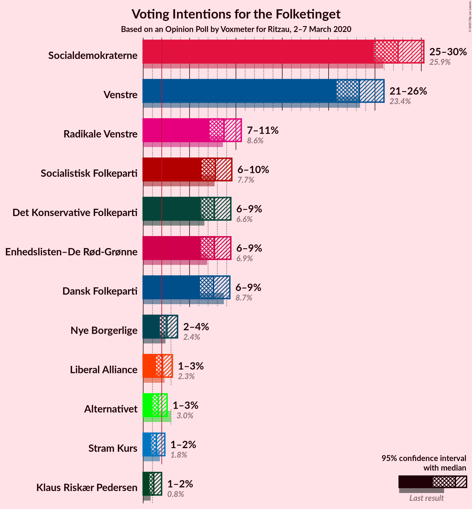

### Confidence Intervals

| Party | Last Result | Poll Result | 80% Confidence Interval | 90% Confidence Interval | 95% Confidence Interval | 99% Confidence Interval |
|:-----:|:-----------:|:-----------:|:-----------------------:|:-----------------------:|:-----------------------:|:-----------------------:|
| Socialdemokraterne | 25.9% | 27.5% | 25.8–29.3% |25.3–29.8% |24.9–30.3% |24.1–31.2% |
| Venstre | 23.4% | 23.3% | 21.7–25.1% |21.2–25.5% |20.9–26.0% |20.1–26.8% |
| Radikale Venstre | 8.6% | 8.7% | 7.7–9.9% |7.4–10.3% |7.2–10.6% |6.7–11.2% |
| Socialistisk Folkeparti | 7.7% | 7.8% | 6.8–8.9% |6.5–9.3% |6.3–9.6% |5.9–10.1% |
| Enhedslisten–De Rød-Grønne | 6.9% | 7.7% | 6.7–8.8% |6.4–9.2% |6.2–9.4% |5.8–10.0% |
| Det Konservative Folkeparti | 6.6% | 7.7% | 6.7–8.8% |6.4–9.2% |6.2–9.4% |5.8–10.0% |
| Dansk Folkeparti | 8.7% | 7.6% | 6.6–8.7% |6.4–9.1% |6.1–9.3% |5.7–9.9% |
| Nye Borgerlige | 2.4% | 2.6% | 2.0–3.3% |1.9–3.5% |1.8–3.7% |1.5–4.1% |
| Liberal Alliance | 2.3% | 2.1% | 1.6–2.8% |1.5–3.0% |1.4–3.1% |1.2–3.5% |
| Alternativet | 3.0% | 1.6% | 1.2–2.2% |1.1–2.4% |1.0–2.6% |0.8–2.9% |
| Stram Kurs | 1.8% | 1.4% | 1.1–2.0% |0.9–2.2% |0.9–2.3% |0.7–2.7% |
| Klaus Riskær Pedersen | 0.8% | 1.1% | 0.8–1.7% |0.7–1.8% |0.7–2.0% |0.5–2.3% |

*Note:* The poll result column reflects the actual value used in the calculations. Published results may vary slightly, and in addition be rounded to fewer digits.

## Seats

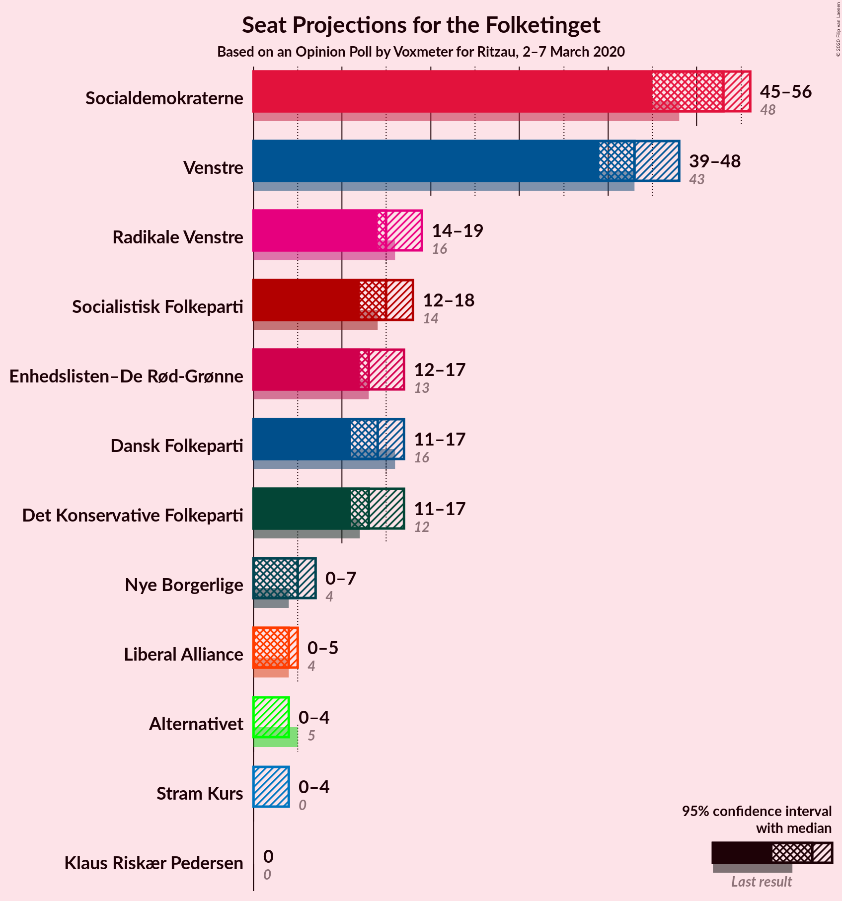

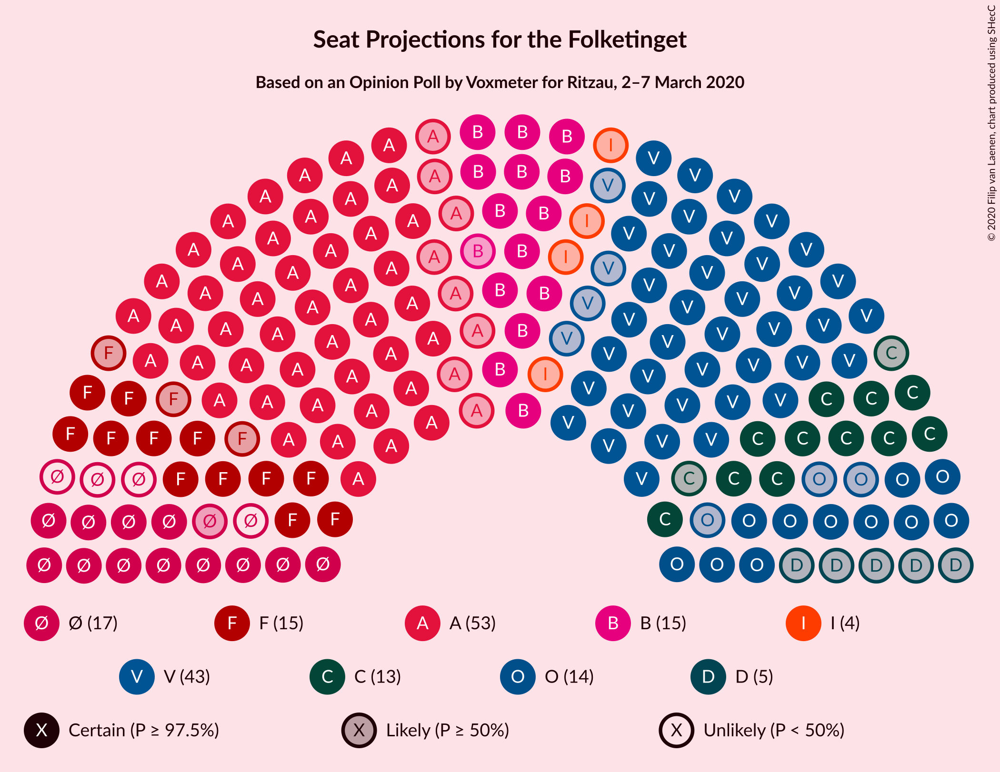

### Confidence Intervals

| Party | Last Result | Median | 80% Confidence Interval | 90% Confidence Interval | 95% Confidence Interval | 99% Confidence Interval |
|:-----:|:-----------:|:------:|:-----------------------:|:-----------------------:|:-----------------------:|:-----------------------:|
| <a href="#socialdemokraterne">Socialdemokraterne</a> | 48 | 53 | 49–55 |46–56 |45–56 |45–58 |
| <a href="#venstre">Venstre</a> | 43 | 43 | 40–45 |39–46 |39–48 |37–50 |
| <a href="#radikale-venstre">Radikale Venstre</a> | 16 | 15 | 15–18 |14–19 |14–19 |12–19 |
| <a href="#socialistisk-folkeparti">Socialistisk Folkeparti</a> | 14 | 15 | 13–16 |12–17 |12–18 |11–19 |
| <a href="#enhedslisten–de-rød-grønne">Enhedslisten–De Rød-Grønne</a> | 13 | 13 | 12–16 |12–17 |12–17 |11–18 |
| <a href="#det-konservative-folkeparti">Det Konservative Folkeparti</a> | 12 | 13 | 12–15 |12–16 |11–17 |10–17 |
| <a href="#dansk-folkeparti">Dansk Folkeparti</a> | 16 | 14 | 12–16 |11–16 |11–17 |11–18 |
| <a href="#nye-borgerlige">Nye Borgerlige</a> | 4 | 5 | 0–6 |0–6 |0–7 |0–7 |
| <a href="#liberal-alliance">Liberal Alliance</a> | 4 | 4 | 0–5 |0–5 |0–5 |0–6 |
| <a href="#alternativet">Alternativet</a> | 5 | 0 | 0 |0–4 |0–4 |0–5 |
| <a href="#stram-kurs">Stram Kurs</a> | 0 | 0 | 0 |0 |0–4 |0–5 |
| <a href="#klaus-riskær-pedersen">Klaus Riskær Pedersen</a> | 0 | 0 | 0 |0 |0 |0–4 |

### Socialdemokraterne

*For a full overview of the results for this party, see the [Socialdemokraterne](party-socialdemokraterne.html) page.*

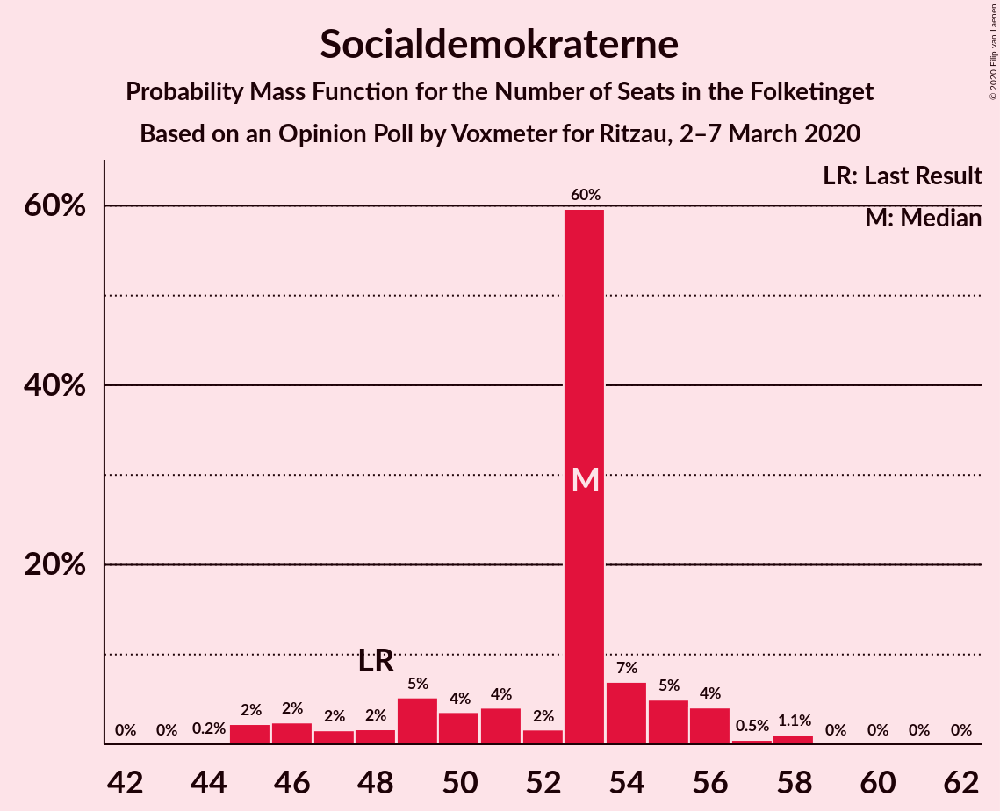

| Number of Seats | Probability | Accumulated | Special Marks |
|:---------------:|:-----------:|:-----------:|:-------------:|
| 42 | 0% | 100% |  |
| 43 | 0% | 99.9% |  |
| 44 | 0.2% | 99.9% |  |
| 45 | 2% | 99.6% |  |
| 46 | 2% | 97% |  |
| 47 | 2% | 95% |  |
| 48 | 2% | 93% | Last Result |
| 49 | 5% | 92% |  |
| 50 | 4% | 87% |  |
| 51 | 4% | 83% |  |
| 52 | 2% | 79% |  |
| 53 | 60% | 77% | Median |
| 54 | 7% | 18% |  |
| 55 | 5% | 11% |  |
| 56 | 4% | 6% |  |
| 57 | 0.5% | 2% |  |
| 58 | 1.1% | 1.1% |  |
| 59 | 0% | 0.1% |  |
| 60 | 0% | 0.1% |  |
| 61 | 0% | 0% |  |

### Venstre

*For a full overview of the results for this party, see the [Venstre](party-venstre.html) page.*

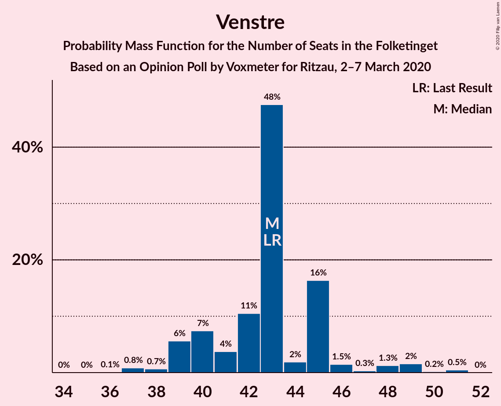

| Number of Seats | Probability | Accumulated | Special Marks |
|:---------------:|:-----------:|:-----------:|:-------------:|
| 35 | 0% | 100% |  |
| 36 | 0.1% | 99.9% |  |
| 37 | 0.8% | 99.9% |  |
| 38 | 0.7% | 99.0% |  |
| 39 | 6% | 98% |  |
| 40 | 7% | 93% |  |
| 41 | 4% | 85% |  |
| 42 | 11% | 82% |  |
| 43 | 48% | 71% | Last Result, Median |
| 44 | 2% | 24% |  |
| 45 | 16% | 22% |  |
| 46 | 1.5% | 5% |  |
| 47 | 0.3% | 4% |  |
| 48 | 1.3% | 3% |  |
| 49 | 2% | 2% |  |
| 50 | 0.2% | 0.7% |  |
| 51 | 0.5% | 0.5% |  |
| 52 | 0% | 0% |  |

### Radikale Venstre

*For a full overview of the results for this party, see the [Radikale Venstre](party-radikalevenstre.html) page.*

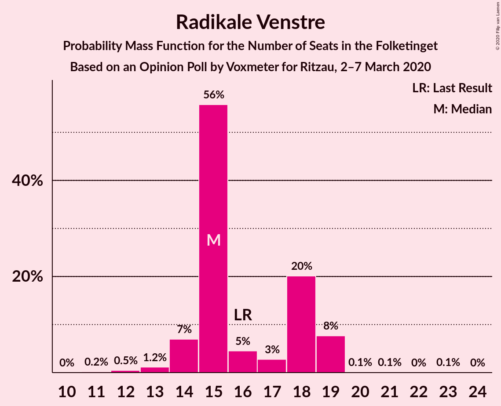

| Number of Seats | Probability | Accumulated | Special Marks |
|:---------------:|:-----------:|:-----------:|:-------------:|
| 11 | 0.2% | 100% |  |
| 12 | 0.5% | 99.8% |  |
| 13 | 1.2% | 99.3% |  |
| 14 | 7% | 98% |  |
| 15 | 56% | 91% | Median |
| 16 | 5% | 35% | Last Result |
| 17 | 3% | 31% |  |
| 18 | 20% | 28% |  |
| 19 | 8% | 8% |  |
| 20 | 0.1% | 0.4% |  |
| 21 | 0.1% | 0.2% |  |
| 22 | 0% | 0.1% |  |
| 23 | 0.1% | 0.1% |  |
| 24 | 0% | 0% |  |

### Socialistisk Folkeparti

*For a full overview of the results for this party, see the [Socialistisk Folkeparti](party-socialistiskfolkeparti.html) page.*

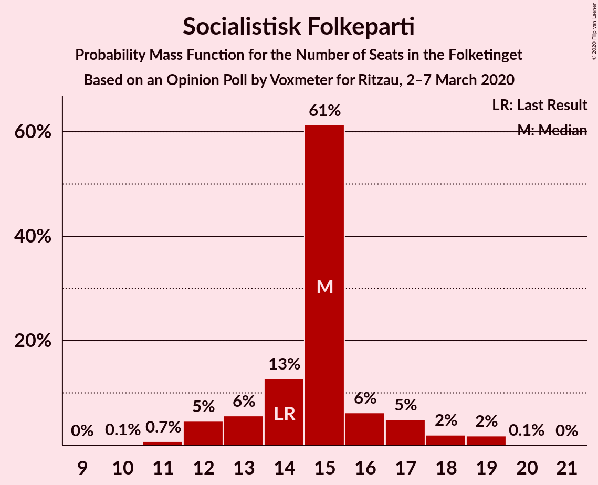

| Number of Seats | Probability | Accumulated | Special Marks |
|:---------------:|:-----------:|:-----------:|:-------------:|
| 10 | 0.1% | 100% |  |
| 11 | 0.7% | 99.9% |  |
| 12 | 5% | 99.1% |  |
| 13 | 6% | 95% |  |
| 14 | 13% | 89% | Last Result |
| 15 | 61% | 76% | Median |
| 16 | 6% | 15% |  |
| 17 | 5% | 9% |  |
| 18 | 2% | 4% |  |
| 19 | 2% | 2% |  |
| 20 | 0.1% | 0.1% |  |
| 21 | 0% | 0% |  |

### Enhedslisten–De Rød-Grønne

*For a full overview of the results for this party, see the [Enhedslisten–De Rød-Grønne](party-enhedslisten–derød-grønne.html) page.*

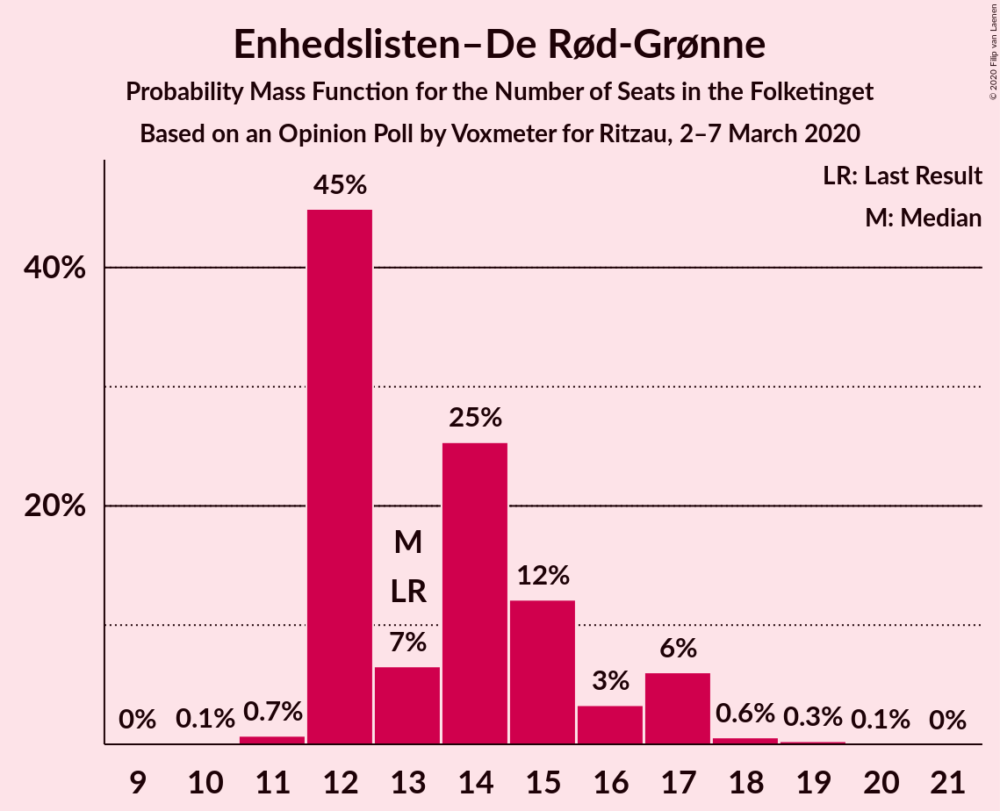

| Number of Seats | Probability | Accumulated | Special Marks |
|:---------------:|:-----------:|:-----------:|:-------------:|
| 10 | 0.1% | 100% |  |
| 11 | 0.7% | 99.9% |  |
| 12 | 45% | 99.2% |  |
| 13 | 7% | 54% | Last Result, Median |
| 14 | 25% | 48% |  |
| 15 | 12% | 22% |  |
| 16 | 3% | 10% |  |
| 17 | 6% | 7% |  |
| 18 | 0.6% | 0.9% |  |
| 19 | 0.3% | 0.3% |  |
| 20 | 0.1% | 0.1% |  |
| 21 | 0% | 0% |  |

### Det Konservative Folkeparti

*For a full overview of the results for this party, see the [Det Konservative Folkeparti](party-detkonservativefolkeparti.html) page.*

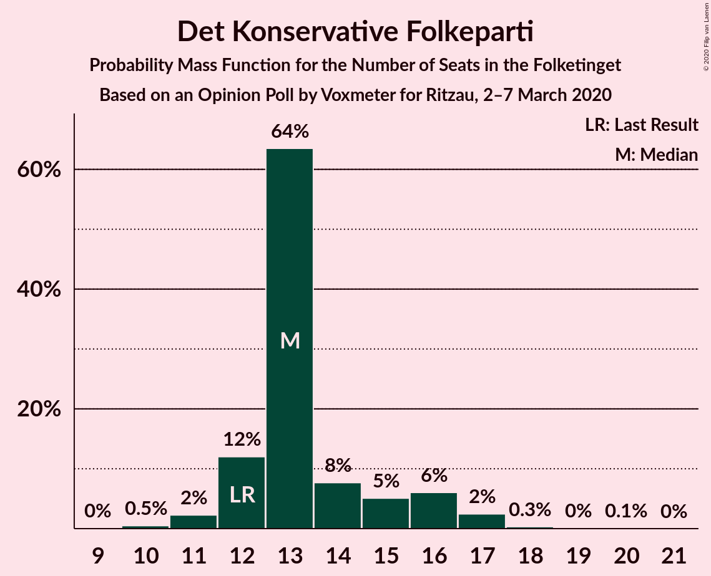

| Number of Seats | Probability | Accumulated | Special Marks |
|:---------------:|:-----------:|:-----------:|:-------------:|
| 10 | 0.5% | 100% |  |
| 11 | 2% | 99.5% |  |
| 12 | 12% | 97% | Last Result |
| 13 | 64% | 85% | Median |
| 14 | 8% | 22% |  |
| 15 | 5% | 14% |  |
| 16 | 6% | 9% |  |
| 17 | 2% | 3% |  |
| 18 | 0.3% | 0.5% |  |
| 19 | 0% | 0.1% |  |
| 20 | 0.1% | 0.1% |  |
| 21 | 0% | 0% |  |

### Dansk Folkeparti

*For a full overview of the results for this party, see the [Dansk Folkeparti](party-danskfolkeparti.html) page.*

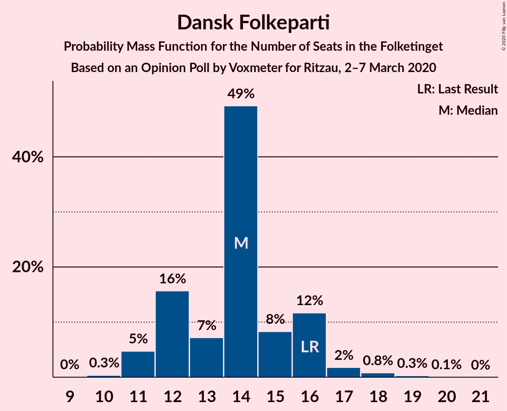

| Number of Seats | Probability | Accumulated | Special Marks |
|:---------------:|:-----------:|:-----------:|:-------------:|
| 10 | 0.3% | 100% |  |
| 11 | 5% | 99.7% |  |
| 12 | 16% | 95% |  |
| 13 | 7% | 79% |  |
| 14 | 49% | 72% | Median |
| 15 | 8% | 23% |  |
| 16 | 12% | 15% | Last Result |
| 17 | 2% | 3% |  |
| 18 | 0.8% | 1.1% |  |
| 19 | 0.3% | 0.4% |  |
| 20 | 0.1% | 0.1% |  |
| 21 | 0% | 0% |  |

### Nye Borgerlige

*For a full overview of the results for this party, see the [Nye Borgerlige](party-nyeborgerlige.html) page.*

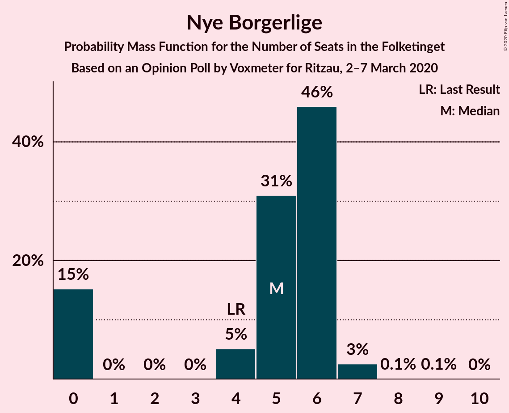

| Number of Seats | Probability | Accumulated | Special Marks |
|:---------------:|:-----------:|:-----------:|:-------------:|
| 0 | 15% | 100% |  |
| 1 | 0% | 85% |  |
| 2 | 0% | 85% |  |
| 3 | 0% | 85% |  |
| 4 | 5% | 85% | Last Result |
| 5 | 31% | 80% | Median |
| 6 | 46% | 49% |  |
| 7 | 3% | 3% |  |
| 8 | 0.1% | 0.1% |  |
| 9 | 0.1% | 0.1% |  |
| 10 | 0% | 0% |  |

### Liberal Alliance

*For a full overview of the results for this party, see the [Liberal Alliance](party-liberalalliance.html) page.*

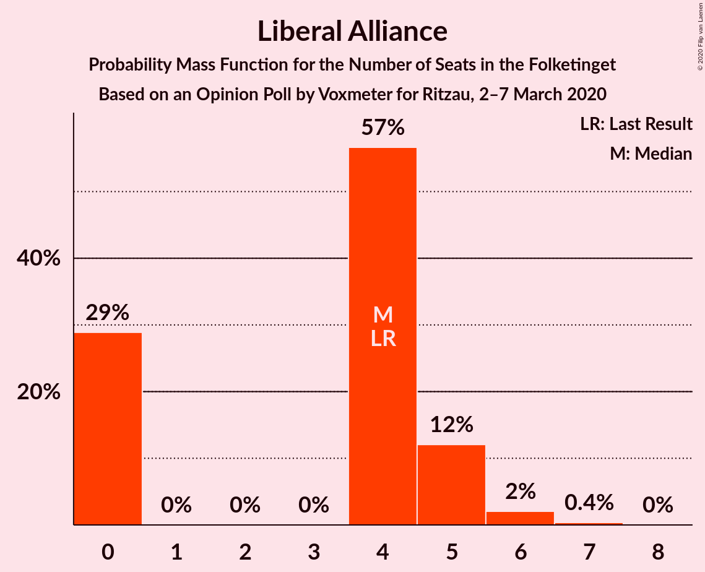

| Number of Seats | Probability | Accumulated | Special Marks |
|:---------------:|:-----------:|:-----------:|:-------------:|
| 0 | 29% | 100% |  |
| 1 | 0% | 71% |  |
| 2 | 0% | 71% |  |
| 3 | 0% | 71% |  |
| 4 | 57% | 71% | Last Result, Median |
| 5 | 12% | 14% |  |
| 6 | 2% | 2% |  |
| 7 | 0.4% | 0.4% |  |
| 8 | 0% | 0% |  |

### Alternativet

*For a full overview of the results for this party, see the [Alternativet](party-alternativet.html) page.*

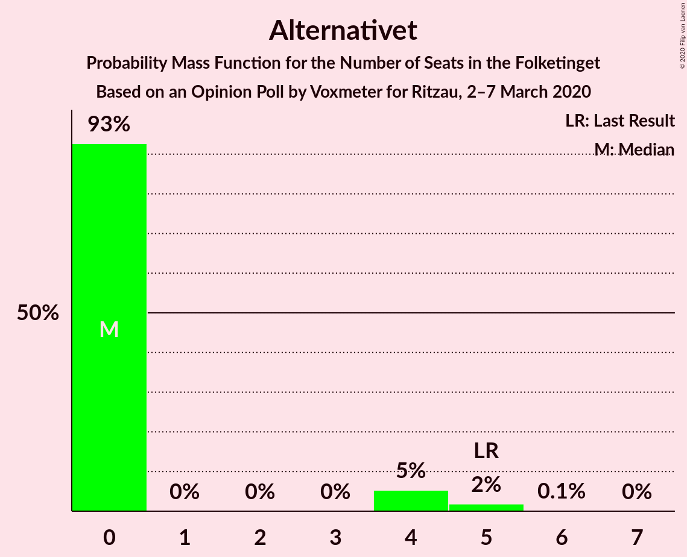

| Number of Seats | Probability | Accumulated | Special Marks |
|:---------------:|:-----------:|:-----------:|:-------------:|
| 0 | 93% | 100% | Median |
| 1 | 0% | 7% |  |
| 2 | 0% | 7% |  |
| 3 | 0% | 7% |  |
| 4 | 5% | 7% |  |
| 5 | 2% | 2% | Last Result |
| 6 | 0.1% | 0.1% |  |
| 7 | 0% | 0% |  |

### Stram Kurs

*For a full overview of the results for this party, see the [Stram Kurs](party-stramkurs.html) page.*

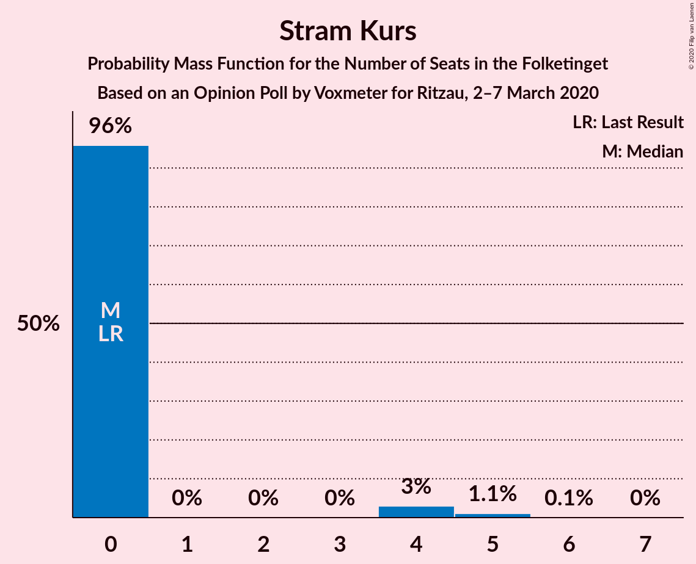

| Number of Seats | Probability | Accumulated | Special Marks |
|:---------------:|:-----------:|:-----------:|:-------------:|
| 0 | 96% | 100% | Last Result, Median |
| 1 | 0% | 4% |  |
| 2 | 0% | 4% |  |
| 3 | 0% | 4% |  |
| 4 | 3% | 4% |  |
| 5 | 1.1% | 1.1% |  |
| 6 | 0.1% | 0.1% |  |
| 7 | 0% | 0% |  |

### Klaus Riskær Pedersen

*For a full overview of the results for this party, see the [Klaus Riskær Pedersen](party-klausriskærpedersen.html) page.*

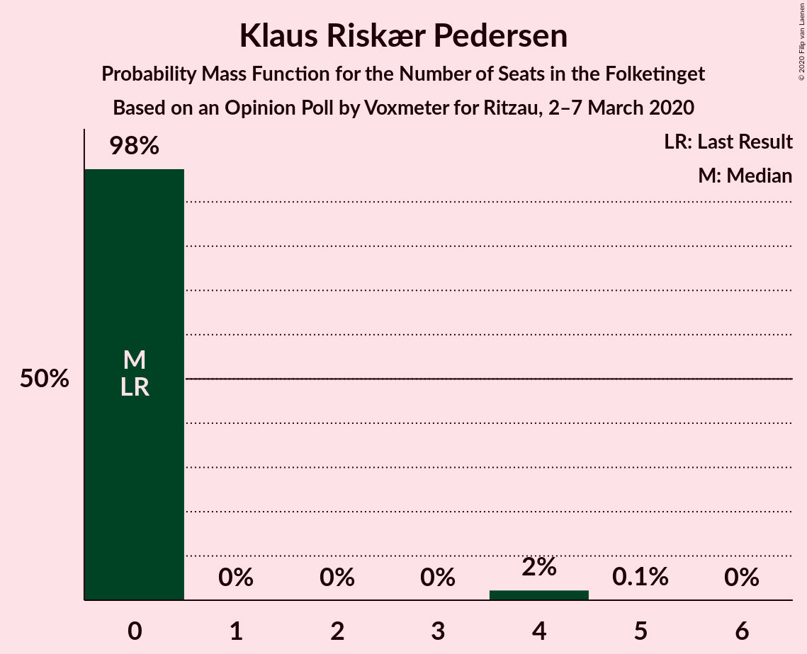

| Number of Seats | Probability | Accumulated | Special Marks |
|:---------------:|:-----------:|:-----------:|:-------------:|
| 0 | 98% | 100% | Last Result, Median |
| 1 | 0% | 2% |  |
| 2 | 0% | 2% |  |
| 3 | 0% | 2% |  |
| 4 | 2% | 2% |  |
| 5 | 0.1% | 0.1% |  |
| 6 | 0% | 0% |  |

## Coalitions

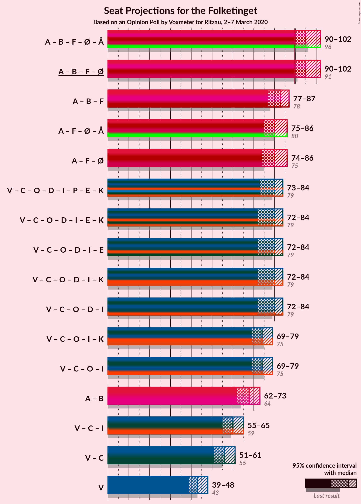

### Confidence Intervals

| Coalition | Last Result | Median | Majority? | 80% Confidence Interval | 90% Confidence Interval | 95% Confidence Interval | 99% Confidence Interval |
|:---------:|:-----------:|:------:|:---------:|:-----------------------:|:-----------------------:|:-----------------------:|:-----------------------:|
| Socialdemokraterne – Radikale Venstre – Socialistisk Folkeparti – Enhedslisten–De Rød-Grønne – Alternativet | 96 | 95 | 99.3% | 95–101 | 93–102 | 90–102 | 89–105 |
| Socialdemokraterne – Radikale Venstre – Socialistisk Folkeparti – Enhedslisten–De Rød-Grønne | 91 | 95 | 98.9% | 94–101 | 92–102 | 90–102 | 88–105 |
| Socialdemokraterne – Radikale Venstre – Socialistisk Folkeparti | 78 | 83 | 0.1% | 79–87 | 77–87 | 77–87 | 74–88 |
| Socialdemokraterne – Socialistisk Folkeparti – Enhedslisten–De Rød-Grønne – Alternativet | 80 | 80 | 0.8% | 79–85 | 76–86 | 75–86 | 72–90 |
| Socialdemokraterne – Socialistisk Folkeparti – Enhedslisten–De Rød-Grønne | 75 | 80 | 0.6% | 78–85 | 76–86 | 74–86 | 72–90 |
| Venstre – Det Konservative Folkeparti – Dansk Folkeparti – Nye Borgerlige – Liberal Alliance – Klaus Riskær Pedersen | 79 | 80 | 0% | 74–80 | 73–82 | 72–84 | 70–85 |
| Venstre – Det Konservative Folkeparti – Dansk Folkeparti – Nye Borgerlige – Liberal Alliance | 79 | 80 | 0% | 74–80 | 73–81 | 72–84 | 70–85 |
| Venstre – Det Konservative Folkeparti – Dansk Folkeparti – Liberal Alliance | 75 | 74 | 0% | 70–75 | 69–77 | 69–79 | 67–83 |
| Socialdemokraterne – Radikale Venstre | 64 | 68 | 0% | 65–71 | 63–73 | 62–73 | 59–73 |
| Venstre – Det Konservative Folkeparti – Liberal Alliance | 59 | 60 | 0% | 57–61 | 56–64 | 55–65 | 52–68 |
| Venstre – Det Konservative Folkeparti | 55 | 56 | 0% | 53–59 | 53–60 | 51–61 | 51–65 |
| Venstre | 43 | 43 | 0% | 40–45 | 39–46 | 39–48 | 37–50 |

### Socialdemokraterne – Radikale Venstre – Socialistisk Folkeparti – Enhedslisten–De Rød-Grønne – Alternativet

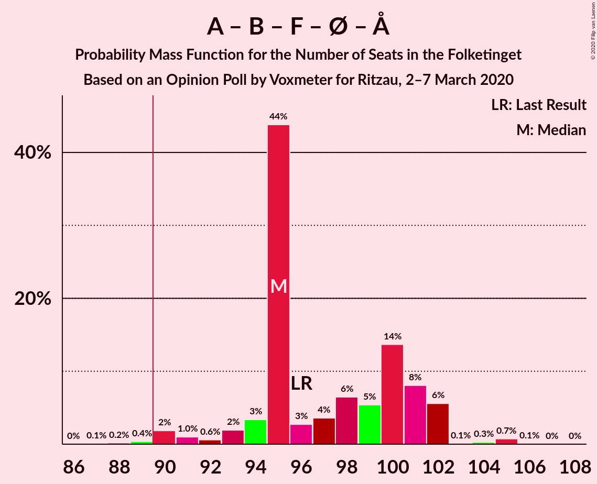

| Number of Seats | Probability | Accumulated | Special Marks |
|:---------------:|:-----------:|:-----------:|:-------------:|
| 87 | 0.1% | 100% |  |
| 88 | 0.2% | 99.9% |  |
| 89 | 0.4% | 99.7% |  |
| 90 | 2% | 99.3% | Majority |
| 91 | 1.0% | 97% |  |
| 92 | 0.6% | 96% |  |
| 93 | 2% | 96% |  |
| 94 | 3% | 94% |  |
| 95 | 44% | 91% |  |
| 96 | 3% | 47% | Last Result, Median |
| 97 | 4% | 44% |  |
| 98 | 6% | 40% |  |
| 99 | 5% | 34% |  |
| 100 | 14% | 29% |  |
| 101 | 8% | 15% |  |
| 102 | 6% | 7% |  |
| 103 | 0.1% | 1.3% |  |
| 104 | 0.3% | 1.2% |  |
| 105 | 0.7% | 0.9% |  |
| 106 | 0.1% | 0.1% |  |
| 107 | 0% | 0.1% |  |
| 108 | 0% | 0% |  |

### Socialdemokraterne – Radikale Venstre – Socialistisk Folkeparti – Enhedslisten–De Rød-Grønne

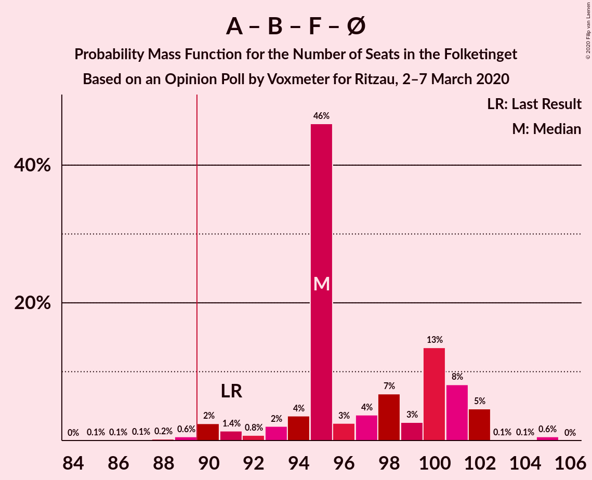

| Number of Seats | Probability | Accumulated | Special Marks |
|:---------------:|:-----------:|:-----------:|:-------------:|
| 85 | 0.1% | 100% |  |
| 86 | 0.1% | 99.9% |  |
| 87 | 0.1% | 99.8% |  |
| 88 | 0.2% | 99.7% |  |
| 89 | 0.6% | 99.5% |  |
| 90 | 2% | 98.9% | Majority |
| 91 | 1.4% | 96% | Last Result |
| 92 | 0.8% | 95% |  |
| 93 | 2% | 94% |  |
| 94 | 4% | 92% |  |
| 95 | 46% | 89% |  |
| 96 | 3% | 43% | Median |
| 97 | 4% | 40% |  |
| 98 | 7% | 36% |  |
| 99 | 3% | 30% |  |
| 100 | 13% | 27% |  |
| 101 | 8% | 13% |  |
| 102 | 5% | 5% |  |
| 103 | 0.1% | 0.8% |  |
| 104 | 0.1% | 0.7% |  |
| 105 | 0.6% | 0.6% |  |
| 106 | 0% | 0% |  |

### Socialdemokraterne – Radikale Venstre – Socialistisk Folkeparti

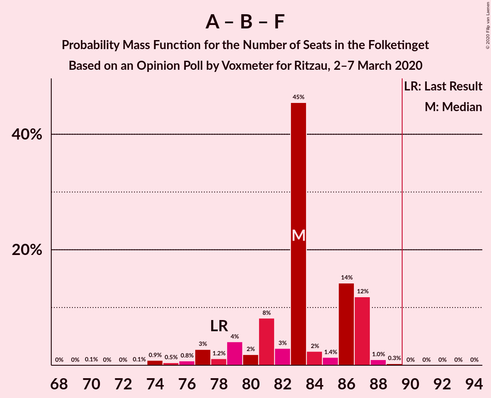

| Number of Seats | Probability | Accumulated | Special Marks |
|:---------------:|:-----------:|:-----------:|:-------------:|
| 70 | 0.1% | 100% |  |
| 71 | 0% | 99.9% |  |
| 72 | 0% | 99.9% |  |
| 73 | 0.1% | 99.8% |  |
| 74 | 0.9% | 99.7% |  |
| 75 | 0.5% | 98.9% |  |
| 76 | 0.8% | 98% |  |
| 77 | 3% | 98% |  |
| 78 | 1.2% | 95% | Last Result |
| 79 | 4% | 94% |  |
| 80 | 2% | 90% |  |
| 81 | 8% | 88% |  |
| 82 | 3% | 80% |  |
| 83 | 45% | 77% | Median |
| 84 | 2% | 31% |  |
| 85 | 1.4% | 29% |  |
| 86 | 14% | 27% |  |
| 87 | 12% | 13% |  |
| 88 | 1.0% | 1.3% |  |
| 89 | 0.3% | 0.4% |  |
| 90 | 0% | 0.1% | Majority |
| 91 | 0% | 0.1% |  |
| 92 | 0% | 0.1% |  |
| 93 | 0% | 0% |  |

### Socialdemokraterne – Socialistisk Folkeparti – Enhedslisten–De Rød-Grønne – Alternativet

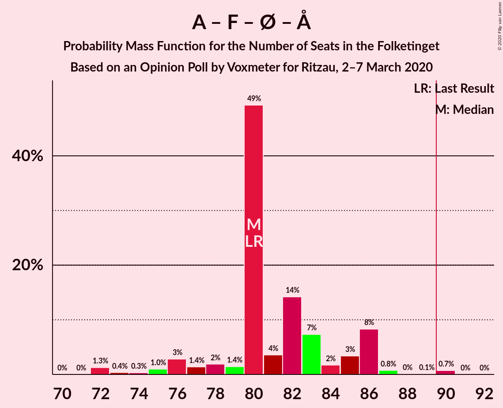

| Number of Seats | Probability | Accumulated | Special Marks |
|:---------------:|:-----------:|:-----------:|:-------------:|
| 71 | 0% | 100% |  |
| 72 | 1.3% | 99.9% |  |
| 73 | 0.4% | 98.7% |  |
| 74 | 0.3% | 98% |  |
| 75 | 1.0% | 98% |  |
| 76 | 3% | 97% |  |
| 77 | 1.4% | 94% |  |
| 78 | 2% | 93% |  |
| 79 | 1.4% | 91% |  |
| 80 | 49% | 89% | Last Result |
| 81 | 4% | 40% | Median |
| 82 | 14% | 37% |  |
| 83 | 7% | 22% |  |
| 84 | 2% | 15% |  |
| 85 | 3% | 13% |  |
| 86 | 8% | 10% |  |
| 87 | 0.8% | 2% |  |
| 88 | 0% | 0.9% |  |
| 89 | 0.1% | 0.8% |  |
| 90 | 0.7% | 0.8% | Majority |
| 91 | 0% | 0% |  |

### Socialdemokraterne – Socialistisk Folkeparti – Enhedslisten–De Rød-Grønne

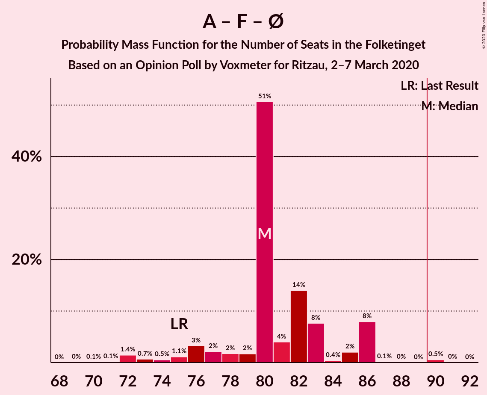

| Number of Seats | Probability | Accumulated | Special Marks |
|:---------------:|:-----------:|:-----------:|:-------------:|
| 70 | 0.1% | 100% |  |
| 71 | 0.1% | 99.9% |  |
| 72 | 1.4% | 99.8% |  |
| 73 | 0.7% | 98% |  |
| 74 | 0.5% | 98% |  |
| 75 | 1.1% | 97% | Last Result |
| 76 | 3% | 96% |  |
| 77 | 2% | 93% |  |
| 78 | 2% | 91% |  |
| 79 | 2% | 89% |  |
| 80 | 51% | 87% |  |
| 81 | 4% | 37% | Median |
| 82 | 14% | 33% |  |
| 83 | 8% | 19% |  |
| 84 | 0.4% | 11% |  |
| 85 | 2% | 11% |  |
| 86 | 8% | 9% |  |
| 87 | 0.1% | 0.7% |  |
| 88 | 0% | 0.6% |  |
| 89 | 0% | 0.6% |  |
| 90 | 0.5% | 0.6% | Majority |
| 91 | 0% | 0% |  |

### Venstre – Det Konservative Folkeparti – Dansk Folkeparti – Nye Borgerlige – Liberal Alliance – Klaus Riskær Pedersen

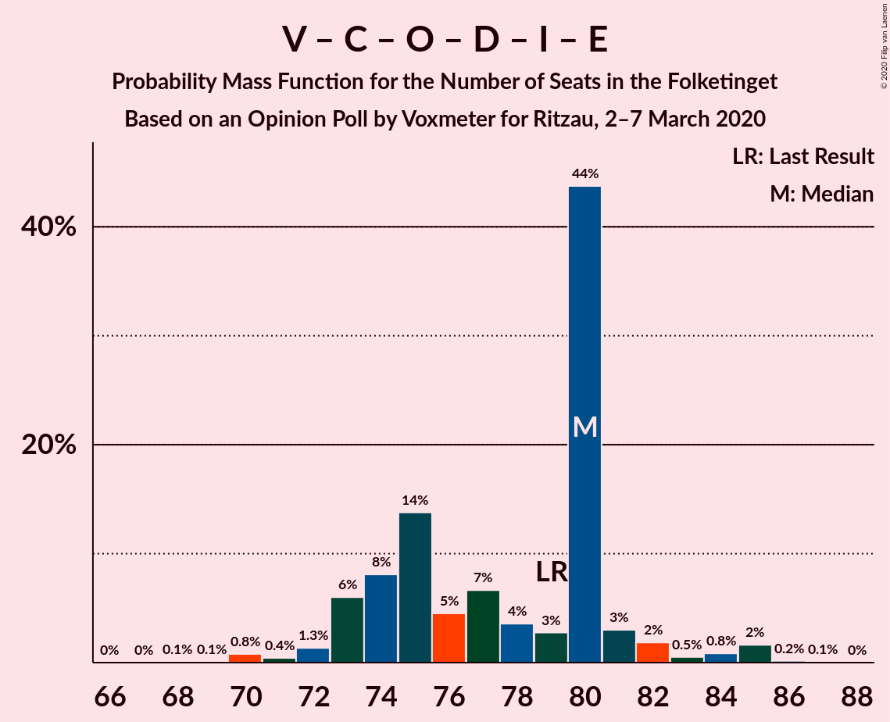

| Number of Seats | Probability | Accumulated | Special Marks |
|:---------------:|:-----------:|:-----------:|:-------------:|
| 68 | 0.1% | 100% |  |
| 69 | 0.1% | 99.9% |  |
| 70 | 0.8% | 99.8% |  |
| 71 | 0.4% | 99.0% |  |
| 72 | 1.3% | 98.6% |  |
| 73 | 6% | 97% |  |
| 74 | 8% | 91% |  |
| 75 | 14% | 83% |  |
| 76 | 5% | 69% |  |
| 77 | 7% | 65% |  |
| 78 | 4% | 58% |  |
| 79 | 3% | 55% | Last Result, Median |
| 80 | 44% | 52% |  |
| 81 | 3% | 8% |  |
| 82 | 2% | 5% |  |
| 83 | 0.5% | 3% |  |
| 84 | 0.8% | 3% |  |
| 85 | 2% | 2% |  |
| 86 | 0.2% | 0.2% |  |
| 87 | 0.1% | 0.1% |  |
| 88 | 0% | 0% |  |

### Venstre – Det Konservative Folkeparti – Dansk Folkeparti – Nye Borgerlige – Liberal Alliance

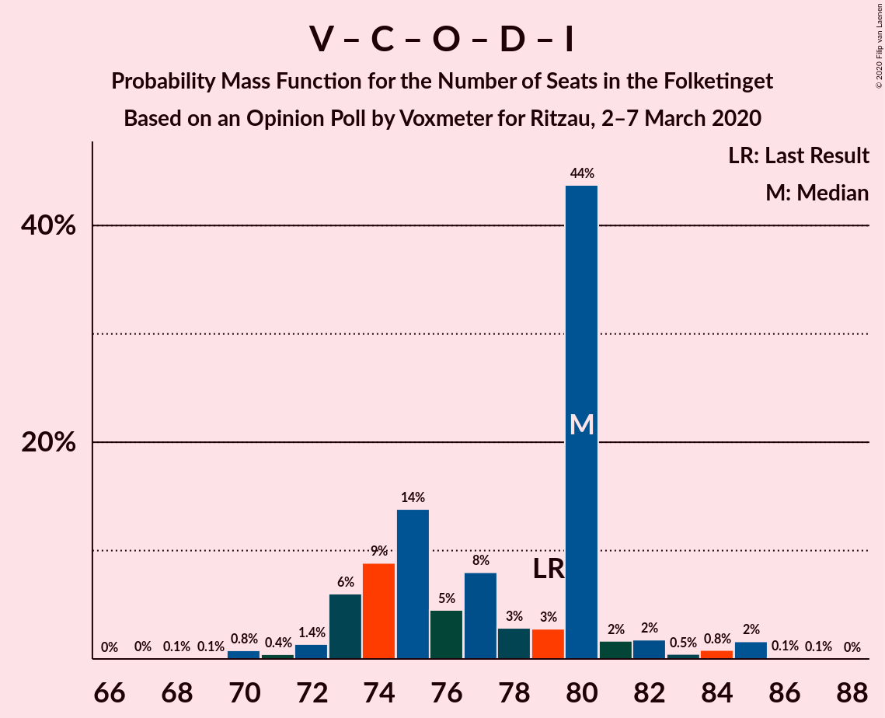

| Number of Seats | Probability | Accumulated | Special Marks |
|:---------------:|:-----------:|:-----------:|:-------------:|
| 68 | 0.1% | 100% |  |
| 69 | 0.1% | 99.9% |  |
| 70 | 0.8% | 99.8% |  |
| 71 | 0.4% | 99.0% |  |
| 72 | 1.4% | 98.6% |  |
| 73 | 6% | 97% |  |
| 74 | 9% | 91% |  |
| 75 | 14% | 82% |  |
| 76 | 5% | 68% |  |
| 77 | 8% | 64% |  |
| 78 | 3% | 56% |  |
| 79 | 3% | 53% | Last Result, Median |
| 80 | 44% | 50% |  |
| 81 | 2% | 7% |  |
| 82 | 2% | 5% |  |
| 83 | 0.5% | 3% |  |
| 84 | 0.8% | 3% |  |
| 85 | 2% | 2% |  |
| 86 | 0.1% | 0.2% |  |
| 87 | 0.1% | 0.1% |  |
| 88 | 0% | 0% |  |

### Venstre – Det Konservative Folkeparti – Dansk Folkeparti – Liberal Alliance

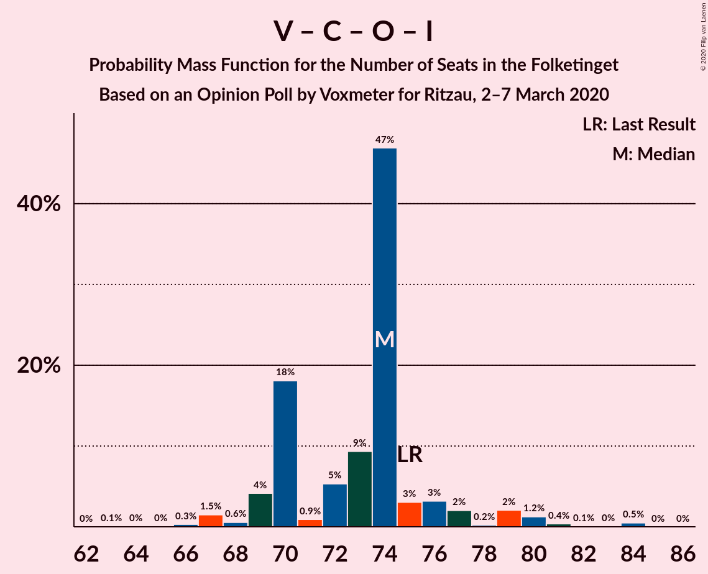

| Number of Seats | Probability | Accumulated | Special Marks |
|:---------------:|:-----------:|:-----------:|:-------------:|
| 63 | 0.1% | 100% |  |
| 64 | 0% | 99.9% |  |
| 65 | 0% | 99.9% |  |
| 66 | 0.3% | 99.9% |  |
| 67 | 1.5% | 99.5% |  |
| 68 | 0.6% | 98% |  |
| 69 | 4% | 98% |  |
| 70 | 18% | 93% |  |
| 71 | 0.9% | 75% |  |
| 72 | 5% | 74% |  |
| 73 | 9% | 69% |  |
| 74 | 47% | 60% | Median |
| 75 | 3% | 13% | Last Result |
| 76 | 3% | 10% |  |
| 77 | 2% | 7% |  |
| 78 | 0.2% | 4% |  |
| 79 | 2% | 4% |  |
| 80 | 1.2% | 2% |  |
| 81 | 0.4% | 0.9% |  |
| 82 | 0.1% | 0.6% |  |
| 83 | 0% | 0.5% |  |
| 84 | 0.5% | 0.5% |  |
| 85 | 0% | 0% |  |

### Socialdemokraterne – Radikale Venstre

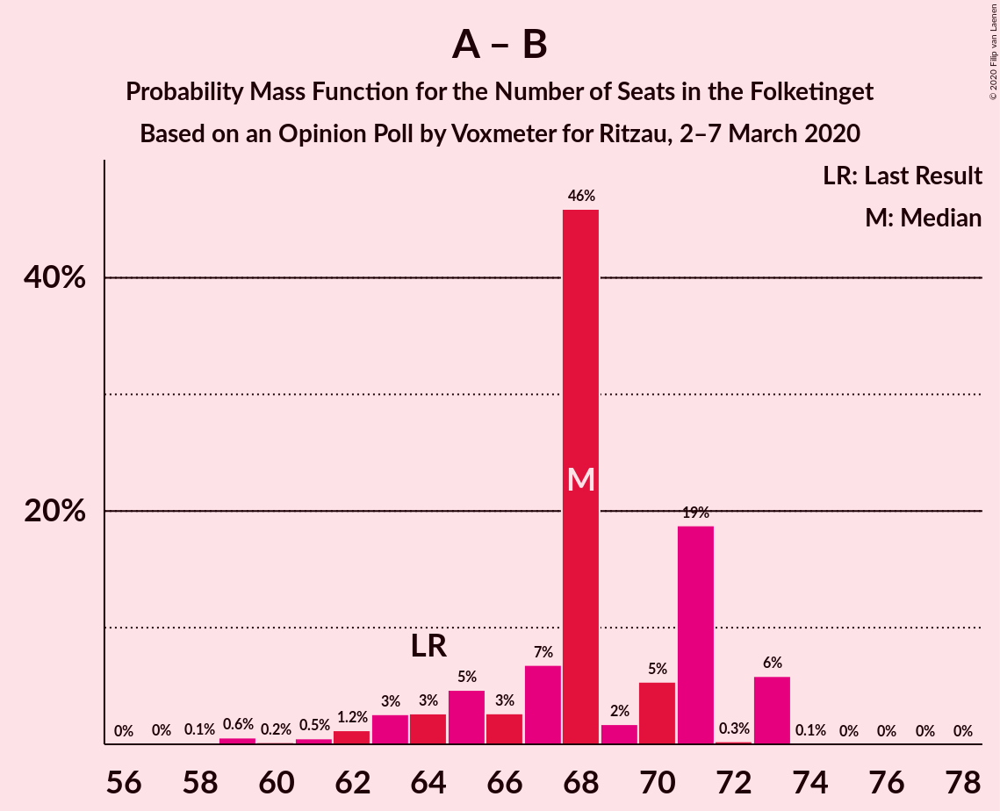

| Number of Seats | Probability | Accumulated | Special Marks |
|:---------------:|:-----------:|:-----------:|:-------------:|
| 57 | 0% | 100% |  |
| 58 | 0.1% | 99.9% |  |
| 59 | 0.6% | 99.8% |  |
| 60 | 0.2% | 99.2% |  |
| 61 | 0.5% | 99.1% |  |
| 62 | 1.2% | 98.6% |  |
| 63 | 3% | 97% |  |
| 64 | 3% | 95% | Last Result |
| 65 | 5% | 92% |  |
| 66 | 3% | 87% |  |
| 67 | 7% | 85% |  |
| 68 | 46% | 78% | Median |
| 69 | 2% | 32% |  |
| 70 | 5% | 30% |  |
| 71 | 19% | 25% |  |
| 72 | 0.3% | 6% |  |
| 73 | 6% | 6% |  |
| 74 | 0.1% | 0.2% |  |
| 75 | 0% | 0.1% |  |
| 76 | 0% | 0.1% |  |
| 77 | 0% | 0.1% |  |
| 78 | 0% | 0% |  |

### Venstre – Det Konservative Folkeparti – Liberal Alliance

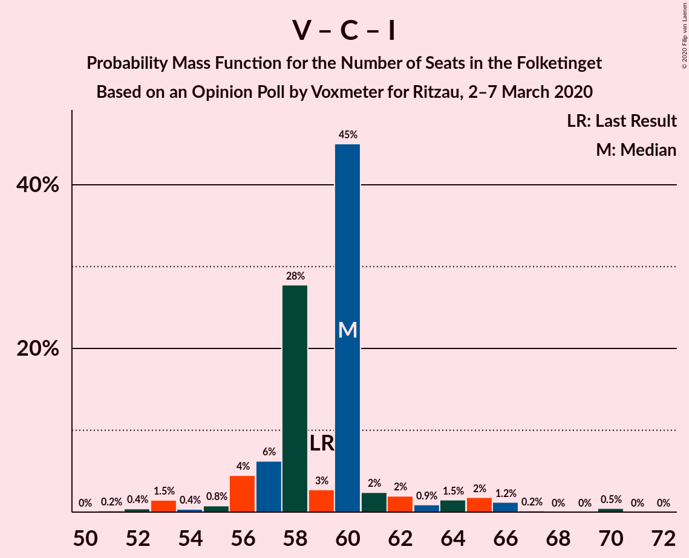

| Number of Seats | Probability | Accumulated | Special Marks |
|:---------------:|:-----------:|:-----------:|:-------------:|
| 51 | 0.2% | 100% |  |
| 52 | 0.4% | 99.8% |  |
| 53 | 1.5% | 99.4% |  |
| 54 | 0.4% | 98% |  |
| 55 | 0.8% | 98% |  |
| 56 | 4% | 97% |  |
| 57 | 6% | 92% |  |
| 58 | 28% | 86% |  |
| 59 | 3% | 58% | Last Result |
| 60 | 45% | 56% | Median |
| 61 | 2% | 10% |  |
| 62 | 2% | 8% |  |
| 63 | 0.9% | 6% |  |
| 64 | 1.5% | 5% |  |
| 65 | 2% | 4% |  |
| 66 | 1.2% | 2% |  |
| 67 | 0.2% | 0.7% |  |
| 68 | 0% | 0.5% |  |
| 69 | 0% | 0.5% |  |
| 70 | 0.5% | 0.5% |  |
| 71 | 0% | 0% |  |

### Venstre – Det Konservative Folkeparti

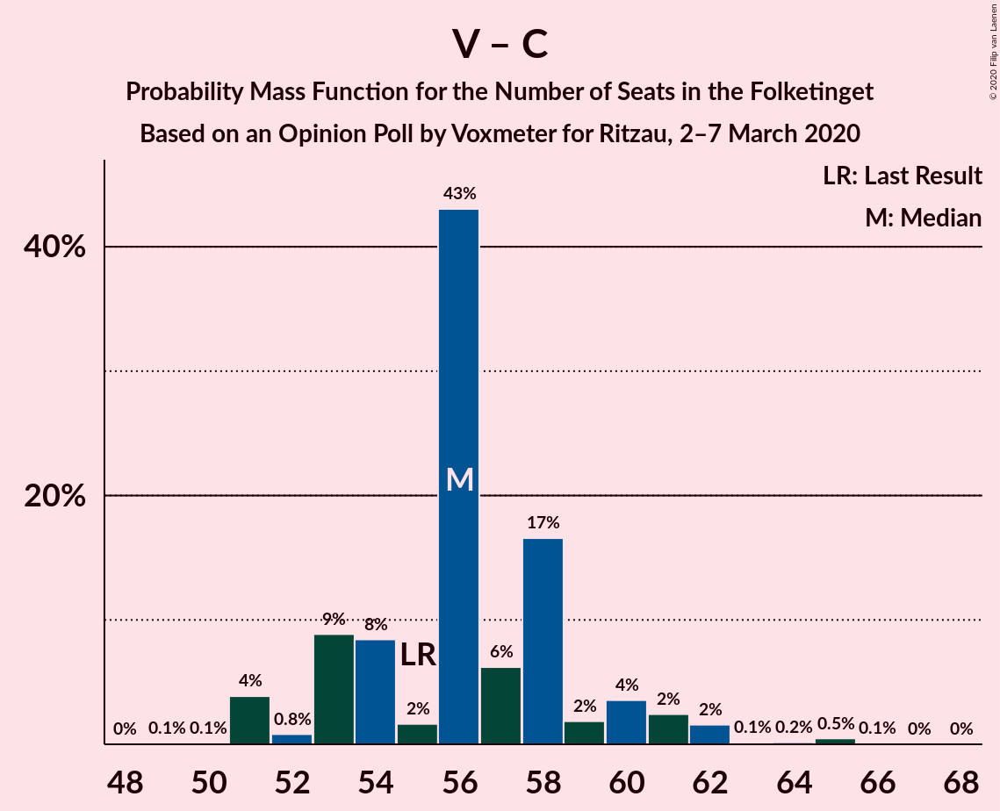

| Number of Seats | Probability | Accumulated | Special Marks |
|:---------------:|:-----------:|:-----------:|:-------------:|
| 48 | 0% | 100% |  |
| 49 | 0.1% | 99.9% |  |
| 50 | 0.1% | 99.9% |  |
| 51 | 4% | 99.8% |  |
| 52 | 0.8% | 96% |  |
| 53 | 9% | 95% |  |
| 54 | 8% | 86% |  |
| 55 | 2% | 78% | Last Result |
| 56 | 43% | 76% | Median |
| 57 | 6% | 33% |  |
| 58 | 17% | 27% |  |
| 59 | 2% | 10% |  |
| 60 | 4% | 8% |  |
| 61 | 2% | 5% |  |
| 62 | 2% | 2% |  |
| 63 | 0.1% | 0.9% |  |
| 64 | 0.2% | 0.8% |  |
| 65 | 0.5% | 0.6% |  |
| 66 | 0.1% | 0.1% |  |
| 67 | 0% | 0% |  |

### Venstre

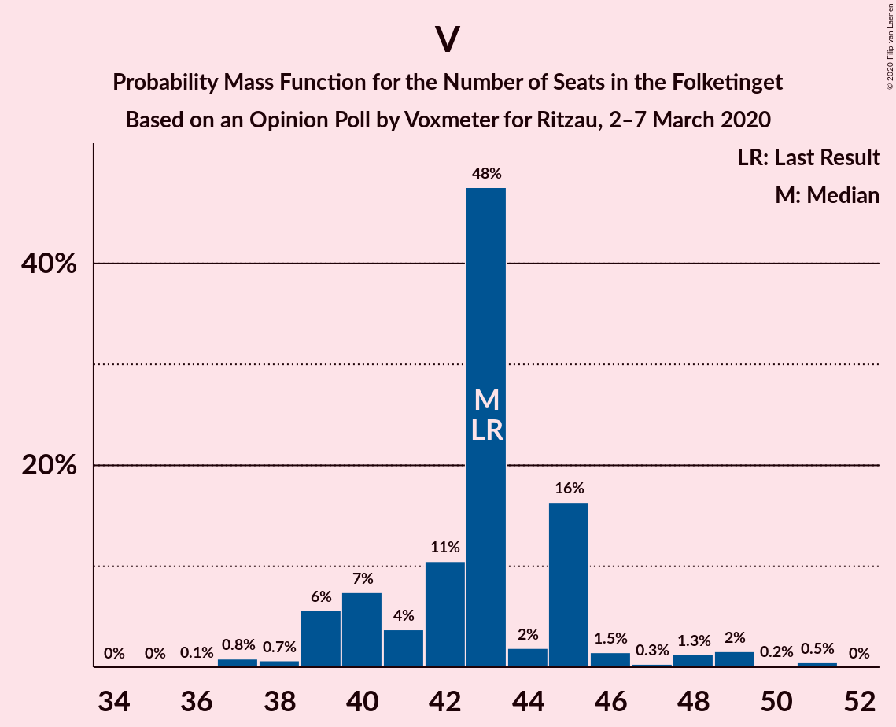

| Number of Seats | Probability | Accumulated | Special Marks |
|:---------------:|:-----------:|:-----------:|:-------------:|
| 35 | 0% | 100% |  |
| 36 | 0.1% | 99.9% |  |
| 37 | 0.8% | 99.9% |  |
| 38 | 0.7% | 99.0% |  |
| 39 | 6% | 98% |  |
| 40 | 7% | 93% |  |
| 41 | 4% | 85% |  |
| 42 | 11% | 82% |  |
| 43 | 48% | 71% | Last Result, Median |
| 44 | 2% | 24% |  |
| 45 | 16% | 22% |  |
| 46 | 1.5% | 5% |  |
| 47 | 0.3% | 4% |  |
| 48 | 1.3% | 3% |  |
| 49 | 2% | 2% |  |
| 50 | 0.2% | 0.7% |  |
| 51 | 0.5% | 0.5% |  |
| 52 | 0% | 0% |  |

## Technical Information

### Opinion Poll

+ **Polling firm:** Voxmeter
+ **Commissioner(s):** Ritzau
+ **Fieldwork period:** 2–7 March 2020

### Calculations

+ **Sample size:** 1055
+ **Simulations done:** 1,048,576
+ **Error estimate:** 1.25%

