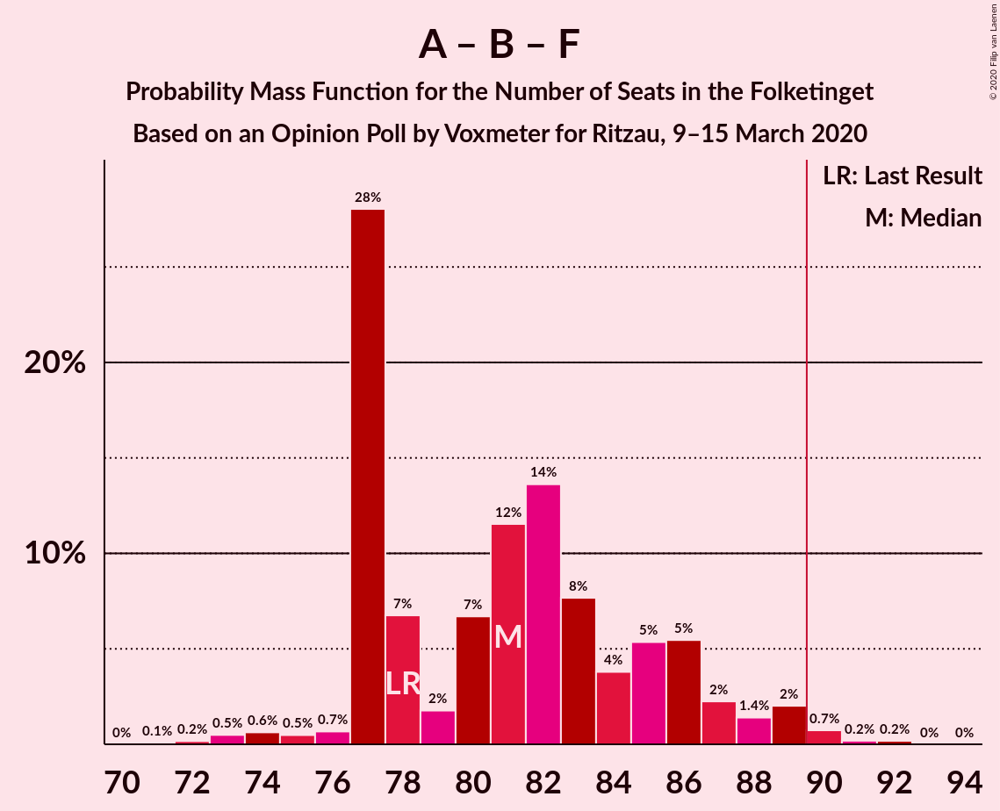
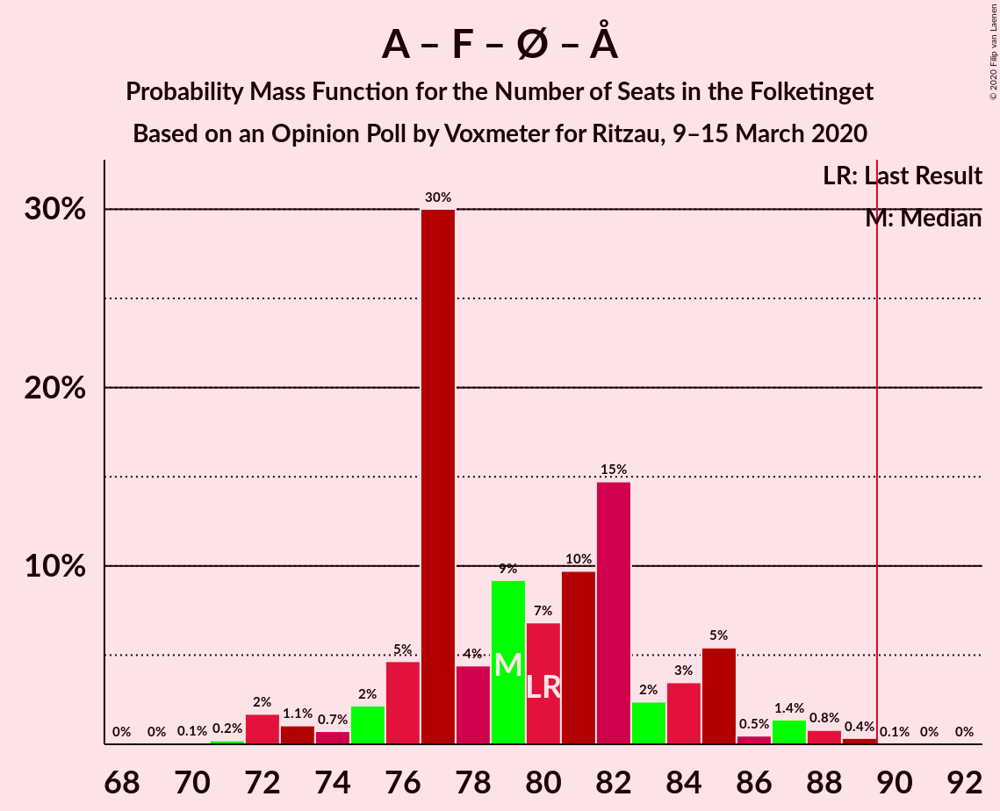

# Opinion Poll by Voxmeter for Ritzau, 9–15 March 2020

<a href="#voting-intentions">Voting Intentions</a> | <a href="#seats">Seats</a> | <a href="#coalitions">Coalitions</a> | <a href="#technical-information">Technical Information</a>

## Voting Intentions

### Confidence Intervals

| Party | Last Result | Poll Result | 80% Confidence Interval | 90% Confidence Interval | 95% Confidence Interval | 99% Confidence Interval |
|:-----:|:-----------:|:-----------:|:-----------------------:|:-----------------------:|:-----------------------:|:-----------------------:|
| Socialdemokraterne | 25.9% | 27.2% | 25.5–29.0% |25.0–29.5% |24.6–30.0% |23.8–30.9% |
| Venstre | 23.4% | 24.0% | 22.4–25.8% |21.9–26.3% |21.5–26.7% |20.7–27.6% |
| Radikale Venstre | 8.6% | 9.4% | 8.3–10.7% |8.0–11.0% |7.8–11.4% |7.3–12.0% |
| Socialistisk Folkeparti | 7.7% | 8.3% | 7.3–9.5% |7.0–9.8% |6.7–10.1% |6.3–10.7% |
| Enhedslisten–De Rød-Grønne | 6.9% | 8.1% | 7.1–9.3% |6.8–9.6% |6.6–9.9% |6.1–10.5% |
| Dansk Folkeparti | 8.7% | 7.2% | 6.3–8.3% |6.0–8.7% |5.8–8.9% |5.4–9.5% |
| Det Konservative Folkeparti | 6.6% | 7.0% | 6.1–8.1% |5.8–8.5% |5.6–8.7% |5.2–9.3% |
| Liberal Alliance | 2.3% | 2.3% | 1.8–3.0% |1.7–3.2% |1.6–3.4% |1.3–3.8% |
| Nye Borgerlige | 2.4% | 1.9% | 1.5–2.6% |1.3–2.8% |1.2–3.0% |1.1–3.3% |
| Stram Kurs | 1.8% | 1.9% | 1.5–2.6% |1.3–2.8% |1.2–3.0% |1.1–3.3% |
| Alternativet | 3.0% | 0.9% | 0.6–1.4% |0.5–1.5% |0.5–1.6% |0.4–1.9% |
| Klaus Riskær Pedersen | 0.8% | 0.4% | 0.2–0.8% |0.2–0.9% |0.2–1.0% |0.1–1.2% |

*Note:* The poll result column reflects the actual value used in the calculations. Published results may vary slightly, and in addition be rounded to fewer digits.

## Seats

### Confidence Intervals

| Party | Last Result | Median | 80% Confidence Interval | 90% Confidence Interval | 95% Confidence Interval | 99% Confidence Interval |
|:-----:|:-----------:|:------:|:-----------------------:|:-----------------------:|:-----------------------:|:-----------------------:|
| <a href="#socialdemokraterne">Socialdemokraterne</a> | 48 | 49 | 45–53 |45–54 |45–54 |43–56 |
| <a href="#venstre">Venstre</a> | 43 | 44 | 40–47 |39–49 |38–49 |38–51 |
| <a href="#radikale-venstre">Radikale Venstre</a> | 16 | 16 | 15–19 |15–20 |14–20 |13–22 |
| <a href="#socialistisk-folkeparti">Socialistisk Folkeparti</a> | 14 | 16 | 13–18 |13–19 |13–19 |11–20 |
| <a href="#enhedslisten–de-rød-grønne">Enhedslisten–De Rød-Grønne</a> | 13 | 15 | 13–18 |11–19 |11–19 |11–19 |
| <a href="#dansk-folkeparti">Dansk Folkeparti</a> | 16 | 13 | 11–15 |11–15 |10–16 |9–19 |
| <a href="#det-konservative-folkeparti">Det Konservative Folkeparti</a> | 12 | 12 | 11–14 |10–15 |10–15 |10–17 |
| <a href="#liberal-alliance">Liberal Alliance</a> | 4 | 5 | 0–6 |0–7 |0–7 |0–7 |
| <a href="#nye-borgerlige">Nye Borgerlige</a> | 4 | 4 | 0–5 |0–5 |0–5 |0–6 |
| <a href="#stram-kurs">Stram Kurs</a> | 0 | 4 | 0–5 |0–5 |0–5 |0–6 |
| <a href="#alternativet">Alternativet</a> | 5 | 0 | 0 |0 |0 |0–4 |
| <a href="#klaus-riskær-pedersen">Klaus Riskær Pedersen</a> | 0 | 0 | 0 |0 |0 |0 |

### Socialdemokraterne

*For a full overview of the results for this party, see the [Socialdemokraterne](party-socialdemokraterne.html) page.*

| Number of Seats | Probability | Accumulated | Special Marks |
|:---------------:|:-----------:|:-----------:|:-------------:|
| 41 | 0.1% | 100% |  |
| 42 | 0.1% | 99.9% |  |
| 43 | 0.6% | 99.7% |  |
| 44 | 1.0% | 99.1% |  |
| 45 | 27% | 98% |  |
| 46 | 5% | 71% |  |
| 47 | 6% | 66% |  |
| 48 | 10% | 60% | Last Result |
| 49 | 8% | 50% | Median |
| 50 | 17% | 42% |  |
| 51 | 10% | 25% |  |
| 52 | 4% | 15% |  |
| 53 | 3% | 11% |  |
| 54 | 6% | 8% |  |
| 55 | 0.2% | 2% |  |
| 56 | 1.1% | 2% |  |
| 57 | 0.1% | 0.5% |  |
| 58 | 0.1% | 0.3% |  |
| 59 | 0.3% | 0.3% |  |
| 60 | 0% | 0% |  |

### Venstre

*For a full overview of the results for this party, see the [Venstre](party-venstre.html) page.*

| Number of Seats | Probability | Accumulated | Special Marks |
|:---------------:|:-----------:|:-----------:|:-------------:|
| 36 | 0.1% | 100% |  |
| 37 | 0.2% | 99.8% |  |
| 38 | 4% | 99.7% |  |
| 39 | 3% | 96% |  |
| 40 | 10% | 92% |  |
| 41 | 7% | 82% |  |
| 42 | 5% | 75% |  |
| 43 | 6% | 70% | Last Result |
| 44 | 33% | 64% | Median |
| 45 | 12% | 31% |  |
| 46 | 3% | 19% |  |
| 47 | 8% | 16% |  |
| 48 | 2% | 8% |  |
| 49 | 5% | 6% |  |
| 50 | 0.1% | 1.0% |  |
| 51 | 0.7% | 0.9% |  |
| 52 | 0.1% | 0.2% |  |
| 53 | 0% | 0.1% |  |
| 54 | 0% | 0% |  |

### Radikale Venstre

*For a full overview of the results for this party, see the [Radikale Venstre](party-radikalevenstre.html) page.*

| Number of Seats | Probability | Accumulated | Special Marks |
|:---------------:|:-----------:|:-----------:|:-------------:|
| 12 | 0.4% | 100% |  |
| 13 | 2% | 99.6% |  |
| 14 | 2% | 98% |  |
| 15 | 44% | 96% |  |
| 16 | 18% | 52% | Last Result, Median |
| 17 | 9% | 34% |  |
| 18 | 9% | 25% |  |
| 19 | 7% | 16% |  |
| 20 | 6% | 9% |  |
| 21 | 0.8% | 2% |  |
| 22 | 1.4% | 2% |  |
| 23 | 0.1% | 0.3% |  |
| 24 | 0.2% | 0.2% |  |
| 25 | 0% | 0% |  |

### Socialistisk Folkeparti

*For a full overview of the results for this party, see the [Socialistisk Folkeparti](party-socialistiskfolkeparti.html) page.*

| Number of Seats | Probability | Accumulated | Special Marks |
|:---------------:|:-----------:|:-----------:|:-------------:|
| 10 | 0.1% | 100% |  |
| 11 | 0.4% | 99.9% |  |
| 12 | 1.4% | 99.5% |  |
| 13 | 14% | 98% |  |
| 14 | 8% | 84% | Last Result |
| 15 | 12% | 76% |  |
| 16 | 16% | 64% | Median |
| 17 | 27% | 48% |  |
| 18 | 15% | 21% |  |
| 19 | 5% | 6% |  |
| 20 | 0.4% | 0.5% |  |
| 21 | 0.2% | 0.2% |  |
| 22 | 0% | 0% |  |

### Enhedslisten–De Rød-Grønne

*For a full overview of the results for this party, see the [Enhedslisten–De Rød-Grønne](party-enhedslisten–derød-grønne.html) page.*

| Number of Seats | Probability | Accumulated | Special Marks |
|:---------------:|:-----------:|:-----------:|:-------------:|
| 10 | 0.1% | 100% |  |
| 11 | 5% | 99.9% |  |
| 12 | 4% | 95% |  |
| 13 | 12% | 91% | Last Result |
| 14 | 14% | 79% |  |
| 15 | 38% | 65% | Median |
| 16 | 5% | 27% |  |
| 17 | 12% | 22% |  |
| 18 | 5% | 10% |  |
| 19 | 5% | 5% |  |
| 20 | 0.1% | 0.1% |  |
| 21 | 0% | 0% |  |

### Dansk Folkeparti

*For a full overview of the results for this party, see the [Dansk Folkeparti](party-danskfolkeparti.html) page.*

| Number of Seats | Probability | Accumulated | Special Marks |
|:---------------:|:-----------:|:-----------:|:-------------:|
| 8 | 0.1% | 100% |  |
| 9 | 0.8% | 99.9% |  |
| 10 | 4% | 99.1% |  |
| 11 | 8% | 95% |  |
| 12 | 18% | 87% |  |
| 13 | 43% | 69% | Median |
| 14 | 10% | 26% |  |
| 15 | 11% | 15% |  |
| 16 | 3% | 5% | Last Result |
| 17 | 1.2% | 2% |  |
| 18 | 0.1% | 0.7% |  |
| 19 | 0.6% | 0.6% |  |
| 20 | 0% | 0% |  |

### Det Konservative Folkeparti

*For a full overview of the results for this party, see the [Det Konservative Folkeparti](party-detkonservativefolkeparti.html) page.*

| Number of Seats | Probability | Accumulated | Special Marks |
|:---------------:|:-----------:|:-----------:|:-------------:|
| 9 | 0.4% | 100% |  |
| 10 | 5% | 99.6% |  |
| 11 | 11% | 95% |  |
| 12 | 36% | 84% | Last Result, Median |
| 13 | 20% | 48% |  |
| 14 | 21% | 28% |  |
| 15 | 5% | 7% |  |
| 16 | 1.3% | 2% |  |
| 17 | 0.9% | 1.0% |  |
| 18 | 0.1% | 0.1% |  |
| 19 | 0% | 0% |  |

### Liberal Alliance

*For a full overview of the results for this party, see the [Liberal Alliance](party-liberalalliance.html) page.*

| Number of Seats | Probability | Accumulated | Special Marks |
|:---------------:|:-----------:|:-----------:|:-------------:|
| 0 | 17% | 100% |  |
| 1 | 0% | 83% |  |
| 2 | 0% | 83% |  |
| 3 | 3% | 83% |  |
| 4 | 23% | 80% | Last Result |
| 5 | 45% | 56% | Median |
| 6 | 4% | 11% |  |
| 7 | 7% | 7% |  |
| 8 | 0% | 0% |  |

### Nye Borgerlige

*For a full overview of the results for this party, see the [Nye Borgerlige](party-nyeborgerlige.html) page.*

| Number of Seats | Probability | Accumulated | Special Marks |
|:---------------:|:-----------:|:-----------:|:-------------:|
| 0 | 40% | 100% |  |
| 1 | 0% | 60% |  |
| 2 | 0% | 60% |  |
| 3 | 3% | 60% |  |
| 4 | 46% | 57% | Last Result, Median |
| 5 | 10% | 11% |  |
| 6 | 1.0% | 1.2% |  |
| 7 | 0.2% | 0.2% |  |
| 8 | 0% | 0% |  |

### Stram Kurs

*For a full overview of the results for this party, see the [Stram Kurs](party-stramkurs.html) page.*

| Number of Seats | Probability | Accumulated | Special Marks |
|:---------------:|:-----------:|:-----------:|:-------------:|
| 0 | 38% | 100% | Last Result |
| 1 | 0% | 62% |  |
| 2 | 0% | 62% |  |
| 3 | 0.1% | 62% |  |
| 4 | 20% | 61% | Median |
| 5 | 40% | 42% |  |
| 6 | 1.2% | 1.3% |  |
| 7 | 0.1% | 0.1% |  |
| 8 | 0% | 0% |  |

### Alternativet

*For a full overview of the results for this party, see the [Alternativet](party-alternativet.html) page.*

| Number of Seats | Probability | Accumulated | Special Marks |
|:---------------:|:-----------:|:-----------:|:-------------:|
| 0 | 99.0% | 100% | Median |
| 1 | 0% | 1.0% |  |
| 2 | 0% | 1.0% |  |
| 3 | 0% | 1.0% |  |
| 4 | 1.0% | 1.0% |  |
| 5 | 0% | 0% | Last Result |

### Klaus Riskær Pedersen

*For a full overview of the results for this party, see the [Klaus Riskær Pedersen](party-klausriskærpedersen.html) page.*

| Number of Seats | Probability | Accumulated | Special Marks |
|:---------------:|:-----------:|:-----------:|:-------------:|
| 0 | 100% | 100% | Last Result, Median |

## Coalitions

### Confidence Intervals

| Coalition | Last Result | Median | Majority? | 80% Confidence Interval | 90% Confidence Interval | 95% Confidence Interval | 99% Confidence Interval |
|:---------:|:-----------:|:------:|:---------:|:-----------------------:|:-----------------------:|:-----------------------:|:-----------------------:|
| Socialdemokraterne – Radikale Venstre – Socialistisk Folkeparti – Enhedslisten–De Rød-Grønne – Alternativet | 96 | 96 | 99.1% | 92–101 | 92–103 | 91–103 | 88–106 |
| Socialdemokraterne – Radikale Venstre – Socialistisk Folkeparti – Enhedslisten–De Rød-Grønne | 91 | 96 | 99.1% | 92–101 | 92–102 | 91–103 | 88–106 |
| Socialdemokraterne – Radikale Venstre – Socialistisk Folkeparti | 78 | 81 | 1.1% | 77–86 | 77–87 | 76–89 | 73–90 |
| Socialdemokraterne – Socialistisk Folkeparti – Enhedslisten–De Rød-Grønne – Alternativet | 80 | 79 | 0.1% | 76–84 | 75–85 | 73–87 | 72–88 |
| Socialdemokraterne – Socialistisk Folkeparti – Enhedslisten–De Rød-Grønne | 75 | 79 | 0.1% | 76–84 | 75–85 | 73–85 | 72–88 |
| Venstre – Dansk Folkeparti – Det Konservative Folkeparti – Liberal Alliance – Nye Borgerlige – Klaus Riskær Pedersen | 79 | 76 | 0% | 71–79 | 70–80 | 69–82 | 67–84 |
| Venstre – Dansk Folkeparti – Det Konservative Folkeparti – Liberal Alliance – Nye Borgerlige | 79 | 76 | 0% | 71–79 | 70–80 | 69–82 | 67–84 |
| Venstre – Dansk Folkeparti – Det Konservative Folkeparti – Liberal Alliance | 75 | 74 | 0% | 69–78 | 67–78 | 67–79 | 65–80 |
| Socialdemokraterne – Radikale Venstre | 64 | 65 | 0% | 60–70 | 60–72 | 60–74 | 59–74 |
| Venstre – Det Konservative Folkeparti – Liberal Alliance | 59 | 61 | 0% | 56–65 | 54–66 | 53–66 | 52–67 |
| Venstre – Det Konservative Folkeparti | 55 | 56 | 0% | 53–60 | 52–61 | 52–62 | 50–65 |
| Venstre | 43 | 44 | 0% | 40–47 | 39–49 | 38–49 | 38–51 |

### Socialdemokraterne – Radikale Venstre – Socialistisk Folkeparti – Enhedslisten–De Rød-Grønne – Alternativet

| Number of Seats | Probability | Accumulated | Special Marks |
|:---------------:|:-----------:|:-----------:|:-------------:|
| 85 | 0.1% | 100% |  |
| 86 | 0% | 99.9% |  |
| 87 | 0.1% | 99.9% |  |
| 88 | 0.3% | 99.7% |  |
| 89 | 0.3% | 99.4% |  |
| 90 | 0.9% | 99.1% | Majority |
| 91 | 3% | 98% |  |
| 92 | 26% | 95% |  |
| 93 | 2% | 69% |  |
| 94 | 6% | 67% |  |
| 95 | 9% | 60% |  |
| 96 | 12% | 52% | Last Result, Median |
| 97 | 11% | 40% |  |
| 98 | 7% | 29% |  |
| 99 | 2% | 21% |  |
| 100 | 6% | 20% |  |
| 101 | 8% | 14% |  |
| 102 | 0.8% | 6% |  |
| 103 | 3% | 5% |  |
| 104 | 0.4% | 2% |  |
| 105 | 0.9% | 2% |  |
| 106 | 0.4% | 0.7% |  |
| 107 | 0.1% | 0.3% |  |
| 108 | 0.2% | 0.2% |  |
| 109 | 0% | 0% |  |

### Socialdemokraterne – Radikale Venstre – Socialistisk Folkeparti – Enhedslisten–De Rød-Grønne

| Number of Seats | Probability | Accumulated | Special Marks |
|:---------------:|:-----------:|:-----------:|:-------------:|
| 85 | 0.1% | 100% |  |
| 86 | 0% | 99.9% |  |
| 87 | 0.1% | 99.9% |  |
| 88 | 0.3% | 99.7% |  |
| 89 | 0.4% | 99.4% |  |
| 90 | 0.9% | 99.1% | Majority |
| 91 | 3% | 98% | Last Result |
| 92 | 26% | 95% |  |
| 93 | 2% | 69% |  |
| 94 | 6% | 67% |  |
| 95 | 9% | 60% |  |
| 96 | 12% | 52% | Median |
| 97 | 11% | 40% |  |
| 98 | 7% | 29% |  |
| 99 | 2% | 21% |  |
| 100 | 6% | 20% |  |
| 101 | 9% | 14% |  |
| 102 | 0.9% | 5% |  |
| 103 | 3% | 4% |  |
| 104 | 0.4% | 1.4% |  |
| 105 | 0.3% | 0.9% |  |
| 106 | 0.3% | 0.7% |  |
| 107 | 0.1% | 0.3% |  |
| 108 | 0.2% | 0.2% |  |
| 109 | 0% | 0% |  |

### Socialdemokraterne – Radikale Venstre – Socialistisk Folkeparti

| Number of Seats | Probability | Accumulated | Special Marks |
|:---------------:|:-----------:|:-----------:|:-------------:|
| 71 | 0.1% | 100% |  |
| 72 | 0.2% | 99.9% |  |
| 73 | 0.5% | 99.8% |  |
| 74 | 0.6% | 99.3% |  |
| 75 | 0.5% | 98.6% |  |
| 76 | 0.7% | 98% |  |
| 77 | 28% | 97% |  |
| 78 | 7% | 69% | Last Result |
| 79 | 2% | 63% |  |
| 80 | 7% | 61% |  |
| 81 | 12% | 54% | Median |
| 82 | 14% | 43% |  |
| 83 | 8% | 29% |  |
| 84 | 4% | 21% |  |
| 85 | 5% | 18% |  |
| 86 | 5% | 12% |  |
| 87 | 2% | 7% |  |
| 88 | 1.4% | 5% |  |
| 89 | 2% | 3% |  |
| 90 | 0.7% | 1.1% | Majority |
| 91 | 0.2% | 0.4% |  |
| 92 | 0.2% | 0.2% |  |
| 93 | 0% | 0% |  |

### Socialdemokraterne – Socialistisk Folkeparti – Enhedslisten–De Rød-Grønne – Alternativet

| Number of Seats | Probability | Accumulated | Special Marks |
|:---------------:|:-----------:|:-----------:|:-------------:|
| 69 | 0% | 100% |  |
| 70 | 0.1% | 99.9% |  |
| 71 | 0.2% | 99.9% |  |
| 72 | 2% | 99.7% |  |
| 73 | 1.1% | 98% |  |
| 74 | 0.7% | 97% |  |
| 75 | 2% | 96% |  |
| 76 | 5% | 94% |  |
| 77 | 30% | 89% |  |
| 78 | 4% | 59% |  |
| 79 | 9% | 55% |  |
| 80 | 7% | 46% | Last Result, Median |
| 81 | 10% | 39% |  |
| 82 | 15% | 29% |  |
| 83 | 2% | 14% |  |
| 84 | 3% | 12% |  |
| 85 | 5% | 9% |  |
| 86 | 0.5% | 3% |  |
| 87 | 1.4% | 3% |  |
| 88 | 0.8% | 1.3% |  |
| 89 | 0.4% | 0.5% |  |
| 90 | 0.1% | 0.1% | Majority |
| 91 | 0% | 0.1% |  |
| 92 | 0% | 0% |  |

### Socialdemokraterne – Socialistisk Folkeparti – Enhedslisten–De Rød-Grønne

| Number of Seats | Probability | Accumulated | Special Marks |
|:---------------:|:-----------:|:-----------:|:-------------:|
| 69 | 0% | 100% |  |
| 70 | 0.1% | 99.9% |  |
| 71 | 0.2% | 99.9% |  |
| 72 | 2% | 99.6% |  |
| 73 | 1.1% | 98% |  |
| 74 | 0.8% | 97% |  |
| 75 | 2% | 96% | Last Result |
| 76 | 5% | 94% |  |
| 77 | 30% | 89% |  |
| 78 | 4% | 59% |  |
| 79 | 9% | 55% |  |
| 80 | 7% | 46% | Median |
| 81 | 10% | 39% |  |
| 82 | 15% | 29% |  |
| 83 | 2% | 14% |  |
| 84 | 4% | 12% |  |
| 85 | 5% | 8% |  |
| 86 | 0.5% | 2% |  |
| 87 | 1.4% | 2% |  |
| 88 | 0.2% | 0.6% |  |
| 89 | 0.3% | 0.4% |  |
| 90 | 0.1% | 0.1% | Majority |
| 91 | 0% | 0.1% |  |
| 92 | 0% | 0% |  |

### Venstre – Dansk Folkeparti – Det Konservative Folkeparti – Liberal Alliance – Nye Borgerlige – Klaus Riskær Pedersen

| Number of Seats | Probability | Accumulated | Special Marks |
|:---------------:|:-----------:|:-----------:|:-------------:|
| 64 | 0.3% | 100% |  |
| 65 | 0.1% | 99.7% |  |
| 66 | 0.1% | 99.6% |  |
| 67 | 0.4% | 99.5% |  |
| 68 | 0.6% | 99.1% |  |
| 69 | 3% | 98.6% |  |
| 70 | 1.2% | 95% |  |
| 71 | 5% | 94% |  |
| 72 | 9% | 89% |  |
| 73 | 2% | 80% |  |
| 74 | 12% | 79% |  |
| 75 | 12% | 67% |  |
| 76 | 5% | 54% |  |
| 77 | 7% | 50% |  |
| 78 | 33% | 43% | Median |
| 79 | 2% | 10% | Last Result |
| 80 | 4% | 8% |  |
| 81 | 0.9% | 4% |  |
| 82 | 0.9% | 3% |  |
| 83 | 0.1% | 2% |  |
| 84 | 1.2% | 2% |  |
| 85 | 0.3% | 0.5% |  |
| 86 | 0.1% | 0.1% |  |
| 87 | 0% | 0.1% |  |
| 88 | 0% | 0% |  |

### Venstre – Dansk Folkeparti – Det Konservative Folkeparti – Liberal Alliance – Nye Borgerlige

| Number of Seats | Probability | Accumulated | Special Marks |
|:---------------:|:-----------:|:-----------:|:-------------:|
| 64 | 0.3% | 100% |  |
| 65 | 0.1% | 99.7% |  |
| 66 | 0.1% | 99.6% |  |
| 67 | 0.4% | 99.5% |  |
| 68 | 0.6% | 99.1% |  |
| 69 | 3% | 98.6% |  |
| 70 | 1.2% | 95% |  |
| 71 | 5% | 94% |  |
| 72 | 9% | 89% |  |
| 73 | 2% | 80% |  |
| 74 | 12% | 79% |  |
| 75 | 12% | 67% |  |
| 76 | 5% | 54% |  |
| 77 | 7% | 50% |  |
| 78 | 33% | 43% | Median |
| 79 | 2% | 10% | Last Result |
| 80 | 4% | 8% |  |
| 81 | 0.9% | 4% |  |
| 82 | 0.9% | 3% |  |
| 83 | 0.1% | 2% |  |
| 84 | 1.2% | 2% |  |
| 85 | 0.3% | 0.5% |  |
| 86 | 0.1% | 0.1% |  |
| 87 | 0% | 0.1% |  |
| 88 | 0% | 0% |  |

### Venstre – Dansk Folkeparti – Det Konservative Folkeparti – Liberal Alliance

| Number of Seats | Probability | Accumulated | Special Marks |
|:---------------:|:-----------:|:-----------:|:-------------:|
| 64 | 0.4% | 100% |  |
| 65 | 0.2% | 99.6% |  |
| 66 | 0.3% | 99.4% |  |
| 67 | 7% | 99.1% |  |
| 68 | 2% | 93% |  |
| 69 | 8% | 91% |  |
| 70 | 10% | 83% |  |
| 71 | 2% | 73% |  |
| 72 | 5% | 71% |  |
| 73 | 2% | 66% |  |
| 74 | 29% | 64% | Median |
| 75 | 12% | 34% | Last Result |
| 76 | 7% | 22% |  |
| 77 | 4% | 15% |  |
| 78 | 7% | 11% |  |
| 79 | 3% | 4% |  |
| 80 | 0.6% | 1.0% |  |
| 81 | 0.2% | 0.4% |  |
| 82 | 0.1% | 0.2% |  |
| 83 | 0.1% | 0.1% |  |
| 84 | 0% | 0.1% |  |
| 85 | 0% | 0% |  |

### Socialdemokraterne – Radikale Venstre

| Number of Seats | Probability | Accumulated | Special Marks |
|:---------------:|:-----------:|:-----------:|:-------------:|
| 57 | 0.1% | 100% |  |
| 58 | 0.2% | 99.9% |  |
| 59 | 0.4% | 99.7% |  |
| 60 | 26% | 99.3% |  |
| 61 | 2% | 74% |  |
| 62 | 3% | 72% |  |
| 63 | 4% | 70% |  |
| 64 | 8% | 65% | Last Result |
| 65 | 21% | 57% | Median |
| 66 | 4% | 36% |  |
| 67 | 7% | 32% |  |
| 68 | 6% | 25% |  |
| 69 | 8% | 19% |  |
| 70 | 2% | 11% |  |
| 71 | 4% | 9% |  |
| 72 | 2% | 6% |  |
| 73 | 1.4% | 4% |  |
| 74 | 2% | 3% |  |
| 75 | 0.3% | 0.4% |  |
| 76 | 0.1% | 0.1% |  |
| 77 | 0% | 0% |  |

### Venstre – Det Konservative Folkeparti – Liberal Alliance

| Number of Seats | Probability | Accumulated | Special Marks |
|:---------------:|:-----------:|:-----------:|:-------------:|
| 50 | 0.1% | 100% |  |
| 51 | 0.1% | 99.9% |  |
| 52 | 2% | 99.8% |  |
| 53 | 0.7% | 98% |  |
| 54 | 2% | 97% |  |
| 55 | 2% | 95% |  |
| 56 | 6% | 93% |  |
| 57 | 8% | 87% |  |
| 58 | 10% | 79% |  |
| 59 | 3% | 69% | Last Result |
| 60 | 7% | 66% |  |
| 61 | 36% | 60% | Median |
| 62 | 4% | 23% |  |
| 63 | 2% | 19% |  |
| 64 | 6% | 17% |  |
| 65 | 2% | 11% |  |
| 66 | 7% | 9% |  |
| 67 | 1.3% | 2% |  |
| 68 | 0.2% | 0.4% |  |
| 69 | 0.2% | 0.3% |  |
| 70 | 0% | 0.1% |  |
| 71 | 0.1% | 0.1% |  |
| 72 | 0% | 0% |  |

### Venstre – Det Konservative Folkeparti

| Number of Seats | Probability | Accumulated | Special Marks |
|:---------------:|:-----------:|:-----------:|:-------------:|
| 48 | 0.1% | 100% |  |
| 49 | 0.1% | 99.9% |  |
| 50 | 1.1% | 99.8% |  |
| 51 | 0.7% | 98.7% |  |
| 52 | 4% | 98% |  |
| 53 | 17% | 94% |  |
| 54 | 3% | 76% |  |
| 55 | 6% | 73% | Last Result |
| 56 | 29% | 67% | Median |
| 57 | 8% | 38% |  |
| 58 | 7% | 29% |  |
| 59 | 8% | 23% |  |
| 60 | 7% | 15% |  |
| 61 | 4% | 7% |  |
| 62 | 2% | 3% |  |
| 63 | 0.4% | 1.4% |  |
| 64 | 0.1% | 1.0% |  |
| 65 | 0.7% | 0.9% |  |
| 66 | 0.1% | 0.1% |  |
| 67 | 0% | 0% |  |

### Venstre

| Number of Seats | Probability | Accumulated | Special Marks |
|:---------------:|:-----------:|:-----------:|:-------------:|
| 36 | 0.1% | 100% |  |
| 37 | 0.2% | 99.8% |  |
| 38 | 4% | 99.7% |  |
| 39 | 3% | 96% |  |
| 40 | 10% | 92% |  |
| 41 | 7% | 82% |  |
| 42 | 5% | 75% |  |
| 43 | 6% | 70% | Last Result |
| 44 | 33% | 64% | Median |
| 45 | 12% | 31% |  |
| 46 | 3% | 19% |  |
| 47 | 8% | 16% |  |
| 48 | 2% | 8% |  |
| 49 | 5% | 6% |  |
| 50 | 0.1% | 1.0% |  |
| 51 | 0.7% | 0.9% |  |
| 52 | 0.1% | 0.2% |  |
| 53 | 0% | 0.1% |  |
| 54 | 0% | 0% |  |

## Technical Information

### Opinion Poll

+ **Polling firm:** Voxmeter
+ **Commissioner(s):** Ritzau
+ **Fieldwork period:** 9–15 March 2020

### Calculations

+ **Sample size:** 1041
+ **Simulations done:** 1,048,576
+ **Error estimate:** 2.42%

