# Opinion Poll by Voxmeter for Ritzau, 16–22 March 2020

<a href="#voting-intentions">Voting Intentions</a> | <a href="#seats">Seats</a> | <a href="#coalitions">Coalitions</a> | <a href="#technical-information">Technical Information</a>

## Voting Intentions

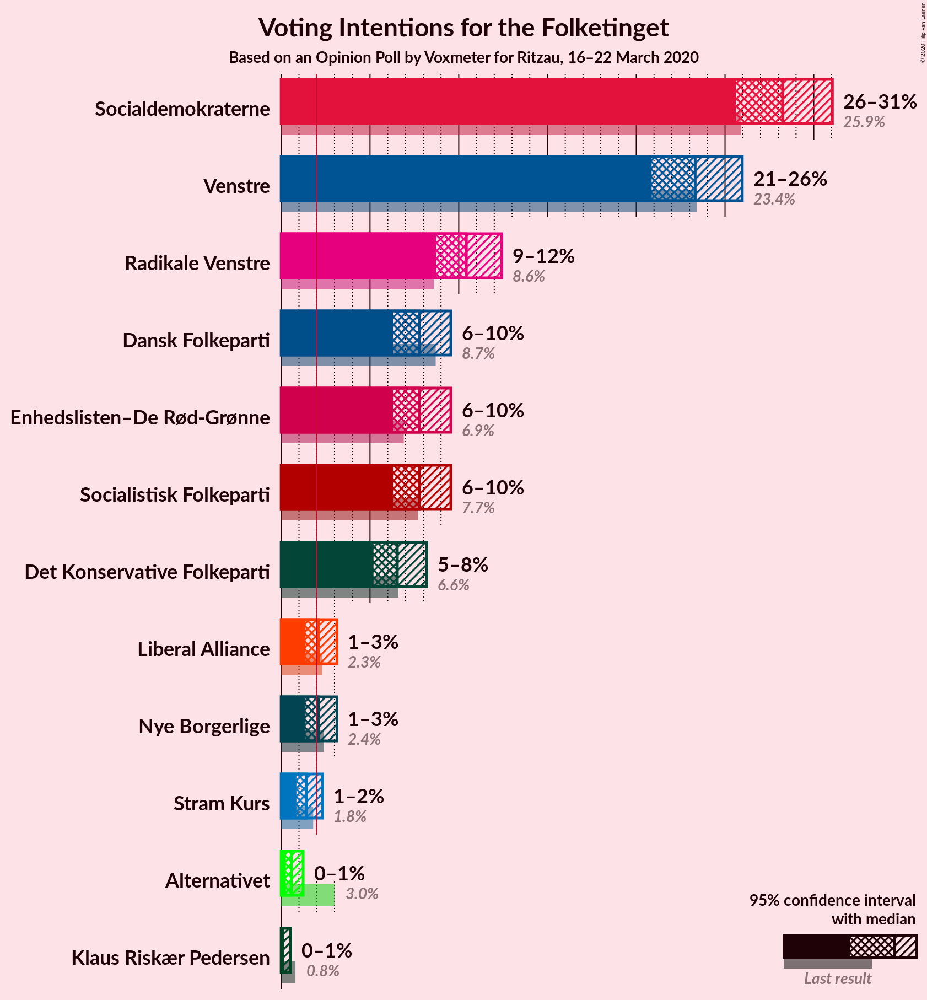

### Confidence Intervals

| Party | Last Result | Poll Result | 80% Confidence Interval | 90% Confidence Interval | 95% Confidence Interval | 99% Confidence Interval |
|:-----:|:-----------:|:-----------:|:-----------------------:|:-----------------------:|:-----------------------:|:-----------------------:|
| Socialdemokraterne | 25.9% | 28.2% | 26.5–30.1% |26.0–30.6% |25.6–31.0% |24.8–31.9% |
| Venstre | 23.4% | 23.3% | 21.7–25.1% |21.2–25.5% |20.9–26.0% |20.1–26.8% |
| Radikale Venstre | 8.6% | 10.4% | 9.3–11.7% |9.0–12.1% |8.7–12.4% |8.2–13.1% |
| Dansk Folkeparti | 8.7% | 7.8% | 6.8–8.9% |6.5–9.3% |6.3–9.6% |5.9–10.1% |
| Enhedslisten–De Rød-Grønne | 6.9% | 7.8% | 6.8–8.9% |6.5–9.3% |6.3–9.6% |5.9–10.1% |
| Socialistisk Folkeparti | 7.7% | 7.8% | 6.8–8.9% |6.5–9.3% |6.3–9.6% |5.9–10.1% |
| Det Konservative Folkeparti | 6.6% | 6.5% | 5.7–7.6% |5.4–7.9% |5.2–8.2% |4.8–8.7% |
| Liberal Alliance | 2.3% | 2.1% | 1.6–2.8% |1.5–3.0% |1.4–3.1% |1.2–3.5% |
| Nye Borgerlige | 2.4% | 2.1% | 1.6–2.8% |1.5–3.0% |1.4–3.1% |1.2–3.5% |
| Stram Kurs | 1.8% | 1.4% | 1.1–2.0% |0.9–2.2% |0.9–2.3% |0.7–2.7% |
| Alternativet | 3.0% | 0.6% | 0.4–1.0% |0.3–1.1% |0.3–1.2% |0.2–1.5% |
| Klaus Riskær Pedersen | 0.8% | 0.1% | 0.0–0.4% |0.0–0.5% |0.0–0.5% |0.0–0.7% |

*Note:* The poll result column reflects the actual value used in the calculations. Published results may vary slightly, and in addition be rounded to fewer digits.

## Seats

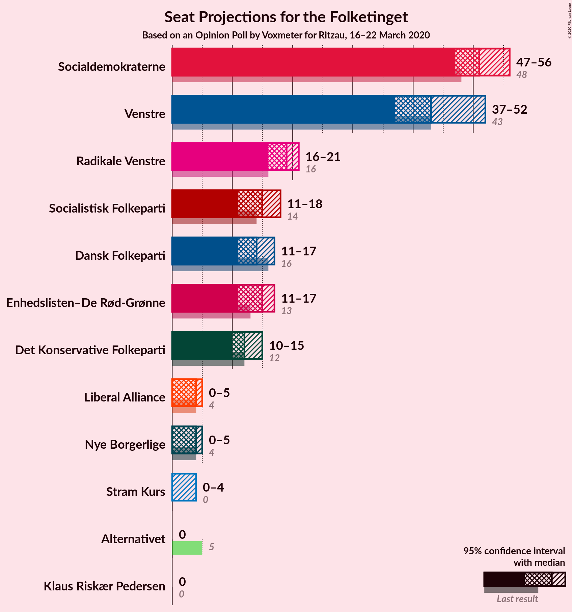

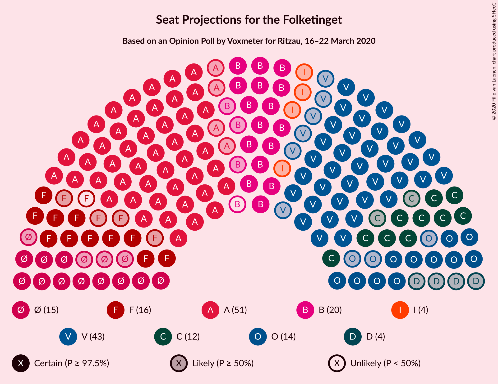

### Confidence Intervals

| Party | Last Result | Median | 80% Confidence Interval | 90% Confidence Interval | 95% Confidence Interval | 99% Confidence Interval |
|:-----:|:-----------:|:------:|:-----------------------:|:-----------------------:|:-----------------------:|:-----------------------:|
| <a href="#socialdemokraterne">Socialdemokraterne</a> | 48 | 51 | 48–54 |47–55 |47–56 |44–57 |
| <a href="#venstre">Venstre</a> | 43 | 43 | 39–47 |38–47 |37–52 |37–52 |
| <a href="#radikale-venstre">Radikale Venstre</a> | 16 | 19 | 17–20 |16–21 |16–21 |15–23 |
| <a href="#dansk-folkeparti">Dansk Folkeparti</a> | 16 | 14 | 12–16 |12–16 |11–17 |11–18 |
| <a href="#enhedslisten–de-rød-grønne">Enhedslisten–De Rød-Grønne</a> | 13 | 15 | 12–17 |11–17 |11–17 |11–18 |
| <a href="#socialistisk-folkeparti">Socialistisk Folkeparti</a> | 14 | 15 | 12–17 |12–18 |11–18 |11–19 |
| <a href="#det-konservative-folkeparti">Det Konservative Folkeparti</a> | 12 | 12 | 11–14 |10–15 |10–15 |9–16 |
| <a href="#liberal-alliance">Liberal Alliance</a> | 4 | 4 | 0–5 |0–5 |0–5 |0–6 |
| <a href="#nye-borgerlige">Nye Borgerlige</a> | 4 | 4 | 0–5 |0–5 |0–5 |0–6 |
| <a href="#stram-kurs">Stram Kurs</a> | 0 | 0 | 0 |0–3 |0–4 |0–5 |
| <a href="#alternativet">Alternativet</a> | 5 | 0 | 0 |0 |0 |0 |
| <a href="#klaus-riskær-pedersen">Klaus Riskær Pedersen</a> | 0 | 0 | 0 |0 |0 |0 |

### Socialdemokraterne

*For a full overview of the results for this party, see the [Socialdemokraterne](party-socialdemokraterne.html) page.*

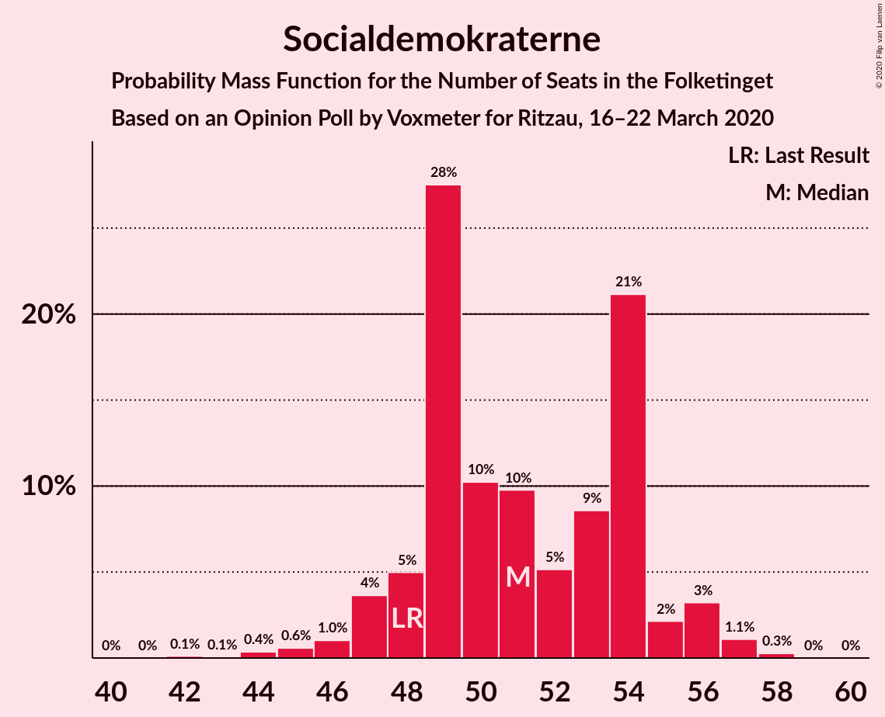

| Number of Seats | Probability | Accumulated | Special Marks |
|:---------------:|:-----------:|:-----------:|:-------------:|
| 42 | 0.1% | 100% |  |
| 43 | 0.1% | 99.9% |  |
| 44 | 0.4% | 99.8% |  |
| 45 | 0.6% | 99.5% |  |
| 46 | 1.0% | 98.9% |  |
| 47 | 4% | 98% |  |
| 48 | 5% | 94% | Last Result |
| 49 | 28% | 89% |  |
| 50 | 10% | 62% |  |
| 51 | 10% | 51% | Median |
| 52 | 5% | 42% |  |
| 53 | 9% | 37% |  |
| 54 | 21% | 28% |  |
| 55 | 2% | 7% |  |
| 56 | 3% | 5% |  |
| 57 | 1.1% | 1.4% |  |
| 58 | 0.3% | 0.3% |  |
| 59 | 0% | 0.1% |  |
| 60 | 0% | 0% |  |

### Venstre

*For a full overview of the results for this party, see the [Venstre](party-venstre.html) page.*

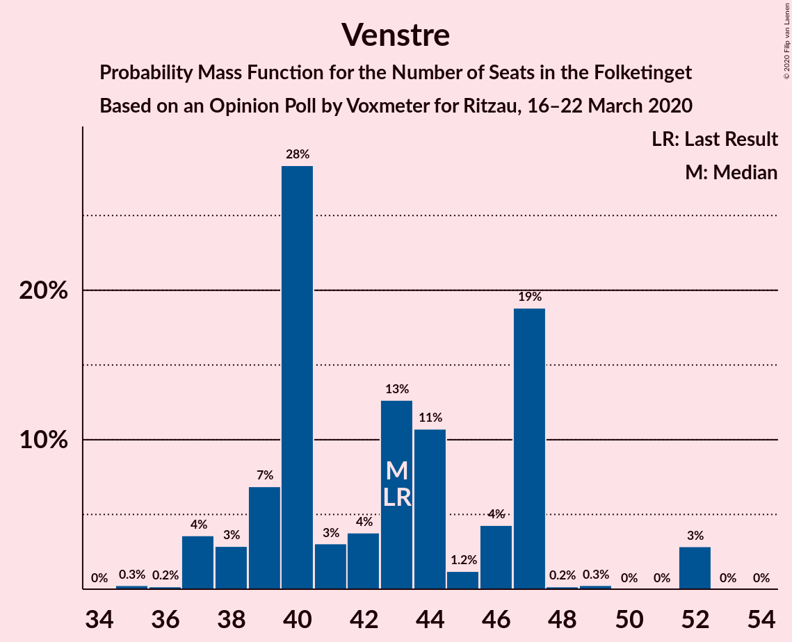

| Number of Seats | Probability | Accumulated | Special Marks |
|:---------------:|:-----------:|:-----------:|:-------------:|
| 35 | 0.3% | 100% |  |
| 36 | 0.2% | 99.7% |  |
| 37 | 4% | 99.5% |  |
| 38 | 3% | 96% |  |
| 39 | 7% | 93% |  |
| 40 | 28% | 86% |  |
| 41 | 3% | 58% |  |
| 42 | 4% | 55% |  |
| 43 | 13% | 51% | Last Result, Median |
| 44 | 11% | 38% |  |
| 45 | 1.2% | 28% |  |
| 46 | 4% | 26% |  |
| 47 | 19% | 22% |  |
| 48 | 0.2% | 3% |  |
| 49 | 0.3% | 3% |  |
| 50 | 0% | 3% |  |
| 51 | 0% | 3% |  |
| 52 | 3% | 3% |  |
| 53 | 0% | 0% |  |

### Radikale Venstre

*For a full overview of the results for this party, see the [Radikale Venstre](party-radikalevenstre.html) page.*

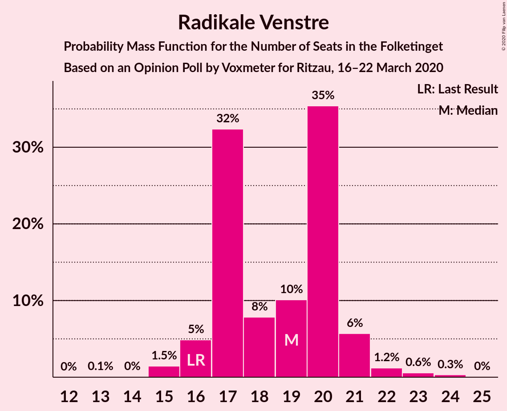

| Number of Seats | Probability | Accumulated | Special Marks |
|:---------------:|:-----------:|:-----------:|:-------------:|
| 13 | 0.1% | 100% |  |
| 14 | 0% | 99.9% |  |
| 15 | 1.5% | 99.9% |  |
| 16 | 5% | 98% | Last Result |
| 17 | 32% | 94% |  |
| 18 | 8% | 61% |  |
| 19 | 10% | 53% | Median |
| 20 | 35% | 43% |  |
| 21 | 6% | 8% |  |
| 22 | 1.2% | 2% |  |
| 23 | 0.6% | 0.9% |  |
| 24 | 0.3% | 0.4% |  |
| 25 | 0% | 0% |  |

### Dansk Folkeparti

*For a full overview of the results for this party, see the [Dansk Folkeparti](party-danskfolkeparti.html) page.*

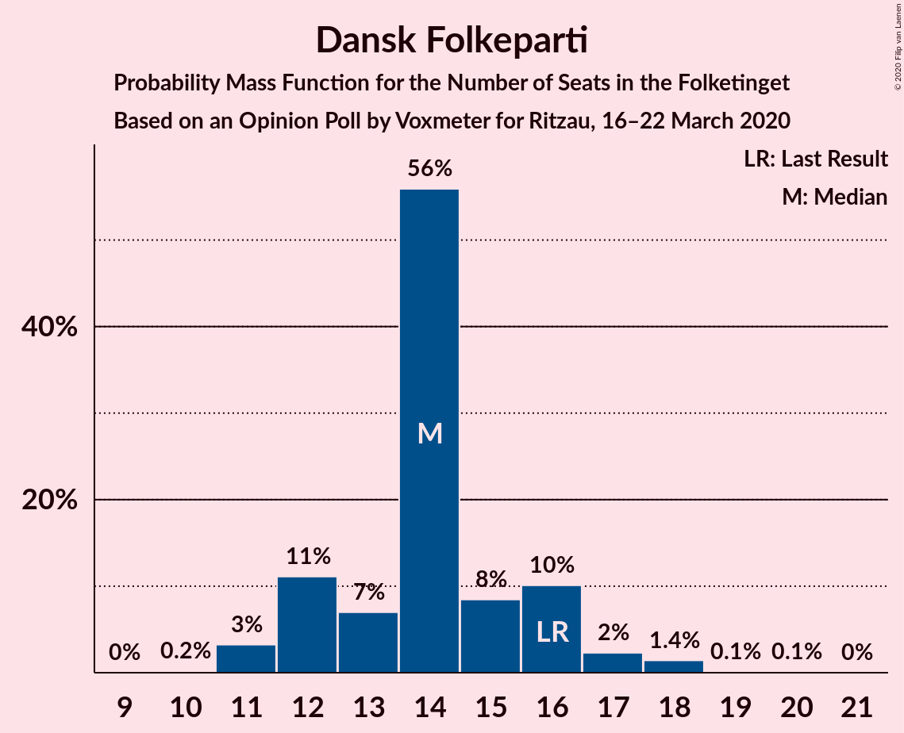

| Number of Seats | Probability | Accumulated | Special Marks |
|:---------------:|:-----------:|:-----------:|:-------------:|
| 10 | 0.2% | 100% |  |
| 11 | 3% | 99.8% |  |
| 12 | 11% | 97% |  |
| 13 | 7% | 85% |  |
| 14 | 56% | 78% | Median |
| 15 | 8% | 23% |  |
| 16 | 10% | 14% | Last Result |
| 17 | 2% | 4% |  |
| 18 | 1.4% | 2% |  |
| 19 | 0.1% | 0.2% |  |
| 20 | 0.1% | 0.1% |  |
| 21 | 0% | 0% |  |

### Enhedslisten–De Rød-Grønne

*For a full overview of the results for this party, see the [Enhedslisten–De Rød-Grønne](party-enhedslisten–derød-grønne.html) page.*

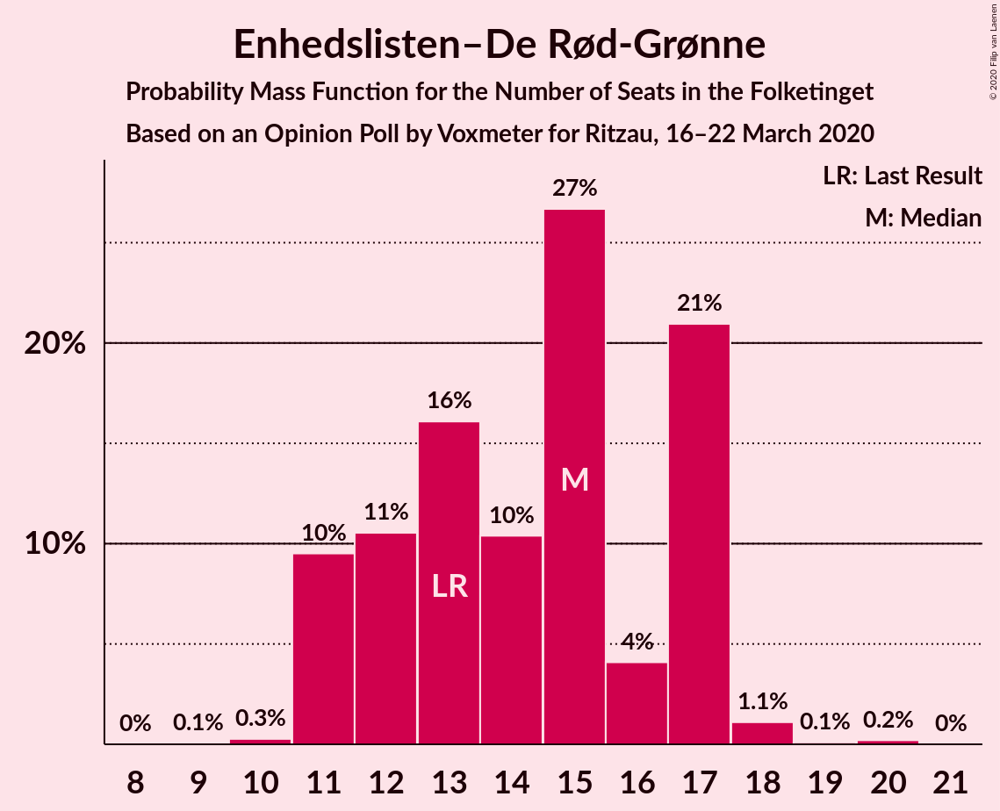

| Number of Seats | Probability | Accumulated | Special Marks |
|:---------------:|:-----------:|:-----------:|:-------------:|
| 9 | 0.1% | 100% |  |
| 10 | 0.3% | 99.9% |  |
| 11 | 10% | 99.7% |  |
| 12 | 11% | 90% |  |
| 13 | 16% | 80% | Last Result |
| 14 | 10% | 64% |  |
| 15 | 27% | 53% | Median |
| 16 | 4% | 26% |  |
| 17 | 21% | 22% |  |
| 18 | 1.1% | 1.4% |  |
| 19 | 0.1% | 0.3% |  |
| 20 | 0.2% | 0.2% |  |
| 21 | 0% | 0% |  |

### Socialistisk Folkeparti

*For a full overview of the results for this party, see the [Socialistisk Folkeparti](party-socialistiskfolkeparti.html) page.*

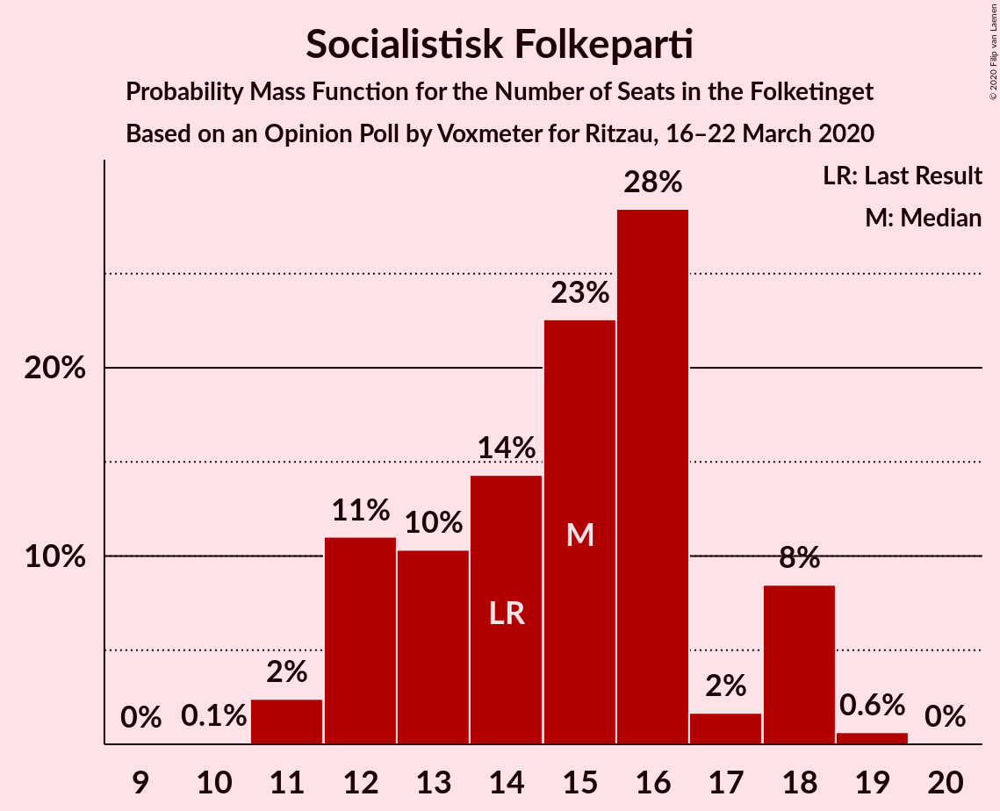

| Number of Seats | Probability | Accumulated | Special Marks |
|:---------------:|:-----------:|:-----------:|:-------------:|
| 10 | 0.1% | 100% |  |
| 11 | 2% | 99.9% |  |
| 12 | 11% | 97% |  |
| 13 | 10% | 86% |  |
| 14 | 14% | 76% | Last Result |
| 15 | 23% | 62% | Median |
| 16 | 28% | 39% |  |
| 17 | 2% | 11% |  |
| 18 | 8% | 9% |  |
| 19 | 0.6% | 0.7% |  |
| 20 | 0% | 0% |  |

### Det Konservative Folkeparti

*For a full overview of the results for this party, see the [Det Konservative Folkeparti](party-detkonservativefolkeparti.html) page.*

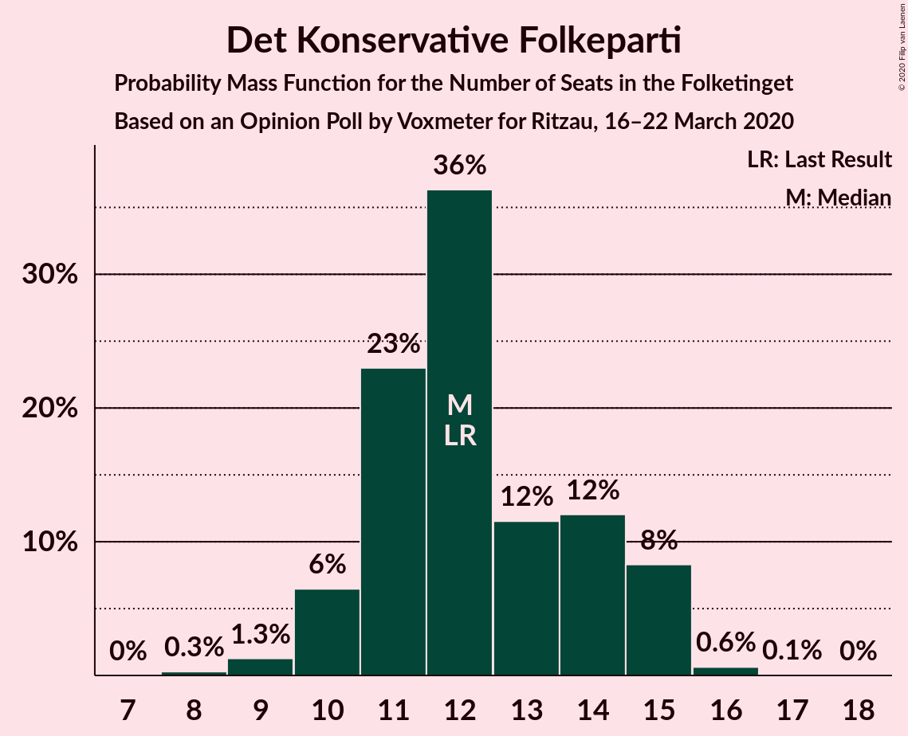

| Number of Seats | Probability | Accumulated | Special Marks |
|:---------------:|:-----------:|:-----------:|:-------------:|
| 8 | 0.3% | 100% |  |
| 9 | 1.3% | 99.7% |  |
| 10 | 6% | 98% |  |
| 11 | 23% | 92% |  |
| 12 | 36% | 69% | Last Result, Median |
| 13 | 12% | 33% |  |
| 14 | 12% | 21% |  |
| 15 | 8% | 9% |  |
| 16 | 0.6% | 0.7% |  |
| 17 | 0.1% | 0.1% |  |
| 18 | 0% | 0% |  |

### Liberal Alliance

*For a full overview of the results for this party, see the [Liberal Alliance](party-liberalalliance.html) page.*

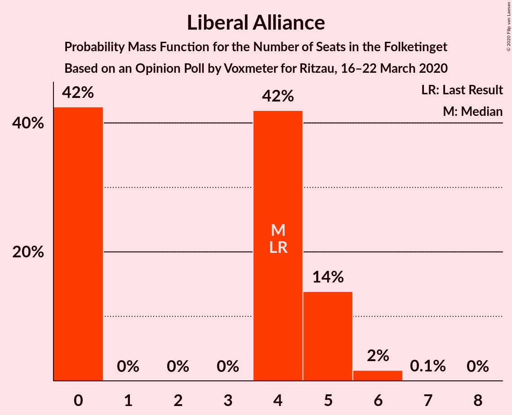

| Number of Seats | Probability | Accumulated | Special Marks |
|:---------------:|:-----------:|:-----------:|:-------------:|
| 0 | 42% | 100% |  |
| 1 | 0% | 58% |  |
| 2 | 0% | 58% |  |
| 3 | 0% | 58% |  |
| 4 | 42% | 58% | Last Result, Median |
| 5 | 14% | 16% |  |
| 6 | 2% | 2% |  |
| 7 | 0.1% | 0.1% |  |
| 8 | 0% | 0% |  |

### Nye Borgerlige

*For a full overview of the results for this party, see the [Nye Borgerlige](party-nyeborgerlige.html) page.*

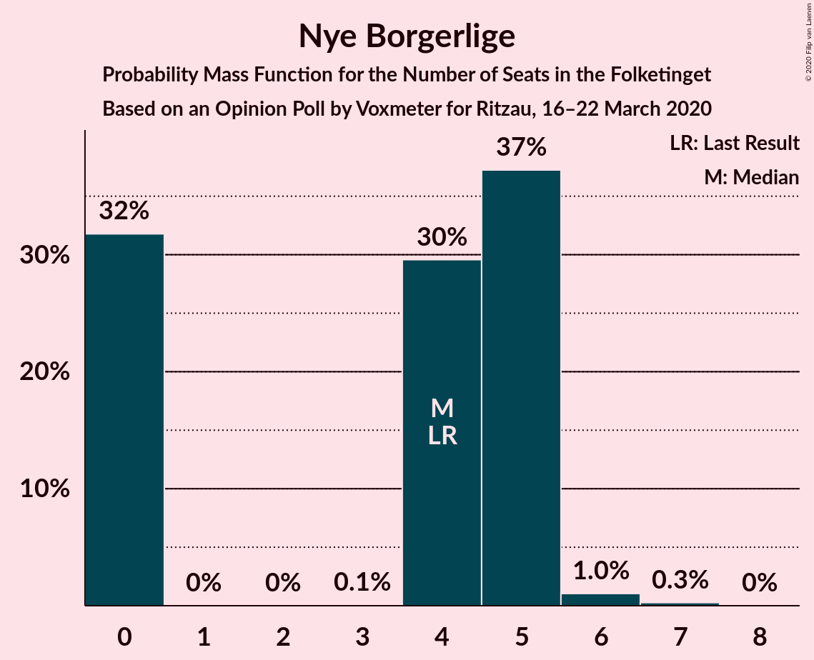

| Number of Seats | Probability | Accumulated | Special Marks |
|:---------------:|:-----------:|:-----------:|:-------------:|
| 0 | 32% | 100% |  |
| 1 | 0% | 68% |  |
| 2 | 0% | 68% |  |
| 3 | 0.1% | 68% |  |
| 4 | 30% | 68% | Last Result, Median |
| 5 | 37% | 39% |  |
| 6 | 1.0% | 1.3% |  |
| 7 | 0.3% | 0.3% |  |
| 8 | 0% | 0% |  |

### Stram Kurs

*For a full overview of the results for this party, see the [Stram Kurs](party-stramkurs.html) page.*

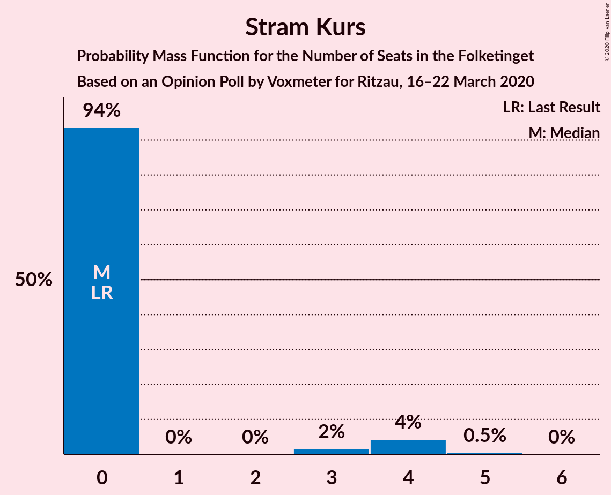

| Number of Seats | Probability | Accumulated | Special Marks |
|:---------------:|:-----------:|:-----------:|:-------------:|
| 0 | 94% | 100% | Last Result, Median |
| 1 | 0% | 6% |  |
| 2 | 0% | 6% |  |
| 3 | 2% | 6% |  |
| 4 | 4% | 5% |  |
| 5 | 0.5% | 0.5% |  |
| 6 | 0% | 0% |  |

### Alternativet

*For a full overview of the results for this party, see the [Alternativet](party-alternativet.html) page.*

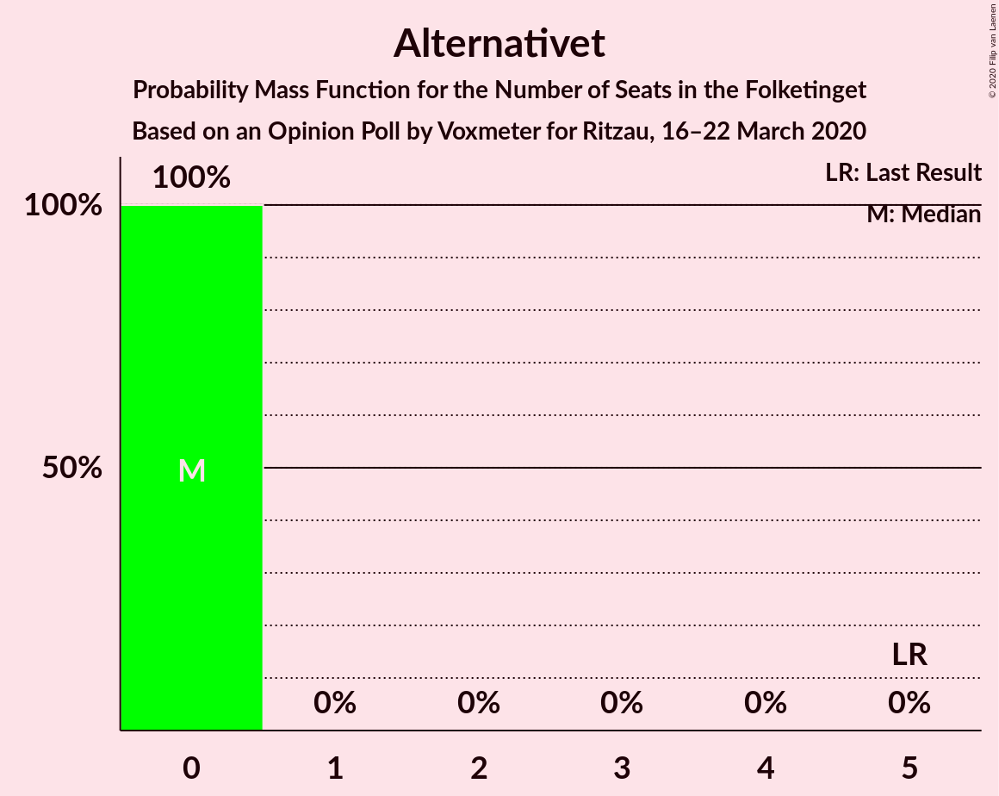

| Number of Seats | Probability | Accumulated | Special Marks |
|:---------------:|:-----------:|:-----------:|:-------------:|
| 0 | 100% | 100% | Median |
| 1 | 0% | 0% |  |
| 2 | 0% | 0% |  |
| 3 | 0% | 0% |  |
| 4 | 0% | 0% |  |
| 5 | 0% | 0% | Last Result |

### Klaus Riskær Pedersen

*For a full overview of the results for this party, see the [Klaus Riskær Pedersen](party-klausriskærpedersen.html) page.*

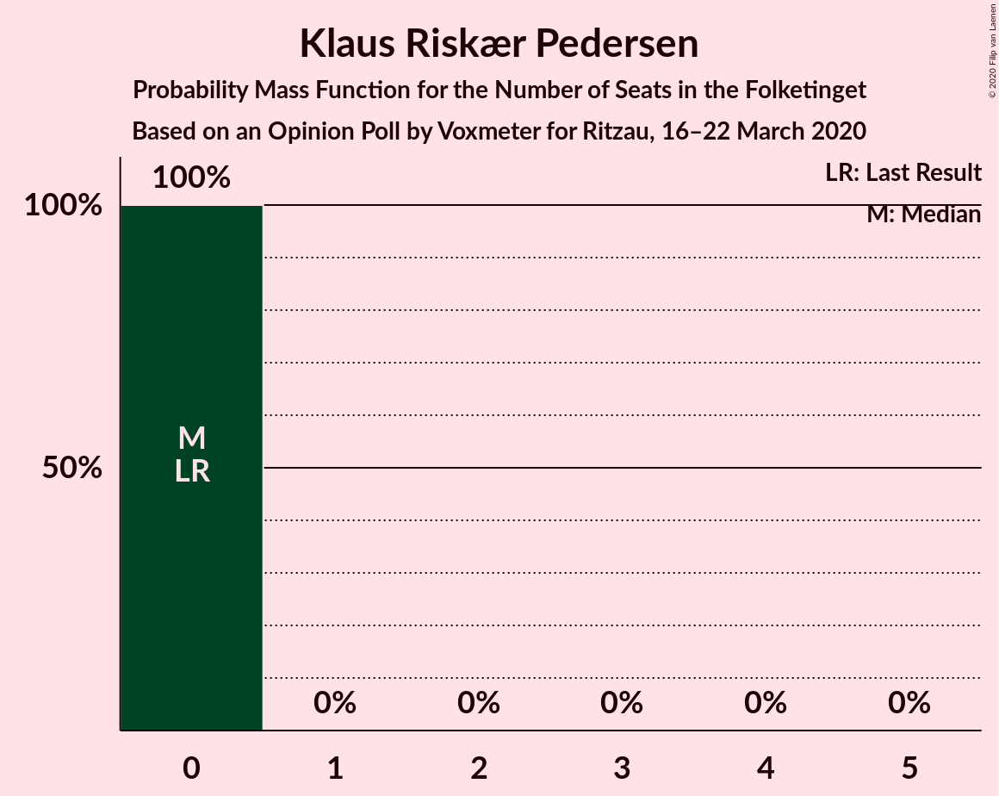

| Number of Seats | Probability | Accumulated | Special Marks |
|:---------------:|:-----------:|:-----------:|:-------------:|
| 0 | 100% | 100% | Last Result, Median |

## Coalitions

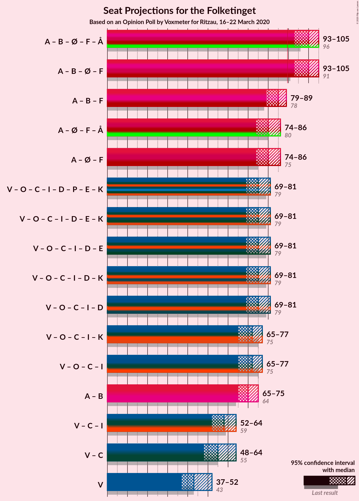

### Confidence Intervals

| Coalition | Last Result | Median | Majority? | 80% Confidence Interval | 90% Confidence Interval | 95% Confidence Interval | 99% Confidence Interval |
|:---------:|:-----------:|:------:|:---------:|:-----------------------:|:-----------------------:|:-----------------------:|:-----------------------:|
| Socialdemokraterne – Radikale Venstre – Enhedslisten–De Rød-Grønne – Socialistisk Folkeparti – Alternativet | 96 | 100 | 99.8% | 94–103 | 94–103 | 93–105 | 90–106 |
| Socialdemokraterne – Radikale Venstre – Enhedslisten–De Rød-Grønne – Socialistisk Folkeparti | 91 | 100 | 99.8% | 94–103 | 94–103 | 93–105 | 90–106 |
| Socialdemokraterne – Radikale Venstre – Socialistisk Folkeparti | 78 | 85 | 2% | 81–88 | 80–89 | 79–89 | 76–92 |
| Socialdemokraterne – Enhedslisten–De Rød-Grønne – Socialistisk Folkeparti – Alternativet | 80 | 80 | 0.2% | 75–86 | 75–86 | 74–86 | 72–87 |
| Socialdemokraterne – Enhedslisten–De Rød-Grønne – Socialistisk Folkeparti | 75 | 80 | 0.2% | 75–86 | 75–86 | 74–86 | 72–87 |
| Venstre – Dansk Folkeparti – Det Konservative Folkeparti – Liberal Alliance – Nye Borgerlige – Klaus Riskær Pedersen | 79 | 75 | 0% | 71–79 | 69–80 | 69–81 | 66–81 |
| Venstre – Dansk Folkeparti – Det Konservative Folkeparti – Liberal Alliance – Nye Borgerlige | 79 | 75 | 0% | 71–79 | 69–80 | 69–81 | 66–81 |
| Venstre – Dansk Folkeparti – Det Konservative Folkeparti – Liberal Alliance | 75 | 72 | 0% | 68–75 | 66–76 | 65–77 | 64–78 |
| Socialdemokraterne – Radikale Venstre | 64 | 70 | 0% | 67–73 | 66–73 | 65–75 | 63–76 |
| Venstre – Det Konservative Folkeparti – Liberal Alliance | 59 | 58 | 0% | 55–60 | 52–62 | 52–64 | 50–64 |
| Venstre – Det Konservative Folkeparti | 55 | 55 | 0% | 51–58 | 49–59 | 48–64 | 47–64 |
| Venstre | 43 | 43 | 0% | 39–47 | 38–47 | 37–52 | 37–52 |

### Socialdemokraterne – Radikale Venstre – Enhedslisten–De Rød-Grønne – Socialistisk Folkeparti – Alternativet

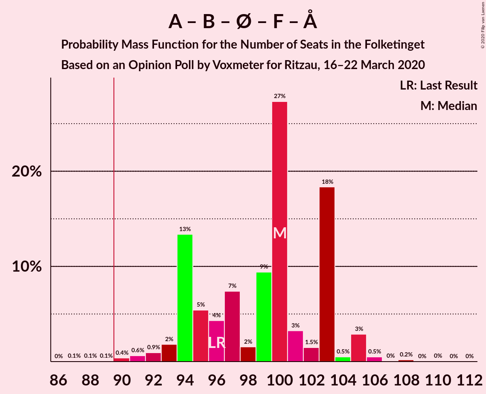

| Number of Seats | Probability | Accumulated | Special Marks |
|:---------------:|:-----------:|:-----------:|:-------------:|
| 87 | 0.1% | 100% |  |
| 88 | 0.1% | 99.9% |  |
| 89 | 0.1% | 99.8% |  |
| 90 | 0.4% | 99.8% | Majority |
| 91 | 0.6% | 99.4% |  |
| 92 | 0.9% | 98.8% |  |
| 93 | 2% | 98% |  |
| 94 | 13% | 96% |  |
| 95 | 5% | 83% |  |
| 96 | 4% | 77% | Last Result |
| 97 | 7% | 73% |  |
| 98 | 2% | 66% |  |
| 99 | 9% | 64% |  |
| 100 | 27% | 55% | Median |
| 101 | 3% | 27% |  |
| 102 | 1.5% | 24% |  |
| 103 | 18% | 23% |  |
| 104 | 0.5% | 4% |  |
| 105 | 3% | 4% |  |
| 106 | 0.5% | 0.8% |  |
| 107 | 0% | 0.3% |  |
| 108 | 0.2% | 0.2% |  |
| 109 | 0% | 0.1% |  |
| 110 | 0% | 0.1% |  |
| 111 | 0% | 0% |  |

### Socialdemokraterne – Radikale Venstre – Enhedslisten–De Rød-Grønne – Socialistisk Folkeparti

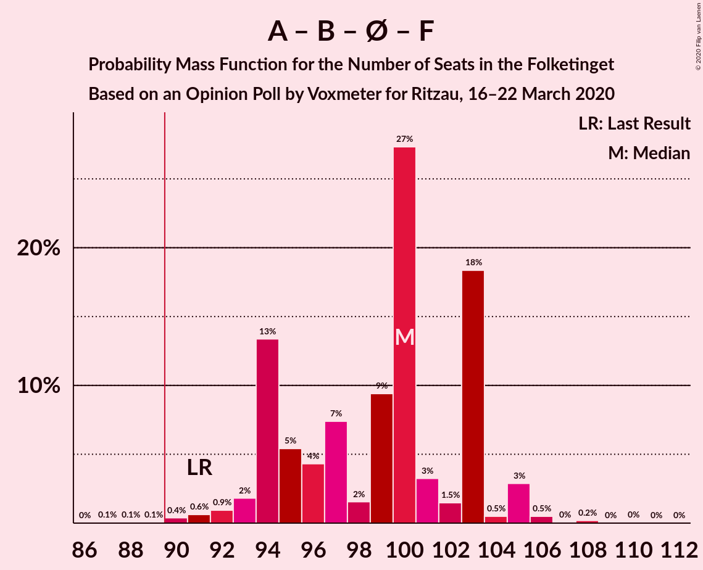

| Number of Seats | Probability | Accumulated | Special Marks |
|:---------------:|:-----------:|:-----------:|:-------------:|
| 87 | 0.1% | 100% |  |
| 88 | 0.1% | 99.9% |  |
| 89 | 0.1% | 99.8% |  |
| 90 | 0.4% | 99.8% | Majority |
| 91 | 0.6% | 99.4% | Last Result |
| 92 | 0.9% | 98.8% |  |
| 93 | 2% | 98% |  |
| 94 | 13% | 96% |  |
| 95 | 5% | 83% |  |
| 96 | 4% | 77% |  |
| 97 | 7% | 73% |  |
| 98 | 2% | 66% |  |
| 99 | 9% | 64% |  |
| 100 | 27% | 55% | Median |
| 101 | 3% | 27% |  |
| 102 | 1.5% | 24% |  |
| 103 | 18% | 23% |  |
| 104 | 0.5% | 4% |  |
| 105 | 3% | 4% |  |
| 106 | 0.5% | 0.8% |  |
| 107 | 0% | 0.3% |  |
| 108 | 0.2% | 0.2% |  |
| 109 | 0% | 0.1% |  |
| 110 | 0% | 0.1% |  |
| 111 | 0% | 0% |  |

### Socialdemokraterne – Radikale Venstre – Socialistisk Folkeparti

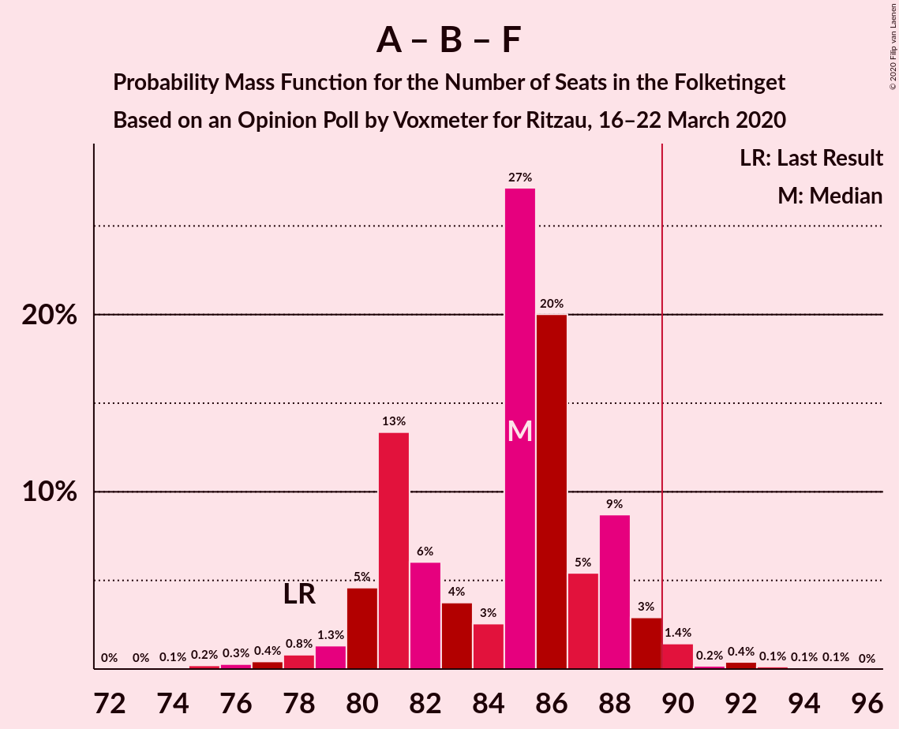

| Number of Seats | Probability | Accumulated | Special Marks |
|:---------------:|:-----------:|:-----------:|:-------------:|
| 73 | 0% | 100% |  |
| 74 | 0.1% | 99.9% |  |
| 75 | 0.2% | 99.9% |  |
| 76 | 0.3% | 99.7% |  |
| 77 | 0.4% | 99.4% |  |
| 78 | 0.8% | 99.0% | Last Result |
| 79 | 1.3% | 98% |  |
| 80 | 5% | 97% |  |
| 81 | 13% | 92% |  |
| 82 | 6% | 79% |  |
| 83 | 4% | 73% |  |
| 84 | 3% | 69% |  |
| 85 | 27% | 67% | Median |
| 86 | 20% | 39% |  |
| 87 | 5% | 19% |  |
| 88 | 9% | 14% |  |
| 89 | 3% | 5% |  |
| 90 | 1.4% | 2% | Majority |
| 91 | 0.2% | 0.9% |  |
| 92 | 0.4% | 0.7% |  |
| 93 | 0.1% | 0.3% |  |
| 94 | 0.1% | 0.1% |  |
| 95 | 0.1% | 0.1% |  |
| 96 | 0% | 0% |  |

### Socialdemokraterne – Enhedslisten–De Rød-Grønne – Socialistisk Folkeparti – Alternativet

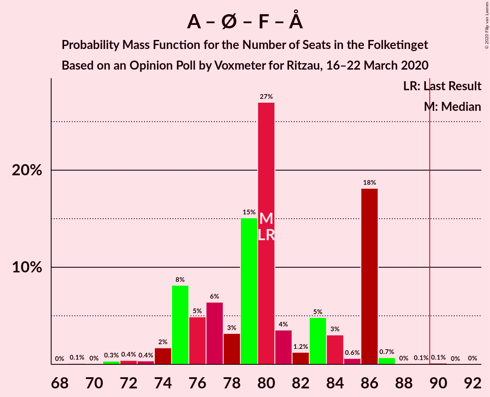

| Number of Seats | Probability | Accumulated | Special Marks |
|:---------------:|:-----------:|:-----------:|:-------------:|
| 69 | 0.1% | 100% |  |
| 70 | 0% | 99.9% |  |
| 71 | 0.3% | 99.9% |  |
| 72 | 0.4% | 99.5% |  |
| 73 | 0.4% | 99.1% |  |
| 74 | 2% | 98.8% |  |
| 75 | 8% | 97% |  |
| 76 | 5% | 89% |  |
| 77 | 6% | 84% |  |
| 78 | 3% | 78% |  |
| 79 | 15% | 74% |  |
| 80 | 27% | 59% | Last Result |
| 81 | 4% | 32% | Median |
| 82 | 1.2% | 29% |  |
| 83 | 5% | 28% |  |
| 84 | 3% | 23% |  |
| 85 | 0.6% | 20% |  |
| 86 | 18% | 19% |  |
| 87 | 0.7% | 1.0% |  |
| 88 | 0% | 0.3% |  |
| 89 | 0.1% | 0.2% |  |
| 90 | 0.1% | 0.2% | Majority |
| 91 | 0% | 0% |  |

### Socialdemokraterne – Enhedslisten–De Rød-Grønne – Socialistisk Folkeparti

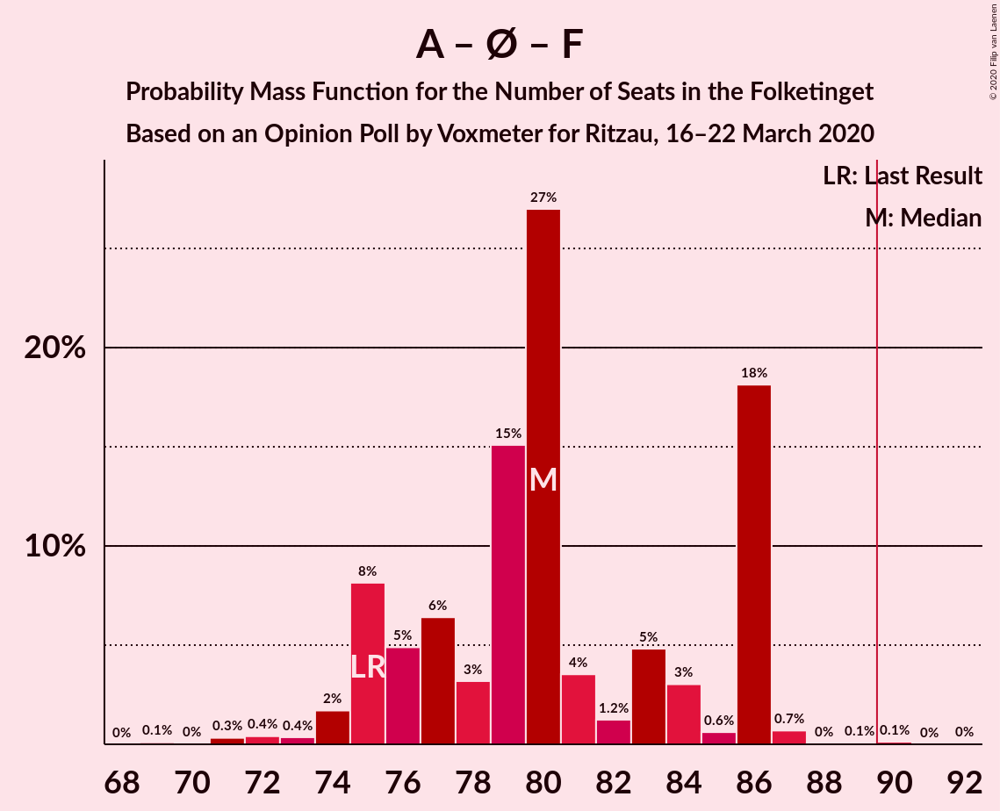

| Number of Seats | Probability | Accumulated | Special Marks |
|:---------------:|:-----------:|:-----------:|:-------------:|
| 69 | 0.1% | 100% |  |
| 70 | 0% | 99.9% |  |
| 71 | 0.3% | 99.9% |  |
| 72 | 0.4% | 99.5% |  |
| 73 | 0.4% | 99.1% |  |
| 74 | 2% | 98.8% |  |
| 75 | 8% | 97% | Last Result |
| 76 | 5% | 89% |  |
| 77 | 6% | 84% |  |
| 78 | 3% | 78% |  |
| 79 | 15% | 74% |  |
| 80 | 27% | 59% |  |
| 81 | 4% | 32% | Median |
| 82 | 1.2% | 29% |  |
| 83 | 5% | 28% |  |
| 84 | 3% | 23% |  |
| 85 | 0.6% | 20% |  |
| 86 | 18% | 19% |  |
| 87 | 0.7% | 1.0% |  |
| 88 | 0% | 0.3% |  |
| 89 | 0.1% | 0.2% |  |
| 90 | 0.1% | 0.2% | Majority |
| 91 | 0% | 0% |  |

### Venstre – Dansk Folkeparti – Det Konservative Folkeparti – Liberal Alliance – Nye Borgerlige – Klaus Riskær Pedersen

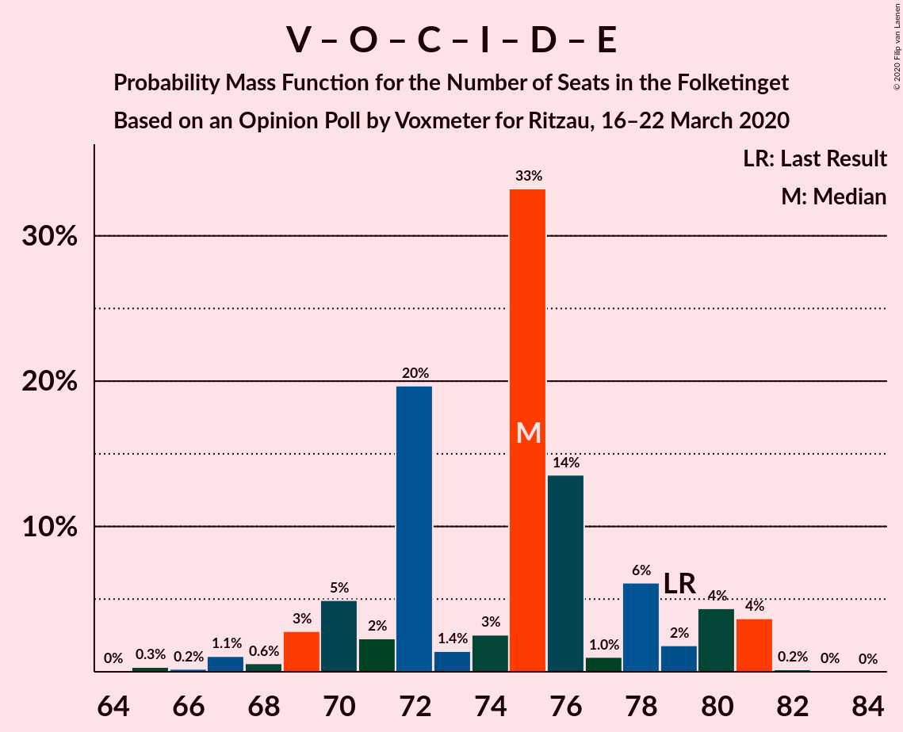

| Number of Seats | Probability | Accumulated | Special Marks |
|:---------------:|:-----------:|:-----------:|:-------------:|
| 64 | 0% | 100% |  |
| 65 | 0.3% | 99.9% |  |
| 66 | 0.2% | 99.6% |  |
| 67 | 1.1% | 99.4% |  |
| 68 | 0.6% | 98% |  |
| 69 | 3% | 98% |  |
| 70 | 5% | 95% |  |
| 71 | 2% | 90% |  |
| 72 | 20% | 88% |  |
| 73 | 1.4% | 68% |  |
| 74 | 3% | 67% |  |
| 75 | 33% | 64% |  |
| 76 | 14% | 31% |  |
| 77 | 1.0% | 17% | Median |
| 78 | 6% | 16% |  |
| 79 | 2% | 10% | Last Result |
| 80 | 4% | 8% |  |
| 81 | 4% | 4% |  |
| 82 | 0.2% | 0.2% |  |
| 83 | 0% | 0.1% |  |
| 84 | 0% | 0% |  |

### Venstre – Dansk Folkeparti – Det Konservative Folkeparti – Liberal Alliance – Nye Borgerlige

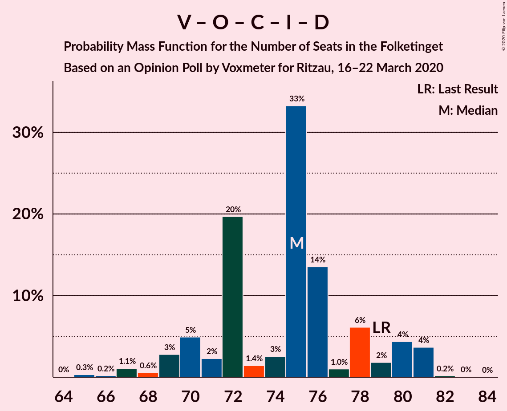

| Number of Seats | Probability | Accumulated | Special Marks |
|:---------------:|:-----------:|:-----------:|:-------------:|
| 64 | 0% | 100% |  |
| 65 | 0.3% | 99.9% |  |
| 66 | 0.2% | 99.6% |  |
| 67 | 1.1% | 99.4% |  |
| 68 | 0.6% | 98% |  |
| 69 | 3% | 98% |  |
| 70 | 5% | 95% |  |
| 71 | 2% | 90% |  |
| 72 | 20% | 88% |  |
| 73 | 1.4% | 68% |  |
| 74 | 3% | 67% |  |
| 75 | 33% | 64% |  |
| 76 | 14% | 31% |  |
| 77 | 1.0% | 17% | Median |
| 78 | 6% | 16% |  |
| 79 | 2% | 10% | Last Result |
| 80 | 4% | 8% |  |
| 81 | 4% | 4% |  |
| 82 | 0.2% | 0.2% |  |
| 83 | 0% | 0.1% |  |
| 84 | 0% | 0% |  |

### Venstre – Dansk Folkeparti – Det Konservative Folkeparti – Liberal Alliance

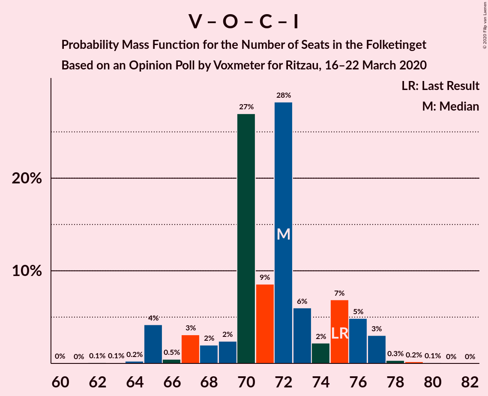

| Number of Seats | Probability | Accumulated | Special Marks |
|:---------------:|:-----------:|:-----------:|:-------------:|
| 60 | 0% | 100% |  |
| 61 | 0% | 99.9% |  |
| 62 | 0.1% | 99.9% |  |
| 63 | 0.1% | 99.8% |  |
| 64 | 0.2% | 99.7% |  |
| 65 | 4% | 99.5% |  |
| 66 | 0.5% | 95% |  |
| 67 | 3% | 95% |  |
| 68 | 2% | 92% |  |
| 69 | 2% | 90% |  |
| 70 | 27% | 87% |  |
| 71 | 9% | 60% |  |
| 72 | 28% | 52% |  |
| 73 | 6% | 24% | Median |
| 74 | 2% | 18% |  |
| 75 | 7% | 15% | Last Result |
| 76 | 5% | 9% |  |
| 77 | 3% | 4% |  |
| 78 | 0.3% | 0.6% |  |
| 79 | 0.2% | 0.3% |  |
| 80 | 0.1% | 0.1% |  |
| 81 | 0% | 0% |  |

### Socialdemokraterne – Radikale Venstre

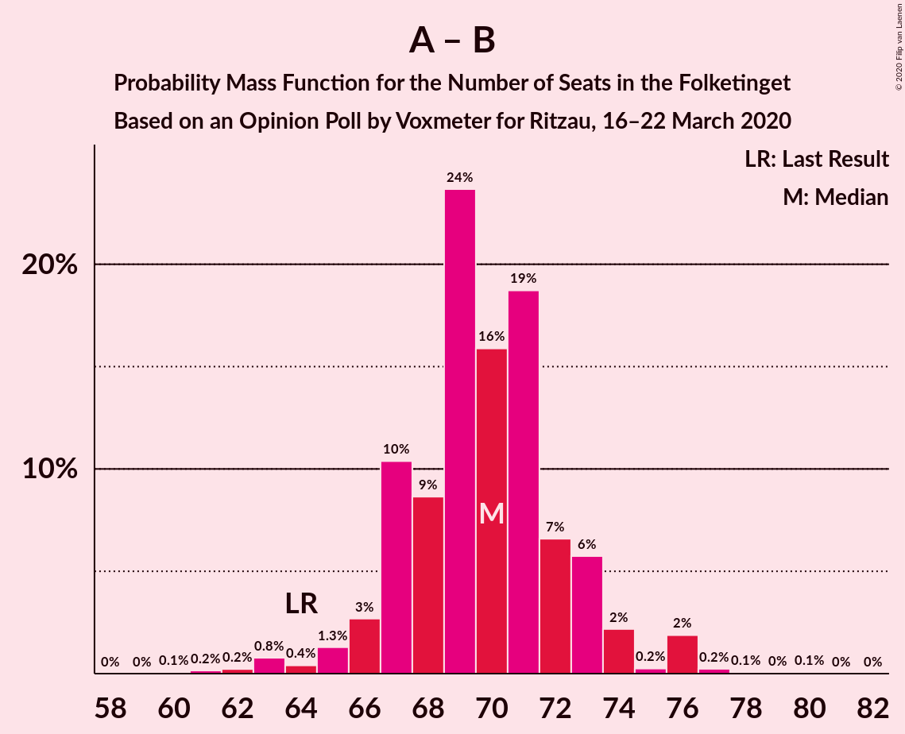

| Number of Seats | Probability | Accumulated | Special Marks |
|:---------------:|:-----------:|:-----------:|:-------------:|
| 60 | 0.1% | 100% |  |
| 61 | 0.2% | 99.9% |  |
| 62 | 0.2% | 99.8% |  |
| 63 | 0.8% | 99.6% |  |
| 64 | 0.4% | 98.8% | Last Result |
| 65 | 1.3% | 98% |  |
| 66 | 3% | 97% |  |
| 67 | 10% | 94% |  |
| 68 | 9% | 84% |  |
| 69 | 24% | 75% |  |
| 70 | 16% | 52% | Median |
| 71 | 19% | 36% |  |
| 72 | 7% | 17% |  |
| 73 | 6% | 10% |  |
| 74 | 2% | 5% |  |
| 75 | 0.2% | 3% |  |
| 76 | 2% | 2% |  |
| 77 | 0.2% | 0.4% |  |
| 78 | 0.1% | 0.2% |  |
| 79 | 0% | 0.1% |  |
| 80 | 0.1% | 0.1% |  |
| 81 | 0% | 0% |  |

### Venstre – Det Konservative Folkeparti – Liberal Alliance

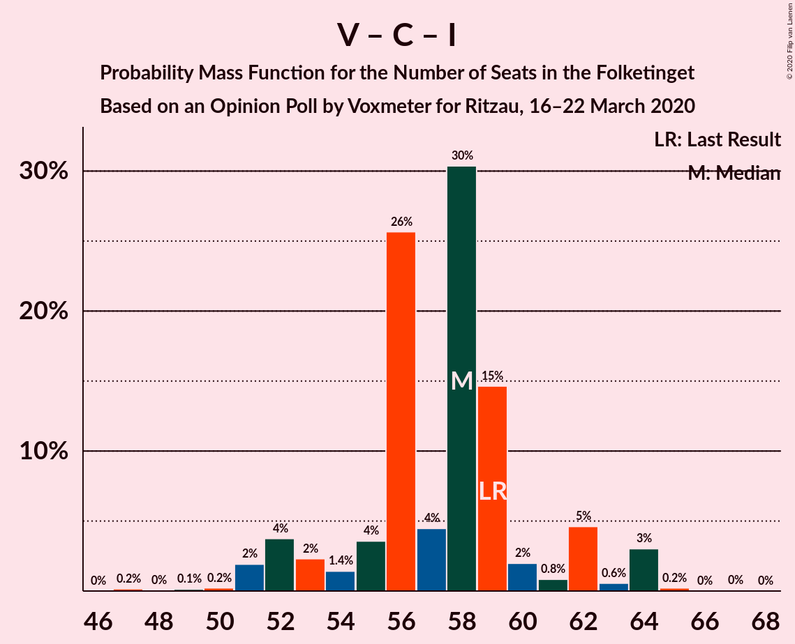

| Number of Seats | Probability | Accumulated | Special Marks |
|:---------------:|:-----------:|:-----------:|:-------------:|
| 47 | 0.2% | 100% |  |
| 48 | 0% | 99.8% |  |
| 49 | 0.1% | 99.8% |  |
| 50 | 0.2% | 99.7% |  |
| 51 | 2% | 99.4% |  |
| 52 | 4% | 98% |  |
| 53 | 2% | 94% |  |
| 54 | 1.4% | 91% |  |
| 55 | 4% | 90% |  |
| 56 | 26% | 86% |  |
| 57 | 4% | 61% |  |
| 58 | 30% | 56% |  |
| 59 | 15% | 26% | Last Result, Median |
| 60 | 2% | 11% |  |
| 61 | 0.8% | 9% |  |
| 62 | 5% | 8% |  |
| 63 | 0.6% | 4% |  |
| 64 | 3% | 3% |  |
| 65 | 0.2% | 0.3% |  |
| 66 | 0% | 0.1% |  |
| 67 | 0% | 0% |  |

### Venstre – Det Konservative Folkeparti

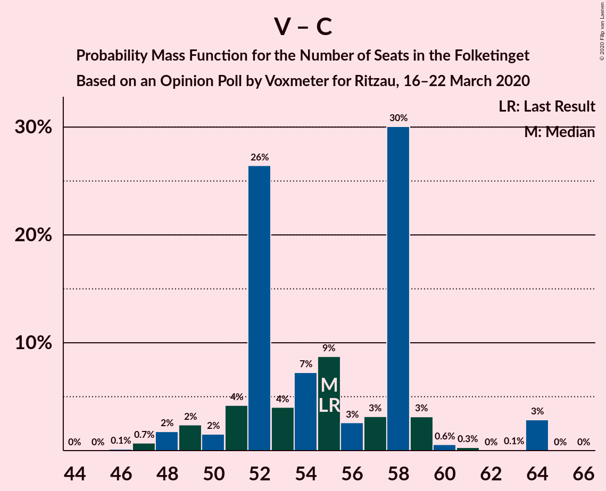

| Number of Seats | Probability | Accumulated | Special Marks |
|:---------------:|:-----------:|:-----------:|:-------------:|
| 46 | 0.1% | 100% |  |
| 47 | 0.7% | 99.8% |  |
| 48 | 2% | 99.1% |  |
| 49 | 2% | 97% |  |
| 50 | 2% | 95% |  |
| 51 | 4% | 93% |  |
| 52 | 26% | 89% |  |
| 53 | 4% | 63% |  |
| 54 | 7% | 59% |  |
| 55 | 9% | 52% | Last Result, Median |
| 56 | 3% | 43% |  |
| 57 | 3% | 40% |  |
| 58 | 30% | 37% |  |
| 59 | 3% | 7% |  |
| 60 | 0.6% | 4% |  |
| 61 | 0.3% | 3% |  |
| 62 | 0% | 3% |  |
| 63 | 0.1% | 3% |  |
| 64 | 3% | 3% |  |
| 65 | 0% | 0% |  |

### Venstre

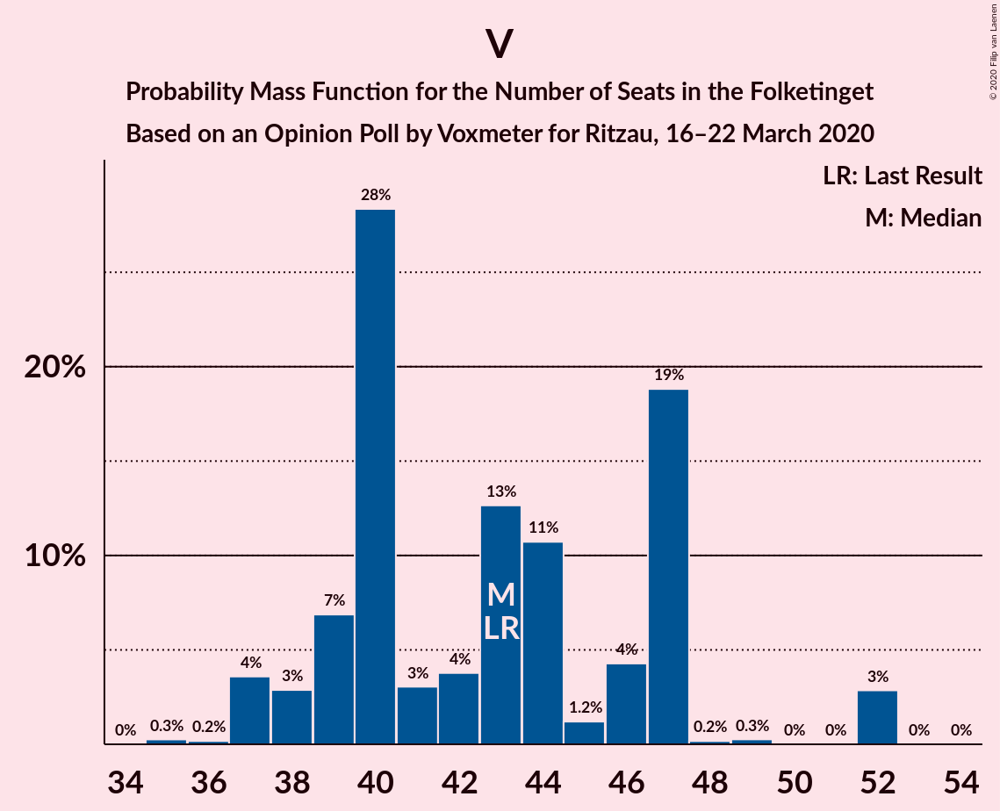

| Number of Seats | Probability | Accumulated | Special Marks |
|:---------------:|:-----------:|:-----------:|:-------------:|
| 35 | 0.3% | 100% |  |
| 36 | 0.2% | 99.7% |  |
| 37 | 4% | 99.5% |  |
| 38 | 3% | 96% |  |
| 39 | 7% | 93% |  |
| 40 | 28% | 86% |  |
| 41 | 3% | 58% |  |
| 42 | 4% | 55% |  |
| 43 | 13% | 51% | Last Result, Median |
| 44 | 11% | 38% |  |
| 45 | 1.2% | 28% |  |
| 46 | 4% | 26% |  |
| 47 | 19% | 22% |  |
| 48 | 0.2% | 3% |  |
| 49 | 0.3% | 3% |  |
| 50 | 0% | 3% |  |
| 51 | 0% | 3% |  |
| 52 | 3% | 3% |  |
| 53 | 0% | 0% |  |

## Technical Information

### Opinion Poll

+ **Polling firm:** Voxmeter
+ **Commissioner(s):** Ritzau
+ **Fieldwork period:** 16–22 March 2020

### Calculations

+ **Sample size:** 1055
+ **Simulations done:** 1,048,576
+ **Error estimate:** 2.94%

