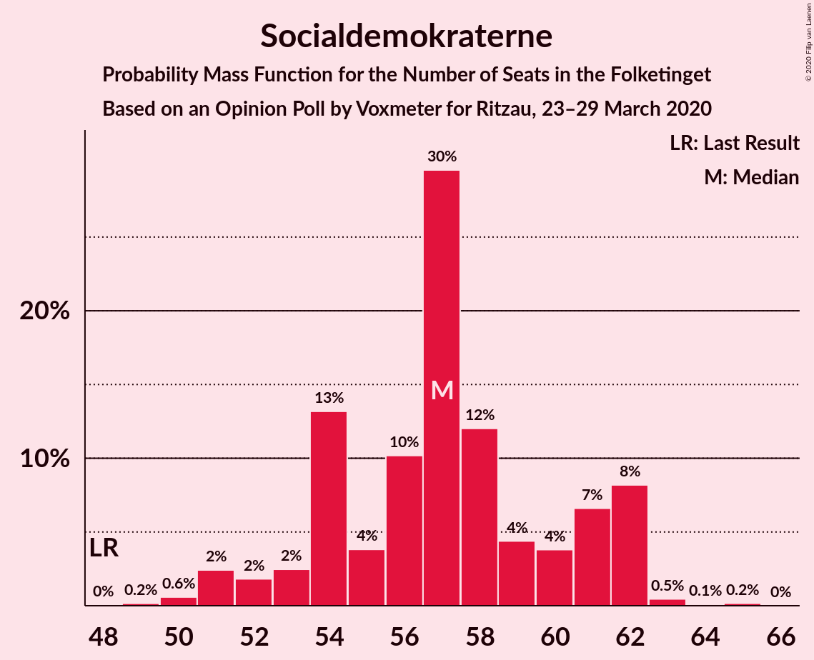
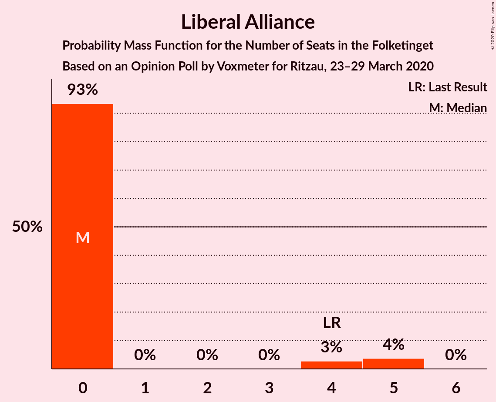

# Opinion Poll by Voxmeter for Ritzau, 23–29 March 2020

<a href="#voting-intentions">Voting Intentions</a> | <a href="#seats">Seats</a> | <a href="#coalitions">Coalitions</a> | <a href="#technical-information">Technical Information</a>

## Voting Intentions

### Confidence Intervals

| Party | Last Result | Poll Result | 80% Confidence Interval | 90% Confidence Interval | 95% Confidence Interval | 99% Confidence Interval |
|:-----:|:-----------:|:-----------:|:-----------------------:|:-----------------------:|:-----------------------:|:-----------------------:|
| Socialdemokraterne | 25.9% | 31.5% | 29.7–33.3% |29.2–33.9% |28.7–34.3% |27.9–35.2% |
| Venstre | 23.4% | 22.2% | 20.7–23.9% |20.2–24.4% |19.8–24.8% |19.1–25.7% |
| Radikale Venstre | 8.6% | 9.2% | 8.2–10.5% |7.9–10.8% |7.7–11.1% |7.2–11.8% |
| Dansk Folkeparti | 8.7% | 8.1% | 7.1–9.3% |6.9–9.6% |6.6–9.9% |6.2–10.5% |
| Socialistisk Folkeparti | 7.7% | 7.8% | 6.9–9.0% |6.6–9.3% |6.4–9.6% |5.9–10.2% |
| Enhedslisten–De Rød-Grønne | 6.9% | 7.4% | 6.4–8.5% |6.2–8.8% |6.0–9.1% |5.5–9.7% |
| Det Konservative Folkeparti | 6.6% | 6.3% | 5.4–7.3% |5.2–7.6% |5.0–7.9% |4.6–8.4% |
| Nye Borgerlige | 2.4% | 2.5% | 2.0–3.3% |1.9–3.5% |1.7–3.7% |1.5–4.0% |
| Liberal Alliance | 2.3% | 1.5% | 1.1–2.1% |1.0–2.3% |0.9–2.4% |0.8–2.7% |
| Stram Kurs | 1.8% | 1.0% | 0.7–1.6% |0.6–1.7% |0.6–1.8% |0.5–2.1% |
| Alternativet | 3.0% | 0.6% | 0.4–1.0% |0.3–1.1% |0.3–1.2% |0.2–1.5% |

*Note:* The poll result column reflects the actual value used in the calculations. Published results may vary slightly, and in addition be rounded to fewer digits.

## Seats

### Confidence Intervals

| Party | Last Result | Median | 80% Confidence Interval | 90% Confidence Interval | 95% Confidence Interval | 99% Confidence Interval |
|:-----:|:-----------:|:------:|:-----------------------:|:-----------------------:|:-----------------------:|:-----------------------:|
| <a href="#socialdemokraterne">Socialdemokraterne</a> | 48 | 56 | 53–60 |51–60 |51–61 |50–63 |
| <a href="#venstre">Venstre</a> | 43 | 40 | 38–42 |37–43 |35–45 |34–46 |
| <a href="#radikale-venstre">Radikale Venstre</a> | 16 | 15 | 15–19 |14–19 |14–19 |13–21 |
| <a href="#dansk-folkeparti">Dansk Folkeparti</a> | 16 | 15 | 13–18 |13–19 |12–19 |11–19 |
| <a href="#socialistisk-folkeparti">Socialistisk Folkeparti</a> | 14 | 14 | 13–16 |12–16 |12–17 |11–18 |
| <a href="#enhedslisten–de-rød-grønne">Enhedslisten–De Rød-Grønne</a> | 13 | 14 | 12–16 |11–16 |11–16 |10–18 |
| <a href="#det-konservative-folkeparti">Det Konservative Folkeparti</a> | 12 | 11 | 10–13 |9–13 |9–14 |8–15 |
| <a href="#nye-borgerlige">Nye Borgerlige</a> | 4 | 5 | 4–6 |0–6 |0–7 |0–7 |
| <a href="#liberal-alliance">Liberal Alliance</a> | 4 | 0 | 0–4 |0–5 |0–5 |0–5 |
| <a href="#stram-kurs">Stram Kurs</a> | 0 | 0 | 0 |0 |0 |0–4 |
| <a href="#alternativet">Alternativet</a> | 5 | 0 | 0 |0 |0 |0 |

### Socialdemokraterne

*For a full overview of the results for this party, see the [Socialdemokraterne](party-socialdemokraterne.html) page.*

| Number of Seats | Probability | Accumulated | Special Marks |
|:---------------:|:-----------:|:-----------:|:-------------:|
| 48 | 0% | 100% | Last Result |
| 49 | 0.3% | 99.9% |  |
| 50 | 0.4% | 99.6% |  |
| 51 | 6% | 99.2% |  |
| 52 | 1.1% | 93% |  |
| 53 | 2% | 92% |  |
| 54 | 13% | 90% |  |
| 55 | 3% | 76% |  |
| 56 | 24% | 74% | Median |
| 57 | 10% | 49% |  |
| 58 | 21% | 39% |  |
| 59 | 5% | 18% |  |
| 60 | 9% | 13% |  |
| 61 | 3% | 4% |  |
| 62 | 0.4% | 2% |  |
| 63 | 0.9% | 1.3% |  |
| 64 | 0.2% | 0.4% |  |
| 65 | 0.3% | 0.3% |  |
| 66 | 0% | 0% |  |

### Venstre

*For a full overview of the results for this party, see the [Venstre](party-venstre.html) page.*

| Number of Seats | Probability | Accumulated | Special Marks |
|:---------------:|:-----------:|:-----------:|:-------------:|
| 33 | 0.1% | 100% |  |
| 34 | 0.8% | 99.9% |  |
| 35 | 2% | 99.1% |  |
| 36 | 0.7% | 97% |  |
| 37 | 2% | 96% |  |
| 38 | 6% | 94% |  |
| 39 | 14% | 88% |  |
| 40 | 31% | 74% | Median |
| 41 | 7% | 43% |  |
| 42 | 30% | 36% |  |
| 43 | 2% | 6% | Last Result |
| 44 | 1.1% | 4% |  |
| 45 | 2% | 3% |  |
| 46 | 0.7% | 0.9% |  |
| 47 | 0.1% | 0.2% |  |
| 48 | 0% | 0% |  |

### Radikale Venstre

*For a full overview of the results for this party, see the [Radikale Venstre](party-radikalevenstre.html) page.*

| Number of Seats | Probability | Accumulated | Special Marks |
|:---------------:|:-----------:|:-----------:|:-------------:|
| 12 | 0.1% | 100% |  |
| 13 | 2% | 99.9% |  |
| 14 | 6% | 98% |  |
| 15 | 45% | 92% | Median |
| 16 | 16% | 47% | Last Result |
| 17 | 7% | 32% |  |
| 18 | 9% | 25% |  |
| 19 | 14% | 16% |  |
| 20 | 0.9% | 2% |  |
| 21 | 1.0% | 1.3% |  |
| 22 | 0.2% | 0.3% |  |
| 23 | 0.1% | 0.1% |  |
| 24 | 0% | 0% |  |

### Dansk Folkeparti

*For a full overview of the results for this party, see the [Dansk Folkeparti](party-danskfolkeparti.html) page.*

| Number of Seats | Probability | Accumulated | Special Marks |
|:---------------:|:-----------:|:-----------:|:-------------:|
| 10 | 0.1% | 100% |  |
| 11 | 0.8% | 99.9% |  |
| 12 | 3% | 99.1% |  |
| 13 | 9% | 96% |  |
| 14 | 33% | 87% |  |
| 15 | 11% | 54% | Median |
| 16 | 21% | 43% | Last Result |
| 17 | 9% | 22% |  |
| 18 | 3% | 13% |  |
| 19 | 9% | 9% |  |
| 20 | 0.2% | 0.2% |  |
| 21 | 0% | 0% |  |

### Socialistisk Folkeparti

*For a full overview of the results for this party, see the [Socialistisk Folkeparti](party-socialistiskfolkeparti.html) page.*

| Number of Seats | Probability | Accumulated | Special Marks |
|:---------------:|:-----------:|:-----------:|:-------------:|
| 10 | 0.3% | 100% |  |
| 11 | 0.7% | 99.7% |  |
| 12 | 7% | 99.0% |  |
| 13 | 35% | 92% |  |
| 14 | 18% | 57% | Last Result, Median |
| 15 | 10% | 39% |  |
| 16 | 26% | 29% |  |
| 17 | 2% | 3% |  |
| 18 | 1.3% | 2% |  |
| 19 | 0.4% | 0.4% |  |
| 20 | 0% | 0% |  |

### Enhedslisten–De Rød-Grønne

*For a full overview of the results for this party, see the [Enhedslisten–De Rød-Grønne](party-enhedslisten–derød-grønne.html) page.*

| Number of Seats | Probability | Accumulated | Special Marks |
|:---------------:|:-----------:|:-----------:|:-------------:|
| 9 | 0.3% | 100% |  |
| 10 | 2% | 99.7% |  |
| 11 | 7% | 98% |  |
| 12 | 10% | 91% |  |
| 13 | 9% | 81% | Last Result |
| 14 | 47% | 72% | Median |
| 15 | 7% | 25% |  |
| 16 | 18% | 19% |  |
| 17 | 0.3% | 1.1% |  |
| 18 | 0.6% | 0.8% |  |
| 19 | 0.1% | 0.1% |  |
| 20 | 0% | 0% |  |

### Det Konservative Folkeparti

*For a full overview of the results for this party, see the [Det Konservative Folkeparti](party-detkonservativefolkeparti.html) page.*

| Number of Seats | Probability | Accumulated | Special Marks |
|:---------------:|:-----------:|:-----------:|:-------------:|
| 8 | 1.0% | 100% |  |
| 9 | 5% | 99.0% |  |
| 10 | 9% | 94% |  |
| 11 | 36% | 84% | Median |
| 12 | 20% | 49% | Last Result |
| 13 | 25% | 29% |  |
| 14 | 2% | 3% |  |
| 15 | 0.8% | 1.0% |  |
| 16 | 0.1% | 0.2% |  |
| 17 | 0.1% | 0.1% |  |
| 18 | 0% | 0% |  |

### Nye Borgerlige

*For a full overview of the results for this party, see the [Nye Borgerlige](party-nyeborgerlige.html) page.*

| Number of Seats | Probability | Accumulated | Special Marks |
|:---------------:|:-----------:|:-----------:|:-------------:|
| 0 | 8% | 100% |  |
| 1 | 0% | 92% |  |
| 2 | 0% | 92% |  |
| 3 | 0% | 92% |  |
| 4 | 21% | 92% | Last Result |
| 5 | 36% | 71% | Median |
| 6 | 30% | 35% |  |
| 7 | 4% | 5% |  |
| 8 | 0.2% | 0.3% |  |
| 9 | 0% | 0% |  |

### Liberal Alliance

*For a full overview of the results for this party, see the [Liberal Alliance](party-liberalalliance.html) page.*

| Number of Seats | Probability | Accumulated | Special Marks |
|:---------------:|:-----------:|:-----------:|:-------------:|
| 0 | 89% | 100% | Median |
| 1 | 0% | 11% |  |
| 2 | 0% | 11% |  |
| 3 | 0% | 11% |  |
| 4 | 4% | 11% | Last Result |
| 5 | 7% | 7% |  |
| 6 | 0% | 0% |  |

### Stram Kurs

*For a full overview of the results for this party, see the [Stram Kurs](party-stramkurs.html) page.*

| Number of Seats | Probability | Accumulated | Special Marks |
|:---------------:|:-----------:|:-----------:|:-------------:|
| 0 | 99.2% | 100% | Last Result, Median |
| 1 | 0% | 0.8% |  |
| 2 | 0% | 0.8% |  |
| 3 | 0.2% | 0.8% |  |
| 4 | 0.5% | 0.6% |  |
| 5 | 0.1% | 0.1% |  |
| 6 | 0% | 0% |  |

### Alternativet

*For a full overview of the results for this party, see the [Alternativet](party-alternativet.html) page.*

| Number of Seats | Probability | Accumulated | Special Marks |
|:---------------:|:-----------:|:-----------:|:-------------:|
| 0 | 100% | 100% | Median |
| 1 | 0% | 0% |  |
| 2 | 0% | 0% |  |
| 3 | 0% | 0% |  |
| 4 | 0% | 0% |  |
| 5 | 0% | 0% | Last Result |

## Coalitions

### Confidence Intervals

| Coalition | Last Result | Median | Majority? | 80% Confidence Interval | 90% Confidence Interval | 95% Confidence Interval | 99% Confidence Interval |
|:---------:|:-----------:|:------:|:---------:|:-----------------------:|:-----------------------:|:-----------------------:|:-----------------------:|
| Socialdemokraterne – Radikale Venstre – Socialistisk Folkeparti – Enhedslisten–De Rød-Grønne – Alternativet | 96 | 101 | 100% | 98–104 | 96–105 | 96–107 | 95–110 |
| Socialdemokraterne – Radikale Venstre – Socialistisk Folkeparti – Enhedslisten–De Rød-Grønne | 91 | 101 | 100% | 98–104 | 96–105 | 96–107 | 95–110 |
| Socialdemokraterne – Radikale Venstre – Socialistisk Folkeparti | 78 | 87 | 19% | 83–90 | 82–92 | 82–94 | 81–97 |
| Socialdemokraterne – Socialistisk Folkeparti – Enhedslisten–De Rød-Grønne – Alternativet | 80 | 85 | 2% | 80–88 | 79–89 | 79–89 | 78–92 |
| Socialdemokraterne – Socialistisk Folkeparti – Enhedslisten–De Rød-Grønne | 75 | 85 | 2% | 80–88 | 79–89 | 79–89 | 78–92 |
| Socialdemokraterne – Radikale Venstre | 64 | 73 | 0% | 69–76 | 66–77 | 66–79 | 66–82 |
| Venstre – Dansk Folkeparti – Det Konservative Folkeparti – Nye Borgerlige – Liberal Alliance | 79 | 73 | 0% | 70–76 | 66–77 | 64–77 | 63–77 |
| Venstre – Dansk Folkeparti – Det Konservative Folkeparti – Liberal Alliance | 75 | 69 | 0% | 64–71 | 63–71 | 61–71 | 60–74 |
| Venstre – Det Konservative Folkeparti – Liberal Alliance | 59 | 52 | 0% | 50–55 | 48–56 | 47–57 | 45–59 |
| Venstre – Det Konservative Folkeparti | 55 | 51 | 0% | 49–55 | 48–55 | 47–56 | 45–58 |
| Venstre | 43 | 40 | 0% | 38–42 | 37–43 | 35–45 | 34–46 |

### Socialdemokraterne – Radikale Venstre – Socialistisk Folkeparti – Enhedslisten–De Rød-Grønne – Alternativet

| Number of Seats | Probability | Accumulated | Special Marks |
|:---------------:|:-----------:|:-----------:|:-------------:|
| 93 | 0% | 100% |  |
| 94 | 0.4% | 99.9% |  |
| 95 | 2% | 99.6% |  |
| 96 | 6% | 98% | Last Result |
| 97 | 2% | 92% |  |
| 98 | 7% | 90% |  |
| 99 | 8% | 83% | Median |
| 100 | 20% | 75% |  |
| 101 | 28% | 55% |  |
| 102 | 7% | 27% |  |
| 103 | 4% | 20% |  |
| 104 | 10% | 16% |  |
| 105 | 1.5% | 6% |  |
| 106 | 0.6% | 4% |  |
| 107 | 2% | 4% |  |
| 108 | 0.3% | 2% |  |
| 109 | 0.8% | 1.4% |  |
| 110 | 0.1% | 0.6% |  |
| 111 | 0.2% | 0.4% |  |
| 112 | 0.2% | 0.2% |  |
| 113 | 0% | 0% |  |

### Socialdemokraterne – Radikale Venstre – Socialistisk Folkeparti – Enhedslisten–De Rød-Grønne

| Number of Seats | Probability | Accumulated | Special Marks |
|:---------------:|:-----------:|:-----------:|:-------------:|
| 91 | 0% | 100% | Last Result |
| 92 | 0% | 100% |  |
| 93 | 0% | 100% |  |
| 94 | 0.4% | 99.9% |  |
| 95 | 2% | 99.6% |  |
| 96 | 6% | 98% |  |
| 97 | 2% | 92% |  |
| 98 | 7% | 90% |  |
| 99 | 8% | 83% | Median |
| 100 | 20% | 75% |  |
| 101 | 28% | 55% |  |
| 102 | 7% | 27% |  |
| 103 | 4% | 20% |  |
| 104 | 10% | 16% |  |
| 105 | 1.5% | 6% |  |
| 106 | 0.6% | 4% |  |
| 107 | 2% | 4% |  |
| 108 | 0.3% | 2% |  |
| 109 | 0.8% | 1.4% |  |
| 110 | 0.1% | 0.6% |  |
| 111 | 0.2% | 0.4% |  |
| 112 | 0.2% | 0.2% |  |
| 113 | 0% | 0% |  |

### Socialdemokraterne – Radikale Venstre – Socialistisk Folkeparti

| Number of Seats | Probability | Accumulated | Special Marks |
|:---------------:|:-----------:|:-----------:|:-------------:|
| 78 | 0% | 100% | Last Result |
| 79 | 0% | 100% |  |
| 80 | 0.3% | 99.9% |  |
| 81 | 0.3% | 99.6% |  |
| 82 | 8% | 99.3% |  |
| 83 | 6% | 92% |  |
| 84 | 2% | 85% |  |
| 85 | 10% | 83% | Median |
| 86 | 18% | 73% |  |
| 87 | 24% | 55% |  |
| 88 | 7% | 31% |  |
| 89 | 5% | 24% |  |
| 90 | 11% | 19% | Majority |
| 91 | 3% | 8% |  |
| 92 | 2% | 5% |  |
| 93 | 0.5% | 3% |  |
| 94 | 2% | 3% |  |
| 95 | 0.5% | 1.2% |  |
| 96 | 0.1% | 0.6% |  |
| 97 | 0.1% | 0.5% |  |
| 98 | 0.3% | 0.4% |  |
| 99 | 0.1% | 0.1% |  |
| 100 | 0% | 0% |  |

### Socialdemokraterne – Socialistisk Folkeparti – Enhedslisten–De Rød-Grønne – Alternativet

| Number of Seats | Probability | Accumulated | Special Marks |
|:---------------:|:-----------:|:-----------:|:-------------:|
| 75 | 0.1% | 100% |  |
| 76 | 0% | 99.9% |  |
| 77 | 0.2% | 99.9% |  |
| 78 | 0.6% | 99.7% |  |
| 79 | 8% | 99.1% |  |
| 80 | 1.3% | 91% | Last Result |
| 81 | 7% | 90% |  |
| 82 | 2% | 82% |  |
| 83 | 6% | 81% |  |
| 84 | 9% | 74% | Median |
| 85 | 29% | 65% |  |
| 86 | 19% | 36% |  |
| 87 | 5% | 17% |  |
| 88 | 3% | 12% |  |
| 89 | 6% | 8% |  |
| 90 | 2% | 2% | Majority |
| 91 | 0.1% | 0.6% |  |
| 92 | 0.1% | 0.5% |  |
| 93 | 0.3% | 0.4% |  |
| 94 | 0% | 0.1% |  |
| 95 | 0.1% | 0.1% |  |
| 96 | 0% | 0% |  |

### Socialdemokraterne – Socialistisk Folkeparti – Enhedslisten–De Rød-Grønne

| Number of Seats | Probability | Accumulated | Special Marks |
|:---------------:|:-----------:|:-----------:|:-------------:|
| 75 | 0.1% | 100% | Last Result |
| 76 | 0% | 99.9% |  |
| 77 | 0.2% | 99.9% |  |
| 78 | 0.6% | 99.7% |  |
| 79 | 8% | 99.1% |  |
| 80 | 1.3% | 91% |  |
| 81 | 7% | 90% |  |
| 82 | 2% | 82% |  |
| 83 | 6% | 81% |  |
| 84 | 9% | 74% | Median |
| 85 | 29% | 65% |  |
| 86 | 19% | 36% |  |
| 87 | 5% | 17% |  |
| 88 | 3% | 12% |  |
| 89 | 6% | 8% |  |
| 90 | 2% | 2% | Majority |
| 91 | 0.1% | 0.6% |  |
| 92 | 0.1% | 0.5% |  |
| 93 | 0.3% | 0.4% |  |
| 94 | 0% | 0.1% |  |
| 95 | 0.1% | 0.1% |  |
| 96 | 0% | 0% |  |

### Socialdemokraterne – Radikale Venstre

| Number of Seats | Probability | Accumulated | Special Marks |
|:---------------:|:-----------:|:-----------:|:-------------:|
| 64 | 0% | 100% | Last Result |
| 65 | 0.3% | 100% |  |
| 66 | 5% | 99.7% |  |
| 67 | 0.4% | 95% |  |
| 68 | 1.5% | 94% |  |
| 69 | 8% | 93% |  |
| 70 | 2% | 85% |  |
| 71 | 18% | 83% | Median |
| 72 | 10% | 65% |  |
| 73 | 27% | 55% |  |
| 74 | 3% | 28% |  |
| 75 | 7% | 25% |  |
| 76 | 8% | 18% |  |
| 77 | 5% | 10% |  |
| 78 | 0.6% | 5% |  |
| 79 | 2% | 4% |  |
| 80 | 1.5% | 2% |  |
| 81 | 0.1% | 0.6% |  |
| 82 | 0.1% | 0.5% |  |
| 83 | 0.3% | 0.4% |  |
| 84 | 0.1% | 0.1% |  |
| 85 | 0% | 0% |  |

### Venstre – Dansk Folkeparti – Det Konservative Folkeparti – Nye Borgerlige – Liberal Alliance

| Number of Seats | Probability | Accumulated | Special Marks |
|:---------------:|:-----------:|:-----------:|:-------------:|
| 61 | 0.1% | 100% |  |
| 62 | 0% | 99.9% |  |
| 63 | 0.7% | 99.9% |  |
| 64 | 2% | 99.2% |  |
| 65 | 0.9% | 97% |  |
| 66 | 2% | 97% |  |
| 67 | 2% | 94% |  |
| 68 | 0.9% | 92% |  |
| 69 | 0.5% | 92% |  |
| 70 | 5% | 91% |  |
| 71 | 26% | 86% | Median |
| 72 | 6% | 61% |  |
| 73 | 7% | 55% |  |
| 74 | 31% | 48% |  |
| 75 | 4% | 17% |  |
| 76 | 7% | 14% |  |
| 77 | 6% | 7% |  |
| 78 | 0.2% | 0.4% |  |
| 79 | 0.1% | 0.2% | Last Result |
| 80 | 0% | 0.1% |  |
| 81 | 0.1% | 0.1% |  |
| 82 | 0% | 0% |  |

### Venstre – Dansk Folkeparti – Det Konservative Folkeparti – Liberal Alliance

| Number of Seats | Probability | Accumulated | Special Marks |
|:---------------:|:-----------:|:-----------:|:-------------:|
| 57 | 0.1% | 100% |  |
| 58 | 0% | 99.9% |  |
| 59 | 0.2% | 99.9% |  |
| 60 | 2% | 99.7% |  |
| 61 | 1.0% | 98% |  |
| 62 | 2% | 97% |  |
| 63 | 2% | 95% |  |
| 64 | 7% | 94% |  |
| 65 | 18% | 87% |  |
| 66 | 3% | 69% | Median |
| 67 | 7% | 66% |  |
| 68 | 5% | 59% |  |
| 69 | 20% | 54% |  |
| 70 | 14% | 33% |  |
| 71 | 18% | 19% |  |
| 72 | 0.7% | 2% |  |
| 73 | 0.5% | 1.1% |  |
| 74 | 0.4% | 0.6% |  |
| 75 | 0.1% | 0.2% | Last Result |
| 76 | 0% | 0.1% |  |
| 77 | 0% | 0.1% |  |
| 78 | 0% | 0% |  |

### Venstre – Det Konservative Folkeparti – Liberal Alliance

| Number of Seats | Probability | Accumulated | Special Marks |
|:---------------:|:-----------:|:-----------:|:-------------:|
| 44 | 0.1% | 100% |  |
| 45 | 2% | 99.9% |  |
| 46 | 0.3% | 98% |  |
| 47 | 1.2% | 98% |  |
| 48 | 3% | 97% |  |
| 49 | 3% | 94% |  |
| 50 | 4% | 91% |  |
| 51 | 33% | 87% | Median |
| 52 | 7% | 54% |  |
| 53 | 3% | 47% |  |
| 54 | 13% | 44% |  |
| 55 | 25% | 31% |  |
| 56 | 2% | 6% |  |
| 57 | 2% | 3% |  |
| 58 | 1.2% | 2% |  |
| 59 | 0.4% | 0.5% | Last Result |
| 60 | 0% | 0.1% |  |
| 61 | 0.1% | 0.1% |  |
| 62 | 0% | 0% |  |

### Venstre – Det Konservative Folkeparti

| Number of Seats | Probability | Accumulated | Special Marks |
|:---------------:|:-----------:|:-----------:|:-------------:|
| 44 | 0.1% | 100% |  |
| 45 | 2% | 99.9% |  |
| 46 | 0.5% | 98% |  |
| 47 | 2% | 98% |  |
| 48 | 4% | 96% |  |
| 49 | 3% | 92% |  |
| 50 | 10% | 89% |  |
| 51 | 34% | 79% | Median |
| 52 | 7% | 46% |  |
| 53 | 3% | 39% |  |
| 54 | 13% | 36% |  |
| 55 | 19% | 23% | Last Result |
| 56 | 1.3% | 3% |  |
| 57 | 1.2% | 2% |  |
| 58 | 0.7% | 0.9% |  |
| 59 | 0.1% | 0.2% |  |
| 60 | 0% | 0.1% |  |
| 61 | 0.1% | 0.1% |  |
| 62 | 0% | 0% |  |

### Venstre

| Number of Seats | Probability | Accumulated | Special Marks |
|:---------------:|:-----------:|:-----------:|:-------------:|
| 33 | 0.1% | 100% |  |
| 34 | 0.8% | 99.9% |  |
| 35 | 2% | 99.1% |  |
| 36 | 0.7% | 97% |  |
| 37 | 2% | 96% |  |
| 38 | 6% | 94% |  |
| 39 | 14% | 88% |  |
| 40 | 31% | 74% | Median |
| 41 | 7% | 43% |  |
| 42 | 30% | 36% |  |
| 43 | 2% | 6% | Last Result |
| 44 | 1.1% | 4% |  |
| 45 | 2% | 3% |  |
| 46 | 0.7% | 0.9% |  |
| 47 | 0.1% | 0.2% |  |
| 48 | 0% | 0% |  |

## Technical Information

### Opinion Poll

+ **Polling firm:** Voxmeter
+ **Commissioner(s):** Ritzau
+ **Fieldwork period:** 23–29 March 2020

### Calculations

+ **Sample size:** 1071
+ **Simulations done:** 524,288
+ **Error estimate:** 2.48%

