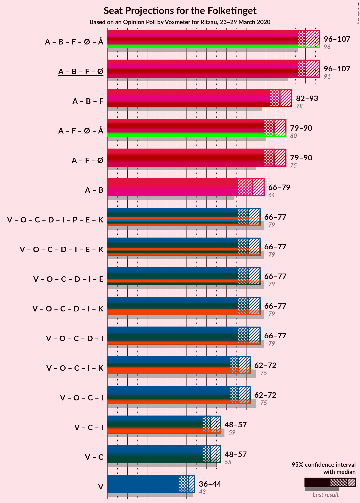

# Opinion Poll by Voxmeter for Ritzau, 23–29 March 2020

<a href="#voting-intentions">Voting Intentions</a> | <a href="#seats">Seats</a> | <a href="#coalitions">Coalitions</a> | <a href="#technical-information">Technical Information</a>

## Voting Intentions

### Confidence Intervals

| Party | Last Result | Poll Result | 80% Confidence Interval | 90% Confidence Interval | 95% Confidence Interval | 99% Confidence Interval |
|:-----:|:-----------:|:-----------:|:-----------------------:|:-----------------------:|:-----------------------:|:-----------------------:|
| Socialdemokraterne | 25.9% | 31.5% | 29.7–33.3% |29.2–33.9% |28.7–34.3% |27.9–35.2% |
| Venstre | 23.4% | 22.2% | 20.7–23.9% |20.2–24.4% |19.8–24.8% |19.1–25.7% |
| Radikale Venstre | 8.6% | 9.2% | 8.2–10.5% |7.9–10.8% |7.7–11.1% |7.2–11.8% |
| Dansk Folkeparti | 8.7% | 8.1% | 7.1–9.3% |6.9–9.6% |6.6–9.9% |6.2–10.5% |
| Socialistisk Folkeparti | 7.7% | 7.8% | 6.9–9.0% |6.6–9.3% |6.4–9.6% |5.9–10.2% |
| Enhedslisten–De Rød-Grønne | 6.9% | 7.4% | 6.4–8.5% |6.2–8.8% |6.0–9.1% |5.5–9.7% |
| Det Konservative Folkeparti | 6.6% | 6.3% | 5.4–7.3% |5.2–7.6% |5.0–7.9% |4.6–8.4% |
| Nye Borgerlige | 2.4% | 2.5% | 2.0–3.3% |1.9–3.5% |1.7–3.7% |1.5–4.0% |
| Liberal Alliance | 2.3% | 1.5% | 1.1–2.1% |1.0–2.3% |0.9–2.4% |0.8–2.7% |
| Stram Kurs | 1.8% | 1.0% | 0.7–1.6% |0.6–1.7% |0.6–1.8% |0.5–2.1% |
| Alternativet | 3.0% | 0.6% | 0.4–1.0% |0.3–1.1% |0.3–1.2% |0.2–1.5% |

*Note:* The poll result column reflects the actual value used in the calculations. Published results may vary slightly, and in addition be rounded to fewer digits.

## Seats

### Confidence Intervals

| Party | Last Result | Median | 80% Confidence Interval | 90% Confidence Interval | 95% Confidence Interval | 99% Confidence Interval |
|:-----:|:-----------:|:------:|:-----------------------:|:-----------------------:|:-----------------------:|:-----------------------:|
| <a href="#socialdemokraterne">Socialdemokraterne</a> | 48 | 57 | 54–59 |53–59 |51–59 |50–60 |
| <a href="#venstre">Venstre</a> | 43 | 41 | 37–42 |34–42 |34–43 |34–43 |
| <a href="#radikale-venstre">Radikale Venstre</a> | 16 | 16 | 14–19 |14–19 |14–19 |13–19 |
| <a href="#dansk-folkeparti">Dansk Folkeparti</a> | 16 | 13 | 13–16 |13–17 |11–17 |11–19 |
| <a href="#socialistisk-folkeparti">Socialistisk Folkeparti</a> | 14 | 16 | 12–16 |12–16 |12–16 |11–18 |
| <a href="#enhedslisten–de-rød-grønne">Enhedslisten–De Rød-Grønne</a> | 13 | 14 | 12–15 |12–16 |10–16 |10–18 |
| <a href="#det-konservative-folkeparti">Det Konservative Folkeparti</a> | 12 | 11 | 10–13 |9–13 |9–14 |8–16 |
| <a href="#nye-borgerlige">Nye Borgerlige</a> | 4 | 5 | 5–6 |4–6 |0–6 |0–7 |
| <a href="#liberal-alliance">Liberal Alliance</a> | 4 | 0 | 0–4 |0–5 |0–5 |0–5 |
| <a href="#stram-kurs">Stram Kurs</a> | 0 | 0 | 0 |0 |0 |0–4 |
| <a href="#alternativet">Alternativet</a> | 5 | 0 | 0 |0 |0 |0 |

### Socialdemokraterne

*For a full overview of the results for this party, see the [Socialdemokraterne](party-socialdemokraterne.html) page.*

| Number of Seats | Probability | Accumulated | Special Marks |
|:---------------:|:-----------:|:-----------:|:-------------:|
| 47 | 0.3% | 100% |  |
| 48 | 0% | 99.7% | Last Result |
| 49 | 0.1% | 99.7% |  |
| 50 | 2% | 99.6% |  |
| 51 | 0.3% | 98% |  |
| 52 | 0.4% | 97% |  |
| 53 | 3% | 97% |  |
| 54 | 5% | 94% |  |
| 55 | 1.0% | 89% |  |
| 56 | 16% | 88% |  |
| 57 | 57% | 72% | Median |
| 58 | 2% | 15% |  |
| 59 | 11% | 12% |  |
| 60 | 1.0% | 1.3% |  |
| 61 | 0.1% | 0.3% |  |
| 62 | 0.1% | 0.2% |  |
| 63 | 0% | 0.1% |  |
| 64 | 0% | 0.1% |  |
| 65 | 0% | 0% |  |

### Venstre

*For a full overview of the results for this party, see the [Venstre](party-venstre.html) page.*

| Number of Seats | Probability | Accumulated | Special Marks |
|:---------------:|:-----------:|:-----------:|:-------------:|
| 34 | 7% | 100% |  |
| 35 | 1.0% | 93% |  |
| 36 | 1.3% | 92% |  |
| 37 | 4% | 91% |  |
| 38 | 4% | 87% |  |
| 39 | 11% | 84% |  |
| 40 | 4% | 72% |  |
| 41 | 40% | 68% | Median |
| 42 | 25% | 28% |  |
| 43 | 3% | 3% | Last Result |
| 44 | 0.1% | 0.5% |  |
| 45 | 0.3% | 0.4% |  |
| 46 | 0% | 0.2% |  |
| 47 | 0.1% | 0.2% |  |
| 48 | 0% | 0.1% |  |
| 49 | 0% | 0.1% |  |
| 50 | 0% | 0.1% |  |
| 51 | 0% | 0% |  |

### Radikale Venstre

*For a full overview of the results for this party, see the [Radikale Venstre](party-radikalevenstre.html) page.*

| Number of Seats | Probability | Accumulated | Special Marks |
|:---------------:|:-----------:|:-----------:|:-------------:|
| 12 | 0.1% | 100% |  |
| 13 | 2% | 99.9% |  |
| 14 | 41% | 98% |  |
| 15 | 1.2% | 57% |  |
| 16 | 11% | 56% | Last Result, Median |
| 17 | 11% | 45% |  |
| 18 | 6% | 34% |  |
| 19 | 27% | 28% |  |
| 20 | 0.2% | 0.4% |  |
| 21 | 0.1% | 0.2% |  |
| 22 | 0.1% | 0.2% |  |
| 23 | 0% | 0% |  |

### Dansk Folkeparti

*For a full overview of the results for this party, see the [Dansk Folkeparti](party-danskfolkeparti.html) page.*

| Number of Seats | Probability | Accumulated | Special Marks |
|:---------------:|:-----------:|:-----------:|:-------------:|
| 10 | 0.5% | 100% |  |
| 11 | 3% | 99.5% |  |
| 12 | 0.2% | 97% |  |
| 13 | 57% | 97% | Median |
| 14 | 7% | 39% |  |
| 15 | 19% | 32% |  |
| 16 | 3% | 13% | Last Result |
| 17 | 8% | 10% |  |
| 18 | 1.3% | 2% |  |
| 19 | 0.2% | 0.5% |  |
| 20 | 0.3% | 0.3% |  |
| 21 | 0% | 0% |  |

### Socialistisk Folkeparti

*For a full overview of the results for this party, see the [Socialistisk Folkeparti](party-socialistiskfolkeparti.html) page.*

| Number of Seats | Probability | Accumulated | Special Marks |
|:---------------:|:-----------:|:-----------:|:-------------:|
| 10 | 0% | 100% |  |
| 11 | 2% | 99.9% |  |
| 12 | 19% | 98% |  |
| 13 | 1.2% | 79% |  |
| 14 | 11% | 77% | Last Result |
| 15 | 11% | 67% |  |
| 16 | 55% | 56% | Median |
| 17 | 0.6% | 1.2% |  |
| 18 | 0.5% | 0.5% |  |
| 19 | 0% | 0% |  |

### Enhedslisten–De Rød-Grønne

*For a full overview of the results for this party, see the [Enhedslisten–De Rød-Grønne](party-enhedslisten–derød-grønne.html) page.*

| Number of Seats | Probability | Accumulated | Special Marks |
|:---------------:|:-----------:|:-----------:|:-------------:|
| 10 | 3% | 100% |  |
| 11 | 0.8% | 97% |  |
| 12 | 12% | 97% |  |
| 13 | 12% | 84% | Last Result |
| 14 | 42% | 72% | Median |
| 15 | 25% | 30% |  |
| 16 | 4% | 5% |  |
| 17 | 0.2% | 1.4% |  |
| 18 | 1.1% | 1.2% |  |
| 19 | 0.1% | 0.1% |  |
| 20 | 0% | 0% |  |

### Det Konservative Folkeparti

*For a full overview of the results for this party, see the [Det Konservative Folkeparti](party-detkonservativefolkeparti.html) page.*

| Number of Seats | Probability | Accumulated | Special Marks |
|:---------------:|:-----------:|:-----------:|:-------------:|
| 8 | 1.1% | 100% |  |
| 9 | 6% | 98.9% |  |
| 10 | 38% | 93% |  |
| 11 | 11% | 55% | Median |
| 12 | 29% | 44% | Last Result |
| 13 | 12% | 16% |  |
| 14 | 2% | 3% |  |
| 15 | 0.2% | 0.8% |  |
| 16 | 0.4% | 0.5% |  |
| 17 | 0.1% | 0.1% |  |
| 18 | 0% | 0% |  |

### Nye Borgerlige

*For a full overview of the results for this party, see the [Nye Borgerlige](party-nyeborgerlige.html) page.*

| Number of Seats | Probability | Accumulated | Special Marks |
|:---------------:|:-----------:|:-----------:|:-------------:|
| 0 | 4% | 100% |  |
| 1 | 0% | 96% |  |
| 2 | 0% | 96% |  |
| 3 | 0% | 96% |  |
| 4 | 5% | 96% | Last Result |
| 5 | 46% | 91% | Median |
| 6 | 44% | 45% |  |
| 7 | 0.5% | 0.7% |  |
| 8 | 0.1% | 0.2% |  |
| 9 | 0.2% | 0.2% |  |
| 10 | 0% | 0% |  |

### Liberal Alliance

*For a full overview of the results for this party, see the [Liberal Alliance](party-liberalalliance.html) page.*

| Number of Seats | Probability | Accumulated | Special Marks |
|:---------------:|:-----------:|:-----------:|:-------------:|
| 0 | 86% | 100% | Median |
| 1 | 0% | 14% |  |
| 2 | 0% | 14% |  |
| 3 | 0% | 14% |  |
| 4 | 6% | 14% | Last Result |
| 5 | 9% | 9% |  |
| 6 | 0% | 0% |  |

### Stram Kurs

*For a full overview of the results for this party, see the [Stram Kurs](party-stramkurs.html) page.*

| Number of Seats | Probability | Accumulated | Special Marks |
|:---------------:|:-----------:|:-----------:|:-------------:|
| 0 | 98.8% | 100% | Last Result, Median |
| 1 | 0% | 1.2% |  |
| 2 | 0% | 1.2% |  |
| 3 | 0% | 1.2% |  |
| 4 | 0.8% | 1.2% |  |
| 5 | 0.4% | 0.4% |  |
| 6 | 0% | 0% |  |

### Alternativet

*For a full overview of the results for this party, see the [Alternativet](party-alternativet.html) page.*

| Number of Seats | Probability | Accumulated | Special Marks |
|:---------------:|:-----------:|:-----------:|:-------------:|
| 0 | 100% | 100% | Median |
| 1 | 0% | 0% |  |
| 2 | 0% | 0% |  |
| 3 | 0% | 0% |  |
| 4 | 0% | 0% |  |
| 5 | 0% | 0% | Last Result |

## Coalitions

### Confidence Intervals

| Coalition | Last Result | Median | Majority? | 80% Confidence Interval | 90% Confidence Interval | 95% Confidence Interval | 99% Confidence Interval |
|:---------:|:-----------:|:------:|:---------:|:-----------------------:|:-----------------------:|:-----------------------:|:-----------------------:|
| Socialdemokraterne – Radikale Venstre – Socialistisk Folkeparti – Enhedslisten–De Rød-Grønne – Alternativet | 96 | 101 | 100% | 99–104 | 97–104 | 96–105 | 94–109 |
| Socialdemokraterne – Radikale Venstre – Socialistisk Folkeparti – Enhedslisten–De Rød-Grønne | 91 | 101 | 100% | 99–104 | 97–104 | 96–105 | 94–109 |
| Socialdemokraterne – Radikale Venstre – Socialistisk Folkeparti | 78 | 87 | 15% | 86–91 | 84–91 | 84–91 | 81–95 |
| Socialdemokraterne – Socialistisk Folkeparti – Enhedslisten–De Rød-Grønne – Alternativet | 80 | 86 | 4% | 82–88 | 79–88 | 79–90 | 78–92 |
| Socialdemokraterne – Socialistisk Folkeparti – Enhedslisten–De Rød-Grønne | 75 | 86 | 4% | 82–88 | 79–88 | 79–90 | 78–92 |
| Socialdemokraterne – Radikale Venstre | 64 | 72 | 0% | 71–76 | 70–76 | 69–76 | 67–78 |
| Venstre – Dansk Folkeparti – Det Konservative Folkeparti – Nye Borgerlige – Liberal Alliance | 79 | 70 | 0% | 67–76 | 67–76 | 65–76 | 65–78 |
| Venstre – Dansk Folkeparti – Det Konservative Folkeparti – Liberal Alliance | 75 | 65 | 0% | 62–71 | 62–71 | 62–71 | 61–74 |
| Venstre – Det Konservative Folkeparti – Liberal Alliance | 59 | 51 | 0% | 48–56 | 47–56 | 47–57 | 46–57 |
| Venstre – Det Konservative Folkeparti | 55 | 51 | 0% | 47–54 | 47–55 | 47–55 | 46–57 |
| Venstre | 43 | 41 | 0% | 37–42 | 34–42 | 34–43 | 34–43 |

### Socialdemokraterne – Radikale Venstre – Socialistisk Folkeparti – Enhedslisten–De Rød-Grønne – Alternativet

| Number of Seats | Probability | Accumulated | Special Marks |
|:---------------:|:-----------:|:-----------:|:-------------:|
| 93 | 0.1% | 100% |  |
| 94 | 0.5% | 99.9% |  |
| 95 | 0.3% | 99.4% |  |
| 96 | 3% | 99.1% | Last Result |
| 97 | 3% | 96% |  |
| 98 | 1.4% | 93% |  |
| 99 | 10% | 92% |  |
| 100 | 3% | 82% |  |
| 101 | 38% | 79% |  |
| 102 | 0.4% | 41% |  |
| 103 | 26% | 41% | Median |
| 104 | 11% | 16% |  |
| 105 | 3% | 5% |  |
| 106 | 0.3% | 1.5% |  |
| 107 | 0.6% | 1.2% |  |
| 108 | 0.1% | 0.7% |  |
| 109 | 0.5% | 0.5% |  |
| 110 | 0.1% | 0.1% |  |
| 111 | 0% | 0% |  |

### Socialdemokraterne – Radikale Venstre – Socialistisk Folkeparti – Enhedslisten–De Rød-Grønne

| Number of Seats | Probability | Accumulated | Special Marks |
|:---------------:|:-----------:|:-----------:|:-------------:|
| 91 | 0% | 100% | Last Result |
| 92 | 0% | 100% |  |
| 93 | 0.1% | 100% |  |
| 94 | 0.5% | 99.9% |  |
| 95 | 0.3% | 99.4% |  |
| 96 | 3% | 99.1% |  |
| 97 | 3% | 96% |  |
| 98 | 1.4% | 93% |  |
| 99 | 10% | 92% |  |
| 100 | 3% | 82% |  |
| 101 | 38% | 79% |  |
| 102 | 0.4% | 41% |  |
| 103 | 26% | 41% | Median |
| 104 | 11% | 16% |  |
| 105 | 3% | 5% |  |
| 106 | 0.3% | 1.5% |  |
| 107 | 0.6% | 1.2% |  |
| 108 | 0.1% | 0.7% |  |
| 109 | 0.5% | 0.5% |  |
| 110 | 0.1% | 0.1% |  |
| 111 | 0% | 0% |  |

### Socialdemokraterne – Radikale Venstre – Socialistisk Folkeparti

| Number of Seats | Probability | Accumulated | Special Marks |
|:---------------:|:-----------:|:-----------:|:-------------:|
| 78 | 0% | 100% | Last Result |
| 79 | 0% | 100% |  |
| 80 | 0.3% | 99.9% |  |
| 81 | 0.5% | 99.7% |  |
| 82 | 1.1% | 99.1% |  |
| 83 | 0.3% | 98% |  |
| 84 | 3% | 98% |  |
| 85 | 2% | 95% |  |
| 86 | 5% | 93% |  |
| 87 | 45% | 87% |  |
| 88 | 24% | 42% |  |
| 89 | 3% | 18% | Median |
| 90 | 4% | 15% | Majority |
| 91 | 10% | 11% |  |
| 92 | 0.2% | 1.4% |  |
| 93 | 0.1% | 1.1% |  |
| 94 | 0.5% | 1.1% |  |
| 95 | 0.5% | 0.6% |  |
| 96 | 0% | 0.1% |  |
| 97 | 0% | 0.1% |  |
| 98 | 0.1% | 0.1% |  |
| 99 | 0% | 0% |  |

### Socialdemokraterne – Socialistisk Folkeparti – Enhedslisten–De Rød-Grønne – Alternativet

| Number of Seats | Probability | Accumulated | Special Marks |
|:---------------:|:-----------:|:-----------:|:-------------:|
| 74 | 0.1% | 100% |  |
| 75 | 0.1% | 99.9% |  |
| 76 | 0% | 99.8% |  |
| 77 | 0.1% | 99.8% |  |
| 78 | 2% | 99.7% |  |
| 79 | 3% | 98% |  |
| 80 | 0.2% | 95% | Last Result |
| 81 | 1.0% | 94% |  |
| 82 | 9% | 93% |  |
| 83 | 2% | 84% |  |
| 84 | 22% | 82% |  |
| 85 | 6% | 59% |  |
| 86 | 4% | 53% |  |
| 87 | 37% | 49% | Median |
| 88 | 8% | 12% |  |
| 89 | 0.1% | 4% |  |
| 90 | 3% | 4% | Majority |
| 91 | 0.1% | 0.8% |  |
| 92 | 0.5% | 0.7% |  |
| 93 | 0.2% | 0.2% |  |
| 94 | 0% | 0% |  |

### Socialdemokraterne – Socialistisk Folkeparti – Enhedslisten–De Rød-Grønne

| Number of Seats | Probability | Accumulated | Special Marks |
|:---------------:|:-----------:|:-----------:|:-------------:|
| 74 | 0.1% | 100% |  |
| 75 | 0.1% | 99.9% | Last Result |
| 76 | 0% | 99.8% |  |
| 77 | 0.1% | 99.8% |  |
| 78 | 2% | 99.7% |  |
| 79 | 3% | 98% |  |
| 80 | 0.2% | 95% |  |
| 81 | 1.0% | 94% |  |
| 82 | 9% | 93% |  |
| 83 | 2% | 84% |  |
| 84 | 22% | 82% |  |
| 85 | 6% | 59% |  |
| 86 | 4% | 53% |  |
| 87 | 37% | 49% | Median |
| 88 | 8% | 12% |  |
| 89 | 0.1% | 4% |  |
| 90 | 3% | 4% | Majority |
| 91 | 0.1% | 0.8% |  |
| 92 | 0.5% | 0.7% |  |
| 93 | 0.2% | 0.2% |  |
| 94 | 0% | 0% |  |

### Socialdemokraterne – Radikale Venstre

| Number of Seats | Probability | Accumulated | Special Marks |
|:---------------:|:-----------:|:-----------:|:-------------:|
| 64 | 0% | 100% | Last Result |
| 65 | 0.3% | 100% |  |
| 66 | 0.2% | 99.7% |  |
| 67 | 0.4% | 99.5% |  |
| 68 | 1.0% | 99.1% |  |
| 69 | 1.3% | 98% |  |
| 70 | 7% | 97% |  |
| 71 | 38% | 90% |  |
| 72 | 3% | 53% |  |
| 73 | 12% | 49% | Median |
| 74 | 3% | 37% |  |
| 75 | 13% | 34% |  |
| 76 | 19% | 21% |  |
| 77 | 1.0% | 2% |  |
| 78 | 1.0% | 1.2% |  |
| 79 | 0.1% | 0.2% |  |
| 80 | 0% | 0.1% |  |
| 81 | 0% | 0.1% |  |
| 82 | 0% | 0.1% |  |
| 83 | 0% | 0% |  |

### Venstre – Dansk Folkeparti – Det Konservative Folkeparti – Nye Borgerlige – Liberal Alliance

| Number of Seats | Probability | Accumulated | Special Marks |
|:---------------:|:-----------:|:-----------:|:-------------:|
| 61 | 0.1% | 100% |  |
| 62 | 0% | 99.9% |  |
| 63 | 0% | 99.9% |  |
| 64 | 0% | 99.9% |  |
| 65 | 3% | 99.8% |  |
| 66 | 0.6% | 97% |  |
| 67 | 10% | 96% |  |
| 68 | 0.6% | 86% |  |
| 69 | 0.6% | 86% |  |
| 70 | 38% | 85% | Median |
| 71 | 5% | 47% |  |
| 72 | 24% | 42% |  |
| 73 | 0.4% | 18% |  |
| 74 | 2% | 18% |  |
| 75 | 4% | 16% |  |
| 76 | 11% | 12% |  |
| 77 | 0.2% | 2% |  |
| 78 | 1.3% | 1.4% |  |
| 79 | 0% | 0.1% | Last Result |
| 80 | 0.1% | 0.1% |  |
| 81 | 0% | 0% |  |

### Venstre – Dansk Folkeparti – Det Konservative Folkeparti – Liberal Alliance

| Number of Seats | Probability | Accumulated | Special Marks |
|:---------------:|:-----------:|:-----------:|:-------------:|
| 59 | 0% | 100% |  |
| 60 | 0.2% | 99.9% |  |
| 61 | 0.6% | 99.8% |  |
| 62 | 10% | 99.2% |  |
| 63 | 0.6% | 89% |  |
| 64 | 37% | 89% |  |
| 65 | 7% | 51% | Median |
| 66 | 4% | 44% |  |
| 67 | 22% | 40% |  |
| 68 | 0.1% | 18% |  |
| 69 | 0.4% | 18% |  |
| 70 | 4% | 18% |  |
| 71 | 11% | 13% |  |
| 72 | 0.5% | 2% |  |
| 73 | 0.2% | 2% |  |
| 74 | 1.3% | 1.4% |  |
| 75 | 0% | 0.1% | Last Result |
| 76 | 0% | 0.1% |  |
| 77 | 0% | 0.1% |  |
| 78 | 0.1% | 0.1% |  |
| 79 | 0% | 0% |  |

### Venstre – Det Konservative Folkeparti – Liberal Alliance

| Number of Seats | Probability | Accumulated | Special Marks |
|:---------------:|:-----------:|:-----------:|:-------------:|
| 45 | 0.2% | 100% |  |
| 46 | 0.7% | 99.8% |  |
| 47 | 7% | 99.2% |  |
| 48 | 7% | 92% |  |
| 49 | 0.3% | 85% |  |
| 50 | 1.1% | 85% |  |
| 51 | 44% | 84% |  |
| 52 | 0.4% | 40% | Median |
| 53 | 0.8% | 40% |  |
| 54 | 22% | 39% |  |
| 55 | 6% | 17% |  |
| 56 | 8% | 11% |  |
| 57 | 3% | 3% |  |
| 58 | 0.1% | 0.3% |  |
| 59 | 0% | 0.2% | Last Result |
| 60 | 0% | 0.2% |  |
| 61 | 0.1% | 0.1% |  |
| 62 | 0% | 0% |  |

### Venstre – Det Konservative Folkeparti

| Number of Seats | Probability | Accumulated | Special Marks |
|:---------------:|:-----------:|:-----------:|:-------------:|
| 44 | 0.2% | 100% |  |
| 45 | 0.2% | 99.8% |  |
| 46 | 0.7% | 99.6% |  |
| 47 | 10% | 98.9% |  |
| 48 | 7% | 89% |  |
| 49 | 0.3% | 82% |  |
| 50 | 1.3% | 81% |  |
| 51 | 48% | 80% |  |
| 52 | 1.0% | 32% | Median |
| 53 | 3% | 31% |  |
| 54 | 22% | 28% |  |
| 55 | 6% | 7% | Last Result |
| 56 | 0.5% | 1.1% |  |
| 57 | 0.3% | 0.6% |  |
| 58 | 0.1% | 0.3% |  |
| 59 | 0% | 0.2% |  |
| 60 | 0% | 0.2% |  |
| 61 | 0.1% | 0.1% |  |
| 62 | 0% | 0% |  |

### Venstre

| Number of Seats | Probability | Accumulated | Special Marks |
|:---------------:|:-----------:|:-----------:|:-------------:|
| 34 | 7% | 100% |  |
| 35 | 1.0% | 93% |  |
| 36 | 1.3% | 92% |  |
| 37 | 4% | 91% |  |
| 38 | 4% | 87% |  |
| 39 | 11% | 84% |  |
| 40 | 4% | 72% |  |
| 41 | 40% | 68% | Median |
| 42 | 25% | 28% |  |
| 43 | 3% | 3% | Last Result |
| 44 | 0.1% | 0.5% |  |
| 45 | 0.3% | 0.4% |  |
| 46 | 0% | 0.2% |  |
| 47 | 0.1% | 0.2% |  |
| 48 | 0% | 0.1% |  |
| 49 | 0% | 0.1% |  |
| 50 | 0% | 0.1% |  |
| 51 | 0% | 0% |  |

## Technical Information

### Opinion Poll

+ **Polling firm:** Voxmeter
+ **Commissioner(s):** Ritzau
+ **Fieldwork period:** 23–29 March 2020

### Calculations

+ **Sample size:** 1071
+ **Simulations done:** 65,536
+ **Error estimate:** 2.36%

