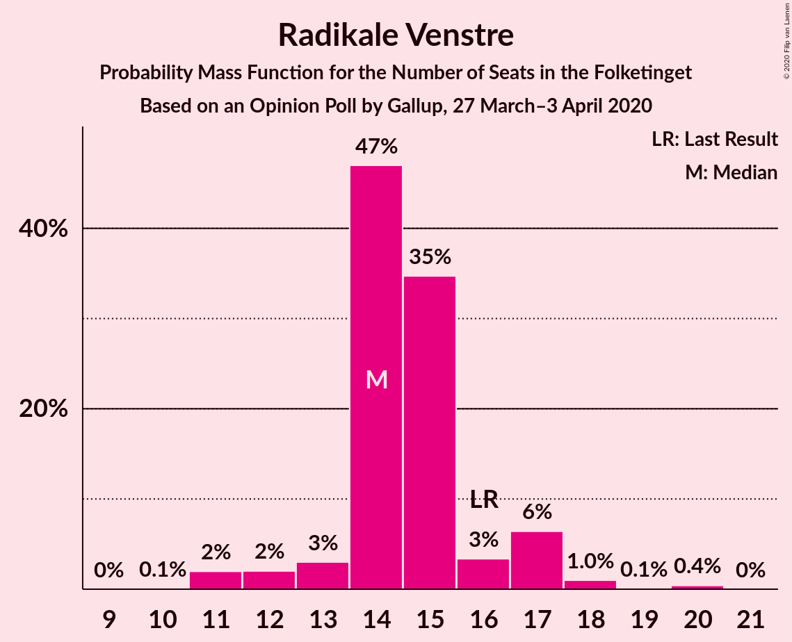
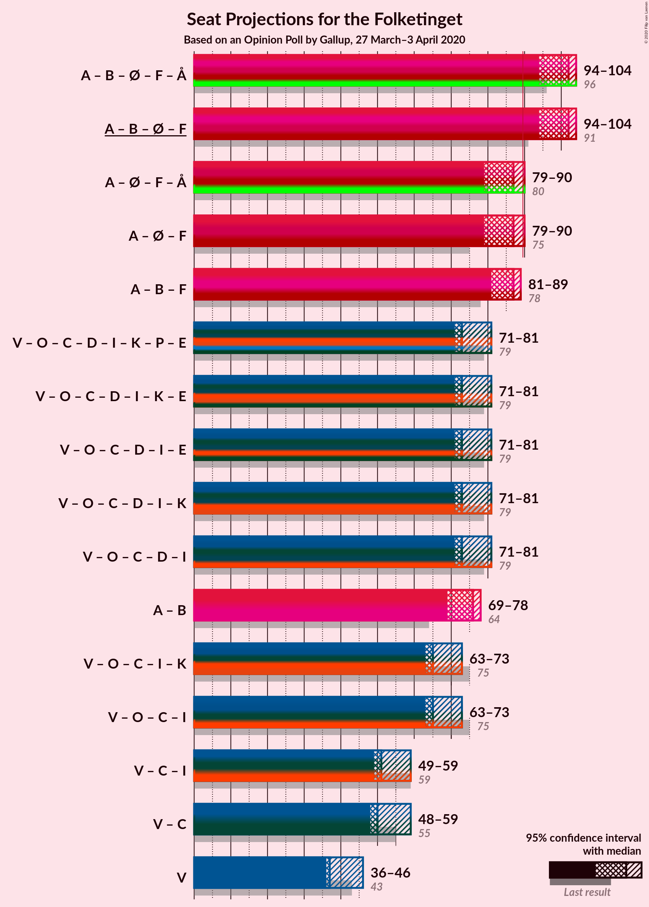
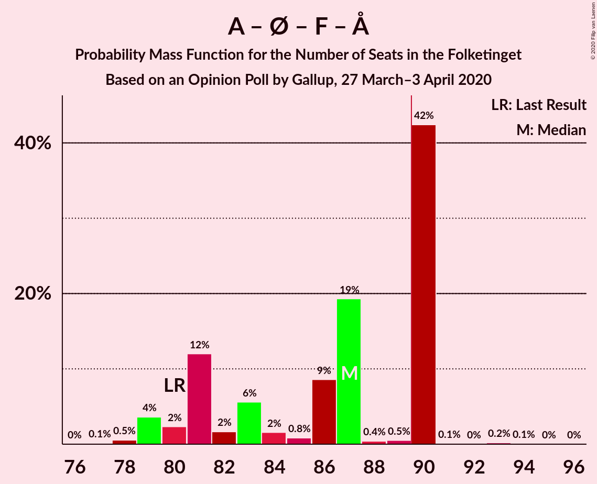
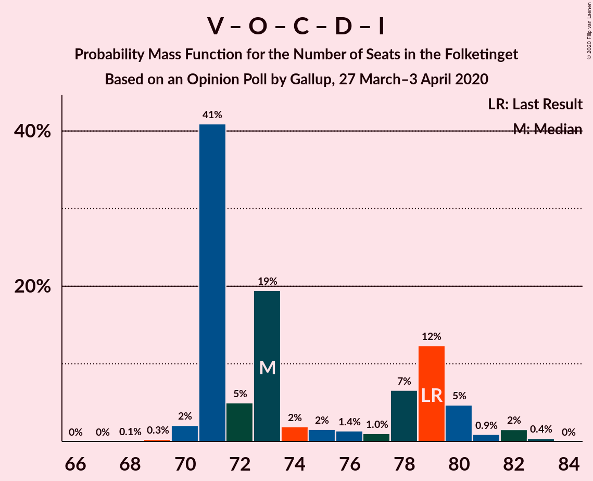
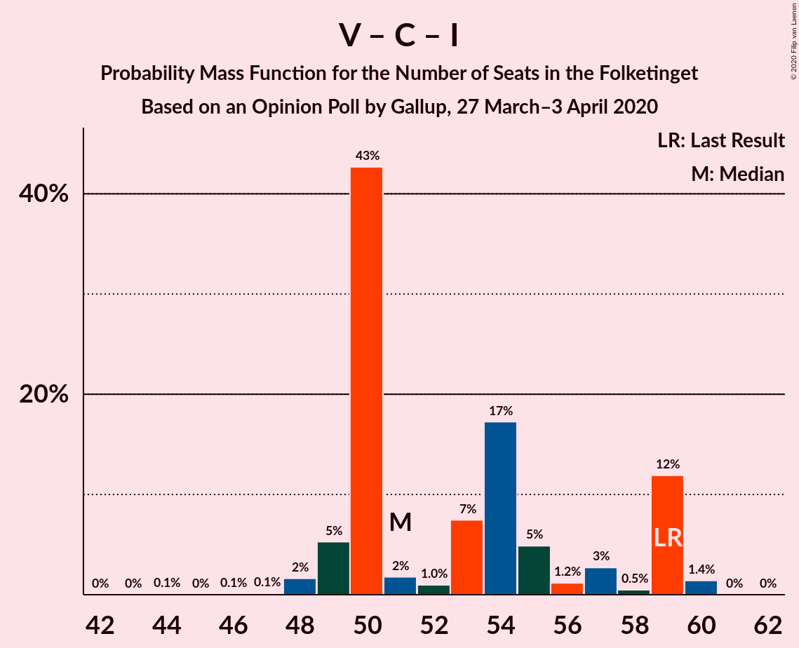

# Opinion Poll by Gallup, 27 March–3 April 2020

<a href="#voting-intentions">Voting Intentions</a> | <a href="#seats">Seats</a> | <a href="#coalitions">Coalitions</a> | <a href="#technical-information">Technical Information</a>

## Voting Intentions

### Confidence Intervals

| Party | Last Result | Poll Result | 80% Confidence Interval | 90% Confidence Interval | 95% Confidence Interval | 99% Confidence Interval |
|:-----:|:-----------:|:-----------:|:-----------------------:|:-----------------------:|:-----------------------:|:-----------------------:|
| Socialdemokraterne | 25.9% | 31.9% | 30.4–33.5% |30.0–33.9% |29.6–34.3% |28.9–35.1% |
| Venstre | 23.4% | 21.9% | 20.5–23.3% |20.2–23.7% |19.8–24.0% |19.2–24.7% |
| Dansk Folkeparti | 8.7% | 8.1% | 7.3–9.1% |7.0–9.3% |6.8–9.6% |6.4–10.1% |
| Radikale Venstre | 8.6% | 8.0% | 7.1–8.9% |6.9–9.2% |6.7–9.4% |6.3–9.9% |
| Enhedslisten–De Rød-Grønne | 6.9% | 7.5% | 6.7–8.4% |6.5–8.7% |6.3–8.9% |5.9–9.4% |
| Socialistisk Folkeparti | 7.7% | 6.9% | 6.1–7.8% |5.9–8.1% |5.7–8.3% |5.4–8.8% |
| Det Konservative Folkeparti | 6.6% | 6.9% | 6.1–7.8% |5.9–8.1% |5.7–8.3% |5.4–8.8% |
| Nye Borgerlige | 2.4% | 4.1% | 3.5–4.8% |3.3–5.0% |3.2–5.2% |2.9–5.6% |
| Liberal Alliance | 2.3% | 1.5% | 1.2–2.0% |1.1–2.1% |1.0–2.3% |0.9–2.5% |
| Kristendemokraterne | 1.7% | 1.2% | 0.9–1.6% |0.8–1.8% |0.7–1.9% |0.6–2.1% |
| Stram Kurs | 1.8% | 0.9% | 0.7–1.3% |0.6–1.4% |0.5–1.6% |0.4–1.8% |
| Alternativet | 3.0% | 0.8% | 0.6–1.2% |0.5–1.3% |0.4–1.4% |0.4–1.6% |
| Klaus Riskær Pedersen | 0.8% | 0.3% | 0.2–0.6% |0.2–0.7% |0.1–0.8% |0.1–0.9% |

*Note:* The poll result column reflects the actual value used in the calculations. Published results may vary slightly, and in addition be rounded to fewer digits.

## Seats

### Confidence Intervals

| Party | Last Result | Median | 80% Confidence Interval | 90% Confidence Interval | 95% Confidence Interval | 99% Confidence Interval |
|:-----:|:-----------:|:------:|:-----------------------:|:-----------------------:|:-----------------------:|:-----------------------:|
| <a href="#socialdemokraterne">Socialdemokraterne</a> | 48 | 61 | 56–62 |55–62 |54–63 |54–65 |
| <a href="#venstre">Venstre</a> | 43 | 37 | 36–46 |36–46 |36–46 |35–46 |
| <a href="#dansk-folkeparti">Dansk Folkeparti</a> | 16 | 14 | 13–16 |13–17 |13–17 |12–19 |
| <a href="#radikale-venstre">Radikale Venstre</a> | 16 | 14 | 14–16 |13–17 |12–17 |11–18 |
| <a href="#enhedslisten–de-rød-grønne">Enhedslisten–De Rød-Grønne</a> | 13 | 15 | 11–16 |11–16 |11–16 |11–17 |
| <a href="#socialistisk-folkeparti">Socialistisk Folkeparti</a> | 14 | 12 | 11–14 |11–15 |10–15 |10–15 |
| <a href="#det-konservative-folkeparti">Det Konservative Folkeparti</a> | 12 | 14 | 12–14 |11–15 |11–16 |10–16 |
| <a href="#nye-borgerlige">Nye Borgerlige</a> | 4 | 7 | 6–8 |6–8 |6–9 |6–10 |
| <a href="#liberal-alliance">Liberal Alliance</a> | 4 | 0 | 0 |0–4 |0–4 |0–5 |
| <a href="#kristendemokraterne">Kristendemokraterne</a> | 0 | 0 | 0 |0 |0 |0 |
| <a href="#stram-kurs">Stram Kurs</a> | 0 | 0 | 0 |0 |0 |0 |
| <a href="#alternativet">Alternativet</a> | 5 | 0 | 0 |0 |0 |0 |
| <a href="#klaus-riskær-pedersen">Klaus Riskær Pedersen</a> | 0 | 0 | 0 |0 |0 |0 |

### Socialdemokraterne

*For a full overview of the results for this party, see the [Socialdemokraterne](party-socialdemokraterne.html) page.*

| Number of Seats | Probability | Accumulated | Special Marks |
|:---------------:|:-----------:|:-----------:|:-------------:|
| 48 | 0% | 100% | Last Result |
| 49 | 0% | 100% |  |
| 50 | 0.1% | 100% |  |
| 51 | 0% | 99.9% |  |
| 52 | 0.1% | 99.9% |  |
| 53 | 0.2% | 99.8% |  |
| 54 | 2% | 99.6% |  |
| 55 | 6% | 97% |  |
| 56 | 5% | 92% |  |
| 57 | 2% | 87% |  |
| 58 | 2% | 84% |  |
| 59 | 18% | 83% |  |
| 60 | 5% | 65% |  |
| 61 | 16% | 60% | Median |
| 62 | 40% | 44% |  |
| 63 | 2% | 4% |  |
| 64 | 0% | 2% |  |
| 65 | 1.5% | 2% |  |
| 66 | 0.2% | 0.2% |  |
| 67 | 0% | 0% |  |

### Venstre

*For a full overview of the results for this party, see the [Venstre](party-venstre.html) page.*

| Number of Seats | Probability | Accumulated | Special Marks |
|:---------------:|:-----------:|:-----------:|:-------------:|
| 33 | 0.1% | 100% |  |
| 34 | 0.2% | 99.9% |  |
| 35 | 0.7% | 99.7% |  |
| 36 | 46% | 99.0% |  |
| 37 | 3% | 53% | Median |
| 38 | 5% | 50% |  |
| 39 | 5% | 44% |  |
| 40 | 1.2% | 40% |  |
| 41 | 22% | 38% |  |
| 42 | 2% | 17% |  |
| 43 | 0.1% | 15% | Last Result |
| 44 | 3% | 14% |  |
| 45 | 0.4% | 12% |  |
| 46 | 11% | 11% |  |
| 47 | 0% | 0.1% |  |
| 48 | 0% | 0% |  |

### Dansk Folkeparti

*For a full overview of the results for this party, see the [Dansk Folkeparti](party-danskfolkeparti.html) page.*

| Number of Seats | Probability | Accumulated | Special Marks |
|:---------------:|:-----------:|:-----------:|:-------------:|
| 11 | 0.1% | 100% |  |
| 12 | 2% | 99.9% |  |
| 13 | 18% | 98% |  |
| 14 | 57% | 80% | Median |
| 15 | 6% | 22% |  |
| 16 | 9% | 16% | Last Result |
| 17 | 6% | 7% |  |
| 18 | 0.6% | 1.1% |  |
| 19 | 0.4% | 0.5% |  |
| 20 | 0.1% | 0.1% |  |
| 21 | 0% | 0% |  |

### Radikale Venstre

*For a full overview of the results for this party, see the [Radikale Venstre](party-radikalevenstre.html) page.*

| Number of Seats | Probability | Accumulated | Special Marks |
|:---------------:|:-----------:|:-----------:|:-------------:|
| 10 | 0.1% | 100% |  |
| 11 | 2% | 99.9% |  |
| 12 | 2% | 98% |  |
| 13 | 3% | 96% |  |
| 14 | 47% | 93% | Median |
| 15 | 35% | 46% |  |
| 16 | 3% | 11% | Last Result |
| 17 | 6% | 8% |  |
| 18 | 1.0% | 1.5% |  |
| 19 | 0.1% | 0.5% |  |
| 20 | 0.4% | 0.4% |  |
| 21 | 0% | 0% |  |

### Enhedslisten–De Rød-Grønne

*For a full overview of the results for this party, see the [Enhedslisten–De Rød-Grønne](party-enhedslisten–derød-grønne.html) page.*

| Number of Seats | Probability | Accumulated | Special Marks |
|:---------------:|:-----------:|:-----------:|:-------------:|
| 10 | 0.3% | 100% |  |
| 11 | 13% | 99.7% |  |
| 12 | 6% | 86% |  |
| 13 | 9% | 81% | Last Result |
| 14 | 4% | 72% |  |
| 15 | 20% | 68% | Median |
| 16 | 46% | 48% |  |
| 17 | 2% | 2% |  |
| 18 | 0.2% | 0.2% |  |
| 19 | 0% | 0% |  |

### Socialistisk Folkeparti

*For a full overview of the results for this party, see the [Socialistisk Folkeparti](party-socialistiskfolkeparti.html) page.*

| Number of Seats | Probability | Accumulated | Special Marks |
|:---------------:|:-----------:|:-----------:|:-------------:|
| 9 | 0.1% | 100% |  |
| 10 | 4% | 99.9% |  |
| 11 | 36% | 96% |  |
| 12 | 46% | 60% | Median |
| 13 | 3% | 14% |  |
| 14 | 6% | 11% | Last Result |
| 15 | 5% | 6% |  |
| 16 | 0.2% | 0.2% |  |
| 17 | 0% | 0% |  |

### Det Konservative Folkeparti

*For a full overview of the results for this party, see the [Det Konservative Folkeparti](party-detkonservativefolkeparti.html) page.*

| Number of Seats | Probability | Accumulated | Special Marks |
|:---------------:|:-----------:|:-----------:|:-------------:|
| 10 | 2% | 100% |  |
| 11 | 5% | 98% |  |
| 12 | 5% | 93% | Last Result |
| 13 | 36% | 88% |  |
| 14 | 44% | 52% | Median |
| 15 | 4% | 8% |  |
| 16 | 4% | 4% |  |
| 17 | 0% | 0.3% |  |
| 18 | 0.3% | 0.3% |  |
| 19 | 0% | 0% |  |

### Nye Borgerlige

*For a full overview of the results for this party, see the [Nye Borgerlige](party-nyeborgerlige.html) page.*

| Number of Seats | Probability | Accumulated | Special Marks |
|:---------------:|:-----------:|:-----------:|:-------------:|
| 4 | 0% | 100% | Last Result |
| 5 | 0.1% | 100% |  |
| 6 | 28% | 99.9% |  |
| 7 | 52% | 72% | Median |
| 8 | 15% | 20% |  |
| 9 | 3% | 4% |  |
| 10 | 1.5% | 2% |  |
| 11 | 0% | 0.2% |  |
| 12 | 0.2% | 0.2% |  |
| 13 | 0% | 0% |  |

### Liberal Alliance

*For a full overview of the results for this party, see the [Liberal Alliance](party-liberalalliance.html) page.*

| Number of Seats | Probability | Accumulated | Special Marks |
|:---------------:|:-----------:|:-----------:|:-------------:|
| 0 | 94% | 100% | Median |
| 1 | 0% | 6% |  |
| 2 | 0% | 6% |  |
| 3 | 0% | 6% |  |
| 4 | 5% | 6% | Last Result |
| 5 | 1.3% | 1.3% |  |
| 6 | 0% | 0% |  |

### Kristendemokraterne

*For a full overview of the results for this party, see the [Kristendemokraterne](party-kristendemokraterne.html) page.*

| Number of Seats | Probability | Accumulated | Special Marks |
|:---------------:|:-----------:|:-----------:|:-------------:|
| 0 | 99.8% | 100% | Last Result, Median |
| 1 | 0% | 0.2% |  |
| 2 | 0% | 0.2% |  |
| 3 | 0% | 0.2% |  |
| 4 | 0.2% | 0.2% |  |
| 5 | 0% | 0% |  |

### Stram Kurs

*For a full overview of the results for this party, see the [Stram Kurs](party-stramkurs.html) page.*

| Number of Seats | Probability | Accumulated | Special Marks |
|:---------------:|:-----------:|:-----------:|:-------------:|
| 0 | 100% | 100% | Last Result, Median |

### Alternativet

*For a full overview of the results for this party, see the [Alternativet](party-alternativet.html) page.*

| Number of Seats | Probability | Accumulated | Special Marks |
|:---------------:|:-----------:|:-----------:|:-------------:|
| 0 | 100% | 100% | Median |
| 1 | 0% | 0% |  |
| 2 | 0% | 0% |  |
| 3 | 0% | 0% |  |
| 4 | 0% | 0% |  |
| 5 | 0% | 0% | Last Result |

### Klaus Riskær Pedersen

*For a full overview of the results for this party, see the [Klaus Riskær Pedersen](party-klausriskærpedersen.html) page.*

| Number of Seats | Probability | Accumulated | Special Marks |
|:---------------:|:-----------:|:-----------:|:-------------:|
| 0 | 100% | 100% | Last Result, Median |

## Coalitions

### Confidence Intervals

| Coalition | Last Result | Median | Majority? | 80% Confidence Interval | 90% Confidence Interval | 95% Confidence Interval | 99% Confidence Interval |
|:---------:|:-----------:|:------:|:---------:|:-----------------------:|:-----------------------:|:-----------------------:|:-----------------------:|
| Socialdemokraterne – Radikale Venstre – Enhedslisten–De Rød-Grønne – Socialistisk Folkeparti – Alternativet | 96 | 102 | 100% | 96–104 | 95–104 | 94–104 | 93–105 |
| Socialdemokraterne – Radikale Venstre – Enhedslisten–De Rød-Grønne – Socialistisk Folkeparti | 91 | 102 | 100% | 96–104 | 95–104 | 94–104 | 93–105 |
| Socialdemokraterne – Enhedslisten–De Rød-Grønne – Socialistisk Folkeparti – Alternativet | 80 | 87 | 43% | 81–90 | 80–90 | 79–90 | 78–90 |
| Socialdemokraterne – Enhedslisten–De Rød-Grønne – Socialistisk Folkeparti | 75 | 87 | 43% | 81–90 | 80–90 | 79–90 | 78–90 |
| Socialdemokraterne – Radikale Venstre – Socialistisk Folkeparti | 78 | 87 | 2% | 84–88 | 82–89 | 81–89 | 79–94 |
| Venstre – Dansk Folkeparti – Det Konservative Folkeparti – Nye Borgerlige – Liberal Alliance – Kristendemokraterne – Stram Kurs – Klaus Riskær Pedersen | 79 | 73 | 0% | 71–79 | 71–80 | 71–81 | 70–82 |
| Venstre – Dansk Folkeparti – Det Konservative Folkeparti – Nye Borgerlige – Liberal Alliance – Kristendemokraterne – Klaus Riskær Pedersen | 79 | 73 | 0% | 71–79 | 71–80 | 71–81 | 70–82 |
| Venstre – Dansk Folkeparti – Det Konservative Folkeparti – Nye Borgerlige – Liberal Alliance – Klaus Riskær Pedersen | 79 | 73 | 0% | 71–79 | 71–80 | 71–81 | 70–82 |
| Venstre – Dansk Folkeparti – Det Konservative Folkeparti – Nye Borgerlige – Liberal Alliance – Kristendemokraterne | 79 | 73 | 0% | 71–79 | 71–80 | 71–81 | 70–82 |
| Venstre – Dansk Folkeparti – Det Konservative Folkeparti – Nye Borgerlige – Liberal Alliance | 79 | 73 | 0% | 71–79 | 71–80 | 71–81 | 70–82 |
| Socialdemokraterne – Radikale Venstre | 64 | 76 | 0% | 72–76 | 71–76 | 69–78 | 68–80 |
| Venstre – Dansk Folkeparti – Det Konservative Folkeparti – Liberal Alliance – Kristendemokraterne | 75 | 65 | 0% | 64–73 | 64–73 | 63–73 | 62–74 |
| Venstre – Dansk Folkeparti – Det Konservative Folkeparti – Liberal Alliance | 75 | 65 | 0% | 64–73 | 64–73 | 63–73 | 62–74 |
| Venstre – Det Konservative Folkeparti – Liberal Alliance | 59 | 51 | 0% | 50–59 | 49–59 | 49–59 | 48–60 |
| Venstre – Det Konservative Folkeparti | 55 | 50 | 0% | 50–59 | 49–59 | 48–59 | 46–60 |
| Venstre | 43 | 37 | 0% | 36–46 | 36–46 | 36–46 | 35–46 |

### Socialdemokraterne – Radikale Venstre – Enhedslisten–De Rød-Grønne – Socialistisk Folkeparti – Alternativet

| Number of Seats | Probability | Accumulated | Special Marks |
|:---------------:|:-----------:|:-----------:|:-------------:|
| 92 | 0.4% | 100% |  |
| 93 | 2% | 99.6% |  |
| 94 | 0.9% | 98% |  |
| 95 | 5% | 97% |  |
| 96 | 12% | 92% | Last Result |
| 97 | 7% | 80% |  |
| 98 | 1.0% | 73% |  |
| 99 | 1.3% | 72% |  |
| 100 | 1.5% | 71% |  |
| 101 | 2% | 70% |  |
| 102 | 19% | 68% | Median |
| 103 | 5% | 48% |  |
| 104 | 41% | 43% |  |
| 105 | 2% | 2% |  |
| 106 | 0.2% | 0.3% |  |
| 107 | 0.1% | 0.1% |  |
| 108 | 0% | 0% |  |

### Socialdemokraterne – Radikale Venstre – Enhedslisten–De Rød-Grønne – Socialistisk Folkeparti

| Number of Seats | Probability | Accumulated | Special Marks |
|:---------------:|:-----------:|:-----------:|:-------------:|
| 91 | 0% | 100% | Last Result |
| 92 | 0.4% | 100% |  |
| 93 | 2% | 99.6% |  |
| 94 | 0.9% | 98% |  |
| 95 | 5% | 97% |  |
| 96 | 12% | 92% |  |
| 97 | 7% | 80% |  |
| 98 | 1.0% | 73% |  |
| 99 | 1.3% | 72% |  |
| 100 | 1.5% | 71% |  |
| 101 | 2% | 70% |  |
| 102 | 19% | 68% | Median |
| 103 | 5% | 48% |  |
| 104 | 41% | 43% |  |
| 105 | 2% | 2% |  |
| 106 | 0.2% | 0.3% |  |
| 107 | 0.1% | 0.1% |  |
| 108 | 0% | 0% |  |

### Socialdemokraterne – Enhedslisten–De Rød-Grønne – Socialistisk Folkeparti – Alternativet

| Number of Seats | Probability | Accumulated | Special Marks |
|:---------------:|:-----------:|:-----------:|:-------------:|
| 77 | 0.1% | 100% |  |
| 78 | 0.5% | 99.8% |  |
| 79 | 4% | 99.3% |  |
| 80 | 2% | 96% | Last Result |
| 81 | 12% | 93% |  |
| 82 | 2% | 81% |  |
| 83 | 6% | 80% |  |
| 84 | 2% | 74% |  |
| 85 | 0.8% | 73% |  |
| 86 | 9% | 72% |  |
| 87 | 19% | 63% |  |
| 88 | 0.4% | 44% | Median |
| 89 | 0.5% | 43% |  |
| 90 | 42% | 43% | Majority |
| 91 | 0.1% | 0.4% |  |
| 92 | 0% | 0.3% |  |
| 93 | 0.2% | 0.3% |  |
| 94 | 0.1% | 0.1% |  |
| 95 | 0% | 0% |  |

### Socialdemokraterne – Enhedslisten–De Rød-Grønne – Socialistisk Folkeparti

| Number of Seats | Probability | Accumulated | Special Marks |
|:---------------:|:-----------:|:-----------:|:-------------:|
| 75 | 0% | 100% | Last Result |
| 76 | 0% | 100% |  |
| 77 | 0.1% | 100% |  |
| 78 | 0.5% | 99.8% |  |
| 79 | 4% | 99.3% |  |
| 80 | 2% | 96% |  |
| 81 | 12% | 93% |  |
| 82 | 2% | 81% |  |
| 83 | 6% | 80% |  |
| 84 | 2% | 74% |  |
| 85 | 0.8% | 73% |  |
| 86 | 9% | 72% |  |
| 87 | 19% | 63% |  |
| 88 | 0.4% | 44% | Median |
| 89 | 0.5% | 43% |  |
| 90 | 42% | 43% | Majority |
| 91 | 0.1% | 0.4% |  |
| 92 | 0% | 0.3% |  |
| 93 | 0.2% | 0.3% |  |
| 94 | 0.1% | 0.1% |  |
| 95 | 0% | 0% |  |

### Socialdemokraterne – Radikale Venstre – Socialistisk Folkeparti

| Number of Seats | Probability | Accumulated | Special Marks |
|:---------------:|:-----------:|:-----------:|:-------------:|
| 77 | 0% | 100% |  |
| 78 | 0% | 99.9% | Last Result |
| 79 | 2% | 99.9% |  |
| 80 | 0.5% | 98% |  |
| 81 | 0.8% | 98% |  |
| 82 | 3% | 97% |  |
| 83 | 3% | 94% |  |
| 84 | 5% | 90% |  |
| 85 | 15% | 85% |  |
| 86 | 3% | 70% |  |
| 87 | 22% | 67% | Median |
| 88 | 40% | 45% |  |
| 89 | 3% | 6% |  |
| 90 | 0.3% | 2% | Majority |
| 91 | 0.2% | 2% |  |
| 92 | 0.5% | 2% |  |
| 93 | 0% | 1.5% |  |
| 94 | 1.5% | 1.5% |  |
| 95 | 0% | 0% |  |

### Venstre – Dansk Folkeparti – Det Konservative Folkeparti – Nye Borgerlige – Liberal Alliance – Kristendemokraterne – Stram Kurs – Klaus Riskær Pedersen

| Number of Seats | Probability | Accumulated | Special Marks |
|:---------------:|:-----------:|:-----------:|:-------------:|
| 68 | 0.1% | 100% |  |
| 69 | 0.2% | 99.9% |  |
| 70 | 2% | 99.7% |  |
| 71 | 41% | 98% |  |
| 72 | 5% | 57% | Median |
| 73 | 19% | 52% |  |
| 74 | 2% | 32% |  |
| 75 | 1.5% | 30% |  |
| 76 | 1.3% | 29% |  |
| 77 | 1.0% | 28% |  |
| 78 | 7% | 27% |  |
| 79 | 12% | 20% | Last Result |
| 80 | 5% | 8% |  |
| 81 | 0.9% | 3% |  |
| 82 | 2% | 2% |  |
| 83 | 0.4% | 0.4% |  |
| 84 | 0% | 0% |  |

### Venstre – Dansk Folkeparti – Det Konservative Folkeparti – Nye Borgerlige – Liberal Alliance – Kristendemokraterne – Klaus Riskær Pedersen

| Number of Seats | Probability | Accumulated | Special Marks |
|:---------------:|:-----------:|:-----------:|:-------------:|
| 68 | 0.1% | 100% |  |
| 69 | 0.2% | 99.9% |  |
| 70 | 2% | 99.7% |  |
| 71 | 41% | 98% |  |
| 72 | 5% | 57% | Median |
| 73 | 19% | 52% |  |
| 74 | 2% | 32% |  |
| 75 | 1.5% | 30% |  |
| 76 | 1.3% | 29% |  |
| 77 | 1.0% | 28% |  |
| 78 | 7% | 27% |  |
| 79 | 12% | 20% | Last Result |
| 80 | 5% | 8% |  |
| 81 | 0.9% | 3% |  |
| 82 | 2% | 2% |  |
| 83 | 0.4% | 0.4% |  |
| 84 | 0% | 0% |  |

### Venstre – Dansk Folkeparti – Det Konservative Folkeparti – Nye Borgerlige – Liberal Alliance – Klaus Riskær Pedersen

| Number of Seats | Probability | Accumulated | Special Marks |
|:---------------:|:-----------:|:-----------:|:-------------:|
| 68 | 0.1% | 100% |  |
| 69 | 0.3% | 99.9% |  |
| 70 | 2% | 99.6% |  |
| 71 | 41% | 98% |  |
| 72 | 5% | 57% | Median |
| 73 | 19% | 52% |  |
| 74 | 2% | 32% |  |
| 75 | 2% | 30% |  |
| 76 | 1.4% | 29% |  |
| 77 | 1.0% | 27% |  |
| 78 | 7% | 26% |  |
| 79 | 12% | 20% | Last Result |
| 80 | 5% | 8% |  |
| 81 | 0.9% | 3% |  |
| 82 | 2% | 2% |  |
| 83 | 0.4% | 0.4% |  |
| 84 | 0% | 0% |  |

### Venstre – Dansk Folkeparti – Det Konservative Folkeparti – Nye Borgerlige – Liberal Alliance – Kristendemokraterne

| Number of Seats | Probability | Accumulated | Special Marks |
|:---------------:|:-----------:|:-----------:|:-------------:|
| 68 | 0.1% | 100% |  |
| 69 | 0.2% | 99.9% |  |
| 70 | 2% | 99.7% |  |
| 71 | 41% | 98% |  |
| 72 | 5% | 57% | Median |
| 73 | 19% | 52% |  |
| 74 | 2% | 32% |  |
| 75 | 1.5% | 30% |  |
| 76 | 1.3% | 29% |  |
| 77 | 1.0% | 28% |  |
| 78 | 7% | 27% |  |
| 79 | 12% | 20% | Last Result |
| 80 | 5% | 8% |  |
| 81 | 0.9% | 3% |  |
| 82 | 2% | 2% |  |
| 83 | 0.4% | 0.4% |  |
| 84 | 0% | 0% |  |

### Venstre – Dansk Folkeparti – Det Konservative Folkeparti – Nye Borgerlige – Liberal Alliance

| Number of Seats | Probability | Accumulated | Special Marks |
|:---------------:|:-----------:|:-----------:|:-------------:|
| 68 | 0.1% | 100% |  |
| 69 | 0.3% | 99.9% |  |
| 70 | 2% | 99.6% |  |
| 71 | 41% | 98% |  |
| 72 | 5% | 57% | Median |
| 73 | 19% | 52% |  |
| 74 | 2% | 32% |  |
| 75 | 2% | 30% |  |
| 76 | 1.4% | 29% |  |
| 77 | 1.0% | 27% |  |
| 78 | 7% | 26% |  |
| 79 | 12% | 20% | Last Result |
| 80 | 5% | 8% |  |
| 81 | 0.9% | 3% |  |
| 82 | 2% | 2% |  |
| 83 | 0.4% | 0.4% |  |
| 84 | 0% | 0% |  |

### Socialdemokraterne – Radikale Venstre

| Number of Seats | Probability | Accumulated | Special Marks |
|:---------------:|:-----------:|:-----------:|:-------------:|
| 64 | 0% | 100% | Last Result |
| 65 | 0% | 100% |  |
| 66 | 0% | 99.9% |  |
| 67 | 0.1% | 99.9% |  |
| 68 | 2% | 99.8% |  |
| 69 | 0.3% | 98% |  |
| 70 | 2% | 97% |  |
| 71 | 5% | 96% |  |
| 72 | 9% | 91% |  |
| 73 | 5% | 81% |  |
| 74 | 14% | 76% |  |
| 75 | 2% | 62% | Median |
| 76 | 56% | 60% |  |
| 77 | 0.3% | 4% |  |
| 78 | 2% | 4% |  |
| 79 | 0.1% | 2% |  |
| 80 | 2% | 2% |  |
| 81 | 0% | 0% |  |

### Venstre – Dansk Folkeparti – Det Konservative Folkeparti – Liberal Alliance – Kristendemokraterne

| Number of Seats | Probability | Accumulated | Special Marks |
|:---------------:|:-----------:|:-----------:|:-------------:|
| 60 | 0.1% | 100% |  |
| 61 | 0% | 99.9% |  |
| 62 | 2% | 99.9% |  |
| 63 | 0.3% | 98% |  |
| 64 | 41% | 97% |  |
| 65 | 8% | 56% | Median |
| 66 | 1.1% | 49% |  |
| 67 | 19% | 47% |  |
| 68 | 1.1% | 29% |  |
| 69 | 1.2% | 28% |  |
| 70 | 7% | 27% |  |
| 71 | 0.7% | 19% |  |
| 72 | 3% | 19% |  |
| 73 | 14% | 16% |  |
| 74 | 2% | 2% |  |
| 75 | 0% | 0.1% | Last Result |
| 76 | 0% | 0.1% |  |
| 77 | 0% | 0% |  |

### Venstre – Dansk Folkeparti – Det Konservative Folkeparti – Liberal Alliance

| Number of Seats | Probability | Accumulated | Special Marks |
|:---------------:|:-----------:|:-----------:|:-------------:|
| 60 | 0.1% | 100% |  |
| 61 | 0% | 99.9% |  |
| 62 | 2% | 99.9% |  |
| 63 | 0.3% | 98% |  |
| 64 | 41% | 97% |  |
| 65 | 8% | 56% | Median |
| 66 | 1.1% | 49% |  |
| 67 | 19% | 47% |  |
| 68 | 1.1% | 29% |  |
| 69 | 1.2% | 28% |  |
| 70 | 7% | 26% |  |
| 71 | 0.6% | 19% |  |
| 72 | 3% | 19% |  |
| 73 | 14% | 16% |  |
| 74 | 2% | 2% |  |
| 75 | 0% | 0.1% | Last Result |
| 76 | 0% | 0% |  |

### Venstre – Det Konservative Folkeparti – Liberal Alliance

| Number of Seats | Probability | Accumulated | Special Marks |
|:---------------:|:-----------:|:-----------:|:-------------:|
| 44 | 0.1% | 100% |  |
| 45 | 0% | 99.9% |  |
| 46 | 0.1% | 99.9% |  |
| 47 | 0.1% | 99.8% |  |
| 48 | 2% | 99.7% |  |
| 49 | 5% | 98% |  |
| 50 | 43% | 93% |  |
| 51 | 2% | 50% | Median |
| 52 | 1.0% | 48% |  |
| 53 | 7% | 47% |  |
| 54 | 17% | 40% |  |
| 55 | 5% | 23% |  |
| 56 | 1.2% | 18% |  |
| 57 | 3% | 17% |  |
| 58 | 0.5% | 14% |  |
| 59 | 12% | 13% | Last Result |
| 60 | 1.4% | 1.4% |  |
| 61 | 0% | 0% |  |

### Venstre – Det Konservative Folkeparti

| Number of Seats | Probability | Accumulated | Special Marks |
|:---------------:|:-----------:|:-----------:|:-------------:|
| 44 | 0.1% | 100% |  |
| 45 | 0% | 99.9% |  |
| 46 | 2% | 99.9% |  |
| 47 | 0.1% | 98% |  |
| 48 | 2% | 98% |  |
| 49 | 6% | 96% |  |
| 50 | 42% | 91% |  |
| 51 | 4% | 49% | Median |
| 52 | 0.8% | 45% |  |
| 53 | 8% | 44% |  |
| 54 | 17% | 37% |  |
| 55 | 3% | 19% | Last Result |
| 56 | 0.5% | 16% |  |
| 57 | 2% | 16% |  |
| 58 | 0.4% | 13% |  |
| 59 | 12% | 13% |  |
| 60 | 1.4% | 1.4% |  |
| 61 | 0% | 0% |  |

### Venstre

| Number of Seats | Probability | Accumulated | Special Marks |
|:---------------:|:-----------:|:-----------:|:-------------:|
| 33 | 0.1% | 100% |  |
| 34 | 0.2% | 99.9% |  |
| 35 | 0.7% | 99.7% |  |
| 36 | 46% | 99.0% |  |
| 37 | 3% | 53% | Median |
| 38 | 5% | 50% |  |
| 39 | 5% | 44% |  |
| 40 | 1.2% | 40% |  |
| 41 | 22% | 38% |  |
| 42 | 2% | 17% |  |
| 43 | 0.1% | 15% | Last Result |
| 44 | 3% | 14% |  |
| 45 | 0.4% | 12% |  |
| 46 | 11% | 11% |  |
| 47 | 0% | 0.1% |  |
| 48 | 0% | 0% |  |

## Technical Information

### Opinion Poll

+ **Polling firm:** Gallup
+ **Commissioner(s):** —
+ **Fieldwork period:** 27 March–3 April 2020

### Calculations

+ **Sample size:** 1519
+ **Simulations done:** 1,048,576
+ **Error estimate:** 2.73%

